## tasomaniac-OpenLinkWith
----
#### Metrics provided by Detekt
* Number of lines of code 4029
* Number of Kotlin files: 73
* Cyclomatic complexity: 517
* Cyclomatic complexity by thousands of lines: 251 

----
**15** features analyzed

*	<a href="#type_inference">Type Inference</a> 
*	<a href="#lambda">Lambda</a> 
*	<a href="#safe_call">Safe Call</a> 
*	<a href="#when_expr">When expression</a> 
*	<a href="#companion_object">Companion Object</a> 
*	<a href="#unsafe_call">Unsafe Call</a> 
*	<a href="#string_template">String Template</a> 
*	<a href="#func_with_default_value">Function with Default Value</a> 
*	<a href="#singleton">Singleton</a> 
*	<a href="#smart_cast">Smart Cast</a> 
*	<a href="#range_expr">Range Expression</a> 
*	<a href="#func_call_with_named_arg">Function call with Named Argument</a> 
*	<a href="#data_class">Data Class</a> 
*	<a href="#extension_function">Extension Function</a> 
*	<a href="#property_delegation">Property Delegation</a> 

### <a name="type_inference">Type Inference</a>
----
#### Functions
* **Constant Rise - Linear:** 
    * **R_Squared:** 0.83770528
* **Sudden Rise Plateau - Logarithm:** 
    * **R_Squared:** 0.70522175
* **Plateau Sudden Rise - Binary Sigmoid:** 
    * **R_Squared:** 0.57694244

**Plots** :chart_with_upwards_trend:
-----

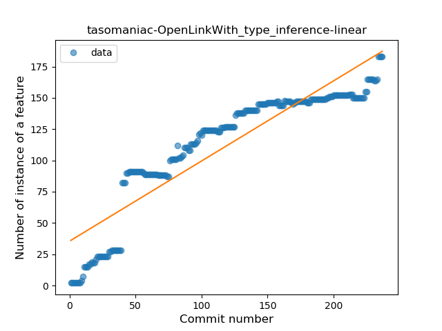
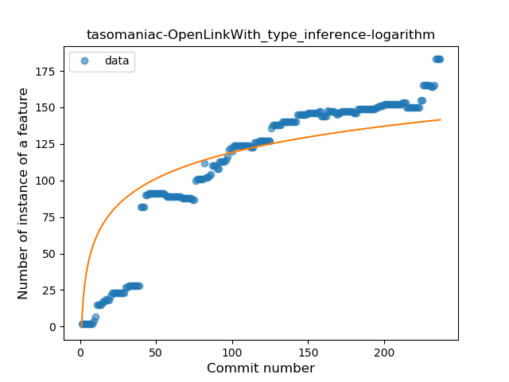
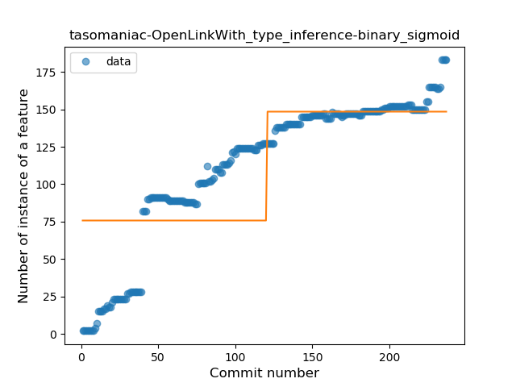
### <a name="lambda">Lambda</a>
----
#### Functions
* **Constant Rise - Linear:** 
    * **R_Squared:** 0.94959393
* **Sudden Rise Plateau - Logarithm:** 
    * **R_Squared:** 0.70034449
* **Plateau Gradual Rise - Sigmoid:** 
    * **R_Squared:** 0.70351148

**Plots** :chart_with_upwards_trend:
-----

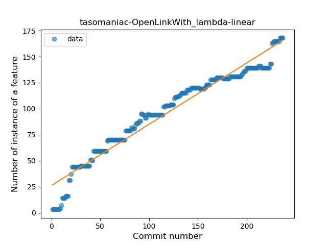
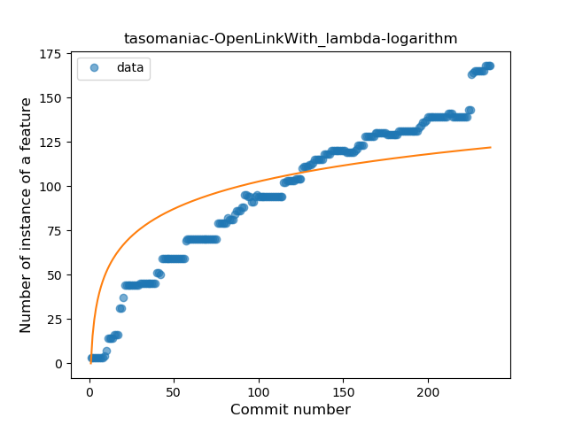
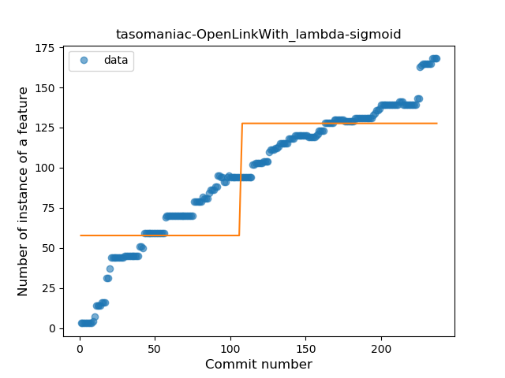
### <a name="safe_call">Safe Call</a>
----
#### Functions
* **Plateau Gradual Rise - Sigmoid:** 
    * **R_Squared:** 0.97829857
* **Constant Rise - Linear:** 
    * **R_Squared:** 0.95799869
* **Sudden Rise Plateau - Logarithm:** 
    * **R_Squared:** 0.70303401

**Plots** :chart_with_upwards_trend:
-----

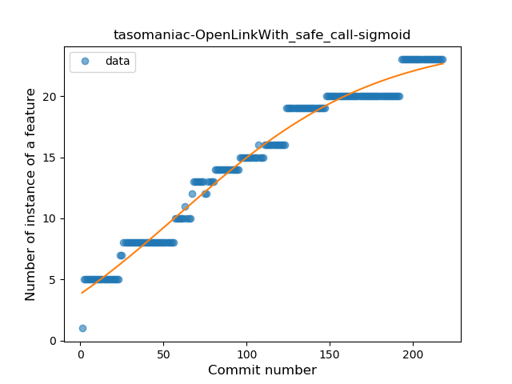
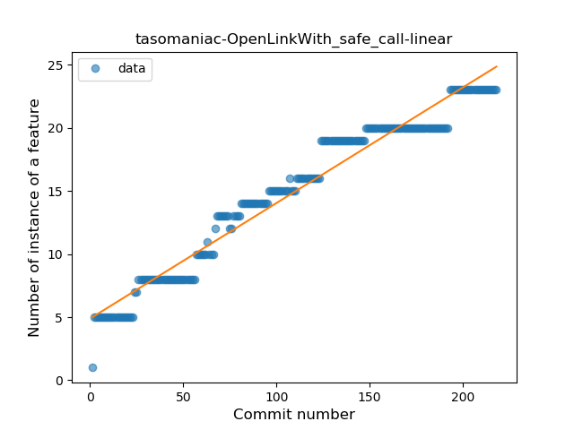
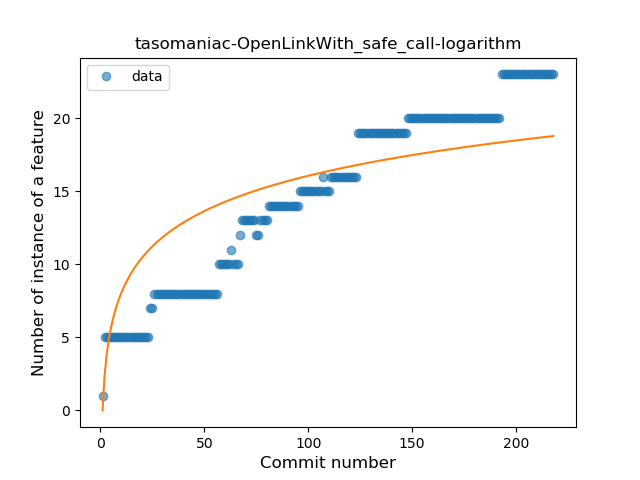
### <a name="when_expr">When expression</a>
----
#### Functions
* **Constant Rise - Linear:** 
    * **R_Squared:** 0.68751394
* **Sudden Rise Plateau - Logarithm:** 
    * **R_Squared:** 0.48179059

**Plots** :chart_with_upwards_trend:
-----

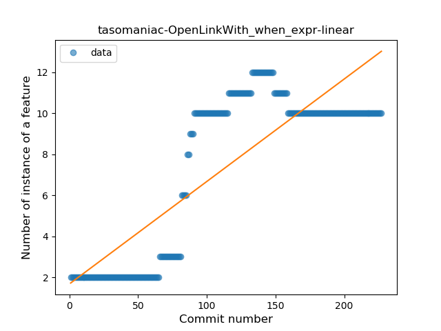
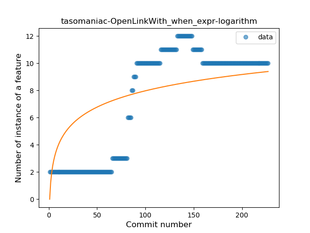
### <a name="companion_object">Companion Object</a>
----
#### Functions
* **Constant Rise - Linear:** 
    * **R_Squared:** 0.93451587
* **Sudden Rise Plateau - Logarithm:** 
    * **R_Squared:** 0.53528747
* **Plateau Gradual Rise - Sigmoid:** 
    * **R_Squared:** 0.13094093

**Plots** :chart_with_upwards_trend:
-----

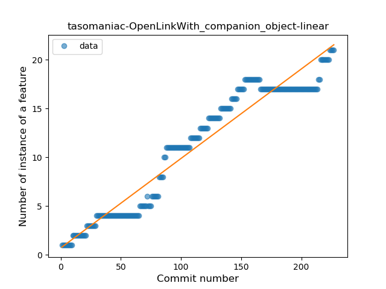
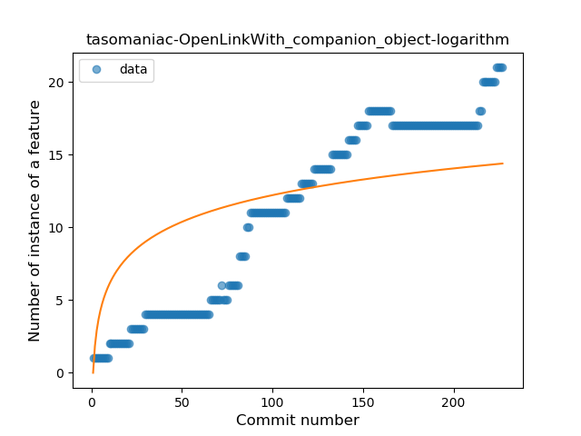
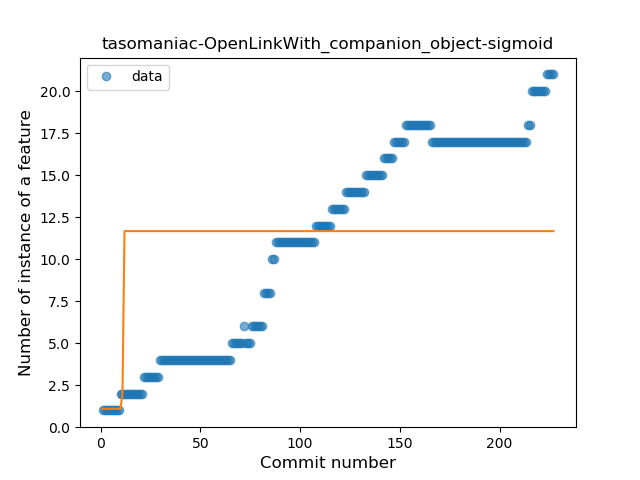
### <a name="unsafe_call">Unsafe Call</a>
----
#### Functions
* **Constant Rise - Linear:** 
    * **R_Squared:** 0.89893793
* **Sudden Rise - Exponential:** 
    * **R_Squared:** 0.90315705
* **Sudden Rise Plateau - Logarithm:** 
    * **R_Squared:** 0.39129885
* **Plateau Sudden Rise - Binary Sigmoid:** 
    * **R_Squared:** 0.19664615

**Plots** :chart_with_upwards_trend:
-----

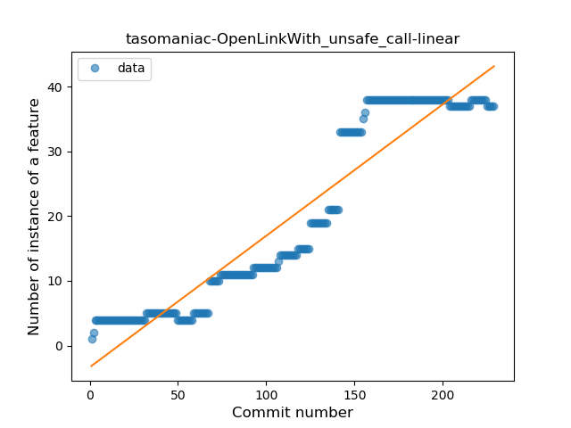
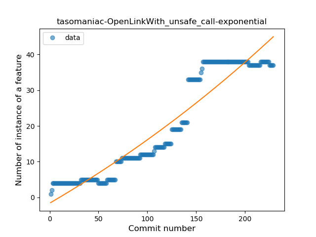

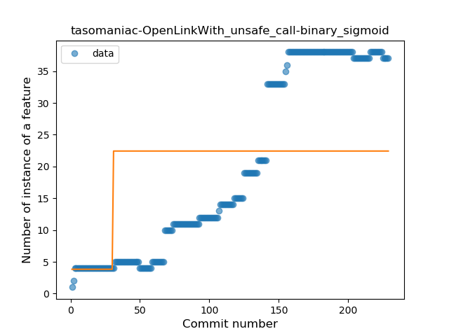
### <a name="string_template">String Template</a>
----
#### Functions
* **Plateau Gradual Rise - Sigmoid:** 
    * **R_Squared:** 0.92433593
* **Constant Rise - Linear:** 
    * **R_Squared:** 0.90392287
* **Sudden Rise - Exponential:** 
    * **R_Squared:** 0.90434306
* **Sudden Rise Plateau - Logarithm:** 
    * **R_Squared:** 0.5588668

**Plots** :chart_with_upwards_trend:
-----

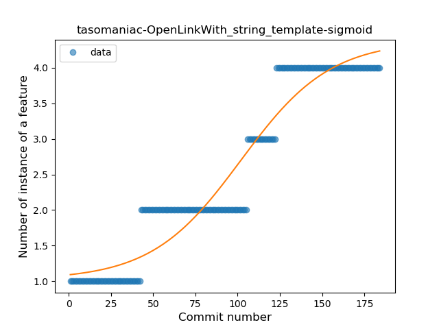
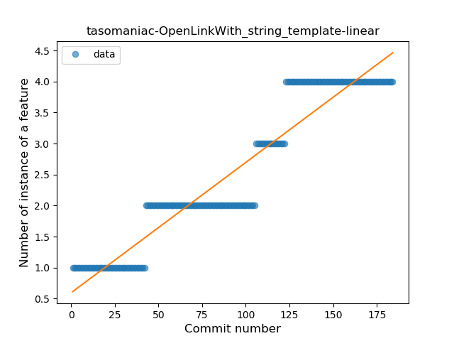
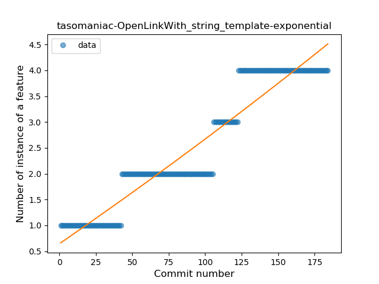
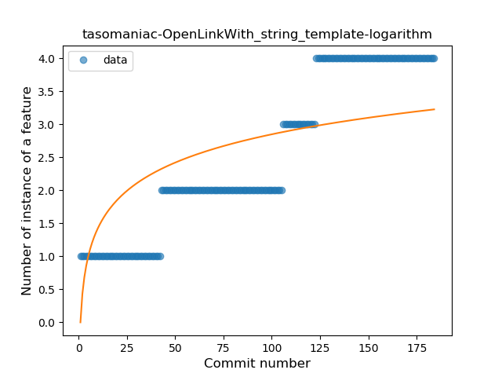
### <a name="func_with_default_value">Function with Default Value</a>
----
#### Functions
* **Plateau Gradual Rise - Sigmoid:** 
    * **R_Squared:** 0.91540961
* **Constant Rise - Linear:** 
    * **R_Squared:** 0.89091733
* **Sudden Rise Plateau - Logarithm:** 
    * **R_Squared:** 0.64369347

**Plots** :chart_with_upwards_trend:
-----

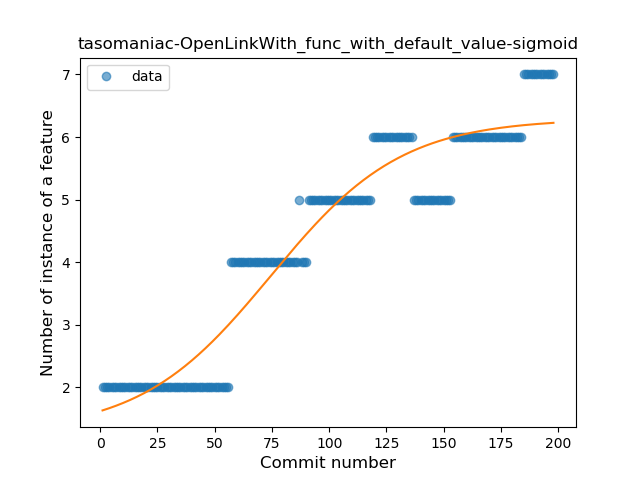
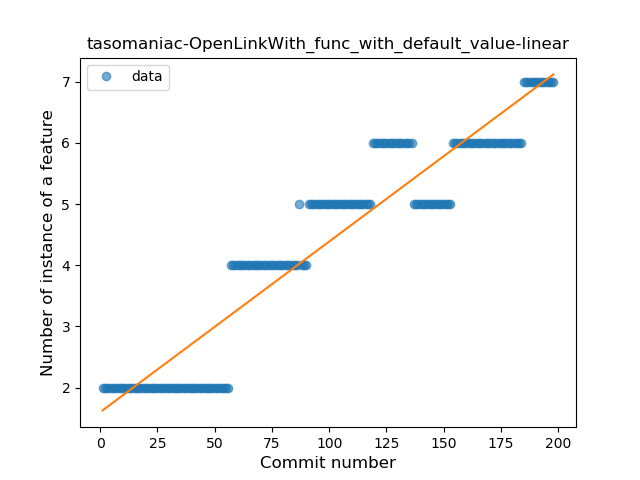

### <a name="singleton">Singleton</a>
----
#### Functions
* **Plateau Gradual Rise - Sigmoid:** 
    * **R_Squared:** 0.90753272
* **Constant Rise - Linear:** 
    * **R_Squared:** 0.72771666
* **Sudden Rise Plateau - Logarithm:** 
    * **R_Squared:** 0.68654574

**Plots** :chart_with_upwards_trend:
-----

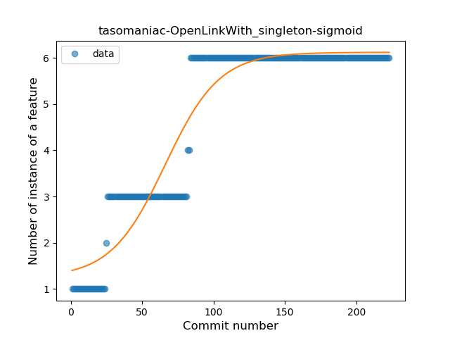
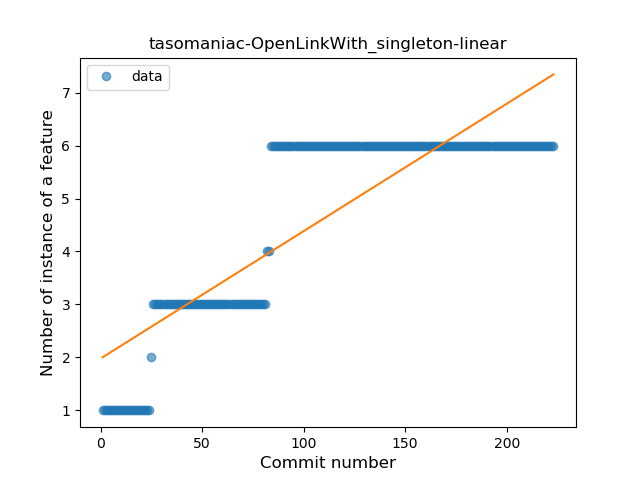
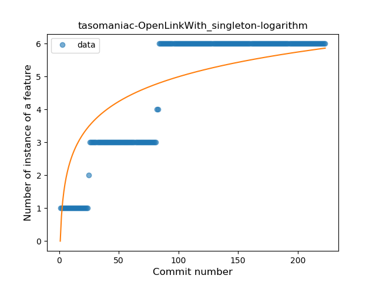
### <a name="smart_cast">Smart Cast</a>
----
#### Functions
* **Plateau Gradual Rise - Sigmoid:** 
    * **R_Squared:** 0.94889351
* **Sudden Rise Plateau - Logarithm:** 
    * **R_Squared:** 0.77973513
* **Constant Rise - Linear:** 
    * **R_Squared:** 0.52127313

**Plots** :chart_with_upwards_trend:
-----

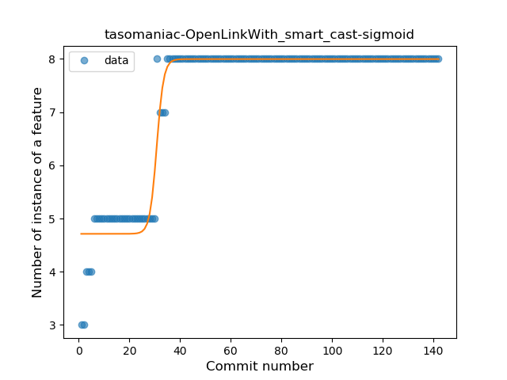
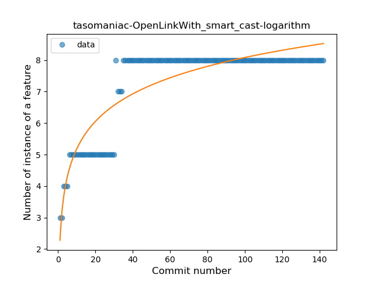
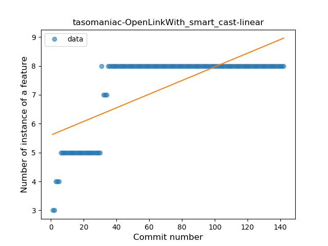
### <a name="range_expr">Range Expression</a>
----
#### Functions
* **Plateau Gradual Decline - Sigmoid:** 
    * **R_Squared:** 0.13753327
* **Sudden Decline - Exponential:** 
    * **R_Squared:** 0.05116641
* **Constant Decline - Linear:** 
    * **R_Squared:** 0.01576356
* **Sudden Rise Plateau - Logarithm:** 
    * **R_Squared:** -0.0

**Plots** :chart_with_upwards_trend:
-----

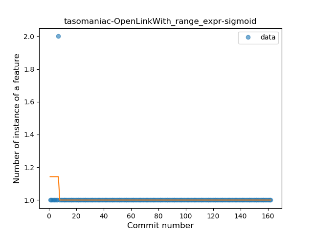
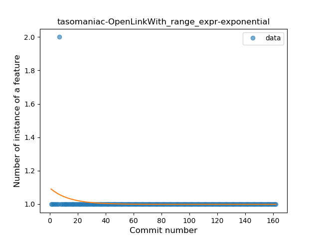
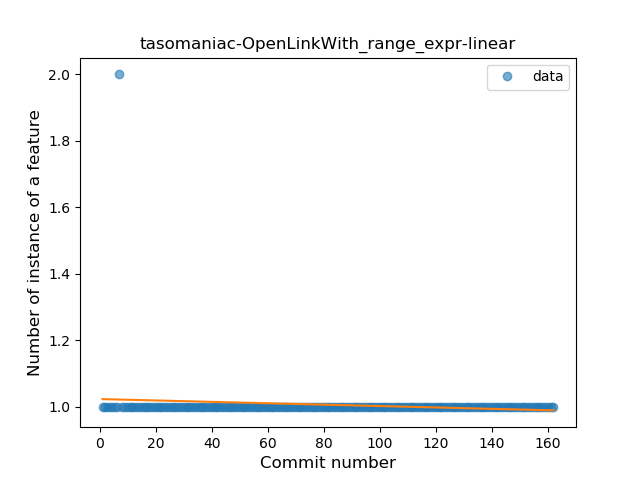
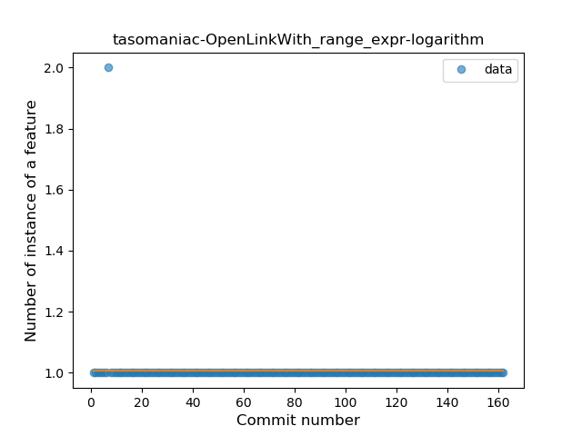
### <a name="func_call_with_named_arg">Function call with Named Argument</a>
----
#### Functions
* **Plateau Gradual Rise - Sigmoid:** 
    * **R_Squared:** 0.95144873
* **Constant Rise - Linear:** 
    * **R_Squared:** 0.88949763
* **Sudden Rise Plateau - Logarithm:** 
    * **R_Squared:** 0.55672144

**Plots** :chart_with_upwards_trend:
-----

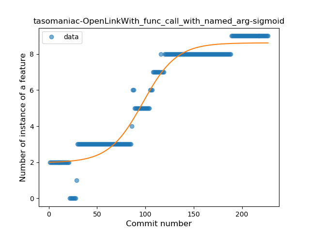
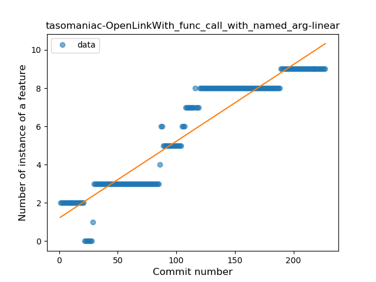
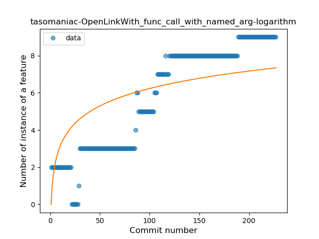
### <a name="data_class">Data Class</a>
----
#### Functions
* **Plateau Gradual Rise - Sigmoid:** 
    * **R_Squared:** 0.93429348
* **Sudden Rise Plateau - Logarithm:** 
    * **R_Squared:** 0.8751863
* **Constant Rise - Linear:** 
    * **R_Squared:** 0.78222222

**Plots** :chart_with_upwards_trend:
-----

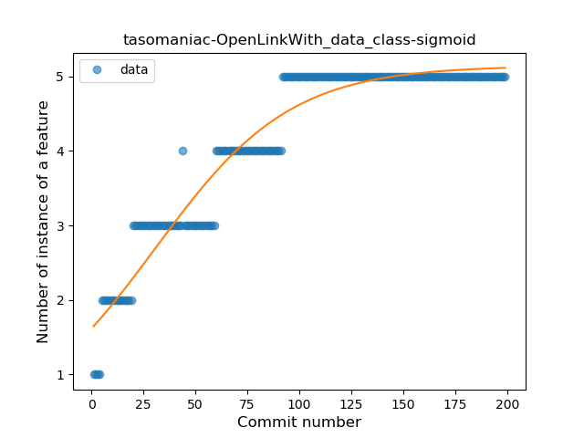
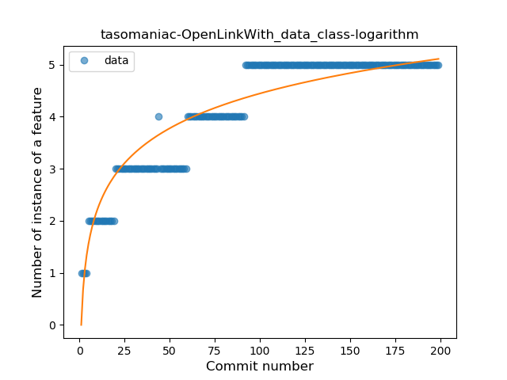
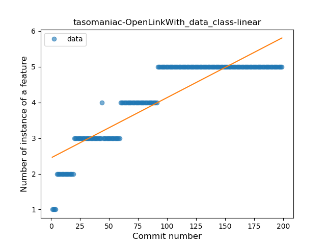
### <a name="extension_function">Extension Function</a>
----
#### Functions
* **Constant Rise - Linear:** 
    * **R_Squared:** 0.94903387
* **Sudden Rise Plateau - Logarithm:** 
    * **R_Squared:** 0.79592785

**Plots** :chart_with_upwards_trend:
-----

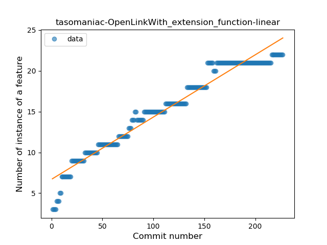
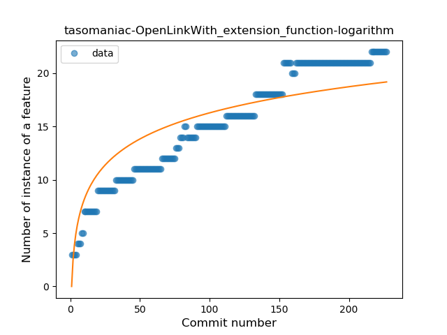
### <a name="property_delegation">Property Delegation</a>
----
#### Functions
* **Plateau Sudden Decline - Binary Sigmoid:** 
    * **R_Squared:** 1.0
* **Sudden Decline - Exponential:** 
    * **R_Squared:** 0.81071466
* **Constant Decline - Linear:** 
    * **R_Squared:** 0.11669634
* **Sudden Rise Plateau - Logarithm:** 
    * **R_Squared:** -0.0

**Plots** :chart_with_upwards_trend:
-----

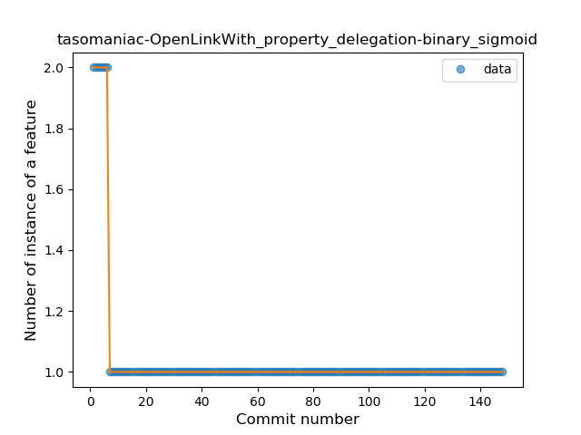
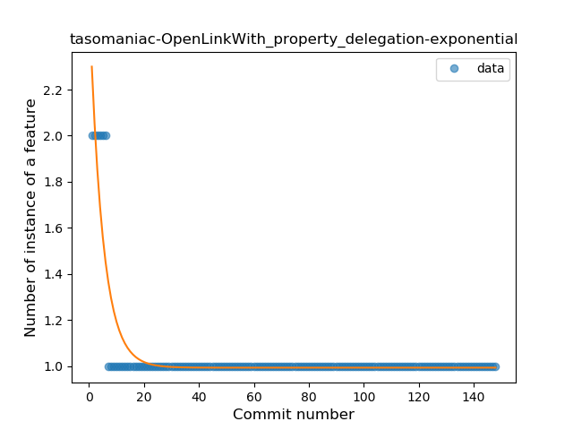
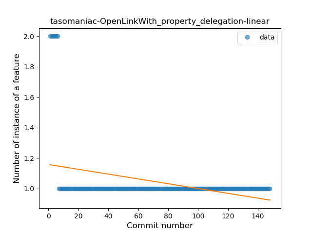
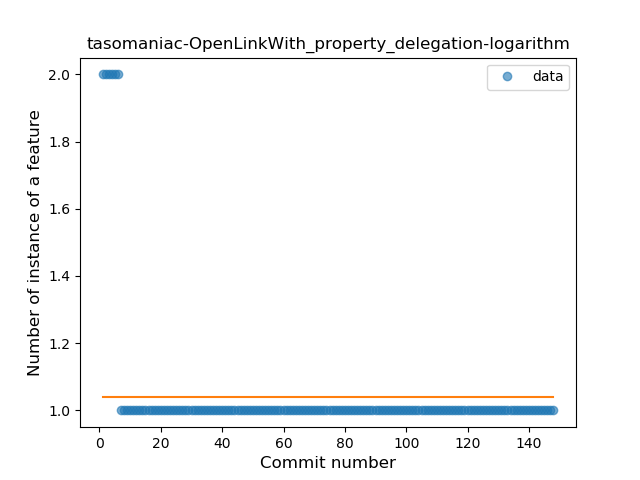
