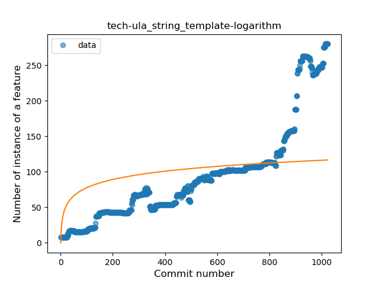
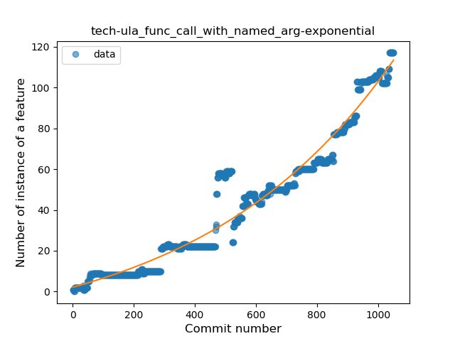
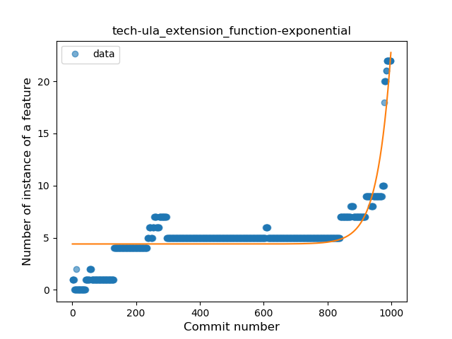
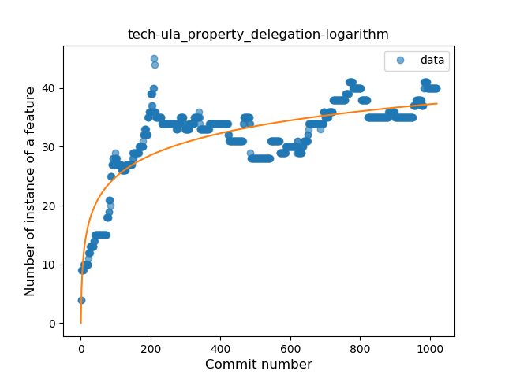
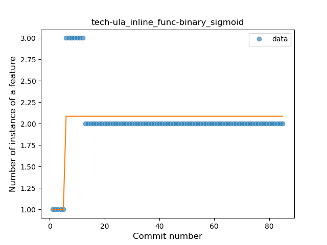
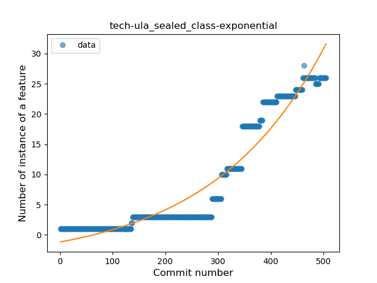

## tech-ula
----
#### Metrics provided by Detekt
* Number of lines of code 13956
* Number of Kotlin files: 89
* Cyclomatic complexity: 1656
* Cyclomatic complexity by thousands of lines: 195 

----
**20** features analyzed

*	<a href="#type_inference">Type Inference</a> 
*	<a href="#lambda">Lambda</a> 
*	<a href="#safe_call">Safe Call</a> 
*	<a href="#when_expr">When expression</a> 
*	<a href="#unsafe_call">Unsafe Call</a> 
*	<a href="#companion_object">Companion Object</a> 
*	<a href="#string_template">String Template</a> 
*	<a href="#func_with_default_value">Function with Default Value</a> 
*	<a href="#singleton">Singleton</a> 
*	<a href="#range_expr">Range Expression</a> 
*	<a href="#smart_cast">Smart Cast</a> 
*	<a href="#data_class">Data Class</a> 
*	<a href="#func_call_with_named_arg">Function call with Named Argument</a> 
*	<a href="#extension_function">Extension Function</a> 
*	<a href="#property_delegation">Property Delegation</a> 
*	<a href="#destructuring_declaration">Destructuring Declaration</a> 
*	<a href="#inline_func">Inline Function</a> 
*	<a href="#overloaded_op">Overloaded Operator</a> 
*	<a href="#coroutine">Coroutine</a> 
*	<a href="#sealed_class">Sealed Class</a> 

### <a name="type_inference">Type Inference</a>
----
#### Functions
* **Sudden Rise - Exponential:** 
    * **R_Squared:** 0.9593494
* **Constant Rise - Linear:** 
    * **R_Squared:** 0.79090053
* **Sudden Rise Plateau - Logarithm:** 
    * **R_Squared:** 0.23787874
* **Plateau Sudden Rise - Binary Sigmoid:** 
    * **R_Squared:** 0.22594582

**Plots** :chart_with_upwards_trend:
-----

### <a name="lambda">Lambda</a>
----
#### Functions
* **Sudden Rise - Exponential:** 
    * **R_Squared:** 0.95902065
* **Constant Rise - Linear:** 
    * **R_Squared:** 0.81312671
* **Plateau Sudden Rise - Binary Sigmoid:** 
    * **R_Squared:** 0.42713096
* **Sudden Rise Plateau - Logarithm:** 
    * **R_Squared:** 0.30734753

**Plots** :chart_with_upwards_trend:
-----

### <a name="safe_call">Safe Call</a>
----
#### Functions
* **Sudden Rise - Exponential:** 
    * **R_Squared:** 0.93390414
* **Constant Rise - Linear:** 
    * **R_Squared:** 0.8922077
* **Sudden Rise Plateau - Logarithm:** 
    * **R_Squared:** 0.42448683

**Plots** :chart_with_upwards_trend:
-----

### <a name="when_expr">When expression</a>
----
#### Functions
* **Sudden Rise - Exponential:** 
    * **R_Squared:** 0.95085885
* **Constant Rise - Linear:** 
    * **R_Squared:** 0.75838791
* **Sudden Rise Plateau - Logarithm:** 
    * **R_Squared:** 0.24835458
* **Plateau Gradual Rise - Sigmoid:** 
    * **R_Squared:** 0.1556365

**Plots** :chart_with_upwards_trend:
-----

### <a name="unsafe_call">Unsafe Call</a>
----
#### Functions
* **Sudden Rise - Exponential:** 
    * **R_Squared:** 0.90868041
* **Constant Rise - Linear:** 
    * **R_Squared:** 0.62187844
* **Sudden Rise Plateau - Logarithm:** 
    * **R_Squared:** 0.17726171

**Plots** :chart_with_upwards_trend:
-----

### <a name="companion_object">Companion Object</a>
----
#### Functions
* **Plateau Gradual Rise - Sigmoid:** 
    * **R_Squared:** 0.70211257
* **Sudden Rise Plateau - Logarithm:** 
    * **R_Squared:** 0.59523301
* **Constant Rise - Linear:** 
    * **R_Squared:** 0.57543201

**Plots** :chart_with_upwards_trend:
-----

### <a name="string_template">String Template</a>
----
#### Functions
* **Sudden Rise - Exponential:** 
    * **R_Squared:** 0.92644412
* **Constant Rise - Linear:** 
    * **R_Squared:** 0.8028082
* **Sudden Rise Plateau - Logarithm:** 
    * **R_Squared:** 0.27861446
* **Plateau Sudden Rise - Binary Sigmoid:** 
    * **R_Squared:** 0.13913443

**Plots** :chart_with_upwards_trend:
-----

### <a name="func_with_default_value">Function with Default Value</a>
----
#### Functions
* **Sudden Rise - Exponential:** 
    * **R_Squared:** 0.94063627
* **Constant Rise - Linear:** 
    * **R_Squared:** 0.78014437
* **Sudden Rise Plateau - Logarithm:** 
    * **R_Squared:** 0.2401882

**Plots** :chart_with_upwards_trend:
-----

### <a name="singleton">Singleton</a>
----
#### Functions
* **Plateau Gradual Rise - Sigmoid:** 
    * **R_Squared:** 0.98341166
* **Sudden Rise - Exponential:** 
    * **R_Squared:** 0.88063043
* **Constant Rise - Linear:** 
    * **R_Squared:** 0.47844552
* **Sudden Rise Plateau - Logarithm:** 
    * **R_Squared:** 0.06835547

**Plots** :chart_with_upwards_trend:
-----

### <a name="range_expr">Range Expression</a>
----
#### Functions
* **Sudden Rise - Exponential:** 
    * **R_Squared:** 0.8128032
* **Constant Rise - Linear:** 
    * **R_Squared:** 0.7320352
* **Sudden Rise Plateau - Logarithm:** 
    * **R_Squared:** 0.36184101

**Plots** :chart_with_upwards_trend:
-----

### <a name="smart_cast">Smart Cast</a>
----
#### Functions
* **Plateau Gradual Rise - Sigmoid:** 
    * **R_Squared:** 0.97697754
* **Sudden Rise - Exponential:** 
    * **R_Squared:** 0.90020584
* **Constant Rise - Linear:** 
    * **R_Squared:** 0.6552987
* **Sudden Rise Plateau - Logarithm:** 
    * **R_Squared:** 0.11694171

**Plots** :chart_with_upwards_trend:
-----

### <a name="data_class">Data Class</a>
----
#### Functions
* **Plateau Gradual Rise - Sigmoid:** 
    * **R_Squared:** 0.97745552
* **Sudden Rise - Exponential:** 
    * **R_Squared:** 0.92338566
* **Constant Rise - Linear:** 
    * **R_Squared:** 0.59406606
* **Sudden Rise Plateau - Logarithm:** 
    * **R_Squared:** 0.10883961

**Plots** :chart_with_upwards_trend:
-----

### <a name="func_call_with_named_arg">Function call with Named Argument</a>
----
#### Functions
* **Sudden Rise - Exponential:** 
    * **R_Squared:** 0.95402888
* **Constant Rise - Linear:** 
    * **R_Squared:** 0.91512925
* **Sudden Rise Plateau - Logarithm:** 
    * **R_Squared:** 0.29958318

**Plots** :chart_with_upwards_trend:
-----

### <a name="extension_function">Extension Function</a>
----
#### Functions
* **Sudden Rise - Exponential:** 
    * **R_Squared:** 0.69464685
* **Constant Rise - Linear:** 
    * **R_Squared:** 0.443713
* **Sudden Rise Plateau - Logarithm:** 
    * **R_Squared:** 0.2707194

**Plots** :chart_with_upwards_trend:
-----

### <a name="property_delegation">Property Delegation</a>
----
#### Functions
* **Sudden Rise Plateau - Logarithm:** 
    * **R_Squared:** 0.70254242
* **Constant Rise - Linear:** 
    * **R_Squared:** 0.45657578

**Plots** :chart_with_upwards_trend:
-----

### <a name="destructuring_declaration">Destructuring Declaration</a>
----
#### Functions
* **Plateau Gradual Rise - Sigmoid:** 
    * **R_Squared:** 0.69033045
* **Constant Rise - Linear:** 
    * **R_Squared:** 0.54288879
* **Sudden Rise Plateau - Logarithm:** 
    * **R_Squared:** 0.42629311

**Plots** :chart_with_upwards_trend:
-----

### <a name="inline_func">Inline Function</a>
----
#### Functions
* **Plateau Sudden Rise - Binary Sigmoid:** 
    * **R_Squared:** 0.4656127
* **Sudden Rise Plateau - Logarithm:** 
    * **R_Squared:** 0.01402464
* **Constant Decline - Linear:** 
    * **R_Squared:** 0.0023609
* **Sudden Decline - Exponential:** 
    * **R_Squared:** 0.00235369

**Plots** :chart_with_upwards_trend:
-----

### <a name="overloaded_op">Overloaded Operator</a>
----
#### Functions
* **Plateau Sudden Rise - Binary Sigmoid:** 
    * **R_Squared:** 1.0
* **Sudden Rise Plateau - Logarithm:** 
    * **R_Squared:** 0.56471353
* **Constant Rise - Linear:** 
    * **R_Squared:** 0.23147493

**Plots** :chart_with_upwards_trend:
-----

### <a name="coroutine">Coroutine</a>
----
#### Functions
* **Sudden Rise - Exponential:** 
    * **R_Squared:** 0.95365111
* **Constant Rise - Linear:** 
    * **R_Squared:** 0.67736455
* **Sudden Rise Plateau - Logarithm:** 
    * **R_Squared:** 0.24246524
* **Plateau Sudden Rise - Binary Sigmoid:** 
    * **R_Squared:** 0.03388379

**Plots** :chart_with_upwards_trend:
-----

### <a name="sealed_class">Sealed Class</a>
----
#### Functions
* **Sudden Rise - Exponential:** 
    * **R_Squared:** 0.92613691
* **Constant Rise - Linear:** 
    * **R_Squared:** 0.83177237
* **Sudden Rise Plateau - Logarithm:** 
    * **R_Squared:** 0.22326338

**Plots** :chart_with_upwards_trend:
-----

