## thanksmister-androidthings-mqtt-alarm-panel
----
#### Metrics provided by Detekt
* Number of lines of code 10125
* Number of Kotlin files: 81
* Cyclomatic complexity: 1338
* Cyclomatic complexity by thousands of lines: 275 

----
**10** features analyzed

*	<a href="#type_inference">Type Inference</a> 
*	<a href="#lambda">Lambda</a> 
*	<a href="#safe_call">Safe Call</a> 
*	<a href="#when_expr">When expression</a> 
*	<a href="#companion_object">Companion Object</a> 
*	<a href="#unsafe_call">Unsafe Call</a> 
*	<a href="#string_template">String Template</a> 
*	<a href="#singleton">Singleton</a> 
*	<a href="#smart_cast">Smart Cast</a> 
*	<a href="#range_expr">Range Expression</a> 

### <a name="type_inference">Type Inference</a>
----
#### Functions
* **Sudden Rise - Exponential:** 
    * **R_Squared:** 0.9551462
* **Constant Rise - Linear:** 
    * **R_Squared:** 0.91552846
* **Sudden Rise Plateau - Logarithm:** 
    * **R_Squared:** 0.62006035

**Plots** :chart_with_upwards_trend:
-----

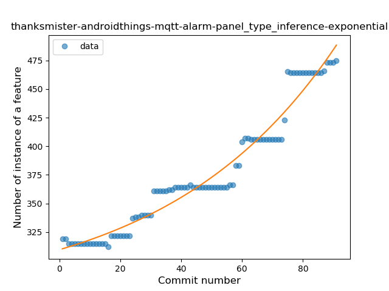
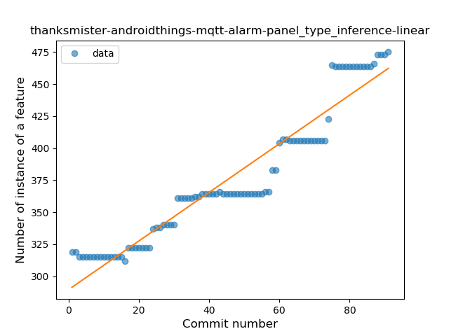
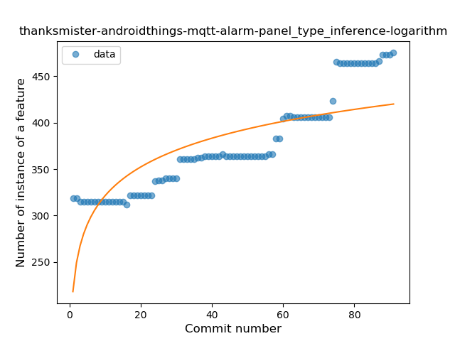
### <a name="lambda">Lambda</a>
----
#### Functions
* **Sudden Rise - Exponential:** 
    * **R_Squared:** 0.94831031
* **Constant Rise - Linear:** 
    * **R_Squared:** 0.85256934
* **Sudden Rise Plateau - Logarithm:** 
    * **R_Squared:** 0.52613772

**Plots** :chart_with_upwards_trend:
-----

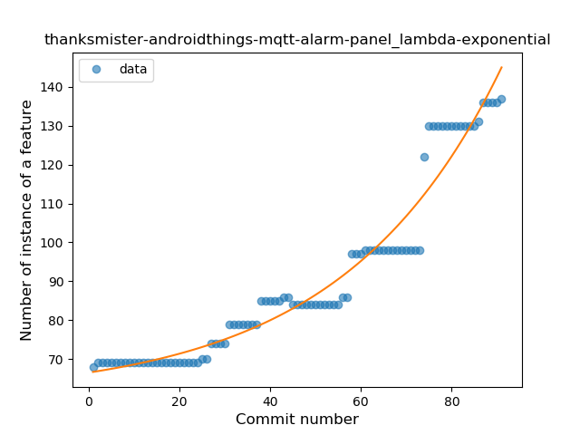
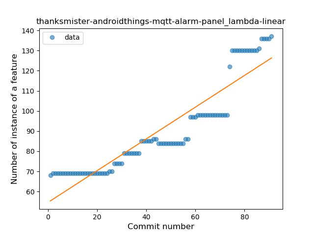
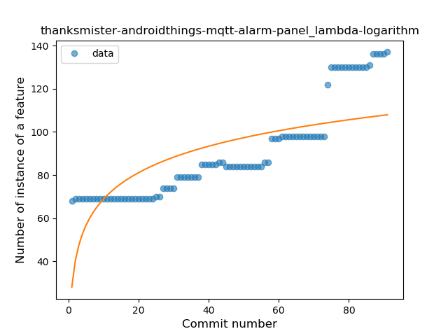
### <a name="safe_call">Safe Call</a>
----
#### Functions
* **Instability - Polinomial 3:** )
    * **R_Squared:** 0.96380046
* **Constant Rise - Linear:** 
    * **R_Squared:** 0.91907117
* **Sudden Rise - Exponential:** 
    * **R_Squared:** 0.92511103
* **Sudden Rise Plateau - Logarithm:** 
    * **R_Squared:** 0.64179221

**Plots** :chart_with_upwards_trend:
-----

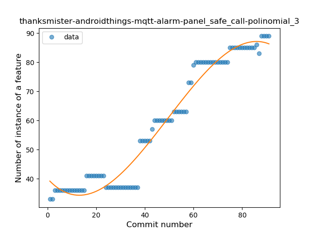

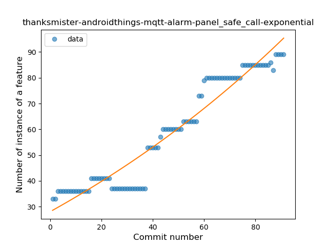
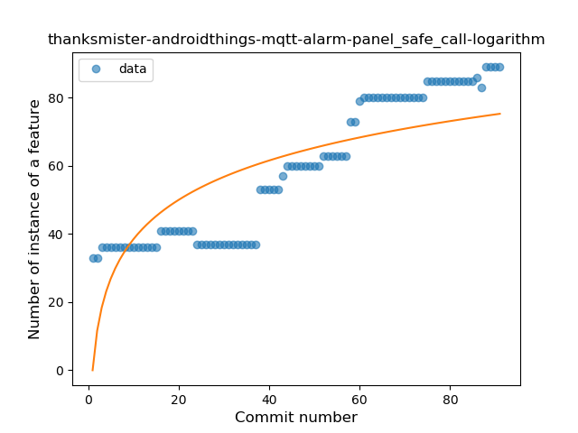
### <a name="when_expr">When expression</a>
----
#### Functions
* **Sudden Rise - Exponential:** 
    * **R_Squared:** 0.88438868
* **Constant Rise - Linear:** 
    * **R_Squared:** 0.83467842
* **Sudden Rise Plateau - Logarithm:** 
    * **R_Squared:** 0.53377529

**Plots** :chart_with_upwards_trend:
-----

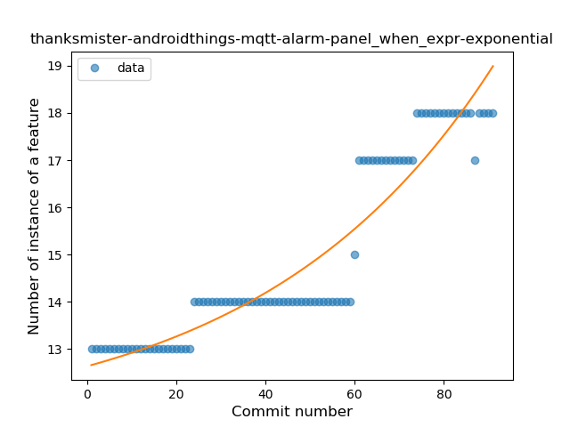
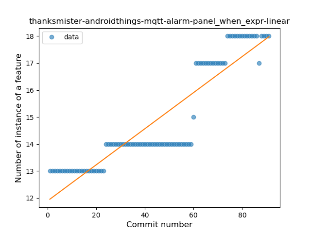
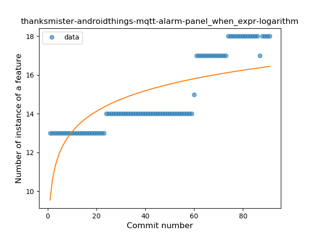
### <a name="companion_object">Companion Object</a>
----
#### Functions
* **Sudden Rise - Exponential:** 
    * **R_Squared:** 0.9528415
* **Constant Rise - Linear:** 
    * **R_Squared:** 0.92395169
* **Sudden Rise Plateau - Logarithm:** 
    * **R_Squared:** 0.61297661

**Plots** :chart_with_upwards_trend:
-----

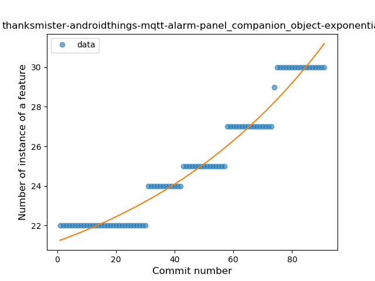
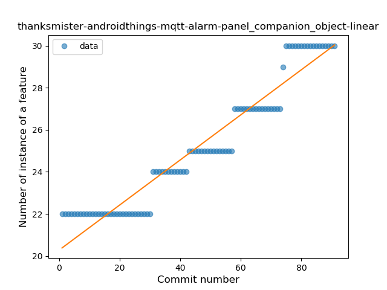
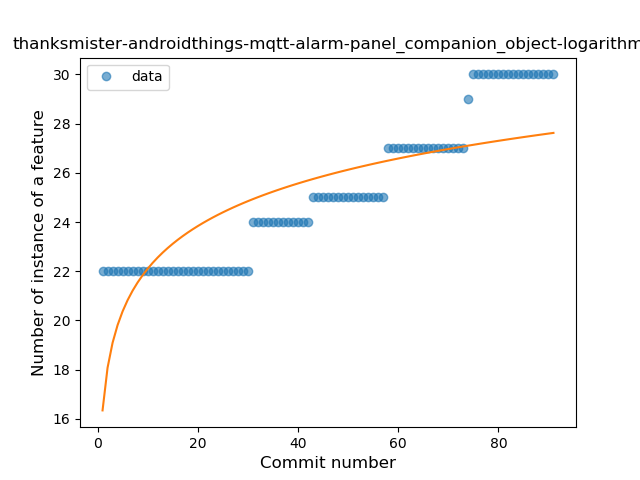
### <a name="unsafe_call">Unsafe Call</a>
----
#### Functions
* **Sudden Rise Plateau - Logarithm:** 
    * **R_Squared:** 0.06755931
* **Constant Rise - Linear:** 
    * **R_Squared:** 0.00020598
* **Sudden Decline - Exponential:** 
    * **R_Squared:** -0.0

**Plots** :chart_with_upwards_trend:
-----

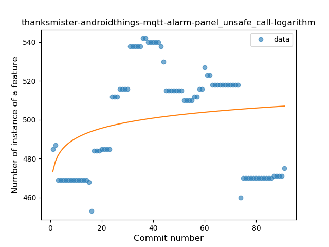
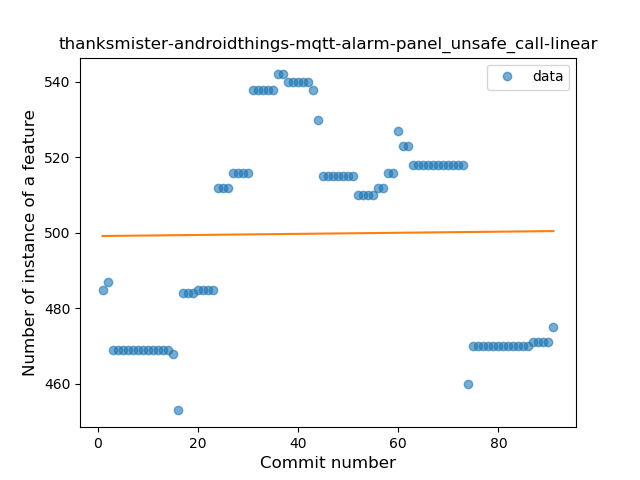
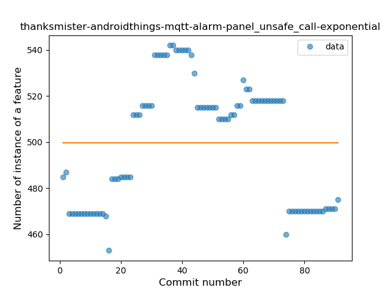
### <a name="string_template">String Template</a>
----
#### Functions
* **Sudden Rise - Exponential:** 
    * **R_Squared:** 0.74060096
* **Constant Rise - Linear:** 
    * **R_Squared:** 0.54476902
* **Sudden Rise Plateau - Logarithm:** 
    * **R_Squared:** 0.2691027

**Plots** :chart_with_upwards_trend:
-----

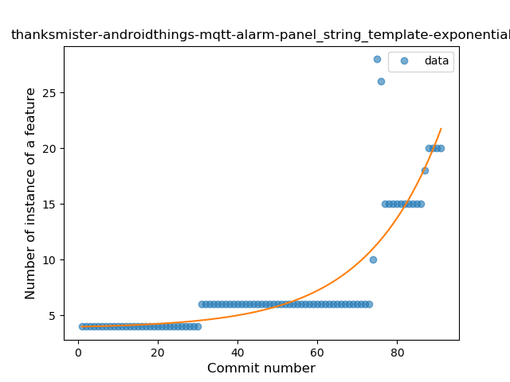
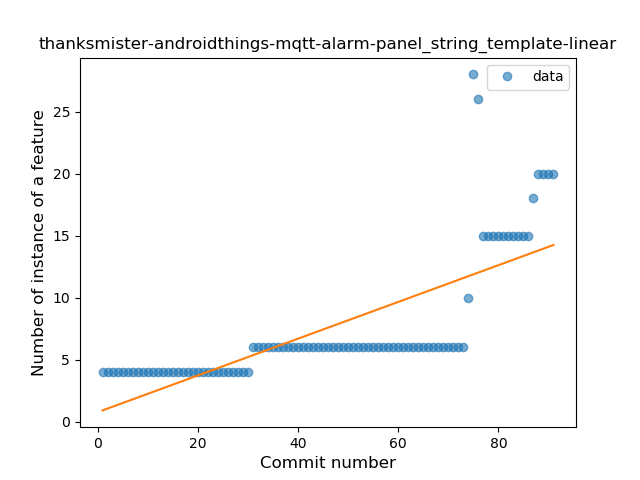
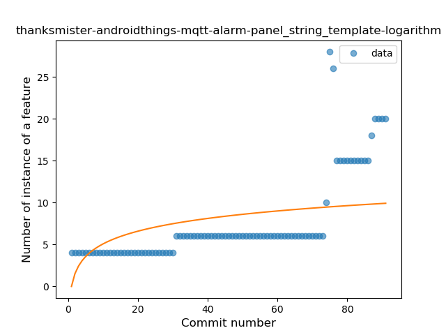
### <a name="singleton">Singleton</a>
----
#### Functions
* **Plateau Gradual Rise - Sigmoid:** 
    * **R_Squared:** 1.0
* **Instability - Polinomial 3:** )
    * **R_Squared:** 0.87562434
* **Constant Rise - Linear:** 
    * **R_Squared:** 0.76170678
* **Sudden Rise Plateau - Logarithm:** 
    * **R_Squared:** 0.63365157

**Plots** :chart_with_upwards_trend:
-----

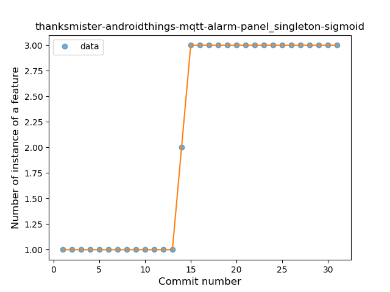
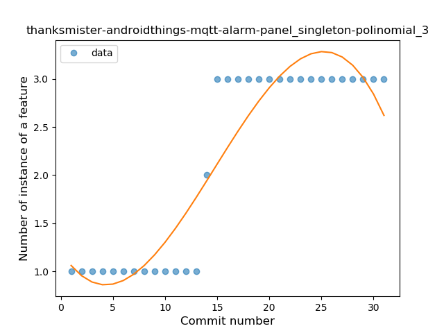
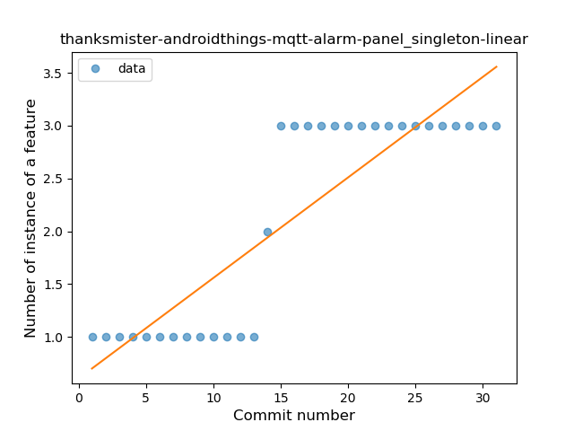
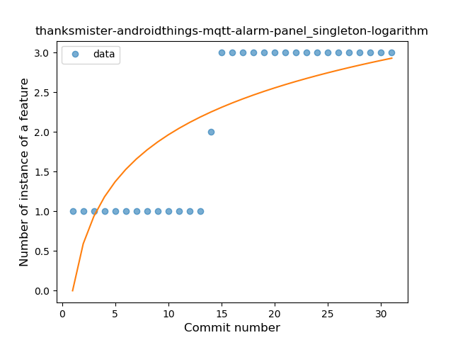
### <a name="smart_cast">Smart Cast</a>
----
#### Functions
* **Plateau Sudden Rise - Binary Sigmoid:** 
    * **R_Squared:** 1.0
* **Sudden Rise - Exponential:** 
    * **R_Squared:** 0.75541254
* **Constant Rise - Linear:** 
    * **R_Squared:** 0.70217391
* **Sudden Rise Plateau - Logarithm:** 
    * **R_Squared:** 0.40436628

**Plots** :chart_with_upwards_trend:
-----

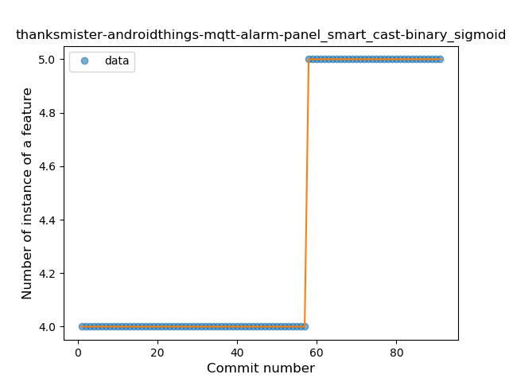
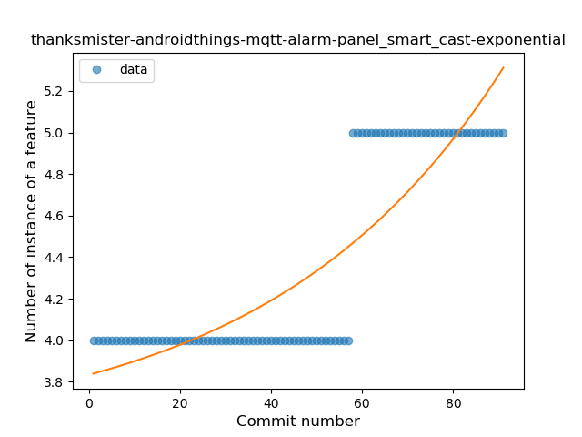
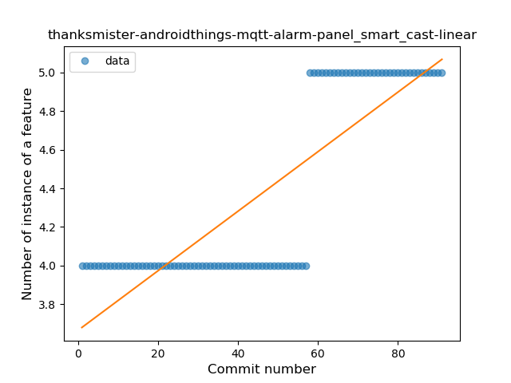
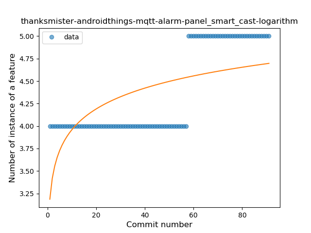
### <a name="range_expr">Range Expression</a>
----
#### Functions
* **Plateau Sudden Rise - Binary Sigmoid:** 
    * **R_Squared:** 1.0
* **Sudden Rise - Exponential:** 
    * **R_Squared:** 0.80961164
* **Constant Rise - Linear:** 
    * **R_Squared:** 0.1557971
* **Sudden Rise Plateau - Logarithm:** 
    * **R_Squared:** 0.06125287

**Plots** :chart_with_upwards_trend:
-----

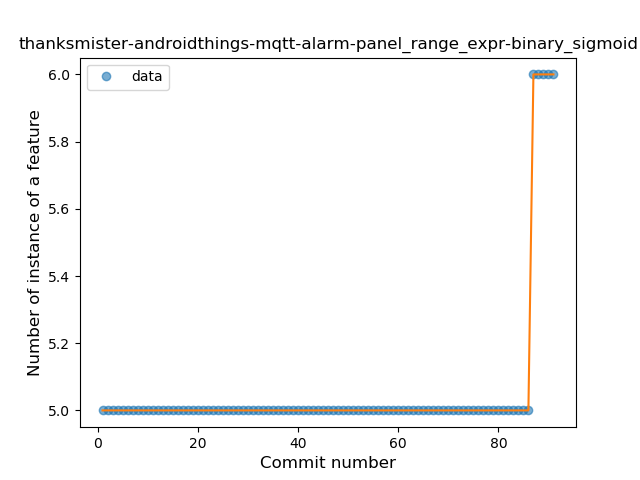
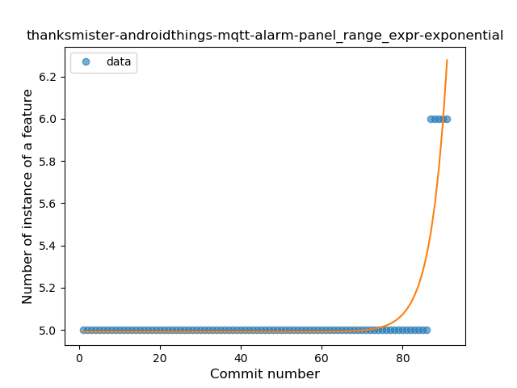
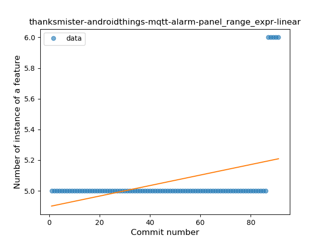
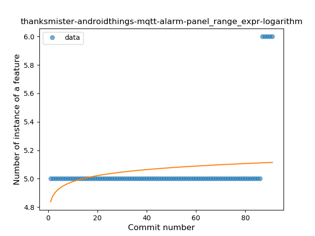
