## thermatk-FastHub-Libre
----
#### Metrics provided by Detekt
* Number of lines of code 8373
* Number of Kotlin files: 119
* Cyclomatic complexity: 1672
* Cyclomatic complexity by thousands of lines: 368 

----
**14** features analyzed

*	<a href="#type_inference">Type Inference</a> 
*	<a href="#lambda">Lambda</a> 
*	<a href="#safe_call">Safe Call</a> 
*	<a href="#when_expr">When expression</a> 
*	<a href="#companion_object">Companion Object</a> 
*	<a href="#unsafe_call">Unsafe Call</a> 
*	<a href="#string_template">String Template</a> 
*	<a href="#func_with_default_value">Function with Default Value</a> 
*	<a href="#singleton">Singleton</a> 
*	<a href="#smart_cast">Smart Cast</a> 
*	<a href="#func_call_with_named_arg">Function call with Named Argument</a> 
*	<a href="#data_class">Data Class</a> 
*	<a href="#extension_function">Extension Function</a> 
*	<a href="#property_delegation">Property Delegation</a> 

### <a name="type_inference">Type Inference</a>
----
#### Functions
* **Constant Rise - Linear:** 
    * **R_Squared:** 0.96680856
* **Sudden Rise Plateau - Logarithm:** 
    * **R_Squared:** 0.36220902
* **Plateau Sudden Rise - Binary Sigmoid:** 
    * **R_Squared:** 0.32094983

**Plots** :chart_with_upwards_trend:
-----

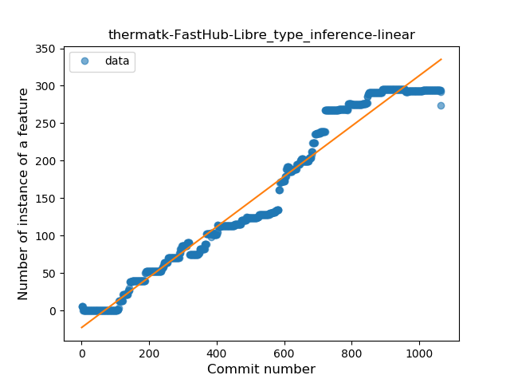
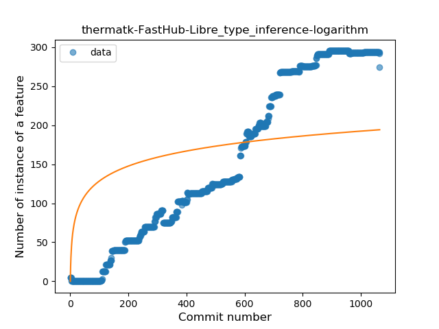
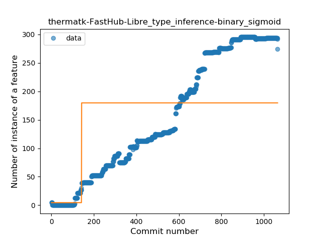
### <a name="lambda">Lambda</a>
----
#### Functions
* **Constant Rise - Linear:** 
    * **R_Squared:** 0.96627057
* **Sudden Rise - Exponential:** 
    * **R_Squared:** 0.96658546
* **Plateau Sudden Rise - Binary Sigmoid:** 
    * **R_Squared:** 0.51019766
* **Sudden Rise Plateau - Logarithm:** 
    * **R_Squared:** 0.35249104

**Plots** :chart_with_upwards_trend:
-----

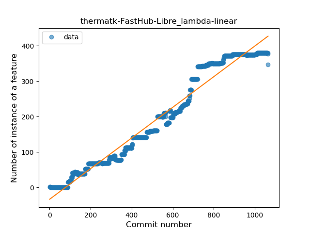

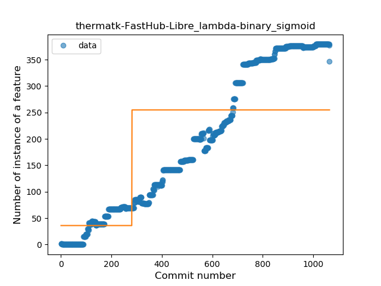
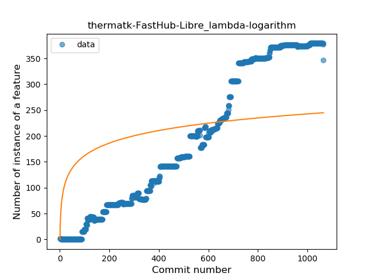
### <a name="safe_call">Safe Call</a>
----
#### Functions
* **Constant Rise - Linear:** 
    * **R_Squared:** 0.91735919
* **Sudden Rise - Exponential:** 
    * **R_Squared:** 0.91866851
* **Sudden Rise Plateau - Logarithm:** 
    * **R_Squared:** 0.30993879
* **Plateau Sudden Rise - Binary Sigmoid:** 
    * **R_Squared:** 0.23104657

**Plots** :chart_with_upwards_trend:
-----

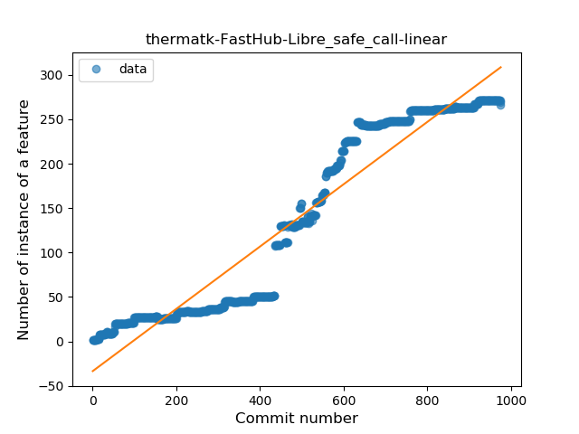
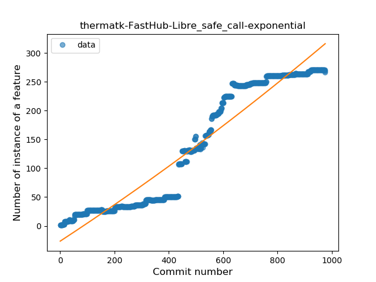
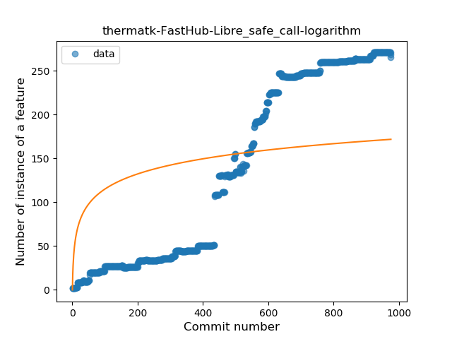
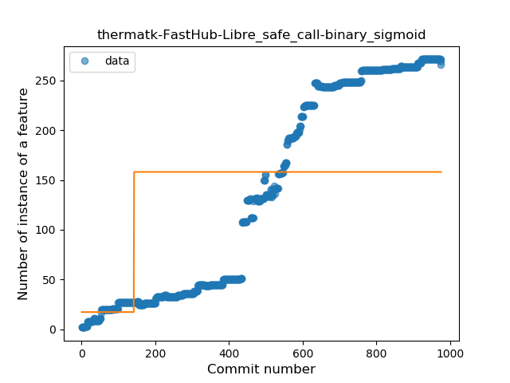
### <a name="when_expr">When expression</a>
----
#### Functions
* **Constant Rise - Linear:** 
    * **R_Squared:** 0.87227071
* **Sudden Rise Plateau - Logarithm:** 
    * **R_Squared:** 0.61949717

**Plots** :chart_with_upwards_trend:
-----

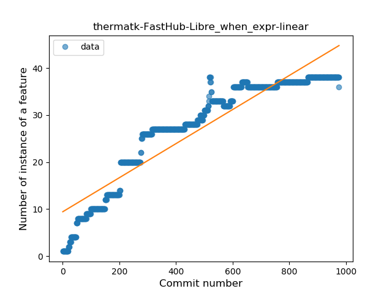
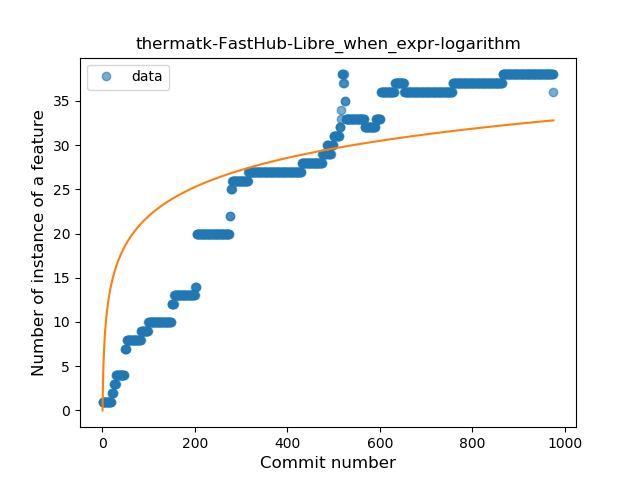
### <a name="companion_object">Companion Object</a>
----
#### Functions
* **Constant Rise - Linear:** 
    * **R_Squared:** 0.95268996
* **Sudden Rise - Exponential:** 
    * **R_Squared:** 0.95294896
* **Plateau Sudden Rise - Binary Sigmoid:** 
    * **R_Squared:** 0.79374396
* **Sudden Rise Plateau - Logarithm:** 
    * **R_Squared:** 0.34704937

**Plots** :chart_with_upwards_trend:
-----

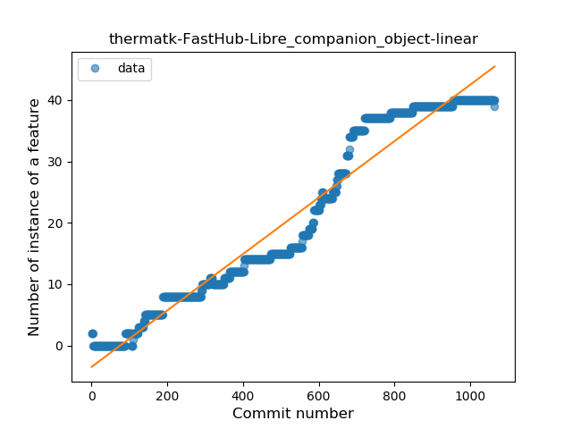
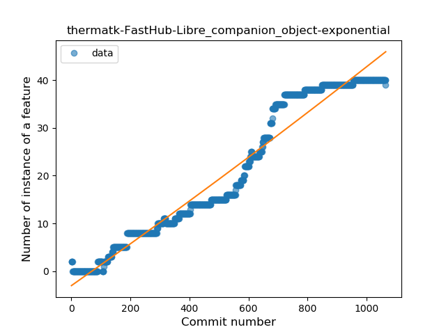

### <a name="unsafe_call">Unsafe Call</a>
----
#### Functions
* **Constant Rise - Linear:** 
    * **R_Squared:** 0.94483035
* **Sudden Rise Plateau - Logarithm:** 
    * **R_Squared:** 0.48335931
* **Plateau Gradual Rise - Sigmoid:** 
    * **R_Squared:** 0.3959269

**Plots** :chart_with_upwards_trend:
-----

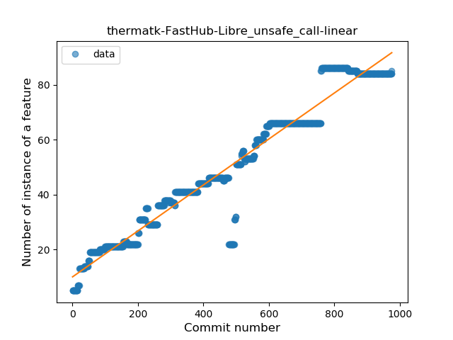
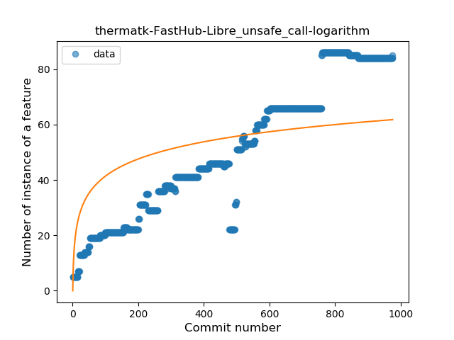

### <a name="string_template">String Template</a>
----
#### Functions
* **Constant Rise - Linear:** 
    * **R_Squared:** 0.92672177
* **Sudden Rise Plateau - Logarithm:** 
    * **R_Squared:** 0.35628354
* **Plateau Sudden Rise - Binary Sigmoid:** 
    * **R_Squared:** 0.06799163

**Plots** :chart_with_upwards_trend:
-----

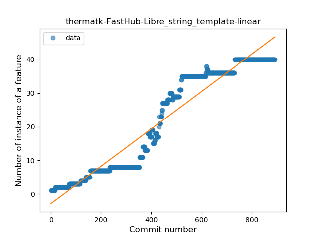
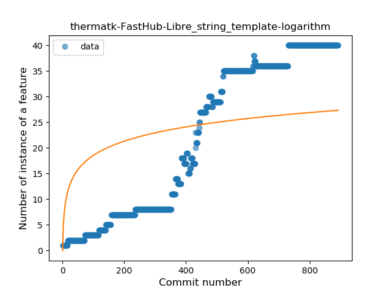
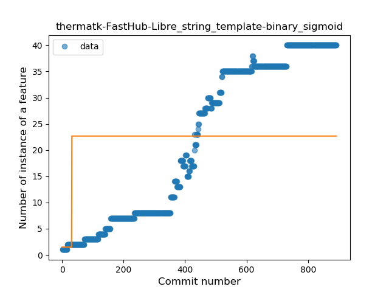
### <a name="func_with_default_value">Function with Default Value</a>
----
#### Functions
* **Constant Rise - Linear:** 
    * **R_Squared:** 0.96877721
* **Sudden Rise - Exponential:** 
    * **R_Squared:** 0.96973555
* **Sudden Rise Plateau - Logarithm:** 
    * **R_Squared:** 0.36167043

**Plots** :chart_with_upwards_trend:
-----

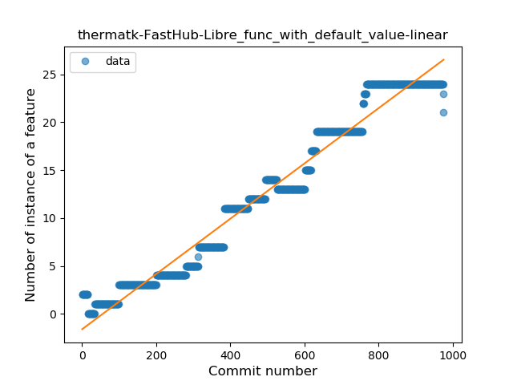
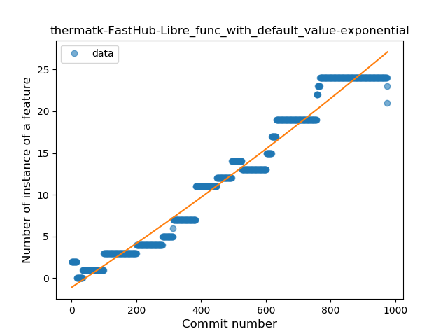
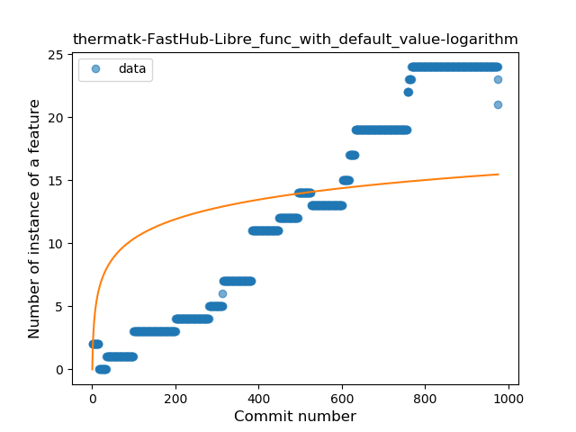
### <a name="singleton">Singleton</a>
----
#### Functions
* **Plateau Gradual Rise - Sigmoid:** 
    * **R_Squared:** 0.94231992
* **Constant Rise - Linear:** 
    * **R_Squared:** 0.9194023
* **Sudden Rise - Exponential:** 
    * **R_Squared:** 0.92616377
* **Sudden Rise Plateau - Logarithm:** 
    * **R_Squared:** 0.51913262

**Plots** :chart_with_upwards_trend:
-----

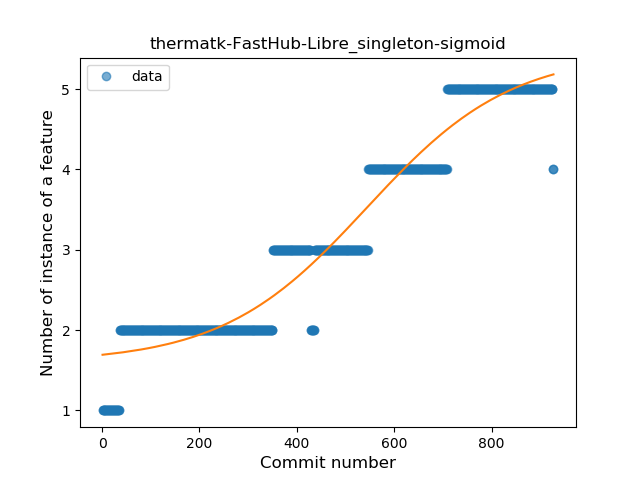
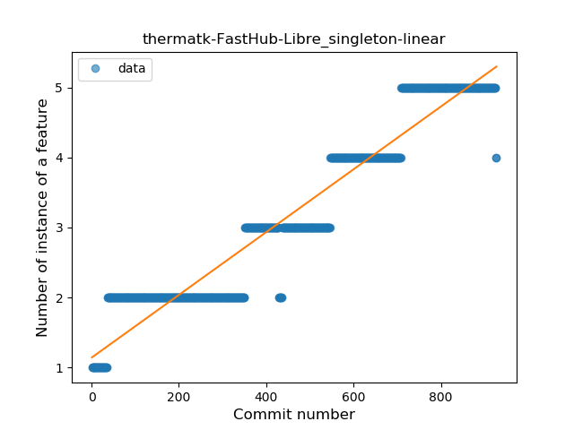
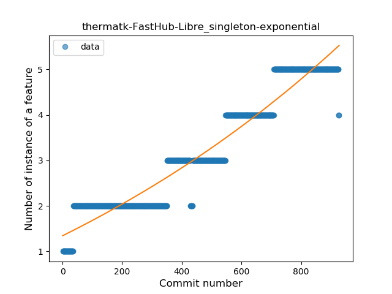
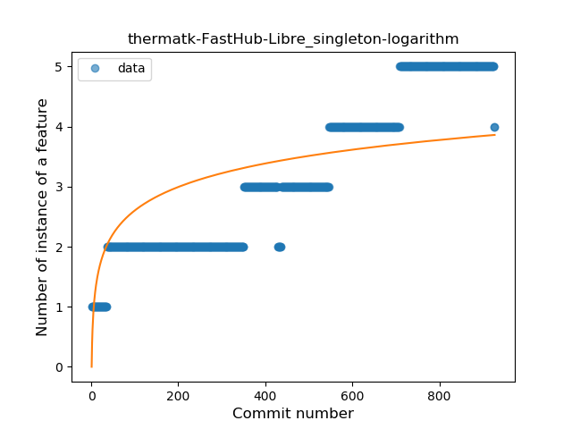
### <a name="smart_cast">Smart Cast</a>
----
#### Functions
* **Constant Rise - Linear:** 
    * **R_Squared:** 0.92332858
* **Sudden Rise - Exponential:** 
    * **R_Squared:** 0.92343456
* **Sudden Rise Plateau - Logarithm:** 
    * **R_Squared:** 0.38707078
* **Plateau Sudden Rise - Binary Sigmoid:** 
    * **R_Squared:** 0.02107592

**Plots** :chart_with_upwards_trend:
-----

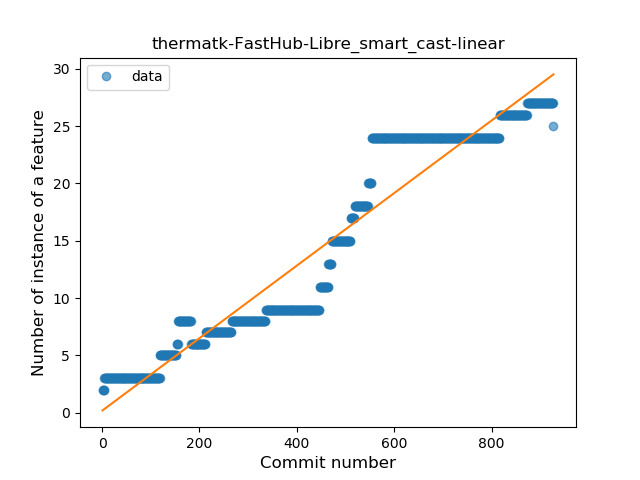
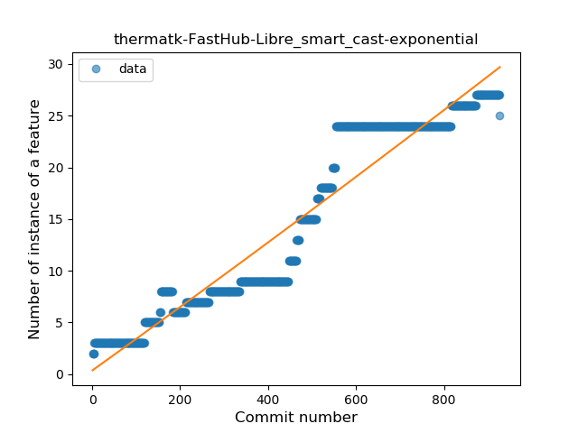
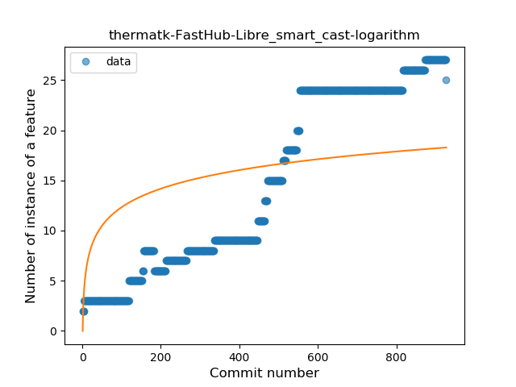
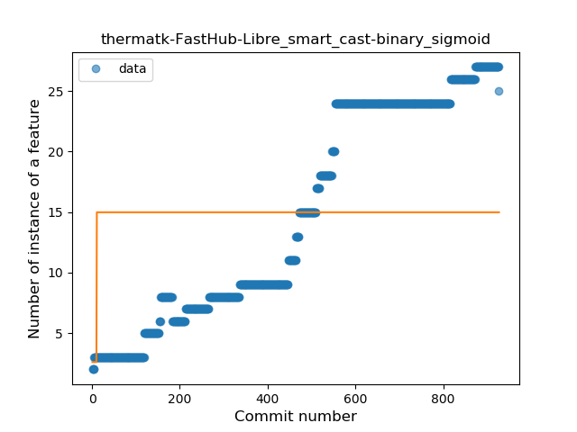
### <a name="func_call_with_named_arg">Function call with Named Argument</a>
----
#### Functions
* **Plateau Gradual Rise - Sigmoid:** 
    * **R_Squared:** 0.4718866
* **Constant Rise - Linear:** 
    * **R_Squared:** 0.23525683
* **Sudden Rise Plateau - Logarithm:** 
    * **R_Squared:** 0.1128353

**Plots** :chart_with_upwards_trend:
-----

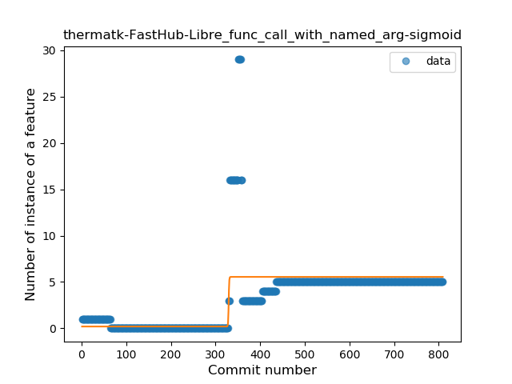
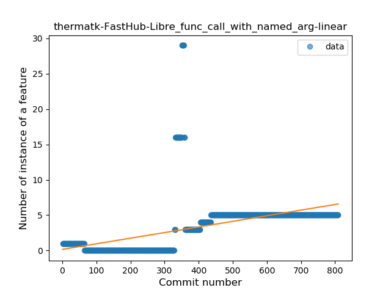
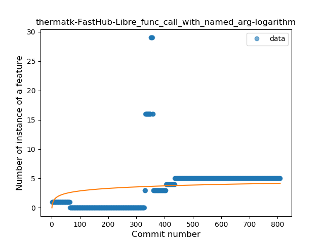
### <a name="data_class">Data Class</a>
----
#### Functions
* **Constant Rise - Linear:** 
    * **R_Squared:** 0.66606839
* **Sudden Rise Plateau - Logarithm:** 
    * **R_Squared:** 0.65771575

**Plots** :chart_with_upwards_trend:
-----

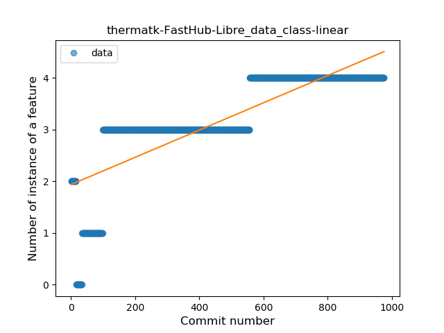
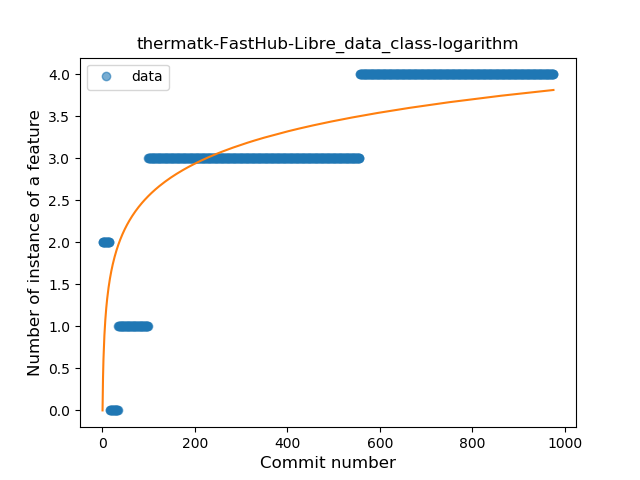
### <a name="extension_function">Extension Function</a>
----
#### Functions
* **Sudden Decline - Exponential:** 
    * **R_Squared:** 0.8357338
* **Constant Decline - Linear:** 
    * **R_Squared:** 0.70652261
* **Sudden Rise Plateau - Logarithm:** 
    * **R_Squared:** -0.0

**Plots** :chart_with_upwards_trend:
-----

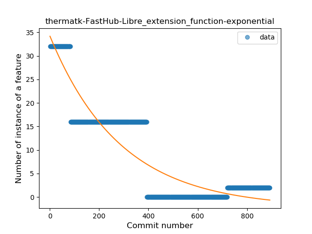
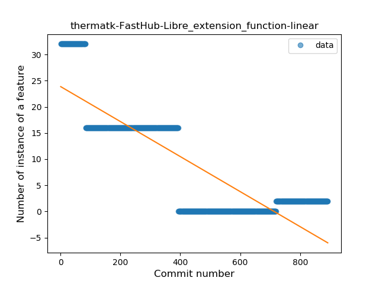
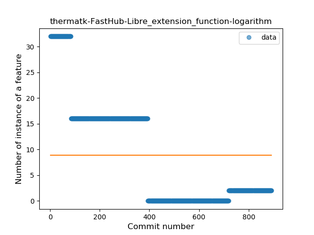
### <a name="property_delegation">Property Delegation</a>
----
#### Functions
* **Constant Decline - Linear:** 
    * **R_Squared:** 0.13831783
* **Sudden Decline - Exponential:** 
    * **R_Squared:** -0.0
* **Sudden Rise Plateau - Logarithm:** 
    * **R_Squared:** -0.0

**Plots** :chart_with_upwards_trend:
-----

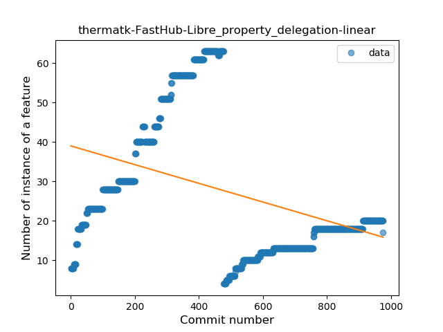
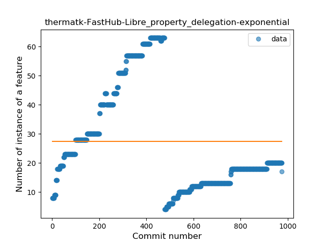
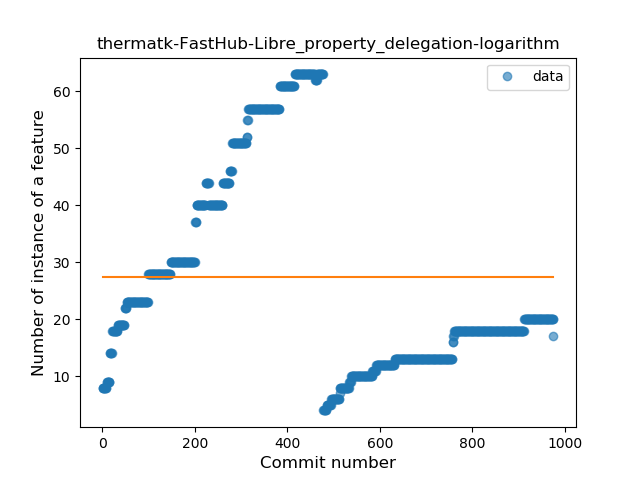
