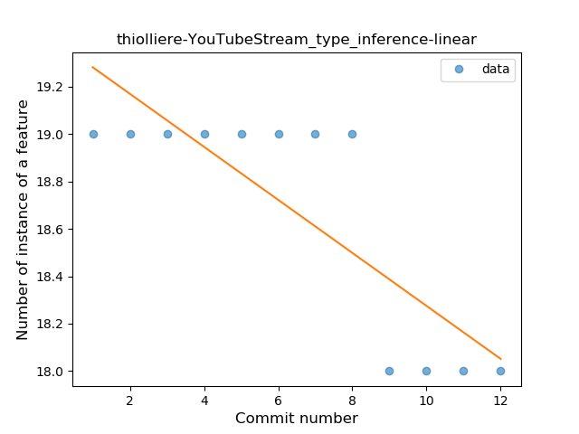
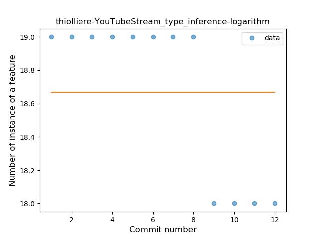
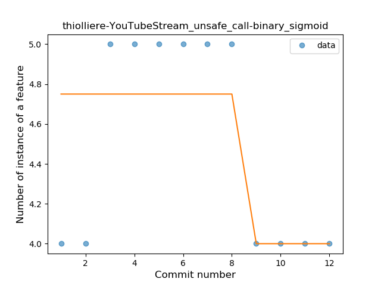
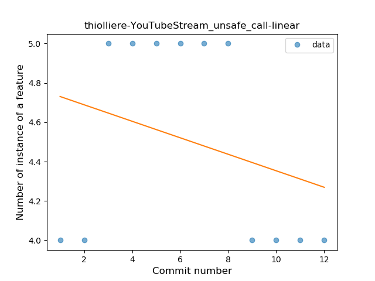

## thiolliere-YouTubeStream
----
#### Metrics provided by Detekt
* Number of lines of code 171
* Number of Kotlin files: 4
* Cyclomatic complexity: 17
* Cyclomatic complexity by thousands of lines: 236 

----
**2** features analyzed

*	<a href="#type_inference">Type Inference</a> 
*	<a href="#unsafe_call">Unsafe Call</a> 

### <a name="type_inference">Type Inference</a>
----
#### Functions
* **Instability - Polinomial 4:** 
    * **R_Squared:** 0.89277389
* **Constant Decline - Linear:** 
    * **R_Squared:** 0.67132867
* **Sudden Rise Plateau - Logarithm:** 
    * **R_Squared:** -0.0

**Plots** :chart_with_upwards_trend:
-----

### <a name="unsafe_call">Unsafe Call</a>
----
#### Functions
* **Instability - Polinomial 4:** 
    * **R_Squared:** 0.84447034
* **Plateau Sudden Decline - Binary Sigmoid:** 
    * **R_Squared:** 0.5
* **Constant Decline - Linear:** 
    * **R_Squared:** 0.08391608
* **Sudden Rise Plateau - Logarithm:** 
    * **R_Squared:** 0.0

**Plots** :chart_with_upwards_trend:
-----

