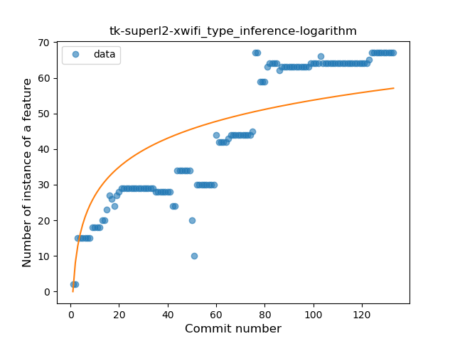

## tk-superl2-xwifi
----
#### Metrics provided by Detekt
* Number of lines of code 1101
* Number of Kotlin files: 7
* Cyclomatic complexity: 250
* Cyclomatic complexity by thousands of lines: 393 

----
**11** features analyzed

*	<a href="#type_inference">Type Inference</a> 
*	<a href="#lambda">Lambda</a> 
*	<a href="#safe_call">Safe Call</a> 
*	<a href="#when_expr">When expression</a> 
*	<a href="#unsafe_call">Unsafe Call</a> 
*	<a href="#companion_object">Companion Object</a> 
*	<a href="#string_template">String Template</a> 
*	<a href="#func_with_default_value">Function with Default Value</a> 
*	<a href="#singleton">Singleton</a> 
*	<a href="#smart_cast">Smart Cast</a> 
*	<a href="#func_call_with_named_arg">Function call with Named Argument</a> 

### <a name="type_inference">Type Inference</a>
----
#### Functions
* **Plateau Gradual Rise - Sigmoid:** 
    * **R_Squared:** 0.92446567
* **Constant Rise - Linear:** 
    * **R_Squared:** 0.88470194
* **Sudden Rise Plateau - Logarithm:** 
    * **R_Squared:** 0.66170237

**Plots** :chart_with_upwards_trend:
-----

### <a name="lambda">Lambda</a>
----
#### Functions
* **Sudden Rise - Exponential:** 
    * **R_Squared:** 0.91902505
* **Constant Rise - Linear:** 
    * **R_Squared:** 0.89377215
* **Sudden Rise Plateau - Logarithm:** 
    * **R_Squared:** 0.43797143
* **Plateau Sudden Rise - Binary Sigmoid:** 
    * **R_Squared:** 0.40361733

**Plots** :chart_with_upwards_trend:
-----

### <a name="safe_call">Safe Call</a>
----
#### Functions
* **Plateau Gradual Rise - Sigmoid:** 
    * **R_Squared:** 0.78485891
* **Sudden Rise - Exponential:** 
    * **R_Squared:** 0.64844597
* **Instability - Polinomial 3:** )
    * **R_Squared:** 0.6420019
* **Constant Rise - Linear:** 
    * **R_Squared:** 0.30045491
* **Sudden Rise Plateau - Logarithm:** 
    * **R_Squared:** 0.06779683

**Plots** :chart_with_upwards_trend:
-----

### <a name="when_expr">When expression</a>
----
#### Functions
* **Plateau Gradual Rise - Sigmoid:** 
    * **R_Squared:** 0.97839735
* **Constant Rise - Linear:** 
    * **R_Squared:** 0.86739455
* **Sudden Rise Plateau - Logarithm:** 
    * **R_Squared:** 0.44513913

**Plots** :chart_with_upwards_trend:
-----

### <a name="unsafe_call">Unsafe Call</a>
----
#### Functions
* **Constant Decline - Linear:** 
    * **R_Squared:** 0.01465824
* **Sudden Rise Plateau - Logarithm:** 
    * **R_Squared:** -0.0

**Plots** :chart_with_upwards_trend:
-----

### <a name="companion_object">Companion Object</a>
----
#### Functions
* **Sudden Decline - Exponential:** 
    * **R_Squared:** 0.0177727
* **Constant Decline - Linear:** 
    * **R_Squared:** 0.00432607
* **Sudden Rise Plateau - Logarithm:** 
    * **R_Squared:** -0.0

**Plots** :chart_with_upwards_trend:
-----

### <a name="string_template">String Template</a>
----
#### Functions
* **Plateau Gradual Rise - Sigmoid:** 
    * **R_Squared:** 0.96345395
* **Constant Rise - Linear:** 
    * **R_Squared:** 0.90651288
* **Sudden Rise - Exponential:** 
    * **R_Squared:** 0.91545253
* **Sudden Rise Plateau - Logarithm:** 
    * **R_Squared:** 0.42605118

**Plots** :chart_with_upwards_trend:
-----

### <a name="func_with_default_value">Function with Default Value</a>
----
#### Functions
* **Plateau Gradual Rise - Sigmoid:** 
    * **R_Squared:** 0.96026242
* **Constant Rise - Linear:** 
    * **R_Squared:** 0.85018749
* **Sudden Rise Plateau - Logarithm:** 
    * **R_Squared:** 0.59284254

**Plots** :chart_with_upwards_trend:
-----

### <a name="singleton">Singleton</a>
----
#### Functions
* **Plateau Sudden Decline - Binary Sigmoid:** 
    * **R_Squared:** 0.93977011
* **Sudden Decline - Exponential:** 
    * **R_Squared:** 0.73826114
* **Constant Decline - Linear:** 
    * **R_Squared:** 0.72173227
* **Sudden Rise Plateau - Logarithm:** 
    * **R_Squared:** -0.0

**Plots** :chart_with_upwards_trend:
-----

### <a name="smart_cast">Smart Cast</a>
----
#### Functions
* **Plateau Sudden Decline - Binary Sigmoid:** 
    * **R_Squared:** 1.0
* **Sudden Decline - Exponential:** 
    * **R_Squared:** 0.8032912
* **Constant Decline - Linear:** 
    * **R_Squared:** 0.21521175
* **Sudden Rise Plateau - Logarithm:** 
    * **R_Squared:** -0.0

**Plots** :chart_with_upwards_trend:
-----

### <a name="func_call_with_named_arg">Function call with Named Argument</a>
----
#### Functions
* **Constant Rise - Linear:** 
    * **R_Squared:** 0.42768668
* **Plateau Sudden Rise - Binary Sigmoid:** 
    * **R_Squared:** 0.41210669
* **Sudden Rise Plateau - Logarithm:** 
    * **R_Squared:** 0.34093204

**Plots** :chart_with_upwards_trend:
-----

