## tuskyapp-Tusky
----
#### Metrics provided by Detekt
* Number of lines of code 9004
* Number of Kotlin files: 85
* Cyclomatic complexity: 1125
* Cyclomatic complexity by thousands of lines: 253 

----
**16** features analyzed

*	<a href="#type_inference">Type Inference</a> 
*	<a href="#lambda">Lambda</a> 
*	<a href="#safe_call">Safe Call</a> 
*	<a href="#when_expr">When expression</a> 
*	<a href="#companion_object">Companion Object</a> 
*	<a href="#unsafe_call">Unsafe Call</a> 
*	<a href="#string_template">String Template</a> 
*	<a href="#func_with_default_value">Function with Default Value</a> 
*	<a href="#singleton">Singleton</a> 
*	<a href="#smart_cast">Smart Cast</a> 
*	<a href="#range_expr">Range Expression</a> 
*	<a href="#func_call_with_named_arg">Function call with Named Argument</a> 
*	<a href="#data_class">Data Class</a> 
*	<a href="#extension_function">Extension Function</a> 
*	<a href="#property_delegation">Property Delegation</a> 
*	<a href="#destructuring_declaration">Destructuring Declaration</a> 

### <a name="type_inference">Type Inference</a>
----
#### Functions
* **Constant Rise - Linear:** 
    * **R_Squared:** 0.96018035
* **Plateau Sudden Rise - Binary Sigmoid:** 
    * **R_Squared:** 0.69118553
* **Sudden Rise Plateau - Logarithm:** 
    * **R_Squared:** 0.47685392

**Plots** :chart_with_upwards_trend:
-----

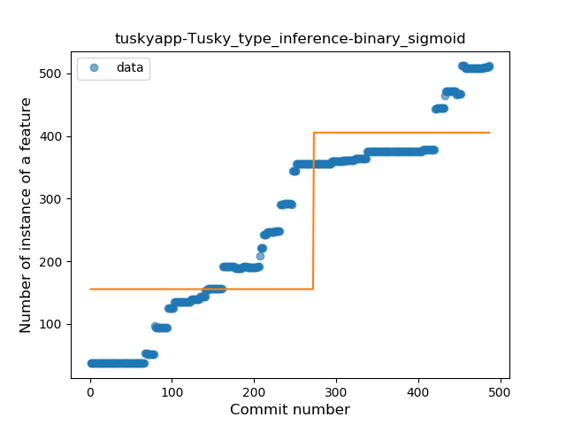
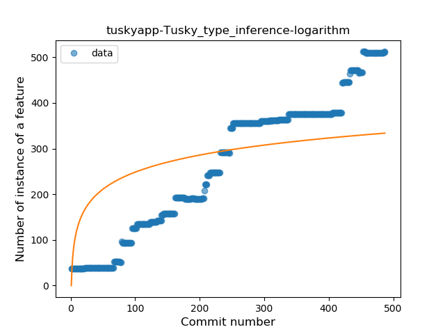
### <a name="lambda">Lambda</a>
----
#### Functions
* **Constant Rise - Linear:** 
    * **R_Squared:** 0.96515864
* **Sudden Rise - Exponential:** 
    * **R_Squared:** 0.96702968
* **Sudden Rise Plateau - Logarithm:** 
    * **R_Squared:** 0.42944291

**Plots** :chart_with_upwards_trend:
-----

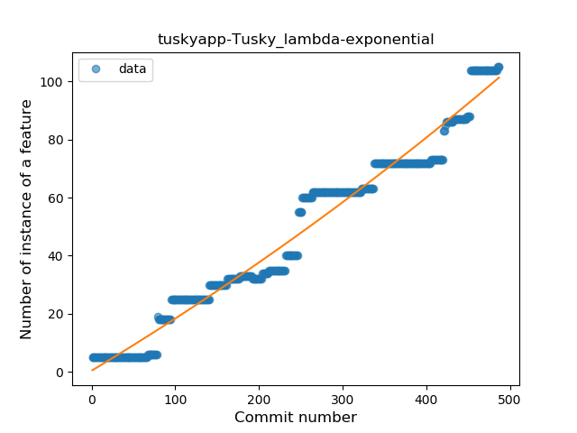
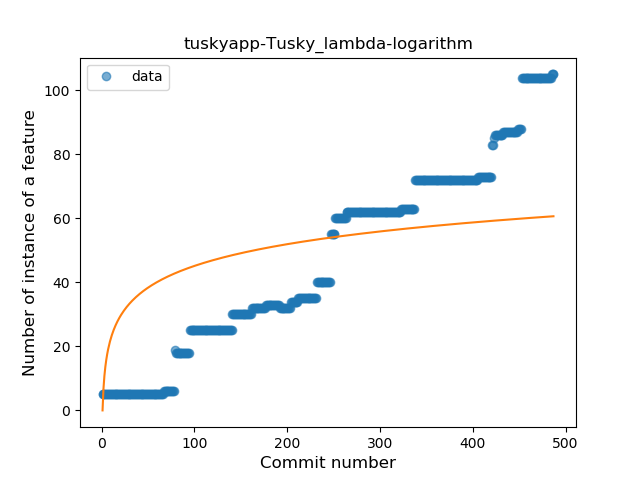
### <a name="safe_call">Safe Call</a>
----
#### Functions
* **Constant Rise - Linear:** 
    * **R_Squared:** 0.96460696
* **Sudden Rise - Exponential:** 
    * **R_Squared:** 0.96615479
* **Sudden Rise Plateau - Logarithm:** 
    * **R_Squared:** 0.42580623
* **Plateau Gradual Rise - Sigmoid:** 
    * **R_Squared:** 0.17828689

**Plots** :chart_with_upwards_trend:
-----

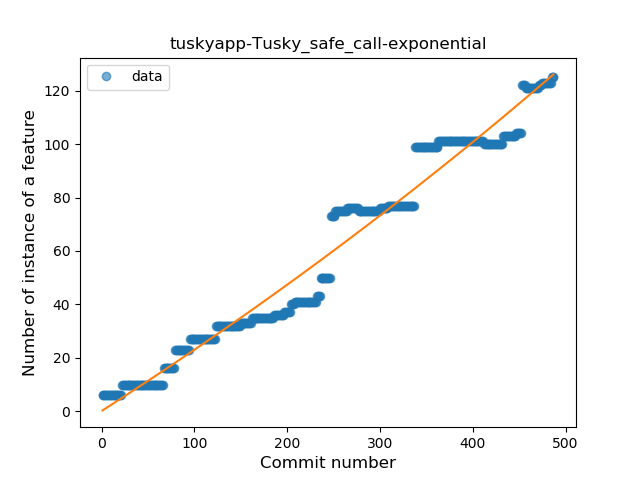

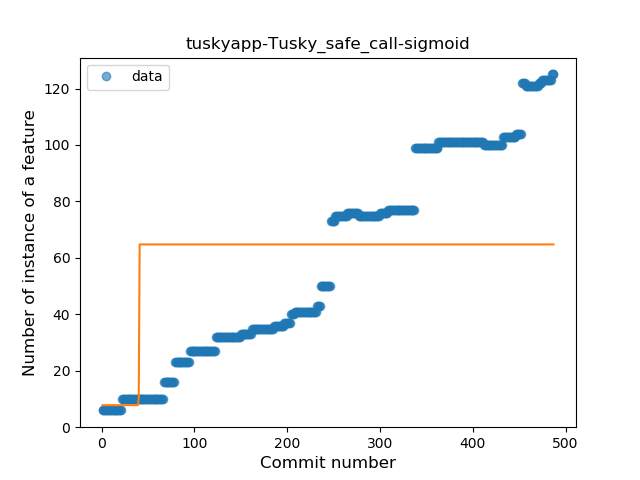
### <a name="when_expr">When expression</a>
----
#### Functions
* **Constant Rise - Linear:** 
    * **R_Squared:** 0.94948152
* **Sudden Rise Plateau - Logarithm:** 
    * **R_Squared:** 0.43983761
* **Plateau Sudden Rise - Binary Sigmoid:** 
    * **R_Squared:** 0.14237732

**Plots** :chart_with_upwards_trend:
-----

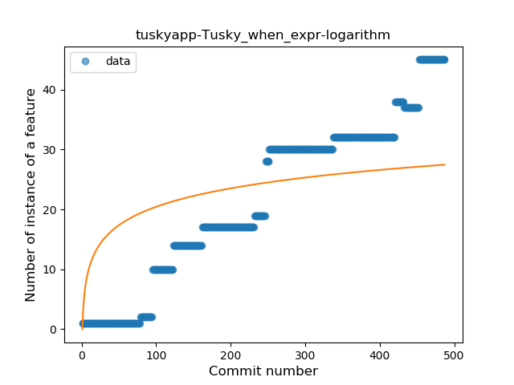

### <a name="companion_object">Companion Object</a>
----
#### Functions
* **Constant Rise - Linear:** 
    * **R_Squared:** 0.92765161
* **Sudden Rise - Exponential:** 
    * **R_Squared:** 0.92930432
* **Sudden Rise Plateau - Logarithm:** 
    * **R_Squared:** 0.43427127

**Plots** :chart_with_upwards_trend:
-----

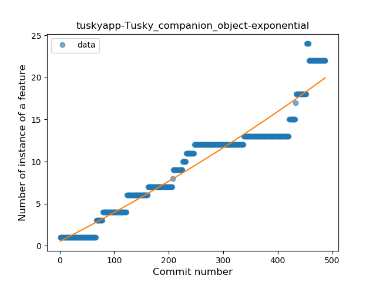
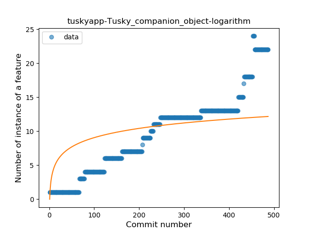
### <a name="unsafe_call">Unsafe Call</a>
----
#### Functions
* **Sudden Rise - Exponential:** 
    * **R_Squared:** 0.81276221
* **Constant Rise - Linear:** 
    * **R_Squared:** 0.7928494
* **Sudden Rise Plateau - Logarithm:** 
    * **R_Squared:** 0.41780358

**Plots** :chart_with_upwards_trend:
-----

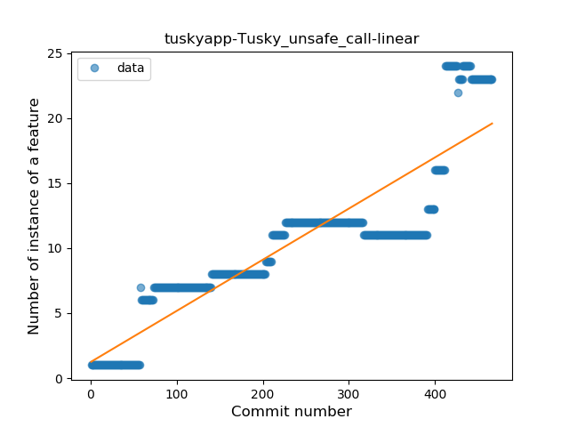
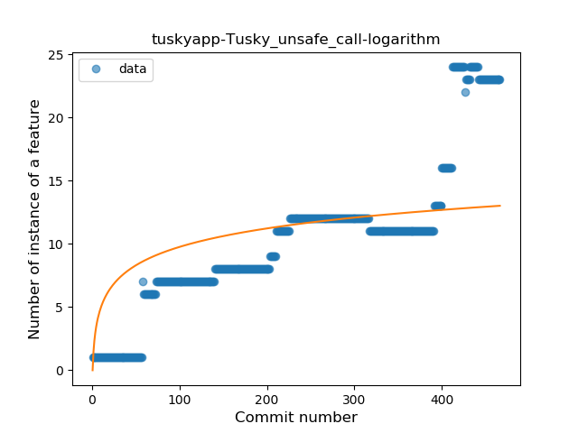
### <a name="string_template">String Template</a>
----
#### Functions
* **Constant Rise - Linear:** 
    * **R_Squared:** 0.91110413
* **Sudden Rise Plateau - Logarithm:** 
    * **R_Squared:** 0.54908137
* **Plateau Sudden Rise - Binary Sigmoid:** 
    * **R_Squared:** 0.18208677

**Plots** :chart_with_upwards_trend:
-----

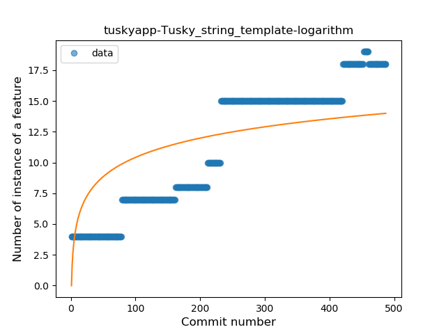
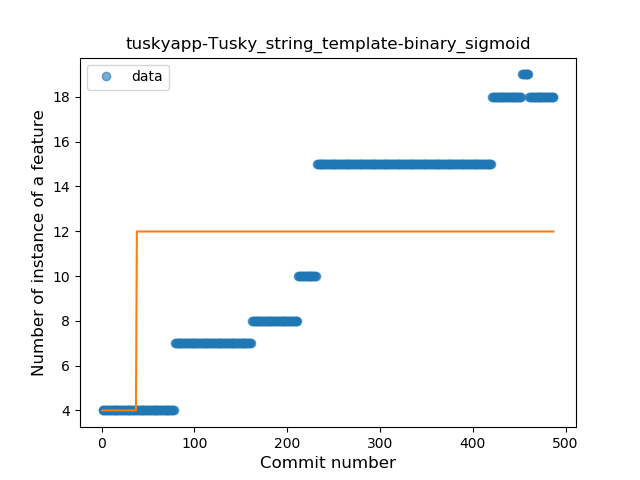
### <a name="func_with_default_value">Function with Default Value</a>
----
#### Functions
* **Plateau Gradual Rise - Sigmoid:** 
    * **R_Squared:** 0.94249252
* **Constant Rise - Linear:** 
    * **R_Squared:** 0.81036799
* **Sudden Rise Plateau - Logarithm:** 
    * **R_Squared:** 0.541869

**Plots** :chart_with_upwards_trend:
-----

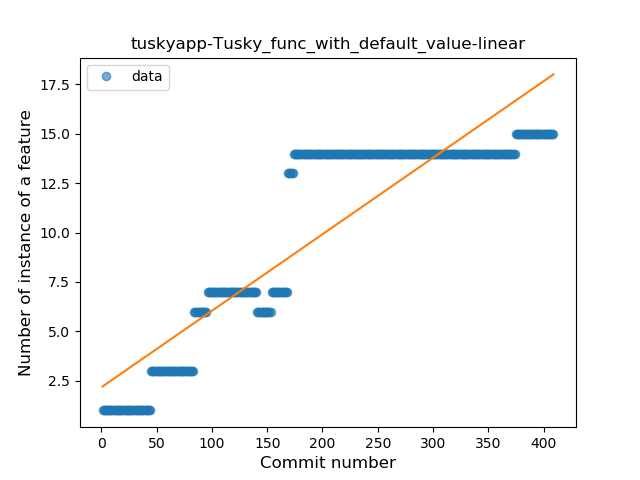
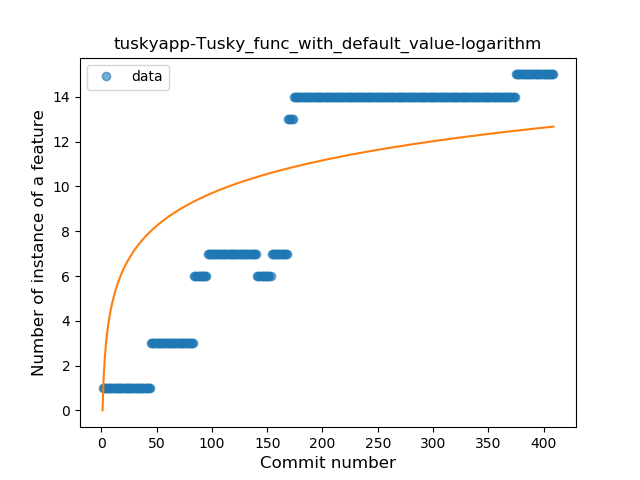
### <a name="singleton">Singleton</a>
----
#### Functions
* **Plateau Gradual Rise - Sigmoid:** 
    * **R_Squared:** 0.85673175
* **Sudden Rise Plateau - Logarithm:** 
    * **R_Squared:** 0.80974226
* **Constant Rise - Linear:** 
    * **R_Squared:** 0.61991713

**Plots** :chart_with_upwards_trend:
-----

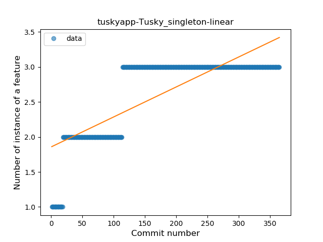
### <a name="smart_cast">Smart Cast</a>
----
#### Functions
* **Constant Rise - Linear:** 
    * **R_Squared:** 0.85573793
* **Sudden Rise - Exponential:** 
    * **R_Squared:** 0.85902742
* **Sudden Rise Plateau - Logarithm:** 
    * **R_Squared:** 0.43011082
* **Plateau Sudden Rise - Binary Sigmoid:** 
    * **R_Squared:** 0.09009408

**Plots** :chart_with_upwards_trend:
-----

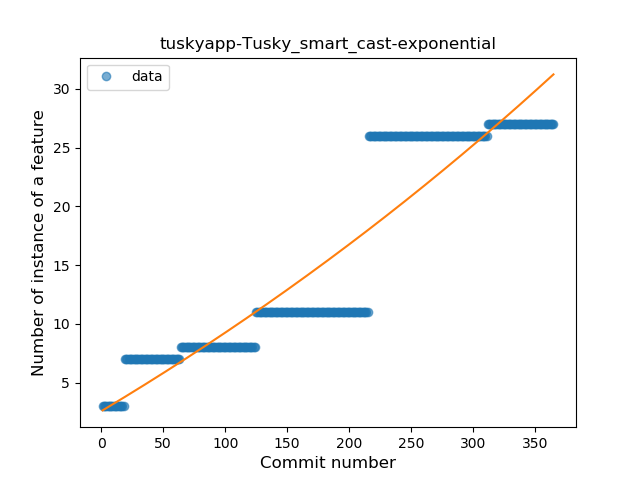
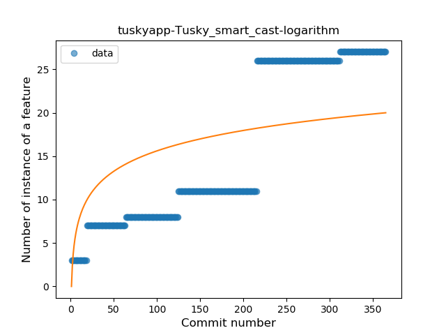

### <a name="range_expr">Range Expression</a>
----
#### Functions
* **Plateau Sudden Rise - Binary Sigmoid:** 
    * **R_Squared:** 1.0
* **Constant Rise - Linear:** 
    * **R_Squared:** 0.66839378
* **Sudden Rise Plateau - Logarithm:** 
    * **R_Squared:** 0.61261162

**Plots** :chart_with_upwards_trend:
-----

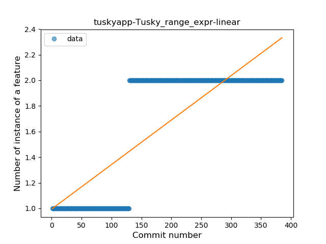
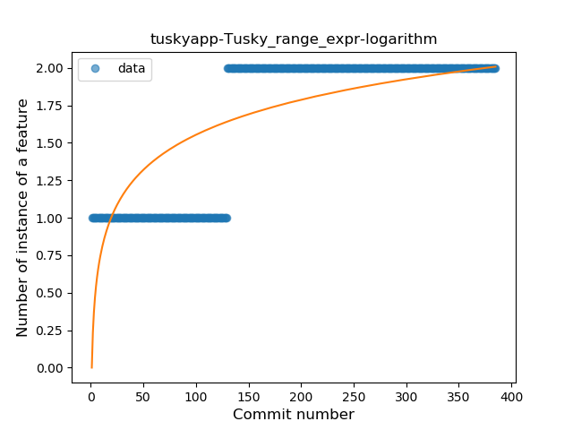
### <a name="func_call_with_named_arg">Function call with Named Argument</a>
----
#### Functions
* **Constant Rise - Linear:** 
    * **R_Squared:** 0.92275216
* **Sudden Rise Plateau - Logarithm:** 
    * **R_Squared:** 0.51483659
* **Plateau Sudden Rise - Binary Sigmoid:** 
    * **R_Squared:** 0.03614576

**Plots** :chart_with_upwards_trend:
-----

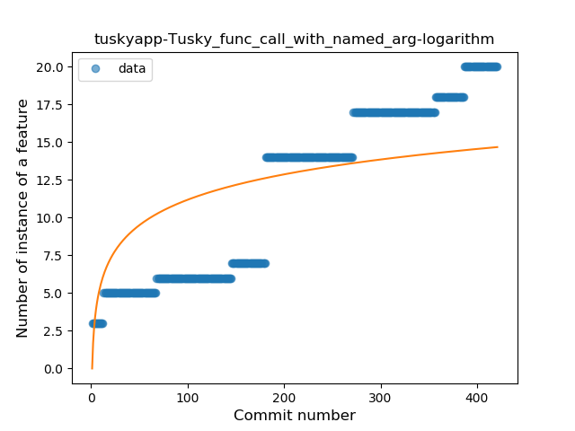
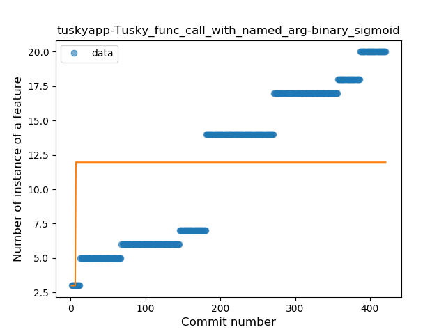
### <a name="data_class">Data Class</a>
----
#### Functions
* **Constant Rise - Linear:** 
    * **R_Squared:** 0.79756053
* **Sudden Rise Plateau - Logarithm:** 
    * **R_Squared:** 0.66168517
* **Plateau Sudden Rise - Binary Sigmoid:** 
    * **R_Squared:** 0.32738455

**Plots** :chart_with_upwards_trend:
-----

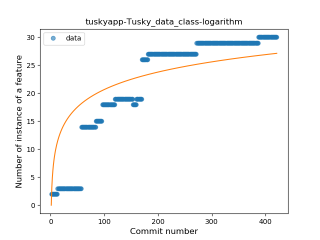
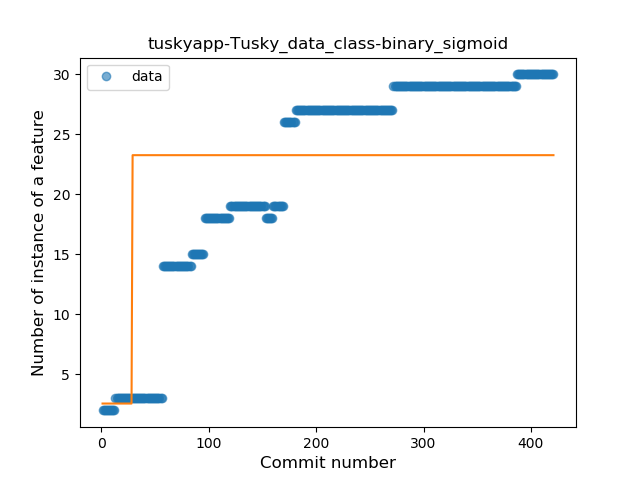
### <a name="extension_function">Extension Function</a>
----
#### Functions
* **Plateau Gradual Rise - Sigmoid:** 
    * **R_Squared:** 0.97598526
* **Constant Rise - Linear:** 
    * **R_Squared:** 0.74819225
* **Sudden Rise Plateau - Logarithm:** 
    * **R_Squared:** 0.46417063

**Plots** :chart_with_upwards_trend:
-----

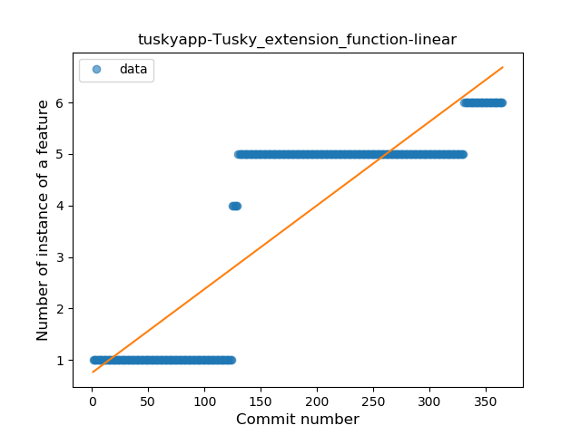
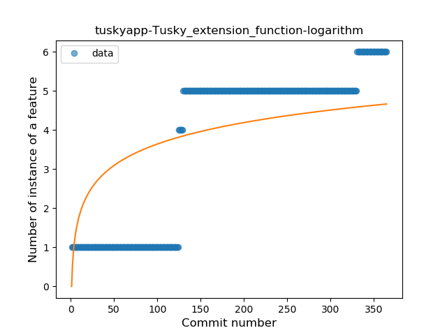
### <a name="property_delegation">Property Delegation</a>
----
#### Functions
* **Plateau Sudden Rise - Binary Sigmoid:** 
    * **R_Squared:** 1.0
* **Sudden Rise - Exponential:** 
    * **R_Squared:** 0.794611
* **Constant Rise - Linear:** 
    * **R_Squared:** 0.29962779
* **Sudden Rise Plateau - Logarithm:** 
    * **R_Squared:** 0.11807986

**Plots** :chart_with_upwards_trend:
-----

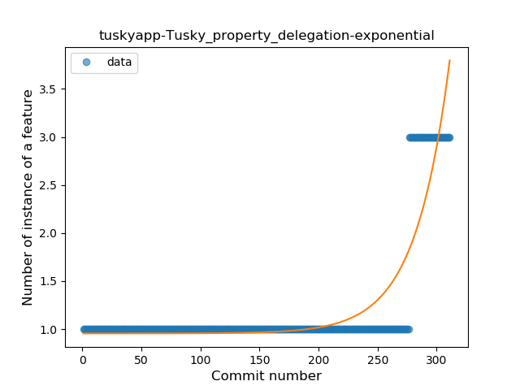
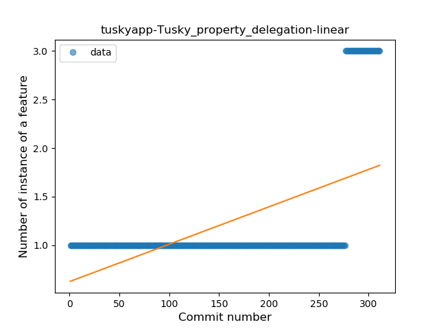
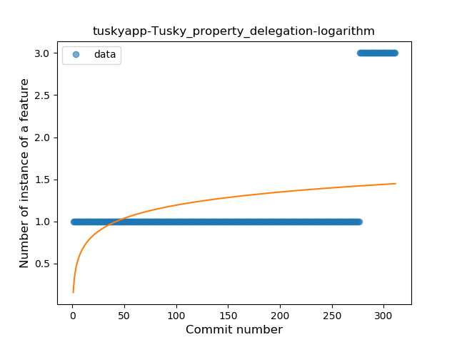
### <a name="destructuring_declaration">Destructuring Declaration</a>
----
#### Functions
* **Plateau Sudden Rise - Binary Sigmoid:** 
    * **R_Squared:** 1.0
* **Sudden Rise Plateau - Logarithm:** 
    * **R_Squared:** 0.64713532
* **Constant Rise - Linear:** 
    * **R_Squared:** 0.38583214

**Plots** :chart_with_upwards_trend:
-----

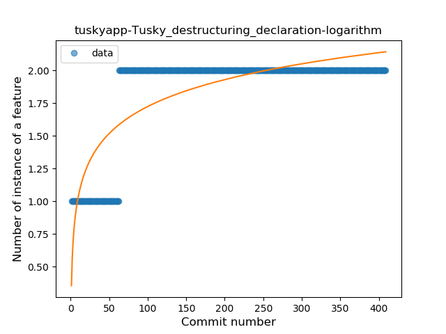
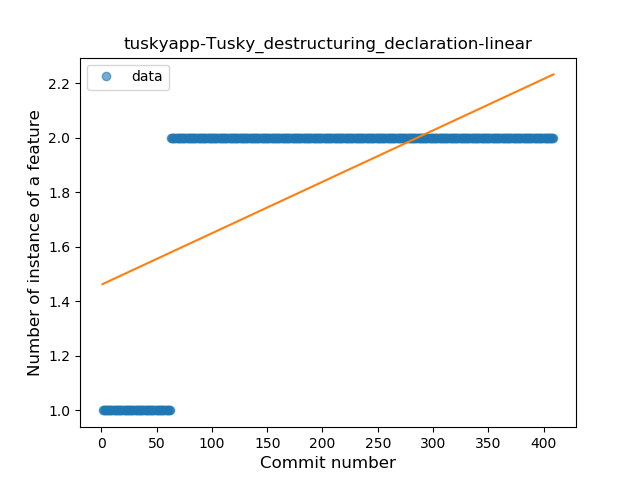
