## tw-shounenwind-kmnbottool
----
#### Metrics provided by Detekt
* Number of lines of code 2434
* Number of Kotlin files: 27
* Cyclomatic complexity: 263
* Cyclomatic complexity by thousands of lines: 177 

----
**14** features analyzed

*	<a href="#type_inference">Type Inference</a> 
*	<a href="#lambda">Lambda</a> 
*	<a href="#safe_call">Safe Call</a> 
*	<a href="#when_expr">When expression</a> 
*	<a href="#unsafe_call">Unsafe Call</a> 
*	<a href="#companion_object">Companion Object</a> 
*	<a href="#string_template">String Template</a> 
*	<a href="#singleton">Singleton</a> 
*	<a href="#range_expr">Range Expression</a> 
*	<a href="#smart_cast">Smart Cast</a> 
*	<a href="#extension_function">Extension Function</a> 
*	<a href="#property_delegation">Property Delegation</a> 
*	<a href="#inline_func">Inline Function</a> 
*	<a href="#coroutine">Coroutine</a> 

### <a name="type_inference">Type Inference</a>
----
#### Functions
* **Constant Rise - Linear:** 
    * **R_Squared:** 0.89970489
* **Sudden Rise Plateau - Logarithm:** 
    * **R_Squared:** 0.84928132

**Plots** :chart_with_upwards_trend:
-----

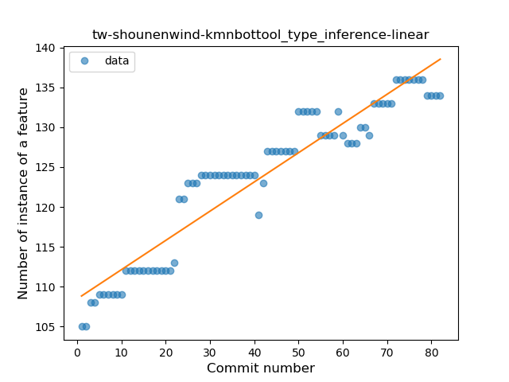
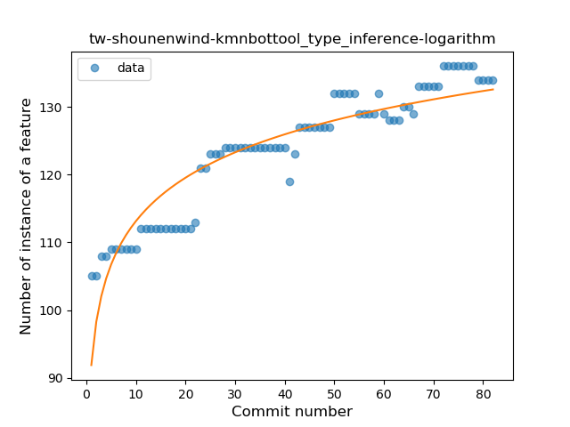
### <a name="lambda">Lambda</a>
----
#### Functions
* **Constant Rise - Linear:** 
    * **R_Squared:** 0.93406274
* **Sudden Rise Plateau - Logarithm:** 
    * **R_Squared:** 0.75492937

**Plots** :chart_with_upwards_trend:
-----

### <a name="safe_call">Safe Call</a>
----
#### Functions
* **Sudden Rise - Exponential:** 
    * **R_Squared:** 0.88786934
* **Instability - Polinomial 3:** )
    * **R_Squared:** 0.88967434
* **Constant Rise - Linear:** 
    * **R_Squared:** 0.55249031
* **Sudden Rise Plateau - Logarithm:** 
    * **R_Squared:** 0.23547532

**Plots** :chart_with_upwards_trend:
-----

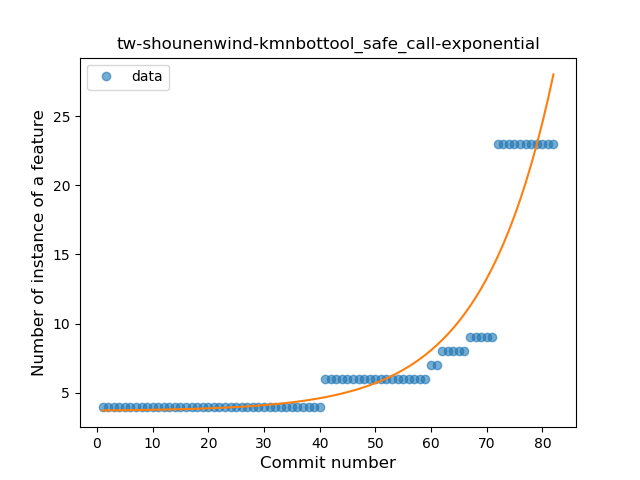

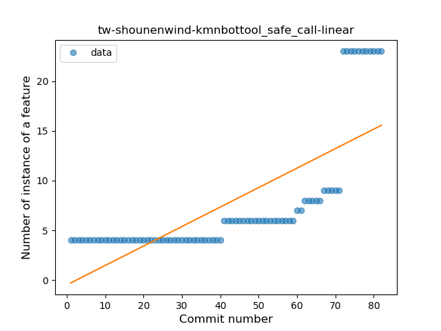

### <a name="when_expr">When expression</a>
----
#### Functions
* **Plateau Sudden Decline - Binary Sigmoid:** 
    * **R_Squared:** 0.81713615
* **Constant Decline - Linear:** 
    * **R_Squared:** 0.43118955
* **Sudden Rise Plateau - Logarithm:** 
    * **R_Squared:** -0.0

**Plots** :chart_with_upwards_trend:
-----

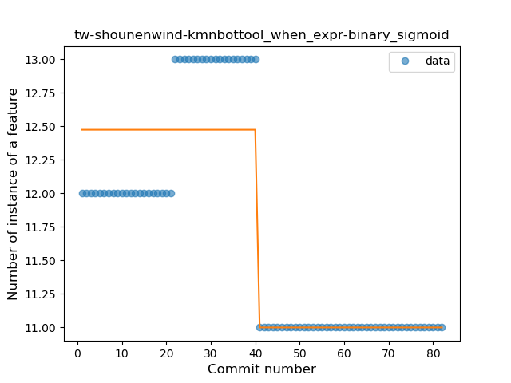

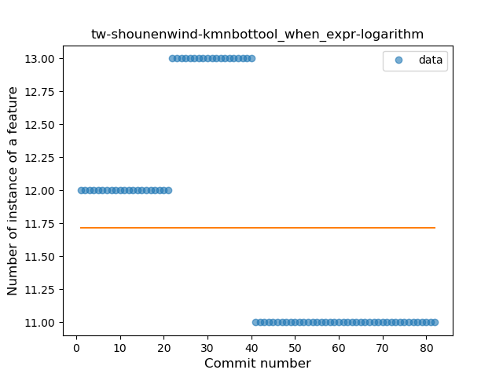
### <a name="unsafe_call">Unsafe Call</a>
----
#### Functions
* **Constant Decline - Linear:** 
    * **R_Squared:** 0.45401411
* **Sudden Rise Plateau - Logarithm:** 
    * **R_Squared:** 0.0

**Plots** :chart_with_upwards_trend:
-----

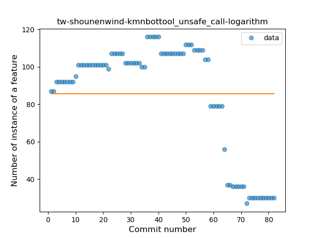
### <a name="companion_object">Companion Object</a>
----
#### Functions
* **Sudden Rise - Exponential:** 
    * **R_Squared:** 0.76955774
* **Constant Rise - Linear:** 
    * **R_Squared:** 0.57161981
* **Sudden Rise Plateau - Logarithm:** 
    * **R_Squared:** 0.28351465

**Plots** :chart_with_upwards_trend:
-----

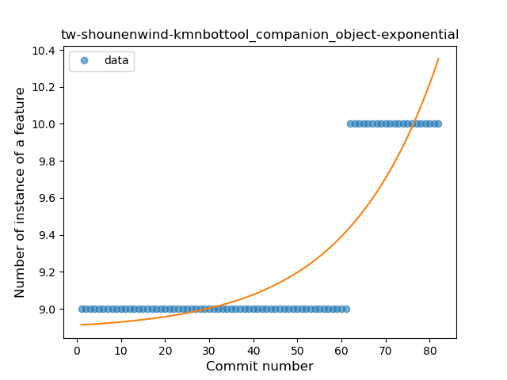

### <a name="string_template">String Template</a>
----
#### Functions
* **Constant Rise - Linear:** 
    * **R_Squared:** 0.74966533
* **Sudden Rise - Exponential:** 
    * **R_Squared:** 0.75016142
* **Sudden Rise Plateau - Logarithm:** 
    * **R_Squared:** 0.5174076

**Plots** :chart_with_upwards_trend:
-----

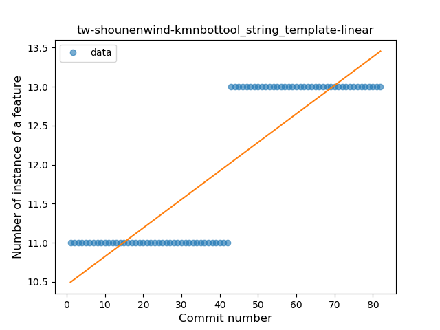

### <a name="singleton">Singleton</a>
----
#### Functions
* **Plateau Sudden Decline - Binary Sigmoid:** 
    * **R_Squared:** 1.0
* **Constant Decline - Linear:** 
    * **R_Squared:** 0.29317269
* **Sudden Rise Plateau - Logarithm:** 
    * **R_Squared:** 0.0

**Plots** :chart_with_upwards_trend:
-----

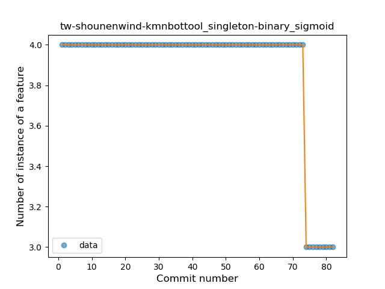

### <a name="range_expr">Range Expression</a>
----
#### Functions
* **Constant Decline - Linear:** 
    * **R_Squared:** 0.79621638
* **Sudden Decline - Exponential:** 
    * **R_Squared:** 0.79752458
* **Sudden Rise Plateau - Logarithm:** 
    * **R_Squared:** -0.0

**Plots** :chart_with_upwards_trend:
-----

### <a name="smart_cast">Smart Cast</a>
----
#### Functions
* **Constant Decline - Linear:** 
    * **R_Squared:** 0.34850513
* **Sudden Rise Plateau - Logarithm:** 
    * **R_Squared:** 0.0

**Plots** :chart_with_upwards_trend:
-----

### <a name="extension_function">Extension Function</a>
----
#### Functions
* **Instability - Polinomial 4:** 
    * **R_Squared:** 0.88410368
* **Sudden Rise - Exponential:** 
    * **R_Squared:** 0.80886466
* **Constant Rise - Linear:** 
    * **R_Squared:** 0.59752979
* **Sudden Rise Plateau - Logarithm:** 
    * **R_Squared:** 0.32171326

**Plots** :chart_with_upwards_trend:
-----

### <a name="property_delegation">Property Delegation</a>
----
#### Functions
* **Plateau Sudden Rise - Binary Sigmoid:** 
    * **R_Squared:** 0.41070223
* **Sudden Rise Plateau - Logarithm:** 
    * **R_Squared:** 0.13451781
* **Constant Rise - Linear:** 
    * **R_Squared:** 0.02737002

**Plots** :chart_with_upwards_trend:
-----

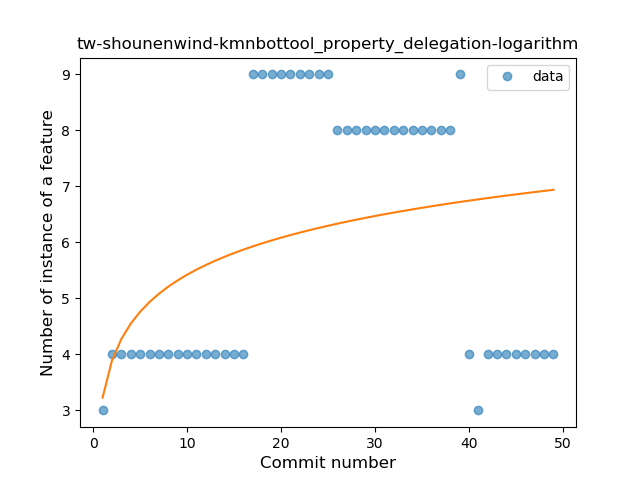

### <a name="inline_func">Inline Function</a>
----
#### Functions
* **Sudden Rise - Exponential:** 
    * **R_Squared:** 0.87341478
* **Plateau Gradual Rise - Sigmoid:** 
    * **R_Squared:** 0.87800798
* **Constant Rise - Linear:** 
    * **R_Squared:** 0.85944525
* **Sudden Rise Plateau - Logarithm:** 
    * **R_Squared:** 0.52169391

**Plots** :chart_with_upwards_trend:
-----

### <a name="coroutine">Coroutine</a>
----
#### Functions
* **Plateau Gradual Rise - Sigmoid:** 
    * **R_Squared:** 0.99794872
* **Instability - Polinomial 4:** 
    * **R_Squared:** 0.89788013
* **Sudden Rise - Exponential:** 
    * **R_Squared:** 0.77935527
* **Constant Rise - Linear:** 
    * **R_Squared:** 0.72773167
* **Sudden Rise Plateau - Logarithm:** 
    * **R_Squared:** 0.36983278

**Plots** :chart_with_upwards_trend:
-----

