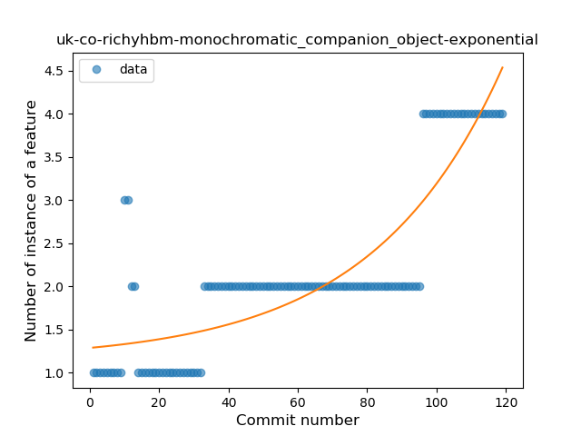
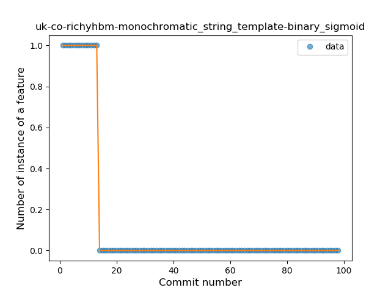

## uk-co-richyhbm-monochromatic
----
#### Metrics provided by Detekt
* Number of lines of code 1742
* Number of Kotlin files: 30
* Cyclomatic complexity: 277
* Cyclomatic complexity by thousands of lines: 305 

----
**9** features analyzed

*	<a href="#type_inference">Type Inference</a> 
*	<a href="#lambda">Lambda</a> 
*	<a href="#safe_call">Safe Call</a> 
*	<a href="#when_expr">When expression</a> 
*	<a href="#unsafe_call">Unsafe Call</a> 
*	<a href="#companion_object">Companion Object</a> 
*	<a href="#string_template">String Template</a> 
*	<a href="#singleton">Singleton</a> 
*	<a href="#property_delegation">Property Delegation</a> 

### <a name="type_inference">Type Inference</a>
----
#### Functions
* **Constant Rise - Linear:** 
    * **R_Squared:** 0.96832498
* **Plateau Gradual Rise - Sigmoid:** 
    * **R_Squared:** 0.69470848
* **Sudden Rise Plateau - Logarithm:** 
    * **R_Squared:** 0.61004293

**Plots** :chart_with_upwards_trend:
-----

### <a name="lambda">Lambda</a>
----
#### Functions
* **Constant Rise - Linear:** 
    * **R_Squared:** 0.95239615
* **Sudden Rise - Exponential:** 
    * **R_Squared:** 0.96066347
* **Sudden Rise Plateau - Logarithm:** 
    * **R_Squared:** 0.5486234

**Plots** :chart_with_upwards_trend:
-----

### <a name="safe_call">Safe Call</a>
----
#### Functions
* **Plateau Sudden Rise - Binary Sigmoid:** 
    * **R_Squared:** 0.86826386
* **Constant Rise - Linear:** 
    * **R_Squared:** 0.41034183
* **Sudden Rise Plateau - Logarithm:** 
    * **R_Squared:** 0.39717621

**Plots** :chart_with_upwards_trend:
-----

### <a name="when_expr">When expression</a>
----
#### Functions
* **Sudden Rise - Exponential:** 
    * **R_Squared:** 0.93392272
* **Constant Rise - Linear:** 
    * **R_Squared:** 0.91440915
* **Sudden Rise Plateau - Logarithm:** 
    * **R_Squared:** 0.52228848

**Plots** :chart_with_upwards_trend:
-----

### <a name="unsafe_call">Unsafe Call</a>
----
#### Functions
* **Plateau Sudden Decline - Binary Sigmoid:** 
    * **R_Squared:** 0.7121271
* **Constant Decline - Linear:** 
    * **R_Squared:** 0.53593837
* **Sudden Rise Plateau - Logarithm:** 
    * **R_Squared:** -0.0

**Plots** :chart_with_upwards_trend:
-----

### <a name="companion_object">Companion Object</a>
----
#### Functions
* **Sudden Rise - Exponential:** 
    * **R_Squared:** 0.76156415
* **Constant Rise - Linear:** 
    * **R_Squared:** 0.66684817
* **Sudden Rise Plateau - Logarithm:** 
    * **R_Squared:** 0.41429071

**Plots** :chart_with_upwards_trend:
-----

### <a name="string_template">String Template</a>
----
#### Functions
* **Plateau Sudden Decline - Binary Sigmoid:** 
    * **R_Squared:** 1.0
* **Sudden Decline - Exponential:** 
    * **R_Squared:** 0.7914698
* **Constant Decline - Linear:** 
    * **R_Squared:** 0.34520462
* **Sudden Rise Plateau - Logarithm:** 
    * **R_Squared:** -0.0

**Plots** :chart_with_upwards_trend:
-----

### <a name="singleton">Singleton</a>
----
#### Functions
* **Plateau Sudden Rise - Binary Sigmoid:** 
    * **R_Squared:** 1.0
* **Sudden Rise Plateau - Logarithm:** 
    * **R_Squared:** 0.30687632
* **Constant Rise - Linear:** 
    * **R_Squared:** 0.07372881

**Plots** :chart_with_upwards_trend:
-----

### <a name="property_delegation">Property Delegation</a>
----
#### Functions
* **Constant Rise - Linear:** 
    * **R_Squared:** 0.91763944
* **Sudden Rise - Exponential:** 
    * **R_Squared:** 0.91771072
* **Sudden Rise Plateau - Logarithm:** 
    * **R_Squared:** 0.76772913

**Plots** :chart_with_upwards_trend:
-----

