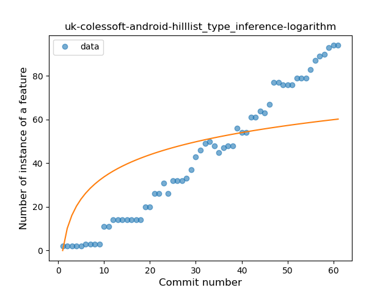
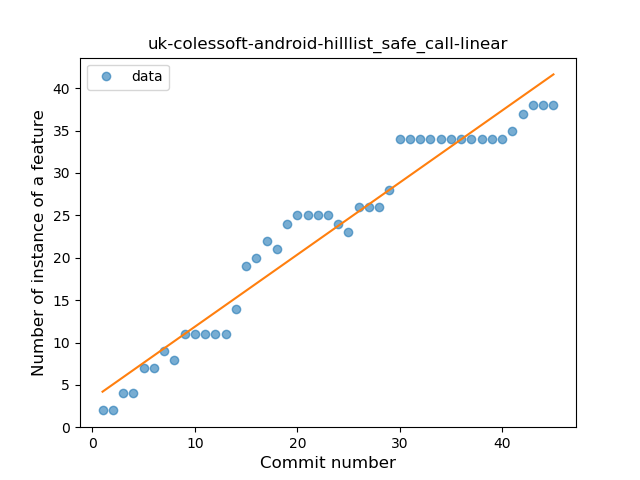
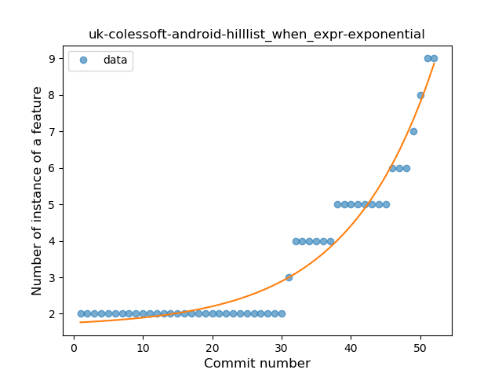
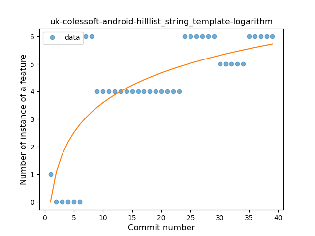
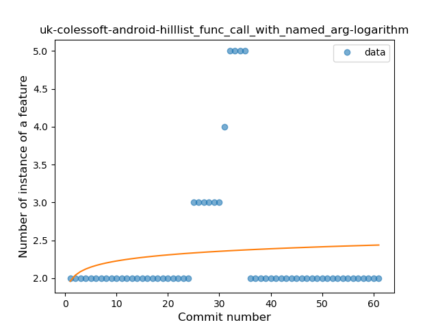

## uk-colessoft-android-hilllist
----
#### Metrics provided by Detekt
* Number of lines of code 2342
* Number of Kotlin files: 51
* Cyclomatic complexity: 223
* Cyclomatic complexity by thousands of lines: 187 

----
**13** features analyzed

*	<a href="#type_inference">Type Inference</a> 
*	<a href="#lambda">Lambda</a> 
*	<a href="#safe_call">Safe Call</a> 
*	<a href="#when_expr">When expression</a> 
*	<a href="#unsafe_call">Unsafe Call</a> 
*	<a href="#companion_object">Companion Object</a> 
*	<a href="#string_template">String Template</a> 
*	<a href="#func_with_default_value">Function with Default Value</a> 
*	<a href="#data_class">Data Class</a> 
*	<a href="#func_call_with_named_arg">Function call with Named Argument</a> 
*	<a href="#extension_function">Extension Function</a> 
*	<a href="#property_delegation">Property Delegation</a> 
*	<a href="#inline_func">Inline Function</a> 

### <a name="type_inference">Type Inference</a>
----
#### Functions
* **Constant Rise - Linear:** 
    * **R_Squared:** 0.98470207
* **Sudden Rise - Exponential:** 
    * **R_Squared:** 0.98930915
* **Plateau Gradual Rise - Sigmoid:** 
    * **R_Squared:** 0.76034752
* **Sudden Rise Plateau - Logarithm:** 
    * **R_Squared:** 0.55664244

**Plots** :chart_with_upwards_trend:
-----

### <a name="lambda">Lambda</a>
----
#### Functions
* **Sudden Rise - Exponential:** 
    * **R_Squared:** 0.92628447
* **Constant Rise - Linear:** 
    * **R_Squared:** 0.84386119
* **Sudden Rise Plateau - Logarithm:** 
    * **R_Squared:** 0.40339818

**Plots** :chart_with_upwards_trend:
-----

### <a name="safe_call">Safe Call</a>
----
#### Functions
* **Constant Rise - Linear:** 
    * **R_Squared:** 0.94859311
* **Sudden Rise Plateau - Logarithm:** 
    * **R_Squared:** 0.78004542
* **Plateau Gradual Rise - Sigmoid:** 
    * **R_Squared:** 0.68418832

**Plots** :chart_with_upwards_trend:
-----

### <a name="when_expr">When expression</a>
----
#### Functions
* **Sudden Rise - Exponential:** 
    * **R_Squared:** 0.94685393
* **Plateau Sudden Rise - Binary Sigmoid:** 
    * **R_Squared:** 0.94687264
* **Constant Rise - Linear:** 
    * **R_Squared:** 0.73738346
* **Sudden Rise Plateau - Logarithm:** 
    * **R_Squared:** 0.39083623

**Plots** :chart_with_upwards_trend:
-----

### <a name="unsafe_call">Unsafe Call</a>
----
#### Functions
* **Sudden Rise - Exponential:** 
    * **R_Squared:** 0.90929094
* **Instability - Polinomial 3:** )
    * **R_Squared:** 0.79914642
* **Constant Rise - Linear:** 
    * **R_Squared:** 0.42015338
* **Sudden Rise Plateau - Logarithm:** 
    * **R_Squared:** 0.20875809

**Plots** :chart_with_upwards_trend:
-----

### <a name="companion_object">Companion Object</a>
----
#### Functions
* **Constant Rise - Linear:** 
    * **R_Squared:** 0.78980892
* **Sudden Rise Plateau - Logarithm:** 
    * **R_Squared:** 0.6997988

**Plots** :chart_with_upwards_trend:
-----

### <a name="string_template">String Template</a>
----
#### Functions
* **Sudden Rise Plateau - Logarithm:** 
    * **R_Squared:** 0.6490625
* **Constant Rise - Linear:** 
    * **R_Squared:** 0.56542722

**Plots** :chart_with_upwards_trend:
-----

### <a name="func_with_default_value">Function with Default Value</a>
----
#### Functions
* **Plateau Gradual Rise - Sigmoid:** 
    * **R_Squared:** 0.75423249
* **Sudden Rise Plateau - Logarithm:** 
    * **R_Squared:** 0.6586332
* **Constant Rise - Linear:** 
    * **R_Squared:** 0.6359539

**Plots** :chart_with_upwards_trend:
-----

### <a name="data_class">Data Class</a>
----
#### Functions
* **Constant Rise - Linear:** 
    * **R_Squared:** 0.93192448
* **Sudden Rise Plateau - Logarithm:** 
    * **R_Squared:** 0.82192825

**Plots** :chart_with_upwards_trend:
-----

### <a name="func_call_with_named_arg">Function call with Named Argument</a>
----
#### Functions
* **Sudden Rise Plateau - Logarithm:** 
    * **R_Squared:** 0.01676436
* **Constant Rise - Linear:** 
    * **R_Squared:** 0.0001086
* **Sudden Rise - Exponential:** 
    * **R_Squared:** 0.00010348

**Plots** :chart_with_upwards_trend:
-----

### <a name="extension_function">Extension Function</a>
----
#### Functions
* **Instability - Polinomial 4:** 
    * **R_Squared:** 0.47901321
* **Sudden Decline - Exponential:** 
    * **R_Squared:** 0.39022513
* **Constant Decline - Linear:** 
    * **R_Squared:** 0.27613636
* **Sudden Rise Plateau - Logarithm:** 
    * **R_Squared:** -0.0
* **Plateau Gradual Rise - Sigmoid:** 
    * **R_Squared:** 0.00681818

**Plots** :chart_with_upwards_trend:
-----

### <a name="property_delegation">Property Delegation</a>
----
#### Functions
* **Sudden Decline - Exponential:** 
    * **R_Squared:** 1.0
* **Instability - Polinomial 4:** 
    * **R_Squared:** 0.65897436
* **Instability - Polinomial 3:** )
    * **R_Squared:** 0.48846154
* **Constant Decline - Linear:** 
    * **R_Squared:** 0.125
* **Sudden Rise Plateau - Logarithm:** 
    * **R_Squared:** -0.0

**Plots** :chart_with_upwards_trend:
-----

### <a name="inline_func">Inline Function</a>
----
#### Functions
* **Instability - Polinomial 4:** 
    * **R_Squared:** 0.67250909
* **Instability - Polinomial 3:** )
    * **R_Squared:** 0.65827333
* **Sudden Decline - Exponential:** 
    * **R_Squared:** 0.62137815
* **Constant Decline - Linear:** 
    * **R_Squared:** 0.38409091
* **Sudden Rise Plateau - Logarithm:** 
    * **R_Squared:** -0.0

**Plots** :chart_with_upwards_trend:
-----

