## ultrasonic-ultrasonic
----
#### Metrics provided by Detekt
* Number of lines of code 8786
* Number of Kotlin files: 207
* Cyclomatic complexity: 744
* Cyclomatic complexity by thousands of lines: 159 

----
**17** features analyzed

*	<a href="#type_inference">Type Inference</a> 
*	<a href="#lambda">Lambda</a> 
*	<a href="#safe_call">Safe Call</a> 
*	<a href="#when_expr">When expression</a> 
*	<a href="#companion_object">Companion Object</a> 
*	<a href="#unsafe_call">Unsafe Call</a> 
*	<a href="#string_template">String Template</a> 
*	<a href="#func_with_default_value">Function with Default Value</a> 
*	<a href="#singleton">Singleton</a> 
*	<a href="#smart_cast">Smart Cast</a> 
*	<a href="#range_expr">Range Expression</a> 
*	<a href="#func_call_with_named_arg">Function call with Named Argument</a> 
*	<a href="#data_class">Data Class</a> 
*	<a href="#extension_function">Extension Function</a> 
*	<a href="#property_delegation">Property Delegation</a> 
*	<a href="#overloaded_op">Overloaded Operator</a> 
*	<a href="#super_delegation">Super Delegation</a> 

### <a name="type_inference">Type Inference</a>
----
#### Functions
* **Constant Rise - Linear:** 
    * **R_Squared:** 0.96287241
* **Plateau Sudden Rise - Binary Sigmoid:** 
    * **R_Squared:** 0.6693955
* **Sudden Rise Plateau - Logarithm:** 
    * **R_Squared:** 0.53670506

**Plots** :chart_with_upwards_trend:
-----

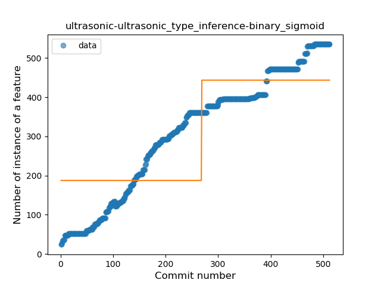
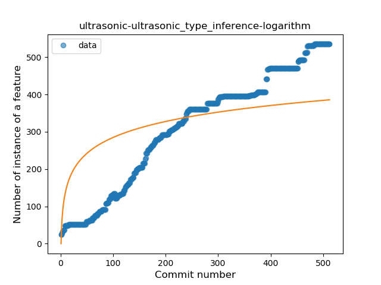
### <a name="lambda">Lambda</a>
----
#### Functions
* **Constant Rise - Linear:** 
    * **R_Squared:** 0.79720759
* **Sudden Rise Plateau - Logarithm:** 
    * **R_Squared:** 0.58712655
* **Plateau Sudden Rise - Binary Sigmoid:** 
    * **R_Squared:** 0.23293049

**Plots** :chart_with_upwards_trend:
-----

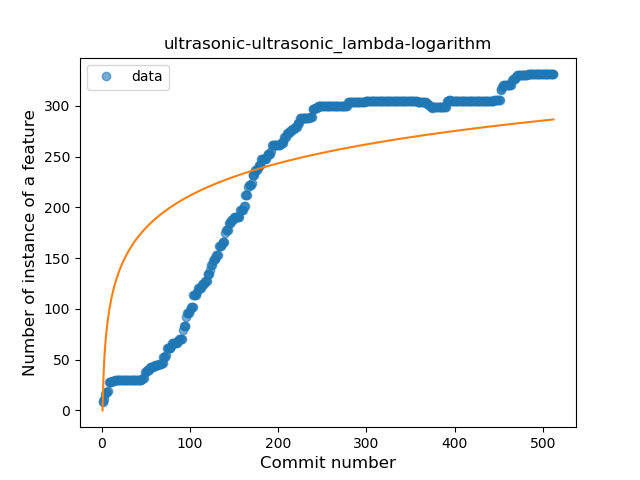
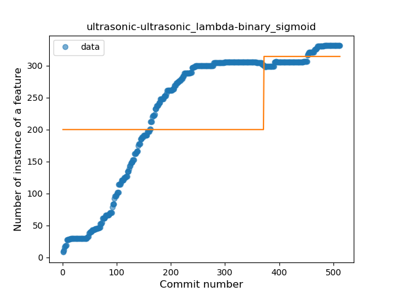
### <a name="safe_call">Safe Call</a>
----
#### Functions
* **Constant Rise - Linear:** 
    * **R_Squared:** 0.94561841
* **Sudden Rise Plateau - Logarithm:** 
    * **R_Squared:** 0.51724629
* **Plateau Sudden Rise - Binary Sigmoid:** 
    * **R_Squared:** 0.11454535

**Plots** :chart_with_upwards_trend:
-----

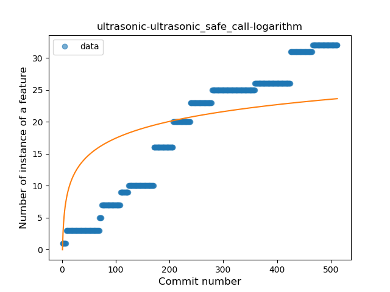

### <a name="when_expr">When expression</a>
----
#### Functions
* **Plateau Gradual Rise - Sigmoid:** 
    * **R_Squared:** 0.93958595
* **Constant Rise - Linear:** 
    * **R_Squared:** 0.87719923
* **Sudden Rise - Exponential:** 
    * **R_Squared:** 0.88717069
* **Sudden Rise Plateau - Logarithm:** 
    * **R_Squared:** 0.37721744

**Plots** :chart_with_upwards_trend:
-----

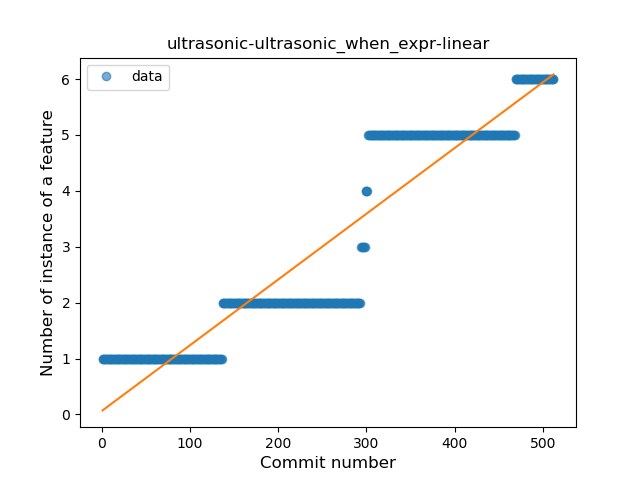

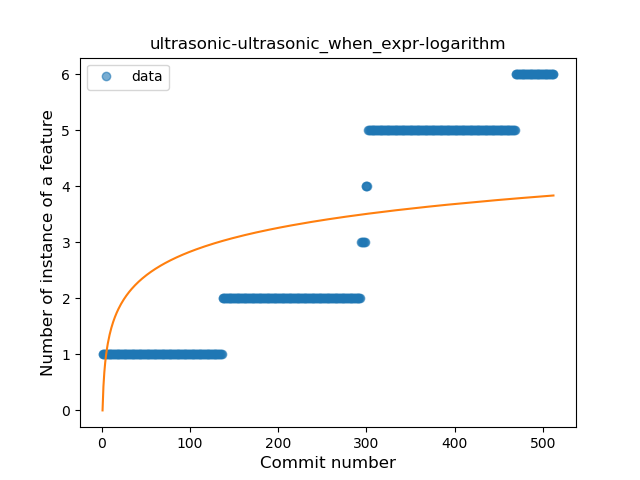
### <a name="companion_object">Companion Object</a>
----
#### Functions
* **Sudden Rise - Exponential:** 
    * **R_Squared:** 0.64023402
* **Constant Rise - Linear:** 
    * **R_Squared:** 0.43080776
* **Sudden Rise Plateau - Logarithm:** 
    * **R_Squared:** 0.18176393

**Plots** :chart_with_upwards_trend:
-----

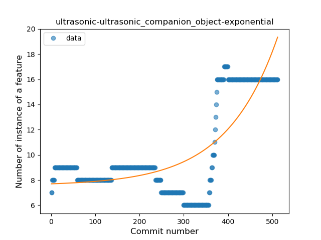
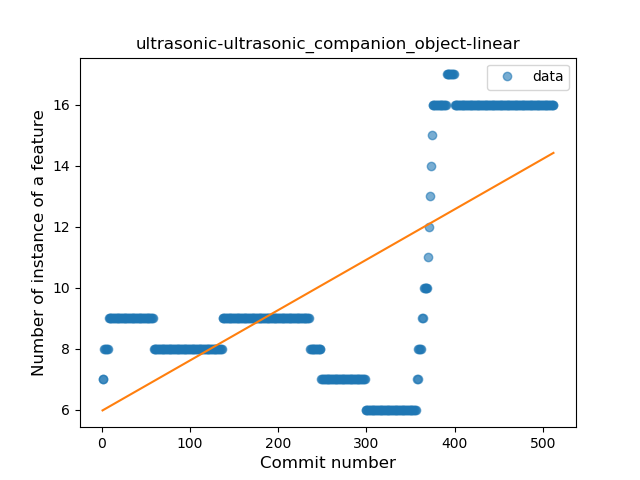
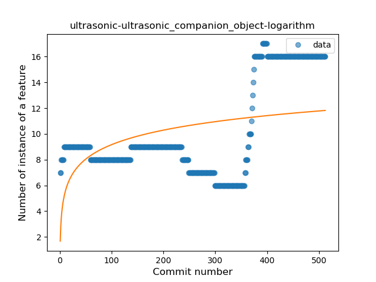
### <a name="unsafe_call">Unsafe Call</a>
----
#### Functions
* **Plateau Gradual Rise - Sigmoid:** 
    * **R_Squared:** 0.98641395
* **Sudden Rise - Exponential:** 
    * **R_Squared:** 0.79586056
* **Constant Rise - Linear:** 
    * **R_Squared:** 0.48978934
* **Sudden Rise Plateau - Logarithm:** 
    * **R_Squared:** 0.12586939

**Plots** :chart_with_upwards_trend:
-----

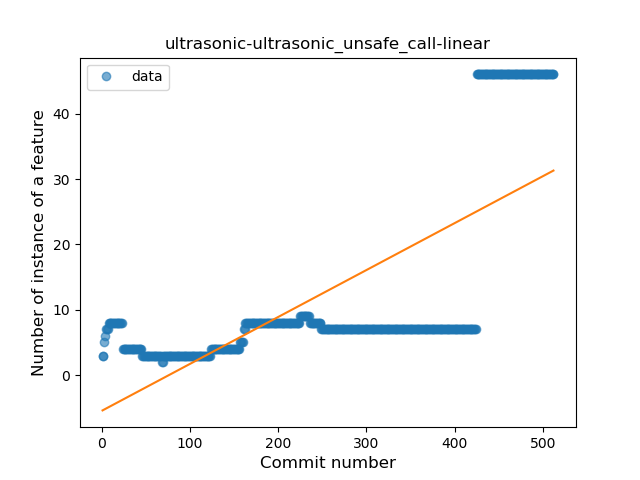
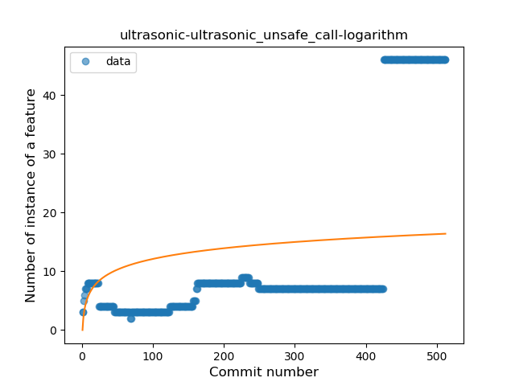
### <a name="string_template">String Template</a>
----
#### Functions
* **Constant Rise - Linear:** 
    * **R_Squared:** 0.77667055
* **Plateau Sudden Rise - Binary Sigmoid:** 
    * **R_Squared:** 0.7663792
* **Sudden Rise Plateau - Logarithm:** 
    * **R_Squared:** 0.58500352

**Plots** :chart_with_upwards_trend:
-----

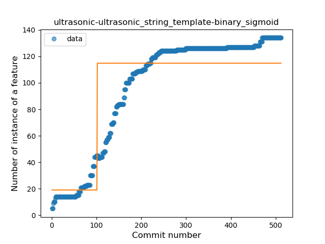
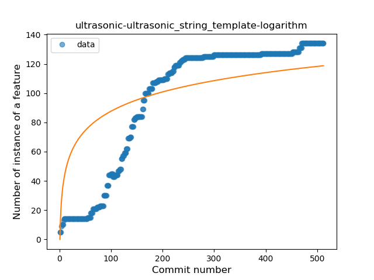
### <a name="func_with_default_value">Function with Default Value</a>
----
#### Functions
* **Constant Rise - Linear:** 
    * **R_Squared:** 0.86699525
* **Sudden Rise Plateau - Logarithm:** 
    * **R_Squared:** 0.6148455
* **Plateau Sudden Rise - Binary Sigmoid:** 
    * **R_Squared:** 0.4260928

**Plots** :chart_with_upwards_trend:
-----

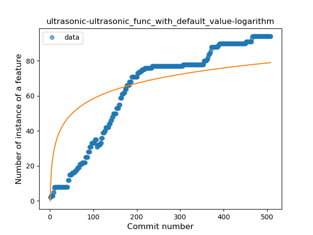

### <a name="singleton">Singleton</a>
----
#### Functions
* **Sudden Rise - Exponential:** 
    * **R_Squared:** 0.89078761
* **Constant Rise - Linear:** 
    * **R_Squared:** 0.60134481
* **Sudden Rise Plateau - Logarithm:** 
    * **R_Squared:** 0.27685136

**Plots** :chart_with_upwards_trend:
-----

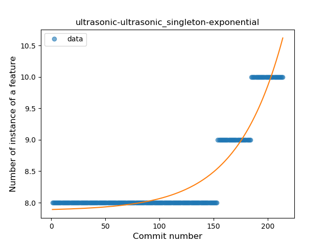
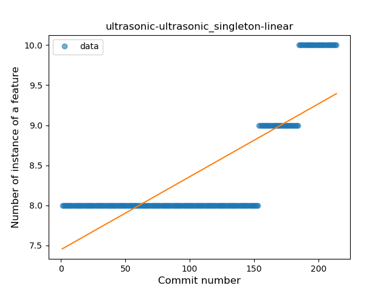
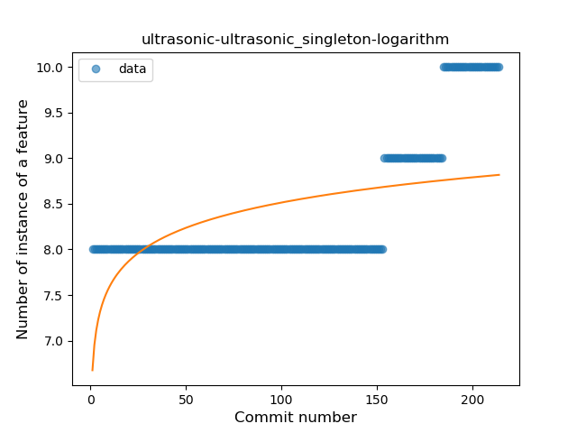
### <a name="smart_cast">Smart Cast</a>
----
#### Functions
* **Plateau Gradual Rise - Sigmoid:** 
    * **R_Squared:** 0.99695111
* **Sudden Rise - Exponential:** 
    * **R_Squared:** 0.79483826
* **Constant Rise - Linear:** 
    * **R_Squared:** 0.50336923
* **Sudden Rise Plateau - Logarithm:** 
    * **R_Squared:** 0.17572676

**Plots** :chart_with_upwards_trend:
-----

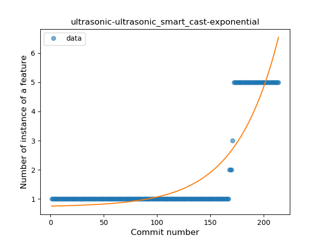
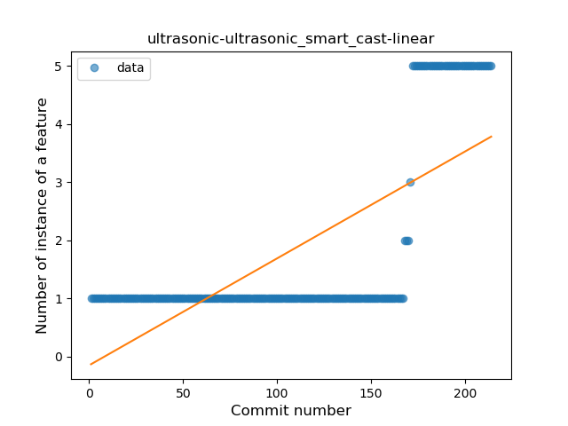
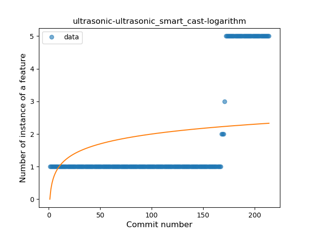
### <a name="range_expr">Range Expression</a>
----
#### Functions
* **Plateau Sudden Rise - Binary Sigmoid:** 
    * **R_Squared:** 1.0
* **Constant Rise - Linear:** 
    * **R_Squared:** 0.63817523
* **Sudden Rise Plateau - Logarithm:** 
    * **R_Squared:** 0.6219887

**Plots** :chart_with_upwards_trend:
-----

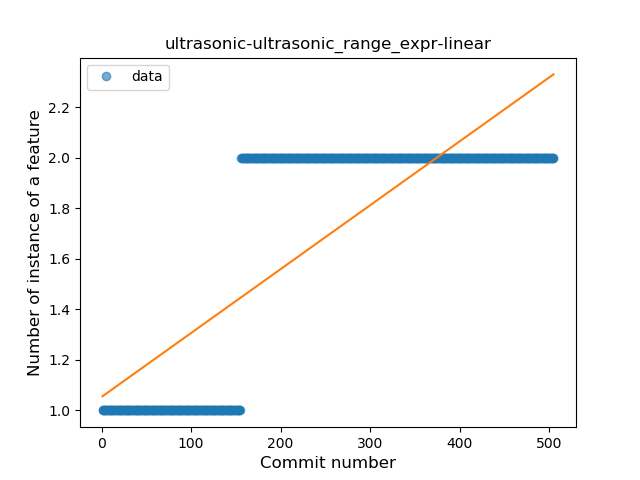
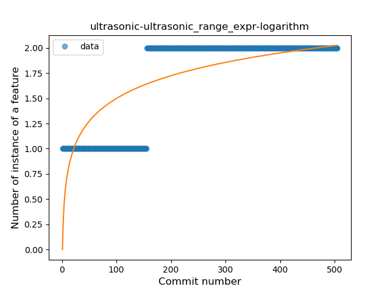
### <a name="func_call_with_named_arg">Function call with Named Argument</a>
----
#### Functions
* **Constant Rise - Linear:** 
    * **R_Squared:** 0.74437471
* **Sudden Rise Plateau - Logarithm:** 
    * **R_Squared:** 0.57644889
* **Plateau Sudden Rise - Binary Sigmoid:** 
    * **R_Squared:** 0.16892653

**Plots** :chart_with_upwards_trend:
-----

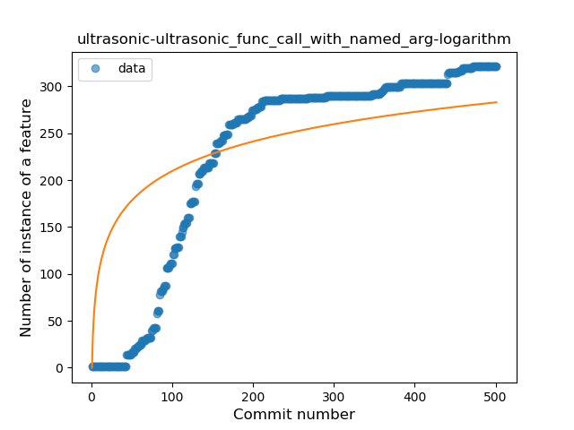
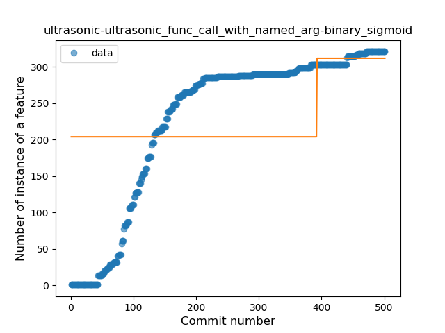
### <a name="data_class">Data Class</a>
----
#### Functions
* **Constant Rise - Linear:** 
    * **R_Squared:** 0.92486433
* **Sudden Rise - Exponential:** 
    * **R_Squared:** 0.93251917
* **Sudden Rise Plateau - Logarithm:** 
    * **R_Squared:** 0.47029879
* **Plateau Sudden Rise - Binary Sigmoid:** 
    * **R_Squared:** 0.25371184

**Plots** :chart_with_upwards_trend:
-----

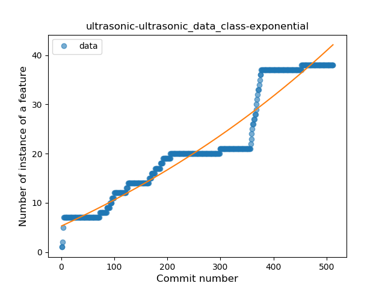
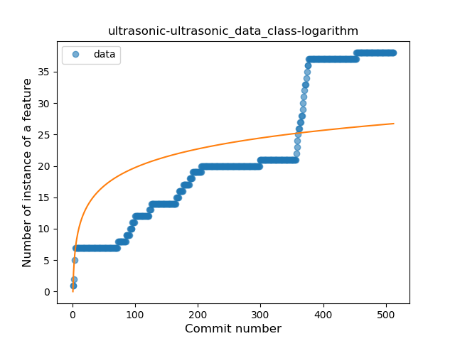
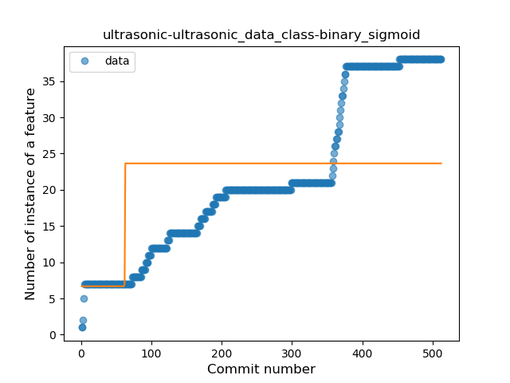
### <a name="extension_function">Extension Function</a>
----
#### Functions
* **Constant Rise - Linear:** 
    * **R_Squared:** 0.84002305
* **Plateau Gradual Rise - Sigmoid:** 
    * **R_Squared:** 0.77937768
* **Sudden Rise Plateau - Logarithm:** 
    * **R_Squared:** 0.66350938

**Plots** :chart_with_upwards_trend:
-----

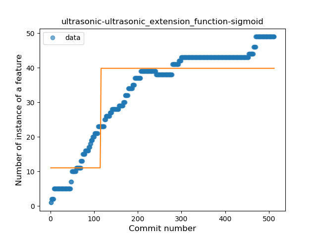
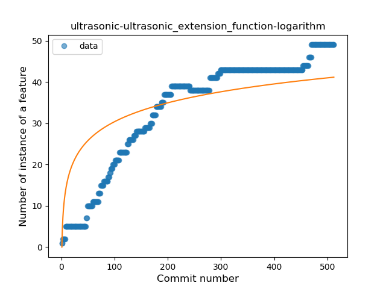
### <a name="property_delegation">Property Delegation</a>
----
#### Functions
* **Constant Rise - Linear:** 
    * **R_Squared:** 0.77839679
* **Sudden Rise Plateau - Logarithm:** 
    * **R_Squared:** 0.74665883

**Plots** :chart_with_upwards_trend:
-----

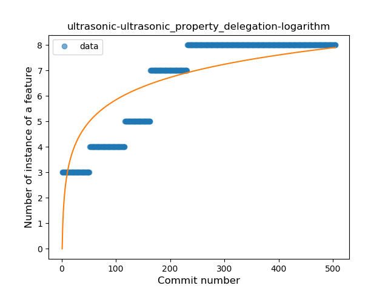
### <a name="overloaded_op">Overloaded Operator</a>
----
#### Functions
* **Plateau Sudden Rise - Binary Sigmoid:** 
    * **R_Squared:** 1.0
* **Sudden Rise - Exponential:** 
    * **R_Squared:** 0.75322342
* **Constant Rise - Linear:** 
    * **R_Squared:** 0.72095491
* **Sudden Rise Plateau - Logarithm:** 
    * **R_Squared:** 0.27080213

**Plots** :chart_with_upwards_trend:
-----

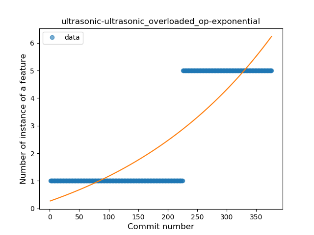
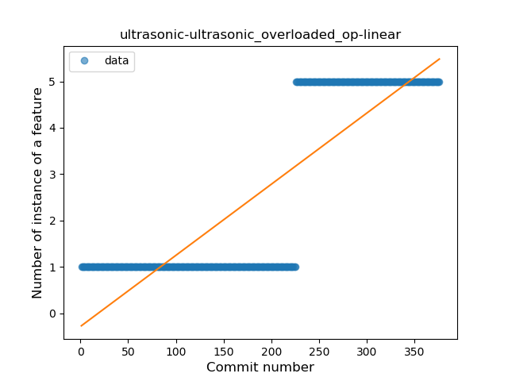
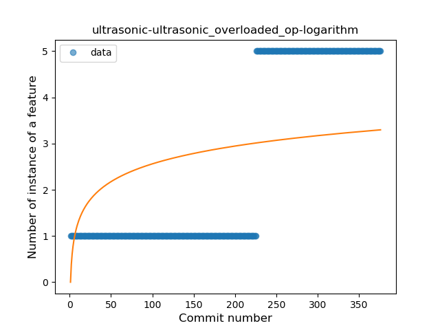
### <a name="super_delegation">Super Delegation</a>
----
#### Functions
* **Plateau Sudden Rise - Binary Sigmoid:** 
    * **R_Squared:** 1.0
* **Sudden Rise - Exponential:** 
    * **R_Squared:** 0.78292073
* **Constant Rise - Linear:** 
    * **R_Squared:** 0.43385823
* **Sudden Rise Plateau - Logarithm:** 
    * **R_Squared:** 0.18443657

**Plots** :chart_with_upwards_trend:
-----

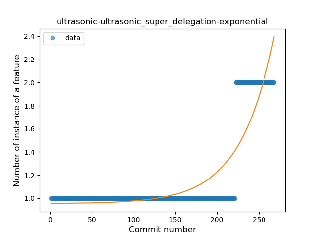
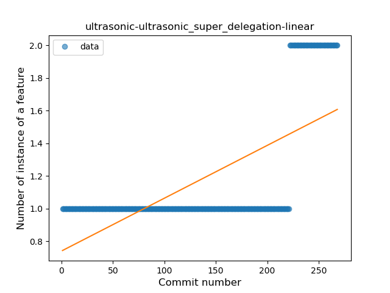
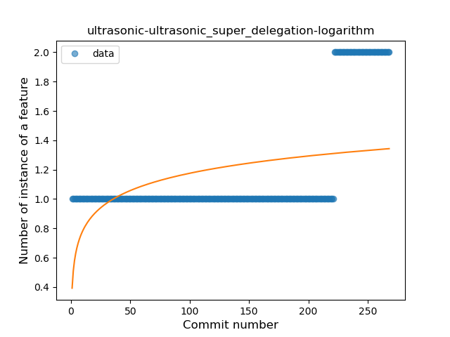
