## umren-Watcher
----
#### Metrics provided by Detekt
* Number of lines of code 1020
* Number of Kotlin files: 19
* Cyclomatic complexity: 118
* Cyclomatic complexity by thousands of lines: 216 

----
**4** features analyzed

*	<a href="#type_inference">Type Inference</a> 
*	<a href="#safe_call">Safe Call</a> 
*	<a href="#unsafe_call">Unsafe Call</a> 
*	<a href="#string_template">String Template</a> 

### <a name="type_inference">Type Inference</a>
----
#### Functions
* **Instability - Polinomial 4:** 
    * **R_Squared:** 0.70097019
* **Instability - Polinomial 3:** )
    * **R_Squared:** 0.52354746
* **Sudden Rise Plateau - Logarithm:** 
    * **R_Squared:** 0.07491195
* **Constant Decline - Linear:** 
    * **R_Squared:** 0.00040177

**Plots** :chart_with_upwards_trend:
-----

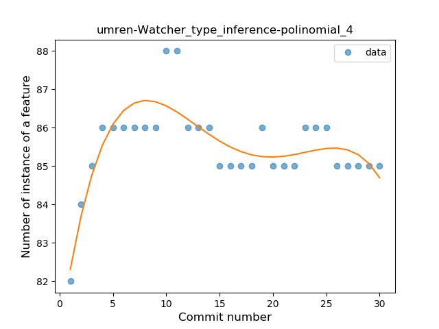
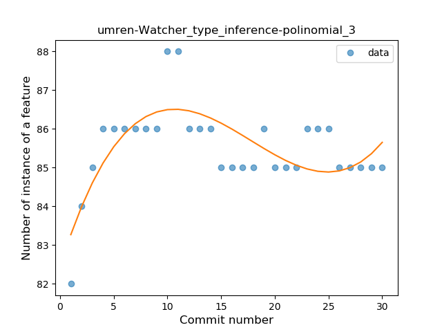
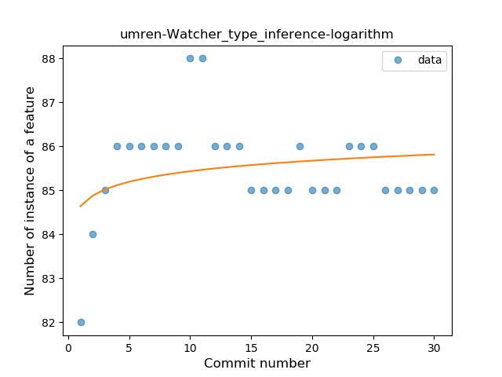
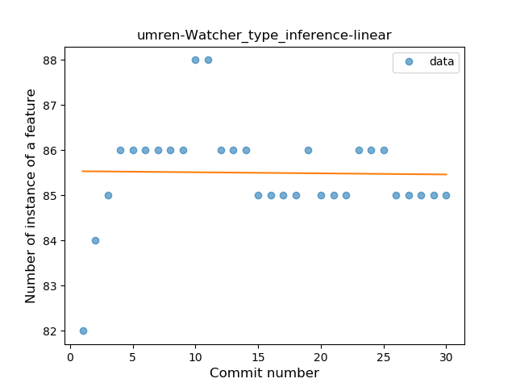
### <a name="safe_call">Safe Call</a>
----
#### Functions
* **Plateau Sudden Rise - Binary Sigmoid:** 
    * **R_Squared:** 1.0
* **Instability - Polinomial 3:** )
    * **R_Squared:** 0.82036598
* **Sudden Rise - Exponential:** 
    * **R_Squared:** 0.78942259
* **Constant Rise - Linear:** 
    * **R_Squared:** 0.41713014
* **Sudden Rise Plateau - Logarithm:** 
    * **R_Squared:** 0.20296562

**Plots** :chart_with_upwards_trend:
-----

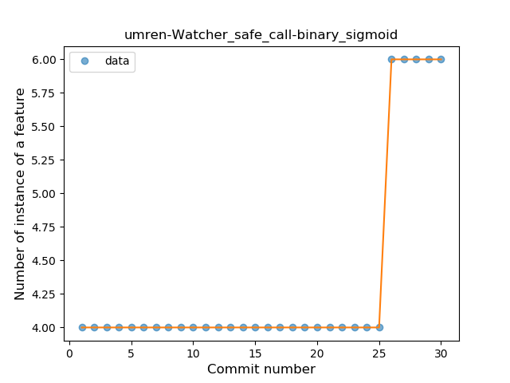
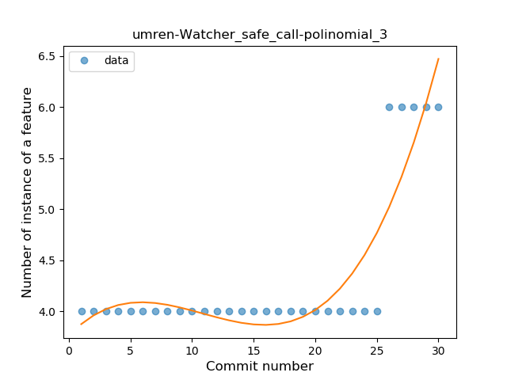
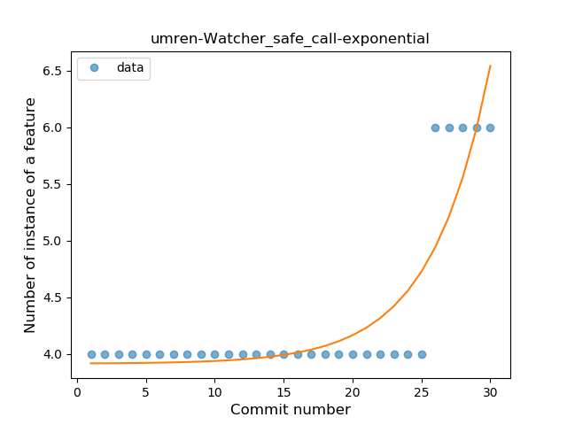
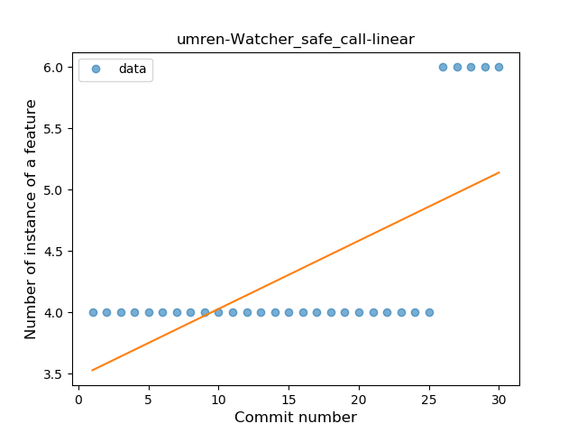
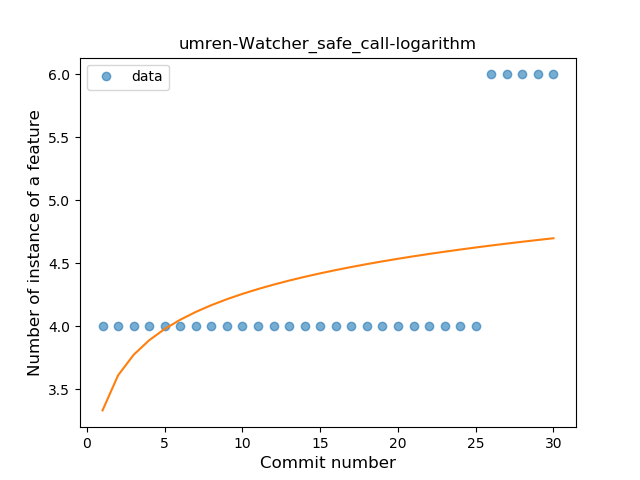
### <a name="unsafe_call">Unsafe Call</a>
----
#### Functions
* **Plateau Gradual Rise - Sigmoid:** 
    * **R_Squared:** 1.0
* **Sudden Rise - Exponential:** 
    * **R_Squared:** 0.80498979
* **Constant Rise - Linear:** 
    * **R_Squared:** 0.58757276
* **Sudden Rise Plateau - Logarithm:** 
    * **R_Squared:** 0.31453366

**Plots** :chart_with_upwards_trend:
-----

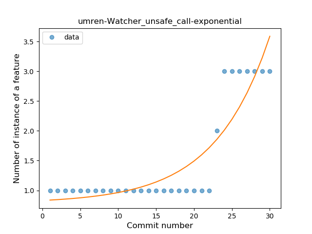

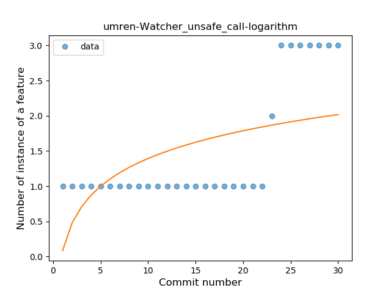
### <a name="string_template">String Template</a>
----
#### Functions
* **Instability - Polinomial 3:** )
    * **R_Squared:** 0.80674605
* **Sudden Rise Plateau - Logarithm:** 
    * **R_Squared:** 0.63154141
* **Constant Rise - Linear:** 
    * **R_Squared:** 0.34705228

**Plots** :chart_with_upwards_trend:
-----

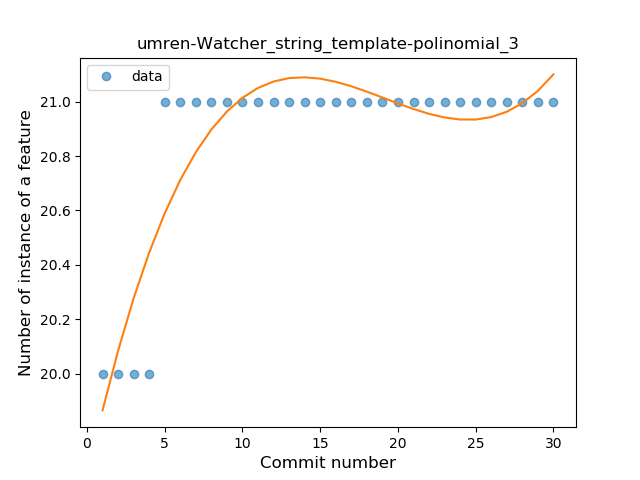
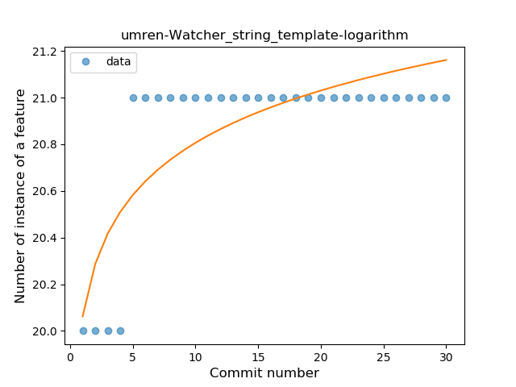
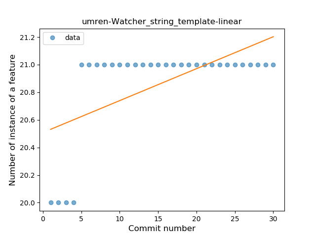
