## vector-im-riot-android
----
#### Metrics provided by Detekt
* Number of lines of code 12513
* Number of Kotlin files: 86
* Cyclomatic complexity: 1436
* Cyclomatic complexity by thousands of lines: 316 

----
**16** features analyzed

*	<a href="#type_inference">Type Inference</a> 
*	<a href="#lambda">Lambda</a> 
*	<a href="#safe_call">Safe Call</a> 
*	<a href="#when_expr">When expression</a> 
*	<a href="#companion_object">Companion Object</a> 
*	<a href="#unsafe_call">Unsafe Call</a> 
*	<a href="#string_template">String Template</a> 
*	<a href="#func_with_default_value">Function with Default Value</a> 
*	<a href="#singleton">Singleton</a> 
*	<a href="#smart_cast">Smart Cast</a> 
*	<a href="#range_expr">Range Expression</a> 
*	<a href="#func_call_with_named_arg">Function call with Named Argument</a> 
*	<a href="#data_class">Data Class</a> 
*	<a href="#extension_function">Extension Function</a> 
*	<a href="#property_delegation">Property Delegation</a> 
*	<a href="#super_delegation">Super Delegation</a> 

### <a name="type_inference">Type Inference</a>
----
#### Functions
* **Plateau Gradual Rise - Sigmoid:** 
    * **R_Squared:** 0.85086584
* **Constant Rise - Linear:** 
    * **R_Squared:** 0.8086679
* **Sudden Rise Plateau - Logarithm:** 
    * **R_Squared:** 0.57084061

**Plots** :chart_with_upwards_trend:
-----

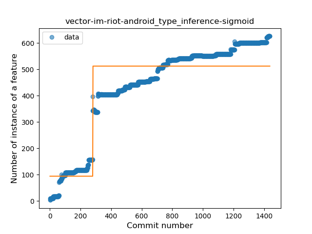
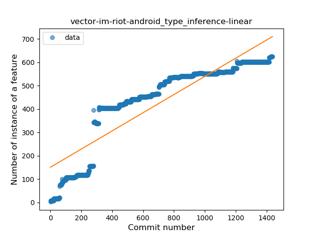
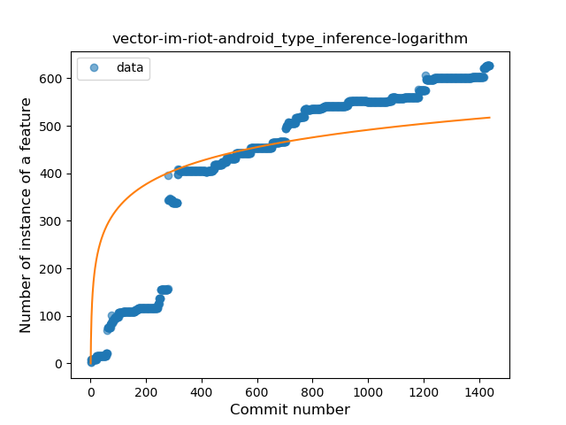
### <a name="lambda">Lambda</a>
----
#### Functions
* **Plateau Sudden Rise - Binary Sigmoid:** 
    * **R_Squared:** 0.81991435
* **Constant Rise - Linear:** 
    * **R_Squared:** 0.66664137
* **Sudden Rise Plateau - Logarithm:** 
    * **R_Squared:** 0.56860343

**Plots** :chart_with_upwards_trend:
-----

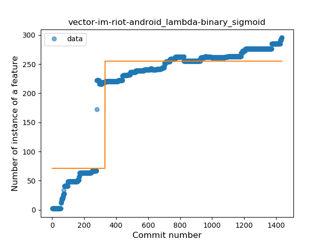

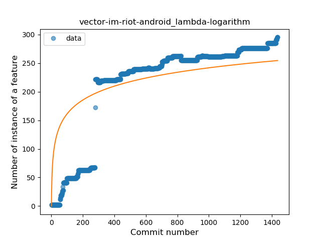
### <a name="safe_call">Safe Call</a>
----
#### Functions
* **Constant Rise - Linear:** 
    * **R_Squared:** 0.95582651
* **Plateau Gradual Rise - Sigmoid:** 
    * **R_Squared:** 0.53061606
* **Sudden Rise Plateau - Logarithm:** 
    * **R_Squared:** 0.45478225

**Plots** :chart_with_upwards_trend:
-----

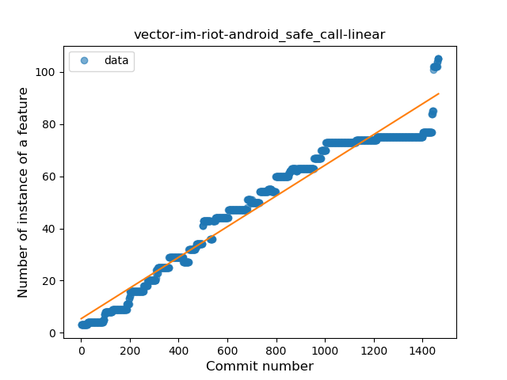
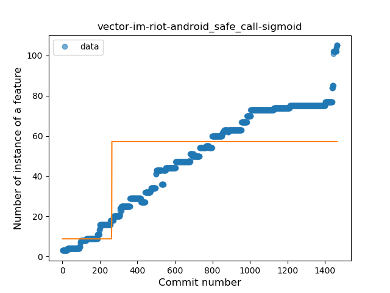
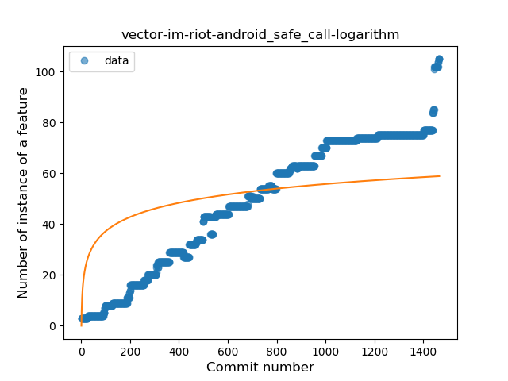
### <a name="when_expr">When expression</a>
----
#### Functions
* **Constant Rise - Linear:** 
    * **R_Squared:** 0.9248441
* **Sudden Rise Plateau - Logarithm:** 
    * **R_Squared:** 0.61761059

**Plots** :chart_with_upwards_trend:
-----

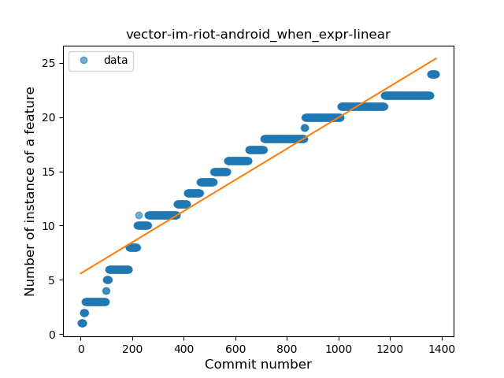
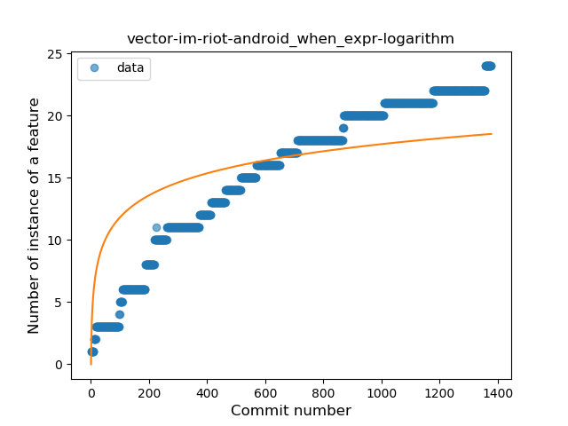
### <a name="companion_object">Companion Object</a>
----
#### Functions
* **Constant Rise - Linear:** 
    * **R_Squared:** 0.81051645
* **Sudden Rise Plateau - Logarithm:** 
    * **R_Squared:** 0.80303699

**Plots** :chart_with_upwards_trend:
-----

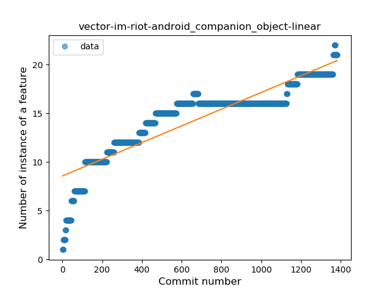
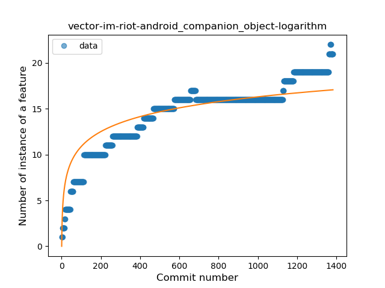
### <a name="unsafe_call">Unsafe Call</a>
----
#### Functions
* **Sudden Rise Plateau - Logarithm:** 
    * **R_Squared:** 0.53306165
* **Constant Rise - Linear:** 
    * **R_Squared:** 0.46120917

**Plots** :chart_with_upwards_trend:
-----

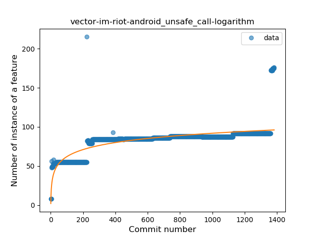
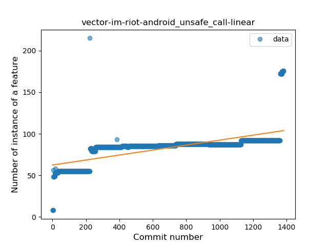
### <a name="string_template">String Template</a>
----
#### Functions
* **Constant Rise - Linear:** 
    * **R_Squared:** 0.83109924
* **Sudden Rise Plateau - Logarithm:** 
    * **R_Squared:** 0.77427232

**Plots** :chart_with_upwards_trend:
-----

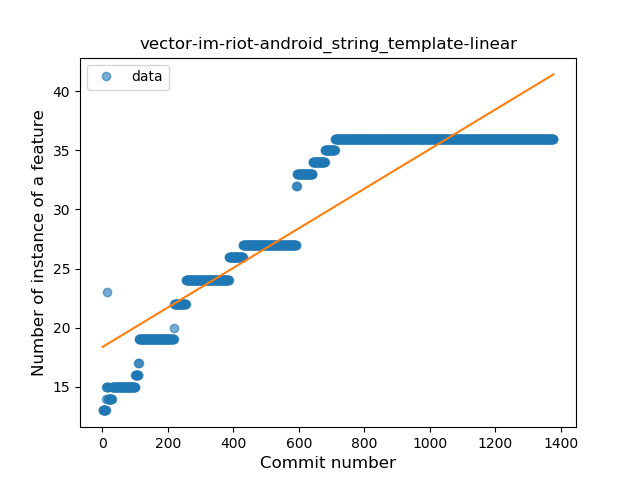

### <a name="func_with_default_value">Function with Default Value</a>
----
#### Functions
* **Constant Rise - Linear:** 
    * **R_Squared:** 0.86742915
* **Sudden Rise Plateau - Logarithm:** 
    * **R_Squared:** 0.38891636

**Plots** :chart_with_upwards_trend:
-----

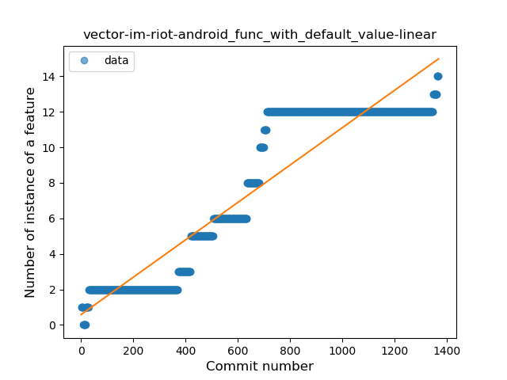
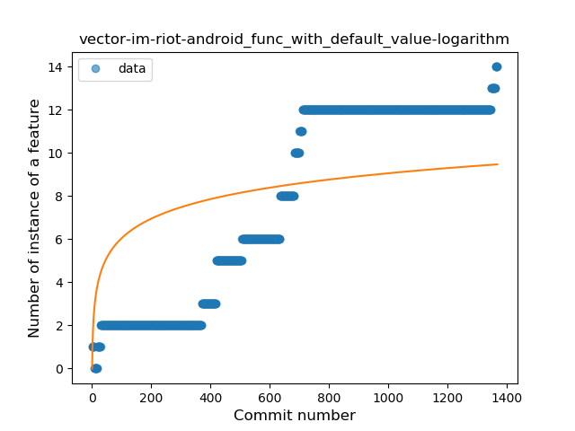
### <a name="singleton">Singleton</a>
----
#### Functions
* **Sudden Rise - Exponential:** 
    * **R_Squared:** 0.91818474
* **Constant Rise - Linear:** 
    * **R_Squared:** 0.8206537
* **Sudden Rise Plateau - Logarithm:** 
    * **R_Squared:** 0.24839104

**Plots** :chart_with_upwards_trend:
-----

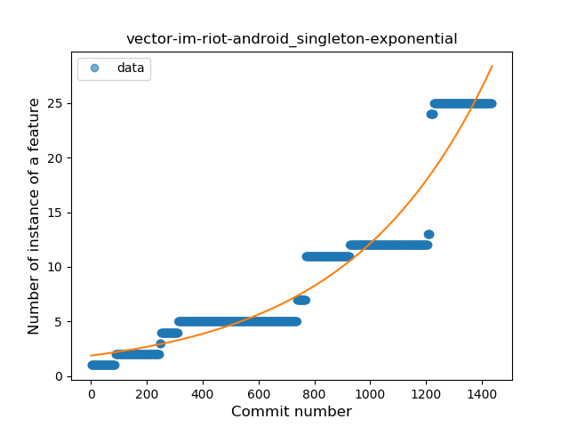
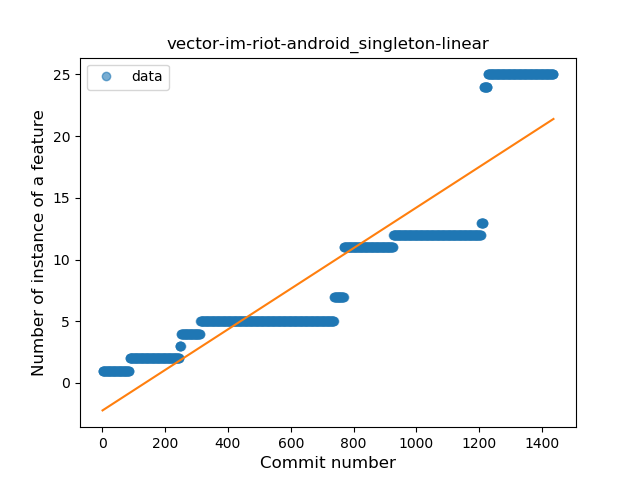
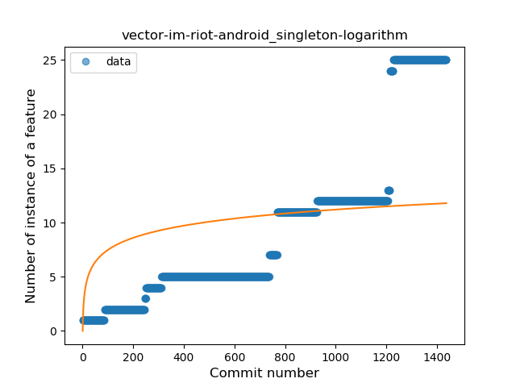
### <a name="smart_cast">Smart Cast</a>
----
#### Functions
* **Constant Rise - Linear:** 
    * **R_Squared:** 0.81596215
* **Sudden Rise Plateau - Logarithm:** 
    * **R_Squared:** 0.50792612

**Plots** :chart_with_upwards_trend:
-----

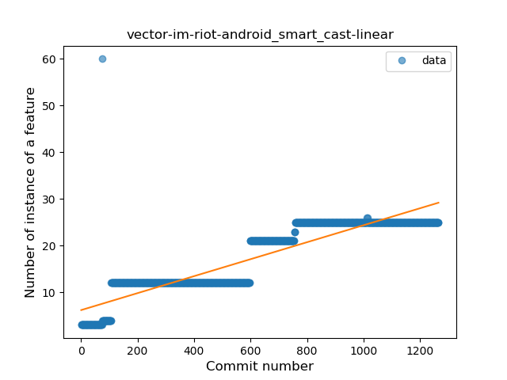
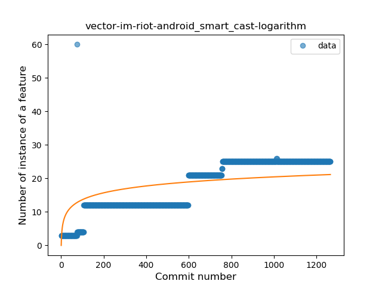
### <a name="range_expr">Range Expression</a>
----
#### Functions
* **Plateau Gradual Rise - Sigmoid:** 
    * **R_Squared:** 0.95111365
* **Sudden Rise Plateau - Logarithm:** 
    * **R_Squared:** 0.48142628
* **Constant Rise - Linear:** 
    * **R_Squared:** 0.12709345

**Plots** :chart_with_upwards_trend:
-----

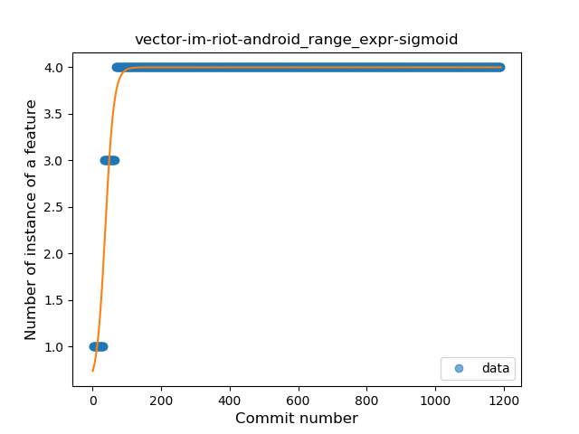
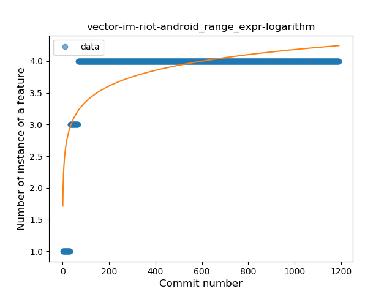
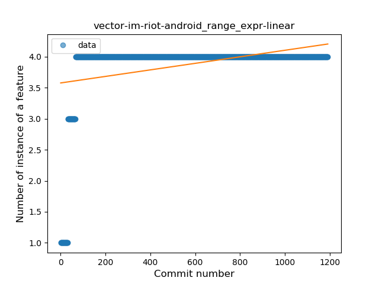
### <a name="func_call_with_named_arg">Function call with Named Argument</a>
----
#### Functions
* **Plateau Gradual Rise - Sigmoid:** 
    * **R_Squared:** 0.93624645
* **Constant Rise - Linear:** 
    * **R_Squared:** 0.83803905
* **Sudden Rise Plateau - Logarithm:** 
    * **R_Squared:** 0.43738825

**Plots** :chart_with_upwards_trend:
-----

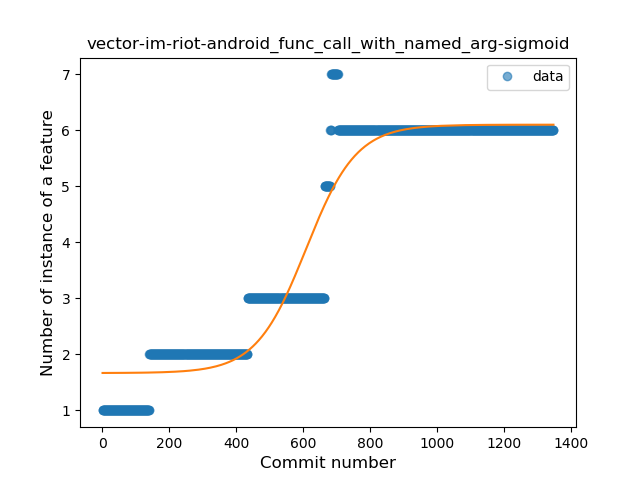
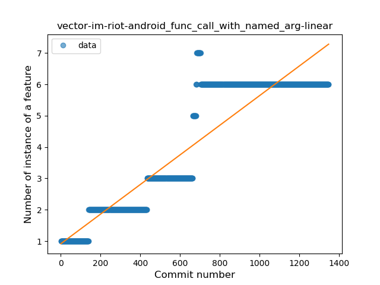
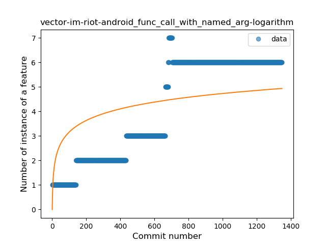
### <a name="data_class">Data Class</a>
----
#### Functions
* **Plateau Gradual Rise - Sigmoid:** 
    * **R_Squared:** 0.94990062
* **Sudden Rise Plateau - Logarithm:** 
    * **R_Squared:** 0.74923798
* **Constant Rise - Linear:** 
    * **R_Squared:** 0.72166891

**Plots** :chart_with_upwards_trend:
-----

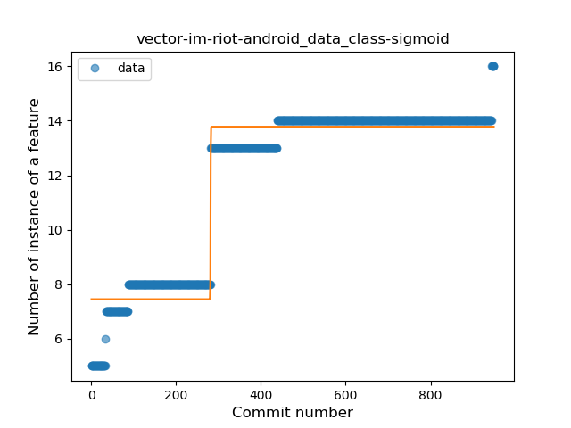
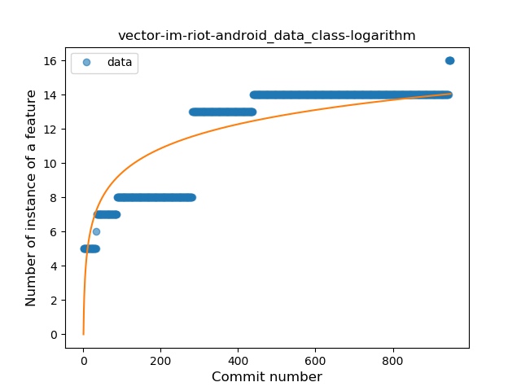
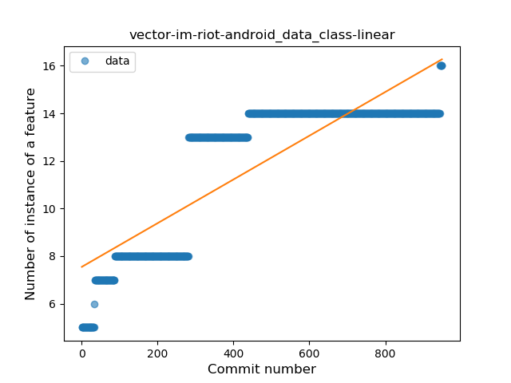
### <a name="extension_function">Extension Function</a>
----
#### Functions
* **Constant Rise - Linear:** 
    * **R_Squared:** 0.73102595
* **Sudden Rise Plateau - Logarithm:** 
    * **R_Squared:** 0.62537906

**Plots** :chart_with_upwards_trend:
-----

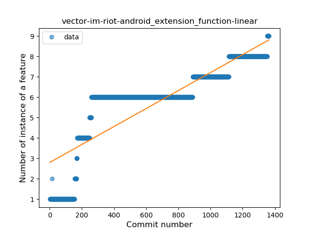
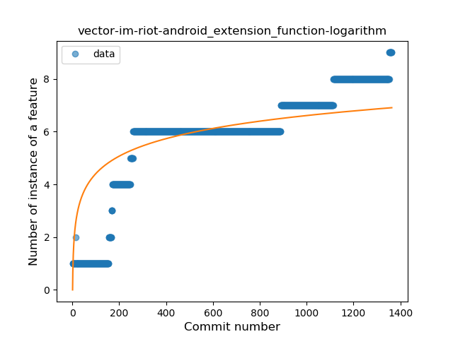
### <a name="property_delegation">Property Delegation</a>
----
#### Functions
* **Plateau Gradual Rise - Sigmoid:** 
    * **R_Squared:** 0.99451659
* **Sudden Rise Plateau - Logarithm:** 
    * **R_Squared:** 0.5170245
* **Constant Rise - Linear:** 
    * **R_Squared:** 0.40889581

**Plots** :chart_with_upwards_trend:
-----

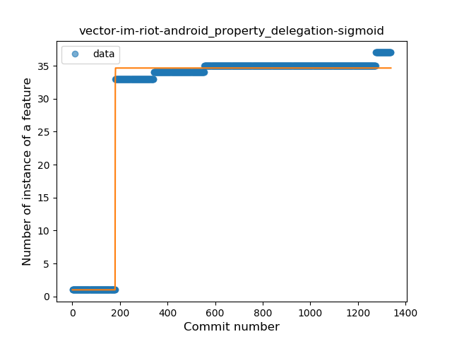
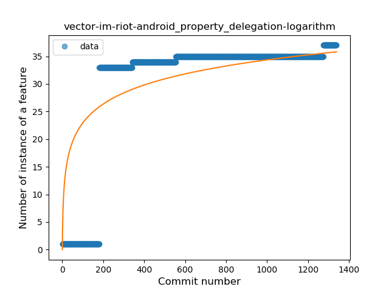
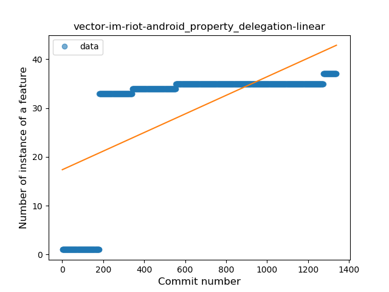
### <a name="super_delegation">Super Delegation</a>
----
#### Functions
* **Plateau Gradual Rise - Sigmoid:** 
    * **R_Squared:** 1.0
* **Sudden Rise Plateau - Logarithm:** 
    * **R_Squared:** 0.60607989
* **Constant Rise - Linear:** 
    * **R_Squared:** 0.28944969

**Plots** :chart_with_upwards_trend:
-----

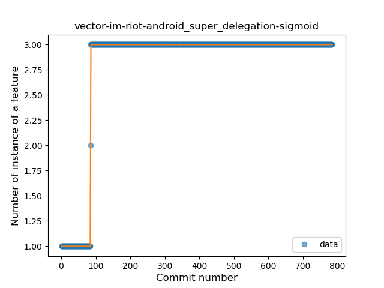
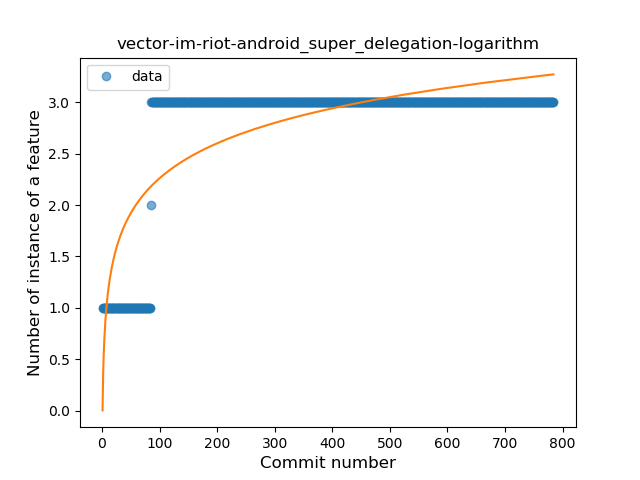
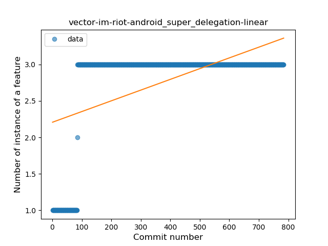
