## veniosg-JustSearch
----
#### Metrics provided by Detekt
* Number of lines of code 342
* Number of Kotlin files: 6
* Cyclomatic complexity: 47
* Cyclomatic complexity by thousands of lines: 237 

----
**6** features analyzed

*	<a href="#type_inference">Type Inference</a> 
*	<a href="#lambda">Lambda</a> 
*	<a href="#func_with_default_value">Function with Default Value</a> 
*	<a href="#singleton">Singleton</a> 
*	<a href="#data_class">Data Class</a> 
*	<a href="#property_delegation">Property Delegation</a> 

### <a name="type_inference">Type Inference</a>
----
#### Functions
* **Plateau Gradual Rise - Sigmoid:** 
    * **R_Squared:** 0.66318307
* **Constant Rise - Linear:** 
    * **R_Squared:** 0.60291609
* **Sudden Rise Plateau - Logarithm:** 
    * **R_Squared:** 0.55254183

**Plots** :chart_with_upwards_trend:
-----

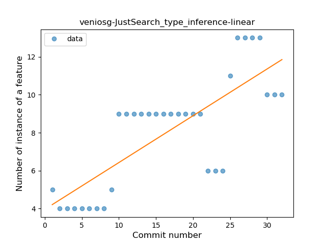
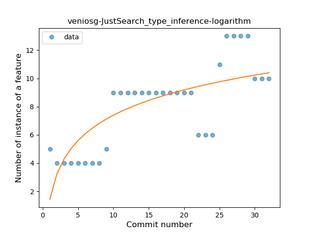
### <a name="lambda">Lambda</a>
----
#### Functions
* **Constant Rise - Linear:** 
    * **R_Squared:** 0.85190214
* **Sudden Rise Plateau - Logarithm:** 
    * **R_Squared:** 0.75559526

**Plots** :chart_with_upwards_trend:
-----

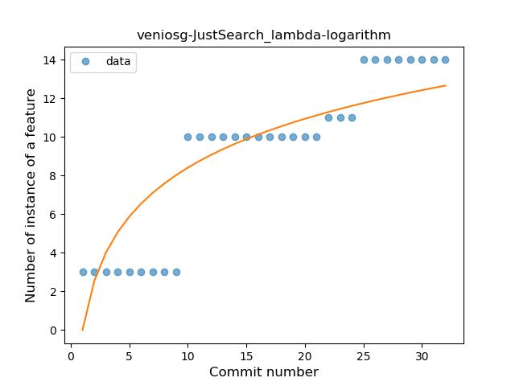
### <a name="func_with_default_value">Function with Default Value</a>
----
#### Functions
* **Plateau Sudden Decline - Binary Sigmoid:** 
    * **R_Squared:** 1.0
* **Instability - Polinomial 4:** 
    * **R_Squared:** 0.88344498
* **Constant Decline - Linear:** 
    * **R_Squared:** 0.68181818
* **Sudden Rise Plateau - Logarithm:** 
    * **R_Squared:** -0.0

**Plots** :chart_with_upwards_trend:
-----

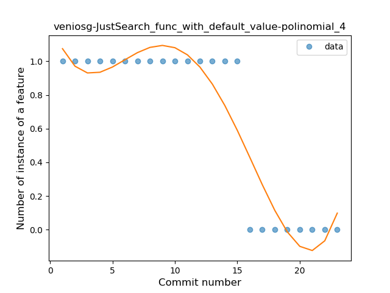
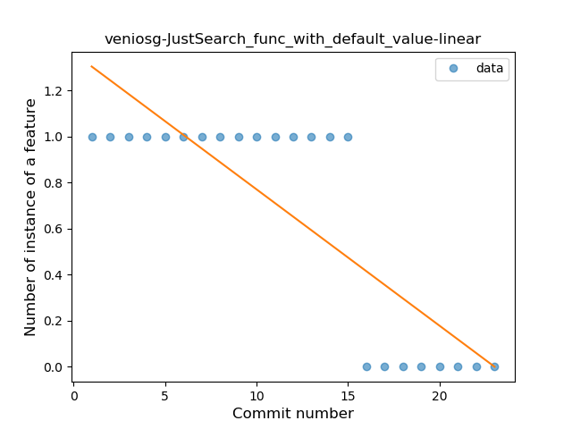
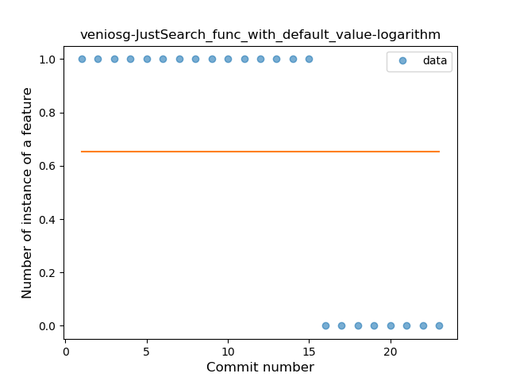
### <a name="singleton">Singleton</a>
----
#### Functions
* **Instability - Polinomial 3:** )
    * **R_Squared:** 0.83184976
* **Plateau Sudden Decline - Binary Sigmoid:** 
    * **R_Squared:** 0.71597633
* **Constant Decline - Linear:** 
    * **R_Squared:** 0.35759197
* **Sudden Rise Plateau - Logarithm:** 
    * **R_Squared:** -0.0

**Plots** :chart_with_upwards_trend:
-----

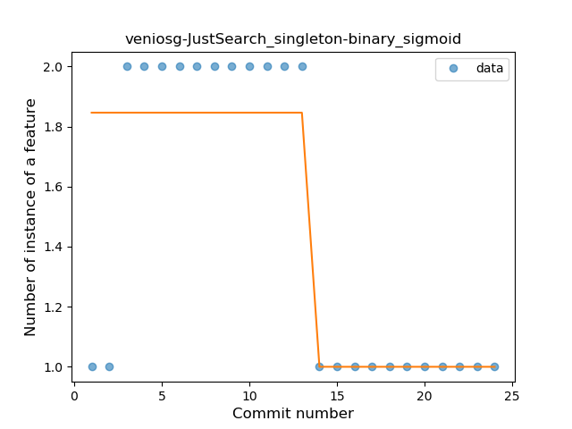
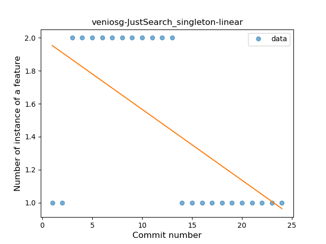
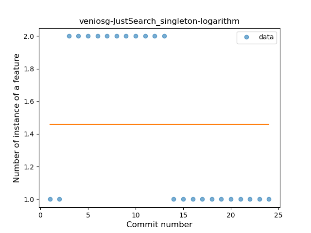
### <a name="data_class">Data Class</a>
----
#### Functions
* **Plateau Sudden Decline - Binary Sigmoid:** 
    * **R_Squared:** 1.0
* **Instability - Polinomial 3:** )
    * **R_Squared:** 0.85700483
* **Constant Decline - Linear:** 
    * **R_Squared:** 0.74608696
* **Sudden Rise Plateau - Logarithm:** 
    * **R_Squared:** -0.0

**Plots** :chart_with_upwards_trend:
-----

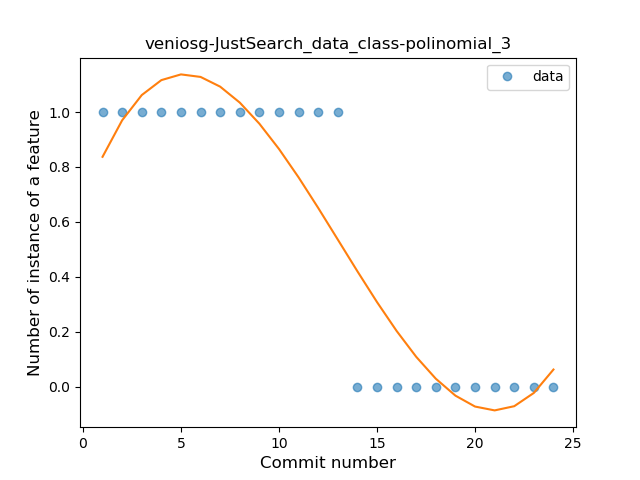
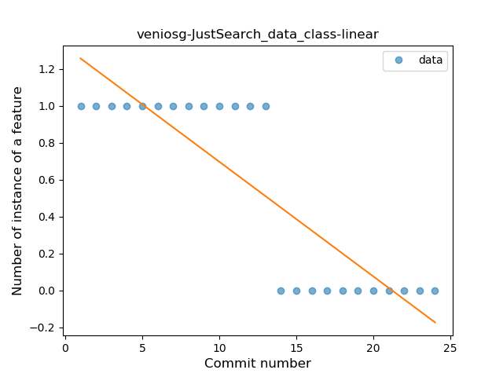
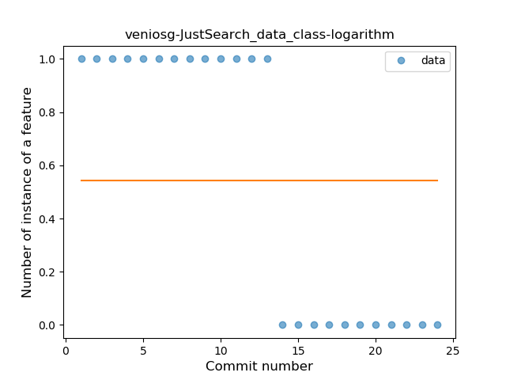
### <a name="property_delegation">Property Delegation</a>
----
#### Functions
* **Plateau Gradual Rise - Sigmoid:** 
    * **R_Squared:** 0.95940074
* **Instability - Polinomial 4:** 
    * **R_Squared:** 0.88009673
* **Constant Rise - Linear:** 
    * **R_Squared:** 0.75866219
* **Sudden Rise Plateau - Logarithm:** 
    * **R_Squared:** 0.73449755

**Plots** :chart_with_upwards_trend:
-----

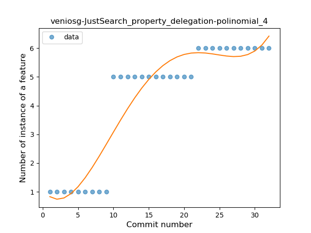
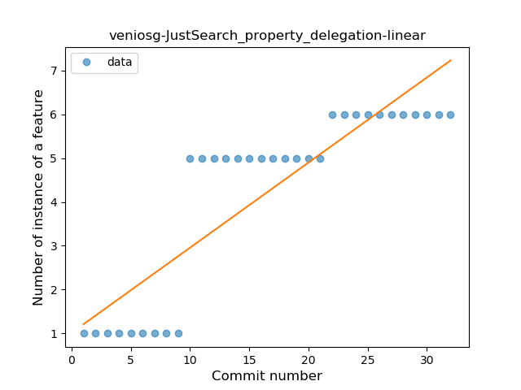
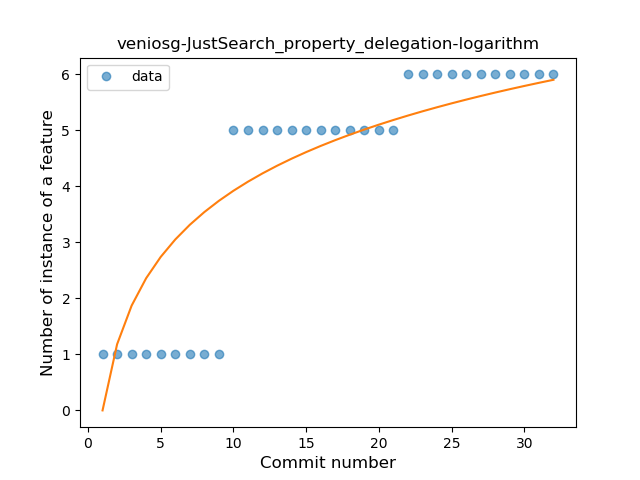
