## walleth-walleth
----
#### Metrics provided by Detekt
* Number of lines of code 10597
* Number of Kotlin files: 170
* Cyclomatic complexity: 1388
* Cyclomatic complexity by thousands of lines: 269 

----
**15** features analyzed

*	<a href="#type_inference">Type Inference</a> 
*	<a href="#lambda">Lambda</a> 
*	<a href="#safe_call">Safe Call</a> 
*	<a href="#when_expr">When expression</a> 
*	<a href="#companion_object">Companion Object</a> 
*	<a href="#unsafe_call">Unsafe Call</a> 
*	<a href="#string_template">String Template</a> 
*	<a href="#func_with_default_value">Function with Default Value</a> 
*	<a href="#singleton">Singleton</a> 
*	<a href="#smart_cast">Smart Cast</a> 
*	<a href="#range_expr">Range Expression</a> 
*	<a href="#func_call_with_named_arg">Function call with Named Argument</a> 
*	<a href="#data_class">Data Class</a> 
*	<a href="#extension_function">Extension Function</a> 
*	<a href="#property_delegation">Property Delegation</a> 

### <a name="type_inference">Type Inference</a>
----
#### Functions
* **Constant Rise - Linear:** 
    * **R_Squared:** 0.96689399
* **Plateau Sudden Rise - Binary Sigmoid:** 
    * **R_Squared:** 0.72084184
* **Sudden Rise Plateau - Logarithm:** 
    * **R_Squared:** 0.5516836

**Plots** :chart_with_upwards_trend:
-----

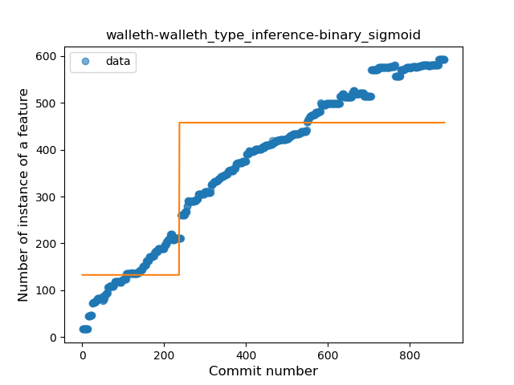
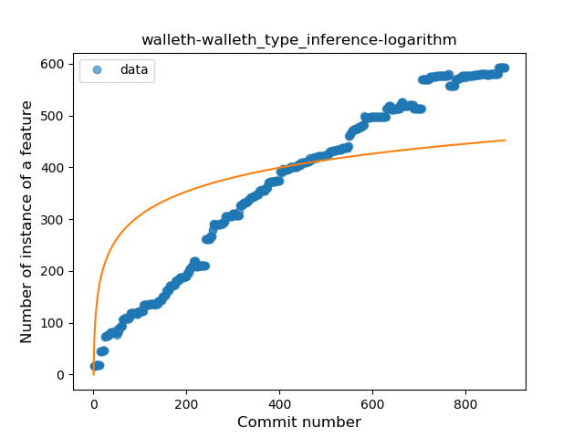
### <a name="lambda">Lambda</a>
----
#### Functions
* **Constant Rise - Linear:** 
    * **R_Squared:** 0.98677979
* **Plateau Sudden Rise - Binary Sigmoid:** 
    * **R_Squared:** 0.71894045
* **Sudden Rise Plateau - Logarithm:** 
    * **R_Squared:** 0.52665785

**Plots** :chart_with_upwards_trend:
-----

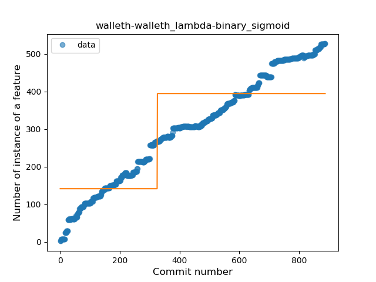
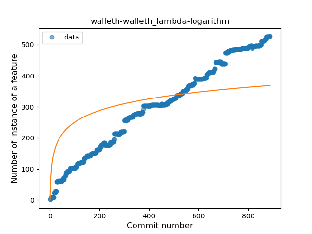
### <a name="safe_call">Safe Call</a>
----
#### Functions
* **Constant Rise - Linear:** 
    * **R_Squared:** 0.97860053
* **Sudden Rise Plateau - Logarithm:** 
    * **R_Squared:** 0.48758792
* **Plateau Sudden Rise - Binary Sigmoid:** 
    * **R_Squared:** 0.41581879

**Plots** :chart_with_upwards_trend:
-----

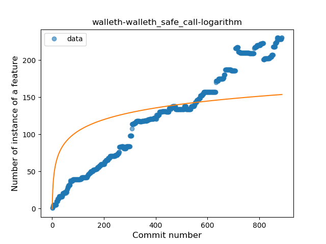
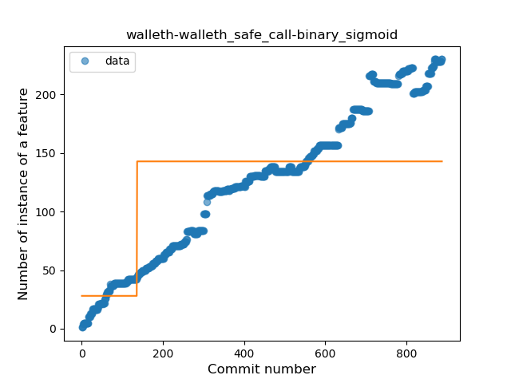
### <a name="when_expr">When expression</a>
----
#### Functions
* **Constant Rise - Linear:** 
    * **R_Squared:** 0.93650365
* **Sudden Rise Plateau - Logarithm:** 
    * **R_Squared:** 0.60503368
* **Plateau Sudden Rise - Binary Sigmoid:** 
    * **R_Squared:** 0.21317571

**Plots** :chart_with_upwards_trend:
-----

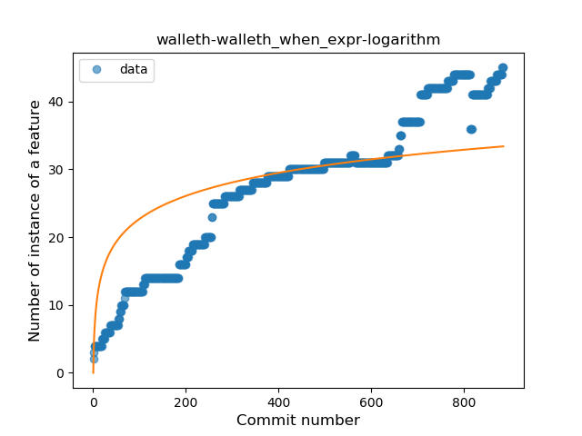

### <a name="companion_object">Companion Object</a>
----
#### Functions
* **Sudden Rise Plateau - Logarithm:** 
    * **R_Squared:** 0.61435737
* **Constant Rise - Linear:** 
    * **R_Squared:** 0.33511131

**Plots** :chart_with_upwards_trend:
-----

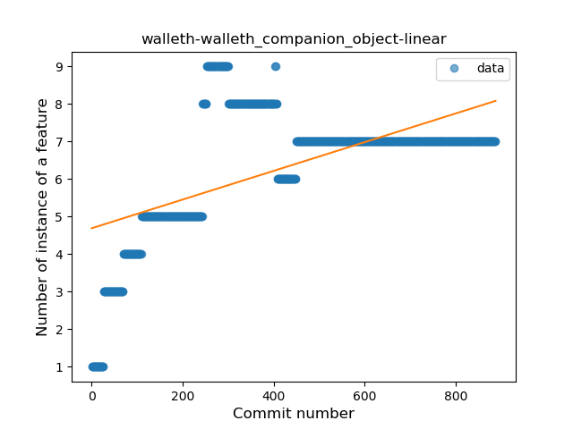
### <a name="unsafe_call">Unsafe Call</a>
----
#### Functions
* **Plateau Gradual Rise - Sigmoid:** 
    * **R_Squared:** 0.90022076
* **Constant Rise - Linear:** 
    * **R_Squared:** 0.72205778
* **Sudden Rise Plateau - Logarithm:** 
    * **R_Squared:** 0.65993529

**Plots** :chart_with_upwards_trend:
-----

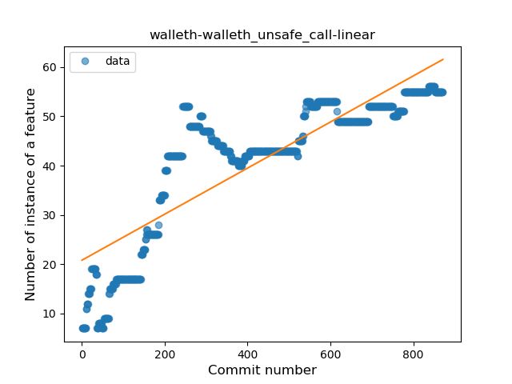
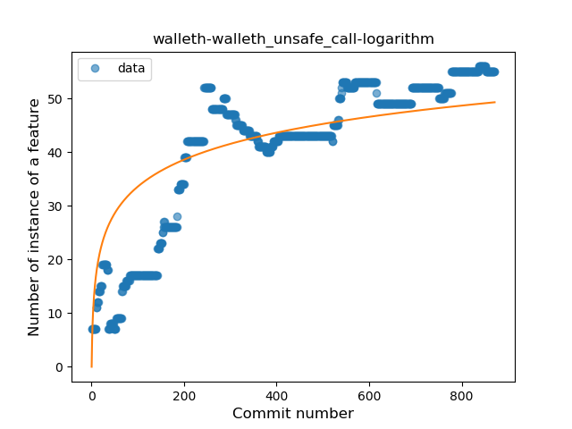
### <a name="string_template">String Template</a>
----
#### Functions
* **Sudden Rise - Exponential:** 
    * **R_Squared:** 0.86161096
* **Constant Rise - Linear:** 
    * **R_Squared:** 0.77327555
* **Sudden Rise Plateau - Logarithm:** 
    * **R_Squared:** 0.35080562
* **Plateau Sudden Rise - Binary Sigmoid:** 
    * **R_Squared:** 0.06383067

**Plots** :chart_with_upwards_trend:
-----

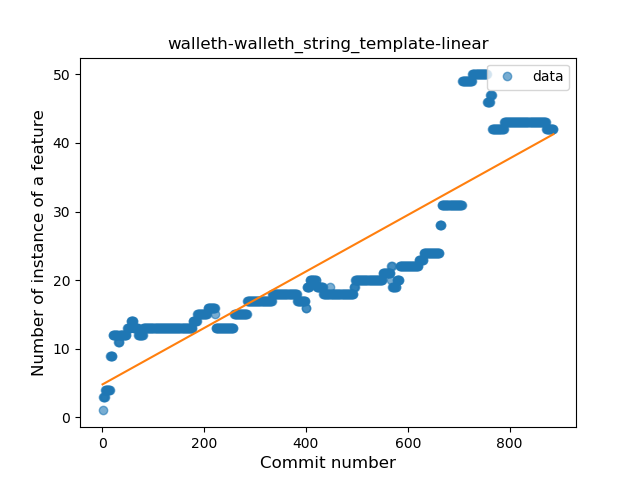
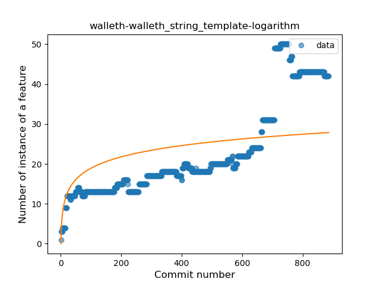
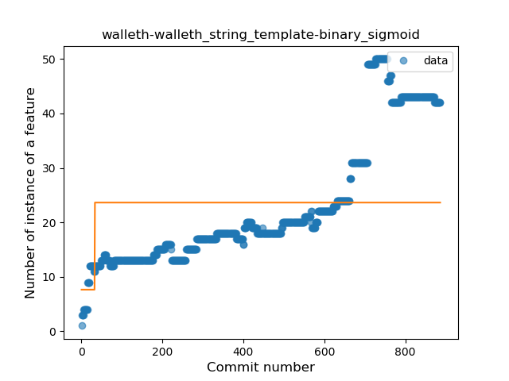
### <a name="func_with_default_value">Function with Default Value</a>
----
#### Functions
* **Sudden Rise - Exponential:** 
    * **R_Squared:** 0.91220002
* **Constant Rise - Linear:** 
    * **R_Squared:** 0.78270164
* **Sudden Rise Plateau - Logarithm:** 
    * **R_Squared:** 0.48741621

**Plots** :chart_with_upwards_trend:
-----

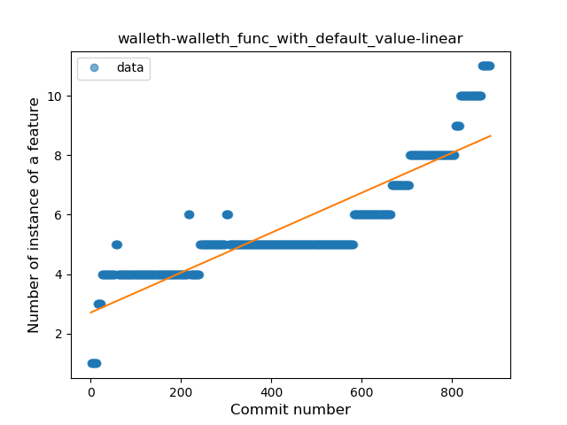
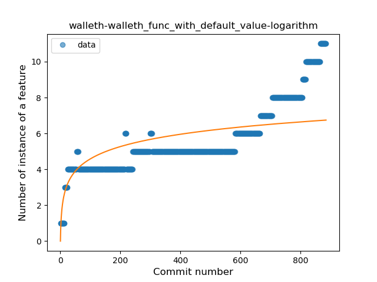
### <a name="singleton">Singleton</a>
----
#### Functions
* **Plateau Sudden Rise - Binary Sigmoid:** 
    * **R_Squared:** 0.03395579
* **Constant Rise - Linear:** 
    * **R_Squared:** 0.00087357
* **Sudden Rise - Exponential:** 
    * **R_Squared:** 0.0008681
* **Sudden Rise Plateau - Logarithm:** 
    * **R_Squared:** -0.0

**Plots** :chart_with_upwards_trend:
-----

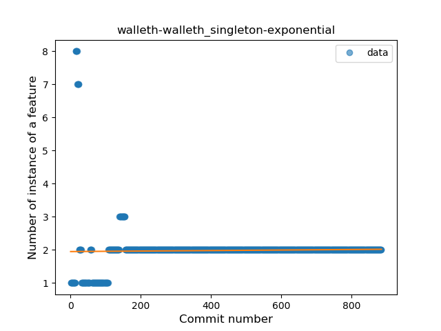

### <a name="smart_cast">Smart Cast</a>
----
#### Functions
* **Constant Rise - Linear:** 
    * **R_Squared:** 0.7977013
* **Sudden Rise Plateau - Logarithm:** 
    * **R_Squared:** 0.41586913

**Plots** :chart_with_upwards_trend:
-----

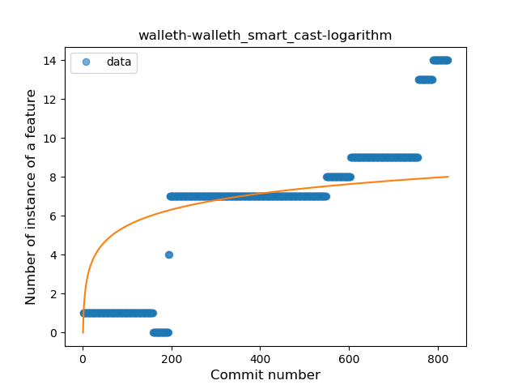
### <a name="range_expr">Range Expression</a>
----
#### Functions
* **Sudden Rise Plateau - Logarithm:** 
    * **R_Squared:** 0.39341017
* **Constant Rise - Linear:** 
    * **R_Squared:** 0.17243072

**Plots** :chart_with_upwards_trend:
-----

### <a name="func_call_with_named_arg">Function call with Named Argument</a>
----
#### Functions
* **Constant Rise - Linear:** 
    * **R_Squared:** 0.91549946
* **Sudden Rise Plateau - Logarithm:** 
    * **R_Squared:** 0.54608387
* **Plateau Sudden Rise - Binary Sigmoid:** 
    * **R_Squared:** 0.37617811

**Plots** :chart_with_upwards_trend:
-----

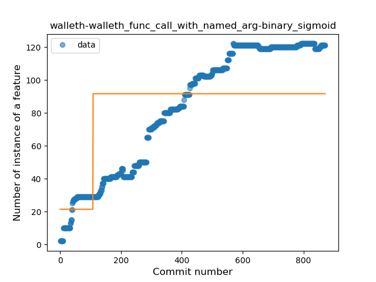
### <a name="data_class">Data Class</a>
----
#### Functions
* **Sudden Rise - Exponential:** 
    * **R_Squared:** 0.88037776
* **Constant Rise - Linear:** 
    * **R_Squared:** 0.78496745
* **Sudden Rise Plateau - Logarithm:** 
    * **R_Squared:** 0.49534915

**Plots** :chart_with_upwards_trend:
-----

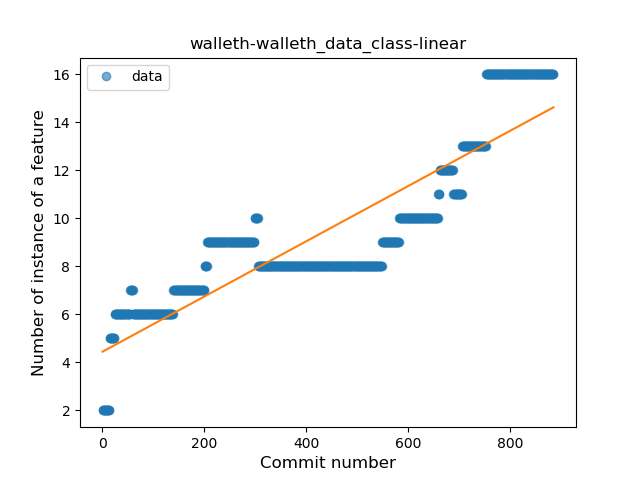
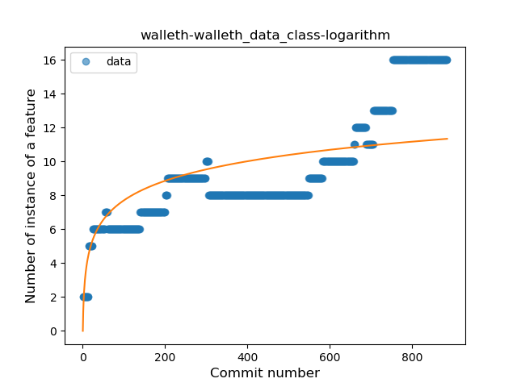
### <a name="extension_function">Extension Function</a>
----
#### Functions
* **Constant Rise - Linear:** 
    * **R_Squared:** 0.984717
* **Sudden Rise Plateau - Logarithm:** 
    * **R_Squared:** 0.41686306

**Plots** :chart_with_upwards_trend:
-----

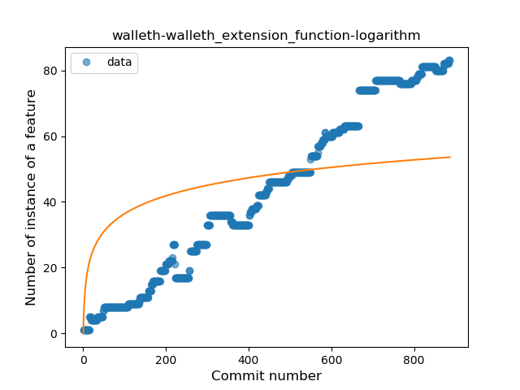
### <a name="property_delegation">Property Delegation</a>
----
#### Functions
* **Constant Rise - Linear:** 
    * **R_Squared:** 0.90008515
* **Sudden Rise Plateau - Logarithm:** 
    * **R_Squared:** 0.6145398
* **Plateau Sudden Rise - Binary Sigmoid:** 
    * **R_Squared:** 0.42733913

**Plots** :chart_with_upwards_trend:
-----

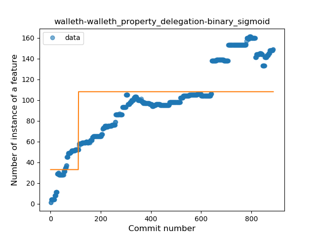
