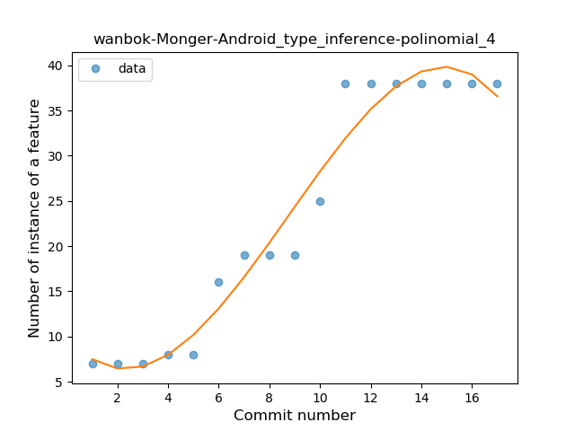
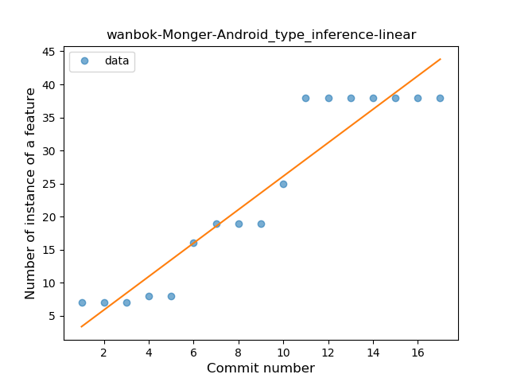
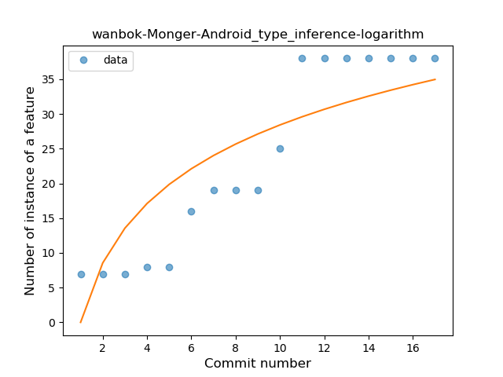
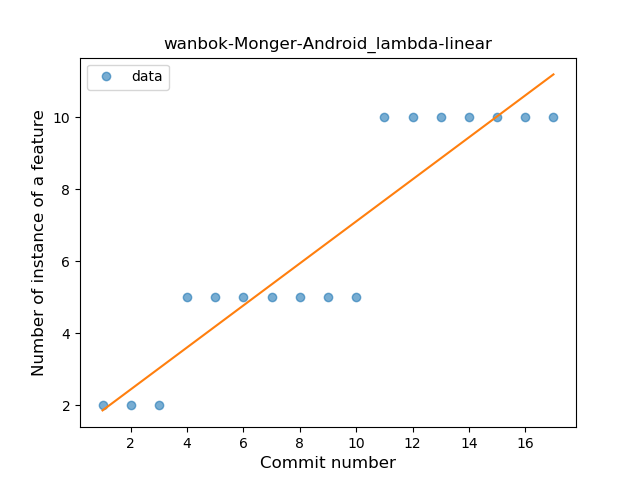
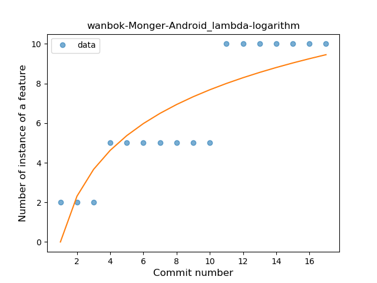
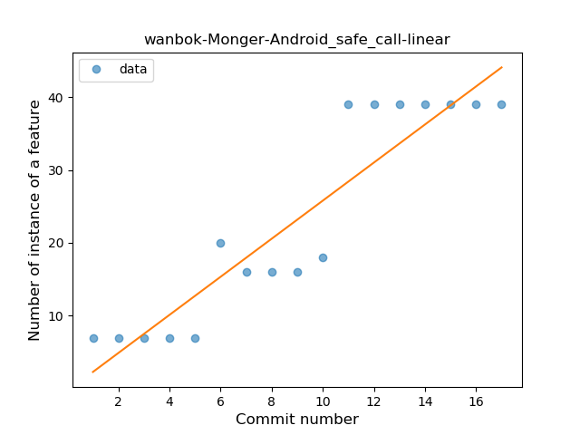
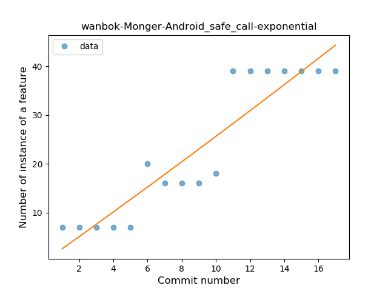
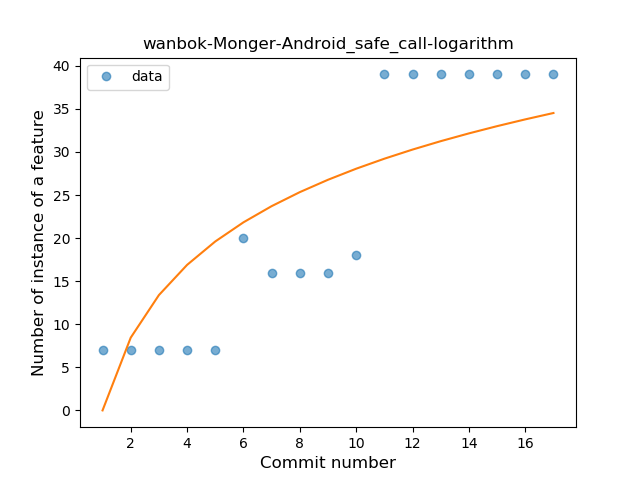

## wanbok-Monger-Android
----
#### Metrics provided by Detekt
* Number of lines of code 290
* Number of Kotlin files: 5
* Cyclomatic complexity: 40
* Cyclomatic complexity by thousands of lines: 285 

----
**3** features analyzed

*	<a href="#type_inference">Type Inference</a> 
*	<a href="#lambda">Lambda</a> 
*	<a href="#safe_call">Safe Call</a> 

### <a name="type_inference">Type Inference</a>
----
#### Functions
* **Instability - Polinomial 3:** )
    * **R_Squared:** 0.96049996
* **Instability - Polinomial 4:** 
    * **R_Squared:** 0.96053808
* **Constant Rise - Linear:** 
    * **R_Squared:** 0.90207425
* **Sudden Rise Plateau - Logarithm:** 
    * **R_Squared:** 0.74333919

**Plots** :chart_with_upwards_trend:
-----

### <a name="lambda">Lambda</a>
----
#### Functions
* **Plateau Gradual Rise - Sigmoid:** 
    * **R_Squared:** 0.87005537
* **Constant Rise - Linear:** 
    * **R_Squared:** 0.85575296
* **Sudden Rise Plateau - Logarithm:** 
    * **R_Squared:** 0.76000166

**Plots** :chart_with_upwards_trend:
-----

### <a name="safe_call">Safe Call</a>
----
#### Functions
* **Instability - Polinomial 3:** )
    * **R_Squared:** 0.90517314
* **Constant Rise - Linear:** 
    * **R_Squared:** 0.85472356
* **Sudden Rise - Exponential:** 
    * **R_Squared:** 0.8548671
* **Sudden Rise Plateau - Logarithm:** 
    * **R_Squared:** 0.66860795

**Plots** :chart_with_upwards_trend:
-----

