## xgouchet-Stanley
----
#### Metrics provided by Detekt
* Number of lines of code 3756
* Number of Kotlin files: 65
* Cyclomatic complexity: 511
* Cyclomatic complexity by thousands of lines: 293 

----
**14** features analyzed

*	<a href="#type_inference">Type Inference</a> 
*	<a href="#lambda">Lambda</a> 
*	<a href="#safe_call">Safe Call</a> 
*	<a href="#when_expr">When expression</a> 
*	<a href="#companion_object">Companion Object</a> 
*	<a href="#unsafe_call">Unsafe Call</a> 
*	<a href="#string_template">String Template</a> 
*	<a href="#func_with_default_value">Function with Default Value</a> 
*	<a href="#singleton">Singleton</a> 
*	<a href="#smart_cast">Smart Cast</a> 
*	<a href="#func_call_with_named_arg">Function call with Named Argument</a> 
*	<a href="#data_class">Data Class</a> 
*	<a href="#extension_function">Extension Function</a> 
*	<a href="#property_delegation">Property Delegation</a> 

### <a name="type_inference">Type Inference</a>
----
#### Functions
* **Constant Rise - Linear:** 
    * **R_Squared:** 0.94759385
* **Sudden Rise Plateau - Logarithm:** 
    * **R_Squared:** 0.80353351
* **Plateau Sudden Rise - Binary Sigmoid:** 
    * **R_Squared:** 0.36265926

**Plots** :chart_with_upwards_trend:
-----

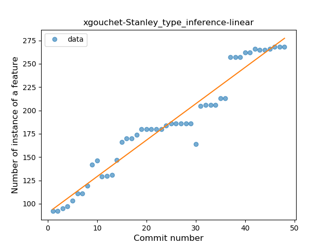
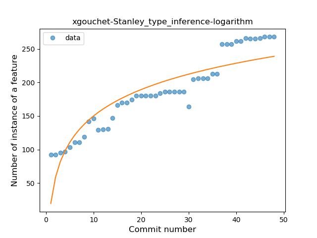

### <a name="lambda">Lambda</a>
----
#### Functions
* **Constant Rise - Linear:** 
    * **R_Squared:** 0.92634894
* **Sudden Rise Plateau - Logarithm:** 
    * **R_Squared:** 0.85604843

**Plots** :chart_with_upwards_trend:
-----

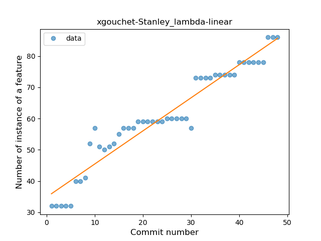
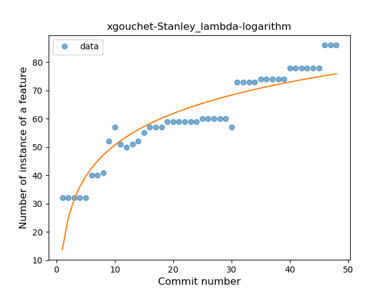
### <a name="safe_call">Safe Call</a>
----
#### Functions
* **Constant Rise - Linear:** 
    * **R_Squared:** 0.89978147
* **Sudden Rise Plateau - Logarithm:** 
    * **R_Squared:** 0.87015943

**Plots** :chart_with_upwards_trend:
-----

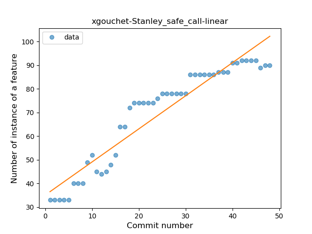
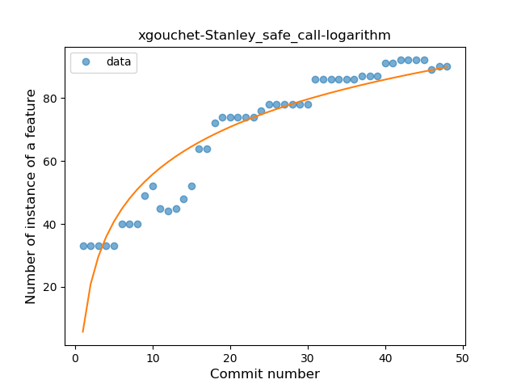
### <a name="when_expr">When expression</a>
----
#### Functions
* **Constant Rise - Linear:** 
    * **R_Squared:** 0.9588005
* **Sudden Rise - Exponential:** 
    * **R_Squared:** 0.96201503
* **Sudden Rise Plateau - Logarithm:** 
    * **R_Squared:** 0.7731553

**Plots** :chart_with_upwards_trend:
-----

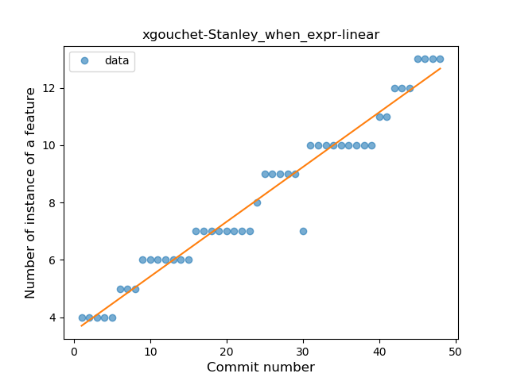
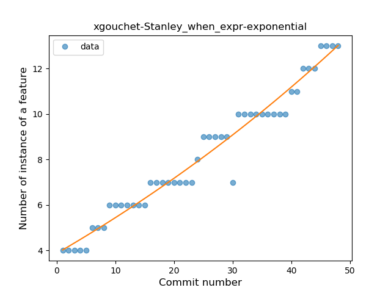
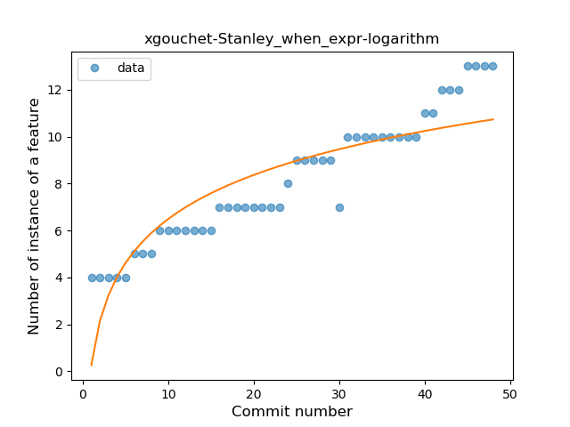
### <a name="companion_object">Companion Object</a>
----
#### Functions
* **Constant Rise - Linear:** 
    * **R_Squared:** 0.89835073
* **Sudden Rise Plateau - Logarithm:** 
    * **R_Squared:** 0.80411098

**Plots** :chart_with_upwards_trend:
-----

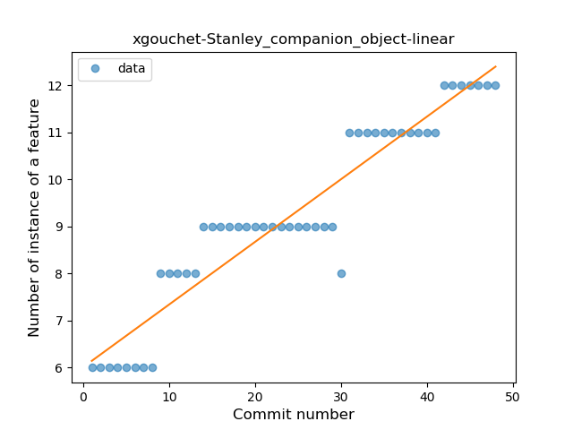
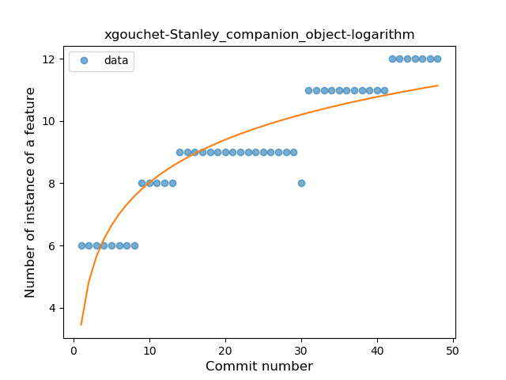
### <a name="unsafe_call">Unsafe Call</a>
----
#### Functions
* **Plateau Sudden Rise - Binary Sigmoid:** 
    * **R_Squared:** 1.0
* **Instability - Polinomial 4:** 
    * **R_Squared:** 0.88432311
* **Sudden Rise Plateau - Logarithm:** 
    * **R_Squared:** 0.70518116
* **Constant Rise - Linear:** 
    * **R_Squared:** 0.66873065

**Plots** :chart_with_upwards_trend:
-----

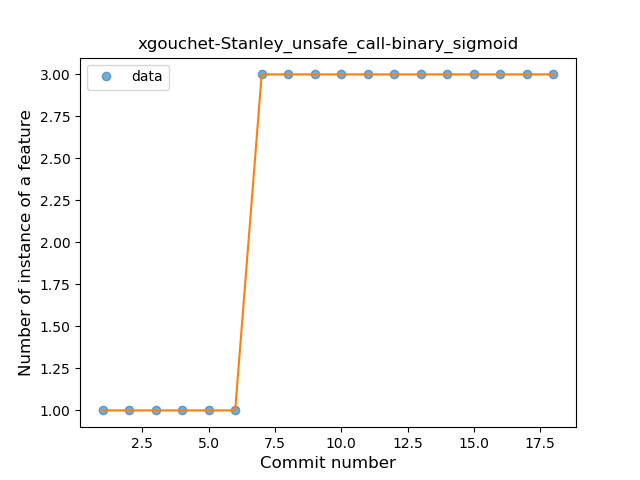
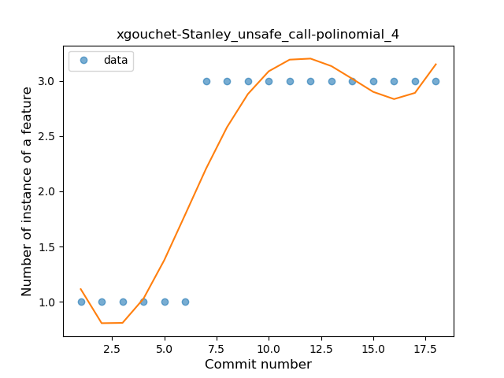
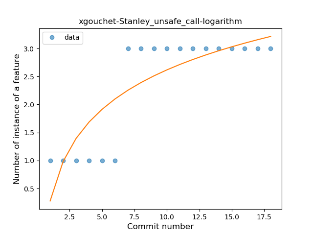
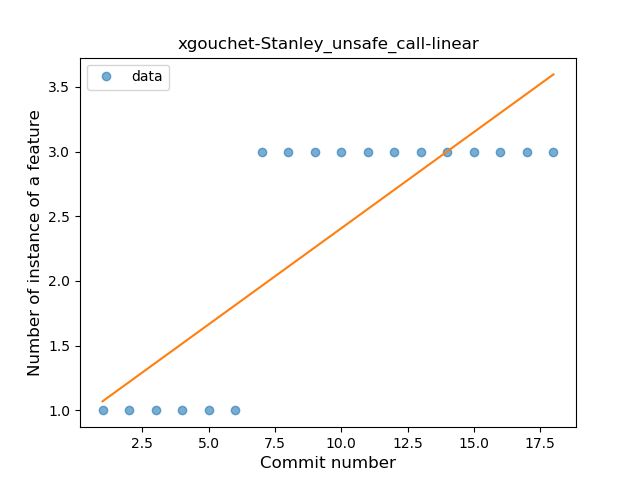
### <a name="string_template">String Template</a>
----
#### Functions
* **Instability - Polinomial 4:** 
    * **R_Squared:** 0.92163749
* **Sudden Rise - Exponential:** 
    * **R_Squared:** 0.8699407
* **Constant Rise - Linear:** 
    * **R_Squared:** 0.83459066
* **Sudden Rise Plateau - Logarithm:** 
    * **R_Squared:** 0.64195403
* **Plateau Sudden Rise - Binary Sigmoid:** 
    * **R_Squared:** 0.32513583

**Plots** :chart_with_upwards_trend:
-----

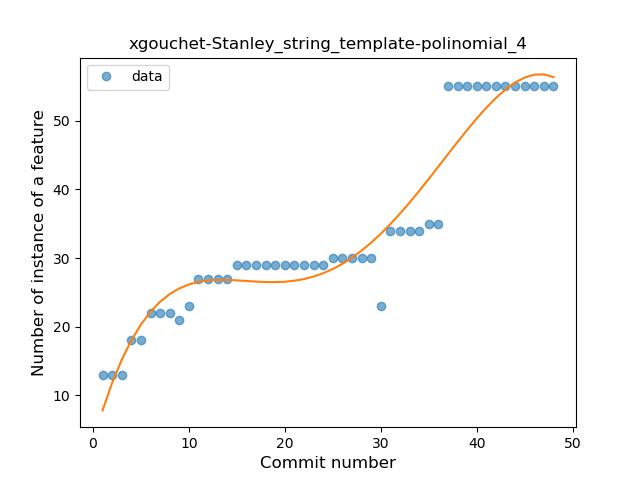
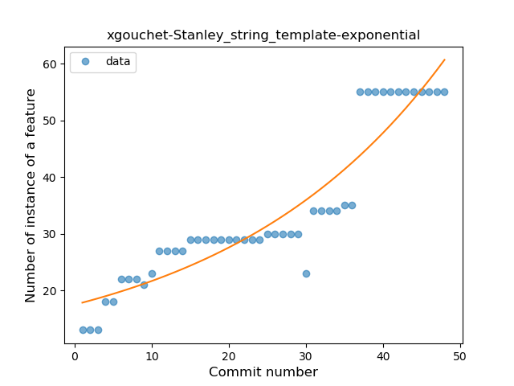

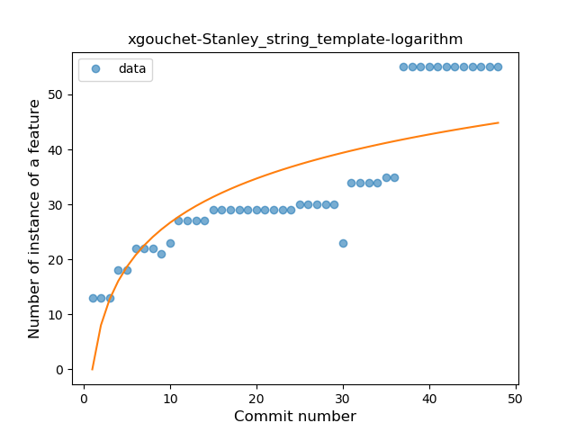
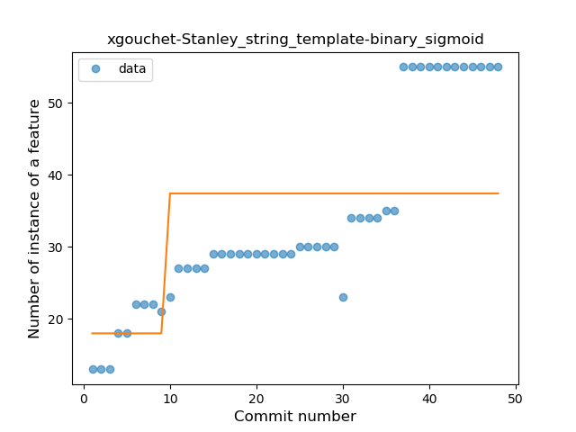
### <a name="func_with_default_value">Function with Default Value</a>
----
#### Functions
* **Instability - Polinomial 3:** )
    * **R_Squared:** 0.16803973
* **Constant Decline - Linear:** 
    * **R_Squared:** 0.00781848
* **Sudden Rise Plateau - Logarithm:** 
    * **R_Squared:** 0.00505089

**Plots** :chart_with_upwards_trend:
-----

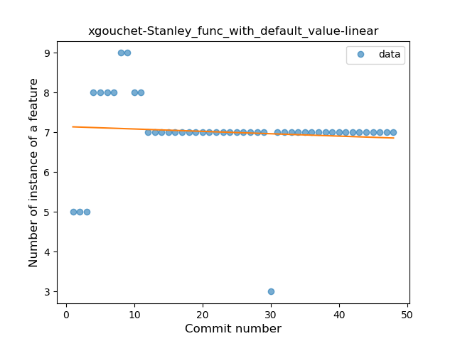
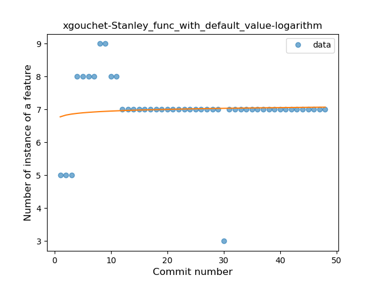
### <a name="singleton">Singleton</a>
----
#### Functions
* **Sudden Rise - Exponential:** 
    * **R_Squared:** 0.80810196
* **Constant Rise - Linear:** 
    * **R_Squared:** 0.6487699
* **Sudden Rise Plateau - Logarithm:** 
    * **R_Squared:** 0.36558744

**Plots** :chart_with_upwards_trend:
-----

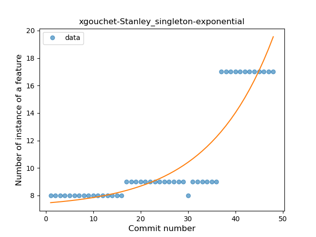
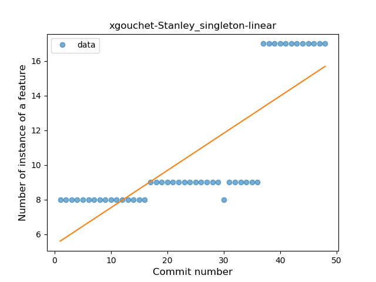
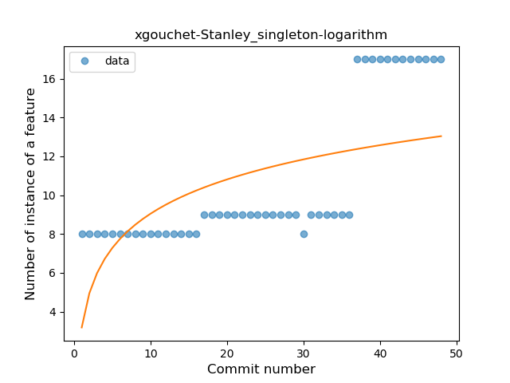
### <a name="smart_cast">Smart Cast</a>
----
#### Functions
* **Instability - Polinomial 3:** )
    * **R_Squared:** 0.81983949
* **Sudden Rise Plateau - Logarithm:** 
    * **R_Squared:** 0.7532899
* **Constant Rise - Linear:** 
    * **R_Squared:** 0.64121858

**Plots** :chart_with_upwards_trend:
-----

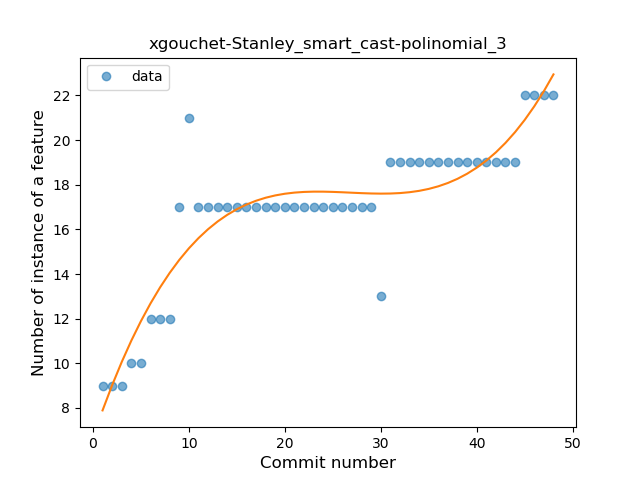
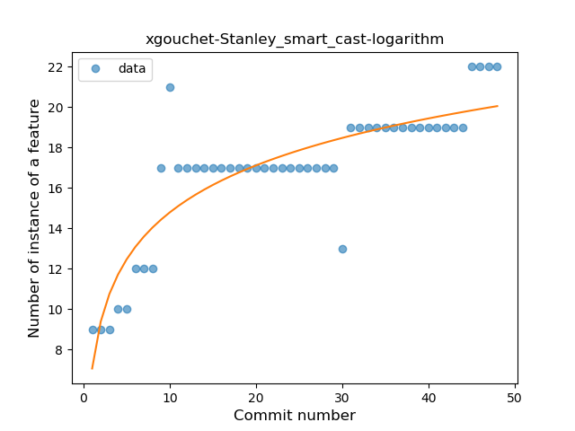
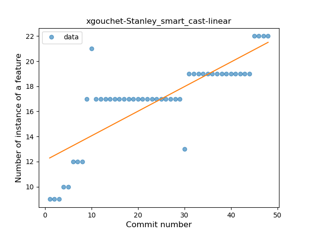
### <a name="func_call_with_named_arg">Function call with Named Argument</a>
----
#### Functions
* **Plateau Sudden Rise - Binary Sigmoid:** 
    * **R_Squared:** 0.72040192
* **Instability - Polinomial 3:** )
    * **R_Squared:** 0.46896602
* **Sudden Rise Plateau - Logarithm:** 
    * **R_Squared:** 0.28749147
* **Constant Rise - Linear:** 
    * **R_Squared:** 0.09570684

**Plots** :chart_with_upwards_trend:
-----

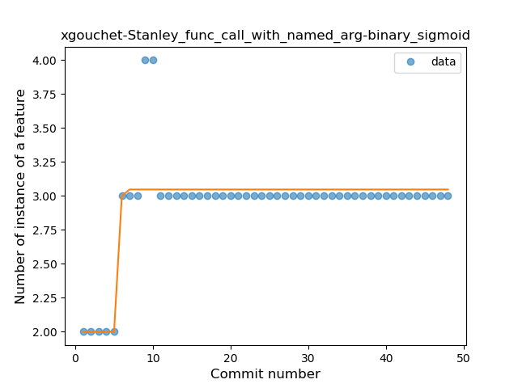
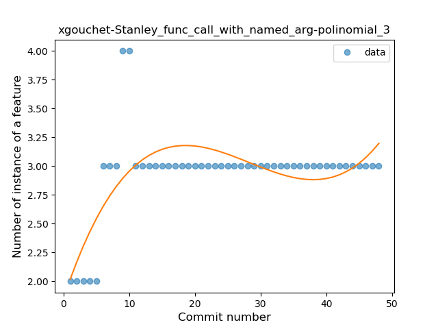
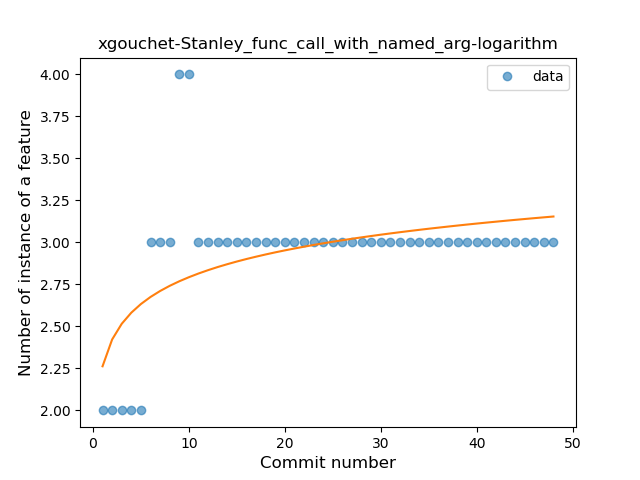
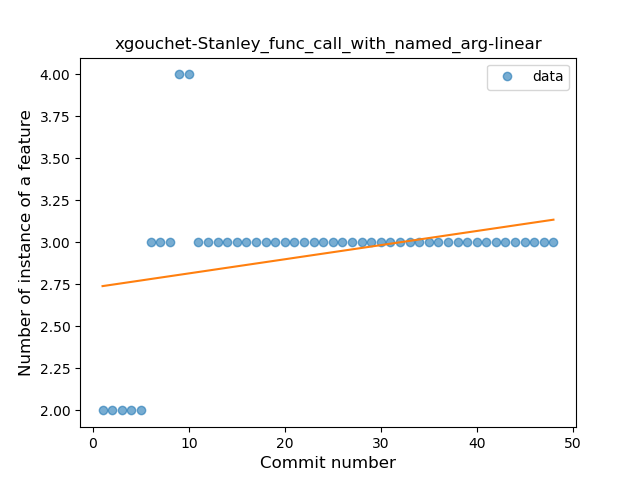
### <a name="data_class">Data Class</a>
----
#### Functions
* **Sudden Rise - Exponential:** 
    * **R_Squared:** 0.25389361
* **Constant Rise - Linear:** 
    * **R_Squared:** 0.23754183
* **Sudden Rise Plateau - Logarithm:** 
    * **R_Squared:** 0.19780825

**Plots** :chart_with_upwards_trend:
-----

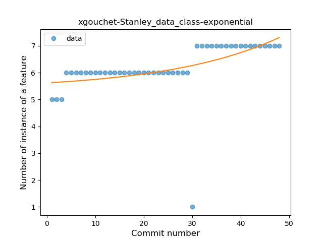
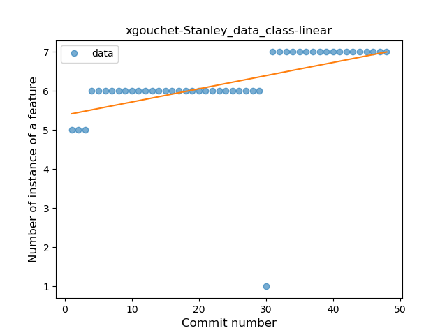
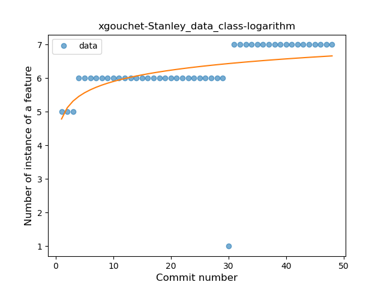
### <a name="extension_function">Extension Function</a>
----
#### Functions
* **Constant Rise - Linear:** 
    * **R_Squared:** 0.83628567
* **Sudden Rise Plateau - Logarithm:** 
    * **R_Squared:** 0.80295465

**Plots** :chart_with_upwards_trend:
-----

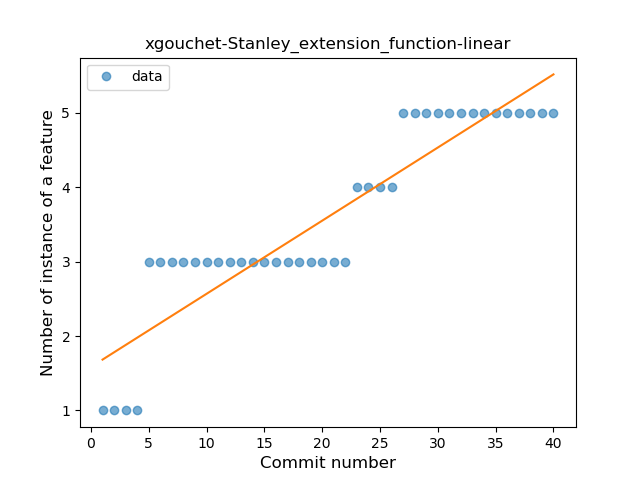
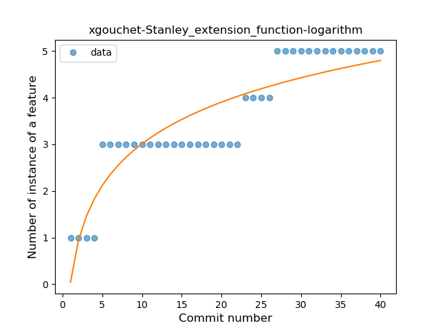
### <a name="property_delegation">Property Delegation</a>
----
#### Functions
* **Plateau Sudden Rise - Binary Sigmoid:** 
    * **R_Squared:** 0.43712465
* **Sudden Rise - Exponential:** 
    * **R_Squared:** 0.35473191
* **Constant Rise - Linear:** 
    * **R_Squared:** 0.21110905
* **Sudden Rise Plateau - Logarithm:** 
    * **R_Squared:** 0.06367593

**Plots** :chart_with_upwards_trend:
-----

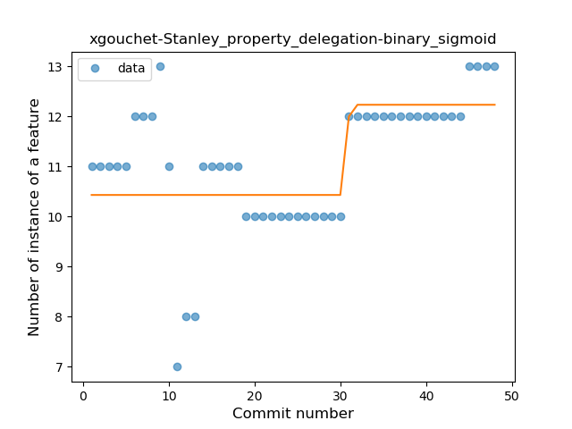
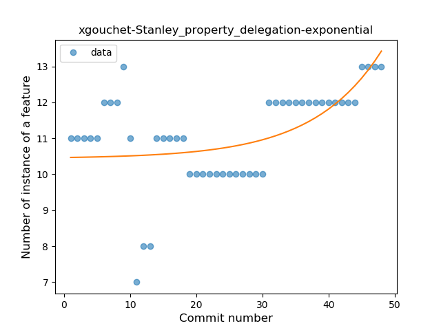
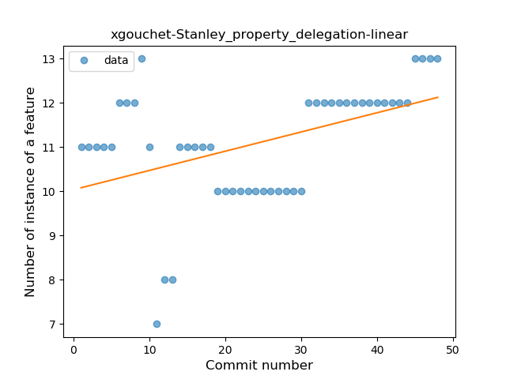
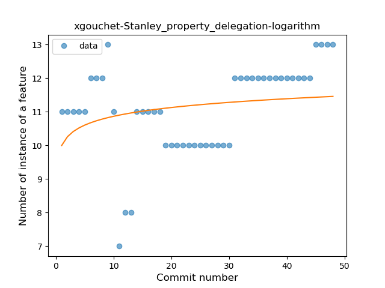
