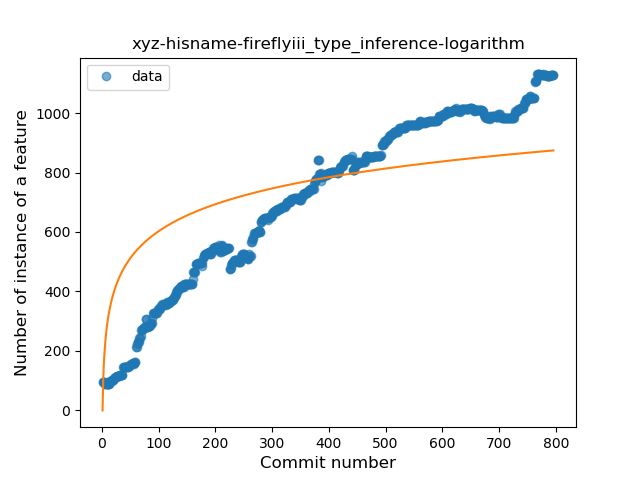
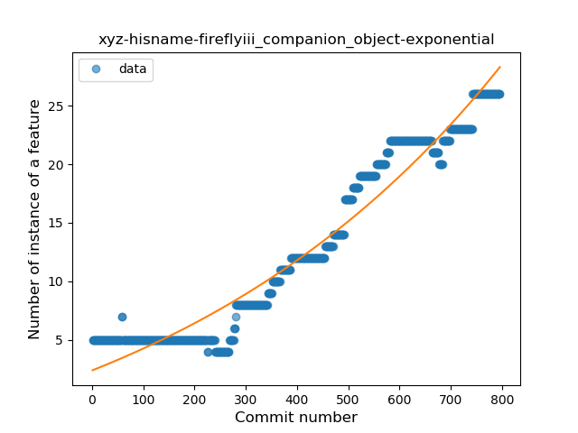

## xyz-hisname-fireflyiii
----
#### Metrics provided by Detekt
* Number of lines of code 18069
* Number of Kotlin files: 306
* Cyclomatic complexity: 2302
* Cyclomatic complexity by thousands of lines: 215 

----
**17** features analyzed

*	<a href="#type_inference">Type Inference</a> 
*	<a href="#lambda">Lambda</a> 
*	<a href="#safe_call">Safe Call</a> 
*	<a href="#when_expr">When expression</a> 
*	<a href="#unsafe_call">Unsafe Call</a> 
*	<a href="#companion_object">Companion Object</a> 
*	<a href="#string_template">String Template</a> 
*	<a href="#func_with_default_value">Function with Default Value</a> 
*	<a href="#singleton">Singleton</a> 
*	<a href="#range_expr">Range Expression</a> 
*	<a href="#smart_cast">Smart Cast</a> 
*	<a href="#data_class">Data Class</a> 
*	<a href="#func_call_with_named_arg">Function call with Named Argument</a> 
*	<a href="#extension_function">Extension Function</a> 
*	<a href="#property_delegation">Property Delegation</a> 
*	<a href="#inline_func">Inline Function</a> 
*	<a href="#coroutine">Coroutine</a> 

### <a name="type_inference">Type Inference</a>
----
#### Functions
* **Constant Rise - Linear:** 
    * **R_Squared:** 0.93896958
* **Sudden Rise Plateau - Logarithm:** 
    * **R_Squared:** 0.62928379
* **Plateau Sudden Rise - Binary Sigmoid:** 
    * **R_Squared:** 0.35585985

**Plots** :chart_with_upwards_trend:
-----

### <a name="lambda">Lambda</a>
----
#### Functions
* **Constant Rise - Linear:** 
    * **R_Squared:** 0.93120739
* **Sudden Rise Plateau - Logarithm:** 
    * **R_Squared:** 0.58318071

**Plots** :chart_with_upwards_trend:
-----

### <a name="safe_call">Safe Call</a>
----
#### Functions
* **Constant Rise - Linear:** 
    * **R_Squared:** 0.90722712
* **Sudden Rise Plateau - Logarithm:** 
    * **R_Squared:** 0.58621879
* **Plateau Sudden Rise - Binary Sigmoid:** 
    * **R_Squared:** 0.30804959

**Plots** :chart_with_upwards_trend:
-----

### <a name="when_expr">When expression</a>
----
#### Functions
* **Constant Rise - Linear:** 
    * **R_Squared:** 0.94358437
* **Sudden Rise Plateau - Logarithm:** 
    * **R_Squared:** 0.6159529

**Plots** :chart_with_upwards_trend:
-----

### <a name="unsafe_call">Unsafe Call</a>
----
#### Functions
* **Constant Decline - Linear:** 
    * **R_Squared:** 0.1755049
* **Sudden Decline - Exponential:** 
    * **R_Squared:** 0.0
* **Sudden Rise Plateau - Logarithm:** 
    * **R_Squared:** -0.0

**Plots** :chart_with_upwards_trend:
-----

### <a name="companion_object">Companion Object</a>
----
#### Functions
* **Plateau Gradual Rise - Sigmoid:** 
    * **R_Squared:** 0.98140337
* **Sudden Rise - Exponential:** 
    * **R_Squared:** 0.94696271
* **Constant Rise - Linear:** 
    * **R_Squared:** 0.9220196
* **Sudden Rise Plateau - Logarithm:** 
    * **R_Squared:** 0.35896808

**Plots** :chart_with_upwards_trend:
-----

### <a name="string_template">String Template</a>
----
#### Functions
* **Constant Rise - Linear:** 
    * **R_Squared:** 0.93657044
* **Sudden Rise Plateau - Logarithm:** 
    * **R_Squared:** 0.42973206
* **Plateau Sudden Rise - Binary Sigmoid:** 
    * **R_Squared:** 0.22078516

**Plots** :chart_with_upwards_trend:
-----

### <a name="func_with_default_value">Function with Default Value</a>
----
#### Functions
* **Constant Rise - Linear:** 
    * **R_Squared:** 0.93634852
* **Sudden Rise - Exponential:** 
    * **R_Squared:** 0.9394973
* **Sudden Rise Plateau - Logarithm:** 
    * **R_Squared:** 0.6577859

**Plots** :chart_with_upwards_trend:
-----

### <a name="singleton">Singleton</a>
----
#### Functions
* **Constant Rise - Linear:** 
    * **R_Squared:** 0.62341451
* **Sudden Rise Plateau - Logarithm:** 
    * **R_Squared:** 0.46808211

**Plots** :chart_with_upwards_trend:
-----

### <a name="range_expr">Range Expression</a>
----
#### Functions
* **Plateau Gradual Rise - Sigmoid:** 
    * **R_Squared:** 0.96825499
* **Constant Rise - Linear:** 
    * **R_Squared:** 0.73427424
* **Sudden Rise Plateau - Logarithm:** 
    * **R_Squared:** 0.61638479

**Plots** :chart_with_upwards_trend:
-----

### <a name="smart_cast">Smart Cast</a>
----
#### Functions
* **Constant Decline - Linear:** 
    * **R_Squared:** 0.01816045
* **Sudden Rise Plateau - Logarithm:** 
    * **R_Squared:** -0.0
* **Plateau Gradual Rise - Sigmoid:** 
    * **R_Squared:** 0.00939928

**Plots** :chart_with_upwards_trend:
-----

### <a name="data_class">Data Class</a>
----
#### Functions
* **Sudden Rise Plateau - Logarithm:** 
    * **R_Squared:** 0.8822733
* **Constant Rise - Linear:** 
    * **R_Squared:** 0.79437959
* **Plateau Sudden Rise - Binary Sigmoid:** 
    * **R_Squared:** 0.1130906

**Plots** :chart_with_upwards_trend:
-----

### <a name="func_call_with_named_arg">Function call with Named Argument</a>
----
#### Functions
* **Constant Rise - Linear:** 
    * **R_Squared:** 0.39603667
* **Sudden Rise - Exponential:** 
    * **R_Squared:** 0.40274655
* **Sudden Rise Plateau - Logarithm:** 
    * **R_Squared:** 0.24047071

**Plots** :chart_with_upwards_trend:
-----

### <a name="extension_function">Extension Function</a>
----
#### Functions
* **Sudden Rise - Exponential:** 
    * **R_Squared:** 0.96492524
* **Constant Rise - Linear:** 
    * **R_Squared:** 0.90469035
* **Sudden Rise Plateau - Logarithm:** 
    * **R_Squared:** 0.49670722
* **Plateau Sudden Rise - Binary Sigmoid:** 
    * **R_Squared:** 0.01377646

**Plots** :chart_with_upwards_trend:
-----

### <a name="property_delegation">Property Delegation</a>
----
#### Functions
* **Sudden Rise Plateau - Logarithm:** 
    * **R_Squared:** 0.84943641
* **Constant Rise - Linear:** 
    * **R_Squared:** 0.77307696
* **Plateau Sudden Rise - Binary Sigmoid:** 
    * **R_Squared:** 0.52129525

**Plots** :chart_with_upwards_trend:
-----

### <a name="inline_func">Inline Function</a>
----
#### Functions
* **Plateau Sudden Rise - Binary Sigmoid:** 
    * **R_Squared:** 0.8383709
* **Sudden Rise Plateau - Logarithm:** 
    * **R_Squared:** 0.43195677
* **Constant Rise - Linear:** 
    * **R_Squared:** 0.3959131

**Plots** :chart_with_upwards_trend:
-----

### <a name="coroutine">Coroutine</a>
----
#### Functions
* **Plateau Gradual Rise - Sigmoid:** 
    * **R_Squared:** 0.97274504
* **Constant Rise - Linear:** 
    * **R_Squared:** 0.95402067
* **Sudden Rise - Exponential:** 
    * **R_Squared:** 0.95828194
* **Sudden Rise Plateau - Logarithm:** 
    * **R_Squared:** 0.35472804

**Plots** :chart_with_upwards_trend:
-----

