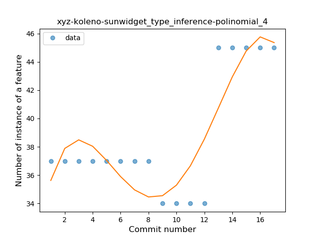
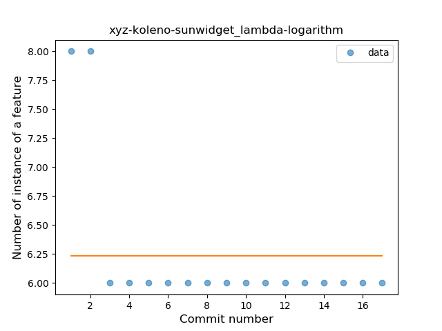
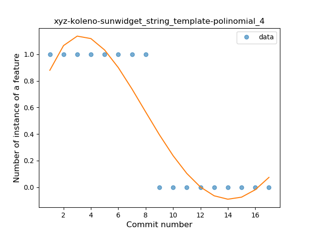

## xyz-koleno-sunwidget
----
#### Metrics provided by Detekt
* Number of lines of code 567
* Number of Kotlin files: 6
* Cyclomatic complexity: 64
* Cyclomatic complexity by thousands of lines: 263 

----
**5** features analyzed

*	<a href="#type_inference">Type Inference</a> 
*	<a href="#lambda">Lambda</a> 
*	<a href="#unsafe_call">Unsafe Call</a> 
*	<a href="#companion_object">Companion Object</a> 
*	<a href="#string_template">String Template</a> 

### <a name="type_inference">Type Inference</a>
----
#### Functions
* **Instability - Polinomial 4:** 
    * **R_Squared:** 0.77164701
* **Sudden Rise - Exponential:** 
    * **R_Squared:** 0.60314703
* **Constant Rise - Linear:** 
    * **R_Squared:** 0.38980638
* **Sudden Rise Plateau - Logarithm:** 
    * **R_Squared:** 0.1960572

**Plots** :chart_with_upwards_trend:
-----

### <a name="lambda">Lambda</a>
----
#### Functions
* **Instability - Polinomial 4:** 
    * **R_Squared:** 0.85175439
* **Sudden Decline - Exponential:** 
    * **R_Squared:** 0.8258947
* **Instability - Polinomial 3:** )
    * **R_Squared:** 0.8004386
* **Constant Decline - Linear:** 
    * **R_Squared:** 0.3125
* **Sudden Rise Plateau - Logarithm:** 
    * **R_Squared:** -0.0

**Plots** :chart_with_upwards_trend:
-----

### <a name="unsafe_call">Unsafe Call</a>
----
#### Functions
* **Plateau Sudden Decline - Binary Sigmoid:** 
    * **R_Squared:** 1.0
* **Instability - Polinomial 4:** 
    * **R_Squared:** 0.88697706
* **Sudden Decline - Exponential:** 
    * **R_Squared:** 0.76093997
* **Constant Decline - Linear:** 
    * **R_Squared:** 0.6875
* **Sudden Rise Plateau - Logarithm:** 
    * **R_Squared:** -0.0

**Plots** :chart_with_upwards_trend:
-----

### <a name="companion_object">Companion Object</a>
----
#### Functions
* **Plateau Sudden Rise - Binary Sigmoid:** 
    * **R_Squared:** 1.0
* **Instability - Polinomial 4:** 
    * **R_Squared:** 0.85175439
* **Instability - Polinomial 3:** )
    * **R_Squared:** 0.8004386
* **Sudden Rise Plateau - Logarithm:** 
    * **R_Squared:** 0.59026347
* **Constant Rise - Linear:** 
    * **R_Squared:** 0.3125

**Plots** :chart_with_upwards_trend:
-----

### <a name="string_template">String Template</a>
----
#### Functions
* **Plateau Sudden Decline - Binary Sigmoid:** 
    * **R_Squared:** 1.0
* **Instability - Polinomial 3:** )
    * **R_Squared:** 0.86184211
* **Instability - Polinomial 4:** 
    * **R_Squared:** 0.86639676
* **Constant Decline - Linear:** 
    * **R_Squared:** 0.75
* **Sudden Decline - Exponential:** 
    * **R_Squared:** 0.75293426
* **Sudden Rise Plateau - Logarithm:** 
    * **R_Squared:** -0.0

**Plots** :chart_with_upwards_trend:
-----

