## ykrank-S1-Next
----
#### Metrics provided by Detekt
* Number of lines of code 13338
* Number of Kotlin files: 142
* Cyclomatic complexity: 1570
* Cyclomatic complexity by thousands of lines: 222 

----
**16** features analyzed

*	<a href="#type_inference">Type Inference</a> 
*	<a href="#lambda">Lambda</a> 
*	<a href="#safe_call">Safe Call</a> 
*	<a href="#when_expr">When expression</a> 
*	<a href="#companion_object">Companion Object</a> 
*	<a href="#unsafe_call">Unsafe Call</a> 
*	<a href="#string_template">String Template</a> 
*	<a href="#func_with_default_value">Function with Default Value</a> 
*	<a href="#singleton">Singleton</a> 
*	<a href="#smart_cast">Smart Cast</a> 
*	<a href="#range_expr">Range Expression</a> 
*	<a href="#data_class">Data Class</a> 
*	<a href="#extension_function">Extension Function</a> 
*	<a href="#property_delegation">Property Delegation</a> 
*	<a href="#inline_func">Inline Function</a> 
*	<a href="#super_delegation">Super Delegation</a> 

### <a name="type_inference">Type Inference</a>
----
#### Functions
* **Constant Rise - Linear:** 
    * **R_Squared:** 0.93557028
* **Sudden Rise Plateau - Logarithm:** 
    * **R_Squared:** 0.59646217
* **Plateau Sudden Rise - Binary Sigmoid:** 
    * **R_Squared:** 0.32505477

**Plots** :chart_with_upwards_trend:
-----

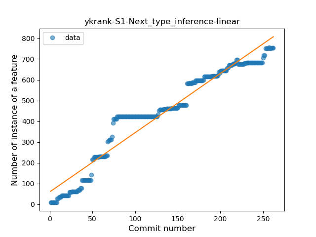
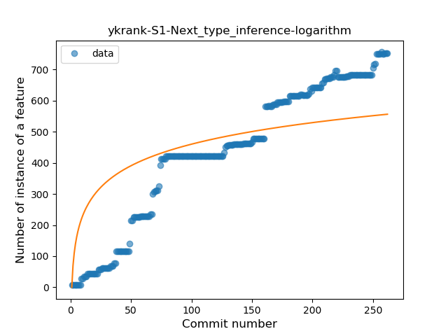
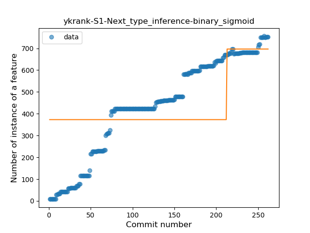
### <a name="lambda">Lambda</a>
----
#### Functions
* **Constant Rise - Linear:** 
    * **R_Squared:** 0.96736498
* **Plateau Sudden Rise - Binary Sigmoid:** 
    * **R_Squared:** 0.67833695
* **Sudden Rise Plateau - Logarithm:** 
    * **R_Squared:** 0.52752762

**Plots** :chart_with_upwards_trend:
-----

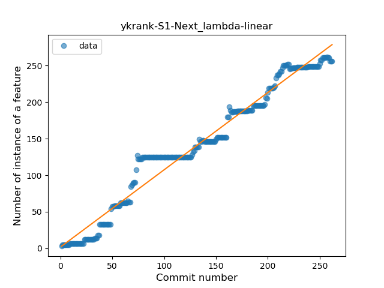
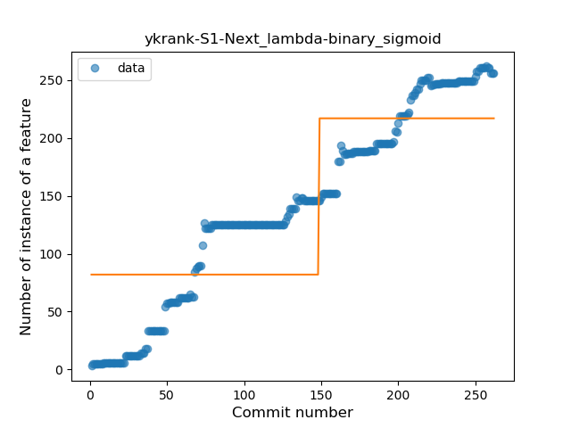
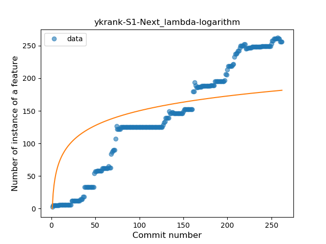
### <a name="safe_call">Safe Call</a>
----
#### Functions
* **Sudden Rise - Exponential:** 
    * **R_Squared:** 0.96294861
* **Constant Rise - Linear:** 
    * **R_Squared:** 0.95246639
* **Plateau Sudden Rise - Binary Sigmoid:** 
    * **R_Squared:** 0.75926313
* **Sudden Rise Plateau - Logarithm:** 
    * **R_Squared:** 0.40720489

**Plots** :chart_with_upwards_trend:
-----

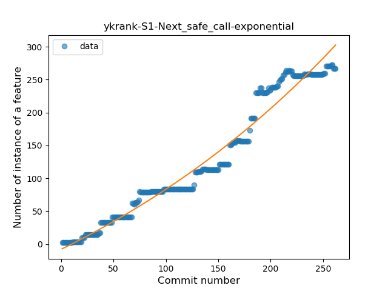
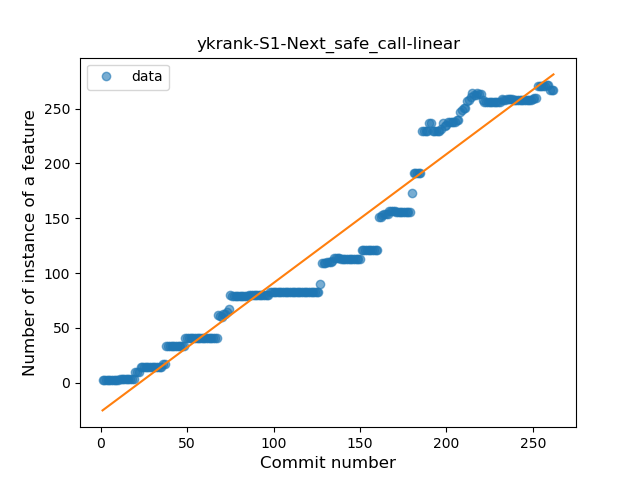
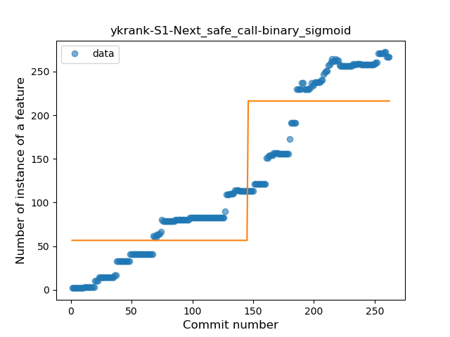
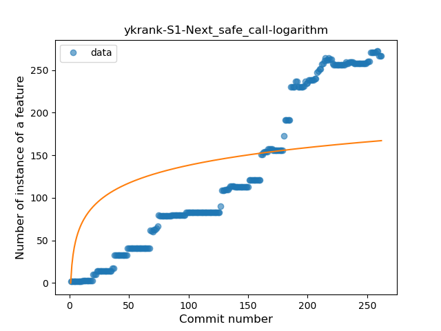
### <a name="when_expr">When expression</a>
----
#### Functions
* **Constant Rise - Linear:** 
    * **R_Squared:** 0.93218538
* **Sudden Rise Plateau - Logarithm:** 
    * **R_Squared:** 0.61257593

**Plots** :chart_with_upwards_trend:
-----

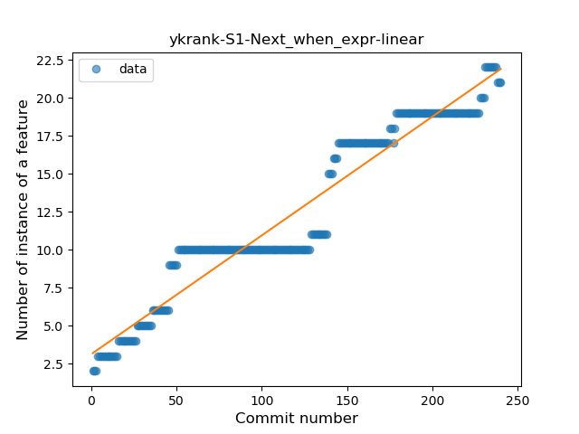
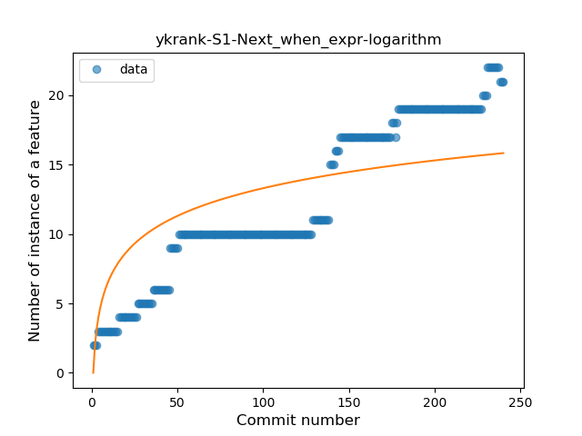
### <a name="companion_object">Companion Object</a>
----
#### Functions
* **Constant Rise - Linear:** 
    * **R_Squared:** 0.91654318
* **Plateau Gradual Rise - Sigmoid:** 
    * **R_Squared:** 0.77125636
* **Sudden Rise Plateau - Logarithm:** 
    * **R_Squared:** 0.61895638

**Plots** :chart_with_upwards_trend:
-----

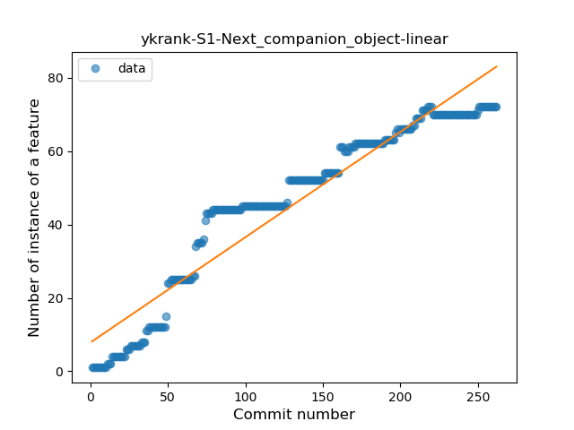
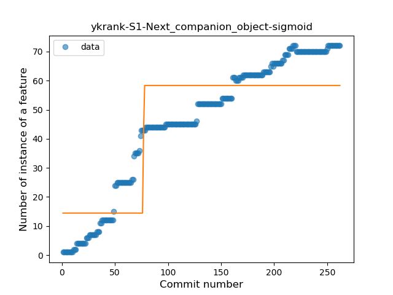
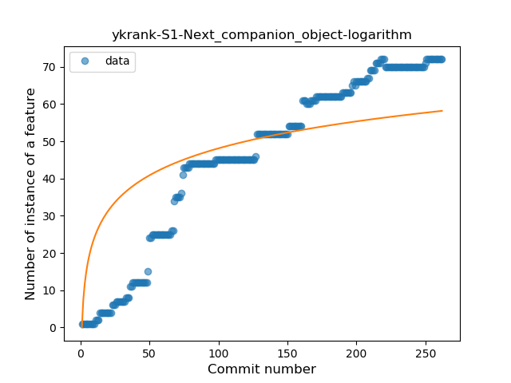
### <a name="unsafe_call">Unsafe Call</a>
----
#### Functions
* **Plateau Gradual Rise - Sigmoid:** 
    * **R_Squared:** 0.95479947
* **Sudden Rise - Exponential:** 
    * **R_Squared:** 0.85116517
* **Constant Rise - Linear:** 
    * **R_Squared:** 0.8112449
* **Sudden Rise Plateau - Logarithm:** 
    * **R_Squared:** 0.27767776

**Plots** :chart_with_upwards_trend:
-----

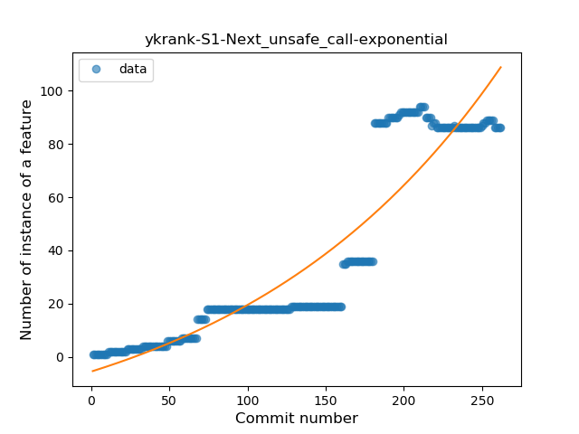
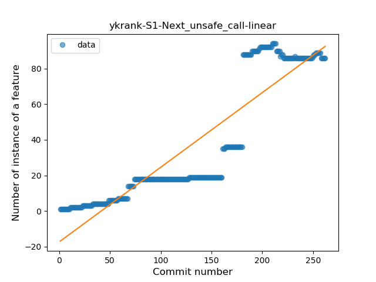
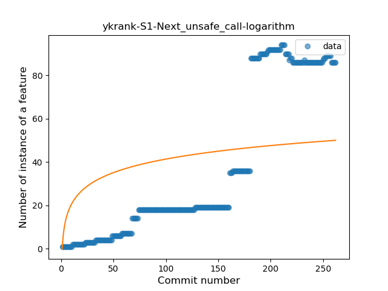
### <a name="string_template">String Template</a>
----
#### Functions
* **Sudden Rise - Exponential:** 
    * **R_Squared:** 0.96181391
* **Constant Rise - Linear:** 
    * **R_Squared:** 0.91271483
* **Sudden Rise Plateau - Logarithm:** 
    * **R_Squared:** 0.40673037

**Plots** :chart_with_upwards_trend:
-----

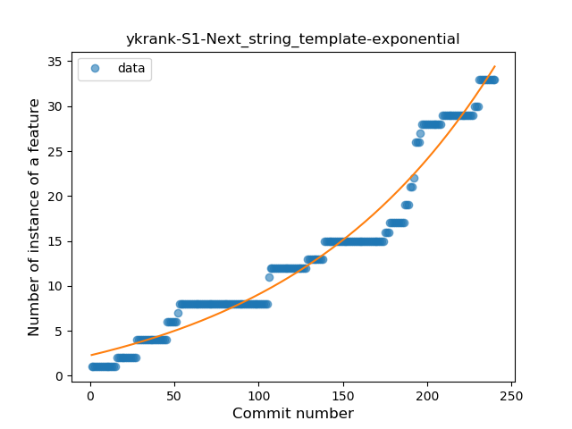

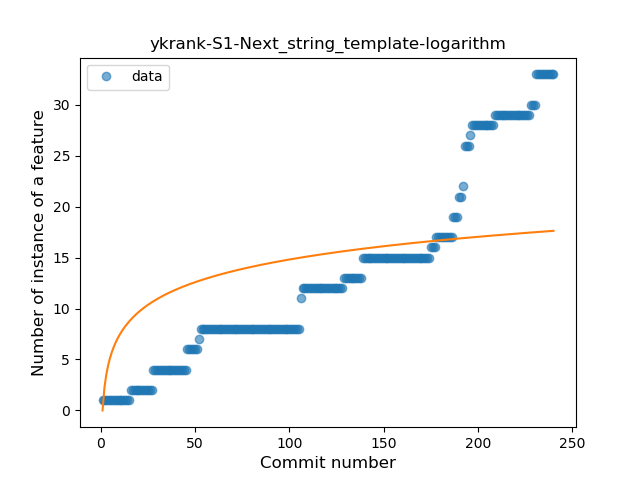
### <a name="func_with_default_value">Function with Default Value</a>
----
#### Functions
* **Plateau Gradual Rise - Sigmoid:** 
    * **R_Squared:** 0.38613717
* **Constant Decline - Linear:** 
    * **R_Squared:** 0.06112826
* **Sudden Rise Plateau - Logarithm:** 
    * **R_Squared:** 0.03070088

**Plots** :chart_with_upwards_trend:
-----

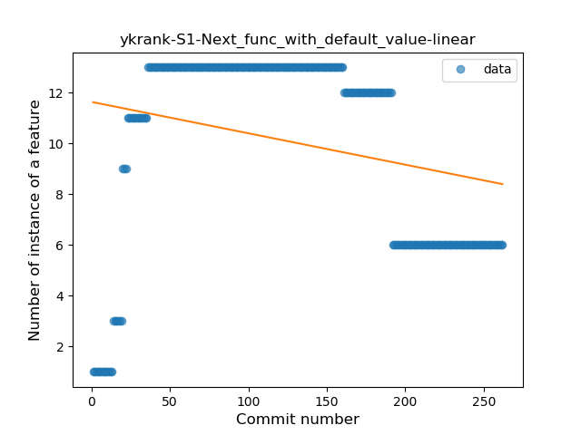
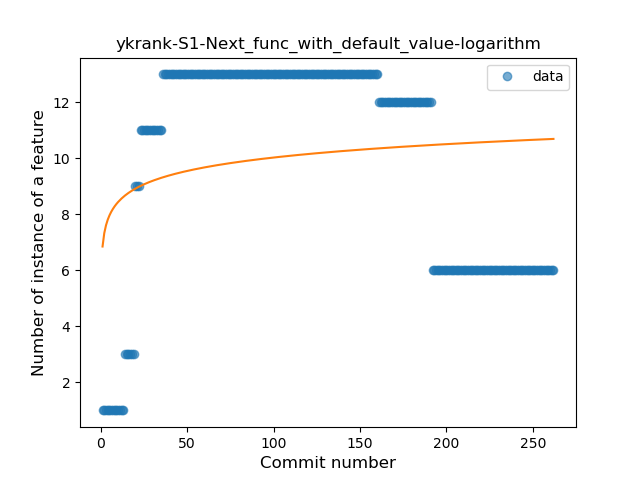
### <a name="singleton">Singleton</a>
----
#### Functions
* **Constant Rise - Linear:** 
    * **R_Squared:** 0.83805648
* **Sudden Rise Plateau - Logarithm:** 
    * **R_Squared:** 0.83032011

**Plots** :chart_with_upwards_trend:
-----

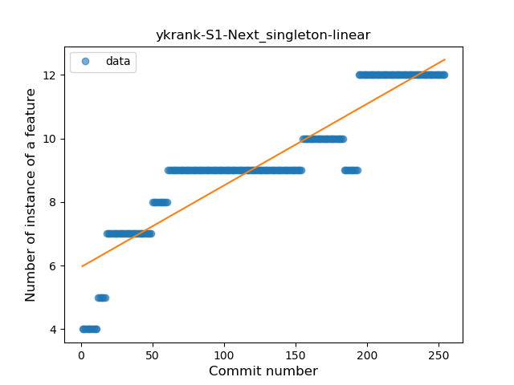
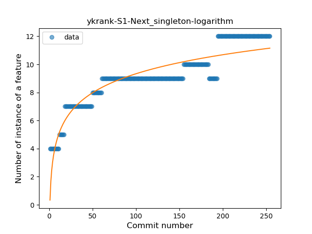
### <a name="smart_cast">Smart Cast</a>
----
#### Functions
* **Plateau Gradual Rise - Sigmoid:** 
    * **R_Squared:** 0.93745178
* **Sudden Rise Plateau - Logarithm:** 
    * **R_Squared:** 0.68889036
* **Constant Rise - Linear:** 
    * **R_Squared:** 0.66252956

**Plots** :chart_with_upwards_trend:
-----

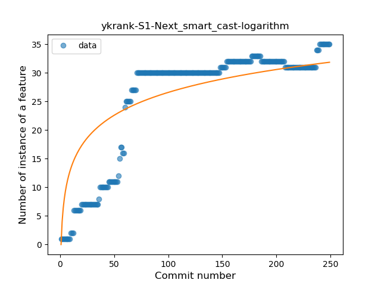
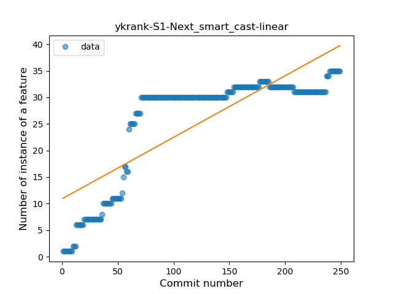
### <a name="range_expr">Range Expression</a>
----
#### Functions
* **Constant Rise - Linear:** 
    * **R_Squared:** 0.7017261
* **Sudden Rise - Exponential:** 
    * **R_Squared:** 0.70243365
* **Sudden Rise Plateau - Logarithm:** 
    * **R_Squared:** 0.58091348

**Plots** :chart_with_upwards_trend:
-----

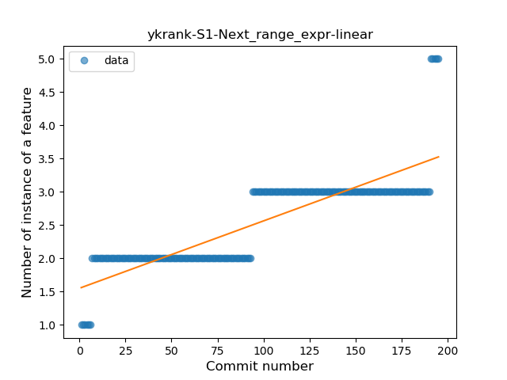
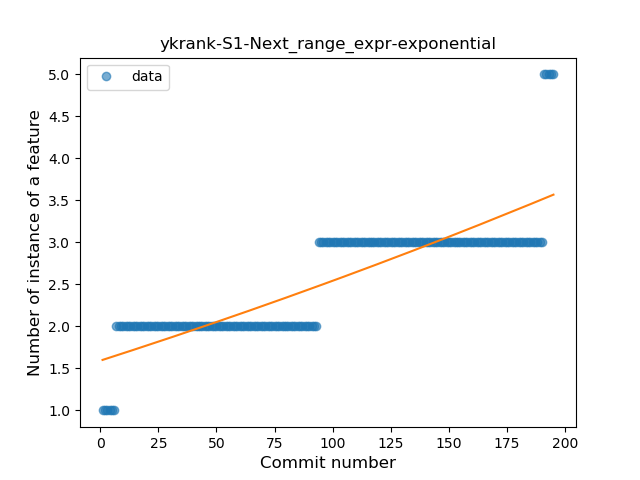
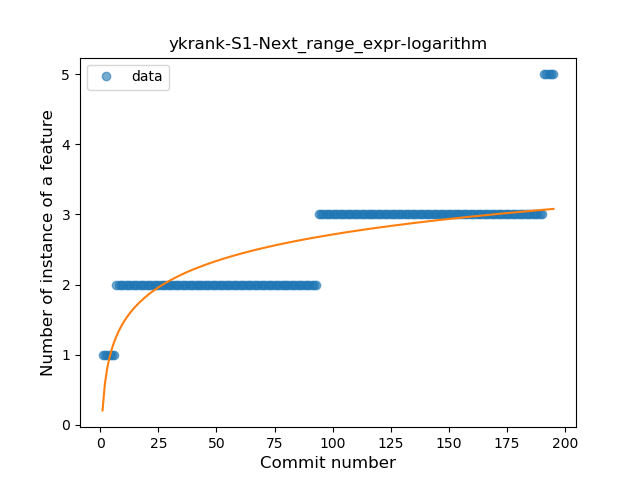
### <a name="data_class">Data Class</a>
----
#### Functions
* **Plateau Sudden Rise - Binary Sigmoid:** 
    * **R_Squared:** 0.97141956
* **Sudden Rise Plateau - Logarithm:** 
    * **R_Squared:** 0.72914743
* **Constant Rise - Linear:** 
    * **R_Squared:** 0.64464433

**Plots** :chart_with_upwards_trend:
-----

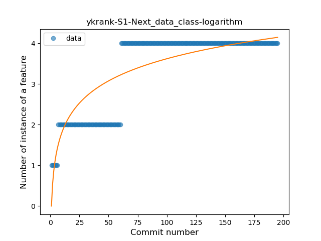
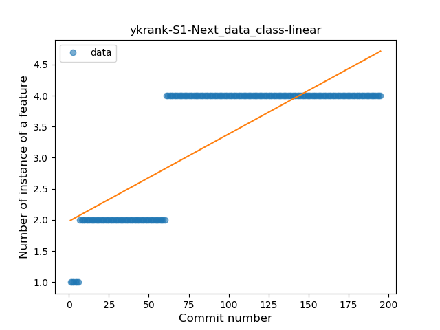
### <a name="extension_function">Extension Function</a>
----
#### Functions
* **Constant Decline - Linear:** 
    * **R_Squared:** 0.40127108
* **Plateau Sudden Rise - Binary Sigmoid:** 
    * **R_Squared:** 0.03992725
* **Sudden Rise Plateau - Logarithm:** 
    * **R_Squared:** -0.0

**Plots** :chart_with_upwards_trend:
-----

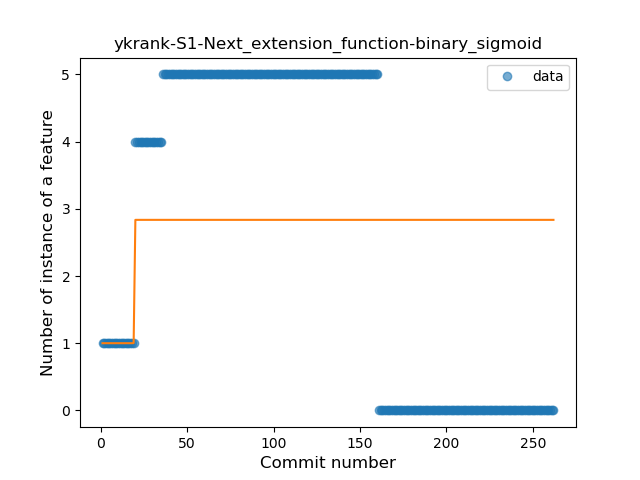
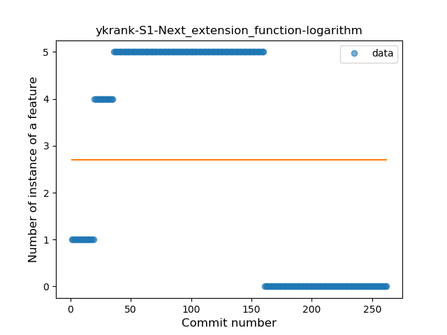
### <a name="property_delegation">Property Delegation</a>
----
#### Functions
* **Constant Rise - Linear:** 
    * **R_Squared:** 0.89014734
* **Sudden Rise Plateau - Logarithm:** 
    * **R_Squared:** 0.78095039

**Plots** :chart_with_upwards_trend:
-----

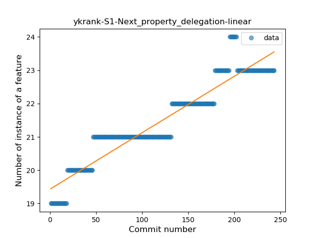
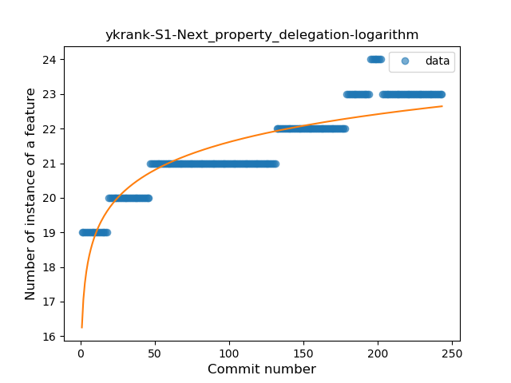
### <a name="inline_func">Inline Function</a>
----
#### Functions
* **Plateau Sudden Decline - Binary Sigmoid:** 
    * **R_Squared:** 1.0
* **Constant Decline - Linear:** 
    * **R_Squared:** 0.74042988
* **Sudden Rise Plateau - Logarithm:** 
    * **R_Squared:** -0.0

**Plots** :chart_with_upwards_trend:
-----

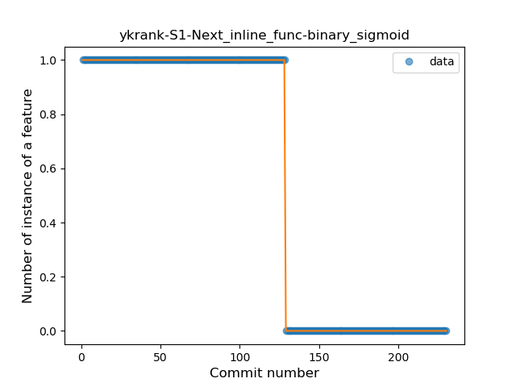
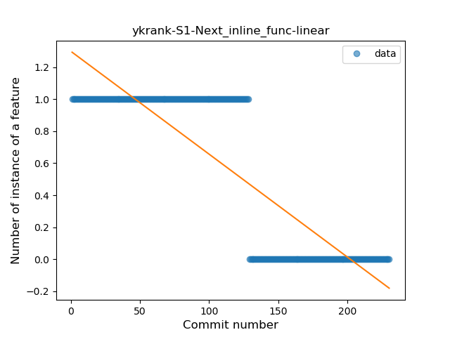
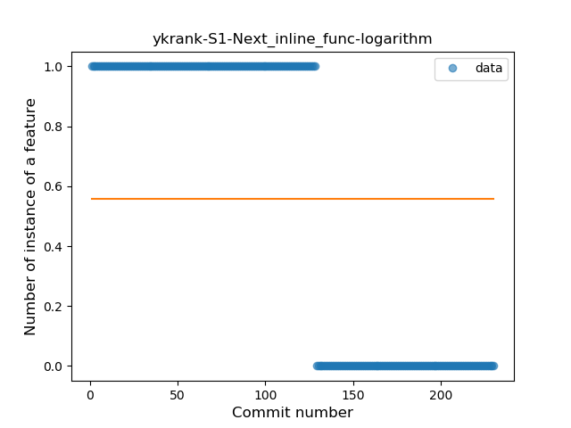
### <a name="super_delegation">Super Delegation</a>
----
#### Functions
* **Plateau Sudden Rise - Binary Sigmoid:** 
    * **R_Squared:** 1.0
* **Sudden Rise Plateau - Logarithm:** 
    * **R_Squared:** 0.66744453
* **Constant Rise - Linear:** 
    * **R_Squared:** 0.52215764

**Plots** :chart_with_upwards_trend:
-----

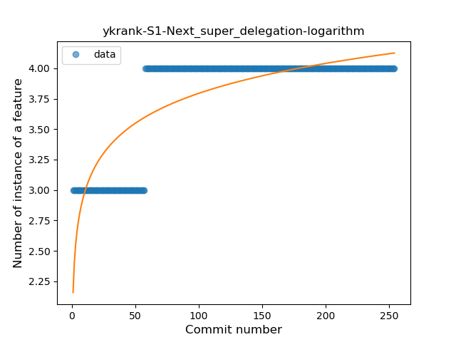
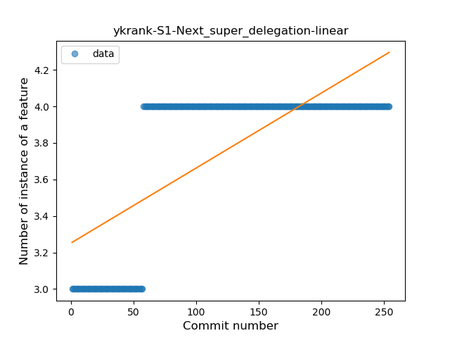
