## yshrsmz-monotweety
----
#### Metrics provided by Detekt
* Number of lines of code 6785
* Number of Kotlin files: 158
* Cyclomatic complexity: 687
* Cyclomatic complexity by thousands of lines: 210 

----
**15** features analyzed

*	<a href="#type_inference">Type Inference</a> 
*	<a href="#lambda">Lambda</a> 
*	<a href="#safe_call">Safe Call</a> 
*	<a href="#when_expr">When expression</a> 
*	<a href="#companion_object">Companion Object</a> 
*	<a href="#unsafe_call">Unsafe Call</a> 
*	<a href="#string_template">String Template</a> 
*	<a href="#func_with_default_value">Function with Default Value</a> 
*	<a href="#smart_cast">Smart Cast</a> 
*	<a href="#func_call_with_named_arg">Function call with Named Argument</a> 
*	<a href="#data_class">Data Class</a> 
*	<a href="#extension_function">Extension Function</a> 
*	<a href="#property_delegation">Property Delegation</a> 
*	<a href="#destructuring_declaration">Destructuring Declaration</a> 
*	<a href="#super_delegation">Super Delegation</a> 

### <a name="type_inference">Type Inference</a>
----
#### Functions
* **Constant Rise - Linear:** 
    * **R_Squared:** 0.8576276
* **Sudden Rise Plateau - Logarithm:** 
    * **R_Squared:** 0.6175807
* **Plateau Sudden Rise - Binary Sigmoid:** 
    * **R_Squared:** 0.5710746

**Plots** :chart_with_upwards_trend:
-----

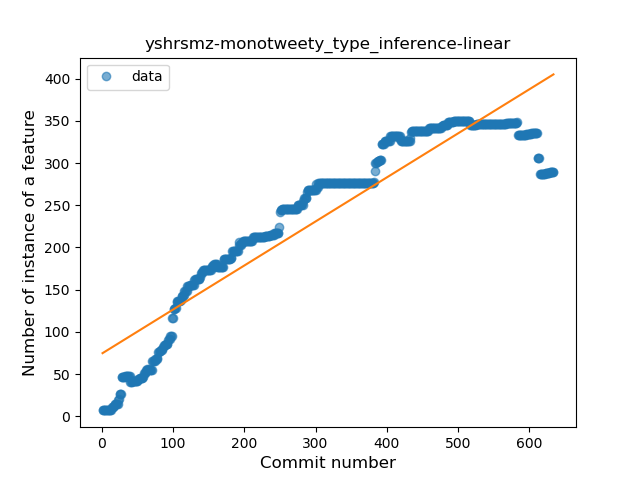
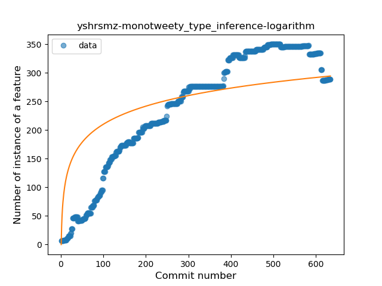
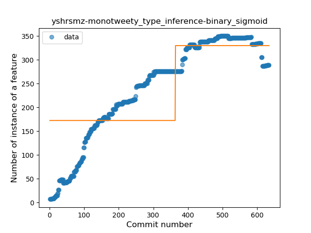
### <a name="lambda">Lambda</a>
----
#### Functions
* **Constant Rise - Linear:** 
    * **R_Squared:** 0.82157283
* **Plateau Sudden Rise - Binary Sigmoid:** 
    * **R_Squared:** 0.70908604
* **Sudden Rise Plateau - Logarithm:** 
    * **R_Squared:** 0.67510727

**Plots** :chart_with_upwards_trend:
-----

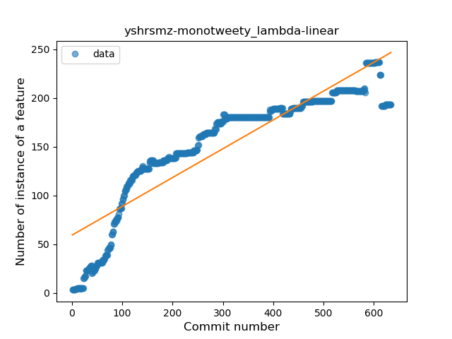
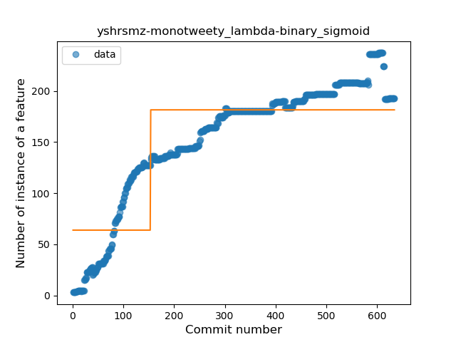
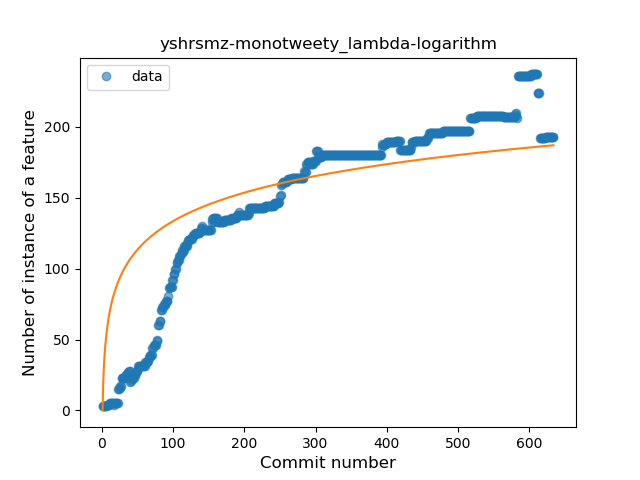
### <a name="safe_call">Safe Call</a>
----
#### Functions
* **Constant Rise - Linear:** 
    * **R_Squared:** 0.9015845
* **Sudden Rise Plateau - Logarithm:** 
    * **R_Squared:** 0.66102732
* **Plateau Sudden Rise - Binary Sigmoid:** 
    * **R_Squared:** 0.50512393

**Plots** :chart_with_upwards_trend:
-----

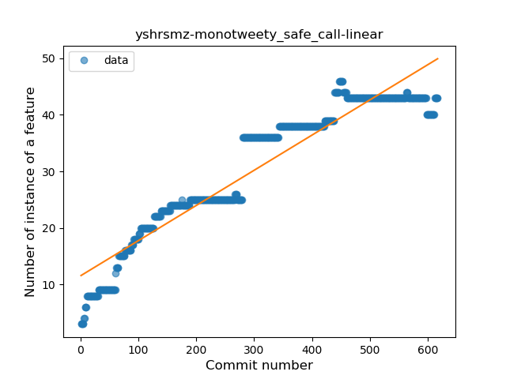
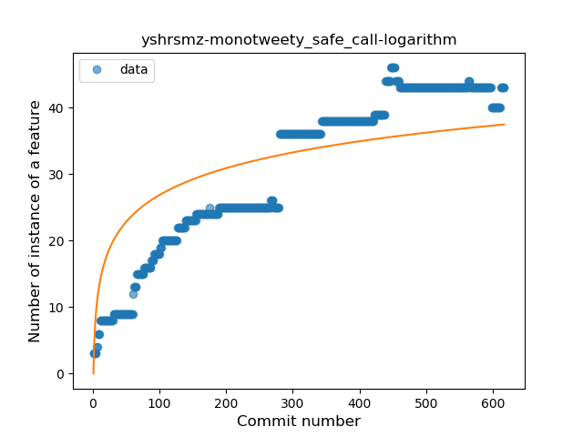
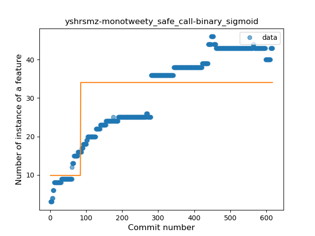
### <a name="when_expr">When expression</a>
----
#### Functions
* **Sudden Rise Plateau - Logarithm:** 
    * **R_Squared:** 0.62797303
* **Constant Rise - Linear:** 
    * **R_Squared:** 0.31679891

**Plots** :chart_with_upwards_trend:
-----

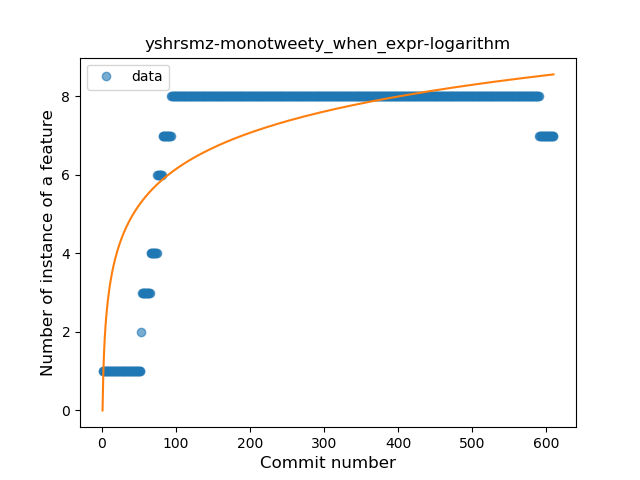
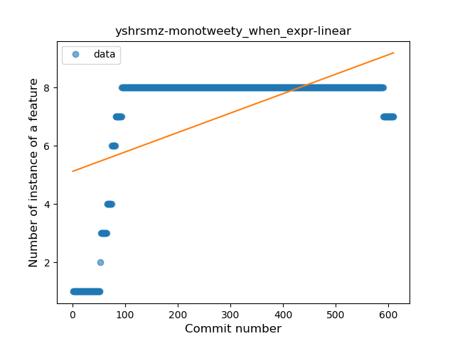
### <a name="companion_object">Companion Object</a>
----
#### Functions
* **Constant Rise - Linear:** 
    * **R_Squared:** 0.76309238
* **Sudden Rise Plateau - Logarithm:** 
    * **R_Squared:** 0.72775426
* **Plateau Sudden Rise - Binary Sigmoid:** 
    * **R_Squared:** 0.32364026

**Plots** :chart_with_upwards_trend:
-----

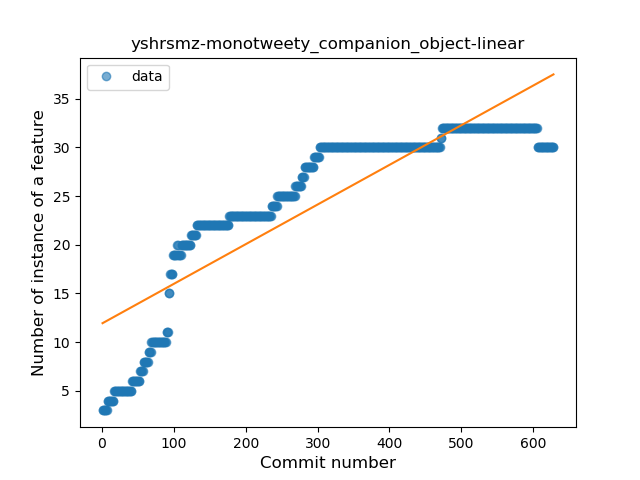
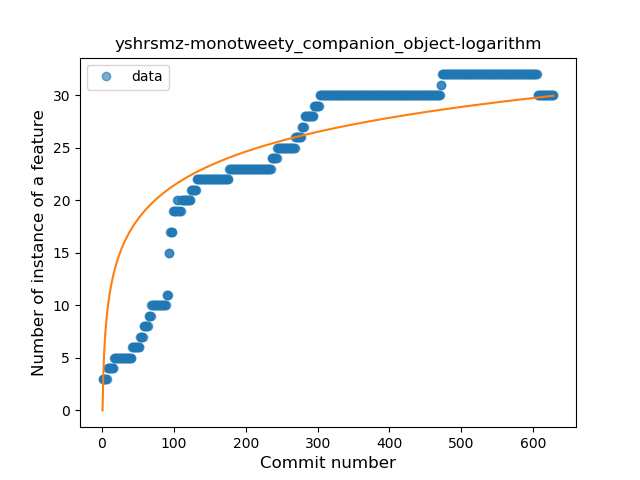
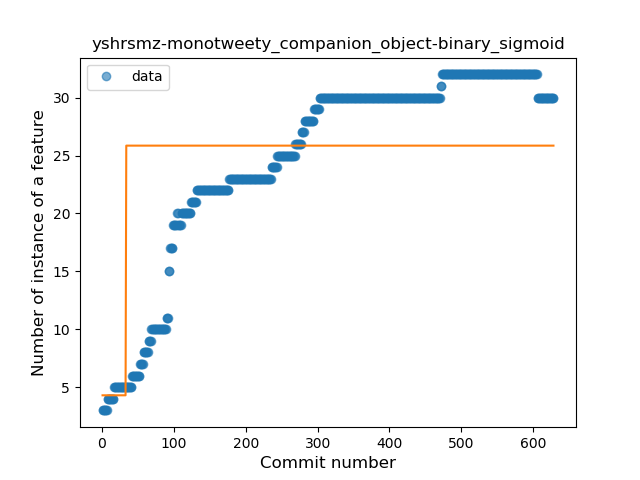
### <a name="unsafe_call">Unsafe Call</a>
----
#### Functions
* **Constant Rise - Linear:** 
    * **R_Squared:** 0.78671205
* **Sudden Rise Plateau - Logarithm:** 
    * **R_Squared:** 0.49325947

**Plots** :chart_with_upwards_trend:
-----

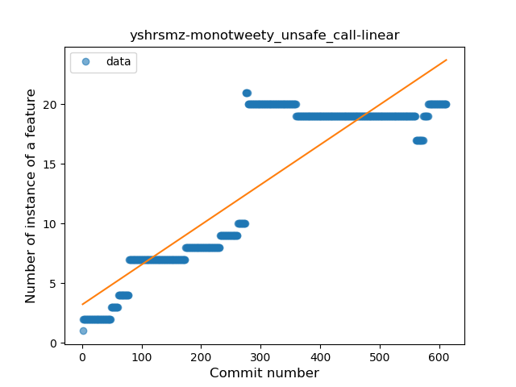
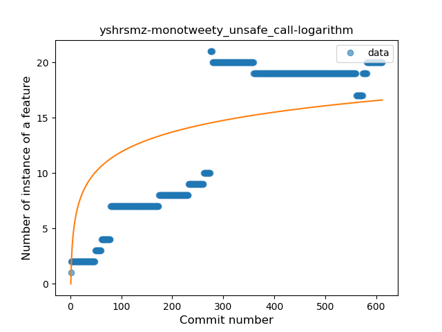
### <a name="string_template">String Template</a>
----
#### Functions
* **Plateau Gradual Rise - Sigmoid:** 
    * **R_Squared:** 0.96431635
* **Sudden Rise Plateau - Logarithm:** 
    * **R_Squared:** 0.74343344
* **Constant Rise - Linear:** 
    * **R_Squared:** 0.59006532

**Plots** :chart_with_upwards_trend:
-----

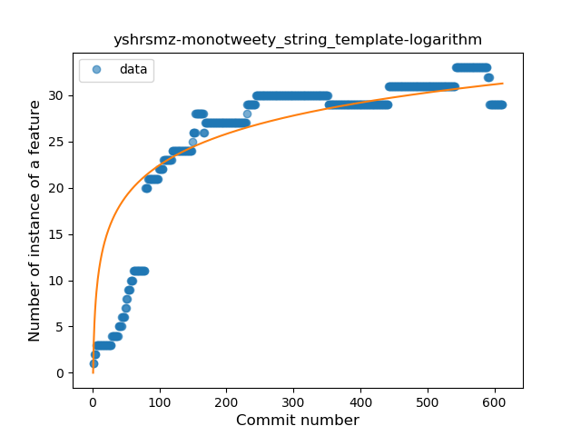
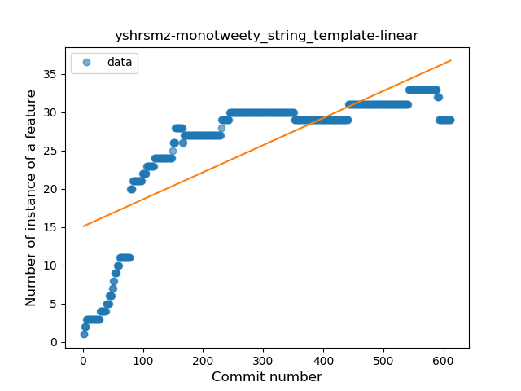
### <a name="func_with_default_value">Function with Default Value</a>
----
#### Functions
* **Plateau Gradual Rise - Sigmoid:** 
    * **R_Squared:** 0.92717143
* **Sudden Rise Plateau - Logarithm:** 
    * **R_Squared:** 0.75626055
* **Constant Rise - Linear:** 
    * **R_Squared:** 0.34273427

**Plots** :chart_with_upwards_trend:
-----

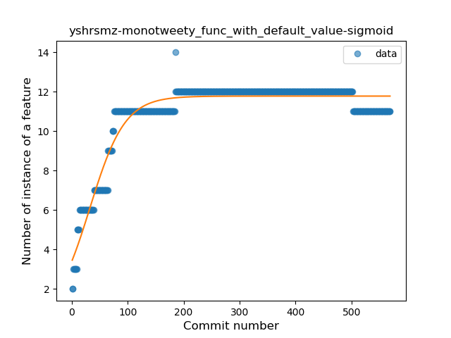
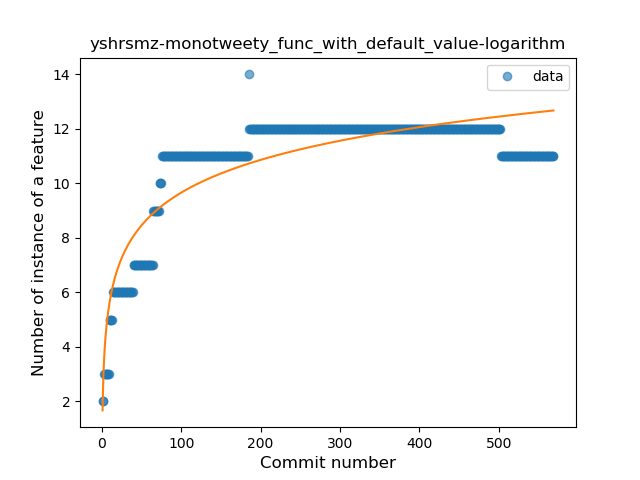
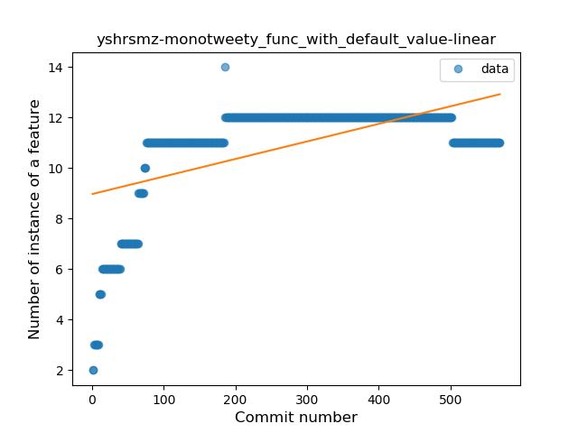
### <a name="smart_cast">Smart Cast</a>
----
#### Functions
* **Sudden Rise Plateau - Logarithm:** 
    * **R_Squared:** 0.84473467
* **Plateau Gradual Rise - Sigmoid:** 
    * **R_Squared:** 0.61705413
* **Constant Rise - Linear:** 
    * **R_Squared:** 0.592227

**Plots** :chart_with_upwards_trend:
-----

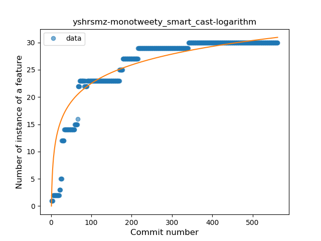
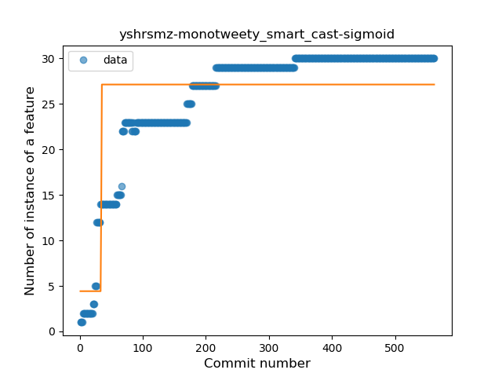
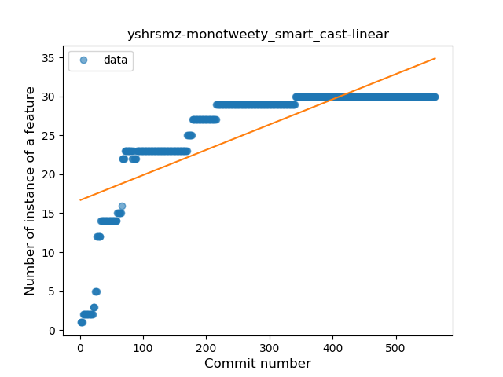
### <a name="func_call_with_named_arg">Function call with Named Argument</a>
----
#### Functions
* **Constant Rise - Linear:** 
    * **R_Squared:** 0.91203016
* **Sudden Rise Plateau - Logarithm:** 
    * **R_Squared:** 0.63755294

**Plots** :chart_with_upwards_trend:
-----

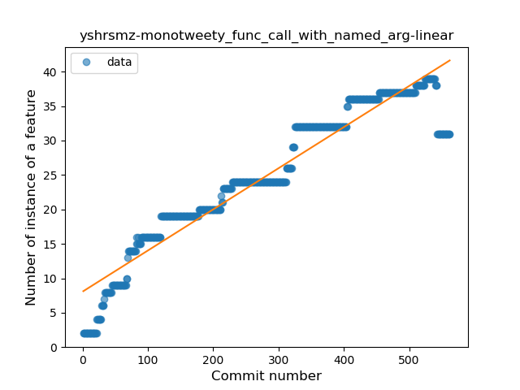

### <a name="data_class">Data Class</a>
----
#### Functions
* **Constant Rise - Linear:** 
    * **R_Squared:** 0.78440059
* **Sudden Rise Plateau - Logarithm:** 
    * **R_Squared:** 0.76197577

**Plots** :chart_with_upwards_trend:
-----

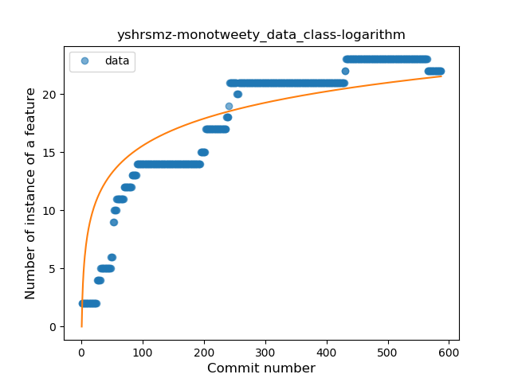
### <a name="extension_function">Extension Function</a>
----
#### Functions
* **Sudden Rise Plateau - Logarithm:** 
    * **R_Squared:** 0.76303294
* **Constant Rise - Linear:** 
    * **R_Squared:** 0.60408356
* **Plateau Sudden Rise - Binary Sigmoid:** 
    * **R_Squared:** 0.1950129

**Plots** :chart_with_upwards_trend:
-----

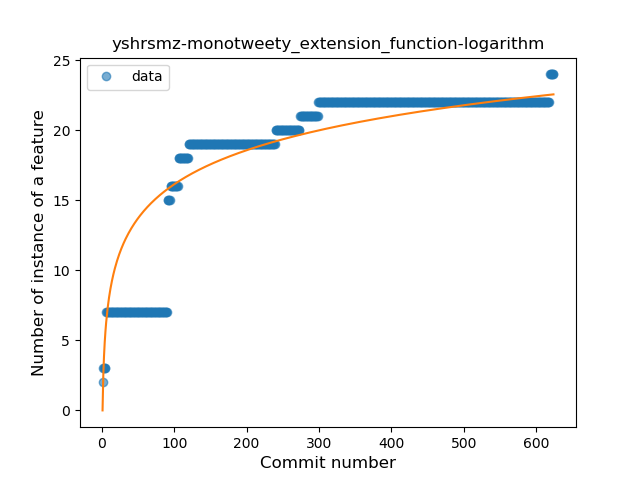
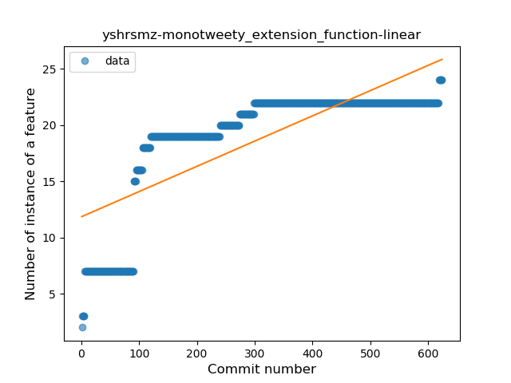
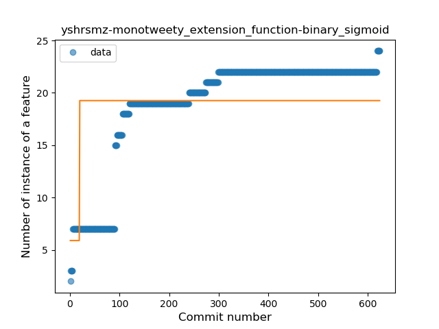
### <a name="property_delegation">Property Delegation</a>
----
#### Functions
* **Sudden Rise - Exponential:** 
    * **R_Squared:** 0.86490721
* **Constant Rise - Linear:** 
    * **R_Squared:** 0.83401451
* **Sudden Rise Plateau - Logarithm:** 
    * **R_Squared:** 0.35748123
* **Plateau Sudden Rise - Binary Sigmoid:** 
    * **R_Squared:** 0.09665026

**Plots** :chart_with_upwards_trend:
-----

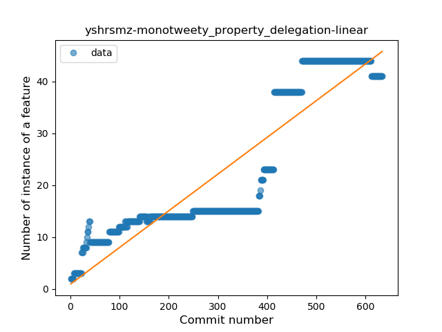
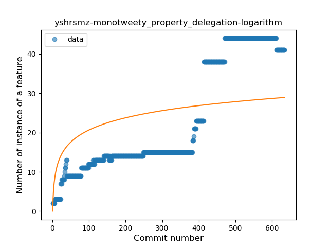
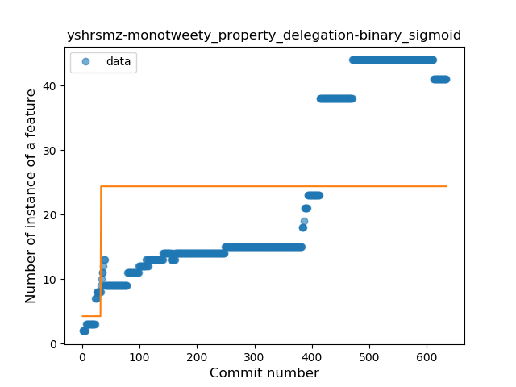
### <a name="destructuring_declaration">Destructuring Declaration</a>
----
#### Functions
* **Plateau Sudden Decline - Binary Sigmoid:** 
    * **R_Squared:** 1.0
* **Constant Decline - Linear:** 
    * **R_Squared:** 0.34864865
* **Sudden Rise Plateau - Logarithm:** 
    * **R_Squared:** -0.0

**Plots** :chart_with_upwards_trend:
-----

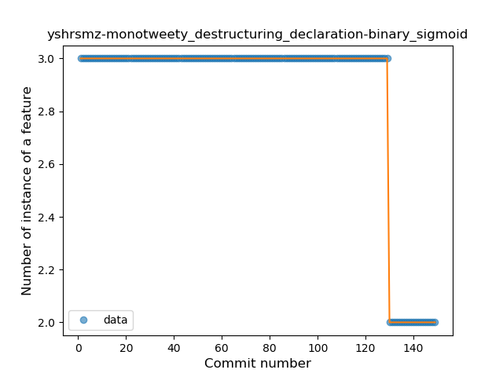
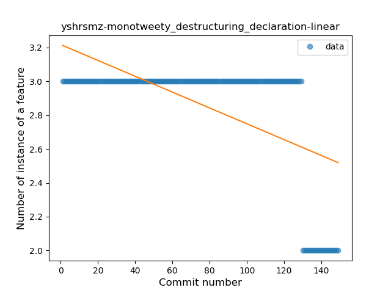
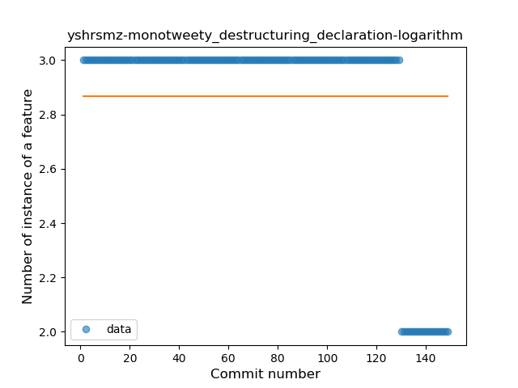
### <a name="super_delegation">Super Delegation</a>
----
#### Functions
* **Plateau Sudden Decline - Binary Sigmoid:** 
    * **R_Squared:** 1.0
* **Sudden Decline - Exponential:** 
    * **R_Squared:** 0.84204099
* **Constant Decline - Linear:** 
    * **R_Squared:** 0.0357104
* **Sudden Rise Plateau - Logarithm:** 
    * **R_Squared:** -0.0

**Plots** :chart_with_upwards_trend:
-----

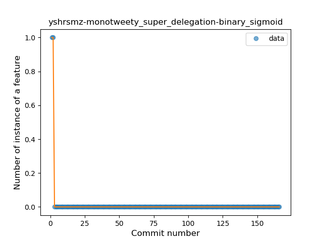
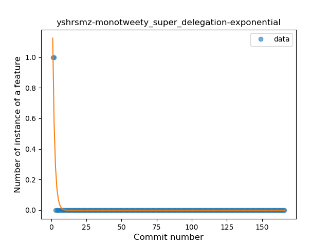

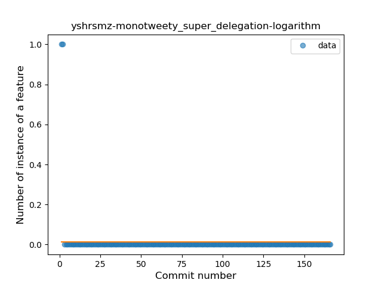
