## zeapo-Android-Password-Store
----
#### Metrics provided by Detekt
* Number of lines of code 1598
* Number of Kotlin files: 6
* Cyclomatic complexity: 200
* Cyclomatic complexity by thousands of lines: 228 

----
**9** features analyzed

*	<a href="#type_inference">Type Inference</a> 
*	<a href="#lambda">Lambda</a> 
*	<a href="#safe_call">Safe Call</a> 
*	<a href="#when_expr">When expression</a> 
*	<a href="#companion_object">Companion Object</a> 
*	<a href="#unsafe_call">Unsafe Call</a> 
*	<a href="#string_template">String Template</a> 
*	<a href="#func_call_with_named_arg">Function call with Named Argument</a> 
*	<a href="#property_delegation">Property Delegation</a> 

### <a name="type_inference">Type Inference</a>
----
#### Functions
* **Instability - Polinomial 3:** )
    * **R_Squared:** 0.81962008
* **Sudden Rise Plateau - Logarithm:** 
    * **R_Squared:** 0.76750196
* **Constant Rise - Linear:** 
    * **R_Squared:** 0.39351496

**Plots** :chart_with_upwards_trend:
-----

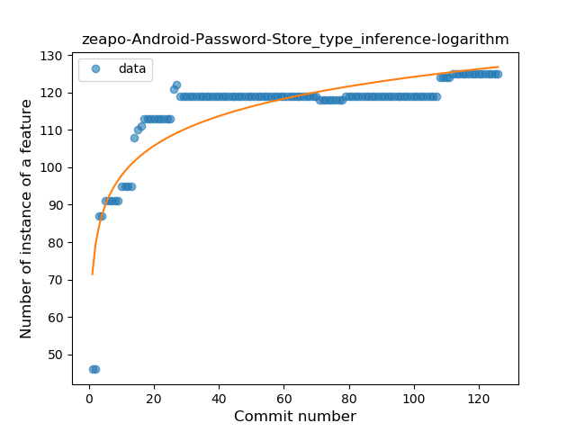
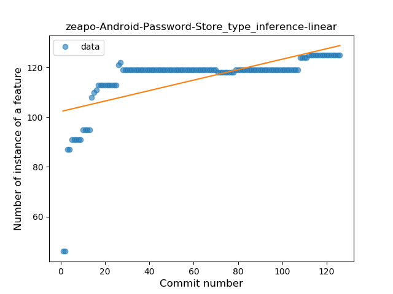
### <a name="lambda">Lambda</a>
----
#### Functions
* **Sudden Rise - Exponential:** 
    * **R_Squared:** 0.72928317
* **Constant Rise - Linear:** 
    * **R_Squared:** 0.7112032
* **Sudden Rise Plateau - Logarithm:** 
    * **R_Squared:** 0.67974352

**Plots** :chart_with_upwards_trend:
-----

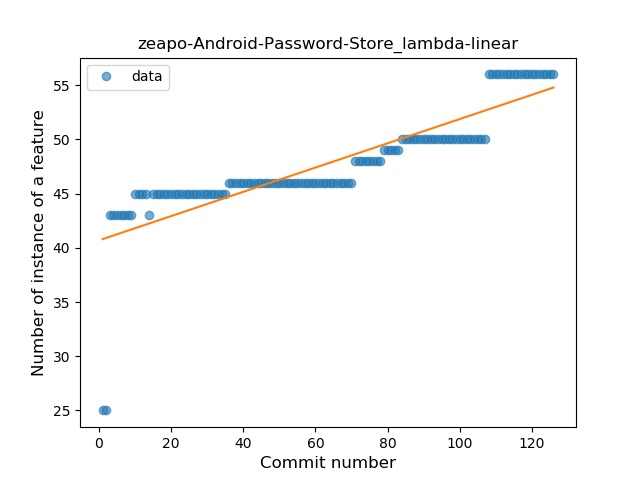
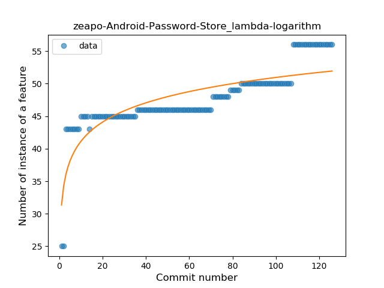
### <a name="safe_call">Safe Call</a>
----
#### Functions
* **Instability - Polinomial 3:** )
    * **R_Squared:** 0.83206931
* **Sudden Rise - Exponential:** 
    * **R_Squared:** 0.70851713
* **Constant Rise - Linear:** 
    * **R_Squared:** 0.68475884
* **Sudden Rise Plateau - Logarithm:** 
    * **R_Squared:** 0.68623716

**Plots** :chart_with_upwards_trend:
-----

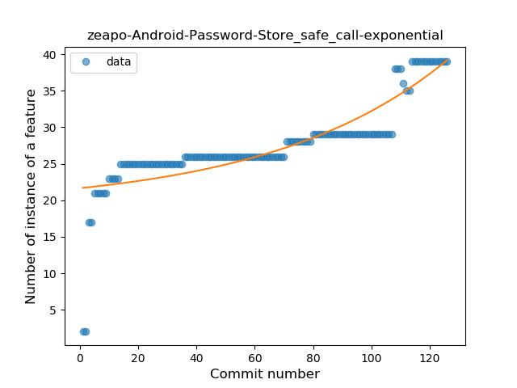
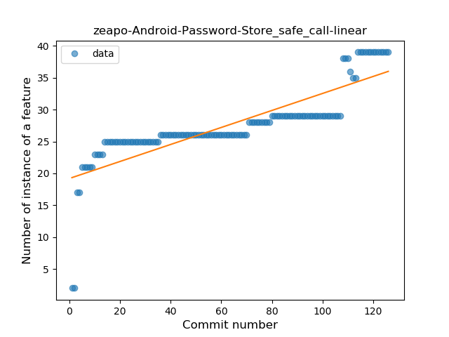
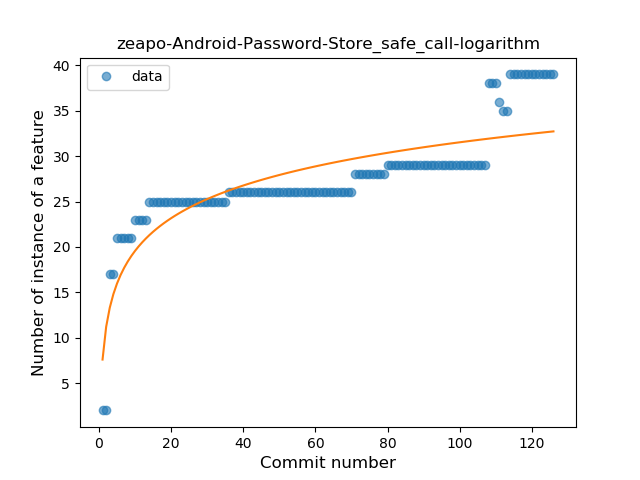
### <a name="when_expr">When expression</a>
----
#### Functions
* **Sudden Rise Plateau - Logarithm:** 
    * **R_Squared:** 0.17974661
* **Plateau Gradual Decline - Sigmoid:** 
    * **R_Squared:** 0.02445373
* **Constant Rise - Linear:** 
    * **R_Squared:** 0.00244239

**Plots** :chart_with_upwards_trend:
-----

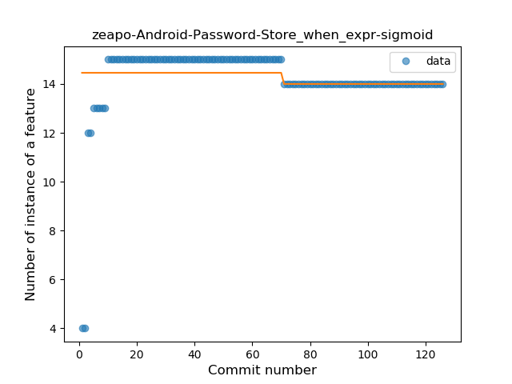
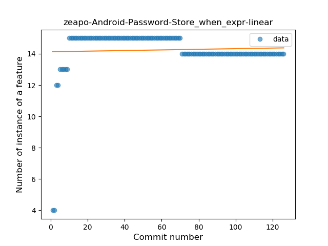
### <a name="companion_object">Companion Object</a>
----
#### Functions
* **Plateau Sudden Rise - Binary Sigmoid:** 
    * **R_Squared:** 0.90318246
* **Sudden Rise Plateau - Logarithm:** 
    * **R_Squared:** 0.63576127
* **Constant Rise - Linear:** 
    * **R_Squared:** 0.25685532

**Plots** :chart_with_upwards_trend:
-----

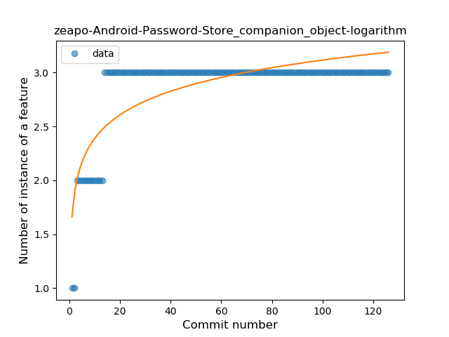
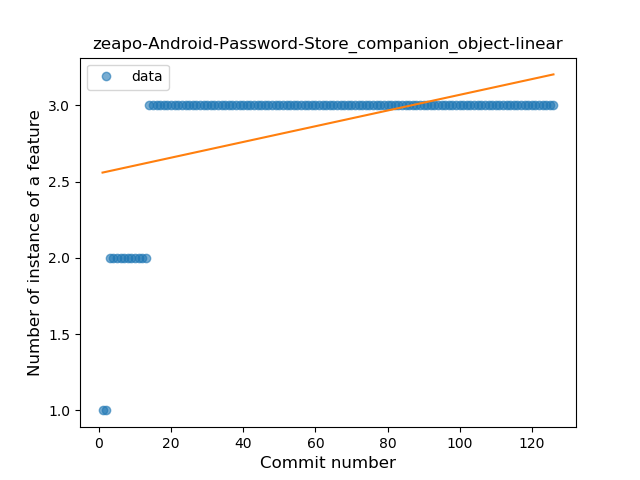
### <a name="unsafe_call">Unsafe Call</a>
----
#### Functions
* **Sudden Decline - Exponential:** 
    * **R_Squared:** 1.0
* **Instability - Polinomial 4:** 
    * **R_Squared:** 0.86134454
* **Instability - Polinomial 3:** )
    * **R_Squared:** 0.70535714
* **Constant Decline - Linear:** 
    * **R_Squared:** 0.21428571
* **Sudden Rise Plateau - Logarithm:** 
    * **R_Squared:** -0.0

**Plots** :chart_with_upwards_trend:
-----

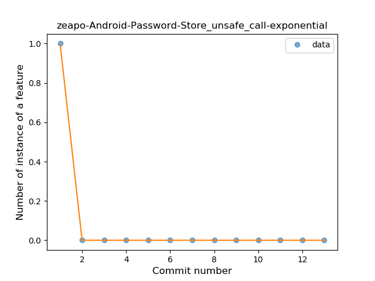

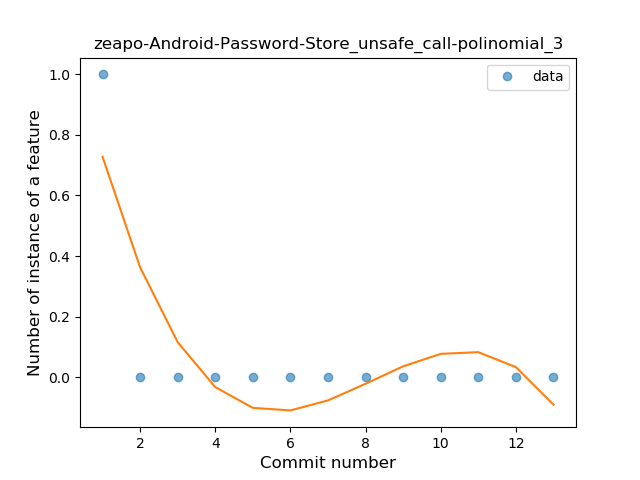

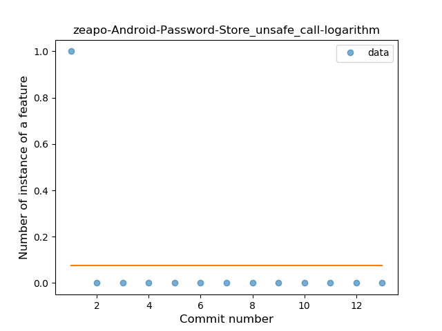
### <a name="string_template">String Template</a>
----
#### Functions
* **Sudden Rise Plateau - Logarithm:** 
    * **R_Squared:** 0.74800031
* **Plateau Sudden Rise - Binary Sigmoid:** 
    * **R_Squared:** 0.60648103
* **Constant Rise - Linear:** 
    * **R_Squared:** 0.36310614

**Plots** :chart_with_upwards_trend:
-----

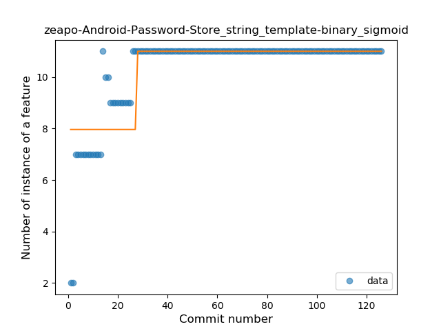
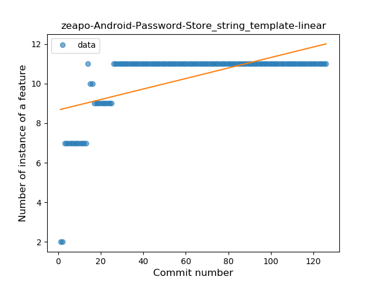
### <a name="func_call_with_named_arg">Function call with Named Argument</a>
----
#### Functions
* **Plateau Sudden Rise - Binary Sigmoid:** 
    * **R_Squared:** 1.0
* **Sudden Rise Plateau - Logarithm:** 
    * **R_Squared:** 0.5967497
* **Constant Rise - Linear:** 
    * **R_Squared:** 0.2776063

**Plots** :chart_with_upwards_trend:
-----

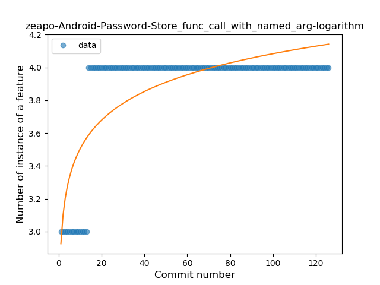
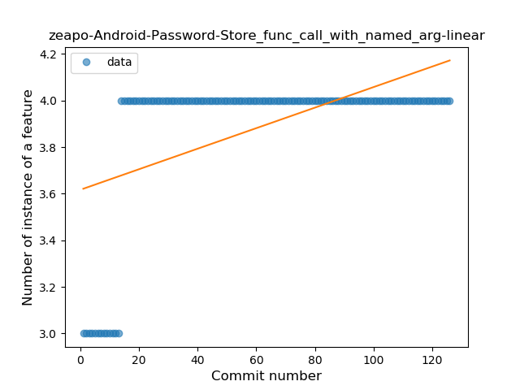
### <a name="property_delegation">Property Delegation</a>
----
#### Functions
* **Sudden Rise - Exponential:** 
    * **R_Squared:** 0.42930022
* **Constant Rise - Linear:** 
    * **R_Squared:** 0.25900632
* **Sudden Rise Plateau - Logarithm:** 
    * **R_Squared:** 0.02315243
* **Plateau Gradual Rise - Sigmoid:** 
    * **R_Squared:** 0.01539237

**Plots** :chart_with_upwards_trend:
-----

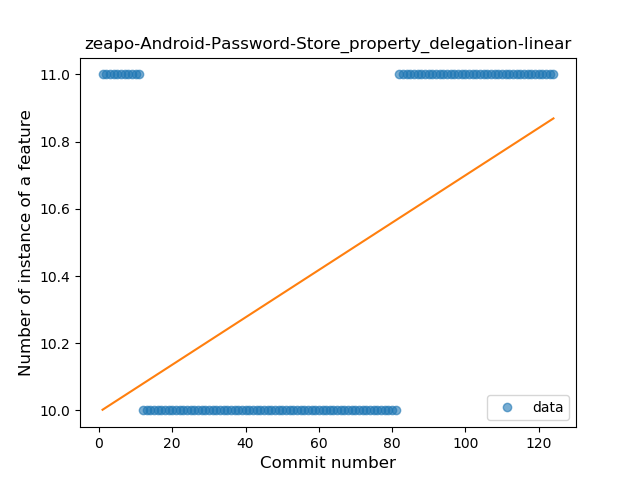
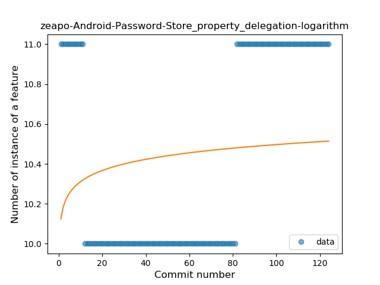
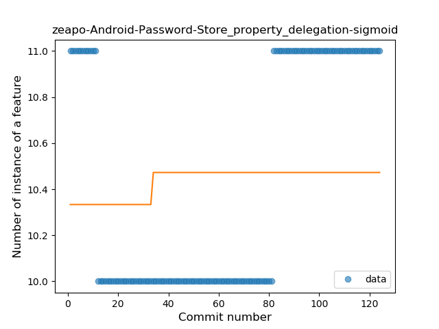
