## zoenb-log28
----
#### Metrics provided by Detekt
* Number of lines of code 2107
* Number of Kotlin files: 23
* Cyclomatic complexity: 278
* Cyclomatic complexity by thousands of lines: 269 

----
**13** features analyzed

*	<a href="#type_inference">Type Inference</a> 
*	<a href="#lambda">Lambda</a> 
*	<a href="#safe_call">Safe Call</a> 
*	<a href="#when_expr">When expression</a> 
*	<a href="#companion_object">Companion Object</a> 
*	<a href="#unsafe_call">Unsafe Call</a> 
*	<a href="#string_template">String Template</a> 
*	<a href="#func_with_default_value">Function with Default Value</a> 
*	<a href="#singleton">Singleton</a> 
*	<a href="#range_expr">Range Expression</a> 
*	<a href="#func_call_with_named_arg">Function call with Named Argument</a> 
*	<a href="#data_class">Data Class</a> 
*	<a href="#extension_function">Extension Function</a> 

### <a name="type_inference">Type Inference</a>
----
#### Functions
* **Constant Rise - Linear:** 
    * **R_Squared:** 0.88017114
* **Sudden Rise - Exponential:** 
    * **R_Squared:** 0.88871132
* **Sudden Rise Plateau - Logarithm:** 
    * **R_Squared:** 0.75146839
* **Plateau Sudden Rise - Binary Sigmoid:** 
    * **R_Squared:** 0.60483874

**Plots** :chart_with_upwards_trend:
-----

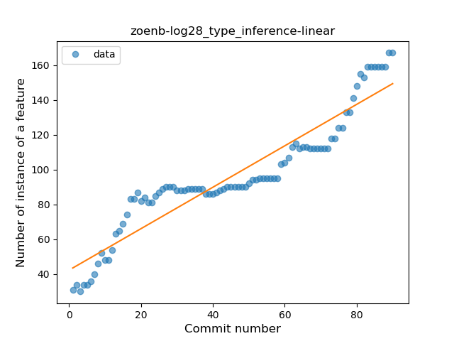
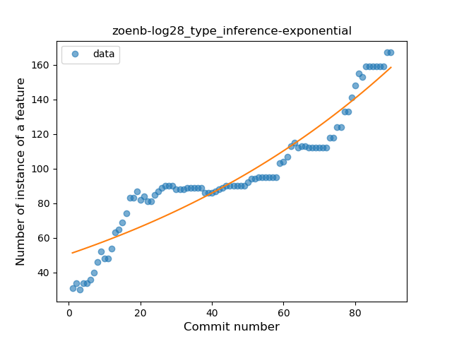
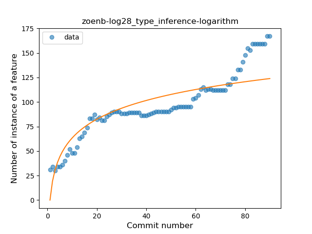
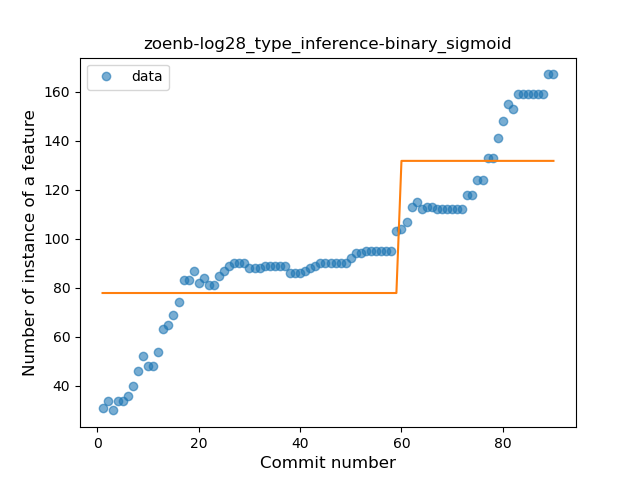
### <a name="lambda">Lambda</a>
----
#### Functions
* **Constant Rise - Linear:** 
    * **R_Squared:** 0.95289787
* **Sudden Rise Plateau - Logarithm:** 
    * **R_Squared:** 0.7638968

**Plots** :chart_with_upwards_trend:
-----

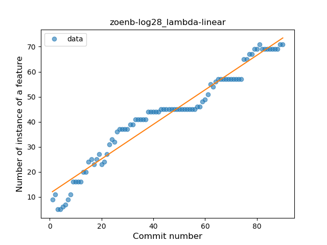
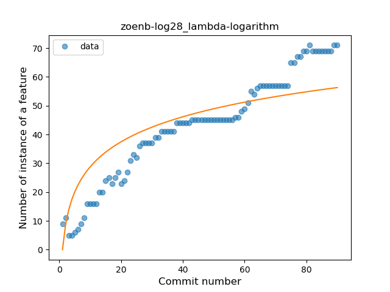
### <a name="safe_call">Safe Call</a>
----
#### Functions
* **Constant Rise - Linear:** 
    * **R_Squared:** 0.94933377
* **Sudden Rise - Exponential:** 
    * **R_Squared:** 0.95178253
* **Sudden Rise Plateau - Logarithm:** 
    * **R_Squared:** 0.62689336
* **Plateau Sudden Rise - Binary Sigmoid:** 
    * **R_Squared:** 0.20182025

**Plots** :chart_with_upwards_trend:
-----

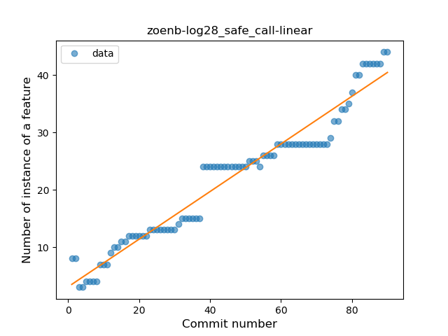
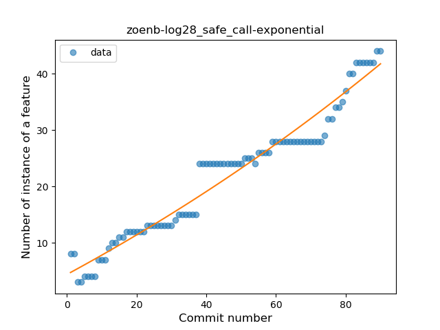
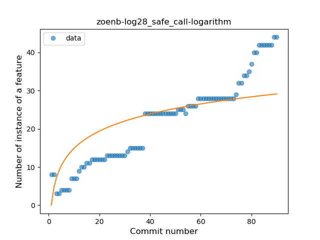
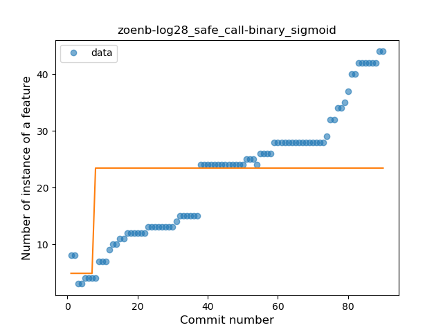
### <a name="when_expr">When expression</a>
----
#### Functions
* **Plateau Gradual Rise - Sigmoid:** 
    * **R_Squared:** 0.75957631
* **Instability - Polinomial 3:** )
    * **R_Squared:** 0.71925193
* **Sudden Rise - Exponential:** 
    * **R_Squared:** 0.59907563
* **Constant Rise - Linear:** 
    * **R_Squared:** 0.58172982
* **Sudden Rise Plateau - Logarithm:** 
    * **R_Squared:** 0.34666941

**Plots** :chart_with_upwards_trend:
-----

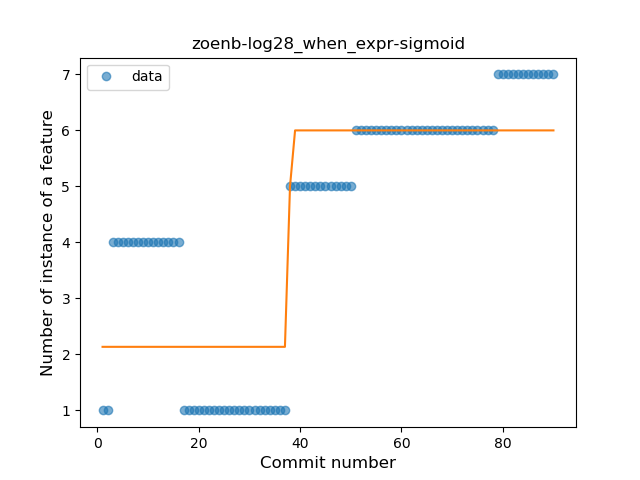
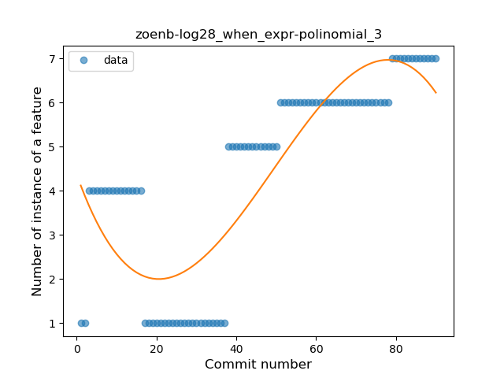
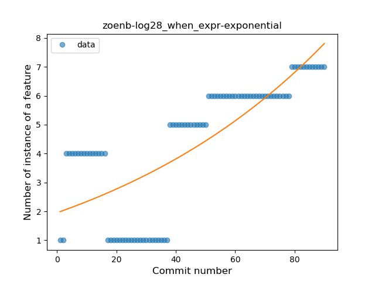
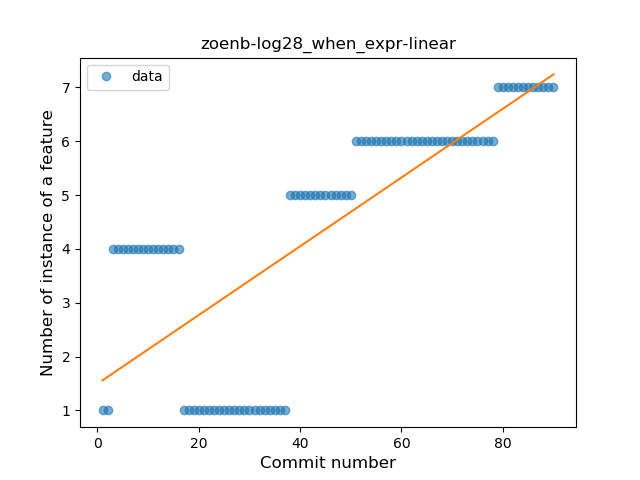
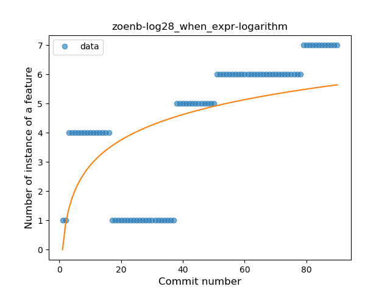
### <a name="companion_object">Companion Object</a>
----
#### Functions
* **Sudden Rise - Exponential:** 
    * **R_Squared:** 0.73809137
* **Constant Rise - Linear:** 
    * **R_Squared:** 0.63895829
* **Sudden Rise Plateau - Logarithm:** 
    * **R_Squared:** 0.49839457

**Plots** :chart_with_upwards_trend:
-----

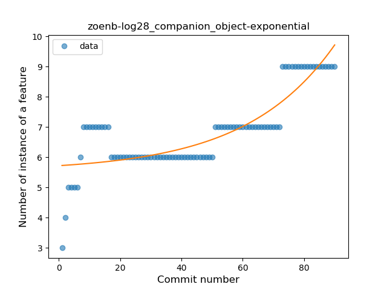

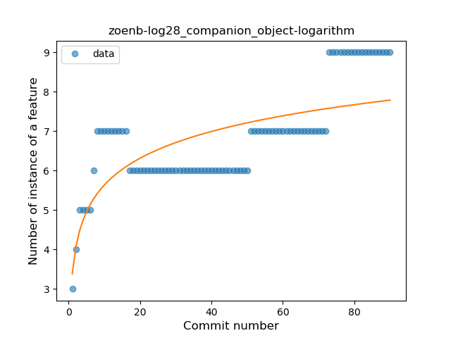
### <a name="unsafe_call">Unsafe Call</a>
----
#### Functions
* **Constant Rise - Linear:** 
    * **R_Squared:** 0.8936477
* **Sudden Rise Plateau - Logarithm:** 
    * **R_Squared:** 0.58632988
* **Plateau Sudden Rise - Binary Sigmoid:** 
    * **R_Squared:** 0.21464821

**Plots** :chart_with_upwards_trend:
-----

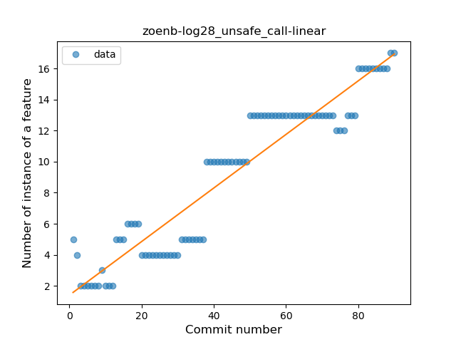
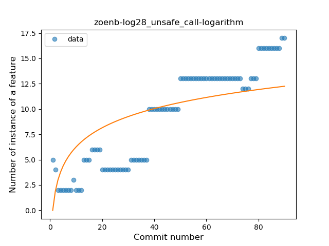
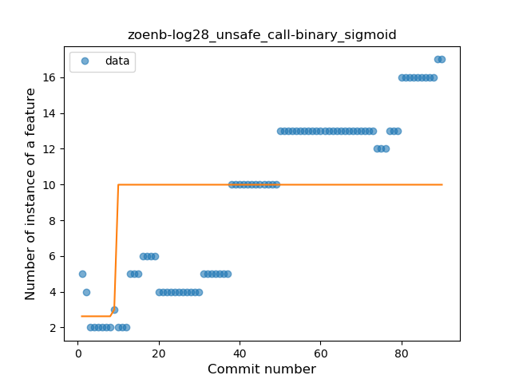
### <a name="string_template">String Template</a>
----
#### Functions
* **Plateau Gradual Rise - Sigmoid:** 
    * **R_Squared:** 0.96438011
* **Constant Rise - Linear:** 
    * **R_Squared:** 0.92634925
* **Sudden Rise Plateau - Logarithm:** 
    * **R_Squared:** 0.81622511

**Plots** :chart_with_upwards_trend:
-----

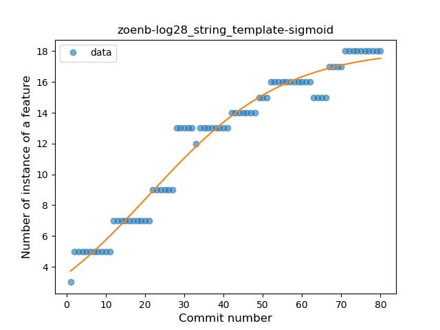
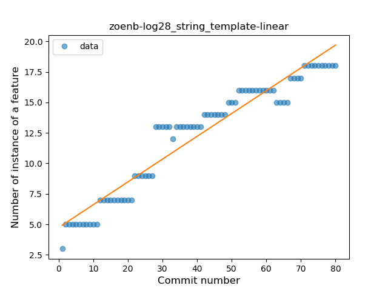
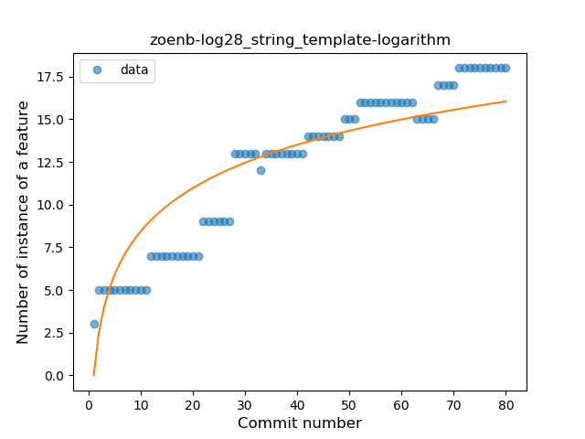
### <a name="func_with_default_value">Function with Default Value</a>
----
#### Functions
* **Plateau Gradual Rise - Sigmoid:** 
    * **R_Squared:** 0.89632241
* **Constant Rise - Linear:** 
    * **R_Squared:** 0.66868908
* **Sudden Rise Plateau - Logarithm:** 
    * **R_Squared:** 0.63975025

**Plots** :chart_with_upwards_trend:
-----

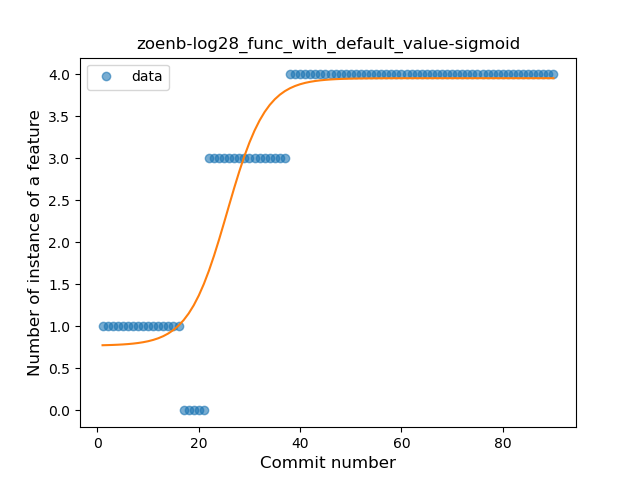
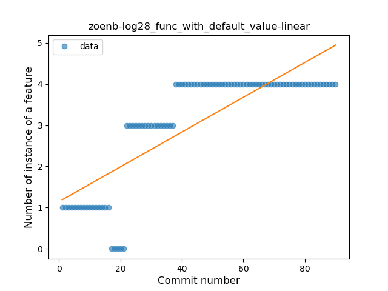
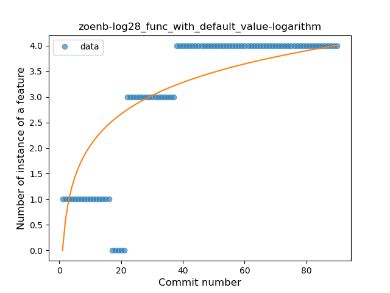
### <a name="singleton">Singleton</a>
----
#### Functions
* **Plateau Sudden Decline - Binary Sigmoid:** 
    * **R_Squared:** 1.0
* **Sudden Decline - Exponential:** 
    * **R_Squared:** 0.78291184
* **Constant Decline - Linear:** 
    * **R_Squared:** 0.43857266
* **Sudden Rise Plateau - Logarithm:** 
    * **R_Squared:** -0.0

**Plots** :chart_with_upwards_trend:
-----

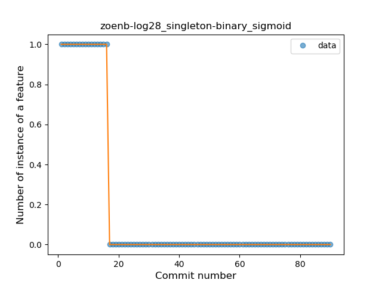
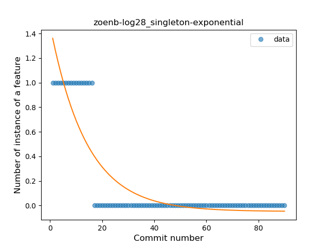
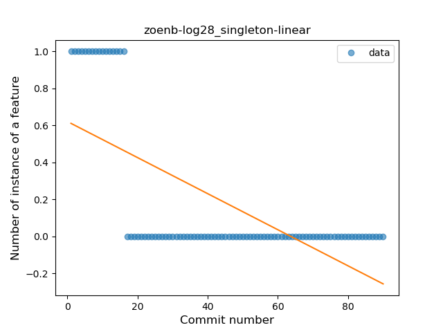
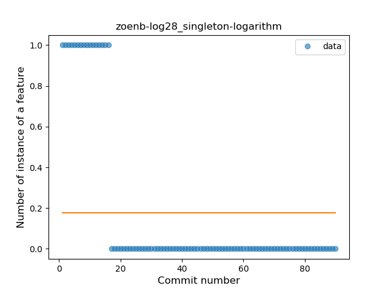
### <a name="range_expr">Range Expression</a>
----
#### Functions
* **Plateau Sudden Rise - Binary Sigmoid:** 
    * **R_Squared:** 1.0
* **Sudden Rise Plateau - Logarithm:** 
    * **R_Squared:** 0.55559912
* **Constant Rise - Linear:** 
    * **R_Squared:** 0.23427041

**Plots** :chart_with_upwards_trend:
-----

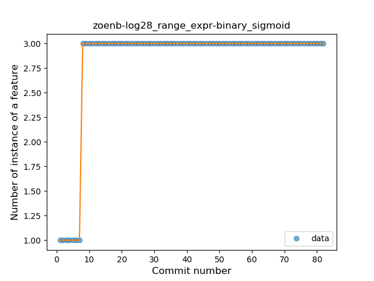
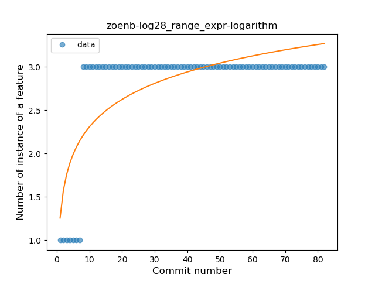
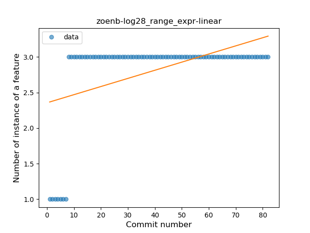
### <a name="func_call_with_named_arg">Function call with Named Argument</a>
----
#### Functions
* **Sudden Rise - Exponential:** 
    * **R_Squared:** 0.65029143
* **Constant Rise - Linear:** 
    * **R_Squared:** 0.17849174
* **Plateau Sudden Decline - Binary Sigmoid:** 
    * **R_Squared:** 0.06918918
* **Sudden Rise Plateau - Logarithm:** 
    * **R_Squared:** 0.01214092

**Plots** :chart_with_upwards_trend:
-----

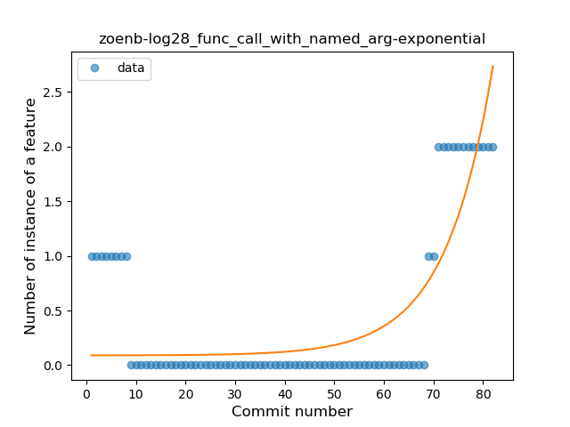
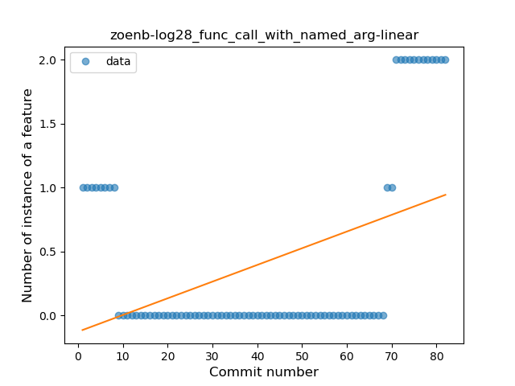
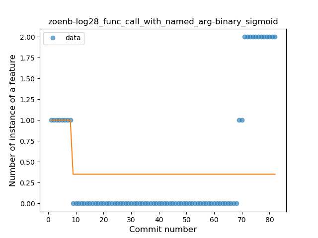
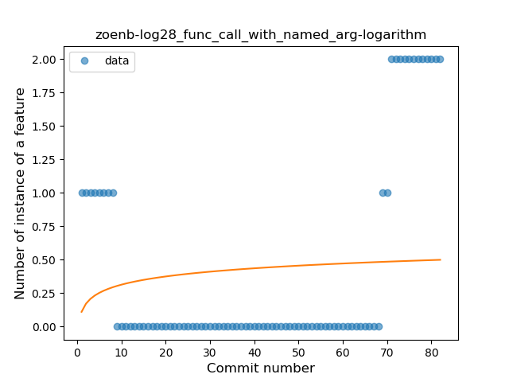
### <a name="data_class">Data Class</a>
----
#### Functions
* **Sudden Rise - Exponential:** 
    * **R_Squared:** 0.64961849
* **Constant Rise - Linear:** 
    * **R_Squared:** 0.5490874
* **Sudden Rise Plateau - Logarithm:** 
    * **R_Squared:** 0.14693711
* **Plateau Sudden Decline - Binary Sigmoid:** 
    * **R_Squared:** 0.03743315

**Plots** :chart_with_upwards_trend:
-----

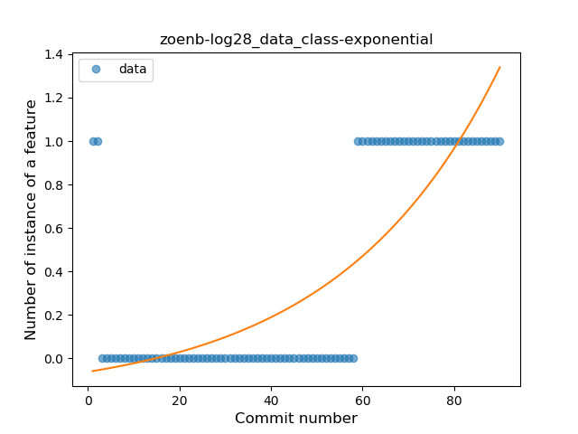
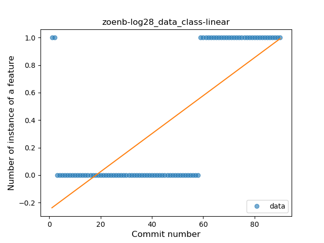
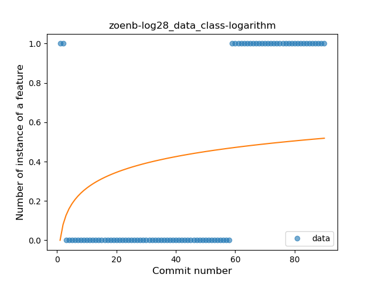
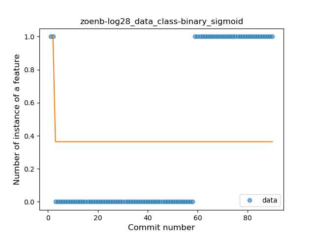
### <a name="extension_function">Extension Function</a>
----
#### Functions
* **Plateau Gradual Rise - Sigmoid:** 
    * **R_Squared:** 0.93981093
* **Sudden Rise - Exponential:** 
    * **R_Squared:** 0.86967138
* **Instability - Polinomial 3:** )
    * **R_Squared:** 0.86688809
* **Constant Rise - Linear:** 
    * **R_Squared:** 0.50254584
* **Sudden Rise Plateau - Logarithm:** 
    * **R_Squared:** 0.19922725

**Plots** :chart_with_upwards_trend:
-----

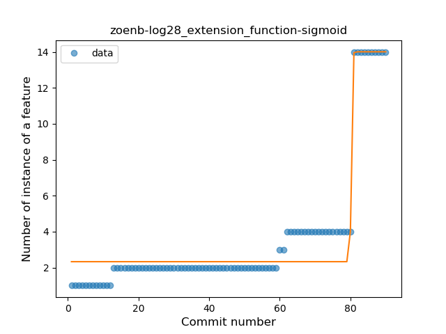
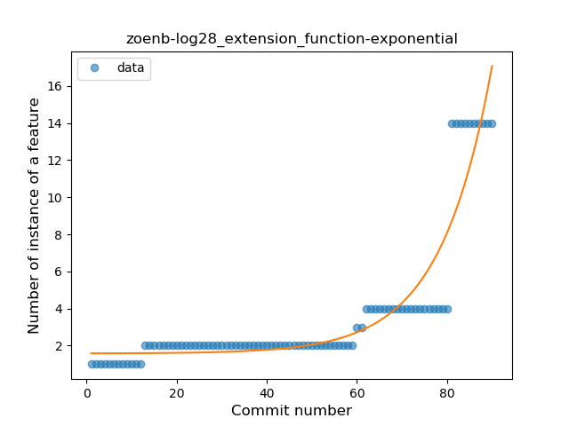
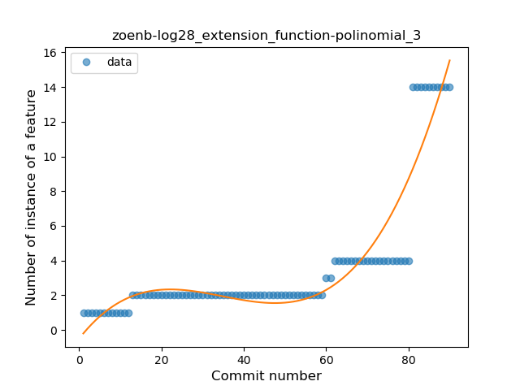
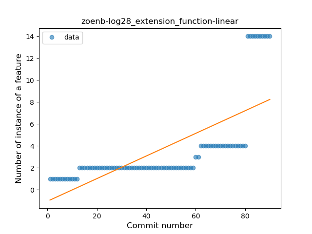
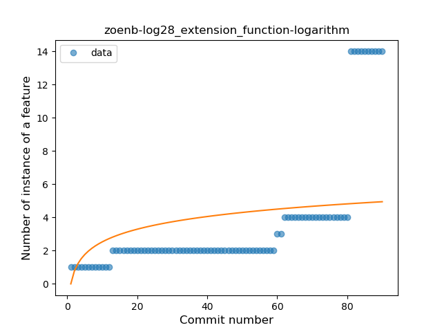
