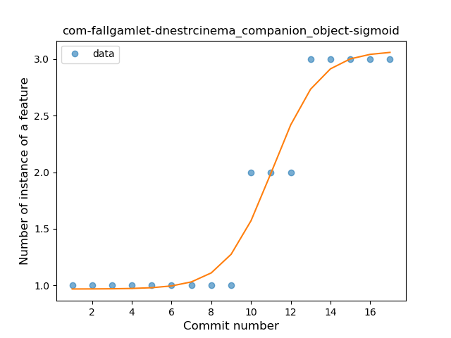
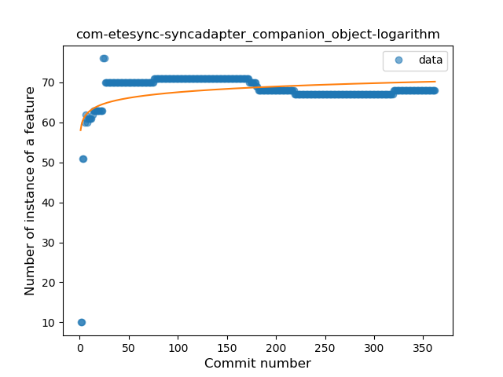

## Companion Object
----
**Best fit = Constant Rise**: 75

Function | N# best fit
----|----
<a href=" #T1">Constant Rise</a> | 75
<a href=" #T7">Plateau Gradual Rise</a> | 57
<a href=" #T9">Plateau Sudden Rise</a> | 39
<a href=" #T4">Sudden Rise</a> | 38
<a href=" #T6">Sudden Rise Plateau</a> | 33
<a href=" #T11">Instability</a> | 22
<a href=" #T2">Constant Decline</a> | 11
<a href=" #T5">Sudden Decline</a> | 8
<a href=" #T10">Plateau Sudden Decline</a> | 5
<a href=" #T8">Plateau Gradual Decline</a> | 2
<a href=" #T3">Stability</a> | 0

### <a name="T1">Constant Rise</a> 
 ----

1. com-duckduckgo-mobile-android

	*  Function: 
	* R_Squared: 0.98102861
 

2. com-fsck-k9

	*  Function: 
	* R_Squared: 0.98006903
 

3. com-keylesspalace-tusky

	*  Function: 
	* R_Squared: 0.97770439
 

4. one-librem-social

	*  Function: 
	* R_Squared: 0.97422217
 

5. pl-hypeapp-episodie

	*  Function: 
	* R_Squared: 0.97292107
 

6. org-mariotaku-twidere

	*  Function: 
	* R_Squared: 0.97229588
 

7. com-dp-logcatapp

	*  Function: 
	* R_Squared: 0.96592415
 

8. pw-janyo-janyoshare

	*  Function: 
	* R_Squared: 0.96073097
 

9. cat-pantsu-nyaapantsu

	*  Function: 
	* R_Squared: 0.95976786
 

10. ca-fuwafuwa-kaku

	*  Function: 
	* R_Squared: 0.95814044
 

11. ryey-easer-beta

	*  Function: 
	* R_Squared: 0.95436254
 

12. com-fastaccess-github-libre

	*  Function: 
	* R_Squared: 0.95289903
 

13. com-github-quarck-calnotify

	*  Function: 
	* R_Squared: 0.94782818
 

14. io-github-feelfreelinux-wykopmobilny

	*  Function: 
	* R_Squared: 0.94696636
 

15. fi-tuska-jalkametri

	*  Function: 
	* R_Squared: 0.94463605
 

16. com-motion-stage1

	*  Function: 
	* R_Squared: 0.93688246
 

17. ch-rmy-android-http_shortcuts

	*  Function: 
	* R_Squared: 0.9320973
 

18. app-simone

	*  Function: 
	* R_Squared: 0.92939054
 

19. com-czbix-v2ex

	*  Function: 
	* R_Squared: 0.92915343
 

20. fr-xgouchet-packageexplorer

	*  Function: 
	* R_Squared: 0.92737363
 

21. jp-toastkid-yobidashi

	*  Function: 
	* R_Squared: 0.92509936
 

22. it-diab

	*  Function: 
	* R_Squared: 0.92092386
 

23. li-klass-fhem

	*  Function: 
	* R_Squared: 0.90969728
 

24. de-grobox-liberario

	*  Function: 
	* R_Squared: 0.90798258
 

25. ca-josephroque-bowlingcompanion

	*  Function: 
	* R_Squared: 0.90530645
 

26. com-peterlaurence-trekme

	*  Function: 
	* R_Squared: 0.90348755
 

27. fr-insapp-insapp

	*  Function: 
	* R_Squared: 0.9022823
 

28. com-pitchedapps-frost

	*  Function: 
	* R_Squared: 0.89994545
 

29. net-osmand-plus

	*  Function: 
	* R_Squared: 0.8972811
 

30. is-xyz-omw

	*  Function: 
	* R_Squared: 0.8949041
 

31. pl-org-seva-navigator

	*  Function: 
	* R_Squared: 0.88993036
 

32. org-ligi-passandroid

	*  Function: 
	* R_Squared: 0.8832478
 

33. com-zacharee1-systemuituner

	*  Function: 
	* R_Squared: 0.8810939
 

34. de-markusfisch-android-binaryeye

	*  Function: 
	* R_Squared: 0.88102904
 

35. com-dozingcatsoftware-vectorcamera

	*  Function: 
	* R_Squared: 0.87855994
 

36. net-kourlas-voipms

	*  Function: 
	* R_Squared: 0.8737772
 

37. ffc-app

	*  Function: 
	* R_Squared: 0.86928232
 

38. info-metadude-android-congress-schedule

	*  Function: 
	* R_Squared: 0.86669388
 

39. com-ogsdroid

	*  Function: 
	* R_Squared: 0.86508945
 

40. com-sjn-stamp

	*  Function: 
	* R_Squared: 0.86303182
 

41. se-barsk-park

	*  Function: 
	* R_Squared: 0.86245641
 

42. org-fossasia-badgemagic

	*  Function: 
	* R_Squared: 0.86238197
 

43. com-njlabs-showjava

	*  Function: 
	* R_Squared: 0.86025386
 

44. org-blitzortung-android-app

	*  Function: 
	* R_Squared: 0.85971374
 

45. de-Maxr1998-xposed-maxlock

	*  Function: 
	* R_Squared: 0.85423418
 

46. org-poul-bits-android

	*  Function: 
	* R_Squared: 0.84928823
 

47. org-emunix-insteadlauncher

	*  Function: 
	* R_Squared: 0.84768346
 

48. com-github-fields-electric

	*  Function: 
	* R_Squared: 0.84497089
 

49. me-proxer-app

	*  Function: 
	* R_Squared: 0.84450885
 

50. de-avpptr-umweltzone

	*  Function: 
	* R_Squared: 0.83430129
 

51. info-papdt-express-helper

	*  Function: 
	* R_Squared: 0.82751714
 

52. be-mygod-vpnhotspot

	*  Function: 
	* R_Squared: 0.8208075
 

53. ca-rmen-android-poetassistant

	*  Function: 
	* R_Squared: 0.81971477
 

54. com-phicdy-totoanticipation

	*  Function: 
	* R_Squared: 0.81846429
 

55. com-pluscubed-velociraptor

	*  Function: 
	* R_Squared: 0.81115609
 

56. acr-browser-lightning

	*  Function: 
	* R_Squared: 0.81005711
 

57. com-arcao-geocaching4locus

	*  Function: 
	* R_Squared: 0.80918958
 

58. fi-kroon-vadret

	*  Function: 
	* R_Squared: 0.80239305
 

59. uk-colessoft-android-hilllist

	*  Function: 
	* R_Squared: 0.78980892
 

60. es-usc-citius-servando-calendula

	*  Function: 
	* R_Squared: 0.78726354
 

61. cat-xojan-random1

	*  Function: 
	* R_Squared: 0.75729645
 

62. net-yslibrary-monotweety

	*  Function: 
	* R_Squared: 0.74968556
 

63. org-blokada-alarm

	*  Function: 
	* R_Squared: 0.741102
 

64. net-mm2d-android-vmb

	*  Function: 
	* R_Squared: 0.74065761
 

65. com-github-premnirmal-tickerwidget

	*  Function: 
	* R_Squared: 0.72201137
 

67. com-moez-QKSMS

	*  Function: 
	* R_Squared: 0.65876556
 

69. ml-adamsprogs-bimba

	*  Function: 
	* R_Squared: 0.62438076
 

70. info-dvkr-screenstream

	*  Function: 
	* R_Squared: 0.60983346
 

71. com-slash-batterychargelimit

	*  Function: 
	* R_Squared: 0.5836195
 

81. app-opass-ccip

	*  Function: 
	* R_Squared: 0.06639565
 

82. org-moire-ultrasonic

	*  Function: 
	* R_Squared: 0.05973265
 

83. pt-ipleiria-mymusicqoe

	*  Function: 
	* R_Squared: 0.05604612
 

84. com-corphish-nightlight-generic

	*  Function: 
	* R_Squared: 0.03102168
 

85. me-camsteffen-polite

	*  Function: 
	* R_Squared: 0.01102336
 

86. net-nonylene-photolinkviewer

	*  Function: 
	* R_Squared: 0.00016528
 

### <a name="T7">Plateau Gradual Rise</a> 
 ----

1. org-havenapp-main

	*  Function: 
	* R_Squared: 0.9948864
 

2. com-rhm-pwn

	*  Function: 
	* R_Squared: 0.9912083
 

3. nl-brouwerijdemolen-borefts2013

	*  Function: 
	* R_Squared: 0.98468265
 

4. horse-amazin-my-stratum0-statuswidget

	*  Function: 
	* R_Squared: 0.98275645
 

5. org-isoron-uhabits

	*  Function: 
	* R_Squared: 0.98233907
 

6. xyz-hisname-fireflyiii

	*  Function: 
	* R_Squared: 0.98140337
 

7. pt-joaomneto-titancompanion

	*  Function: 
	* R_Squared: 0.98003051
 

8. com-nextcloud-talk2

	*  Function: 
	* R_Squared: 0.97876617
 

9. com-tasomaniac-openwith-floss

	*  Function: 
	* R_Squared: 0.97706784
 

10. com-ruuvi-station

	*  Function: 
	* R_Squared: 0.97549384
 

11. com-breadwallet

	*  Function: 
	* R_Squared: 0.97335427
 

12. io-mkg20001-arubanetworkslogin

	*  Function: 
	* R_Squared: 0.96161805
 

13. com-zeapo-pwdstore

	*  Function: 
	* R_Squared: 0.95998271
 

14. de-ironjan-mensaupb

	*  Function: 
	* R_Squared: 0.95914747
 

15. com-fallgamlet-dnestrcinema

	*  Function: 
	* R_Squared: 0.95896662
 

16. com-benoitletondor-easybudgetapp

	*  Function: 
	* R_Squared: 0.95705915
 

17. de-geeksfactory-opacclient

	*  Function: 
	* R_Squared: 0.95699232
 

18. me-anon-grow

	*  Function: 
	* R_Squared: 0.95661204
 

19. de-r4md4c-gamedealz

	*  Function: 
	* R_Squared: 0.95316717
 

20. org-mosad-seil0-projectlaogai

	*  Function: 
	* R_Squared: 0.95286719
 

21. apps-amine-bou-readerforselfoss

	*  Function: 
	* R_Squared: 0.95090738
 

22. com-tutpro-baresip

	*  Function: 
	* R_Squared: 0.95068712
 

23. com-github-moko256-twitlatte

	*  Function: 
	* R_Squared: 0.95009833
 

24. se-creotec-chscardbalance2

	*  Function: 
	* R_Squared: 0.94420638
 

25. com-uncmorfi

	*  Function: 
	* R_Squared: 0.94300139
 

26. com-simplemobiletools-clock

	*  Function: 
	* R_Squared: 0.94099734
 

27. com-github-laurenttreguier-deck

	*  Function: 
	* R_Squared: 0.93805677
 

28. de-thecode-android-tazreader

	*  Function: 
	* R_Squared: 0.93392404
 

29. me-blog-korn123-easydiary

	*  Function: 
	* R_Squared: 0.92594636
 

30. nightlock-peppercarrot

	*  Function: 
	* R_Squared: 0.92294532
 

31. pixel-kotlin-bassblog

	*  Function: 
	* R_Squared: 0.91768666
 

32. com-pennapps-labs-pennmobile

	*  Function: 
	* R_Squared: 0.9128691
 

33. net-stew-stew

	*  Function: 
	* R_Squared: 0.91008578
 

34. me-barta-stayintouch

	*  Function: 
	* R_Squared: 0.90769524
 

35. is-xyz-mpv

	*  Function: 
	* R_Squared: 0.904182
 

36. com-epimorphics-android-myrivers

	*  Function: 
	* R_Squared: 0.89973746
 

37. com-wbrawner-simplemarkdown

	*  Function: 
	* R_Squared: 0.89960758
 

38. com-uwetrottmann-wpdisplay

	*  Function: 
	* R_Squared: 0.88739122
 

39. link-standen-michael-phonesaver

	*  Function: 
	* R_Squared: 0.88337354
 

40. org-liberty-android-freeotpplus

	*  Function: 
	* R_Squared: 0.87547801
 

41. org-freedombox-freedombox

	*  Function: 
	* R_Squared: 0.86985198
 

42. com-jereksel-libresubstratum

	*  Function: 
	* R_Squared: 0.83957058
 

43. com-example-forgottenumbrella-cardboardmuseum

	*  Function: 
	* R_Squared: 0.83702249
 

44. de-blankedv-lanbahnpanel

	*  Function: 
	* R_Squared: 0.81797032
 

45. com-pyamsoft-homebutton

	*  Function: 
	* R_Squared: 0.81268553
 

47. com-example-harisont-librery

	*  Function: 
	* R_Squared: 0.78657845
 

48. chat-rocket-android

	*  Function: 
	* R_Squared: 0.78442588
 

49. com-tumblr-svetylk0-sheepsgohome-android

	*  Function: 
	* R_Squared: 0.75864688
 

50. com-bubelov-coins

	*  Function: 
	* R_Squared: 0.72227158
 

51. tech-ula

	*  Function: 
	* R_Squared: 0.70211257
 

52. com-simplemobiletools-contacts-pro

	*  Function: 
	* R_Squared: 0.68603637
 

53. com-atanana-sicounter

	*  Function: 
	* R_Squared: 0.5206402
 

54. com-nononsenseapps-feeder

	*  Function: 
	* R_Squared: 0.50109739
 

55. superustats-tool-android

	*  Function: 
	* R_Squared: 0.33003939
 

57. com-simplemobiletools-applauncher

	*  Function: 
	* R_Squared: 0.30628072
 

58. org-kiwix-kiwixcustomwikivoyageeurope

	*  Function: 
	* R_Squared: 0.268761
 

59. com-calintat-sensors

	*  Function: 
	* R_Squared: 0.21748647
 

### <a name="T9">Plateau Sudden Rise</a> 
 ----

1. com-agusyc-daycounter

	*  Function: 
	* R_Squared: 1.0
 

2. com-alderferstudios-handandfootscores

	*  Function: 
	* R_Squared: 1.0
 

3. com-android-gpstest-osmdroid

	*  Function: 
	* R_Squared: 1.0
 

5. com-crane-mockappdemo

	*  Function: 
	* R_Squared: 1.0
 

6. com-geo-GeoQuake

	*  Function: 
	* R_Squared: 1.0
 

7. com-nao20010128nao-DroidComplex

	*  Function: 
	* R_Squared: 1.0
 

8. com-rohitsuratekar-NCBSinfo

	*  Function: 
	* R_Squared: 1.0
 

9. com-simplemobiletools-thankyou

	*  Function: 
	* R_Squared: 1.0
 

10. com-skydoves-waterdays

	*  Function: 
	* R_Squared: 1.0
 

11. es-danirod-rectball-android

	*  Function: 
	* R_Squared: 1.0
 

12. io-github-hidroh-materialistic

	*  Function: 
	* R_Squared: 1.0
 

13. io-github-project

	*  Function: 
	* R_Squared: 1.0
 

14. io-github-project_travel_mate

	*  Function: 
	* R_Squared: 1.0
 

15. io-github-z3r0c00l

	*  Function: 
	* R_Squared: 1.0
 

17. pl-temomuko-autostoprace

	*  Function: 
	* R_Squared: 1.0
 

18. ru-hyst329-openfool

	*  Function: 
	* R_Squared: 1.0
 

19. sreich-countthedays

	*  Function: 
	* R_Squared: 1.0
 

20. xyz-koleno-sunwidget

	*  Function: 
	* R_Squared: 1.0
 

21. com-enjoyingfoss-om

	*  Function: 
	* R_Squared: 0.98476282
 

22. pl-poznajapp

	*  Function: 
	* R_Squared: 0.98163845
 

23. saschpe-poker

	*  Function: 
	* R_Squared: 0.93010076
 

24. com-tomer-draw

	*  Function: 
	* R_Squared: 0.9288984
 

25. fr-openium-auvergnewebcams

	*  Function: 
	* R_Squared: 0.89134632
 

26. danbroid-searchview

	*  Function: 
	* R_Squared: 0.89108911
 

27. org-weilbach-splitbills

	*  Function: 
	* R_Squared: 0.84265367
 

28. com-physphil-android-unitconverterultimate

	*  Function: 
	* R_Squared: 0.83559288
 

29. com-garpr-android

	*  Function: 
	* R_Squared: 0.78522761
 

30. de-micmun-android-deufeitage

	*  Function: 
	* R_Squared: 0.77676474
 

31. me-echeung-moemoekyun-fdroid

	*  Function: 
	* R_Squared: 0.72407706
 

34. com-booboot-vndbandroid

	*  Function: 
	* R_Squared: 0.63286393
 

35. org-teamblueridge-pasteitapp

	*  Function: 
	* R_Squared: 0.60232558
 

36. de-cineaste-android

	*  Function: 
	* R_Squared: 0.55873268
 

37. ch-abertschi-adfree

	*  Function: 
	* R_Squared: 0.38613012
 

38. pw-janyo-whatanime

	*  Function: 
	* R_Squared: 0.2873909
 

40. com-bernaferrari-changedetection

	*  Function: 
	* R_Squared: 0.23366796
 

41. com-simplemobiletools-draw

	*  Function: 
	* R_Squared: 0.2302259
 

42. com-simplemobiletools-draw-pro

	*  Function: 
	* R_Squared: 0.2302259
 

43. com-simplemobiletools-notes-pro

	*  Function: 
	* R_Squared: 0.19665609
 

44. com-adityakamble49-dcipher

	*  Function: 
	* R_Squared: 0.05619536
 

### <a name="T4">Sudden Rise</a> 
 ----

2. ch-deletescape-lawnchair-plah

	*  Function: 
	* R_Squared: 0.9919612
 

3. com-boardgamegeek

	*  Function: 
	* R_Squared: 0.98875571
 

4. org-mozilla-rocket

	*  Function: 
	* R_Squared: 0.98820192
 

5. im-vector-alpha

	*  Function: 
	* R_Squared: 0.97690466
 

6. com-lavadip-miniVector

	*  Function: 
	* R_Squared: 0.97523212
 

7. org-mozilla-focus

	*  Function: 
	* R_Squared: 0.97281328
 

8. org-mozilla-klar

	*  Function: 
	* R_Squared: 0.97281328
 

9. net-bible-android-activity

	*  Function: 
	* R_Squared: 0.96472244
 

10. quickbeer-android

	*  Function: 
	* R_Squared: 0.96348782
 

11. com-thanksmister-iot-mqtt-alarmpanel

	*  Function: 
	* R_Squared: 0.9528415
 

12. com-esafirm-androidplayground

	*  Function: 
	* R_Squared: 0.95031262
 

13. org-kaqui

	*  Function: 
	* R_Squared: 0.94994389
 

15. com-utazukin-ichaival

	*  Function: 
	* R_Squared: 0.93967884
 

16. com-github-vase4kin-teamcityapp

	*  Function: 
	* R_Squared: 0.92924327
 

17. org-ligi-gobandroid

	*  Function: 
	* R_Squared: 0.92673901
 

18. science-apolline

	*  Function: 
	* R_Squared: 0.91936409
 

20. com-orgzly

	*  Function: 
	* R_Squared: 0.90440532
 

21. org-zimmob-zimlx

	*  Function: 
	* R_Squared: 0.89058662
 

22. com-loloof64-android-basicchessendgamestrainer

	*  Function: 
	* R_Squared: 0.887983
 

23. com-github-fractals

	*  Function: 
	* R_Squared: 0.88402299
 

24. net-mm2d-dmsexplorer

	*  Function: 
	* R_Squared: 0.88039218
 

25. com-jim-sharetocomputer

	*  Function: 
	* R_Squared: 0.87459835
 

26. io-ipoli-android

	*  Function: 
	* R_Squared: 0.87159561
 

27. org-equeim-tremotesf

	*  Function: 
	* R_Squared: 0.84353239
 

28. com-mgaetan89-showsrage

	*  Function: 
	* R_Squared: 0.84234298
 

29. tw-shounenwind-kmnbottool

	*  Function: 
	* R_Squared: 0.76955774
 

30. com-cookiegames-smartcookie

	*  Function: 
	* R_Squared: 0.76954515
 

31. de-csicar-mensaplan

	*  Function: 
	* R_Squared: 0.76533951
 

32. uk-co-richyhbm-monochromatic

	*  Function: 
	* R_Squared: 0.76156415
 

33. com-github-cvzi-screenshottile

	*  Function: 
	* R_Squared: 0.75682952
 

34. org-eurofurence-connavigator

	*  Function: 
	* R_Squared: 0.75090902
 

35. com-log28

	*  Function: 
	* R_Squared: 0.73809137
 

36. com-eventyay-attendee

	*  Function: 
	* R_Squared: 0.70248957
 

39. com-wabadaba-dziennik

	*  Function: 
	* R_Squared: 0.51573573
 

40. com-calintat-units

	*  Function: 
	* R_Squared: 0.50284551
 

41. jp-cordea-mackerelclient

	*  Function: 
	* R_Squared: 0.49310667
 

42. fr-jnda-android-flashalert

	*  Function: 
	* R_Squared: 0.42427339
 

44. ai-susi

	*  Function: 
	* R_Squared: 0.18591314
 

### <a name="T6">Sudden Rise Plateau</a> 
 ----

1. com-guardafilme

	*  Function: 
	* R_Squared: 0.8826398
 

2. eu-kanade-tachiyomi

	*  Function: 
	* R_Squared: 0.87987238
 

3. net-nurik-roman-muzei

	*  Function: 
	* R_Squared: 0.85236536
 

4. fr-chenry-android-freshrss

	*  Function: 
	* R_Squared: 0.84939925
 

5. com-stevenschoen-putionew

	*  Function: 
	* R_Squared: 0.84702357
 

6. com-ianhanniballake-contractiontimer

	*  Function: 
	* R_Squared: 0.83571659
 

7. fr-corenting-edcompanion

	*  Function: 
	* R_Squared: 0.83173741
 

8. de-thecode-lmd

	*  Function: 
	* R_Squared: 0.82467418
 

9. io-github-wulkanowy

	*  Function: 
	* R_Squared: 0.80889349
 

10. cz-dvratil-fbeventsync

	*  Function: 
	* R_Squared: 0.80729113
 

11. fr-cph-chicago-foss

	*  Function: 
	* R_Squared: 0.791633
 

12. com-glodanif-bluetoothchat

	*  Function: 
	* R_Squared: 0.77887586
 

13. com-benoitquenaudon-tvfoot-red

	*  Function: 
	* R_Squared: 0.7702045
 

14. com-pixplicity-cryptogram

	*  Function: 
	* R_Squared: 0.7464376
 

15. com-commit451-gitlab

	*  Function: 
	* R_Squared: 0.74221552
 

16. org-pacien-tincapp

	*  Function: 
	* R_Squared: 0.73229499
 

17. com-ofalvai-bpinfo

	*  Function: 
	* R_Squared: 0.71115255
 

18. com-guerinet-mymartlet

	*  Function: 
	* R_Squared: 0.69821742
 

19. nl-mpcjanssen-simpletask

	*  Function: 
	* R_Squared: 0.68247573
 

20. com-yubico-yubioath

	*  Function: 
	* R_Squared: 0.6744532
 

21. de-ph1b-audiobook

	*  Function: 
	* R_Squared: 0.65495145
 

22. de-devmil-paperlaunch

	*  Function: 
	* R_Squared: 0.64521201
 

23. sk-styk-martin-apkanalyzer

	*  Function: 
	* R_Squared: 0.63971162
 

24. pl-org-seva-texter

	*  Function: 
	* R_Squared: 0.61551661
 

25. at-bitfire-davdroid

	*  Function: 
	* R_Squared: 0.60785689
 

26. org-walleth

	*  Function: 
	* R_Squared: 0.58125673
 

27. org-mattvchandler-progressbars

	*  Function: 
	* R_Squared: 0.56913301
 

28. com-bijoysingh-quicknote

	*  Function: 
	* R_Squared: 0.53259233
 

29. apps-jizzu-simpletodo

	*  Function: 
	* R_Squared: 0.27192785
 

30. org-mattvchandler-a2050

	*  Function: 
	* R_Squared: 0.21817294
 

31. com-jmstudios-redmoon

	*  Function: 
	* R_Squared: 0.19794228
 

32. com-etesync-syncadapter

	*  Function: 
	* R_Squared: 0.15492395
 

33. com-sduduzog-slimlauncher

	*  Function: 
	* R_Squared: 0.11534645
 

### <a name="T11">Instability</a> 
 ----

1. com-ianhanniballake-localstorage

	*  Function: 
	* R_Squared: 0.96969697
 

2. moe-feng-nhentai

	*  Function: 
	* R_Squared: 0.96048842
 

3. me-impa-knockonports

	*  Function: 
	* R_Squared: 0.90683679
 

4. com-manoj-dlt

	*  Function: 
	* R_Squared: 0.90603429
 

5. com-androidheads-vienna-escalero

	*  Function: 
	* R_Squared: 0.87922342
 

6. com-firstrowria-pushnotificationtester

	*  Function: 
	* R_Squared: 0.87692308
 

7. ru-nsu-bobrofon-easysshfs

	*  Function: 
	* R_Squared: 0.87143362
 

8. com-wilderpereira-lmgtfygen

	*  Function: 
	* R_Squared: 0.87044221
 

9. com-emmanuelmess-simplecleanup

	*  Function: 
	* R_Squared: 0.84130954
 

10. college-wyk-app

	*  Function: 
	* R_Squared: 0.83873518
 

11. com-appspot-pistatium-mahougen

	*  Function: 
	* R_Squared: 0.65897436
 

### <a name="T2">Constant Decline</a> 
 ----

66. net-frju-flym

	*  Function: 
	* R_Squared: 0.68240009
 

68. com-simplemobiletools-camera

	*  Function: 
	* R_Squared: 0.64253064
 

72. eu-the4thfloor-msync

	*  Function: 
	* R_Squared: 0.51264006
 

73. org-mifos-mobile

	*  Function: 
	* R_Squared: 0.43188382
 

74. com-simplemobiletools-musicplayer

	*  Function: 
	* R_Squared: 0.40405277
 

75. com-simplemobiletools-gallery

	*  Function: 
	* R_Squared: 0.38017056
 

76. me-kirimin-mitsumine

	*  Function: 
	* R_Squared: 0.28220529
 

77. com-simplemobiletools-calendar-pro

	*  Function: 
	* R_Squared: 0.25349498
 

78. com-simplemobiletools-filemanager-pro

	*  Function: 
	* R_Squared: 0.25077688
 

79. org-sanpra-checklist

	*  Function: 
	* R_Squared: 0.16248096
 

80. at-bitfire-icsdroid

	*  Function: 
	* R_Squared: 0.08995027
 

### <a name="T5">Sudden Decline</a> 
 ----

1. fr-jnda-android-ipcalc

	*  Function: 
	* R_Squared: 1.0
 

14. com-simplemobiletools-flashlight

	*  Function: 
	* R_Squared: 0.94199144
 

19. io-github-benoitduffez-cupsprint

	*  Function: 
	* R_Squared: 0.90799085
 

37. com-benny-openlauncher

	*  Function: 
	* R_Squared: 0.66128439
 

38. io-github-fvasco-pinpoi

	*  Function: 
	* R_Squared: 0.55229624
 

43. com-simplemobiletools-gallery-pro

	*  Function: 
	* R_Squared: 0.40045019
 

45. me-murks-feedwatcher

	*  Function: 
	* R_Squared: 0.11215914
 

46. tk-superl2-xwifi

	*  Function: 
	* R_Squared: 0.0177727
 

### <a name="T10">Plateau Sudden Decline</a> 
 ----

4. com-conorodonnell-bus

	*  Function: 
	* R_Squared: 1.0
 

16. org-commcare-dalvik

	*  Function: 
	* R_Squared: 1.0
 

32. rectangledbmi-com-pittsburghrealtimetracker

	*  Function: 
	* R_Squared: 0.66250637
 

33. org-anibyl-slounik

	*  Function: 
	* R_Squared: 0.63634988
 

39. de-westnordost-streetcomplete

	*  Function: 
	* R_Squared: 0.23516449
 

### <a name="T8">Plateau Gradual Decline</a> 
 ----

46. com-doctoror-particleswallpaper

	*  Function: 
	* R_Squared: 0.79371494
 

56. com-simplemobiletools-calculator

	*  Function: 
	* R_Squared: 0.32561132
 

### <a name="T3">Stability</a> 
 ----

