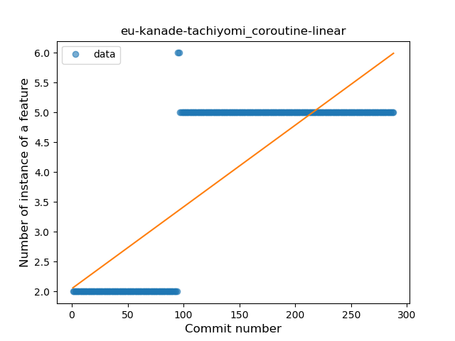
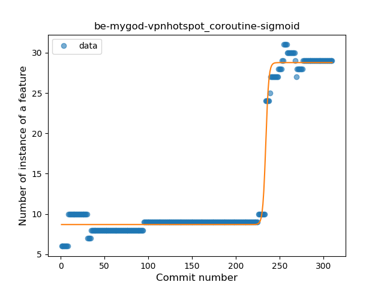
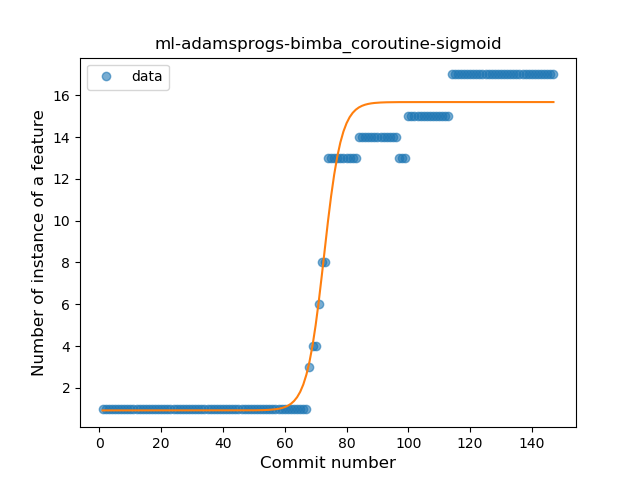
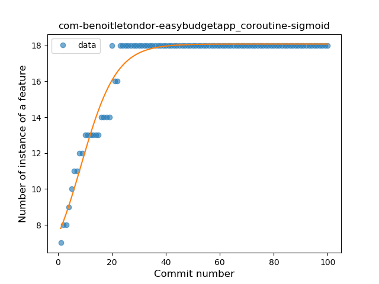
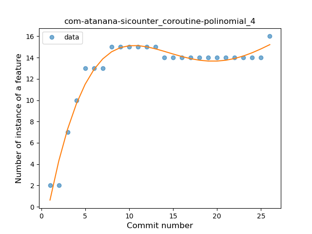
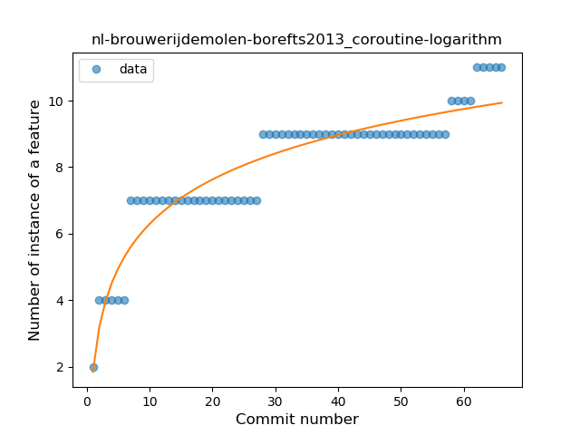
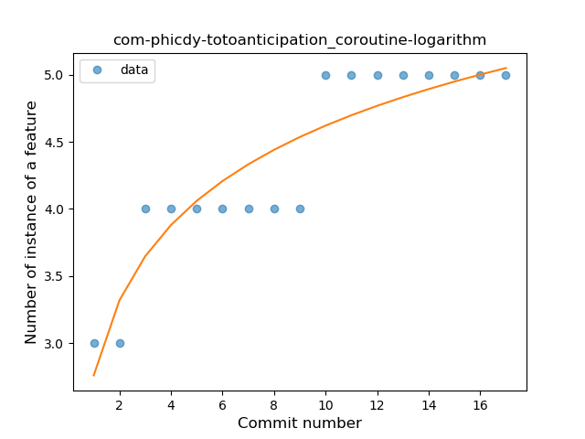
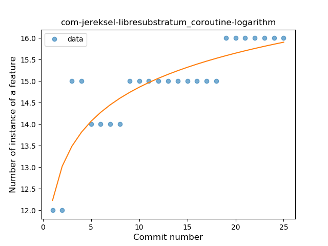
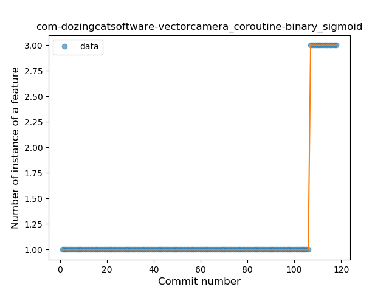
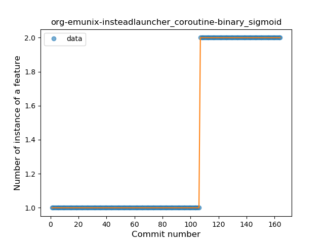

## Coroutine
----
**Best fit = Constant Rise**: 17

Function | N# best fit
----|----
<a href=" #T1">Constant Rise</a> | 17
<a href=" #T7">Plateau Gradual Rise</a> | 16
<a href=" #T11">Instability</a> | 14
<a href=" #T4">Sudden Rise</a> | 12
<a href=" #T6">Sudden Rise Plateau</a> | 8
<a href=" #T9">Plateau Sudden Rise</a> | 6
<a href=" #T2">Constant Decline</a> | 1
<a href=" #T5">Sudden Decline</a> | 1
<a href=" #T10">Plateau Sudden Decline</a> | 1
<a href=" #T3">Stability</a> | 0
<a href=" #T8">Plateau Gradual Decline</a> | 0

### <a name="T1">Constant Rise</a> 
 ----

1. de-r4md4c-gamedealz

	*  Function: 
	* R_Squared: 0.92304647
 

2. de-markusfisch-android-binaryeye

	*  Function: 
	* R_Squared: 0.91951817
 

3. org-mozilla-rocket

	*  Function: 
	* R_Squared: 0.91891882
 

4. chat-rocket-android

	*  Function: 
	* R_Squared: 0.89577253
 

5. com-nononsenseapps-feeder

	*  Function: 
	* R_Squared: 0.88231145
 

6. com-peterlaurence-trekme

	*  Function: 
	* R_Squared: 0.87829311
 

7. com-bijoysingh-quicknote

	*  Function: 
	* R_Squared: 0.87451213
 

8. com-arcao-geocaching4locus

	*  Function: 
	* R_Squared: 0.87015085
 

9. de-ph1b-audiobook

	*  Function: 
	* R_Squared: 0.80770756
 

10. com-guerinet-mymartlet

	*  Function: 
	* R_Squared: 0.80580079
 

11. jp-org-example-geckour-glyph

	*  Function: 
	* R_Squared: 0.76898287
 

12. com-fsck-k9

	*  Function: 
	* R_Squared: 0.75689227
 

13. de-Maxr1998-xposed-maxlock

	*  Function: 
	* R_Squared: 0.73693156
 

14. eu-kanade-tachiyomi

	*  Function: 
	* R_Squared: 0.64815423
 

15. io-ipoli-android

	*  Function: 
	* R_Squared: 0.63371873
 

17. im-vector-alpha

	*  Function: 
	* R_Squared: 0.00618409
 

18. com-lavadip-miniVector

	*  Function: 
	* R_Squared: 0.00585277
 

### <a name="T7">Plateau Gradual Rise</a> 
 ----

1. tw-shounenwind-kmnbottool

	*  Function: 
	* R_Squared: 0.99794872
 

2. be-mygod-vpnhotspot

	*  Function: 
	* R_Squared: 0.98599916
 

3. com-kgurgul-cpuinfo

	*  Function: 
	* R_Squared: 0.98098904
 

4. ml-adamsprogs-bimba

	*  Function: 
	* R_Squared: 0.97873874
 

5. xyz-hisname-fireflyiii

	*  Function: 
	* R_Squared: 0.97274504
 

6. com-nextcloud-talk2

	*  Function: 
	* R_Squared: 0.97200265
 

7. org-kaqui

	*  Function: 
	* R_Squared: 0.97149787
 

8. org-isoron-uhabits

	*  Function: 
	* R_Squared: 0.97035549
 

9. com-benoitletondor-easybudgetapp

	*  Function: 
	* R_Squared: 0.96364147
 

10. com-duckduckgo-mobile-android

	*  Function: 
	* R_Squared: 0.95383247
 

11. com-jim-sharetocomputer

	*  Function: 
	* R_Squared: 0.9537628
 

12. com-dp-logcatapp

	*  Function: 
	* R_Squared: 0.9459107
 

13. li-klass-fhem

	*  Function: 
	* R_Squared: 0.91407666
 

14. net-nurik-roman-muzei

	*  Function: 
	* R_Squared: 0.80026058
 

15. eu-the4thfloor-msync

	*  Function: 
	* R_Squared: 0.76803753
 

16. com-yubico-yubioath

	*  Function: 
	* R_Squared: 0.41057234
 

### <a name="T11">Instability</a> 
 ----

1. com-bracketcove-postrainer

	*  Function: 
	* R_Squared: 0.9985348
 

2. com-firstrowria-pushnotificationtester

	*  Function: 
	* R_Squared: 0.9952381
 

3. com-atanana-sicounter

	*  Function: 
	* R_Squared: 0.96074326
 

4. io-wookey-wallet

	*  Function: 
	* R_Squared: 0.8962384
 

5. pw-janyo-whatanime

	*  Function: 
	* R_Squared: 0.82438914
 

6. fr-rhaz-ipfs-sweet

	*  Function: 
	* R_Squared: 0.45186496
 

### <a name="T4">Sudden Rise</a> 
 ----

1. ca-josephroque-bowlingcompanion

	*  Function: 
	* R_Squared: 0.97845583
 

2. tech-ula

	*  Function: 
	* R_Squared: 0.95365111
 

3. org-mozilla-focus

	*  Function: 
	* R_Squared: 0.94996529
 

4. org-mozilla-klar

	*  Function: 
	* R_Squared: 0.94996529
 

5. org-walleth

	*  Function: 
	* R_Squared: 0.94891424
 

6. com-ianhanniballake-contractiontimer

	*  Function: 
	* R_Squared: 0.93310165
 

7. com-bubelov-coins

	*  Function: 
	* R_Squared: 0.91455486
 

8. com-androidheads-vienna-escalero

	*  Function: 
	* R_Squared: 0.90691229
 

9. com-utazukin-ichaival

	*  Function: 
	* R_Squared: 0.88640483
 

10. org-blokada-alarm

	*  Function: 
	* R_Squared: 0.86144663
 

11. com-bernaferrari-changedetection

	*  Function: 
	* R_Squared: 0.82121675
 

12. fr-jnda-android-flashalert

	*  Function: 
	* R_Squared: 0.74237768
 

### <a name="T6">Sudden Rise Plateau</a> 
 ----

1. nl-brouwerijdemolen-borefts2013

	*  Function: 
	* R_Squared: 0.87664243
 

2. com-phicdy-totoanticipation

	*  Function: 
	* R_Squared: 0.83883545
 

3. com-pitchedapps-frost

	*  Function: 
	* R_Squared: 0.78099164
 

4. com-jereksel-libresubstratum

	*  Function: 
	* R_Squared: 0.75956616
 

5. com-glodanif-bluetoothchat

	*  Function: 
	* R_Squared: 0.71964046
 

6. app-opass-ccip

	*  Function: 
	* R_Squared: 0.58436051
 

7. com-pluscubed-velociraptor

	*  Function: 
	* R_Squared: 0.56974532
 

8. it-diab

	*  Function: 
	* R_Squared: 0.21776995
 

### <a name="T9">Plateau Sudden Rise</a> 
 ----

1. com-czbix-v2ex

	*  Function: 
	* R_Squared: 1.0
 

2. com-dozingcatsoftware-vectorcamera

	*  Function: 
	* R_Squared: 1.0
 

3. com-github-premnirmal-tickerwidget

	*  Function: 
	* R_Squared: 1.0
 

4. com-moez-QKSMS

	*  Function: 
	* R_Squared: 1.0
 

5. org-emunix-insteadlauncher

	*  Function: 
	* R_Squared: 1.0
 

7. moe-feng-nhentai

	*  Function: 
	* R_Squared: 0.73809524
 

### <a name="T2">Constant Decline</a> 
 ----

16. org-mosad-seil0-projectlaogai

	*  Function: 
	* R_Squared: 0.03125
 

### <a name="T5">Sudden Decline</a> 
 ----

13. info-dvkr-screenstream

	*  Function: 
	* R_Squared: 0.66546619
 

### <a name="T10">Plateau Sudden Decline</a> 
 ----

6. com-uncmorfi

	*  Function: 
	* R_Squared: 0.9507373
 

### <a name="T3">Stability</a> 
 ----

### <a name="T8">Plateau Gradual Decline</a> 
 ----

