## Data Class
----
**Best fit = Plateau Gradual Rise**: 51

Function | N# best fit
----|----
<a href=" #T7">Plateau Gradual Rise</a> | 51
<a href=" #T1">Constant Rise</a> | 44
<a href=" #T9">Plateau Sudden Rise</a> | 35
<a href=" #T4">Sudden Rise</a> | 28
<a href=" #T6">Sudden Rise Plateau</a> | 19
<a href=" #T11">Instability</a> | 14
<a href=" #T10">Plateau Sudden Decline</a> | 6
<a href=" #T5">Sudden Decline</a> | 5
<a href=" #T2">Constant Decline</a> | 2
<a href=" #T3">Stability</a> | 0
<a href=" #T8">Plateau Gradual Decline</a> | 0

### <a name="T7">Plateau Gradual Rise</a> 
 ----

1. com-rhm-pwn

	*  Function: 
	* R_Squared: 0.99715684
 

2. net-frju-flym

	*  Function: 
	* R_Squared: 0.99601643
 

3. info-papdt-express-helper

	*  Function: 
	* R_Squared: 0.99463345
 

4. com-phicdy-totoanticipation

	*  Function: 
	* R_Squared: 0.99142493
 

5. ml-adamsprogs-bimba

	*  Function: 
	* R_Squared: 0.99001523
 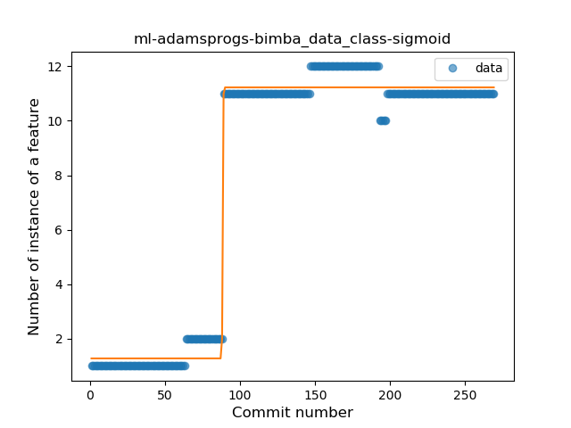

6. chat-rocket-android

	*  Function: 
	* R_Squared: 0.98811005
 

7. com-github-moko256-twitlatte

	*  Function: 
	* R_Squared: 0.98367306
 

8. com-dp-logcatapp

	*  Function: 
	* R_Squared: 0.98342171
 

9. com-adityakamble49-dcipher

	*  Function: 
	* R_Squared: 0.98284601
 

10. ch-rmy-android-http_shortcuts

	*  Function: 
	* R_Squared: 0.98222489
 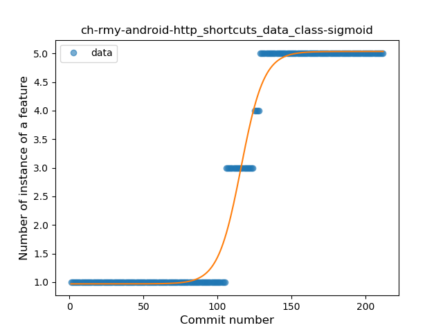

11. tech-ula

	*  Function: 
	* R_Squared: 0.97745552
 

12. com-github-vase4kin-teamcityapp

	*  Function: 
	* R_Squared: 0.97659375
 

13. it-diab

	*  Function: 
	* R_Squared: 0.97391274
 

14. acr-browser-lightning

	*  Function: 
	* R_Squared: 0.9716622
 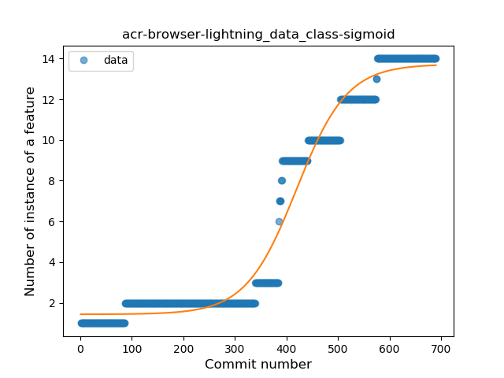

15. com-wabadaba-dziennik

	*  Function: 
	* R_Squared: 0.97054595
 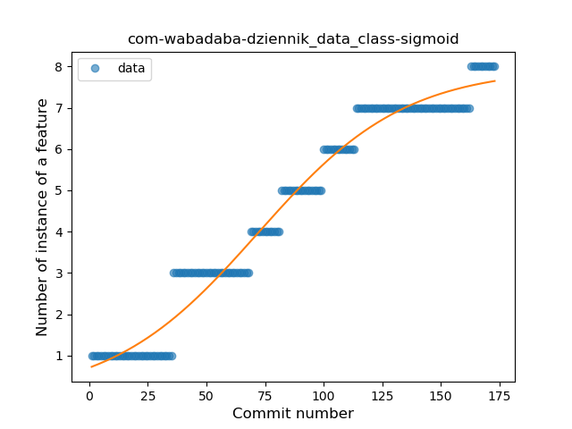

16. com-simplemobiletools-notes-pro

	*  Function: 
	* R_Squared: 0.97011433
 

17. com-nextcloud-talk2

	*  Function: 
	* R_Squared: 0.96936595
 

18. fr-openium-auvergnewebcams

	*  Function: 
	* R_Squared: 0.96933345
 

19. me-proxer-app

	*  Function: 
	* R_Squared: 0.96389123
 

20. com-bijoysingh-quicknote

	*  Function: 
	* R_Squared: 0.96358153
 

21. com-whiterabbit-pisabike

	*  Function: 
	* R_Squared: 0.95581472
 

22. org-mozilla-focus

	*  Function: 
	* R_Squared: 0.95522033
 

23. org-mozilla-klar

	*  Function: 
	* R_Squared: 0.95522033
 

24. de-avpptr-umweltzone

	*  Function: 
	* R_Squared: 0.94987725
 

25. apps-amine-bou-readerforselfoss

	*  Function: 
	* R_Squared: 0.94954704
 

26. com-doctoror-particleswallpaper

	*  Function: 
	* R_Squared: 0.94855328
 

27. com-epimorphics-android-myrivers

	*  Function: 
	* R_Squared: 0.94776905
 

28. com-benoitquenaudon-tvfoot-red

	*  Function: 
	* R_Squared: 0.94295701
 

29. org-zimmob-zimlx

	*  Function: 
	* R_Squared: 0.94280693
 

30. com-tasomaniac-openwith-floss

	*  Function: 
	* R_Squared: 0.9420861
 

31. de-markusfisch-android-binaryeye

	*  Function: 
	* R_Squared: 0.94097257
 

32. be-mygod-vpnhotspot

	*  Function: 
	* R_Squared: 0.93917345
 

33. me-kirimin-mitsumine

	*  Function: 
	* R_Squared: 0.93848789
 

34. ca-rmen-android-poetassistant

	*  Function: 
	* R_Squared: 0.93679322
 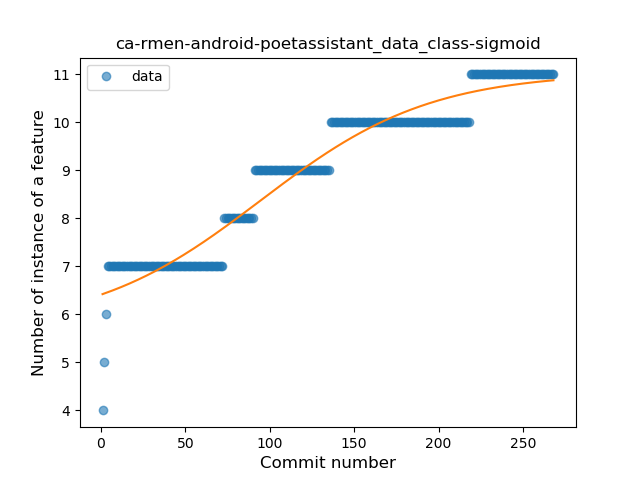

35. pl-temomuko-autostoprace

	*  Function: 
	* R_Squared: 0.93134481
 

36. org-emunix-insteadlauncher

	*  Function: 
	* R_Squared: 0.92313893
 

37. de-grobox-liberario

	*  Function: 
	* R_Squared: 0.92266885
 

38. jp-org-example-geckour-glyph

	*  Function: 
	* R_Squared: 0.92159922
 

39. com-esafirm-androidplayground

	*  Function: 
	* R_Squared: 0.89687884
 

40. cat-xojan-random1

	*  Function: 
	* R_Squared: 0.87504393
 

41. com-example-forgottenumbrella-cardboardmuseum

	*  Function: 
	* R_Squared: 0.87276416
 

42. info-metadude-android-congress-schedule

	*  Function: 
	* R_Squared: 0.86168127
 

43. net-osmand-plus

	*  Function: 
	* R_Squared: 0.86066232
 

44. org-fossasia-badgemagic

	*  Function: 
	* R_Squared: 0.85536633
 

45. com-directdev-portal

	*  Function: 
	* R_Squared: 0.83901773
 

46. me-blog-korn123-easydiary

	*  Function: 
	* R_Squared: 0.81580217
 

47. com-moez-QKSMS

	*  Function: 
	* R_Squared: 0.81290758
 

48. at-bitfire-davdroid

	*  Function: 
	* R_Squared: 0.7202077
 

49. com-atanana-sicounter

	*  Function: 
	* R_Squared: 0.67746966
 

50. com-sduduzog-slimlauncher

	*  Function: 
	* R_Squared: 0.66572805
 

51. com-simplemobiletools-clock

	*  Function: 
	* R_Squared: 0.56393544
 

### <a name="T1">Constant Rise</a> 
 ----

1. com-fsck-k9

	*  Function: 
	* R_Squared: 0.97584216
 

2. com-peterlaurence-trekme

	*  Function: 
	* R_Squared: 0.97459796
 

3. com-github-quarck-calnotify

	*  Function: 
	* R_Squared: 0.96648975
 

4. org-mariotaku-twidere

	*  Function: 
	* R_Squared: 0.95519266
 

5. com-keylesspalace-tusky

	*  Function: 
	* R_Squared: 0.94815425
 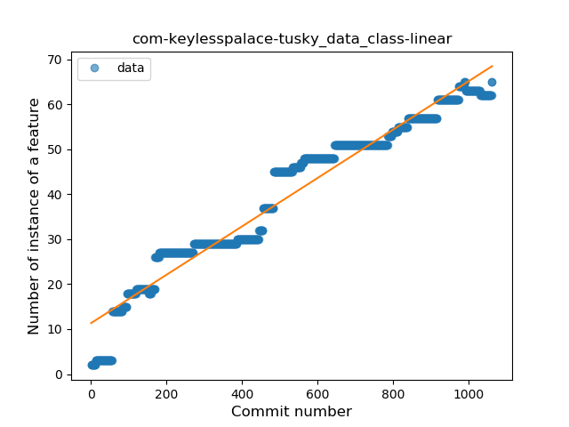

6. one-librem-social

	*  Function: 
	* R_Squared: 0.94315563
 

7. fr-cph-chicago-foss

	*  Function: 
	* R_Squared: 0.93315263
 

8. uk-colessoft-android-hilllist

	*  Function: 
	* R_Squared: 0.93192448
 

9. pl-hypeapp-episodie

	*  Function: 
	* R_Squared: 0.92778246
 

10. com-eventyay-attendee

	*  Function: 
	* R_Squared: 0.92271126
 

11. org-moire-ultrasonic

	*  Function: 
	* R_Squared: 0.9215884
 

12. li-klass-fhem

	*  Function: 
	* R_Squared: 0.91479182
 

13. org-mosad-seil0-projectlaogai

	*  Function: 
	* R_Squared: 0.91379178
 

14. pt-ipleiria-mymusicqoe

	*  Function: 
	* R_Squared: 0.90567989
 

15. com-nononsenseapps-feeder

	*  Function: 
	* R_Squared: 0.89430311
 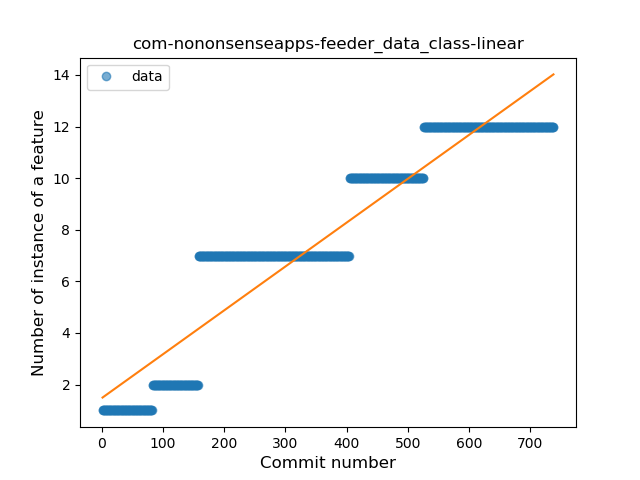

16. fr-corenting-edcompanion

	*  Function: 
	* R_Squared: 0.8938943
 

17. ca-fuwafuwa-kaku

	*  Function: 
	* R_Squared: 0.89088218
 

18. fi-kroon-vadret

	*  Function: 
	* R_Squared: 0.88351276
 

19. de-thecode-android-tazreader

	*  Function: 
	* R_Squared: 0.87518642
 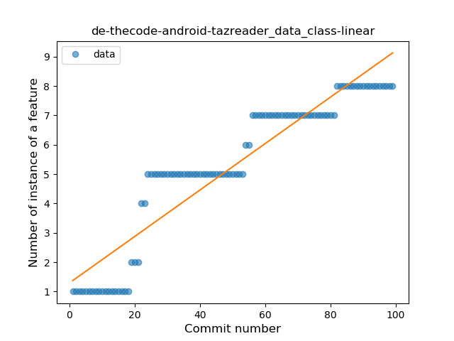

20. quickbeer-android

	*  Function: 
	* R_Squared: 0.87283811
 

21. com-ogsdroid

	*  Function: 
	* R_Squared: 0.86816582
 

22. com-github-premnirmal-tickerwidget

	*  Function: 
	* R_Squared: 0.86572205
 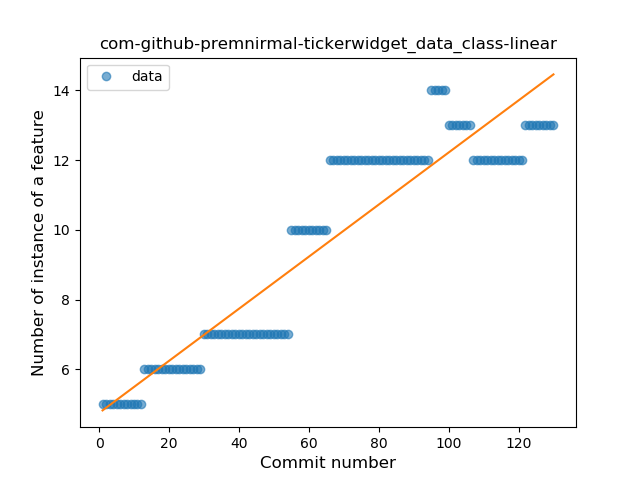

23. io-github-feelfreelinux-wykopmobilny

	*  Function: 
	* R_Squared: 0.85733288
 

24. com-glodanif-bluetoothchat

	*  Function: 
	* R_Squared: 0.84367787
 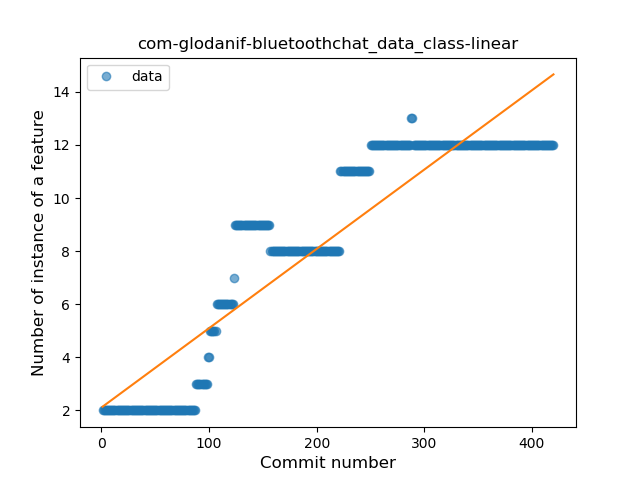

25. com-uncmorfi

	*  Function: 
	* R_Squared: 0.84000938
 

26. org-walleth

	*  Function: 
	* R_Squared: 0.83073837
 

27. com-arcao-geocaching4locus

	*  Function: 
	* R_Squared: 0.82279987
 

28. com-simplemobiletools-gallery-pro

	*  Function: 
	* R_Squared: 0.82259361
 

29. io-github-wulkanowy

	*  Function: 
	* R_Squared: 0.81513675
 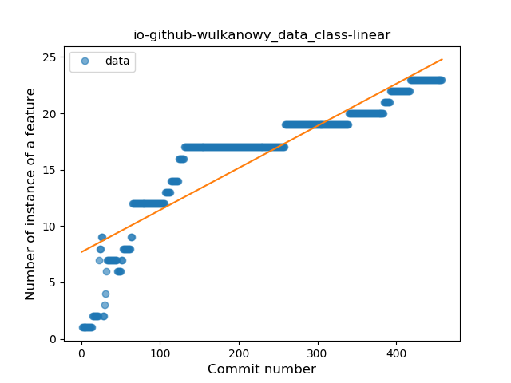

30. app-opass-ccip

	*  Function: 
	* R_Squared: 0.80686587
 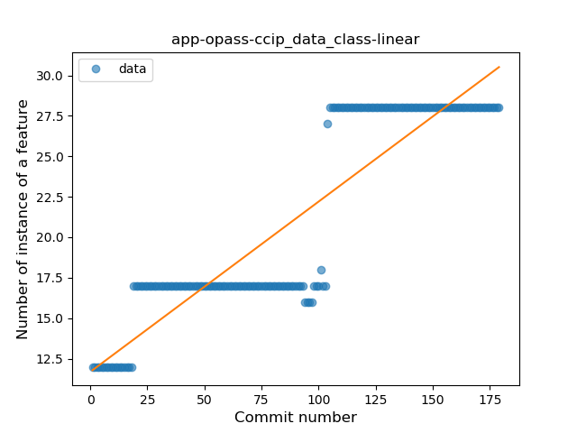

31. de-thecode-lmd

	*  Function: 
	* R_Squared: 0.80190349
 

32. net-yslibrary-monotweety

	*  Function: 
	* R_Squared: 0.77328009
 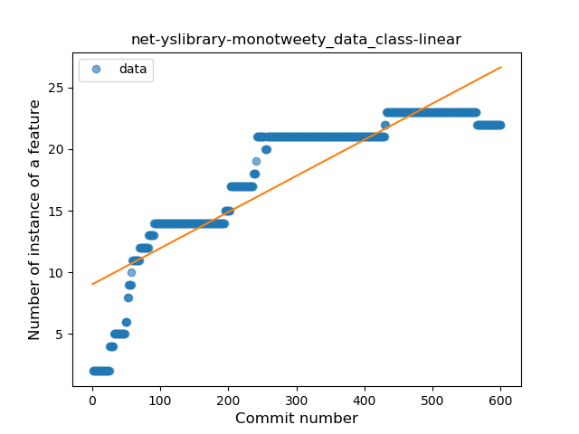

33. com-dozingcatsoftware-vectorcamera

	*  Function: 
	* R_Squared: 0.77255051
 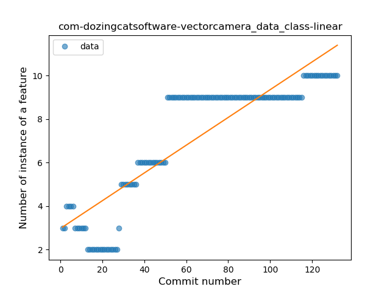

34. org-kaqui

	*  Function: 
	* R_Squared: 0.76767199
 

35. net-nurik-roman-muzei

	*  Function: 
	* R_Squared: 0.73421822
 

36. org-blokada-alarm

	*  Function: 
	* R_Squared: 0.72607067
 

37. com-booboot-vndbandroid

	*  Function: 
	* R_Squared: 0.7104171
 

38. de-cineaste-android

	*  Function: 
	* R_Squared: 0.70040292
 

39. ai-susi

	*  Function: 
	* R_Squared: 0.69317979
 

40. com-pitchedapps-frost

	*  Function: 
	* R_Squared: 0.67006658
 

41. com-fastaccess-github-libre

	*  Function: 
	* R_Squared: 0.66606839
 

42. com-simplemobiletools-calendar-pro

	*  Function: 
	* R_Squared: 0.64463989
 

44. ca-josephroque-bowlingcompanion

	*  Function: 
	* R_Squared: 0.48376725
 

45. fr-xgouchet-packageexplorer

	*  Function: 
	* R_Squared: 0.3178751
 

### <a name="T9">Plateau Sudden Rise</a> 
 ----

2. com-android-gpstest-osmdroid

	*  Function: 
	* R_Squared: 1.0
 

3. com-corphish-nightlight-generic

	*  Function: 
	* R_Squared: 1.0
 

4. com-emmanuelmess-simplecleanup

	*  Function: 
	* R_Squared: 1.0
 

5. com-enjoyingfoss-om

	*  Function: 
	* R_Squared: 1.0
 

6. com-github-cvzi-screenshottile

	*  Function: 
	* R_Squared: 1.0
 

7. com-guardafilme

	*  Function: 
	* R_Squared: 1.0
 

8. com-kanedias-vanilla-metadata

	*  Function: 
	* R_Squared: 1.0
 

9. com-ofalvai-bpinfo

	*  Function: 
	* R_Squared: 1.0
 

10. com-pluscubed-velociraptor

	*  Function: 
	* R_Squared: 1.0
 

11. com-simplemobiletools-camera

	*  Function: 
	* R_Squared: 1.0
 

12. com-simplemobiletools-gallery

	*  Function: 
	* R_Squared: 1.0
 

13. com-simplemobiletools-musicplayer

	*  Function: 
	* R_Squared: 1.0
 

14. com-utazukin-ichaival

	*  Function: 
	* R_Squared: 1.0
 

15. com-zacharee1-systemuituner

	*  Function: 
	* R_Squared: 1.0
 

16. de-csicar-mensaplan

	*  Function: 
	* R_Squared: 1.0
 

17. de-micmun-android-deufeitage

	*  Function: 
	* R_Squared: 1.0
 

18. eu-depau-etchdroid

	*  Function: 
	* R_Squared: 1.0
 

19. io-github-fvasco-pinpoi

	*  Function: 
	* R_Squared: 1.0
 

20. moe-feng-nhentai

	*  Function: 
	* R_Squared: 1.0
 

21. nightlock-peppercarrot

	*  Function: 
	* R_Squared: 1.0
 

22. org-freedombox-freedombox

	*  Function: 
	* R_Squared: 1.0
 

23. org-ligi-gobandroid

	*  Function: 
	* R_Squared: 1.0
 

24. org-ligi-survivalmanual

	*  Function: 
	* R_Squared: 1.0
 

25. pl-org-seva-navigator

	*  Function: 
	* R_Squared: 1.0
 

26. pw-janyo-janyoshare

	*  Function: 
	* R_Squared: 1.0
 

27. eu-the4thfloor-msync

	*  Function: 
	* R_Squared: 0.99173006
 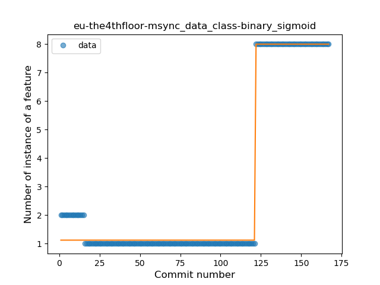

28. com-motion-stage1

	*  Function: 
	* R_Squared: 0.9747551
 

30. com-physphil-android-unitconverterultimate

	*  Function: 
	* R_Squared: 0.95334745
 

31. cz-dvratil-fbeventsync

	*  Function: 
	* R_Squared: 0.94689671
 

32. com-benoitletondor-easybudgetapp

	*  Function: 
	* R_Squared: 0.93722668
 

35. com-mgaetan89-showsrage

	*  Function: 
	* R_Squared: 0.87122548
 

36. science-apolline

	*  Function: 
	* R_Squared: 0.72946833
 

38. me-echeung-moemoekyun-fdroid

	*  Function: 
	* R_Squared: 0.62804228
 

39. com-calintat-units

	*  Function: 
	* R_Squared: 0.50716713
 

41. ch-abertschi-adfree

	*  Function: 
	* R_Squared: 0.33145811
 

### <a name="T4">Sudden Rise</a> 
 ----

2. io-ipoli-android

	*  Function: 
	* R_Squared: 0.98123978
 

3. com-boardgamegeek

	*  Function: 
	* R_Squared: 0.98100627
 

4. eu-kanade-tachiyomi

	*  Function: 
	* R_Squared: 0.96724155
 

5. org-mozilla-rocket

	*  Function: 
	* R_Squared: 0.96621948
 

6. im-vector-alpha

	*  Function: 
	* R_Squared: 0.96510891
 

7. com-lavadip-miniVector

	*  Function: 
	* R_Squared: 0.96510319
 

8. com-duckduckgo-mobile-android

	*  Function: 
	* R_Squared: 0.94730622
 

9. de-ph1b-audiobook

	*  Function: 
	* R_Squared: 0.93372451
 

10. com-breadwallet

	*  Function: 
	* R_Squared: 0.92796126
 

11. org-equeim-tremotesf

	*  Function: 
	* R_Squared: 0.92599359
 

12. com-orgzly

	*  Function: 
	* R_Squared: 0.92033355
 

13. com-loloof64-android-basicchessendgamestrainer

	*  Function: 
	* R_Squared: 0.89745799
 

14. ch-deletescape-lawnchair-plah

	*  Function: 
	* R_Squared: 0.89113666
 

15. com-stevenschoen-putionew

	*  Function: 
	* R_Squared: 0.87533257
 

16. me-camsteffen-polite

	*  Function: 
	* R_Squared: 0.86649964
 

17. link-standen-michael-phonesaver

	*  Function: 
	* R_Squared: 0.86607394
 

18. de-westnordost-streetcomplete

	*  Function: 
	* R_Squared: 0.8586133
 

19. com-czbix-v2ex

	*  Function: 
	* R_Squared: 0.8550459
 

20. org-pacien-tincapp

	*  Function: 
	* R_Squared: 0.81054331
 

21. org-poul-bits-android

	*  Function: 
	* R_Squared: 0.79877752
 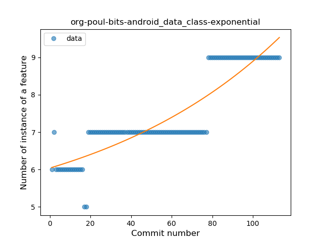

23. org-eurofurence-connavigator

	*  Function: 
	* R_Squared: 0.747785
 

25. com-jereksel-libresubstratum

	*  Function: 
	* R_Squared: 0.7094223
 

26. com-log28

	*  Function: 
	* R_Squared: 0.64961849
 

29. jp-toastkid-yobidashi

	*  Function: 
	* R_Squared: 0.45570028
 

30. com-bernaferrari-changedetection

	*  Function: 
	* R_Squared: 0.45481769
 

31. io-trewartha-positional

	*  Function: 
	* R_Squared: 0.35556673
 

32. org-mattvchandler-progressbars

	*  Function: 
	* R_Squared: 0.30234724
 

33. net-mm2d-android-vmb

	*  Function: 
	* R_Squared: 0.11478862
 

### <a name="T6">Sudden Rise Plateau</a> 
 ----

1. de-r4md4c-gamedealz

	*  Function: 
	* R_Squared: 0.94596433
 

2. org-isoron-uhabits

	*  Function: 
	* R_Squared: 0.90148259
 

3. xyz-hisname-fireflyiii

	*  Function: 
	* R_Squared: 0.8822733
 

4. com-bubelov-coins

	*  Function: 
	* R_Squared: 0.83808072
 

5. com-jmstudios-redmoon

	*  Function: 
	* R_Squared: 0.82396974
 

6. fr-chenry-android-freshrss

	*  Function: 
	* R_Squared: 0.80703129
 

7. org-blitzortung-android-app

	*  Function: 
	* R_Squared: 0.77674238
 

8. com-kgurgul-cpuinfo

	*  Function: 
	* R_Squared: 0.77383968
 

9. nl-mpcjanssen-simpletask

	*  Function: 
	* R_Squared: 0.76334869
 

10. com-garpr-android

	*  Function: 
	* R_Squared: 0.70720882
 

11. net-bible-android-activity

	*  Function: 
	* R_Squared: 0.63526405
 

12. is-xyz-mpv

	*  Function: 
	* R_Squared: 0.58344717
 

13. com-simplemobiletools-contacts-pro

	*  Function: 
	* R_Squared: 0.51370152
 

14. com-yubico-yubioath

	*  Function: 
	* R_Squared: 0.36407616
 

15. com-zeapo-pwdstore

	*  Function: 
	* R_Squared: 0.33534915
 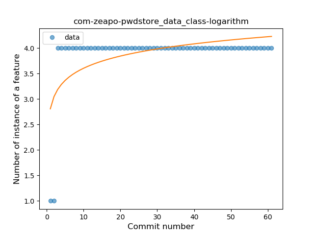

16. org-kiwix-kiwixcustomwikivoyageeurope

	*  Function: 
	* R_Squared: 0.33101253
 

17. com-conorodonnell-bus

	*  Function: 
	* R_Squared: 0.13787107
 

18. sk-styk-martin-apkanalyzer

	*  Function: 
	* R_Squared: 0.12782393
 

19. com-guerinet-mymartlet

	*  Function: 
	* R_Squared: 0.04627992
 

### <a name="T11">Instability</a> 
 ----

1. com-androidheads-vienna-escalero

	*  Function: 
	* R_Squared: 1.0
 

2. com-bracketcove-postrainer

	*  Function: 
	* R_Squared: 0.9952381
 

3. com-rohitsuratekar-NCBSinfo

	*  Function: 
	* R_Squared: 0.96272004
 

4. com-commit451-gitlab

	*  Function: 
	* R_Squared: 0.90606061
 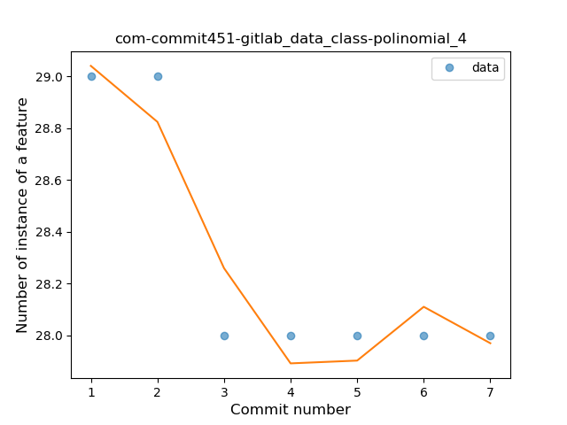

5. college-wyk-app

	*  Function: 
	* R_Squared: 0.86975542
 

6. me-impa-knockonports

	*  Function: 
	* R_Squared: 0.80769228
 

7. fr-insapp-insapp

	*  Function: 
	* R_Squared: 0.75792138
 

### <a name="T10">Plateau Sudden Decline</a> 
 ----

1. co-pxhouse-sas

	*  Function: 
	* R_Squared: 1.0
 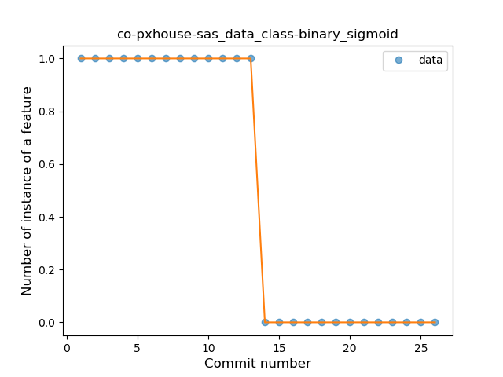

29. me-rei_m-hyakuninisshu

	*  Function: 
	* R_Squared: 0.95812078
 

33. cat-pantsu-nyaapantsu

	*  Function: 
	* R_Squared: 0.88675927
 

34. net-stew-stew

	*  Function: 
	* R_Squared: 0.88571429
 

37. ffc-app

	*  Function: 
	* R_Squared: 0.63002109
 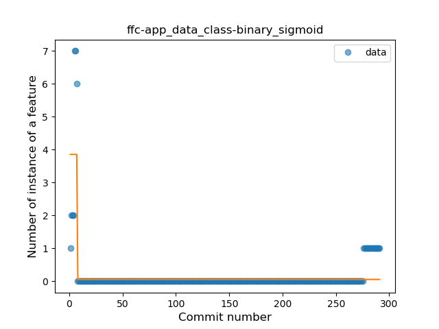

40. de-blankedv-lanbahnpanel

	*  Function: 
	* R_Squared: 0.45387027
 

### <a name="T5">Sudden Decline</a> 
 ----

1. com-alderferstudios-handandfootscores

	*  Function: 
	* R_Squared: 1.0
 

22. com-benny-openlauncher

	*  Function: 
	* R_Squared: 0.77058145
 

24. se-barsk-park

	*  Function: 
	* R_Squared: 0.72421247
 

27. com-calintat-sensors

	*  Function: 
	* R_Squared: 0.63689599
 

28. info-dvkr-screenstream

	*  Function: 
	* R_Squared: 0.58185601
 

### <a name="T2">Constant Decline</a> 
 ----

43. org-mifos-mobile

	*  Function: 
	* R_Squared: 0.52577456
 

46. me-murks-feedwatcher

	*  Function: 
	* R_Squared: 0.30715731
 

### <a name="T3">Stability</a> 
 ----

### <a name="T8">Plateau Gradual Decline</a> 
 ----

