## Destructuring Declaration
----
**Best fit = Plateau Gradual Rise**: 33

Function | N# best fit
----|----
<a href=" #T7">Plateau Gradual Rise</a> | 33
<a href=" #T9">Plateau Sudden Rise</a> | 25
<a href=" #T1">Constant Rise</a> | 23
<a href=" #T10">Plateau Sudden Decline</a> | 16
<a href=" #T4">Sudden Rise</a> | 14
<a href=" #T2">Constant Decline</a> | 9
<a href=" #T6">Sudden Rise Plateau</a> | 9
<a href=" #T5">Sudden Decline</a> | 5
<a href=" #T11">Instability</a> | 5
<a href=" #T8">Plateau Gradual Decline</a> | 4
<a href=" #T3">Stability</a> | 0

### <a name="T7">Plateau Gradual Rise</a> 
 ----

1. de-geeksfactory-opacclient

	*  Function: 
	* R_Squared: 0.98119149
 

2. net-syncthing-lite

	*  Function: 
	* R_Squared: 0.97730369
 

3. com-arcao-geocaching4locus

	*  Function: 
	* R_Squared: 0.97625465
 

4. li-klass-fhem

	*  Function: 
	* R_Squared: 0.97582618
 

5. org-mattvchandler-progressbars

	*  Function: 
	* R_Squared: 0.97274425
 

6. com-guerinet-mymartlet

	*  Function: 
	* R_Squared: 0.96199582
 

7. com-doctoror-particleswallpaper

	*  Function: 
	* R_Squared: 0.95728799
 

8. com-keylesspalace-tusky

	*  Function: 
	* R_Squared: 0.95701081
 

9. one-librem-social

	*  Function: 
	* R_Squared: 0.95679284
 

10. com-benoitquenaudon-tvfoot-red

	*  Function: 
	* R_Squared: 0.95643442
 

11. com-atanana-sicounter

	*  Function: 
	* R_Squared: 0.95195891
 

12. chat-rocket-android

	*  Function: 
	* R_Squared: 0.95021141
 

13. app-opass-ccip

	*  Function: 
	* R_Squared: 0.94932475
 

14. com-jmstudios-redmoon

	*  Function: 
	* R_Squared: 0.93511467
 

15. com-moez-QKSMS

	*  Function: 
	* R_Squared: 0.93012389
 

16. be-mygod-vpnhotspot

	*  Function: 
	* R_Squared: 0.92940065
 

17. com-simplemobiletools-gallery

	*  Function: 
	* R_Squared: 0.92653773
 

18. com-stevenschoen-putionew

	*  Function: 
	* R_Squared: 0.91285782
 

19. ml-adamsprogs-bimba

	*  Function: 
	* R_Squared: 0.88596792
 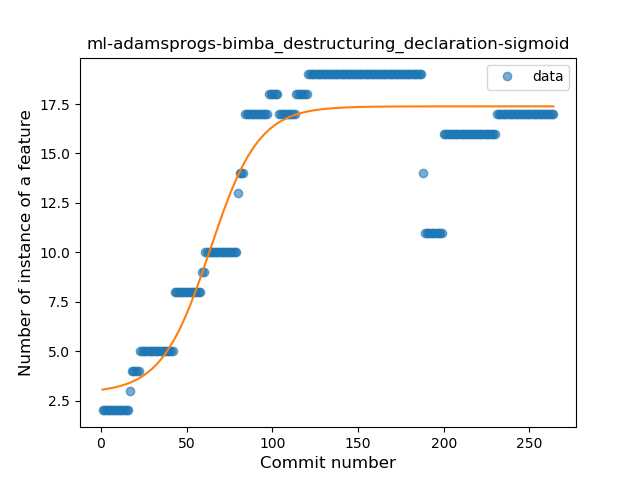

20. org-kaqui

	*  Function: 
	* R_Squared: 0.87486856
 

21. cat-pantsu-nyaapantsu

	*  Function: 
	* R_Squared: 0.8722777
 

22. me-blog-korn123-easydiary

	*  Function: 
	* R_Squared: 0.84989844
 

24. ca-fuwafuwa-kaku

	*  Function: 
	* R_Squared: 0.81745753
 

25. fr-chenry-android-freshrss

	*  Function: 
	* R_Squared: 0.77955836
 

26. me-camsteffen-polite

	*  Function: 
	* R_Squared: 0.76917198
 

28. is-xyz-mpv

	*  Function: 
	* R_Squared: 0.72377642
 

29. com-garpr-android

	*  Function: 
	* R_Squared: 0.71864042
 

30. tech-ula

	*  Function: 
	* R_Squared: 0.69033045
 

31. se-barsk-park

	*  Function: 
	* R_Squared: 0.48748375
 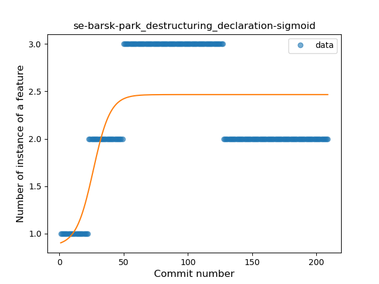

32. org-mosad-seil0-projectlaogai

	*  Function: 
	* R_Squared: 0.34862355
 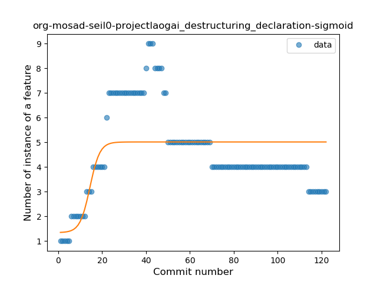

33. de-r4md4c-gamedealz

	*  Function: 
	* R_Squared: 0.29320736
 

34. com-duckduckgo-mobile-android

	*  Function: 
	* R_Squared: 0.27920227
 

36. ai-susi

	*  Function: 
	* R_Squared: 0.18628857
 

### <a name="T9">Plateau Sudden Rise</a> 
 ----

1. ch-abertschi-adfree

	*  Function: 
	* R_Squared: 1.0
 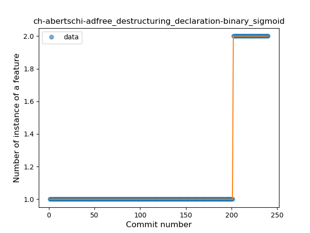

2. co-timecrypt-android

	*  Function: 
	* R_Squared: 1.0
 

5. com-cookiegames-smartcookie

	*  Function: 
	* R_Squared: 1.0
 

7. com-esafirm-androidplayground

	*  Function: 
	* R_Squared: 1.0
 

8. com-etesync-syncadapter

	*  Function: 
	* R_Squared: 1.0
 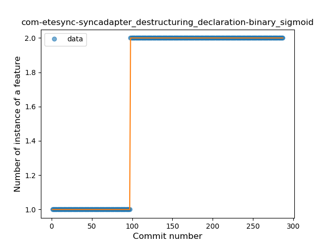

9. com-ids1024-whitakerswords

	*  Function: 
	* R_Squared: 1.0
 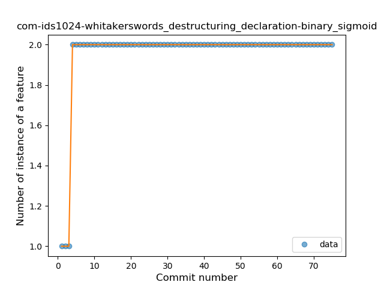

10. com-simplemobiletools-draw

	*  Function: 
	* R_Squared: 1.0
 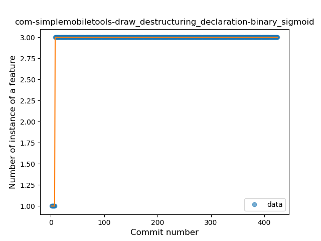

11. com-simplemobiletools-draw-pro

	*  Function: 
	* R_Squared: 1.0
 

12. com-tasomaniac-openwith-floss

	*  Function: 
	* R_Squared: 1.0
 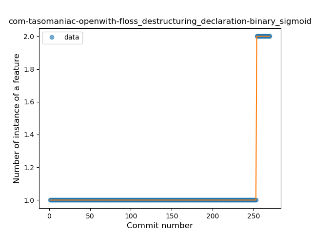

14. eu-depau-etchdroid

	*  Function: 
	* R_Squared: 1.0
 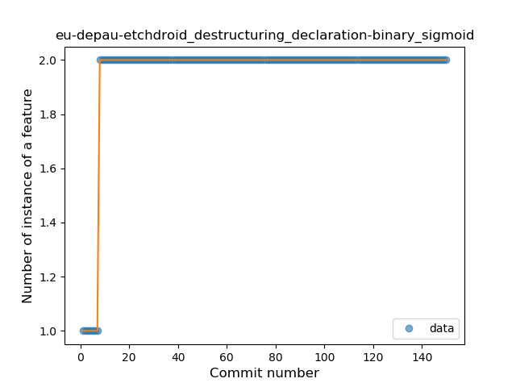

15. fr-insapp-insapp

	*  Function: 
	* R_Squared: 1.0
 

16. io-github-fvasco-pinpoi

	*  Function: 
	* R_Squared: 1.0
 

18. me-anon-grow

	*  Function: 
	* R_Squared: 1.0
 

22. org-ligi-passandroid

	*  Function: 
	* R_Squared: 1.0
 

26. quickbeer-android

	*  Function: 
	* R_Squared: 1.0
 

28. org-mozilla-focus

	*  Function: 
	* R_Squared: 0.99229461
 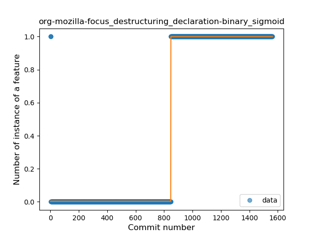

29. org-mozilla-klar

	*  Function: 
	* R_Squared: 0.99229461
 

30. org-isoron-uhabits

	*  Function: 
	* R_Squared: 0.97185372
 

31. me-rei_m-hyakuninisshu

	*  Function: 
	* R_Squared: 0.93546497
 

32. org-emunix-insteadlauncher

	*  Function: 
	* R_Squared: 0.89372795
 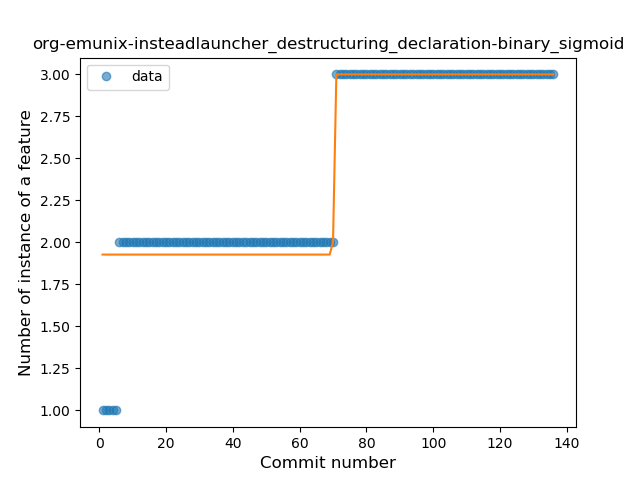

34. fi-kroon-vadret

	*  Function: 
	* R_Squared: 0.78866228
 

35. acr-browser-lightning

	*  Function: 
	* R_Squared: 0.76471748
 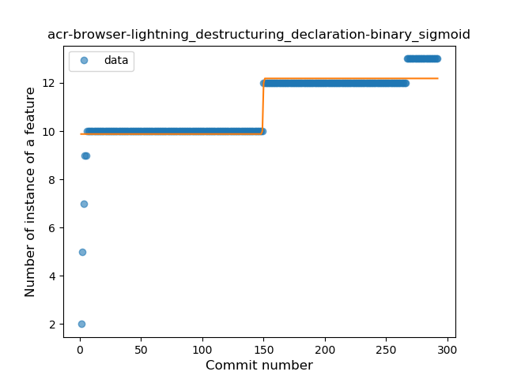

37. com-ofalvai-bpinfo

	*  Function: 
	* R_Squared: 0.66140097
 

39. com-booboot-vndbandroid

	*  Function: 
	* R_Squared: 0.53063049
 

41. apps-amine-bou-readerforselfoss

	*  Function: 
	* R_Squared: 0.08470347
 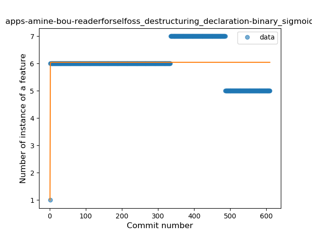

### <a name="T1">Constant Rise</a> 
 ----

1. com-wabadaba-dziennik

	*  Function: 
	* R_Squared: 0.95312566
 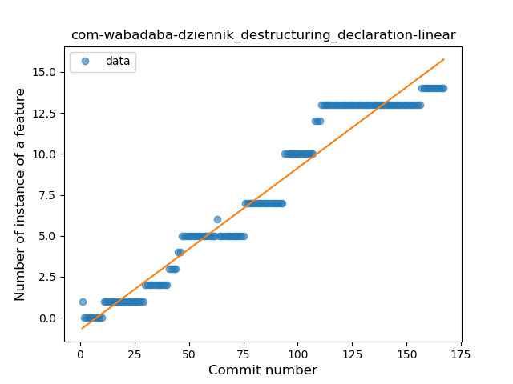

2. eu-kanade-tachiyomi

	*  Function: 
	* R_Squared: 0.93381557
 

3. ch-rmy-android-http_shortcuts

	*  Function: 
	* R_Squared: 0.92901216
 

4. com-github-quarck-calnotify

	*  Function: 
	* R_Squared: 0.92253838
 

5. ca-josephroque-bowlingcompanion

	*  Function: 
	* R_Squared: 0.9035073
 

6. com-fsck-k9

	*  Function: 
	* R_Squared: 0.87535617
 

7. im-vector-alpha

	*  Function: 
	* R_Squared: 0.85113526
 

8. com-lavadip-miniVector

	*  Function: 
	* R_Squared: 0.84710703
 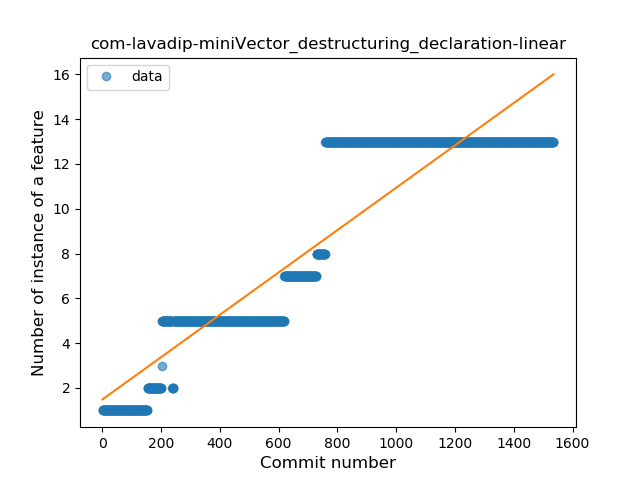

9. io-github-wulkanowy

	*  Function: 
	* R_Squared: 0.82966515
 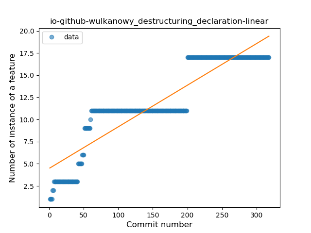

10. com-jim-sharetocomputer

	*  Function: 
	* R_Squared: 0.81618362
 

11. com-orgzly

	*  Function: 
	* R_Squared: 0.77402833
 

12. org-blokada-alarm

	*  Function: 
	* R_Squared: 0.75691089
 

13. com-sjn-stamp

	*  Function: 
	* R_Squared: 0.74697342
 

14. com-simplemobiletools-gallery-pro

	*  Function: 
	* R_Squared: 0.73607491
 

15. org-mozilla-rocket

	*  Function: 
	* R_Squared: 0.7275018
 

16. com-boardgamegeek

	*  Function: 
	* R_Squared: 0.68880716
 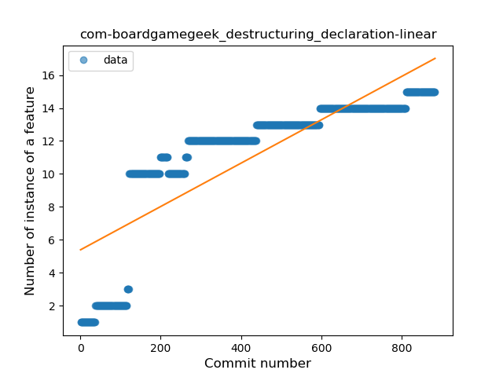

18. com-nononsenseapps-feeder

	*  Function: 
	* R_Squared: 0.65734617
 

19. com-simplemobiletools-contacts-pro

	*  Function: 
	* R_Squared: 0.60507004
 

20. net-osmand-plus

	*  Function: 
	* R_Squared: 0.58743138
 

25. com-pixplicity-cryptogram

	*  Function: 
	* R_Squared: 0.08423837
 

26. apps-jizzu-simpletodo

	*  Function: 
	* R_Squared: 0.07578671
 

29. com-dp-logcatapp

	*  Function: 
	* R_Squared: 0.01955572
 

30. es-usc-citius-servando-calendula

	*  Function: 
	* R_Squared: 0.00393296
 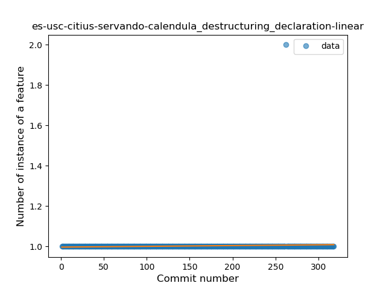

### <a name="T10">Plateau Sudden Decline</a> 
 ----

3. com-benny-openlauncher

	*  Function: 
	* R_Squared: 1.0
 

4. com-calintat-sensors

	*  Function: 
	* R_Squared: 1.0
 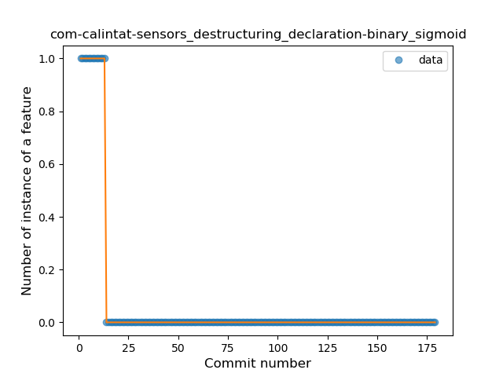

6. com-directdev-portal

	*  Function: 
	* R_Squared: 1.0
 

13. com-utazukin-ichaival

	*  Function: 
	* R_Squared: 1.0
 

17. jp-cordea-mackerelclient

	*  Function: 
	* R_Squared: 1.0
 

19. net-yslibrary-monotweety

	*  Function: 
	* R_Squared: 1.0
 

20. org-fossasia-badgemagic

	*  Function: 
	* R_Squared: 1.0
 

21. org-kiwix-kiwixcustomwikivoyageeurope

	*  Function: 
	* R_Squared: 1.0
 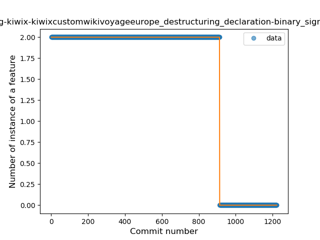

23. org-weilbach-splitbills

	*  Function: 
	* R_Squared: 1.0
 

24. org-zimmob-zimlx

	*  Function: 
	* R_Squared: 1.0
 

25. pl-hypeapp-episodie

	*  Function: 
	* R_Squared: 1.0
 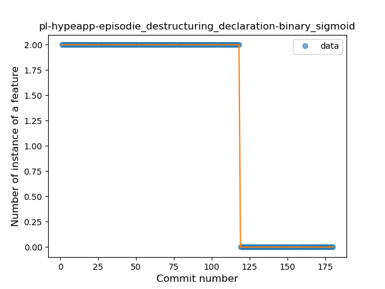

27. science-apolline

	*  Function: 
	* R_Squared: 1.0
 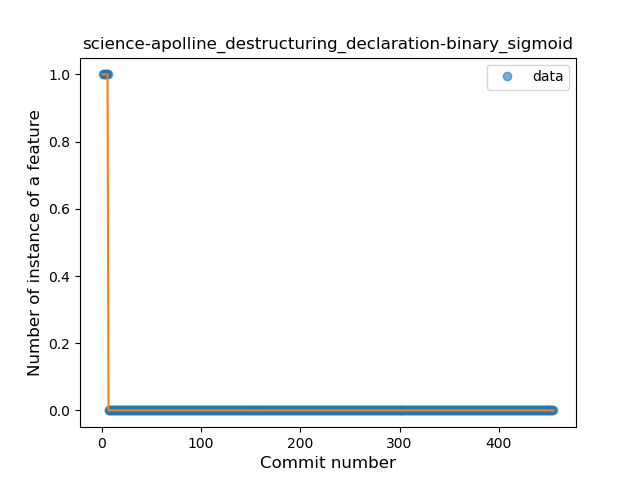

33. ch-deletescape-lawnchair-plah

	*  Function: 
	* R_Squared: 0.83798963
 

36. com-bubelov-coins

	*  Function: 
	* R_Squared: 0.72314989
 

38. jp-org-example-geckour-glyph

	*  Function: 
	* R_Squared: 0.64356188
 

40. it-diab

	*  Function: 
	* R_Squared: 0.3554534
 

### <a name="T4">Sudden Rise</a> 
 ----

2. org-mariotaku-twidere

	*  Function: 
	* R_Squared: 0.97613311
 

3. io-ipoli-android

	*  Function: 
	* R_Squared: 0.93640189
 

4. me-proxer-app

	*  Function: 
	* R_Squared: 0.93244129
 

5. net-bible-android-activity

	*  Function: 
	* R_Squared: 0.88420222
 

6. org-eurofurence-connavigator

	*  Function: 
	* R_Squared: 0.87803933
 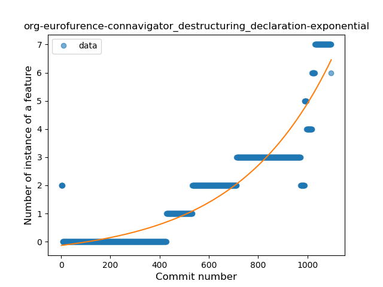

7. ru-hyst329-openfool

	*  Function: 
	* R_Squared: 0.87495655
 

8. com-jereksel-libresubstratum

	*  Function: 
	* R_Squared: 0.83019453
 

9. de-westnordost-streetcomplete

	*  Function: 
	* R_Squared: 0.82501497
 

12. nl-mpcjanssen-simpletask

	*  Function: 
	* R_Squared: 0.78967532
 

14. com-eventyay-attendee

	*  Function: 
	* R_Squared: 0.67226294
 

15. com-czbix-v2ex

	*  Function: 
	* R_Squared: 0.66777925
 

17. com-bernaferrari-changedetection

	*  Function: 
	* R_Squared: 0.30922004
 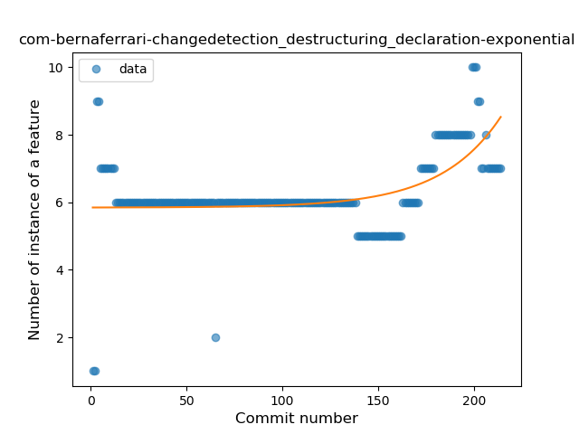

18. org-equeim-tremotesf

	*  Function: 
	* R_Squared: 0.16154666
 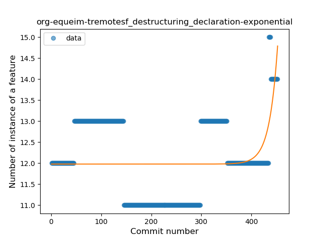

19. superustats-tool-android

	*  Function: 
	* R_Squared: 0.1307606
 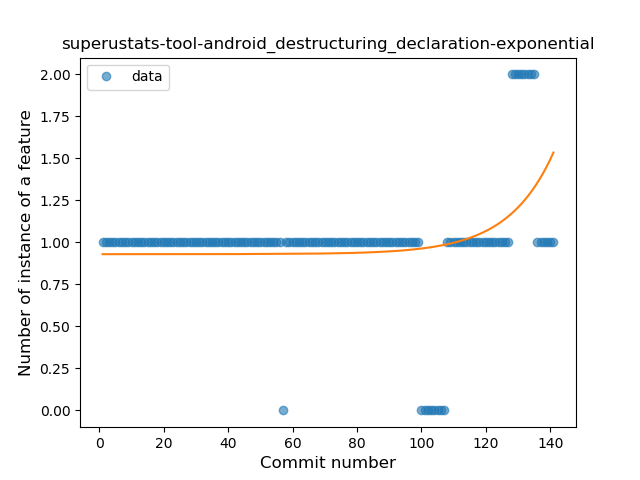

### <a name="T2">Constant Decline</a> 
 ----

17. net-kourlas-voipms

	*  Function: 
	* R_Squared: 0.68449367
 

21. com-simplemobiletools-applauncher

	*  Function: 
	* R_Squared: 0.51553702
 

22. com-github-moko256-twitlatte

	*  Function: 
	* R_Squared: 0.42521245
 

23. at-bitfire-davdroid

	*  Function: 
	* R_Squared: 0.41339134
 

24. de-ironjan-mensaupb

	*  Function: 
	* R_Squared: 0.2227853
 

27. com-loloof64-android-basicchessendgamestrainer

	*  Function: 
	* R_Squared: 0.05783244
 

28. nl-brouwerijdemolen-borefts2013

	*  Function: 
	* R_Squared: 0.03287311
 

31. at-bitfire-icsdroid

	*  Function: 
	* R_Squared: 0.00139364
 

32. com-simplemobiletools-calendar-pro

	*  Function: 
	* R_Squared: 0.00016752
 

### <a name="T6">Sudden Rise Plateau</a> 
 ----

1. de-markusfisch-android-binaryeye

	*  Function: 
	* R_Squared: 0.82889534
 

2. com-pitchedapps-frost

	*  Function: 
	* R_Squared: 0.81269057
 

3. info-papdt-express-helper

	*  Function: 
	* R_Squared: 0.80189312
 

4. net-nurik-roman-muzei

	*  Function: 
	* R_Squared: 0.51857827
 

5. com-peterlaurence-trekme

	*  Function: 
	* R_Squared: 0.40569483
 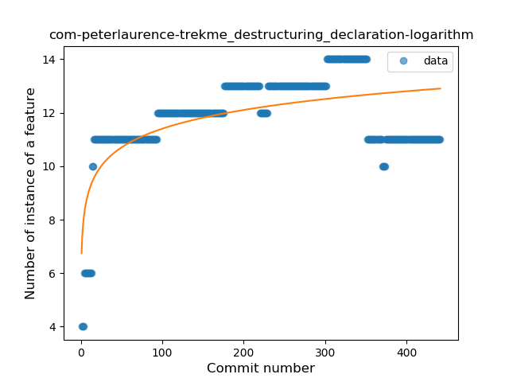

6. fr-cph-chicago-foss

	*  Function: 
	* R_Squared: 0.24976292
 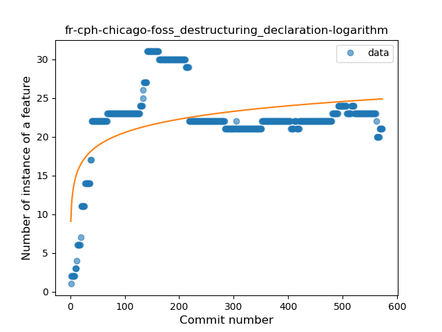

7. de-blankedv-lanbahnpanel

	*  Function: 
	* R_Squared: 0.16773545
 

8. sk-styk-martin-apkanalyzer

	*  Function: 
	* R_Squared: 0.11586566
 

9. com-yubico-yubioath

	*  Function: 
	* R_Squared: 0.10137829
 

### <a name="T5">Sudden Decline</a> 
 ----

1. moe-feng-nhentai

	*  Function: 
	* R_Squared: 1.0
 

10. com-tumblr-svetylk0-sheepsgohome-android

	*  Function: 
	* R_Squared: 0.81824738
 

11. io-github-feelfreelinux-wykopmobilny

	*  Function: 
	* R_Squared: 0.796152
 

13. net-mm2d-dmsexplorer

	*  Function: 
	* R_Squared: 0.74081779
 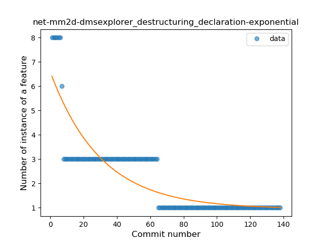

16. info-dvkr-screenstream

	*  Function: 
	* R_Squared: 0.31878792
 

### <a name="T11">Instability</a> 
 ----

1. ru-nsu-bobrofon-easysshfs

	*  Function: 
	* R_Squared: 0.93006993
 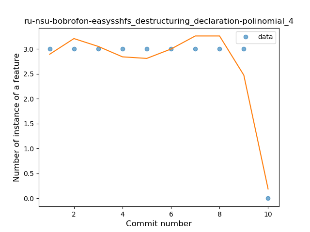

2. com-androidheads-vienna-escalero

	*  Function: 
	* R_Squared: 0.88349885
 

### <a name="T8">Plateau Gradual Decline</a> 
 ----

23. com-github-premnirmal-tickerwidget

	*  Function: 
	* R_Squared: 0.83544346
 

27. eu-the4thfloor-msync

	*  Function: 
	* R_Squared: 0.76076856
 

35. com-ogsdroid

	*  Function: 
	* R_Squared: 0.20095368
 

37. de-ph1b-audiobook

	*  Function: 
	* R_Squared: 0.04891508
 

### <a name="T3">Stability</a> 
 ----

