## Extension Function
----
**Best fit = Constant Rise**: 47

Function | N# best fit
----|----
<a href=" #T1">Constant Rise</a> | 47
<a href=" #T7">Plateau Gradual Rise</a> | 42
<a href=" #T4">Sudden Rise</a> | 32
<a href=" #T6">Sudden Rise Plateau</a> | 23
<a href=" #T9">Plateau Sudden Rise</a> | 22
<a href=" #T11">Instability</a> | 16
<a href=" #T5">Sudden Decline</a> | 7
<a href=" #T10">Plateau Sudden Decline</a> | 7
<a href=" #T2">Constant Decline</a> | 4
<a href=" #T8">Plateau Gradual Decline</a> | 1
<a href=" #T3">Stability</a> | 0

### <a name="T1">Constant Rise</a> 
 ----

1. com-booboot-vndbandroid

	*  Function: 
	* R_Squared: 0.98510686
 

2. org-mariotaku-twidere

	*  Function: 
	* R_Squared: 0.97863731
 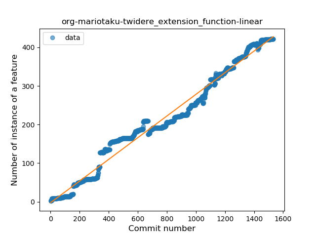

3. ffc-app

	*  Function: 
	* R_Squared: 0.97578068
 

4. com-simplemobiletools-contacts-pro

	*  Function: 
	* R_Squared: 0.97528826
 

5. com-duckduckgo-mobile-android

	*  Function: 
	* R_Squared: 0.97393594
 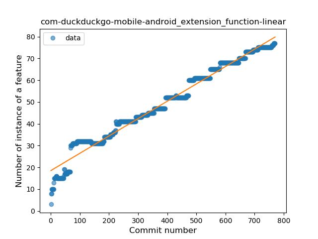

6. com-boardgamegeek

	*  Function: 
	* R_Squared: 0.96647018
 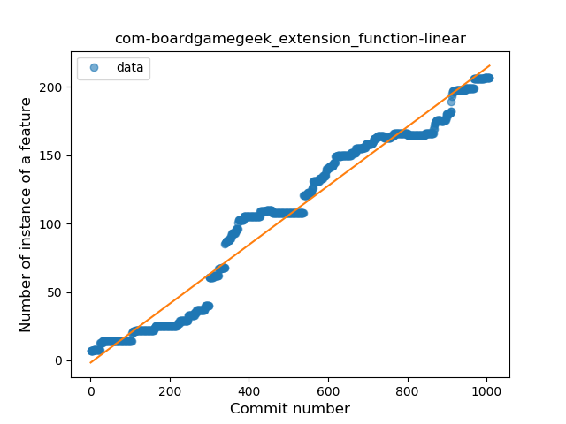

7. me-proxer-app

	*  Function: 
	* R_Squared: 0.9664094
 

8. org-mozilla-rocket

	*  Function: 
	* R_Squared: 0.9602668
 

9. org-pacien-tincapp

	*  Function: 
	* R_Squared: 0.95893559
 

10. com-tasomaniac-openwith-floss

	*  Function: 
	* R_Squared: 0.94863393
 

11. org-walleth

	*  Function: 
	* R_Squared: 0.94469898
 

12. com-github-moko256-twitlatte

	*  Function: 
	* R_Squared: 0.94061346
 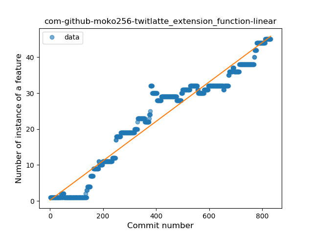

13. com-glodanif-bluetoothchat

	*  Function: 
	* R_Squared: 0.93771291
 

14. pl-hypeapp-episodie

	*  Function: 
	* R_Squared: 0.93335418
 

15. chat-rocket-android

	*  Function: 
	* R_Squared: 0.92666235
 

16. pl-org-seva-navigator

	*  Function: 
	* R_Squared: 0.91897565
 

17. info-metadude-android-congress-schedule

	*  Function: 
	* R_Squared: 0.91801237
 

18. de-avpptr-umweltzone

	*  Function: 
	* R_Squared: 0.91292376
 

19. com-jereksel-libresubstratum

	*  Function: 
	* R_Squared: 0.91262829
 

20. org-eurofurence-connavigator

	*  Function: 
	* R_Squared: 0.90644185
 

21. com-simplemobiletools-gallery-pro

	*  Function: 
	* R_Squared: 0.90348331
 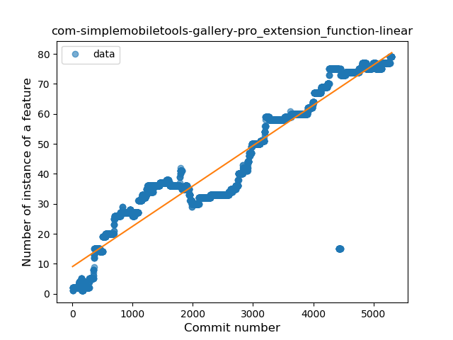

22. com-jim-sharetocomputer

	*  Function: 
	* R_Squared: 0.88404327
 

23. de-r4md4c-gamedealz

	*  Function: 
	* R_Squared: 0.881405
 

24. one-librem-social

	*  Function: 
	* R_Squared: 0.87623018
 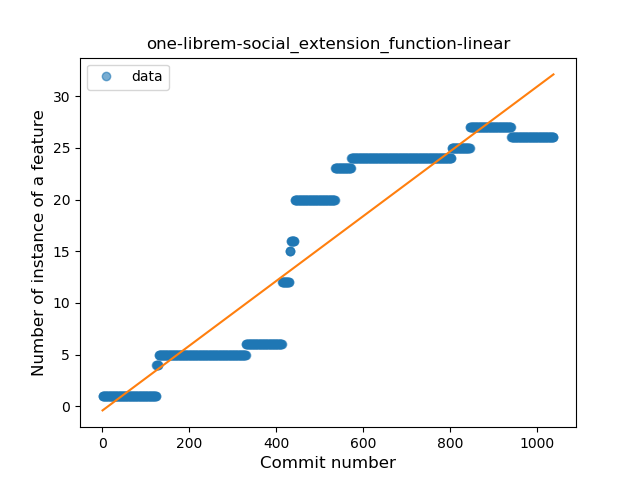

25. com-keylesspalace-tusky

	*  Function: 
	* R_Squared: 0.86796369
 

26. org-blokada-alarm

	*  Function: 
	* R_Squared: 0.86509794
 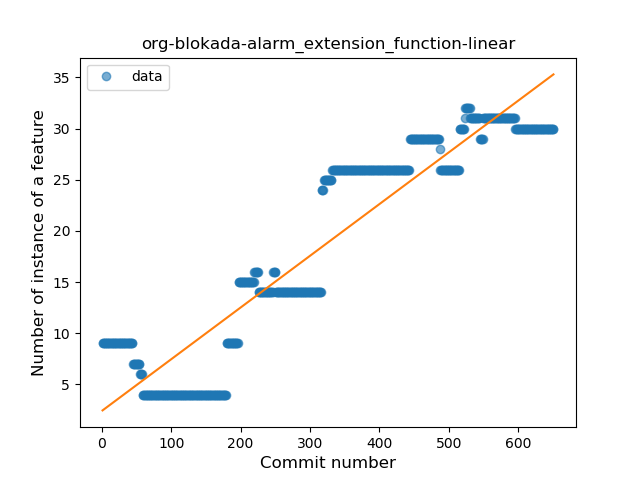

27. com-fsck-k9

	*  Function: 
	* R_Squared: 0.86003332
 

28. fr-cph-chicago-foss

	*  Function: 
	* R_Squared: 0.85589463
 

29. ca-josephroque-bowlingcompanion

	*  Function: 
	* R_Squared: 0.85531746
 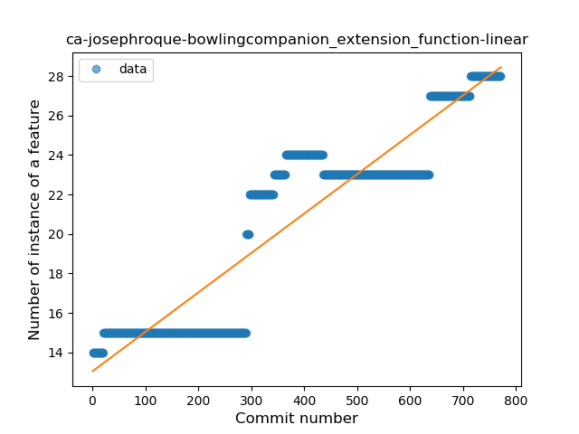

30. com-benoitquenaudon-tvfoot-red

	*  Function: 
	* R_Squared: 0.84664068
 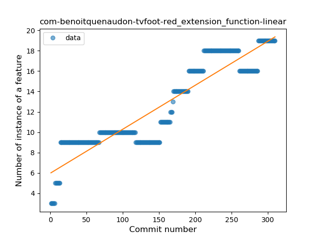

31. de-grobox-liberario

	*  Function: 
	* R_Squared: 0.80209341
 

32. me-blog-korn123-easydiary

	*  Function: 
	* R_Squared: 0.79769691
 

33. org-emunix-insteadlauncher

	*  Function: 
	* R_Squared: 0.79661095
 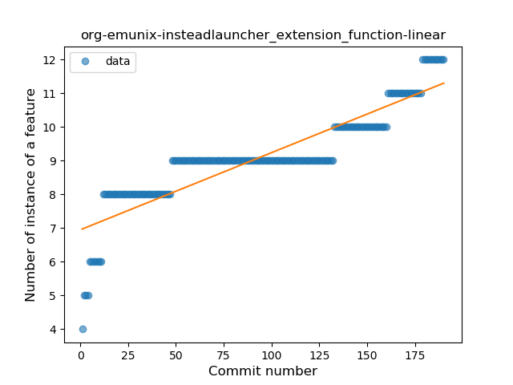

34. com-pitchedapps-frost

	*  Function: 
	* R_Squared: 0.78687538
 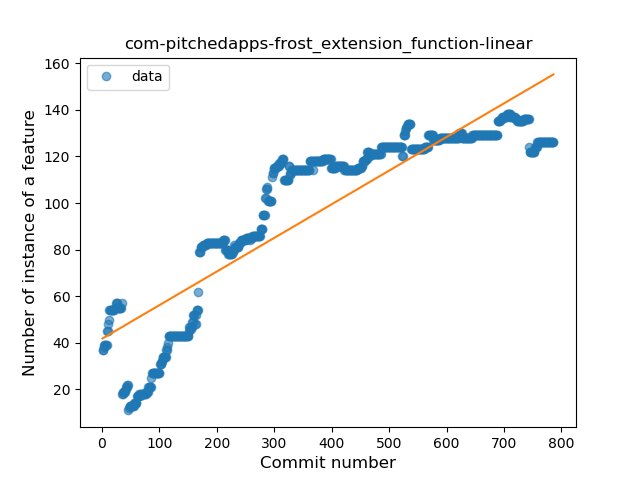

35. net-nurik-roman-muzei

	*  Function: 
	* R_Squared: 0.78477901
 

36. com-uncmorfi

	*  Function: 
	* R_Squared: 0.77225053
 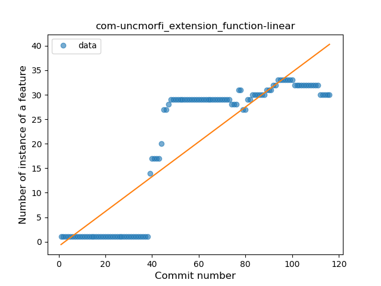

37. com-peterlaurence-trekme

	*  Function: 
	* R_Squared: 0.77109841
 

38. de-ph1b-audiobook

	*  Function: 
	* R_Squared: 0.77009757
 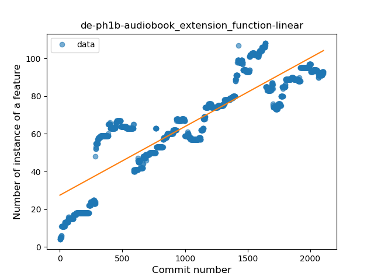

39. fi-kroon-vadret

	*  Function: 
	* R_Squared: 0.74524869
 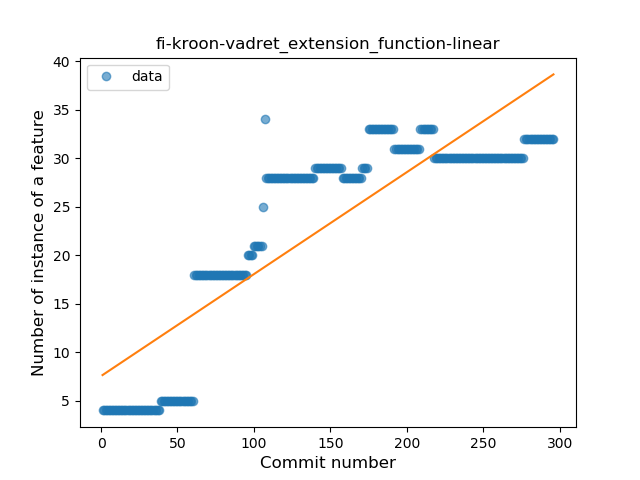

41. com-calintat-units

	*  Function: 
	* R_Squared: 0.69682063
 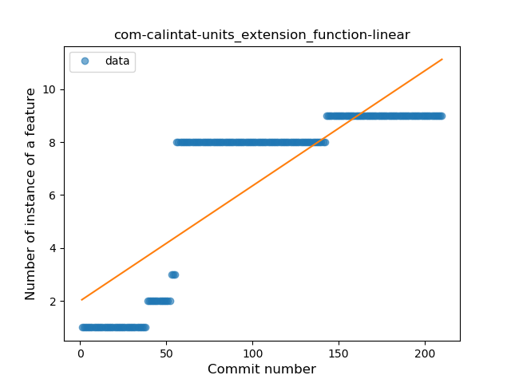

42. com-commit451-gitlab

	*  Function: 
	* R_Squared: 0.68427628
 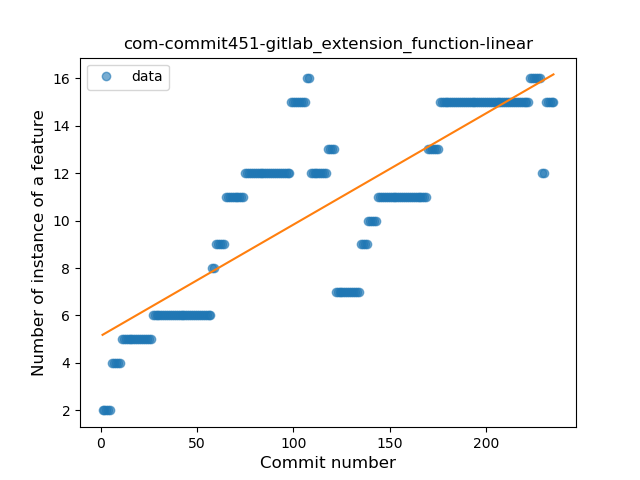

43. sk-styk-martin-apkanalyzer

	*  Function: 
	* R_Squared: 0.67213473
 

44. com-simplemobiletools-calendar-pro

	*  Function: 
	* R_Squared: 0.66622722
 

45. com-simplemobiletools-gallery

	*  Function: 
	* R_Squared: 0.66009621
 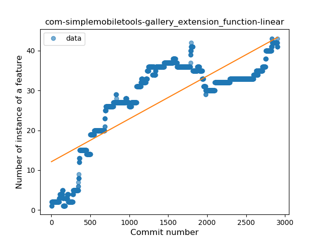

46. com-bubelov-coins

	*  Function: 
	* R_Squared: 0.65854758
 

47. com-bijoysingh-quicknote

	*  Function: 
	* R_Squared: 0.61790414
 

48. com-czbix-v2ex

	*  Function: 
	* R_Squared: 0.61315061
 

### <a name="T7">Plateau Gradual Rise</a> 
 ----

1. at-bitfire-davdroid

	*  Function: 
	* R_Squared: 0.99183936
 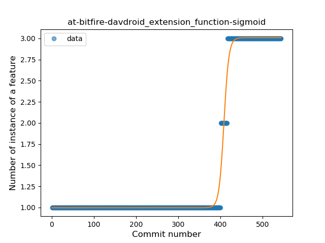

2. net-frju-flym

	*  Function: 
	* R_Squared: 0.98630019
 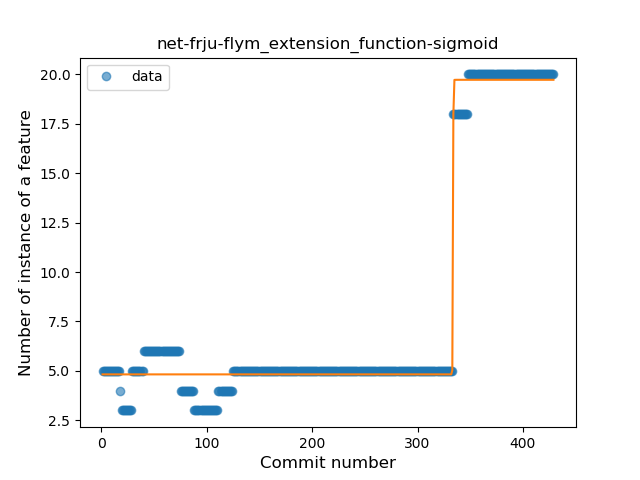

3. pixel-kotlin-bassblog

	*  Function: 
	* R_Squared: 0.9830751
 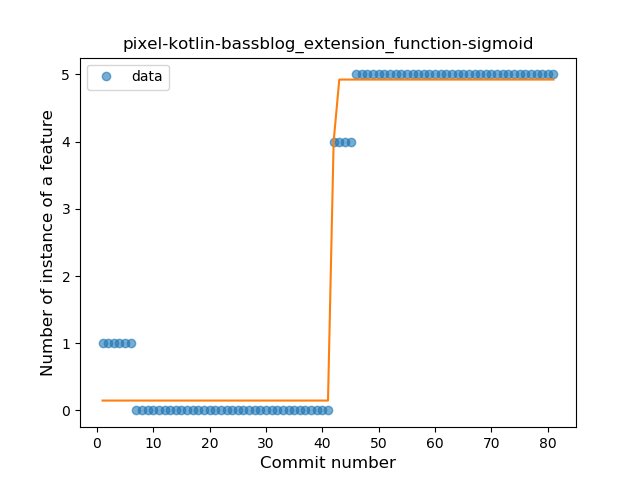

4. com-orgzly

	*  Function: 
	* R_Squared: 0.98203078
 

5. com-nextcloud-talk2

	*  Function: 
	* R_Squared: 0.98077793
 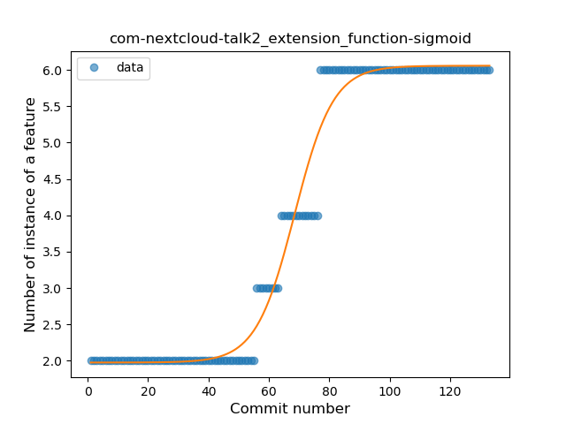

6. org-equeim-tremotesf

	*  Function: 
	* R_Squared: 0.97576032
 

7. org-ligi-survivalmanual

	*  Function: 
	* R_Squared: 0.97326296
 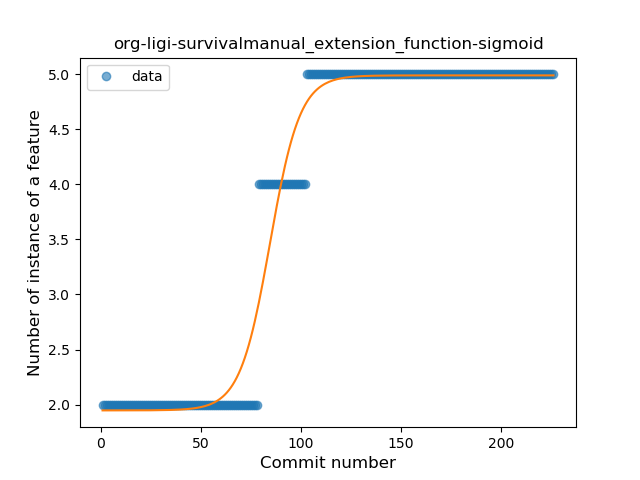

8. ml-adamsprogs-bimba

	*  Function: 
	* R_Squared: 0.97144362
 

9. me-barta-stayintouch

	*  Function: 
	* R_Squared: 0.96506593
 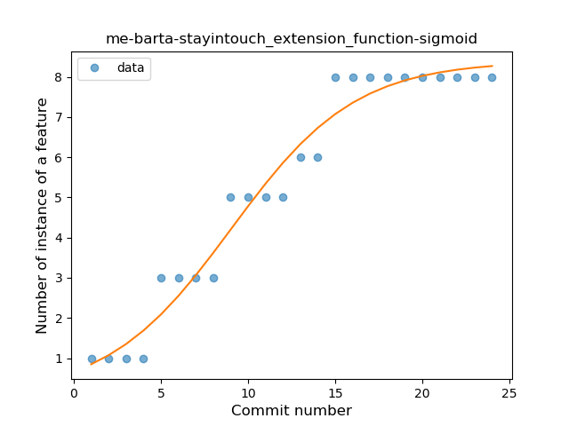

10. com-wabadaba-dziennik

	*  Function: 
	* R_Squared: 0.96429827
 

11. com-mgaetan89-showsrage

	*  Function: 
	* R_Squared: 0.95869526
 

12. com-jmstudios-redmoon

	*  Function: 
	* R_Squared: 0.95766936
 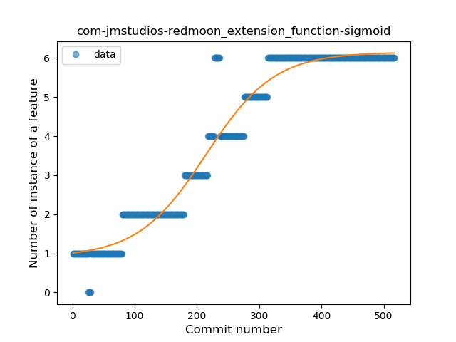

13. com-adityakamble49-dcipher

	*  Function: 
	* R_Squared: 0.95654716
 

14. me-camsteffen-polite

	*  Function: 
	* R_Squared: 0.9534691
 

15. be-mygod-vpnhotspot

	*  Function: 
	* R_Squared: 0.95179565
 

16. nl-mpcjanssen-simpletask

	*  Function: 
	* R_Squared: 0.94876384
 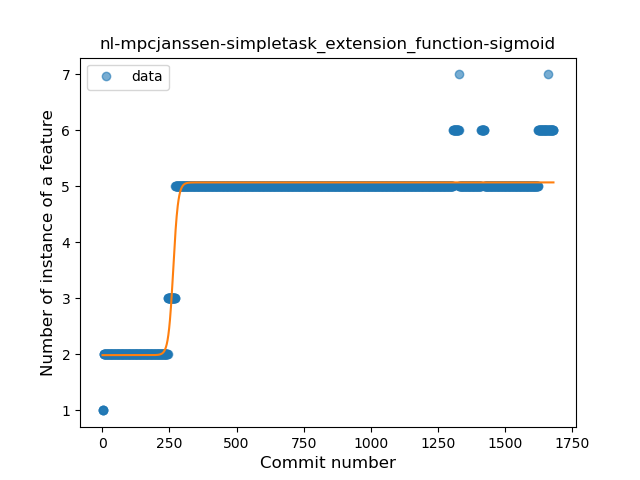

17. de-markusfisch-android-binaryeye

	*  Function: 
	* R_Squared: 0.94274447
 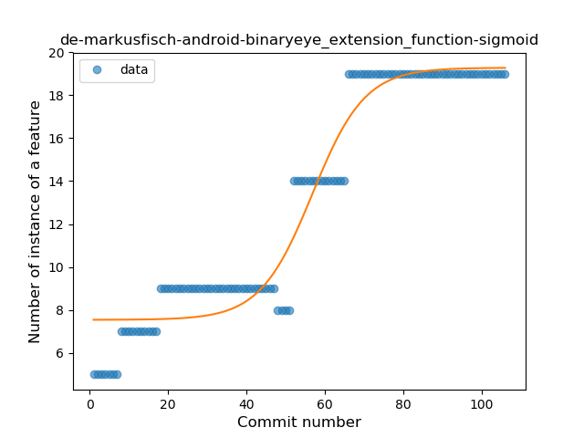

18. com-log28

	*  Function: 
	* R_Squared: 0.93981093
 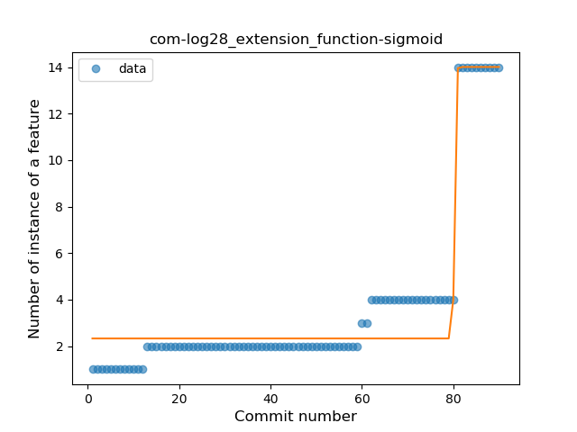

19. com-example-forgottenumbrella-cardboardmuseum

	*  Function: 
	* R_Squared: 0.93845735
 

20. com-adityakamble49-ttl

	*  Function: 
	* R_Squared: 0.93555889
 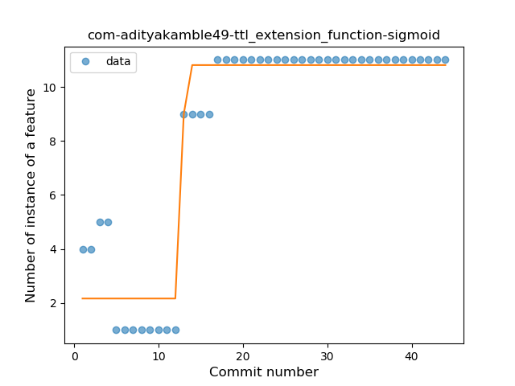

21. pl-temomuko-autostoprace

	*  Function: 
	* R_Squared: 0.93415625
 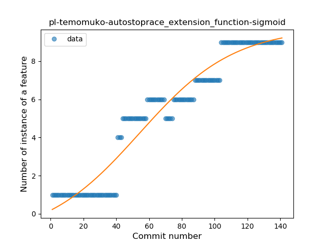

22. pl-org-seva-texter

	*  Function: 
	* R_Squared: 0.9302344
 

23. net-mm2d-dmsexplorer

	*  Function: 
	* R_Squared: 0.92969592
 

24. sreich-countthedays

	*  Function: 
	* R_Squared: 0.92712249
 

25. de-thecode-android-tazreader

	*  Function: 
	* R_Squared: 0.92155145
 

26. info-papdt-express-helper

	*  Function: 
	* R_Squared: 0.91090267
 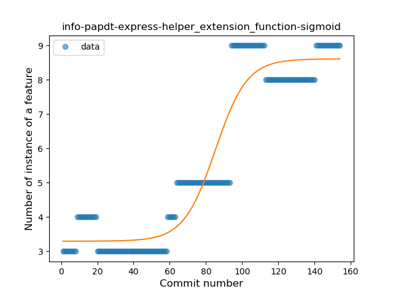

27. com-guerinet-mymartlet

	*  Function: 
	* R_Squared: 0.90398888
 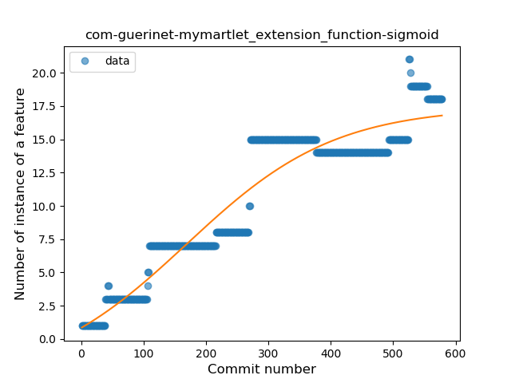

28. com-njlabs-showjava

	*  Function: 
	* R_Squared: 0.90039439
 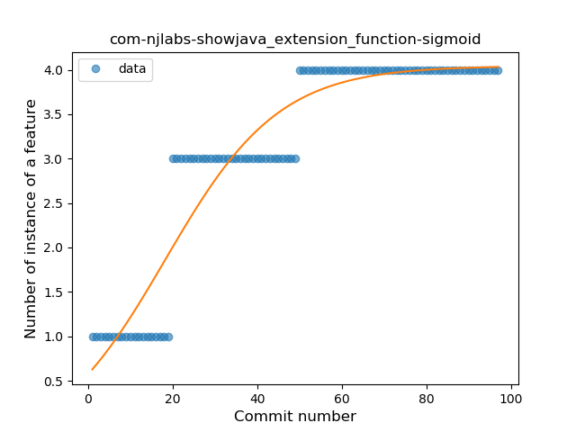

29. jp-cordea-mackerelclient

	*  Function: 
	* R_Squared: 0.88634421
 

30. org-mozilla-focus

	*  Function: 
	* R_Squared: 0.88106319
 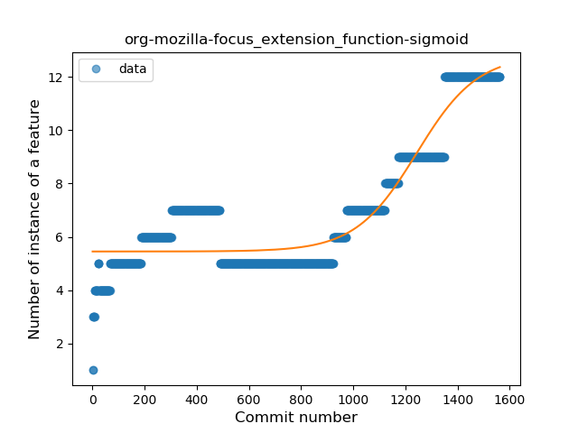

31. org-mozilla-klar

	*  Function: 
	* R_Squared: 0.88106319
 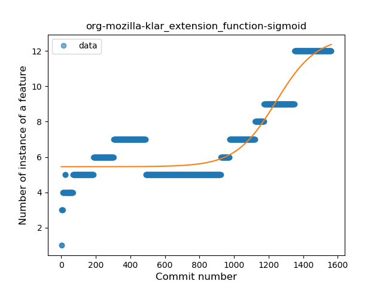

32. com-simplemobiletools-musicplayer

	*  Function: 
	* R_Squared: 0.87699607
 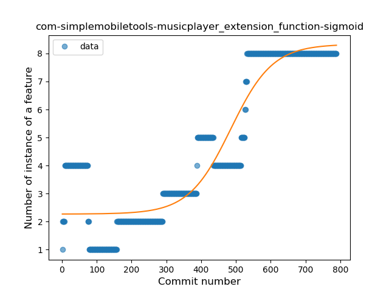

33. com-directdev-portal

	*  Function: 
	* R_Squared: 0.84416965
 

34. com-kgurgul-cpuinfo

	*  Function: 
	* R_Squared: 0.83803081
 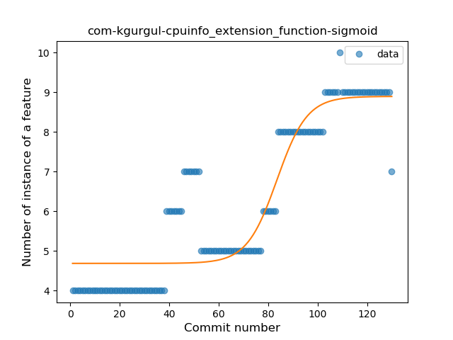

35. io-github-feelfreelinux-wykopmobilny

	*  Function: 
	* R_Squared: 0.83203974
 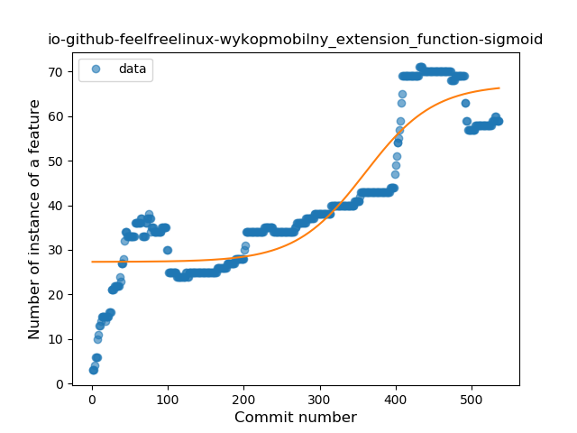

36. com-yubico-yubioath

	*  Function: 
	* R_Squared: 0.83125629
 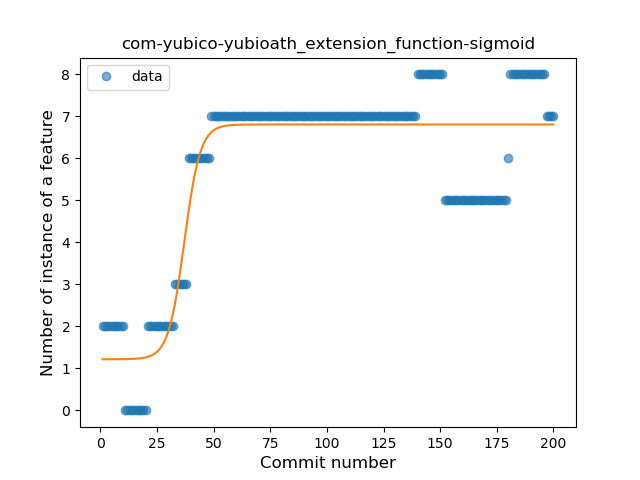

37. com-zeapo-pwdstore

	*  Function: 
	* R_Squared: 0.82534567
 

38. org-anibyl-slounik

	*  Function: 
	* R_Squared: 0.78213549
 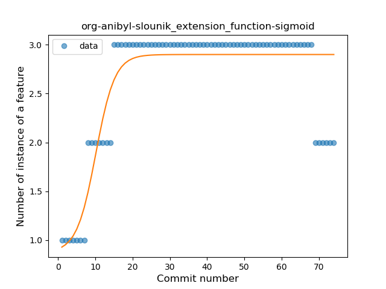

39. pt-ipleiria-mymusicqoe

	*  Function: 
	* R_Squared: 0.75605695
 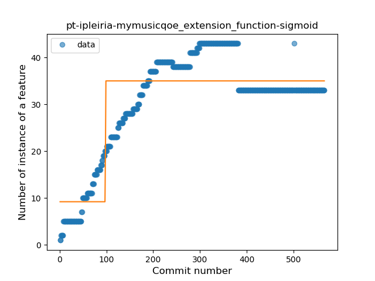

41. com-calintat-sensors

	*  Function: 
	* R_Squared: 0.52416783
 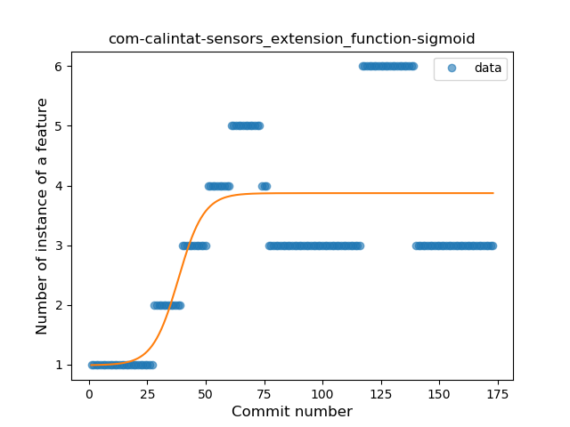

42. it-diab

	*  Function: 
	* R_Squared: 0.43017399
 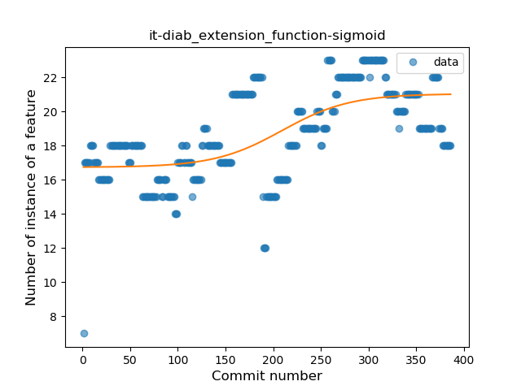

43. com-simplemobiletools-camera

	*  Function: 
	* R_Squared: 0.23932055
 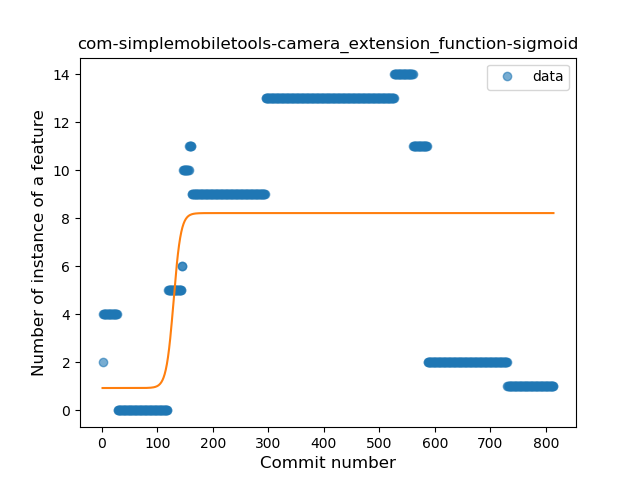

### <a name="T4">Sudden Rise</a> 
 ----

2. eu-kanade-tachiyomi

	*  Function: 
	* R_Squared: 0.98162653
 

3. ch-deletescape-lawnchair-plah

	*  Function: 
	* R_Squared: 0.96841939
 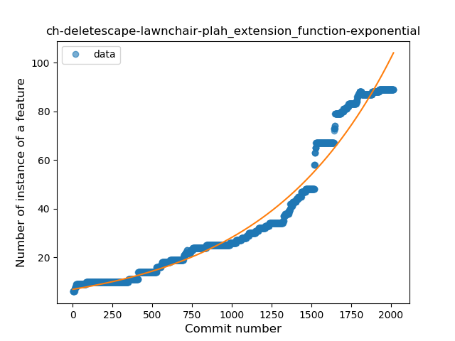

4. xyz-hisname-fireflyiii

	*  Function: 
	* R_Squared: 0.96492524
 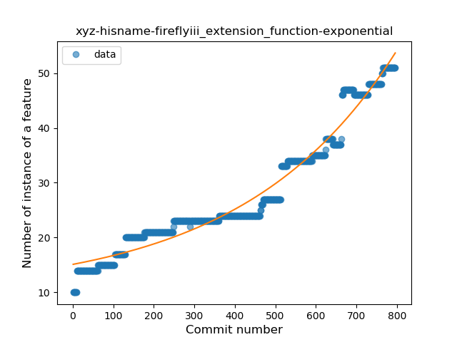

5. acr-browser-lightning

	*  Function: 
	* R_Squared: 0.96396618
 

6. im-vector-alpha

	*  Function: 
	* R_Squared: 0.95999829
 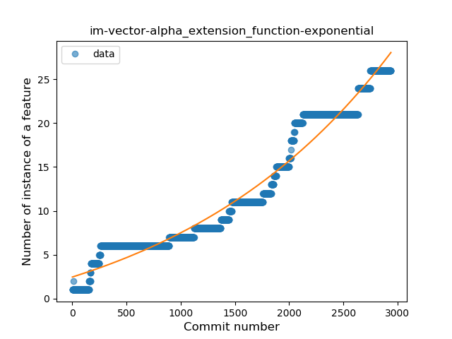

7. com-lavadip-miniVector

	*  Function: 
	* R_Squared: 0.9585338
 

8. de-westnordost-streetcomplete

	*  Function: 
	* R_Squared: 0.94868085
 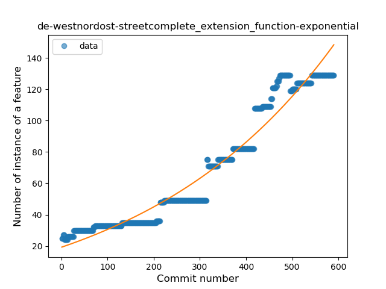

9. com-eventyay-attendee

	*  Function: 
	* R_Squared: 0.94653888
 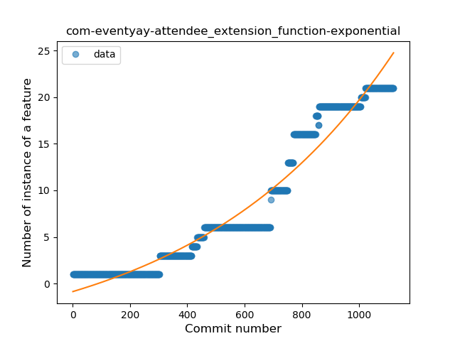

10. com-sjn-stamp

	*  Function: 
	* R_Squared: 0.93973916
 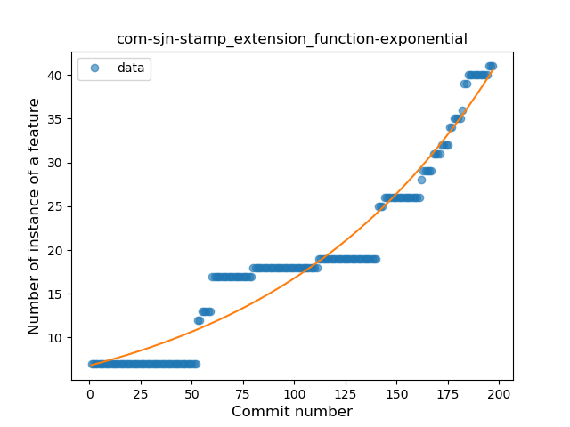

11. org-kaqui

	*  Function: 
	* R_Squared: 0.93543061
 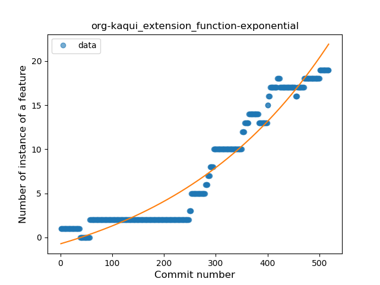

12. apps-amine-bou-readerforselfoss

	*  Function: 
	* R_Squared: 0.9310642
 

13. com-esafirm-androidplayground

	*  Function: 
	* R_Squared: 0.92647206
 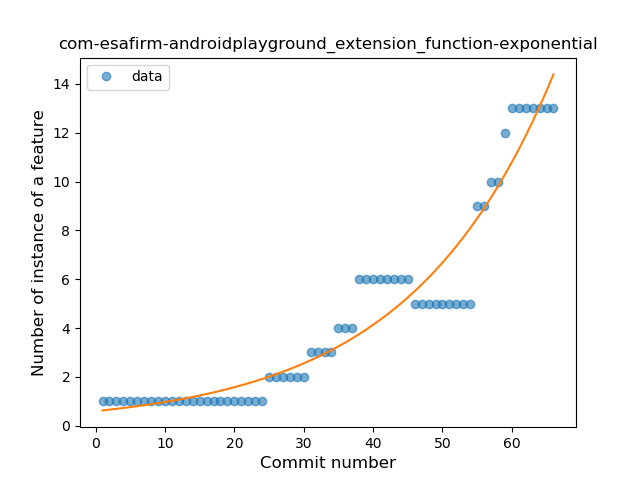

14. com-loloof64-android-basicchessendgamestrainer

	*  Function: 
	* R_Squared: 0.92437737
 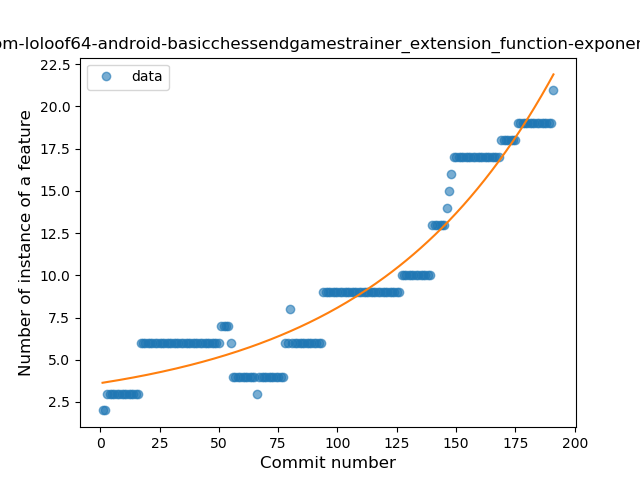

15. io-ipoli-android

	*  Function: 
	* R_Squared: 0.88852164
 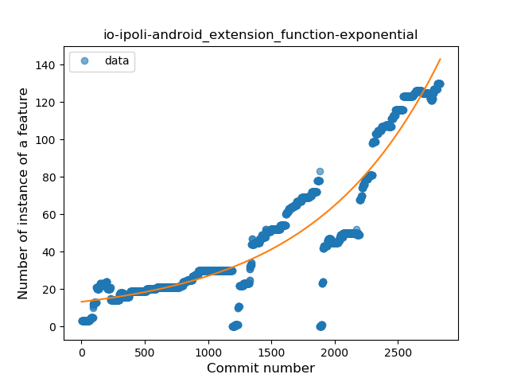

16. io-github-fvasco-pinpoi

	*  Function: 
	* R_Squared: 0.88843327
 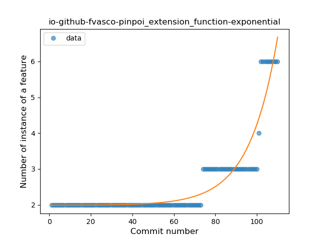

17. de-Maxr1998-xposed-maxlock

	*  Function: 
	* R_Squared: 0.8814051
 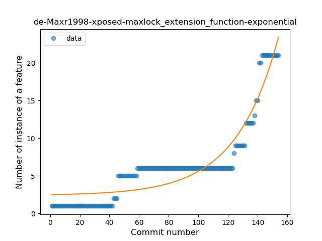

19. me-anon-grow

	*  Function: 
	* R_Squared: 0.88093972
 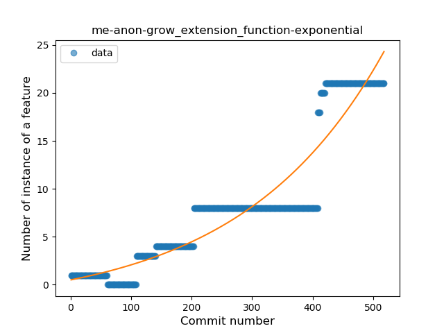

20. me-echeung-moemoekyun-fdroid

	*  Function: 
	* R_Squared: 0.87746151
 

21. com-github-quarck-calnotify

	*  Function: 
	* R_Squared: 0.86991743
 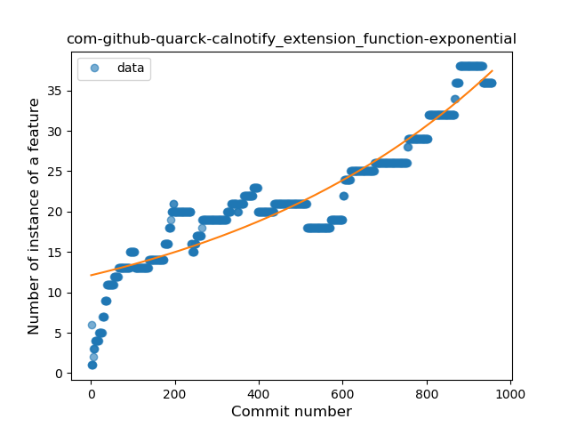

22. li-klass-fhem

	*  Function: 
	* R_Squared: 0.85289413
 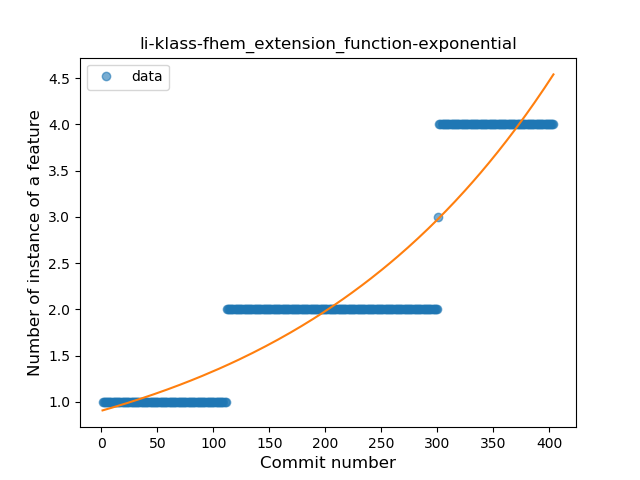

23. com-bernaferrari-changedetection

	*  Function: 
	* R_Squared: 0.84489394
 

25. org-zimmob-zimlx

	*  Function: 
	* R_Squared: 0.80711475
 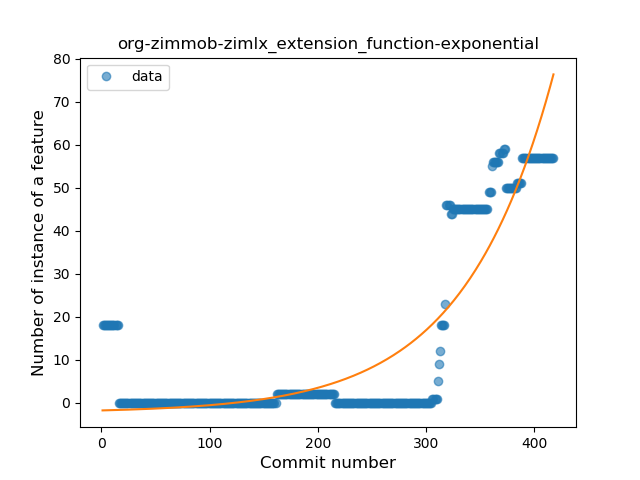

26. org-isoron-uhabits

	*  Function: 
	* R_Squared: 0.80003908
 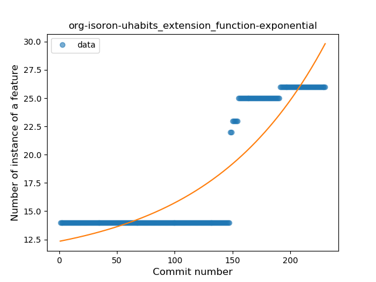

27. apps-jizzu-simpletodo

	*  Function: 
	* R_Squared: 0.7657238
 

30. tech-ula

	*  Function: 
	* R_Squared: 0.69464685
 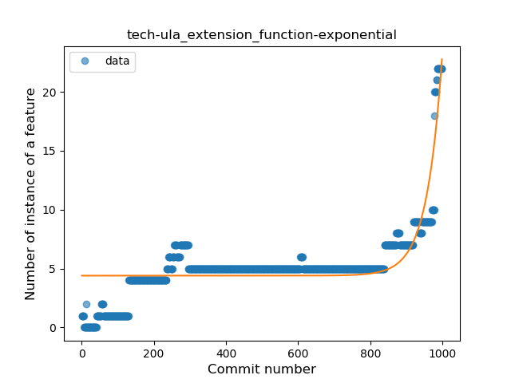

31. fr-chenry-android-freshrss

	*  Function: 
	* R_Squared: 0.67197823
 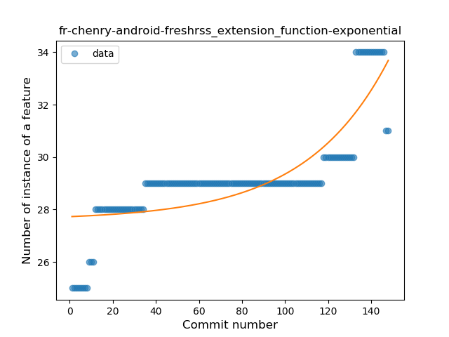

32. com-doctoror-particleswallpaper

	*  Function: 
	* R_Squared: 0.66968407
 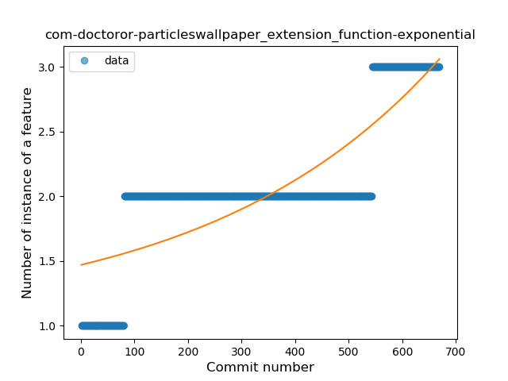

33. com-github-vase4kin-teamcityapp

	*  Function: 
	* R_Squared: 0.64348463
 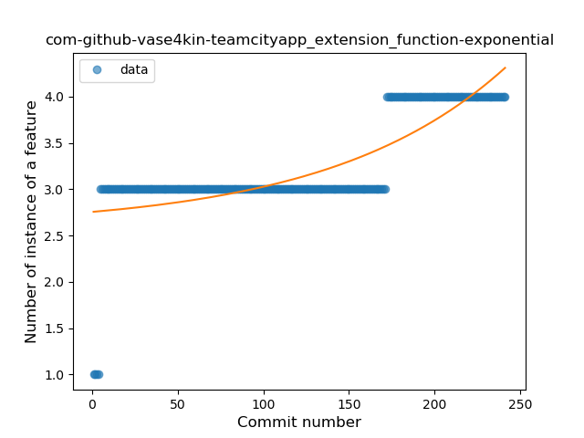

34. org-ligi-gobandroid

	*  Function: 
	* R_Squared: 0.64159539
 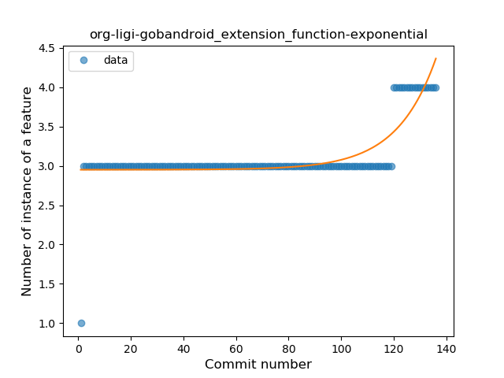

35. com-ofalvai-bpinfo

	*  Function: 
	* R_Squared: 0.53584968
 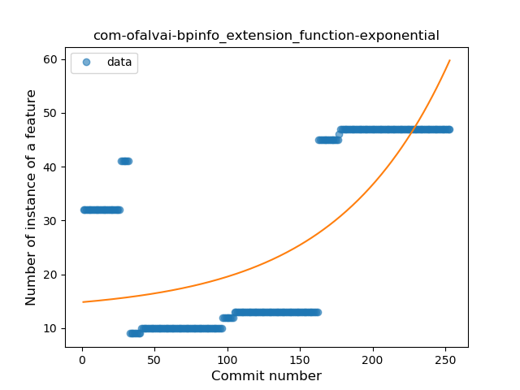

37. com-moez-QKSMS

	*  Function: 
	* R_Squared: 0.31557561
 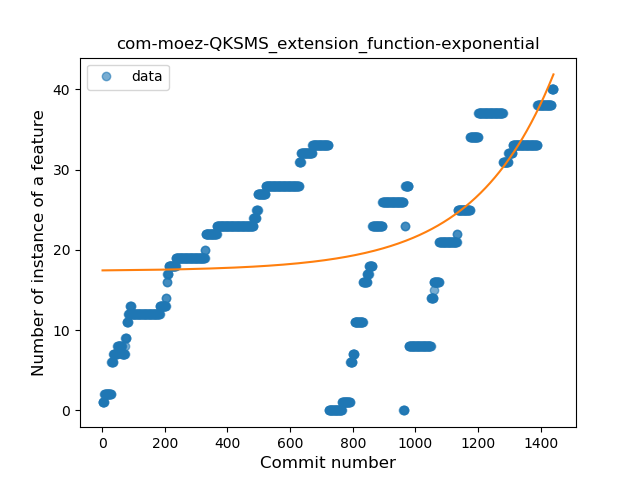

39. com-simplemobiletools-filemanager-pro

	*  Function: 
	* R_Squared: 0.05883669
 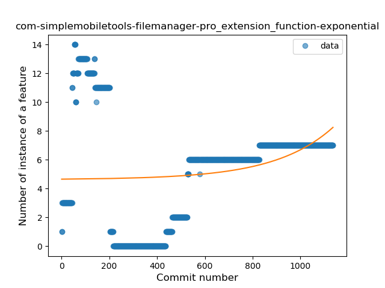

### <a name="T6">Sudden Rise Plateau</a> 
 ----

1. io-github-wulkanowy

	*  Function: 
	* R_Squared: 0.92503433
 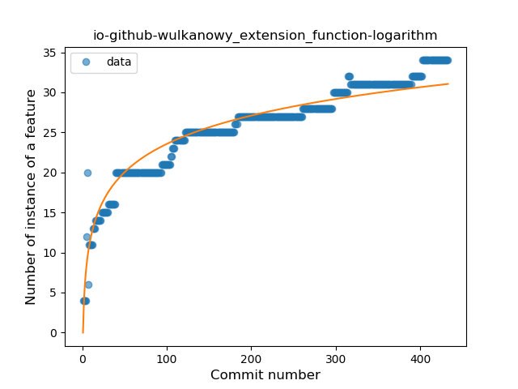

2. com-nao20010128nao-DroidComplex

	*  Function: 
	* R_Squared: 0.89740522
 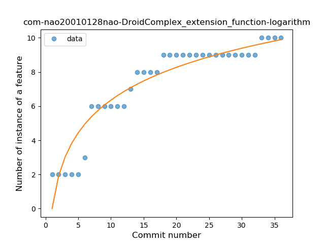

3. jp-org-example-geckour-glyph

	*  Function: 
	* R_Squared: 0.88287052
 

4. eu-depau-etchdroid

	*  Function: 
	* R_Squared: 0.87612881
 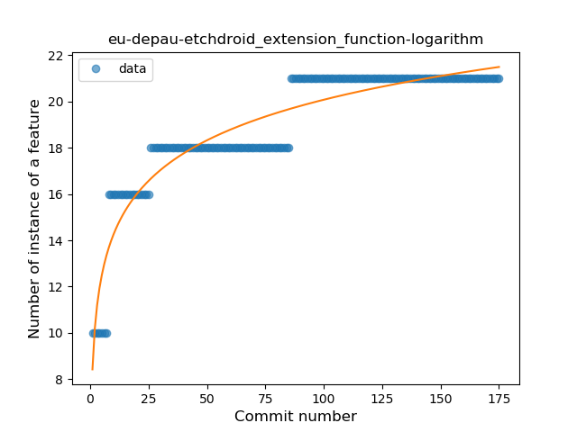

5. com-arcao-geocaching4locus

	*  Function: 
	* R_Squared: 0.85467645
 

6. fr-xgouchet-packageexplorer

	*  Function: 
	* R_Squared: 0.8442374
 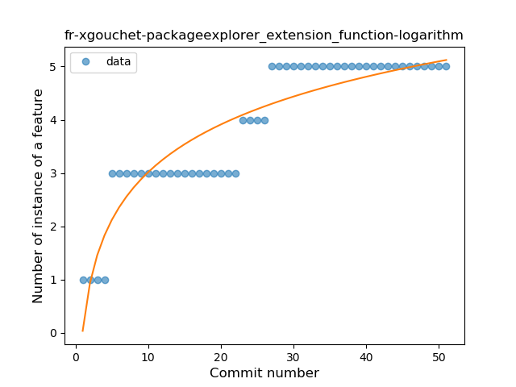

7. de-thecode-lmd

	*  Function: 
	* R_Squared: 0.81417209
 

8. io-github-deweyreed-clipboardcleaner

	*  Function: 
	* R_Squared: 0.79884749
 

9. info-dvkr-screenstream

	*  Function: 
	* R_Squared: 0.7933225
 

10. eu-the4thfloor-msync

	*  Function: 
	* R_Squared: 0.77316351
 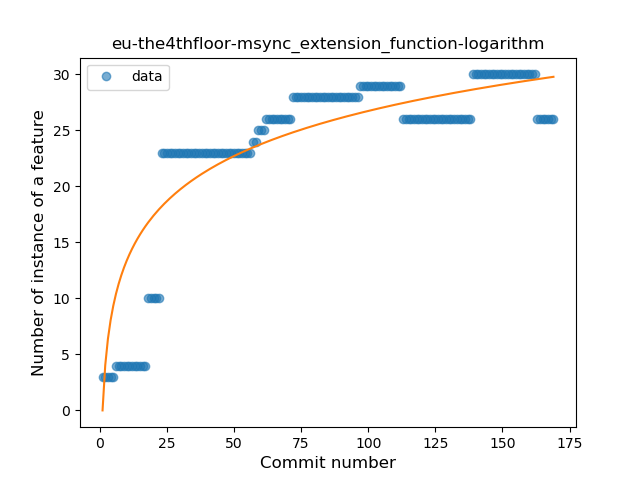

11. net-yslibrary-monotweety

	*  Function: 
	* R_Squared: 0.7662568
 

12. org-weilbach-splitbills

	*  Function: 
	* R_Squared: 0.72377514
 

13. com-simplemobiletools-clock

	*  Function: 
	* R_Squared: 0.69845978
 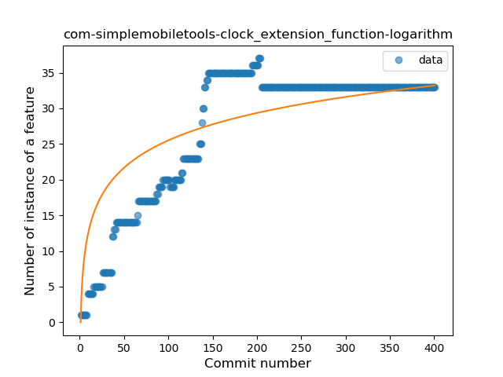

14. com-dp-logcatapp

	*  Function: 
	* R_Squared: 0.6695939
 

15. com-zacharee1-systemuituner

	*  Function: 
	* R_Squared: 0.65492629
 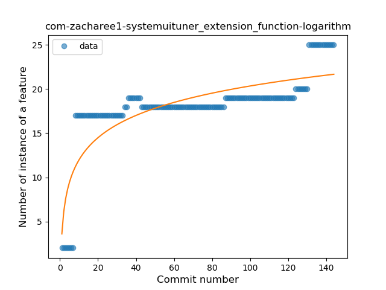

16. org-moire-ultrasonic

	*  Function: 
	* R_Squared: 0.60253701
 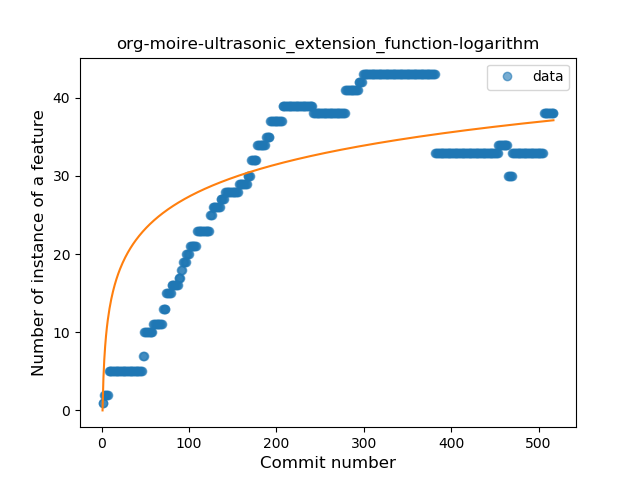

17. com-breadwallet

	*  Function: 
	* R_Squared: 0.59648551
 

18. org-kiwix-kiwixcustomwikivoyageeurope

	*  Function: 
	* R_Squared: 0.51657486
 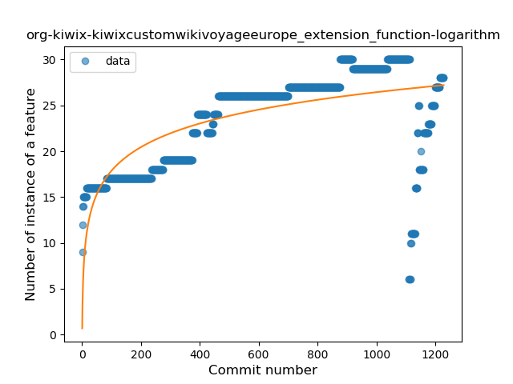

19. ch-rmy-android-http_shortcuts

	*  Function: 
	* R_Squared: 0.49724524
 

20. com-garpr-android

	*  Function: 
	* R_Squared: 0.29610202
 

21. fr-openium-auvergnewebcams

	*  Function: 
	* R_Squared: 0.17522967
 

22. com-nononsenseapps-feeder

	*  Function: 
	* R_Squared: 0.16797204
 

23. me-rei_m-hyakuninisshu

	*  Function: 
	* R_Squared: 0.03038534
 

### <a name="T9">Plateau Sudden Rise</a> 
 ----

1. app-opass-ccip

	*  Function: 
	* R_Squared: 1.0
 

2. com-atanana-sicounter

	*  Function: 
	* R_Squared: 1.0
 

3. com-fallgamlet-dnestrcinema

	*  Function: 
	* R_Squared: 1.0
 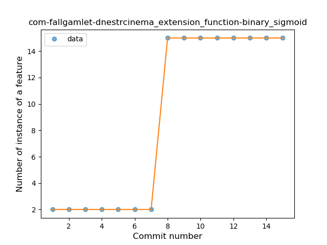

5. com-ianhanniballake-contractiontimer

	*  Function: 
	* R_Squared: 1.0
 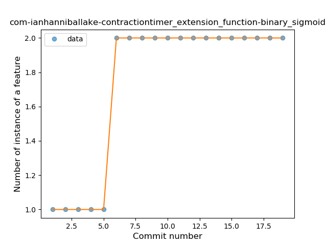

8. com-rohitsuratekar-NCBSinfo

	*  Function: 
	* R_Squared: 1.0
 

9. com-simplemobiletools-flashlight

	*  Function: 
	* R_Squared: 1.0
 

10. com-tomer-draw

	*  Function: 
	* R_Squared: 1.0
 

11. com-wbrawner-simplemarkdown

	*  Function: 
	* R_Squared: 1.0
 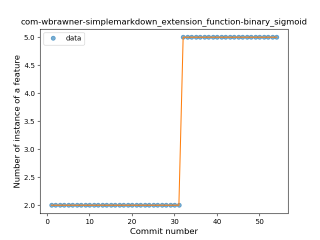

13. fr-insapp-insapp

	*  Function: 
	* R_Squared: 1.0
 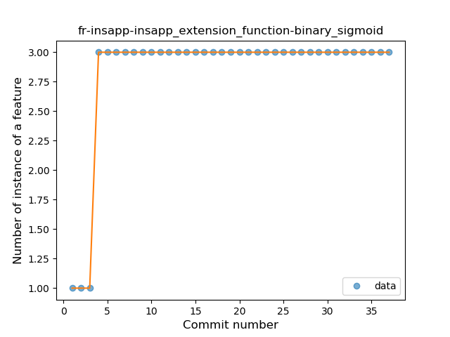

14. net-mm2d-android-vmb

	*  Function: 
	* R_Squared: 1.0
 

15. org-blitzortung-android-app

	*  Function: 
	* R_Squared: 1.0
 

16. pt-joaomneto-titancompanion

	*  Function: 
	* R_Squared: 1.0
 

17. se-barsk-park

	*  Function: 
	* R_Squared: 1.0
 

18. org-ligi-passandroid

	*  Function: 
	* R_Squared: 0.96360232
 

19. com-corphish-nightlight-generic

	*  Function: 
	* R_Squared: 0.95553658
 

20. org-mattvchandler-progressbars

	*  Function: 
	* R_Squared: 0.9479697
 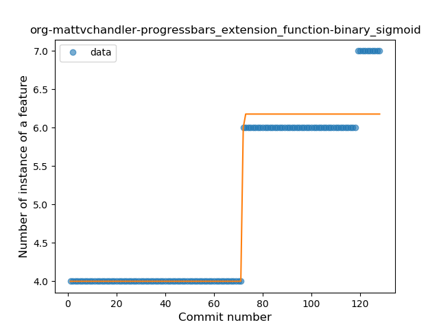

22. com-stevenschoen-putionew

	*  Function: 
	* R_Squared: 0.90123457
 

24. me-murks-feedwatcher

	*  Function: 
	* R_Squared: 0.8471271
 

26. superustats-tool-android

	*  Function: 
	* R_Squared: 0.56490833
 

27. net-nonylene-photolinkviewer

	*  Function: 
	* R_Squared: 0.26429771
 

28. com-simplemobiletools-applauncher

	*  Function: 
	* R_Squared: 0.17229446
 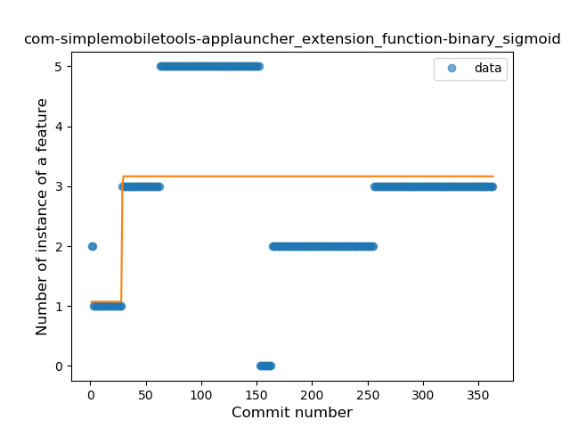

29. org-poul-bits-android

	*  Function: 
	* R_Squared: 0.09857383
 

### <a name="T11">Instability</a> 
 ----

1. com-bracketcove-postrainer

	*  Function: 
	* R_Squared: 0.99608396
 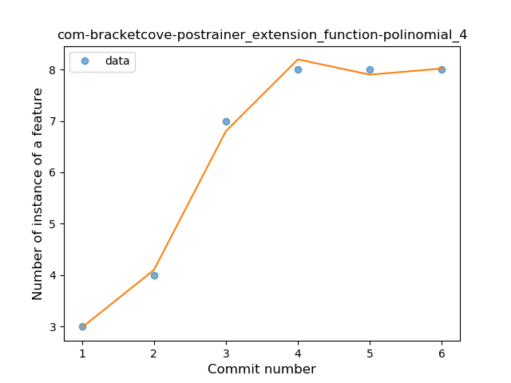

2. moe-feng-nhentai

	*  Function: 
	* R_Squared: 0.89340759
 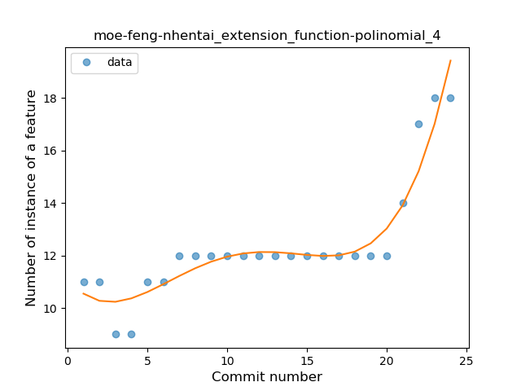

3. tw-shounenwind-kmnbottool

	*  Function: 
	* R_Squared: 0.88410368
 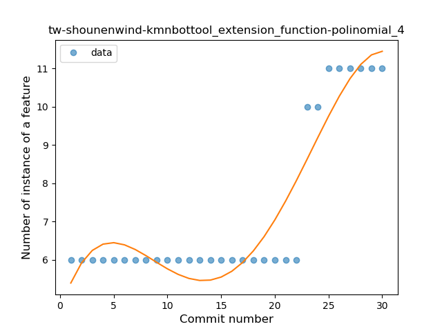

4. com-emmanuelmess-simplecleanup

	*  Function: 
	* R_Squared: 0.87033749
 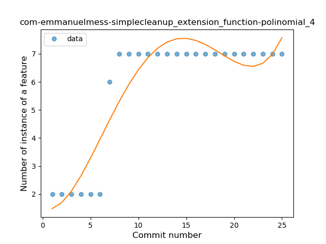

5. me-impa-knockonports

	*  Function: 
	* R_Squared: 0.84698653
 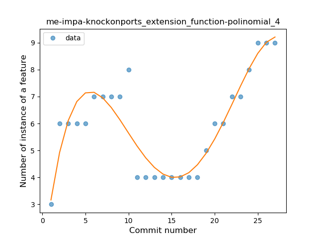

6. me-siketyan-silicagel

	*  Function: 
	* R_Squared: 0.84210526
 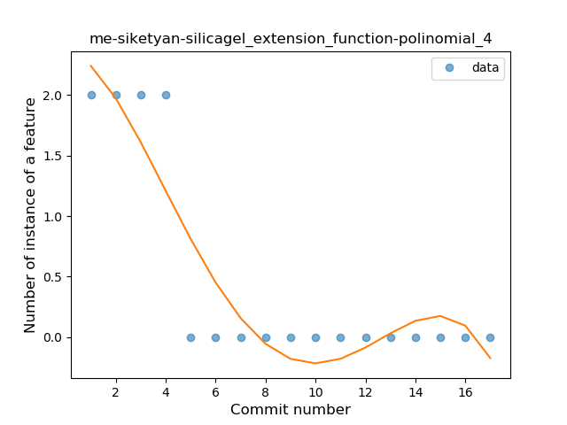

7. com-cookiegames-smartcookie

	*  Function: 
	* R_Squared: 0.80854449
 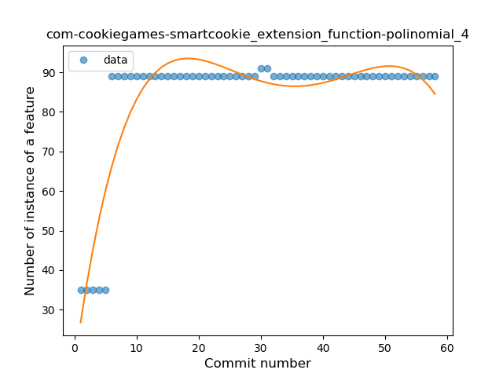

8. uk-colessoft-android-hilllist

	*  Function: 
	* R_Squared: 0.47901321
 

9. fr-rhaz-ipfs-sweet

	*  Function: 
	* R_Squared: 0.44124123
 

10. com-physphil-android-unitconverterultimate

	*  Function: 
	* R_Squared: 0.42509897
 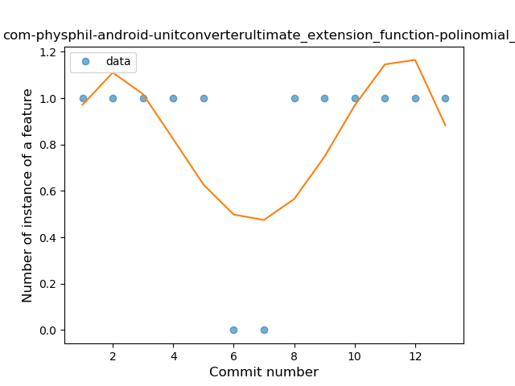

### <a name="T5">Sudden Decline</a> 
 ----

1. danbroid-searchview

	*  Function: 
	* R_Squared: 1.0
 

18. io-trewartha-positional

	*  Function: 
	* R_Squared: 0.88129288
 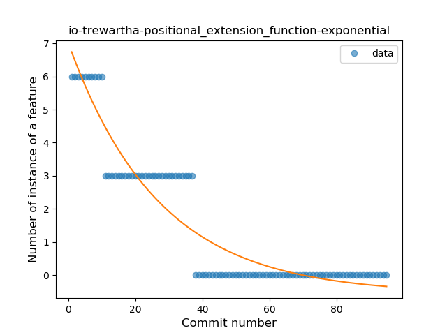

24. com-fastaccess-github-libre

	*  Function: 
	* R_Squared: 0.8357338
 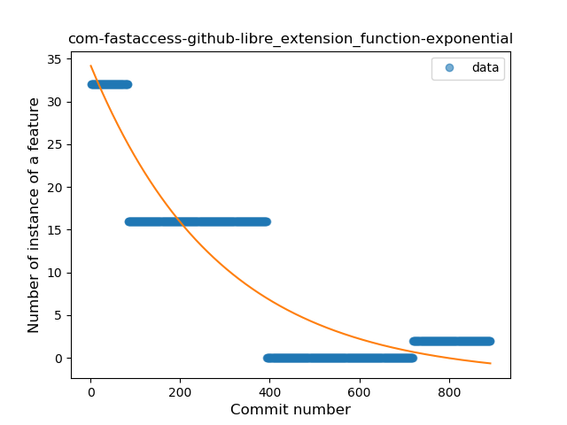

28. com-benny-openlauncher

	*  Function: 
	* R_Squared: 0.72653143
 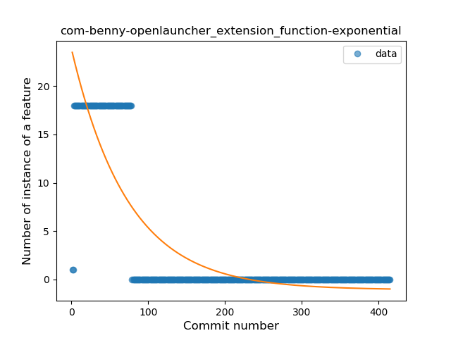

29. me-kirimin-mitsumine

	*  Function: 
	* R_Squared: 0.71433064
 

36. com-epimorphics-android-myrivers

	*  Function: 
	* R_Squared: 0.52764407
 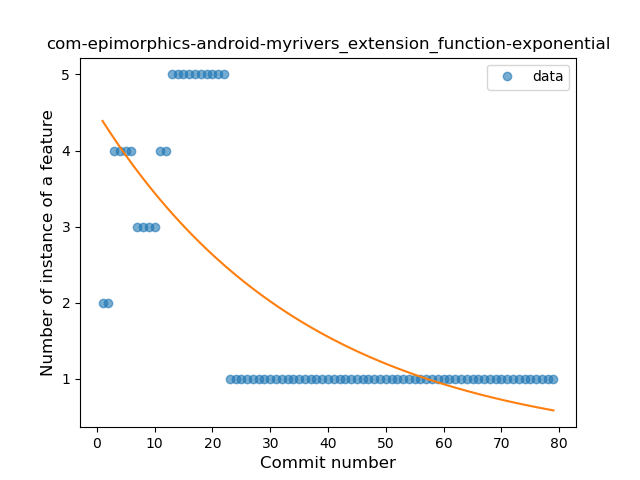

38. com-simplemobiletools-notes-pro

	*  Function: 
	* R_Squared: 0.14958891
 

### <a name="T10">Plateau Sudden Decline</a> 
 ----

4. com-github-laurenttreguier-deck

	*  Function: 
	* R_Squared: 1.0
 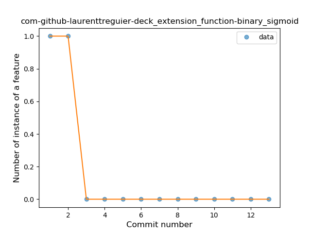

6. com-pavelsikun-runinbackgroundpermissionsetter

	*  Function: 
	* R_Squared: 1.0
 

7. com-pyamsoft-homebutton

	*  Function: 
	* R_Squared: 1.0
 

12. fr-free-nrw-commons

	*  Function: 
	* R_Squared: 1.0
 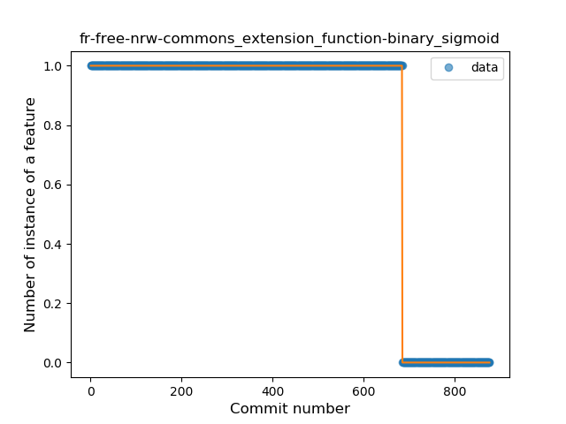

21. rectangledbmi-com-pittsburghrealtimetracker

	*  Function: 
	* R_Squared: 0.91955208
 

23. org-mcxa-vortaro

	*  Function: 
	* R_Squared: 0.86877828
 

25. org-fossasia-badgemagic

	*  Function: 
	* R_Squared: 0.63174446
 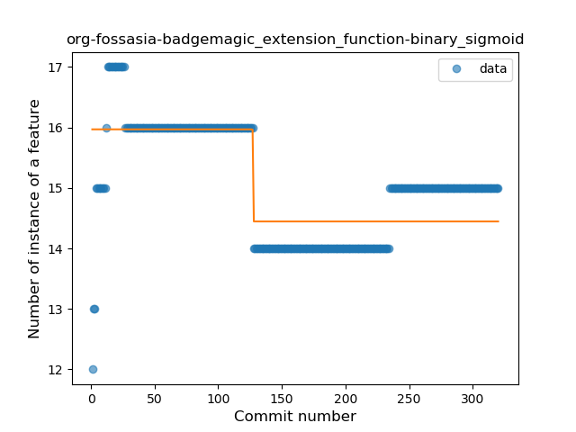

### <a name="T2">Constant Decline</a> 
 ----

40. app-simone

	*  Function: 
	* R_Squared: 0.703346
 

49. com-motion-stage1

	*  Function: 
	* R_Squared: 0.49061665
 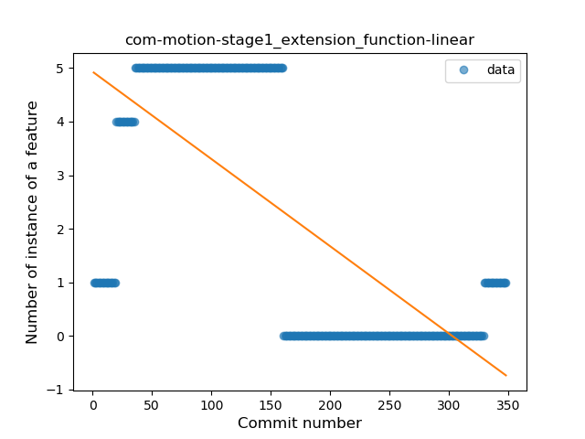

50. net-syncthing-lite

	*  Function: 
	* R_Squared: 0.26332654
 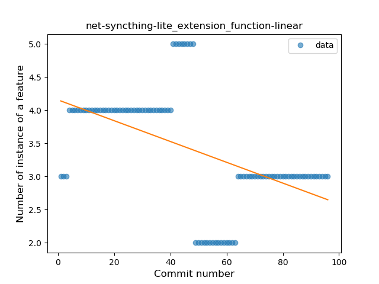

51. com-github-premnirmal-tickerwidget

	*  Function: 
	* R_Squared: 0.00904344
 

### <a name="T8">Plateau Gradual Decline</a> 
 ----

40. com-conorodonnell-bus

	*  Function: 
	* R_Squared: 0.66388587
 

### <a name="T3">Stability</a> 
 ----

