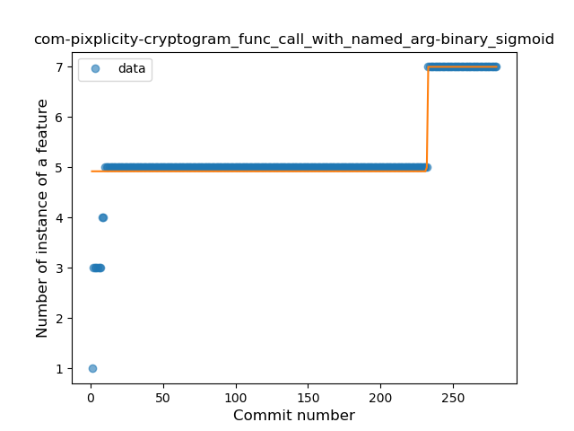
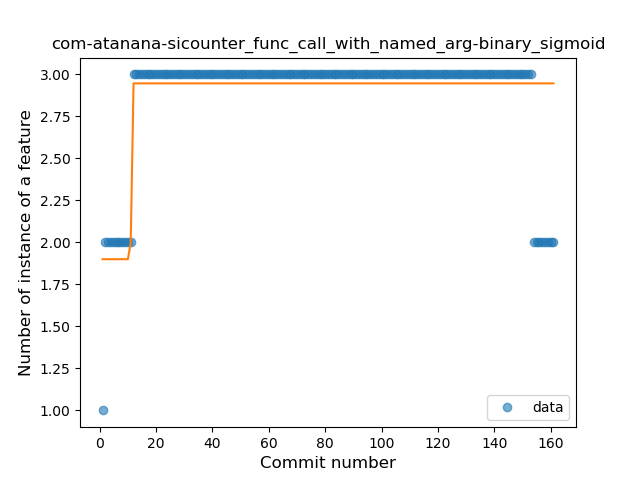
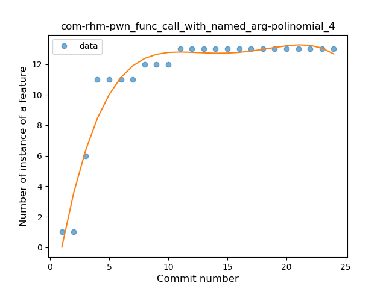
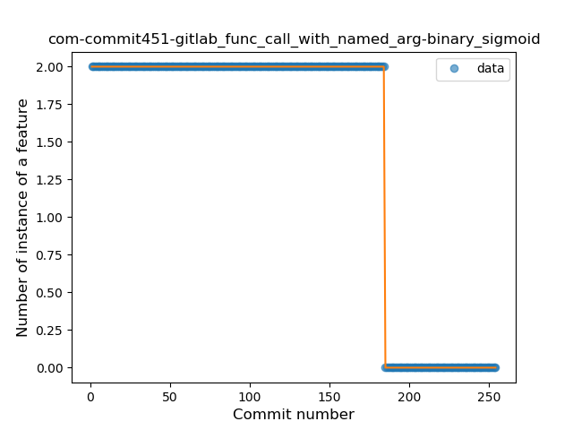

## Function call with Named Argument
----
**Best fit = Constant Rise**: 48

Function | N# best fit
----|----
<a href=" #T1">Constant Rise</a> | 48
<a href=" #T7">Plateau Gradual Rise</a> | 41
<a href=" #T4">Sudden Rise</a> | 40
<a href=" #T9">Plateau Sudden Rise</a> | 30
<a href=" #T6">Sudden Rise Plateau</a> | 20
<a href=" #T11">Instability</a> | 19
<a href=" #T10">Plateau Sudden Decline</a> | 8
<a href=" #T5">Sudden Decline</a> | 6
<a href=" #T2">Constant Decline</a> | 2
<a href=" #T8">Plateau Gradual Decline</a> | 1
<a href=" #T3">Stability</a> | 0

### <a name="T1">Constant Rise</a> 
 ----

1. org-mariotaku-twidere

	*  Function: 
	* R_Squared: 0.98363711
 

2. com-github-quarck-calnotify

	*  Function: 
	* R_Squared: 0.98099929
 

3. com-duckduckgo-mobile-android

	*  Function: 
	* R_Squared: 0.97410839
 

4. com-boardgamegeek

	*  Function: 
	* R_Squared: 0.97221807
 

5. li-klass-fhem

	*  Function: 
	* R_Squared: 0.96724659
 

6. com-bijoysingh-quicknote

	*  Function: 
	* R_Squared: 0.96333554
 

7. io-github-feelfreelinux-wykopmobilny

	*  Function: 
	* R_Squared: 0.95811929
 

8. pl-hypeapp-episodie

	*  Function: 
	* R_Squared: 0.94328915
 

9. chat-rocket-android

	*  Function: 
	* R_Squared: 0.94037531
 

10. acr-browser-lightning

	*  Function: 
	* R_Squared: 0.93535061
 

11. com-nononsenseapps-feeder

	*  Function: 
	* R_Squared: 0.93351532
 

12. ffc-app

	*  Function: 
	* R_Squared: 0.92944699
 

13. com-arcao-geocaching4locus

	*  Function: 
	* R_Squared: 0.92177468
 

14. com-benoitquenaudon-tvfoot-red

	*  Function: 
	* R_Squared: 0.91895266
 

15. com-stevenschoen-putionew

	*  Function: 
	* R_Squared: 0.91493669
 

16. com-pitchedapps-frost

	*  Function: 
	* R_Squared: 0.90865367
 

17. org-kaqui

	*  Function: 
	* R_Squared: 0.88876911
 

18. net-yslibrary-monotweety

	*  Function: 
	* R_Squared: 0.88790098
 

19. io-github-wulkanowy

	*  Function: 
	* R_Squared: 0.8821942
 

20. com-bernaferrari-changedetection

	*  Function: 
	* R_Squared: 0.8819936
 

21. org-pacien-tincapp

	*  Function: 
	* R_Squared: 0.88164482
 

22. com-tasomaniac-openwith-floss

	*  Function: 
	* R_Squared: 0.88123748
 

23. org-walleth

	*  Function: 
	* R_Squared: 0.87382986
 

24. pl-org-seva-navigator

	*  Function: 
	* R_Squared: 0.87097665
 

25. nl-mpcjanssen-simpletask

	*  Function: 
	* R_Squared: 0.86714573
 

26. org-blokada-alarm

	*  Function: 
	* R_Squared: 0.85977755
 

27. com-moez-QKSMS

	*  Function: 
	* R_Squared: 0.85966829
 

28. ru-hyst329-openfool

	*  Function: 
	* R_Squared: 0.85859707
 

29. com-github-moko256-twitlatte

	*  Function: 
	* R_Squared: 0.85230054
 

30. net-frju-flym

	*  Function: 
	* R_Squared: 0.84735598
 

31. cz-dvratil-fbeventsync

	*  Function: 
	* R_Squared: 0.83674794
 

32. com-booboot-vndbandroid

	*  Function: 
	* R_Squared: 0.83101255
 

33. com-dp-logcatapp

	*  Function: 
	* R_Squared: 0.77787632
 

34. net-nurik-roman-muzei

	*  Function: 
	* R_Squared: 0.76385478
 

35. org-moire-ultrasonic

	*  Function: 
	* R_Squared: 0.72606056
 

36. com-calintat-units

	*  Function: 
	* R_Squared: 0.70969723
 

37. pt-ipleiria-mymusicqoe

	*  Function: 
	* R_Squared: 0.65609941
 

38. com-peterlaurence-trekme

	*  Function: 
	* R_Squared: 0.61612078
 

39. com-bubelov-coins

	*  Function: 
	* R_Squared: 0.59175144
 

40. com-simplemobiletools-calendar-pro

	*  Function: 
	* R_Squared: 0.57623562
 

41. com-simplemobiletools-filemanager-pro

	*  Function: 
	* R_Squared: 0.47385907
 

42. com-simplemobiletools-gallery

	*  Function: 
	* R_Squared: 0.46867015
 

43. tk-superl2-xwifi

	*  Function: 
	* R_Squared: 0.42768668
 

44. xyz-hisname-fireflyiii

	*  Function: 
	* R_Squared: 0.39603667
 

45. de-ironjan-mensaupb

	*  Function: 
	* R_Squared: 0.26869717
 

46. com-ofalvai-bpinfo

	*  Function: 
	* R_Squared: 0.26638521
 

47. ml-adamsprogs-bimba

	*  Function: 
	* R_Squared: 0.15900048
 

50. es-usc-citius-servando-calendula

	*  Function: 
	* R_Squared: 0.0034428
 

### <a name="T7">Plateau Gradual Rise</a> 
 ----

1. com-mgaetan89-showsrage

	*  Function: 
	* R_Squared: 0.99846337
 

2. org-ligi-gobandroid

	*  Function: 
	* R_Squared: 0.99473349
 

3. com-dozingcatsoftware-vectorcamera

	*  Function: 
	* R_Squared: 0.99150066
 

4. org-isoron-uhabits

	*  Function: 
	* R_Squared: 0.98923383
 

5. com-corphish-nightlight-generic

	*  Function: 
	* R_Squared: 0.9872344
 

6. com-simplemobiletools-notes-pro

	*  Function: 
	* R_Squared: 0.9871006
 

7. com-breadwallet

	*  Function: 
	* R_Squared: 0.9839682
 

8. com-tomer-draw

	*  Function: 
	* R_Squared: 0.98091354
 

9. one-librem-social

	*  Function: 
	* R_Squared: 0.97916221
 

10. se-creotec-chscardbalance2

	*  Function: 
	* R_Squared: 0.9760359
 

11. moe-feng-nhentai

	*  Function: 
	* R_Squared: 0.97357328
 

12. com-keylesspalace-tusky

	*  Function: 
	* R_Squared: 0.97049234
 

13. com-simplemobiletools-contacts-pro

	*  Function: 
	* R_Squared: 0.96741832
 

14. com-kgurgul-cpuinfo

	*  Function: 
	* R_Squared: 0.96190639
 

15. se-barsk-park

	*  Function: 
	* R_Squared: 0.95987085
 

16. pl-temomuko-autostoprace

	*  Function: 
	* R_Squared: 0.95523789
 

17. fr-chenry-android-freshrss

	*  Function: 
	* R_Squared: 0.95512798
 

18. io-github-fvasco-pinpoi

	*  Function: 
	* R_Squared: 0.95340947
 

19. fr-cph-chicago-foss

	*  Function: 
	* R_Squared: 0.94453241
 

20. ai-susi

	*  Function: 
	* R_Squared: 0.9366953
 

22. info-papdt-express-helper

	*  Function: 
	* R_Squared: 0.93110717
 

23. org-ligi-passandroid

	*  Function: 
	* R_Squared: 0.92759957
 

24. com-nextcloud-talk2

	*  Function: 
	* R_Squared: 0.92671399
 

25. be-mygod-vpnhotspot

	*  Function: 
	* R_Squared: 0.91955685
 

26. com-simplemobiletools-clock

	*  Function: 
	* R_Squared: 0.91641597
 

27. com-uncmorfi

	*  Function: 
	* R_Squared: 0.91184176
 

28. org-freedombox-freedombox

	*  Function: 
	* R_Squared: 0.90978111
 

29. fr-openium-auvergnewebcams

	*  Function: 
	* R_Squared: 0.89986437
 

30. com-jim-sharetocomputer

	*  Function: 
	* R_Squared: 0.89740859
 

31. de-thecode-lmd

	*  Function: 
	* R_Squared: 0.88917278
 

32. com-calintat-sensors

	*  Function: 
	* R_Squared: 0.88121717
 

33. org-mosad-seil0-projectlaogai

	*  Function: 
	* R_Squared: 0.86604589
 

34. pt-joaomneto-titancompanion

	*  Function: 
	* R_Squared: 0.86074973
 

35. org-anibyl-slounik

	*  Function: 
	* R_Squared: 0.8375913
 

36. nl-brouwerijdemolen-borefts2013

	*  Function: 
	* R_Squared: 0.74235096
 

37. it-diab

	*  Function: 
	* R_Squared: 0.71555323
 

38. cat-pantsu-nyaapantsu

	*  Function: 
	* R_Squared: 0.70196878
 

39. com-simplemobiletools-musicplayer

	*  Function: 
	* R_Squared: 0.56034696
 

40. jp-cordea-mackerelclient

	*  Function: 
	* R_Squared: 0.47923396
 

41. com-fastaccess-github-libre

	*  Function: 
	* R_Squared: 0.4718866
 

42. com-sduduzog-slimlauncher

	*  Function: 
	* R_Squared: 0.07149816
 

### <a name="T4">Sudden Rise</a> 
 ----

3. ch-rmy-android-http_shortcuts

	*  Function: 
	* R_Squared: 0.9822307
 

4. de-ph1b-audiobook

	*  Function: 
	* R_Squared: 0.98034907
 

5. io-ipoli-android

	*  Function: 
	* R_Squared: 0.97099718
 

6. org-mozilla-rocket

	*  Function: 
	* R_Squared: 0.96593305
 

7. ch-deletescape-lawnchair-plah

	*  Function: 
	* R_Squared: 0.96193269
 

8. eu-kanade-tachiyomi

	*  Function: 
	* R_Squared: 0.95945712
 

9. tech-ula

	*  Function: 
	* R_Squared: 0.95402888
 

10. com-eventyay-attendee

	*  Function: 
	* R_Squared: 0.94897476
 

11. me-proxer-app

	*  Function: 
	* R_Squared: 0.9435392
 

12. com-fsck-k9

	*  Function: 
	* R_Squared: 0.94015276
 

13. im-vector-alpha

	*  Function: 
	* R_Squared: 0.93138707
 

14. com-lavadip-miniVector

	*  Function: 
	* R_Squared: 0.93072502
 

15. org-eurofurence-connavigator

	*  Function: 
	* R_Squared: 0.91897421
 

16. com-garpr-android

	*  Function: 
	* R_Squared: 0.91824799
 

17. com-loloof64-android-basicchessendgamestrainer

	*  Function: 
	* R_Squared: 0.91065074
 

18. at-bitfire-davdroid

	*  Function: 
	* R_Squared: 0.9077706
 

19. com-doctoror-particleswallpaper

	*  Function: 
	* R_Squared: 0.90316263
 

20. net-osmand-plus

	*  Function: 
	* R_Squared: 0.87669229
 

21. com-czbix-v2ex

	*  Function: 
	* R_Squared: 0.87004305
 

22. com-orgzly

	*  Function: 
	* R_Squared: 0.86638417
 

23. quickbeer-android

	*  Function: 
	* R_Squared: 0.86120985
 

24. com-guerinet-mymartlet

	*  Function: 
	* R_Squared: 0.86083249
 

25. org-mozilla-focus

	*  Function: 
	* R_Squared: 0.84334743
 

26. org-mozilla-klar

	*  Function: 
	* R_Squared: 0.84334743
 

27. com-simplemobiletools-gallery-pro

	*  Function: 
	* R_Squared: 0.84217817
 

29. net-kourlas-voipms

	*  Function: 
	* R_Squared: 0.83492729
 

30. com-jereksel-libresubstratum

	*  Function: 
	* R_Squared: 0.83284289
 

31. com-github-premnirmal-tickerwidget

	*  Function: 
	* R_Squared: 0.82452201
 

32. de-westnordost-streetcomplete

	*  Function: 
	* R_Squared: 0.81761009
 

33. org-zimmob-zimlx

	*  Function: 
	* R_Squared: 0.80636435
 

34. jp-toastkid-yobidashi

	*  Function: 
	* R_Squared: 0.79482405
 

35. me-kirimin-mitsumine

	*  Function: 
	* R_Squared: 0.77422338
 

36. com-conorodonnell-bus

	*  Function: 
	* R_Squared: 0.75790577
 

37. de-avpptr-umweltzone

	*  Function: 
	* R_Squared: 0.75613533
 

39. com-log28

	*  Function: 
	* R_Squared: 0.65029143
 

40. net-stew-stew

	*  Function: 
	* R_Squared: 0.6095425
 

41. me-anon-grow

	*  Function: 
	* R_Squared: 0.58687476
 

43. org-emunix-insteadlauncher

	*  Function: 
	* R_Squared: 0.56155777
 

44. com-directdev-portal

	*  Function: 
	* R_Squared: 0.34594309
 

45. me-blog-korn123-easydiary

	*  Function: 
	* R_Squared: 0.24399982
 

### <a name="T9">Plateau Sudden Rise</a> 
 ----

1. college-wyk-app

	*  Function: 
	* R_Squared: 1.0
 

3. com-fallgamlet-dnestrcinema

	*  Function: 
	* R_Squared: 1.0
 

5. com-github-cvzi-screenshottile

	*  Function: 
	* R_Squared: 1.0
 

6. com-motion-stage1

	*  Function: 
	* R_Squared: 1.0
 

7. com-phicdy-totoanticipation

	*  Function: 
	* R_Squared: 1.0
 

8. com-tumblr-svetylk0-sheepsgohome-android

	*  Function: 
	* R_Squared: 1.0
 

9. com-tutpro-baresip

	*  Function: 
	* R_Squared: 1.0
 

10. de-markusfisch-android-binaryeye

	*  Function: 
	* R_Squared: 1.0
 

11. de-spiritcroc-darkcroc-substratum

	*  Function: 
	* R_Squared: 1.0
 

12. eu-depau-etchdroid

	*  Function: 
	* R_Squared: 1.0
 

14. is-xyz-mpv

	*  Function: 
	* R_Squared: 1.0
 

17. org-ligi-ipfsdroid

	*  Function: 
	* R_Squared: 1.0
 

18. rectangledbmi-com-pittsburghrealtimetracker

	*  Function: 
	* R_Squared: 0.99992422
 

19. pl-org-seva-texter

	*  Function: 
	* R_Squared: 0.99837212
 

21. com-zeapo-pwdstore

	*  Function: 
	* R_Squared: 0.97759641
 

23. ch-abertschi-adfree

	*  Function: 
	* R_Squared: 0.96551476
 

24. net-mm2d-dmsexplorer

	*  Function: 
	* R_Squared: 0.94391438
 

26. ca-josephroque-bowlingcompanion

	*  Function: 
	* R_Squared: 0.93585119
 

27. org-equeim-tremotesf

	*  Function: 
	* R_Squared: 0.93142247
 

28. com-ogsdroid

	*  Function: 
	* R_Squared: 0.9202454
 

29. com-wbrawner-simplemarkdown

	*  Function: 
	* R_Squared: 0.91167278
 

30. com-utazukin-ichaival

	*  Function: 
	* R_Squared: 0.87097545
 

31. de-cineaste-android

	*  Function: 
	* R_Squared: 0.8402512
 

32. com-pixplicity-cryptogram

	*  Function: 
	* R_Squared: 0.80874768
 

33. ca-rmen-android-poetassistant

	*  Function: 
	* R_Squared: 0.72073326
 

34. jp-org-example-geckour-glyph

	*  Function: 
	* R_Squared: 0.68792568
 

35. me-rei_m-hyakuninisshu

	*  Function: 
	* R_Squared: 0.60431608
 

36. com-atanana-sicounter

	*  Function: 
	* R_Squared: 0.56581583
 

37. com-wabadaba-dziennik

	*  Function: 
	* R_Squared: 0.5341615
 

38. superustats-tool-android

	*  Function: 
	* R_Squared: 0.1466651
 

### <a name="T6">Sudden Rise Plateau</a> 
 ----

1. net-bible-android-activity

	*  Function: 
	* R_Squared: 0.87836078
 

2. apps-amine-bou-readerforselfoss

	*  Function: 
	* R_Squared: 0.87345378
 

3. com-jmstudios-redmoon

	*  Function: 
	* R_Squared: 0.84209254
 

4. com-benoitletondor-easybudgetapp

	*  Function: 
	* R_Squared: 0.81716154
 

5. de-thecode-android-tazreader

	*  Function: 
	* R_Squared: 0.80949871
 

6. info-metadude-android-congress-schedule

	*  Function: 
	* R_Squared: 0.77436463
 

7. sreich-countthedays

	*  Function: 
	* R_Squared: 0.74122644
 

8. org-blitzortung-android-app

	*  Function: 
	* R_Squared: 0.69691695
 

9. com-pluscubed-velociraptor

	*  Function: 
	* R_Squared: 0.68068866
 

10. com-github-vase4kin-teamcityapp

	*  Function: 
	* R_Squared: 0.67589312
 

11. app-opass-ccip

	*  Function: 
	* R_Squared: 0.66195117
 

12. org-poul-bits-android

	*  Function: 
	* R_Squared: 0.65237667
 

13. com-glodanif-bluetoothchat

	*  Function: 
	* R_Squared: 0.6181184
 

14. info-dvkr-screenstream

	*  Function: 
	* R_Squared: 0.59144537
 

15. org-kiwix-kiwixcustomwikivoyageeurope

	*  Function: 
	* R_Squared: 0.49395696
 

16. sk-styk-martin-apkanalyzer

	*  Function: 
	* R_Squared: 0.44549557
 

17. com-yubico-yubioath

	*  Function: 
	* R_Squared: 0.26109587
 

18. me-echeung-moemoekyun-fdroid

	*  Function: 
	* R_Squared: 0.22611197
 

19. com-pyamsoft-homebutton

	*  Function: 
	* R_Squared: 0.07784699
 

20. uk-colessoft-android-hilllist

	*  Function: 
	* R_Squared: 0.01676436
 

### <a name="T11">Instability</a> 
 ----

1. com-bracketcove-postrainer

	*  Function: 
	* R_Squared: 0.99957161
 

2. com-rhm-pwn

	*  Function: 
	* R_Squared: 0.93710768
 

3. com-esafirm-androidplayground

	*  Function: 
	* R_Squared: 0.9294421
 

4. com-physphil-android-unitconverterultimate

	*  Function: 
	* R_Squared: 0.89092509
 

5. org-projectbass-bass

	*  Function: 
	* R_Squared: 0.88438228
 

6. io-wookey-wallet

	*  Function: 
	* R_Squared: 0.86090793
 

7. com-cookiegames-smartcookie

	*  Function: 
	* R_Squared: 0.82050585
 

8. ru-nsu-bobrofon-easysshfs

	*  Function: 
	* R_Squared: 0.79339525
 

9. com-enjoyingfoss-om

	*  Function: 
	* R_Squared: 0.63083334
 

10. me-impa-knockonports

	*  Function: 
	* R_Squared: 0.59796599
 

### <a name="T10">Plateau Sudden Decline</a> 
 ----

2. com-commit451-gitlab

	*  Function: 
	* R_Squared: 1.0
 

4. com-firstrowria-pushnotificationtester

	*  Function: 
	* R_Squared: 1.0
 

13. io-trewartha-positional

	*  Function: 
	* R_Squared: 1.0
 

15. org-decsync-cc

	*  Function: 
	* R_Squared: 1.0
 

16. org-decsync-sparss-floss

	*  Function: 
	* R_Squared: 1.0
 

20. org-weilbach-splitbills

	*  Function: 
	* R_Squared: 0.98824176
 

22. at-bitfire-icsdroid

	*  Function: 
	* R_Squared: 0.96750524
 

25. com-etesync-syncadapter

	*  Function: 
	* R_Squared: 0.93716905
 

### <a name="T5">Sudden Decline</a> 
 ----

1. co-timecrypt-android

	*  Function: 
	* R_Squared: 1.0
 

2. com-njlabs-showjava

	*  Function: 
	* R_Squared: 1.0
 

28. ca-fuwafuwa-kaku

	*  Function: 
	* R_Squared: 0.83840302
 

38. org-fossasia-badgemagic

	*  Function: 
	* R_Squared: 0.66038674
 

42. nightlock-peppercarrot

	*  Function: 
	* R_Squared: 0.56339696
 

46. com-sjn-stamp

	*  Function: 
	* R_Squared: 0.13029862
 

### <a name="T2">Constant Decline</a> 
 ----

48. org-ligi-survivalmanual

	*  Function: 
	* R_Squared: 0.03373221
 

49. com-guardafilme

	*  Function: 
	* R_Squared: 0.0156
 

### <a name="T8">Plateau Gradual Decline</a> 
 ----

21. eu-the4thfloor-msync

	*  Function: 
	* R_Squared: 0.93251677
 

### <a name="T3">Stability</a> 
 ----

