## Function with Default Value
----
**Best fit = Plateau Gradual Rise**: 64

Function | N# best fit
----|----
<a href=" #T7">Plateau Gradual Rise</a> | 64
<a href=" #T1">Constant Rise</a> | 50
<a href=" #T4">Sudden Rise</a> | 41
<a href=" #T9">Plateau Sudden Rise</a> | 27
<a href=" #T6">Sudden Rise Plateau</a> | 19
<a href=" #T11">Instability</a> | 17
<a href=" #T10">Plateau Sudden Decline</a> | 6
<a href=" #T5">Sudden Decline</a> | 4
<a href=" #T2">Constant Decline</a> | 3
<a href=" #T8">Plateau Gradual Decline</a> | 3
<a href=" #T3">Stability</a> | 0

### <a name="T7">Plateau Gradual Rise</a> 
 ----

1. com-fallgamlet-dnestrcinema

	*  Function: 
	* R_Squared: 0.98979345
 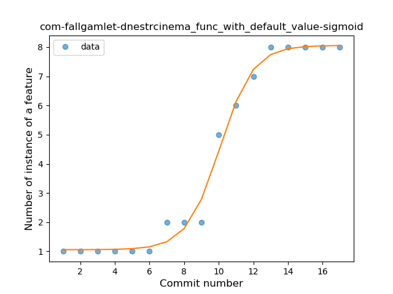

2. com-guardafilme

	*  Function: 
	* R_Squared: 0.98783202
 

3. io-github-feelfreelinux-wykopmobilny

	*  Function: 
	* R_Squared: 0.98715214
 

4. de-cineaste-android

	*  Function: 
	* R_Squared: 0.98700458
 

5. se-creotec-chscardbalance2

	*  Function: 
	* R_Squared: 0.98629218
 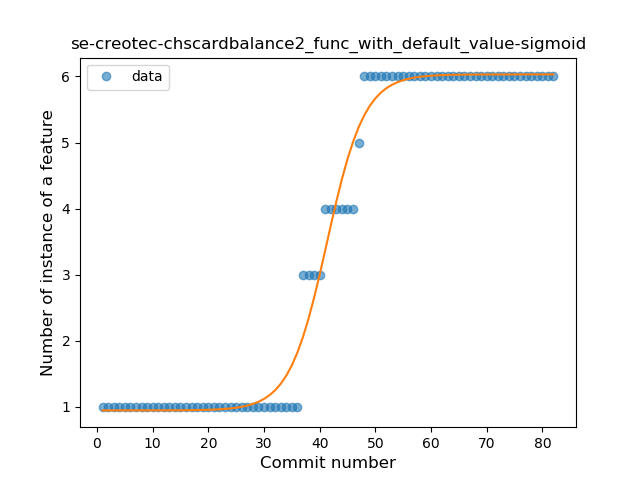

6. com-github-vase4kin-teamcityapp

	*  Function: 
	* R_Squared: 0.9855552
 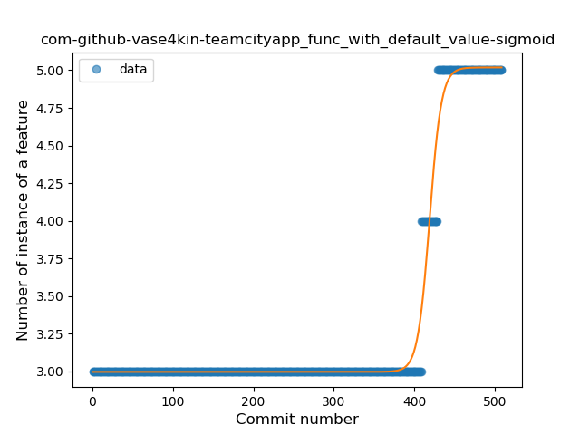

7. com-ogsdroid

	*  Function: 
	* R_Squared: 0.98412505
 

8. com-loloof64-android-basicchessendgamestrainer

	*  Function: 
	* R_Squared: 0.98394343
 

9. pl-hypeapp-episodie

	*  Function: 
	* R_Squared: 0.98264172
 

10. com-example-forgottenumbrella-cardboardmuseum

	*  Function: 
	* R_Squared: 0.98111765
 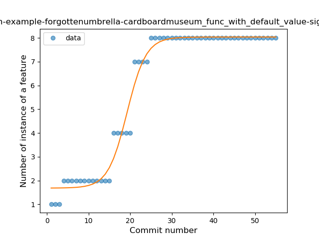

11. org-emunix-insteadlauncher

	*  Function: 
	* R_Squared: 0.97962471
 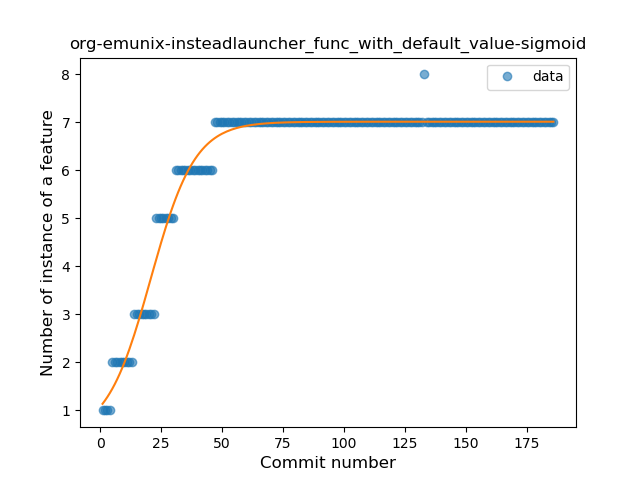

12. com-github-moko256-twitlatte

	*  Function: 
	* R_Squared: 0.97715051
 

13. com-simplemobiletools-filemanager-pro

	*  Function: 
	* R_Squared: 0.97677307
 

14. com-corphish-nightlight-generic

	*  Function: 
	* R_Squared: 0.97595002
 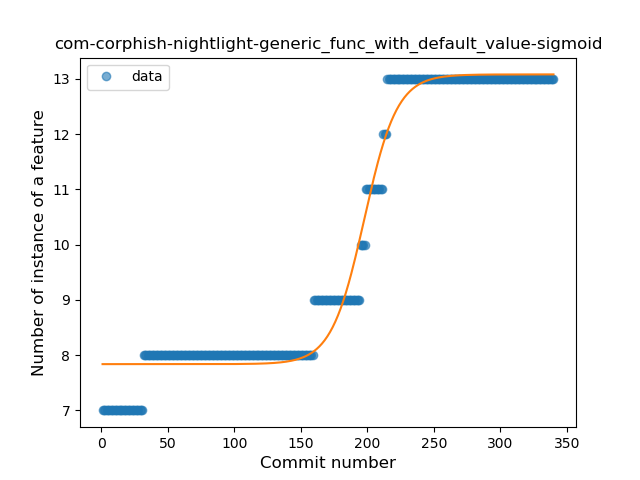

15. ca-rmen-android-poetassistant

	*  Function: 
	* R_Squared: 0.97425513
 

16. com-rhm-pwn

	*  Function: 
	* R_Squared: 0.97409963
 

17. app-opass-ccip

	*  Function: 
	* R_Squared: 0.97261909
 

18. com-zeapo-pwdstore

	*  Function: 
	* R_Squared: 0.97005533
 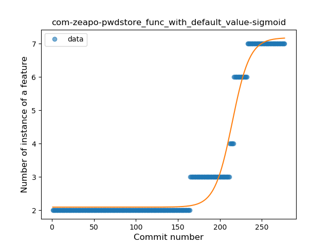

19. link-standen-michael-phonesaver

	*  Function: 
	* R_Squared: 0.96580856
 

20. moe-feng-nhentai

	*  Function: 
	* R_Squared: 0.96519491
 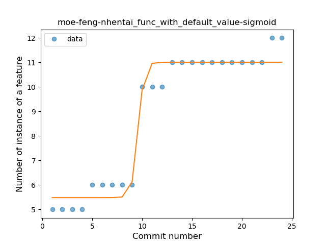

21. org-mozilla-focus

	*  Function: 
	* R_Squared: 0.96317471
 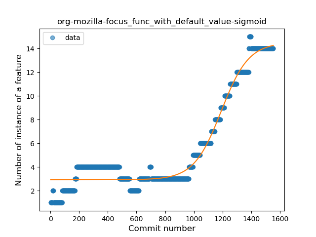

22. org-mozilla-klar

	*  Function: 
	* R_Squared: 0.96317471
 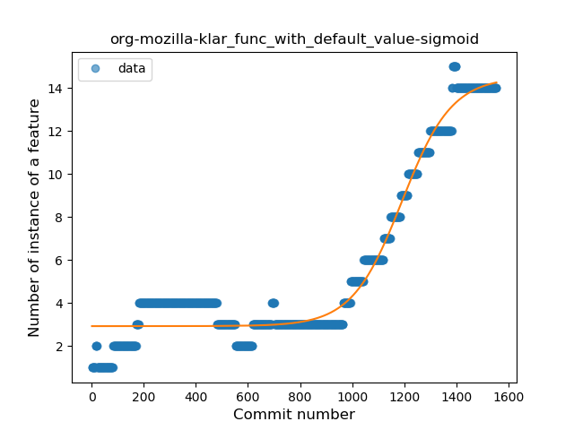

23. de-grobox-liberario

	*  Function: 
	* R_Squared: 0.96169495
 

24. it-diab

	*  Function: 
	* R_Squared: 0.96163691
 

25. tk-superl2-xwifi

	*  Function: 
	* R_Squared: 0.96026242
 

26. de-blankedv-lanbahnpanel

	*  Function: 
	* R_Squared: 0.95841447
 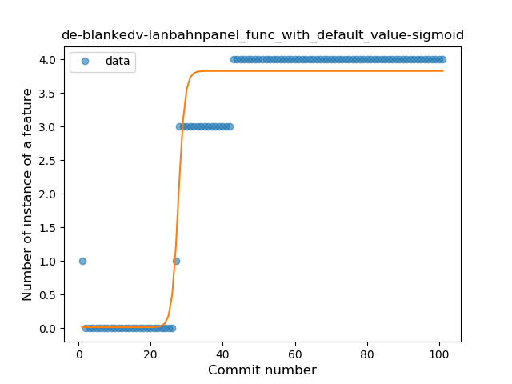

27. me-blog-korn123-easydiary

	*  Function: 
	* R_Squared: 0.95474991
 

28. com-github-cvzi-screenshottile

	*  Function: 
	* R_Squared: 0.95409648
 

29. de-Maxr1998-xposed-maxlock

	*  Function: 
	* R_Squared: 0.95239864
 

30. com-simplemobiletools-notes-pro

	*  Function: 
	* R_Squared: 0.94919642
 

31. com-nextcloud-talk2

	*  Function: 
	* R_Squared: 0.94810842
 

32. at-bitfire-davdroid

	*  Function: 
	* R_Squared: 0.947706
 

33. org-ligi-passandroid

	*  Function: 
	* R_Squared: 0.9393536
 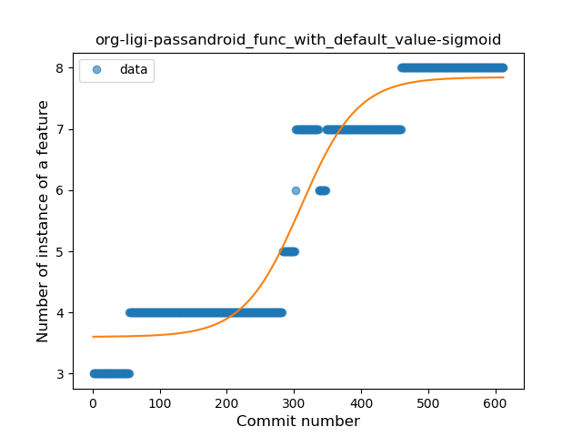

35. net-mm2d-android-vmb

	*  Function: 
	* R_Squared: 0.93461082
 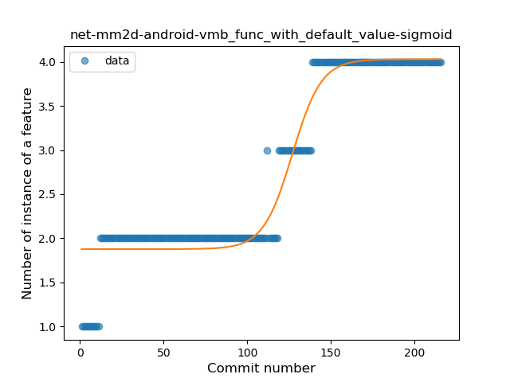

36. pl-org-seva-navigator

	*  Function: 
	* R_Squared: 0.92914611
 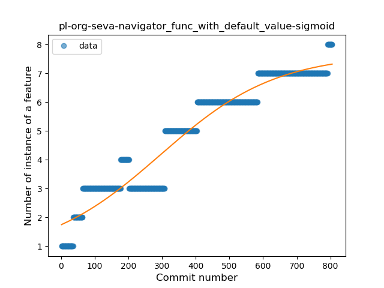

37. eu-depau-etchdroid

	*  Function: 
	* R_Squared: 0.92576061
 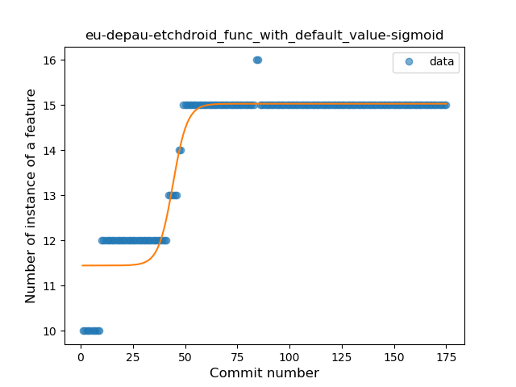

38. com-simplemobiletools-musicplayer

	*  Function: 
	* R_Squared: 0.92455063
 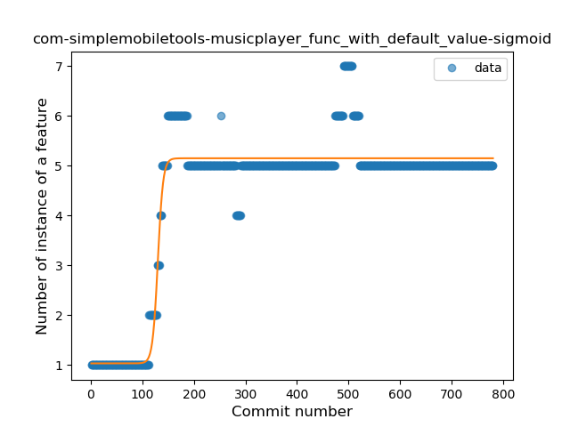

39. net-yslibrary-monotweety

	*  Function: 
	* R_Squared: 0.92360763
 

41. com-kgurgul-cpuinfo

	*  Function: 
	* R_Squared: 0.91486279
 

42. cat-xojan-random1

	*  Function: 
	* R_Squared: 0.91325005
 

43. com-etesync-syncadapter

	*  Function: 
	* R_Squared: 0.90966363
 

44. is-xyz-omw

	*  Function: 
	* R_Squared: 0.90832172
 

45. com-jim-sharetocomputer

	*  Function: 
	* R_Squared: 0.90740076
 

46. ch-abertschi-adfree

	*  Function: 
	* R_Squared: 0.90699279
 

47. info-dvkr-screenstream

	*  Function: 
	* R_Squared: 0.90063138
 

48. pixel-kotlin-bassblog

	*  Function: 
	* R_Squared: 0.90047822
 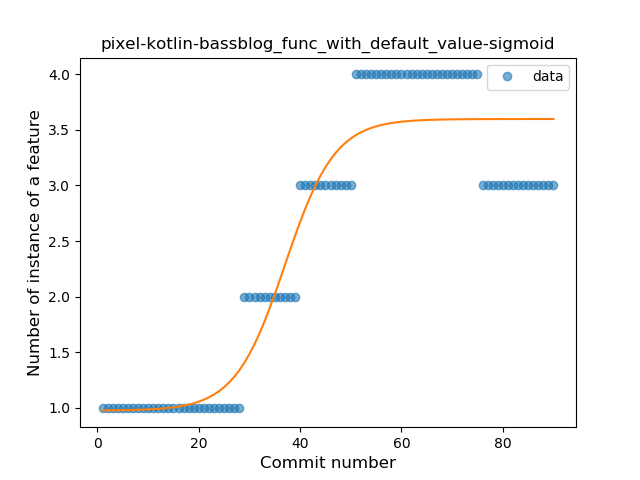

49. apps-amine-bou-readerforselfoss

	*  Function: 
	* R_Squared: 0.89828228
 

50. com-log28

	*  Function: 
	* R_Squared: 0.89632241
 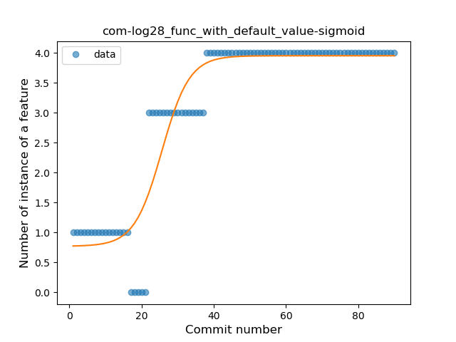

51. io-github-fvasco-pinpoi

	*  Function: 
	* R_Squared: 0.88963313
 

52. com-simplemobiletools-calendar-pro

	*  Function: 
	* R_Squared: 0.88636047
 

53. com-pluscubed-velociraptor

	*  Function: 
	* R_Squared: 0.87493336
 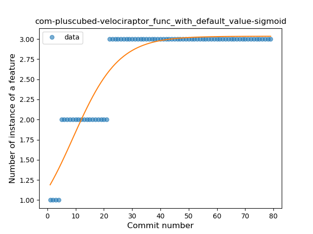

54. me-echeung-moemoekyun-fdroid

	*  Function: 
	* R_Squared: 0.8603485
 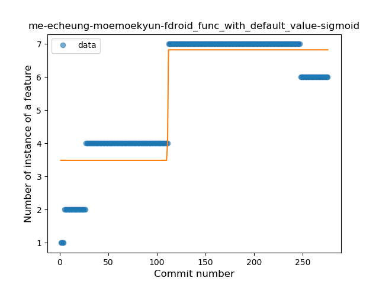

55. com-uncmorfi

	*  Function: 
	* R_Squared: 0.85154973
 

56. com-jmstudios-redmoon

	*  Function: 
	* R_Squared: 0.85140897
 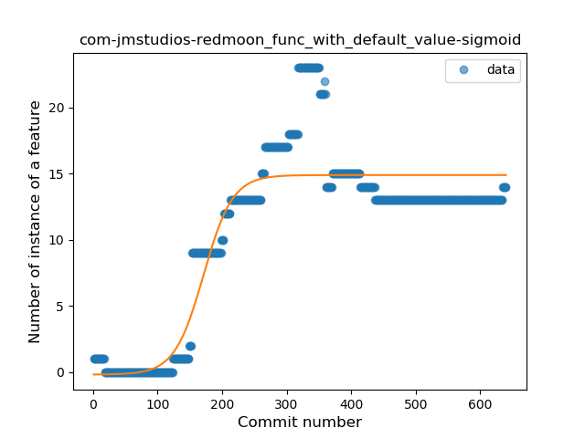

57. com-simplemobiletools-gallery

	*  Function: 
	* R_Squared: 0.84567428
 

58. com-simplemobiletools-camera

	*  Function: 
	* R_Squared: 0.84052989
 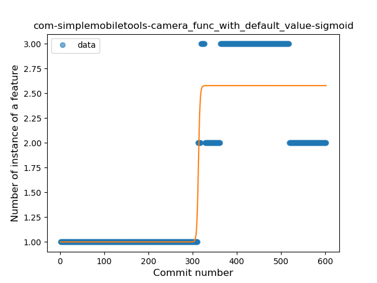

59. com-epimorphics-android-myrivers

	*  Function: 
	* R_Squared: 0.79852873
 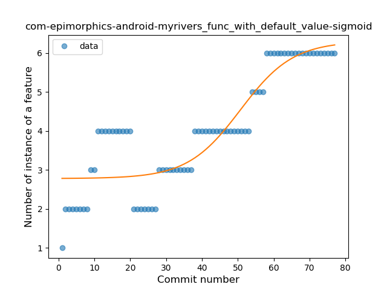

60. uk-colessoft-android-hilllist

	*  Function: 
	* R_Squared: 0.75423249
 

61. com-pixplicity-cryptogram

	*  Function: 
	* R_Squared: 0.7532584
 

62. fr-openium-auvergnewebcams

	*  Function: 
	* R_Squared: 0.75317831
 

64. org-mosad-seil0-projectlaogai

	*  Function: 
	* R_Squared: 0.71320217
 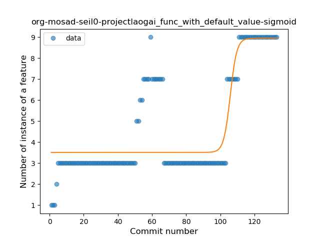

65. me-murks-feedwatcher

	*  Function: 
	* R_Squared: 0.62871756
 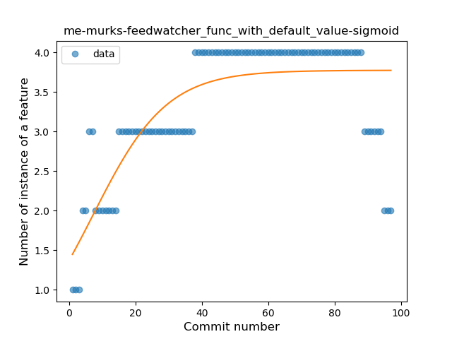

66. org-kiwix-kiwixcustomwikivoyageeurope

	*  Function: 
	* R_Squared: 0.3642009
 

67. org-fossasia-badgemagic

	*  Function: 
	* R_Squared: 0.21608791
 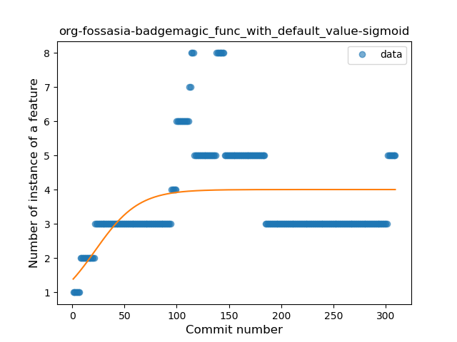

### <a name="T1">Constant Rise</a> 
 ----

1. org-mariotaku-twidere

	*  Function: 
	* R_Squared: 0.99428334
 

2. com-duckduckgo-mobile-android

	*  Function: 
	* R_Squared: 0.98508538
 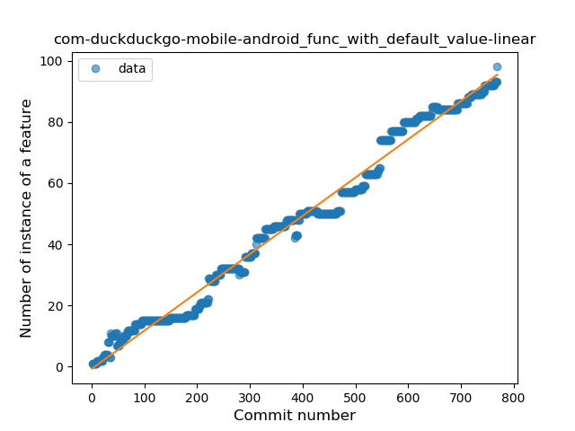

3. com-boardgamegeek

	*  Function: 
	* R_Squared: 0.97627156
 

4. net-bible-android-activity

	*  Function: 
	* R_Squared: 0.9707047
 

5. com-fastaccess-github-libre

	*  Function: 
	* R_Squared: 0.96877721
 

6. com-dozingcatsoftware-vectorcamera

	*  Function: 
	* R_Squared: 0.96709889
 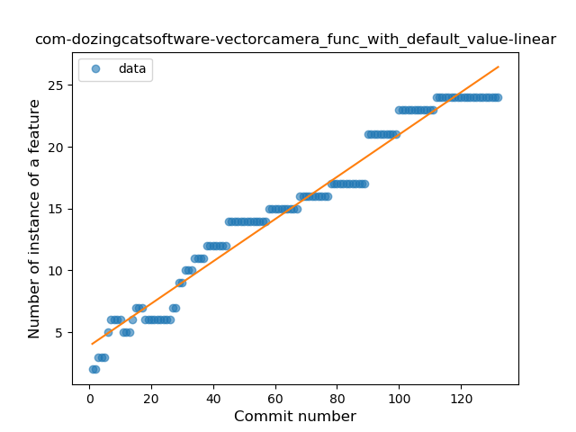

7. com-orgzly

	*  Function: 
	* R_Squared: 0.96191579
 

8. com-keylesspalace-tusky

	*  Function: 
	* R_Squared: 0.96147565
 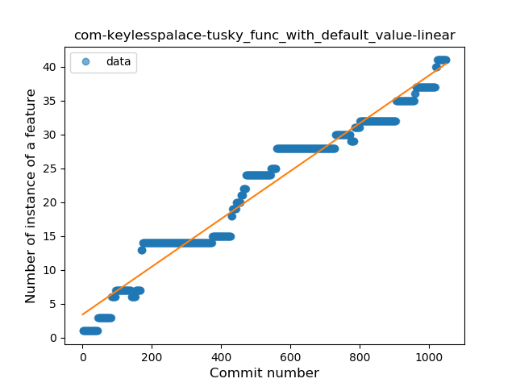

9. one-librem-social

	*  Function: 
	* R_Squared: 0.95394976
 

10. de-ph1b-audiobook

	*  Function: 
	* R_Squared: 0.95000847
 

11. com-tasomaniac-openwith-floss

	*  Function: 
	* R_Squared: 0.94569189
 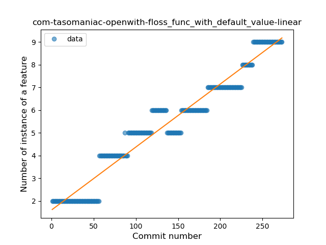

12. ffc-app

	*  Function: 
	* R_Squared: 0.94343094
 

13. be-mygod-vpnhotspot

	*  Function: 
	* R_Squared: 0.9418969
 

14. me-anon-grow

	*  Function: 
	* R_Squared: 0.94012978
 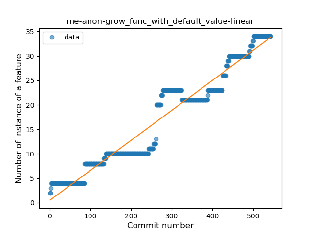

15. xyz-hisname-fireflyiii

	*  Function: 
	* R_Squared: 0.93634852
 

16. ml-adamsprogs-bimba

	*  Function: 
	* R_Squared: 0.9283195
 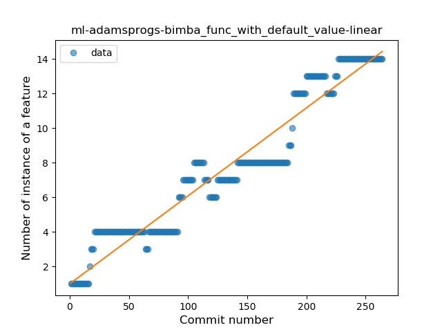

17. com-fsck-k9

	*  Function: 
	* R_Squared: 0.9263553
 

18. net-kourlas-voipms

	*  Function: 
	* R_Squared: 0.91317872
 

19. org-ligi-gobandroid

	*  Function: 
	* R_Squared: 0.91150695
 

20. ru-hyst329-openfool

	*  Function: 
	* R_Squared: 0.91136815
 

21. fi-kroon-vadret

	*  Function: 
	* R_Squared: 0.91129075
 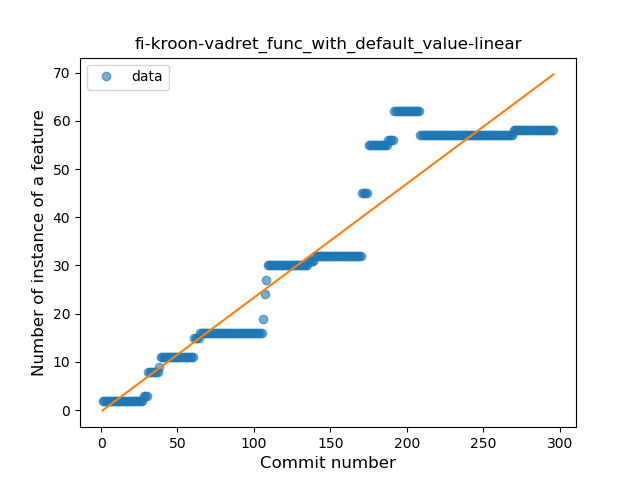

22. com-garpr-android

	*  Function: 
	* R_Squared: 0.90209494
 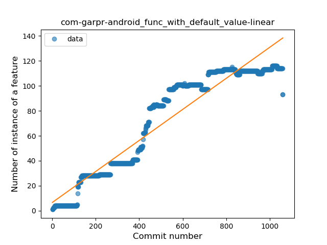

23. com-dp-logcatapp

	*  Function: 
	* R_Squared: 0.8976621
 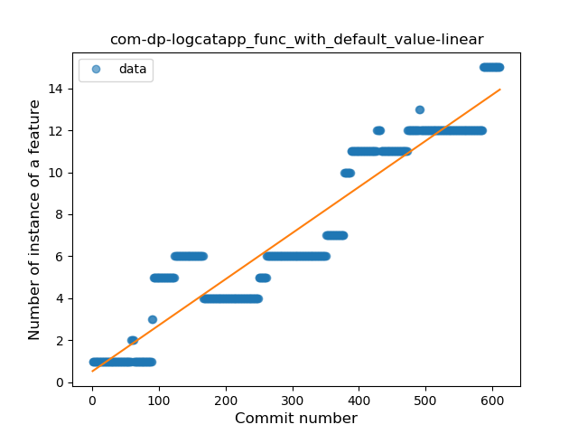

24. com-arcao-geocaching4locus

	*  Function: 
	* R_Squared: 0.89655588
 

25. li-klass-fhem

	*  Function: 
	* R_Squared: 0.89223
 

26. com-github-quarck-calnotify

	*  Function: 
	* R_Squared: 0.88692546
 

27. chat-rocket-android

	*  Function: 
	* R_Squared: 0.88626116
 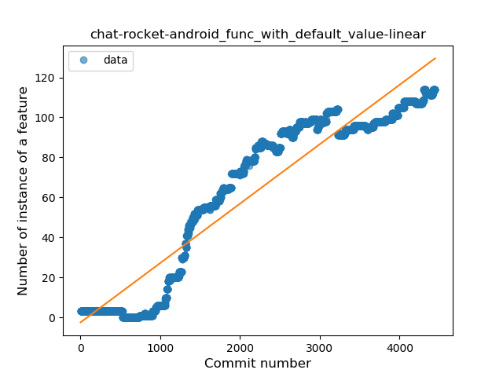

28. com-glodanif-bluetoothchat

	*  Function: 
	* R_Squared: 0.88576437
 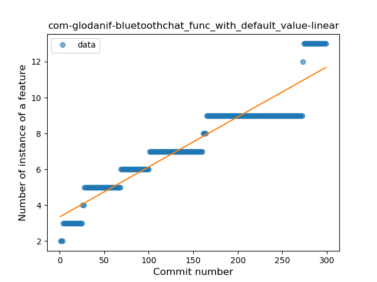

29. com-zacharee1-systemuituner

	*  Function: 
	* R_Squared: 0.88269951
 

30. net-frju-flym

	*  Function: 
	* R_Squared: 0.88040797
 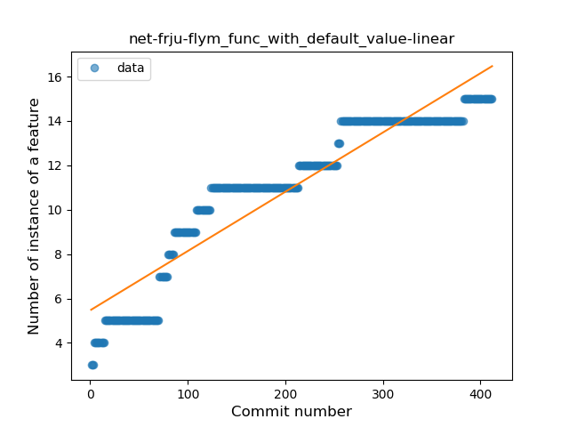

31. com-doctoror-particleswallpaper

	*  Function: 
	* R_Squared: 0.86700937
 

32. me-kirimin-mitsumine

	*  Function: 
	* R_Squared: 0.86079395
 

33. com-mgaetan89-showsrage

	*  Function: 
	* R_Squared: 0.86058248
 

34. com-booboot-vndbandroid

	*  Function: 
	* R_Squared: 0.85796669
 

35. com-njlabs-showjava

	*  Function: 
	* R_Squared: 0.83868682
 

36. com-jereksel-libresubstratum

	*  Function: 
	* R_Squared: 0.83462651
 

37. com-stevenschoen-putionew

	*  Function: 
	* R_Squared: 0.83259004
 

38. com-simplemobiletools-contacts-pro

	*  Function: 
	* R_Squared: 0.8247052
 

39. org-blokada-alarm

	*  Function: 
	* R_Squared: 0.82144424
 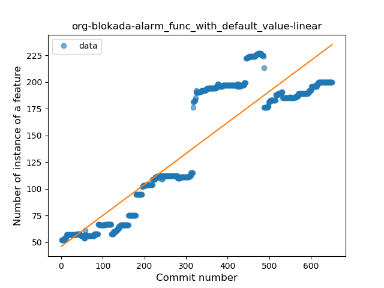

40. com-nononsenseapps-feeder

	*  Function: 
	* R_Squared: 0.81747402
 

41. io-github-benoitduffez-cupsprint

	*  Function: 
	* R_Squared: 0.77506193
 

42. org-moire-ultrasonic

	*  Function: 
	* R_Squared: 0.76832145
 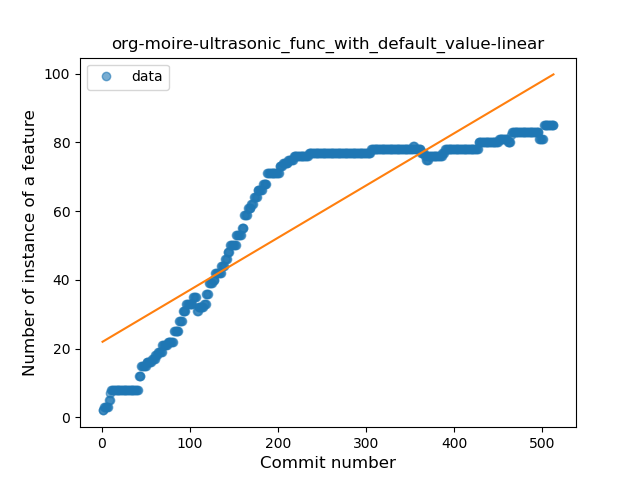

43. info-metadude-android-congress-schedule

	*  Function: 
	* R_Squared: 0.75772773
 

44. com-peterlaurence-trekme

	*  Function: 
	* R_Squared: 0.74914495
 

45. net-osmand-plus

	*  Function: 
	* R_Squared: 0.74531626
 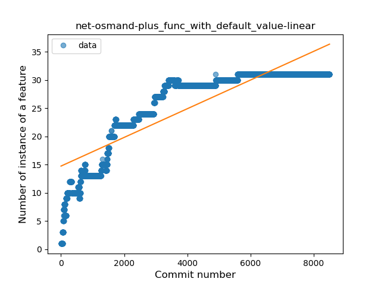

46. pt-ipleiria-mymusicqoe

	*  Function: 
	* R_Squared: 0.74134459
 

47. com-moez-QKSMS

	*  Function: 
	* R_Squared: 0.7100721
 

48. ai-susi

	*  Function: 
	* R_Squared: 0.70181429
 

49. com-guerinet-mymartlet

	*  Function: 
	* R_Squared: 0.70138677
 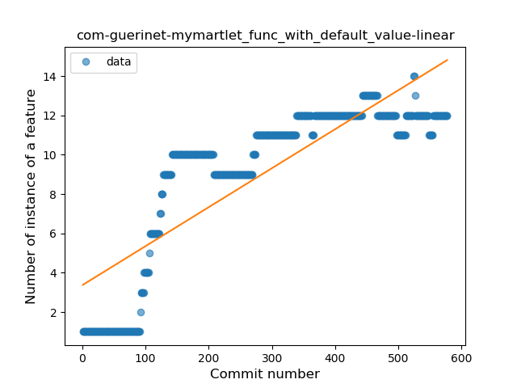

50. com-sduduzog-slimlauncher

	*  Function: 
	* R_Squared: 0.69865615
 

### <a name="T4">Sudden Rise</a> 
 ----

2. org-mozilla-rocket

	*  Function: 
	* R_Squared: 0.98372338
 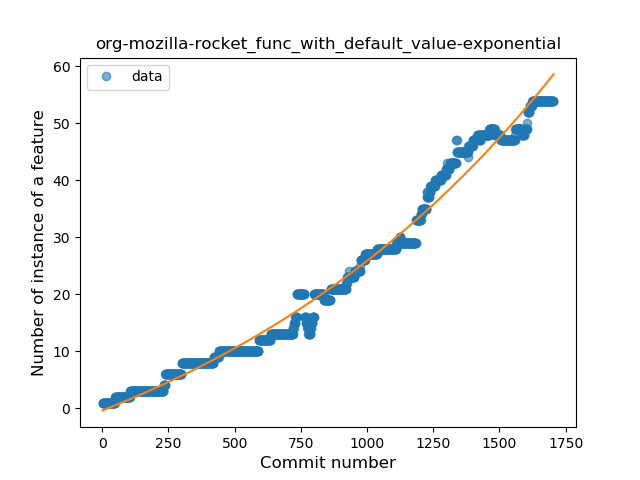

3. ch-deletescape-lawnchair-plah

	*  Function: 
	* R_Squared: 0.98092083
 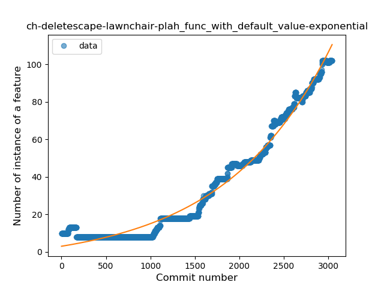

4. acr-browser-lightning

	*  Function: 
	* R_Squared: 0.97361009
 

5. im-vector-alpha

	*  Function: 
	* R_Squared: 0.97333805
 

6. com-lavadip-miniVector

	*  Function: 
	* R_Squared: 0.97214557
 

7. com-bijoysingh-quicknote

	*  Function: 
	* R_Squared: 0.97131381
 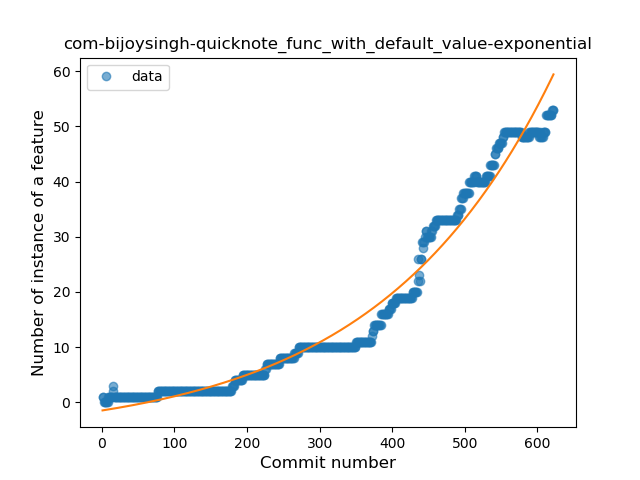

8. io-ipoli-android

	*  Function: 
	* R_Squared: 0.96987796
 

9. de-westnordost-streetcomplete

	*  Function: 
	* R_Squared: 0.96626752
 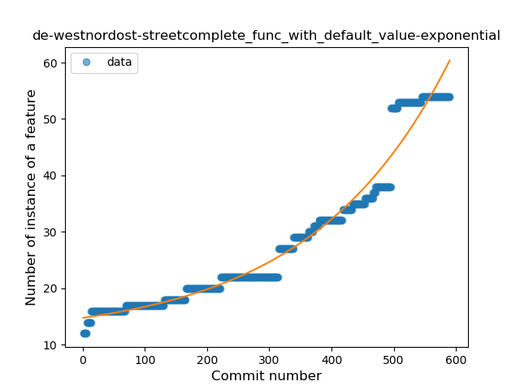

10. quickbeer-android

	*  Function: 
	* R_Squared: 0.96389443
 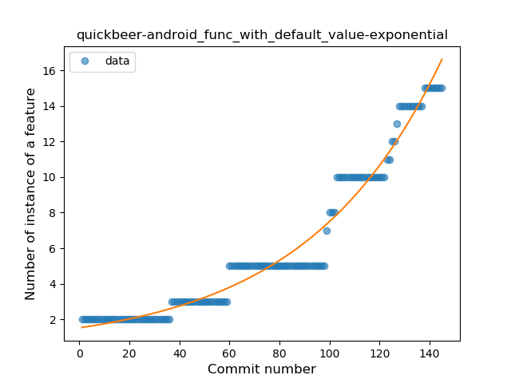

11. eu-kanade-tachiyomi

	*  Function: 
	* R_Squared: 0.9629612
 

12. ch-rmy-android-http_shortcuts

	*  Function: 
	* R_Squared: 0.96149781
 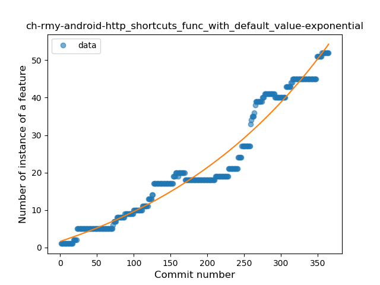

13. com-simplemobiletools-gallery-pro

	*  Function: 
	* R_Squared: 0.9589246
 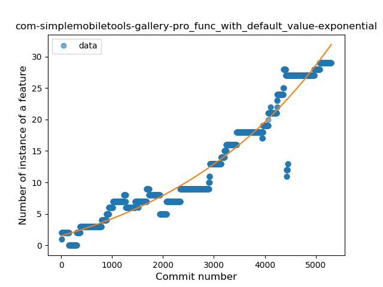

14. com-eventyay-attendee

	*  Function: 
	* R_Squared: 0.95342797
 

15. de-markusfisch-android-binaryeye

	*  Function: 
	* R_Squared: 0.94733469
 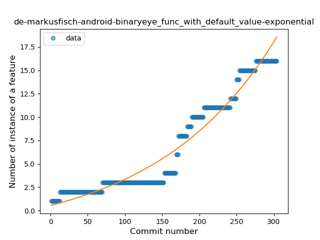

16. com-utazukin-ichaival

	*  Function: 
	* R_Squared: 0.94640712
 

17. se-barsk-park

	*  Function: 
	* R_Squared: 0.94225576
 

18. tech-ula

	*  Function: 
	* R_Squared: 0.94063627
 

19. org-walleth

	*  Function: 
	* R_Squared: 0.93583513
 

20. is-xyz-mpv

	*  Function: 
	* R_Squared: 0.93164292
 

21. org-kaqui

	*  Function: 
	* R_Squared: 0.93008122
 

22. net-mm2d-dmsexplorer

	*  Function: 
	* R_Squared: 0.91814422
 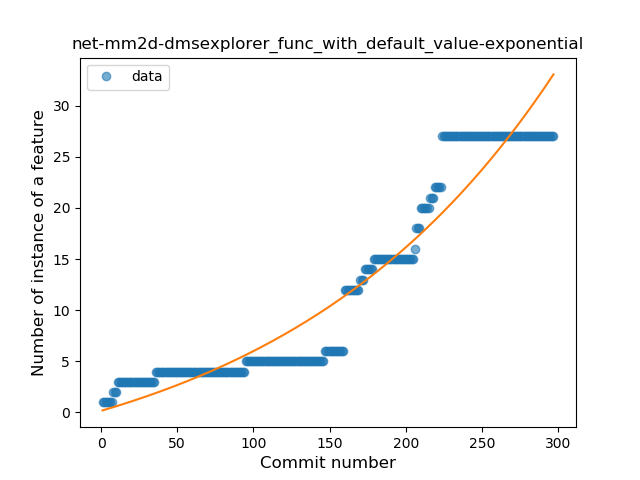

23. org-equeim-tremotesf

	*  Function: 
	* R_Squared: 0.9063402
 

24. me-proxer-app

	*  Function: 
	* R_Squared: 0.89998262
 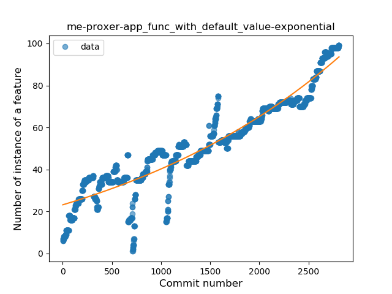

25. com-github-premnirmal-tickerwidget

	*  Function: 
	* R_Squared: 0.89721437
 

26. fr-cph-chicago-foss

	*  Function: 
	* R_Squared: 0.89613213
 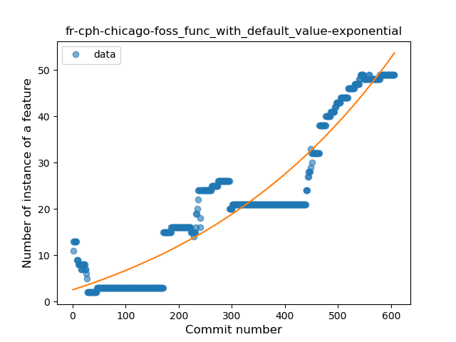

27. org-zimmob-zimlx

	*  Function: 
	* R_Squared: 0.87437529
 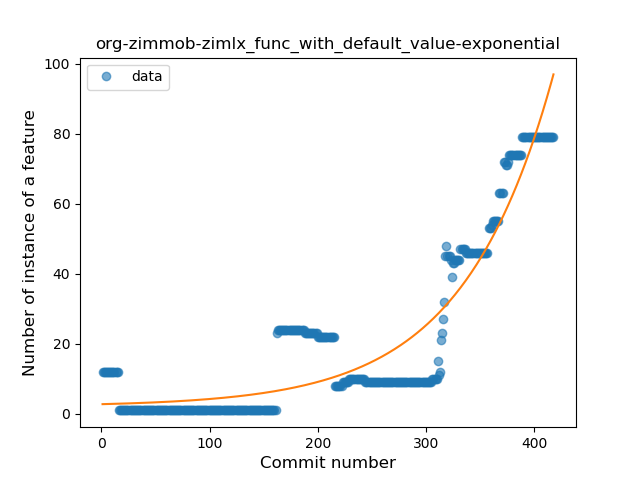

28. com-bernaferrari-changedetection

	*  Function: 
	* R_Squared: 0.87279437
 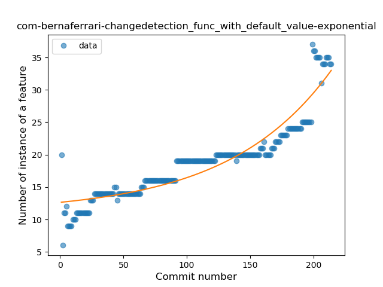

29. ca-josephroque-bowlingcompanion

	*  Function: 
	* R_Squared: 0.85766156
 

30. pt-joaomneto-titancompanion

	*  Function: 
	* R_Squared: 0.85313458
 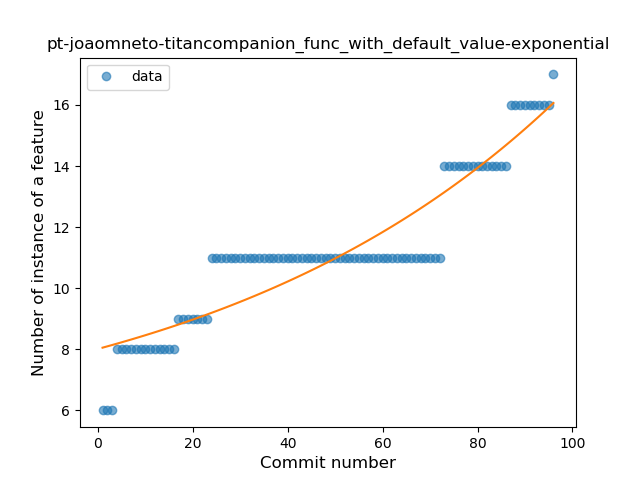

32. com-czbix-v2ex

	*  Function: 
	* R_Squared: 0.83399986
 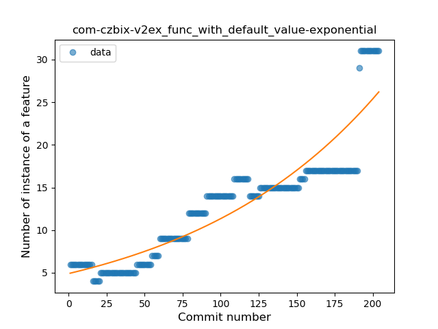

33. ca-fuwafuwa-kaku

	*  Function: 
	* R_Squared: 0.82976813
 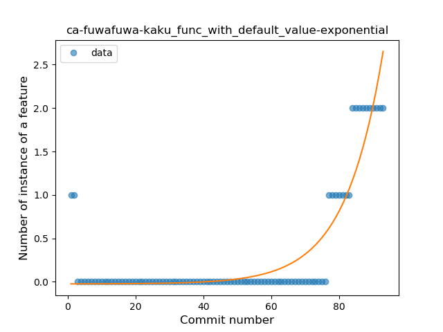

34. info-papdt-express-helper

	*  Function: 
	* R_Squared: 0.81338958
 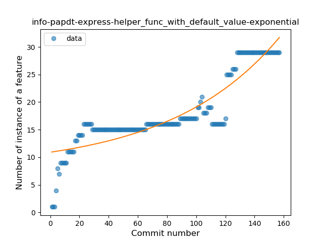

35. com-breadwallet

	*  Function: 
	* R_Squared: 0.77665806
 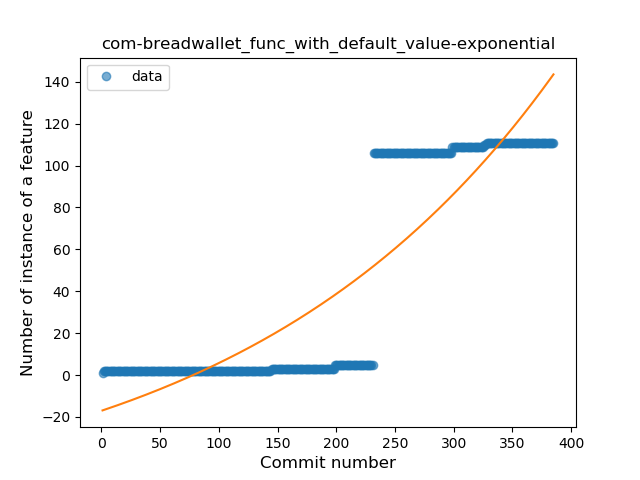

36. cz-dvratil-fbeventsync

	*  Function: 
	* R_Squared: 0.75988052
 

37. com-sjn-stamp

	*  Function: 
	* R_Squared: 0.75680466
 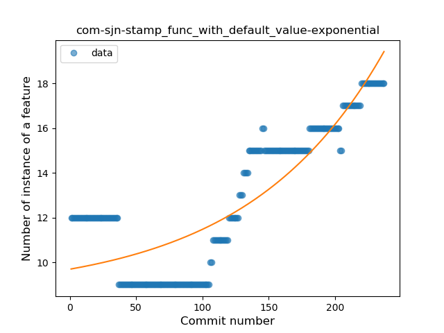

38. com-brentpanther-bitcoinwidget

	*  Function: 
	* R_Squared: 0.7522851
 

39. com-commit451-gitlab

	*  Function: 
	* R_Squared: 0.73893797
 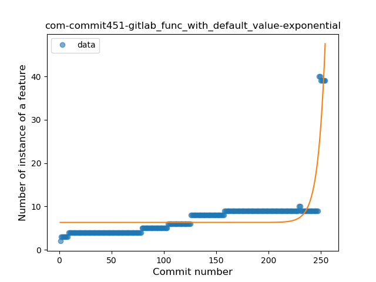

40. com-github-fractals

	*  Function: 
	* R_Squared: 0.65646963
 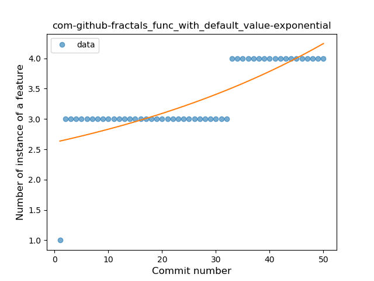

42. pl-org-seva-texter

	*  Function: 
	* R_Squared: 0.55816213
 

43. me-camsteffen-polite

	*  Function: 
	* R_Squared: 0.53164772
 

44. pw-janyo-whatanime

	*  Function: 
	* R_Squared: 0.31491155
 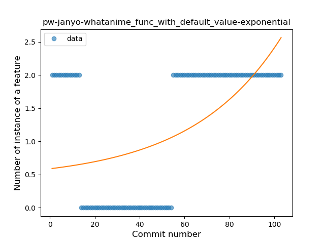

### <a name="T9">Plateau Sudden Rise</a> 
 ----

1. apps-jizzu-simpletodo

	*  Function: 
	* R_Squared: 1.0
 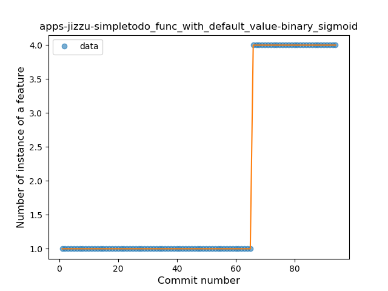

3. com-adityakamble49-dcipher

	*  Function: 
	* R_Squared: 1.0
 

4. com-appspot-pistatium-mahougen

	*  Function: 
	* R_Squared: 1.0
 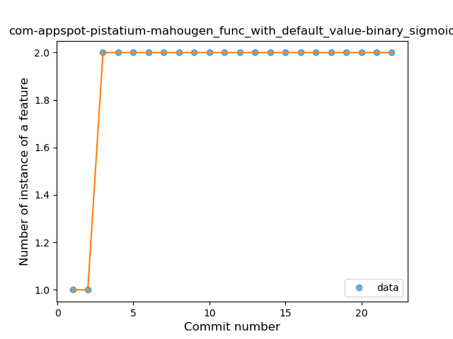

5. com-ofalvai-bpinfo

	*  Function: 
	* R_Squared: 1.0
 

6. com-rohitsuratekar-NCBSinfo

	*  Function: 
	* R_Squared: 1.0
 

7. com-slash-batterychargelimit

	*  Function: 
	* R_Squared: 1.0
 

8. com-tumblr-svetylk0-sheepsgohome-android

	*  Function: 
	* R_Squared: 1.0
 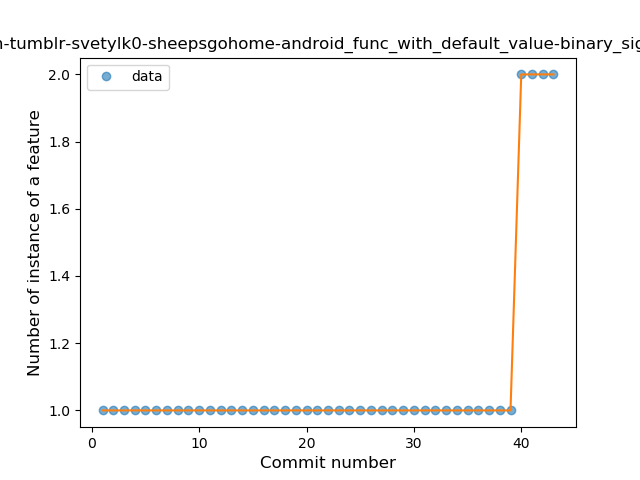

9. de-geeksfactory-opacclient

	*  Function: 
	* R_Squared: 1.0
 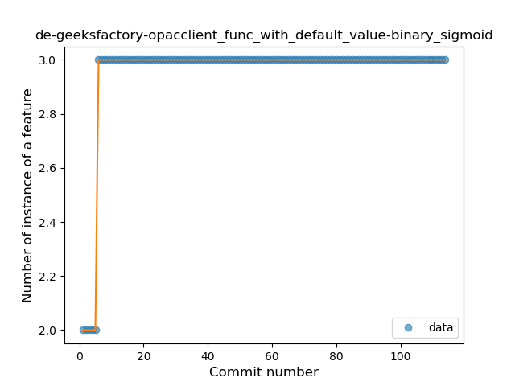

10. fi-tuska-jalkametri

	*  Function: 
	* R_Squared: 1.0
 

11. fr-corenting-edcompanion

	*  Function: 
	* R_Squared: 1.0
 

12. fr-insapp-insapp

	*  Function: 
	* R_Squared: 1.0
 

13. org-ligi-survivalmanual

	*  Function: 
	* R_Squared: 1.0
 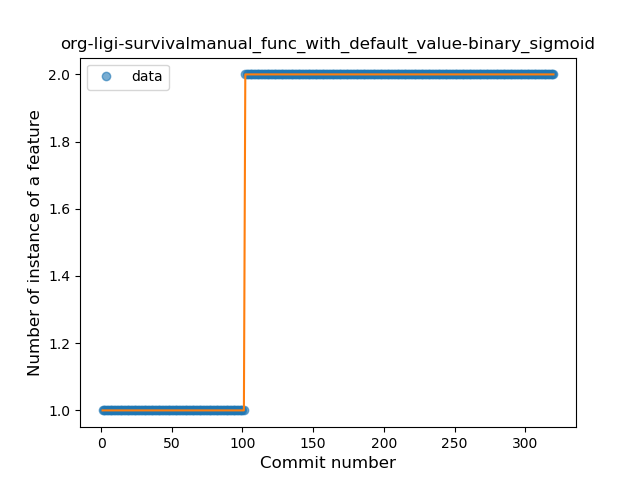

14. org-projectbass-bass

	*  Function: 
	* R_Squared: 1.0
 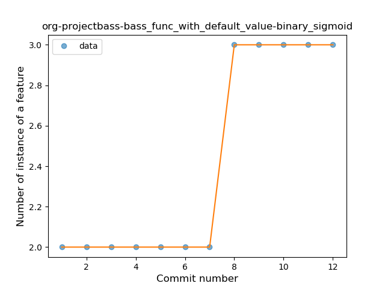

15. org-teamblueridge-pasteitapp

	*  Function: 
	* R_Squared: 1.0
 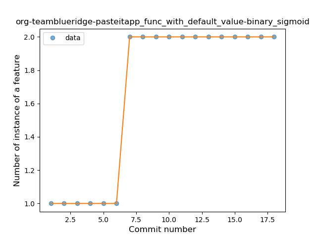

17. me-barta-stayintouch

	*  Function: 
	* R_Squared: 0.98512002
 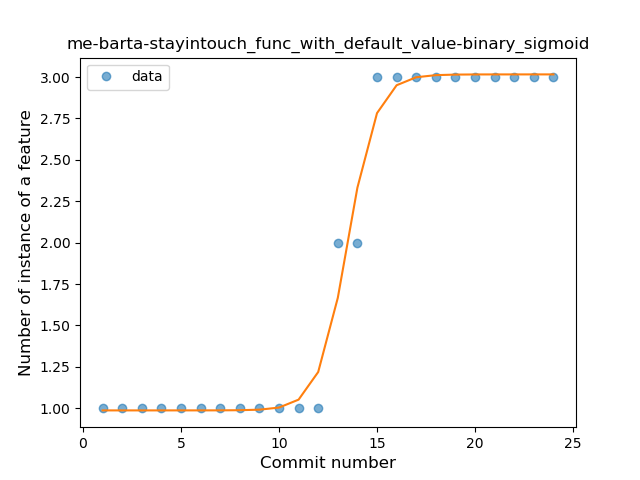

18. ryey-easer-beta

	*  Function: 
	* R_Squared: 0.97863496
 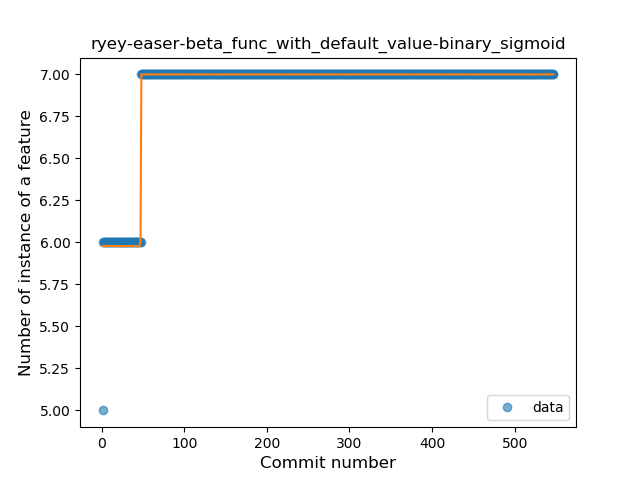

19. org-isoron-uhabits

	*  Function: 
	* R_Squared: 0.97707916
 

20. org-freedombox-freedombox

	*  Function: 
	* R_Squared: 0.9680247
 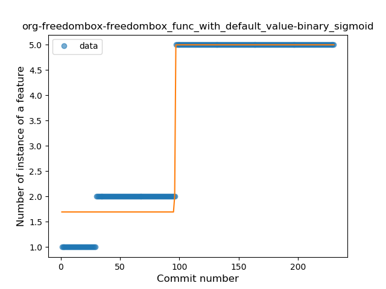

21. com-wabadaba-dziennik

	*  Function: 
	* R_Squared: 0.94818763
 

23. com-benoitquenaudon-tvfoot-red

	*  Function: 
	* R_Squared: 0.87980794
 

24. com-adityakamble49-ttl

	*  Function: 
	* R_Squared: 0.84848485
 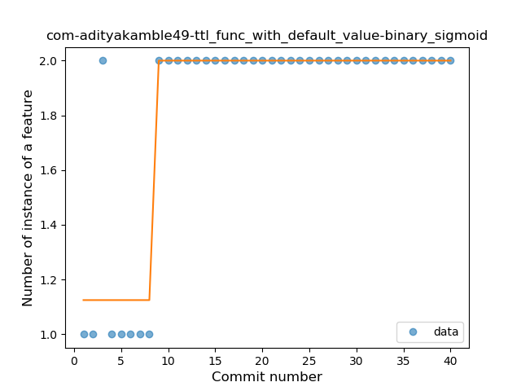

25. io-github-deweyreed-clipboardcleaner

	*  Function: 
	* R_Squared: 0.81241341
 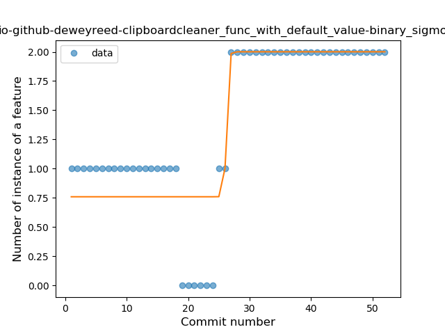

27. com-directdev-portal

	*  Function: 
	* R_Squared: 0.75349616
 

28. com-github-fields-electric

	*  Function: 
	* R_Squared: 0.7020664
 

30. net-stew-stew

	*  Function: 
	* R_Squared: 0.60856865
 

31. org-anibyl-slounik

	*  Function: 
	* R_Squared: 0.50707869
 

32. eu-the4thfloor-msync

	*  Function: 
	* R_Squared: 0.33258263
 

### <a name="T6">Sudden Rise Plateau</a> 
 ----

1. de-r4md4c-gamedealz

	*  Function: 
	* R_Squared: 0.93820532
 

2. io-github-wulkanowy

	*  Function: 
	* R_Squared: 0.92188084
 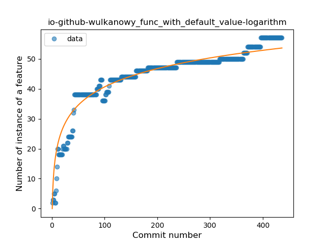

3. de-thecode-android-tazreader

	*  Function: 
	* R_Squared: 0.87968441
 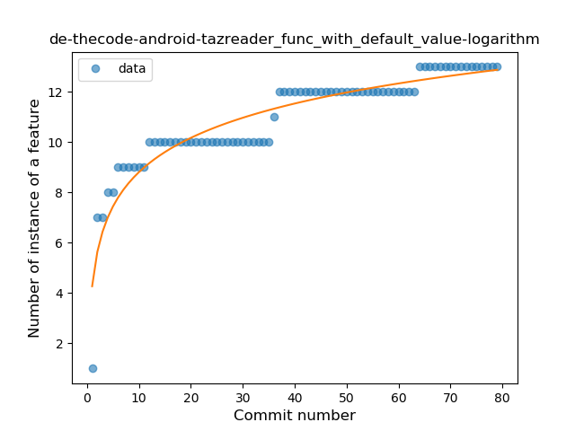

4. fr-chenry-android-freshrss

	*  Function: 
	* R_Squared: 0.86803585
 

5. com-esafirm-androidplayground

	*  Function: 
	* R_Squared: 0.86313559
 

6. de-thecode-lmd

	*  Function: 
	* R_Squared: 0.81965944
 

7. net-nurik-roman-muzei

	*  Function: 
	* R_Squared: 0.7844112
 

8. jp-toastkid-yobidashi

	*  Function: 
	* R_Squared: 0.77004408
 

9. sk-styk-martin-apkanalyzer

	*  Function: 
	* R_Squared: 0.7623544
 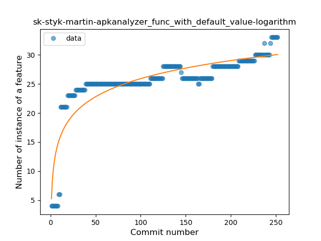

10. com-pitchedapps-frost

	*  Function: 
	* R_Squared: 0.72695581
 

11. me-rei_m-hyakuninisshu

	*  Function: 
	* R_Squared: 0.71495938
 

12. org-pacien-tincapp

	*  Function: 
	* R_Squared: 0.69745373
 

13. nl-mpcjanssen-simpletask

	*  Function: 
	* R_Squared: 0.65990435
 

14. com-yubico-yubioath

	*  Function: 
	* R_Squared: 0.46856849
 

15. ru-nsu-bobrofon-easysshfs

	*  Function: 
	* R_Squared: 0.42790041
 

16. com-bubelov-coins

	*  Function: 
	* R_Squared: 0.25347778
 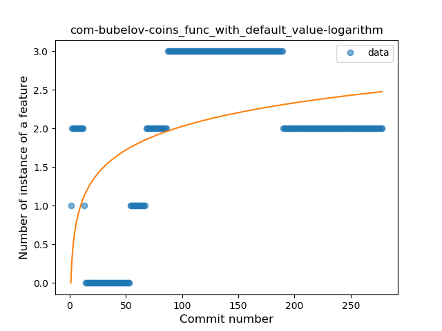

17. org-eurofurence-connavigator

	*  Function: 
	* R_Squared: 0.24790014
 

18. jp-cordea-mackerelclient

	*  Function: 
	* R_Squared: 0.15598702
 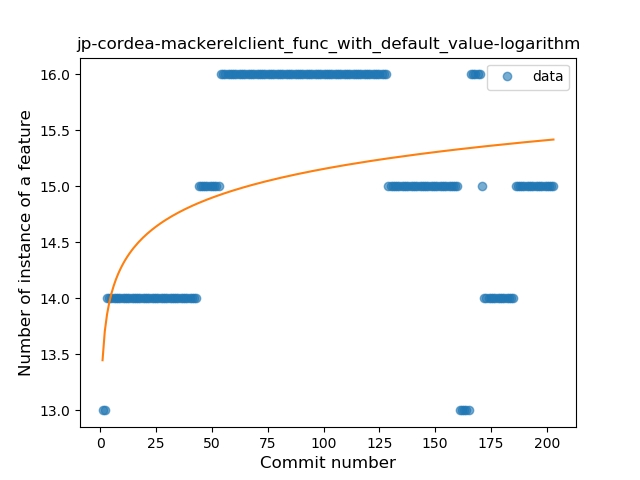

19. org-blitzortung-android-app

	*  Function: 
	* R_Squared: 0.13535877
 

### <a name="T11">Instability</a> 
 ----

1. com-androidheads-vienna-escalero

	*  Function: 
	* R_Squared: 1.0
 

2. com-bracketcove-postrainer

	*  Function: 
	* R_Squared: 0.9985348
 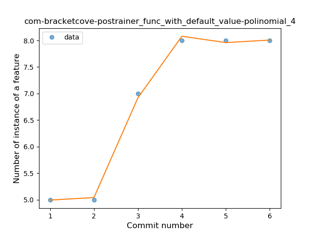

3. com-ianhanniballake-contractiontimer

	*  Function: 
	* R_Squared: 0.97993311
 

4. me-siketyan-silicagel

	*  Function: 
	* R_Squared: 0.84210526
 

5. college-wyk-app

	*  Function: 
	* R_Squared: 0.83873518
 

6. me-impa-knockonports

	*  Function: 
	* R_Squared: 0.81113851
 

7. fr-rhaz-ipfs-sweet

	*  Function: 
	* R_Squared: 0.45186496
 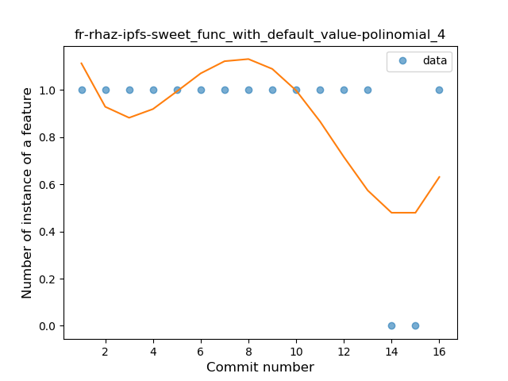

### <a name="T10">Plateau Sudden Decline</a> 
 ----

2. co-pxhouse-sas

	*  Function: 
	* R_Squared: 1.0
 

16. rectangledbmi-com-pittsburghrealtimetracker

	*  Function: 
	* R_Squared: 1.0
 

22. com-tutpro-baresip

	*  Function: 
	* R_Squared: 0.90046647
 

26. io-trewartha-positional

	*  Function: 
	* R_Squared: 0.77840588
 

29. org-mifos-mobile

	*  Function: 
	* R_Squared: 0.63782615
 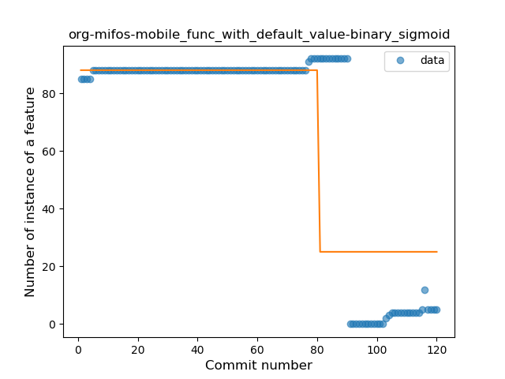

33. com-pavelsikun-runinbackgroundpermissionsetter

	*  Function: 
	* R_Squared: 0.2991453
 

### <a name="T5">Sudden Decline</a> 
 ----

1. com-conorodonnell-bus

	*  Function: 
	* R_Squared: 1.0
 

31. com-calintat-sensors

	*  Function: 
	* R_Squared: 0.84943046
 

41. com-benny-openlauncher

	*  Function: 
	* R_Squared: 0.60701086
 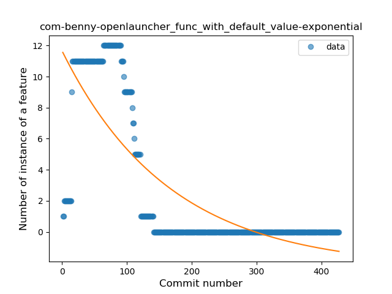

45. net-nonylene-photolinkviewer

	*  Function: 
	* R_Squared: 0.19322671
 

### <a name="T2">Constant Decline</a> 
 ----

51. com-simplemobiletools-applauncher

	*  Function: 
	* R_Squared: 0.17770238
 

52. com-motion-stage1

	*  Function: 
	* R_Squared: 0.14855767
 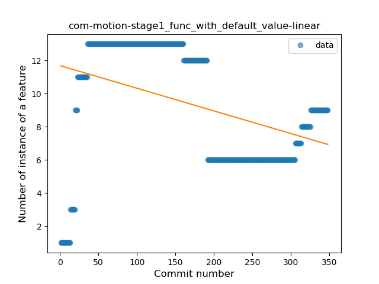

53. es-usc-citius-servando-calendula

	*  Function: 
	* R_Squared: 0.05172414
 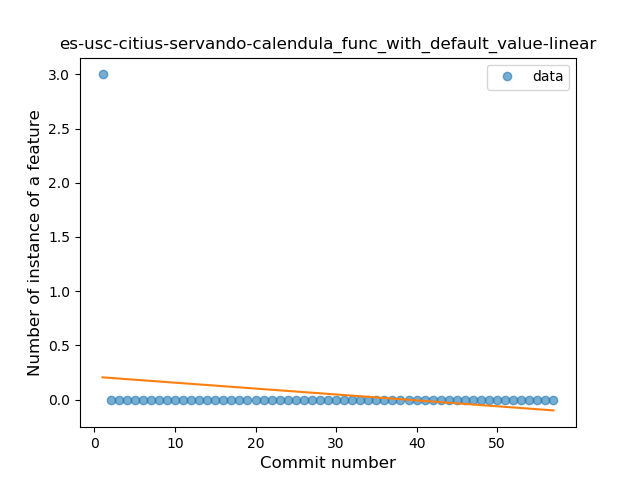

### <a name="T8">Plateau Gradual Decline</a> 
 ----

34. at-bitfire-icsdroid

	*  Function: 
	* R_Squared: 0.93602652
 

40. com-calintat-units

	*  Function: 
	* R_Squared: 0.92085427
 

63. superustats-tool-android

	*  Function: 
	* R_Squared: 0.74828258
 

### <a name="T3">Stability</a> 
 ----

