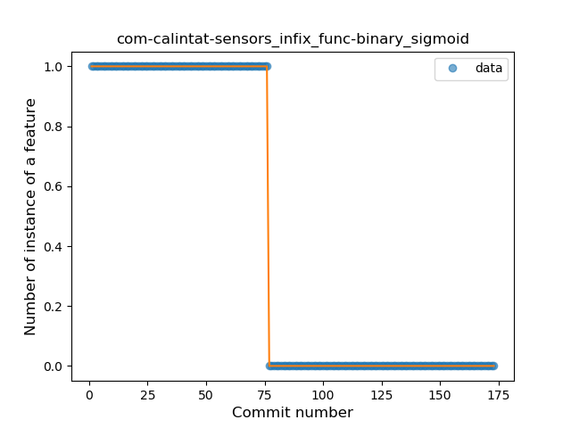
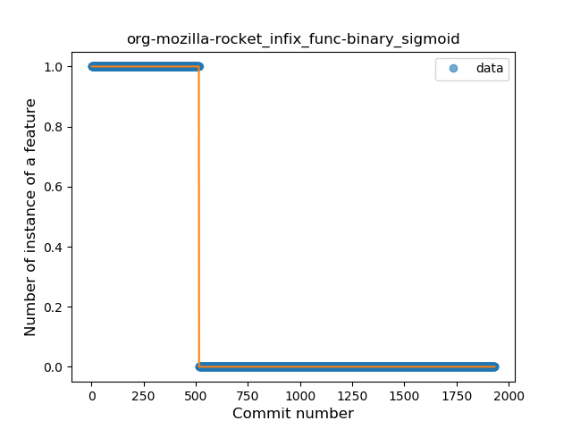
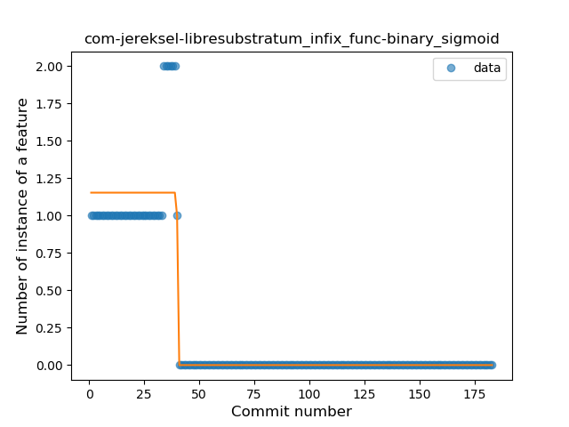
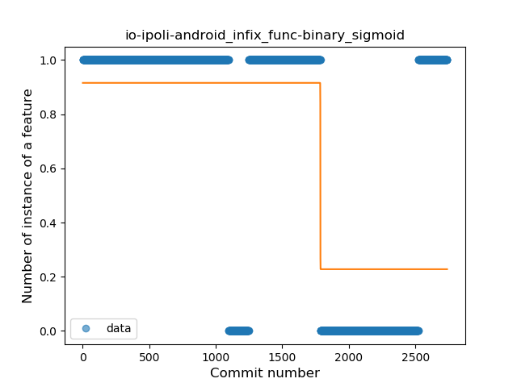
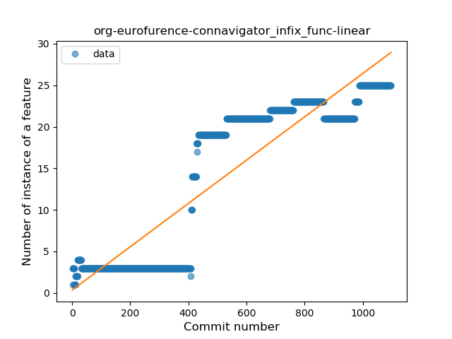
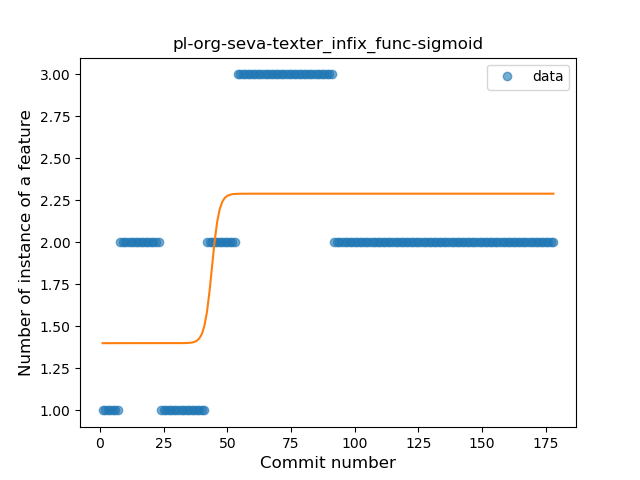
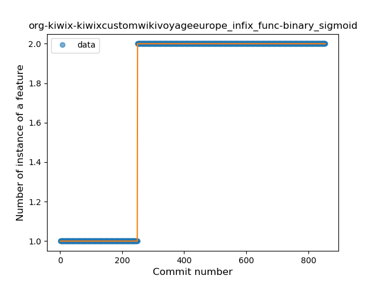
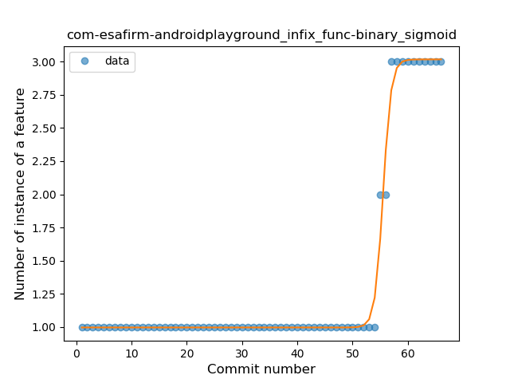
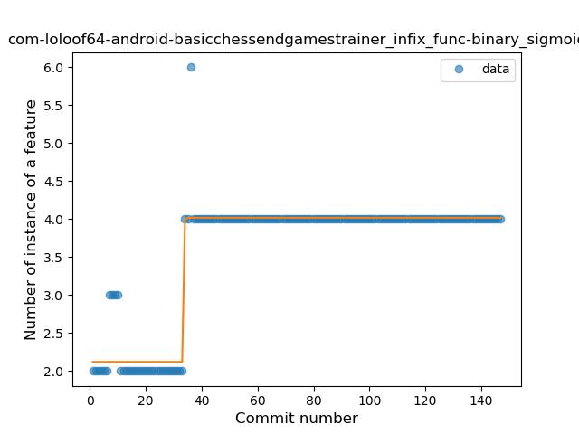

## Infix Function
----
**Best fit = Plateau Sudden Decline**: 6

Function | N# best fit
----|----
<a href=" #T10">Plateau Sudden Decline</a> | 6
<a href=" #T1">Constant Rise</a> | 3
<a href=" #T7">Plateau Gradual Rise</a> | 3
<a href=" #T9">Plateau Sudden Rise</a> | 3
<a href=" #T5">Sudden Decline</a> | 1
<a href=" #T2">Constant Decline</a> | 0
<a href=" #T3">Stability</a> | 0
<a href=" #T4">Sudden Rise</a> | 0
<a href=" #T6">Sudden Rise Plateau</a> | 0
<a href=" #T8">Plateau Gradual Decline</a> | 0
<a href=" #T11">Instability</a> | 0

### <a name="T10">Plateau Sudden Decline</a> 
 ----

1. com-calintat-sensors

	*  Function: 
	* R_Squared: 1.0
 

2. com-calintat-units

	*  Function: 
	* R_Squared: 1.0
 

3. com-yubico-yubioath

	*  Function: 
	* R_Squared: 1.0
 

5. org-mozilla-rocket

	*  Function: 
	* R_Squared: 1.0
 

8. com-jereksel-libresubstratum

	*  Function: 
	* R_Squared: 0.89067111
 

9. io-ipoli-android

	*  Function: 
	* R_Squared: 0.49002249
 

### <a name="T1">Constant Rise</a> 
 ----

1. org-eurofurence-connavigator

	*  Function: 
	* R_Squared: 0.80834609
 

2. pl-org-seva-navigator

	*  Function: 
	* R_Squared: 0.71348849
 

3. de-ph1b-audiobook

	*  Function: 
	* R_Squared: 0.04918471
 

### <a name="T7">Plateau Gradual Rise</a> 
 ----

1. ch-deletescape-lawnchair-plah

	*  Function: 
	* R_Squared: 0.97902793
 

2. com-tasomaniac-openwith-floss

	*  Function: 
	* R_Squared: 0.90932199
 

3. pl-org-seva-texter

	*  Function: 
	* R_Squared: 0.40044042
 

### <a name="T9">Plateau Sudden Rise</a> 
 ----

4. org-kiwix-kiwixcustomwikivoyageeurope

	*  Function: 
	* R_Squared: 1.0
 

6. com-esafirm-androidplayground

	*  Function: 
	* R_Squared: 0.99058701
 

7. com-loloof64-android-basicchessendgamestrainer

	*  Function: 
	* R_Squared: 0.92483431
 

### <a name="T5">Sudden Decline</a> 
 ----

1. com-glodanif-bluetoothchat

	*  Function: 
	* R_Squared: 0.09986302
 

### <a name="T2">Constant Decline</a> 
 ----

### <a name="T3">Stability</a> 
 ----

### <a name="T4">Sudden Rise</a> 
 ----

### <a name="T6">Sudden Rise Plateau</a> 
 ----

### <a name="T8">Plateau Gradual Decline</a> 
 ----

### <a name="T11">Instability</a> 
 ----

