## Inline Function
----
**Best fit = Plateau Sudden Rise**: 20

Function | N# best fit
----|----
<a href=" #T9">Plateau Sudden Rise</a> | 20
<a href=" #T7">Plateau Gradual Rise</a> | 17
<a href=" #T10">Plateau Sudden Decline</a> | 14
<a href=" #T1">Constant Rise</a> | 11
<a href=" #T4">Sudden Rise</a> | 11
<a href=" #T2">Constant Decline</a> | 5
<a href=" #T5">Sudden Decline</a> | 5
<a href=" #T6">Sudden Rise Plateau</a> | 5
<a href=" #T11">Instability</a> | 5
<a href=" #T8">Plateau Gradual Decline</a> | 2
<a href=" #T3">Stability</a> | 0

### <a name="T9">Plateau Sudden Rise</a> 
 ----

1. com-breadwallet

	*  Function: 
	* R_Squared: 1.0
 

2. com-github-premnirmal-tickerwidget

	*  Function: 
	* R_Squared: 1.0
 

3. com-guardafilme

	*  Function: 
	* R_Squared: 1.0
 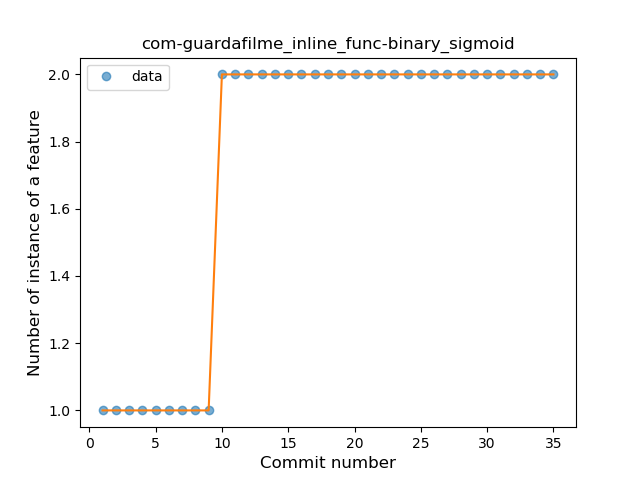

4. com-lavadip-miniVector

	*  Function: 
	* R_Squared: 1.0
 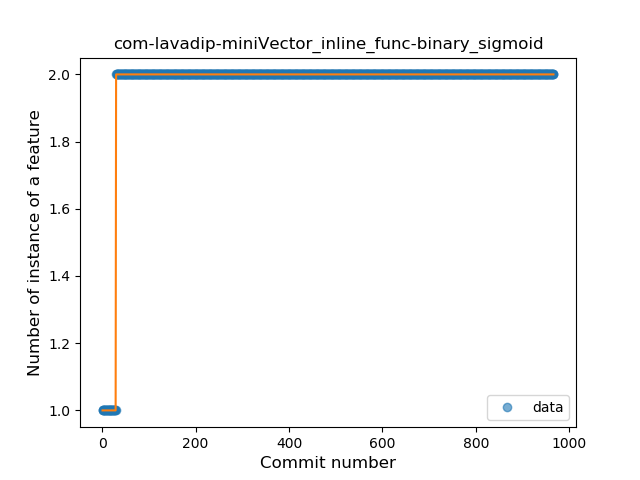

8. com-sjn-stamp

	*  Function: 
	* R_Squared: 1.0
 

9. im-vector-alpha

	*  Function: 
	* R_Squared: 1.0
 

10. info-papdt-express-helper

	*  Function: 
	* R_Squared: 1.0
 

12. it-diab

	*  Function: 
	* R_Squared: 1.0
 

14. me-camsteffen-polite

	*  Function: 
	* R_Squared: 1.0
 

15. moe-feng-nhentai

	*  Function: 
	* R_Squared: 1.0
 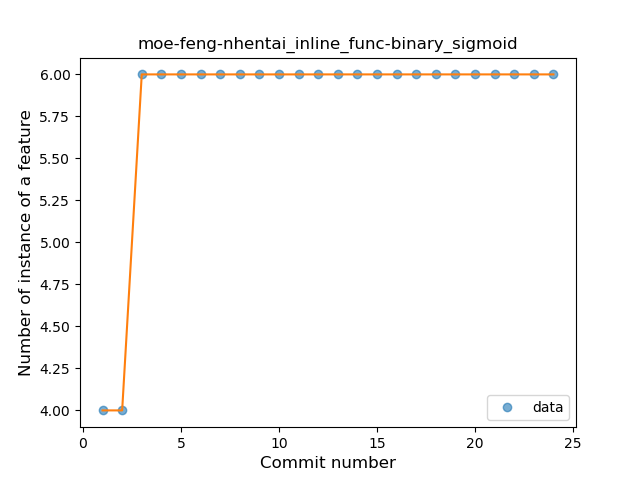

17. net-syncthing-lite

	*  Function: 
	* R_Squared: 1.0
 

18. nl-mpcjanssen-simpletask

	*  Function: 
	* R_Squared: 1.0
 

19. org-blitzortung-android-app

	*  Function: 
	* R_Squared: 1.0
 

22. ch-rmy-android-http_shortcuts

	*  Function: 
	* R_Squared: 0.99300121
 

24. com-glodanif-bluetoothchat

	*  Function: 
	* R_Squared: 0.93150191
 

25. com-bubelov-coins

	*  Function: 
	* R_Squared: 0.91846297
 

26. xyz-hisname-fireflyiii

	*  Function: 
	* R_Squared: 0.8383709
 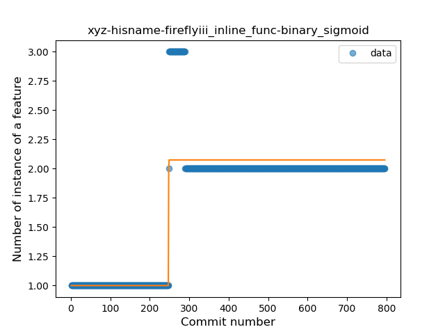

30. com-github-quarck-calnotify

	*  Function: 
	* R_Squared: 0.71006174
 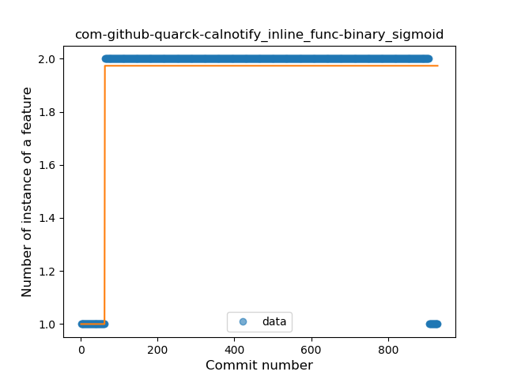

31. tech-ula

	*  Function: 
	* R_Squared: 0.4656127
 

33. com-jmstudios-redmoon

	*  Function: 
	* R_Squared: 0.35842027
 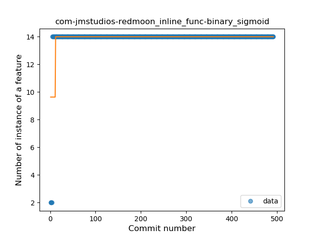

### <a name="T7">Plateau Gradual Rise</a> 
 ----

1. org-mariotaku-twidere

	*  Function: 
	* R_Squared: 0.98165132
 

2. de-markusfisch-android-binaryeye

	*  Function: 
	* R_Squared: 0.98118333
 

3. com-kgurgul-cpuinfo

	*  Function: 
	* R_Squared: 0.97746388
 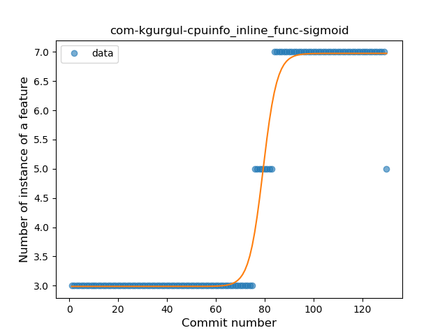

4. de-Maxr1998-xposed-maxlock

	*  Function: 
	* R_Squared: 0.96534791
 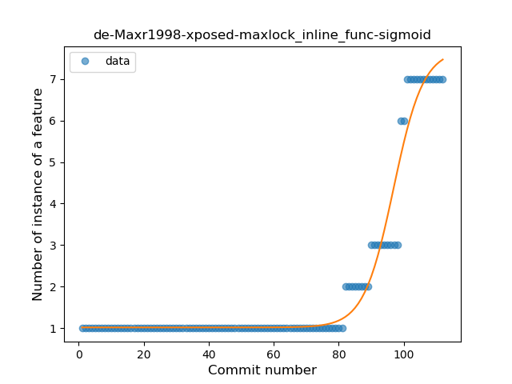

5. de-westnordost-streetcomplete

	*  Function: 
	* R_Squared: 0.96057765
 

6. org-zimmob-zimlx

	*  Function: 
	* R_Squared: 0.95406189
 

7. io-ipoli-android

	*  Function: 
	* R_Squared: 0.95385141
 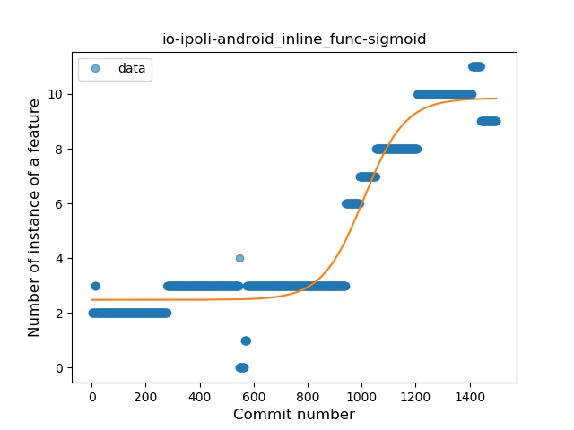

8. pl-hypeapp-episodie

	*  Function: 
	* R_Squared: 0.94510928
 

9. com-booboot-vndbandroid

	*  Function: 
	* R_Squared: 0.94331006
 

10. com-nao20010128nao-DroidComplex

	*  Function: 
	* R_Squared: 0.93786094
 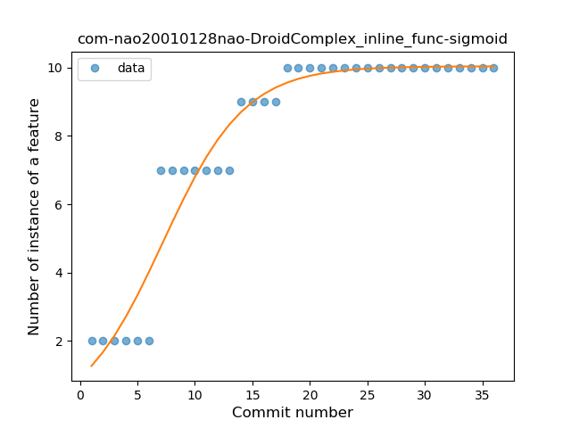

12. fi-kroon-vadret

	*  Function: 
	* R_Squared: 0.88006709
 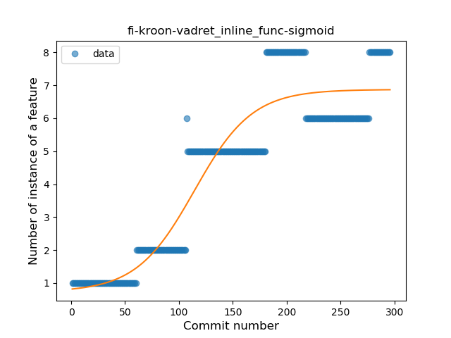

13. chat-rocket-android

	*  Function: 
	* R_Squared: 0.86380158
 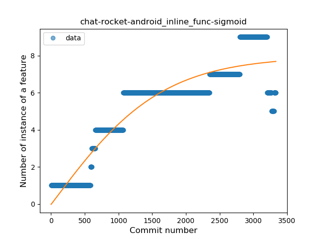

14. org-kiwix-kiwixcustomwikivoyageeurope

	*  Function: 
	* R_Squared: 0.85990696
 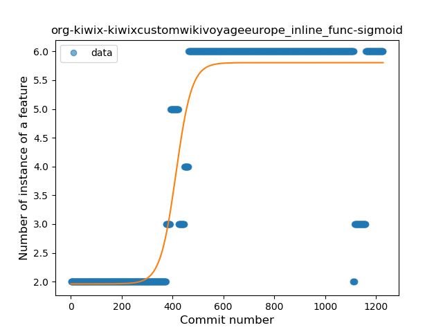

15. com-czbix-v2ex

	*  Function: 
	* R_Squared: 0.8344191
 

16. com-adityakamble49-ttl

	*  Function: 
	* R_Squared: 0.81029015
 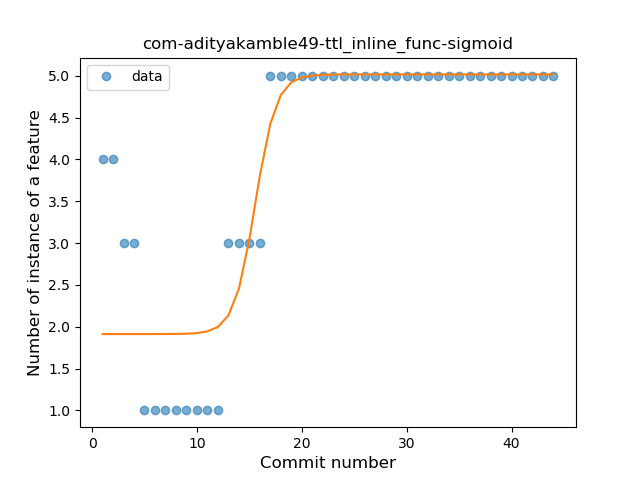

17. com-doctoror-particleswallpaper

	*  Function: 
	* R_Squared: 0.75488677
 

19. org-kaqui

	*  Function: 
	* R_Squared: 0.17237628
 

### <a name="T10">Plateau Sudden Decline</a> 
 ----

5. com-moez-QKSMS

	*  Function: 
	* R_Squared: 1.0
 

6. com-motion-stage1

	*  Function: 
	* R_Squared: 1.0
 

7. com-sduduzog-slimlauncher

	*  Function: 
	* R_Squared: 1.0
 

11. is-xyz-mpv

	*  Function: 
	* R_Squared: 1.0
 

13. jp-org-example-geckour-glyph

	*  Function: 
	* R_Squared: 1.0
 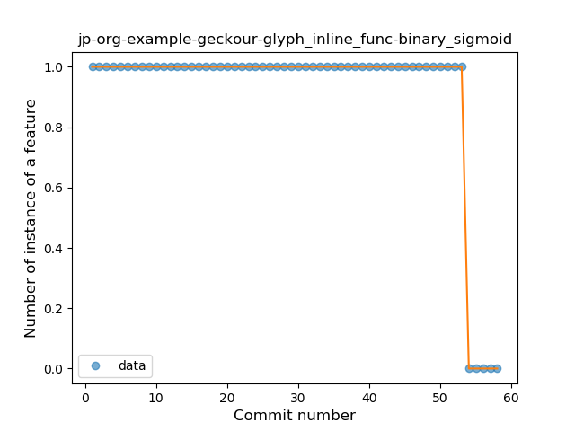

16. net-frju-flym

	*  Function: 
	* R_Squared: 1.0
 

20. pw-janyo-whatanime

	*  Function: 
	* R_Squared: 1.0
 

21. sk-styk-martin-apkanalyzer

	*  Function: 
	* R_Squared: 1.0
 

23. me-impa-knockonports

	*  Function: 
	* R_Squared: 0.98328748
 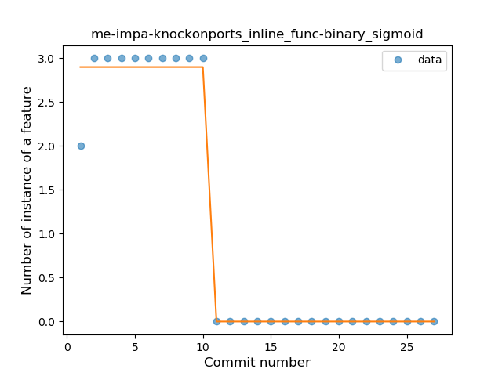

27. se-barsk-park

	*  Function: 
	* R_Squared: 0.82037997
 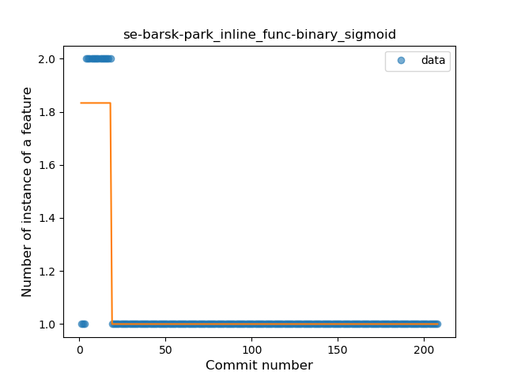

28. io-github-feelfreelinux-wykopmobilny

	*  Function: 
	* R_Squared: 0.81979683
 

29. me-echeung-moemoekyun-fdroid

	*  Function: 
	* R_Squared: 0.76079386
 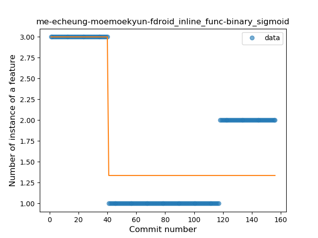

32. pl-org-seva-texter

	*  Function: 
	* R_Squared: 0.41796009
 

34. com-wabadaba-dziennik

	*  Function: 
	* R_Squared: 0.20505342
 

### <a name="T1">Constant Rise</a> 
 ----

1. me-proxer-app

	*  Function: 
	* R_Squared: 0.96196902
 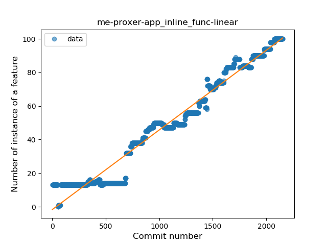

2. acr-browser-lightning

	*  Function: 
	* R_Squared: 0.84999188
 

3. com-duckduckgo-mobile-android

	*  Function: 
	* R_Squared: 0.82807826
 

4. pl-org-seva-navigator

	*  Function: 
	* R_Squared: 0.78300896
 

5. de-ph1b-audiobook

	*  Function: 
	* R_Squared: 0.77327306
 

6. com-boardgamegeek

	*  Function: 
	* R_Squared: 0.77078935
 

7. pt-joaomneto-titancompanion

	*  Function: 
	* R_Squared: 0.73097597
 

8. de-r4md4c-gamedealz

	*  Function: 
	* R_Squared: 0.70172677
 

9. org-eurofurence-connavigator

	*  Function: 
	* R_Squared: 0.66376239
 

10. com-pitchedapps-frost

	*  Function: 
	* R_Squared: 0.66345987
 

12. be-mygod-vpnhotspot

	*  Function: 
	* R_Squared: 0.42315407
 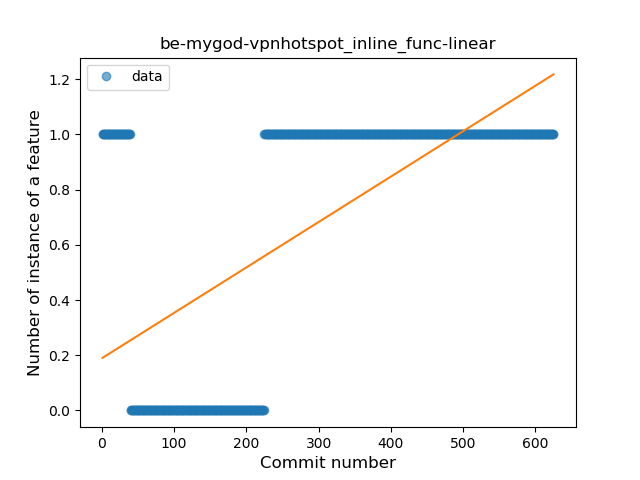

### <a name="T4">Sudden Rise</a> 
 ----

1. org-mozilla-rocket

	*  Function: 
	* R_Squared: 0.95274976
 

2. ch-deletescape-lawnchair-plah

	*  Function: 
	* R_Squared: 0.92610897
 

3. com-bernaferrari-changedetection

	*  Function: 
	* R_Squared: 0.91383059
 

4. com-jereksel-libresubstratum

	*  Function: 
	* R_Squared: 0.8985021
 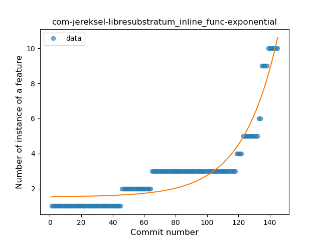

5. com-tasomaniac-openwith-floss

	*  Function: 
	* R_Squared: 0.88577046
 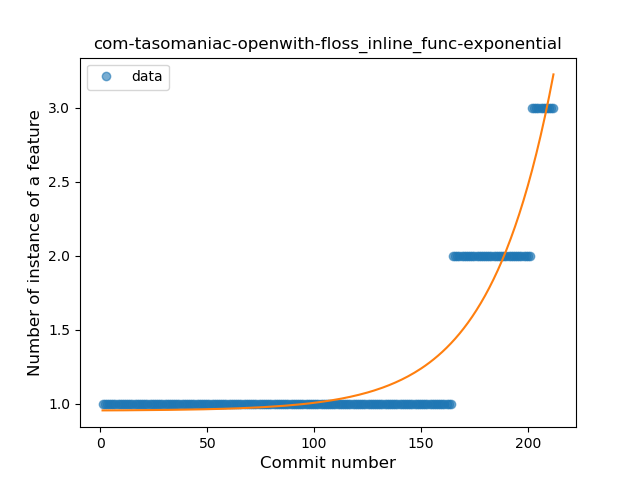

6. eu-kanade-tachiyomi

	*  Function: 
	* R_Squared: 0.87943236
 

8. tw-shounenwind-kmnbottool

	*  Function: 
	* R_Squared: 0.87341478
 

9. org-equeim-tremotesf

	*  Function: 
	* R_Squared: 0.87273306
 

10. com-fsck-k9

	*  Function: 
	* R_Squared: 0.83584238
 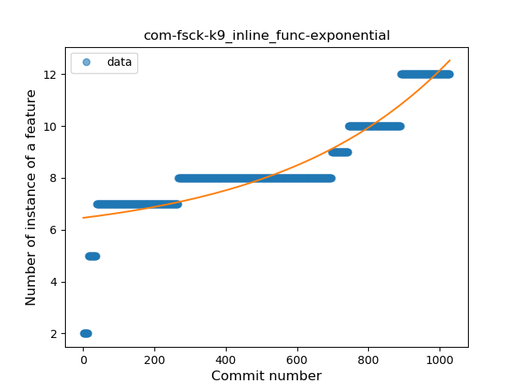

14. ffc-app

	*  Function: 
	* R_Squared: 0.60715268
 

16. com-github-moko256-twitlatte

	*  Function: 
	* R_Squared: 0.34706198
 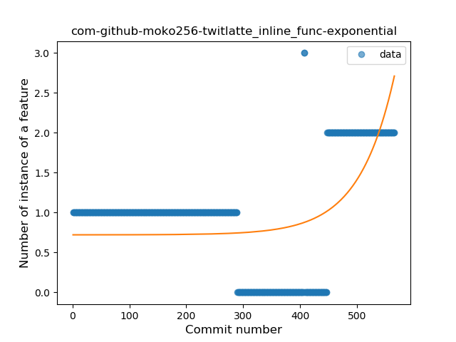

### <a name="T2">Constant Decline</a> 
 ----

11. com-dozingcatsoftware-vectorcamera

	*  Function: 
	* R_Squared: 0.45963086
 

13. org-poul-bits-android

	*  Function: 
	* R_Squared: 0.31767127
 

14. com-nononsenseapps-feeder

	*  Function: 
	* R_Squared: 0.26894716
 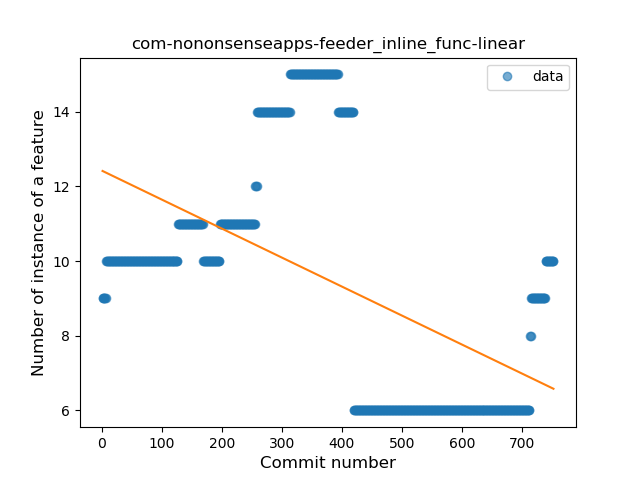

15. nl-brouwerijdemolen-borefts2013

	*  Function: 
	* R_Squared: 0.01192731
 

16. com-guerinet-mymartlet

	*  Function: 
	* R_Squared: 0.00529338
 

### <a name="T5">Sudden Decline</a> 
 ----

7. com-conorodonnell-bus

	*  Function: 
	* R_Squared: 0.87717116
 

11. jp-toastkid-yobidashi

	*  Function: 
	* R_Squared: 0.83396016
 

12. es-danirod-rectball-android

	*  Function: 
	* R_Squared: 0.83319755
 

13. cz-dvratil-fbeventsync

	*  Function: 
	* R_Squared: 0.82345211
 

15. org-weilbach-splitbills

	*  Function: 
	* R_Squared: 0.4562746
 

### <a name="T6">Sudden Rise Plateau</a> 
 ----

1. com-arcao-geocaching4locus

	*  Function: 
	* R_Squared: 0.68718212
 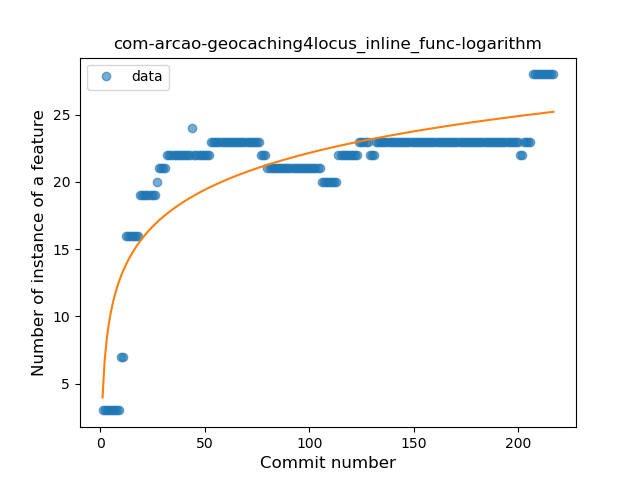

2. io-github-wulkanowy

	*  Function: 
	* R_Squared: 0.35188978
 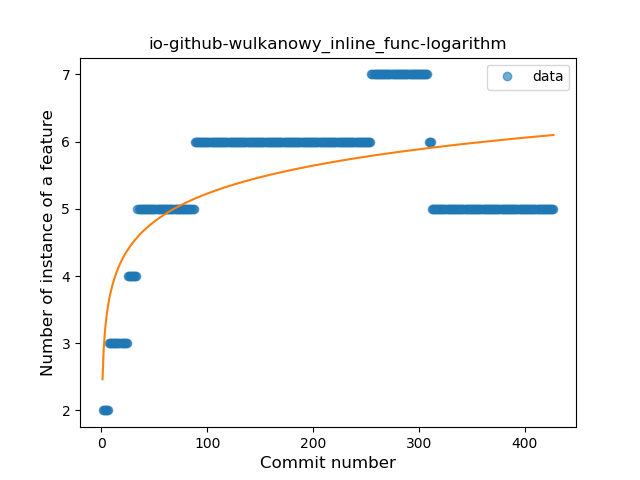

3. com-yubico-yubioath

	*  Function: 
	* R_Squared: 0.19899987
 

4. info-metadude-android-congress-schedule

	*  Function: 
	* R_Squared: 0.10490176
 

5. fr-openium-auvergnewebcams

	*  Function: 
	* R_Squared: 0.09915317
 

### <a name="T11">Instability</a> 
 ----

1. me-siketyan-silicagel

	*  Function: 
	* R_Squared: 0.84210526
 

2. uk-colessoft-android-hilllist

	*  Function: 
	* R_Squared: 0.67250909
 

3. fr-rhaz-ipfs-sweet

	*  Function: 
	* R_Squared: 0.45186496
 

### <a name="T8">Plateau Gradual Decline</a> 
 ----

11. io-github-fvasco-pinpoi

	*  Function: 
	* R_Squared: 0.88124576
 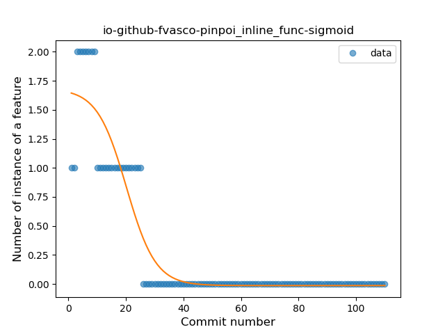

18. com-dp-logcatapp

	*  Function: 
	* R_Squared: 0.72991287
 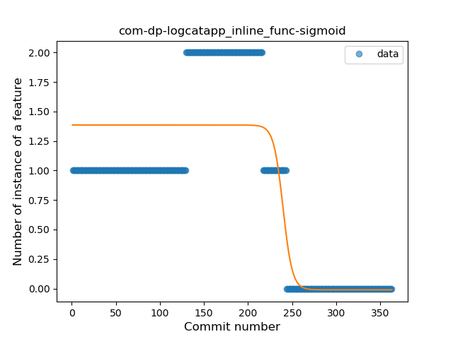

### <a name="T3">Stability</a> 
 ----

