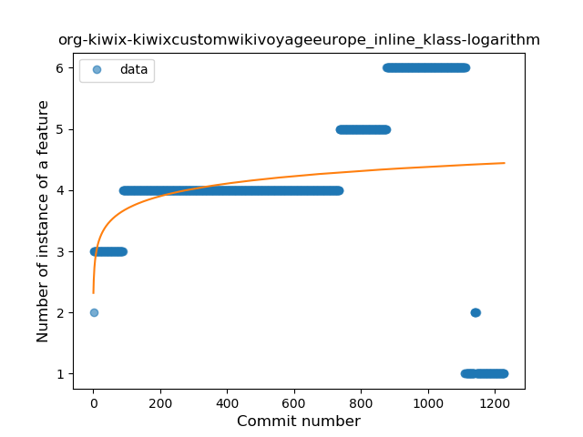

## Inline Class
----
**Best fit = Sudden Rise Plateau**: 1

Function | N# best fit
----|----
<a href=" #T6">Sudden Rise Plateau</a> | 1
<a href=" #T1">Constant Rise</a> | 0
<a href=" #T2">Constant Decline</a> | 0
<a href=" #T3">Stability</a> | 0
<a href=" #T4">Sudden Rise</a> | 0
<a href=" #T5">Sudden Decline</a> | 0
<a href=" #T7">Plateau Gradual Rise</a> | 0
<a href=" #T8">Plateau Gradual Decline</a> | 0
<a href=" #T9">Plateau Sudden Rise</a> | 0
<a href=" #T10">Plateau Sudden Decline</a> | 0
<a href=" #T11">Instability</a> | 0

### <a name="T6">Sudden Rise Plateau</a> 
 ----

1. org-kiwix-kiwixcustomwikivoyageeurope

	*  Function: 
	* R_Squared: 0.04908496
 

### <a name="T1">Constant Rise</a> 
 ----

### <a name="T2">Constant Decline</a> 
 ----

### <a name="T3">Stability</a> 
 ----

### <a name="T4">Sudden Rise</a> 
 ----

### <a name="T5">Sudden Decline</a> 
 ----

### <a name="T7">Plateau Gradual Rise</a> 
 ----

### <a name="T8">Plateau Gradual Decline</a> 
 ----

### <a name="T9">Plateau Sudden Rise</a> 
 ----

### <a name="T10">Plateau Sudden Decline</a> 
 ----

### <a name="T11">Instability</a> 
 ----

