## Lambda
----
**Best fit = Constant Rise**: 124

Function | N# best fit
----|----
<a href=" #T1">Constant Rise</a> | 124
<a href=" #T4">Sudden Rise</a> | 67
<a href=" #T11">Instability</a> | 61
<a href=" #T7">Plateau Gradual Rise</a> | 36
<a href=" #T6">Sudden Rise Plateau</a> | 31
<a href=" #T9">Plateau Sudden Rise</a> | 14
<a href=" #T5">Sudden Decline</a> | 4
<a href=" #T10">Plateau Sudden Decline</a> | 4
<a href=" #T2">Constant Decline</a> | 2
<a href=" #T3">Stability</a> | 0
<a href=" #T8">Plateau Gradual Decline</a> | 0

### <a name="T1">Constant Rise</a> 
 ----

1. be-mygod-vpnhotspot

	*  Function: 
	* R_Squared: 0.99257258
 

2. org-mariotaku-twidere

	*  Function: 
	* R_Squared: 0.98858718
 

3. ca-josephroque-bowlingcompanion

	*  Function: 
	* R_Squared: 0.98707155
 

4. org-walleth

	*  Function: 
	* R_Squared: 0.98609735
 

5. com-simplemobiletools-filemanager-pro

	*  Function: 
	* R_Squared: 0.98562131
 

6. ffc-app

	*  Function: 
	* R_Squared: 0.98377688
 

7. com-nononsenseapps-feeder

	*  Function: 
	* R_Squared: 0.98325203
 

8. link-standen-michael-phonesaver

	*  Function: 
	* R_Squared: 0.98111674
 

9. com-motion-stage1

	*  Function: 
	* R_Squared: 0.97942064
 

10. ch-rmy-android-http_shortcuts

	*  Function: 
	* R_Squared: 0.97843943
 

11. info-dvkr-screenstream

	*  Function: 
	* R_Squared: 0.97758347
 

12. com-esafirm-androidplayground

	*  Function: 
	* R_Squared: 0.97739785
 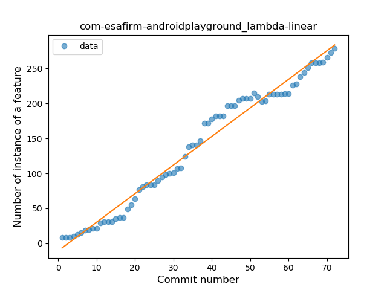

13. com-wabadaba-dziennik

	*  Function: 
	* R_Squared: 0.97715272
 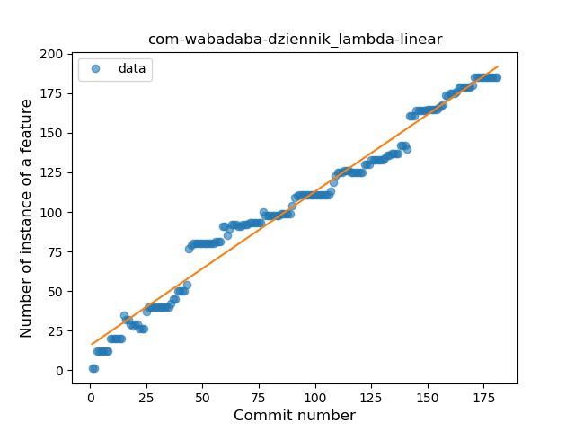

14. com-loloof64-android-basicchessendgamestrainer

	*  Function: 
	* R_Squared: 0.97697765
 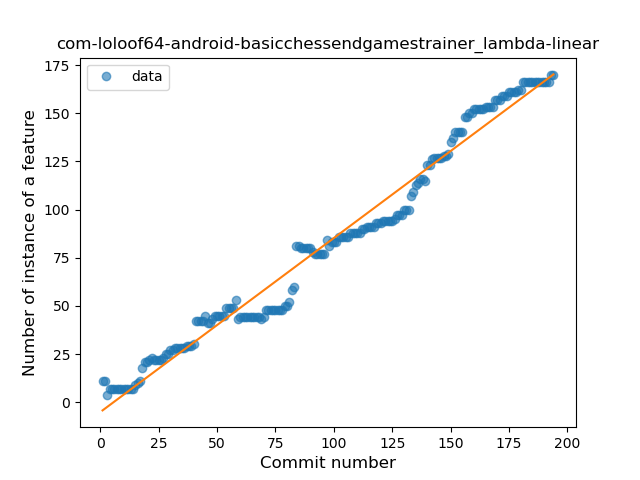

15. com-simplemobiletools-gallery

	*  Function: 
	* R_Squared: 0.97576613
 

16. com-glodanif-bluetoothchat

	*  Function: 
	* R_Squared: 0.97553355
 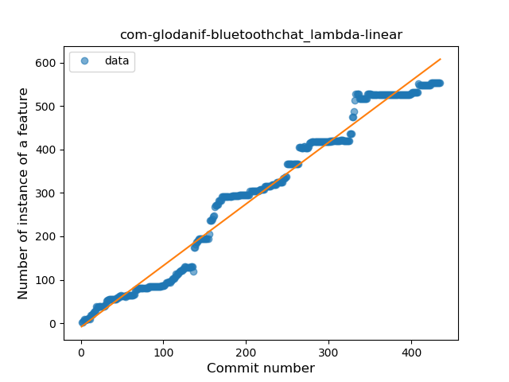

17. com-ofalvai-bpinfo

	*  Function: 
	* R_Squared: 0.97552645
 

18. com-fsck-k9

	*  Function: 
	* R_Squared: 0.97380162
 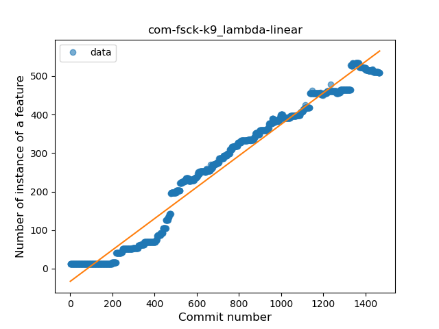

19. fi-tuska-jalkametri

	*  Function: 
	* R_Squared: 0.97136565
 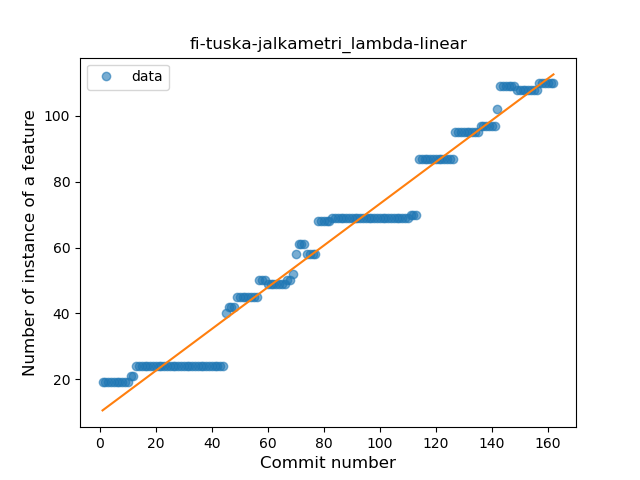

20. com-github-quarck-calnotify

	*  Function: 
	* R_Squared: 0.97058938
 

21. eu-kanade-tachiyomi

	*  Function: 
	* R_Squared: 0.97003741
 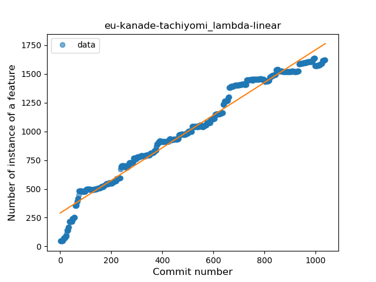

22. com-fastaccess-github-libre

	*  Function: 
	* R_Squared: 0.96627347
 

23. com-simplemobiletools-musicplayer

	*  Function: 
	* R_Squared: 0.9662526
 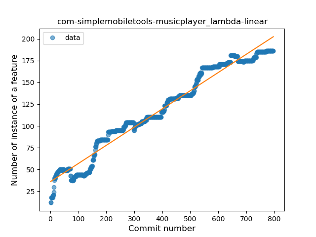

24. chat-rocket-android

	*  Function: 
	* R_Squared: 0.96542366
 

25. me-proxer-app

	*  Function: 
	* R_Squared: 0.96363552
 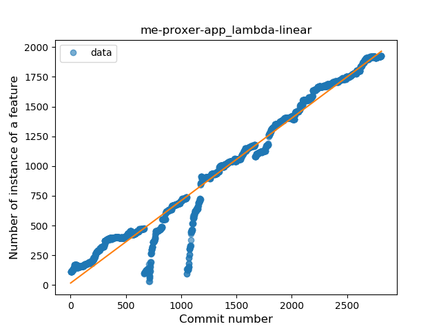

26. com-dozingcatsoftware-vectorcamera

	*  Function: 
	* R_Squared: 0.96148717
 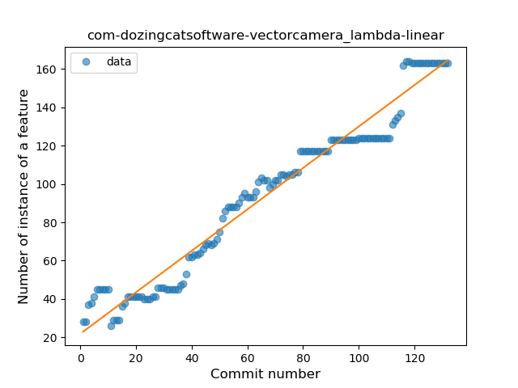

27. io-github-feelfreelinux-wykopmobilny

	*  Function: 
	* R_Squared: 0.96026507
 

28. se-creotec-chscardbalance2

	*  Function: 
	* R_Squared: 0.95889755
 

29. org-ligi-passandroid

	*  Function: 
	* R_Squared: 0.95789806
 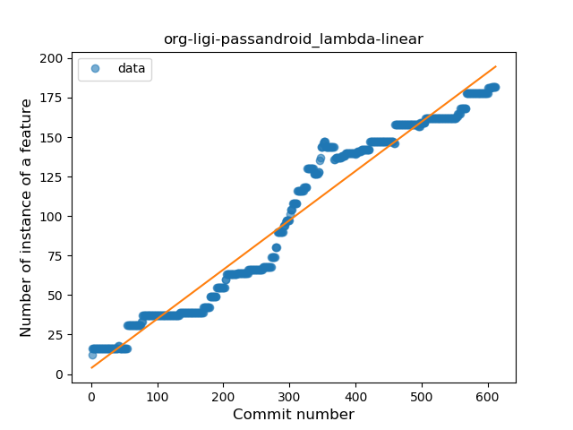

30. com-tasomaniac-openwith-floss

	*  Function: 
	* R_Squared: 0.95725753
 

31. com-peterlaurence-trekme

	*  Function: 
	* R_Squared: 0.957016
 

32. com-simplemobiletools-calendar-pro

	*  Function: 
	* R_Squared: 0.95616295
 

33. li-klass-fhem

	*  Function: 
	* R_Squared: 0.9551463
 

34. org-eurofurence-connavigator

	*  Function: 
	* R_Squared: 0.95398546
 

35. se-barsk-park

	*  Function: 
	* R_Squared: 0.95390199
 

36. it-diab

	*  Function: 
	* R_Squared: 0.95348153
 

37. com-log28

	*  Function: 
	* R_Squared: 0.95289787
 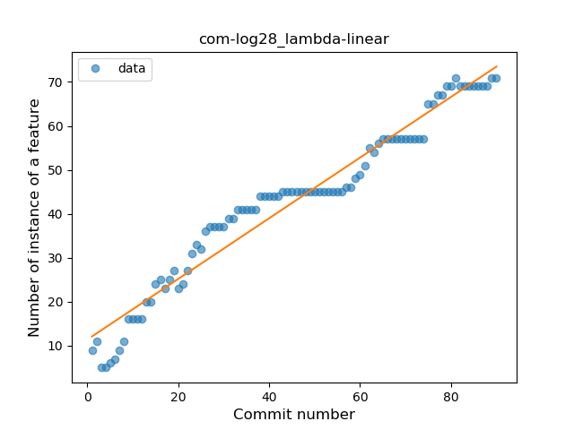

38. uk-co-richyhbm-monochromatic

	*  Function: 
	* R_Squared: 0.95239615
 

39. org-mosad-seil0-projectlaogai

	*  Function: 
	* R_Squared: 0.95106204
 

40. org-ligi-survivalmanual

	*  Function: 
	* R_Squared: 0.94990156
 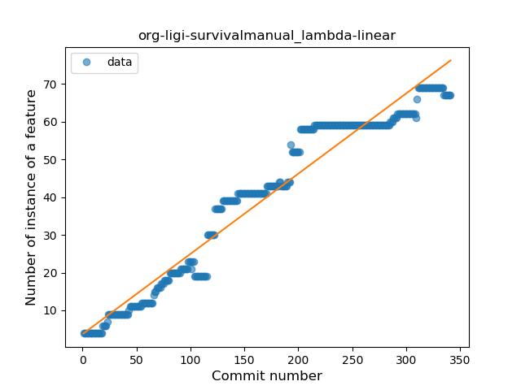

41. pixel-kotlin-bassblog

	*  Function: 
	* R_Squared: 0.94890958
 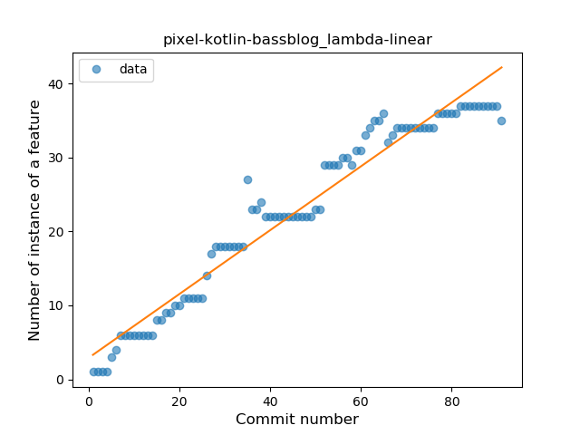

42. com-ianhanniballake-contractiontimer

	*  Function: 
	* R_Squared: 0.94775165
 

43. org-emunix-insteadlauncher

	*  Function: 
	* R_Squared: 0.94598679
 

44. pl-temomuko-autostoprace

	*  Function: 
	* R_Squared: 0.94560345
 

45. com-zacharee1-systemuituner

	*  Function: 
	* R_Squared: 0.9437819
 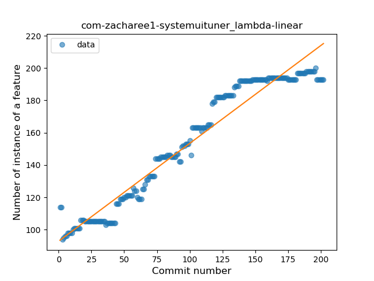

46. com-jereksel-libresubstratum

	*  Function: 
	* R_Squared: 0.94292426
 

47. acr-browser-lightning

	*  Function: 
	* R_Squared: 0.94063305
 

48. com-simplemobiletools-contacts-pro

	*  Function: 
	* R_Squared: 0.93934409
 

49. com-androidheads-vienna-escalero

	*  Function: 
	* R_Squared: 0.93912341
 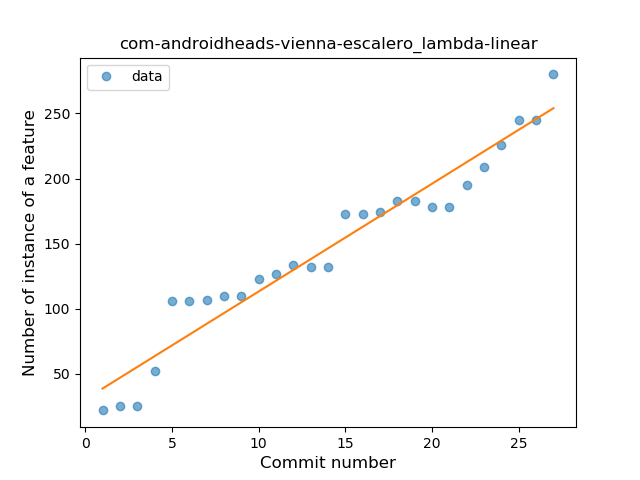

50. pl-org-seva-navigator

	*  Function: 
	* R_Squared: 0.93896182
 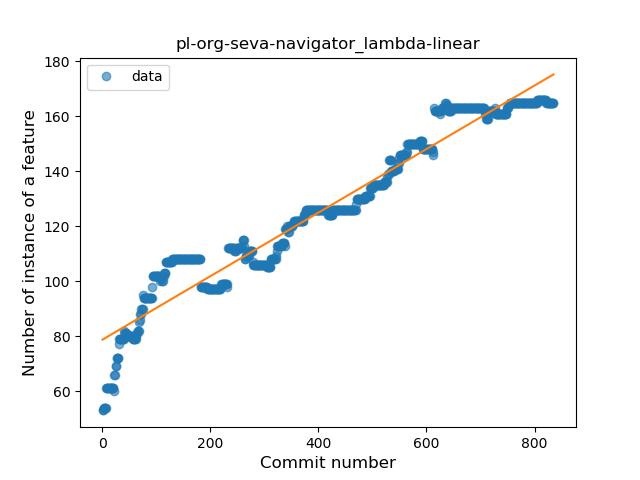

51. fr-openium-auvergnewebcams

	*  Function: 
	* R_Squared: 0.9356614
 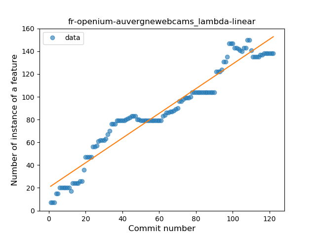

52. tw-shounenwind-kmnbottool

	*  Function: 
	* R_Squared: 0.93406274
 

53. me-blog-korn123-easydiary

	*  Function: 
	* R_Squared: 0.93227416
 

54. xyz-hisname-fireflyiii

	*  Function: 
	* R_Squared: 0.93120739
 

55. fr-xgouchet-packageexplorer

	*  Function: 
	* R_Squared: 0.92940545
 

56. fr-cph-chicago-foss

	*  Function: 
	* R_Squared: 0.92893674
 

57. pw-janyo-whatanime

	*  Function: 
	* R_Squared: 0.92384621
 

58. de-thecode-android-tazreader

	*  Function: 
	* R_Squared: 0.92209874
 

59. com-adityakamble49-dcipher

	*  Function: 
	* R_Squared: 0.92125379
 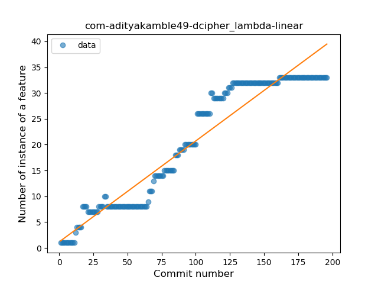

60. jp-toastkid-yobidashi

	*  Function: 
	* R_Squared: 0.92060655
 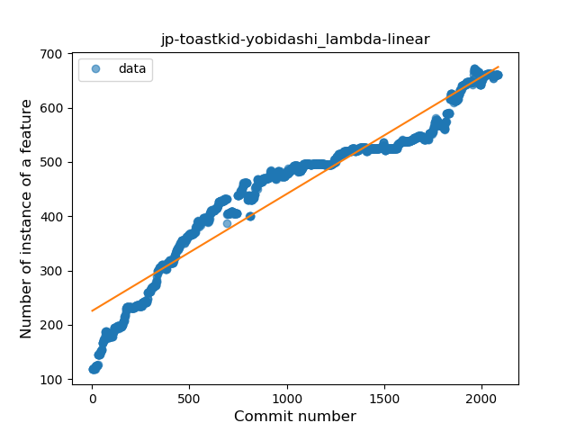

61. org-freedombox-freedombox

	*  Function: 
	* R_Squared: 0.92048465
 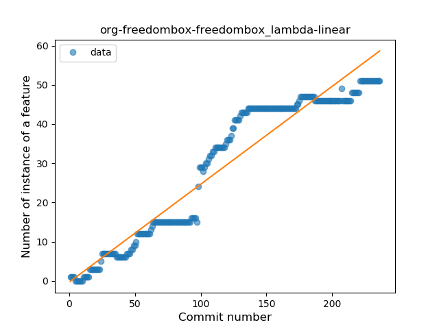

62. is-xyz-omw

	*  Function: 
	* R_Squared: 0.91999497
 

63. com-uwetrottmann-wpdisplay

	*  Function: 
	* R_Squared: 0.91963718
 

64. com-benoitquenaudon-tvfoot-red

	*  Function: 
	* R_Squared: 0.91873268
 

65. org-anibyl-slounik

	*  Function: 
	* R_Squared: 0.91609589
 

66. fr-chenry-android-freshrss

	*  Function: 
	* R_Squared: 0.91609578
 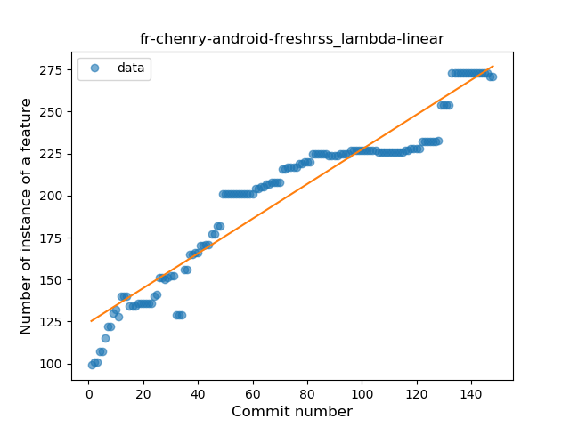

67. com-bubelov-coins

	*  Function: 
	* R_Squared: 0.91602384
 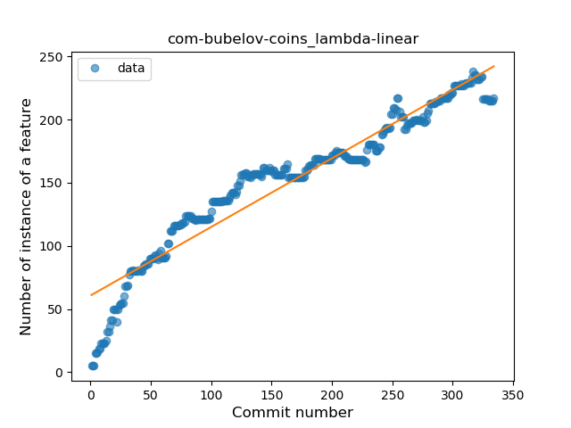

68. net-osmand-plus

	*  Function: 
	* R_Squared: 0.91572051
 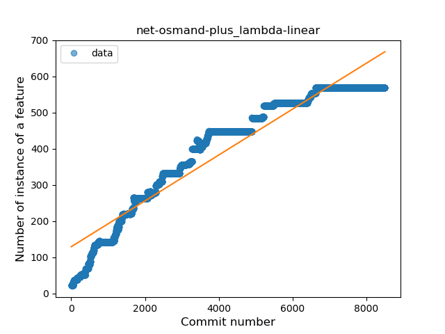

69. net-frju-flym

	*  Function: 
	* R_Squared: 0.91270706
 

70. de-r4md4c-gamedealz

	*  Function: 
	* R_Squared: 0.91200705
 

71. pw-janyo-janyoshare

	*  Function: 
	* R_Squared: 0.91126196
 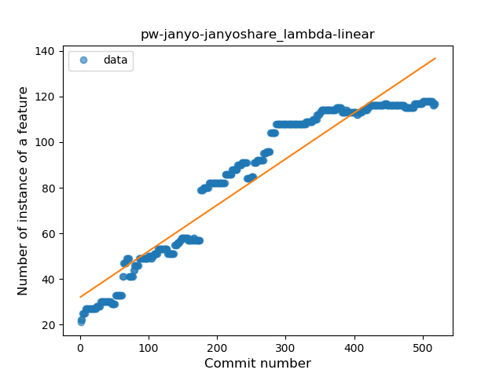

72. com-simplemobiletools-flashlight

	*  Function: 
	* R_Squared: 0.90790229
 

73. org-pacien-tincapp

	*  Function: 
	* R_Squared: 0.9075246
 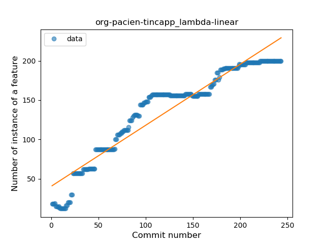

74. com-ruuvi-station

	*  Function: 
	* R_Squared: 0.90679046
 

75. com-njlabs-showjava

	*  Function: 
	* R_Squared: 0.90362085
 

76. com-pyamsoft-homebutton

	*  Function: 
	* R_Squared: 0.90090865
 

77. com-jmstudios-redmoon

	*  Function: 
	* R_Squared: 0.899331
 

78. de-grobox-liberario

	*  Function: 
	* R_Squared: 0.89348876
 

79. nl-mpcjanssen-simpletask

	*  Function: 
	* R_Squared: 0.89193691
 

80. com-ogsdroid

	*  Function: 
	* R_Squared: 0.88950672
 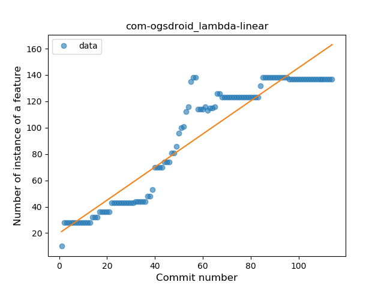

81. com-stevenschoen-putionew

	*  Function: 
	* R_Squared: 0.88799446
 

82. com-libopenmw-openmw

	*  Function: 
	* R_Squared: 0.88515723
 

83. com-arcao-geocaching4locus

	*  Function: 
	* R_Squared: 0.88324131
 

84. com-jim-sharetocomputer

	*  Function: 
	* R_Squared: 0.87565498
 

85. ch-abertschi-adfree

	*  Function: 
	* R_Squared: 0.8749716
 

86. com-tutpro-baresip

	*  Function: 
	* R_Squared: 0.87023346
 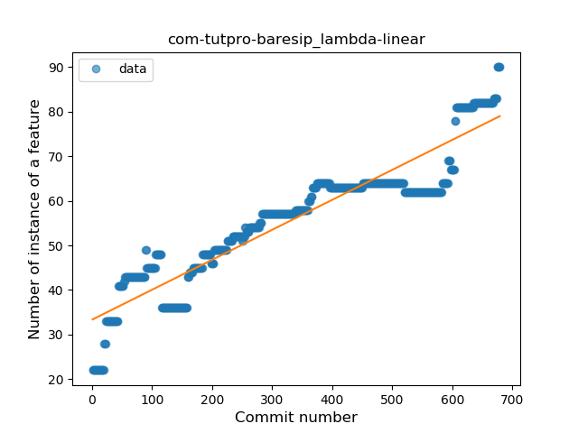

87. com-booboot-vndbandroid

	*  Function: 
	* R_Squared: 0.86543877
 

88. com-simplemobiletools-camera

	*  Function: 
	* R_Squared: 0.86386891
 

89. de-micmun-android-deufeitage

	*  Function: 
	* R_Squared: 0.86282184
 

90. net-codechunk-speedofsound

	*  Function: 
	* R_Squared: 0.86226931
 

91. com-simplemobiletools-applauncher

	*  Function: 
	* R_Squared: 0.86200452
 

92. cat-pantsu-nyaapantsu

	*  Function: 
	* R_Squared: 0.85316293
 

93. com-aaplab-bakubus

	*  Function: 
	* R_Squared: 0.8513807
 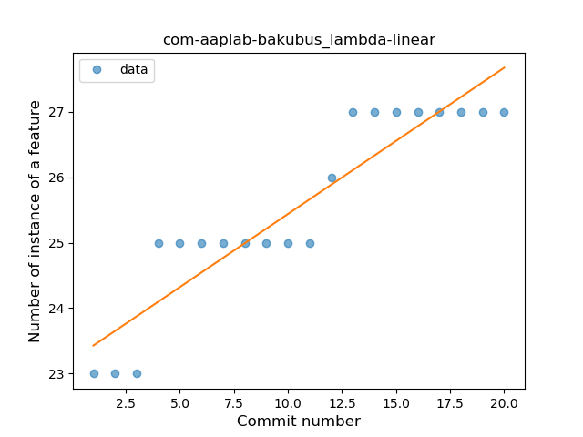

94. com-directdev-portal

	*  Function: 
	* R_Squared: 0.85120056
 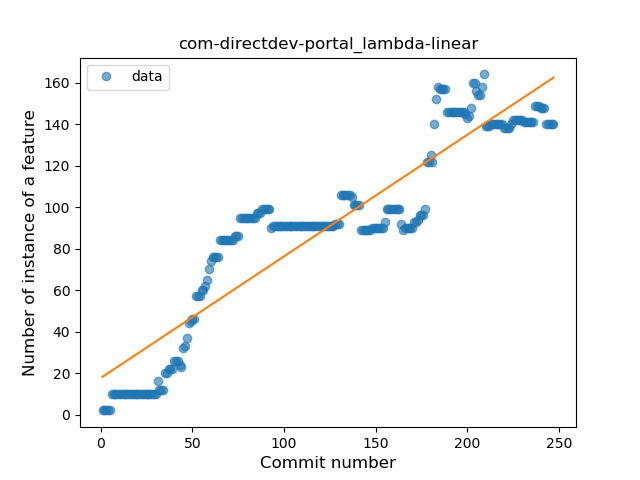

95. info-papdt-express-helper

	*  Function: 
	* R_Squared: 0.85085861
 

96. net-mm2d-android-vmb

	*  Function: 
	* R_Squared: 0.85084458
 

97. fr-insapp-insapp

	*  Function: 
	* R_Squared: 0.85064495
 

98. apps-jizzu-simpletodo

	*  Function: 
	* R_Squared: 0.848473
 

99. eu-depau-etchdroid

	*  Function: 
	* R_Squared: 0.83940078
 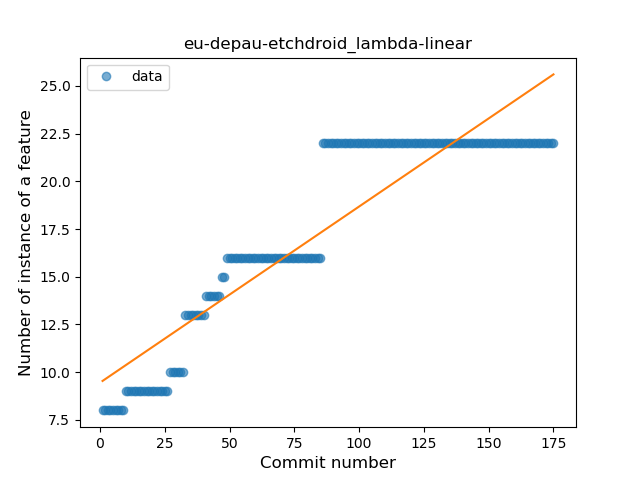

100. de-ph1b-audiobook

	*  Function: 
	* R_Squared: 0.83875757
 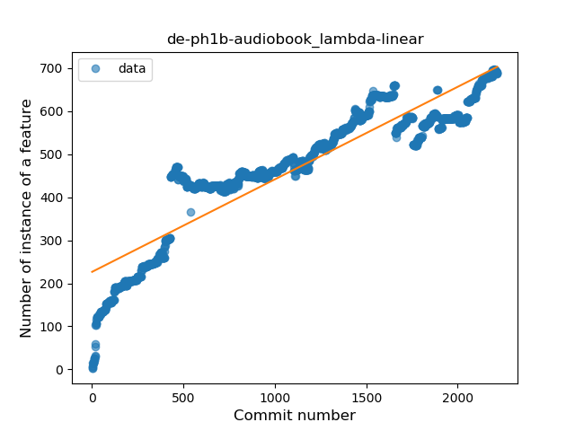

101. fr-corenting-edcompanion

	*  Function: 
	* R_Squared: 0.83692878
 

102. com-bernaferrari-changedetection

	*  Function: 
	* R_Squared: 0.83478214
 

103. com-slash-batterychargelimit

	*  Function: 
	* R_Squared: 0.8346623
 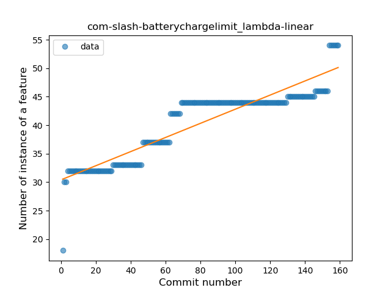

104. com-moez-QKSMS

	*  Function: 
	* R_Squared: 0.83176877
 

105. ca-rmen-android-poetassistant

	*  Function: 
	* R_Squared: 0.83048232
 

106. com-garpr-android

	*  Function: 
	* R_Squared: 0.82687728
 

107. com-pitchedapps-frost

	*  Function: 
	* R_Squared: 0.82142451
 

108. de-thecode-lmd

	*  Function: 
	* R_Squared: 0.8182607
 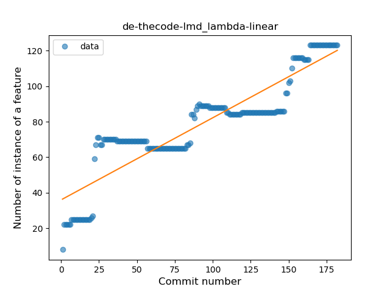

109. com-pavelsikun-runinbackgroundpermissionsetter

	*  Function: 
	* R_Squared: 0.81322453
 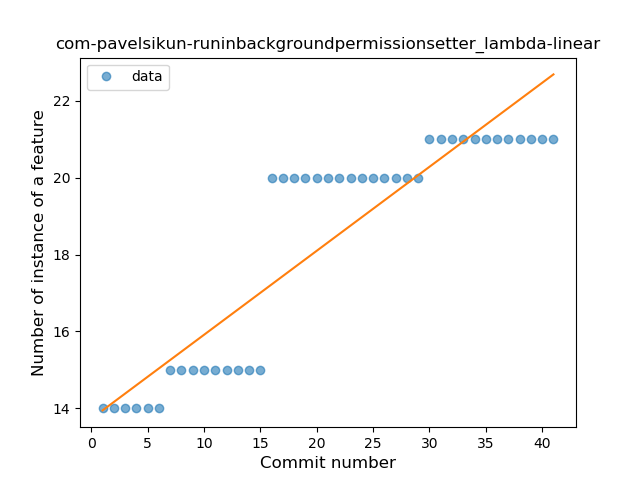

110. net-yslibrary-monotweety

	*  Function: 
	* R_Squared: 0.80692206
 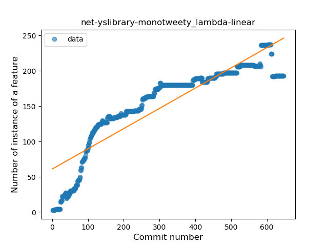

111. io-github-deweyreed-clipboardcleaner

	*  Function: 
	* R_Squared: 0.7996881
 

112. net-nurik-roman-muzei

	*  Function: 
	* R_Squared: 0.78924931
 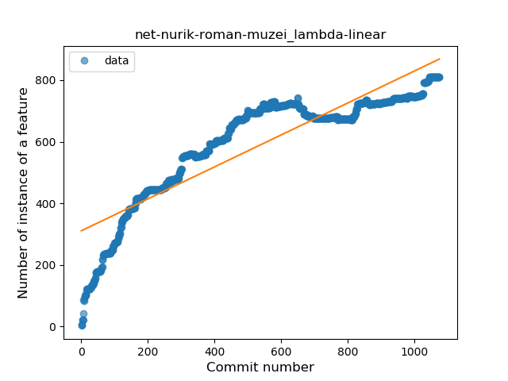

113. cat-xojan-random1

	*  Function: 
	* R_Squared: 0.7712
 

114. fr-free-nrw-commons

	*  Function: 
	* R_Squared: 0.76743857
 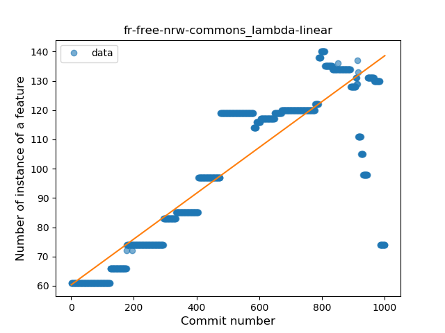

115. org-moire-ultrasonic

	*  Function: 
	* R_Squared: 0.76350325
 

116. org-poul-bits-android

	*  Function: 
	* R_Squared: 0.7607536
 

117. com-guerinet-mymartlet

	*  Function: 
	* R_Squared: 0.75700624
 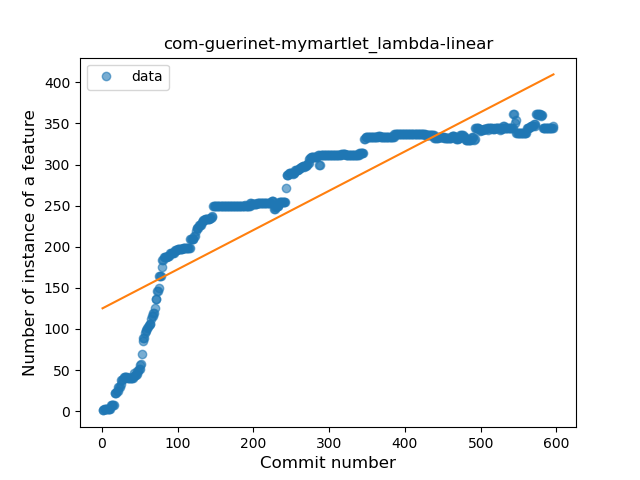

118. cz-dvratil-fbeventsync

	*  Function: 
	* R_Squared: 0.72908575
 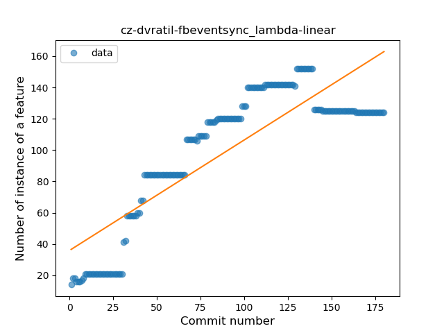

119. com-commit451-gitlab

	*  Function: 
	* R_Squared: 0.72811496
 

120. com-github-fields-electric

	*  Function: 
	* R_Squared: 0.71394684
 

121. es-usc-citius-servando-calendula

	*  Function: 
	* R_Squared: 0.70774365
 

122. pt-ipleiria-mymusicqoe

	*  Function: 
	* R_Squared: 0.67859853
 

123. org-blokada-alarm

	*  Function: 
	* R_Squared: 0.59184189
 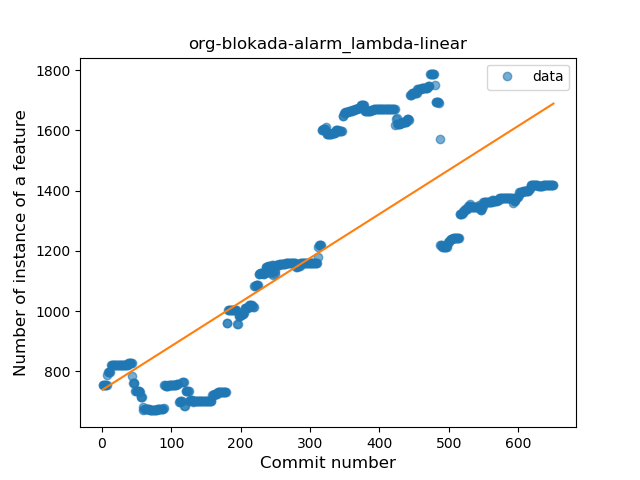

126. com-simplemobiletools-thankyou

	*  Function: 
	* R_Squared: 0.00056999
 

### <a name="T4">Sudden Rise</a> 
 ----

1. ch-deletescape-lawnchair-plah

	*  Function: 
	* R_Squared: 0.99137449
 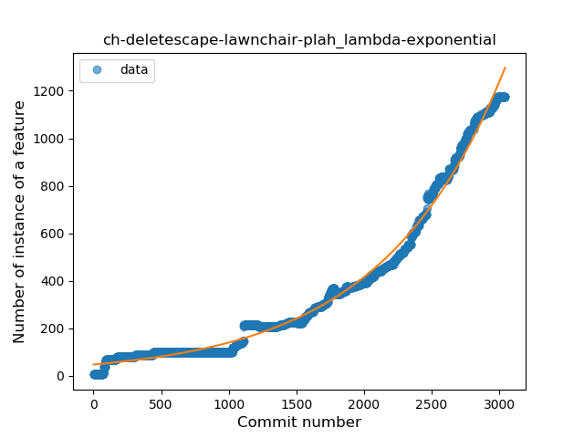

2. com-dp-logcatapp

	*  Function: 
	* R_Squared: 0.99020833
 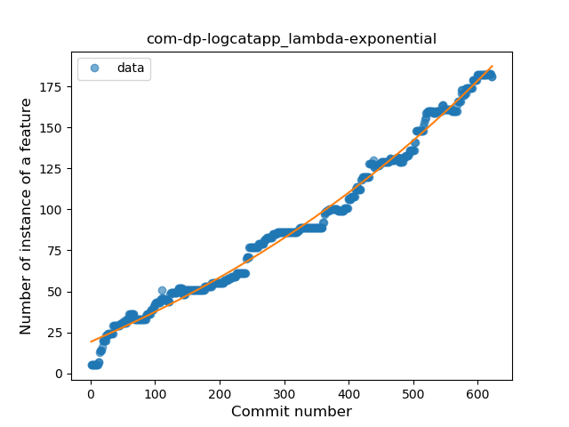

3. org-mozilla-rocket

	*  Function: 
	* R_Squared: 0.98889341
 

4. com-boardgamegeek

	*  Function: 
	* R_Squared: 0.98791579
 

5. com-simplemobiletools-gallery-pro

	*  Function: 
	* R_Squared: 0.98476696
 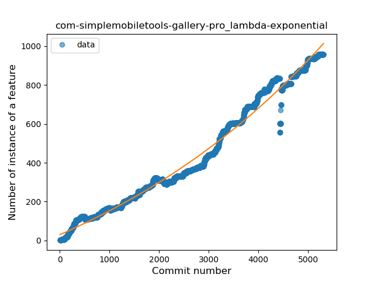

6. com-utazukin-ichaival

	*  Function: 
	* R_Squared: 0.98226984
 

7. com-github-premnirmal-tickerwidget

	*  Function: 
	* R_Squared: 0.97967892
 

8. org-mozilla-focus

	*  Function: 
	* R_Squared: 0.97831201
 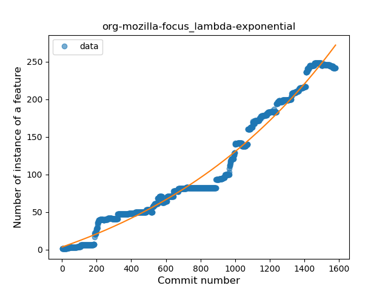

9. org-mozilla-klar

	*  Function: 
	* R_Squared: 0.97831201
 

10. com-bijoysingh-quicknote

	*  Function: 
	* R_Squared: 0.9782985
 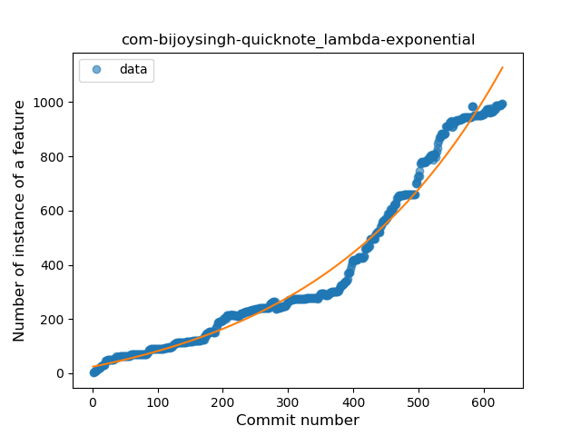

11. io-ipoli-android

	*  Function: 
	* R_Squared: 0.97753183
 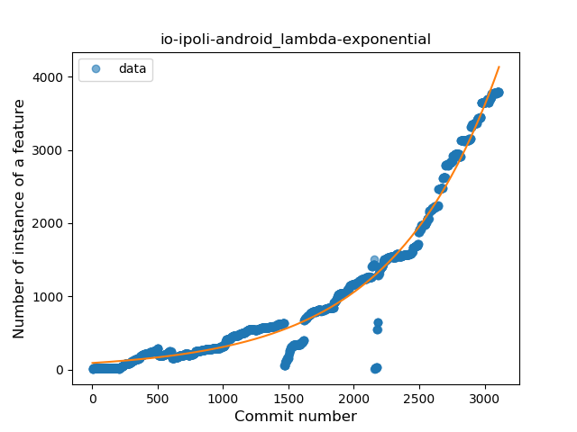

12. com-simplemobiletools-notes-pro

	*  Function: 
	* R_Squared: 0.97671206
 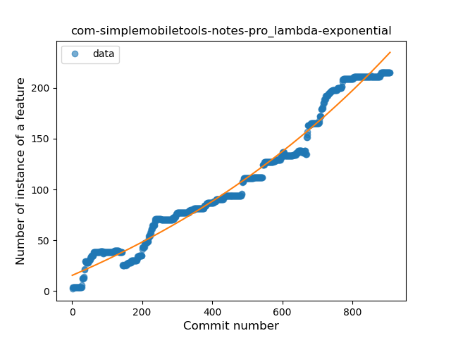

13. one-librem-social

	*  Function: 
	* R_Squared: 0.97584068
 

14. com-keylesspalace-tusky

	*  Function: 
	* R_Squared: 0.9743113
 

15. com-doctoror-particleswallpaper

	*  Function: 
	* R_Squared: 0.9737244
 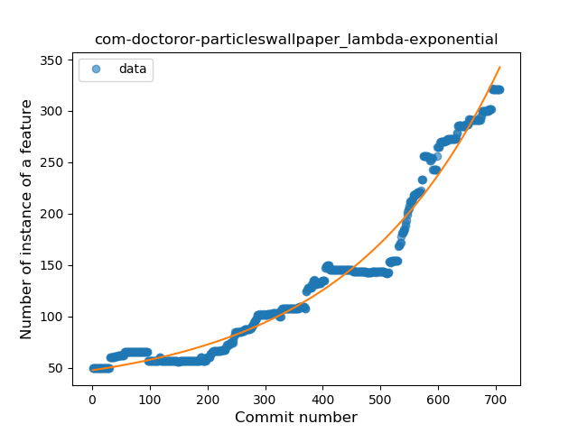

16. com-duckduckgo-mobile-android

	*  Function: 
	* R_Squared: 0.97335432
 

17. net-bible-android-activity

	*  Function: 
	* R_Squared: 0.9725071
 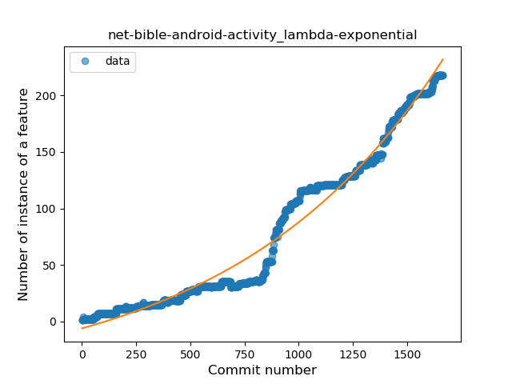

18. de-westnordost-streetcomplete

	*  Function: 
	* R_Squared: 0.97235143
 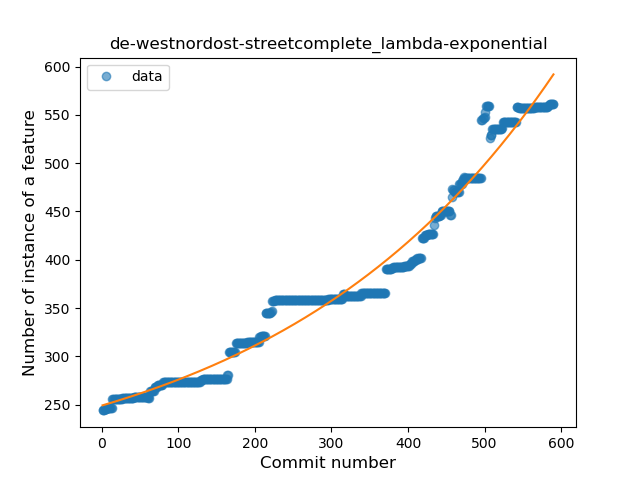

19. com-github-cvzi-screenshottile

	*  Function: 
	* R_Squared: 0.96426454
 

20. pl-hypeapp-episodie

	*  Function: 
	* R_Squared: 0.96226565
 

21. com-uncmorfi

	*  Function: 
	* R_Squared: 0.96122396
 

22. apps-amine-bou-readerforselfoss

	*  Function: 
	* R_Squared: 0.96121425
 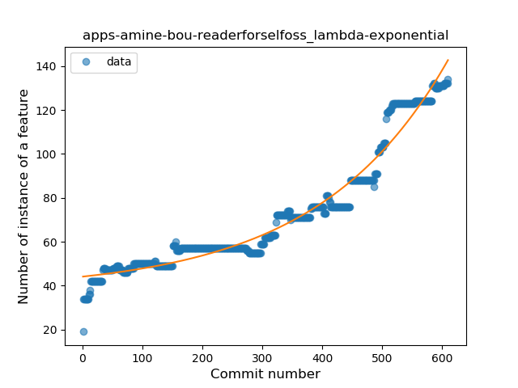

23. de-Maxr1998-xposed-maxlock

	*  Function: 
	* R_Squared: 0.9607428
 

24. tech-ula

	*  Function: 
	* R_Squared: 0.95902065
 

25. im-vector-alpha

	*  Function: 
	* R_Squared: 0.95848079
 

26. com-lavadip-miniVector

	*  Function: 
	* R_Squared: 0.95656395
 

27. me-anon-grow

	*  Function: 
	* R_Squared: 0.95543372
 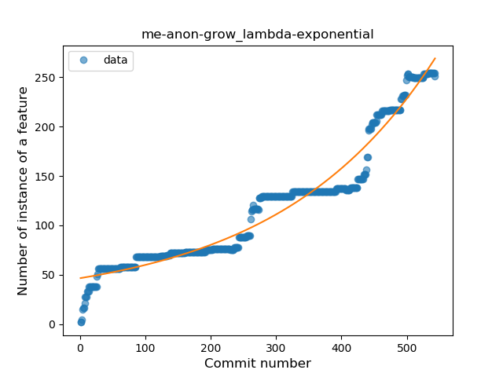

28. app-opass-ccip

	*  Function: 
	* R_Squared: 0.95518174
 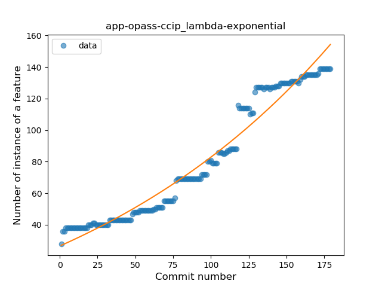

29. com-nextcloud-talk2

	*  Function: 
	* R_Squared: 0.95330996
 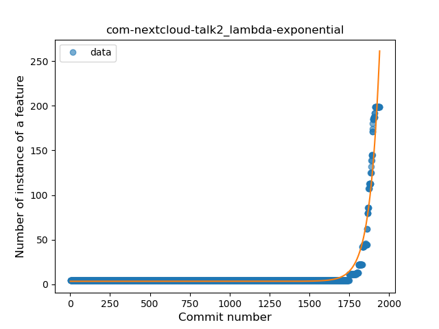

30. com-github-laurenttreguier-deck

	*  Function: 
	* R_Squared: 0.95291549
 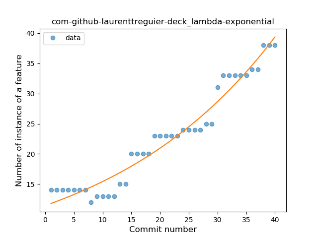

31. com-eventyay-attendee

	*  Function: 
	* R_Squared: 0.94986027
 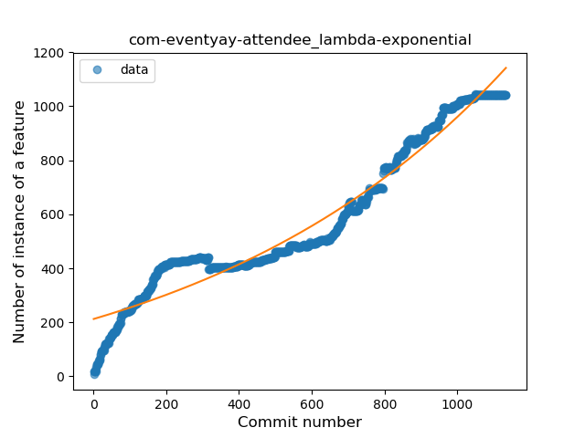

32. com-thanksmister-iot-mqtt-alarmpanel

	*  Function: 
	* R_Squared: 0.94831031
 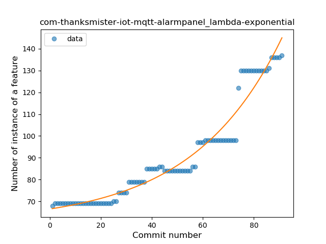

33. com-zeapo-pwdstore

	*  Function: 
	* R_Squared: 0.94790872
 

34. ca-fuwafuwa-kaku

	*  Function: 
	* R_Squared: 0.94772474
 

35. de-markusfisch-android-binaryeye

	*  Function: 
	* R_Squared: 0.94598056
 

36. com-mgaetan89-showsrage

	*  Function: 
	* R_Squared: 0.94562325
 

37. com-github-moko256-twitlatte

	*  Function: 
	* R_Squared: 0.94116983
 

38. com-github-vase4kin-teamcityapp

	*  Function: 
	* R_Squared: 0.9403327
 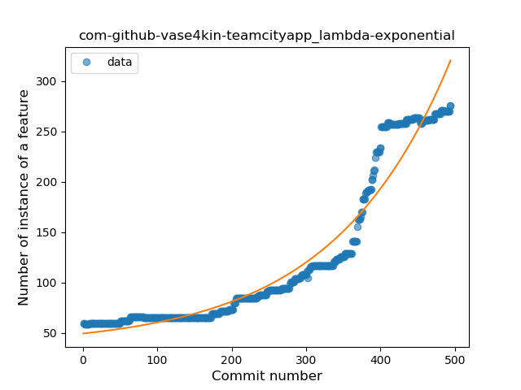

39. com-wbrawner-simplemarkdown

	*  Function: 
	* R_Squared: 0.93809909
 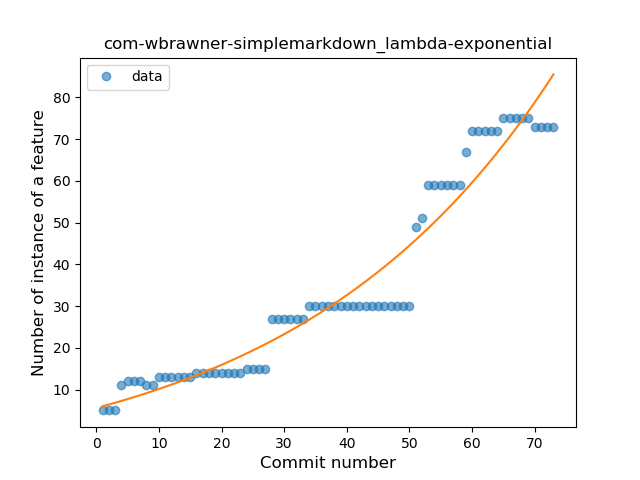

40. com-wilderpereira-lmgtfygen

	*  Function: 
	* R_Squared: 0.93702632
 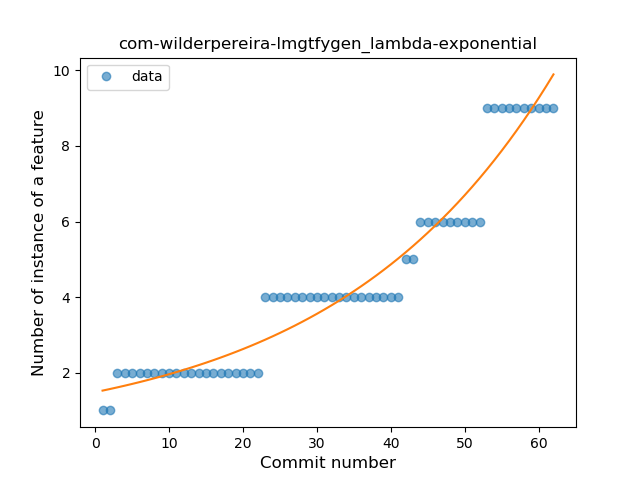

41. org-zimmob-zimlx

	*  Function: 
	* R_Squared: 0.93670993
 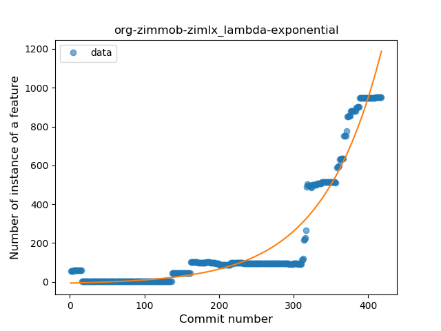

42. org-equeim-tremotesf

	*  Function: 
	* R_Squared: 0.93639111
 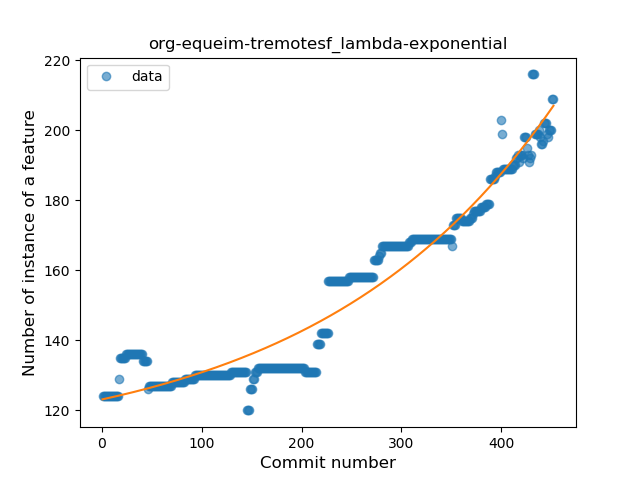

43. com-orgzly

	*  Function: 
	* R_Squared: 0.93629403
 

44. sreich-countthedays

	*  Function: 
	* R_Squared: 0.93601312
 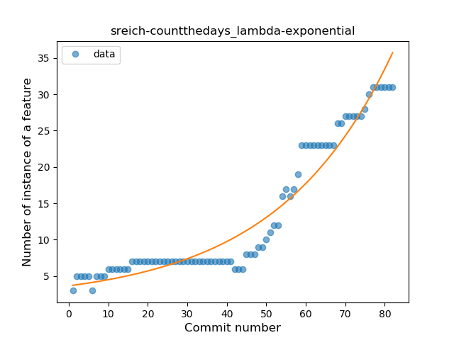

45. org-kaqui

	*  Function: 
	* R_Squared: 0.93093273
 

46. net-mm2d-dmsexplorer

	*  Function: 
	* R_Squared: 0.9291755
 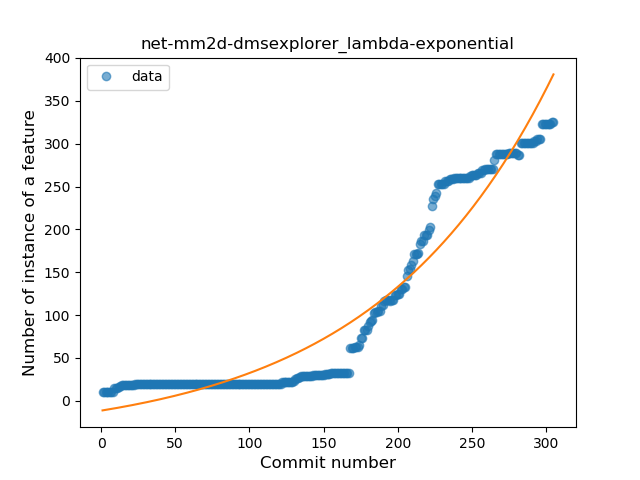

47. org-isoron-uhabits

	*  Function: 
	* R_Squared: 0.92839403
 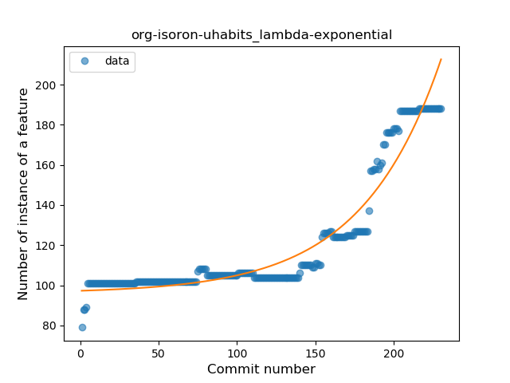

48. uk-colessoft-android-hilllist

	*  Function: 
	* R_Squared: 0.92628447
 

49. ru-hyst329-openfool

	*  Function: 
	* R_Squared: 0.92520575
 

50. org-ligi-gobandroid

	*  Function: 
	* R_Squared: 0.92329685
 

51. ai-susi

	*  Function: 
	* R_Squared: 0.91908418
 

52. tk-superl2-xwifi

	*  Function: 
	* R_Squared: 0.91902505
 

53. com-example-harisont-librery

	*  Function: 
	* R_Squared: 0.9137567
 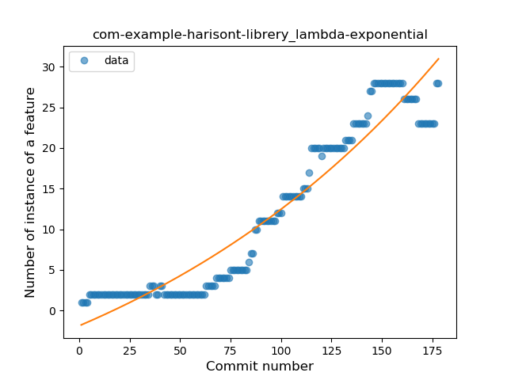

54. com-czbix-v2ex

	*  Function: 
	* R_Squared: 0.91313106
 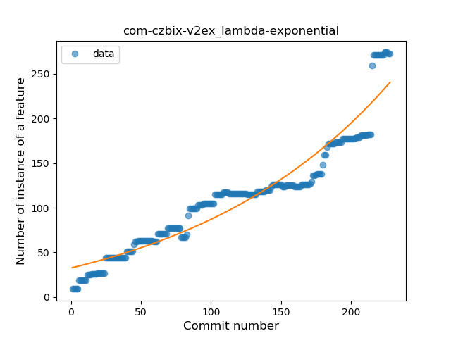

55. pt-joaomneto-titancompanion

	*  Function: 
	* R_Squared: 0.91242193
 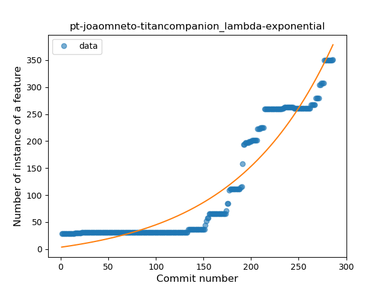

56. org-bottiger-podcast

	*  Function: 
	* R_Squared: 0.90476171
 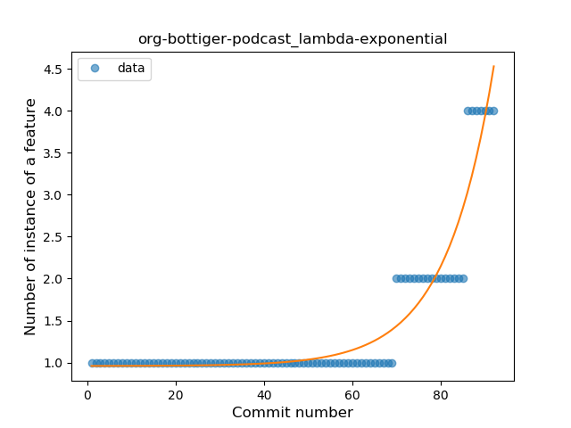

57. com-tomer-draw

	*  Function: 
	* R_Squared: 0.89533399
 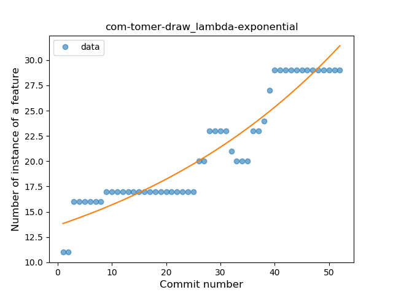

58. sk-styk-martin-apkanalyzer

	*  Function: 
	* R_Squared: 0.87557318
 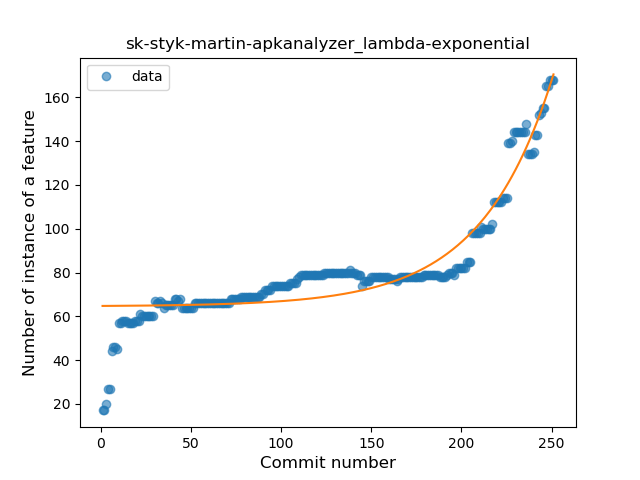

59. fr-jnda-android-flashalert

	*  Function: 
	* R_Squared: 0.86472082
 

60. jp-cordea-mackerelclient

	*  Function: 
	* R_Squared: 0.82268881
 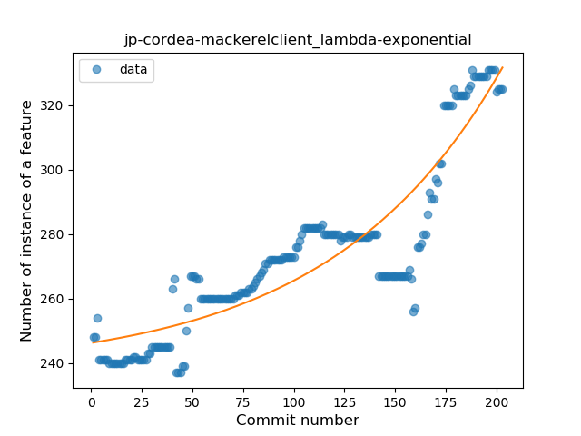

61. is-xyz-mpv

	*  Function: 
	* R_Squared: 0.82023919
 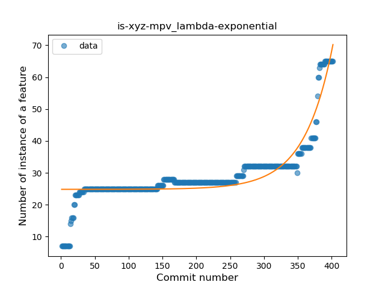

62. ryey-easer-beta

	*  Function: 
	* R_Squared: 0.81322247
 

63. com-breadwallet

	*  Function: 
	* R_Squared: 0.80801018
 

64. com-phicdy-totoanticipation

	*  Function: 
	* R_Squared: 0.79892408
 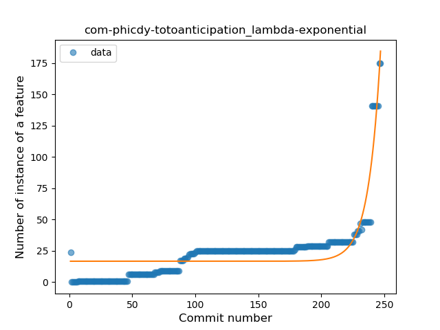

65. com-cookiegames-smartcookie

	*  Function: 
	* R_Squared: 0.78109054
 

68. rectangledbmi-com-pittsburghrealtimetracker

	*  Function: 
	* R_Squared: 0.67092612
 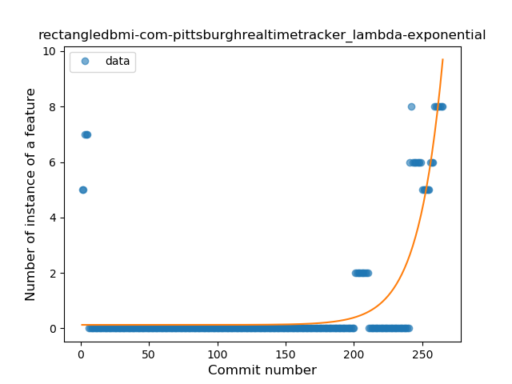

71. com-ids1024-whitakerswords

	*  Function: 
	* R_Squared: 0.25834189
 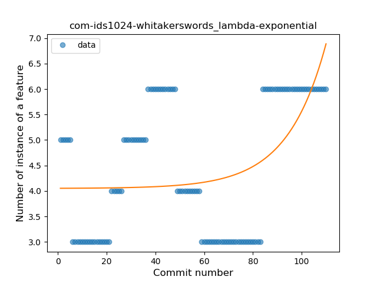

### <a name="T11">Instability</a> 
 ----

1. com-bracketcove-postrainer

	*  Function: 
	* R_Squared: 0.99925502
 

2. com-fallgamlet-dnestrcinema

	*  Function: 
	* R_Squared: 0.98166297
 

3. com-rohitsuratekar-NCBSinfo

	*  Function: 
	* R_Squared: 0.98132381
 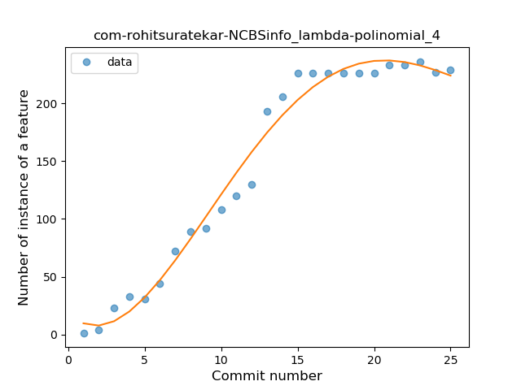

4. com-benny-pxerstudio

	*  Function: 
	* R_Squared: 0.96969697
 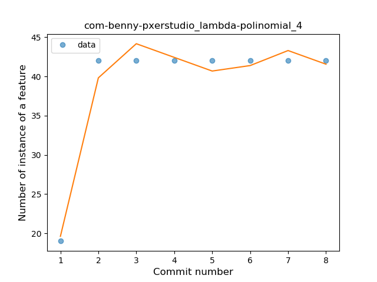

5. com-emmanuelmess-simplecleanup

	*  Function: 
	* R_Squared: 0.95698384
 

6. com-ianhanniballake-localstorage

	*  Function: 
	* R_Squared: 0.93592191
 

7. ru-nsu-bobrofon-easysshfs

	*  Function: 
	* R_Squared: 0.92052429
 

8. org-lenchan139-ncbookmark

	*  Function: 
	* R_Squared: 0.91198324
 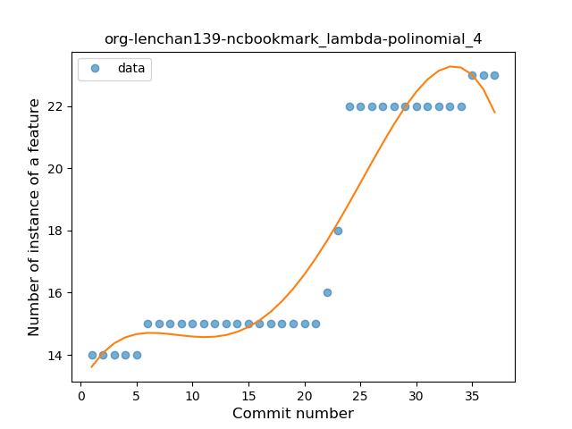

9. io-wookey-wallet

	*  Function: 
	* R_Squared: 0.90779067
 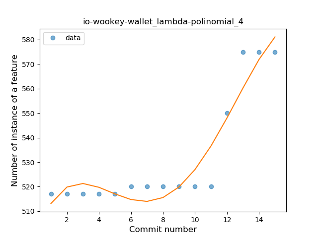

10. org-mcxa-softsound

	*  Function: 
	* R_Squared: 0.90298965
 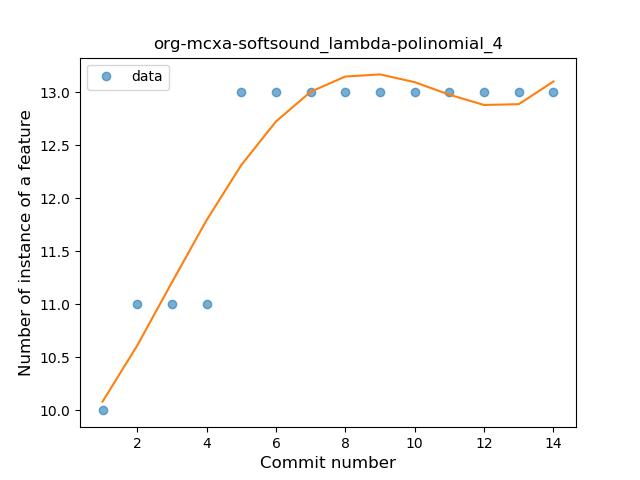

11. me-impa-knockonports

	*  Function: 
	* R_Squared: 0.89793567
 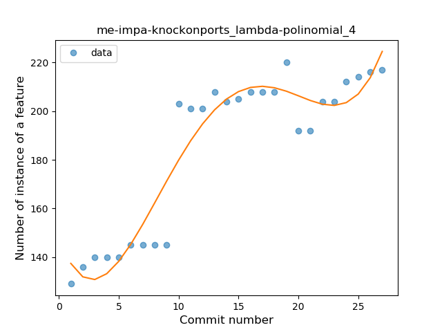

12. com-jkcarino-ankieditor

	*  Function: 
	* R_Squared: 0.89055944
 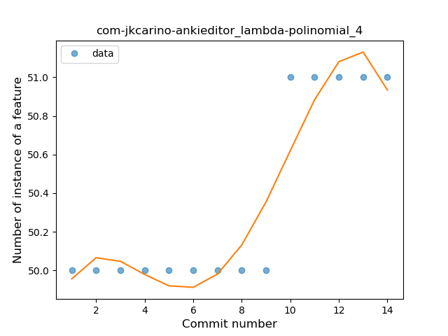

13. com-skydoves-waterdays

	*  Function: 
	* R_Squared: 0.88461538
 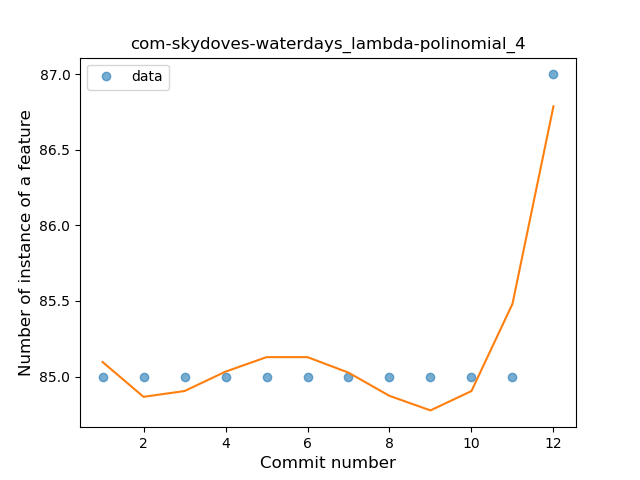

14. ca-rmen-android-frenchcalendar

	*  Function: 
	* R_Squared: 0.87692308
 

15. xyz-koleno-sunwidget

	*  Function: 
	* R_Squared: 0.85175439
 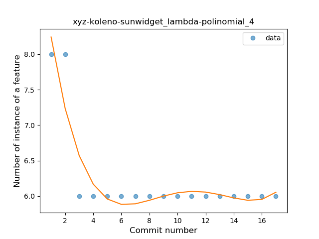

16. ch-rmy-android-statusbar_tacho

	*  Function: 
	* R_Squared: 0.84210526
 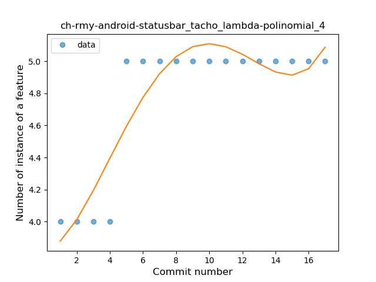

17. me-siketyan-silicagel

	*  Function: 
	* R_Squared: 0.84210526
 

18. pl-poznajapp

	*  Function: 
	* R_Squared: 0.80943925
 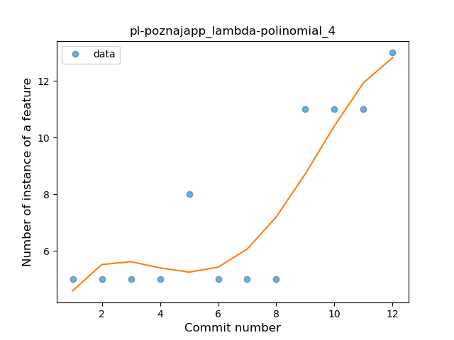

19. com-agusyc-daycounter

	*  Function: 
	* R_Squared: 0.77666415
 

20. com-greenlionsoft-pollution-madrid

	*  Function: 
	* R_Squared: 0.77580923
 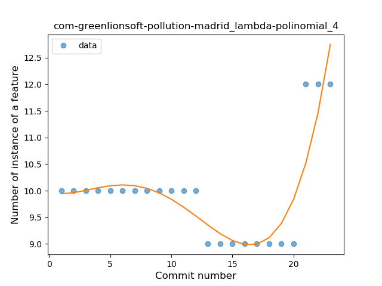

21. com-manoj-dlt

	*  Function: 
	* R_Squared: 0.76003945
 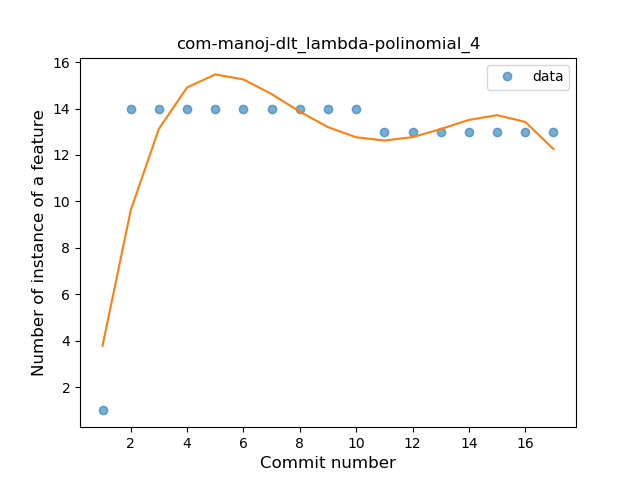

22. com-brentpanther-bitcoinwidget

	*  Function: 
	* R_Squared: 0.75231063
 

23. danbroid-searchview

	*  Function: 
	* R_Squared: 0.7475203
 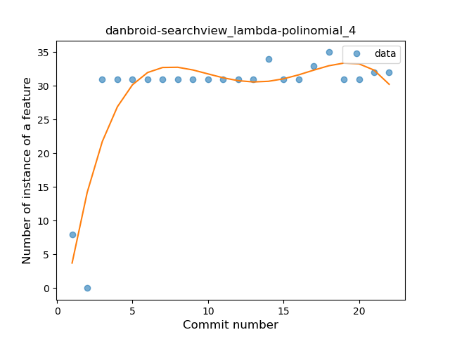

24. fr-rhaz-ipfs-sweet

	*  Function: 
	* R_Squared: 0.64373769
 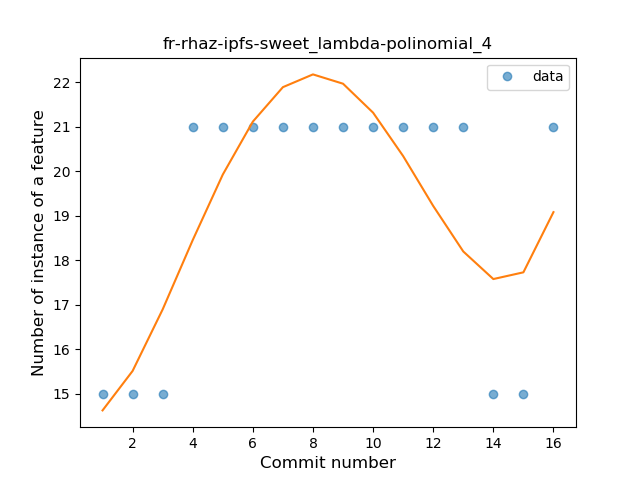

### <a name="T7">Plateau Gradual Rise</a> 
 ----

1. com-firstrowria-pushnotificationtester

	*  Function: 
	* R_Squared: 1.0
 

2. com-rhm-pwn

	*  Function: 
	* R_Squared: 0.99315738
 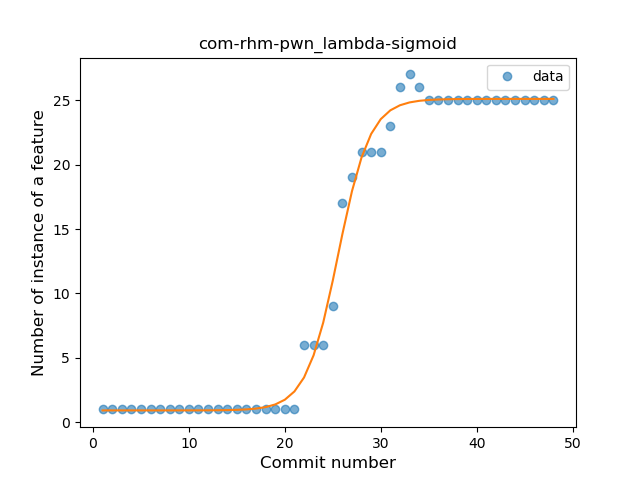

3. de-tubaf-mandelGL

	*  Function: 
	* R_Squared: 0.99184322
 

4. com-physphil-android-unitconverterultimate

	*  Function: 
	* R_Squared: 0.99018779
 

5. de-geeksfactory-opacclient

	*  Function: 
	* R_Squared: 0.98901598
 

6. com-epimorphics-android-myrivers

	*  Function: 
	* R_Squared: 0.98475174
 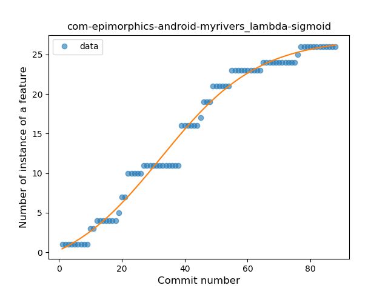

7. science-apolline

	*  Function: 
	* R_Squared: 0.98422681
 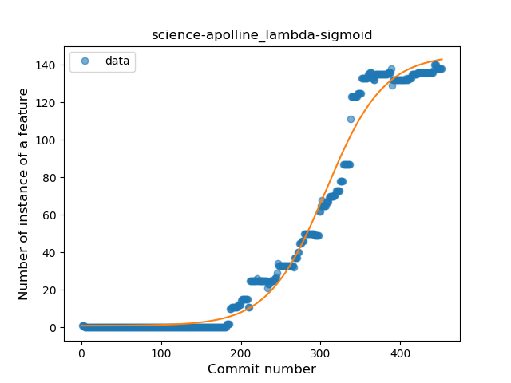

8. com-appspot-pistatium-mahougen

	*  Function: 
	* R_Squared: 0.97134587
 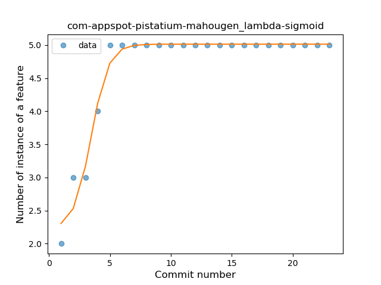

9. com-BibleQuote

	*  Function: 
	* R_Squared: 0.96618373
 

10. com-pluscubed-velociraptor

	*  Function: 
	* R_Squared: 0.96577017
 

11. com-gimranov-zandy-app

	*  Function: 
	* R_Squared: 0.96244947
 

12. com-crane-mockappdemo

	*  Function: 
	* R_Squared: 0.96235097
 

13. org-havenapp-main

	*  Function: 
	* R_Squared: 0.96106354
 

14. com-simplemobiletools-draw

	*  Function: 
	* R_Squared: 0.95982485
 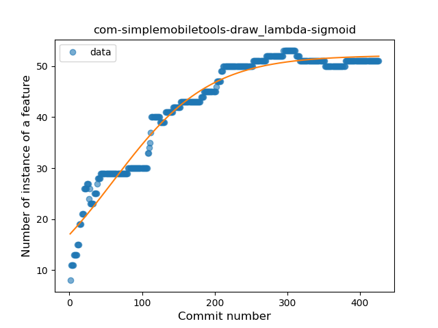

15. com-simplemobiletools-draw-pro

	*  Function: 
	* R_Squared: 0.95982485
 

16. info-metadude-android-congress-schedule

	*  Function: 
	* R_Squared: 0.95854787
 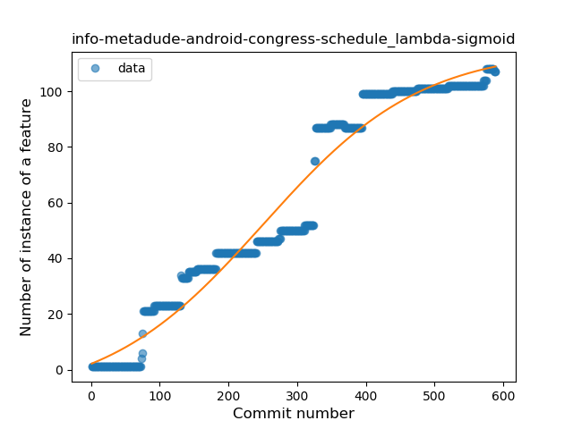

17. com-ninjahoahong-unstoppable

	*  Function: 
	* R_Squared: 0.95766473
 

18. com-whiterabbit-pisabike

	*  Function: 
	* R_Squared: 0.95514015
 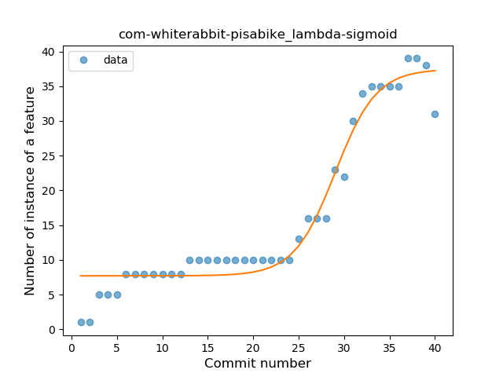

19. org-sanpra-checklist

	*  Function: 
	* R_Squared: 0.9502496
 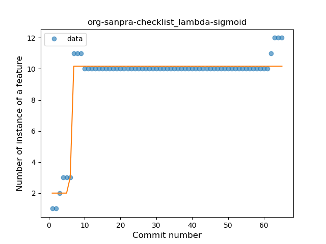

20. com-enjoyingfoss-om

	*  Function: 
	* R_Squared: 0.94781898
 

21. com-scientists-happy-botanist

	*  Function: 
	* R_Squared: 0.94555731
 

22. com-calintat-sensors

	*  Function: 
	* R_Squared: 0.92685036
 

23. de-avpptr-umweltzone

	*  Function: 
	* R_Squared: 0.9252273
 

24. horse-amazin-my-stratum0-statuswidget

	*  Function: 
	* R_Squared: 0.9201981
 

25. at-ac-tuwien-caa-docscan

	*  Function: 
	* R_Squared: 0.90884415
 

26. org-ligi-materialteatimer

	*  Function: 
	* R_Squared: 0.90728842
 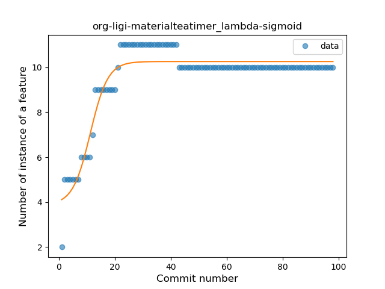

27. nightlock-peppercarrot

	*  Function: 
	* R_Squared: 0.90546549
 

28. de-spiritcroc-defaultdarktheme

	*  Function: 
	* R_Squared: 0.90078127
 

29. org-mcxa-vortaro

	*  Function: 
	* R_Squared: 0.89397015
 

30. com-calintat-units

	*  Function: 
	* R_Squared: 0.88838036
 

31. com-rubenwardy-minetestmodmanager

	*  Function: 
	* R_Squared: 0.88562323
 

32. co-pxhouse-sas

	*  Function: 
	* R_Squared: 0.88422139
 

33. com-wanbok-monger

	*  Function: 
	* R_Squared: 0.88234851
 

34. de-spiritcroc-darkcroc-substratum

	*  Function: 
	* R_Squared: 0.87572545
 

35. org-mattvchandler-progressbars

	*  Function: 
	* R_Squared: 0.76450886
 

36. de-ironjan-mensaupb

	*  Function: 
	* R_Squared: 0.61477312
 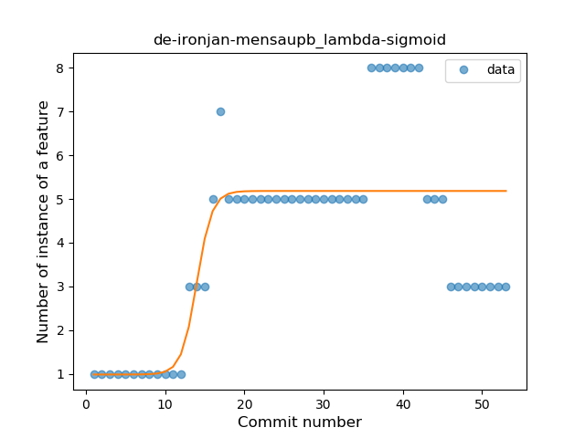

### <a name="T6">Sudden Rise Plateau</a> 
 ----

1. moe-feng-nhentai

	*  Function: 
	* R_Squared: 0.95278781
 

2. com-etesync-syncadapter

	*  Function: 
	* R_Squared: 0.94394927
 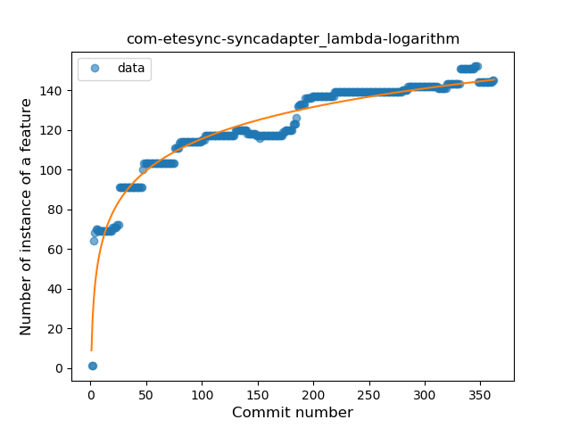

3. nl-brouwerijdemolen-borefts2013

	*  Function: 
	* R_Squared: 0.94116589
 

4. io-github-z3r0c00l

	*  Function: 
	* R_Squared: 0.92971843
 

5. io-github-fvasco-pinpoi

	*  Function: 
	* R_Squared: 0.92468629
 

6. me-barta-stayintouch

	*  Function: 
	* R_Squared: 0.92002637
 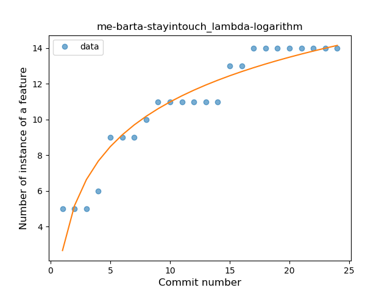

7. com-systemallica-valenbisi

	*  Function: 
	* R_Squared: 0.91997603
 

8. net-stew-stew

	*  Function: 
	* R_Squared: 0.91798956
 

9. es-danirod-rectball-android

	*  Function: 
	* R_Squared: 0.91400752
 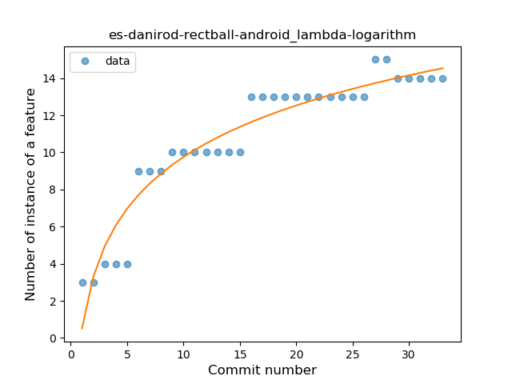

10. org-blitzortung-android-app

	*  Function: 
	* R_Squared: 0.89424666
 

11. org-weilbach-splitbills

	*  Function: 
	* R_Squared: 0.88883302
 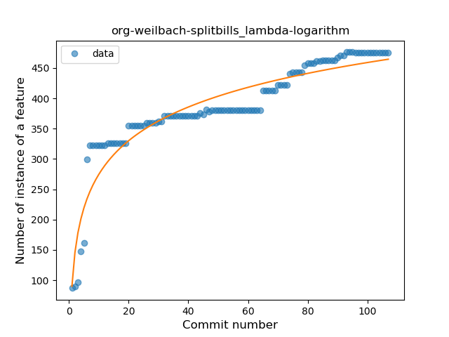

12. com-simplemobiletools-calculator

	*  Function: 
	* R_Squared: 0.88570487
 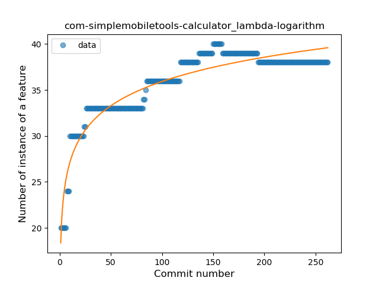

13. at-bitfire-davdroid

	*  Function: 
	* R_Squared: 0.88476999
 

14. com-nao20010128nao-DroidComplex

	*  Function: 
	* R_Squared: 0.87779987
 

15. org-fossasia-badgemagic

	*  Function: 
	* R_Squared: 0.85284719
 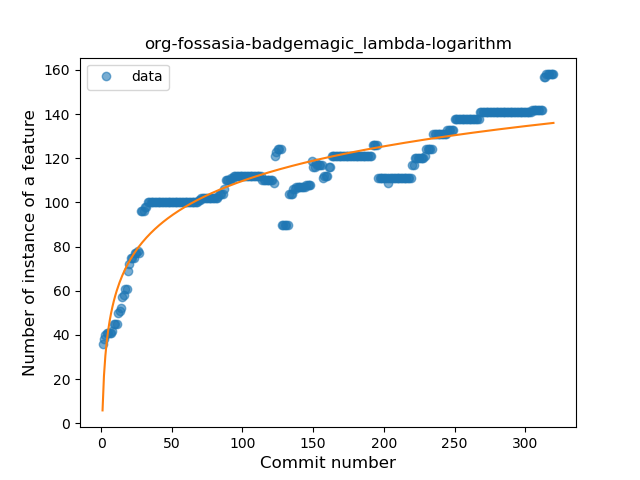

16. me-murks-feedwatcher

	*  Function: 
	* R_Squared: 0.84867158
 

17. io-github-wulkanowy

	*  Function: 
	* R_Squared: 0.83801329
 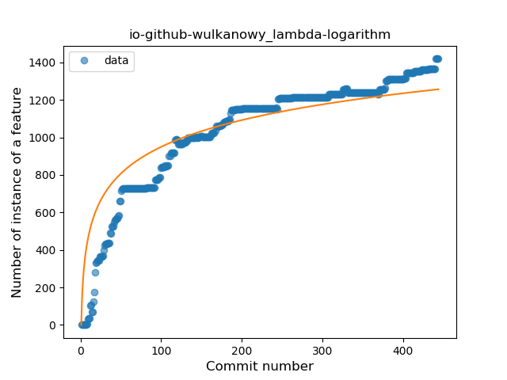

18. com-pixplicity-cryptogram

	*  Function: 
	* R_Squared: 0.83293355
 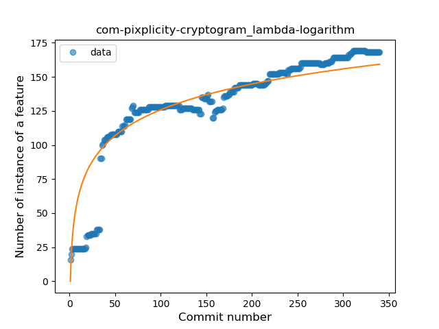

19. com-simplemobiletools-clock

	*  Function: 
	* R_Squared: 0.83169694
 

20. com-pennapps-labs-pennmobile

	*  Function: 
	* R_Squared: 0.81026797
 

21. pl-org-seva-texter

	*  Function: 
	* R_Squared: 0.78888221
 

22. com-conorodonnell-bus

	*  Function: 
	* R_Squared: 0.75398585
 

23. me-echeung-moemoekyun-fdroid

	*  Function: 
	* R_Squared: 0.75066812
 

24. com-corphish-nightlight-generic

	*  Function: 
	* R_Squared: 0.74685247
 

25. io-github-benoitduffez-cupsprint

	*  Function: 
	* R_Squared: 0.60845899
 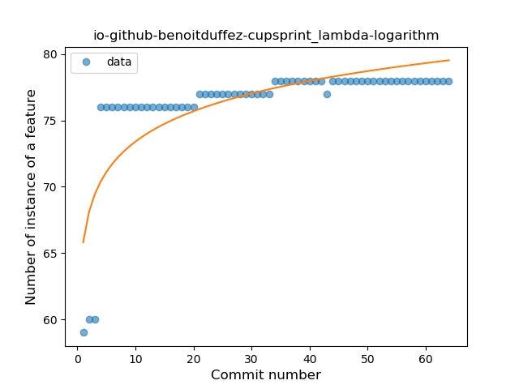

26. app-simone

	*  Function: 
	* R_Squared: 0.59907534
 

27. at-bitfire-icsdroid

	*  Function: 
	* R_Squared: 0.58724942
 

28. com-sduduzog-slimlauncher

	*  Function: 
	* R_Squared: 0.45962116
 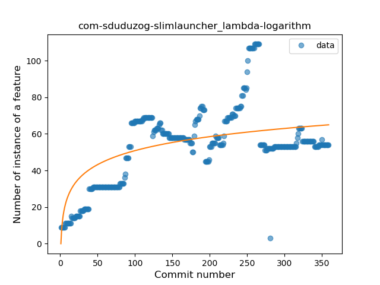

29. superustats-tool-android

	*  Function: 
	* R_Squared: 0.3898972
 

30. eu-the4thfloor-msync

	*  Function: 
	* R_Squared: 0.38396983
 

31. college-wyk-app

	*  Function: 
	* R_Squared: 0.14567775
 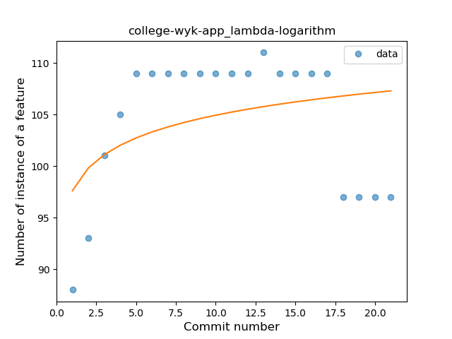

### <a name="T9">Plateau Sudden Rise</a> 
 ----

2. com-alderferstudios-handandfootscores

	*  Function: 
	* R_Squared: 1.0
 

3. com-james-status

	*  Function: 
	* R_Squared: 1.0
 

4. com-mbcdev-folkets

	*  Function: 
	* R_Squared: 1.0
 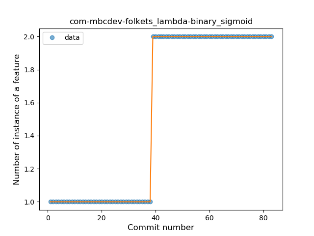

5. de-msal-muzei-nationalgeographic

	*  Function: 
	* R_Squared: 1.0
 

6. fr-jnda-android-ipcalc

	*  Function: 
	* R_Squared: 1.0
 

7. name-cantanima-chineseremainderclock

	*  Function: 
	* R_Squared: 1.0
 

8. nl-renedegroot-android-adbawake

	*  Function: 
	* R_Squared: 1.0
 

11. org-teamblueridge-pasteitapp

	*  Function: 
	* R_Squared: 0.90328634
 

13. org-ligi-ipfsdroid

	*  Function: 
	* R_Squared: 0.84948833
 

14. com-yubico-yubioath

	*  Function: 
	* R_Squared: 0.8171574
 

15. ml-adamsprogs-bimba

	*  Function: 
	* R_Squared: 0.72817247
 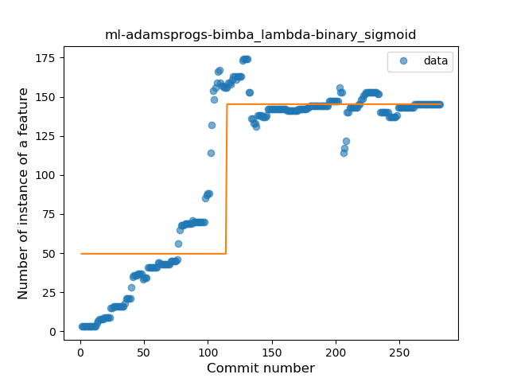

16. com-manichord-mgit

	*  Function: 
	* R_Squared: 0.66569607
 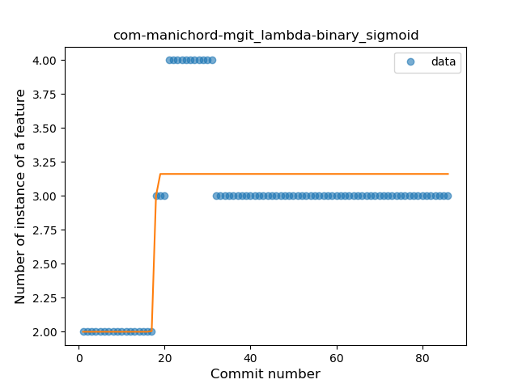

17. org-kiwix-kiwixcustomwikivoyageeurope

	*  Function: 
	* R_Squared: 0.4096281
 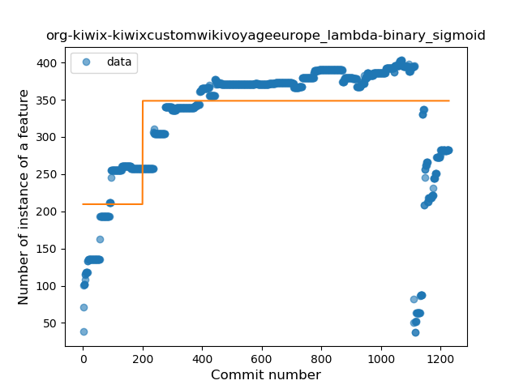

18. net-nonylene-photolinkviewer

	*  Function: 
	* R_Squared: 0.32689238
 

### <a name="T5">Sudden Decline</a> 
 ----

66. org-ligi-fast

	*  Function: 
	* R_Squared: 0.76566091
 

67. org-ligi-faster

	*  Function: 
	* R_Squared: 0.76566091
 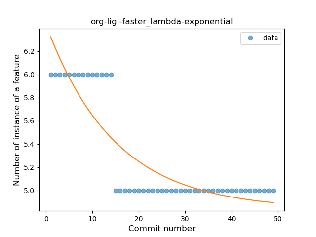

69. com-ids1024-lsdict

	*  Function: 
	* R_Squared: 0.61670076
 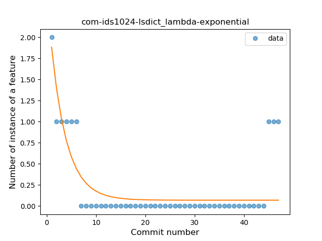

70. saschpe-poker

	*  Function: 
	* R_Squared: 0.59799444
 

### <a name="T10">Plateau Sudden Decline</a> 
 ----

1. co-garmax-materialflashlight

	*  Function: 
	* R_Squared: 1.0
 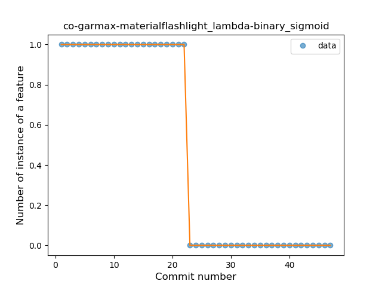

9. streetwalrus-usbmountr

	*  Function: 
	* R_Squared: 1.0
 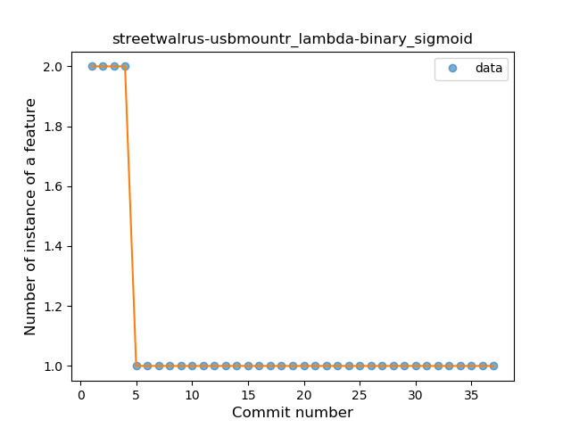

10. org-mifos-mobile

	*  Function: 
	* R_Squared: 0.90611666
 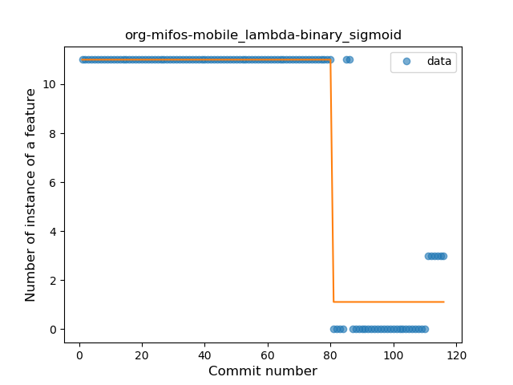

12. com-benny-openlauncher

	*  Function: 
	* R_Squared: 0.86308918
 

### <a name="T2">Constant Decline</a> 
 ----

124. me-rei_m-hyakuninisshu

	*  Function: 
	* R_Squared: 0.18366427
 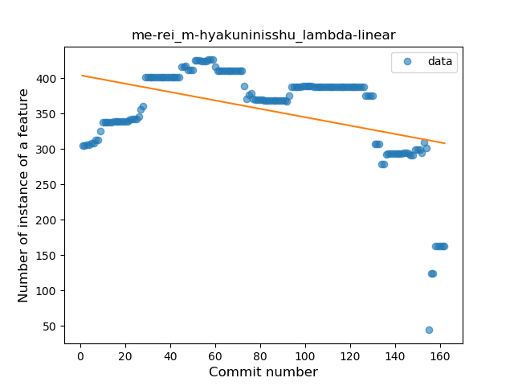

125. me-kirimin-mitsumine

	*  Function: 
	* R_Squared: 0.00626561
 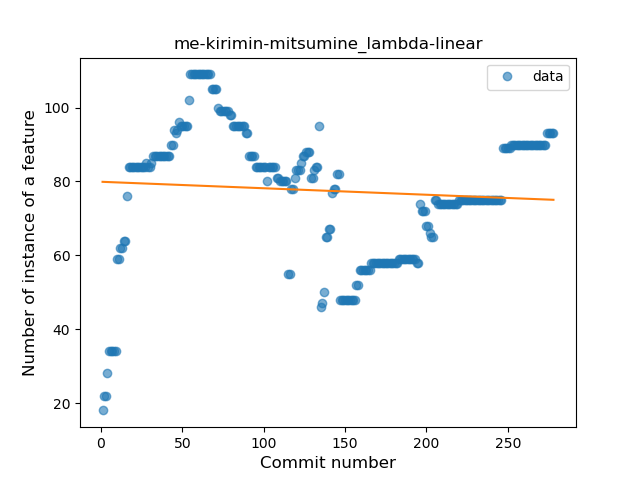

### <a name="T3">Stability</a> 
 ----

### <a name="T8">Plateau Gradual Decline</a> 
 ----

