## Overloaded Operator
----
**Best fit = Plateau Sudden Rise**: 15

Function | N# best fit
----|----
<a href=" #T9">Plateau Sudden Rise</a> | 15
<a href=" #T7">Plateau Gradual Rise</a> | 11
<a href=" #T10">Plateau Sudden Decline</a> | 11
<a href=" #T1">Constant Rise</a> | 9
<a href=" #T4">Sudden Rise</a> | 5
<a href=" #T6">Sudden Rise Plateau</a> | 5
<a href=" #T2">Constant Decline</a> | 3
<a href=" #T5">Sudden Decline</a> | 2
<a href=" #T8">Plateau Gradual Decline</a> | 2
<a href=" #T11">Instability</a> | 1
<a href=" #T3">Stability</a> | 0

### <a name="T9">Plateau Sudden Rise</a> 
 ----

1. be-mygod-vpnhotspot

	*  Function: 
	* R_Squared: 1.0
 

2. com-bernaferrari-changedetection

	*  Function: 
	* R_Squared: 1.0
 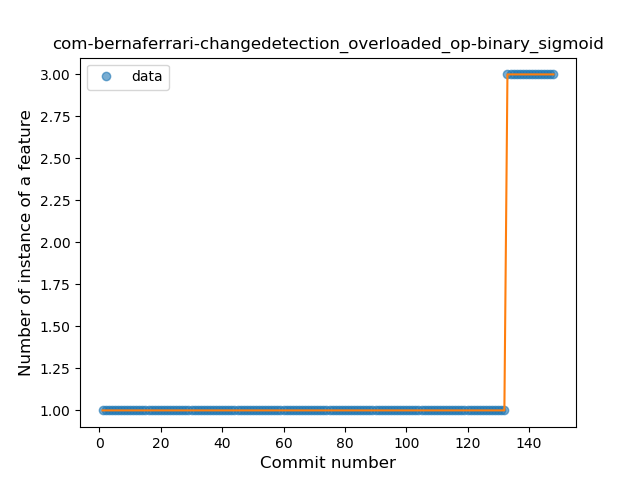

7. com-lavadip-miniVector

	*  Function: 
	* R_Squared: 1.0
 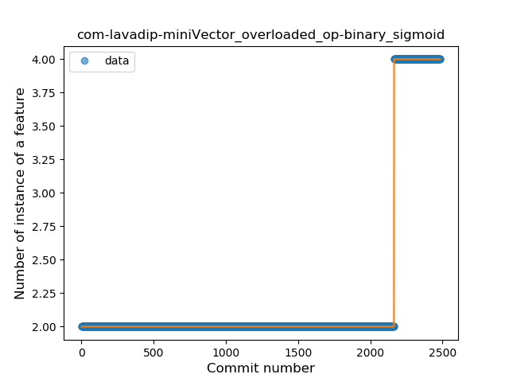

8. com-nononsenseapps-feeder

	*  Function: 
	* R_Squared: 1.0
 

9. com-orgzly

	*  Function: 
	* R_Squared: 1.0
 

13. im-vector-alpha

	*  Function: 
	* R_Squared: 1.0
 

14. info-papdt-express-helper

	*  Function: 
	* R_Squared: 1.0
 

16. moe-feng-nhentai

	*  Function: 
	* R_Squared: 1.0
 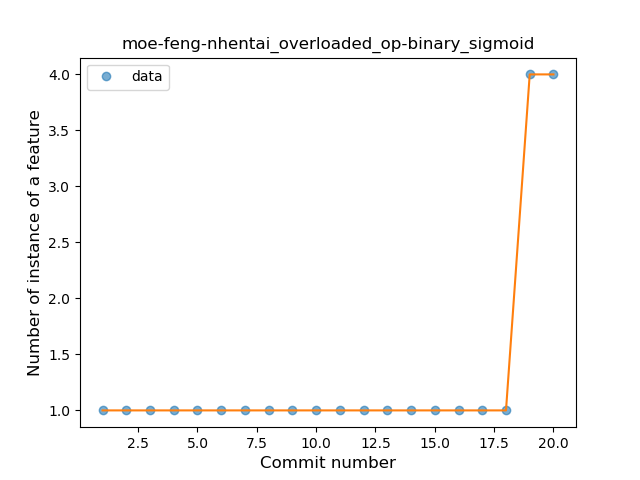

17. net-bible-android-activity

	*  Function: 
	* R_Squared: 1.0
 

20. org-moire-ultrasonic

	*  Function: 
	* R_Squared: 1.0
 

21. pl-org-seva-navigator

	*  Function: 
	* R_Squared: 1.0
 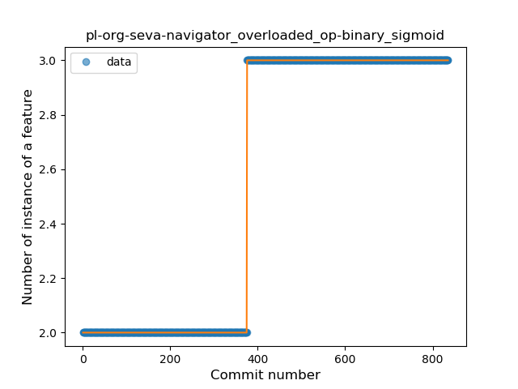

22. pt-ipleiria-mymusicqoe

	*  Function: 
	* R_Squared: 1.0
 

23. tech-ula

	*  Function: 
	* R_Squared: 1.0
 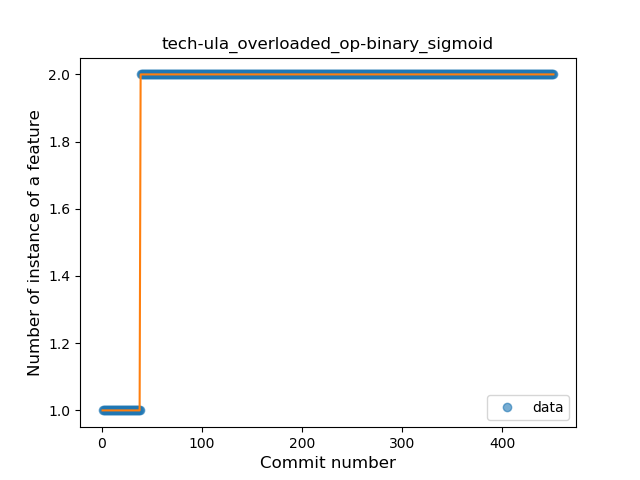

24. de-r4md4c-gamedealz

	*  Function: 
	* R_Squared: 0.97370398
 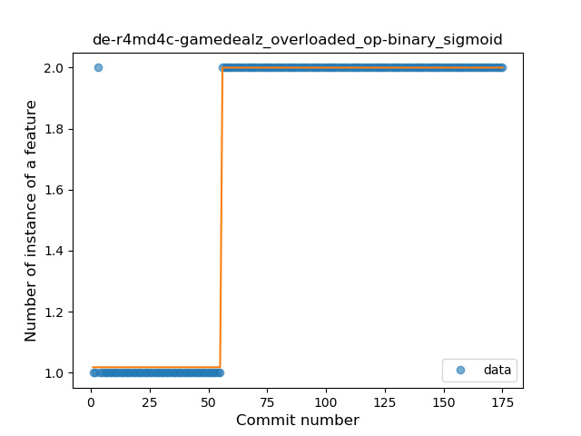

26. com-garpr-android

	*  Function: 
	* R_Squared: 0.29696983
 

### <a name="T7">Plateau Gradual Rise</a> 
 ----

1. com-boardgamegeek

	*  Function: 
	* R_Squared: 1.0
 

3. de-Maxr1998-xposed-maxlock

	*  Function: 
	* R_Squared: 0.98328845
 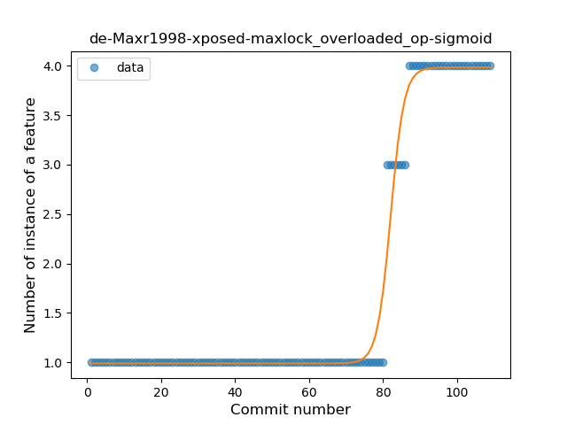

4. nl-brouwerijdemolen-borefts2013

	*  Function: 
	* R_Squared: 0.97270489
 

5. com-benoitquenaudon-tvfoot-red

	*  Function: 
	* R_Squared: 0.97036197
 

6. net-mm2d-dmsexplorer

	*  Function: 
	* R_Squared: 0.96737571
 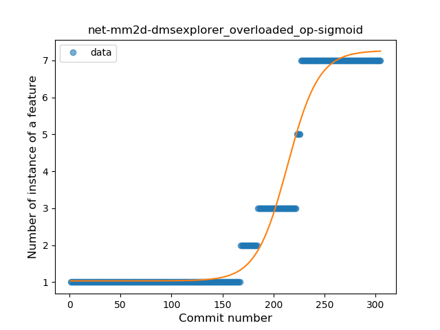

7. ml-adamsprogs-bimba

	*  Function: 
	* R_Squared: 0.96663481
 

8. com-sjn-stamp

	*  Function: 
	* R_Squared: 0.95179675
 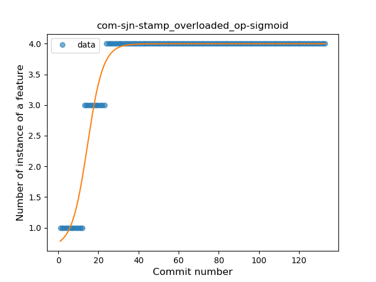

9. com-dp-logcatapp

	*  Function: 
	* R_Squared: 0.94486798
 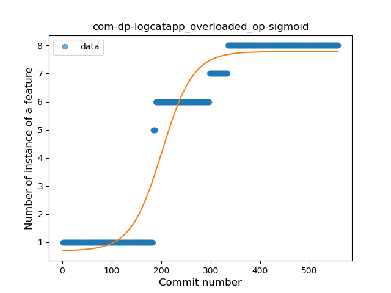

10. li-klass-fhem

	*  Function: 
	* R_Squared: 0.93925829
 

12. de-ph1b-audiobook

	*  Function: 
	* R_Squared: 0.90129448
 

13. io-ipoli-android

	*  Function: 
	* R_Squared: 0.35508865
 

### <a name="T10">Plateau Sudden Decline</a> 
 ----

3. com-calintat-sensors

	*  Function: 
	* R_Squared: 1.0
 

4. com-etesync-syncadapter

	*  Function: 
	* R_Squared: 1.0
 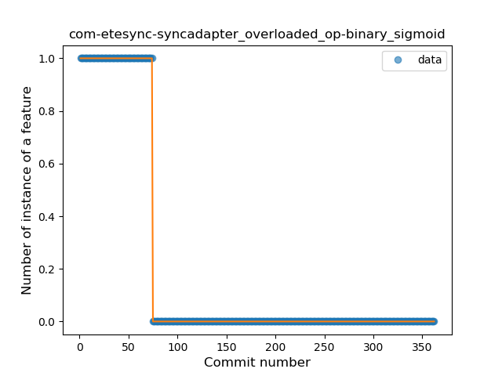

5. com-github-moko256-twitlatte

	*  Function: 
	* R_Squared: 1.0
 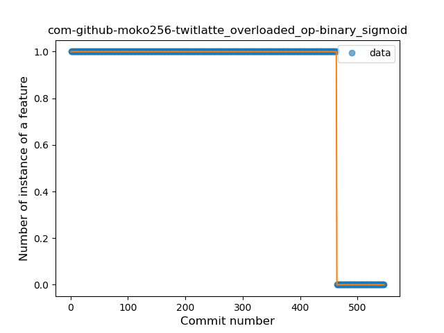

6. com-github-vase4kin-teamcityapp

	*  Function: 
	* R_Squared: 1.0
 

10. com-yubico-yubioath

	*  Function: 
	* R_Squared: 1.0
 

11. de-markusfisch-android-binaryeye

	*  Function: 
	* R_Squared: 1.0
 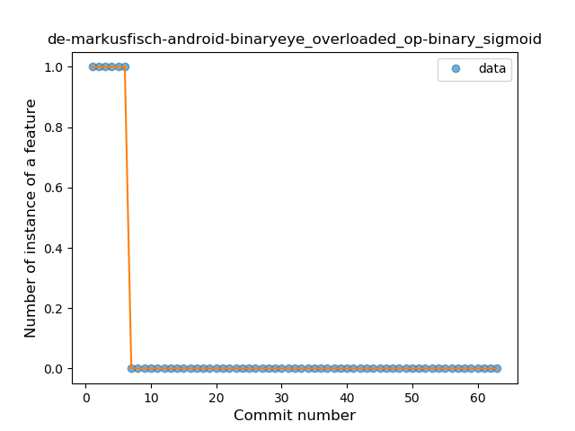

12. es-usc-citius-servando-calendula

	*  Function: 
	* R_Squared: 1.0
 

15. me-camsteffen-polite

	*  Function: 
	* R_Squared: 1.0
 

18. nl-mpcjanssen-simpletask

	*  Function: 
	* R_Squared: 1.0
 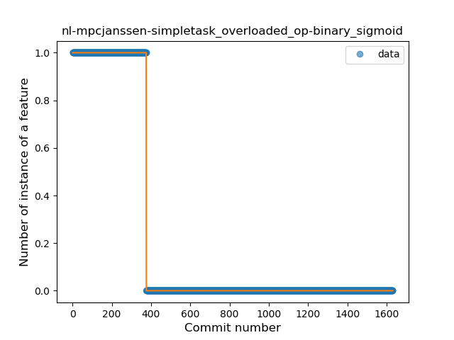

19. org-blitzortung-android-app

	*  Function: 
	* R_Squared: 1.0
 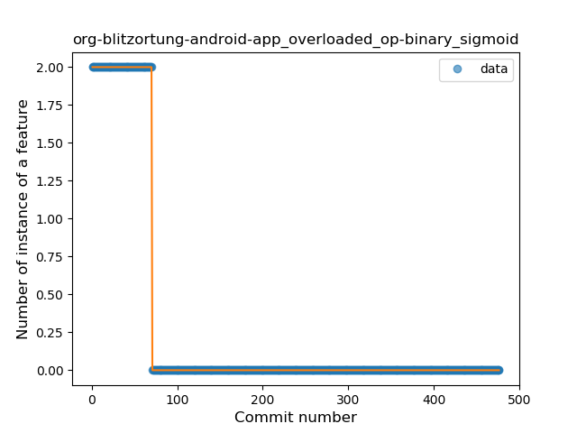

25. com-simplemobiletools-contacts-pro

	*  Function: 
	* R_Squared: 0.86674734
 

### <a name="T1">Constant Rise</a> 
 ----

1. org-mozilla-rocket

	*  Function: 
	* R_Squared: 0.9287069
 

2. org-zimmob-zimlx

	*  Function: 
	* R_Squared: 0.91636517
 

3. fi-kroon-vadret

	*  Function: 
	* R_Squared: 0.87010953
 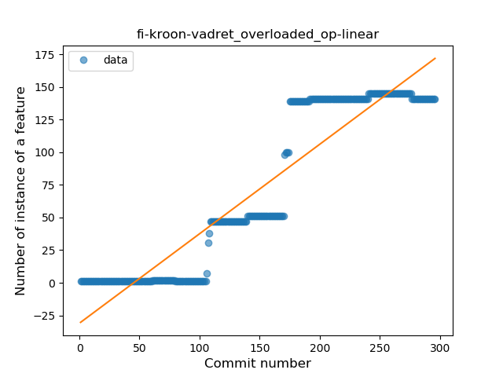

4. jp-toastkid-yobidashi

	*  Function: 
	* R_Squared: 0.80886385
 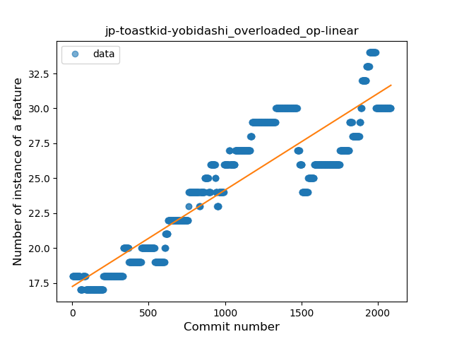

5. com-github-quarck-calnotify

	*  Function: 
	* R_Squared: 0.65802159
 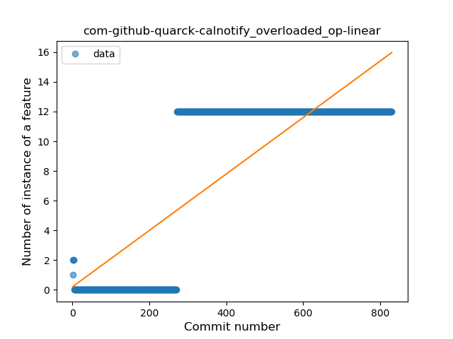

6. ch-rmy-android-http_shortcuts

	*  Function: 
	* R_Squared: 0.59344791
 

7. com-booboot-vndbandroid

	*  Function: 
	* R_Squared: 0.39038635
 

8. com-github-premnirmal-tickerwidget

	*  Function: 
	* R_Squared: 0.13640387
 

10. org-blokada-alarm

	*  Function: 
	* R_Squared: 0.06285368
 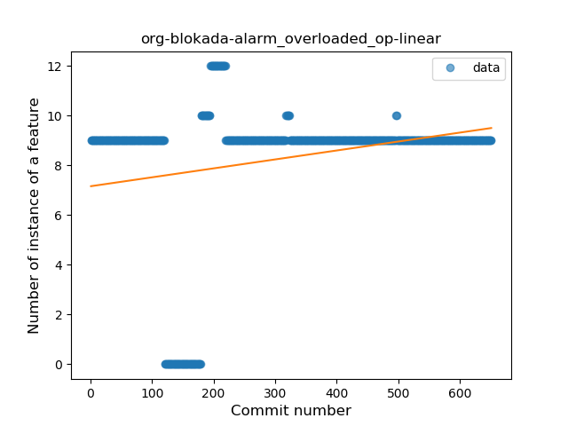

### <a name="T4">Sudden Rise</a> 
 ----

1. org-mariotaku-twidere

	*  Function: 
	* R_Squared: 0.95872928
 

2. ch-deletescape-lawnchair-plah

	*  Function: 
	* R_Squared: 0.92073242
 

5. it-diab

	*  Function: 
	* R_Squared: 0.72291306
 

6. me-proxer-app

	*  Function: 
	* R_Squared: 0.22055571
 

7. com-jereksel-libresubstratum

	*  Function: 
	* R_Squared: 0.12151267
 

### <a name="T6">Sudden Rise Plateau</a> 
 ----

1. com-loloof64-android-basicchessendgamestrainer

	*  Function: 
	* R_Squared: 0.8351353
 

2. com-arcao-geocaching4locus

	*  Function: 
	* R_Squared: 0.83226984
 

3. org-eurofurence-connavigator

	*  Function: 
	* R_Squared: 0.8294391
 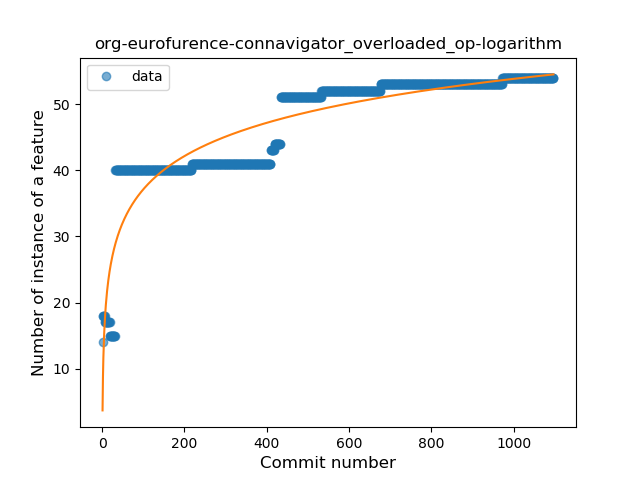

4. com-pitchedapps-frost

	*  Function: 
	* R_Squared: 0.58047748
 

5. org-pacien-tincapp

	*  Function: 
	* R_Squared: 0.19899987
 

### <a name="T2">Constant Decline</a> 
 ----

9. org-liberty-android-freeotpplus

	*  Function: 
	* R_Squared: 0.07057362
 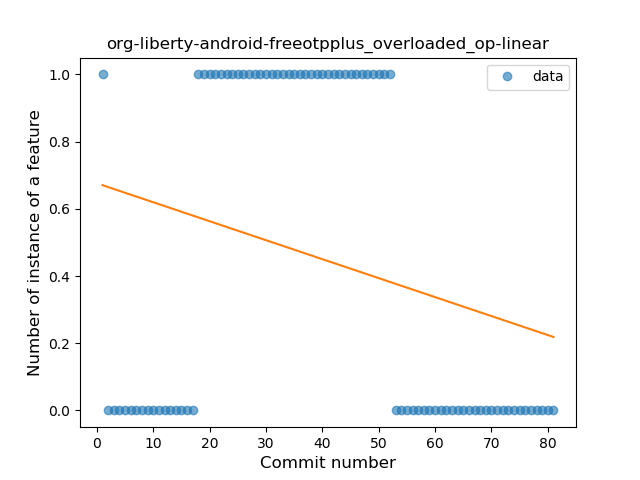

11. me-rei_m-hyakuninisshu

	*  Function: 
	* R_Squared: 0.02814017
 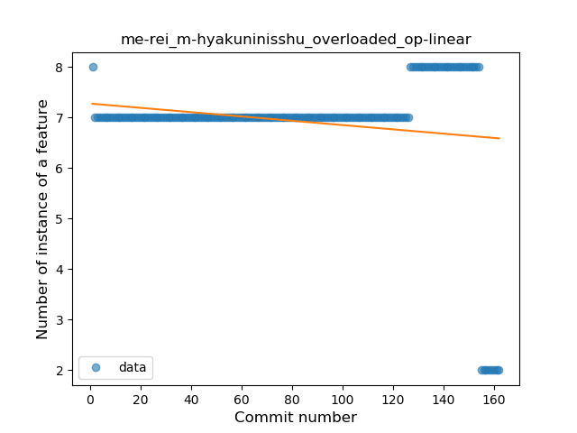

12. io-github-feelfreelinux-wykopmobilny

	*  Function: 
	* R_Squared: 0.00041037
 

### <a name="T5">Sudden Decline</a> 
 ----

3. org-anibyl-slounik

	*  Function: 
	* R_Squared: 0.90674059
 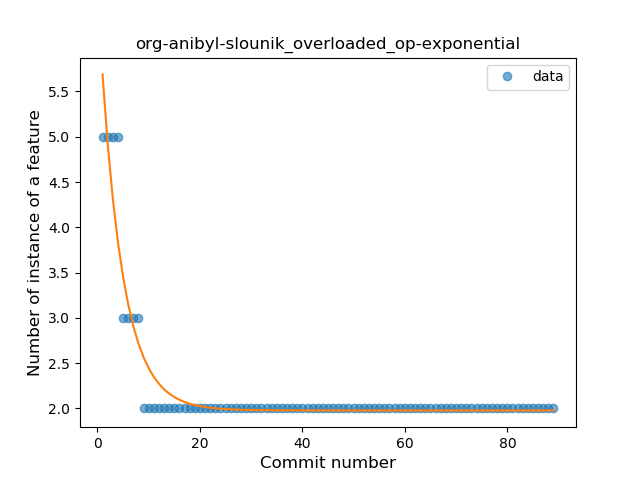

4. org-equeim-tremotesf

	*  Function: 
	* R_Squared: 0.76083162
 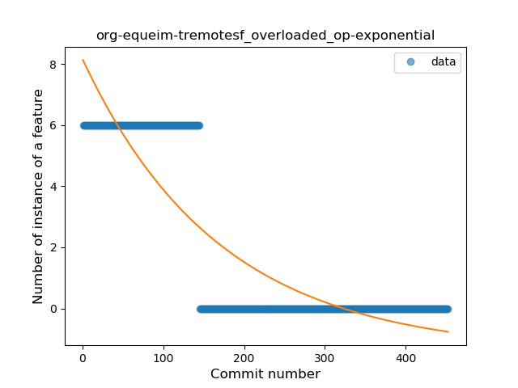

### <a name="T8">Plateau Gradual Decline</a> 
 ----

2. org-kiwix-kiwixcustomwikivoyageeurope

	*  Function: 
	* R_Squared: 0.98372727
 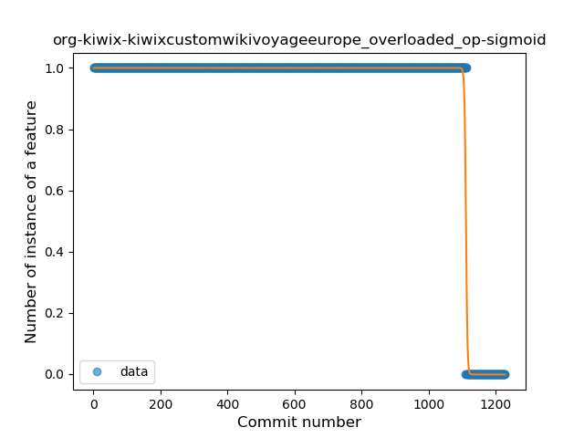

11. fr-chenry-android-freshrss

	*  Function: 
	* R_Squared: 0.9240728
 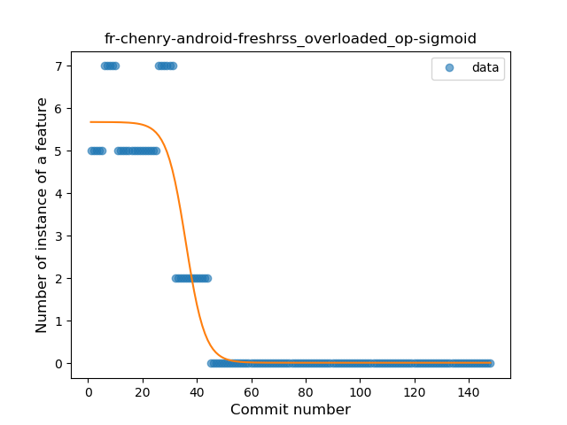

### <a name="T11">Instability</a> 
 ----

1. fr-rhaz-ipfs-sweet

	*  Function: 
	* R_Squared: 0.45186496
 

### <a name="T3">Stability</a> 
 ----

