## Property Delegation
----
**Best fit = Constant Rise**: 40

Function | N# best fit
----|----
<a href=" #T1">Constant Rise</a> | 40
<a href=" #T4">Sudden Rise</a> | 32
<a href=" #T7">Plateau Gradual Rise</a> | 23
<a href=" #T6">Sudden Rise Plateau</a> | 22
<a href=" #T9">Plateau Sudden Rise</a> | 18
<a href=" #T11">Instability</a> | 17
<a href=" #T2">Constant Decline</a> | 11
<a href=" #T5">Sudden Decline</a> | 8
<a href=" #T10">Plateau Sudden Decline</a> | 5
<a href=" #T8">Plateau Gradual Decline</a> | 3
<a href=" #T3">Stability</a> | 0

### <a name="T1">Constant Rise</a> 
 ----

1. com-boardgamegeek

	*  Function: 
	* R_Squared: 0.98712915
 

2. com-eventyay-attendee

	*  Function: 
	* R_Squared: 0.96262683
 

3. io-github-feelfreelinux-wykopmobilny

	*  Function: 
	* R_Squared: 0.96145165
 

4. ch-rmy-android-http_shortcuts

	*  Function: 
	* R_Squared: 0.95498744
 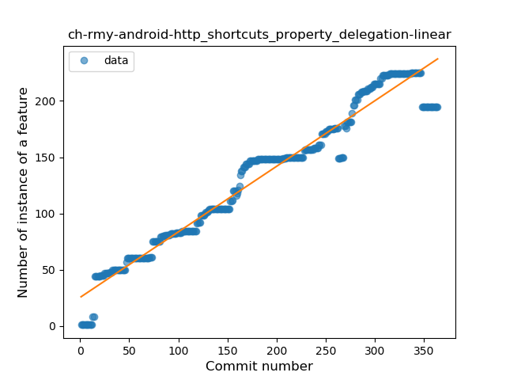

5. com-commit451-gitlab

	*  Function: 
	* R_Squared: 0.94761734
 

6. be-mygod-vpnhotspot

	*  Function: 
	* R_Squared: 0.9441142
 

7. com-booboot-vndbandroid

	*  Function: 
	* R_Squared: 0.93983243
 

8. me-proxer-app

	*  Function: 
	* R_Squared: 0.93963536
 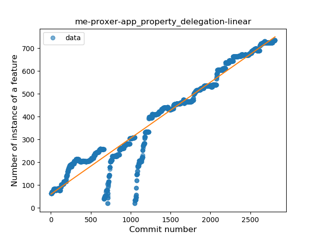

9. ffc-app

	*  Function: 
	* R_Squared: 0.93169579
 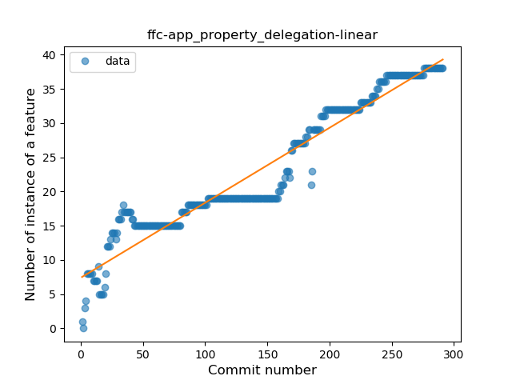

10. ca-josephroque-bowlingcompanion

	*  Function: 
	* R_Squared: 0.93081858
 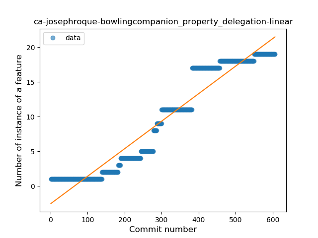

11. org-mozilla-rocket

	*  Function: 
	* R_Squared: 0.93003623
 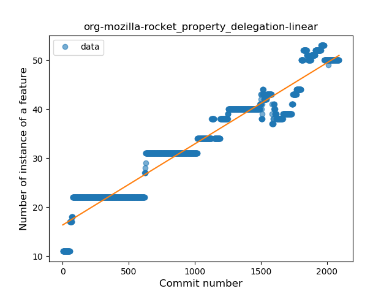

12. uk-co-richyhbm-monochromatic

	*  Function: 
	* R_Squared: 0.91763944
 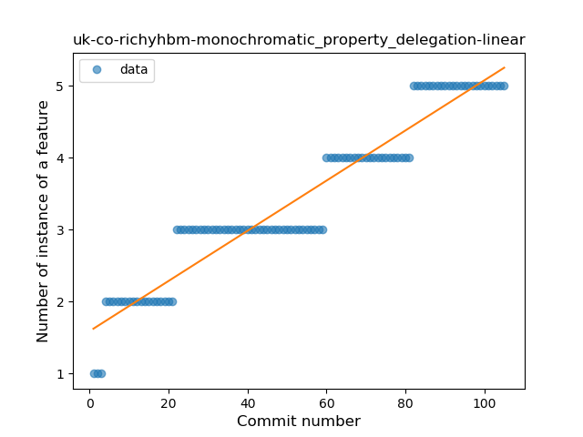

13. com-duckduckgo-mobile-android

	*  Function: 
	* R_Squared: 0.91161139
 

14. com-keylesspalace-tusky

	*  Function: 
	* R_Squared: 0.91093318
 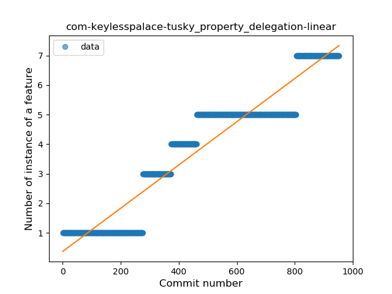

15. com-glodanif-bluetoothchat

	*  Function: 
	* R_Squared: 0.89770649
 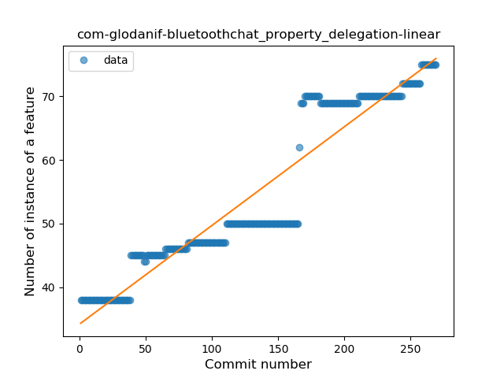

16. net-syncthing-lite

	*  Function: 
	* R_Squared: 0.89557665
 

17. com-fsck-k9

	*  Function: 
	* R_Squared: 0.89342286
 

18. org-ligi-survivalmanual

	*  Function: 
	* R_Squared: 0.8886182
 

19. de-r4md4c-gamedealz

	*  Function: 
	* R_Squared: 0.87662219
 

20. com-jereksel-libresubstratum

	*  Function: 
	* R_Squared: 0.87126392
 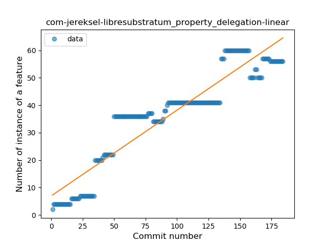

21. com-ofalvai-bpinfo

	*  Function: 
	* R_Squared: 0.86804288
 

22. org-walleth

	*  Function: 
	* R_Squared: 0.86161535
 

23. com-zacharee1-systemuituner

	*  Function: 
	* R_Squared: 0.85843153
 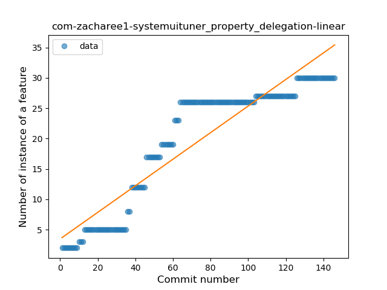

24. de-thecode-android-tazreader

	*  Function: 
	* R_Squared: 0.8493199
 

25. com-arcao-geocaching4locus

	*  Function: 
	* R_Squared: 0.84481222
 

26. com-github-quarck-calnotify

	*  Function: 
	* R_Squared: 0.82610955
 

27. org-mariotaku-twidere

	*  Function: 
	* R_Squared: 0.82499663
 

28. acr-browser-lightning

	*  Function: 
	* R_Squared: 0.80813472
 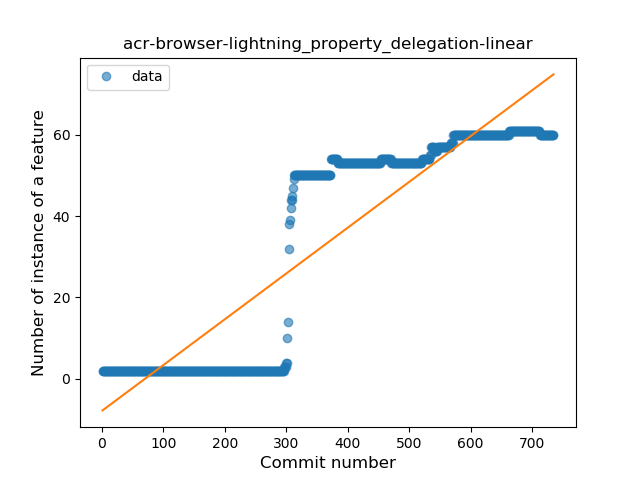

29. es-usc-citius-servando-calendula

	*  Function: 
	* R_Squared: 0.80184547
 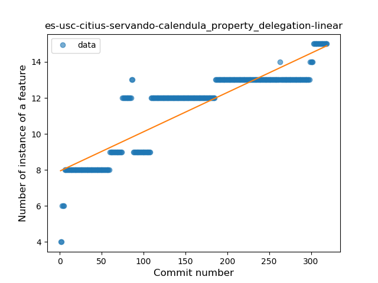

30. nl-mpcjanssen-simpletask

	*  Function: 
	* R_Squared: 0.78003331
 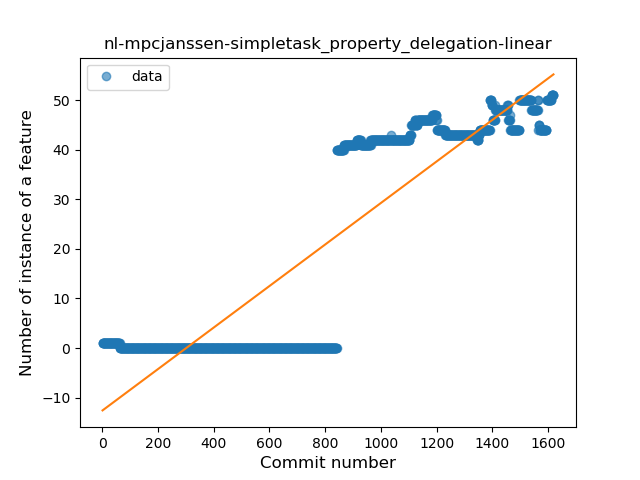

31. com-jmstudios-redmoon

	*  Function: 
	* R_Squared: 0.77491532
 

32. fr-cph-chicago-foss

	*  Function: 
	* R_Squared: 0.77276908
 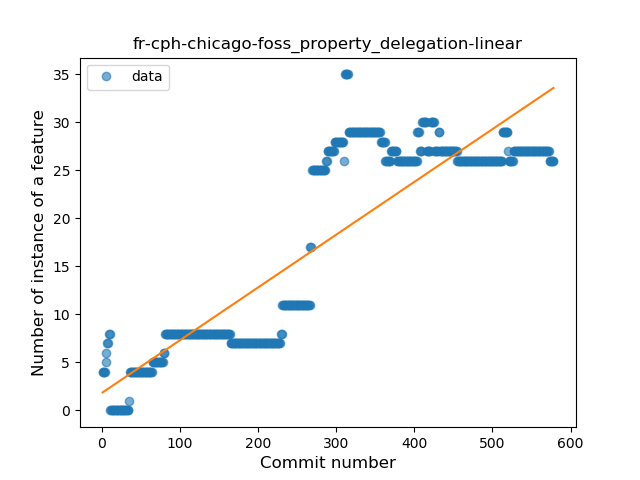

33. de-thecode-lmd

	*  Function: 
	* R_Squared: 0.76304195
 

34. org-eurofurence-connavigator

	*  Function: 
	* R_Squared: 0.72477932
 

35. im-vector-alpha

	*  Function: 
	* R_Squared: 0.71897295
 

36. com-lavadip-miniVector

	*  Function: 
	* R_Squared: 0.7179952
 

37. net-nonylene-photolinkviewer

	*  Function: 
	* R_Squared: 0.68701069
 

38. org-ligi-passandroid

	*  Function: 
	* R_Squared: 0.63107162
 

40. com-zeapo-pwdstore

	*  Function: 
	* R_Squared: 0.44734465
 

42. eu-kanade-tachiyomi

	*  Function: 
	* R_Squared: 0.38186478
 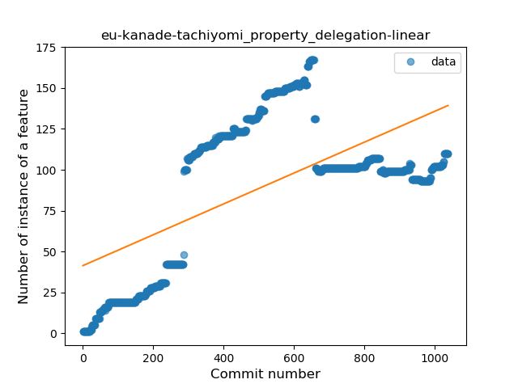

### <a name="T4">Sudden Rise</a> 
 ----

1. com-skydoves-waterdays

	*  Function: 
	* R_Squared: 1.0
 

3. ch-deletescape-lawnchair-plah

	*  Function: 
	* R_Squared: 0.98664912
 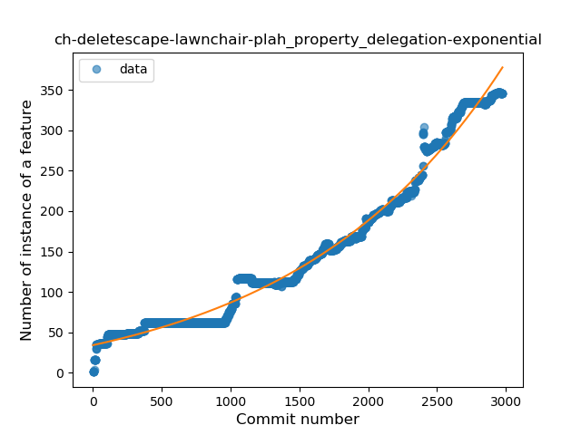

4. io-ipoli-android

	*  Function: 
	* R_Squared: 0.96933805
 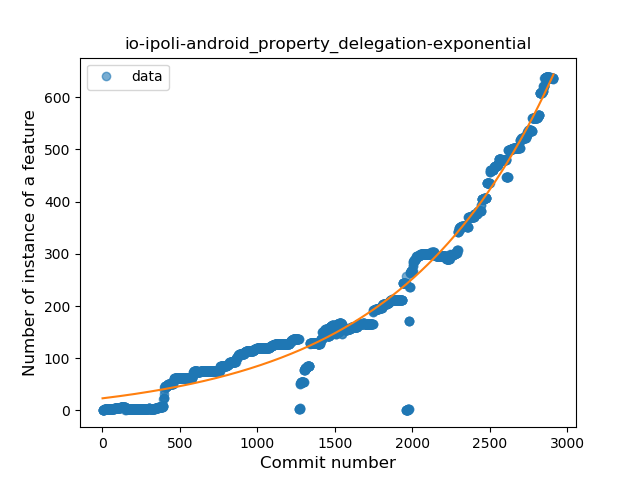

5. com-czbix-v2ex

	*  Function: 
	* R_Squared: 0.93624682
 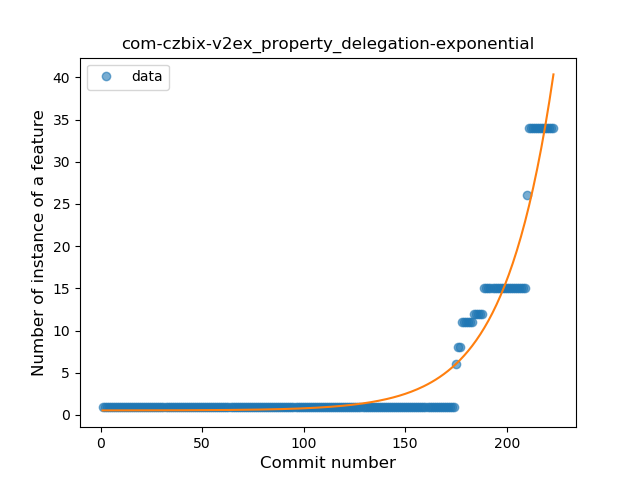

6. de-Maxr1998-xposed-maxlock

	*  Function: 
	* R_Squared: 0.92107739
 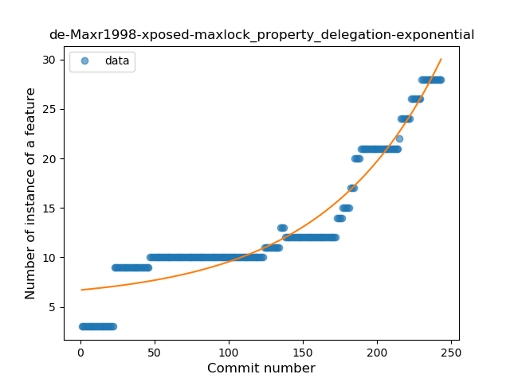

7. com-motion-stage1

	*  Function: 
	* R_Squared: 0.92104764
 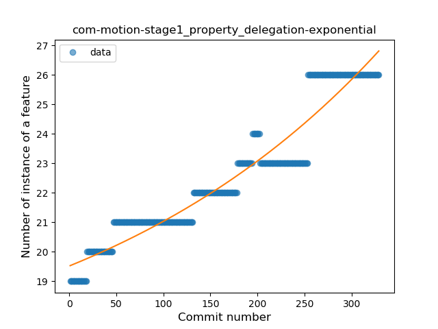

8. org-ligi-gobandroid

	*  Function: 
	* R_Squared: 0.9148276
 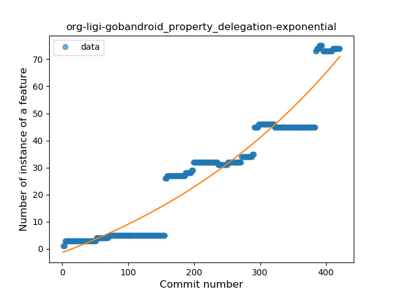

9. org-mozilla-focus

	*  Function: 
	* R_Squared: 0.90514764
 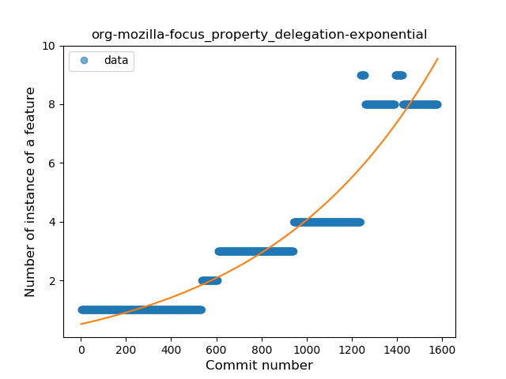

10. org-mozilla-klar

	*  Function: 
	* R_Squared: 0.90514764
 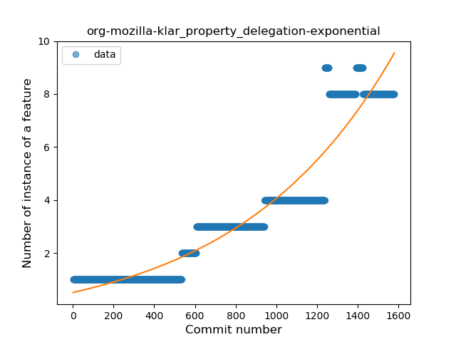

11. io-trewartha-positional

	*  Function: 
	* R_Squared: 0.89047035
 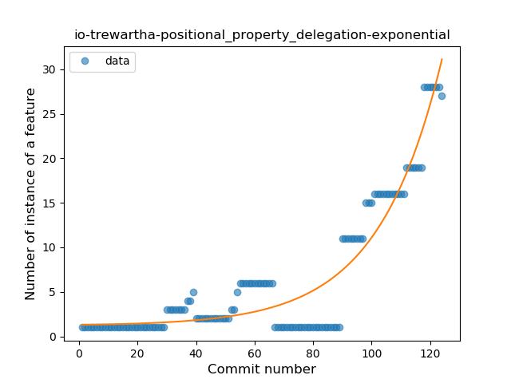

12. com-peterlaurence-trekme

	*  Function: 
	* R_Squared: 0.8899765
 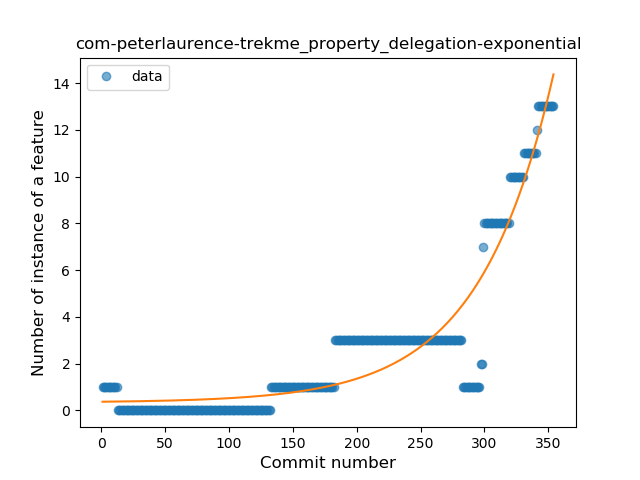

13. fi-kroon-vadret

	*  Function: 
	* R_Squared: 0.88341956
 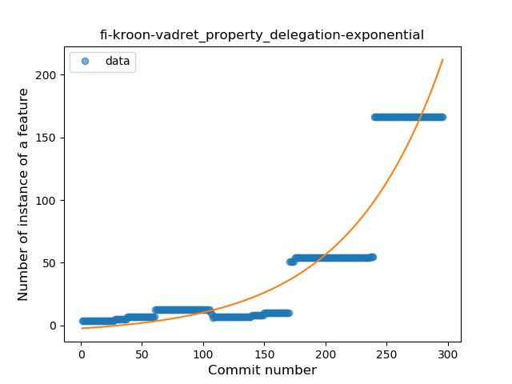

14. chat-rocket-android

	*  Function: 
	* R_Squared: 0.88282086
 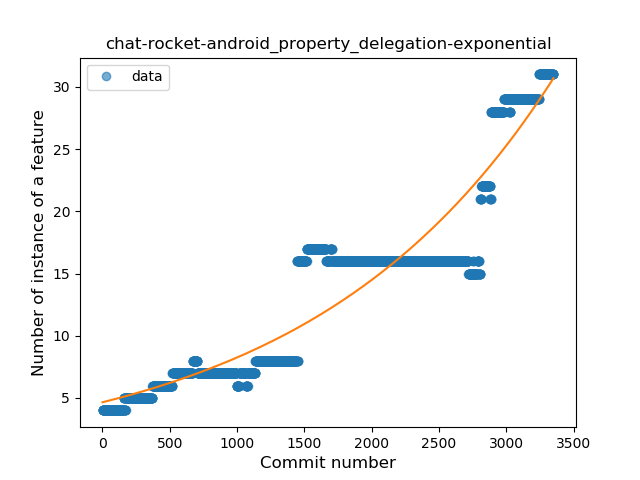

15. net-yslibrary-monotweety

	*  Function: 
	* R_Squared: 0.85841347
 

16. net-mm2d-dmsexplorer

	*  Function: 
	* R_Squared: 0.8545268
 

17. com-jim-sharetocomputer

	*  Function: 
	* R_Squared: 0.85046622
 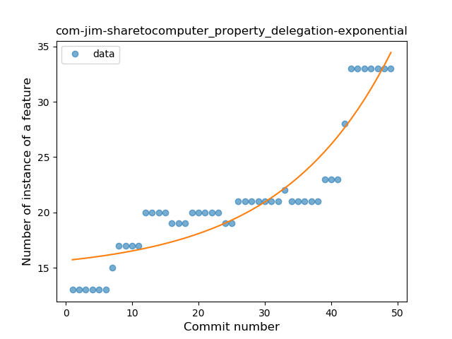

18. moe-feng-nhentai

	*  Function: 
	* R_Squared: 0.84724004
 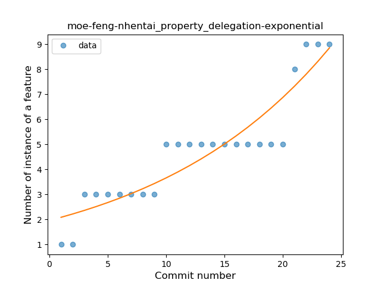

19. com-slash-batterychargelimit

	*  Function: 
	* R_Squared: 0.84226209
 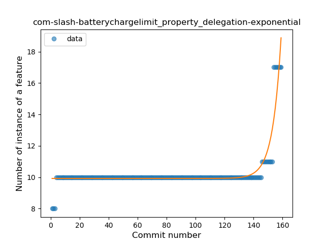

21. com-nononsenseapps-feeder

	*  Function: 
	* R_Squared: 0.82826796
 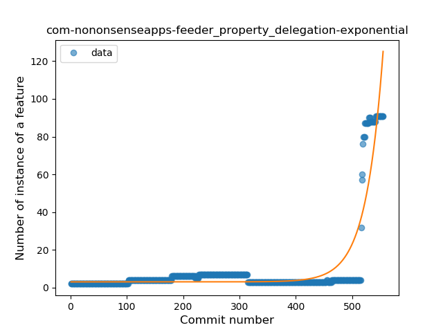

22. org-zimmob-zimlx

	*  Function: 
	* R_Squared: 0.82373404
 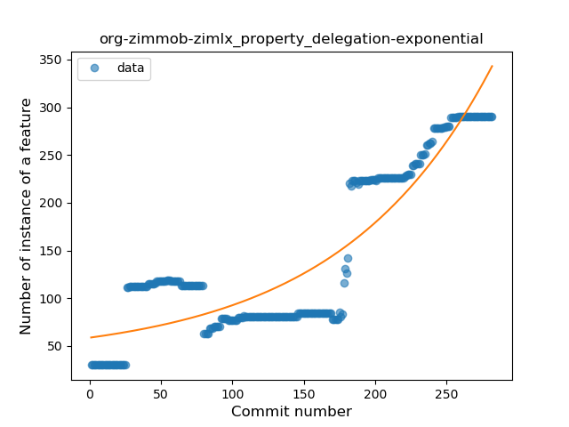

24. pl-org-seva-texter

	*  Function: 
	* R_Squared: 0.78531777
 

28. com-wabadaba-dziennik

	*  Function: 
	* R_Squared: 0.71812552
 

30. pl-org-seva-navigator

	*  Function: 
	* R_Squared: 0.69590788
 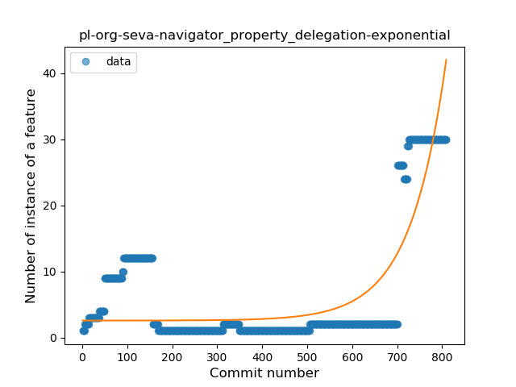

31. com-bernaferrari-changedetection

	*  Function: 
	* R_Squared: 0.69482421
 

32. app-opass-ccip

	*  Function: 
	* R_Squared: 0.61223851
 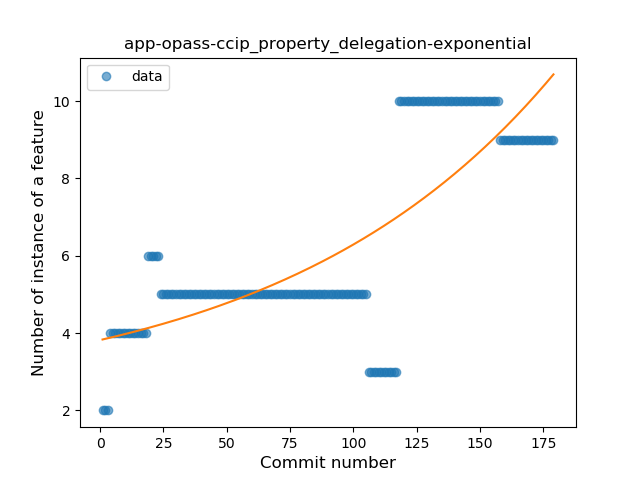

33. com-tasomaniac-openwith-floss

	*  Function: 
	* R_Squared: 0.6031706
 

35. se-barsk-park

	*  Function: 
	* R_Squared: 0.50796041
 

36. pl-hypeapp-episodie

	*  Function: 
	* R_Squared: 0.398182
 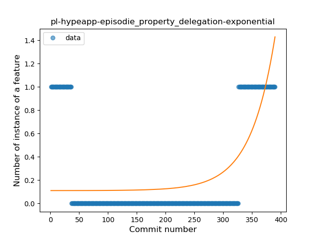

37. com-njlabs-showjava

	*  Function: 
	* R_Squared: 0.27193444
 

38. com-loloof64-android-basicchessendgamestrainer

	*  Function: 
	* R_Squared: 0.1447141
 

39. de-ph1b-audiobook

	*  Function: 
	* R_Squared: 0.10403579
 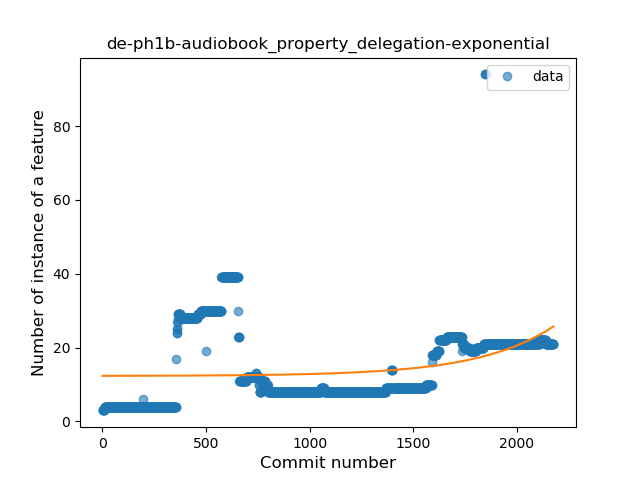

40. org-fossasia-badgemagic

	*  Function: 
	* R_Squared: 0.0865725
 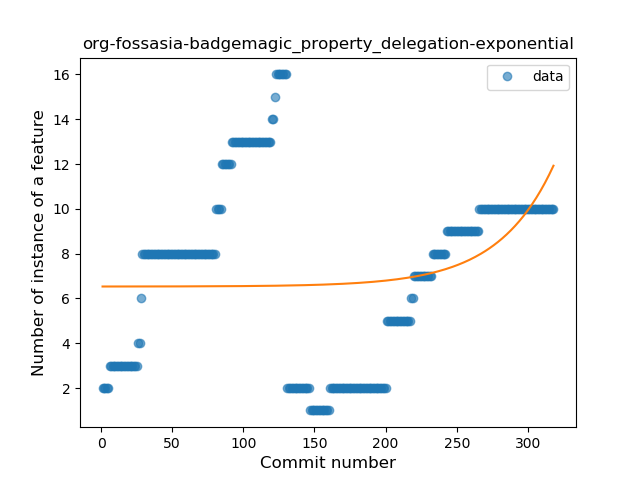

### <a name="T7">Plateau Gradual Rise</a> 
 ----

1. com-cookiegames-smartcookie

	*  Function: 
	* R_Squared: 0.99988604
 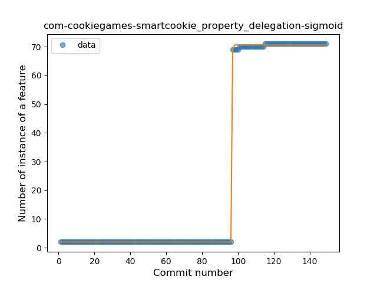

2. li-klass-fhem

	*  Function: 
	* R_Squared: 0.99480815
 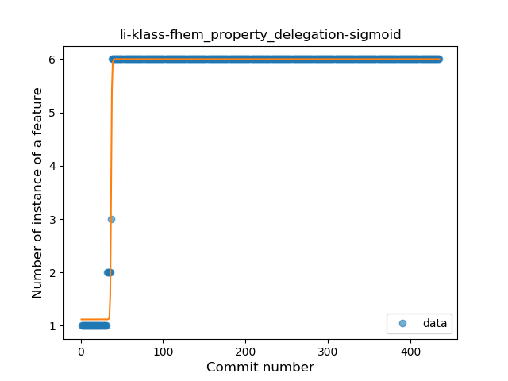

3. com-nextcloud-talk2

	*  Function: 
	* R_Squared: 0.98197807
 

4. com-pyamsoft-homebutton

	*  Function: 
	* R_Squared: 0.98189496
 

5. com-orgzly

	*  Function: 
	* R_Squared: 0.97956726
 

6. de-westnordost-streetcomplete

	*  Function: 
	* R_Squared: 0.96683287
 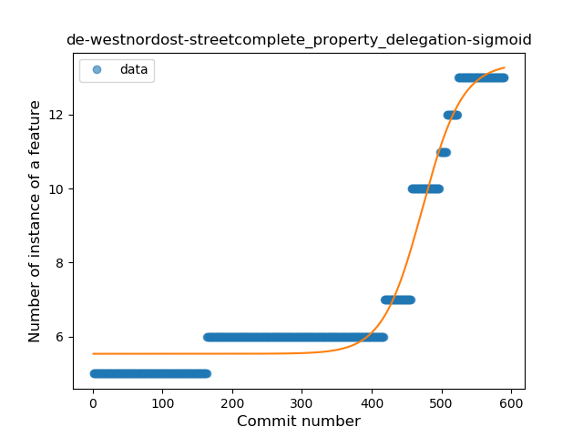

7. sk-styk-martin-apkanalyzer

	*  Function: 
	* R_Squared: 0.96455963
 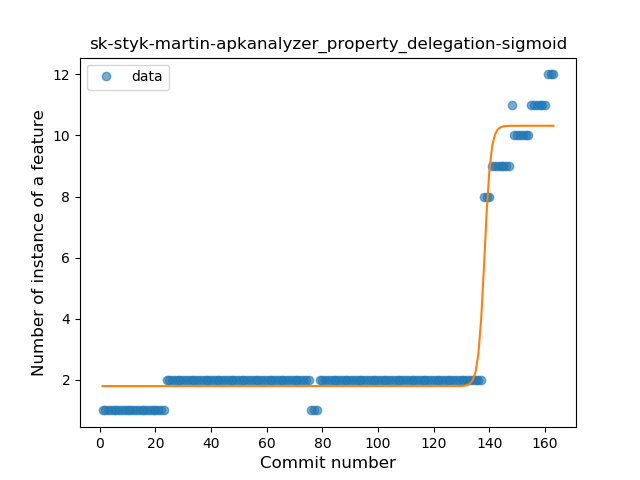

9. co-pxhouse-sas

	*  Function: 
	* R_Squared: 0.95787491
 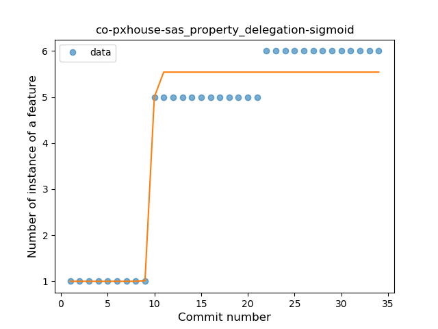

10. com-utazukin-ichaival

	*  Function: 
	* R_Squared: 0.95121864
 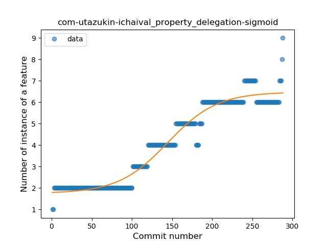

11. cat-pantsu-nyaapantsu

	*  Function: 
	* R_Squared: 0.94509273
 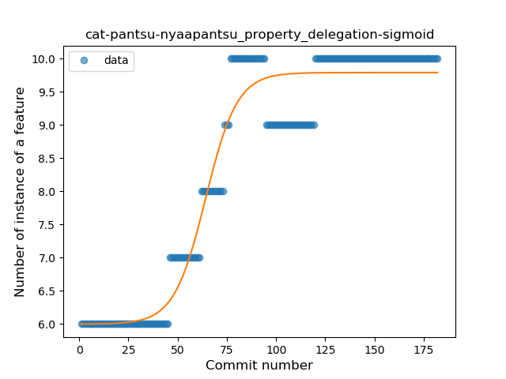

12. com-esafirm-androidplayground

	*  Function: 
	* R_Squared: 0.93771451
 

14. pw-janyo-whatanime

	*  Function: 
	* R_Squared: 0.93067622
 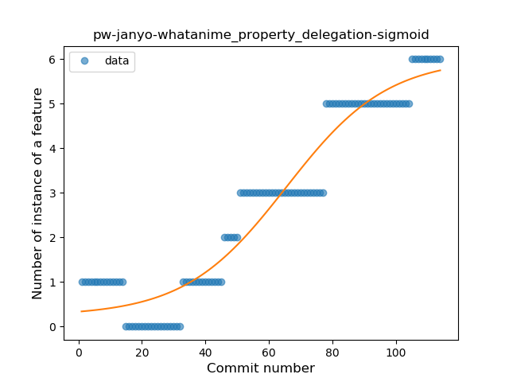

15. com-bubelov-coins

	*  Function: 
	* R_Squared: 0.92846378
 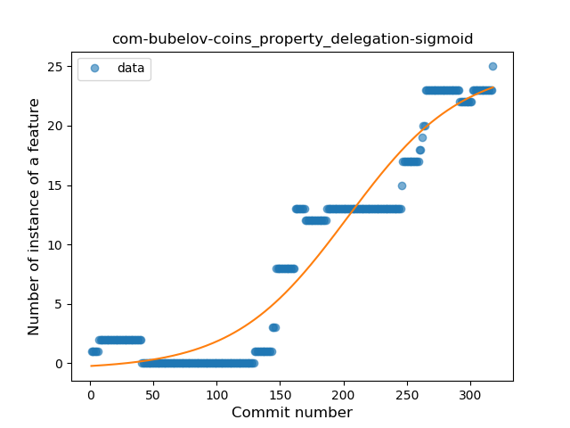

16. com-breadwallet

	*  Function: 
	* R_Squared: 0.92088869
 

17. one-librem-social

	*  Function: 
	* R_Squared: 0.91173592
 

18. org-pacien-tincapp

	*  Function: 
	* R_Squared: 0.90543325
 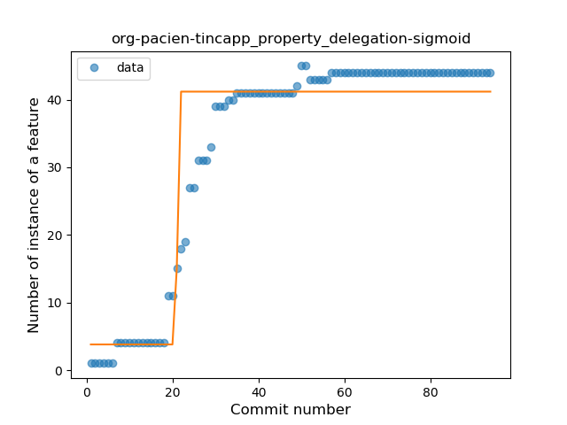

19. com-github-premnirmal-tickerwidget

	*  Function: 
	* R_Squared: 0.89870437
 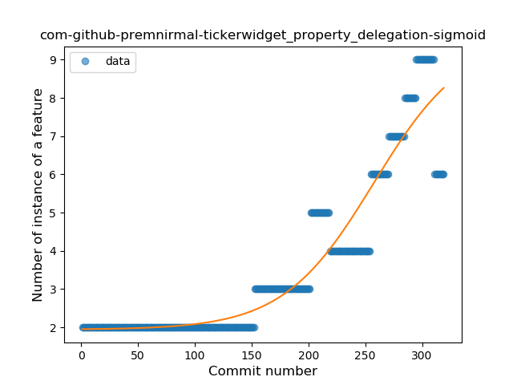

20. net-bible-android-activity

	*  Function: 
	* R_Squared: 0.8436279
 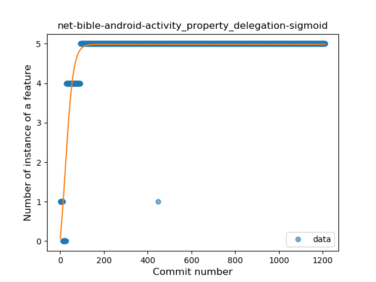

21. nightlock-peppercarrot

	*  Function: 
	* R_Squared: 0.83516081
 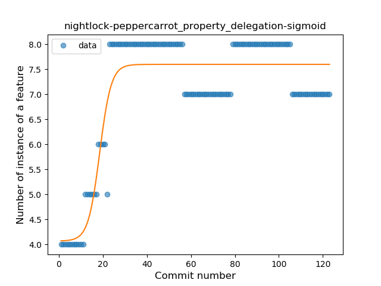

22. me-anon-grow

	*  Function: 
	* R_Squared: 0.77632752
 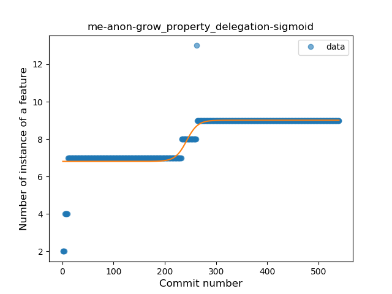

23. com-pitchedapps-frost

	*  Function: 
	* R_Squared: 0.69856007
 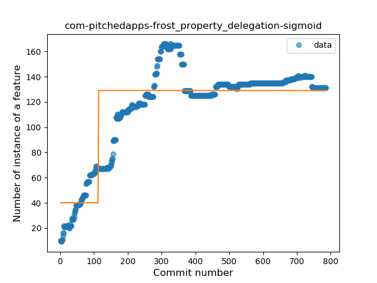

25. org-kiwix-kiwixcustomwikivoyageeurope

	*  Function: 
	* R_Squared: 0.4156977
 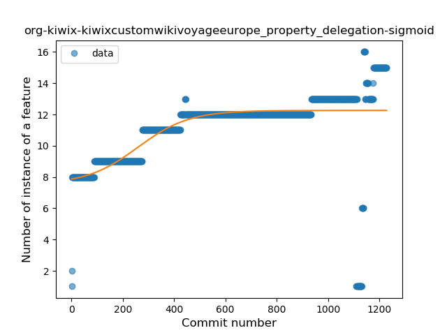

26. com-mgaetan89-showsrage

	*  Function: 
	* R_Squared: 0.28747851
 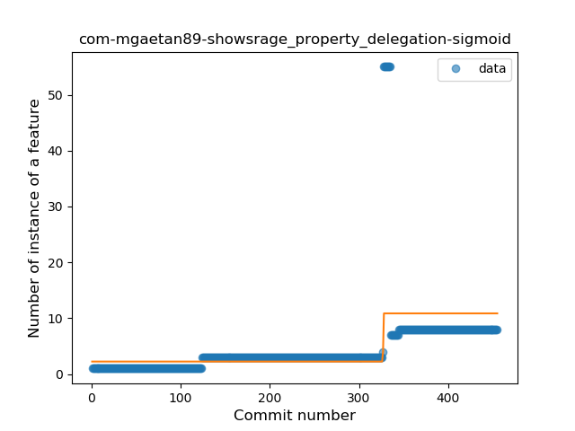

### <a name="T6">Sudden Rise Plateau</a> 
 ----

1. science-apolline

	*  Function: 
	* R_Squared: 0.85227937
 

2. xyz-hisname-fireflyiii

	*  Function: 
	* R_Squared: 0.84943641
 

3. horse-amazin-my-stratum0-statuswidget

	*  Function: 
	* R_Squared: 0.84227247
 

4. com-yubico-yubioath

	*  Function: 
	* R_Squared: 0.83859767
 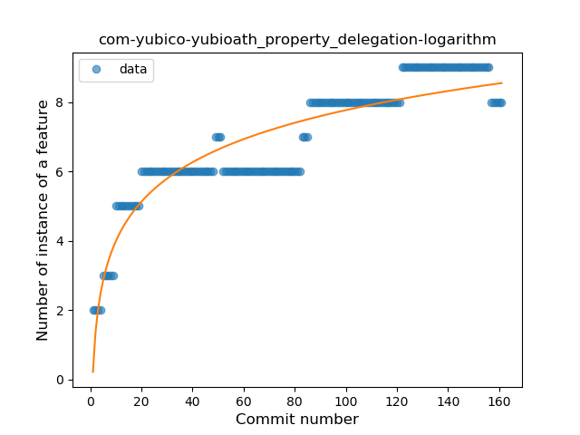

5. net-nurik-roman-muzei

	*  Function: 
	* R_Squared: 0.83842193
 

6. com-stevenschoen-putionew

	*  Function: 
	* R_Squared: 0.83236013
 

7. nl-brouwerijdemolen-borefts2013

	*  Function: 
	* R_Squared: 0.80641037
 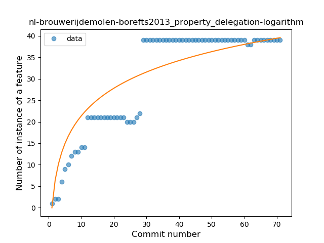

8. com-guerinet-mymartlet

	*  Function: 
	* R_Squared: 0.75800216
 

9. info-dvkr-screenstream

	*  Function: 
	* R_Squared: 0.70469195
 

10. tech-ula

	*  Function: 
	* R_Squared: 0.70254242
 

11. jp-toastkid-yobidashi

	*  Function: 
	* R_Squared: 0.69350012
 

12. info-papdt-express-helper

	*  Function: 
	* R_Squared: 0.68514188
 

13. pt-ipleiria-mymusicqoe

	*  Function: 
	* R_Squared: 0.68189458
 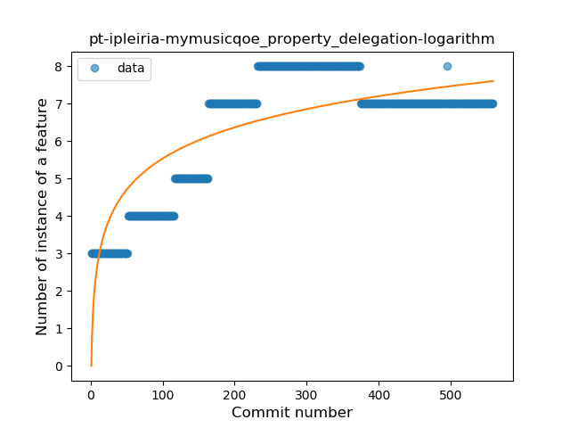

14. ru-hyst329-openfool

	*  Function: 
	* R_Squared: 0.64491444
 

15. org-moire-ultrasonic

	*  Function: 
	* R_Squared: 0.63241582
 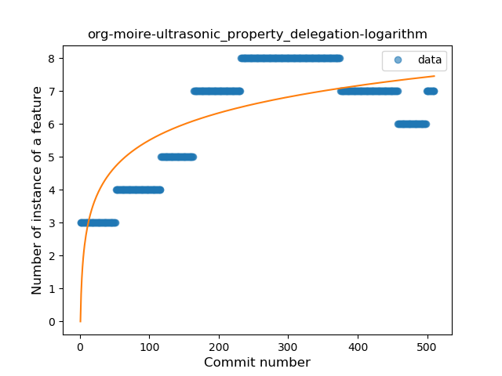

16. com-doctoror-particleswallpaper

	*  Function: 
	* R_Squared: 0.60647111
 

17. cat-xojan-random1

	*  Function: 
	* R_Squared: 0.6034956
 

18. com-benoitquenaudon-tvfoot-red

	*  Function: 
	* R_Squared: 0.565934
 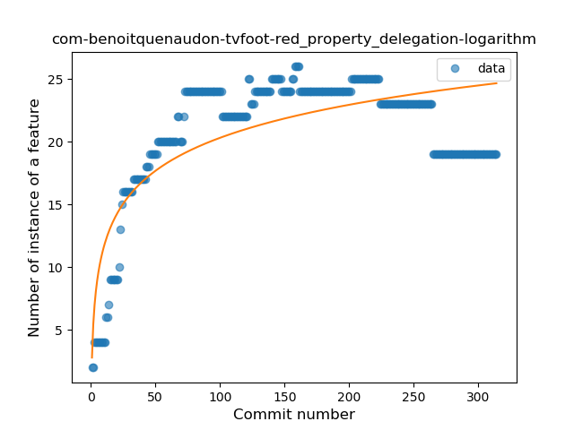

19. com-conorodonnell-bus

	*  Function: 
	* R_Squared: 0.46538255
 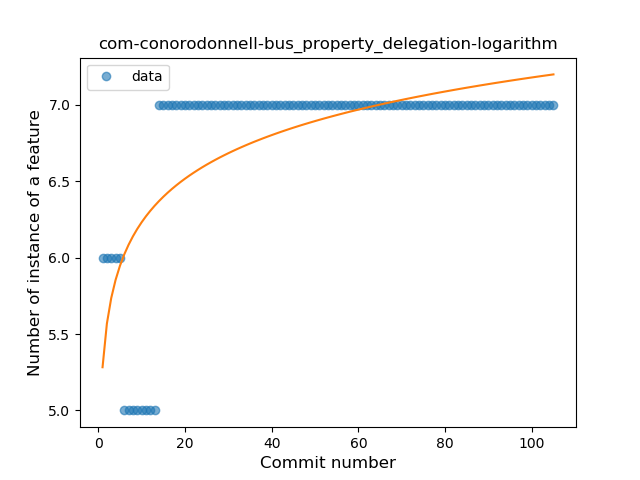

20. com-moez-QKSMS

	*  Function: 
	* R_Squared: 0.39872031
 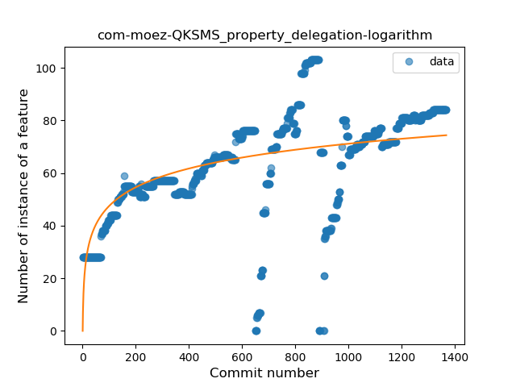

21. fr-openium-auvergnewebcams

	*  Function: 
	* R_Squared: 0.37232438
 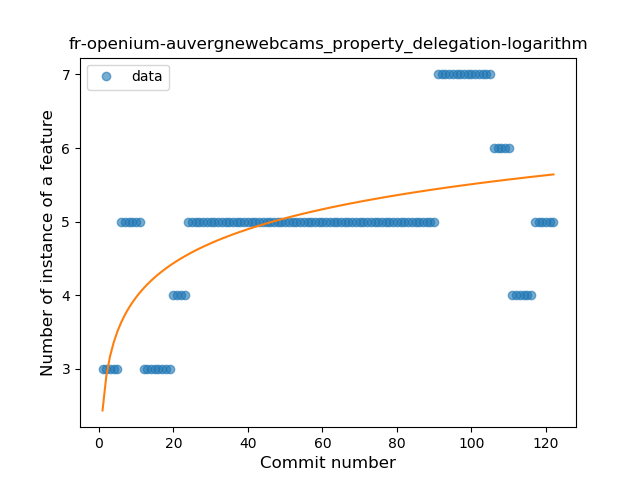

22. me-rei_m-hyakuninisshu

	*  Function: 
	* R_Squared: 0.0985156
 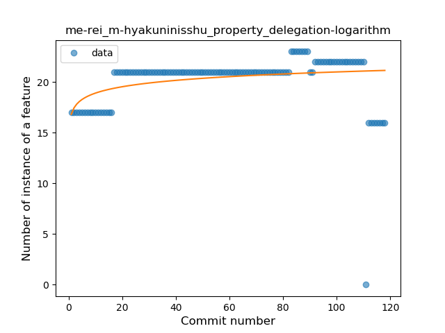

### <a name="T9">Plateau Sudden Rise</a> 
 ----

2. com-aaplab-bakubus

	*  Function: 
	* R_Squared: 1.0
 

3. com-fallgamlet-dnestrcinema

	*  Function: 
	* R_Squared: 1.0
 

4. com-github-moko256-twitlatte

	*  Function: 
	* R_Squared: 1.0
 

5. com-phicdy-totoanticipation

	*  Function: 
	* R_Squared: 1.0
 

7. de-avpptr-umweltzone

	*  Function: 
	* R_Squared: 1.0
 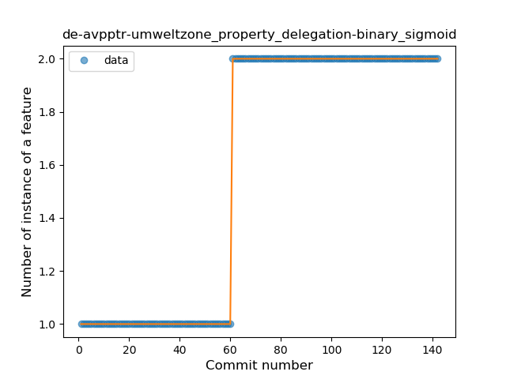

8. eu-the4thfloor-msync

	*  Function: 
	* R_Squared: 1.0
 

9. info-metadude-android-congress-schedule

	*  Function: 
	* R_Squared: 1.0
 

10. me-blog-korn123-easydiary

	*  Function: 
	* R_Squared: 1.0
 

12. nl-jqno-remindermail

	*  Function: 
	* R_Squared: 1.0
 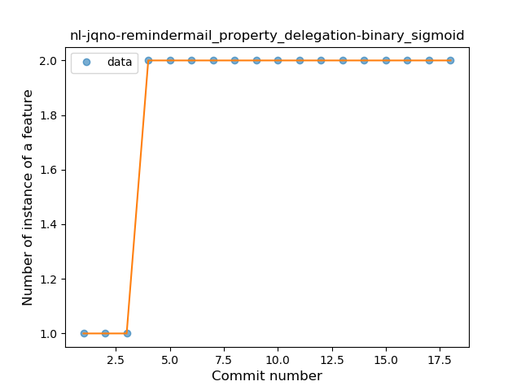

13. org-blitzortung-android-app

	*  Function: 
	* R_Squared: 1.0
 

15. org-ligi-materialteatimer

	*  Function: 
	* R_Squared: 1.0
 

16. app-simone

	*  Function: 
	* R_Squared: 0.98133224
 

17. ai-susi

	*  Function: 
	* R_Squared: 0.92322987
 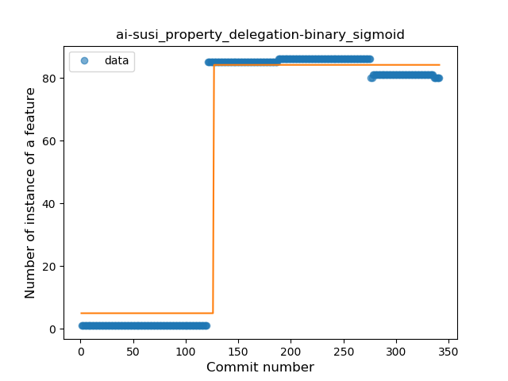

18. es-danirod-rectball-android

	*  Function: 
	* R_Squared: 0.86246673
 

20. it-diab

	*  Function: 
	* R_Squared: 0.61196748
 

21. net-mm2d-android-vmb

	*  Function: 
	* R_Squared: 0.44428202
 

22. tw-shounenwind-kmnbottool

	*  Function: 
	* R_Squared: 0.41070223
 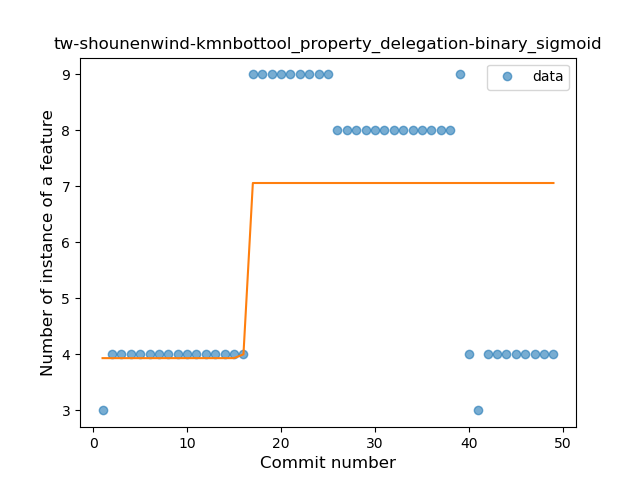

23. com-garpr-android

	*  Function: 
	* R_Squared: 0.05349767
 

### <a name="T11">Instability</a> 
 ----

1. com-bracketcove-postrainer

	*  Function: 
	* R_Squared: 0.9952381
 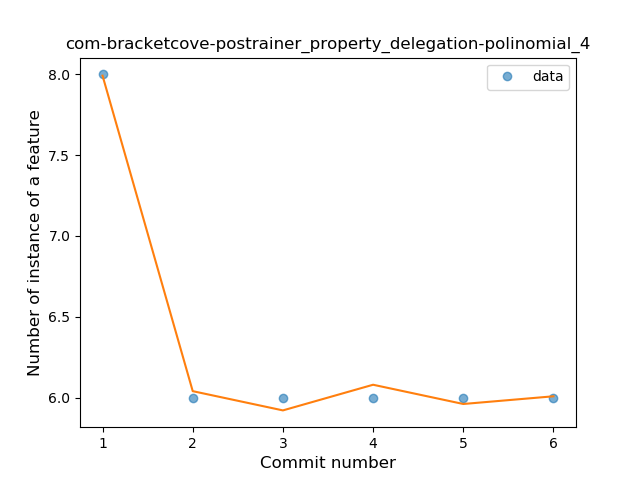

2. ru-nsu-bobrofon-easysshfs

	*  Function: 
	* R_Squared: 0.96969697
 

3. sreich-countthedays

	*  Function: 
	* R_Squared: 0.92660206
 

4. me-impa-knockonports

	*  Function: 
	* R_Squared: 0.91845039
 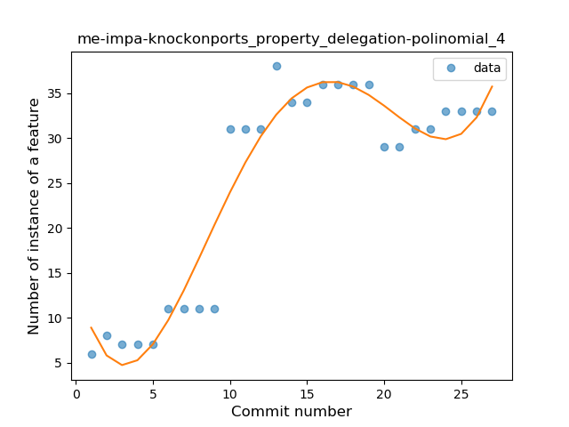

5. com-firstrowria-pushnotificationtester

	*  Function: 
	* R_Squared: 0.87692308
 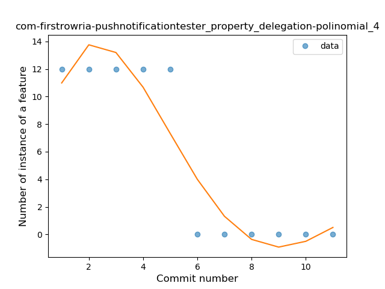

6. danbroid-searchview

	*  Function: 
	* R_Squared: 0.7668603
 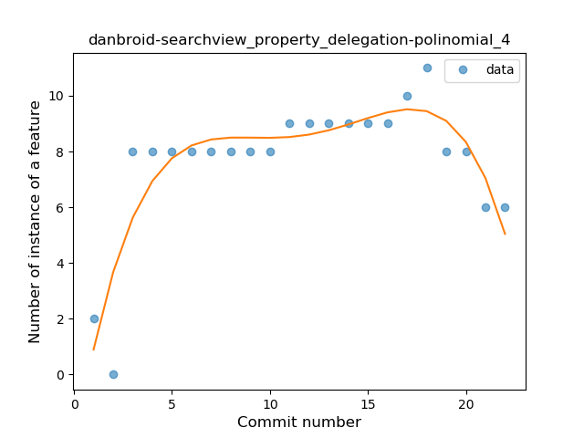

7. com-wbrawner-simplemarkdown

	*  Function: 
	* R_Squared: 0.70260668
 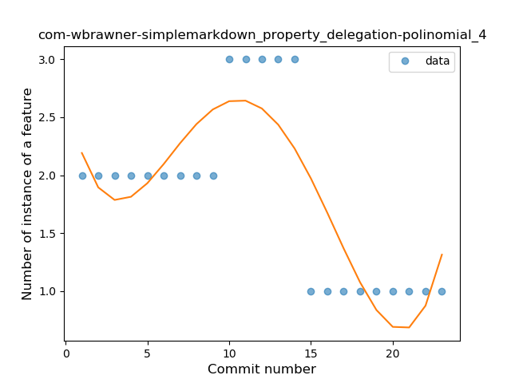

8. net-stew-stew

	*  Function: 
	* R_Squared: 0.64037329
 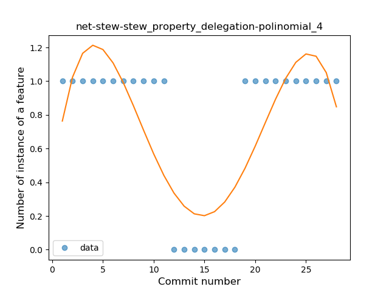

### <a name="T2">Constant Decline</a> 
 ----

39. apps-jizzu-simpletodo

	*  Function: 
	* R_Squared: 0.54707549
 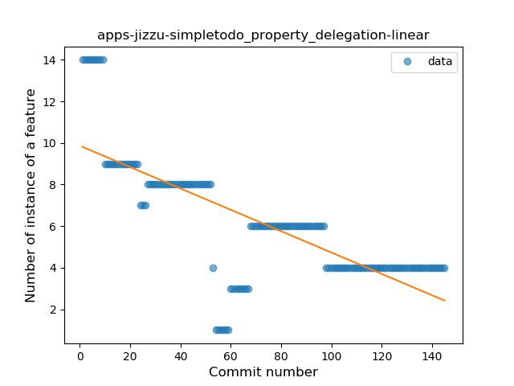

41. io-github-fvasco-pinpoi

	*  Function: 
	* R_Squared: 0.44044303
 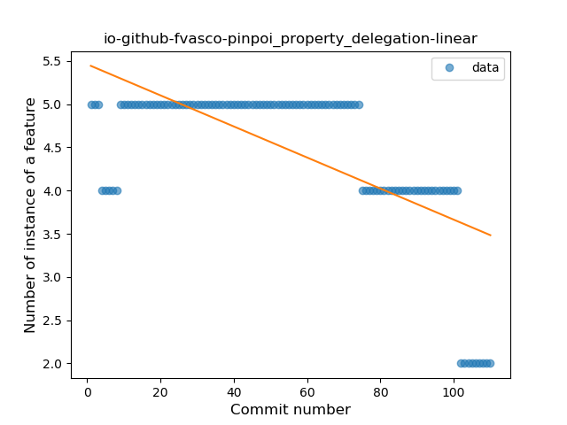

43. com-bijoysingh-quicknote

	*  Function: 
	* R_Squared: 0.34608209
 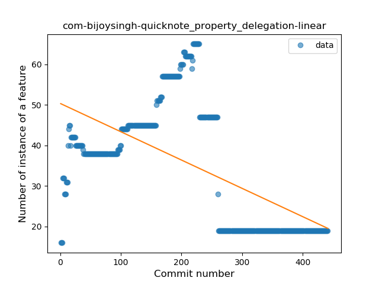

44. com-atanana-sicounter

	*  Function: 
	* R_Squared: 0.19653158
 

45. ch-abertschi-adfree

	*  Function: 
	* R_Squared: 0.14022489
 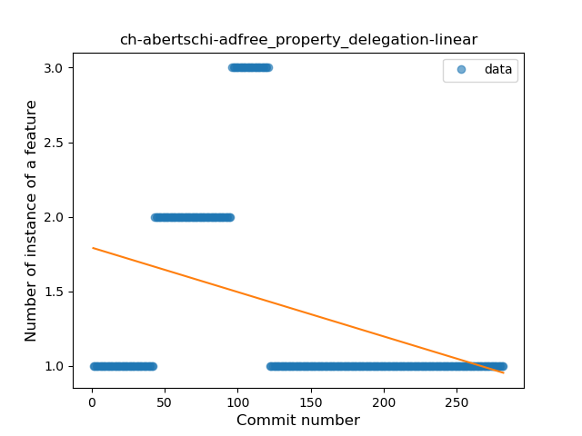

46. com-fastaccess-github-libre

	*  Function: 
	* R_Squared: 0.13818377
 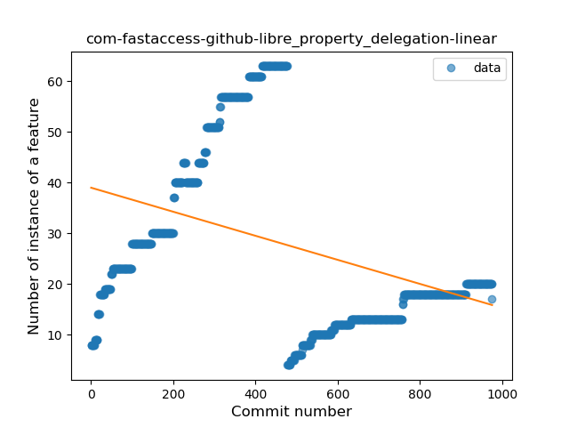

47. com-calintat-units

	*  Function: 
	* R_Squared: 0.06275485
 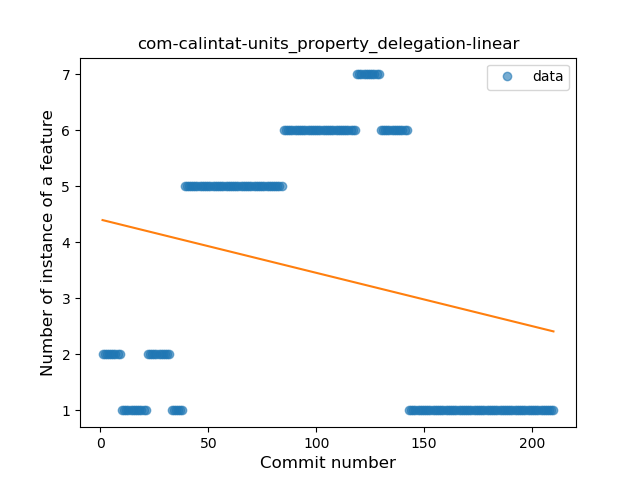

48. org-ligi-ipfsdroid

	*  Function: 
	* R_Squared: 0.06211742
 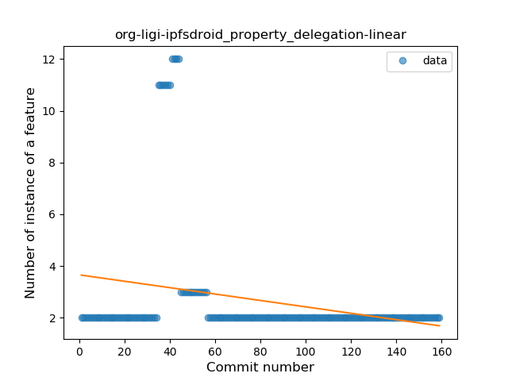

49. com-github-cvzi-screenshottile

	*  Function: 
	* R_Squared: 0.03683809
 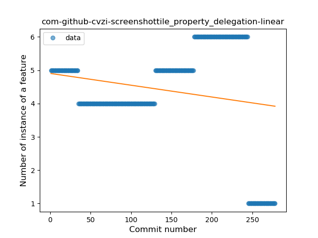

50. com-ianhanniballake-contractiontimer

	*  Function: 
	* R_Squared: 0.02809098
 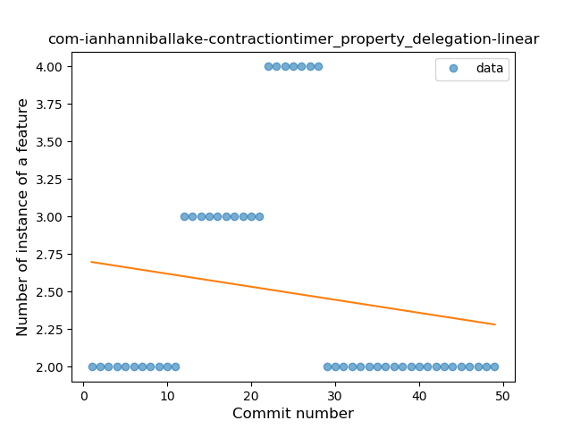

51. org-blokada-alarm

	*  Function: 
	* R_Squared: 0.02110515
 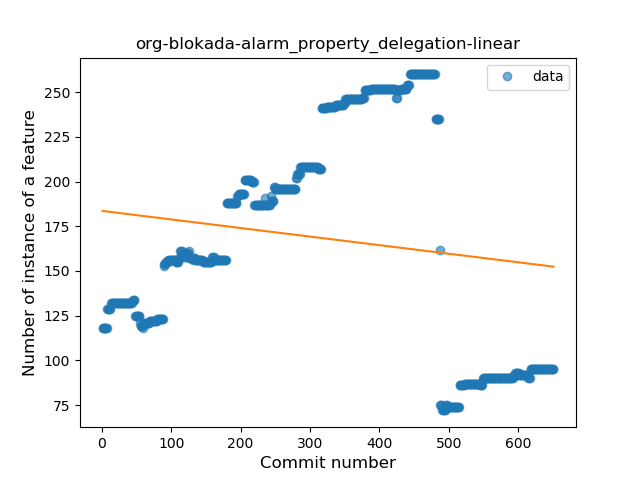

### <a name="T5">Sudden Decline</a> 
 ----

2. uk-colessoft-android-hilllist

	*  Function: 
	* R_Squared: 1.0
 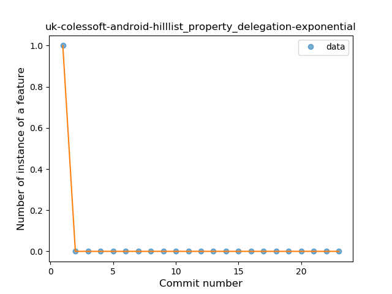

20. ca-fuwafuwa-kaku

	*  Function: 
	* R_Squared: 0.83699129
 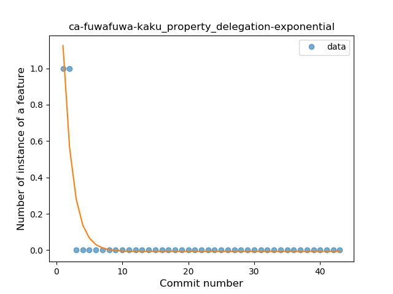

23. com-example-forgottenumbrella-cardboardmuseum

	*  Function: 
	* R_Squared: 0.81947884
 

25. org-ligi-fast

	*  Function: 
	* R_Squared: 0.76566091
 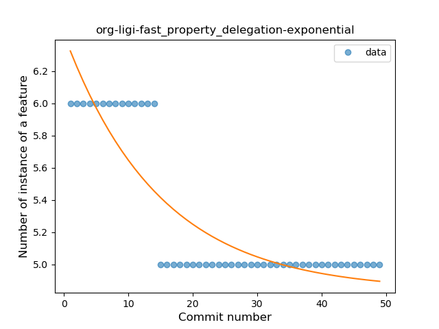

26. org-ligi-faster

	*  Function: 
	* R_Squared: 0.76566091
 

27. org-equeim-tremotesf

	*  Function: 
	* R_Squared: 0.74666303
 

29. com-calintat-sensors

	*  Function: 
	* R_Squared: 0.7020882
 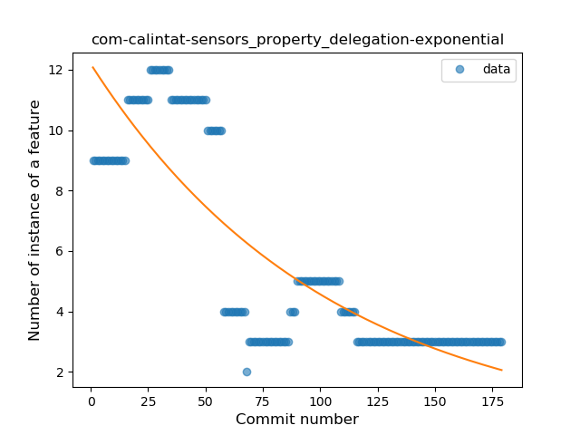

34. io-github-wulkanowy

	*  Function: 
	* R_Squared: 0.58872039
 

### <a name="T10">Plateau Sudden Decline</a> 
 ----

1. at-bitfire-davdroid

	*  Function: 
	* R_Squared: 1.0
 

6. com-pluscubed-velociraptor

	*  Function: 
	* R_Squared: 1.0
 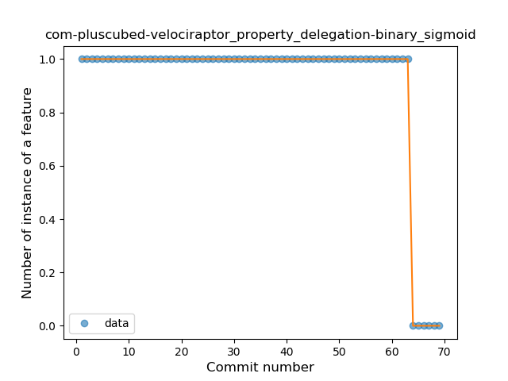

11. net-frju-flym

	*  Function: 
	* R_Squared: 1.0
 

14. org-kaqui

	*  Function: 
	* R_Squared: 1.0
 

19. com-uncmorfi

	*  Function: 
	* R_Squared: 0.64573834
 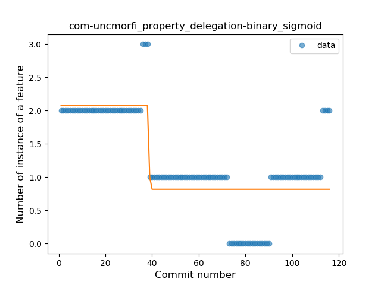

### <a name="T8">Plateau Gradual Decline</a> 
 ----

8. com-directdev-portal

	*  Function: 
	* R_Squared: 0.96221901
 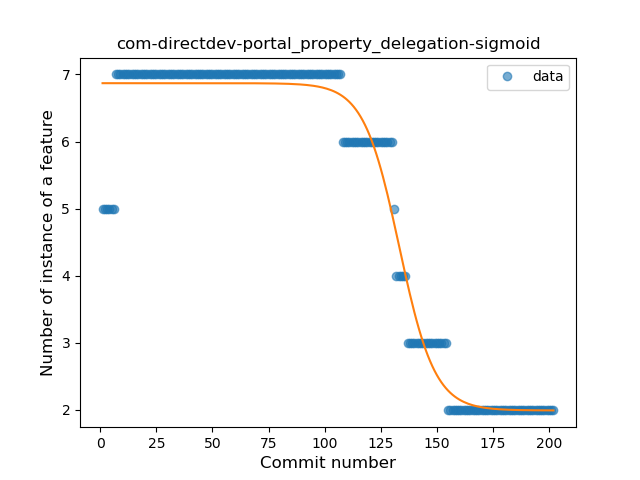

13. com-enjoyingfoss-om

	*  Function: 
	* R_Squared: 0.93263865
 

24. superustats-tool-android

	*  Function: 
	* R_Squared: 0.6652852
 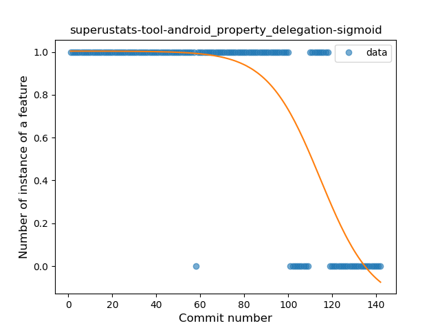

### <a name="T3">Stability</a> 
 ----

