## Range Expression
----
**Best fit = Plateau Gradual Rise**: 47

Function | N# best fit
----|----
<a href=" #T7">Plateau Gradual Rise</a> | 47
<a href=" #T9">Plateau Sudden Rise</a> | 38
<a href=" #T1">Constant Rise</a> | 30
<a href=" #T4">Sudden Rise</a> | 28
<a href=" #T6">Sudden Rise Plateau</a> | 17
<a href=" #T2">Constant Decline</a> | 14
<a href=" #T10">Plateau Sudden Decline</a> | 14
<a href=" #T11">Instability</a> | 12
<a href=" #T8">Plateau Gradual Decline</a> | 6
<a href=" #T5">Sudden Decline</a> | 5
<a href=" #T3">Stability</a> | 0

### <a name="T7">Plateau Gradual Rise</a> 
 ----

1. org-anibyl-slounik

	*  Function: 
	* R_Squared: 0.99186468
 

2. ca-rmen-android-poetassistant

	*  Function: 
	* R_Squared: 0.98282404
 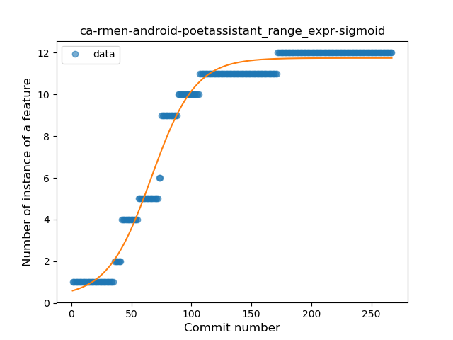

3. com-rohitsuratekar-NCBSinfo

	*  Function: 
	* R_Squared: 0.97985724
 

4. com-zeapo-pwdstore

	*  Function: 
	* R_Squared: 0.97882508
 

5. com-breadwallet

	*  Function: 
	* R_Squared: 0.9768223
 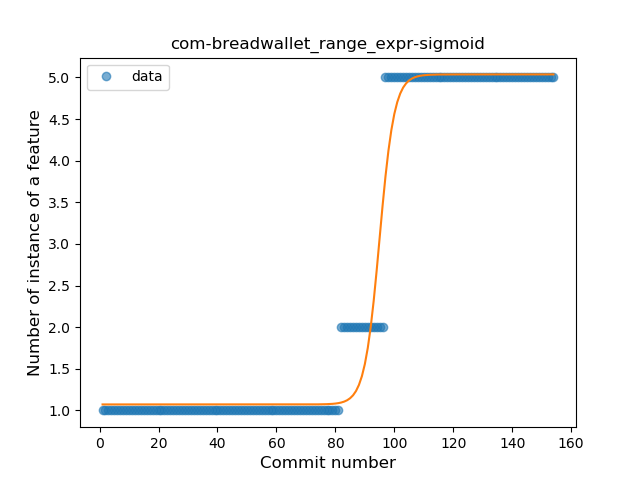

6. com-simplemobiletools-contacts-pro

	*  Function: 
	* R_Squared: 0.97248787
 

7. org-ligi-passandroid

	*  Function: 
	* R_Squared: 0.97248033
 

8. com-nextcloud-talk2

	*  Function: 
	* R_Squared: 0.97040099
 

9. acr-browser-lightning

	*  Function: 
	* R_Squared: 0.96888426
 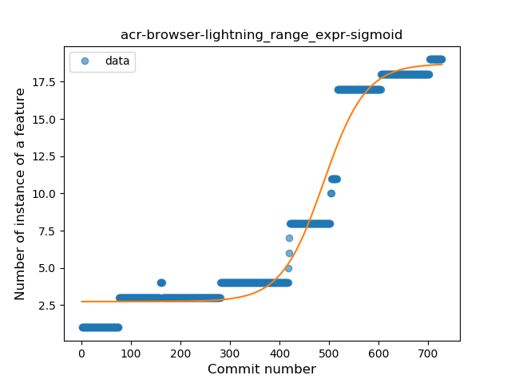

11. xyz-hisname-fireflyiii

	*  Function: 
	* R_Squared: 0.96825499
 

12. com-keylesspalace-tusky

	*  Function: 
	* R_Squared: 0.96690558
 

13. is-xyz-mpv

	*  Function: 
	* R_Squared: 0.96677015
 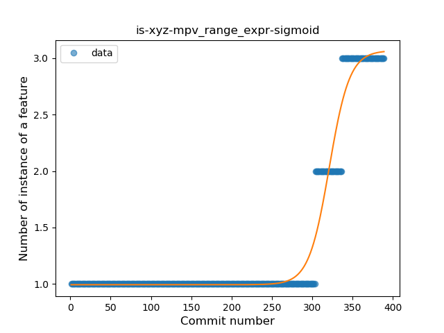

14. one-librem-social

	*  Function: 
	* R_Squared: 0.96257243
 

15. com-sjn-stamp

	*  Function: 
	* R_Squared: 0.95660757
 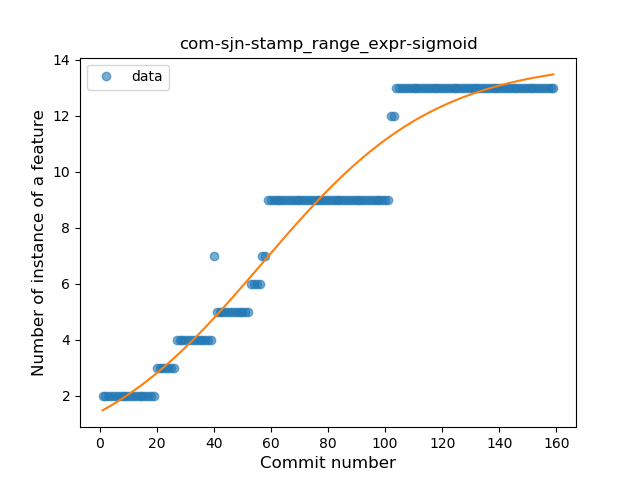

16. is-xyz-omw

	*  Function: 
	* R_Squared: 0.95356433
 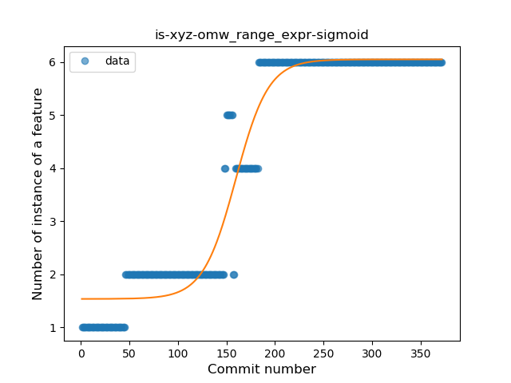

17. org-mozilla-focus

	*  Function: 
	* R_Squared: 0.95257877
 

18. org-mozilla-klar

	*  Function: 
	* R_Squared: 0.95257877
 

19. org-isoron-uhabits

	*  Function: 
	* R_Squared: 0.95190791
 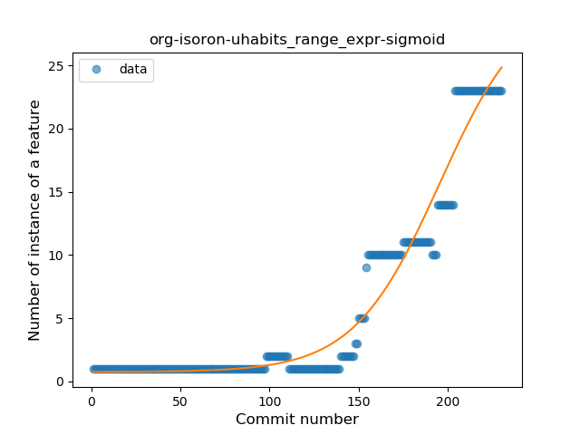

20. org-blokada-alarm

	*  Function: 
	* R_Squared: 0.94783939
 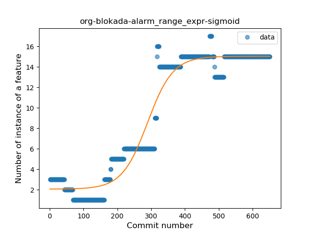

22. com-motion-stage1

	*  Function: 
	* R_Squared: 0.94580871
 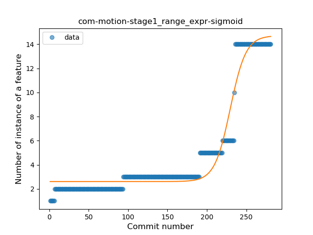

23. im-vector-alpha

	*  Function: 
	* R_Squared: 0.94567332
 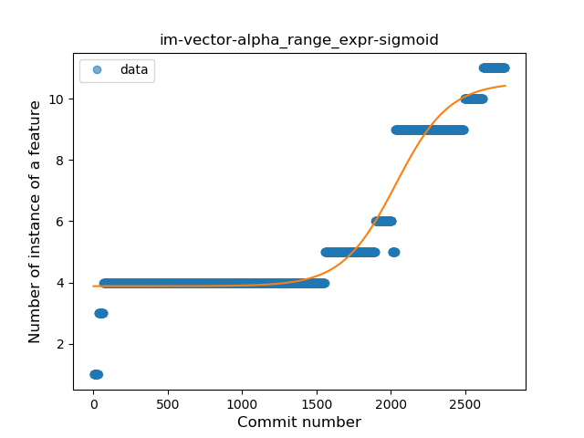

24. com-lavadip-miniVector

	*  Function: 
	* R_Squared: 0.9455827
 

25. com-pitchedapps-frost

	*  Function: 
	* R_Squared: 0.94254275
 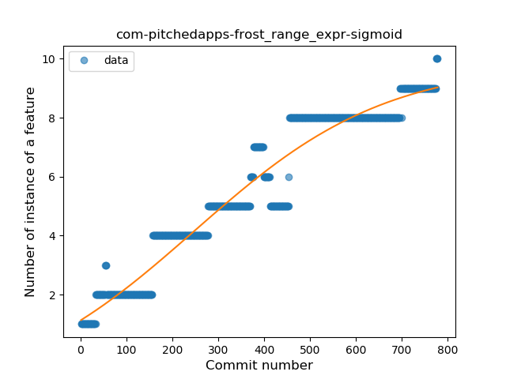

26. fr-free-nrw-commons

	*  Function: 
	* R_Squared: 0.93475599
 

27. com-jim-sharetocomputer

	*  Function: 
	* R_Squared: 0.93176469
 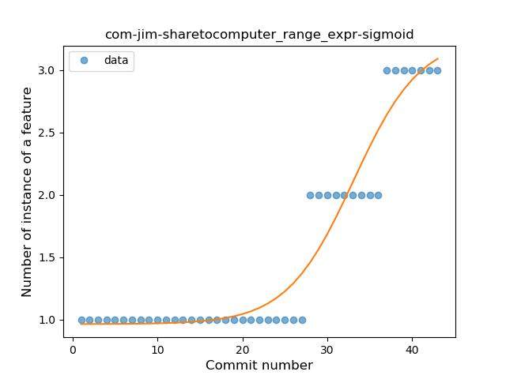

28. de-Maxr1998-xposed-maxlock

	*  Function: 
	* R_Squared: 0.92190038
 

29. be-mygod-vpnhotspot

	*  Function: 
	* R_Squared: 0.92097429
 

30. cat-pantsu-nyaapantsu

	*  Function: 
	* R_Squared: 0.91686678
 

31. com-bijoysingh-quicknote

	*  Function: 
	* R_Squared: 0.91588527
 

32. nightlock-peppercarrot

	*  Function: 
	* R_Squared: 0.91454883
 

33. ml-adamsprogs-bimba

	*  Function: 
	* R_Squared: 0.91082763
 

34. com-pennapps-labs-pennmobile

	*  Function: 
	* R_Squared: 0.90753118
 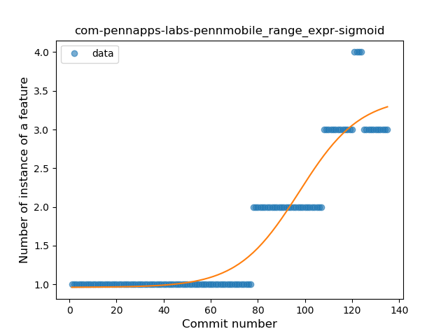

36. ffc-app

	*  Function: 
	* R_Squared: 0.89860176
 

37. fi-kroon-vadret

	*  Function: 
	* R_Squared: 0.87551485
 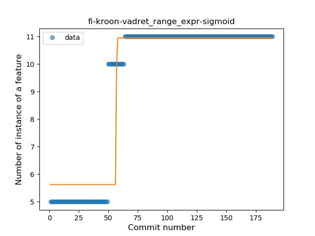

38. net-syncthing-lite

	*  Function: 
	* R_Squared: 0.87431373
 

39. com-ogsdroid

	*  Function: 
	* R_Squared: 0.85688276
 

40. com-github-fields-electric

	*  Function: 
	* R_Squared: 0.84398139
 

41. fr-chenry-android-freshrss

	*  Function: 
	* R_Squared: 0.84103029
 

42. com-utazukin-ichaival

	*  Function: 
	* R_Squared: 0.83787822
 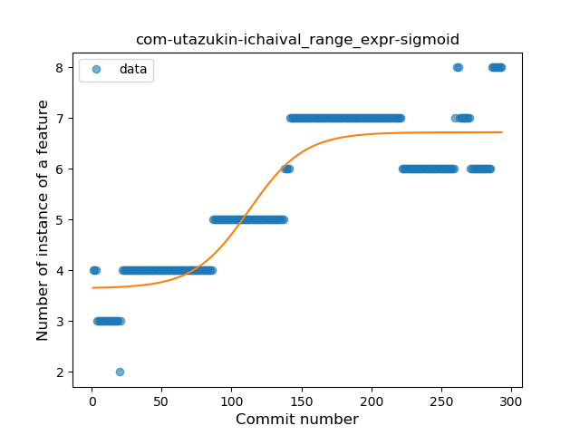

43. com-nononsenseapps-feeder

	*  Function: 
	* R_Squared: 0.8131006
 

44. com-uncmorfi

	*  Function: 
	* R_Squared: 0.79065167
 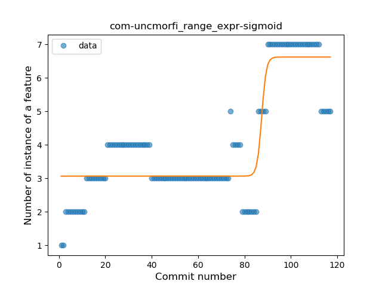

46. pw-janyo-janyoshare

	*  Function: 
	* R_Squared: 0.53694188
 

47. com-garpr-android

	*  Function: 
	* R_Squared: 0.46191427
 

48. net-nonylene-photolinkviewer

	*  Function: 
	* R_Squared: 0.23655903
 

49. me-rei_m-hyakuninisshu

	*  Function: 
	* R_Squared: 0.22623807
 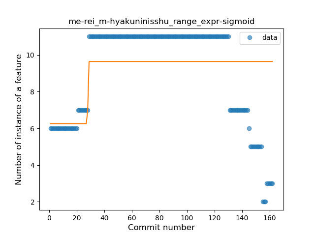

50. at-bitfire-davdroid

	*  Function: 
	* R_Squared: 0.15648399
 

51. com-simplemobiletools-musicplayer

	*  Function: 
	* R_Squared: 0.14277078
 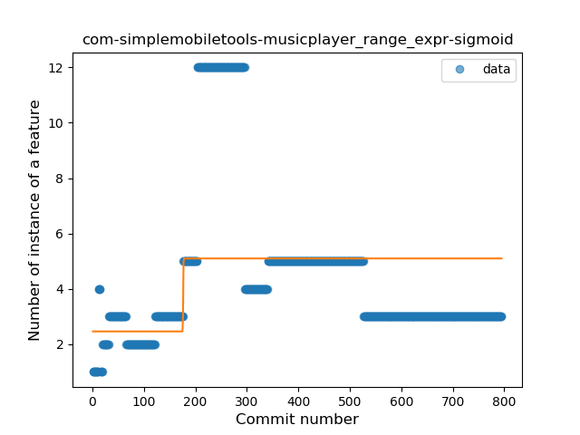

### <a name="T9">Plateau Sudden Rise</a> 
 ----

1. app-opass-ccip

	*  Function: 
	* R_Squared: 1.0
 

3. ch-rmy-android-statusbar_tacho

	*  Function: 
	* R_Squared: 1.0
 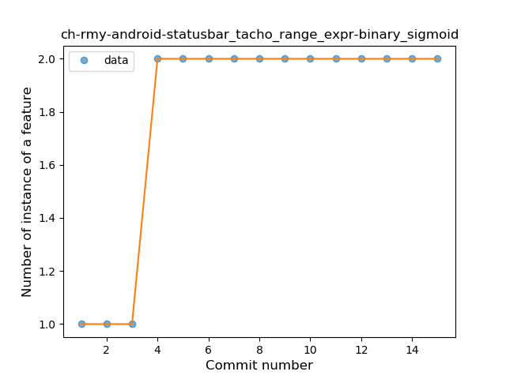

5. com-agusyc-daycounter

	*  Function: 
	* R_Squared: 1.0
 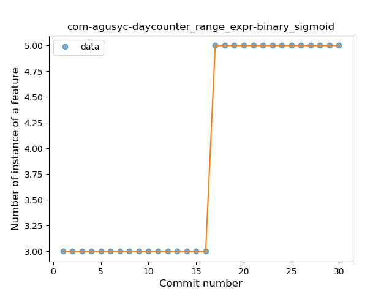

6. com-ahorcado

	*  Function: 
	* R_Squared: 1.0
 

8. com-cookiegames-smartcookie

	*  Function: 
	* R_Squared: 1.0
 

9. com-czbix-v2ex

	*  Function: 
	* R_Squared: 1.0
 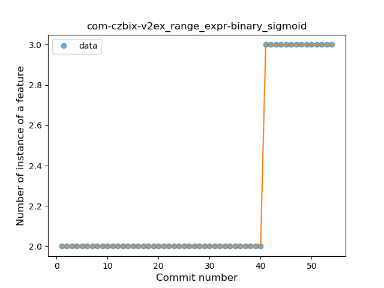

12. com-ianhanniballake-contractiontimer

	*  Function: 
	* R_Squared: 1.0
 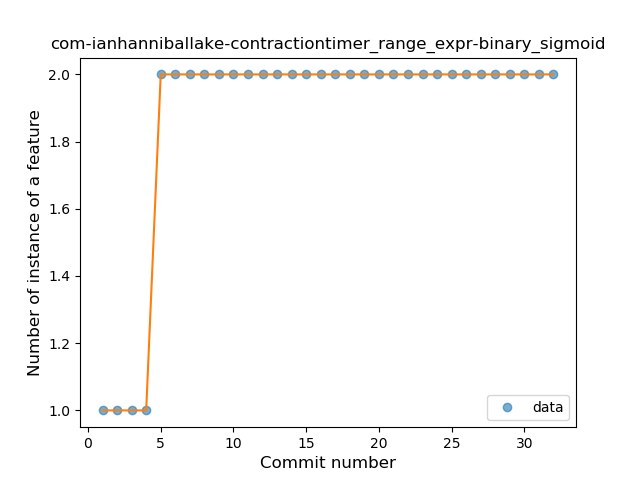

13. com-libopenmw-openmw

	*  Function: 
	* R_Squared: 1.0
 

14. com-log28

	*  Function: 
	* R_Squared: 1.0
 

15. com-ruuvi-station

	*  Function: 
	* R_Squared: 1.0
 

16. com-simplemobiletools-calculator

	*  Function: 
	* R_Squared: 1.0
 

17. com-slash-batterychargelimit

	*  Function: 
	* R_Squared: 1.0
 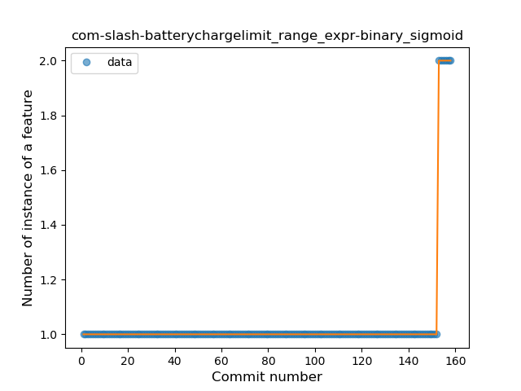

18. com-stevenschoen-putionew

	*  Function: 
	* R_Squared: 1.0
 

19. com-thanksmister-iot-mqtt-alarmpanel

	*  Function: 
	* R_Squared: 1.0
 

21. de-devmil-paperlaunch

	*  Function: 
	* R_Squared: 1.0
 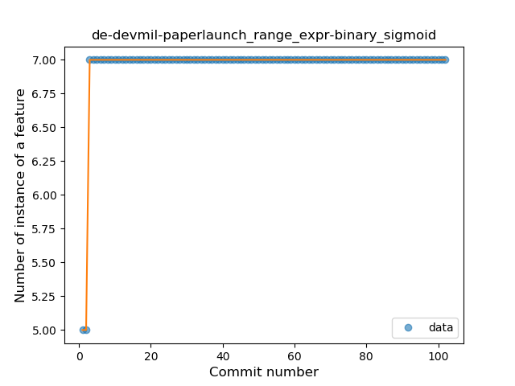

25. me-jfenn-alarmio

	*  Function: 
	* R_Squared: 1.0
 

26. moe-feng-nhentai

	*  Function: 
	* R_Squared: 1.0
 

27. net-mm2d-android-vmb

	*  Function: 
	* R_Squared: 1.0
 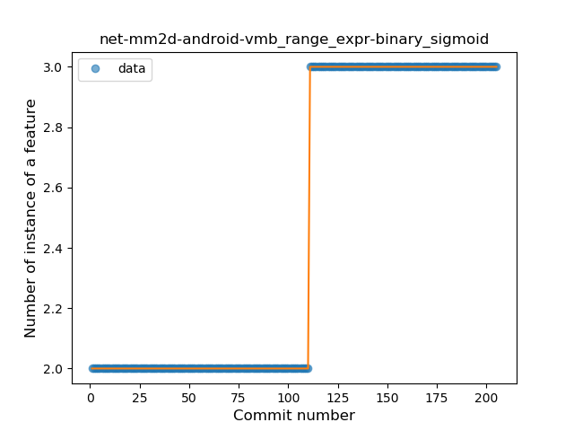

28. org-bottiger-podcast

	*  Function: 
	* R_Squared: 1.0
 

29. org-ligi-survivalmanual

	*  Function: 
	* R_Squared: 1.0
 

30. org-moire-ultrasonic

	*  Function: 
	* R_Squared: 1.0
 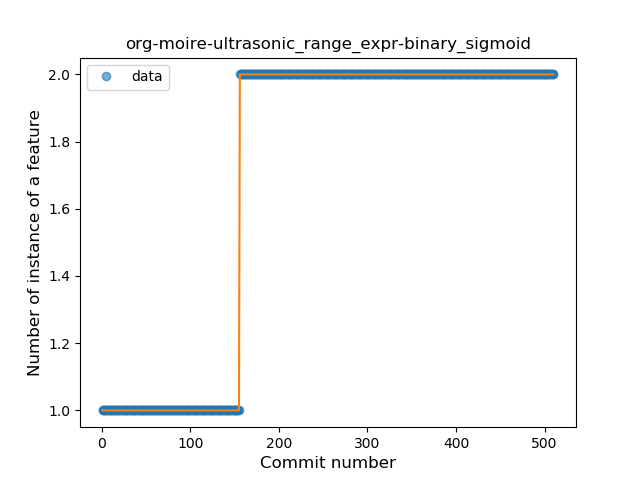

32. pt-ipleiria-mymusicqoe

	*  Function: 
	* R_Squared: 1.0
 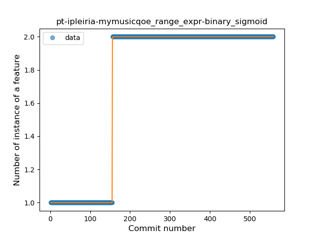

33. quickbeer-android

	*  Function: 
	* R_Squared: 1.0
 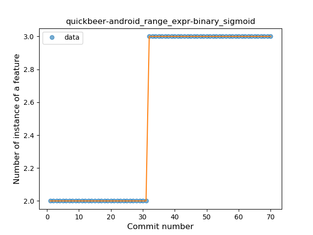

34. se-creotec-chscardbalance2

	*  Function: 
	* R_Squared: 1.0
 

36. com-benoitletondor-easybudgetapp

	*  Function: 
	* R_Squared: 0.96187911
 

37. com-esafirm-androidplayground

	*  Function: 
	* R_Squared: 0.95563952
 

38. com-benoitquenaudon-tvfoot-red

	*  Function: 
	* R_Squared: 0.95119633
 

39. eu-depau-etchdroid

	*  Function: 
	* R_Squared: 0.93419037
 

40. de-markusfisch-android-binaryeye

	*  Function: 
	* R_Squared: 0.91826693
 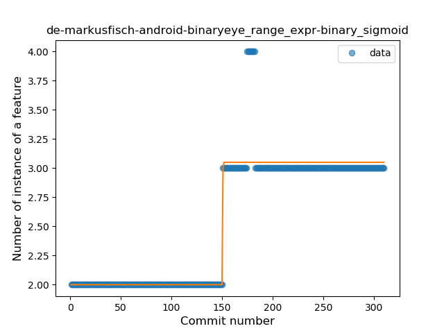

41. science-apolline

	*  Function: 
	* R_Squared: 0.87516526
 

42. cz-dvratil-fbeventsync

	*  Function: 
	* R_Squared: 0.85501454
 

43. fr-openium-auvergnewebcams

	*  Function: 
	* R_Squared: 0.84802758
 

45. pt-joaomneto-titancompanion

	*  Function: 
	* R_Squared: 0.79144776
 

47. com-github-premnirmal-tickerwidget

	*  Function: 
	* R_Squared: 0.7314753
 

48. com-phicdy-totoanticipation

	*  Function: 
	* R_Squared: 0.6759348
 

49. sk-styk-martin-apkanalyzer

	*  Function: 
	* R_Squared: 0.60968618
 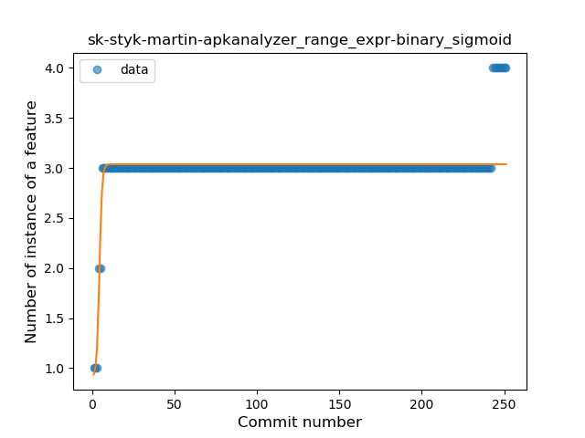

50. name-cantanima-chineseremainderclock

	*  Function: 
	* R_Squared: 0.52777777
 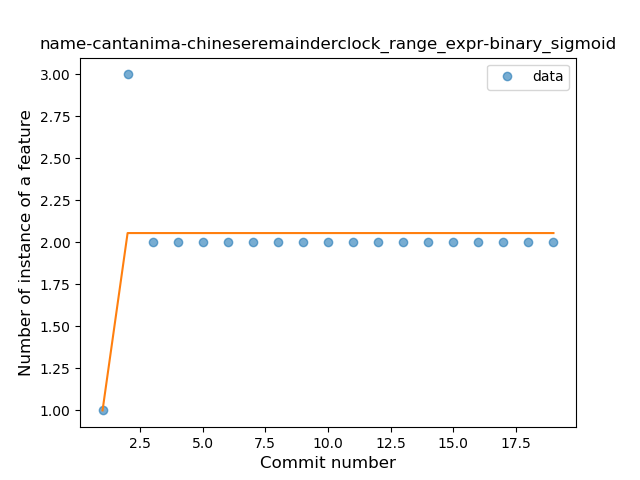

52. com-simplemobiletools-camera

	*  Function: 
	* R_Squared: 0.39960678
 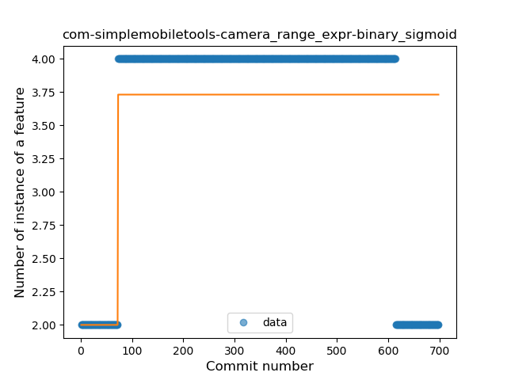

### <a name="T1">Constant Rise</a> 
 ----

1. eu-kanade-tachiyomi

	*  Function: 
	* R_Squared: 0.92686956
 

2. com-loloof64-android-basicchessendgamestrainer

	*  Function: 
	* R_Squared: 0.91241416
 

3. com-boardgamegeek

	*  Function: 
	* R_Squared: 0.90681554
 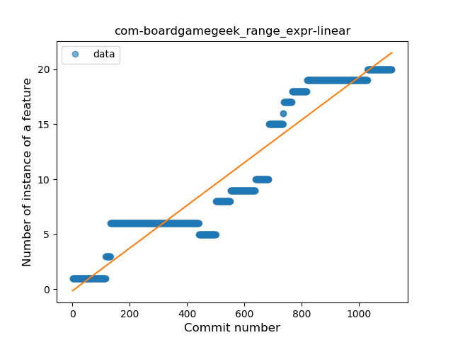

4. ca-josephroque-bowlingcompanion

	*  Function: 
	* R_Squared: 0.90611836
 

5. com-kgurgul-cpuinfo

	*  Function: 
	* R_Squared: 0.90409233
 

6. io-github-wulkanowy

	*  Function: 
	* R_Squared: 0.89949678
 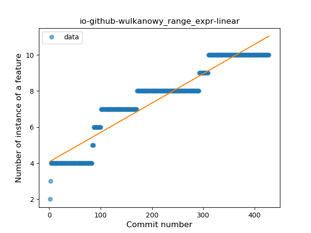

7. com-orgzly

	*  Function: 
	* R_Squared: 0.89682417
 

8. org-mariotaku-twidere

	*  Function: 
	* R_Squared: 0.89394378
 

9. org-lenchan139-ncbookmark

	*  Function: 
	* R_Squared: 0.89284907
 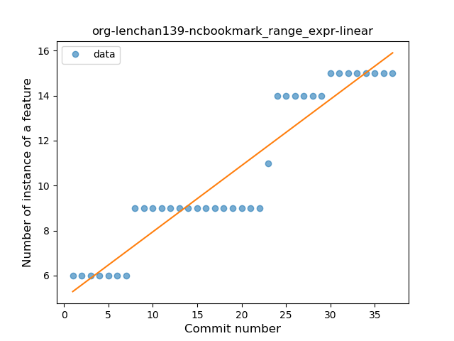

10. com-eventyay-attendee

	*  Function: 
	* R_Squared: 0.88424828
 

11. info-dvkr-screenstream

	*  Function: 
	* R_Squared: 0.87325964
 

12. org-fossasia-badgemagic

	*  Function: 
	* R_Squared: 0.8605792
 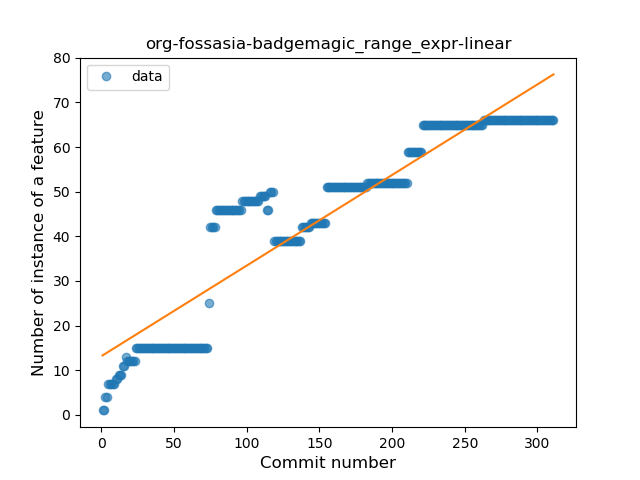

13. de-r4md4c-gamedealz

	*  Function: 
	* R_Squared: 0.85308823
 

14. com-simplemobiletools-calendar-pro

	*  Function: 
	* R_Squared: 0.83668291
 

15. net-osmand-plus

	*  Function: 
	* R_Squared: 0.82018694
 

16. com-duckduckgo-mobile-android

	*  Function: 
	* R_Squared: 0.81955746
 

17. chat-rocket-android

	*  Function: 
	* R_Squared: 0.81485043
 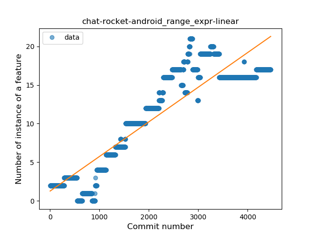

18. info-papdt-express-helper

	*  Function: 
	* R_Squared: 0.80690635
 

20. me-blog-korn123-easydiary

	*  Function: 
	* R_Squared: 0.78736924
 

21. org-kiwix-kiwixcustomwikivoyageeurope

	*  Function: 
	* R_Squared: 0.77674607
 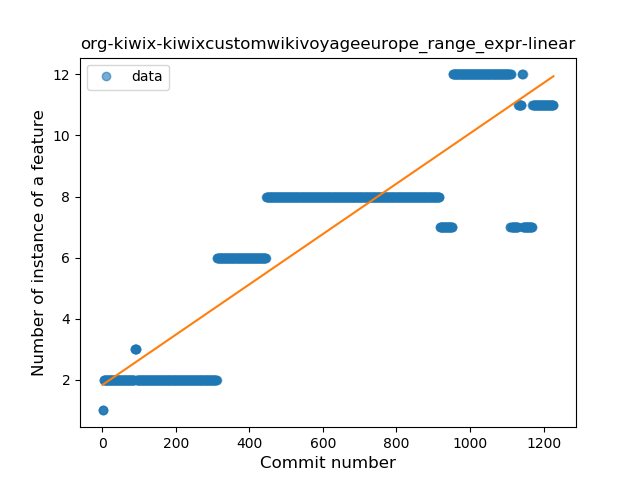

22. com-bernaferrari-changedetection

	*  Function: 
	* R_Squared: 0.76196553
 

23. com-dp-logcatapp

	*  Function: 
	* R_Squared: 0.75113991
 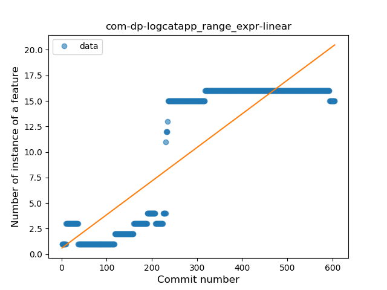

24. pl-hypeapp-episodie

	*  Function: 
	* R_Squared: 0.74429464
 

25. com-jmstudios-redmoon

	*  Function: 
	* R_Squared: 0.74382565
 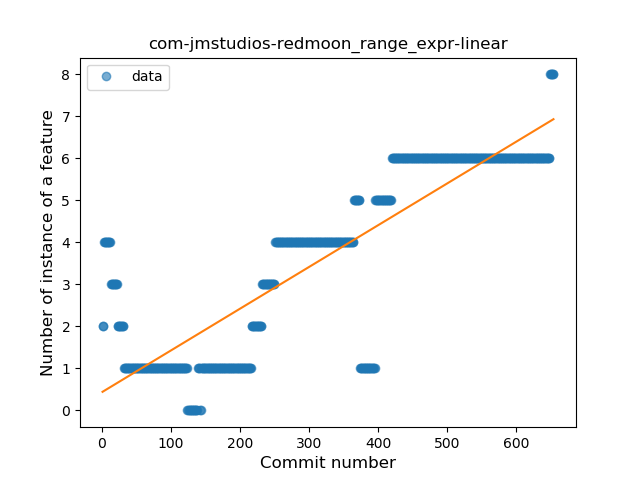

26. com-fsck-k9

	*  Function: 
	* R_Squared: 0.73494568
 

27. io-github-feelfreelinux-wykopmobilny

	*  Function: 
	* R_Squared: 0.69927304
 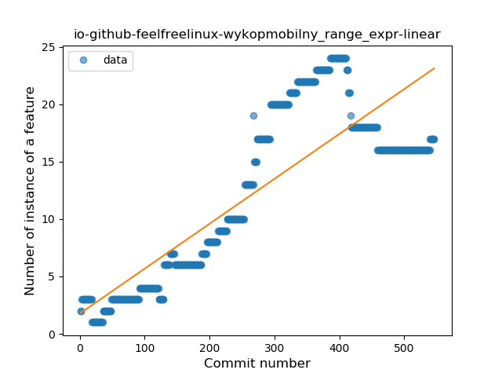

28. com-booboot-vndbandroid

	*  Function: 
	* R_Squared: 0.67783318
 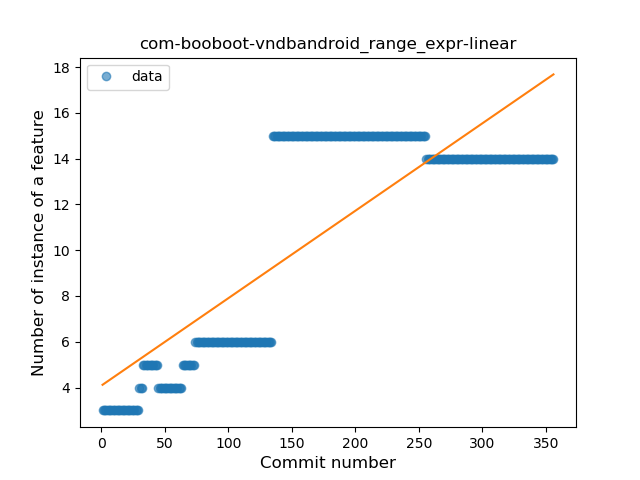

30. com-pixplicity-cryptogram

	*  Function: 
	* R_Squared: 0.6537264
 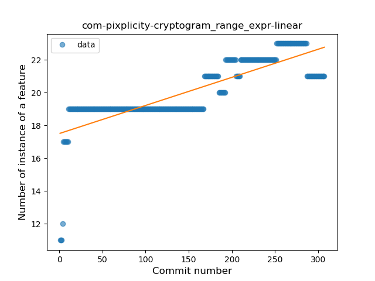

31. li-klass-fhem

	*  Function: 
	* R_Squared: 0.57472541
 

35. com-peterlaurence-trekme

	*  Function: 
	* R_Squared: 0.27191205
 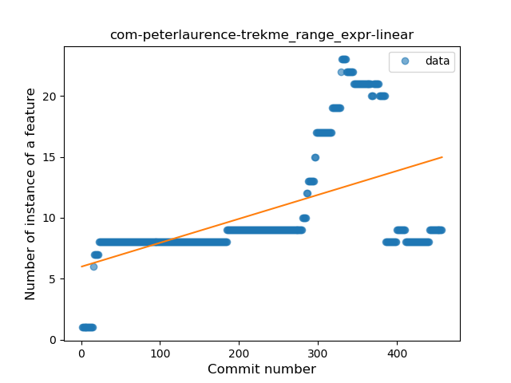

### <a name="T4">Sudden Rise</a> 
 ----

1. ch-deletescape-lawnchair-plah

	*  Function: 
	* R_Squared: 0.98748336
 

2. org-mozilla-rocket

	*  Function: 
	* R_Squared: 0.95125812
 

3. com-github-quarck-calnotify

	*  Function: 
	* R_Squared: 0.93775631
 

4. net-bible-android-activity

	*  Function: 
	* R_Squared: 0.93310262
 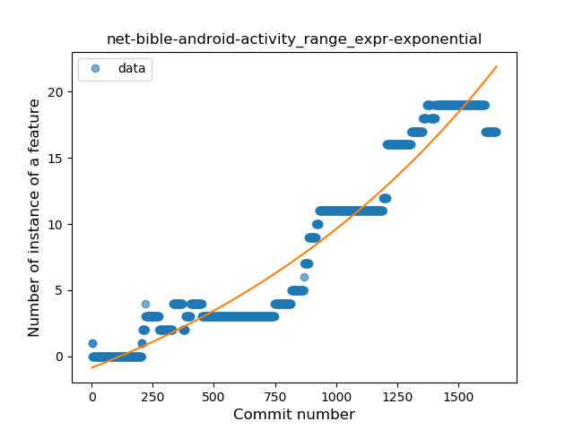

5. com-wabadaba-dziennik

	*  Function: 
	* R_Squared: 0.92935144
 

6. io-github-fvasco-pinpoi

	*  Function: 
	* R_Squared: 0.91578836
 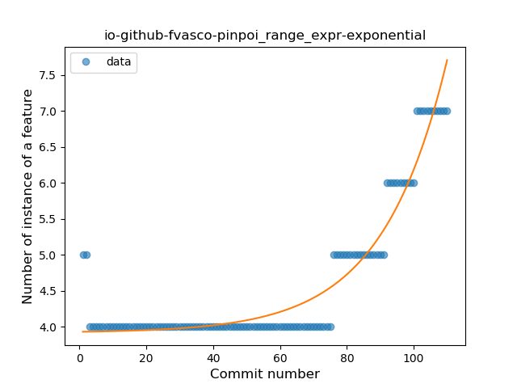

7. me-anon-grow

	*  Function: 
	* R_Squared: 0.91140907
 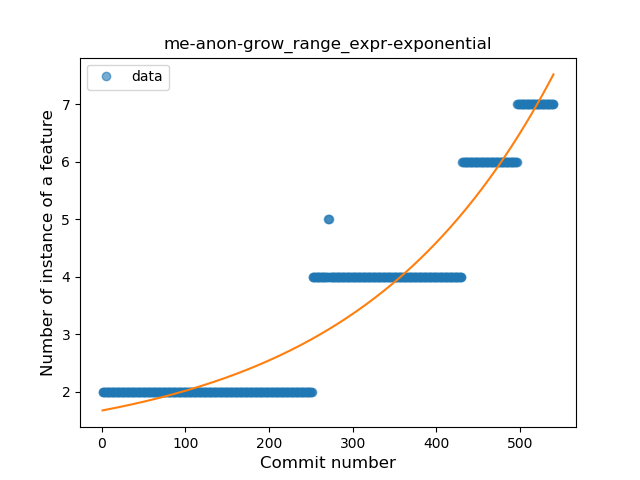

8. ru-hyst329-openfool

	*  Function: 
	* R_Squared: 0.9084316
 

9. de-westnordost-streetcomplete

	*  Function: 
	* R_Squared: 0.89072428
 

10. io-ipoli-android

	*  Function: 
	* R_Squared: 0.88431027
 

11. org-eurofurence-connavigator

	*  Function: 
	* R_Squared: 0.8842994
 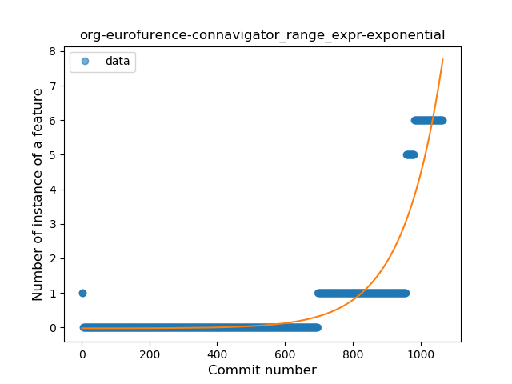

12. com-doctoror-particleswallpaper

	*  Function: 
	* R_Squared: 0.87889659
 

13. net-mm2d-dmsexplorer

	*  Function: 
	* R_Squared: 0.85325397
 

14. com-mgaetan89-showsrage

	*  Function: 
	* R_Squared: 0.83112933
 

16. tech-ula

	*  Function: 
	* R_Squared: 0.8128032
 

19. ca-fuwafuwa-kaku

	*  Function: 
	* R_Squared: 0.79414634
 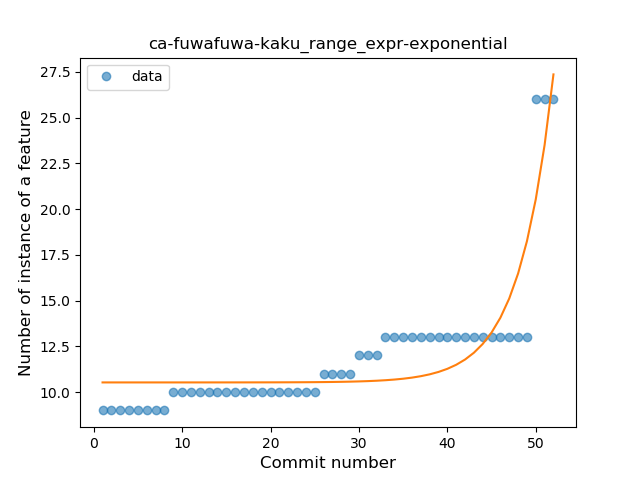

20. org-zimmob-zimlx

	*  Function: 
	* R_Squared: 0.76659004
 

21. com-dozingcatsoftware-vectorcamera

	*  Function: 
	* R_Squared: 0.75043703
 

22. org-ligi-gobandroid

	*  Function: 
	* R_Squared: 0.73952475
 

23. com-uwetrottmann-wpdisplay

	*  Function: 
	* R_Squared: 0.73554987
 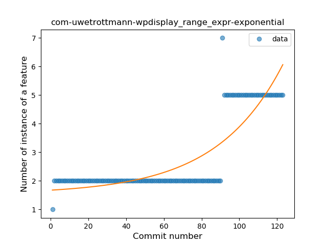

25. me-proxer-app

	*  Function: 
	* R_Squared: 0.66218251
 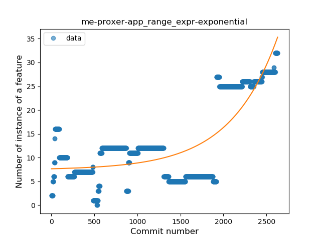

26. com-moez-QKSMS

	*  Function: 
	* R_Squared: 0.48284668
 

28. org-mattvchandler-progressbars

	*  Function: 
	* R_Squared: 0.40438117
 

29. com-jereksel-libresubstratum

	*  Function: 
	* R_Squared: 0.33114966
 

30. org-liberty-android-freeotpplus

	*  Function: 
	* R_Squared: 0.32065046
 

31. jp-toastkid-yobidashi

	*  Function: 
	* R_Squared: 0.30712712
 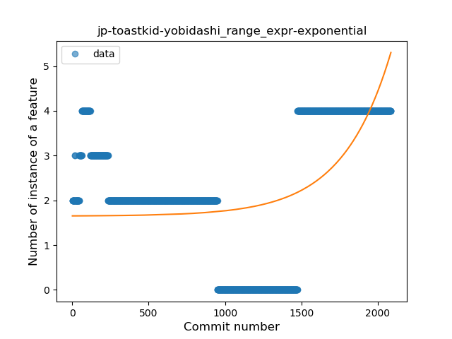

32. com-sduduzog-slimlauncher

	*  Function: 
	* R_Squared: 0.16960509
 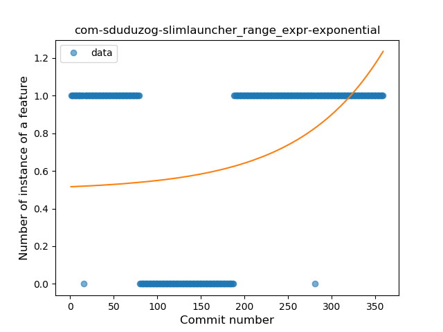

33. de-ph1b-audiobook

	*  Function: 
	* R_Squared: 0.09235504
 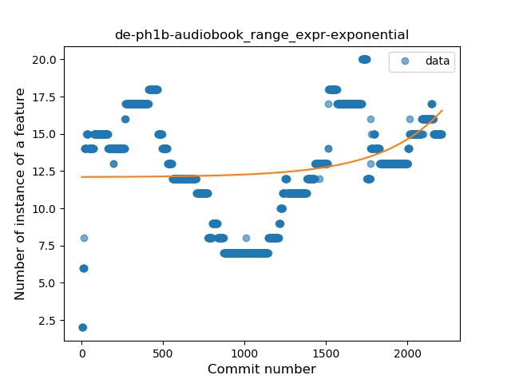

### <a name="T6">Sudden Rise Plateau</a> 
 ----

1. se-barsk-park

	*  Function: 
	* R_Squared: 0.92967439
 

2. org-kaqui

	*  Function: 
	* R_Squared: 0.83625607
 

3. com-arcao-geocaching4locus

	*  Function: 
	* R_Squared: 0.75891851
 

4. com-guerinet-mymartlet

	*  Function: 
	* R_Squared: 0.70013637
 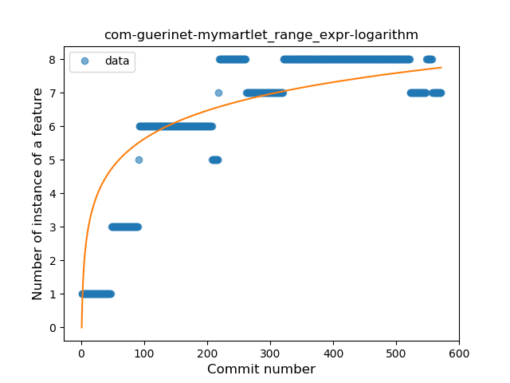

5. com-ofalvai-bpinfo

	*  Function: 
	* R_Squared: 0.68871966
 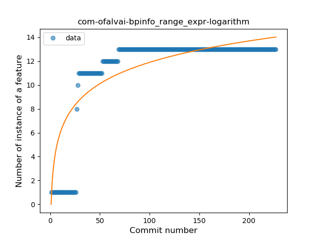

6. fr-cph-chicago-foss

	*  Function: 
	* R_Squared: 0.65748064
 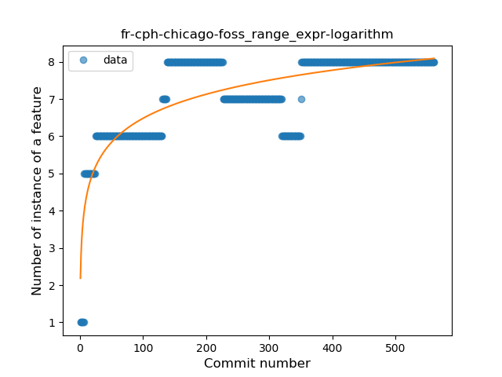

7. com-yubico-yubioath

	*  Function: 
	* R_Squared: 0.53881576
 

8. net-nurik-roman-muzei

	*  Function: 
	* R_Squared: 0.42186017
 

9. org-blitzortung-android-app

	*  Function: 
	* R_Squared: 0.3239736
 

10. de-ironjan-mensaupb

	*  Function: 
	* R_Squared: 0.25543441
 

11. de-blankedv-lanbahnpanel

	*  Function: 
	* R_Squared: 0.25495682
 

12. org-walleth

	*  Function: 
	* R_Squared: 0.22041428
 

13. nl-mpcjanssen-simpletask

	*  Function: 
	* R_Squared: 0.19834801
 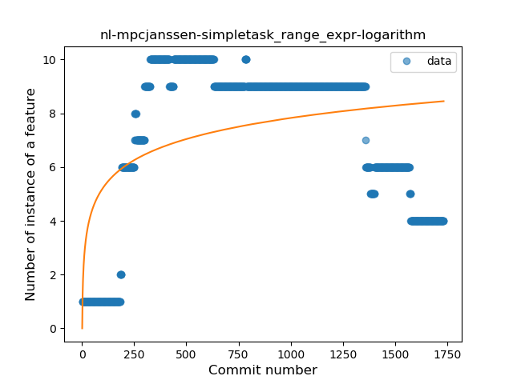

14. io-github-deweyreed-clipboardcleaner

	*  Function: 
	* R_Squared: 0.1956725
 

15. net-kourlas-voipms

	*  Function: 
	* R_Squared: 0.19480182
 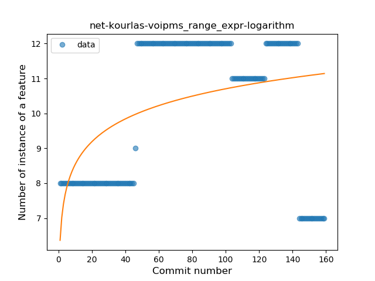

16. com-simplemobiletools-gallery

	*  Function: 
	* R_Squared: 0.02814332
 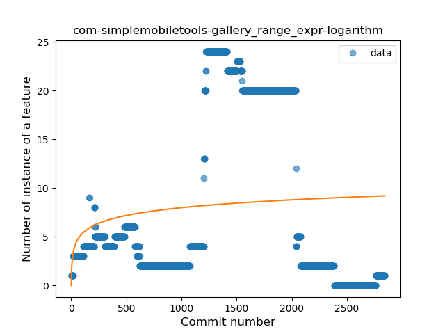

17. org-equeim-tremotesf

	*  Function: 
	* R_Squared: 0.02160563
 

### <a name="T2">Constant Decline</a> 
 ----

19. tw-shounenwind-kmnbottool

	*  Function: 
	* R_Squared: 0.79621638
 

29. com-zacharee1-systemuituner

	*  Function: 
	* R_Squared: 0.65825553
 

32. com-simplemobiletools-clock

	*  Function: 
	* R_Squared: 0.57341977
 

33. com-bubelov-coins

	*  Function: 
	* R_Squared: 0.53879005
 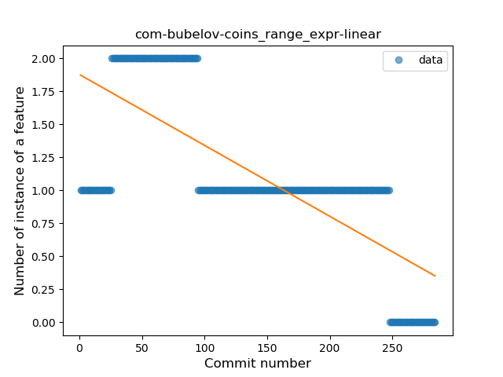

34. de-cineaste-android

	*  Function: 
	* R_Squared: 0.28232886
 

36. me-kirimin-mitsumine

	*  Function: 
	* R_Squared: 0.2623018
 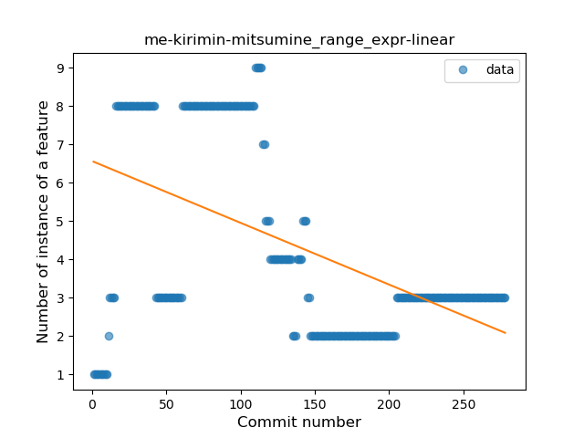

37. ch-rmy-android-http_shortcuts

	*  Function: 
	* R_Squared: 0.16056831
 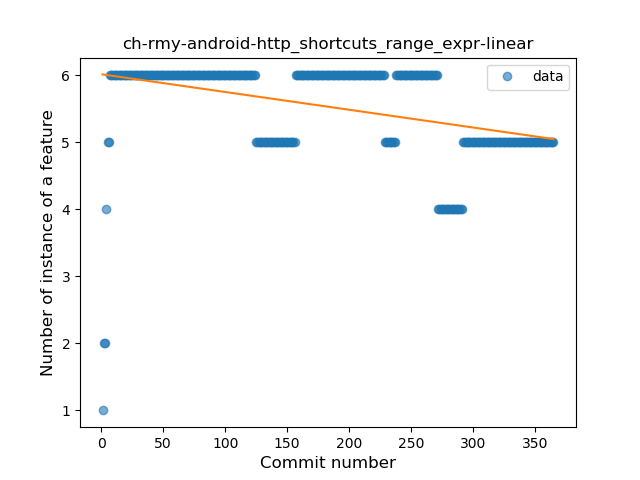

38. com-simplemobiletools-gallery-pro

	*  Function: 
	* R_Squared: 0.12086908
 

39. ai-susi

	*  Function: 
	* R_Squared: 0.06203122
 

40. com-simplemobiletools-filemanager-pro

	*  Function: 
	* R_Squared: 0.04755773
 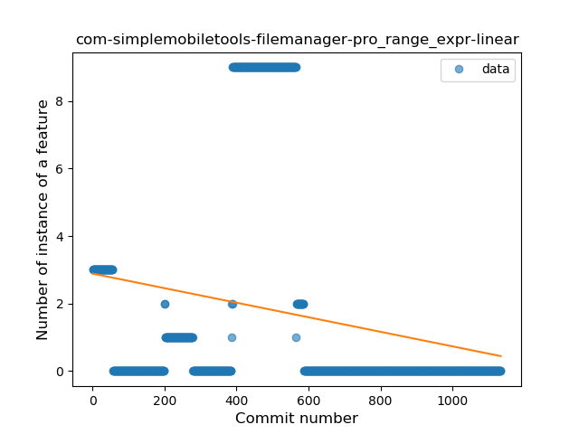

41. com-simplemobiletools-applauncher

	*  Function: 
	* R_Squared: 0.02018857
 

42. de-tubaf-mandelGL

	*  Function: 
	* R_Squared: 0.01546073
 

43. pl-org-seva-navigator

	*  Function: 
	* R_Squared: 0.01130895
 

44. com-github-moko256-twitlatte

	*  Function: 
	* R_Squared: 0.00060497
 

### <a name="T10">Plateau Sudden Decline</a> 
 ----

2. app-simone

	*  Function: 
	* R_Squared: 1.0
 

4. co-garmax-materialflashlight

	*  Function: 
	* R_Squared: 1.0
 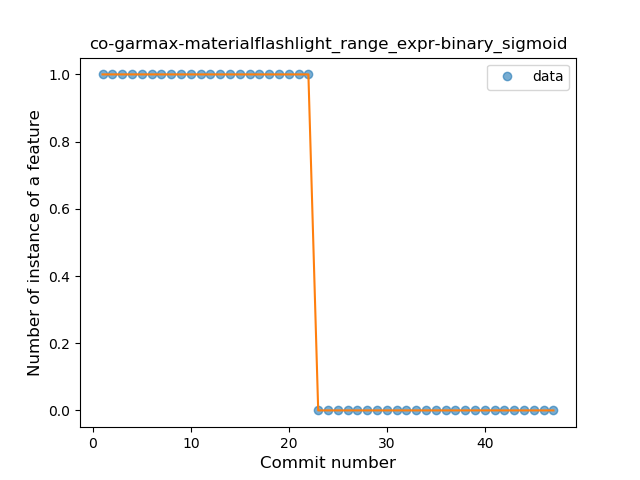

7. com-commit451-gitlab

	*  Function: 
	* R_Squared: 1.0
 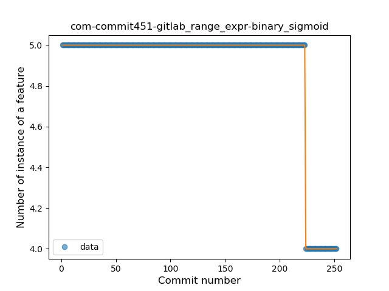

10. com-epimorphics-android-myrivers

	*  Function: 
	* R_Squared: 1.0
 

11. com-heed-justquotes

	*  Function: 
	* R_Squared: 1.0
 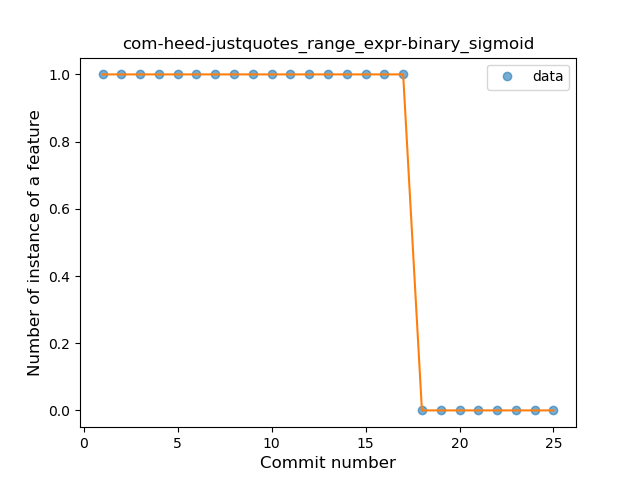

20. de-devmil-muzei-bingimageofthedayartsource

	*  Function: 
	* R_Squared: 1.0
 

22. eu-the4thfloor-msync

	*  Function: 
	* R_Squared: 1.0
 

23. io-trewartha-positional

	*  Function: 
	* R_Squared: 1.0
 

24. jp-cordea-mackerelclient

	*  Function: 
	* R_Squared: 1.0
 

31. org-poul-bits-android

	*  Function: 
	* R_Squared: 1.0
 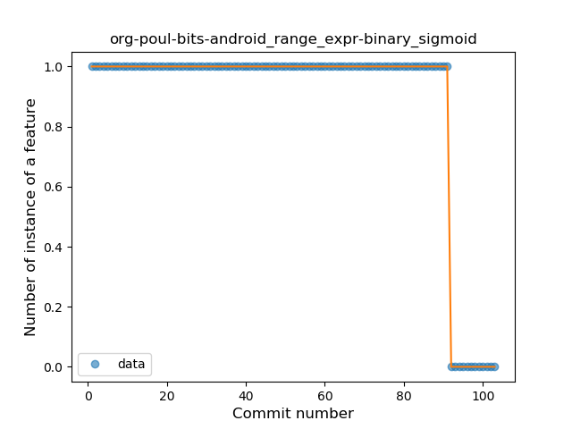

35. com-simplemobiletools-notes-pro

	*  Function: 
	* R_Squared: 0.99144764
 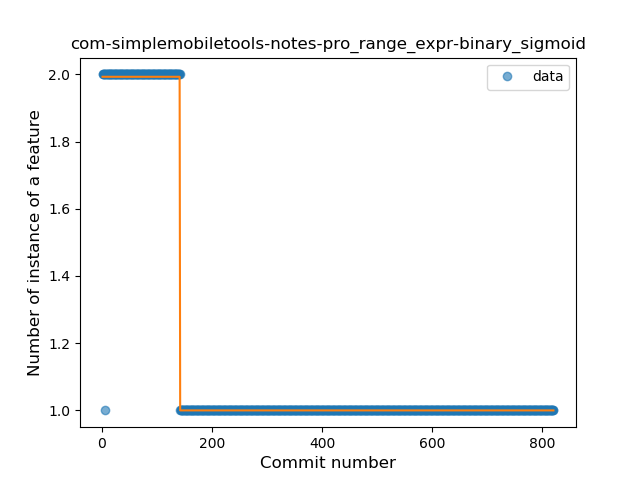

44. apps-jizzu-simpletodo

	*  Function: 
	* R_Squared: 0.82689815
 

46. net-frju-flym

	*  Function: 
	* R_Squared: 0.78765909
 

51. it-diab

	*  Function: 
	* R_Squared: 0.44266581
 

### <a name="T11">Instability</a> 
 ----

1. com-androidheads-vienna-escalero

	*  Function: 
	* R_Squared: 0.89413873
 

2. com-skydoves-waterdays

	*  Function: 
	* R_Squared: 0.88461538
 

3. ru-nsu-bobrofon-easysshfs

	*  Function: 
	* R_Squared: 0.79339525
 

### <a name="T8">Plateau Gradual Decline</a> 
 ----

10. me-echeung-moemoekyun-fdroid

	*  Function: 
	* R_Squared: 0.9686859
 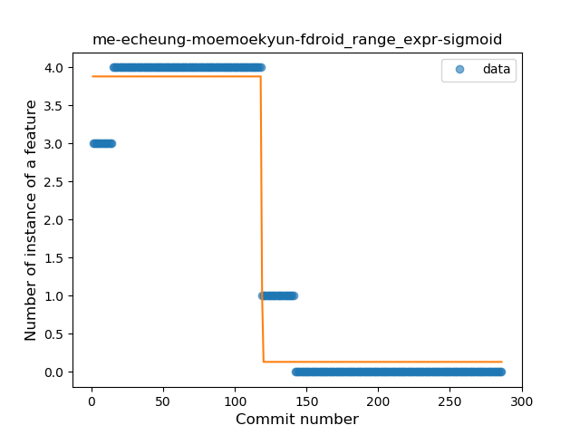

21. me-camsteffen-polite

	*  Function: 
	* R_Squared: 0.94764597
 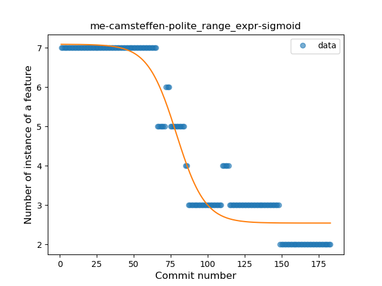

35. org-mosad-seil0-projectlaogai

	*  Function: 
	* R_Squared: 0.9051511
 

45. org-emunix-insteadlauncher

	*  Function: 
	* R_Squared: 0.73888997
 

52. com-tasomaniac-openwith-floss

	*  Function: 
	* R_Squared: 0.13922518
 

53. com-pluscubed-velociraptor

	*  Function: 
	* R_Squared: 0.07690447
 

### <a name="T5">Sudden Decline</a> 
 ----

15. fi-tuska-jalkametri

	*  Function: 
	* R_Squared: 0.82239643
 

17. org-mcxa-vortaro

	*  Function: 
	* R_Squared: 0.81140237
 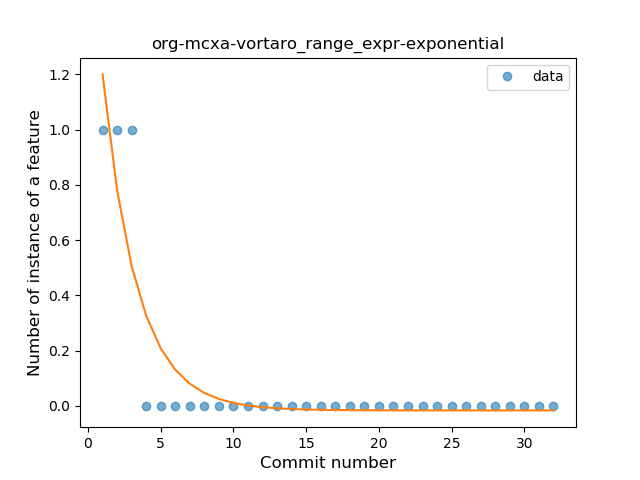

18. pl-org-seva-texter

	*  Function: 
	* R_Squared: 0.79544288
 

24. com-benny-openlauncher

	*  Function: 
	* R_Squared: 0.71707435
 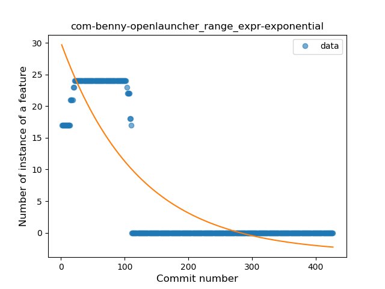

27. com-tutpro-baresip

	*  Function: 
	* R_Squared: 0.43732125
 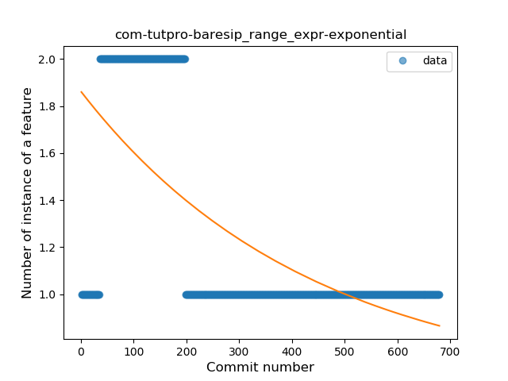

### <a name="T3">Stability</a> 
 ----

