## Safe Call
----
**Best fit = Constant Rise**: 94

Function | N# best fit
----|----
<a href=" #T1">Constant Rise</a> | 94
<a href=" #T4">Sudden Rise</a> | 64
<a href=" #T11">Instability</a> | 51
<a href=" #T6">Sudden Rise Plateau</a> | 38
<a href=" #T7">Plateau Gradual Rise</a> | 33
<a href=" #T9">Plateau Sudden Rise</a> | 21
<a href=" #T10">Plateau Sudden Decline</a> | 9
<a href=" #T5">Sudden Decline</a> | 3
<a href=" #T2">Constant Decline</a> | 2
<a href=" #T8">Plateau Gradual Decline</a> | 1
<a href=" #T3">Stability</a> | 0

### <a name="T1">Constant Rise</a> 
 ----

1. org-mariotaku-twidere

	*  Function: 
	* R_Squared: 0.98968138
 

2. be-mygod-vpnhotspot

	*  Function: 
	* R_Squared: 0.98450713
 

3. chat-rocket-android

	*  Function: 
	* R_Squared: 0.98396774
 

4. ffc-app

	*  Function: 
	* R_Squared: 0.98087607
 

5. de-westnordost-streetcomplete

	*  Function: 
	* R_Squared: 0.98072317
 

6. org-walleth

	*  Function: 
	* R_Squared: 0.97999036
 

7. com-keylesspalace-tusky

	*  Function: 
	* R_Squared: 0.97629609
 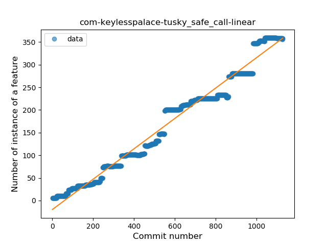

8. org-mozilla-focus

	*  Function: 
	* R_Squared: 0.97484822
 

9. org-mozilla-klar

	*  Function: 
	* R_Squared: 0.97484822
 

10. one-librem-social

	*  Function: 
	* R_Squared: 0.9733035
 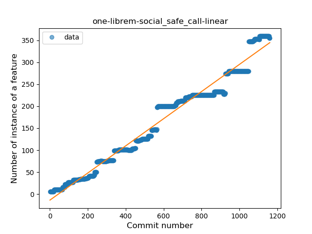

11. com-boardgamegeek

	*  Function: 
	* R_Squared: 0.97289291
 

12. de-Maxr1998-xposed-maxlock

	*  Function: 
	* R_Squared: 0.97122294
 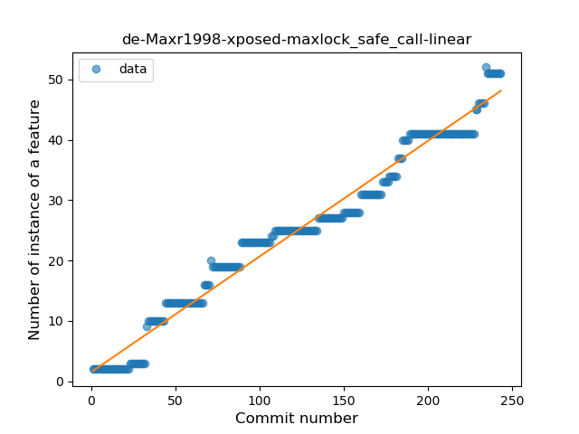

13. com-utazukin-ichaival

	*  Function: 
	* R_Squared: 0.96876194
 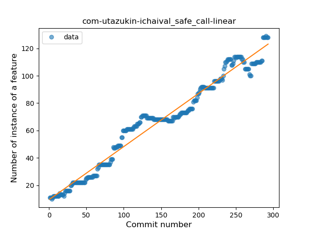

14. com-motion-stage1

	*  Function: 
	* R_Squared: 0.96861928
 

15. net-bible-android-activity

	*  Function: 
	* R_Squared: 0.96777039
 

16. com-simplemobiletools-filemanager-pro

	*  Function: 
	* R_Squared: 0.96706677
 

17. com-duckduckgo-mobile-android

	*  Function: 
	* R_Squared: 0.96693813
 

18. com-simplemobiletools-gallery-pro

	*  Function: 
	* R_Squared: 0.96342056
 

19. com-androidheads-vienna-escalero

	*  Function: 
	* R_Squared: 0.96304397
 

20. fr-openium-auvergnewebcams

	*  Function: 
	* R_Squared: 0.96042092
 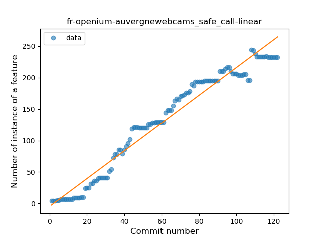

21. com-booboot-vndbandroid

	*  Function: 
	* R_Squared: 0.95993972
 

22. cz-dvratil-fbeventsync

	*  Function: 
	* R_Squared: 0.95703987
 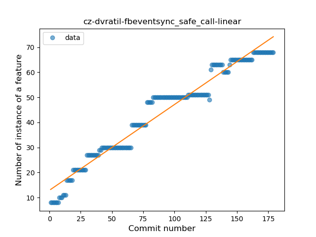

23. com-arcao-geocaching4locus

	*  Function: 
	* R_Squared: 0.95270425
 

24. com-log28

	*  Function: 
	* R_Squared: 0.94933377
 

25. uk-colessoft-android-hilllist

	*  Function: 
	* R_Squared: 0.94859311
 

26. com-nononsenseapps-feeder

	*  Function: 
	* R_Squared: 0.94554087
 

27. ca-josephroque-bowlingcompanion

	*  Function: 
	* R_Squared: 0.94509089
 

28. de-ph1b-audiobook

	*  Function: 
	* R_Squared: 0.94161139
 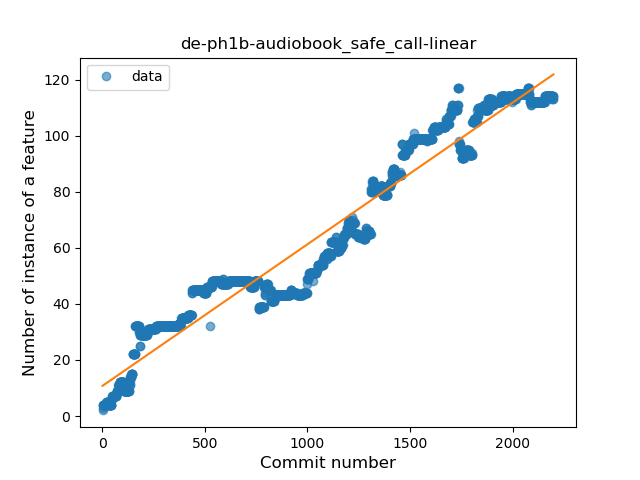

29. io-github-feelfreelinux-wykopmobilny

	*  Function: 
	* R_Squared: 0.93764632
 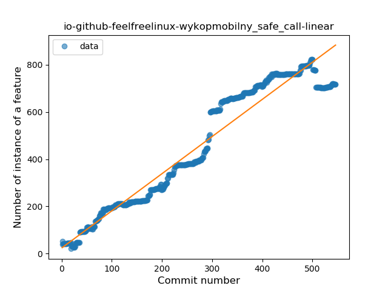

30. ai-susi

	*  Function: 
	* R_Squared: 0.93644215
 

31. com-adityakamble49-dcipher

	*  Function: 
	* R_Squared: 0.93586449
 

32. org-freedombox-freedombox

	*  Function: 
	* R_Squared: 0.93396823
 

33. com-simplemobiletools-clock

	*  Function: 
	* R_Squared: 0.92915049
 

34. eu-kanade-tachiyomi

	*  Function: 
	* R_Squared: 0.92747323
 

35. com-esafirm-androidplayground

	*  Function: 
	* R_Squared: 0.92130641
 

36. com-fastaccess-github-libre

	*  Function: 
	* R_Squared: 0.91736105
 

37. sk-styk-martin-apkanalyzer

	*  Function: 
	* R_Squared: 0.91379082
 

38. is-xyz-omw

	*  Function: 
	* R_Squared: 0.91198285
 

39. ch-abertschi-adfree

	*  Function: 
	* R_Squared: 0.91047261
 

40. pixel-kotlin-bassblog

	*  Function: 
	* R_Squared: 0.90825671
 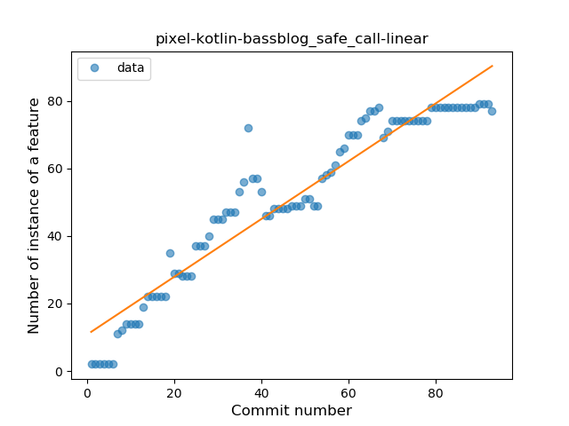

41. xyz-hisname-fireflyiii

	*  Function: 
	* R_Squared: 0.90722712
 

42. cat-xojan-random1

	*  Function: 
	* R_Squared: 0.90597269
 

43. science-apolline

	*  Function: 
	* R_Squared: 0.90454192
 

44. fi-kroon-vadret

	*  Function: 
	* R_Squared: 0.9036915
 

45. org-decsync-cc

	*  Function: 
	* R_Squared: 0.90033316
 

46. net-frju-flym

	*  Function: 
	* R_Squared: 0.89815869
 

47. com-tasomaniac-openwith-floss

	*  Function: 
	* R_Squared: 0.89718246
 

48. com-loloof64-android-basicchessendgamestrainer

	*  Function: 
	* R_Squared: 0.89659612
 

49. net-yslibrary-monotweety

	*  Function: 
	* R_Squared: 0.89622577
 

50. com-simplemobiletools-contacts-pro

	*  Function: 
	* R_Squared: 0.89427886
 

51. li-klass-fhem

	*  Function: 
	* R_Squared: 0.89423022
 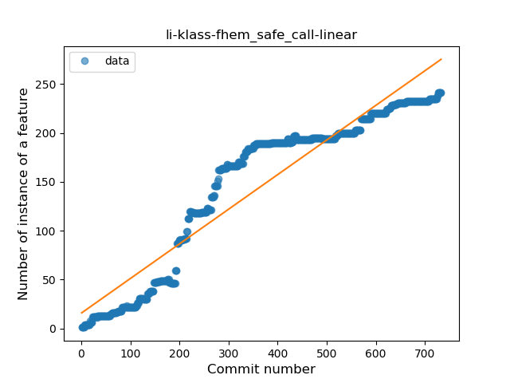

52. com-uncmorfi

	*  Function: 
	* R_Squared: 0.89371907
 

53. org-havenapp-main

	*  Function: 
	* R_Squared: 0.89050406
 

54. net-osmand-plus

	*  Function: 
	* R_Squared: 0.89036593
 

55. com-simplemobiletools-gallery

	*  Function: 
	* R_Squared: 0.88649388
 

56. de-grobox-liberario

	*  Function: 
	* R_Squared: 0.87737474
 

57. com-simplemobiletools-draw

	*  Function: 
	* R_Squared: 0.87416115
 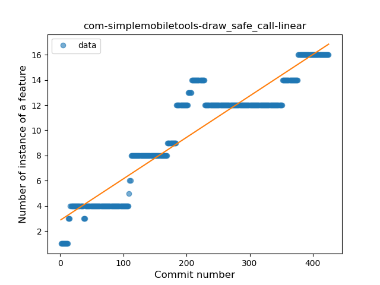

58. com-simplemobiletools-draw-pro

	*  Function: 
	* R_Squared: 0.87416115
 

59. com-jim-sharetocomputer

	*  Function: 
	* R_Squared: 0.87373178
 

60. se-creotec-chscardbalance2

	*  Function: 
	* R_Squared: 0.87068361
 

61. org-fossasia-badgemagic

	*  Function: 
	* R_Squared: 0.87010587
 

62. me-murks-feedwatcher

	*  Function: 
	* R_Squared: 0.86181458
 

63. app-simone

	*  Function: 
	* R_Squared: 0.86166191
 

64. apps-jizzu-simpletodo

	*  Function: 
	* R_Squared: 0.8575494
 

65. com-stolineage-lineagewatcher

	*  Function: 
	* R_Squared: 0.85449438
 

66. com-benoitquenaudon-tvfoot-red

	*  Function: 
	* R_Squared: 0.85168406
 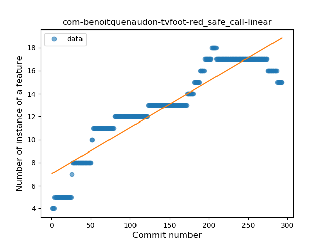

67. com-mgaetan89-showsrage

	*  Function: 
	* R_Squared: 0.84765271
 

68. org-mattvchandler-progressbars

	*  Function: 
	* R_Squared: 0.84656566
 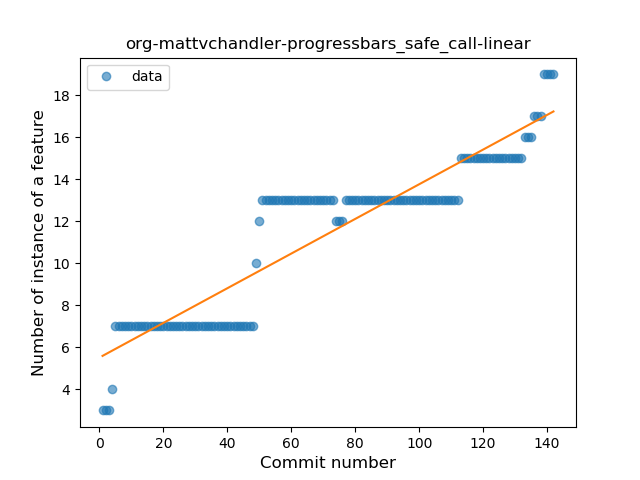

69. io-github-wulkanowy

	*  Function: 
	* R_Squared: 0.83974011
 

70. com-njlabs-showjava

	*  Function: 
	* R_Squared: 0.83573383
 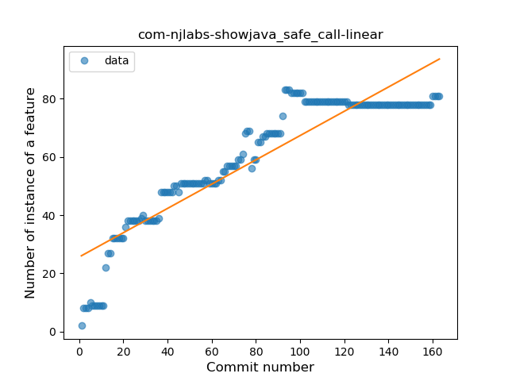

71. com-simplemobiletools-calendar-pro

	*  Function: 
	* R_Squared: 0.83460759
 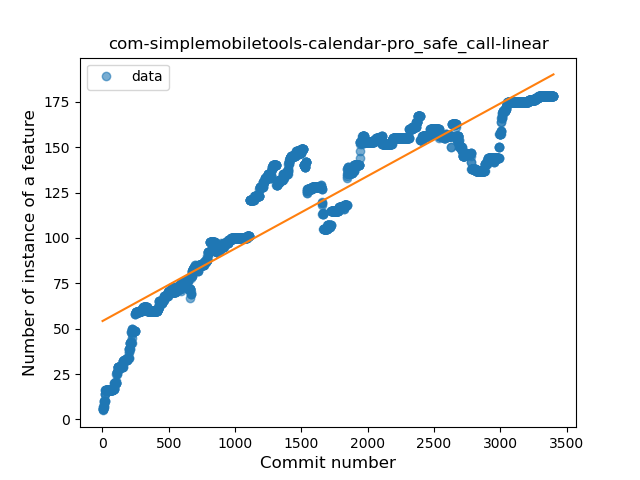

72. com-wbrawner-simplemarkdown

	*  Function: 
	* R_Squared: 0.82693286
 

73. com-jereksel-libresubstratum

	*  Function: 
	* R_Squared: 0.82056682
 

74. info-metadude-android-congress-schedule

	*  Function: 
	* R_Squared: 0.81489428
 

75. jp-toastkid-yobidashi

	*  Function: 
	* R_Squared: 0.81098363
 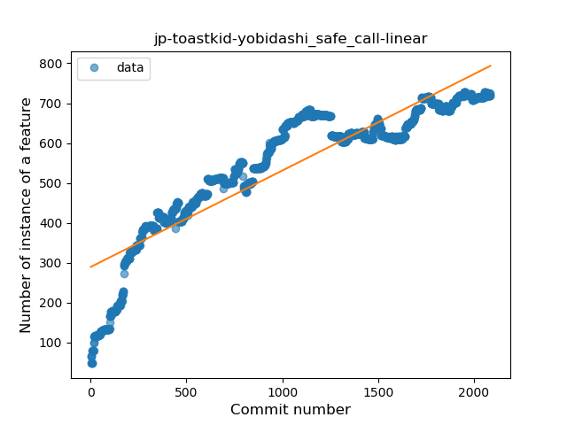

76. com-example-harisont-librery

	*  Function: 
	* R_Squared: 0.80691525
 

77. com-benoitletondor-easybudgetapp

	*  Function: 
	* R_Squared: 0.8062739
 

78. org-moire-ultrasonic

	*  Function: 
	* R_Squared: 0.79385487
 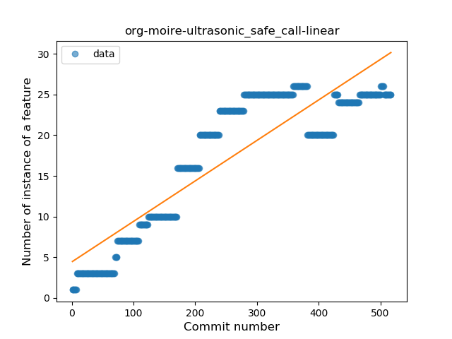

79. fr-cph-chicago-foss

	*  Function: 
	* R_Squared: 0.77614902
 

80. nl-mpcjanssen-simpletask

	*  Function: 
	* R_Squared: 0.77001699
 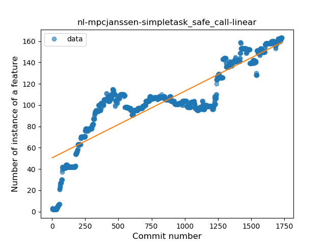

81. com-pixplicity-cryptogram

	*  Function: 
	* R_Squared: 0.76102974
 

82. net-mm2d-android-vmb

	*  Function: 
	* R_Squared: 0.74782959
 

83. pt-ipleiria-mymusicqoe

	*  Function: 
	* R_Squared: 0.74375336
 

84. apps-amine-bou-readerforselfoss

	*  Function: 
	* R_Squared: 0.7430976
 

85. de-blankedv-lanbahnpanel

	*  Function: 
	* R_Squared: 0.72764125
 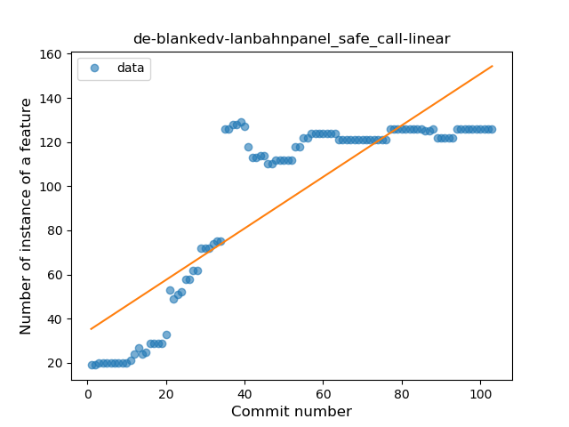

86. com-uwetrottmann-wpdisplay

	*  Function: 
	* R_Squared: 0.7248012
 

87. es-usc-citius-servando-calendula

	*  Function: 
	* R_Squared: 0.72149471
 

88. de-cineaste-android

	*  Function: 
	* R_Squared: 0.70616002
 

89. com-example-forgottenumbrella-cardboardmuseum

	*  Function: 
	* R_Squared: 0.6789093
 

90. com-simplemobiletools-camera

	*  Function: 
	* R_Squared: 0.66094071
 

91. superustats-tool-android

	*  Function: 
	* R_Squared: 0.65475673
 

92. org-blokada-alarm

	*  Function: 
	* R_Squared: 0.61919382
 

93. com-ruuvi-station

	*  Function: 
	* R_Squared: 0.61636272
 

94. com-yubico-yubioath

	*  Function: 
	* R_Squared: 0.5776445
 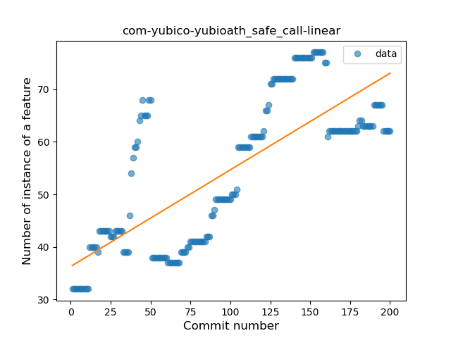

### <a name="T4">Sudden Rise</a> 
 ----

2. ch-deletescape-lawnchair-plah

	*  Function: 
	* R_Squared: 0.98975327
 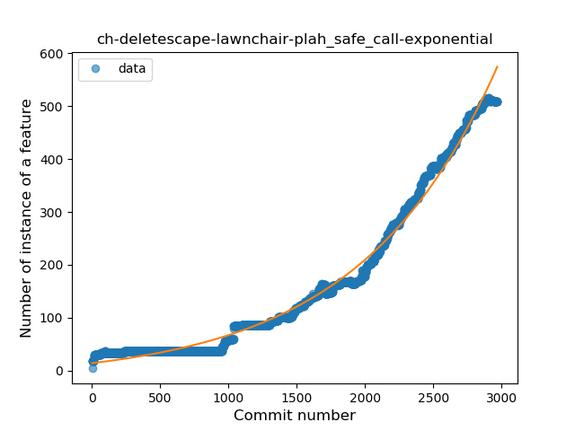

3. org-mozilla-rocket

	*  Function: 
	* R_Squared: 0.98772266
 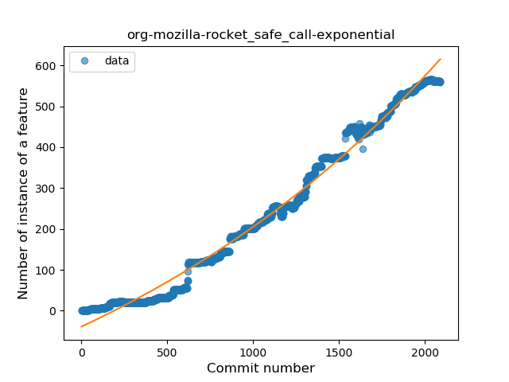

4. ch-rmy-android-http_shortcuts

	*  Function: 
	* R_Squared: 0.9859693
 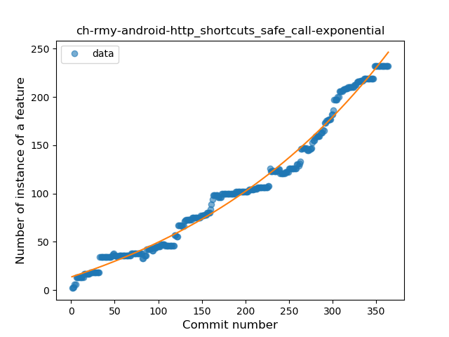

5. com-simplemobiletools-notes-pro

	*  Function: 
	* R_Squared: 0.97741583
 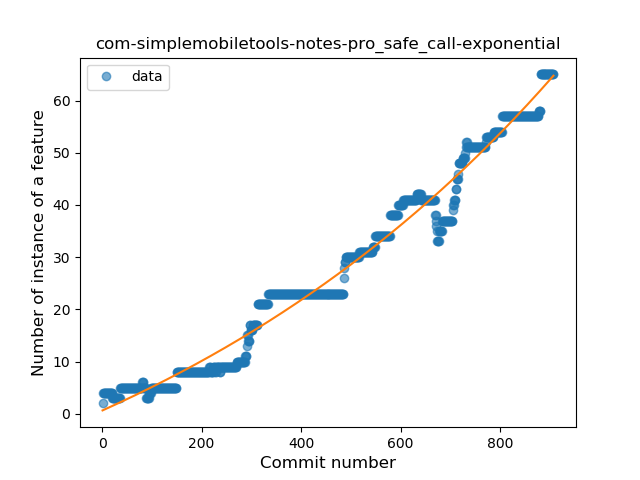

6. me-anon-grow

	*  Function: 
	* R_Squared: 0.97461942
 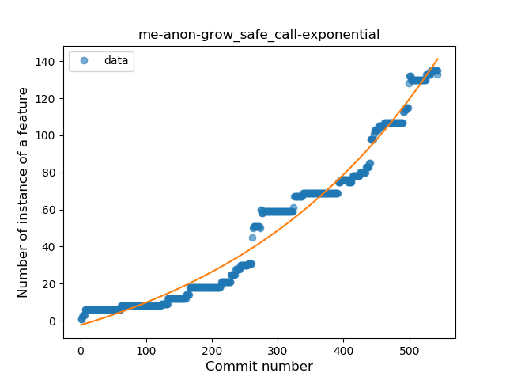

7. com-github-cvzi-screenshottile

	*  Function: 
	* R_Squared: 0.97388894
 

8. io-ipoli-android

	*  Function: 
	* R_Squared: 0.96937952
 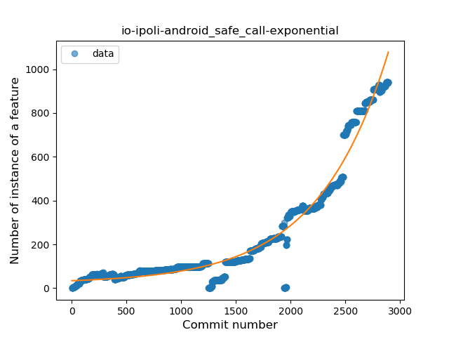

9. quickbeer-android

	*  Function: 
	* R_Squared: 0.96895037
 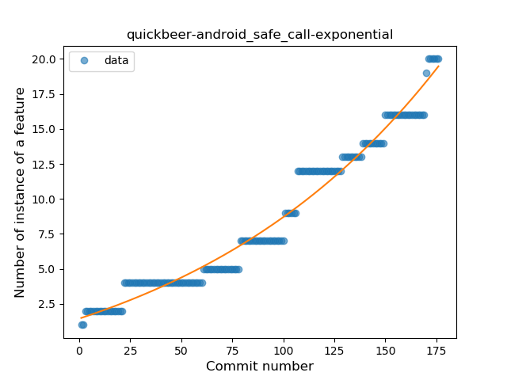

10. im-vector-alpha

	*  Function: 
	* R_Squared: 0.96124476
 

11. com-lavadip-miniVector

	*  Function: 
	* R_Squared: 0.95958419
 

12. com-peterlaurence-trekme

	*  Function: 
	* R_Squared: 0.9560756
 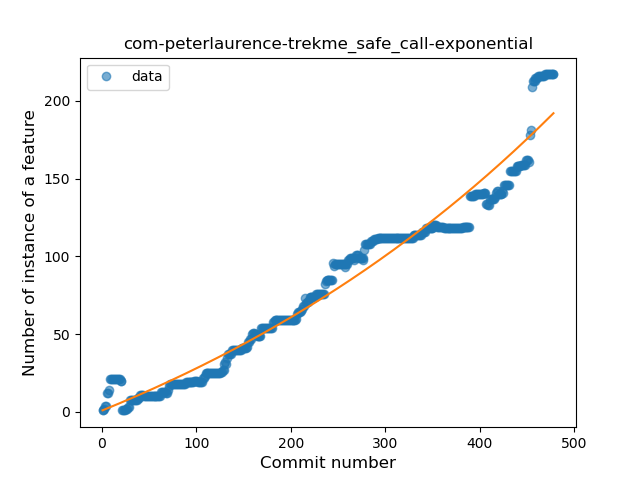

13. se-barsk-park

	*  Function: 
	* R_Squared: 0.95437837
 

14. org-eurofurence-connavigator

	*  Function: 
	* R_Squared: 0.95329565
 

15. pl-hypeapp-episodie

	*  Function: 
	* R_Squared: 0.94388349
 

16. link-standen-michael-phonesaver

	*  Function: 
	* R_Squared: 0.94055067
 

17. ryey-easer-beta

	*  Function: 
	* R_Squared: 0.93973526
 

18. io-github-fvasco-pinpoi

	*  Function: 
	* R_Squared: 0.93676311
 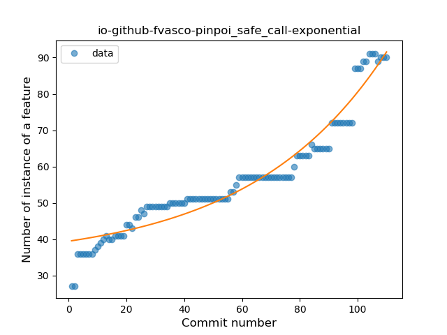

19. com-czbix-v2ex

	*  Function: 
	* R_Squared: 0.9348097
 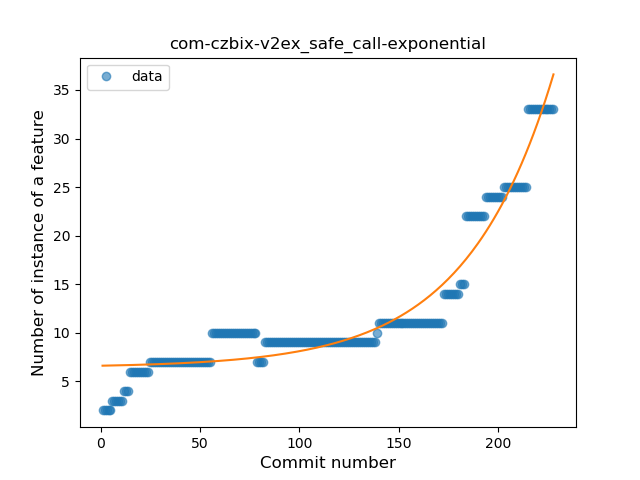

20. tech-ula

	*  Function: 
	* R_Squared: 0.93390414
 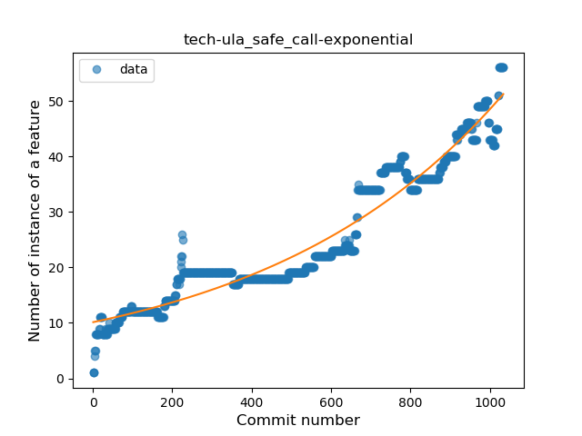

21. com-zeapo-pwdstore

	*  Function: 
	* R_Squared: 0.93384206
 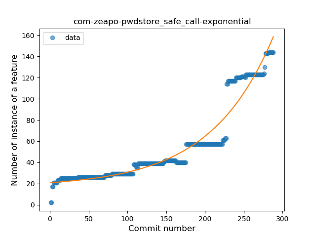

22. com-github-moko256-twitlatte

	*  Function: 
	* R_Squared: 0.9328306
 

23. app-opass-ccip

	*  Function: 
	* R_Squared: 0.92151982
 

24. net-mm2d-dmsexplorer

	*  Function: 
	* R_Squared: 0.92065593
 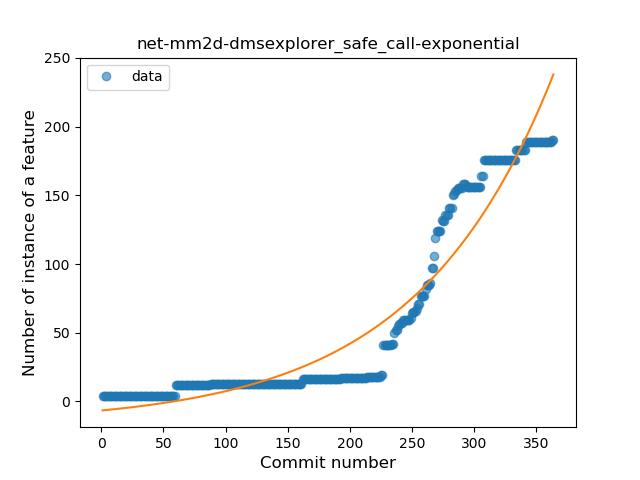

25. com-moez-QKSMS

	*  Function: 
	* R_Squared: 0.91271439
 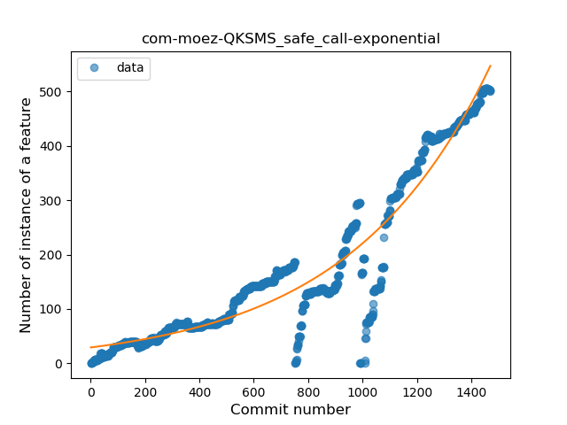

26. com-breadwallet

	*  Function: 
	* R_Squared: 0.91260997
 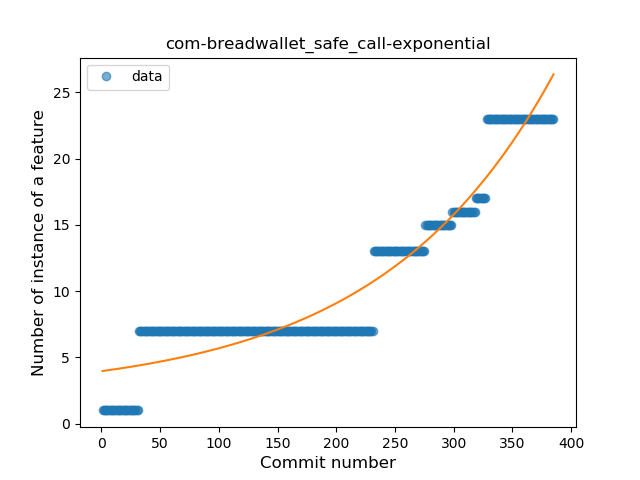

27. com-commit451-gitlab

	*  Function: 
	* R_Squared: 0.91183705
 

28. org-isoron-uhabits

	*  Function: 
	* R_Squared: 0.91077371
 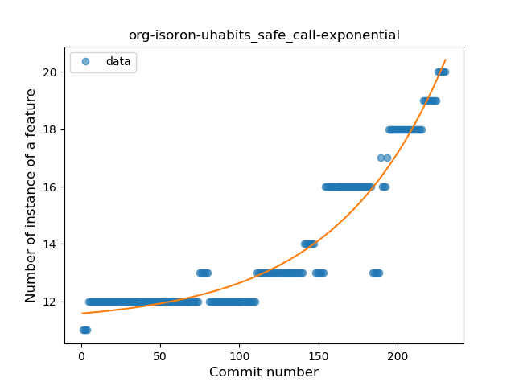

29. fr-jnda-android-flashalert

	*  Function: 
	* R_Squared: 0.90848467
 

30. org-zimmob-zimlx

	*  Function: 
	* R_Squared: 0.90546438
 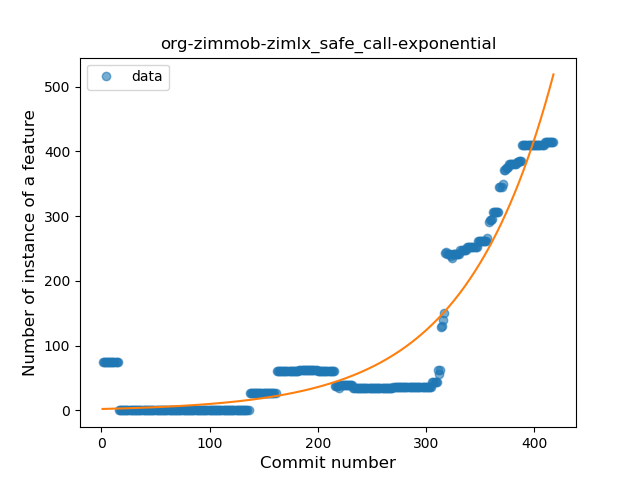

31. org-ligi-gobandroid

	*  Function: 
	* R_Squared: 0.90530826
 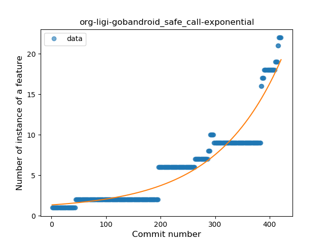

32. org-ligi-passandroid

	*  Function: 
	* R_Squared: 0.90529768
 

33. com-guardafilme

	*  Function: 
	* R_Squared: 0.90465151
 

34. fr-free-nrw-commons

	*  Function: 
	* R_Squared: 0.90461486
 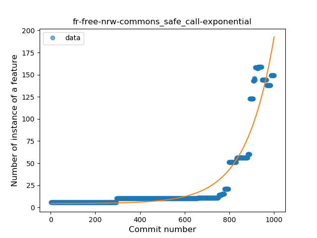

35. de-markusfisch-android-binaryeye

	*  Function: 
	* R_Squared: 0.90306636
 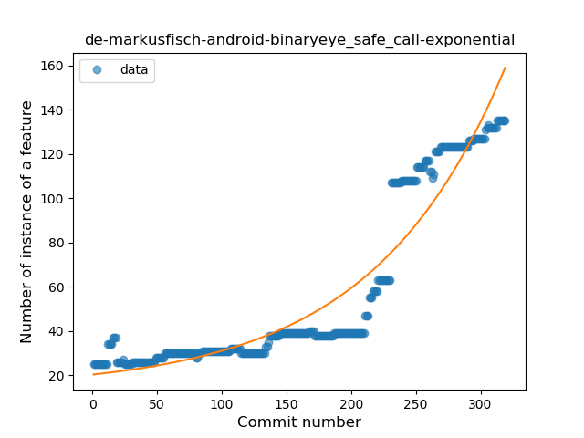

36. com-bernaferrari-changedetection

	*  Function: 
	* R_Squared: 0.90250842
 

37. com-github-vase4kin-teamcityapp

	*  Function: 
	* R_Squared: 0.89501922
 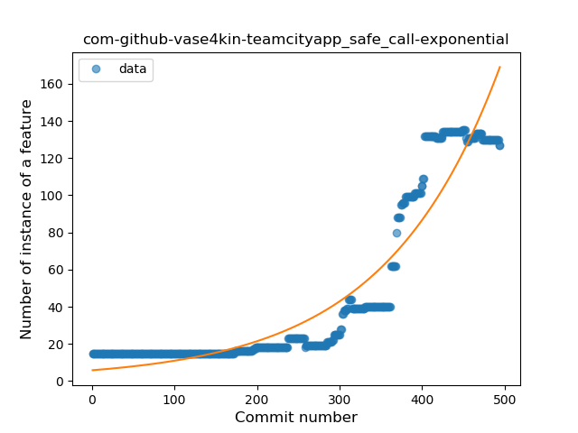

38. ca-fuwafuwa-kaku

	*  Function: 
	* R_Squared: 0.89160053
 

39. tw-shounenwind-kmnbottool

	*  Function: 
	* R_Squared: 0.88786934
 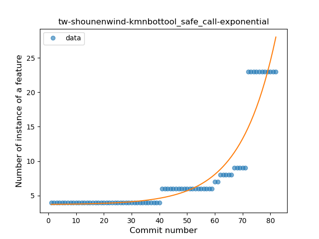

40. org-equeim-tremotesf

	*  Function: 
	* R_Squared: 0.882013
 

41. com-bijoysingh-quicknote

	*  Function: 
	* R_Squared: 0.88191346
 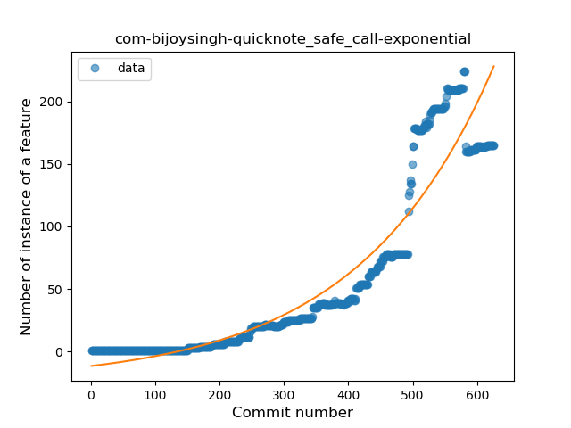

42. com-nextcloud-talk2

	*  Function: 
	* R_Squared: 0.87918141
 

43. pw-janyo-janyoshare

	*  Function: 
	* R_Squared: 0.86473068
 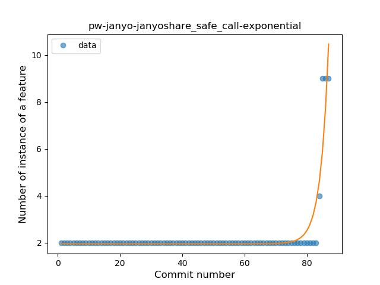

44. com-orgzly

	*  Function: 
	* R_Squared: 0.86392571
 

45. co-timecrypt-android

	*  Function: 
	* R_Squared: 0.85347905
 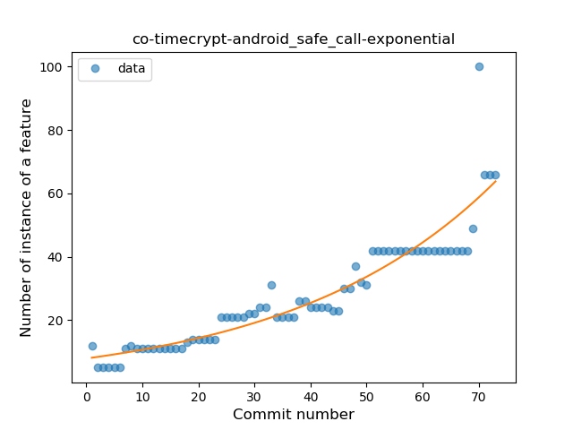

46. fi-tuska-jalkametri

	*  Function: 
	* R_Squared: 0.85324272
 

47. org-emunix-insteadlauncher

	*  Function: 
	* R_Squared: 0.8520104
 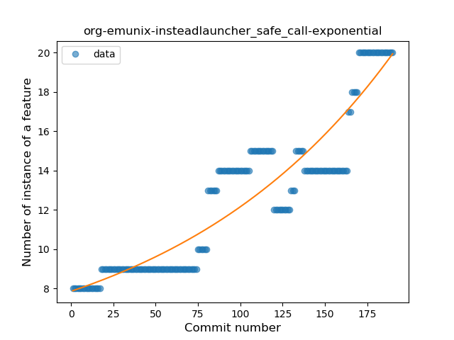

48. io-github-benoitduffez-cupsprint

	*  Function: 
	* R_Squared: 0.85015535
 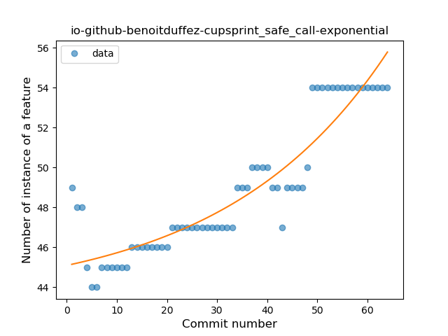

49. com-slash-batterychargelimit

	*  Function: 
	* R_Squared: 0.84507397
 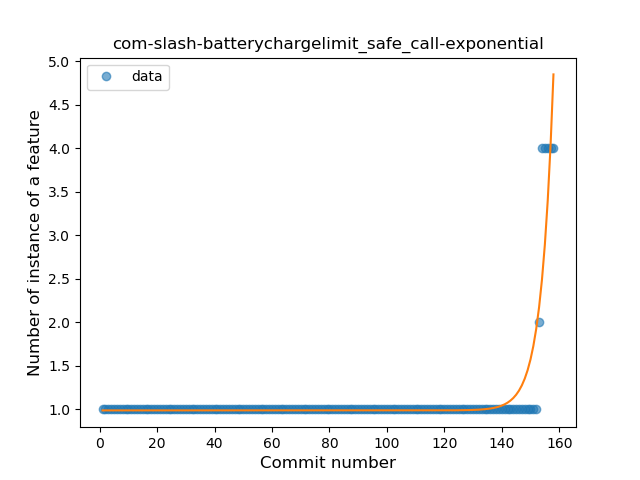

50. fr-chenry-android-freshrss

	*  Function: 
	* R_Squared: 0.84343074
 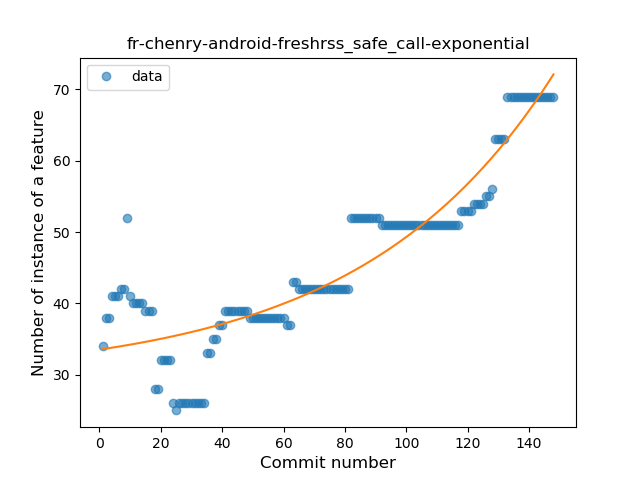

51. pw-janyo-whatanime

	*  Function: 
	* R_Squared: 0.83822532
 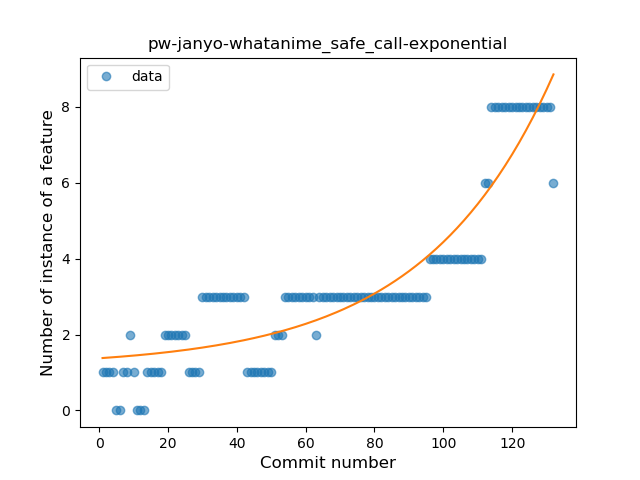

52. com-phicdy-totoanticipation

	*  Function: 
	* R_Squared: 0.80789632
 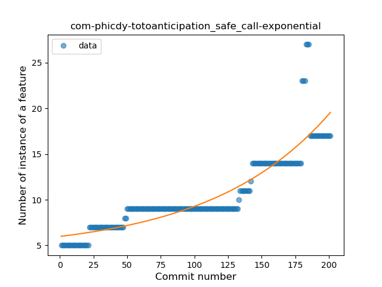

53. com-doctoror-particleswallpaper

	*  Function: 
	* R_Squared: 0.79888314
 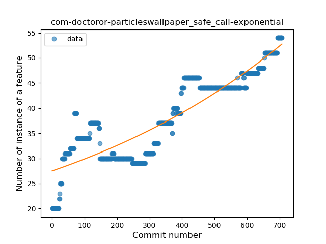

54. com-kgurgul-cpuinfo

	*  Function: 
	* R_Squared: 0.78956918
 

55. com-pluscubed-velociraptor

	*  Function: 
	* R_Squared: 0.77963733
 

56. com-cookiegames-smartcookie

	*  Function: 
	* R_Squared: 0.76945834
 

57. com-manichord-mgit

	*  Function: 
	* R_Squared: 0.76217383
 

58. com-github-fields-electric

	*  Function: 
	* R_Squared: 0.75784109
 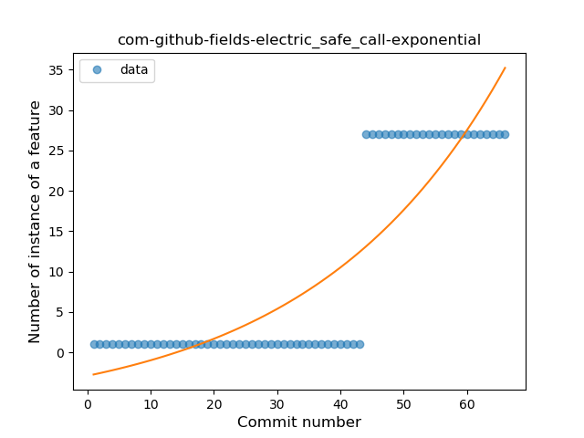

59. is-xyz-mpv

	*  Function: 
	* R_Squared: 0.72030775
 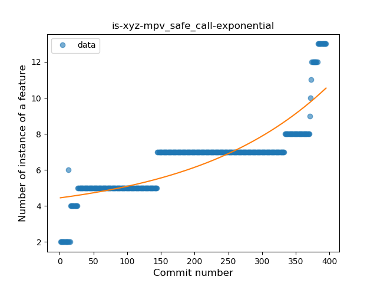

60. it-diab

	*  Function: 
	* R_Squared: 0.708516
 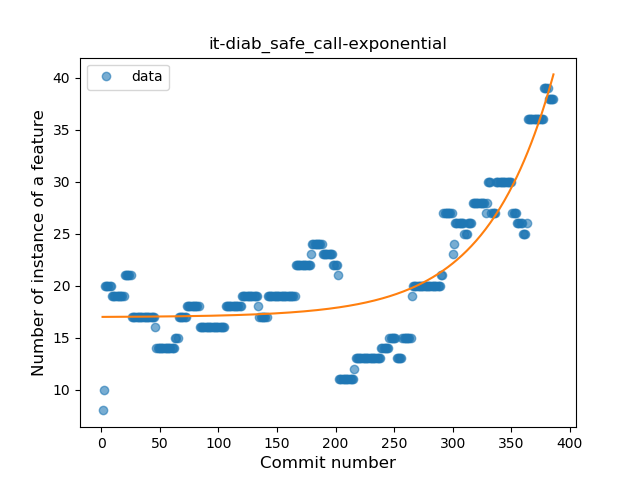

61. net-stew-stew

	*  Function: 
	* R_Squared: 0.68184499
 

63. org-mattvchandler-a2050

	*  Function: 
	* R_Squared: 0.5858681
 

65. org-anibyl-slounik

	*  Function: 
	* R_Squared: 0.1829035
 

66. de-avpptr-umweltzone

	*  Function: 
	* R_Squared: 0.11133041
 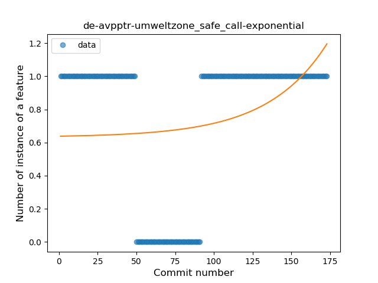

67. com-corphish-nightlight-generic

	*  Function: 
	* R_Squared: 0.10781357
 

### <a name="T11">Instability</a> 
 ----

1. nl-jqno-remindermail

	*  Function: 
	* R_Squared: 0.98556049
 

2. com-bracketcove-postrainer

	*  Function: 
	* R_Squared: 0.9696841
 

3. com-rohitsuratekar-NCBSinfo

	*  Function: 
	* R_Squared: 0.96475439
 

4. ru-nsu-bobrofon-easysshfs

	*  Function: 
	* R_Squared: 0.95679527
 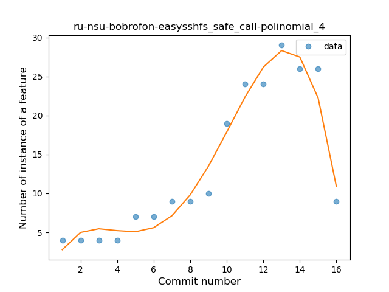

5. de-tubaf-mandelGL

	*  Function: 
	* R_Squared: 0.94348644
 

6. com-fallgamlet-dnestrcinema

	*  Function: 
	* R_Squared: 0.93138875
 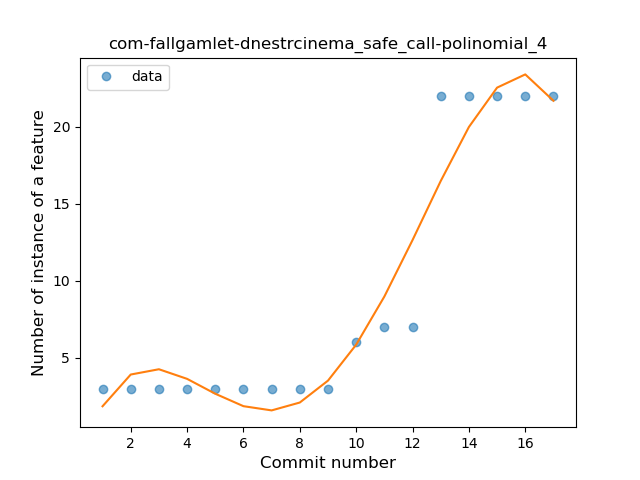

7. fr-jnda-android-ipcalc

	*  Function: 
	* R_Squared: 0.8974359
 

8. com-skydoves-waterdays

	*  Function: 
	* R_Squared: 0.88461538
 

9. org-teamblueridge-pasteitapp

	*  Function: 
	* R_Squared: 0.87787512
 

10. pro-rudloff-muzei-commons

	*  Function: 
	* R_Squared: 0.87553282
 

11. de-msal-muzei-nationalgeographic

	*  Function: 
	* R_Squared: 0.87278694
 

12. com-aaplab-bakubus

	*  Function: 
	* R_Squared: 0.85396082
 

13. com-alderferstudios-handandfootscores

	*  Function: 
	* R_Squared: 0.84847026
 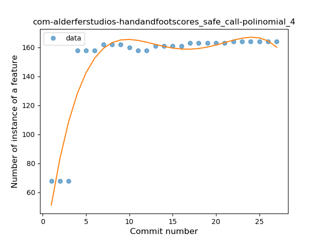

14. me-siketyan-silicagel

	*  Function: 
	* R_Squared: 0.84210526
 

15. college-wyk-app

	*  Function: 
	* R_Squared: 0.83185768
 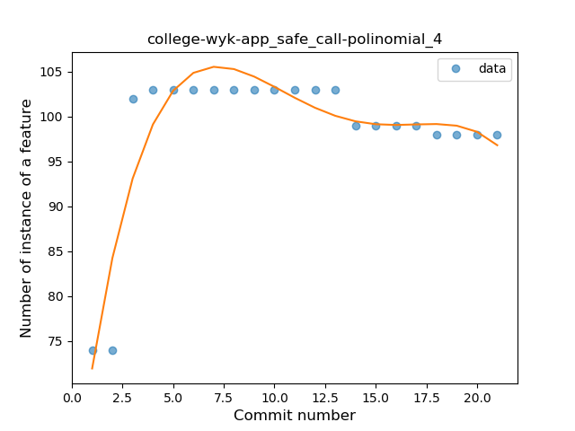

16. com-brentpanther-bitcoinwidget

	*  Function: 
	* R_Squared: 0.81318616
 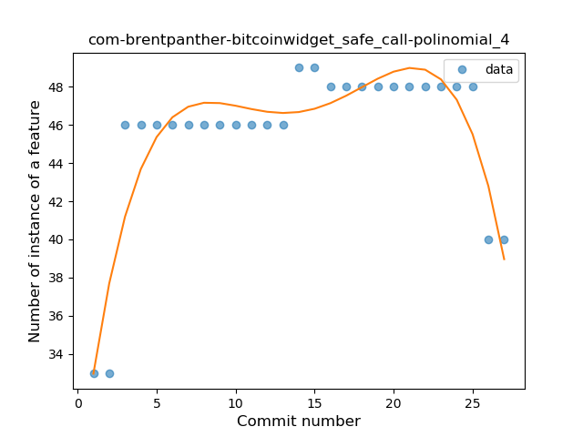

17. com-tomer-draw

	*  Function: 
	* R_Squared: 0.7437263
 

18. com-jkcarino-ankieditor

	*  Function: 
	* R_Squared: 0.71815929
 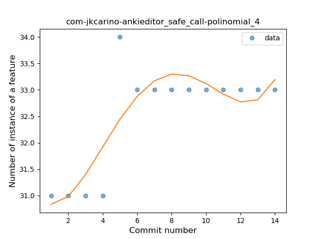

19. com-ahorcado

	*  Function: 
	* R_Squared: 0.66808807
 

20. me-impa-knockonports

	*  Function: 
	* R_Squared: 0.633582
 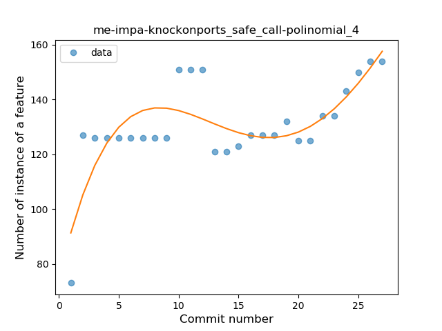

21. org-liberty-android-freeotpplus

	*  Function: 
	* R_Squared: 0.61111475
 

22. fr-rhaz-ipfs-sweet

	*  Function: 
	* R_Squared: 0.45186496
 

23. com-enjoyingfoss-om

	*  Function: 
	* R_Squared: 0.26591056
 

### <a name="T6">Sudden Rise Plateau</a> 
 ----

1. de-csicar-mensaplan

	*  Function: 
	* R_Squared: 0.92702045
 

2. moe-feng-nhentai

	*  Function: 
	* R_Squared: 0.91796526
 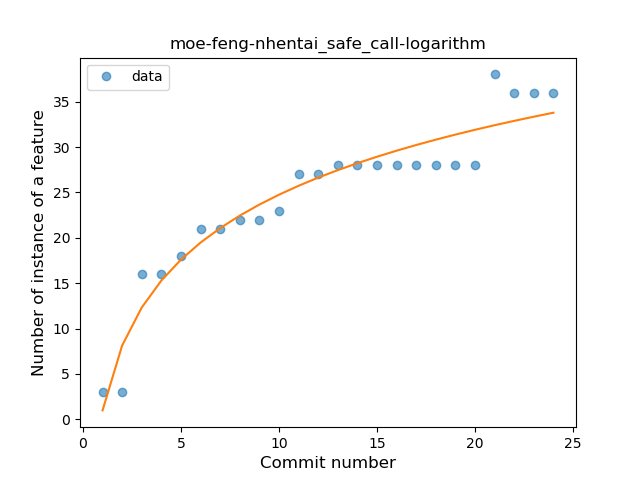

3. com-whiterabbit-pisabike

	*  Function: 
	* R_Squared: 0.90543143
 

4. com-ianhanniballake-localstorage

	*  Function: 
	* R_Squared: 0.88959438
 

5. org-weilbach-splitbills

	*  Function: 
	* R_Squared: 0.88807343
 

6. fr-insapp-insapp

	*  Function: 
	* R_Squared: 0.88378919
 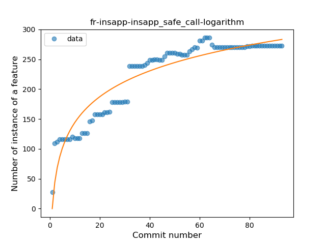

7. com-ianhanniballake-contractiontimer

	*  Function: 
	* R_Squared: 0.88055367
 

8. fr-xgouchet-packageexplorer

	*  Function: 
	* R_Squared: 0.87591369
 

9. org-ligi-ipfsdroid

	*  Function: 
	* R_Squared: 0.84956946
 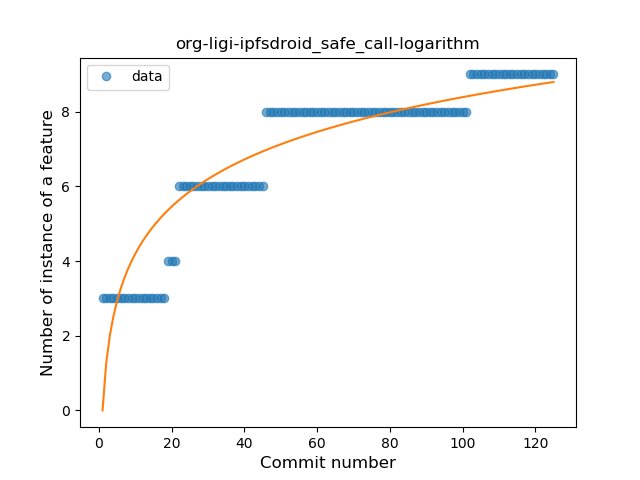

10. com-zacharee1-systemuituner

	*  Function: 
	* R_Squared: 0.83138471
 

11. com-directdev-portal

	*  Function: 
	* R_Squared: 0.81170368
 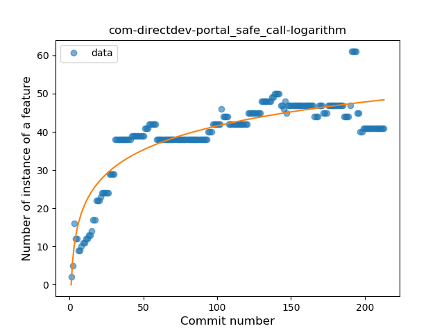

12. com-glodanif-bluetoothchat

	*  Function: 
	* R_Squared: 0.80309642
 

13. net-nurik-roman-muzei

	*  Function: 
	* R_Squared: 0.80268703
 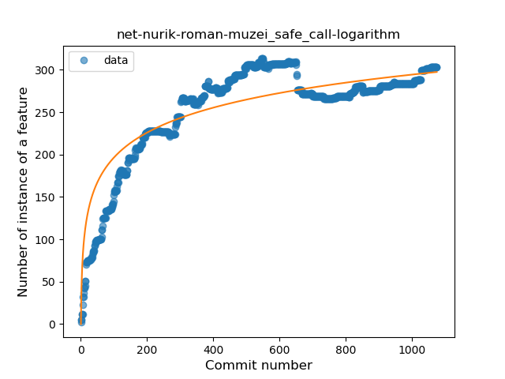

14. pl-org-seva-navigator

	*  Function: 
	* R_Squared: 0.79023169
 

15. com-etesync-syncadapter

	*  Function: 
	* R_Squared: 0.78961659
 

16. org-blitzortung-android-app

	*  Function: 
	* R_Squared: 0.78194707
 

17. info-papdt-express-helper

	*  Function: 
	* R_Squared: 0.76769739
 

18. com-libopenmw-openmw

	*  Function: 
	* R_Squared: 0.75107212
 

19. org-mcxa-vortaro

	*  Function: 
	* R_Squared: 0.71987214
 

20. me-blog-korn123-easydiary

	*  Function: 
	* R_Squared: 0.69160047
 

21. com-garpr-android

	*  Function: 
	* R_Squared: 0.676825
 

22. com-ofalvai-bpinfo

	*  Function: 
	* R_Squared: 0.66313435
 

23. me-echeung-moemoekyun-fdroid

	*  Function: 
	* R_Squared: 0.66138396
 

24. acr-browser-lightning

	*  Function: 
	* R_Squared: 0.65621476
 

25. pl-org-seva-texter

	*  Function: 
	* R_Squared: 0.6483758
 

26. net-syncthing-lite

	*  Function: 
	* R_Squared: 0.62750171
 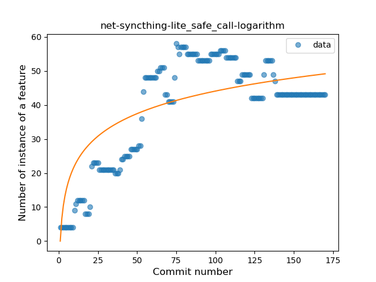

27. com-calintat-units

	*  Function: 
	* R_Squared: 0.59732605
 

28. org-ligi-survivalmanual

	*  Function: 
	* R_Squared: 0.59404083
 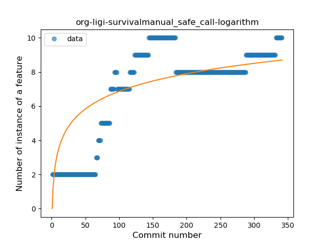

29. com-calintat-sensors

	*  Function: 
	* R_Squared: 0.58131562
 

30. org-pacien-tincapp

	*  Function: 
	* R_Squared: 0.56147861
 

31. com-jidogoon-roundedscreen

	*  Function: 
	* R_Squared: 0.4650082
 

32. at-bitfire-davdroid

	*  Function: 
	* R_Squared: 0.45951312
 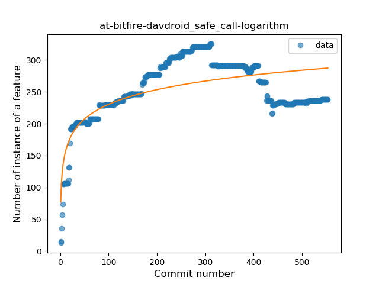

33. com-bubelov-coins

	*  Function: 
	* R_Squared: 0.43997216
 

34. com-eventyay-attendee

	*  Function: 
	* R_Squared: 0.32240547
 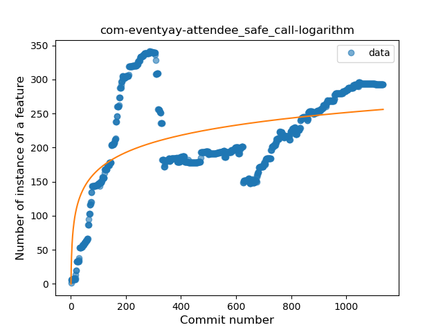

35. com-pennapps-labs-pennmobile

	*  Function: 
	* R_Squared: 0.28480416
 

36. io-github-deweyreed-clipboardcleaner

	*  Function: 
	* R_Squared: 0.16296909
 

37. cat-pantsu-nyaapantsu

	*  Function: 
	* R_Squared: 0.10832765
 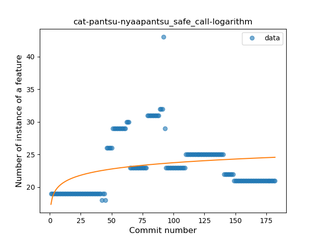

38. danbroid-searchview

	*  Function: 
	* R_Squared: 0.08586895
 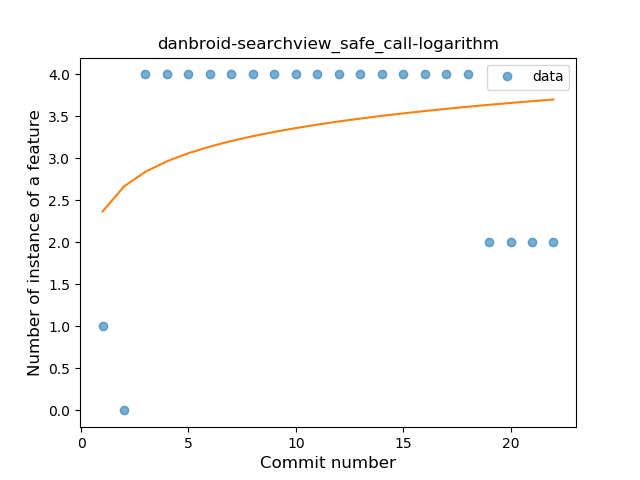

### <a name="T7">Plateau Gradual Rise</a> 
 ----

1. de-geeksfactory-opacclient

	*  Function: 
	* R_Squared: 0.98770677
 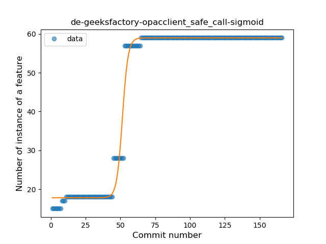

2. com-wabadaba-dziennik

	*  Function: 
	* R_Squared: 0.98752378
 

3. ca-rmen-android-poetassistant

	*  Function: 
	* R_Squared: 0.97642717
 

4. com-jmstudios-redmoon

	*  Function: 
	* R_Squared: 0.97514518
 

5. me-proxer-app

	*  Function: 
	* R_Squared: 0.97230181
 

6. com-github-quarck-calnotify

	*  Function: 
	* R_Squared: 0.96955443
 

7. com-fsck-k9

	*  Function: 
	* R_Squared: 0.96924098
 

8. com-dp-logcatapp

	*  Function: 
	* R_Squared: 0.96918915
 

9. com-rhm-pwn

	*  Function: 
	* R_Squared: 0.96095783
 

10. me-barta-stayintouch

	*  Function: 
	* R_Squared: 0.95665104
 

11. pl-temomuko-autostoprace

	*  Function: 
	* R_Squared: 0.95544526
 

12. com-stevenschoen-putionew

	*  Function: 
	* R_Squared: 0.94582186
 

13. com-dozingcatsoftware-vectorcamera

	*  Function: 
	* R_Squared: 0.92882554
 

14. de-thecode-lmd

	*  Function: 
	* R_Squared: 0.92604853
 

15. com-simplemobiletools-musicplayer

	*  Function: 
	* R_Squared: 0.91972715
 

16. org-kaqui

	*  Function: 
	* R_Squared: 0.91742487
 

17. com-github-premnirmal-tickerwidget

	*  Function: 
	* R_Squared: 0.91657002
 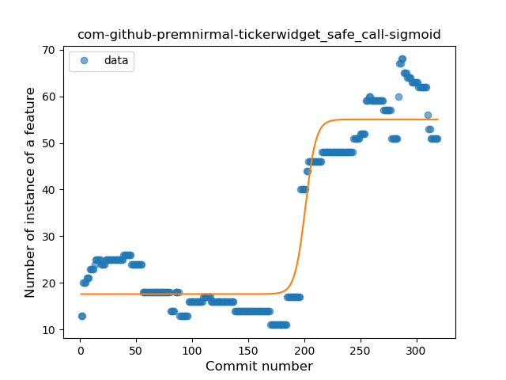

18. pt-joaomneto-titancompanion

	*  Function: 
	* R_Squared: 0.89844481
 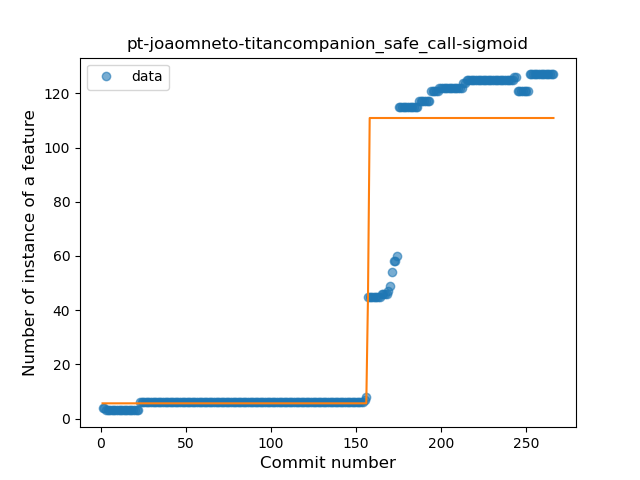

19. horse-amazin-my-stratum0-statuswidget

	*  Function: 
	* R_Squared: 0.89492329
 

20. com-scientists-happy-botanist

	*  Function: 
	* R_Squared: 0.87211116
 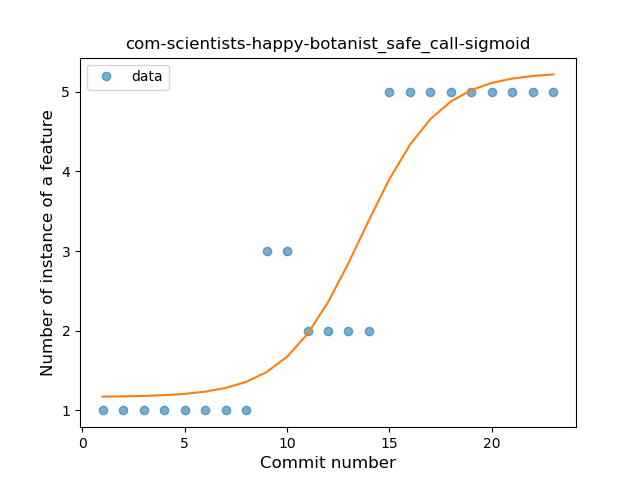

21. com-conorodonnell-bus

	*  Function: 
	* R_Squared: 0.86903699
 

23. org-poul-bits-android

	*  Function: 
	* R_Squared: 0.80360741
 

24. me-kirimin-mitsumine

	*  Function: 
	* R_Squared: 0.80296988
 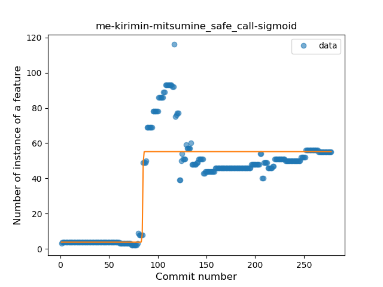

25. jp-takke-cpustats

	*  Function: 
	* R_Squared: 0.80143246
 

26. com-adityakamble49-ttl

	*  Function: 
	* R_Squared: 0.7958883
 

27. com-gimranov-zandy-app

	*  Function: 
	* R_Squared: 0.79142078
 

28. tk-superl2-xwifi

	*  Function: 
	* R_Squared: 0.78485891
 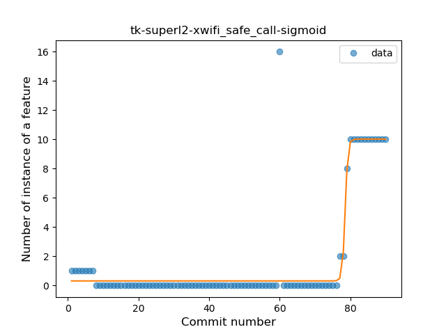

29. com-pyamsoft-homebutton

	*  Function: 
	* R_Squared: 0.73789277
 

30. nightlock-peppercarrot

	*  Function: 
	* R_Squared: 0.55322278
 

31. org-mosad-seil0-projectlaogai

	*  Function: 
	* R_Squared: 0.47916666
 

32. org-kiwix-kiwixcustomwikivoyageeurope

	*  Function: 
	* R_Squared: 0.45600453
 

33. eu-the4thfloor-msync

	*  Function: 
	* R_Squared: 0.33780934
 

34. com-atanana-sicounter

	*  Function: 
	* R_Squared: 0.1772252
 

### <a name="T9">Plateau Sudden Rise</a> 
 ----

1. at-ac-tuwien-caa-docscan

	*  Function: 
	* R_Squared: 1.0
 

2. com-BibleQuote

	*  Function: 
	* R_Squared: 1.0
 

3. com-heed-justquotes

	*  Function: 
	* R_Squared: 1.0
 

4. com-james-status

	*  Function: 
	* R_Squared: 1.0
 

5. com-systemallica-valenbisi

	*  Function: 
	* R_Squared: 1.0
 

7. de-spiritcroc-darkcroc-substratum

	*  Function: 
	* R_Squared: 1.0
 

9. fr-corenting-edcompanion

	*  Function: 
	* R_Squared: 1.0
 

10. io-github-hidroh-materialistic

	*  Function: 
	* R_Squared: 1.0
 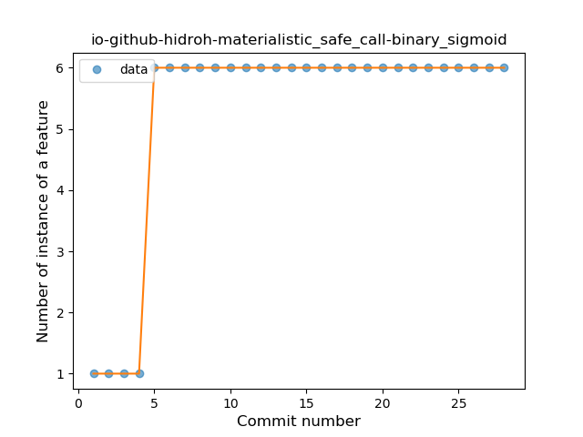

11. io-github-umren-watcher

	*  Function: 
	* R_Squared: 1.0
 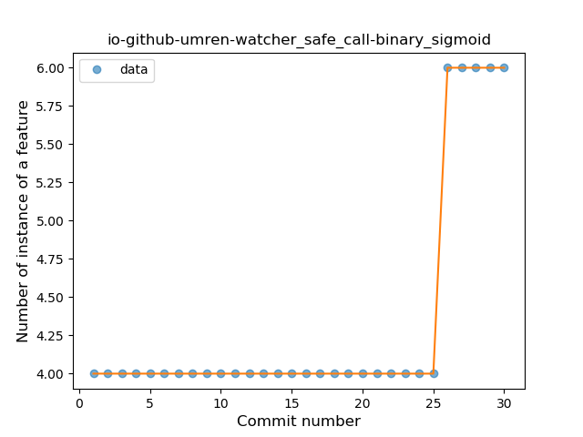

12. io-github-z3r0c00l

	*  Function: 
	* R_Squared: 1.0
 

13. net-codechunk-speedofsound

	*  Function: 
	* R_Squared: 1.0
 

14. org-decsync-sparss-floss

	*  Function: 
	* R_Squared: 1.0
 

16. streetwalrus-usbmountr

	*  Function: 
	* R_Squared: 1.0
 

17. com-simplemobiletools-flashlight

	*  Function: 
	* R_Squared: 0.96980251
 

18. com-pitchedapps-frost

	*  Function: 
	* R_Squared: 0.88447636
 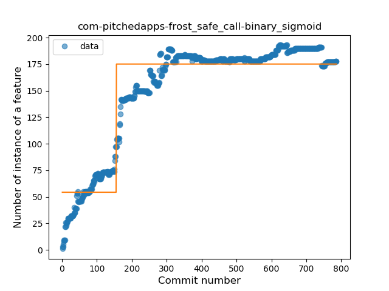

20. uk-co-richyhbm-monochromatic

	*  Function: 
	* R_Squared: 0.86826386
 

23. com-guerinet-mymartlet

	*  Function: 
	* R_Squared: 0.81100119
 

24. com-simplemobiletools-applauncher

	*  Function: 
	* R_Squared: 0.79482451
 

25. com-sduduzog-slimlauncher

	*  Function: 
	* R_Squared: 0.57090066
 

27. ml-adamsprogs-bimba

	*  Function: 
	* R_Squared: 0.24790931
 

29. net-nonylene-photolinkviewer

	*  Function: 
	* R_Squared: 0.06894885
 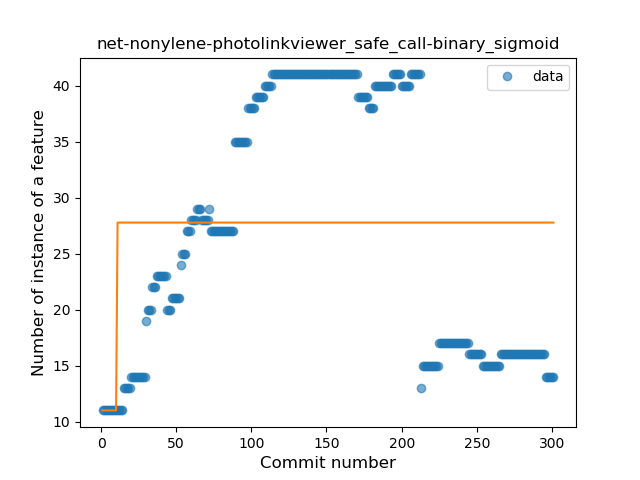

### <a name="T10">Plateau Sudden Decline</a> 
 ----

6. com-wilderpereira-lmgtfygen

	*  Function: 
	* R_Squared: 1.0
 

8. es-danirod-rectball-android

	*  Function: 
	* R_Squared: 1.0
 

15. org-ligi-materialteatimer

	*  Function: 
	* R_Squared: 1.0
 

19. de-micmun-android-deufeitage

	*  Function: 
	* R_Squared: 0.87033324
 

21. me-camsteffen-polite

	*  Function: 
	* R_Squared: 0.85354955
 

22. com-tutpro-baresip

	*  Function: 
	* R_Squared: 0.83933166
 

26. org-sanpra-checklist

	*  Function: 
	* R_Squared: 0.48443745
 

28. info-dvkr-screenstream

	*  Function: 
	* R_Squared: 0.16481342
 

30. eu-depau-etchdroid

	*  Function: 
	* R_Squared: 0.05714501
 

### <a name="T5">Sudden Decline</a> 
 ----

1. io-mkg20001-arubanetworkslogin

	*  Function: 
	* R_Squared: 1.0
 

62. com-benny-openlauncher

	*  Function: 
	* R_Squared: 0.58937966
 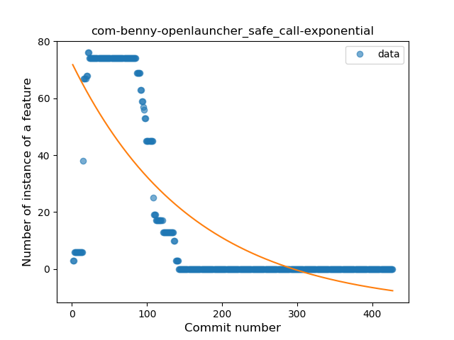

64. rectangledbmi-com-pittsburghrealtimetracker

	*  Function: 
	* R_Squared: 0.48686707
 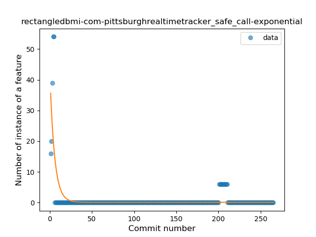

### <a name="T2">Constant Decline</a> 
 ----

95. jp-cordea-mackerelclient

	*  Function: 
	* R_Squared: 0.49487951
 

96. me-rei_m-hyakuninisshu

	*  Function: 
	* R_Squared: 0.04989035
 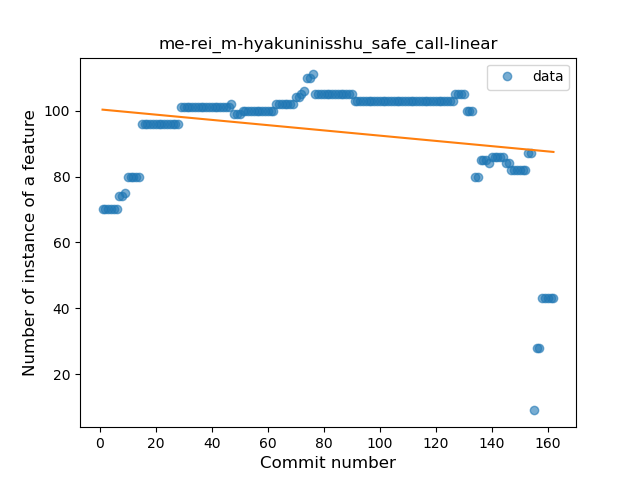

### <a name="T8">Plateau Gradual Decline</a> 
 ----

22. com-ids1024-whitakerswords

	*  Function: 
	* R_Squared: 0.80401537
 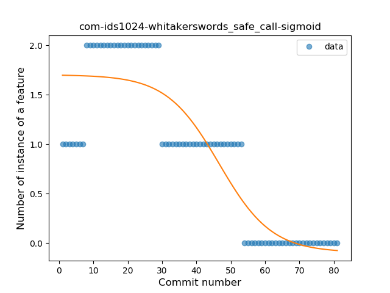

### <a name="T3">Stability</a> 
 ----

