## Sealed Class
----
**Best fit = Plateau Sudden Rise**: 26

Function | N# best fit
----|----
<a href=" #T9">Plateau Sudden Rise</a> | 26
<a href=" #T4">Sudden Rise</a> | 10
<a href=" #T7">Plateau Gradual Rise</a> | 7
<a href=" #T1">Constant Rise</a> | 6
<a href=" #T6">Sudden Rise Plateau</a> | 5
<a href=" #T11">Instability</a> | 4
<a href=" #T2">Constant Decline</a> | 3
<a href=" #T10">Plateau Sudden Decline</a> | 3
<a href=" #T5">Sudden Decline</a> | 1
<a href=" #T3">Stability</a> | 0
<a href=" #T8">Plateau Gradual Decline</a> | 0

### <a name="T9">Plateau Sudden Rise</a> 
 ----

1. app-opass-ccip

	*  Function: 
	* R_Squared: 1.0
 

2. com-bracketcove-postrainer

	*  Function: 
	* R_Squared: 1.0
 

3. com-cookiegames-smartcookie

	*  Function: 
	* R_Squared: 1.0
 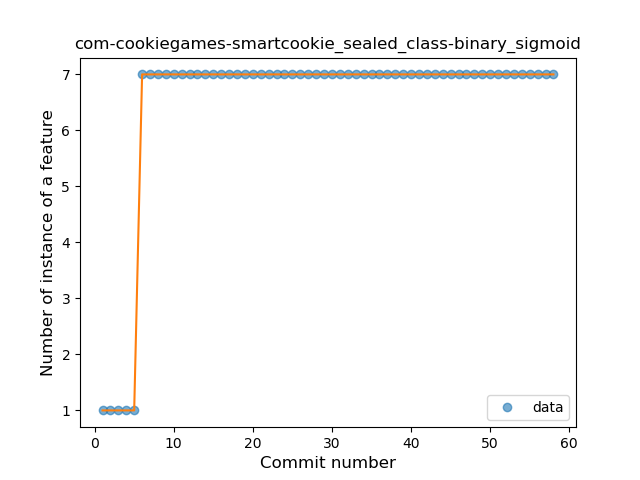

4. com-github-premnirmal-tickerwidget

	*  Function: 
	* R_Squared: 1.0
 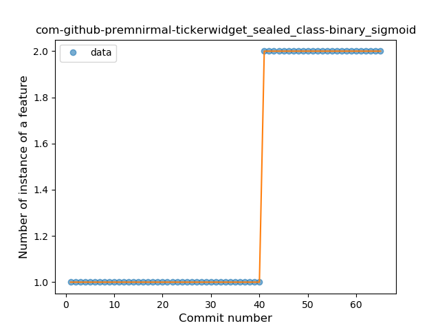

5. com-keylesspalace-tusky

	*  Function: 
	* R_Squared: 1.0
 

6. com-ofalvai-bpinfo

	*  Function: 
	* R_Squared: 1.0
 

7. com-peterlaurence-trekme

	*  Function: 
	* R_Squared: 1.0
 

8. com-stevenschoen-putionew

	*  Function: 
	* R_Squared: 1.0
 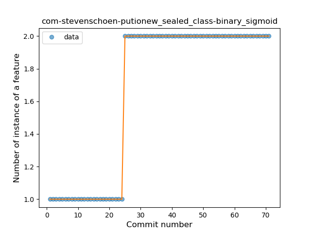

9. com-tasomaniac-openwith-floss

	*  Function: 
	* R_Squared: 1.0
 

11. de-avpptr-umweltzone

	*  Function: 
	* R_Squared: 1.0
 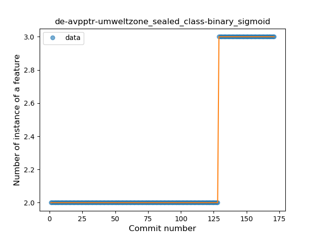

12. de-csicar-mensaplan

	*  Function: 
	* R_Squared: 1.0
 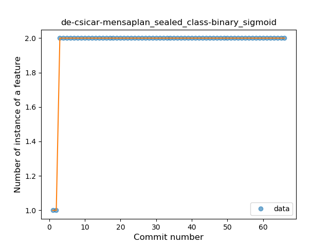

14. me-camsteffen-polite

	*  Function: 
	* R_Squared: 1.0
 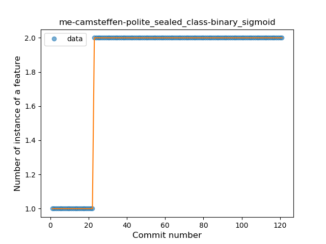

16. one-librem-social

	*  Function: 
	* R_Squared: 1.0
 

17. org-moire-ultrasonic

	*  Function: 
	* R_Squared: 1.0
 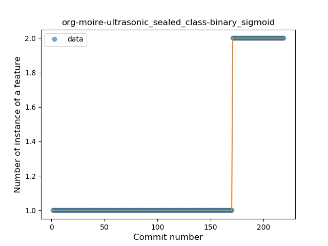

18. org-mozilla-focus

	*  Function: 
	* R_Squared: 1.0
 

19. org-mozilla-klar

	*  Function: 
	* R_Squared: 1.0
 

20. org-zimmob-zimlx

	*  Function: 
	* R_Squared: 1.0
 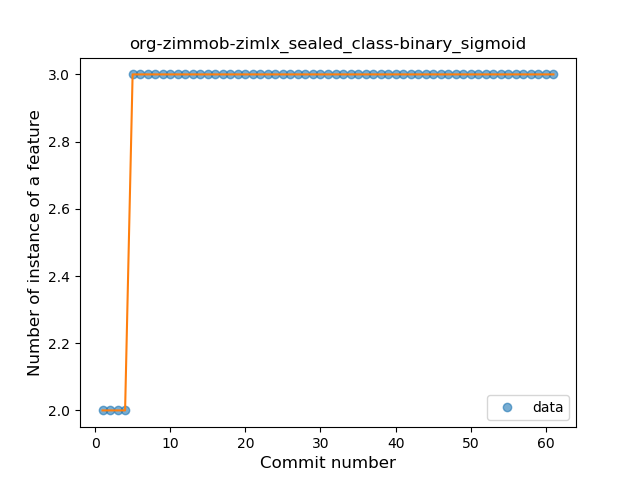

21. se-barsk-park

	*  Function: 
	* R_Squared: 1.0
 

22. com-jereksel-libresubstratum

	*  Function: 
	* R_Squared: 0.99044924
 

23. nl-brouwerijdemolen-borefts2013

	*  Function: 
	* R_Squared: 0.94711918
 

24. ch-deletescape-lawnchair-plah

	*  Function: 
	* R_Squared: 0.92301583
 

25. net-nurik-roman-muzei

	*  Function: 
	* R_Squared: 0.88738772
 

26. fr-chenry-android-freshrss

	*  Function: 
	* R_Squared: 0.86060055
 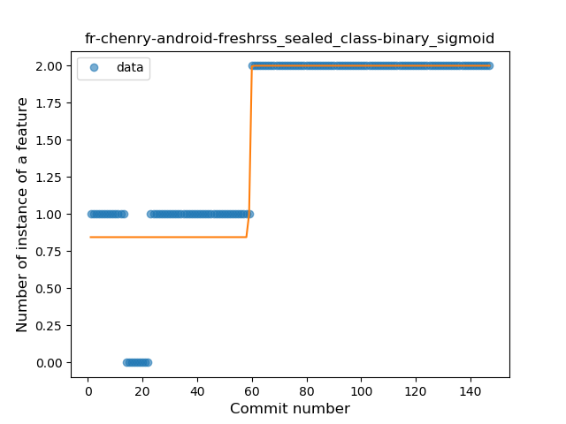

27. ca-josephroque-bowlingcompanion

	*  Function: 
	* R_Squared: 0.66022753
 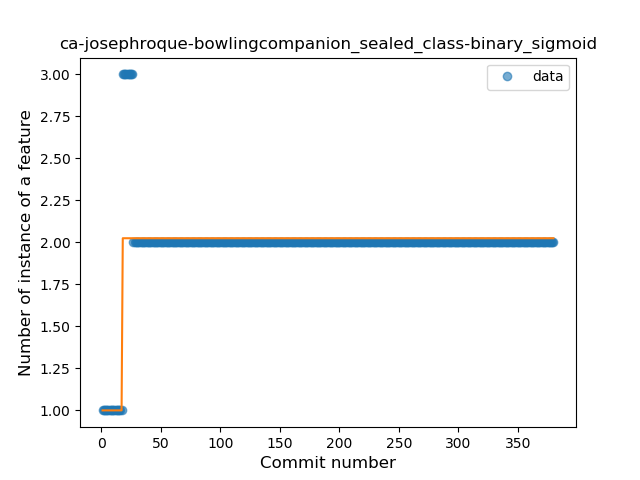

28. li-klass-fhem

	*  Function: 
	* R_Squared: 0.47866685
 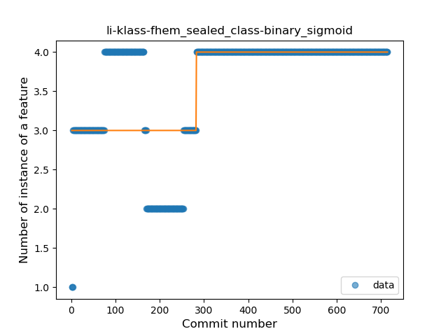

29. com-bubelov-coins

	*  Function: 
	* R_Squared: 0.3706965
 

### <a name="T4">Sudden Rise</a> 
 ----

1. io-ipoli-android

	*  Function: 
	* R_Squared: 0.9685406
 

2. tech-ula

	*  Function: 
	* R_Squared: 0.92613691
 

3. com-fsck-k9

	*  Function: 
	* R_Squared: 0.92003068
 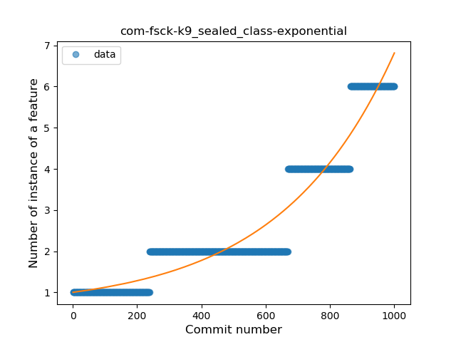

4. de-ph1b-audiobook

	*  Function: 
	* R_Squared: 0.91080961
 

5. eu-kanade-tachiyomi

	*  Function: 
	* R_Squared: 0.90272105
 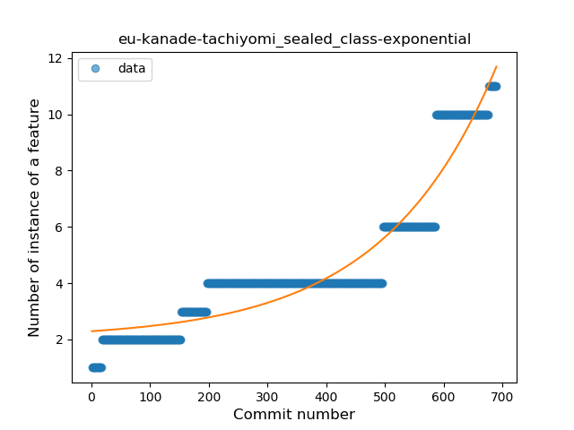

6. com-orgzly

	*  Function: 
	* R_Squared: 0.8075323
 

7. de-westnordost-streetcomplete

	*  Function: 
	* R_Squared: 0.78181534
 

8. com-moez-QKSMS

	*  Function: 
	* R_Squared: 0.6318707
 

9. org-blokada-alarm

	*  Function: 
	* R_Squared: 0.5301215
 

10. info-dvkr-screenstream

	*  Function: 
	* R_Squared: 0.46398996
 

### <a name="T7">Plateau Gradual Rise</a> 
 ----

1. org-mozilla-rocket

	*  Function: 
	* R_Squared: 0.98759582
 

2. chat-rocket-android

	*  Function: 
	* R_Squared: 0.98081089
 

3. com-benoitquenaudon-tvfoot-red

	*  Function: 
	* R_Squared: 0.97717652
 

4. acr-browser-lightning

	*  Function: 
	* R_Squared: 0.96754037
 

5. com-boardgamegeek

	*  Function: 
	* R_Squared: 0.94682931
 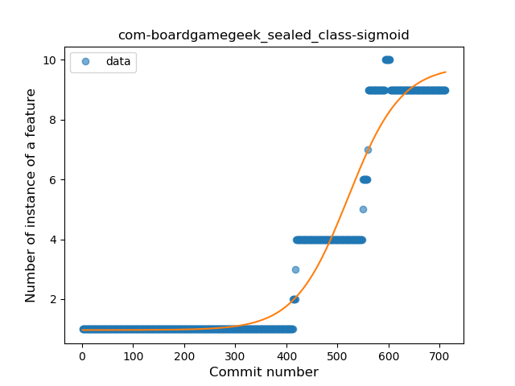

6. net-syncthing-lite

	*  Function: 
	* R_Squared: 0.94513628
 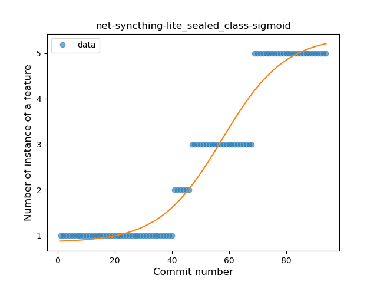

7. com-benoitletondor-easybudgetapp

	*  Function: 
	* R_Squared: 0.91244487
 

### <a name="T1">Constant Rise</a> 
 ----

1. com-duckduckgo-mobile-android

	*  Function: 
	* R_Squared: 0.94903958
 

2. com-lavadip-miniVector

	*  Function: 
	* R_Squared: 0.8979839
 

3. im-vector-alpha

	*  Function: 
	* R_Squared: 0.89229208
 

4. be-mygod-vpnhotspot

	*  Function: 
	* R_Squared: 0.88709667
 

5. fi-kroon-vadret

	*  Function: 
	* R_Squared: 0.85904398
 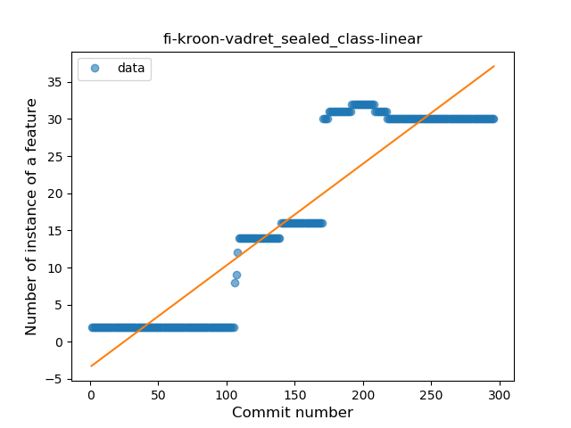

6. org-kaqui

	*  Function: 
	* R_Squared: 0.80812176
 

### <a name="T6">Sudden Rise Plateau</a> 
 ----

1. it-diab

	*  Function: 
	* R_Squared: 0.84392983
 

2. com-arcao-geocaching4locus

	*  Function: 
	* R_Squared: 0.83316506
 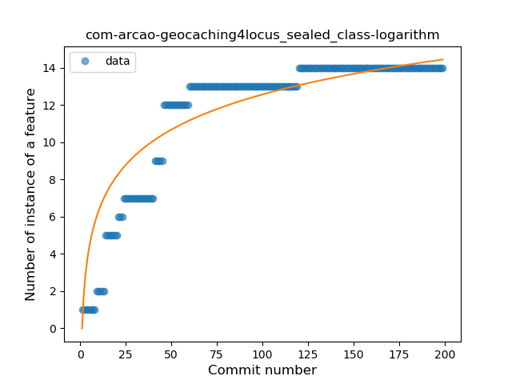

3. de-r4md4c-gamedealz

	*  Function: 
	* R_Squared: 0.70601727
 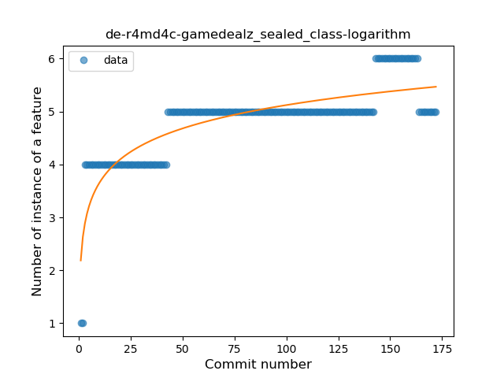

4. org-kiwix-kiwixcustomwikivoyageeurope

	*  Function: 
	* R_Squared: 0.36870292
 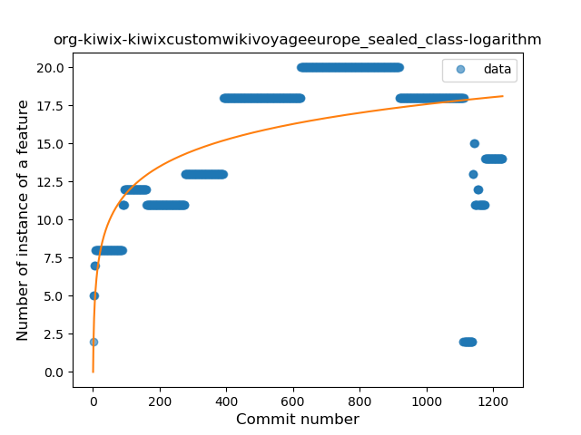

5. com-loloof64-android-basicchessendgamestrainer

	*  Function: 
	* R_Squared: 0.18097581
 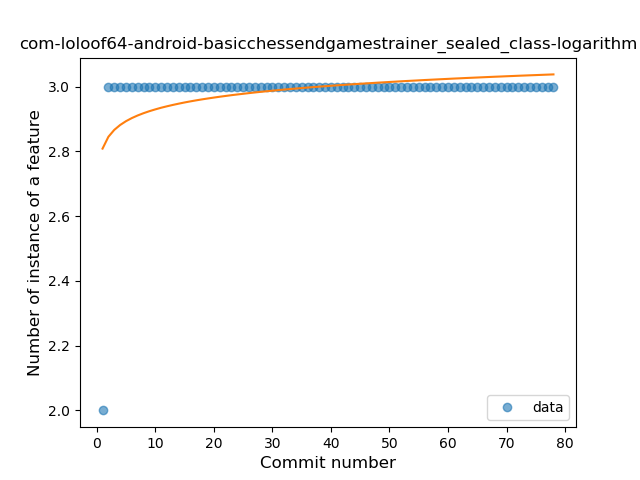

### <a name="T11">Instability</a> 
 ----

1. jp-cordea-mackerelclient

	*  Function: 
	* R_Squared: 0.94834881
 

2. com-physphil-android-unitconverterultimate

	*  Function: 
	* R_Squared: 0.83823529
 

### <a name="T2">Constant Decline</a> 
 ----

7. com-bernaferrari-changedetection

	*  Function: 
	* R_Squared: 0.26128996
 

8. sk-styk-martin-apkanalyzer

	*  Function: 
	* R_Squared: 0.04191101
 

9. fr-xgouchet-packageexplorer

	*  Function: 
	* R_Squared: 0.0
 

### <a name="T10">Plateau Sudden Decline</a> 
 ----

10. com-yubico-yubioath

	*  Function: 
	* R_Squared: 1.0
 

13. eu-the4thfloor-msync

	*  Function: 
	* R_Squared: 1.0
 

15. net-stew-stew

	*  Function: 
	* R_Squared: 1.0
 

### <a name="T5">Sudden Decline</a> 
 ----

11. me-proxer-app

	*  Function: 
	* R_Squared: 0.1254801
 

### <a name="T3">Stability</a> 
 ----

### <a name="T8">Plateau Gradual Decline</a> 
 ----

