## Singleton
----
**Best fit = Plateau Gradual Rise**: 51

Function | N# best fit
----|----
<a href=" #T7">Plateau Gradual Rise</a> | 51
<a href=" #T4">Sudden Rise</a> | 36
<a href=" #T1">Constant Rise</a> | 33
<a href=" #T9">Plateau Sudden Rise</a> | 29
<a href=" #T6">Sudden Rise Plateau</a> | 25
<a href=" #T10">Plateau Sudden Decline</a> | 24
<a href=" #T11">Instability</a> | 13
<a href=" #T5">Sudden Decline</a> | 7
<a href=" #T2">Constant Decline</a> | 6
<a href=" #T8">Plateau Gradual Decline</a> | 3
<a href=" #T3">Stability</a> | 0

### <a name="T7">Plateau Gradual Rise</a> 
 ----

1. com-thanksmister-iot-mqtt-alarmpanel

	*  Function: 
	* R_Squared: 1.0
 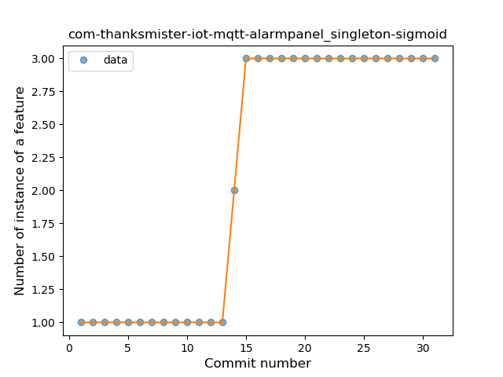

2. com-cookiegames-smartcookie

	*  Function: 
	* R_Squared: 0.99768265
 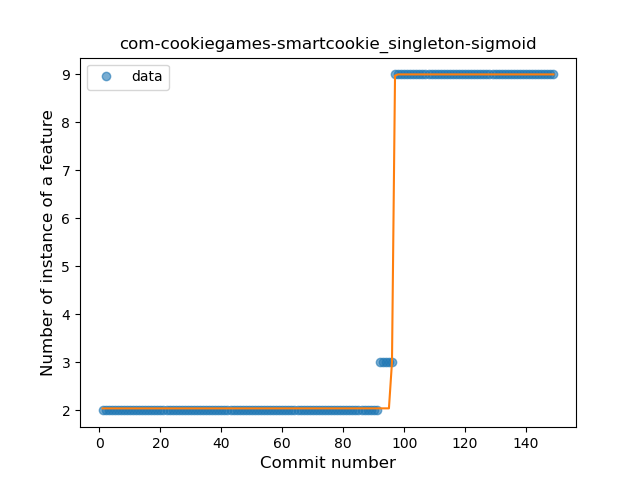

3. com-pixplicity-cryptogram

	*  Function: 
	* R_Squared: 0.9926209
 

4. org-mariotaku-twidere

	*  Function: 
	* R_Squared: 0.98885655
 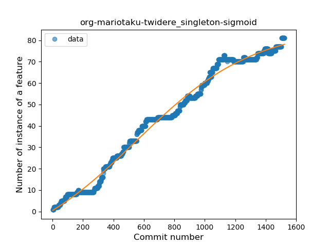

5. tech-ula

	*  Function: 
	* R_Squared: 0.98341166
 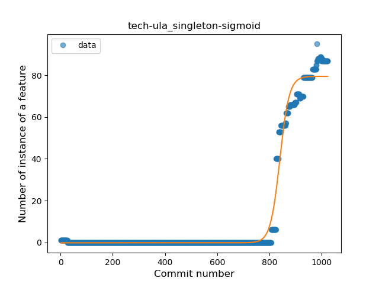

6. cz-dvratil-fbeventsync

	*  Function: 
	* R_Squared: 0.98041089
 

7. com-gimranov-zandy-app

	*  Function: 
	* R_Squared: 0.97965386
 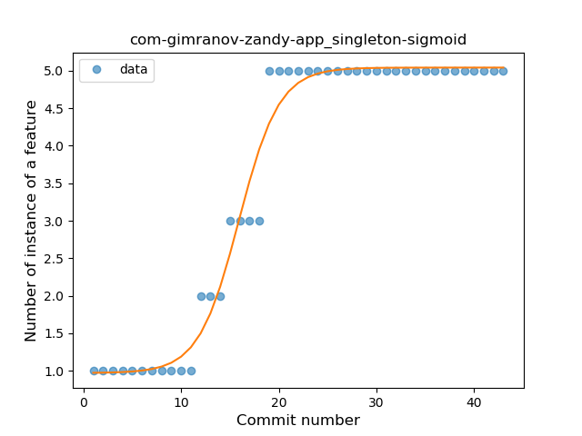

8. de-markusfisch-android-binaryeye

	*  Function: 
	* R_Squared: 0.97946328
 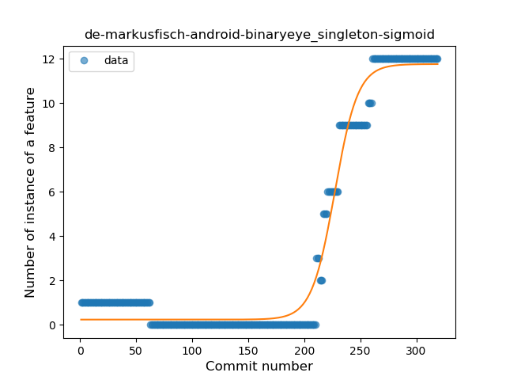

9. com-loloof64-android-basicchessendgamestrainer

	*  Function: 
	* R_Squared: 0.97883822
 

10. com-breadwallet

	*  Function: 
	* R_Squared: 0.9726953
 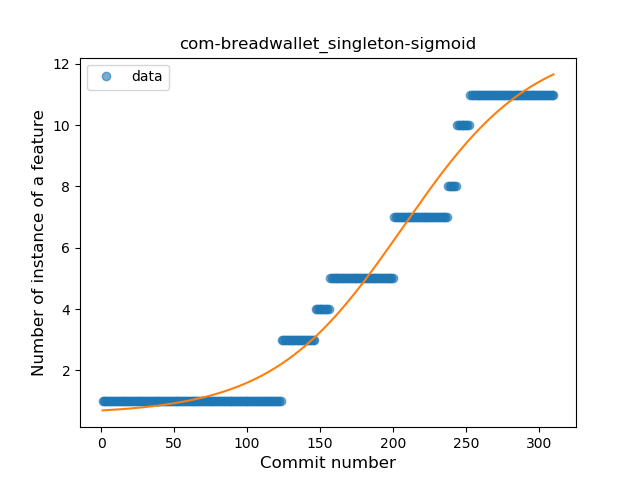

11. com-ofalvai-bpinfo

	*  Function: 
	* R_Squared: 0.97074455
 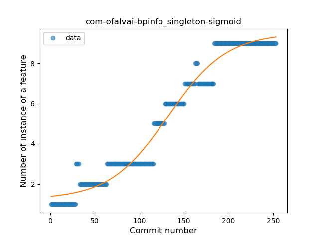

12. me-murks-feedwatcher

	*  Function: 
	* R_Squared: 0.96884547
 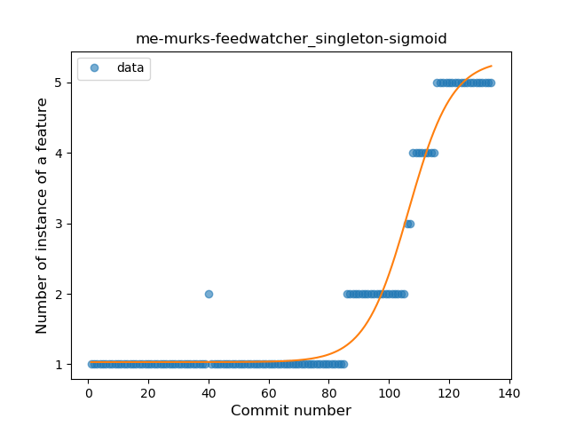

13. com-esafirm-androidplayground

	*  Function: 
	* R_Squared: 0.96756798
 

14. com-jmstudios-redmoon

	*  Function: 
	* R_Squared: 0.9665725
 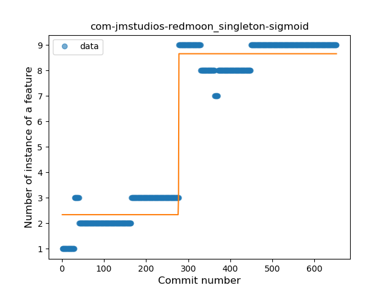

15. com-nononsenseapps-feeder

	*  Function: 
	* R_Squared: 0.95385564
 

16. de-Maxr1998-xposed-maxlock

	*  Function: 
	* R_Squared: 0.95098158
 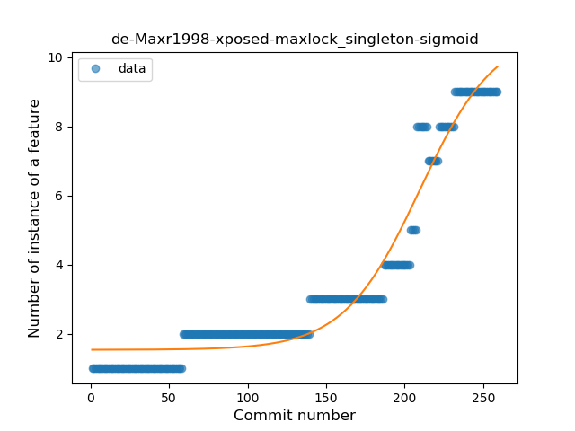

17. me-impa-knockonports

	*  Function: 
	* R_Squared: 0.94561898
 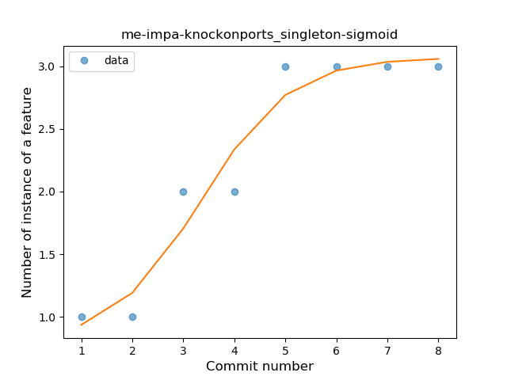

19. com-fastaccess-github-libre

	*  Function: 
	* R_Squared: 0.94231992
 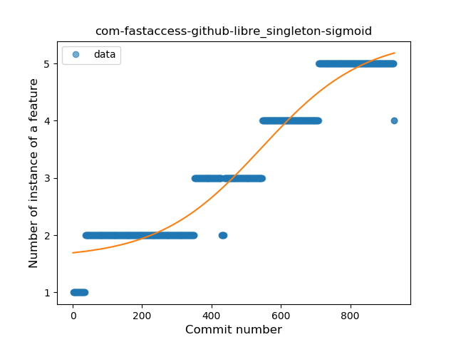

20. net-mm2d-android-vmb

	*  Function: 
	* R_Squared: 0.93985767
 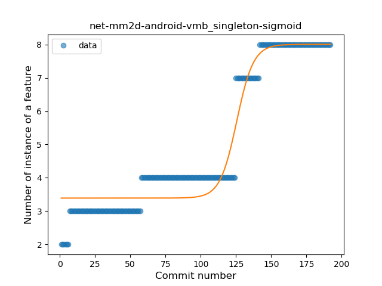

21. org-poul-bits-android

	*  Function: 
	* R_Squared: 0.93619634
 

22. com-phicdy-totoanticipation

	*  Function: 
	* R_Squared: 0.93127979
 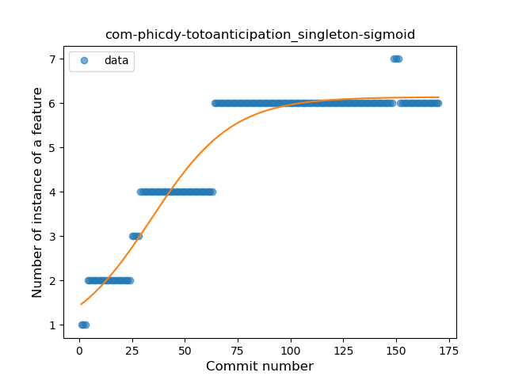

23. org-isoron-uhabits

	*  Function: 
	* R_Squared: 0.93093083
 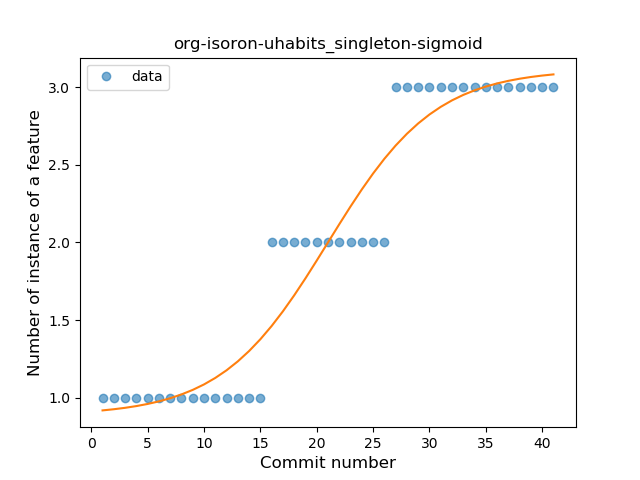

24. com-fallgamlet-dnestrcinema

	*  Function: 
	* R_Squared: 0.93056246
 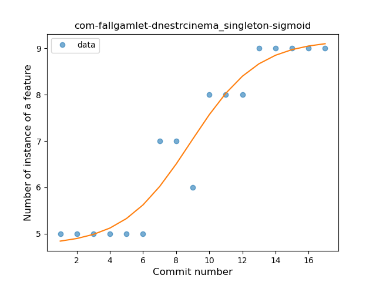

25. cat-pantsu-nyaapantsu

	*  Function: 
	* R_Squared: 0.92380805
 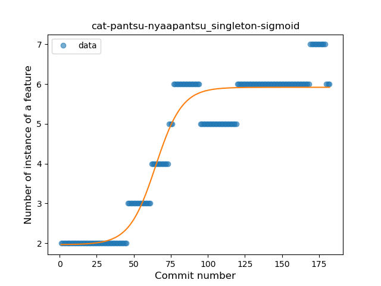

26. es-usc-citius-servando-calendula

	*  Function: 
	* R_Squared: 0.92185699
 

27. com-tutpro-baresip

	*  Function: 
	* R_Squared: 0.91591762
 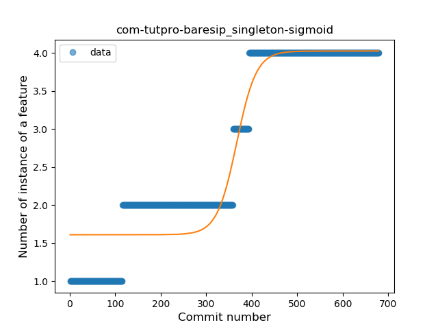

28. info-dvkr-screenstream

	*  Function: 
	* R_Squared: 0.91200675
 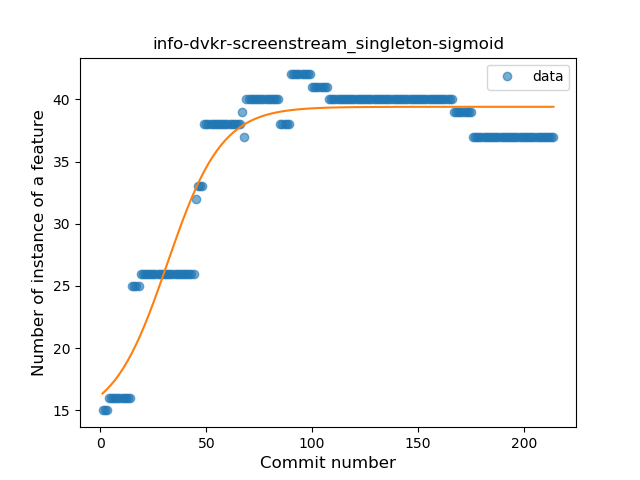

29. app-simone

	*  Function: 
	* R_Squared: 0.90670086
 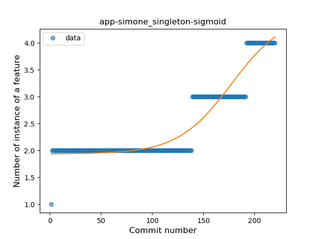

30. pw-janyo-janyoshare

	*  Function: 
	* R_Squared: 0.90613039
 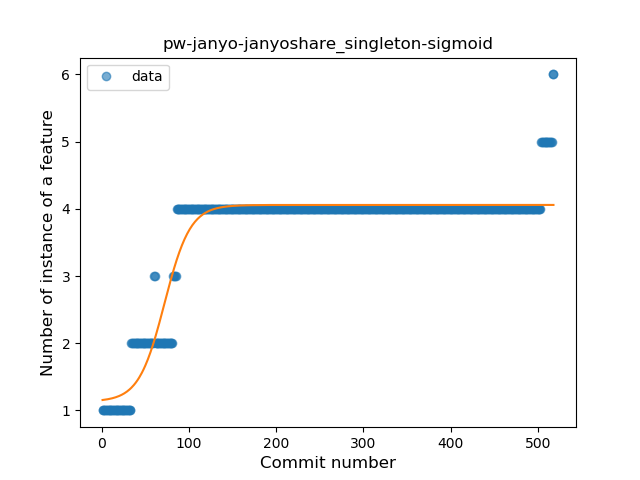

31. science-apolline

	*  Function: 
	* R_Squared: 0.90602644
 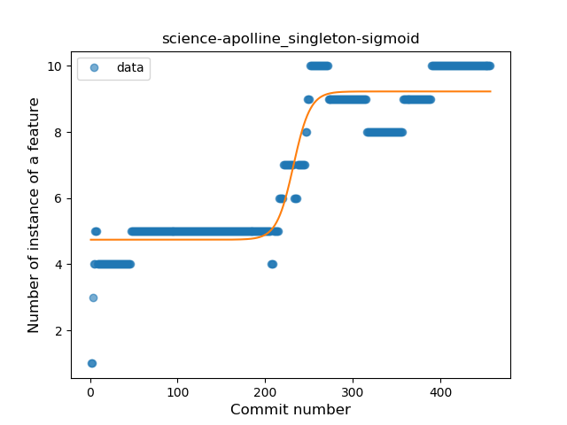

32. com-tasomaniac-openwith-floss

	*  Function: 
	* R_Squared: 0.90279279
 

33. me-anon-grow

	*  Function: 
	* R_Squared: 0.90010974
 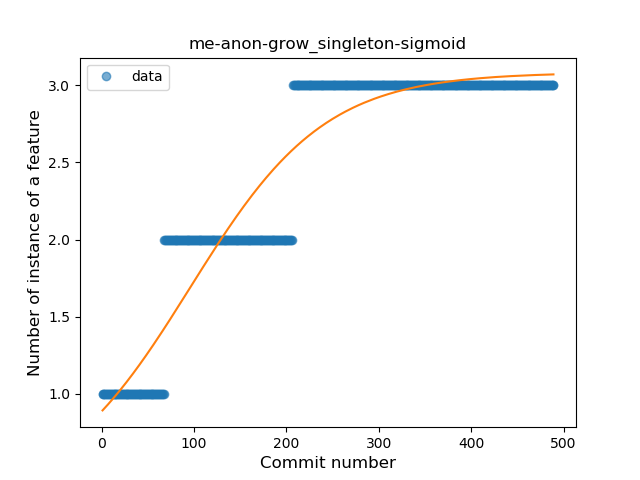

34. com-guerinet-mymartlet

	*  Function: 
	* R_Squared: 0.89623676
 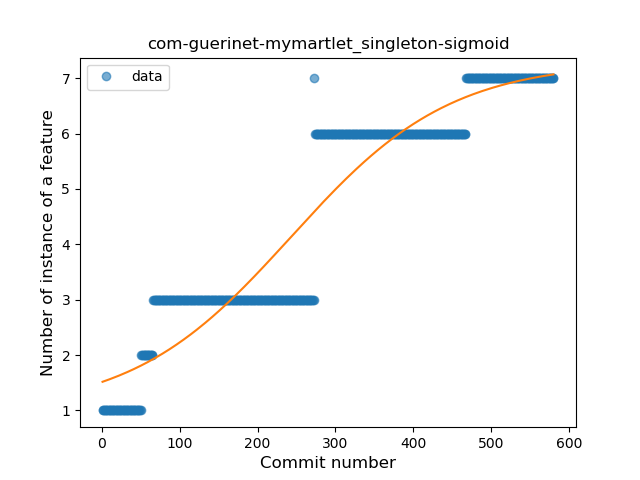

35. org-fossasia-badgemagic

	*  Function: 
	* R_Squared: 0.89302719
 

36. de-ironjan-mensaupb

	*  Function: 
	* R_Squared: 0.89267492
 

37. com-github-premnirmal-tickerwidget

	*  Function: 
	* R_Squared: 0.88712915
 

38. com-jim-sharetocomputer

	*  Function: 
	* R_Squared: 0.88553633
 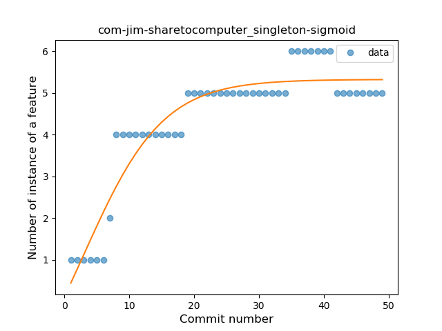

40. com-calintat-units

	*  Function: 
	* R_Squared: 0.86363969
 

41. nl-mpcjanssen-simpletask

	*  Function: 
	* R_Squared: 0.86205694
 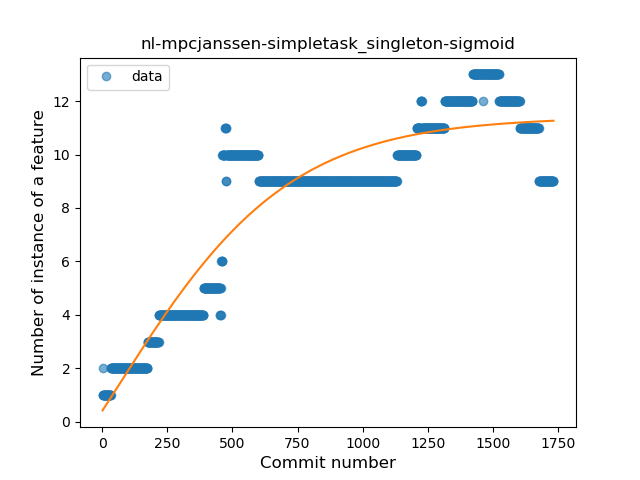

42. com-pitchedapps-frost

	*  Function: 
	* R_Squared: 0.86190119
 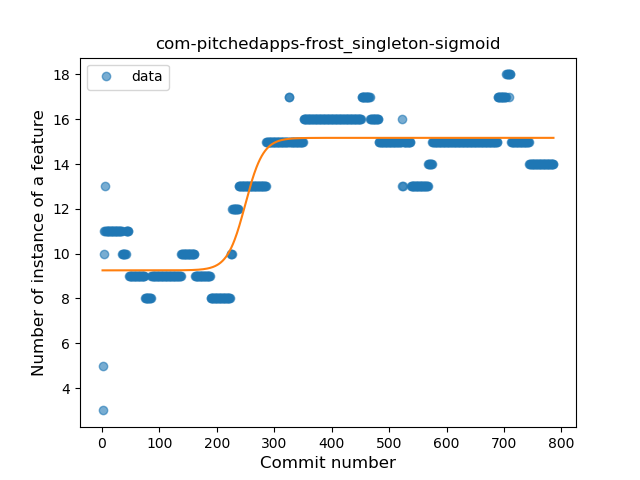

43. ca-rmen-android-poetassistant

	*  Function: 
	* R_Squared: 0.85386174
 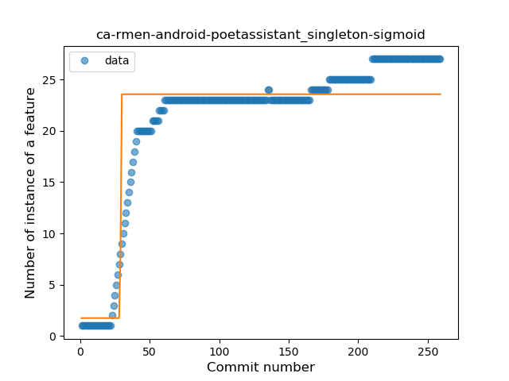

44. pl-hypeapp-episodie

	*  Function: 
	* R_Squared: 0.83716097
 

45. pl-temomuko-autostoprace

	*  Function: 
	* R_Squared: 0.76267265
 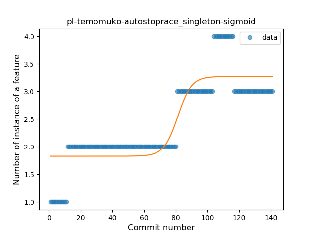

46. com-dozingcatsoftware-vectorcamera

	*  Function: 
	* R_Squared: 0.74392478
 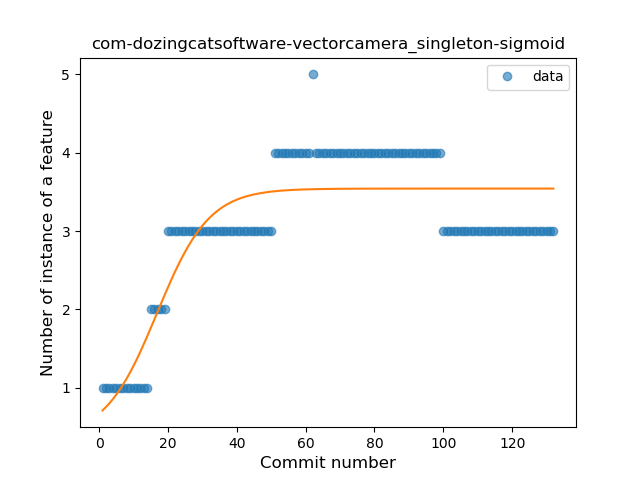

47. horse-amazin-my-stratum0-statuswidget

	*  Function: 
	* R_Squared: 0.70351378
 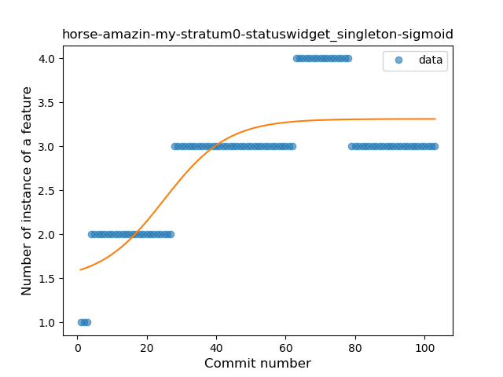

48. com-mgaetan89-showsrage

	*  Function: 
	* R_Squared: 0.61395832
 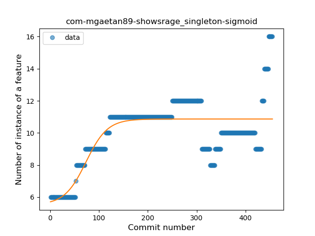

50. com-moez-QKSMS

	*  Function: 
	* R_Squared: 0.52140008
 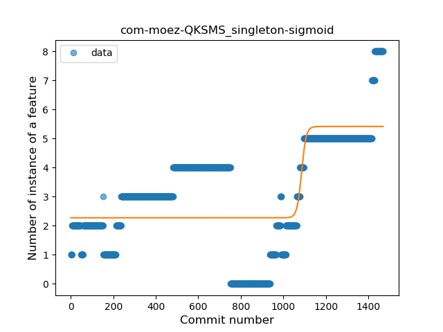

51. org-ligi-passandroid

	*  Function: 
	* R_Squared: 0.48994346
 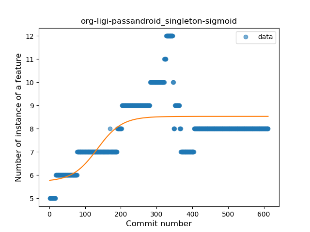

52. com-njlabs-showjava

	*  Function: 
	* R_Squared: 0.42329687
 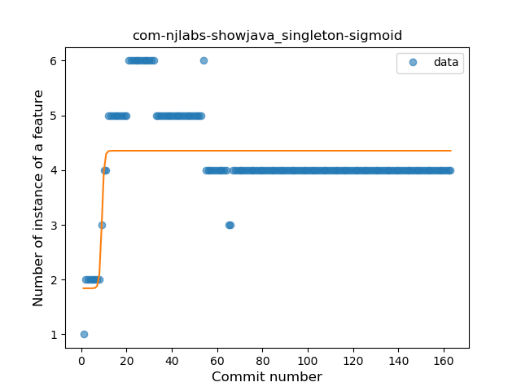

53. org-ligi-survivalmanual

	*  Function: 
	* R_Squared: 0.27755938
 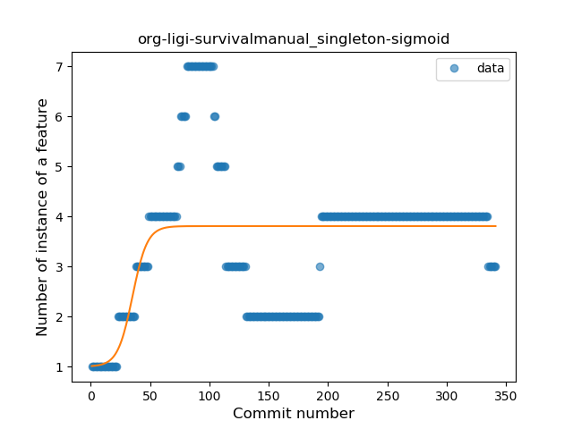

54. pl-org-seva-texter

	*  Function: 
	* R_Squared: 0.2074525
 

### <a name="T4">Sudden Rise</a> 
 ----

3. ca-josephroque-bowlingcompanion

	*  Function: 
	* R_Squared: 0.970378
 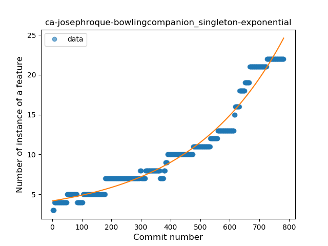

4. com-eventyay-attendee

	*  Function: 
	* R_Squared: 0.96870235
 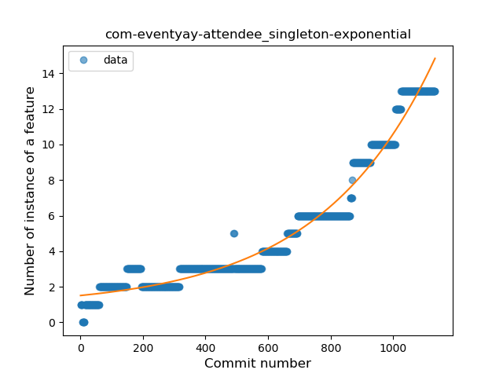

5. be-mygod-vpnhotspot

	*  Function: 
	* R_Squared: 0.95956079
 

6. io-ipoli-android

	*  Function: 
	* R_Squared: 0.95688407
 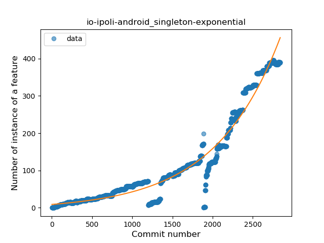

7. org-mozilla-rocket

	*  Function: 
	* R_Squared: 0.94569752
 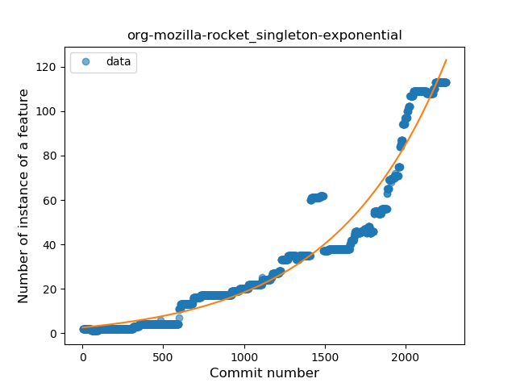

8. de-ph1b-audiobook

	*  Function: 
	* R_Squared: 0.94420257
 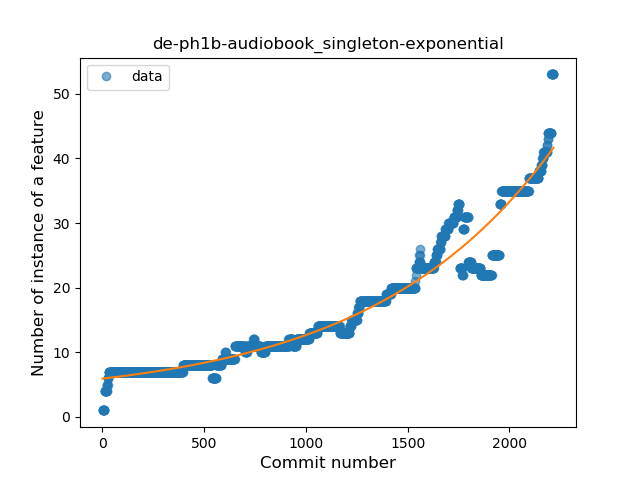

9. com-jereksel-libresubstratum

	*  Function: 
	* R_Squared: 0.93915882
 

10. net-bible-android-activity

	*  Function: 
	* R_Squared: 0.93357541
 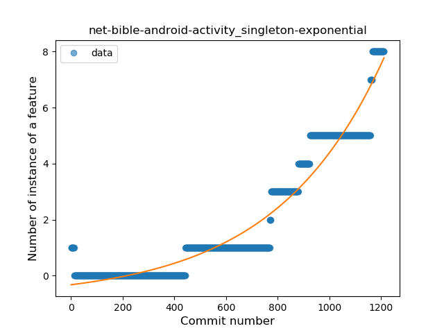

11. it-diab

	*  Function: 
	* R_Squared: 0.93169215
 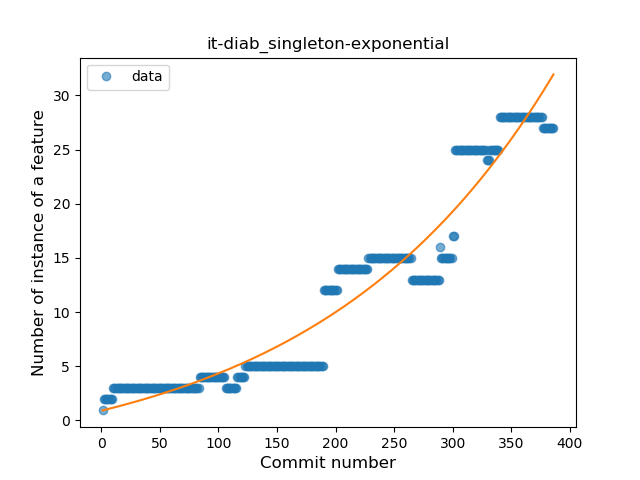

13. net-syncthing-lite

	*  Function: 
	* R_Squared: 0.92010794
 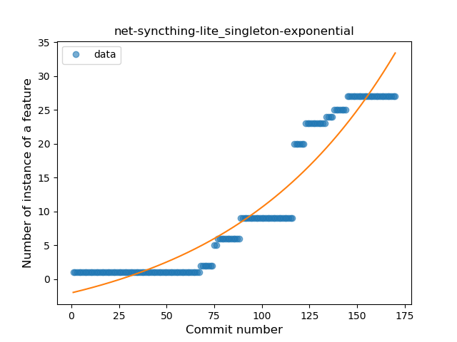

14. de-westnordost-streetcomplete

	*  Function: 
	* R_Squared: 0.89673095
 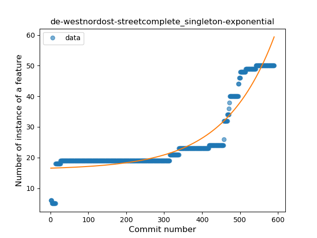

15. ch-deletescape-lawnchair-plah

	*  Function: 
	* R_Squared: 0.89244905
 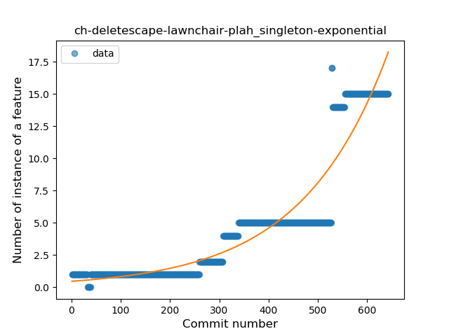

16. link-standen-michael-phonesaver

	*  Function: 
	* R_Squared: 0.88819616
 

17. org-moire-ultrasonic

	*  Function: 
	* R_Squared: 0.88388978
 

18. at-bitfire-davdroid

	*  Function: 
	* R_Squared: 0.86551304
 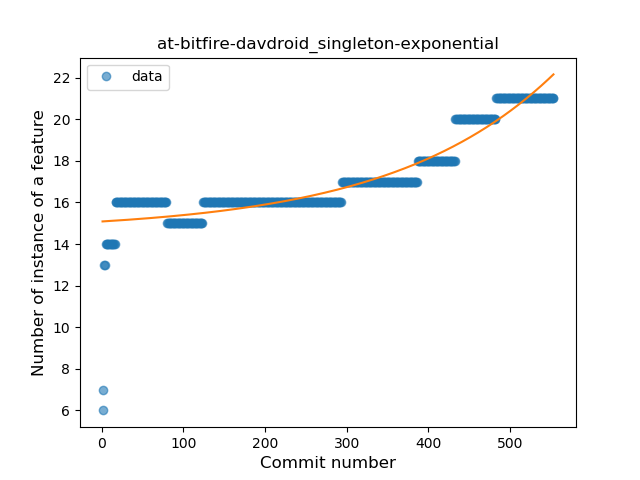

19. ch-rmy-android-http_shortcuts

	*  Function: 
	* R_Squared: 0.86313595
 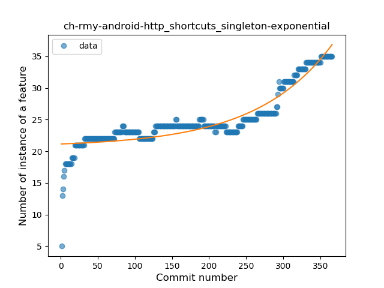

20. com-github-vase4kin-teamcityapp

	*  Function: 
	* R_Squared: 0.86184827
 

21. me-proxer-app

	*  Function: 
	* R_Squared: 0.86138479
 

22. app-opass-ccip

	*  Function: 
	* R_Squared: 0.85065774
 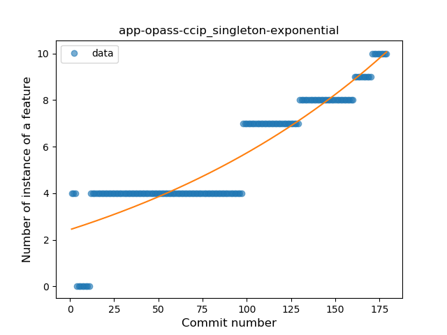

23. com-brentpanther-bitcoinwidget

	*  Function: 
	* R_Squared: 0.83613749
 

24. chat-rocket-android

	*  Function: 
	* R_Squared: 0.83213608
 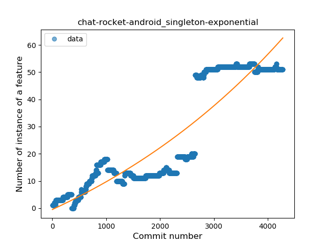

26. com-bernaferrari-changedetection

	*  Function: 
	* R_Squared: 0.80725407
 

27. ai-susi

	*  Function: 
	* R_Squared: 0.77393398
 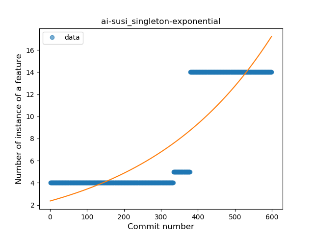

28. io-github-wulkanowy

	*  Function: 
	* R_Squared: 0.71313341
 

30. org-emunix-insteadlauncher

	*  Function: 
	* R_Squared: 0.6963262
 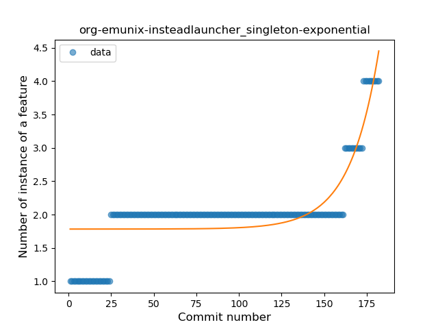

31. me-camsteffen-polite

	*  Function: 
	* R_Squared: 0.68040032
 

32. org-zimmob-zimlx

	*  Function: 
	* R_Squared: 0.66762891
 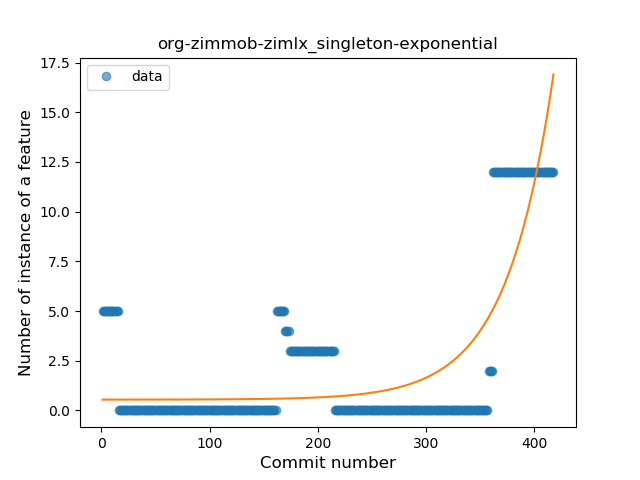

33. com-simplemobiletools-gallery-pro

	*  Function: 
	* R_Squared: 0.55093856
 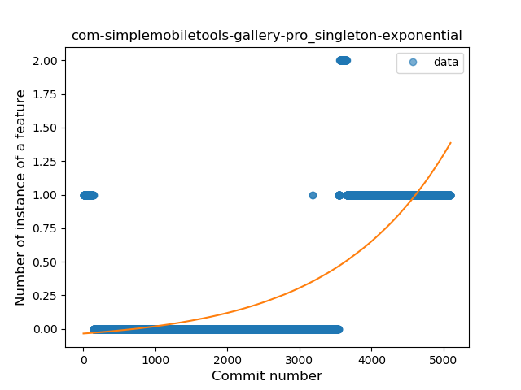

34. com-corphish-nightlight-generic

	*  Function: 
	* R_Squared: 0.49505892
 

35. is-xyz-omw

	*  Function: 
	* R_Squared: 0.49305603
 

36. fr-chenry-android-freshrss

	*  Function: 
	* R_Squared: 0.47032261
 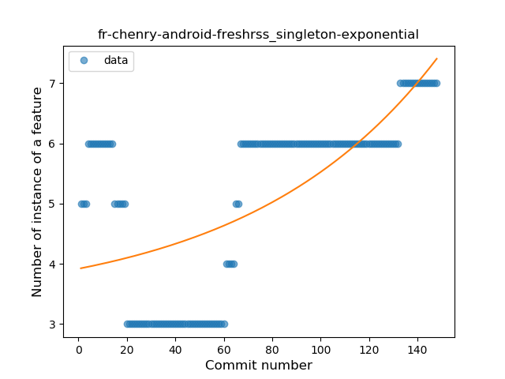

38. com-github-moko256-twitlatte

	*  Function: 
	* R_Squared: 0.43810448
 

40. com-calintat-sensors

	*  Function: 
	* R_Squared: 0.36813113
 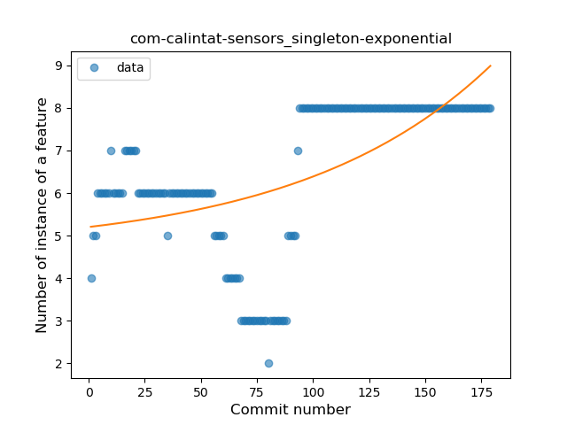

41. org-walleth

	*  Function: 
	* R_Squared: 0.35447112
 

42. com-adityakamble49-dcipher

	*  Function: 
	* R_Squared: 0.13191398
 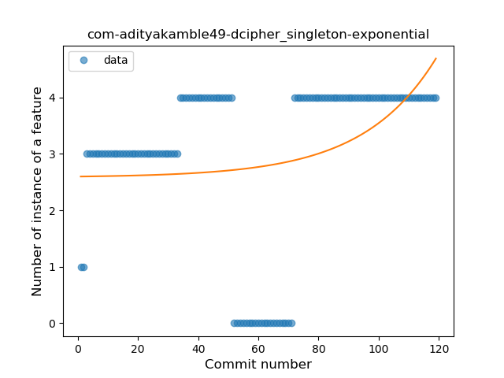

43. io-github-fvasco-pinpoi

	*  Function: 
	* R_Squared: 0.10559099
 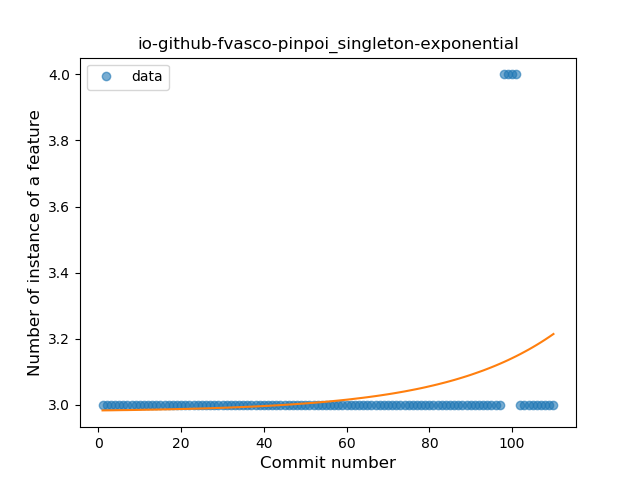

### <a name="T1">Constant Rise</a> 
 ----

1. com-fsck-k9

	*  Function: 
	* R_Squared: 0.97801277
 

2. fr-openium-auvergnewebcams

	*  Function: 
	* R_Squared: 0.95705936
 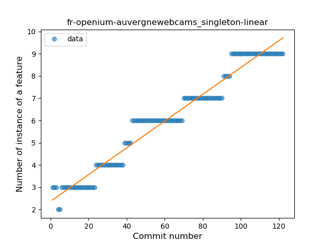

3. com-duckduckgo-mobile-android

	*  Function: 
	* R_Squared: 0.95579592
 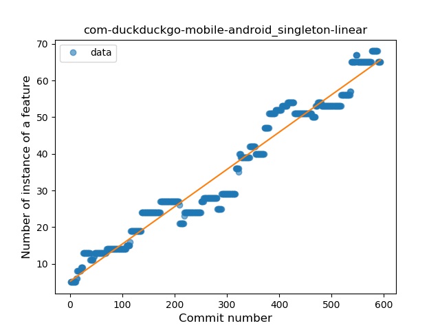

4. eu-kanade-tachiyomi

	*  Function: 
	* R_Squared: 0.94690015
 

5. org-mozilla-focus

	*  Function: 
	* R_Squared: 0.94654779
 

6. org-mozilla-klar

	*  Function: 
	* R_Squared: 0.94654779
 

7. com-bijoysingh-quicknote

	*  Function: 
	* R_Squared: 0.94568461
 

8. info-papdt-express-helper

	*  Function: 
	* R_Squared: 0.94262094
 

9. com-lavadip-miniVector

	*  Function: 
	* R_Squared: 0.941443
 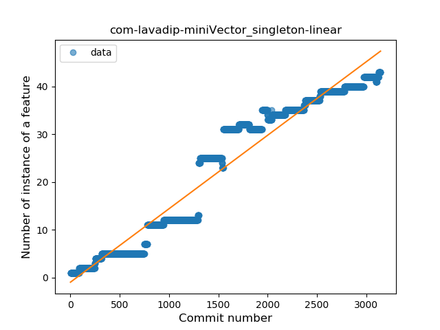

10. im-vector-alpha

	*  Function: 
	* R_Squared: 0.93910584
 

11. net-mm2d-dmsexplorer

	*  Function: 
	* R_Squared: 0.92999479
 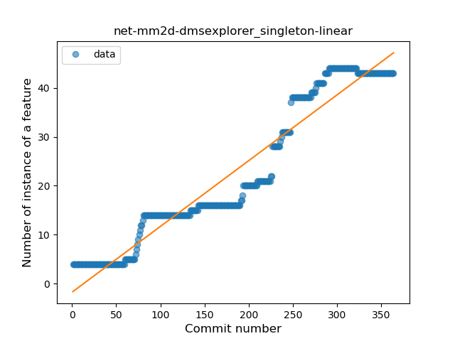

12. one-librem-social

	*  Function: 
	* R_Squared: 0.89899993
 

13. com-keylesspalace-tusky

	*  Function: 
	* R_Squared: 0.89659291
 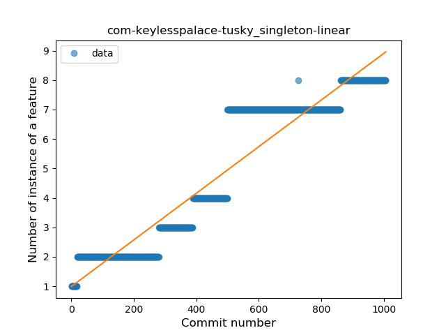

14. fr-cph-chicago-foss

	*  Function: 
	* R_Squared: 0.88600198
 

15. com-arcao-geocaching4locus

	*  Function: 
	* R_Squared: 0.880165
 

16. com-peterlaurence-trekme

	*  Function: 
	* R_Squared: 0.87783907
 

17. org-eurofurence-connavigator

	*  Function: 
	* R_Squared: 0.87472276
 

18. com-orgzly

	*  Function: 
	* R_Squared: 0.86725902
 

19. com-czbix-v2ex

	*  Function: 
	* R_Squared: 0.86603055
 

20. com-sjn-stamp

	*  Function: 
	* R_Squared: 0.86255963
 

21. li-klass-fhem

	*  Function: 
	* R_Squared: 0.85503466
 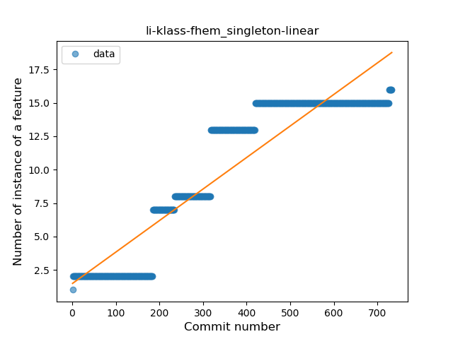

22. org-weilbach-splitbills

	*  Function: 
	* R_Squared: 0.85263972
 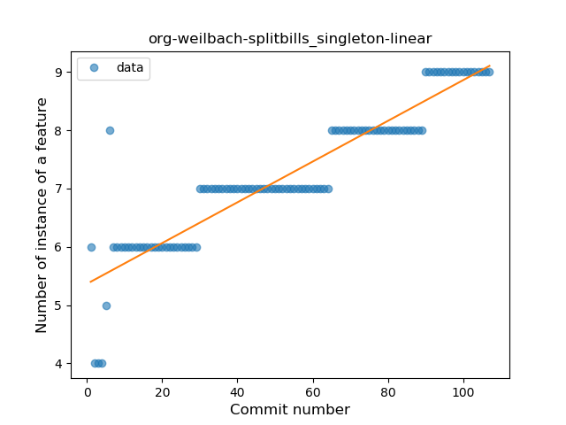

23. info-metadude-android-congress-schedule

	*  Function: 
	* R_Squared: 0.84365044
 

24. com-dp-logcatapp

	*  Function: 
	* R_Squared: 0.83419848
 

25. de-devmil-paperlaunch

	*  Function: 
	* R_Squared: 0.82349968
 

26. com-nextcloud-talk2

	*  Function: 
	* R_Squared: 0.8195981
 

27. acr-browser-lightning

	*  Function: 
	* R_Squared: 0.81160711
 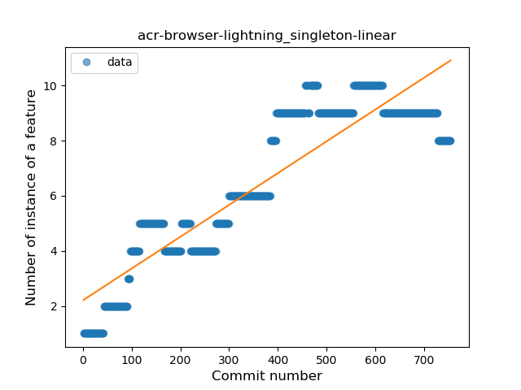

28. com-uwetrottmann-wpdisplay

	*  Function: 
	* R_Squared: 0.79374141
 

29. org-blokada-alarm

	*  Function: 
	* R_Squared: 0.78344512
 

31. net-osmand-plus

	*  Function: 
	* R_Squared: 0.75594748
 

32. org-ligi-gobandroid

	*  Function: 
	* R_Squared: 0.74951498
 

35. xyz-hisname-fireflyiii

	*  Function: 
	* R_Squared: 0.62341451
 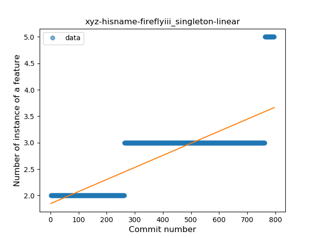

38. com-doctoror-particleswallpaper

	*  Function: 
	* R_Squared: 0.04612814
 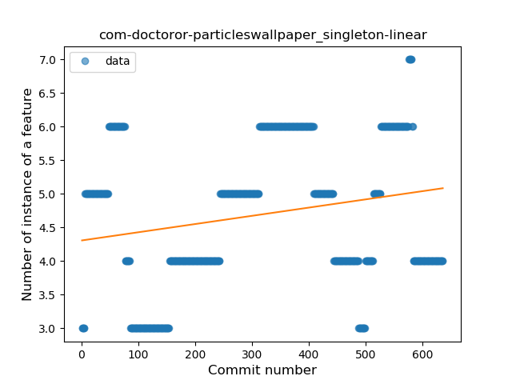

### <a name="T9">Plateau Sudden Rise</a> 
 ----

3. college-wyk-app

	*  Function: 
	* R_Squared: 1.0
 

5. com-emmanuelmess-simplecleanup

	*  Function: 
	* R_Squared: 1.0
 

6. com-ianhanniballake-contractiontimer

	*  Function: 
	* R_Squared: 1.0
 

8. com-ogsdroid

	*  Function: 
	* R_Squared: 1.0
 

9. com-pluscubed-velociraptor

	*  Function: 
	* R_Squared: 1.0
 

10. com-rohitsuratekar-NCBSinfo

	*  Function: 
	* R_Squared: 1.0
 

18. fr-insapp-insapp

	*  Function: 
	* R_Squared: 1.0
 

19. io-mkg20001-arubanetworkslogin

	*  Function: 
	* R_Squared: 1.0
 

21. org-ligi-ipfsdroid

	*  Function: 
	* R_Squared: 1.0
 

25. saschpe-poker

	*  Function: 
	* R_Squared: 1.0
 

26. se-creotec-chscardbalance2

	*  Function: 
	* R_Squared: 1.0
 

28. uk-co-richyhbm-monochromatic

	*  Function: 
	* R_Squared: 1.0
 

29. de-avpptr-umweltzone

	*  Function: 
	* R_Squared: 0.99241195
 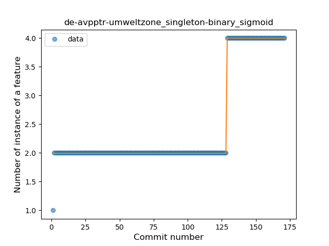

30. fr-xgouchet-packageexplorer

	*  Function: 
	* R_Squared: 0.99139741
 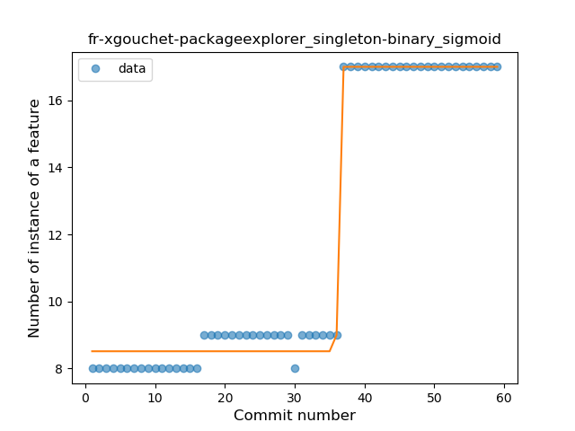

31. com-simplemobiletools-calendar-pro

	*  Function: 
	* R_Squared: 0.9709605
 

32. pl-poznajapp

	*  Function: 
	* R_Squared: 0.96453901
 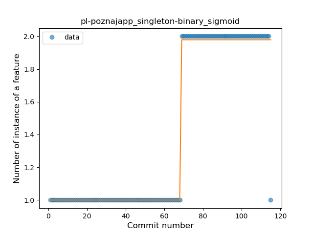

33. org-blitzortung-android-app

	*  Function: 
	* R_Squared: 0.94217286
 

35. de-grobox-liberario

	*  Function: 
	* R_Squared: 0.92265273
 

36. com-zeapo-pwdstore

	*  Function: 
	* R_Squared: 0.90262019
 

37. pt-joaomneto-titancompanion

	*  Function: 
	* R_Squared: 0.89087794
 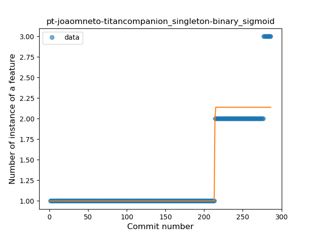

41. moe-feng-nhentai

	*  Function: 
	* R_Squared: 0.73770492
 

42. com-garpr-android

	*  Function: 
	* R_Squared: 0.71598355
 

44. com-wabadaba-dziennik

	*  Function: 
	* R_Squared: 0.66792777
 

45. org-sanpra-checklist

	*  Function: 
	* R_Squared: 0.58832325
 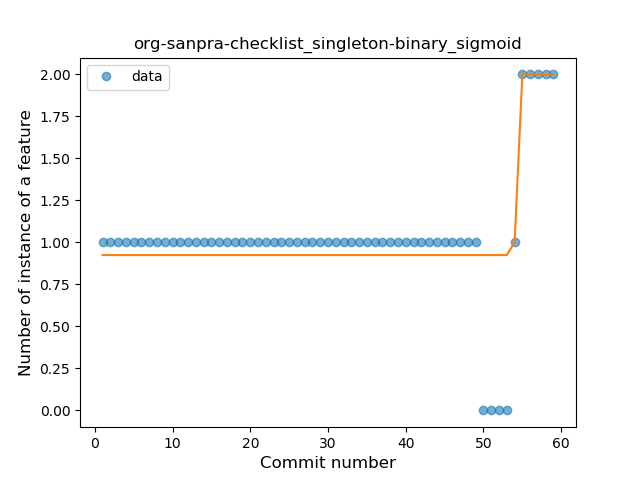

48. com-kgurgul-cpuinfo

	*  Function: 
	* R_Squared: 0.43873783
 

49. org-ligi-materialteatimer

	*  Function: 
	* R_Squared: 0.34766899
 

50. me-echeung-moemoekyun-fdroid

	*  Function: 
	* R_Squared: 0.27823373
 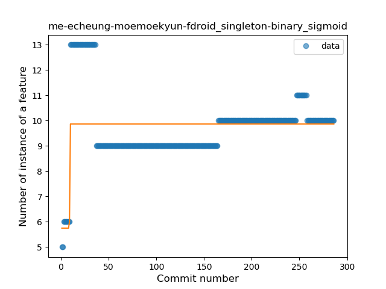

52. net-nonylene-photolinkviewer

	*  Function: 
	* R_Squared: 0.15189799
 

53. io-trewartha-positional

	*  Function: 
	* R_Squared: 0.12840467
 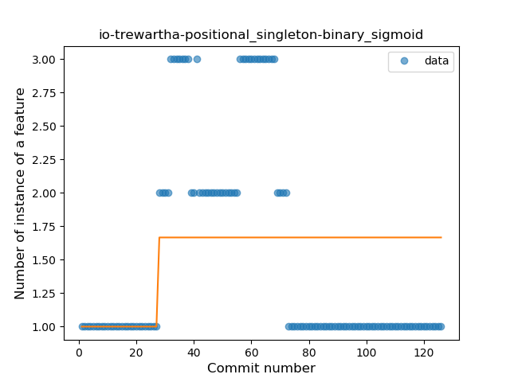

### <a name="T6">Sudden Rise Plateau</a> 
 ----

1. com-motion-stage1

	*  Function: 
	* R_Squared: 0.90565599
 

2. fi-tuska-jalkametri

	*  Function: 
	* R_Squared: 0.89049344
 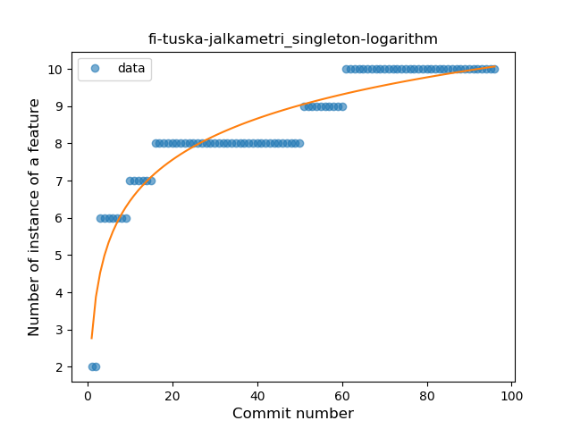

3. org-pacien-tincapp

	*  Function: 
	* R_Squared: 0.87617956
 

4. ch-rmy-android-statusbar_tacho

	*  Function: 
	* R_Squared: 0.86019302
 

5. com-benoitquenaudon-tvfoot-red

	*  Function: 
	* R_Squared: 0.82308681
 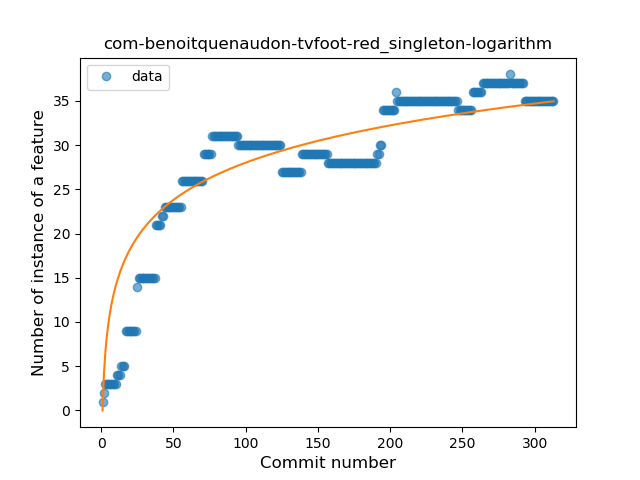

6. com-github-quarck-calnotify

	*  Function: 
	* R_Squared: 0.82143076
 

7. de-r4md4c-gamedealz

	*  Function: 
	* R_Squared: 0.80622245
 

8. jp-toastkid-yobidashi

	*  Function: 
	* R_Squared: 0.78561824
 

9. com-etesync-syncadapter

	*  Function: 
	* R_Squared: 0.77989905
 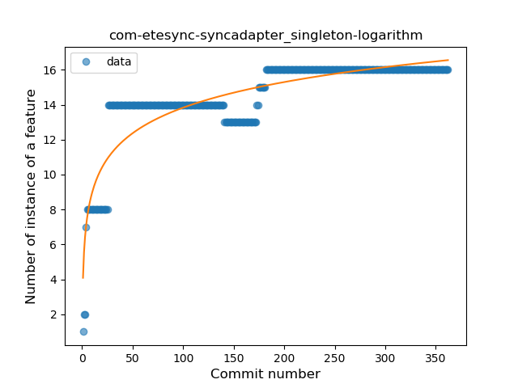

10. de-cineaste-android

	*  Function: 
	* R_Squared: 0.77268697
 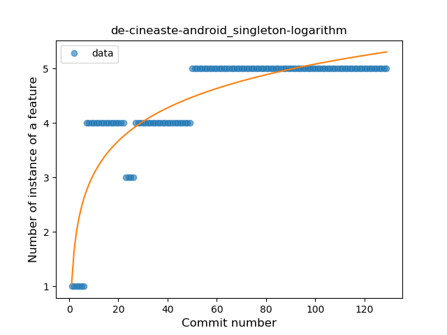

11. com-commit451-gitlab

	*  Function: 
	* R_Squared: 0.72892422
 

12. fi-kroon-vadret

	*  Function: 
	* R_Squared: 0.72261769
 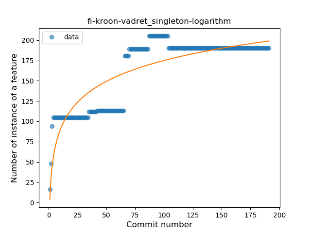

13. com-boardgamegeek

	*  Function: 
	* R_Squared: 0.71440686
 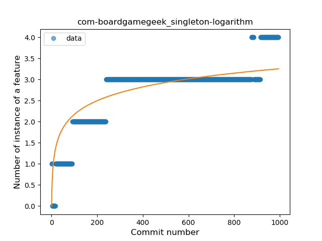

14. se-barsk-park

	*  Function: 
	* R_Squared: 0.59924169
 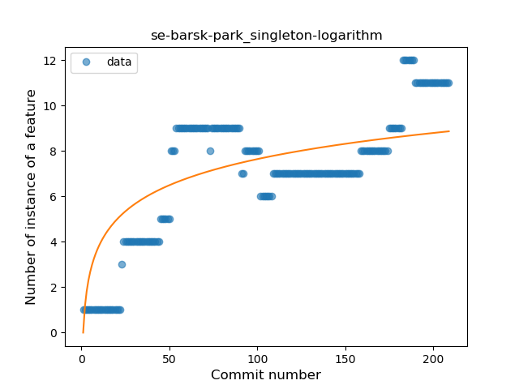

15. com-booboot-vndbandroid

	*  Function: 
	* R_Squared: 0.53031917
 

16. net-nurik-roman-muzei

	*  Function: 
	* R_Squared: 0.49937488
 

17. sk-styk-martin-apkanalyzer

	*  Function: 
	* R_Squared: 0.46866101
 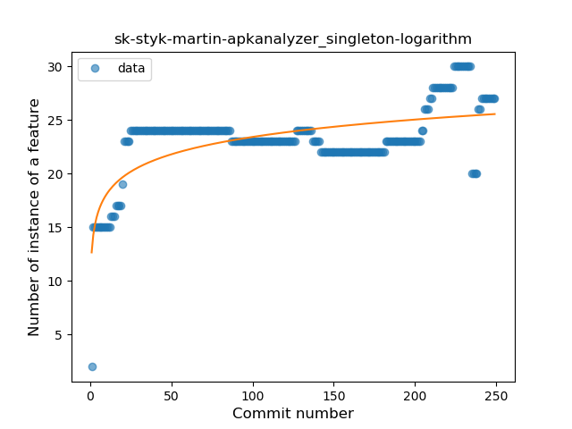

18. quickbeer-android

	*  Function: 
	* R_Squared: 0.36290151
 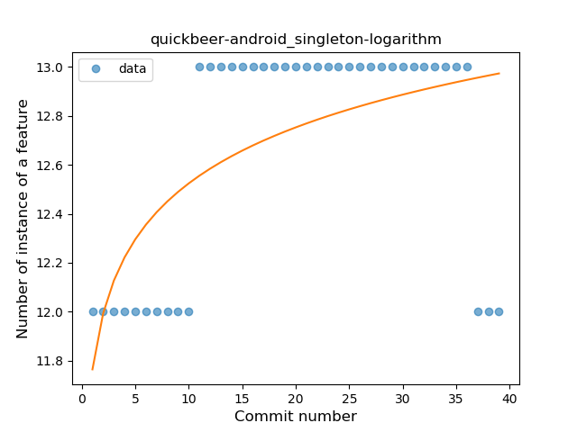

19. pw-janyo-whatanime

	*  Function: 
	* R_Squared: 0.36052395
 

20. com-benoitletondor-easybudgetapp

	*  Function: 
	* R_Squared: 0.34079239
 

21. at-bitfire-icsdroid

	*  Function: 
	* R_Squared: 0.26623551
 

22. org-kiwix-kiwixcustomwikivoyageeurope

	*  Function: 
	* R_Squared: 0.15737246
 

23. de-blankedv-lanbahnpanel

	*  Function: 
	* R_Squared: 0.0841426
 

24. com-tumblr-svetylk0-sheepsgohome-android

	*  Function: 
	* R_Squared: 0.05401663
 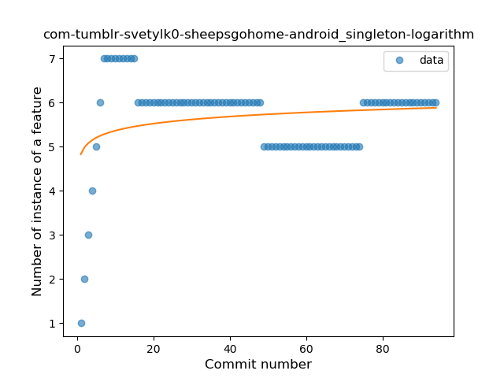

25. eu-the4thfloor-msync

	*  Function: 
	* R_Squared: 0.04611425
 

### <a name="T10">Plateau Sudden Decline</a> 
 ----

1. cat-xojan-random1

	*  Function: 
	* R_Squared: 1.0
 

2. co-timecrypt-android

	*  Function: 
	* R_Squared: 1.0
 

4. com-conorodonnell-bus

	*  Function: 
	* R_Squared: 1.0
 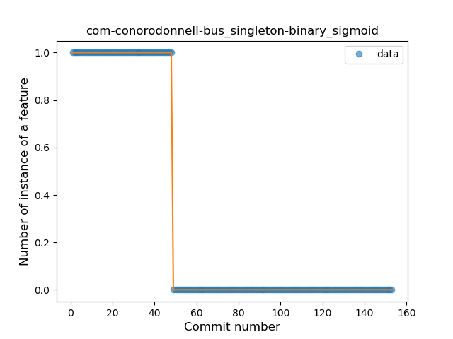

7. com-log28

	*  Function: 
	* R_Squared: 1.0
 

11. com-sduduzog-slimlauncher

	*  Function: 
	* R_Squared: 1.0
 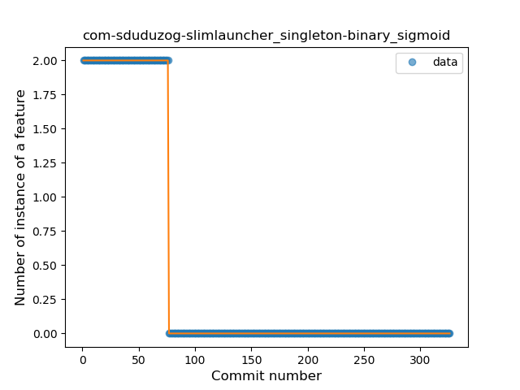

12. com-simplemobiletools-camera

	*  Function: 
	* R_Squared: 1.0
 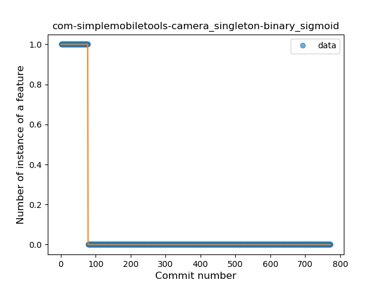

13. com-simplemobiletools-flashlight

	*  Function: 
	* R_Squared: 1.0
 

14. com-simplemobiletools-gallery

	*  Function: 
	* R_Squared: 1.0
 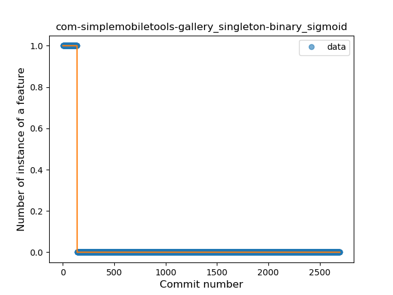

15. de-devmil-muzei-bingimageofthedayartsource

	*  Function: 
	* R_Squared: 1.0
 

16. de-spiritcroc-darkcroc-substratum

	*  Function: 
	* R_Squared: 1.0
 

17. de-spiritcroc-defaultdarktheme

	*  Function: 
	* R_Squared: 1.0
 

20. org-freedombox-freedombox

	*  Function: 
	* R_Squared: 1.0
 

22. org-mifos-mobile

	*  Function: 
	* R_Squared: 1.0
 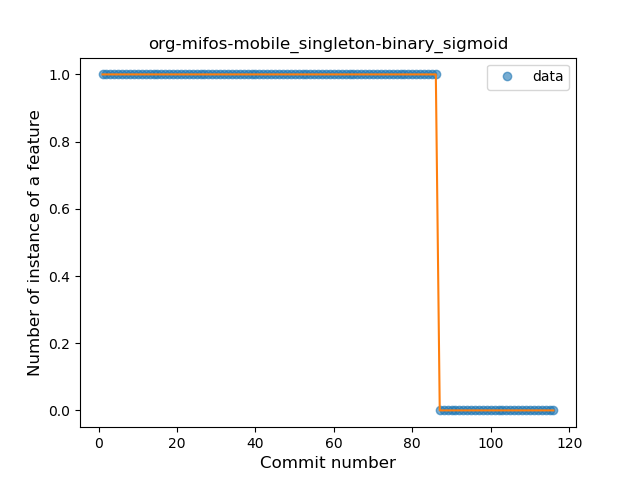

23. pixel-kotlin-bassblog

	*  Function: 
	* R_Squared: 1.0
 

24. rectangledbmi-com-pittsburghrealtimetracker

	*  Function: 
	* R_Squared: 1.0
 

27. tw-shounenwind-kmnbottool

	*  Function: 
	* R_Squared: 1.0
 

34. tk-superl2-xwifi

	*  Function: 
	* R_Squared: 0.93977011
 

38. net-frju-flym

	*  Function: 
	* R_Squared: 0.88892723
 

39. com-simplemobiletools-contacts-pro

	*  Function: 
	* R_Squared: 0.87947776
 

40. me-blog-korn123-easydiary

	*  Function: 
	* R_Squared: 0.87466737
 

43. com-simplemobiletools-notes-pro

	*  Function: 
	* R_Squared: 0.71231433
 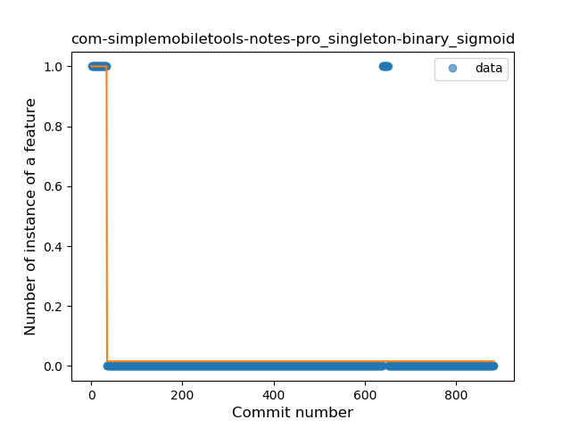

46. jp-cordea-mackerelclient

	*  Function: 
	* R_Squared: 0.55508742
 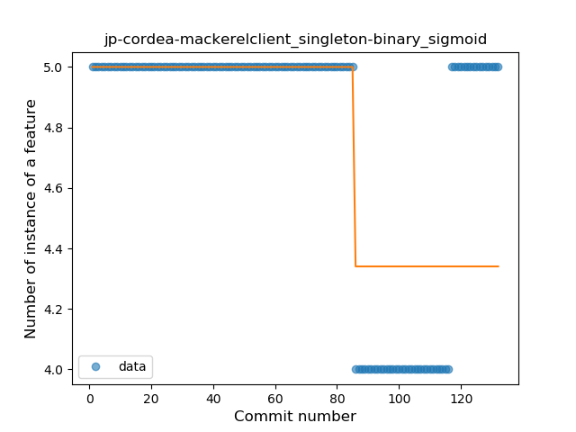

47. com-pyamsoft-homebutton

	*  Function: 
	* R_Squared: 0.51599587
 

51. com-simplemobiletools-filemanager-pro

	*  Function: 
	* R_Squared: 0.21362514
 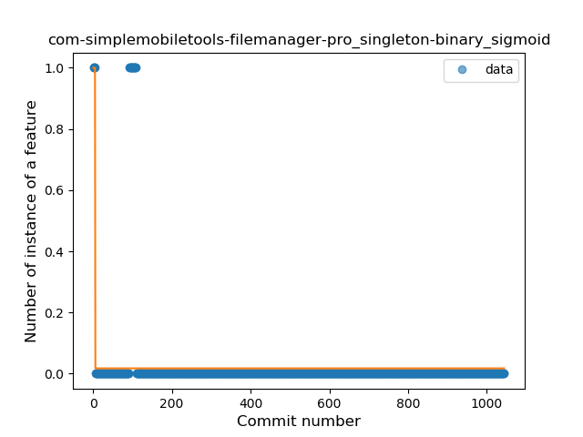

### <a name="T11">Instability</a> 
 ----

1. es-danirod-rectball-android

	*  Function: 
	* R_Squared: 0.98484848
 

2. com-rhm-pwn

	*  Function: 
	* R_Squared: 0.94583593
 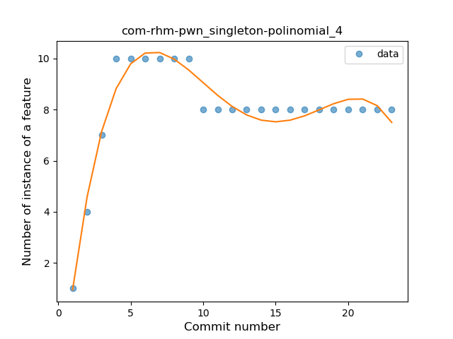

3. ru-nsu-bobrofon-easysshfs

	*  Function: 
	* R_Squared: 0.89505326
 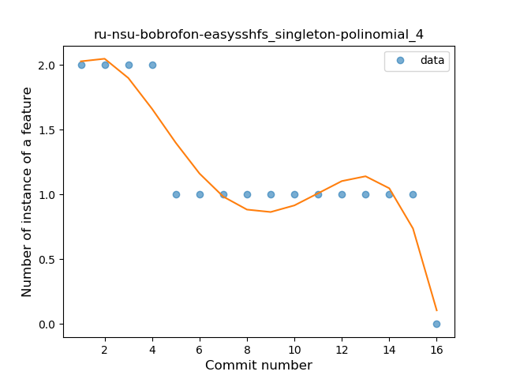

4. com-physphil-android-unitconverterultimate

	*  Function: 
	* R_Squared: 0.6236781
 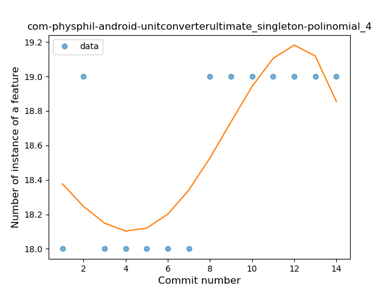

5. com-enjoyingfoss-om

	*  Function: 
	* R_Squared: 0.43361015
 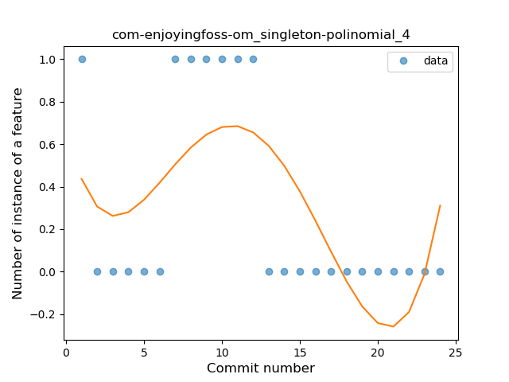

### <a name="T5">Sudden Decline</a> 
 ----

1. io-github-benoitduffez-cupsprint

	*  Function: 
	* R_Squared: 1.0
 

2. net-stew-stew

	*  Function: 
	* R_Squared: 1.0
 

12. org-anibyl-slounik

	*  Function: 
	* R_Squared: 0.92568396
 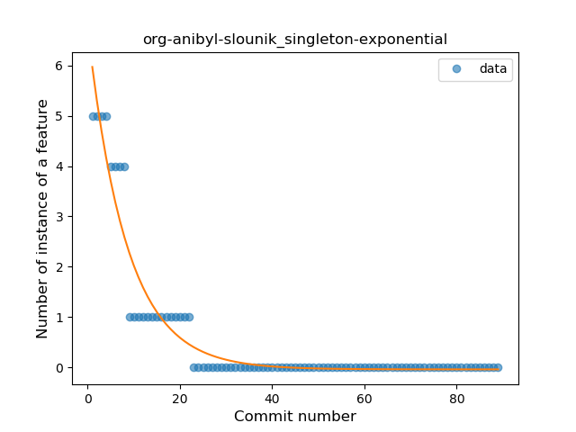

25. me-rei_m-hyakuninisshu

	*  Function: 
	* R_Squared: 0.82301228
 

29. com-uncmorfi

	*  Function: 
	* R_Squared: 0.70073586
 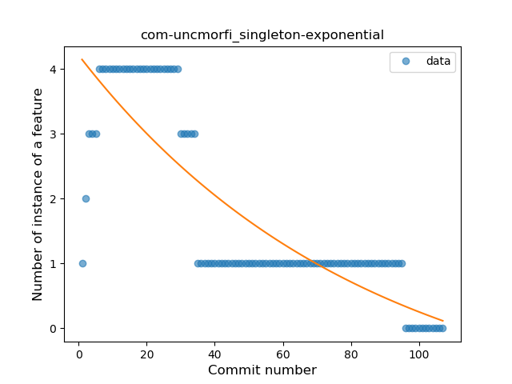

37. me-kirimin-mitsumine

	*  Function: 
	* R_Squared: 0.4693307
 

39. nightlock-peppercarrot

	*  Function: 
	* R_Squared: 0.40965454
 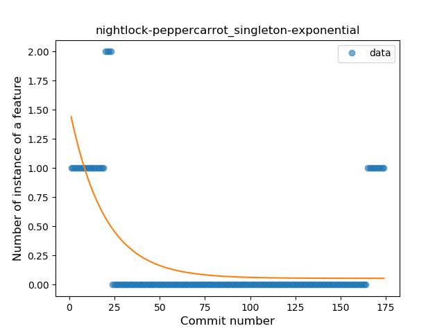

### <a name="T2">Constant Decline</a> 
 ----

30. com-zacharee1-systemuituner

	*  Function: 
	* R_Squared: 0.77603228
 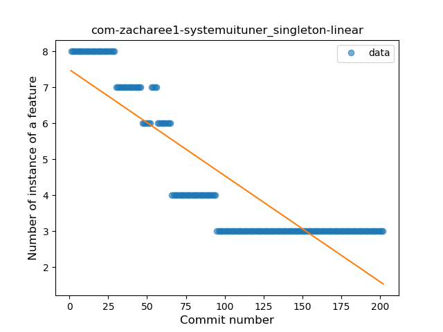

33. com-atanana-sicounter

	*  Function: 
	* R_Squared: 0.64293112
 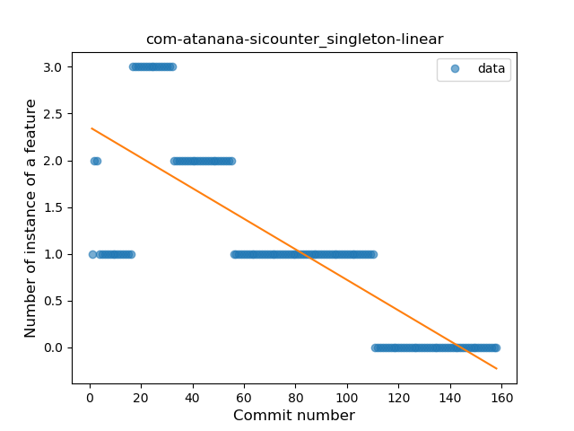

34. com-bubelov-coins

	*  Function: 
	* R_Squared: 0.64133199
 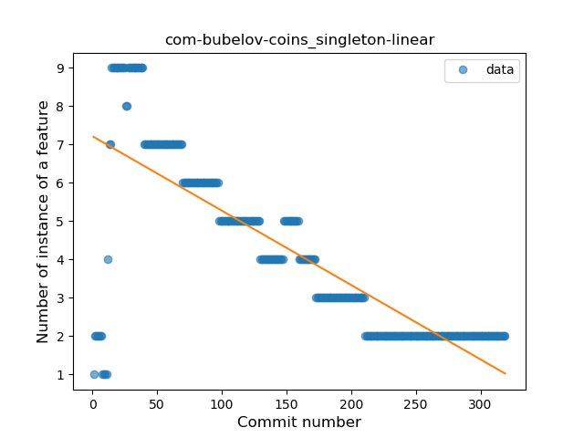

36. ch-abertschi-adfree

	*  Function: 
	* R_Squared: 0.14022489
 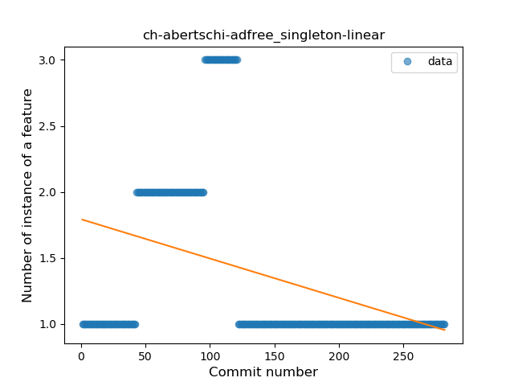

37. com-directdev-portal

	*  Function: 
	* R_Squared: 0.0755027
 

39. com-glodanif-bluetoothchat

	*  Function: 
	* R_Squared: 5.857e-05
 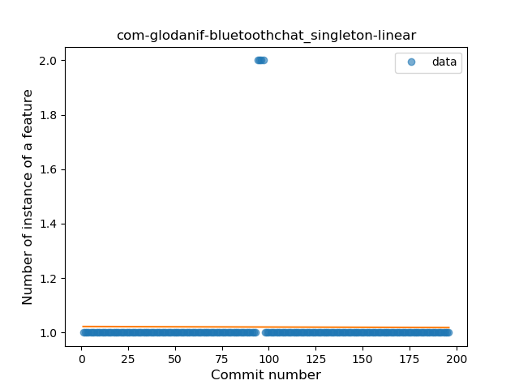

### <a name="T8">Plateau Gradual Decline</a> 
 ----

18. org-equeim-tremotesf

	*  Function: 
	* R_Squared: 0.94412038
 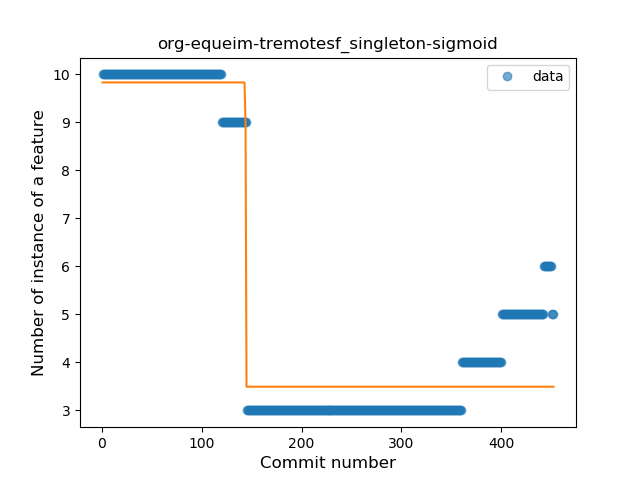

39. com-benny-openlauncher

	*  Function: 
	* R_Squared: 0.88200112
 

49. com-yubico-yubioath

	*  Function: 
	* R_Squared: 0.55567062
 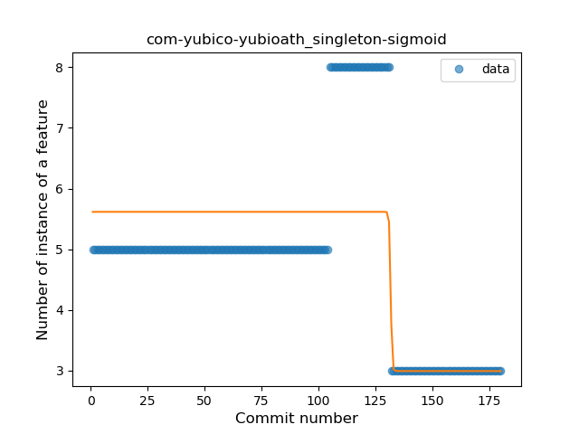

### <a name="T3">Stability</a> 
 ----

