## Smart Cast
----
**Best fit = Plateau Gradual Rise**: 40

Function | N# best fit
----|----
<a href=" #T7">Plateau Gradual Rise</a> | 40
<a href=" #T1">Constant Rise</a> | 38
<a href=" #T4">Sudden Rise</a> | 35
<a href=" #T9">Plateau Sudden Rise</a> | 25
<a href=" #T6">Sudden Rise Plateau</a> | 20
<a href=" #T2">Constant Decline</a> | 14
<a href=" #T10">Plateau Sudden Decline</a> | 14
<a href=" #T11">Instability</a> | 10
<a href=" #T5">Sudden Decline</a> | 8
<a href=" #T8">Plateau Gradual Decline</a> | 4
<a href=" #T3">Stability</a> | 0

### <a name="T7">Plateau Gradual Rise</a> 
 ----

1. org-moire-ultrasonic

	*  Function: 
	* R_Squared: 1.0
 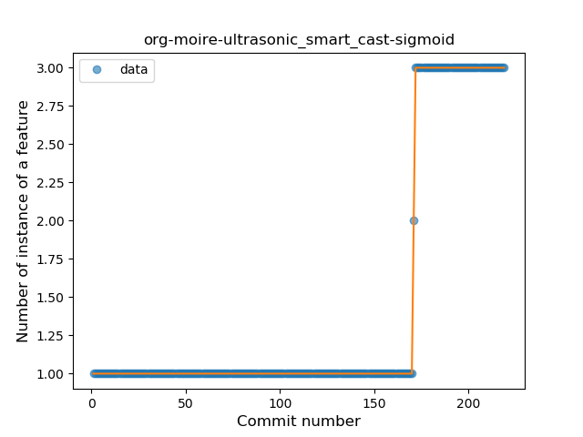

2. org-fossasia-badgemagic

	*  Function: 
	* R_Squared: 0.99056383
 

3. ru-hyst329-openfool

	*  Function: 
	* R_Squared: 0.98495614
 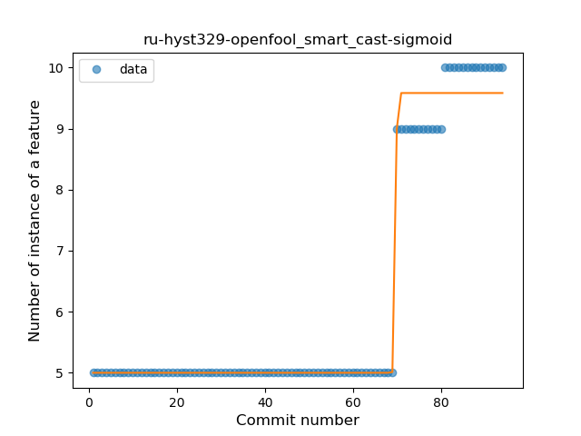

4. com-nextcloud-talk2

	*  Function: 
	* R_Squared: 0.98458755
 

5. com-zacharee1-systemuituner

	*  Function: 
	* R_Squared: 0.97790319
 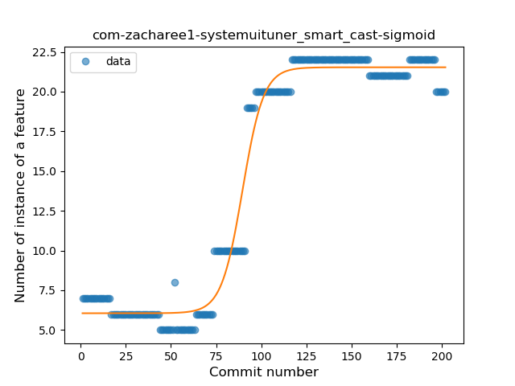

6. tech-ula

	*  Function: 
	* R_Squared: 0.97697754
 

7. com-jereksel-libresubstratum

	*  Function: 
	* R_Squared: 0.97655076
 

8. me-kirimin-mitsumine

	*  Function: 
	* R_Squared: 0.97017328
 

9. se-barsk-park

	*  Function: 
	* R_Squared: 0.9689188
 

10. ch-rmy-android-http_shortcuts

	*  Function: 
	* R_Squared: 0.96746691
 

11. com-simplemobiletools-gallery-pro

	*  Function: 
	* R_Squared: 0.96459846
 

12. fr-cph-chicago-foss

	*  Function: 
	* R_Squared: 0.96125239
 

13. net-mm2d-dmsexplorer

	*  Function: 
	* R_Squared: 0.95945971
 

14. com-slash-batterychargelimit

	*  Function: 
	* R_Squared: 0.95932224
 

15. com-github-vase4kin-teamcityapp

	*  Function: 
	* R_Squared: 0.95914159
 

16. se-creotec-chscardbalance2

	*  Function: 
	* R_Squared: 0.9554923
 

17. com-tasomaniac-openwith-floss

	*  Function: 
	* R_Squared: 0.95333569
 

18. com-bijoysingh-quicknote

	*  Function: 
	* R_Squared: 0.95097956
 

19. it-diab

	*  Function: 
	* R_Squared: 0.95056445
 

20. com-pitchedapps-frost

	*  Function: 
	* R_Squared: 0.9383665
 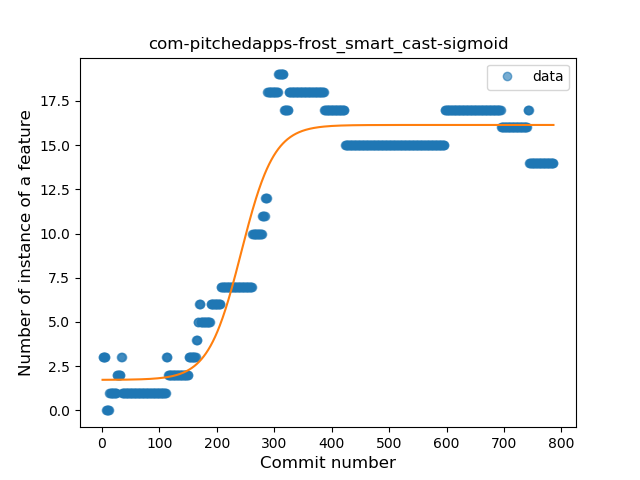

21. nl-brouwerijdemolen-borefts2013

	*  Function: 
	* R_Squared: 0.93307917
 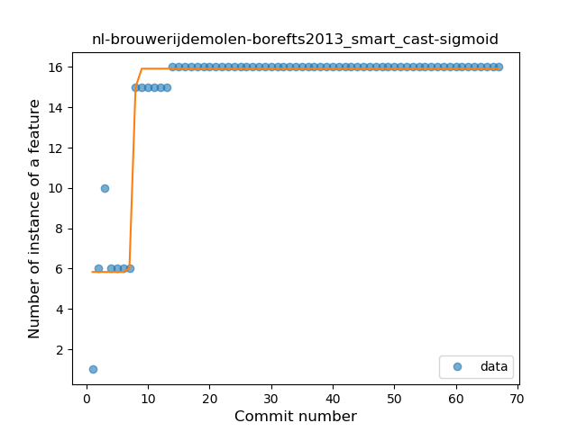

22. com-guerinet-mymartlet

	*  Function: 
	* R_Squared: 0.93187932
 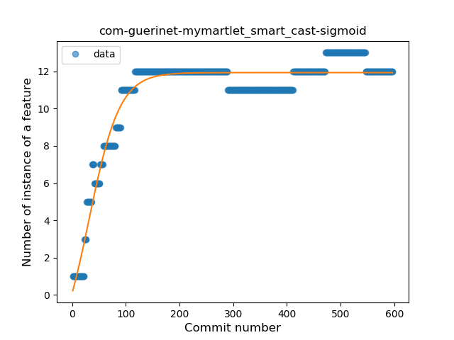

23. jp-cordea-mackerelclient

	*  Function: 
	* R_Squared: 0.93032202
 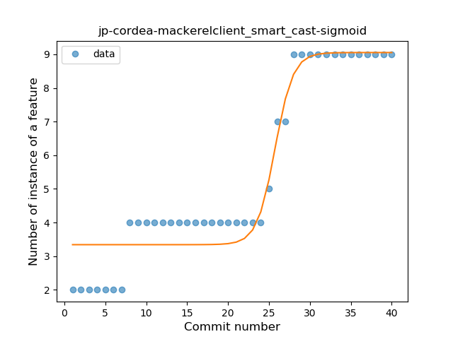

24. com-ogsdroid

	*  Function: 
	* R_Squared: 0.9286615
 

25. apps-amine-bou-readerforselfoss

	*  Function: 
	* R_Squared: 0.91882818
 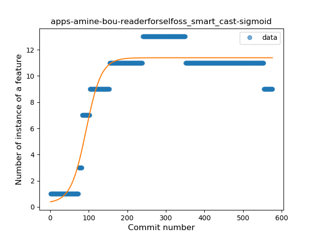

26. com-zeapo-pwdstore

	*  Function: 
	* R_Squared: 0.91409506
 

27. com-rohitsuratekar-NCBSinfo

	*  Function: 
	* R_Squared: 0.89423845
 

28. de-ph1b-audiobook

	*  Function: 
	* R_Squared: 0.8862955
 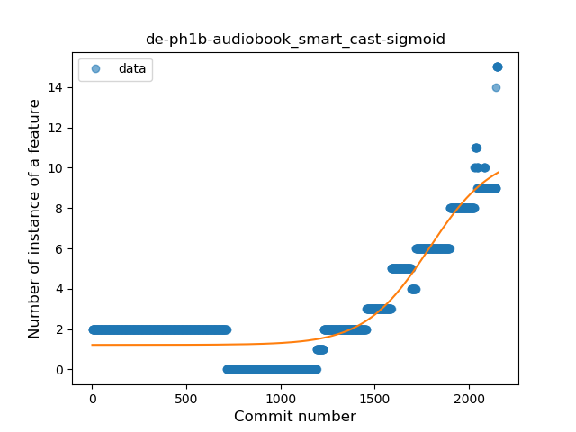

30. cat-xojan-random1

	*  Function: 
	* R_Squared: 0.84188784
 

31. com-nononsenseapps-feeder

	*  Function: 
	* R_Squared: 0.81282288
 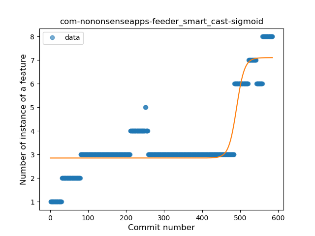

32. de-csicar-mensaplan

	*  Function: 
	* R_Squared: 0.78251547
 

34. at-bitfire-davdroid

	*  Function: 
	* R_Squared: 0.76413169
 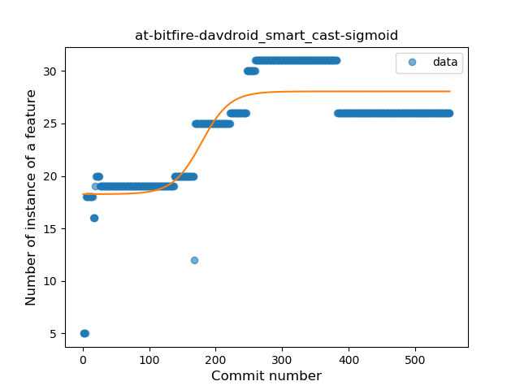

37. com-pyamsoft-homebutton

	*  Function: 
	* R_Squared: 0.69750561
 

38. org-ligi-gobandroid

	*  Function: 
	* R_Squared: 0.62985827
 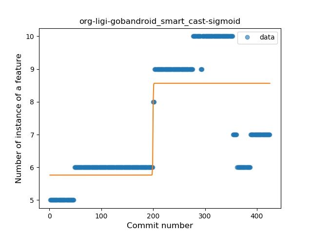

39. com-simplemobiletools-contacts-pro

	*  Function: 
	* R_Squared: 0.61242322
 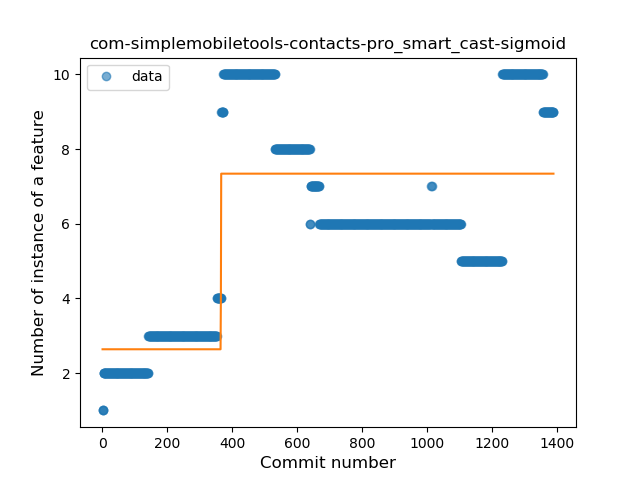

40. nightlock-peppercarrot

	*  Function: 
	* R_Squared: 0.57502633
 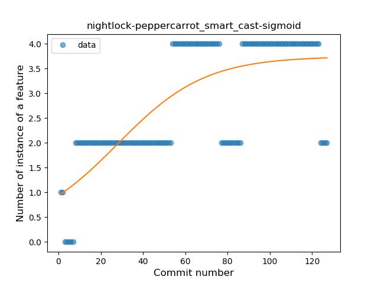

41. com-directdev-portal

	*  Function: 
	* R_Squared: 0.54796986
 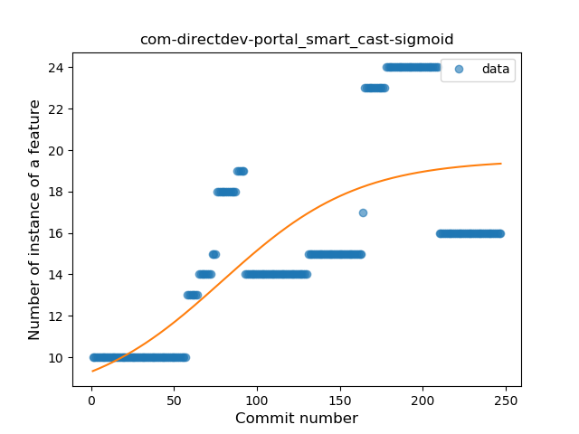

42. com-github-premnirmal-tickerwidget

	*  Function: 
	* R_Squared: 0.36043518
 

43. com-bubelov-coins

	*  Function: 
	* R_Squared: 0.26465889
 

44. com-yubico-yubioath

	*  Function: 
	* R_Squared: 0.1482143
 

### <a name="T1">Constant Rise</a> 
 ----

1. one-librem-social

	*  Function: 
	* R_Squared: 0.97221398
 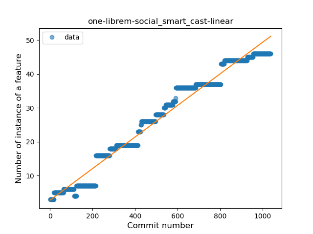

2. com-keylesspalace-tusky

	*  Function: 
	* R_Squared: 0.96806412
 

3. org-mozilla-focus

	*  Function: 
	* R_Squared: 0.9521892
 

4. org-mozilla-klar

	*  Function: 
	* R_Squared: 0.9521892
 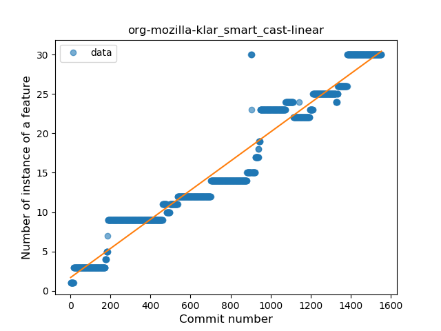

5. be-mygod-vpnhotspot

	*  Function: 
	* R_Squared: 0.92303433
 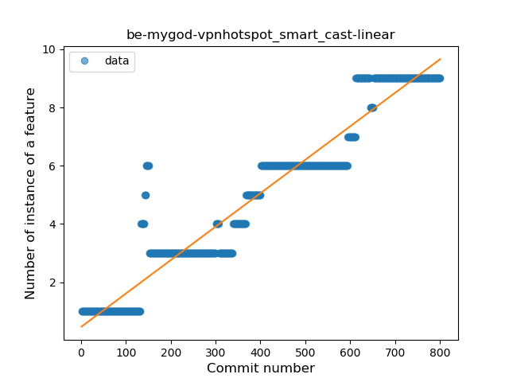

6. com-stevenschoen-putionew

	*  Function: 
	* R_Squared: 0.92152126
 

7. com-boardgamegeek

	*  Function: 
	* R_Squared: 0.91675064
 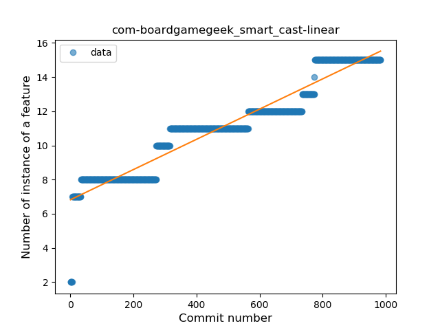

8. ca-josephroque-bowlingcompanion

	*  Function: 
	* R_Squared: 0.91120186
 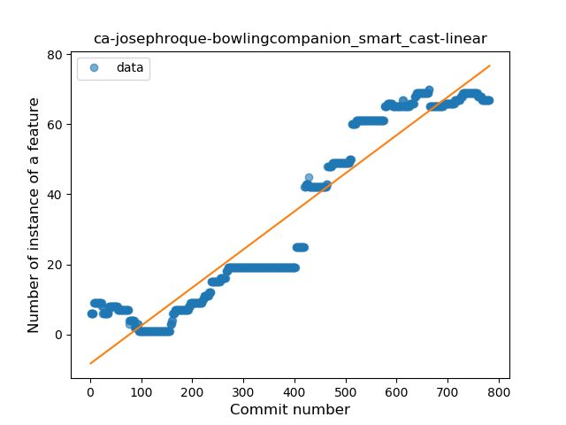

9. jp-toastkid-yobidashi

	*  Function: 
	* R_Squared: 0.90623825
 

10. com-fastaccess-github-libre

	*  Function: 
	* R_Squared: 0.90578255
 

11. com-wabadaba-dziennik

	*  Function: 
	* R_Squared: 0.90535507
 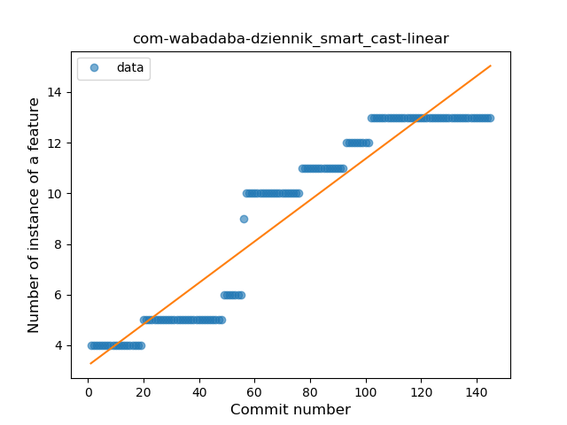

12. org-kaqui

	*  Function: 
	* R_Squared: 0.90527338
 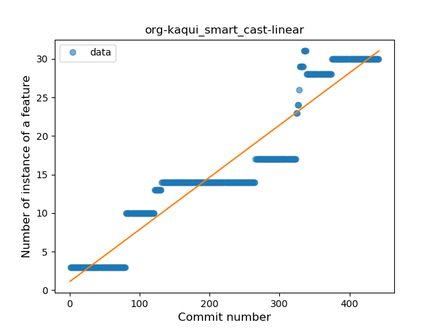

13. org-mariotaku-twidere

	*  Function: 
	* R_Squared: 0.90234792
 

14. com-orgzly

	*  Function: 
	* R_Squared: 0.89628614
 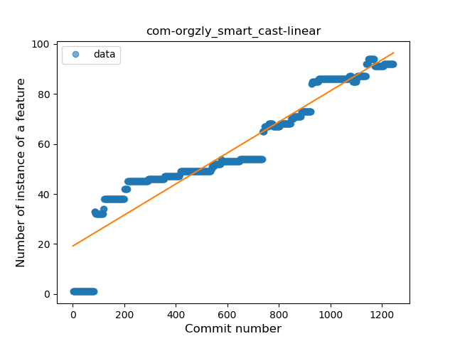

15. ca-rmen-android-poetassistant

	*  Function: 
	* R_Squared: 0.89103858
 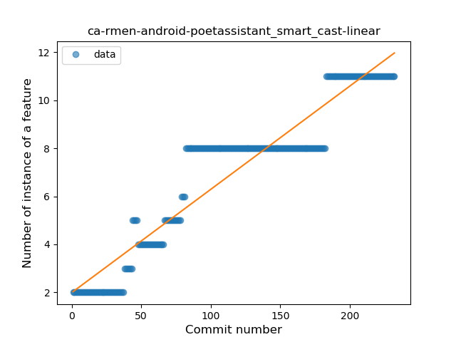

16. io-github-wulkanowy

	*  Function: 
	* R_Squared: 0.89052628
 

17. info-papdt-express-helper

	*  Function: 
	* R_Squared: 0.88407469
 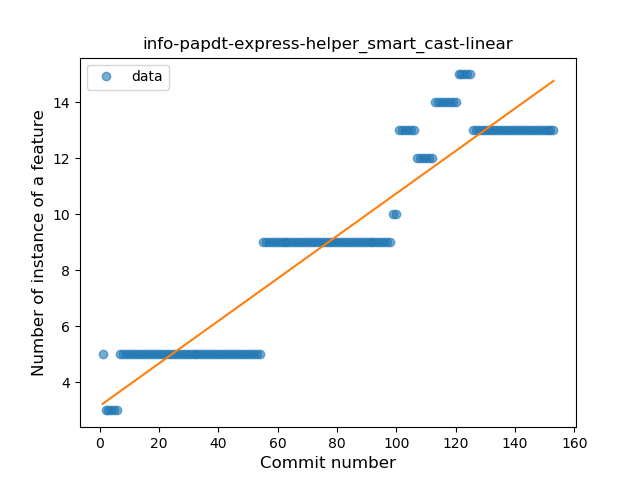

18. net-osmand-plus

	*  Function: 
	* R_Squared: 0.87534593
 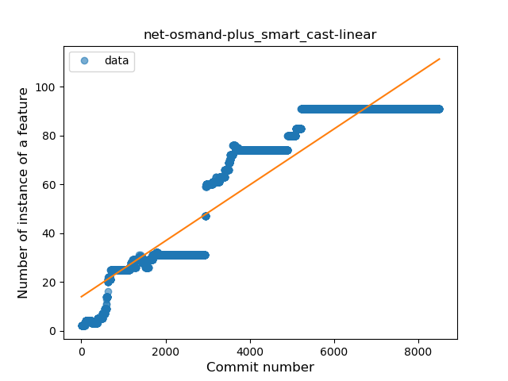

19. fi-kroon-vadret

	*  Function: 
	* R_Squared: 0.86943273
 

20. net-mm2d-android-vmb

	*  Function: 
	* R_Squared: 0.86357012
 

21. net-bible-android-activity

	*  Function: 
	* R_Squared: 0.85692339
 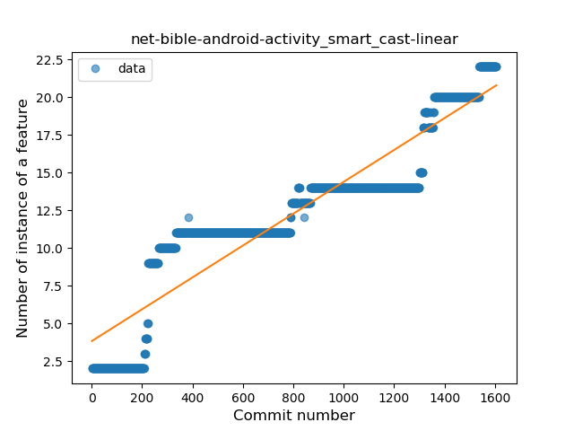

22. com-benoitquenaudon-tvfoot-red

	*  Function: 
	* R_Squared: 0.85361366
 

23. pl-hypeapp-episodie

	*  Function: 
	* R_Squared: 0.84978916
 

24. quickbeer-android

	*  Function: 
	* R_Squared: 0.8476856
 

25. com-simplemobiletools-calendar-pro

	*  Function: 
	* R_Squared: 0.83668752
 

26. com-github-moko256-twitlatte

	*  Function: 
	* R_Squared: 0.82010116
 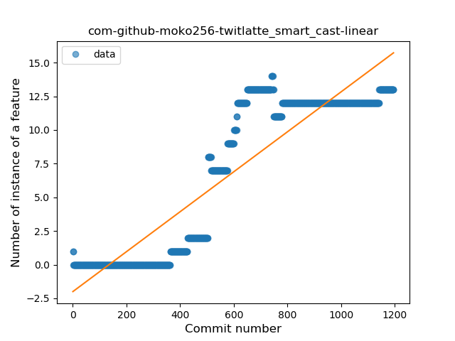

27. org-eurofurence-connavigator

	*  Function: 
	* R_Squared: 0.8022538
 

28. net-nurik-roman-muzei

	*  Function: 
	* R_Squared: 0.79921476
 

29. fr-xgouchet-packageexplorer

	*  Function: 
	* R_Squared: 0.78703268
 

30. chat-rocket-android

	*  Function: 
	* R_Squared: 0.75795709
 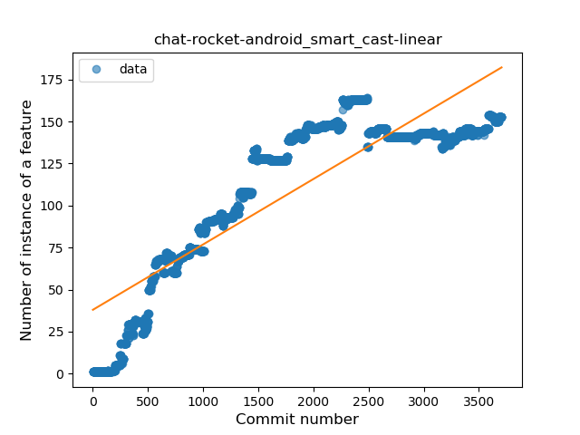

31. fr-chenry-android-freshrss

	*  Function: 
	* R_Squared: 0.7445008
 

32. ffc-app

	*  Function: 
	* R_Squared: 0.74010244
 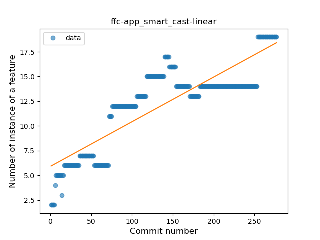

33. me-proxer-app

	*  Function: 
	* R_Squared: 0.73229277
 

35. org-kiwix-kiwixcustomwikivoyageeurope

	*  Function: 
	* R_Squared: 0.57309667
 

37. pw-janyo-whatanime

	*  Function: 
	* R_Squared: 0.49426804
 

42. de-geeksfactory-opacclient

	*  Function: 
	* R_Squared: 0.35177249
 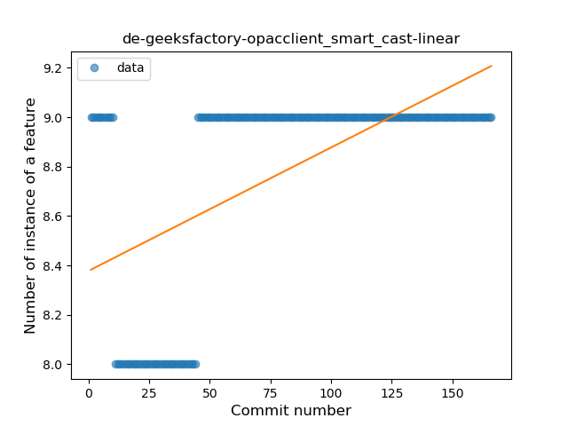

46. net-frju-flym

	*  Function: 
	* R_Squared: 0.15746029
 

51. es-usc-citius-servando-calendula

	*  Function: 
	* R_Squared: 0.00566048
 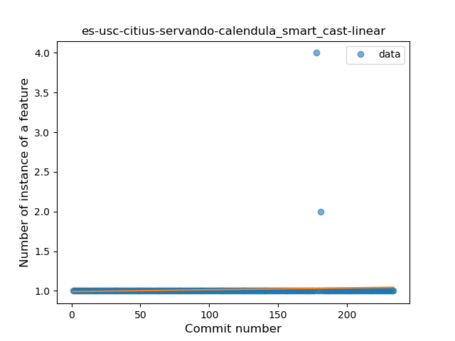

### <a name="T4">Sudden Rise</a> 
 ----

2. ch-deletescape-lawnchair-plah

	*  Function: 
	* R_Squared: 0.98408052
 

3. io-ipoli-android

	*  Function: 
	* R_Squared: 0.97979449
 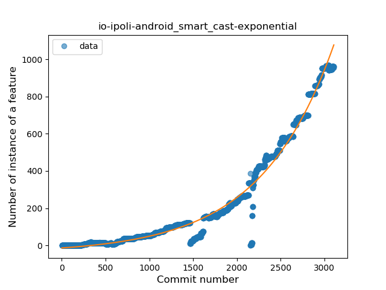

4. org-walleth

	*  Function: 
	* R_Squared: 0.962096
 

5. com-fsck-k9

	*  Function: 
	* R_Squared: 0.95997279
 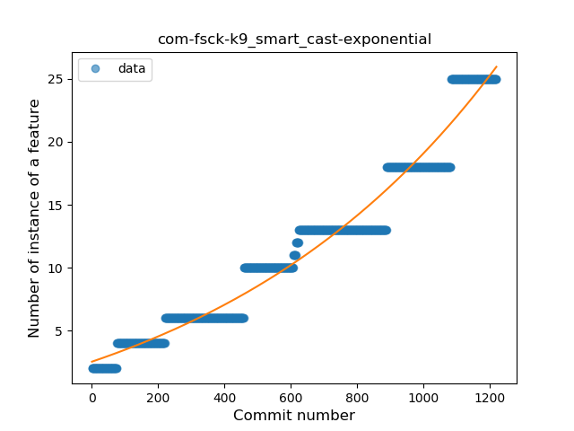

6. im-vector-alpha

	*  Function: 
	* R_Squared: 0.95822449
 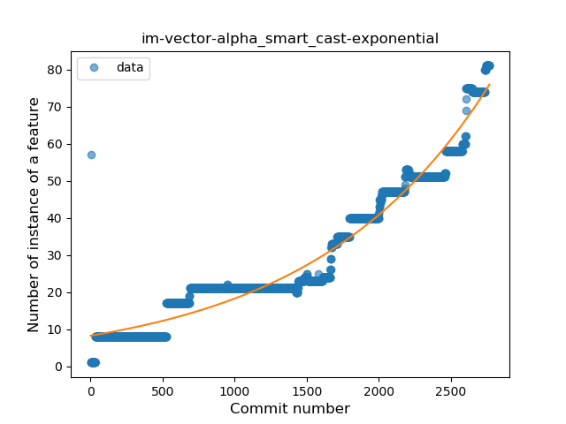

7. com-lavadip-miniVector

	*  Function: 
	* R_Squared: 0.95676803
 

8. com-duckduckgo-mobile-android

	*  Function: 
	* R_Squared: 0.95244437
 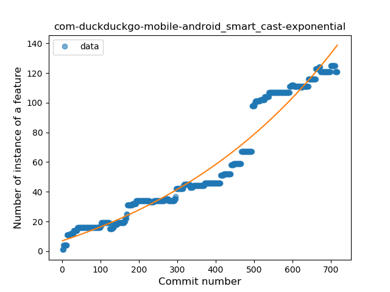

9. me-anon-grow

	*  Function: 
	* R_Squared: 0.9486212
 

10. org-mozilla-rocket

	*  Function: 
	* R_Squared: 0.94560424
 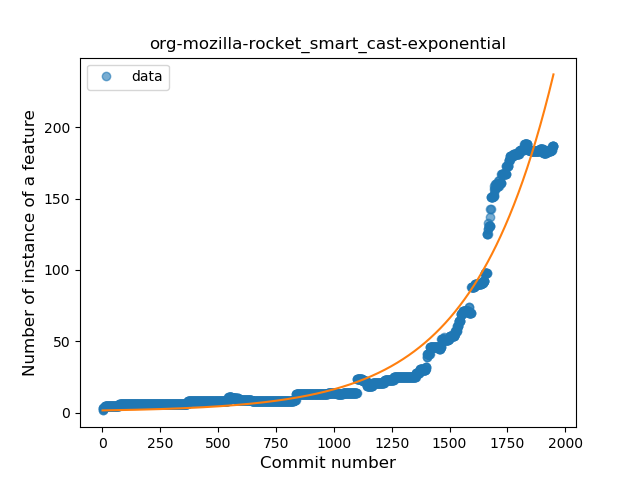

11. io-github-feelfreelinux-wykopmobilny

	*  Function: 
	* R_Squared: 0.9442005
 

12. com-peterlaurence-trekme

	*  Function: 
	* R_Squared: 0.92443228
 

13. eu-kanade-tachiyomi

	*  Function: 
	* R_Squared: 0.91352472
 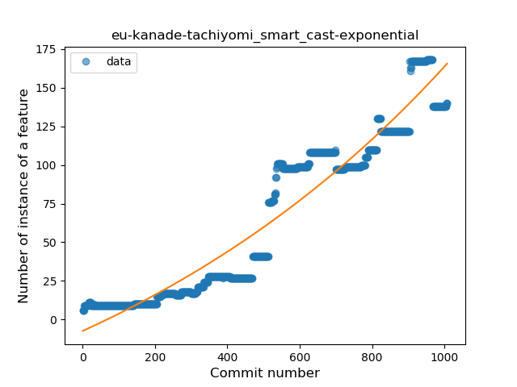

14. de-westnordost-streetcomplete

	*  Function: 
	* R_Squared: 0.90670555
 

15. com-sjn-stamp

	*  Function: 
	* R_Squared: 0.90571891
 

16. com-moez-QKSMS

	*  Function: 
	* R_Squared: 0.9026413
 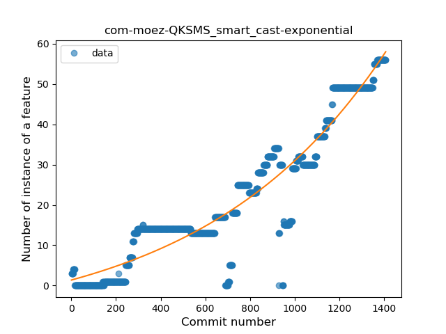

17. acr-browser-lightning

	*  Function: 
	* R_Squared: 0.89994588
 

18. com-motion-stage1

	*  Function: 
	* R_Squared: 0.88328091
 

19. ai-susi

	*  Function: 
	* R_Squared: 0.88306392
 

20. com-czbix-v2ex

	*  Function: 
	* R_Squared: 0.88046169
 

21. ml-adamsprogs-bimba

	*  Function: 
	* R_Squared: 0.86040493
 

23. org-zimmob-zimlx

	*  Function: 
	* R_Squared: 0.84213851
 

24. com-loloof64-android-basicchessendgamestrainer

	*  Function: 
	* R_Squared: 0.84145812
 

25. de-r4md4c-gamedealz

	*  Function: 
	* R_Squared: 0.82446781
 

28. com-dozingcatsoftware-vectorcamera

	*  Function: 
	* R_Squared: 0.79708984
 

30. com-cookiegames-smartcookie

	*  Function: 
	* R_Squared: 0.77462287
 

31. nl-mpcjanssen-simpletask

	*  Function: 
	* R_Squared: 0.74311024
 

32. link-standen-michael-phonesaver

	*  Function: 
	* R_Squared: 0.74229638
 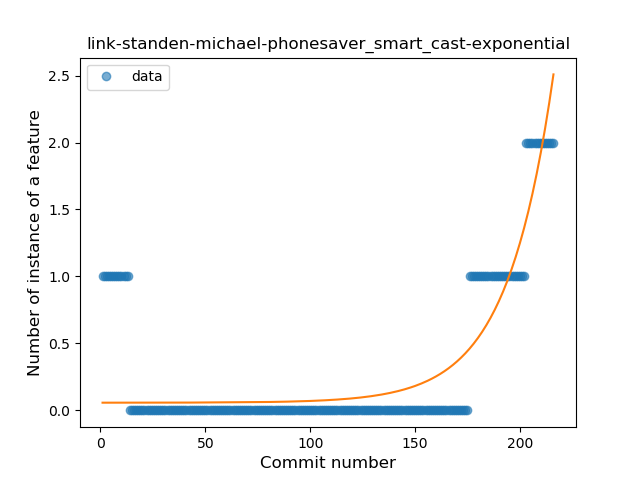

33. com-ofalvai-bpinfo

	*  Function: 
	* R_Squared: 0.72260984
 

35. pw-janyo-janyoshare

	*  Function: 
	* R_Squared: 0.66755666
 

38. me-murks-feedwatcher

	*  Function: 
	* R_Squared: 0.59281172
 

39. cat-pantsu-nyaapantsu

	*  Function: 
	* R_Squared: 0.57559626
 

40. me-echeung-moemoekyun-fdroid

	*  Function: 
	* R_Squared: 0.52350737
 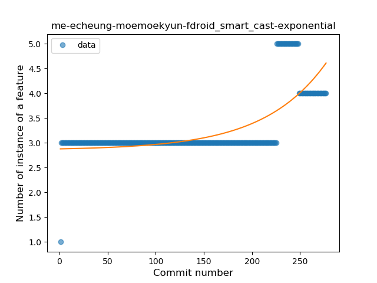

41. ryey-easer-beta

	*  Function: 
	* R_Squared: 0.47551257
 

42. org-blokada-alarm

	*  Function: 
	* R_Squared: 0.36149058
 

43. me-blog-korn123-easydiary

	*  Function: 
	* R_Squared: 0.22782676
 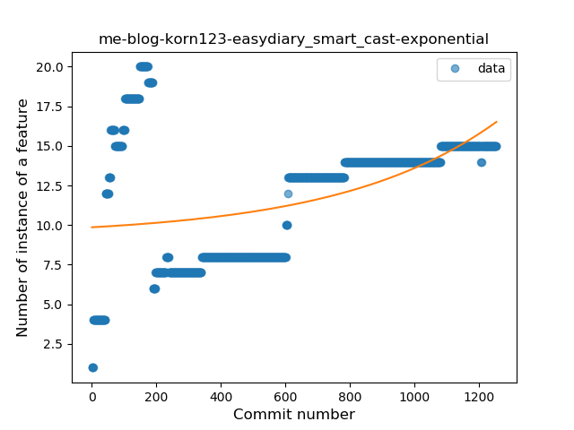

### <a name="T9">Plateau Sudden Rise</a> 
 ----

3. com-gimranov-zandy-app

	*  Function: 
	* R_Squared: 1.0
 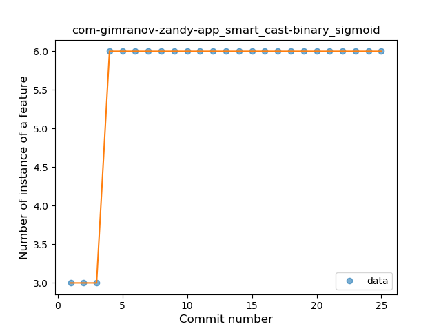

6. com-thanksmister-iot-mqtt-alarmpanel

	*  Function: 
	* R_Squared: 1.0
 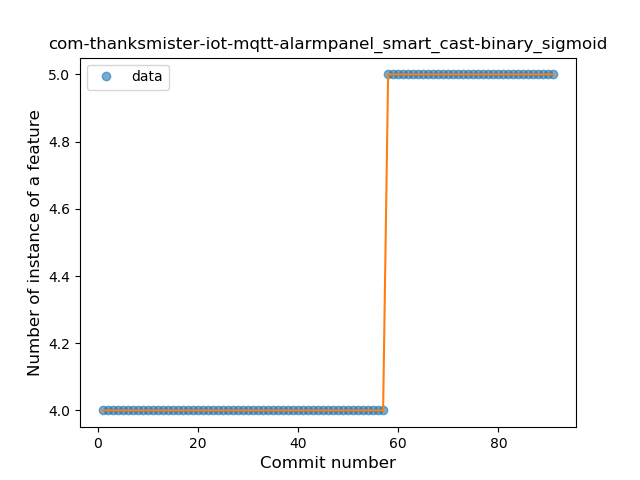

7. com-uwetrottmann-wpdisplay

	*  Function: 
	* R_Squared: 1.0
 

9. de-Maxr1998-xposed-maxlock

	*  Function: 
	* R_Squared: 1.0
 

10. de-avpptr-umweltzone

	*  Function: 
	* R_Squared: 1.0
 

11. de-micmun-android-deufeitage

	*  Function: 
	* R_Squared: 1.0
 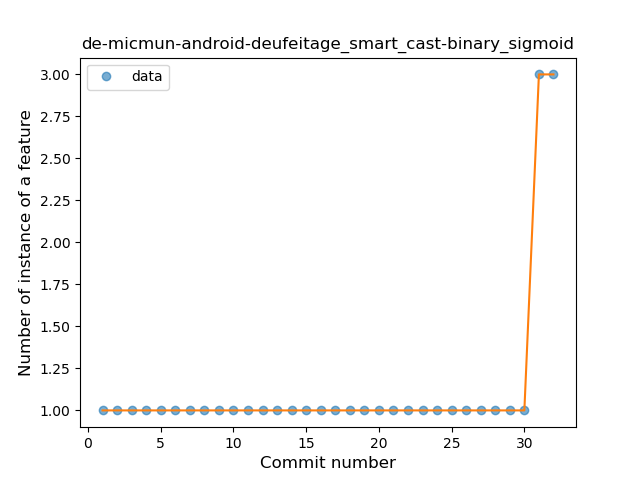

13. fr-openium-auvergnewebcams

	*  Function: 
	* R_Squared: 1.0
 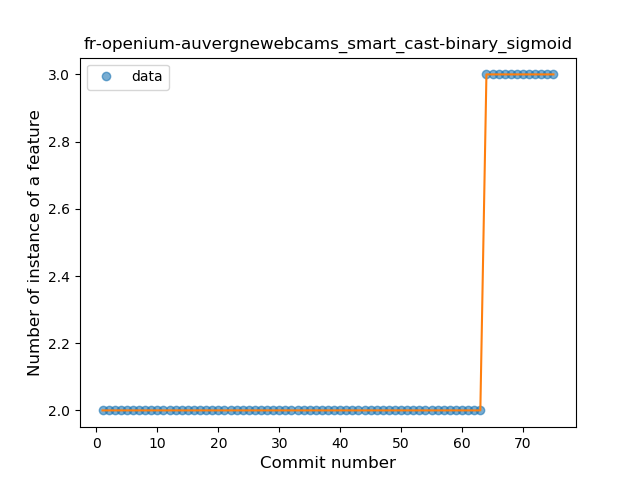

14. horse-amazin-my-stratum0-statuswidget

	*  Function: 
	* R_Squared: 1.0
 

15. io-homeassistant-android

	*  Function: 
	* R_Squared: 1.0
 

16. is-xyz-omw

	*  Function: 
	* R_Squared: 1.0
 

17. nl-renedegroot-android-adbawake

	*  Function: 
	* R_Squared: 1.0
 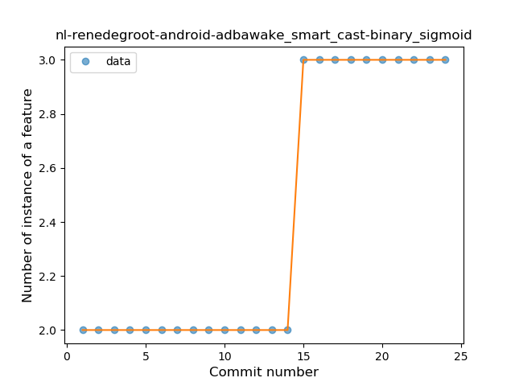

20. org-ligi-survivalmanual

	*  Function: 
	* R_Squared: 1.0
 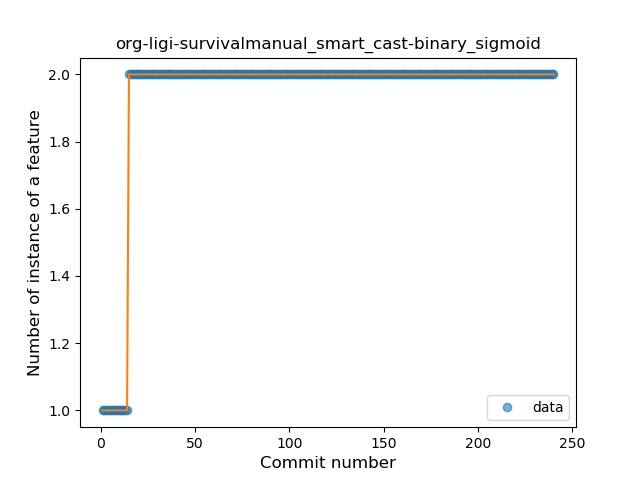

22. org-mosad-seil0-projectlaogai

	*  Function: 
	* R_Squared: 1.0
 

24. science-apolline

	*  Function: 
	* R_Squared: 1.0
 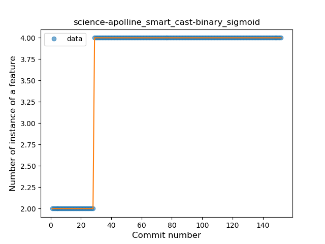

26. de-thecode-lmd

	*  Function: 
	* R_Squared: 0.98672905
 

27. com-simplemobiletools-draw

	*  Function: 
	* R_Squared: 0.9792921
 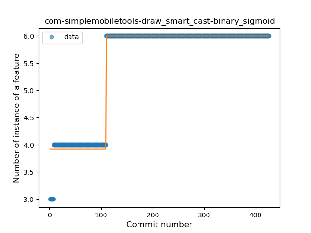

28. com-simplemobiletools-draw-pro

	*  Function: 
	* R_Squared: 0.9792921
 

29. de-thecode-android-tazreader

	*  Function: 
	* R_Squared: 0.97518808
 

30. org-pacien-tincapp

	*  Function: 
	* R_Squared: 0.96710855
 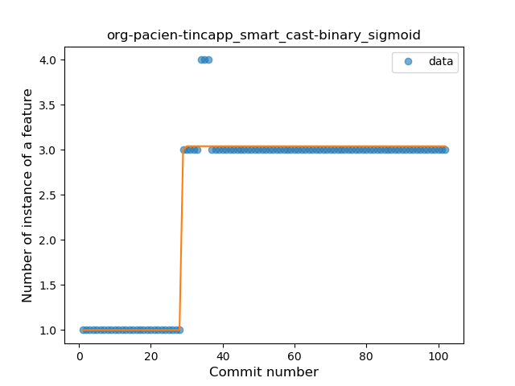

32. ca-fuwafuwa-kaku

	*  Function: 
	* R_Squared: 0.93436799
 

33. com-adityakamble49-dcipher

	*  Function: 
	* R_Squared: 0.9269682
 

34. de-devmil-paperlaunch

	*  Function: 
	* R_Squared: 0.92093211
 

36. is-xyz-mpv

	*  Function: 
	* R_Squared: 0.84159237
 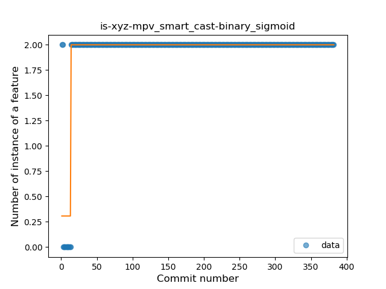

38. com-github-quarck-calnotify

	*  Function: 
	* R_Squared: 0.26546712
 

39. fr-insapp-insapp

	*  Function: 
	* R_Squared: 0.14814815
 

### <a name="T6">Sudden Rise Plateau</a> 
 ----

1. net-yslibrary-monotweety

	*  Function: 
	* R_Squared: 0.88083061
 

2. org-weilbach-splitbills

	*  Function: 
	* R_Squared: 0.83606853
 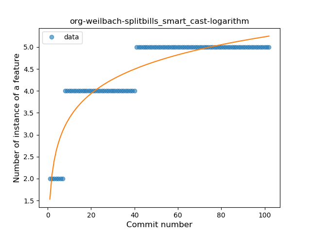

3. com-arcao-geocaching4locus

	*  Function: 
	* R_Squared: 0.82742004
 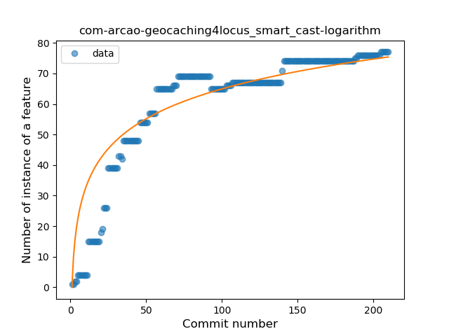

4. org-blitzortung-android-app

	*  Function: 
	* R_Squared: 0.82006816
 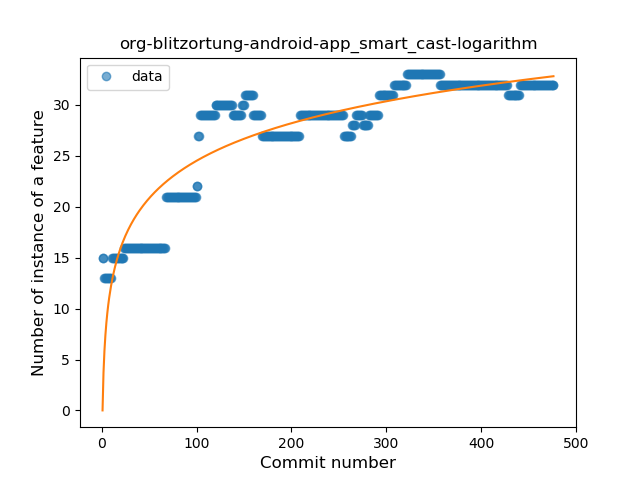

5. com-glodanif-bluetoothchat

	*  Function: 
	* R_Squared: 0.79173145
 

6. de-grobox-liberario

	*  Function: 
	* R_Squared: 0.76911716
 

7. com-mgaetan89-showsrage

	*  Function: 
	* R_Squared: 0.76861921
 

8. com-doctoror-particleswallpaper

	*  Function: 
	* R_Squared: 0.75854364
 

9. li-klass-fhem

	*  Function: 
	* R_Squared: 0.75188197
 

10. com-benoitletondor-easybudgetapp

	*  Function: 
	* R_Squared: 0.69579386
 

11. eu-the4thfloor-msync

	*  Function: 
	* R_Squared: 0.61651526
 

12. com-garpr-android

	*  Function: 
	* R_Squared: 0.59067216
 

13. com-eventyay-attendee

	*  Function: 
	* R_Squared: 0.49812273
 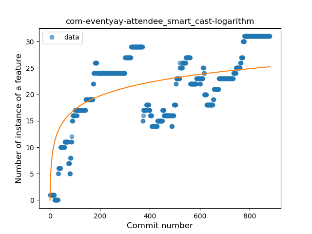

14. com-utazukin-ichaival

	*  Function: 
	* R_Squared: 0.48815894
 

15. com-booboot-vndbandroid

	*  Function: 
	* R_Squared: 0.47221495
 

16. sk-styk-martin-apkanalyzer

	*  Function: 
	* R_Squared: 0.45197578
 

17. com-kgurgul-cpuinfo

	*  Function: 
	* R_Squared: 0.15710188
 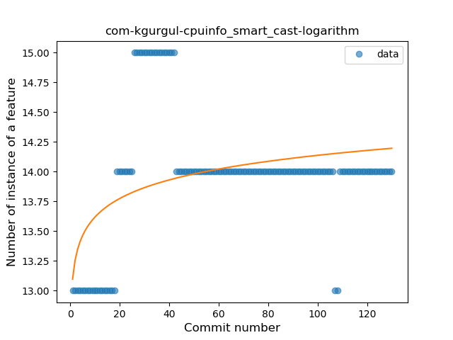

18. com-phicdy-totoanticipation

	*  Function: 
	* R_Squared: 0.1514691
 

19. org-mattvchandler-progressbars

	*  Function: 
	* R_Squared: 0.08251564
 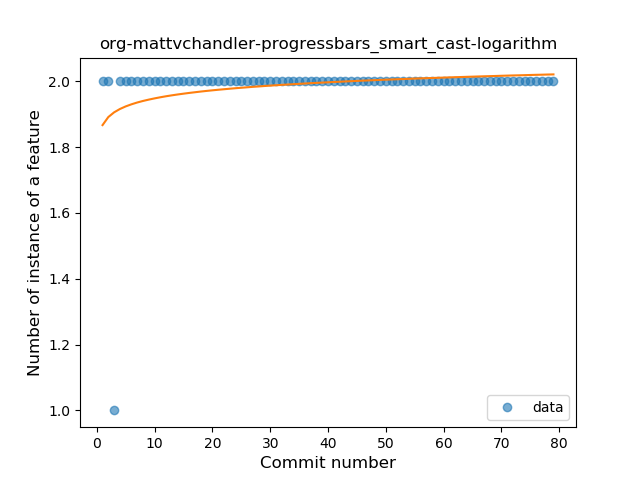

20. me-rei_m-hyakuninisshu

	*  Function: 
	* R_Squared: 0.07755599
 

### <a name="T2">Constant Decline</a> 
 ----

34. cz-dvratil-fbeventsync

	*  Function: 
	* R_Squared: 0.62888987
 

36. com-simplemobiletools-gallery

	*  Function: 
	* R_Squared: 0.57270415
 

38. org-isoron-uhabits

	*  Function: 
	* R_Squared: 0.48459234
 

39. com-corphish-nightlight-generic

	*  Function: 
	* R_Squared: 0.47469745
 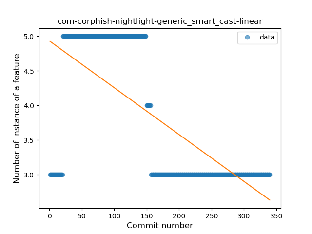

40. at-bitfire-icsdroid

	*  Function: 
	* R_Squared: 0.46855205
 

41. org-ligi-passandroid

	*  Function: 
	* R_Squared: 0.3977627
 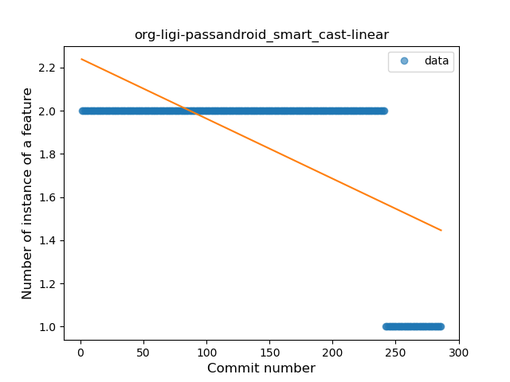

43. tw-shounenwind-kmnbottool

	*  Function: 
	* R_Squared: 0.34850513
 

44. com-etesync-syncadapter

	*  Function: 
	* R_Squared: 0.22569609
 

45. com-atanana-sicounter

	*  Function: 
	* R_Squared: 0.2039939
 

47. com-commit451-gitlab

	*  Function: 
	* R_Squared: 0.03288698
 

48. xyz-hisname-fireflyiii

	*  Function: 
	* R_Squared: 0.01816045
 

49. pixel-kotlin-bassblog

	*  Function: 
	* R_Squared: 0.00738149
 

50. com-simplemobiletools-clock

	*  Function: 
	* R_Squared: 0.00661162
 

52. com-bernaferrari-changedetection

	*  Function: 
	* R_Squared: 2.06e-05
 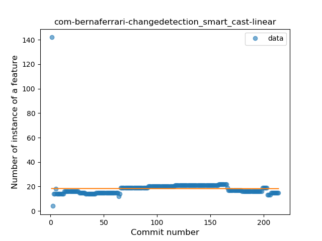

### <a name="T10">Plateau Sudden Decline</a> 
 ----

1. ch-rmy-android-statusbar_tacho

	*  Function: 
	* R_Squared: 1.0
 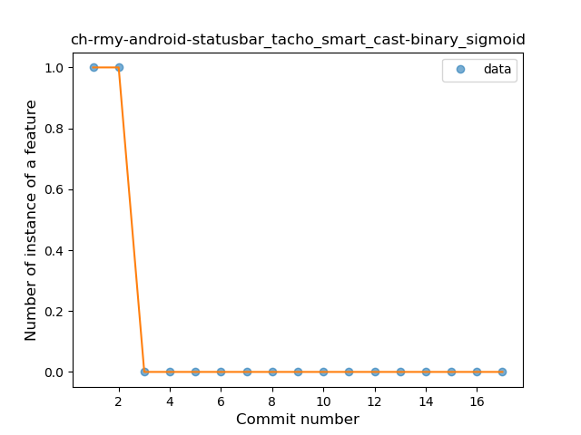

2. com-example-forgottenumbrella-cardboardmuseum

	*  Function: 
	* R_Squared: 1.0
 

4. com-pixplicity-cryptogram

	*  Function: 
	* R_Squared: 1.0
 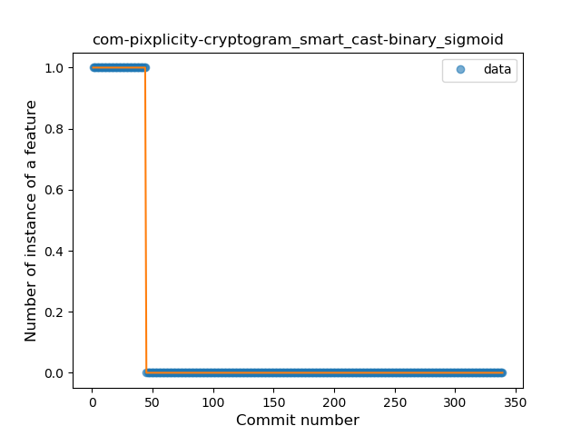

5. com-simplemobiletools-camera

	*  Function: 
	* R_Squared: 1.0
 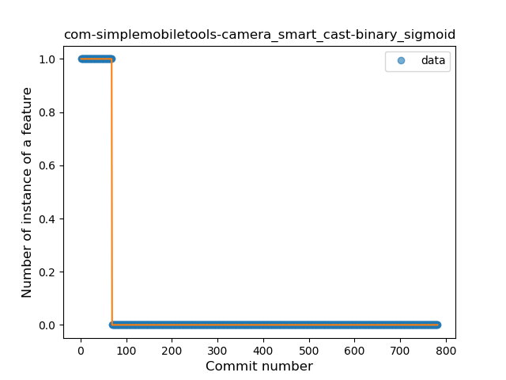

8. com-wbrawner-simplemarkdown

	*  Function: 
	* R_Squared: 1.0
 

12. fr-jnda-android-flashalert

	*  Function: 
	* R_Squared: 1.0
 

18. org-decsync-cc

	*  Function: 
	* R_Squared: 1.0
 

19. org-decsync-sparss-floss

	*  Function: 
	* R_Squared: 1.0
 

21. org-mcxa-vortaro

	*  Function: 
	* R_Squared: 1.0
 

23. rectangledbmi-com-pittsburghrealtimetracker

	*  Function: 
	* R_Squared: 1.0
 

25. tk-superl2-xwifi

	*  Function: 
	* R_Squared: 1.0
 

31. me-camsteffen-polite

	*  Function: 
	* R_Squared: 0.94814689
 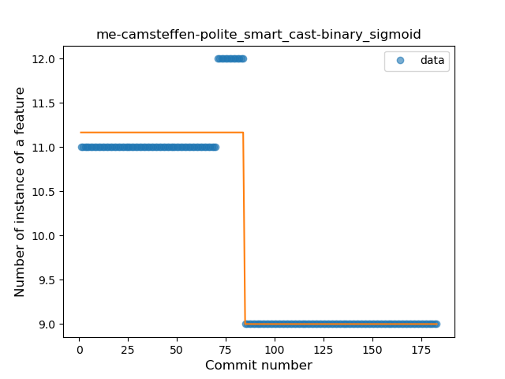

35. me-impa-knockonports

	*  Function: 
	* R_Squared: 0.89565241
 

37. com-sduduzog-slimlauncher

	*  Function: 
	* R_Squared: 0.83333333
 

### <a name="T11">Instability</a> 
 ----

1. com-rhm-pwn

	*  Function: 
	* R_Squared: 0.97277758
 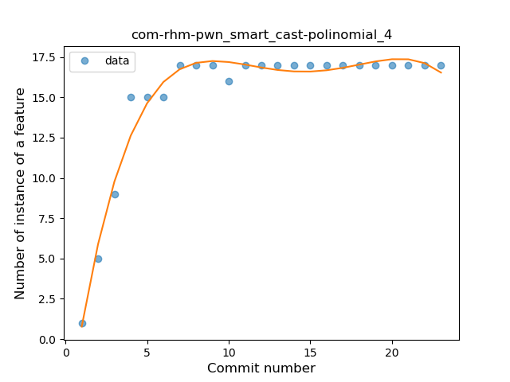

2. com-bracketcove-postrainer

	*  Function: 
	* R_Squared: 0.95892109
 

3. ru-nsu-bobrofon-easysshfs

	*  Function: 
	* R_Squared: 0.79339525
 

4. com-androidheads-vienna-escalero

	*  Function: 
	* R_Squared: 0.65897436
 

5. com-agusyc-daycounter

	*  Function: 
	* R_Squared: 0.26913578
 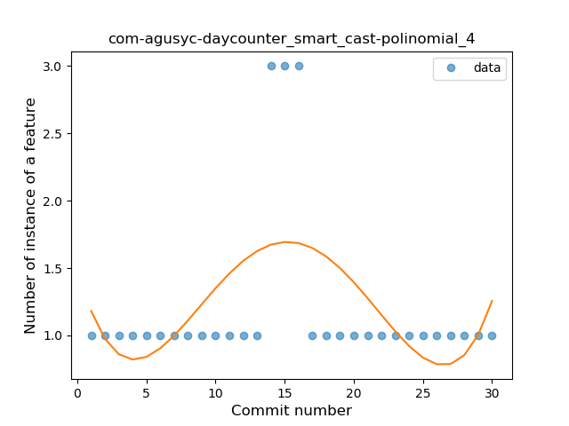

### <a name="T5">Sudden Decline</a> 
 ----

1. sreich-countthedays

	*  Function: 
	* R_Squared: 1.0
 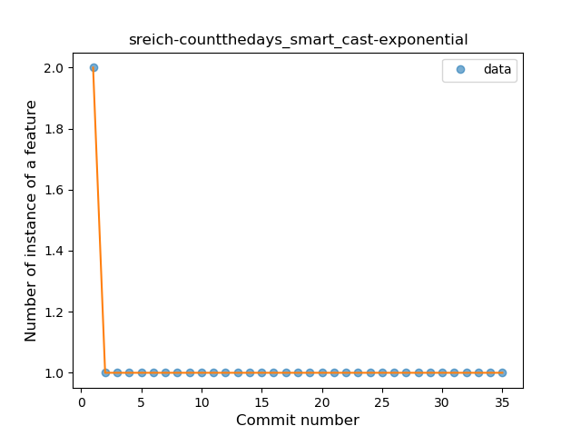

22. com-simplemobiletools-musicplayer

	*  Function: 
	* R_Squared: 0.8430461
 

26. com-epimorphics-android-myrivers

	*  Function: 
	* R_Squared: 0.82057835
 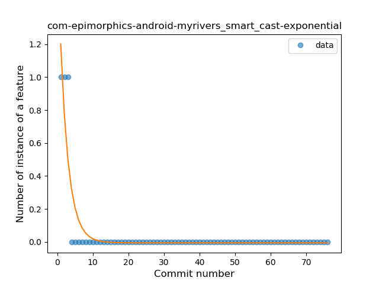

27. io-github-benoitduffez-cupsprint

	*  Function: 
	* R_Squared: 0.81905231
 

29. net-kourlas-voipms

	*  Function: 
	* R_Squared: 0.78078007
 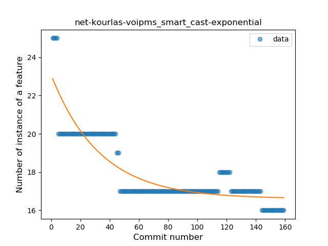

34. com-benny-openlauncher

	*  Function: 
	* R_Squared: 0.71435997
 

36. de-blankedv-lanbahnpanel

	*  Function: 
	* R_Squared: 0.65613362
 

37. info-dvkr-screenstream

	*  Function: 
	* R_Squared: 0.63866326
 

### <a name="T8">Plateau Gradual Decline</a> 
 ----

29. pl-org-seva-texter

	*  Function: 
	* R_Squared: 0.86805359
 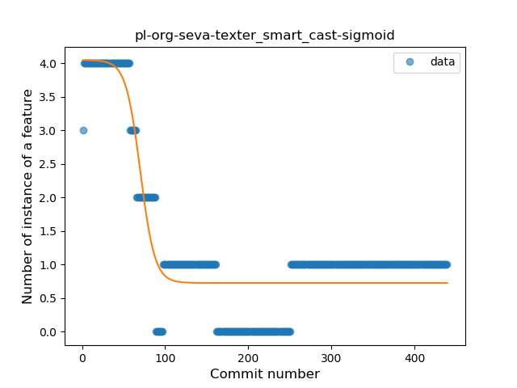

33. org-equeim-tremotesf

	*  Function: 
	* R_Squared: 0.77168765
 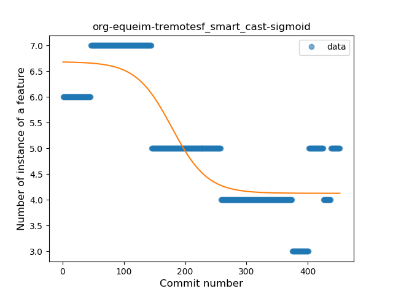

35. eu-depau-etchdroid

	*  Function: 
	* R_Squared: 0.73859647
 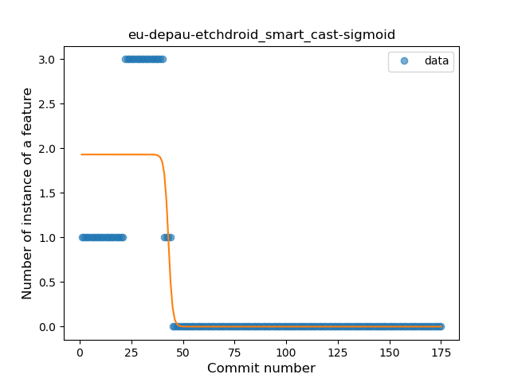

36. superustats-tool-android

	*  Function: 
	* R_Squared: 0.71994009
 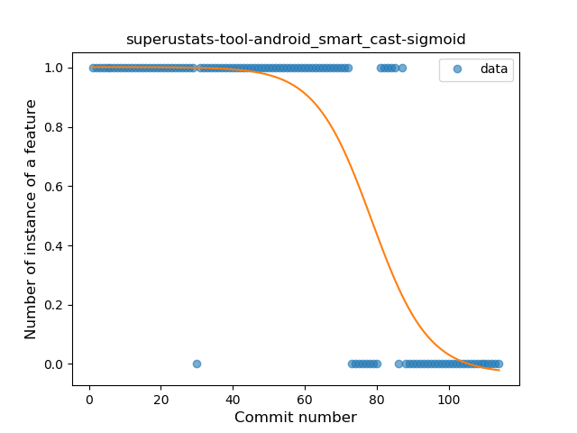

### <a name="T3">Stability</a> 
 ----

