## String Template
----
**Best fit = Constant Rise**: 80

Function | N# best fit
----|----
<a href=" #T1">Constant Rise</a> | 80
<a href=" #T7">Plateau Gradual Rise</a> | 59
<a href=" #T4">Sudden Rise</a> | 39
<a href=" #T11">Instability</a> | 38
<a href=" #T6">Sudden Rise Plateau</a> | 32
<a href=" #T9">Plateau Sudden Rise</a> | 28
<a href=" #T10">Plateau Sudden Decline</a> | 7
<a href=" #T5">Sudden Decline</a> | 6
<a href=" #T2">Constant Decline</a> | 5
<a href=" #T8">Plateau Gradual Decline</a> | 1
<a href=" #T3">Stability</a> | 0

### <a name="T1">Constant Rise</a> 
 ----

1. com-boardgamegeek

	*  Function: 
	* R_Squared: 0.98785143
 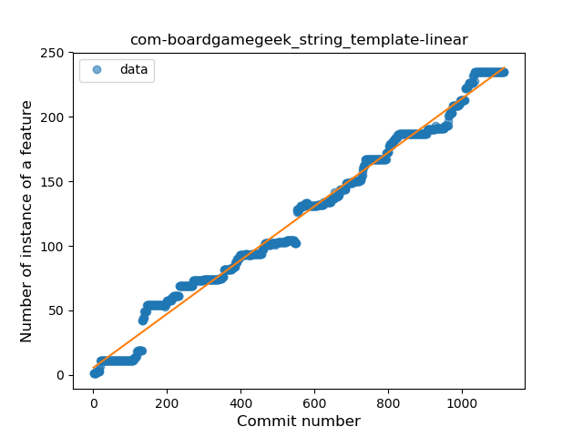

2. li-klass-fhem

	*  Function: 
	* R_Squared: 0.97907558
 

3. org-mariotaku-twidere

	*  Function: 
	* R_Squared: 0.97745318
 

4. com-duckduckgo-mobile-android

	*  Function: 
	* R_Squared: 0.97159317
 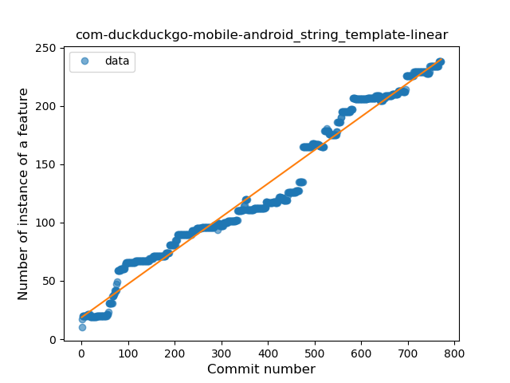

5. com-peterlaurence-trekme

	*  Function: 
	* R_Squared: 0.9672808
 

6. com-dozingcatsoftware-vectorcamera

	*  Function: 
	* R_Squared: 0.96727621
 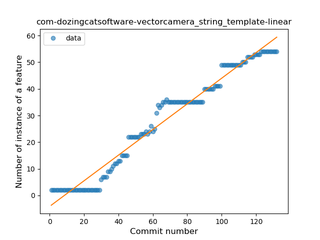

7. com-nononsenseapps-feeder

	*  Function: 
	* R_Squared: 0.96550652
 

8. is-xyz-mpv

	*  Function: 
	* R_Squared: 0.96268742
 

9. ca-josephroque-bowlingcompanion

	*  Function: 
	* R_Squared: 0.96168077
 

10. com-github-quarck-calnotify

	*  Function: 
	* R_Squared: 0.95765966
 

11. com-eventyay-attendee

	*  Function: 
	* R_Squared: 0.95454871
 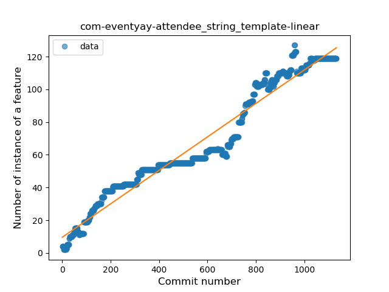

12. com-benoitquenaudon-tvfoot-red

	*  Function: 
	* R_Squared: 0.95172662
 

13. jp-toastkid-yobidashi

	*  Function: 
	* R_Squared: 0.9492711
 

14. eu-kanade-tachiyomi

	*  Function: 
	* R_Squared: 0.94900989
 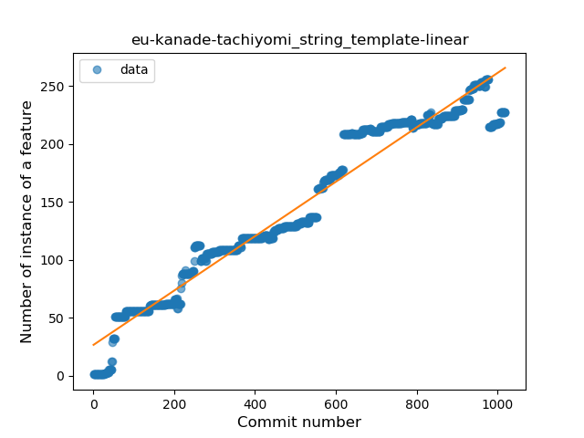

15. com-jereksel-libresubstratum

	*  Function: 
	* R_Squared: 0.94487357
 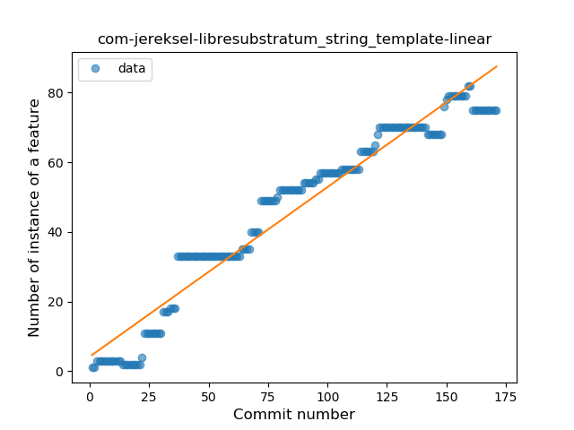

16. chat-rocket-android

	*  Function: 
	* R_Squared: 0.94189898
 

17. be-mygod-vpnhotspot

	*  Function: 
	* R_Squared: 0.94056227
 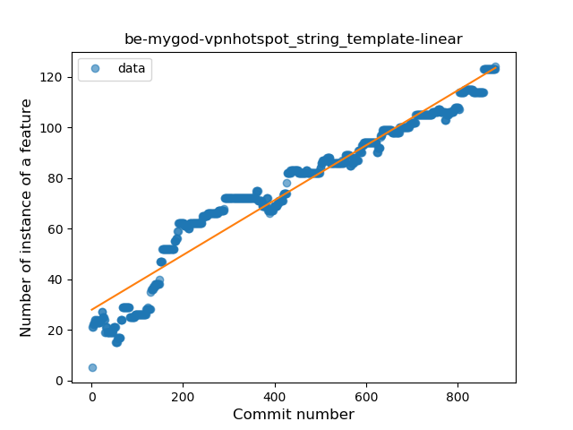

18. com-corphish-nightlight-generic

	*  Function: 
	* R_Squared: 0.94026659
 

19. nl-mpcjanssen-simpletask

	*  Function: 
	* R_Squared: 0.93676977
 

20. org-blitzortung-android-app

	*  Function: 
	* R_Squared: 0.93674167
 

21. xyz-hisname-fireflyiii

	*  Function: 
	* R_Squared: 0.93657044
 

22. com-simplemobiletools-gallery-pro

	*  Function: 
	* R_Squared: 0.93525194
 

23. one-librem-social

	*  Function: 
	* R_Squared: 0.93407633
 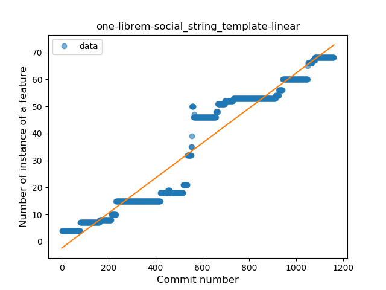

24. com-esafirm-androidplayground

	*  Function: 
	* R_Squared: 0.9333323
 

25. com-tutpro-baresip

	*  Function: 
	* R_Squared: 0.93026274
 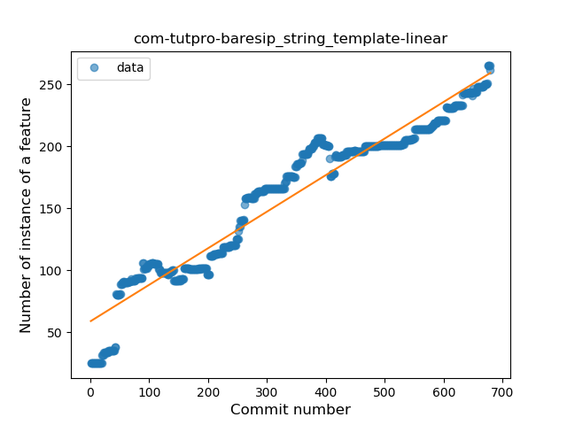

26. io-github-feelfreelinux-wykopmobilny

	*  Function: 
	* R_Squared: 0.92927566
 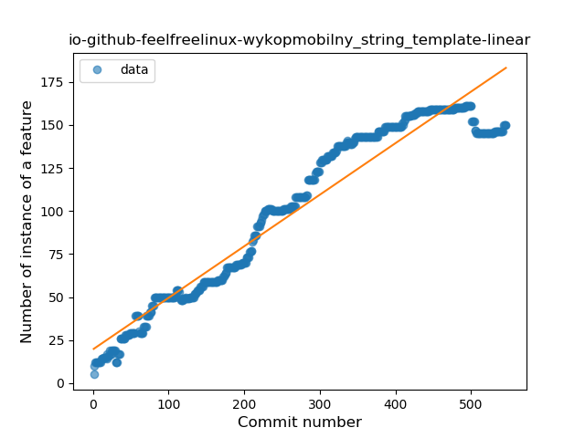

27. com-fastaccess-github-libre

	*  Function: 
	* R_Squared: 0.92672177
 

28. org-emunix-insteadlauncher

	*  Function: 
	* R_Squared: 0.91147948
 

29. com-orgzly

	*  Function: 
	* R_Squared: 0.90994715
 

30. io-github-fvasco-pinpoi

	*  Function: 
	* R_Squared: 0.90777495
 

31. de-thecode-android-tazreader

	*  Function: 
	* R_Squared: 0.90691701
 

32. ffc-app

	*  Function: 
	* R_Squared: 0.90345426
 

33. me-blog-korn123-easydiary

	*  Function: 
	* R_Squared: 0.90325296
 

34. org-kaqui

	*  Function: 
	* R_Squared: 0.90220423
 

35. org-fossasia-badgemagic

	*  Function: 
	* R_Squared: 0.9008417
 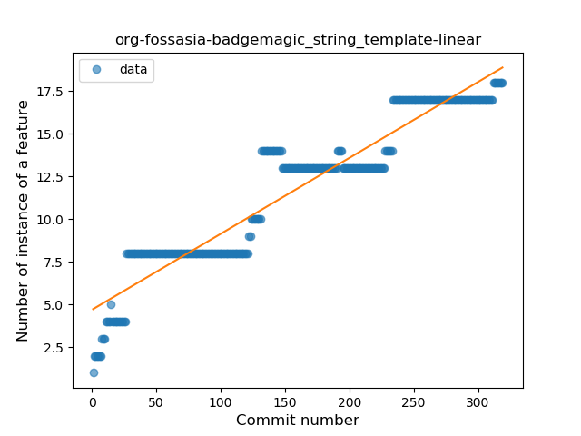

36. de-grobox-liberario

	*  Function: 
	* R_Squared: 0.89968199
 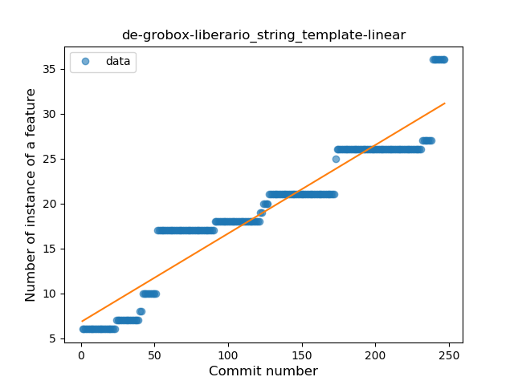

37. fr-xgouchet-packageexplorer

	*  Function: 
	* R_Squared: 0.89676453
 

38. com-zacharee1-systemuituner

	*  Function: 
	* R_Squared: 0.89409658
 

39. com-ianhanniballake-contractiontimer

	*  Function: 
	* R_Squared: 0.89022179
 

40. fr-chenry-android-freshrss

	*  Function: 
	* R_Squared: 0.88950701
 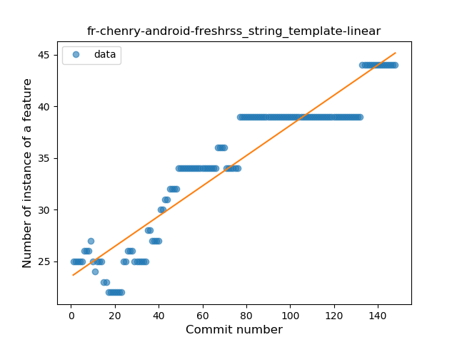

41. com-ofalvai-bpinfo

	*  Function: 
	* R_Squared: 0.88833389
 

42. com-dp-logcatapp

	*  Function: 
	* R_Squared: 0.88671137
 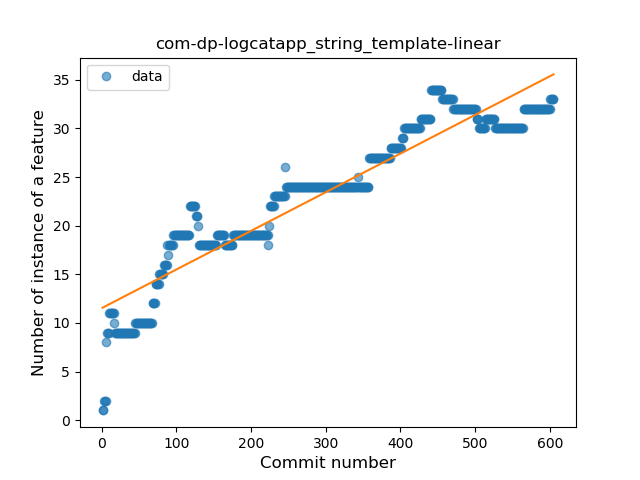

43. fi-kroon-vadret

	*  Function: 
	* R_Squared: 0.87828901
 

44. de-Maxr1998-xposed-maxlock

	*  Function: 
	* R_Squared: 0.87531742
 

45. de-thecode-lmd

	*  Function: 
	* R_Squared: 0.87364437
 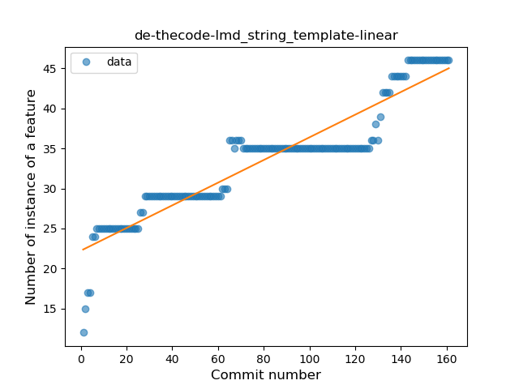

46. ca-fuwafuwa-kaku

	*  Function: 
	* R_Squared: 0.86978104
 

47. net-osmand-plus

	*  Function: 
	* R_Squared: 0.85787296
 

48. apps-amine-bou-readerforselfoss

	*  Function: 
	* R_Squared: 0.85424654
 

49. org-ligi-gobandroid

	*  Function: 
	* R_Squared: 0.85419765
 

50. com-wabadaba-dziennik

	*  Function: 
	* R_Squared: 0.84940386
 

51. org-eurofurence-connavigator

	*  Function: 
	* R_Squared: 0.84862181
 

52. com-fallgamlet-dnestrcinema

	*  Function: 
	* R_Squared: 0.83710801
 

53. is-xyz-omw

	*  Function: 
	* R_Squared: 0.82685004
 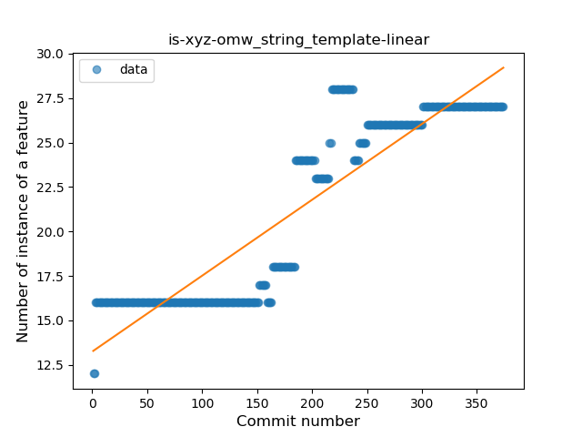

54. org-blokada-alarm

	*  Function: 
	* R_Squared: 0.82099221
 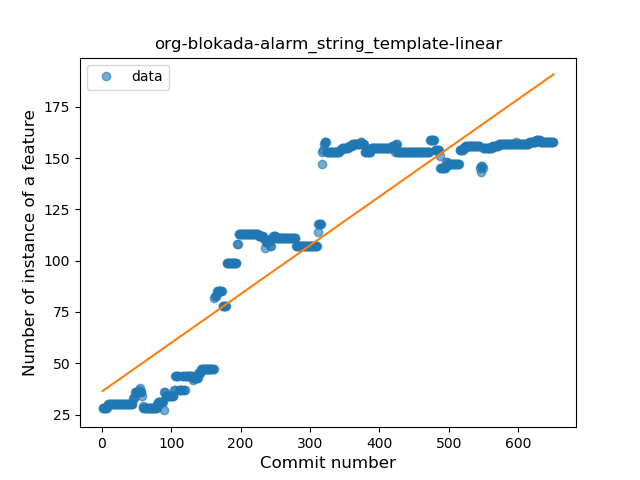

55. pl-hypeapp-episodie

	*  Function: 
	* R_Squared: 0.81479938
 

56. com-pitchedapps-frost

	*  Function: 
	* R_Squared: 0.8147978
 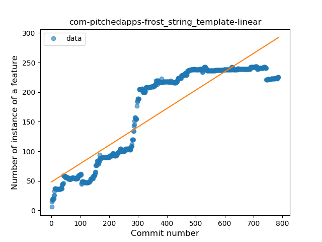

57. io-github-wulkanowy

	*  Function: 
	* R_Squared: 0.80318569
 

58. de-r4md4c-gamedealz

	*  Function: 
	* R_Squared: 0.79443035
 

59. org-poul-bits-android

	*  Function: 
	* R_Squared: 0.79169162
 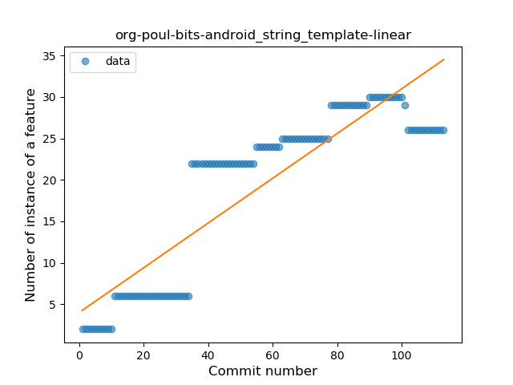

60. com-njlabs-showjava

	*  Function: 
	* R_Squared: 0.79134773
 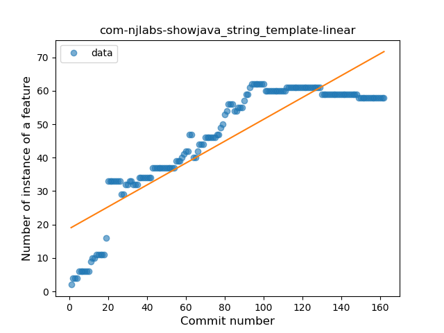

61. com-yubico-yubioath

	*  Function: 
	* R_Squared: 0.78020212
 

62. com-jmstudios-redmoon

	*  Function: 
	* R_Squared: 0.77635592
 

63. acr-browser-lightning

	*  Function: 
	* R_Squared: 0.75961782
 

64. com-simplemobiletools-gallery

	*  Function: 
	* R_Squared: 0.7527325
 

65. com-github-moko256-twitlatte

	*  Function: 
	* R_Squared: 0.75129134
 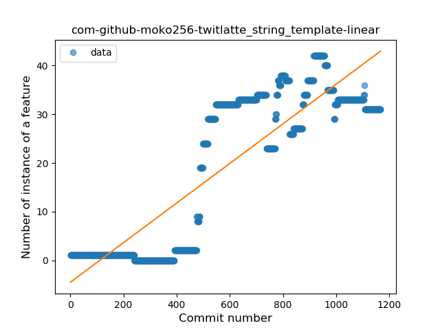

66. tw-shounenwind-kmnbottool

	*  Function: 
	* R_Squared: 0.74966533
 

67. net-nurik-roman-muzei

	*  Function: 
	* R_Squared: 0.74283262
 

68. com-uwetrottmann-wpdisplay

	*  Function: 
	* R_Squared: 0.74149534
 

69. org-freedombox-freedombox

	*  Function: 
	* R_Squared: 0.73979741
 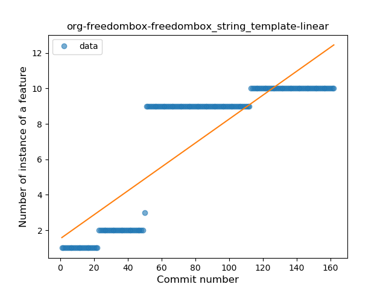

70. com-garpr-android

	*  Function: 
	* R_Squared: 0.72722883
 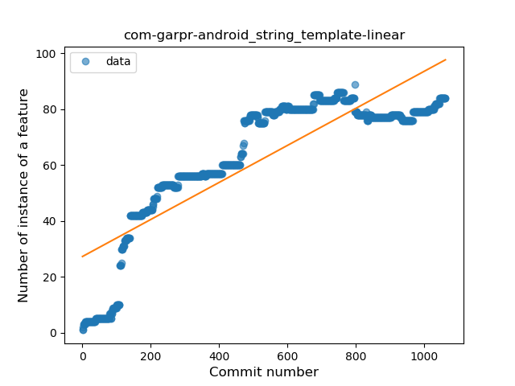

71. com-simplemobiletools-thankyou

	*  Function: 
	* R_Squared: 0.72055966
 

72. jp-takke-cpustats

	*  Function: 
	* R_Squared: 0.71951046
 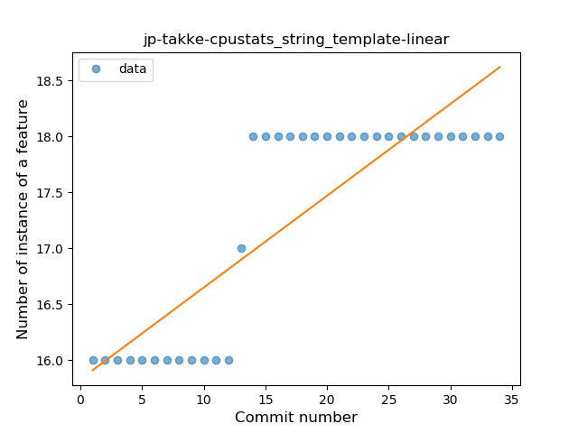

73. net-kourlas-voipms

	*  Function: 
	* R_Squared: 0.71115142
 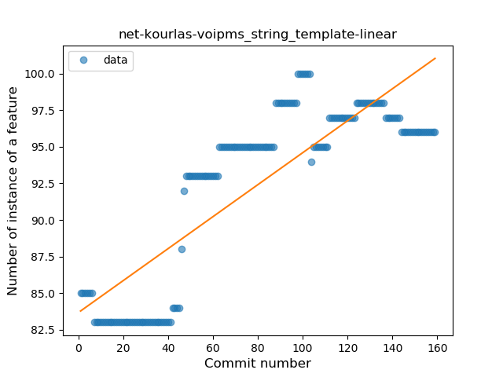

74. me-proxer-app

	*  Function: 
	* R_Squared: 0.69442421
 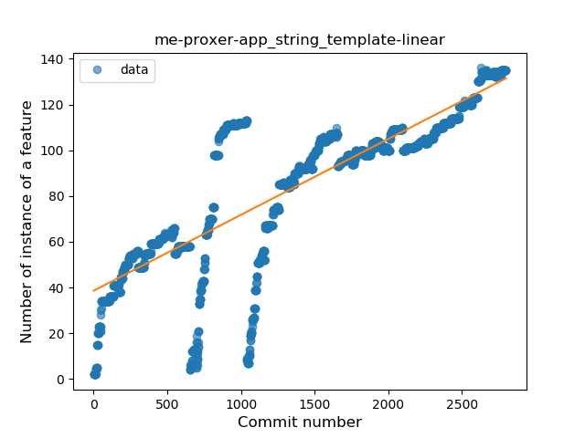

75. com-kgurgul-cpuinfo

	*  Function: 
	* R_Squared: 0.69363711
 

76. de-avpptr-umweltzone

	*  Function: 
	* R_Squared: 0.69338602
 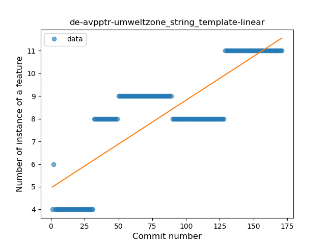

77. fr-free-nrw-commons

	*  Function: 
	* R_Squared: 0.67440471
 

78. net-frju-flym

	*  Function: 
	* R_Squared: 0.61472612
 

79. eu-the4thfloor-msync

	*  Function: 
	* R_Squared: 0.47008382
 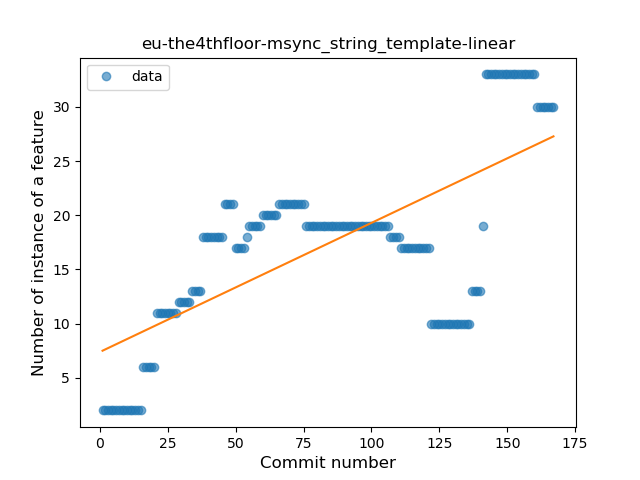

83. com-commit451-gitlab

	*  Function: 
	* R_Squared: 0.15827543
 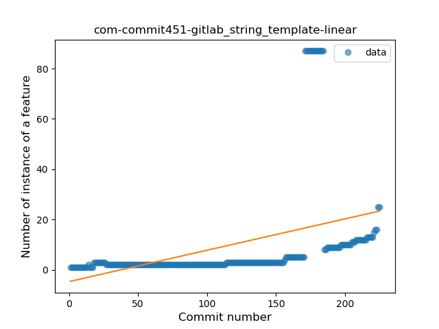

### <a name="T7">Plateau Gradual Rise</a> 
 ----

1. org-moire-ultrasonic

	*  Function: 
	* R_Squared: 0.9954708
 

2. net-syncthing-lite

	*  Function: 
	* R_Squared: 0.99479803
 

3. com-calintat-units

	*  Function: 
	* R_Squared: 0.99065159
 

4. de-geeksfactory-opacclient

	*  Function: 
	* R_Squared: 0.9892552
 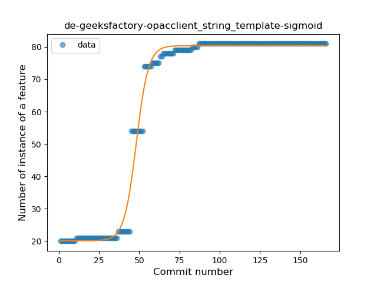

5. de-devmil-muzei-bingimageofthedayartsource

	*  Function: 
	* R_Squared: 0.98460545
 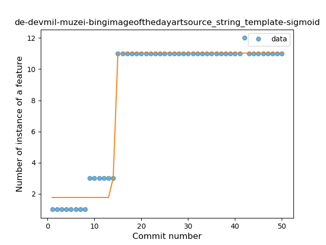

6. net-stew-stew

	*  Function: 
	* R_Squared: 0.98231627
 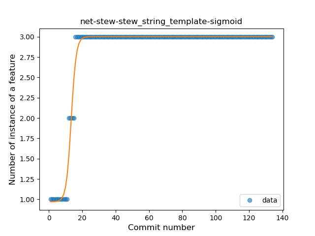

7. de-csicar-mensaplan

	*  Function: 
	* R_Squared: 0.97967622
 

8. com-crane-mockappdemo

	*  Function: 
	* R_Squared: 0.97672565
 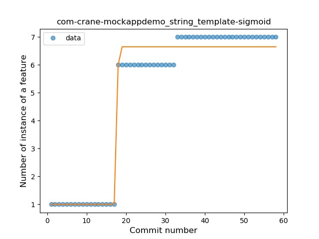

9. com-ogsdroid

	*  Function: 
	* R_Squared: 0.97592177
 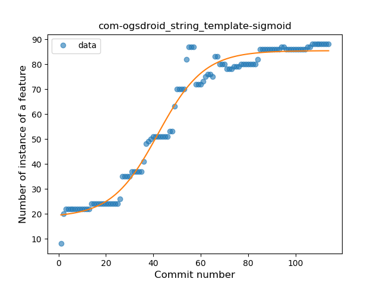

10. io-github-z3r0c00l

	*  Function: 
	* R_Squared: 0.97263878
 

11. com-rhm-pwn

	*  Function: 
	* R_Squared: 0.96836023
 

12. cat-xojan-random1

	*  Function: 
	* R_Squared: 0.96799025
 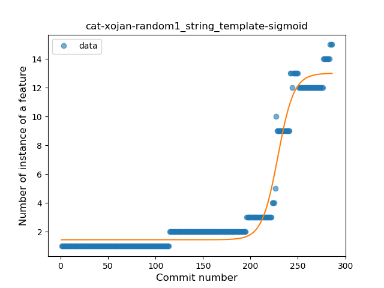

13. com-ids1024-whitakerswords

	*  Function: 
	* R_Squared: 0.96671078
 

14. com-keylesspalace-tusky

	*  Function: 
	* R_Squared: 0.96443924
 

15. com-log28

	*  Function: 
	* R_Squared: 0.96438011
 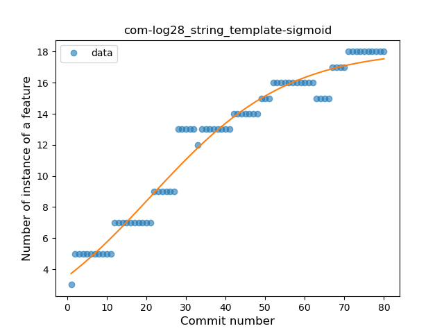

16. tk-superl2-xwifi

	*  Function: 
	* R_Squared: 0.96345395
 

17. com-bijoysingh-quicknote

	*  Function: 
	* R_Squared: 0.96204809
 

18. com-stevenschoen-putionew

	*  Function: 
	* R_Squared: 0.96141555
 

19. com-wbrawner-simplemarkdown

	*  Function: 
	* R_Squared: 0.96118731
 

20. cat-pantsu-nyaapantsu

	*  Function: 
	* R_Squared: 0.95858849
 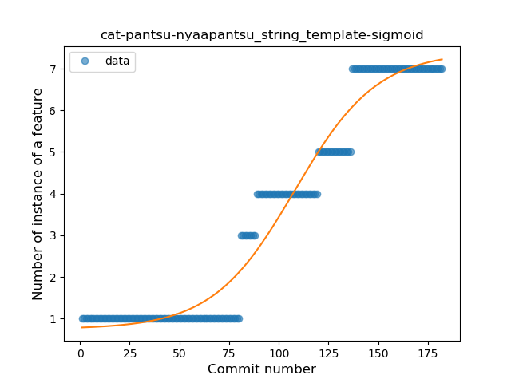

21. de-markusfisch-android-binaryeye

	*  Function: 
	* R_Squared: 0.95771479
 

22. com-lavadip-miniVector

	*  Function: 
	* R_Squared: 0.95588307
 

23. im-vector-alpha

	*  Function: 
	* R_Squared: 0.95528513
 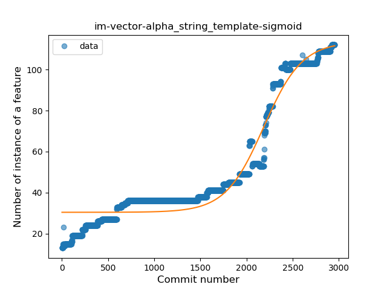

24. net-mm2d-dmsexplorer

	*  Function: 
	* R_Squared: 0.95517105
 

25. org-ligi-survivalmanual

	*  Function: 
	* R_Squared: 0.95072192
 

26. com-simplemobiletools-filemanager-pro

	*  Function: 
	* R_Squared: 0.94840779
 

27. fr-openium-auvergnewebcams

	*  Function: 
	* R_Squared: 0.94679812
 

28. pl-org-seva-texter

	*  Function: 
	* R_Squared: 0.9459372
 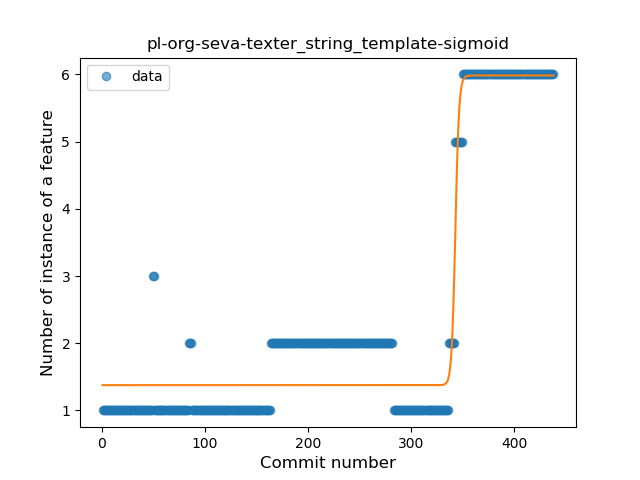

29. app-opass-ccip

	*  Function: 
	* R_Squared: 0.94402316
 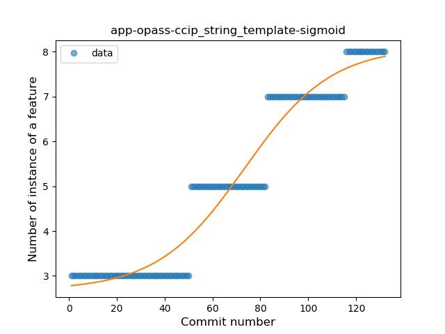

30. com-heed-justquotes

	*  Function: 
	* R_Squared: 0.94365549
 

31. pw-janyo-whatanime

	*  Function: 
	* R_Squared: 0.93692955
 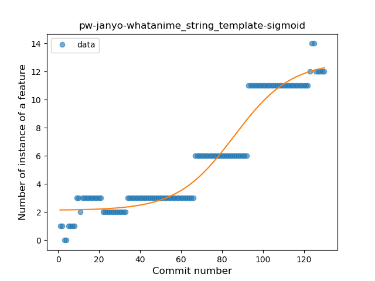

32. com-epimorphics-android-myrivers

	*  Function: 
	* R_Squared: 0.93444449
 

33. org-pacien-tincapp

	*  Function: 
	* R_Squared: 0.93401177
 

34. org-zimmob-zimlx

	*  Function: 
	* R_Squared: 0.92923621
 

35. com-adityakamble49-dcipher

	*  Function: 
	* R_Squared: 0.9289057
 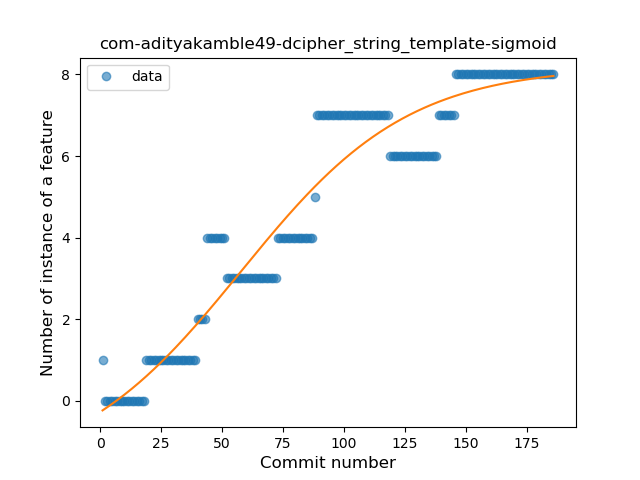

36. com-tasomaniac-openwith-floss

	*  Function: 
	* R_Squared: 0.9268808
 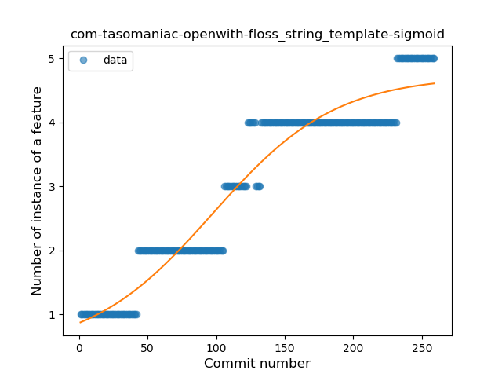

37. org-havenapp-main

	*  Function: 
	* R_Squared: 0.92308819
 

38. se-barsk-park

	*  Function: 
	* R_Squared: 0.92156475
 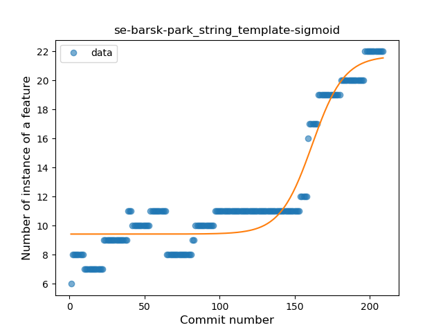

39. ch-abertschi-adfree

	*  Function: 
	* R_Squared: 0.919938
 

40. me-kirimin-mitsumine

	*  Function: 
	* R_Squared: 0.90194863
 

41. org-walleth

	*  Function: 
	* R_Squared: 0.89985452
 

42. com-directdev-portal

	*  Function: 
	* R_Squared: 0.89687342
 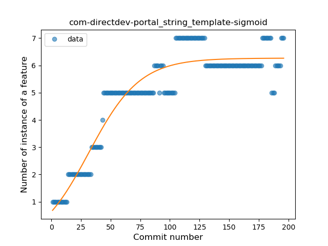

43. fr-cph-chicago-foss

	*  Function: 
	* R_Squared: 0.89392082
 

44. org-teamblueridge-pasteitapp

	*  Function: 
	* R_Squared: 0.88753258
 

45. com-nextcloud-talk2

	*  Function: 
	* R_Squared: 0.8686304
 

46. it-diab

	*  Function: 
	* R_Squared: 0.85418725
 

48. org-kiwix-kiwixcustomwikivoyageeurope

	*  Function: 
	* R_Squared: 0.84112531
 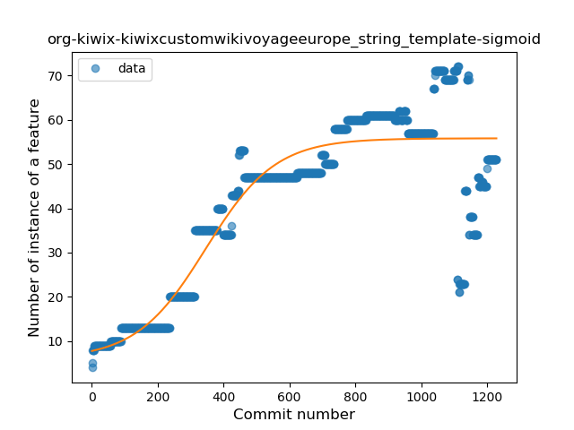

49. de-ironjan-mensaupb

	*  Function: 
	* R_Squared: 0.83822847
 

50. com-doctoror-particleswallpaper

	*  Function: 
	* R_Squared: 0.82887549
 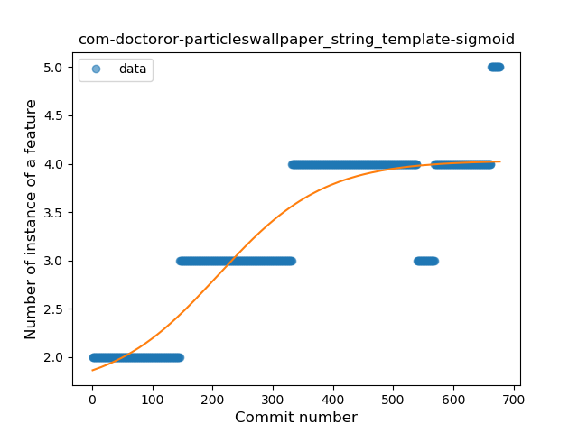

51. sk-styk-martin-apkanalyzer

	*  Function: 
	* R_Squared: 0.82121244
 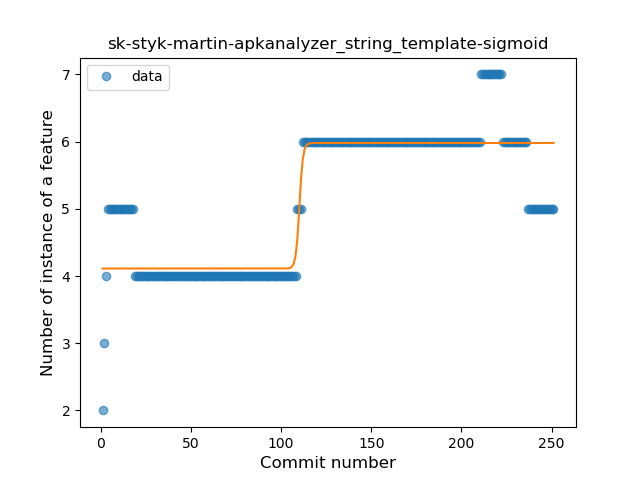

52. pl-org-seva-navigator

	*  Function: 
	* R_Squared: 0.77029116
 

53. com-example-harisont-librery

	*  Function: 
	* R_Squared: 0.66971651
 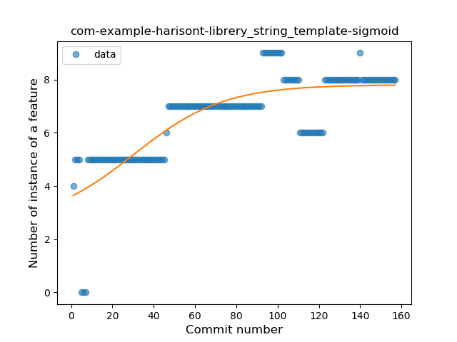

54. me-rei_m-hyakuninisshu

	*  Function: 
	* R_Squared: 0.65026534
 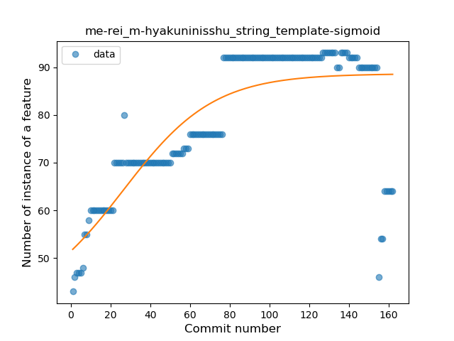

55. nightlock-peppercarrot

	*  Function: 
	* R_Squared: 0.60445047
 

56. com-bubelov-coins

	*  Function: 
	* R_Squared: 0.49556466
 

57. college-wyk-app

	*  Function: 
	* R_Squared: 0.4875817
 

58. com-simplemobiletools-musicplayer

	*  Function: 
	* R_Squared: 0.38306676
 

59. com-sduduzog-slimlauncher

	*  Function: 
	* R_Squared: 0.34445407
 

60. io-trewartha-positional

	*  Function: 
	* R_Squared: 0.23650233
 

### <a name="T4">Sudden Rise</a> 
 ----

3. io-ipoli-android

	*  Function: 
	* R_Squared: 0.98775853
 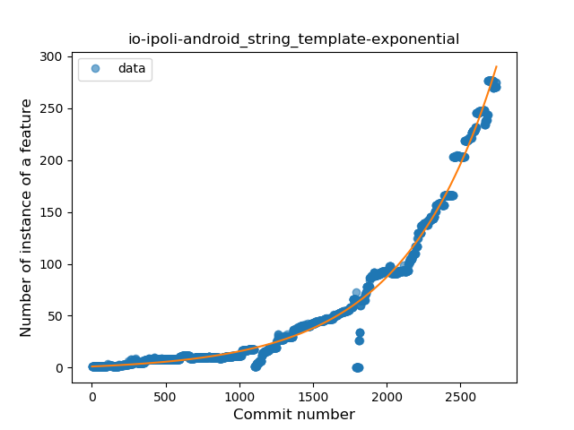

4. net-bible-android-activity

	*  Function: 
	* R_Squared: 0.98039696
 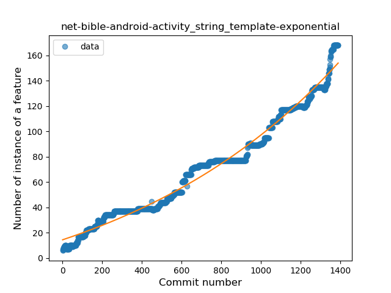

5. ch-deletescape-lawnchair-plah

	*  Function: 
	* R_Squared: 0.97954871
 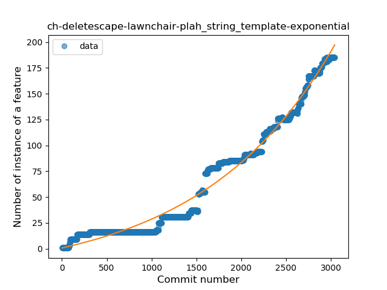

6. com-motion-stage1

	*  Function: 
	* R_Squared: 0.9786431
 

7. com-utazukin-ichaival

	*  Function: 
	* R_Squared: 0.97766964
 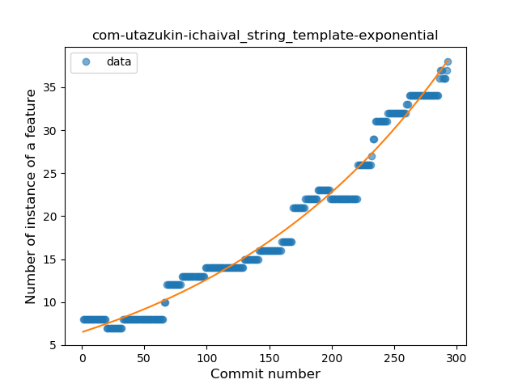

8. ch-rmy-android-http_shortcuts

	*  Function: 
	* R_Squared: 0.9769135
 

9. com-czbix-v2ex

	*  Function: 
	* R_Squared: 0.96651333
 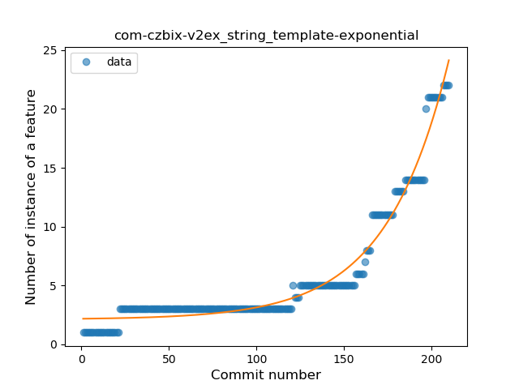

10. link-standen-michael-phonesaver

	*  Function: 
	* R_Squared: 0.96596154
 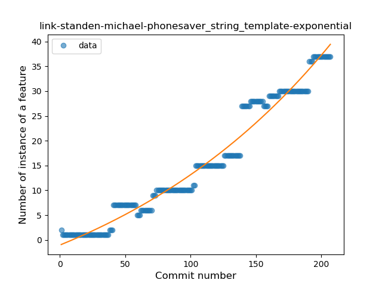

11. fr-insapp-insapp

	*  Function: 
	* R_Squared: 0.95566275
 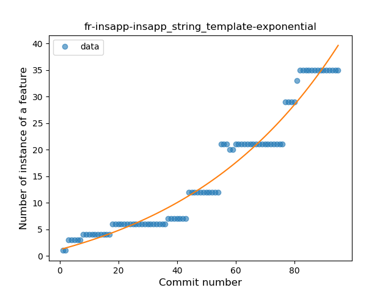

12. de-westnordost-streetcomplete

	*  Function: 
	* R_Squared: 0.95118981
 

13. com-github-cvzi-screenshottile

	*  Function: 
	* R_Squared: 0.94896289
 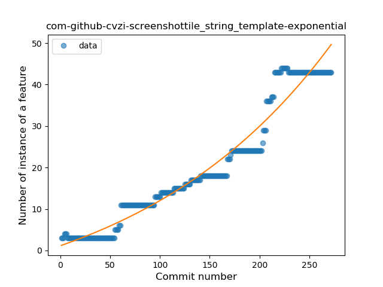

14. info-papdt-express-helper

	*  Function: 
	* R_Squared: 0.9472042
 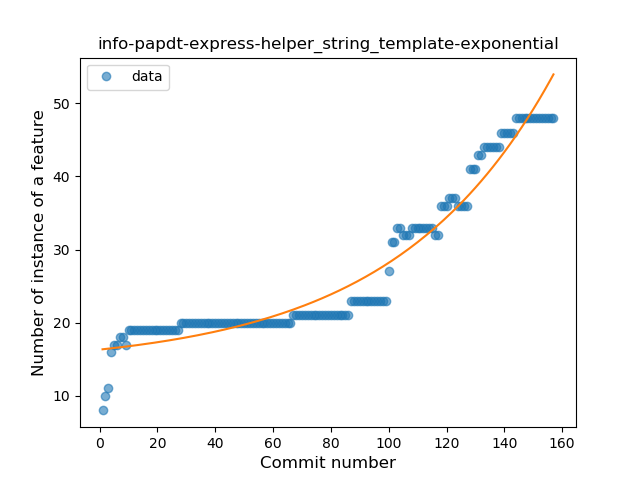

15. org-mozilla-rocket

	*  Function: 
	* R_Squared: 0.94508624
 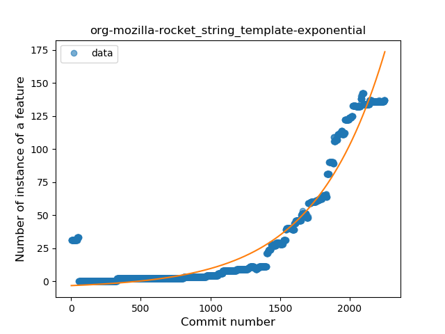

16. me-anon-grow

	*  Function: 
	* R_Squared: 0.94425797
 

17. org-mozilla-focus

	*  Function: 
	* R_Squared: 0.93516582
 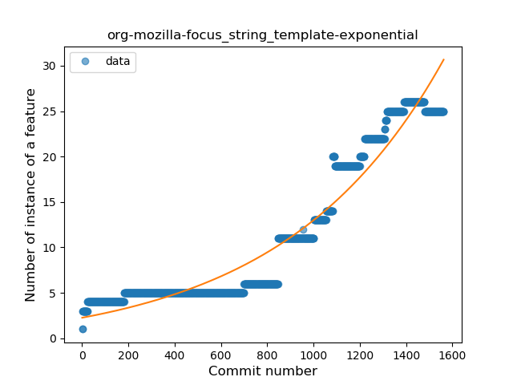

18. org-mozilla-klar

	*  Function: 
	* R_Squared: 0.93516582
 

19. science-apolline

	*  Function: 
	* R_Squared: 0.9305277
 

20. tech-ula

	*  Function: 
	* R_Squared: 0.92644412
 

21. com-zeapo-pwdstore

	*  Function: 
	* R_Squared: 0.91551699
 

22. org-isoron-uhabits

	*  Function: 
	* R_Squared: 0.91426228
 

23. com-breadwallet

	*  Function: 
	* R_Squared: 0.90902558
 

24. com-mgaetan89-showsrage

	*  Function: 
	* R_Squared: 0.90642802
 

25. ru-hyst329-openfool

	*  Function: 
	* R_Squared: 0.90420066
 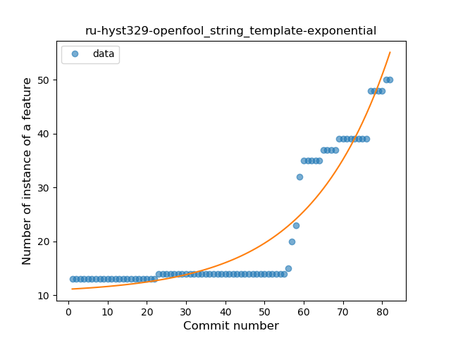

26. org-anibyl-slounik

	*  Function: 
	* R_Squared: 0.88247992
 

27. se-creotec-chscardbalance2

	*  Function: 
	* R_Squared: 0.87698553
 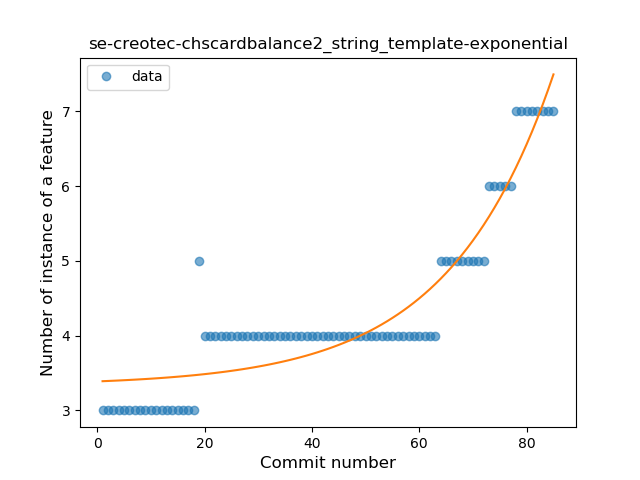

28. com-moez-QKSMS

	*  Function: 
	* R_Squared: 0.87496484
 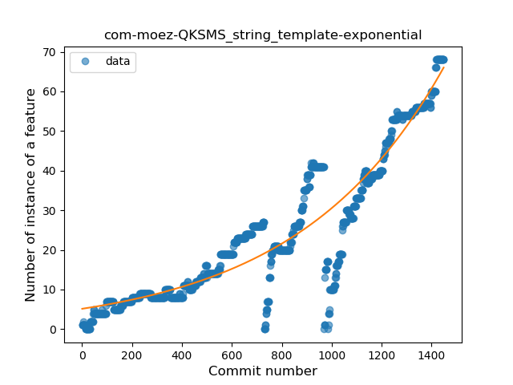

29. org-mosad-seil0-projectlaogai

	*  Function: 
	* R_Squared: 0.86556172
 

30. com-bernaferrari-changedetection

	*  Function: 
	* R_Squared: 0.8473748
 

31. com-sjn-stamp

	*  Function: 
	* R_Squared: 0.84559186
 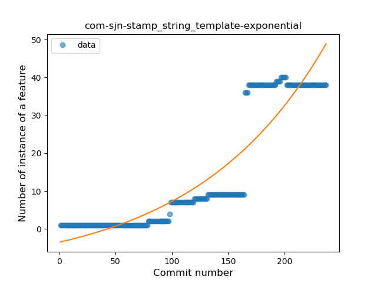

33. com-fsck-k9

	*  Function: 
	* R_Squared: 0.84191488
 

34. org-ligi-passandroid

	*  Function: 
	* R_Squared: 0.82796821
 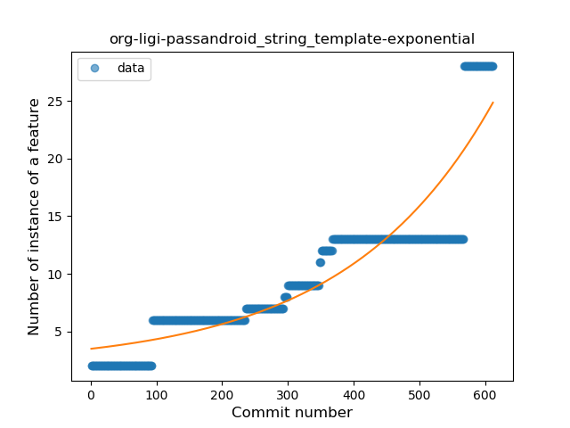

35. com-loloof64-android-basicchessendgamestrainer

	*  Function: 
	* R_Squared: 0.82523205
 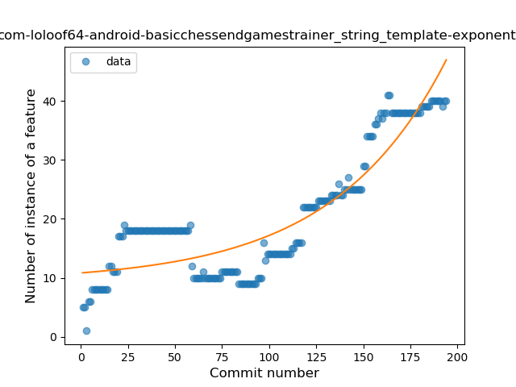

36. com-cookiegames-smartcookie

	*  Function: 
	* R_Squared: 0.75373907
 

37. com-github-vase4kin-teamcityapp

	*  Function: 
	* R_Squared: 0.75326795
 

38. com-thanksmister-iot-mqtt-alarmpanel

	*  Function: 
	* R_Squared: 0.74060096
 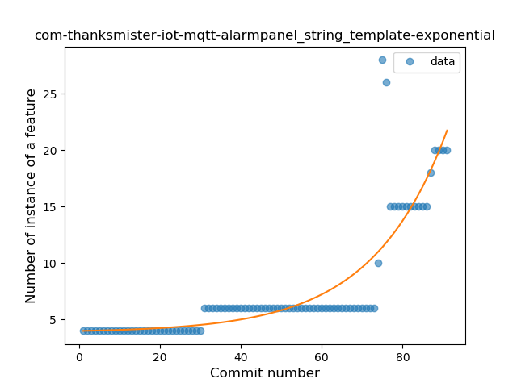

39. nl-brouwerijdemolen-borefts2013

	*  Function: 
	* R_Squared: 0.7240033
 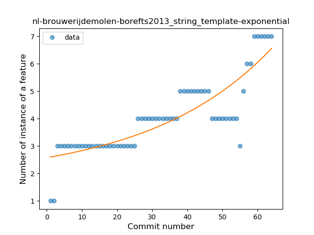

40. com-slash-batterychargelimit

	*  Function: 
	* R_Squared: 0.69571538
 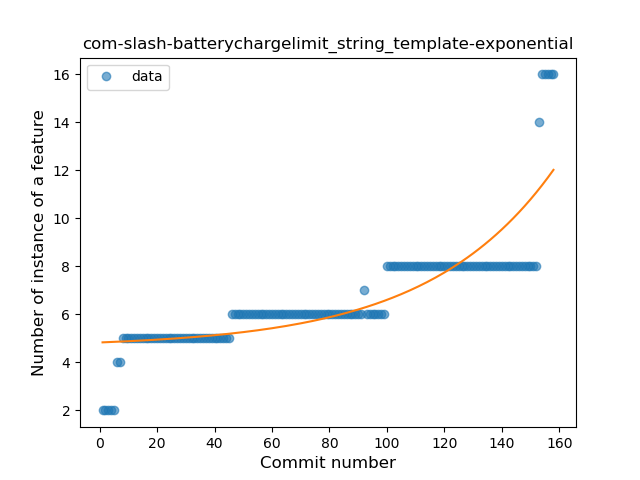

43. com-simplemobiletools-camera

	*  Function: 
	* R_Squared: 0.2117743
 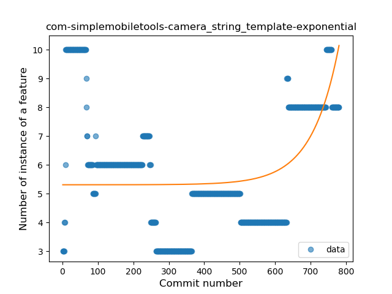

44. rectangledbmi-com-pittsburghrealtimetracker

	*  Function: 
	* R_Squared: 0.1856736
 

### <a name="T11">Instability</a> 
 ----

1. com-bracketcove-postrainer

	*  Function: 
	* R_Squared: 0.9952381
 

2. com-ids1024-lsdict

	*  Function: 
	* R_Squared: 0.9952381
 

3. com-jim-sharetocomputer

	*  Function: 
	* R_Squared: 0.94487564
 

4. es-danirod-rectball-android

	*  Function: 
	* R_Squared: 0.93901463
 

5. com-rohitsuratekar-NCBSinfo

	*  Function: 
	* R_Squared: 0.92758373
 

6. ca-rmen-android-frenchcalendar

	*  Function: 
	* R_Squared: 0.90769231
 

7. net-codechunk-speedofsound

	*  Function: 
	* R_Squared: 0.90603797
 

8. fr-jnda-android-ipcalc

	*  Function: 
	* R_Squared: 0.8974359
 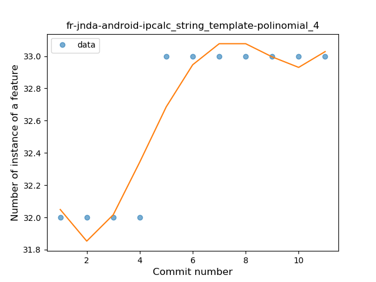

9. com-skydoves-waterdays

	*  Function: 
	* R_Squared: 0.88461538
 

10. com-ahorcado

	*  Function: 
	* R_Squared: 0.87879599
 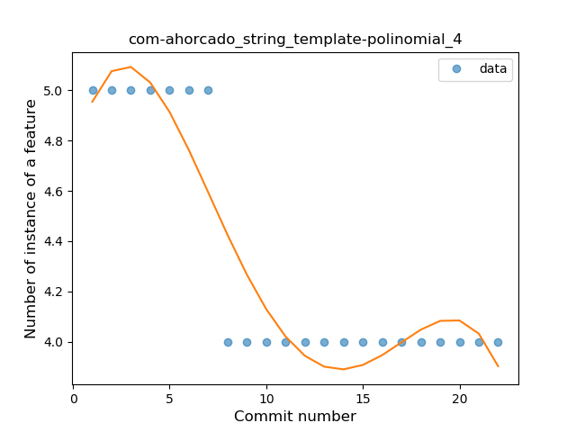

11. org-decsync-sparss-floss

	*  Function: 
	* R_Squared: 0.87188833
 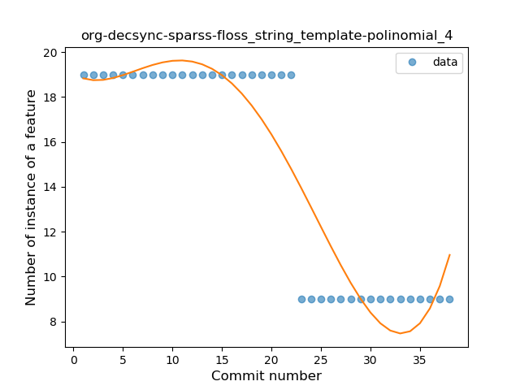

12. com-emmanuelmess-simplecleanup

	*  Function: 
	* R_Squared: 0.86249008
 

13. ru-nsu-bobrofon-easysshfs

	*  Function: 
	* R_Squared: 0.84721963
 

14. me-siketyan-silicagel

	*  Function: 
	* R_Squared: 0.84210526
 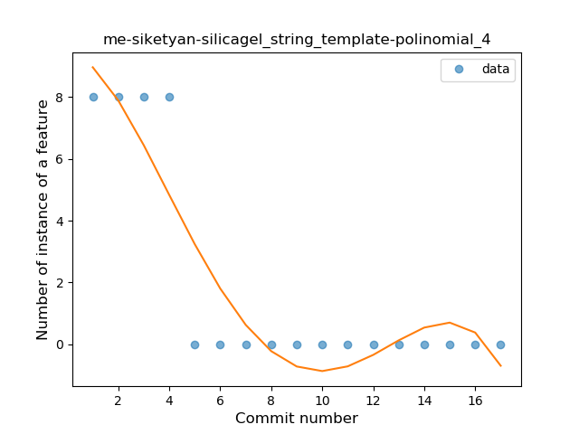

15. io-mkg20001-arubanetworkslogin

	*  Function: 
	* R_Squared: 0.80315737
 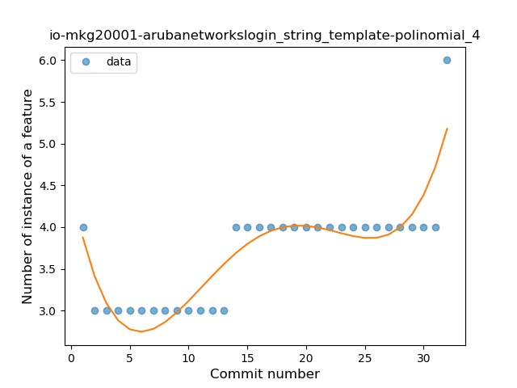

16. danbroid-searchview

	*  Function: 
	* R_Squared: 0.79645914
 

17. org-mcxa-vortaro

	*  Function: 
	* R_Squared: 0.75389378
 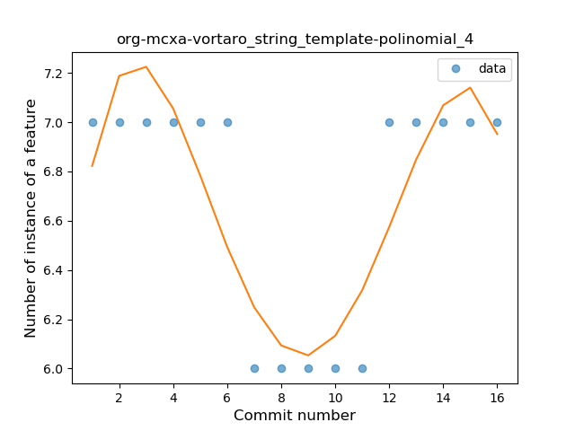

18. me-barta-stayintouch

	*  Function: 
	* R_Squared: 0.61451514
 

19. fr-rhaz-ipfs-sweet

	*  Function: 
	* R_Squared: 0.50201929
 

20. io-wookey-wallet

	*  Function: 
	* R_Squared: 0.23579553
 

### <a name="T6">Sudden Rise Plateau</a> 
 ----

1. com-etesync-syncadapter

	*  Function: 
	* R_Squared: 0.92985984
 

2. com-androidheads-vienna-escalero

	*  Function: 
	* R_Squared: 0.91523438
 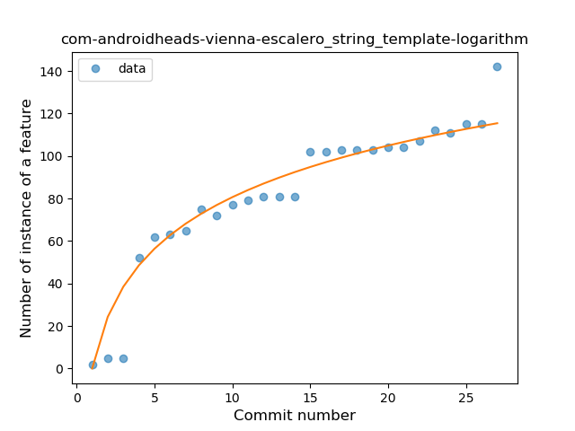

3. cz-dvratil-fbeventsync

	*  Function: 
	* R_Squared: 0.90747554
 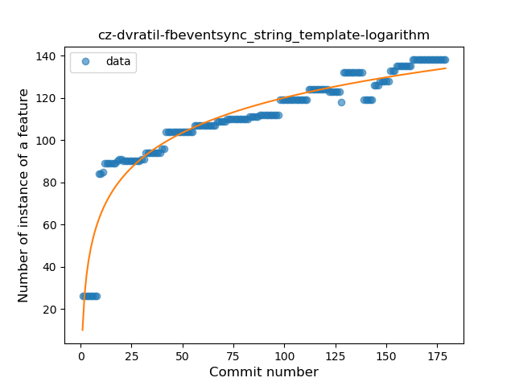

4. info-metadude-android-congress-schedule

	*  Function: 
	* R_Squared: 0.89696257
 

5. com-booboot-vndbandroid

	*  Function: 
	* R_Squared: 0.88039372
 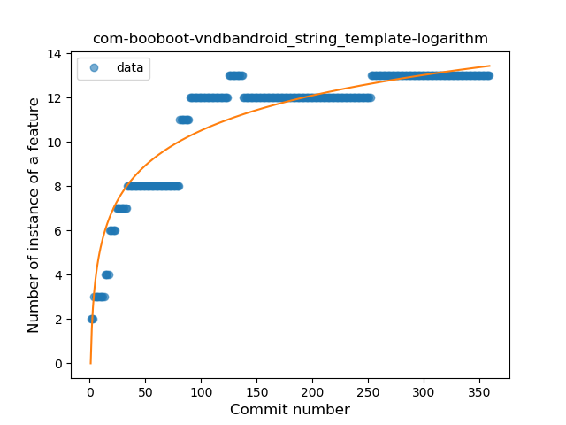

6. com-phicdy-totoanticipation

	*  Function: 
	* R_Squared: 0.84326131
 

7. com-pluscubed-velociraptor

	*  Function: 
	* R_Squared: 0.84272892
 

8. co-timecrypt-android

	*  Function: 
	* R_Squared: 0.83106842
 

9. com-simplemobiletools-clock

	*  Function: 
	* R_Squared: 0.82631387
 

10. com-simplemobiletools-draw

	*  Function: 
	* R_Squared: 0.81343829
 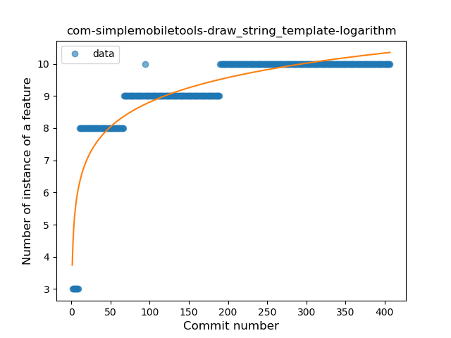

11. com-simplemobiletools-draw-pro

	*  Function: 
	* R_Squared: 0.81343829
 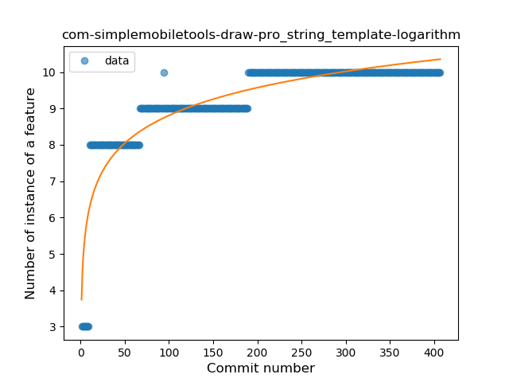

12. com-guerinet-mymartlet

	*  Function: 
	* R_Squared: 0.79640116
 

13. ai-susi

	*  Function: 
	* R_Squared: 0.7887712
 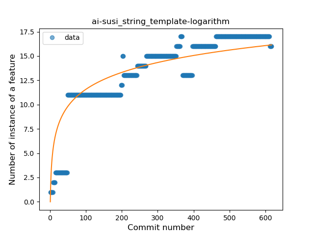

14. de-cineaste-android

	*  Function: 
	* R_Squared: 0.75269223
 

15. net-yslibrary-monotweety

	*  Function: 
	* R_Squared: 0.74249177
 

16. me-echeung-moemoekyun-fdroid

	*  Function: 
	* R_Squared: 0.72672833
 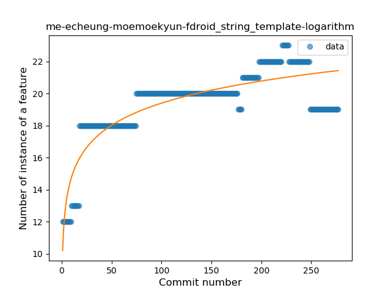

17. com-glodanif-bluetoothchat

	*  Function: 
	* R_Squared: 0.72540442
 

18. eu-depau-etchdroid

	*  Function: 
	* R_Squared: 0.70088327
 

19. es-usc-citius-servando-calendula

	*  Function: 
	* R_Squared: 0.68591946
 

20. de-ph1b-audiobook

	*  Function: 
	* R_Squared: 0.67281471
 

21. fi-tuska-jalkametri

	*  Function: 
	* R_Squared: 0.65669428
 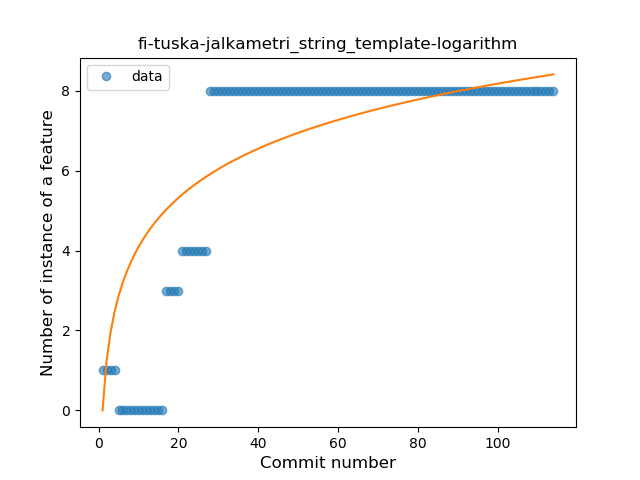

22. uk-colessoft-android-hilllist

	*  Function: 
	* R_Squared: 0.6490625
 

23. ml-adamsprogs-bimba

	*  Function: 
	* R_Squared: 0.5959493
 

24. de-blankedv-lanbahnpanel

	*  Function: 
	* R_Squared: 0.54851165
 

25. org-ligi-ipfsdroid

	*  Function: 
	* R_Squared: 0.53418097
 

26. org-mattvchandler-progressbars

	*  Function: 
	* R_Squared: 0.52300649
 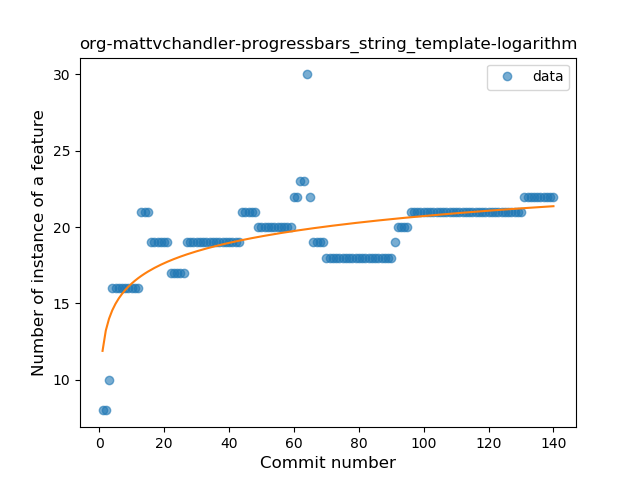

27. com-arcao-geocaching4locus

	*  Function: 
	* R_Squared: 0.46919074
 

28. com-simplemobiletools-contacts-pro

	*  Function: 
	* R_Squared: 0.41755812
 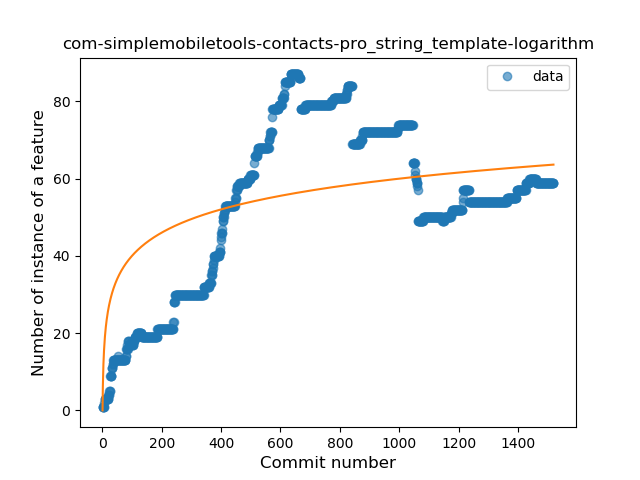

29. com-simplemobiletools-calendar-pro

	*  Function: 
	* R_Squared: 0.33427151
 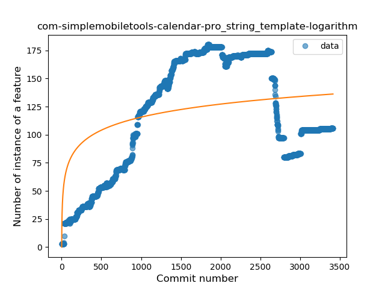

30. com-simplemobiletools-applauncher

	*  Function: 
	* R_Squared: 0.31885408
 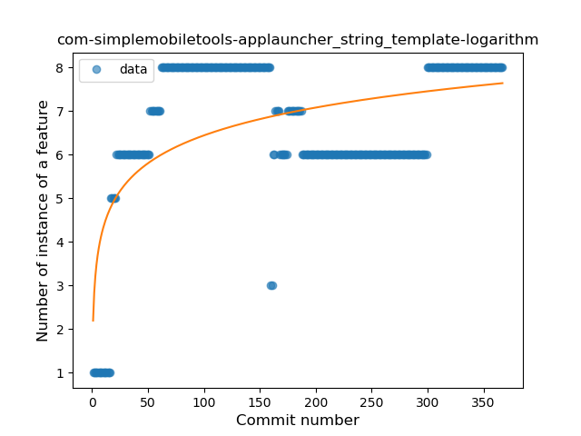

31. com-pixplicity-cryptogram

	*  Function: 
	* R_Squared: 0.14687879
 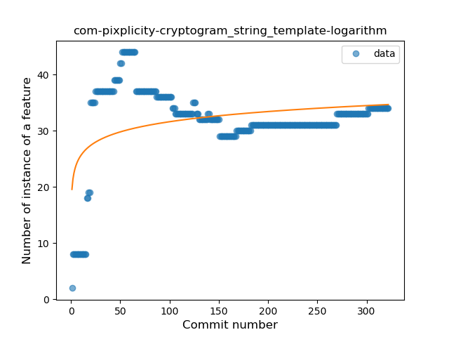

32. at-bitfire-davdroid

	*  Function: 
	* R_Squared: 0.13053944
 

### <a name="T9">Plateau Sudden Rise</a> 
 ----

2. com-BibleQuote

	*  Function: 
	* R_Squared: 1.0
 

3. com-defianttech-convertme

	*  Function: 
	* R_Squared: 1.0
 

4. com-fake-android-torchlight

	*  Function: 
	* R_Squared: 1.0
 

5. com-firstrowria-pushnotificationtester

	*  Function: 
	* R_Squared: 1.0
 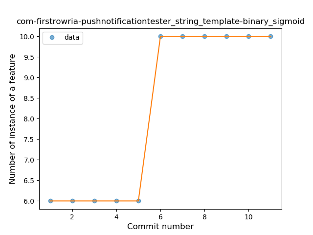

6. com-github-fields-electric

	*  Function: 
	* R_Squared: 1.0
 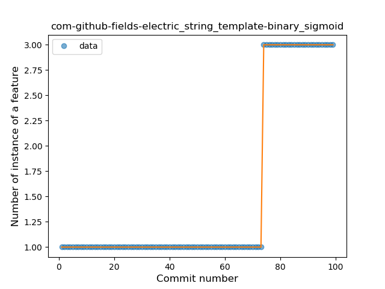

7. com-greenlionsoft-pollution-madrid

	*  Function: 
	* R_Squared: 1.0
 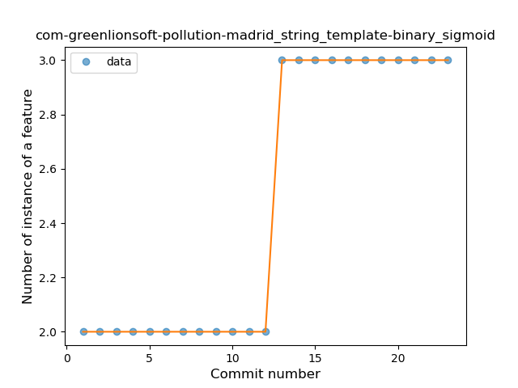

8. com-kanedias-vanilla-metadata

	*  Function: 
	* R_Squared: 1.0
 

9. com-ninjahoahong-unstoppable

	*  Function: 
	* R_Squared: 1.0
 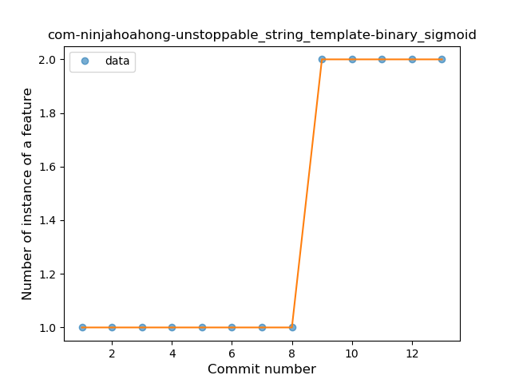

11. com-systemallica-valenbisi

	*  Function: 
	* R_Squared: 1.0
 

12. com-tumblr-svetylk0-sheepsgohome-android

	*  Function: 
	* R_Squared: 1.0
 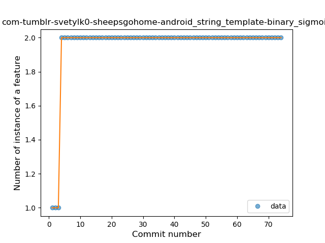

13. de-spiritcroc-darkcroc-substratum

	*  Function: 
	* R_Squared: 1.0
 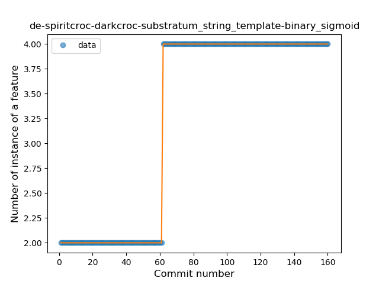

14. nl-jqno-remindermail

	*  Function: 
	* R_Squared: 1.0
 

15. org-lenchan139-ncbookmark

	*  Function: 
	* R_Squared: 1.0
 

16. org-projectbass-bass

	*  Function: 
	* R_Squared: 1.0
 

19. org-sanpra-checklist

	*  Function: 
	* R_Squared: 0.99960856
 

20. com-gimranov-zandy-app

	*  Function: 
	* R_Squared: 0.99047658
 

21. jp-cordea-mackerelclient

	*  Function: 
	* R_Squared: 0.95235473
 

22. ca-rmen-android-poetassistant

	*  Function: 
	* R_Squared: 0.9079279
 

23. pt-ipleiria-mymusicqoe

	*  Function: 
	* R_Squared: 0.7885409
 

24. com-agusyc-daycounter

	*  Function: 
	* R_Squared: 0.78835472
 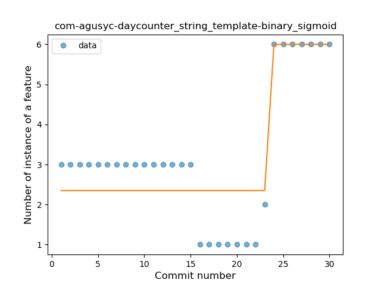

26. com-atanana-sicounter

	*  Function: 
	* R_Squared: 0.67132423
 

27. org-liberty-android-freeotpplus

	*  Function: 
	* R_Squared: 0.66911765
 

28. com-alderferstudios-handandfootscores

	*  Function: 
	* R_Squared: 0.35714286
 

29. org-weilbach-splitbills

	*  Function: 
	* R_Squared: 0.34098833
 

30. com-libopenmw-openmw

	*  Function: 
	* R_Squared: 0.21231423
 

31. com-conorodonnell-bus

	*  Function: 
	* R_Squared: 0.20626784
 

34. at-bitfire-icsdroid

	*  Function: 
	* R_Squared: 0.12107526
 

35. superustats-tool-android

	*  Function: 
	* R_Squared: 0.04542792
 

### <a name="T10">Plateau Sudden Decline</a> 
 ----

1. app-simone

	*  Function: 
	* R_Squared: 1.0
 

10. com-physphil-android-unitconverterultimate

	*  Function: 
	* R_Squared: 1.0
 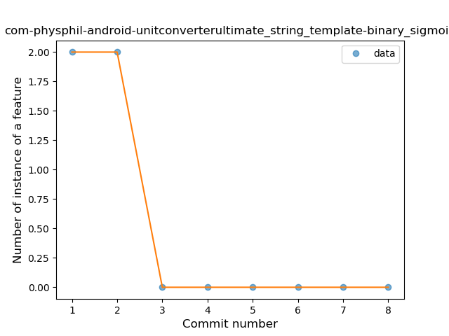

17. uk-co-richyhbm-monochromatic

	*  Function: 
	* R_Squared: 1.0
 

18. xyz-koleno-sunwidget

	*  Function: 
	* R_Squared: 1.0
 

25. com-enjoyingfoss-om

	*  Function: 
	* R_Squared: 0.69348128
 

32. fr-jnda-android-flashalert

	*  Function: 
	* R_Squared: 0.19648434
 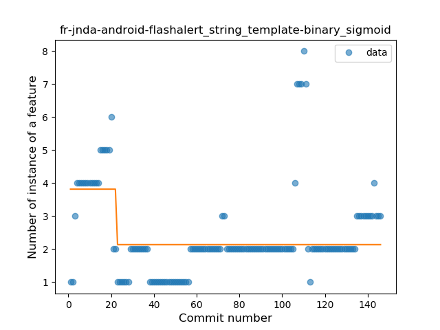

33. com-pennapps-labs-pennmobile

	*  Function: 
	* R_Squared: 0.18888889
 

### <a name="T5">Sudden Decline</a> 
 ----

1. com-simplemobiletools-calculator

	*  Function: 
	* R_Squared: 1.0
 

2. com-simplemobiletools-flashlight

	*  Function: 
	* R_Squared: 1.0
 

32. pw-janyo-janyoshare

	*  Function: 
	* R_Squared: 0.84283555
 

41. info-dvkr-screenstream

	*  Function: 
	* R_Squared: 0.63920447
 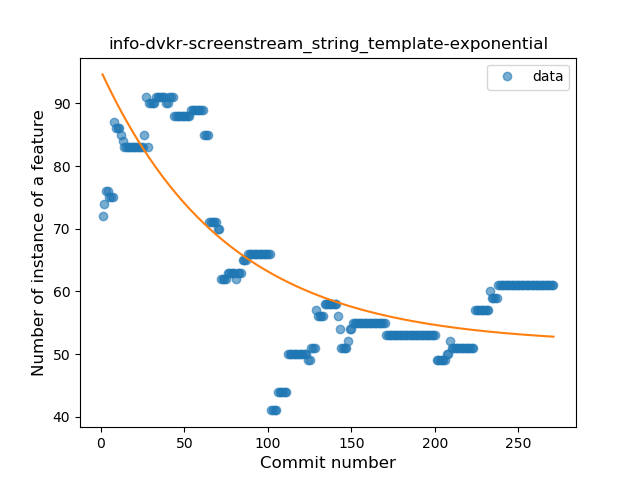

42. org-equeim-tremotesf

	*  Function: 
	* R_Squared: 0.42957488
 

45. com-github-premnirmal-tickerwidget

	*  Function: 
	* R_Squared: 0.05293199
 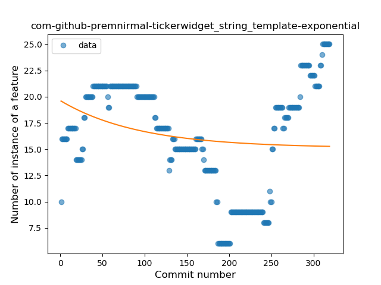

### <a name="T2">Constant Decline</a> 
 ----

80. apps-jizzu-simpletodo

	*  Function: 
	* R_Squared: 0.32809407
 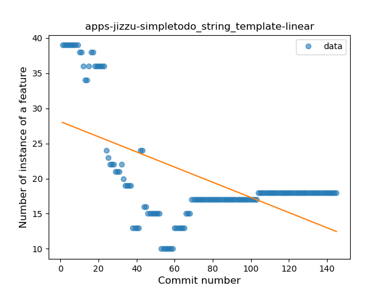

81. net-nonylene-photolinkviewer

	*  Function: 
	* R_Squared: 0.30578846
 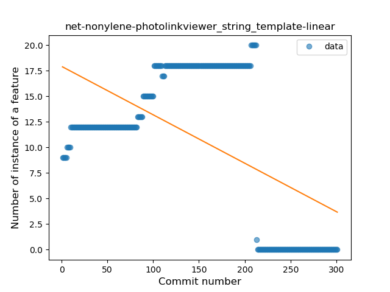

82. com-uncmorfi

	*  Function: 
	* R_Squared: 0.19721477
 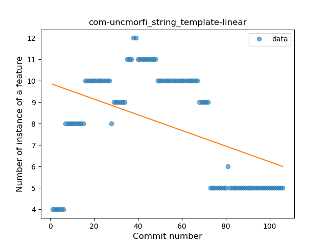

84. com-simplemobiletools-notes-pro

	*  Function: 
	* R_Squared: 0.09831859
 

85. pl-temomuko-autostoprace

	*  Function: 
	* R_Squared: 0.02770624
 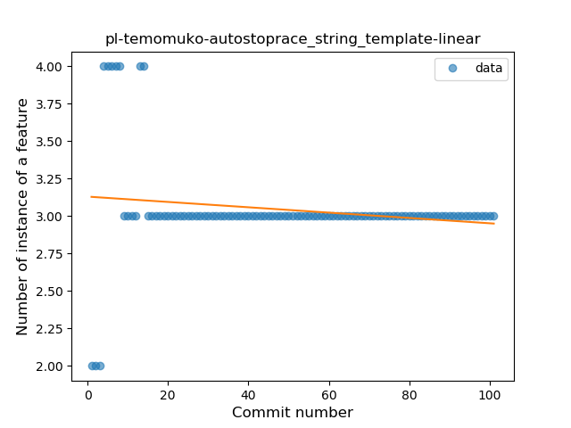

### <a name="T8">Plateau Gradual Decline</a> 
 ----

47. com-calintat-sensors

	*  Function: 
	* R_Squared: 0.84441775
 

### <a name="T3">Stability</a> 
 ----

