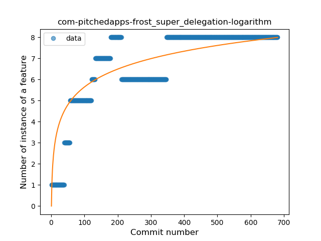
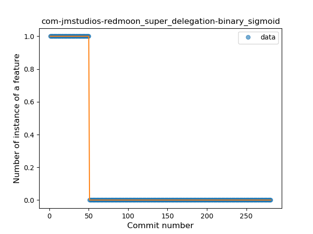

## Super Delegation
----
**Best fit = Plateau Sudden Rise**: 10

Function | N# best fit
----|----
<a href=" #T9">Plateau Sudden Rise</a> | 10
<a href=" #T6">Sudden Rise Plateau</a> | 4
<a href=" #T10">Plateau Sudden Decline</a> | 4
<a href=" #T1">Constant Rise</a> | 3
<a href=" #T5">Sudden Decline</a> | 3
<a href=" #T7">Plateau Gradual Rise</a> | 3
<a href=" #T4">Sudden Rise</a> | 1
<a href=" #T11">Instability</a> | 1
<a href=" #T2">Constant Decline</a> | 0
<a href=" #T3">Stability</a> | 0
<a href=" #T8">Plateau Gradual Decline</a> | 0

### <a name="T9">Plateau Sudden Rise</a> 
 ----

2. com-czbix-v2ex

	*  Function: 
	* R_Squared: 1.0
 

4. com-motion-stage1

	*  Function: 
	* R_Squared: 1.0
 

6. fr-cph-chicago-foss

	*  Function: 
	* R_Squared: 1.0
 

8. org-blokada-alarm

	*  Function: 
	* R_Squared: 1.0
 

9. org-ligi-gobandroid

	*  Function: 
	* R_Squared: 1.0
 

10. org-moire-ultrasonic

	*  Function: 
	* R_Squared: 1.0
 

11. com-bernaferrari-changedetection

	*  Function: 
	* R_Squared: 0.96842772
 

12. de-ph1b-audiobook

	*  Function: 
	* R_Squared: 0.75592259
 

13. com-benoitletondor-easybudgetapp

	*  Function: 
	* R_Squared: 0.65822785
 

14. eu-kanade-tachiyomi

	*  Function: 
	* R_Squared: 0.14667783
 

### <a name="T6">Sudden Rise Plateau</a> 
 ----

1. com-pitchedapps-frost

	*  Function: 
	* R_Squared: 0.74200517
 

2. im-vector-alpha

	*  Function: 
	* R_Squared: 0.41294738
 

3. com-lavadip-miniVector

	*  Function: 
	* R_Squared: 0.40363578
 

4. com-peterlaurence-trekme

	*  Function: 
	* R_Squared: 0.25481405
 

### <a name="T10">Plateau Sudden Decline</a> 
 ----

1. be-mygod-vpnhotspot

	*  Function: 
	* R_Squared: 1.0
 

3. com-jmstudios-redmoon

	*  Function: 
	* R_Squared: 1.0
 

5. com-yubico-yubioath

	*  Function: 
	* R_Squared: 1.0
 

7. info-papdt-express-helper

	*  Function: 
	* R_Squared: 1.0
 

### <a name="T1">Constant Rise</a> 
 ----

1. ch-deletescape-lawnchair-plah

	*  Function: 
	* R_Squared: 0.92965477
 

2. fi-kroon-vadret

	*  Function: 
	* R_Squared: 0.7467344
 

3. app-opass-ccip

	*  Function: 
	* R_Squared: 0.13934666
 

### <a name="T5">Sudden Decline</a> 
 ----

1. net-yslibrary-monotweety

	*  Function: 
	* R_Squared: 0.8421661
 

2. com-github-moko256-twitlatte

	*  Function: 
	* R_Squared: 0.82375148
 

4. at-bitfire-davdroid

	*  Function: 
	* R_Squared: 0.26529957
 

### <a name="T7">Plateau Gradual Rise</a> 
 ----

1. org-zimmob-zimlx

	*  Function: 
	* R_Squared: 0.94971365
 

2. org-mozilla-rocket

	*  Function: 
	* R_Squared: 0.93492806
 

3. io-ipoli-android

	*  Function: 
	* R_Squared: 0.18932397
 

### <a name="T4">Sudden Rise</a> 
 ----

3. org-eurofurence-connavigator

	*  Function: 
	* R_Squared: 0.64059964
 

### <a name="T11">Instability</a> 
 ----

### <a name="T2">Constant Decline</a> 
 ----

### <a name="T3">Stability</a> 
 ----

### <a name="T8">Plateau Gradual Decline</a> 
 ----

