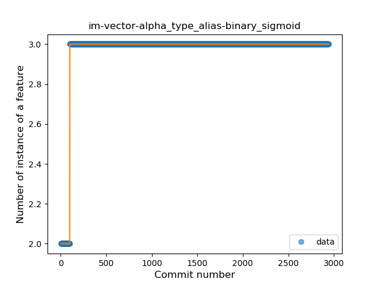
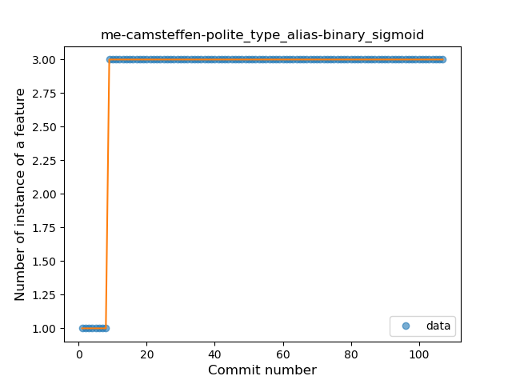
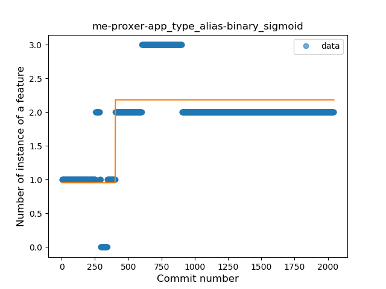
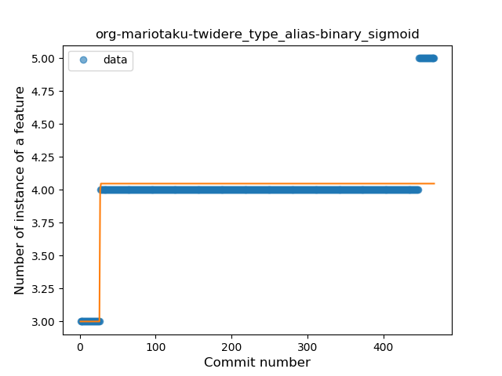
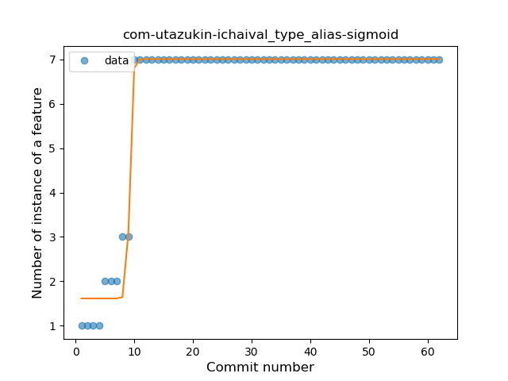
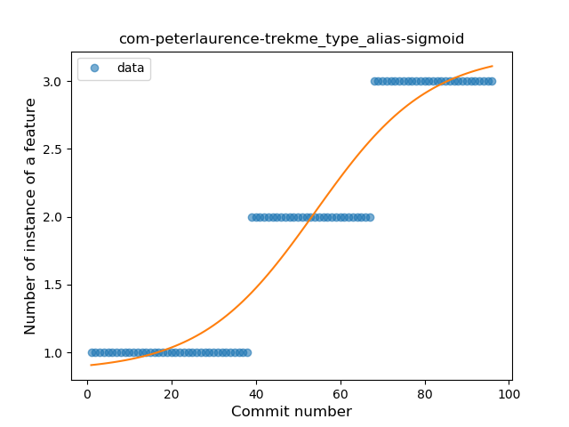
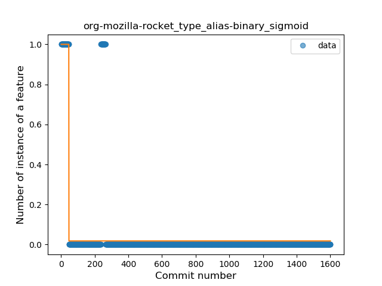
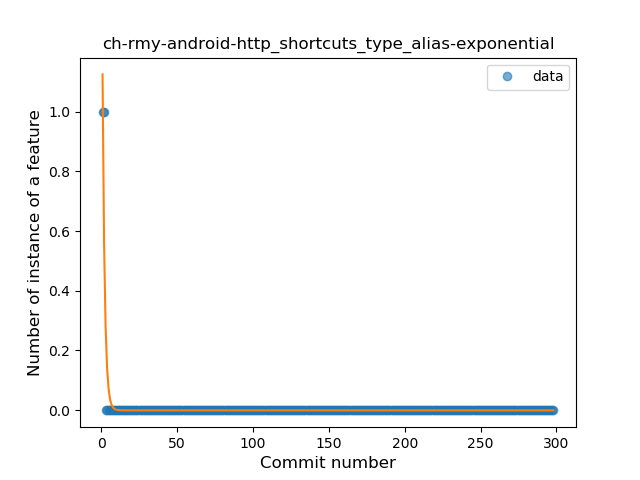

## Type Alias
----
**Best fit = Plateau Sudden Rise**: 10

Function | N# best fit
----|----
<a href=" #T9">Plateau Sudden Rise</a> | 10
<a href=" #T7">Plateau Gradual Rise</a> | 8
<a href=" #T4">Sudden Rise</a> | 6
<a href=" #T1">Constant Rise</a> | 2
<a href=" #T10">Plateau Sudden Decline</a> | 2
<a href=" #T2">Constant Decline</a> | 1
<a href=" #T5">Sudden Decline</a> | 1
<a href=" #T3">Stability</a> | 0
<a href=" #T6">Sudden Rise Plateau</a> | 0
<a href=" #T8">Plateau Gradual Decline</a> | 0
<a href=" #T11">Instability</a> | 0

### <a name="T9">Plateau Sudden Rise</a> 
 ----

1. ch-deletescape-lawnchair-plah

	*  Function: 
	* R_Squared: 1.0
 

2. com-lavadip-miniVector

	*  Function: 
	* R_Squared: 1.0
 

3. de-ph1b-audiobook

	*  Function: 
	* R_Squared: 1.0
 

4. eu-kanade-tachiyomi

	*  Function: 
	* R_Squared: 1.0
 

5. im-vector-alpha

	*  Function: 
	* R_Squared: 1.0
 

6. me-camsteffen-polite

	*  Function: 
	* R_Squared: 1.0
 

7. chat-rocket-android

	*  Function: 
	* R_Squared: 0.8984592
 

9. com-jereksel-libresubstratum

	*  Function: 
	* R_Squared: 0.61233482
 

11. me-proxer-app

	*  Function: 
	* R_Squared: 0.59829984
 

12. org-mariotaku-twidere

	*  Function: 
	* R_Squared: 0.57403126
 

### <a name="T7">Plateau Gradual Rise</a> 
 ----

1. com-utazukin-ichaival

	*  Function: 
	* R_Squared: 0.98216065
 

2. org-blokada-alarm

	*  Function: 
	* R_Squared: 0.97490726
 

3. de-r4md4c-gamedealz

	*  Function: 
	* R_Squared: 0.94032994
 

4. de-westnordost-streetcomplete

	*  Function: 
	* R_Squared: 0.92604681
 

5. com-fsck-k9

	*  Function: 
	* R_Squared: 0.92053727
 

6. com-peterlaurence-trekme

	*  Function: 
	* R_Squared: 0.91866494
 

7. com-benoitquenaudon-tvfoot-red

	*  Function: 
	* R_Squared: 0.88020503
 

8. fr-chenry-android-freshrss

	*  Function: 
	* R_Squared: 0.82213187
 

### <a name="T4">Sudden Rise</a> 
 ----

2. org-mozilla-focus

	*  Function: 
	* R_Squared: 0.78139014
 

3. org-mozilla-klar

	*  Function: 
	* R_Squared: 0.78139014
 

4. pt-ipleiria-mymusicqoe

	*  Function: 
	* R_Squared: 0.52105579
 

5. org-moire-ultrasonic

	*  Function: 
	* R_Squared: 0.5025968
 

6. io-github-feelfreelinux-wykopmobilny

	*  Function: 
	* R_Squared: 0.1504022
 

7. io-ipoli-android

	*  Function: 
	* R_Squared: 0.02247772
 

### <a name="T1">Constant Rise</a> 
 ----

1. com-keylesspalace-tusky

	*  Function: 
	* R_Squared: 0.72483496
 

2. one-librem-social

	*  Function: 
	* R_Squared: 0.68823585
 

### <a name="T10">Plateau Sudden Decline</a> 
 ----

8. com-nononsenseapps-feeder

	*  Function: 
	* R_Squared: 0.83231539
 

10. org-mozilla-rocket

	*  Function: 
	* R_Squared: 0.61042123
 

### <a name="T2">Constant Decline</a> 
 ----

3. com-loloof64-android-basicchessendgamestrainer

	*  Function: 
	* R_Squared: 0.50154061
 

### <a name="T5">Sudden Decline</a> 
 ----

1. ch-rmy-android-http_shortcuts

	*  Function: 
	* R_Squared: 0.84280163
 

### <a name="T3">Stability</a> 
 ----

### <a name="T6">Sudden Rise Plateau</a> 
 ----

### <a name="T8">Plateau Gradual Decline</a> 
 ----

### <a name="T11">Instability</a> 
 ----

