## Type Inference
----
**Best fit = Constant Rise**: 128

Function | N# best fit
----|----
<a href=" #T1">Constant Rise</a> | 128
<a href=" #T11">Instability</a> | 91
<a href=" #T4">Sudden Rise</a> | 60
<a href=" #T6">Sudden Rise Plateau</a> | 53
<a href=" #T7">Plateau Gradual Rise</a> | 10
<a href=" #T9">Plateau Sudden Rise</a> | 5
<a href=" #T10">Plateau Sudden Decline</a> | 4
<a href=" #T2">Constant Decline</a> | 3
<a href=" #T5">Sudden Decline</a> | 1
<a href=" #T3">Stability</a> | 0
<a href=" #T8">Plateau Gradual Decline</a> | 0

### <a name="T1">Constant Rise</a> 
 ----

1. se-barsk-park

	*  Function: 
	* R_Squared: 0.99096929
 

2. com-boardgamegeek

	*  Function: 
	* R_Squared: 0.99001154
 

3. com-esafirm-androidplayground

	*  Function: 
	* R_Squared: 0.98630683
 

4. com-duckduckgo-mobile-android

	*  Function: 
	* R_Squared: 0.98496859
 

5. uk-colessoft-android-hilllist

	*  Function: 
	* R_Squared: 0.98470207
 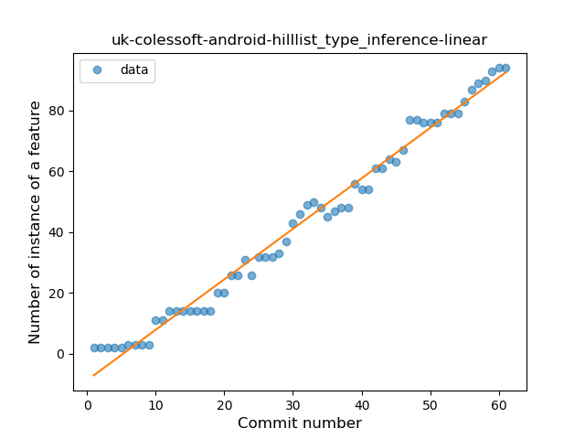

6. com-utazukin-ichaival

	*  Function: 
	* R_Squared: 0.98248866
 

7. com-bijoysingh-quicknote

	*  Function: 
	* R_Squared: 0.97927307
 

8. eu-kanade-tachiyomi

	*  Function: 
	* R_Squared: 0.97641145
 

9. ffc-app

	*  Function: 
	* R_Squared: 0.97506356
 

10. org-mariotaku-twidere

	*  Function: 
	* R_Squared: 0.97405046
 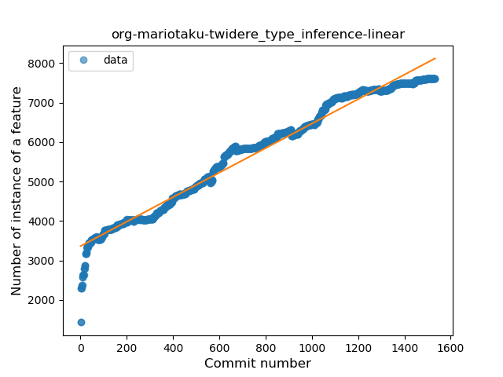

11. com-simplemobiletools-gallery-pro

	*  Function: 
	* R_Squared: 0.97369495
 

12. com-keylesspalace-tusky

	*  Function: 
	* R_Squared: 0.97195191
 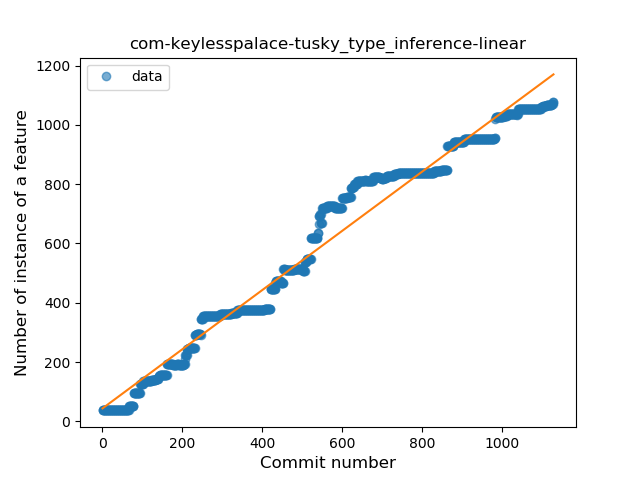

13. io-github-wulkanowy

	*  Function: 
	* R_Squared: 0.97052756
 

14. ca-fuwafuwa-kaku

	*  Function: 
	* R_Squared: 0.9691956
 

15. uk-co-richyhbm-monochromatic

	*  Function: 
	* R_Squared: 0.96832498
 

16. org-kaqui

	*  Function: 
	* R_Squared: 0.96831914
 

17. one-librem-social

	*  Function: 
	* R_Squared: 0.96810275
 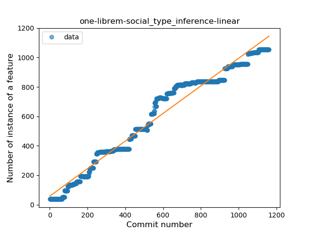

18. com-fastaccess-github-libre

	*  Function: 
	* R_Squared: 0.96758296
 

19. cat-pantsu-nyaapantsu

	*  Function: 
	* R_Squared: 0.96657223
 

20. com-doctoror-particleswallpaper

	*  Function: 
	* R_Squared: 0.96651276
 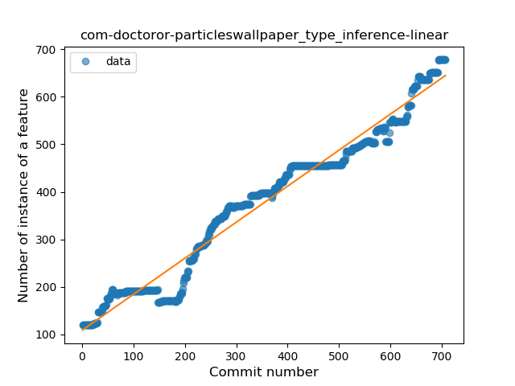

21. org-blitzortung-android-app

	*  Function: 
	* R_Squared: 0.96645653
 

22. com-ruuvi-station

	*  Function: 
	* R_Squared: 0.96637608
 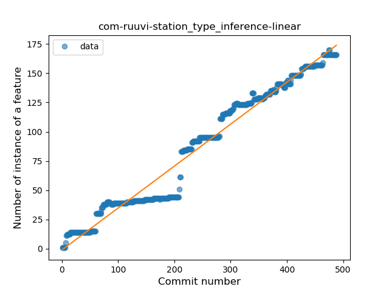

23. com-motion-stage1

	*  Function: 
	* R_Squared: 0.96547017
 

24. com-github-quarck-calnotify

	*  Function: 
	* R_Squared: 0.96231495
 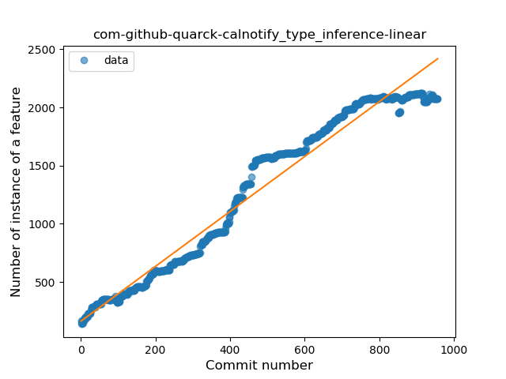

25. ryey-easer-beta

	*  Function: 
	* R_Squared: 0.96137293
 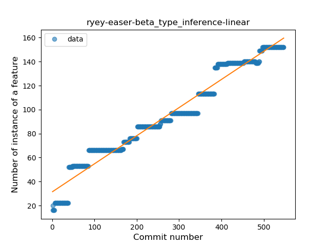

26. link-standen-michael-phonesaver

	*  Function: 
	* R_Squared: 0.96136533
 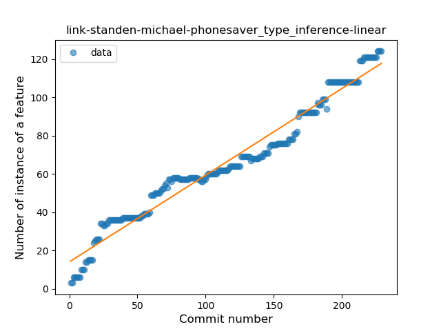

27. com-simplemobiletools-filemanager-pro

	*  Function: 
	* R_Squared: 0.95842739
 

28. fr-xgouchet-packageexplorer

	*  Function: 
	* R_Squared: 0.95751686
 

29. com-mgaetan89-showsrage

	*  Function: 
	* R_Squared: 0.95688553
 

30. ca-josephroque-bowlingcompanion

	*  Function: 
	* R_Squared: 0.9560291
 

31. org-moire-ultrasonic

	*  Function: 
	* R_Squared: 0.95598092
 

32. com-orgzly

	*  Function: 
	* R_Squared: 0.95499723
 

33. com-jereksel-libresubstratum

	*  Function: 
	* R_Squared: 0.95406163
 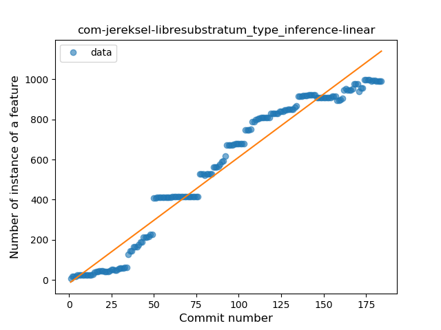

34. com-dozingcatsoftware-vectorcamera

	*  Function: 
	* R_Squared: 0.9539219
 

35. com-adityakamble49-dcipher

	*  Function: 
	* R_Squared: 0.9530286
 

36. is-xyz-mpv

	*  Function: 
	* R_Squared: 0.95284239
 

37. io-github-feelfreelinux-wykopmobilny

	*  Function: 
	* R_Squared: 0.95183353
 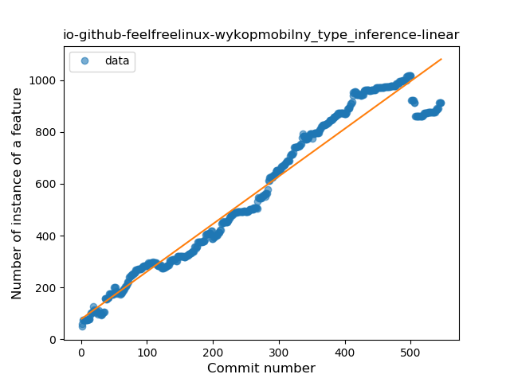

38. com-zacharee1-systemuituner

	*  Function: 
	* R_Squared: 0.95165517
 

39. se-creotec-chscardbalance2

	*  Function: 
	* R_Squared: 0.95071882
 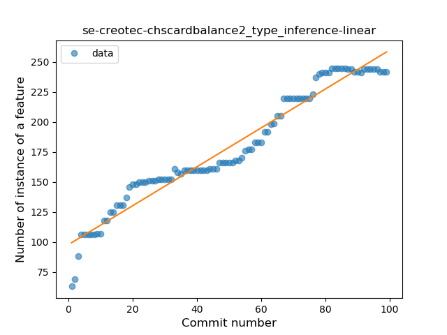

40. com-fallgamlet-dnestrcinema

	*  Function: 
	* R_Squared: 0.95033985
 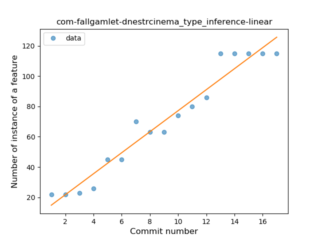

41. com-corphish-nightlight-generic

	*  Function: 
	* R_Squared: 0.94731213
 

42. org-fossasia-badgemagic

	*  Function: 
	* R_Squared: 0.94627912
 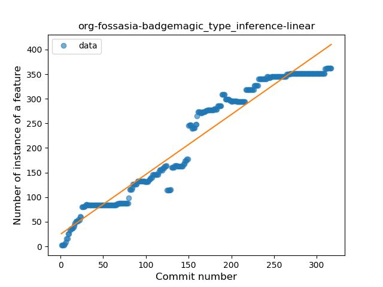

43. fr-chenry-android-freshrss

	*  Function: 
	* R_Squared: 0.94526744
 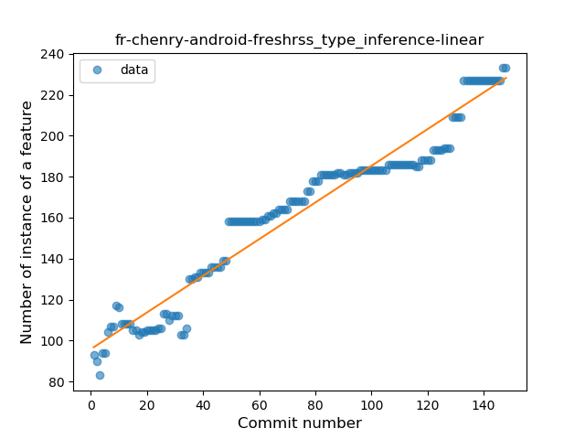

44. com-dp-logcatapp

	*  Function: 
	* R_Squared: 0.94449728
 

45. com-epimorphics-android-myrivers

	*  Function: 
	* R_Squared: 0.94438979
 

46. be-mygod-vpnhotspot

	*  Function: 
	* R_Squared: 0.9436627
 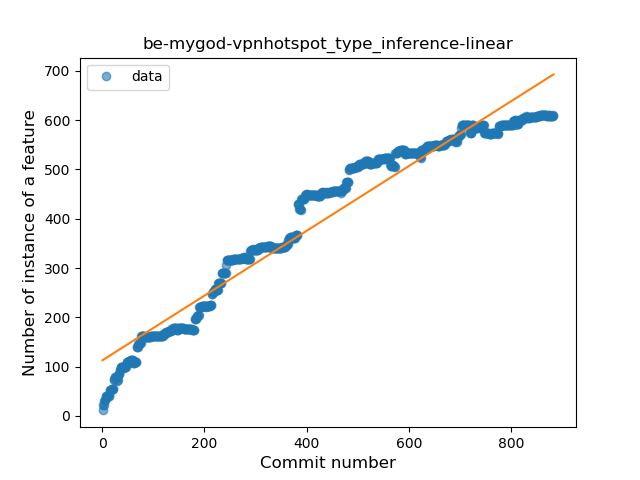

47. com-czbix-v2ex

	*  Function: 
	* R_Squared: 0.94210946
 

48. de-r4md4c-gamedealz

	*  Function: 
	* R_Squared: 0.94188413
 

49. ch-abertschi-adfree

	*  Function: 
	* R_Squared: 0.94176664
 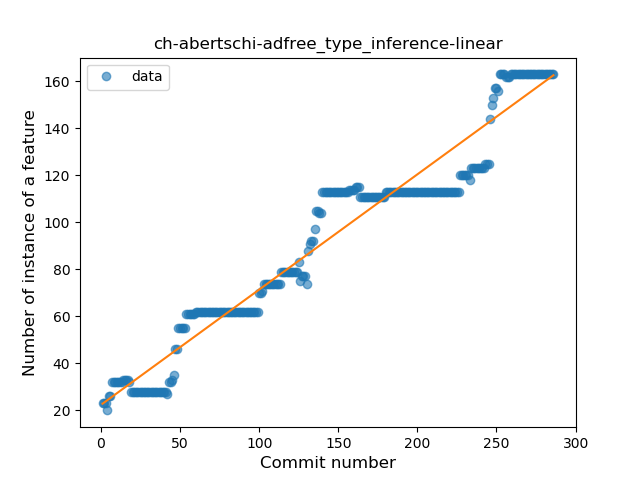

50. fr-openium-auvergnewebcams

	*  Function: 
	* R_Squared: 0.9402687
 

51. im-vector-alpha

	*  Function: 
	* R_Squared: 0.93953855
 

52. xyz-hisname-fireflyiii

	*  Function: 
	* R_Squared: 0.93896958
 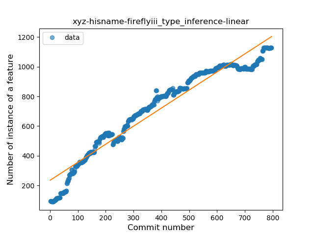

53. sreich-countthedays

	*  Function: 
	* R_Squared: 0.93680806
 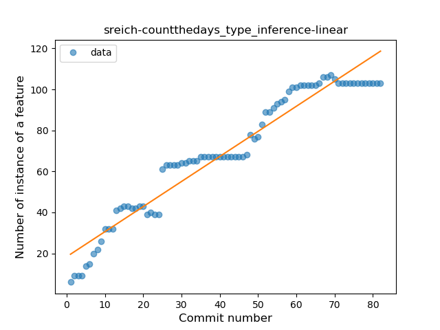

54. com-simplemobiletools-gallery

	*  Function: 
	* R_Squared: 0.93324545
 

55. com-tutpro-baresip

	*  Function: 
	* R_Squared: 0.93051665
 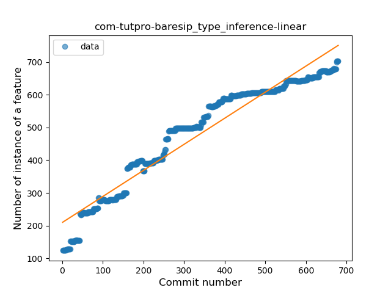

56. es-usc-citius-servando-calendula

	*  Function: 
	* R_Squared: 0.92712348
 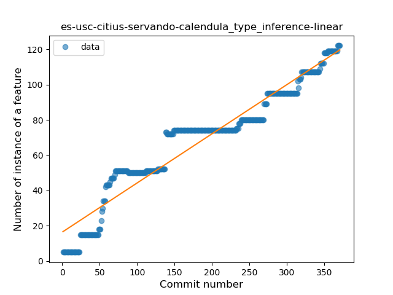

57. fr-free-nrw-commons

	*  Function: 
	* R_Squared: 0.92351173
 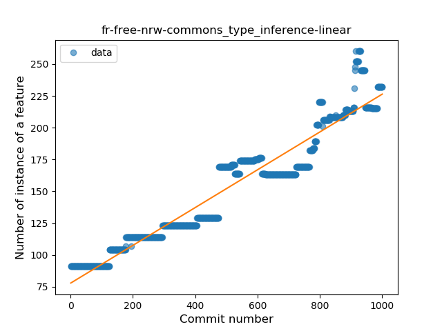

58. com-wabadaba-dziennik

	*  Function: 
	* R_Squared: 0.92261175
 

59. org-eurofurence-connavigator

	*  Function: 
	* R_Squared: 0.92113562
 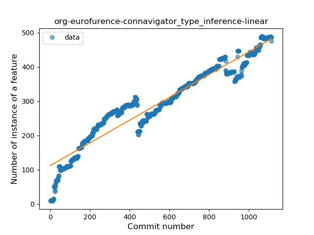

60. org-emunix-insteadlauncher

	*  Function: 
	* R_Squared: 0.91916394
 

61. com-agusyc-daycounter

	*  Function: 
	* R_Squared: 0.91884269
 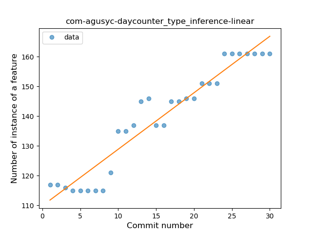

62. nl-renedegroot-android-adbawake

	*  Function: 
	* R_Squared: 0.91862108
 

63. com-peterlaurence-trekme

	*  Function: 
	* R_Squared: 0.91833463
 

64. fr-jnda-android-flashalert

	*  Function: 
	* R_Squared: 0.91583952
 

65. me-impa-knockonports

	*  Function: 
	* R_Squared: 0.91454016
 

66. fr-insapp-insapp

	*  Function: 
	* R_Squared: 0.91436039
 

67. com-pavelsikun-runinbackgroundpermissionsetter

	*  Function: 
	* R_Squared: 0.91421646
 

68. net-osmand-plus

	*  Function: 
	* R_Squared: 0.91078269
 

69. chat-rocket-android

	*  Function: 
	* R_Squared: 0.91012486
 

70. org-ligi-passandroid

	*  Function: 
	* R_Squared: 0.90999061
 

71. moe-feng-nhentai

	*  Function: 
	* R_Squared: 0.90788848
 

72. is-xyz-omw

	*  Function: 
	* R_Squared: 0.90477022
 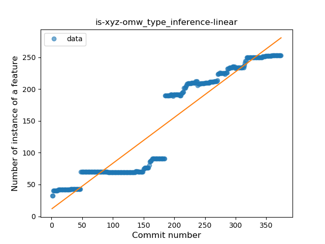

73. com-glodanif-bluetoothchat

	*  Function: 
	* R_Squared: 0.90393419
 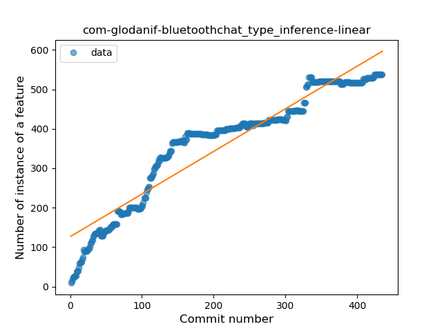

74. info-metadude-android-congress-schedule

	*  Function: 
	* R_Squared: 0.90329878
 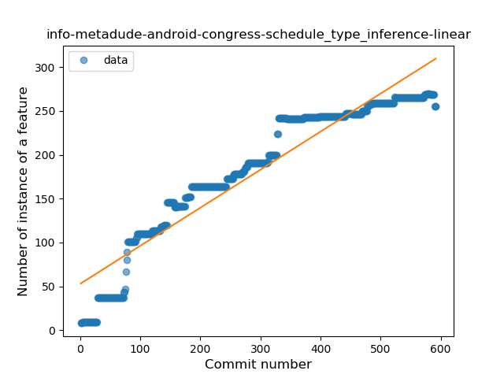

75. cz-dvratil-fbeventsync

	*  Function: 
	* R_Squared: 0.90320773
 

76. com-uwetrottmann-wpdisplay

	*  Function: 
	* R_Squared: 0.90174132
 

77. pt-ipleiria-mymusicqoe

	*  Function: 
	* R_Squared: 0.90146255
 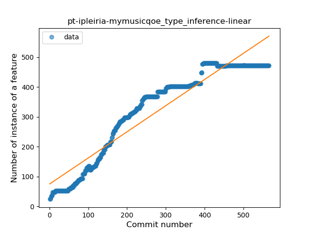

78. com-rohitsuratekar-NCBSinfo

	*  Function: 
	* R_Squared: 0.90126728
 

79. tw-shounenwind-kmnbottool

	*  Function: 
	* R_Squared: 0.89970489
 

80. ch-rmy-android-http_shortcuts

	*  Function: 
	* R_Squared: 0.89928367
 

81. org-walleth

	*  Function: 
	* R_Squared: 0.8972435
 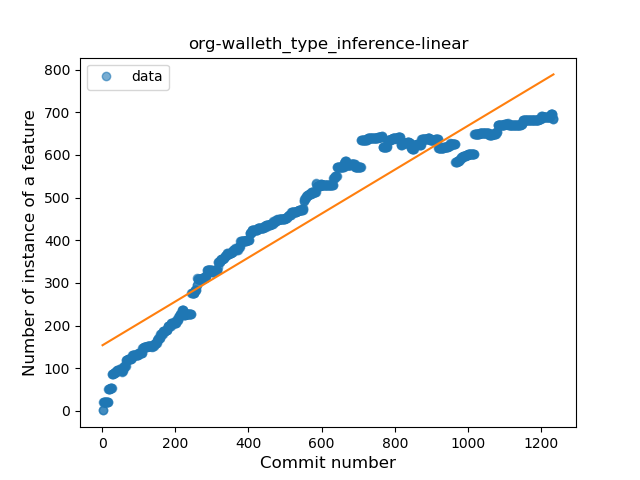

82. com-arcao-geocaching4locus

	*  Function: 
	* R_Squared: 0.89704658
 

83. de-grobox-liberario

	*  Function: 
	* R_Squared: 0.89700129
 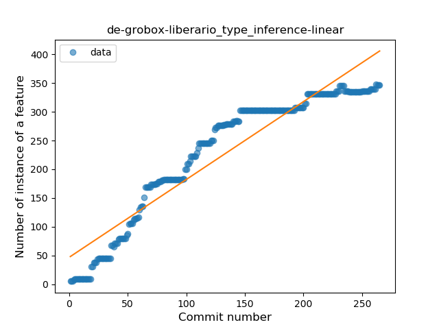

84. com-nononsenseapps-feeder

	*  Function: 
	* R_Squared: 0.89521876
 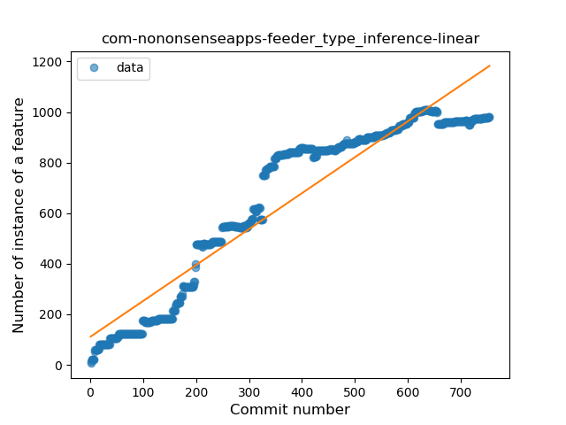

85. li-klass-fhem

	*  Function: 
	* R_Squared: 0.8932719
 

86. org-havenapp-main

	*  Function: 
	* R_Squared: 0.89239303
 

87. pw-janyo-janyoshare

	*  Function: 
	* R_Squared: 0.89048265
 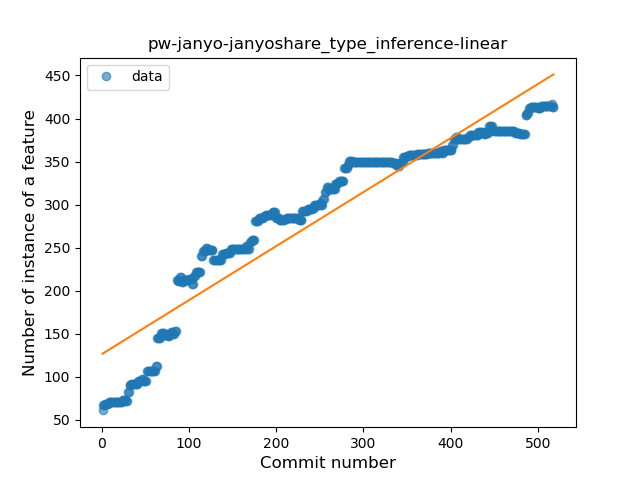

88. com-adityakamble49-ttl

	*  Function: 
	* R_Squared: 0.88545634
 

89. com-ogsdroid

	*  Function: 
	* R_Squared: 0.88380266
 

90. com-booboot-vndbandroid

	*  Function: 
	* R_Squared: 0.88347782
 

91. org-ligi-survivalmanual

	*  Function: 
	* R_Squared: 0.88133732
 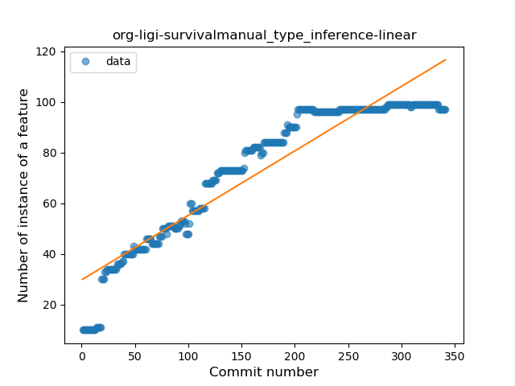

92. com-ianhanniballake-contractiontimer

	*  Function: 
	* R_Squared: 0.88121295
 

93. com-log28

	*  Function: 
	* R_Squared: 0.88017114
 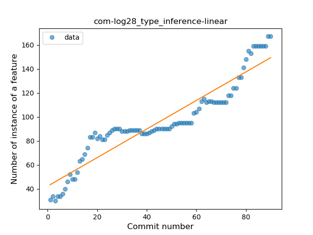

94. com-tasomaniac-openwith-floss

	*  Function: 
	* R_Squared: 0.87982512
 

95. com-pitchedapps-frost

	*  Function: 
	* R_Squared: 0.87879196
 

96. name-cantanima-chineseremainderclock

	*  Function: 
	* R_Squared: 0.87705194
 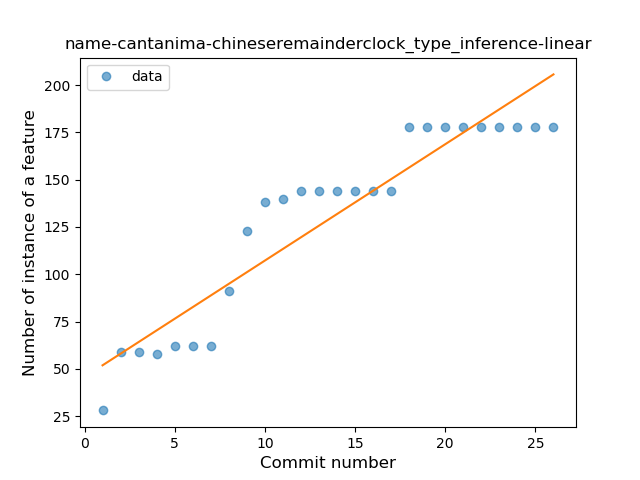

97. org-weilbach-splitbills

	*  Function: 
	* R_Squared: 0.87205549
 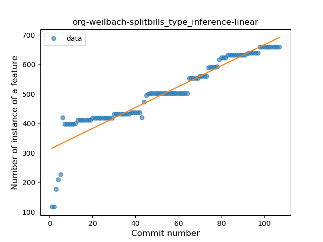

98. net-yslibrary-monotweety

	*  Function: 
	* R_Squared: 0.86916267
 

99. info-papdt-express-helper

	*  Function: 
	* R_Squared: 0.86901775
 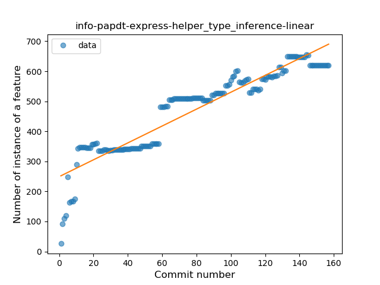

100. com-scientists-happy-botanist

	*  Function: 
	* R_Squared: 0.86275034
 

101. app-simone

	*  Function: 
	* R_Squared: 0.86205045
 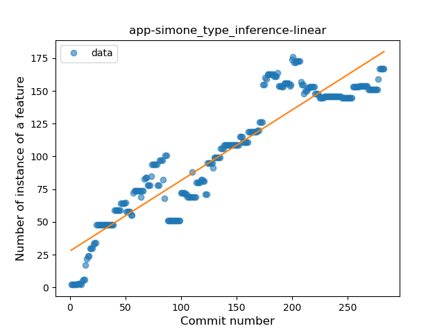

102. com-crane-mockappdemo

	*  Function: 
	* R_Squared: 0.86150745
 

103. com-simplemobiletools-notes-pro

	*  Function: 
	* R_Squared: 0.86126254
 

104. fi-kroon-vadret

	*  Function: 
	* R_Squared: 0.85766831
 

105. com-simplemobiletools-calendar-pro

	*  Function: 
	* R_Squared: 0.84897264
 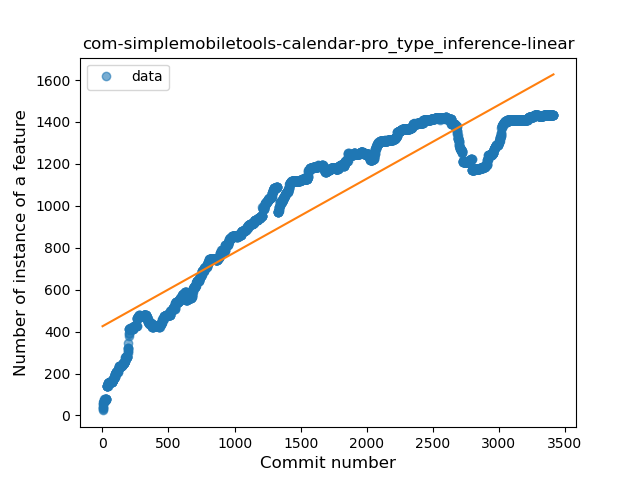

106. de-thecode-android-tazreader

	*  Function: 
	* R_Squared: 0.84534923
 

107. at-ac-tuwien-caa-docscan

	*  Function: 
	* R_Squared: 0.8429766
 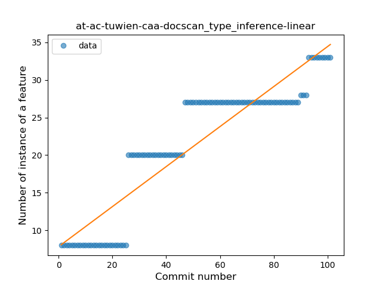

108. pl-org-seva-navigator

	*  Function: 
	* R_Squared: 0.83813347
 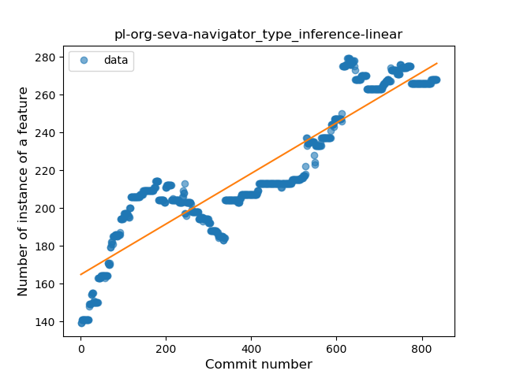

109. pixel-kotlin-bassblog

	*  Function: 
	* R_Squared: 0.83606957
 

110. org-liberty-android-freeotpplus

	*  Function: 
	* R_Squared: 0.83443898
 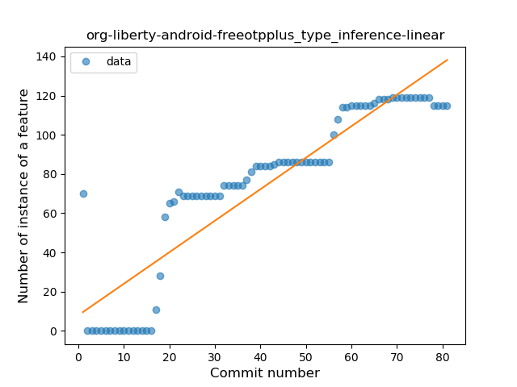

111. com-github-laurenttreguier-deck

	*  Function: 
	* R_Squared: 0.82788175
 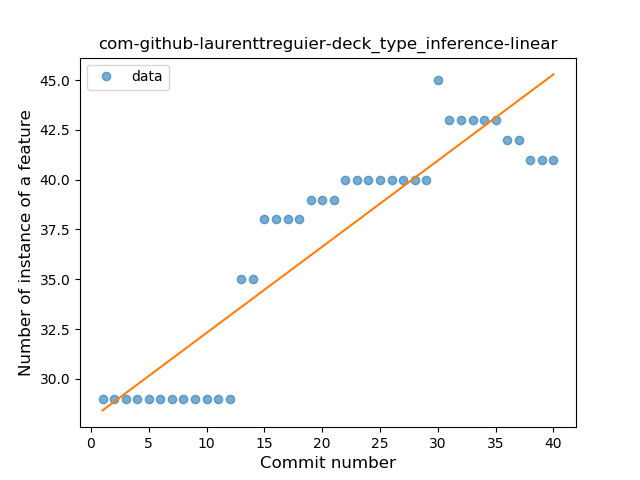

112. com-geo-GeoQuake

	*  Function: 
	* R_Squared: 0.8204371
 

113. org-freedombox-freedombox

	*  Function: 
	* R_Squared: 0.81699596
 

114. de-ph1b-audiobook

	*  Function: 
	* R_Squared: 0.81415804
 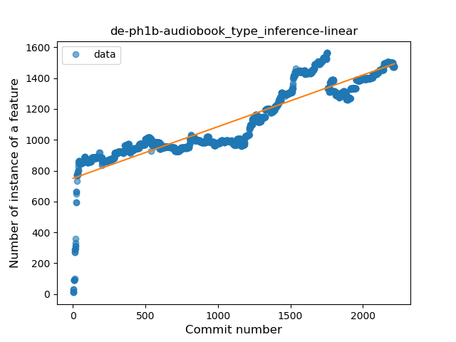

115. com-simplemobiletools-calculator

	*  Function: 
	* R_Squared: 0.79835768
 

116. horse-amazin-my-stratum0-statuswidget

	*  Function: 
	* R_Squared: 0.79513322
 

117. com-simplemobiletools-contacts-pro

	*  Function: 
	* R_Squared: 0.79123209
 

118. com-directdev-portal

	*  Function: 
	* R_Squared: 0.79054096
 

119. ca-rmen-android-poetassistant

	*  Function: 
	* R_Squared: 0.78358883
 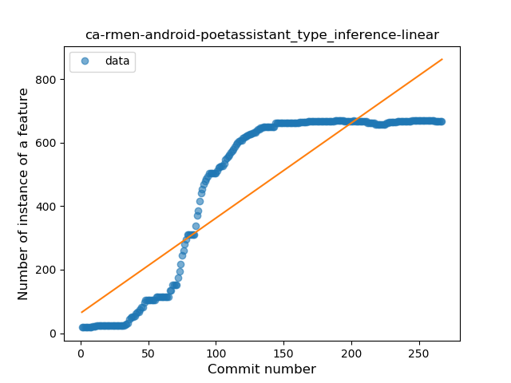

120. com-simplemobiletools-camera

	*  Function: 
	* R_Squared: 0.77027291
 

121. net-mm2d-android-vmb

	*  Function: 
	* R_Squared: 0.7685242
 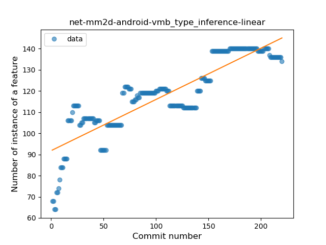

122. com-slash-batterychargelimit

	*  Function: 
	* R_Squared: 0.74961363
 

123. jp-cordea-mackerelclient

	*  Function: 
	* R_Squared: 0.72157219
 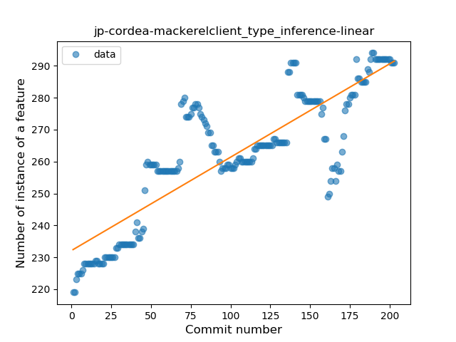

124. de-geeksfactory-opacclient

	*  Function: 
	* R_Squared: 0.69983614
 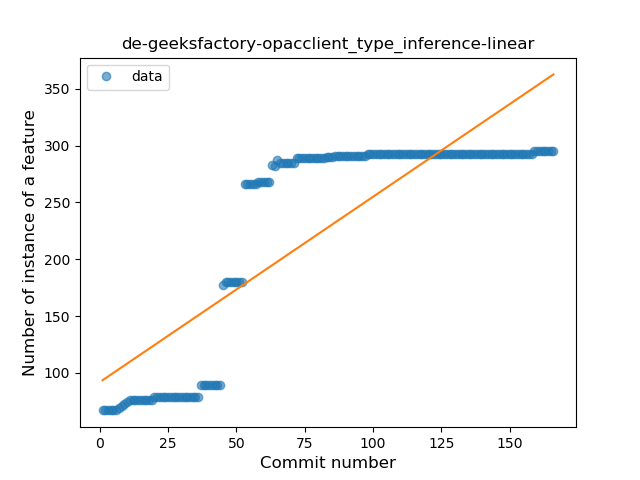

125. org-blokada-alarm

	*  Function: 
	* R_Squared: 0.690589
 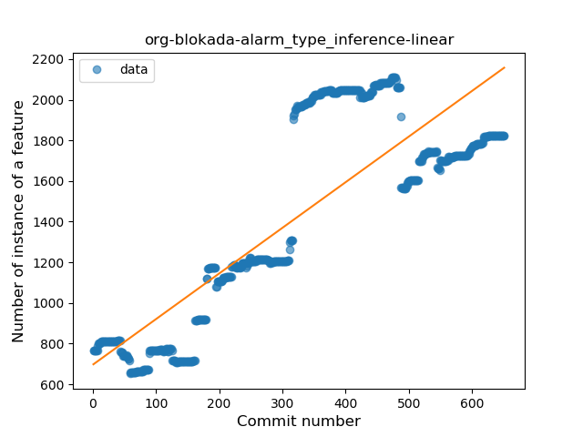

126. danbroid-searchview

	*  Function: 
	* R_Squared: 0.65152797
 

127. pw-janyo-whatanime

	*  Function: 
	* R_Squared: 0.62711309
 

131. de-spiritcroc-defaultdarktheme

	*  Function: 
	* R_Squared: 0.07129344
 

### <a name="T11">Instability</a> 
 ----

1. me-barta-stayintouch

	*  Function: 
	* R_Squared: 0.98749607
 

2. com-gimranov-zandy-app

	*  Function: 
	* R_Squared: 0.97065006
 

3. com-benny-pxerstudio

	*  Function: 
	* R_Squared: 0.96969697
 

4. io-github-z3r0c00l

	*  Function: 
	* R_Squared: 0.96573617
 

5. net-computingtutor-robert-computingtutor

	*  Function: 
	* R_Squared: 0.96074101
 

6. com-emmanuelmess-simplecleanup

	*  Function: 
	* R_Squared: 0.95954886
 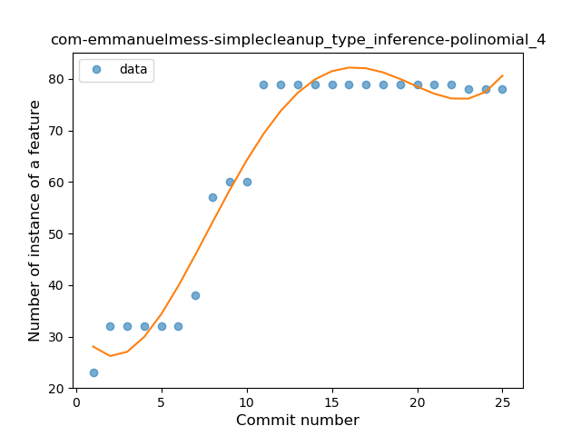

7. fr-jnda-android-ipcalc

	*  Function: 
	* R_Squared: 0.93479686
 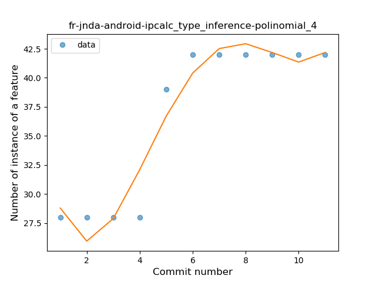

8. com-BibleQuote

	*  Function: 
	* R_Squared: 0.93227084
 

9. com-github-fractals

	*  Function: 
	* R_Squared: 0.93047924
 

10. org-lenchan139-ncbookmark

	*  Function: 
	* R_Squared: 0.92645672
 

11. com-defianttech-convertme

	*  Function: 
	* R_Squared: 0.92217361
 

12. com-enjoyingfoss-om

	*  Function: 
	* R_Squared: 0.92200333
 

13. com-manoj-dlt

	*  Function: 
	* R_Squared: 0.91871846
 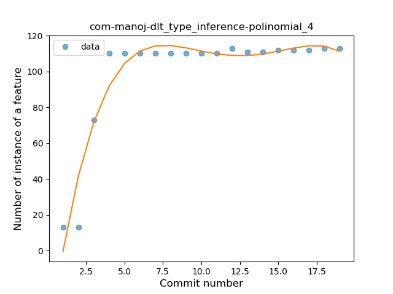

14. de-tubaf-mandelGL

	*  Function: 
	* R_Squared: 0.91851142
 

15. io-wookey-wallet

	*  Function: 
	* R_Squared: 0.90790086
 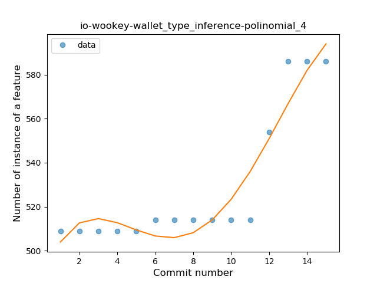

16. de-msal-muzei-nationalgeographic

	*  Function: 
	* R_Squared: 0.906792
 

17. bteelse-com-br-amipyscho

	*  Function: 
	* R_Squared: 0.88980035
 

18. com-alderferstudios-handandfootscores

	*  Function: 
	* R_Squared: 0.88636495
 

19. org-thiolliere-youtubestream

	*  Function: 
	* R_Squared: 0.88273392
 

20. com-firstrowria-pushnotificationtester

	*  Function: 
	* R_Squared: 0.87692308
 

21. com-greenlionsoft-pollution-madrid

	*  Function: 
	* R_Squared: 0.86836586
 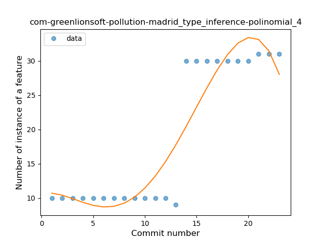

22. org-mcxa-vortaro

	*  Function: 
	* R_Squared: 0.86040108
 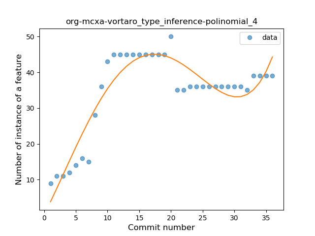

23. saschpe-poker

	*  Function: 
	* R_Squared: 0.84632782
 

24. me-siketyan-silicagel

	*  Function: 
	* R_Squared: 0.84210526
 

25. de-devmil-muzei-bingimageofthedayartsource

	*  Function: 
	* R_Squared: 0.80089981
 

26. com-brentpanther-bitcoinwidget

	*  Function: 
	* R_Squared: 0.78619148
 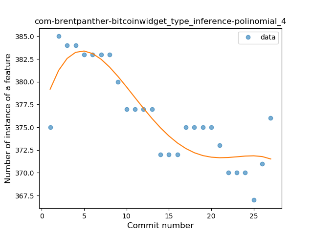

27. ru-nsu-bobrofon-easysshfs

	*  Function: 
	* R_Squared: 0.7853917
 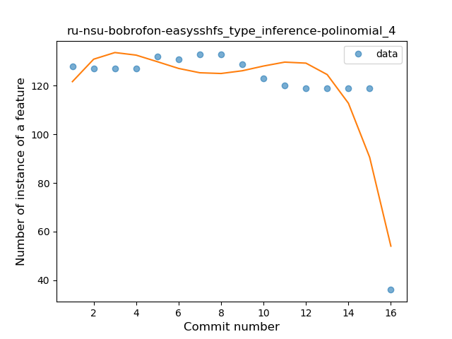

28. xyz-koleno-sunwidget

	*  Function: 
	* R_Squared: 0.77164701
 

29. net-codechunk-speedofsound

	*  Function: 
	* R_Squared: 0.75053973
 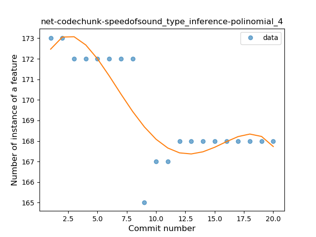

30. com-appspot-pistatium-mahougen

	*  Function: 
	* R_Squared: 0.72181957
 

31. org-teamblueridge-pasteitapp

	*  Function: 
	* R_Squared: 0.71931162
 

32. io-github-umren-watcher

	*  Function: 
	* R_Squared: 0.70097019
 

33. com-heed-justquotes

	*  Function: 
	* R_Squared: 0.67816232
 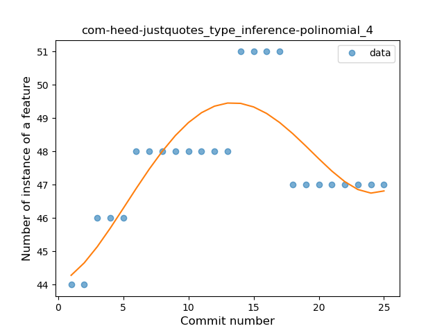

34. fr-rhaz-ipfs-sweet

	*  Function: 
	* R_Squared: 0.47511442
 

35. com-skydoves-waterdays

	*  Function: 
	* R_Squared: 0.25949726
 

### <a name="T4">Sudden Rise</a> 
 ----

1. ch-deletescape-lawnchair-plah

	*  Function: 
	* R_Squared: 0.99474562
 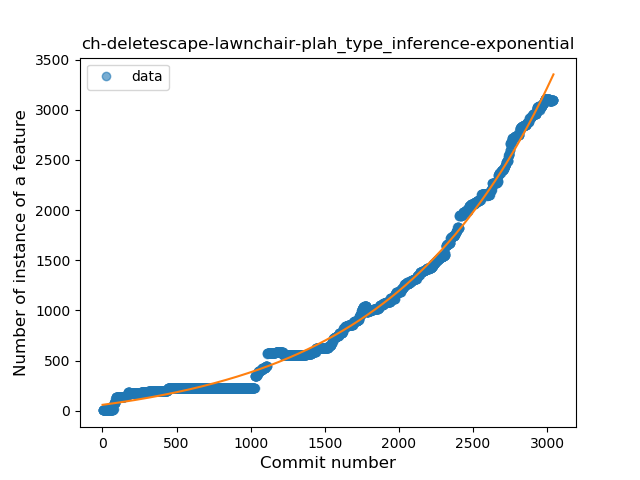

2. org-mozilla-rocket

	*  Function: 
	* R_Squared: 0.99258525
 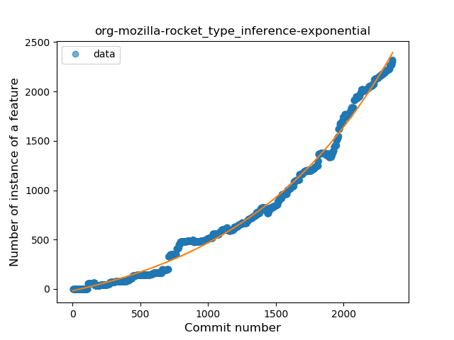

3. com-fsck-k9

	*  Function: 
	* R_Squared: 0.9888269
 

4. de-markusfisch-android-binaryeye

	*  Function: 
	* R_Squared: 0.97836246
 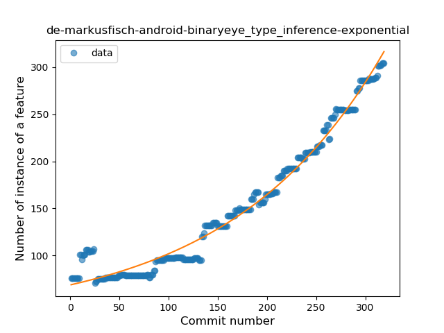

5. pl-hypeapp-episodie

	*  Function: 
	* R_Squared: 0.9770068
 

6. fi-tuska-jalkametri

	*  Function: 
	* R_Squared: 0.97413051
 

7. net-bible-android-activity

	*  Function: 
	* R_Squared: 0.97033097
 

8. com-nextcloud-talk2

	*  Function: 
	* R_Squared: 0.96922351
 

9. de-westnordost-streetcomplete

	*  Function: 
	* R_Squared: 0.96906838
 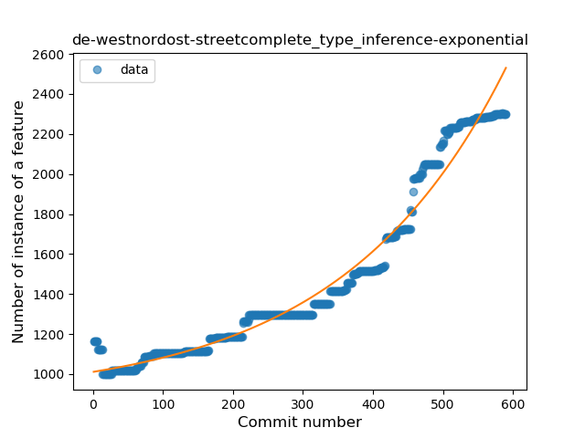

10. com-github-premnirmal-tickerwidget

	*  Function: 
	* R_Squared: 0.96647644
 

11. org-mozilla-focus

	*  Function: 
	* R_Squared: 0.96493056
 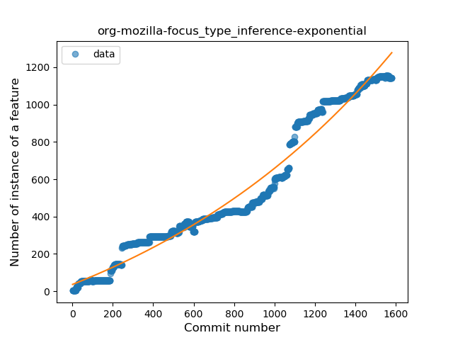

12. org-mozilla-klar

	*  Function: 
	* R_Squared: 0.96493056
 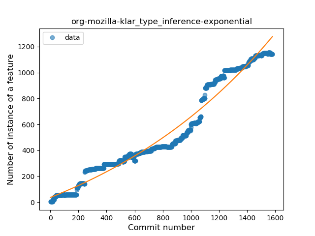

13. jp-toastkid-yobidashi

	*  Function: 
	* R_Squared: 0.96346058
 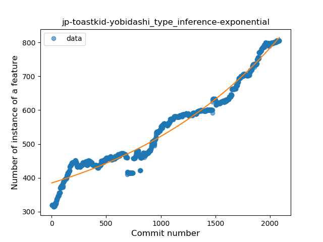

14. io-ipoli-android

	*  Function: 
	* R_Squared: 0.96166187
 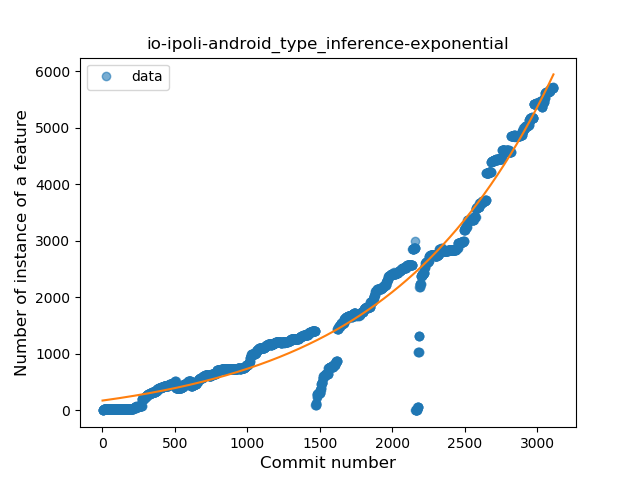

15. science-apolline

	*  Function: 
	* R_Squared: 0.95995181
 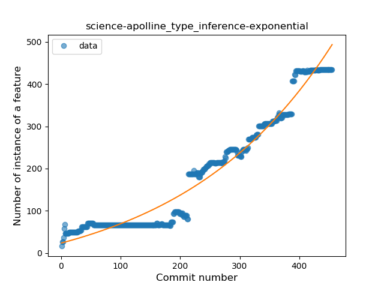

16. tech-ula

	*  Function: 
	* R_Squared: 0.9593494
 

17. de-Maxr1998-xposed-maxlock

	*  Function: 
	* R_Squared: 0.95812671
 

18. org-pacien-tincapp

	*  Function: 
	* R_Squared: 0.95677134
 

19. com-thanksmister-iot-mqtt-alarmpanel

	*  Function: 
	* R_Squared: 0.9551462
 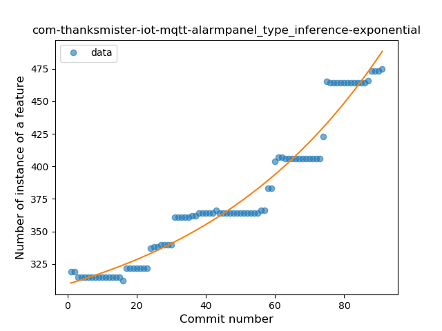

20. com-zeapo-pwdstore

	*  Function: 
	* R_Squared: 0.94832203
 

21. com-lavadip-miniVector

	*  Function: 
	* R_Squared: 0.94681051
 

22. me-proxer-app

	*  Function: 
	* R_Squared: 0.9466898
 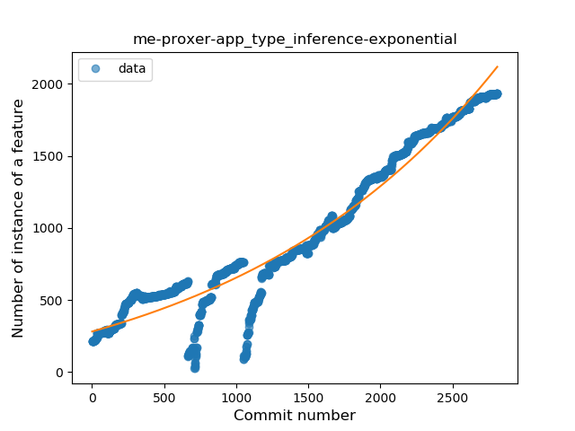

23. com-github-vase4kin-teamcityapp

	*  Function: 
	* R_Squared: 0.94634146
 

24. com-android-gpstest-osmdroid

	*  Function: 
	* R_Squared: 0.94619834
 

25. me-anon-grow

	*  Function: 
	* R_Squared: 0.94416624
 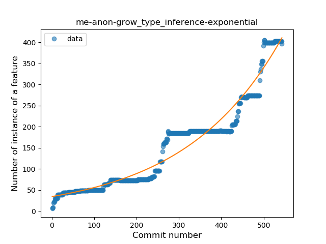

26. me-blog-korn123-easydiary

	*  Function: 
	* R_Squared: 0.9421046
 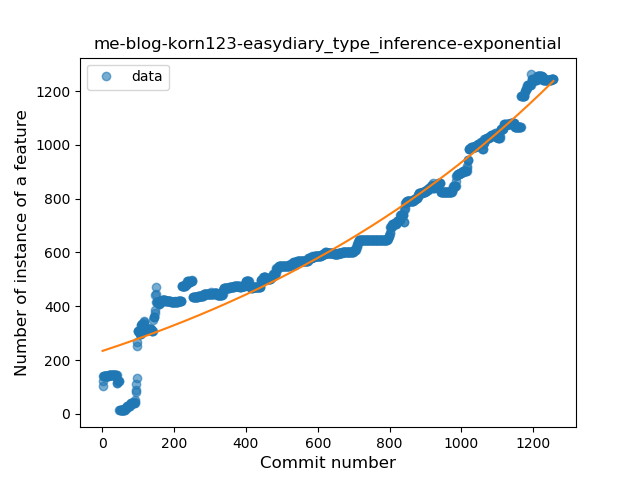

27. com-mbcdev-folkets

	*  Function: 
	* R_Squared: 0.94128005
 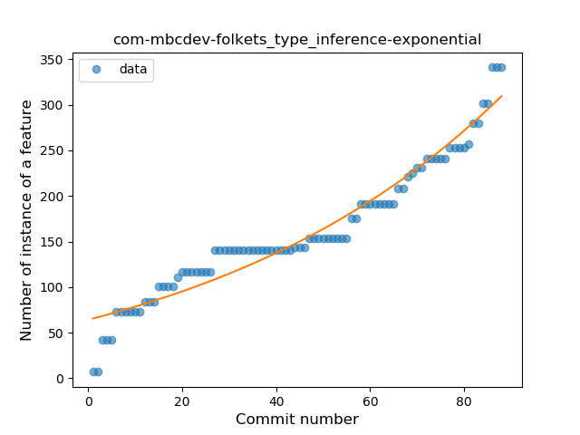

28. com-whiterabbit-pisabike

	*  Function: 
	* R_Squared: 0.94080739
 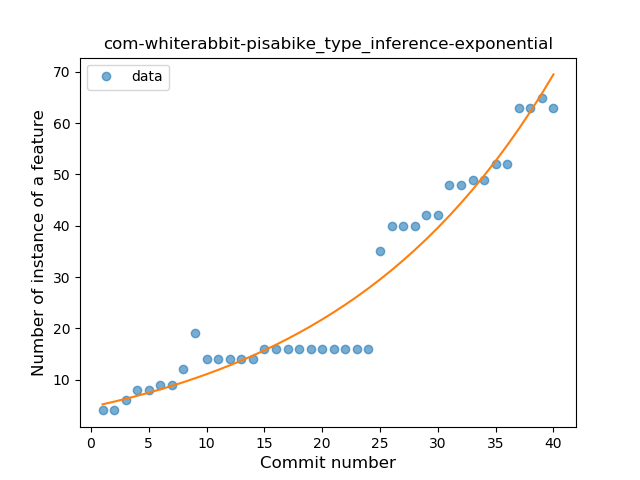

29. com-github-moko256-twitlatte

	*  Function: 
	* R_Squared: 0.93817639
 

30. com-github-cvzi-screenshottile

	*  Function: 
	* R_Squared: 0.93788229
 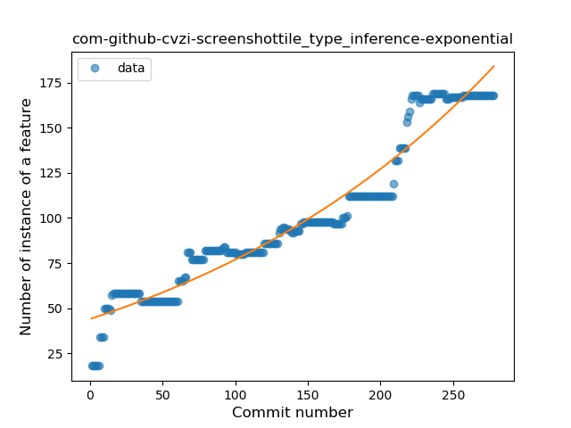

31. com-eventyay-attendee

	*  Function: 
	* R_Squared: 0.93475227
 

32. com-mrbimc-selinux

	*  Function: 
	* R_Squared: 0.9308057
 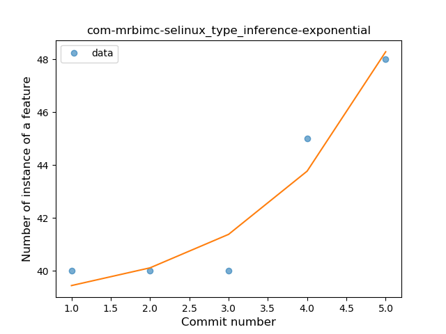

33. com-simplemobiletools-flashlight

	*  Function: 
	* R_Squared: 0.92610601
 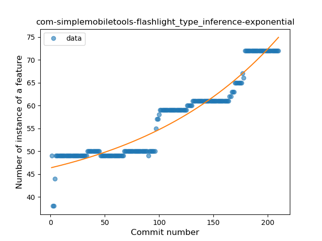

34. com-loloof64-android-basicchessendgamestrainer

	*  Function: 
	* R_Squared: 0.91781392
 

35. org-ligi-gobandroid

	*  Function: 
	* R_Squared: 0.91116782
 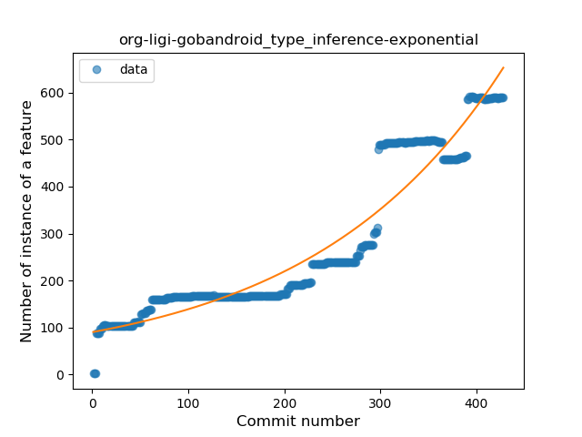

36. com-breadwallet

	*  Function: 
	* R_Squared: 0.90895511
 

37. ai-susi

	*  Function: 
	* R_Squared: 0.9078489
 

38. fr-corenting-edcompanion

	*  Function: 
	* R_Squared: 0.90309633
 

39. ru-hyst329-openfool

	*  Function: 
	* R_Squared: 0.90220554
 

40. net-mm2d-dmsexplorer

	*  Function: 
	* R_Squared: 0.90064363
 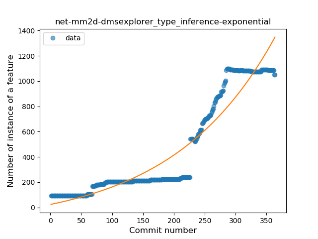

41. es-danirod-rectball-android

	*  Function: 
	* R_Squared: 0.89319276
 

42. com-jim-sharetocomputer

	*  Function: 
	* R_Squared: 0.89097289
 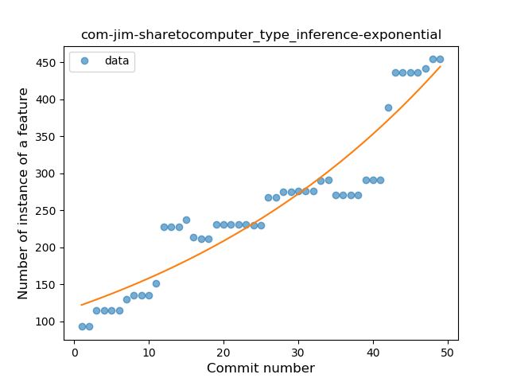

43. org-zimmob-zimlx

	*  Function: 
	* R_Squared: 0.8838029
 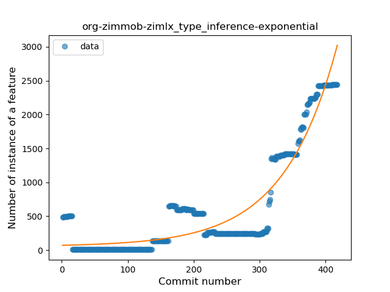

44. pt-joaomneto-titancompanion

	*  Function: 
	* R_Squared: 0.8545685
 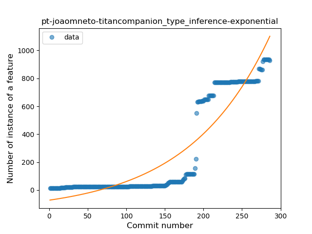

45. de-csicar-mensaplan

	*  Function: 
	* R_Squared: 0.84736982
 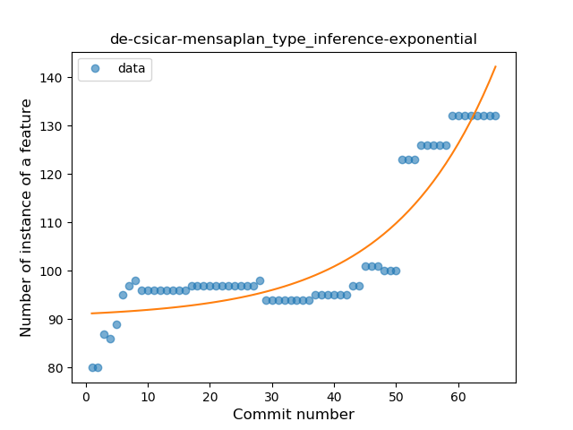

46. apps-amine-bou-readerforselfoss

	*  Function: 
	* R_Squared: 0.84736568
 

47. org-commcare-dalvik

	*  Function: 
	* R_Squared: 0.84461384
 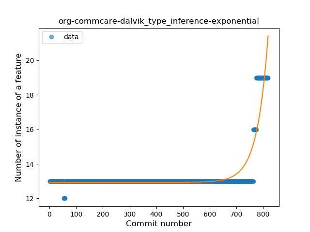

48. com-pyamsoft-homebutton

	*  Function: 
	* R_Squared: 0.82061756
 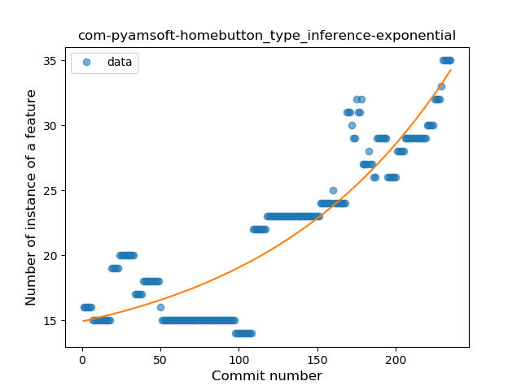

49. com-moez-QKSMS

	*  Function: 
	* R_Squared: 0.81081624
 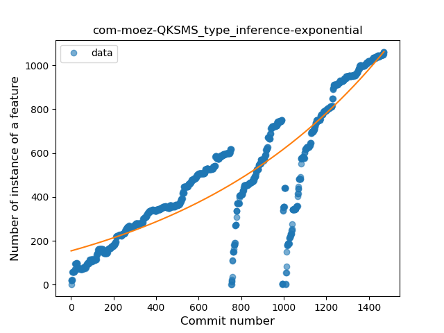

50. org-mosad-seil0-projectlaogai

	*  Function: 
	* R_Squared: 0.80264271
 

51. info-dvkr-screenstream

	*  Function: 
	* R_Squared: 0.79113456
 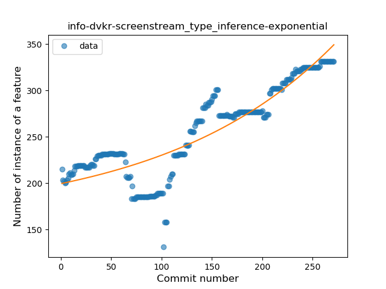

52. com-cookiegames-smartcookie

	*  Function: 
	* R_Squared: 0.78382484
 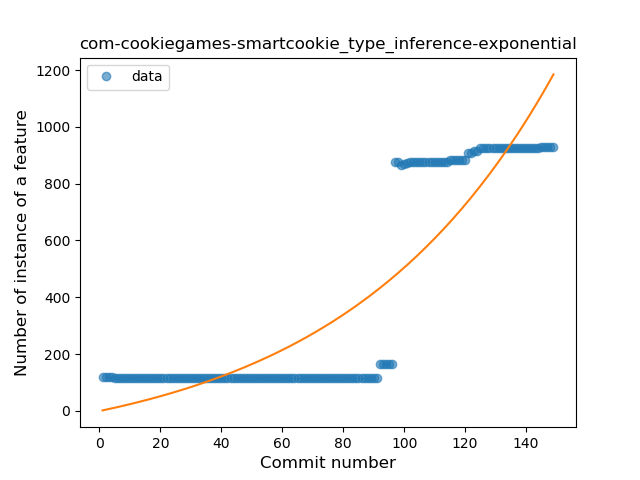

53. org-isoron-uhabits

	*  Function: 
	* R_Squared: 0.77107462
 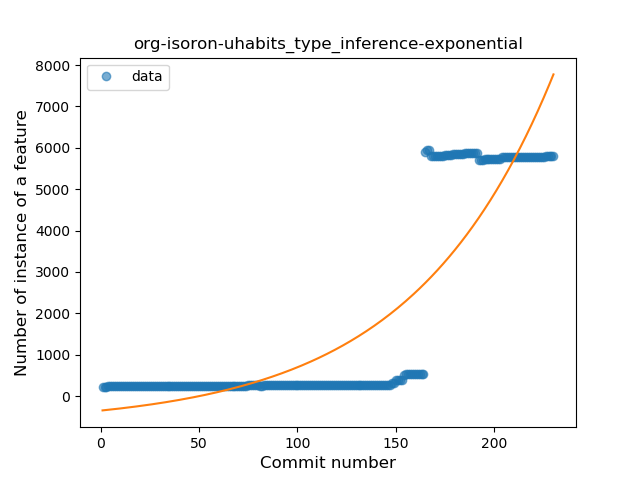

54. pl-poznajapp

	*  Function: 
	* R_Squared: 0.70691325
 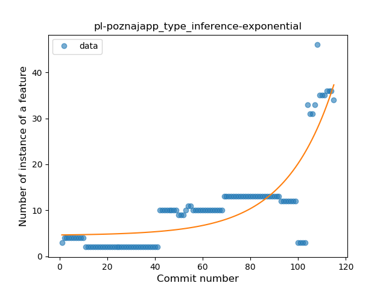

56. com-bernaferrari-changedetection

	*  Function: 
	* R_Squared: 0.67689138
 

57. org-mifos-mobile

	*  Function: 
	* R_Squared: 0.60205645
 

58. rectangledbmi-com-pittsburghrealtimetracker

	*  Function: 
	* R_Squared: 0.55028338
 

59. net-frju-flym

	*  Function: 
	* R_Squared: 0.52664139
 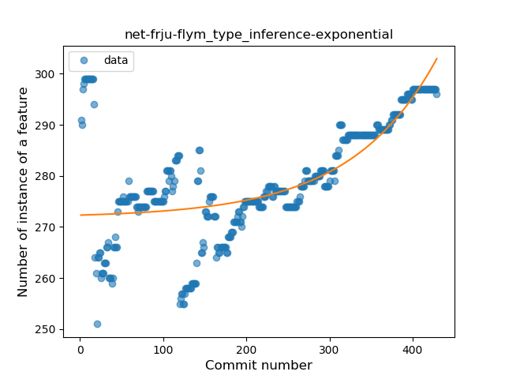

60. me-camsteffen-polite

	*  Function: 
	* R_Squared: 0.37869323
 

61. org-anibyl-slounik

	*  Function: 
	* R_Squared: 0.05821154
 

### <a name="T6">Sudden Rise Plateau</a> 
 ----

1. com-simplemobiletools-draw

	*  Function: 
	* R_Squared: 0.94966829
 

2. com-simplemobiletools-draw-pro

	*  Function: 
	* R_Squared: 0.94966829
 

3. eu-depau-etchdroid

	*  Function: 
	* R_Squared: 0.92176587
 

4. com-guardafilme

	*  Function: 
	* R_Squared: 0.9208083
 

5. com-androidheads-vienna-escalero

	*  Function: 
	* R_Squared: 0.9116435
 

6. com-github-fields-electric

	*  Function: 
	* R_Squared: 0.90857602
 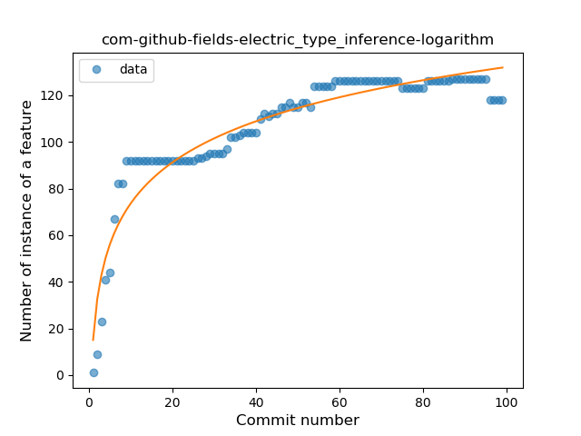

7. de-devmil-paperlaunch

	*  Function: 
	* R_Squared: 0.89594467
 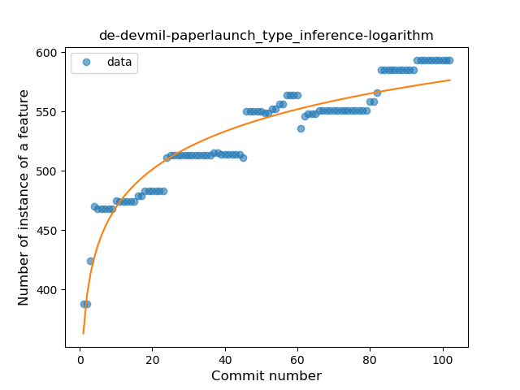

8. com-commit451-gitlab

	*  Function: 
	* R_Squared: 0.89207459
 

9. com-njlabs-showjava

	*  Function: 
	* R_Squared: 0.87469491
 

10. org-decsync-cc

	*  Function: 
	* R_Squared: 0.87378245
 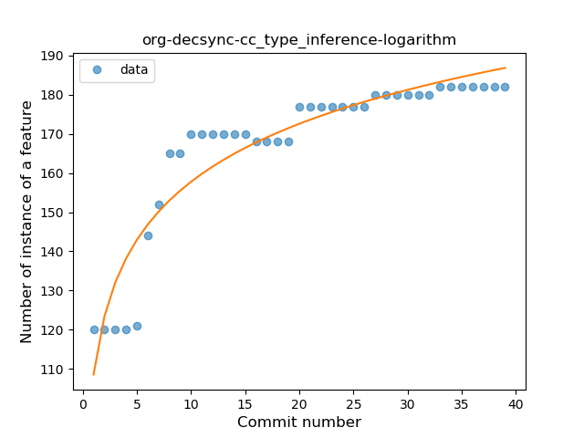

11. nl-brouwerijdemolen-borefts2013

	*  Function: 
	* R_Squared: 0.87262393
 

12. io-github-deweyreed-clipboardcleaner

	*  Function: 
	* R_Squared: 0.87017017
 

13. com-benoitquenaudon-tvfoot-red

	*  Function: 
	* R_Squared: 0.86803727
 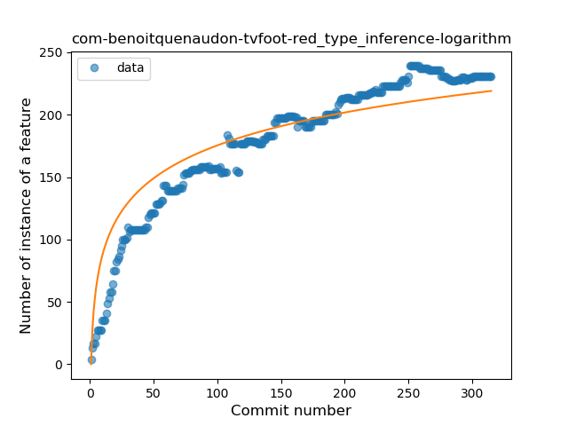

14. com-simplemobiletools-musicplayer

	*  Function: 
	* R_Squared: 0.85349347
 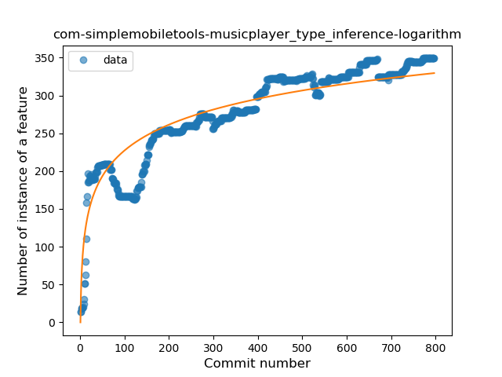

15. com-ids1024-lsdict

	*  Function: 
	* R_Squared: 0.8521282
 

16. co-timecrypt-android

	*  Function: 
	* R_Squared: 0.85038681
 

17. com-jidogoon-roundedscreen

	*  Function: 
	* R_Squared: 0.84025426
 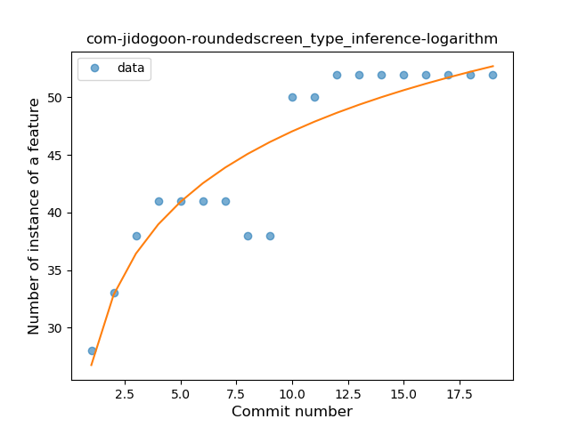

18. com-wilderpereira-lmgtfygen

	*  Function: 
	* R_Squared: 0.8316355
 

19. com-simplemobiletools-applauncher

	*  Function: 
	* R_Squared: 0.83003519
 

20. com-simplemobiletools-clock

	*  Function: 
	* R_Squared: 0.82550325
 

21. net-nurik-roman-muzei

	*  Function: 
	* R_Squared: 0.81139657
 

22. com-tumblr-svetylk0-sheepsgohome-android

	*  Function: 
	* R_Squared: 0.81088818
 

23. com-bubelov-coins

	*  Function: 
	* R_Squared: 0.8040491
 

24. de-thecode-lmd

	*  Function: 
	* R_Squared: 0.80296299
 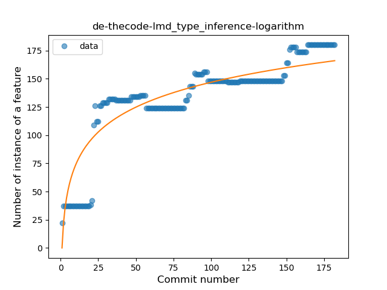

25. de-blankedv-lanbahnpanel

	*  Function: 
	* R_Squared: 0.78191144
 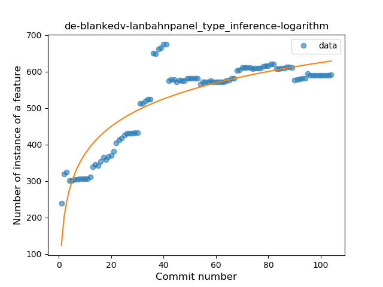

26. cat-xojan-random1

	*  Function: 
	* R_Squared: 0.75413331
 

27. com-garpr-android

	*  Function: 
	* R_Squared: 0.75216142
 

28. fr-cph-chicago-foss

	*  Function: 
	* R_Squared: 0.74738579
 

29. org-poul-bits-android

	*  Function: 
	* R_Squared: 0.74221014
 

30. com-guerinet-mymartlet

	*  Function: 
	* R_Squared: 0.72622064
 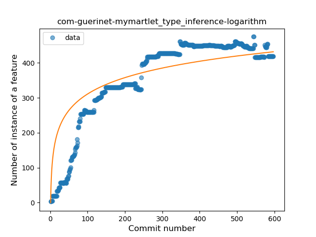

31. net-kourlas-voipms

	*  Function: 
	* R_Squared: 0.71952699
 

32. com-libopenmw-openmw

	*  Function: 
	* R_Squared: 0.70994075
 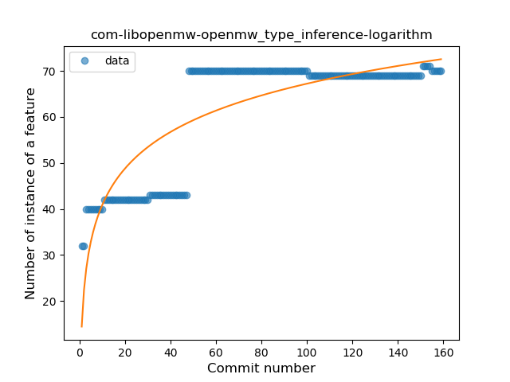

33. org-mattvchandler-a2050

	*  Function: 
	* R_Squared: 0.70406893
 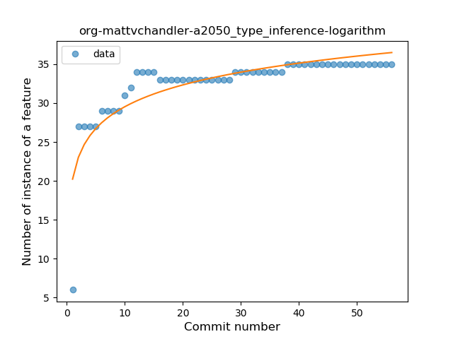

34. ml-adamsprogs-bimba

	*  Function: 
	* R_Squared: 0.70042991
 

35. acr-browser-lightning

	*  Function: 
	* R_Squared: 0.69892533
 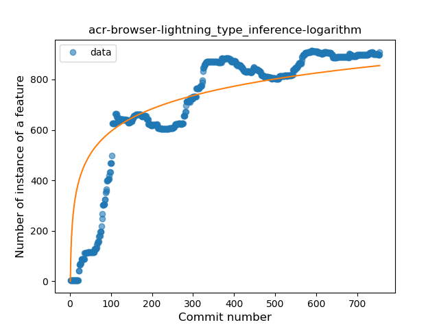

36. nl-mpcjanssen-simpletask

	*  Function: 
	* R_Squared: 0.66606576
 

37. com-pennapps-labs-pennmobile

	*  Function: 
	* R_Squared: 0.64850236
 

38. com-etesync-syncadapter

	*  Function: 
	* R_Squared: 0.64518926
 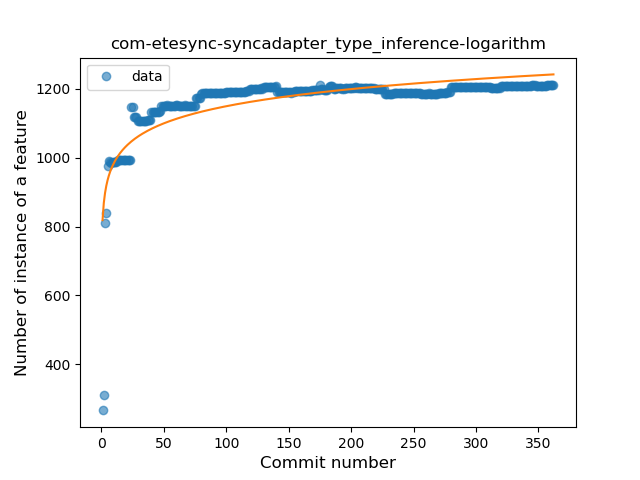

39. at-bitfire-davdroid

	*  Function: 
	* R_Squared: 0.60914322
 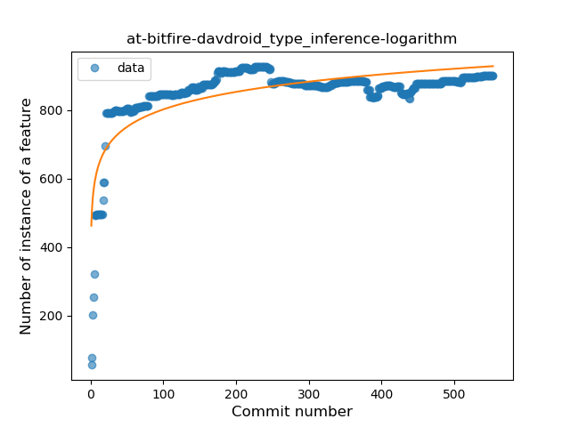

40. org-ligi-ipfsdroid

	*  Function: 
	* R_Squared: 0.59325015
 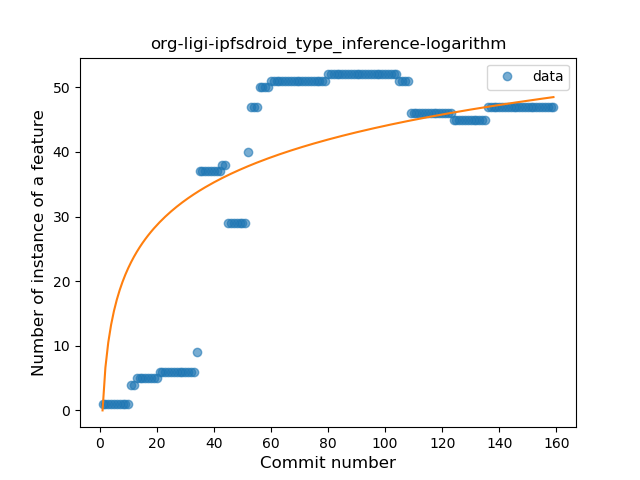

41. org-kiwix-kiwixcustomwikivoyageeurope

	*  Function: 
	* R_Squared: 0.54213777
 

42. com-yubico-yubioath

	*  Function: 
	* R_Squared: 0.50102989
 

43. com-atanana-sicounter

	*  Function: 
	* R_Squared: 0.48666255
 

44. com-ids1024-whitakerswords

	*  Function: 
	* R_Squared: 0.46546314
 

45. eu-the4thfloor-msync

	*  Function: 
	* R_Squared: 0.45397518
 

46. org-sanpra-checklist

	*  Function: 
	* R_Squared: 0.45044794
 

47. sk-styk-martin-apkanalyzer

	*  Function: 
	* R_Squared: 0.42002829
 

48. pl-org-seva-texter

	*  Function: 
	* R_Squared: 0.40227542
 

49. com-simplemobiletools-thankyou

	*  Function: 
	* R_Squared: 0.32369648
 

50. me-echeung-moemoekyun-fdroid

	*  Function: 
	* R_Squared: 0.27221323
 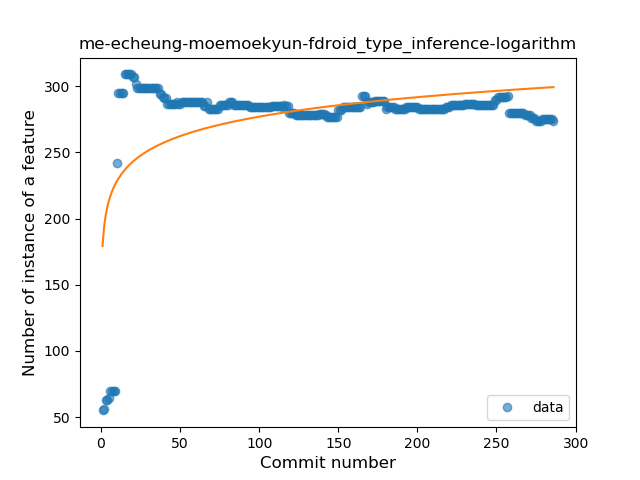

51. me-rei_m-hyakuninisshu

	*  Function: 
	* R_Squared: 0.23957912
 

52. com-example-forgottenumbrella-cardboardmuseum

	*  Function: 
	* R_Squared: 0.2036467
 

53. college-wyk-app

	*  Function: 
	* R_Squared: 0.04637488
 

### <a name="T7">Plateau Gradual Rise</a> 
 ----

1. com-example-harisont-librery

	*  Function: 
	* R_Squared: 0.97367922
 

2. com-rhm-pwn

	*  Function: 
	* R_Squared: 0.9622561
 

3. it-diab

	*  Function: 
	* R_Squared: 0.92938291
 

4. io-mkg20001-arubanetworkslogin

	*  Function: 
	* R_Squared: 0.92916366
 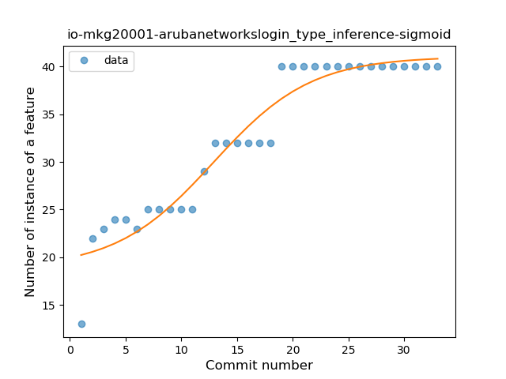

5. tk-superl2-xwifi

	*  Function: 
	* R_Squared: 0.92446567
 

6. co-pxhouse-sas

	*  Function: 
	* R_Squared: 0.85264918
 

7. com-nao20010128nao-DroidComplex

	*  Function: 
	* R_Squared: 0.85091738
 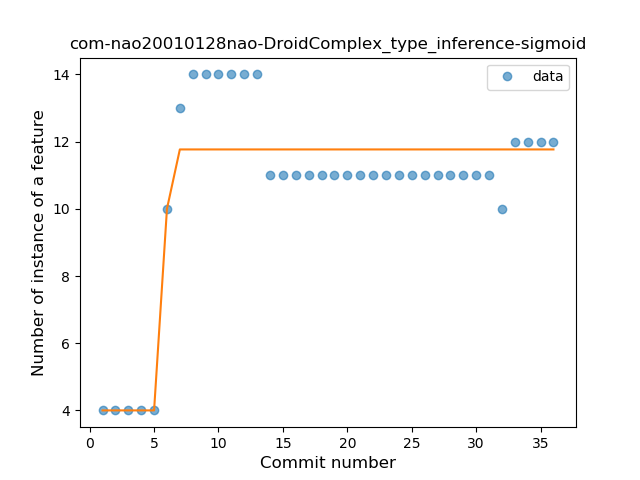

8. superustats-tool-android

	*  Function: 
	* R_Squared: 0.74461663
 

9. pl-temomuko-autostoprace

	*  Function: 
	* R_Squared: 0.65582877
 

10. com-conorodonnell-bus

	*  Function: 
	* R_Squared: 0.6124219
 

### <a name="T9">Plateau Sudden Rise</a> 
 ----

1. com-james-status

	*  Function: 
	* R_Squared: 1.0
 

2. io-github-project

	*  Function: 
	* R_Squared: 1.0
 

3. io-github-project_travel_mate

	*  Function: 
	* R_Squared: 1.0
 

4. name-myigel-fahrplan-eh17

	*  Function: 
	* R_Squared: 1.0
 

8. com-sduduzog-slimlauncher

	*  Function: 
	* R_Squared: 0.4679746
 

### <a name="T10">Plateau Sudden Decline</a> 
 ----

5. com-calintat-sensors

	*  Function: 
	* R_Squared: 0.80856459
 

6. org-ligi-fast

	*  Function: 
	* R_Squared: 0.66420664
 

7. org-ligi-faster

	*  Function: 
	* R_Squared: 0.66420664
 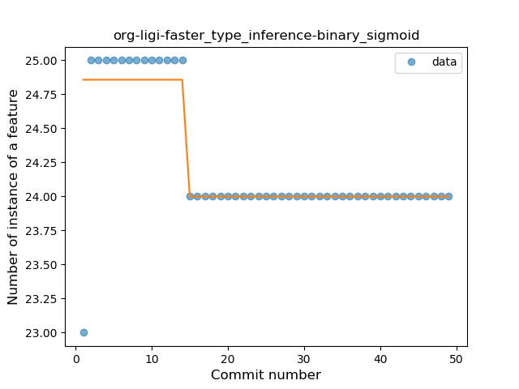

9. net-nonylene-photolinkviewer

	*  Function: 
	* R_Squared: 0.21656488
 

### <a name="T2">Constant Decline</a> 
 ----

128. com-benny-openlauncher

	*  Function: 
	* R_Squared: 0.53220576
 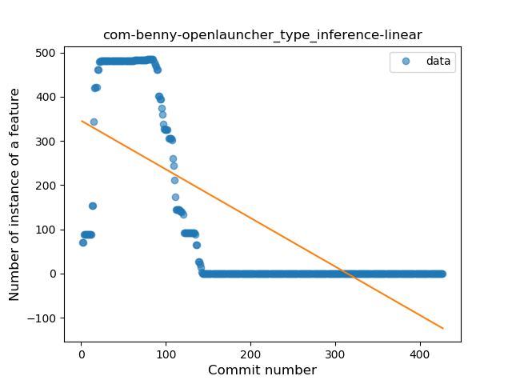

129. de-spiritcroc-darkcroc-substratum

	*  Function: 
	* R_Squared: 0.13691937
 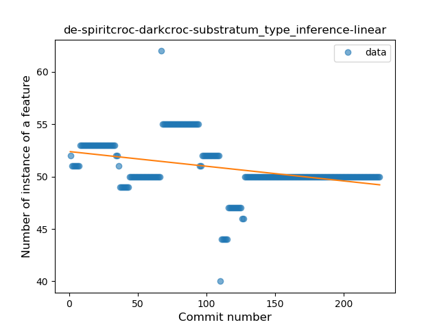

130. com-jmstudios-redmoon

	*  Function: 
	* R_Squared: 0.12634391
 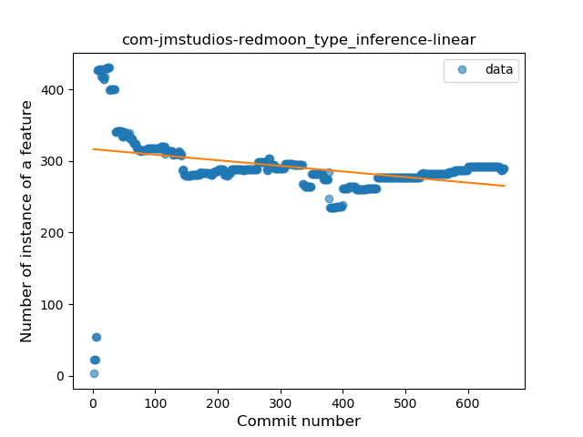

### <a name="T5">Sudden Decline</a> 
 ----

55. org-equeim-tremotesf

	*  Function: 
	* R_Squared: 0.67926502
 

### <a name="T3">Stability</a> 
 ----

### <a name="T8">Plateau Gradual Decline</a> 
 ----

