## Unsafe Call
----
**Best fit = Constant Rise**: 60

Function | N# best fit
----|----
<a href=" #T1">Constant Rise</a> | 60
<a href=" #T4">Sudden Rise</a> | 54
<a href=" #T11">Instability</a> | 51
<a href=" #T7">Plateau Gradual Rise</a> | 41
<a href=" #T2">Constant Decline</a> | 32
<a href=" #T6">Sudden Rise Plateau</a> | 25
<a href=" #T5">Sudden Decline</a> | 19
<a href=" #T9">Plateau Sudden Rise</a> | 17
<a href=" #T10">Plateau Sudden Decline</a> | 11
<a href=" #T8">Plateau Gradual Decline</a> | 3
<a href=" #T3">Stability</a> | 0

### <a name="T1">Constant Rise</a> 
 ----

1. ffc-app

	*  Function: 
	* R_Squared: 0.98378108
 

2. org-emunix-insteadlauncher

	*  Function: 
	* R_Squared: 0.98129483
 

3. com-esafirm-androidplayground

	*  Function: 
	* R_Squared: 0.96257076
 

4. com-keylesspalace-tusky

	*  Function: 
	* R_Squared: 0.94723045
 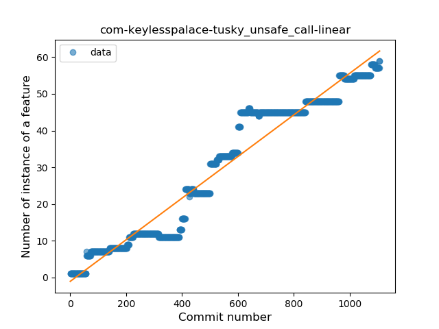

5. ca-rmen-android-poetassistant

	*  Function: 
	* R_Squared: 0.94506261
 

6. com-fastaccess-github-libre

	*  Function: 
	* R_Squared: 0.94488087
 

7. com-fsck-k9

	*  Function: 
	* R_Squared: 0.94479117
 

8. eu-kanade-tachiyomi

	*  Function: 
	* R_Squared: 0.93217315
 

9. org-ligi-survivalmanual

	*  Function: 
	* R_Squared: 0.93174197
 

10. sreich-countthedays

	*  Function: 
	* R_Squared: 0.93152516
 

11. moe-feng-nhentai

	*  Function: 
	* R_Squared: 0.92851224
 

12. com-dp-logcatapp

	*  Function: 
	* R_Squared: 0.92048023
 

13. io-github-feelfreelinux-wykopmobilny

	*  Function: 
	* R_Squared: 0.91543554
 

14. com-jereksel-libresubstratum

	*  Function: 
	* R_Squared: 0.91376871
 

15. ch-abertschi-adfree

	*  Function: 
	* R_Squared: 0.90944011
 

16. fr-chenry-android-freshrss

	*  Function: 
	* R_Squared: 0.90812292
 

17. org-ligi-passandroid

	*  Function: 
	* R_Squared: 0.90589479
 

18. com-motion-stage1

	*  Function: 
	* R_Squared: 0.89785722
 

19. com-ruuvi-station

	*  Function: 
	* R_Squared: 0.89439231
 

20. com-log28

	*  Function: 
	* R_Squared: 0.8936477
 

21. com-simplemobiletools-contacts-pro

	*  Function: 
	* R_Squared: 0.89261355
 

22. de-r4md4c-gamedealz

	*  Function: 
	* R_Squared: 0.89063706
 

23. com-heed-justquotes

	*  Function: 
	* R_Squared: 0.89054688
 

24. de-grobox-liberario

	*  Function: 
	* R_Squared: 0.88599583
 

25. com-zeapo-pwdstore

	*  Function: 
	* R_Squared: 0.87953493
 

26. net-bible-android-activity

	*  Function: 
	* R_Squared: 0.87623451
 

27. com-rohitsuratekar-NCBSinfo

	*  Function: 
	* R_Squared: 0.87335038
 

29. com-orgzly

	*  Function: 
	* R_Squared: 0.85731219
 

30. com-tasomaniac-openwith-floss

	*  Function: 
	* R_Squared: 0.85469353
 

31. fi-kroon-vadret

	*  Function: 
	* R_Squared: 0.85127369
 

32. be-mygod-vpnhotspot

	*  Function: 
	* R_Squared: 0.85033953
 

33. com-stevenschoen-putionew

	*  Function: 
	* R_Squared: 0.84921064
 

34. org-poul-bits-android

	*  Function: 
	* R_Squared: 0.84765495
 

35. app-opass-ccip

	*  Function: 
	* R_Squared: 0.84370347
 

36. de-thecode-lmd

	*  Function: 
	* R_Squared: 0.82253512
 

37. org-pacien-tincapp

	*  Function: 
	* R_Squared: 0.81750079
 

39. com-pitchedapps-frost

	*  Function: 
	* R_Squared: 0.78999445
 

40. com-duckduckgo-mobile-android

	*  Function: 
	* R_Squared: 0.77964921
 

41. de-Maxr1998-xposed-maxlock

	*  Function: 
	* R_Squared: 0.77805083
 

42. is-xyz-omw

	*  Function: 
	* R_Squared: 0.77683101
 

43. org-mosad-seil0-projectlaogai

	*  Function: 
	* R_Squared: 0.77667656
 

44. com-lavadip-miniVector

	*  Function: 
	* R_Squared: 0.7718201
 

45. im-vector-alpha

	*  Function: 
	* R_Squared: 0.76808153
 

46. org-blokada-alarm

	*  Function: 
	* R_Squared: 0.75248096
 

47. com-dozingcatsoftware-vectorcamera

	*  Function: 
	* R_Squared: 0.7482747
 

48. org-decsync-cc

	*  Function: 
	* R_Squared: 0.74648181
 

49. com-simplemobiletools-gallery-pro

	*  Function: 
	* R_Squared: 0.74426879
 

50. com-github-moko256-twitlatte

	*  Function: 
	* R_Squared: 0.73851513
 

51. chat-rocket-android

	*  Function: 
	* R_Squared: 0.7183711
 

55. fr-openium-auvergnewebcams

	*  Function: 
	* R_Squared: 0.6028167
 

58. net-mm2d-dmsexplorer

	*  Function: 
	* R_Squared: 0.57871887
 

59. com-sjn-stamp

	*  Function: 
	* R_Squared: 0.57098188
 

64. net-mm2d-android-vmb

	*  Function: 
	* R_Squared: 0.45011659
 

65. com-bijoysingh-quicknote

	*  Function: 
	* R_Squared: 0.41991351
 

67. com-simplemobiletools-camera

	*  Function: 
	* R_Squared: 0.40764415
 

73. info-dvkr-screenstream

	*  Function: 
	* R_Squared: 0.2237382
 

82. fr-free-nrw-commons

	*  Function: 
	* R_Squared: 0.07578473
 

87. com-ids1024-whitakerswords

	*  Function: 
	* R_Squared: 0.02945232
 

90. com-github-quarck-calnotify

	*  Function: 
	* R_Squared: 0.01138324
 

91. com-doctoror-particleswallpaper

	*  Function: 
	* R_Squared: 0.00102529
 

### <a name="T4">Sudden Rise</a> 
 ----

4. io-ipoli-android

	*  Function: 
	* R_Squared: 0.96528476
 

5. me-anon-grow

	*  Function: 
	* R_Squared: 0.95981637
 

6. ch-deletescape-lawnchair-plah

	*  Function: 
	* R_Squared: 0.95649634
 

8. com-loloof64-android-basicchessendgamestrainer

	*  Function: 
	* R_Squared: 0.93876554
 

9. me-blog-korn123-easydiary

	*  Function: 
	* R_Squared: 0.93388342
 

10. ca-fuwafuwa-kaku

	*  Function: 
	* R_Squared: 0.92493333
 

11. ryey-easer-beta

	*  Function: 
	* R_Squared: 0.9243237
 

13. org-kaqui

	*  Function: 
	* R_Squared: 0.92299967
 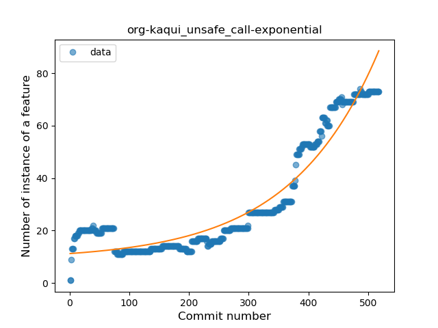

14. com-github-vase4kin-teamcityapp

	*  Function: 
	* R_Squared: 0.91975263
 

15. com-simplemobiletools-calendar-pro

	*  Function: 
	* R_Squared: 0.91509146
 

16. uk-colessoft-android-hilllist

	*  Function: 
	* R_Squared: 0.90929094
 

17. tech-ula

	*  Function: 
	* R_Squared: 0.90868041
 

18. quickbeer-android

	*  Function: 
	* R_Squared: 0.90476413
 

20. com-wabadaba-dziennik

	*  Function: 
	* R_Squared: 0.89748829
 

21. com-nextcloud-talk2

	*  Function: 
	* R_Squared: 0.89452
 

22. ca-josephroque-bowlingcompanion

	*  Function: 
	* R_Squared: 0.89419803
 

23. de-westnordost-streetcomplete

	*  Function: 
	* R_Squared: 0.89415069
 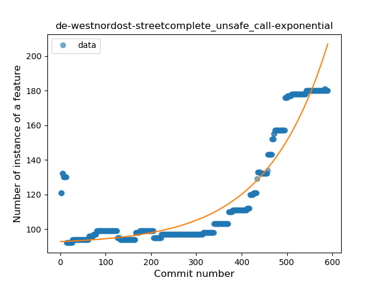

24. org-ligi-gobandroid

	*  Function: 
	* R_Squared: 0.89275824
 

25. com-czbix-v2ex

	*  Function: 
	* R_Squared: 0.89158504
 

26. com-simplemobiletools-notes-pro

	*  Function: 
	* R_Squared: 0.88927411
 

27. es-usc-citius-servando-calendula

	*  Function: 
	* R_Squared: 0.88755984
 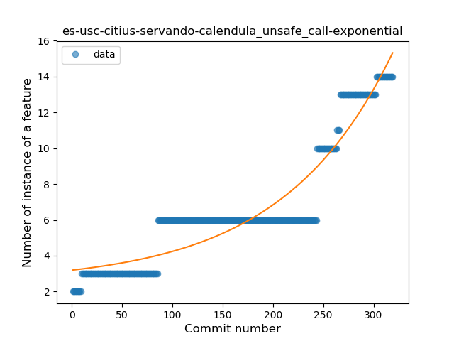

29. org-lenchan139-ncbookmark

	*  Function: 
	* R_Squared: 0.87947766
 

31. com-breadwallet

	*  Function: 
	* R_Squared: 0.86140205
 

32. com-simplemobiletools-gallery

	*  Function: 
	* R_Squared: 0.86068532
 

33. science-apolline

	*  Function: 
	* R_Squared: 0.85839772
 

34. io-github-wulkanowy

	*  Function: 
	* R_Squared: 0.85744677
 

36. com-jim-sharetocomputer

	*  Function: 
	* R_Squared: 0.83132374
 

37. pt-joaomneto-titancompanion

	*  Function: 
	* R_Squared: 0.82539538
 

38. com-boardgamegeek

	*  Function: 
	* R_Squared: 0.8231022
 

39. me-murks-feedwatcher

	*  Function: 
	* R_Squared: 0.82102437
 

41. org-walleth

	*  Function: 
	* R_Squared: 0.81740236
 

43. org-mozilla-focus

	*  Function: 
	* R_Squared: 0.8071065
 

44. org-mozilla-klar

	*  Function: 
	* R_Squared: 0.8071065
 

45. pt-ipleiria-mymusicqoe

	*  Function: 
	* R_Squared: 0.78843974
 

47. com-tutpro-baresip

	*  Function: 
	* R_Squared: 0.66197245
 

48. com-moez-QKSMS

	*  Function: 
	* R_Squared: 0.64981856
 

49. com-slash-batterychargelimit

	*  Function: 
	* R_Squared: 0.64253228
 

53. com-github-premnirmal-tickerwidget

	*  Function: 
	* R_Squared: 0.55565862
 

54. nightlock-peppercarrot

	*  Function: 
	* R_Squared: 0.55474131
 

56. org-zimmob-zimlx

	*  Function: 
	* R_Squared: 0.51509433
 

57. net-nurik-roman-muzei

	*  Function: 
	* R_Squared: 0.44069591
 

58. com-calintat-units

	*  Function: 
	* R_Squared: 0.3723295
 

59. io-trewartha-positional

	*  Function: 
	* R_Squared: 0.34225866
 

61. com-simplemobiletools-flashlight

	*  Function: 
	* R_Squared: 0.31795768
 

62. app-simone

	*  Function: 
	* R_Squared: 0.31349718
 

63. com-zacharee1-systemuituner

	*  Function: 
	* R_Squared: 0.28899511
 

65. superustats-tool-android

	*  Function: 
	* R_Squared: 0.22562946
 

66. apps-amine-bou-readerforselfoss

	*  Function: 
	* R_Squared: 0.2167185
 

67. de-ph1b-audiobook

	*  Function: 
	* R_Squared: 0.11266188
 

68. jp-cordea-mackerelclient

	*  Function: 
	* R_Squared: 0.10475696
 

70. net-frju-flym

	*  Function: 
	* R_Squared: 0.07188545
 

71. com-simplemobiletools-draw

	*  Function: 
	* R_Squared: 0.05820269
 

72. com-simplemobiletools-draw-pro

	*  Function: 
	* R_Squared: 0.05820269
 

73. fr-cph-chicago-foss

	*  Function: 
	* R_Squared: 0.0390628
 

### <a name="T11">Instability</a> 
 ----

1. ru-nsu-bobrofon-easysshfs

	*  Function: 
	* R_Squared: 0.97046693
 

2. com-benny-pxerstudio

	*  Function: 
	* R_Squared: 0.96969697
 

3. ch-rmy-android-statusbar_tacho

	*  Function: 
	* R_Squared: 0.94968301
 

4. me-impa-knockonports

	*  Function: 
	* R_Squared: 0.94125562
 

5. net-computingtutor-robert-computingtutor

	*  Function: 
	* R_Squared: 0.93006993
 

6. com-ianhanniballake-contractiontimer

	*  Function: 
	* R_Squared: 0.92484829
 

7. com-nao20010128nao-DroidComplex

	*  Function: 
	* R_Squared: 0.9185372
 

8. net-codechunk-speedofsound

	*  Function: 
	* R_Squared: 0.91251919
 

9. org-projectbass-bass

	*  Function: 
	* R_Squared: 0.88438228
 

10. com-gimranov-zandy-app

	*  Function: 
	* R_Squared: 0.86945298
 

11. com-github-fractals

	*  Function: 
	* R_Squared: 0.86556076
 

12. io-wookey-wallet

	*  Function: 
	* R_Squared: 0.86090793
 

13. com-defianttech-convertme

	*  Function: 
	* R_Squared: 0.83307676
 

14. org-thiolliere-youtubestream

	*  Function: 
	* R_Squared: 0.82335068
 

15. com-manoj-dlt

	*  Function: 
	* R_Squared: 0.81267879
 

16. com-jidogoon-roundedscreen

	*  Function: 
	* R_Squared: 0.8105442
 

17. io-github-z3r0c00l

	*  Function: 
	* R_Squared: 0.7558191
 

18. saschpe-poker

	*  Function: 
	* R_Squared: 0.74282883
 

19. name-cantanima-chineseremainderclock

	*  Function: 
	* R_Squared: 0.67039312
 

20. com-aaplab-bakubus

	*  Function: 
	* R_Squared: 0.58188006
 

21. com-enjoyingfoss-om

	*  Function: 
	* R_Squared: 0.52789537
 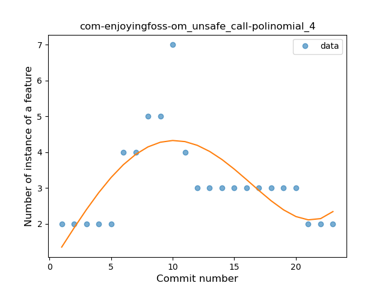

22. com-agusyc-daycounter

	*  Function: 
	* R_Squared: 0.51400034
 

### <a name="T7">Plateau Gradual Rise</a> 
 ----

1. io-github-umren-watcher

	*  Function: 
	* R_Squared: 1.0
 

2. com-uwetrottmann-wpdisplay

	*  Function: 
	* R_Squared: 0.98650457
 

3. org-moire-ultrasonic

	*  Function: 
	* R_Squared: 0.98565799
 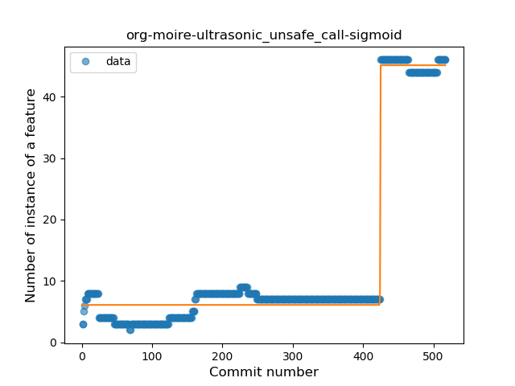

4. nl-jqno-remindermail

	*  Function: 
	* R_Squared: 0.98527134
 

5. org-havenapp-main

	*  Function: 
	* R_Squared: 0.98163334
 

6. de-thecode-android-tazreader

	*  Function: 
	* R_Squared: 0.97858583
 

7. one-librem-social

	*  Function: 
	* R_Squared: 0.97560806
 

8. com-fallgamlet-dnestrcinema

	*  Function: 
	* R_Squared: 0.97348624
 

9. pl-hypeapp-episodie

	*  Function: 
	* R_Squared: 0.97139709
 

10. org-isoron-uhabits

	*  Function: 
	* R_Squared: 0.96953999
 

11. com-peterlaurence-trekme

	*  Function: 
	* R_Squared: 0.96875536
 

12. io-mkg20001-arubanetworkslogin

	*  Function: 
	* R_Squared: 0.96513537
 

13. io-github-hidroh-materialistic

	*  Function: 
	* R_Squared: 0.96374728
 

14. nl-brouwerijdemolen-borefts2013

	*  Function: 
	* R_Squared: 0.95938547
 

15. com-benoitletondor-easybudgetapp

	*  Function: 
	* R_Squared: 0.95825052
 

16. de-avpptr-umweltzone

	*  Function: 
	* R_Squared: 0.9558945
 

17. com-cookiegames-smartcookie

	*  Function: 
	* R_Squared: 0.95520953
 

18. org-freedombox-freedombox

	*  Function: 
	* R_Squared: 0.9551842
 

19. info-metadude-android-congress-schedule

	*  Function: 
	* R_Squared: 0.94873271
 

20. com-github-laurenttreguier-deck

	*  Function: 
	* R_Squared: 0.9367828
 

21. net-yslibrary-monotweety

	*  Function: 
	* R_Squared: 0.93349081
 

22. com-simplemobiletools-filemanager-pro

	*  Function: 
	* R_Squared: 0.92423038
 

24. com-ninjahoahong-unstoppable

	*  Function: 
	* R_Squared: 0.91634742
 

25. com-yubico-yubioath

	*  Function: 
	* R_Squared: 0.89456958
 

26. net-kourlas-voipms

	*  Function: 
	* R_Squared: 0.8932548
 

27. fr-corenting-edcompanion

	*  Function: 
	* R_Squared: 0.88263897
 

29. acr-browser-lightning

	*  Function: 
	* R_Squared: 0.87111067
 

30. se-barsk-park

	*  Function: 
	* R_Squared: 0.8704499
 

31. org-mozilla-rocket

	*  Function: 
	* R_Squared: 0.83595468
 

32. com-benoitquenaudon-tvfoot-red

	*  Function: 
	* R_Squared: 0.82737773
 

34. danbroid-searchview

	*  Function: 
	* R_Squared: 0.79208357
 

35. com-scientists-happy-botanist

	*  Function: 
	* R_Squared: 0.70779076
 

36. com-simplemobiletools-applauncher

	*  Function: 
	* R_Squared: 0.70071467
 

37. com-ofalvai-bpinfo

	*  Function: 
	* R_Squared: 0.53738226
 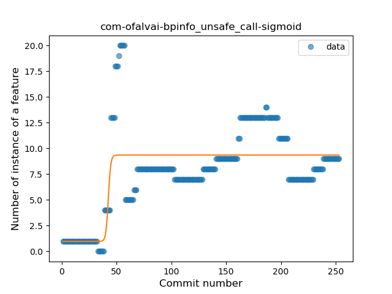

38. com-arcao-geocaching4locus

	*  Function: 
	* R_Squared: 0.50101083
 

39. pl-poznajapp

	*  Function: 
	* R_Squared: 0.43837397
 

40. com-uncmorfi

	*  Function: 
	* R_Squared: 0.43188947
 

41. org-ligi-ipfsdroid

	*  Function: 
	* R_Squared: 0.42271562
 

42. link-standen-michael-phonesaver

	*  Function: 
	* R_Squared: 0.32913614
 

43. org-kiwix-kiwixcustomwikivoyageeurope

	*  Function: 
	* R_Squared: 0.19371688
 

44. com-guerinet-mymartlet

	*  Function: 
	* R_Squared: 0.18937412
 

### <a name="T2">Constant Decline</a> 
 ----

28. de-spiritcroc-defaultdarktheme

	*  Function: 
	* R_Squared: 0.87063991
 

38. jp-takke-cpustats

	*  Function: 
	* R_Squared: 0.80987901
 

52. io-github-benoitduffez-cupsprint

	*  Function: 
	* R_Squared: 0.71049264
 

53. com-bubelov-coins

	*  Function: 
	* R_Squared: 0.61971369
 

54. ru-hyst329-openfool

	*  Function: 
	* R_Squared: 0.61633919
 

56. org-blitzortung-android-app

	*  Function: 
	* R_Squared: 0.59495897
 

57. com-wbrawner-simplemarkdown

	*  Function: 
	* R_Squared: 0.59107439
 

60. com-github-fields-electric

	*  Function: 
	* R_Squared: 0.54755192
 

61. com-bernaferrari-changedetection

	*  Function: 
	* R_Squared: 0.53913703
 

62. com-benny-openlauncher

	*  Function: 
	* R_Squared: 0.5289138
 

63. tw-shounenwind-kmnbottool

	*  Function: 
	* R_Squared: 0.45401411
 

66. com-booboot-vndbandroid

	*  Function: 
	* R_Squared: 0.41195217
 

68. com-corphish-nightlight-generic

	*  Function: 
	* R_Squared: 0.35929536
 

69. de-cineaste-android

	*  Function: 
	* R_Squared: 0.35783247
 

70. com-glodanif-bluetoothchat

	*  Function: 
	* R_Squared: 0.30060395
 

71. fr-insapp-insapp

	*  Function: 
	* R_Squared: 0.28540011
 

72. ch-rmy-android-http_shortcuts

	*  Function: 
	* R_Squared: 0.2350546
 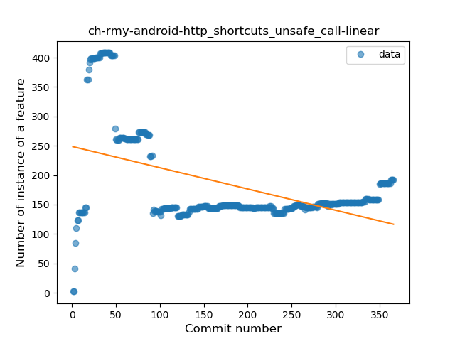

74. apps-jizzu-simpletodo

	*  Function: 
	* R_Squared: 0.22156338
 

75. xyz-hisname-fireflyiii

	*  Function: 
	* R_Squared: 0.1755049
 

76. me-echeung-moemoekyun-fdroid

	*  Function: 
	* R_Squared: 0.11796321
 

77. ai-susi

	*  Function: 
	* R_Squared: 0.10963454
 

78. pw-janyo-janyoshare

	*  Function: 
	* R_Squared: 0.10605217
 

79. org-mifos-mobile

	*  Function: 
	* R_Squared: 0.09978081
 

80. me-kirimin-mitsumine

	*  Function: 
	* R_Squared: 0.09179516
 

81. info-papdt-express-helper

	*  Function: 
	* R_Squared: 0.0792022
 

83. com-simplemobiletools-musicplayer

	*  Function: 
	* R_Squared: 0.06785051
 

84. com-pixplicity-cryptogram

	*  Function: 
	* R_Squared: 0.06371567
 

85. org-equeim-tremotesf

	*  Function: 
	* R_Squared: 0.05839027
 

86. net-nonylene-photolinkviewer

	*  Function: 
	* R_Squared: 0.03197015
 

88. org-eurofurence-connavigator

	*  Function: 
	* R_Squared: 0.01497977
 

89. tk-superl2-xwifi

	*  Function: 
	* R_Squared: 0.01465824
 

92. pl-org-seva-texter

	*  Function: 
	* R_Squared: 9.7e-07
 

### <a name="T6">Sudden Rise Plateau</a> 
 ----

1. org-mattvchandler-progressbars

	*  Function: 
	* R_Squared: 0.84493731
 

2. com-kgurgul-cpuinfo

	*  Function: 
	* R_Squared: 0.82546932
 

3. net-osmand-plus

	*  Function: 
	* R_Squared: 0.81568783
 

4. com-emmanuelmess-simplecleanup

	*  Function: 
	* R_Squared: 0.8116831
 

5. com-simplemobiletools-clock

	*  Function: 
	* R_Squared: 0.80206257
 

6. com-utazukin-ichaival

	*  Function: 
	* R_Squared: 0.79269272
 

7. fr-jnda-android-flashalert

	*  Function: 
	* R_Squared: 0.77373442
 

8. at-bitfire-davdroid

	*  Function: 
	* R_Squared: 0.75618189
 

9. li-klass-fhem

	*  Function: 
	* R_Squared: 0.74043987
 

10. de-geeksfactory-opacclient

	*  Function: 
	* R_Squared: 0.64909217
 

11. com-epimorphics-android-myrivers

	*  Function: 
	* R_Squared: 0.64402947
 

12. eu-depau-etchdroid

	*  Function: 
	* R_Squared: 0.62496912
 

13. cat-pantsu-nyaapantsu

	*  Function: 
	* R_Squared: 0.62252053
 

14. is-xyz-mpv

	*  Function: 
	* R_Squared: 0.59089419
 

15. org-mattvchandler-a2050

	*  Function: 
	* R_Squared: 0.55502104
 

16. streetwalrus-usbmountr

	*  Function: 
	* R_Squared: 0.5149403
 

17. com-nononsenseapps-feeder

	*  Function: 
	* R_Squared: 0.39620207
 

18. com-sduduzog-slimlauncher

	*  Function: 
	* R_Squared: 0.36545583
 

19. net-stew-stew

	*  Function: 
	* R_Squared: 0.35621674
 

20. com-commit451-gitlab

	*  Function: 
	* R_Squared: 0.29324264
 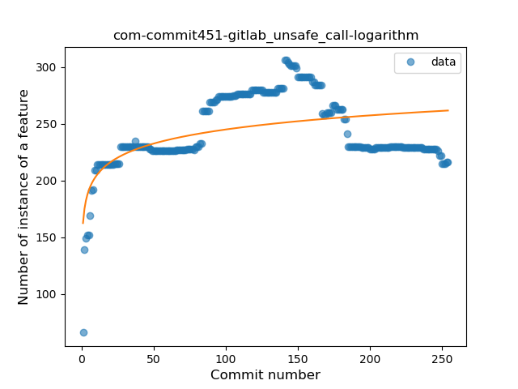

21. me-camsteffen-polite

	*  Function: 
	* R_Squared: 0.27660026
 

22. de-tubaf-mandelGL

	*  Function: 
	* R_Squared: 0.2375354
 

23. com-etesync-syncadapter

	*  Function: 
	* R_Squared: 0.13614387
 

24. me-rei_m-hyakuninisshu

	*  Function: 
	* R_Squared: 0.11033048
 

25. com-thanksmister-iot-mqtt-alarmpanel

	*  Function: 
	* R_Squared: 0.06755931
 

### <a name="T5">Sudden Decline</a> 
 ----

1. com-skydoves-waterdays

	*  Function: 
	* R_Squared: 0.98507646
 

2. com-bracketcove-postrainer

	*  Function: 
	* R_Squared: 0.98320041
 

3. com-phicdy-totoanticipation

	*  Function: 
	* R_Squared: 0.98307734
 

7. jp-toastkid-yobidashi

	*  Function: 
	* R_Squared: 0.94615514
 

12. cz-dvratil-fbeventsync

	*  Function: 
	* R_Squared: 0.92369059
 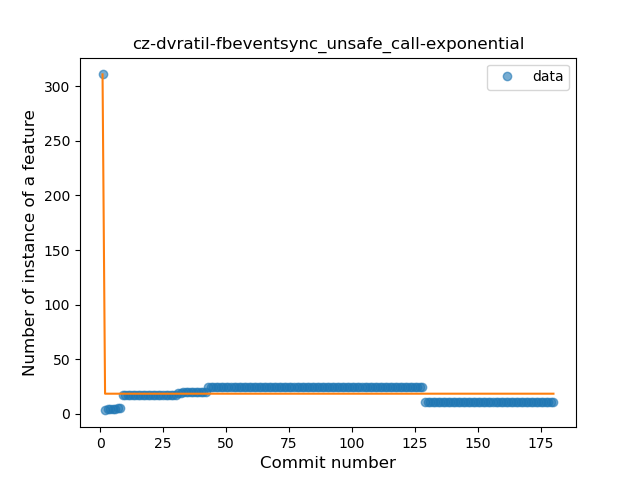

19. org-mariotaku-twidere

	*  Function: 
	* R_Squared: 0.8980148
 

28. de-spiritcroc-darkcroc-substratum

	*  Function: 
	* R_Squared: 0.88739834
 

30. com-pyamsoft-homebutton

	*  Function: 
	* R_Squared: 0.87776072
 

35. me-jfenn-alarmio

	*  Function: 
	* R_Squared: 0.84057822
 

40. org-commcare-dalvik

	*  Function: 
	* R_Squared: 0.82057794
 

42. com-simplemobiletools-calculator

	*  Function: 
	* R_Squared: 0.8100525
 

46. org-teamblueridge-pasteitapp

	*  Function: 
	* R_Squared: 0.71072133
 

50. com-garpr-android

	*  Function: 
	* R_Squared: 0.60637036
 

51. me-proxer-app

	*  Function: 
	* R_Squared: 0.59733317
 

52. com-jmstudios-redmoon

	*  Function: 
	* R_Squared: 0.56386335
 

55. it-diab

	*  Function: 
	* R_Squared: 0.54436845
 

60. horse-amazin-my-stratum0-statuswidget

	*  Function: 
	* R_Squared: 0.32517282
 

64. pl-org-seva-navigator

	*  Function: 
	* R_Squared: 0.24348824
 

69. com-eventyay-attendee

	*  Function: 
	* R_Squared: 0.09708244
 

### <a name="T9">Plateau Sudden Rise</a> 
 ----

1. at-ac-tuwien-caa-docscan

	*  Function: 
	* R_Squared: 1.0
 

2. com-alderferstudios-handandfootscores

	*  Function: 
	* R_Squared: 1.0
 

4. com-example-harisont-librery

	*  Function: 
	* R_Squared: 1.0
 

5. com-kanedias-vanilla-metadata

	*  Function: 
	* R_Squared: 1.0
 

6. com-rubenwardy-minetestmodmanager

	*  Function: 
	* R_Squared: 1.0
 

7. de-csicar-mensaplan

	*  Function: 
	* R_Squared: 1.0
 

8. fr-xgouchet-packageexplorer

	*  Function: 
	* R_Squared: 1.0
 

10. pl-temomuko-autostoprace

	*  Function: 
	* R_Squared: 1.0
 

11. se-creotec-chscardbalance2

	*  Function: 
	* R_Squared: 1.0
 

13. org-decsync-sparss-floss

	*  Function: 
	* R_Squared: 0.99582672
 

14. com-tomer-draw

	*  Function: 
	* R_Squared: 0.9288984
 

17. com-njlabs-showjava

	*  Function: 
	* R_Squared: 0.74692967
 

19. ml-adamsprogs-bimba

	*  Function: 
	* R_Squared: 0.66601627
 

20. cat-xojan-random1

	*  Function: 
	* R_Squared: 0.64682445
 

23. com-mgaetan89-showsrage

	*  Function: 
	* R_Squared: 0.54590148
 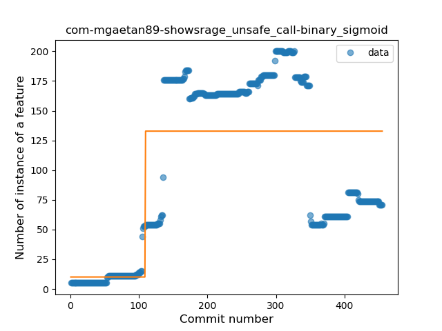

26. nl-mpcjanssen-simpletask

	*  Function: 
	* R_Squared: 0.2318304
 

27. eu-the4thfloor-msync

	*  Function: 
	* R_Squared: 0.20004795
 

### <a name="T10">Plateau Sudden Decline</a> 
 ----

3. com-conorodonnell-bus

	*  Function: 
	* R_Squared: 1.0
 

9. org-fossasia-badgemagic

	*  Function: 
	* R_Squared: 1.0
 

12. xyz-koleno-sunwidget

	*  Function: 
	* R_Squared: 1.0
 

15. de-markusfisch-android-binaryeye

	*  Function: 
	* R_Squared: 0.86087418
 

16. com-geo-GeoQuake

	*  Function: 
	* R_Squared: 0.75148441
 

18. uk-co-richyhbm-monochromatic

	*  Function: 
	* R_Squared: 0.7121271
 

21. fr-rhaz-ipfs-sweet

	*  Function: 
	* R_Squared: 0.61904762
 

22. rectangledbmi-com-pittsburghrealtimetracker

	*  Function: 
	* R_Squared: 0.56278045
 

24. com-pennapps-labs-pennmobile

	*  Function: 
	* R_Squared: 0.43889235
 

25. com-atanana-sicounter

	*  Function: 
	* R_Squared: 0.37937853
 

28. sk-styk-martin-apkanalyzer

	*  Function: 
	* R_Squared: 0.13580445
 

### <a name="T8">Plateau Gradual Decline</a> 
 ----

23. com-example-forgottenumbrella-cardboardmuseum

	*  Function: 
	* R_Squared: 0.92402335
 

28. com-calintat-sensors

	*  Function: 
	* R_Squared: 0.87685748
 

33. com-github-cvzi-screenshottile

	*  Function: 
	* R_Squared: 0.8242551
 

### <a name="T3">Stability</a> 
 ----

