## Constant Rise
----
**663** best fit

#### TwidereProject-Twidere-Android
* Feature: Function with Default Value
* Function: 
* R_Squared: 0.9950372
 

#### TwidereProject-Twidere-Android
* Feature: Safe Call
* Function: 
* R_Squared: 0.98891253
 

#### qklabs-qksms
* Feature: Type Inference
* Function: 
* R_Squared: 0.98884656
 

#### TwidereProject-Twidere-Android
* Feature: Lambda
* Function: 
* R_Squared: 0.98881804
 

#### BijoySingh-Material-Notes-Android-App
* Feature: Type Inference
* Function: 
* R_Squared: 0.98816268
 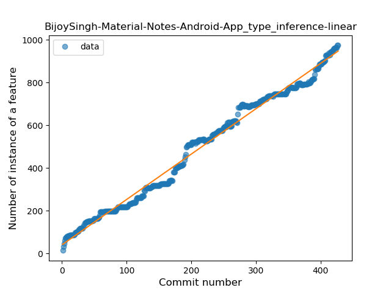

#### herbeth1u-VNDB-Android
* Feature: Extension Function
* Function: 
* R_Squared: 0.98727804
 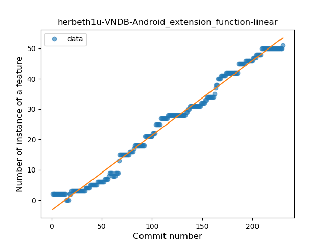

#### nibarius-opera-park-android
* Feature: Type Inference
* Function: 
* R_Squared: 0.98719828
 

#### walleth-walleth
* Feature: Lambda
* Function: 
* R_Squared: 0.98677979
 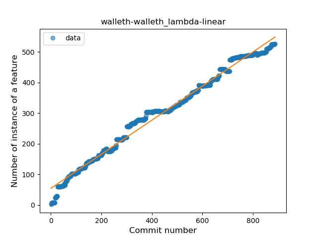

#### RocketChat-Rocket.Chat.Android
* Feature: Data Class
* Function: 
* R_Squared: 0.98495966
 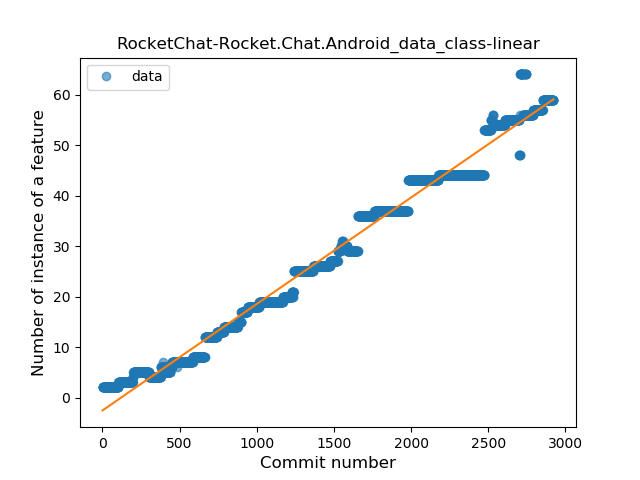

#### walleth-walleth
* Feature: Extension Function
* Function: 
* R_Squared: 0.984717
 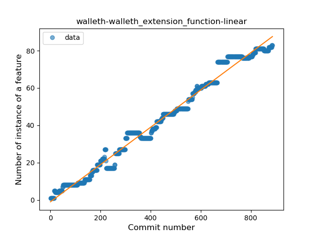

#### TwidereProject-Twidere-Android
* Feature: Function call with Named Argument
* Function: 
* R_Squared: 0.98453892
 

#### qklabs-qksms
* Feature: Lambda
* Function: 
* R_Squared: 0.98238893
 

#### quarck-CalendarNotification
* Feature: Function call with Named Argument
* Function: 
* R_Squared: 0.98231061
 

#### quarck-CalendarNotification
* Feature: When expression
* Function: 
* R_Squared: 0.98163753
 

#### qklabs-qksms
* Feature: When expression
* Function: 
* R_Squared: 0.98098498
 

#### SimpleMobileTools-Simple-Contacts
* Feature: Lambda
* Function: 
* R_Squared: 0.9806848
 

#### klassm-andFHEM
* Feature: String Template
* Function: 
* R_Squared: 0.97971998
 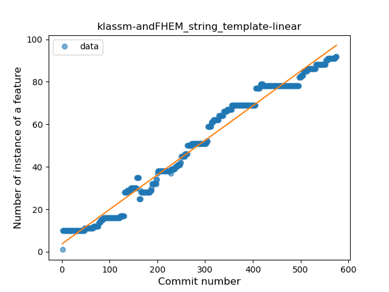

#### RocketChat-Rocket.Chat.Android
* Feature: Safe Call
* Function: 
* R_Squared: 0.97957946
 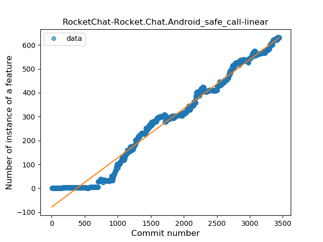

#### inorichi-tachiyomi
* Feature: Type Inference
* Function: 
* R_Squared: 0.97908348
 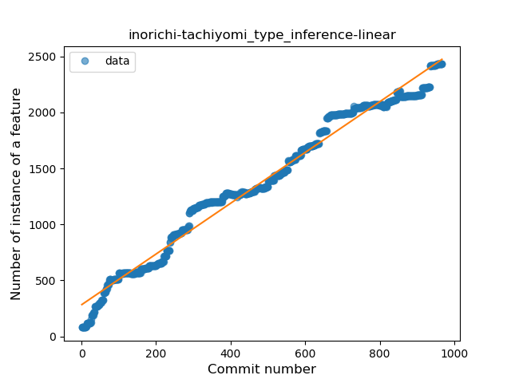

#### walleth-walleth
* Feature: Safe Call
* Function: 
* R_Squared: 0.97860053
 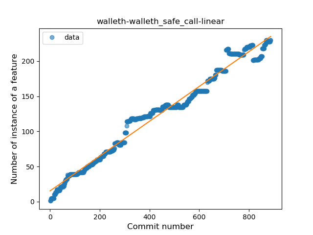

#### ccomeaux-boardgamegeek4android
* Feature: Type Inference
* Function: 
* R_Squared: 0.97853626
 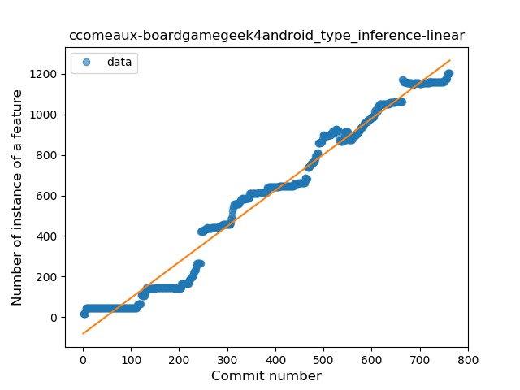

#### mjdenham-and-bible
* Feature: Lambda
* Function: 
* R_Squared: 0.97817688
 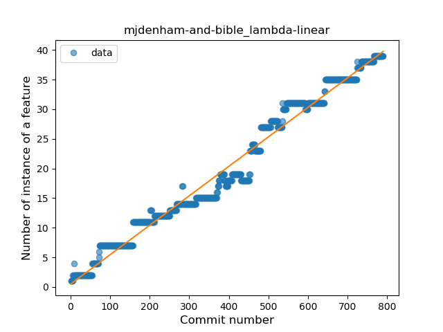

#### SimpleMobileTools-Simple-File-Manager
* Feature: Lambda
* Function: 
* R_Squared: 0.97801109
 

#### osmandapp-Osmand
* Feature: Lambda
* Function: 
* R_Squared: 0.97800616
 

#### TwidereProject-Twidere-Android
* Feature: Singleton
* Function: 
* R_Squared: 0.97770757
 

#### shymmq-librus-client-kotlin
* Feature: Lambda
* Function: 
* R_Squared: 0.97715272
 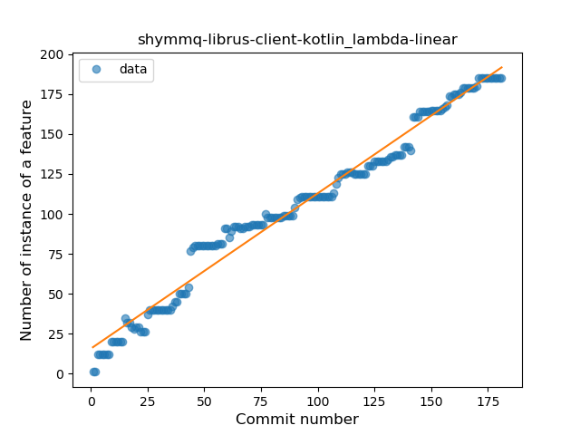

#### qklabs-qksms
* Feature: Function with Default Value
* Function: 
* R_Squared: 0.97670246
 

#### CzBiX-v2ex-android
* Feature: When expression
* Function: 
* R_Squared: 0.97650957
 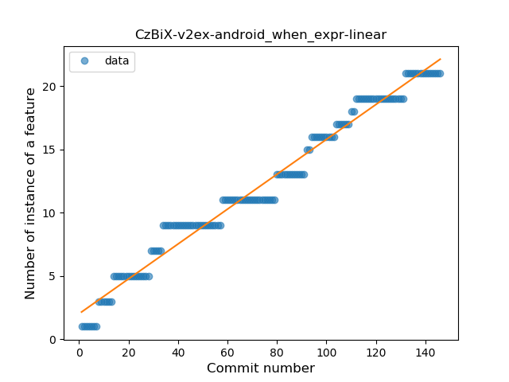

#### darshanparajuli-LogcatReader
* Feature: Lambda
* Function: 
* R_Squared: 0.97621068
 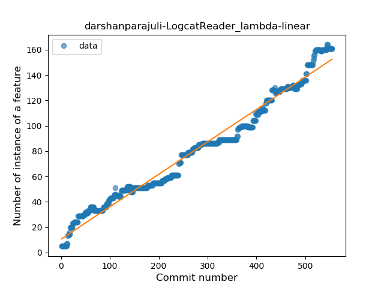

#### glodanif-BluetoothChat
* Feature: Lambda
* Function: 
* R_Squared: 0.97561219
 

#### spacecowboy-Feeder
* Feature: Lambda
* Function: 
* R_Squared: 0.97558065
 

#### quarck-CalendarNotification
* Feature: Lambda
* Function: 
* R_Squared: 0.97551459
 

#### RocketChat-Rocket.Chat.Android
* Feature: Function call with Named Argument
* Function: 
* R_Squared: 0.97546578
 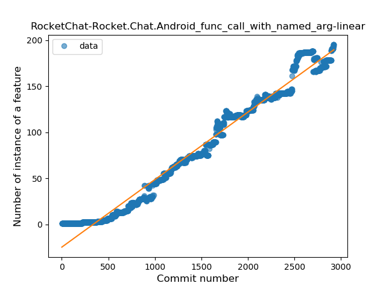

#### TwidereProject-Twidere-Android
* Feature: Extension Function
* Function: 
* R_Squared: 0.97531836
 

#### loloof64-BasicChessEndGamesTrainer
* Feature: Lambda
* Function: 
* R_Squared: 0.97520037
 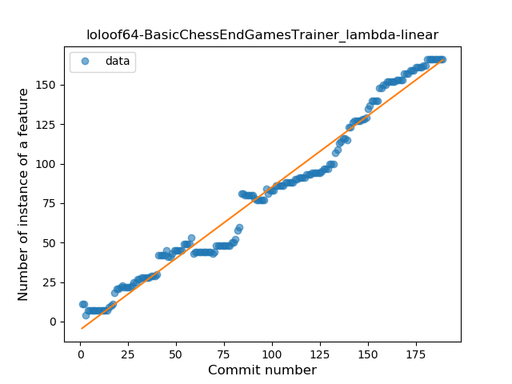

#### TwidereProject-Twidere-Android
* Feature: Type Inference
* Function: 
* R_Squared: 0.97506383
 

#### TwidereProject-Twidere-Android
* Feature: When expression
* Function: 
* R_Squared: 0.9749337
 

#### ScreamingHawk-phone-saver
* Feature: Lambda
* Function: 
* R_Squared: 0.97470471
 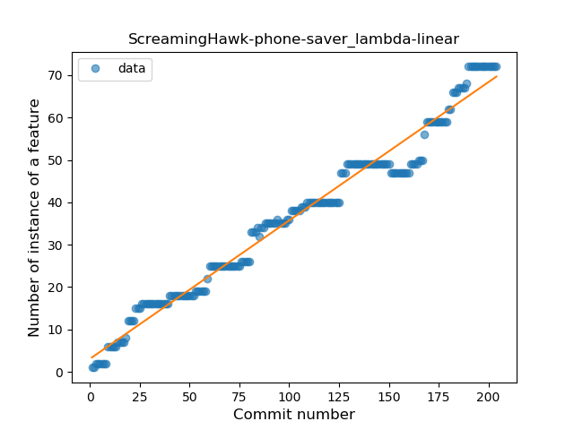

#### pacien-tincapp
* Feature: Type Inference
* Function: 
* R_Squared: 0.97427961
 

#### SimpleMobileTools-Simple-Contacts
* Feature: Extension Function
* Function: 
* R_Squared: 0.97424637
 

#### hypeapps-episodie
* Feature: Type Inference
* Function: 
* R_Squared: 0.9741987
 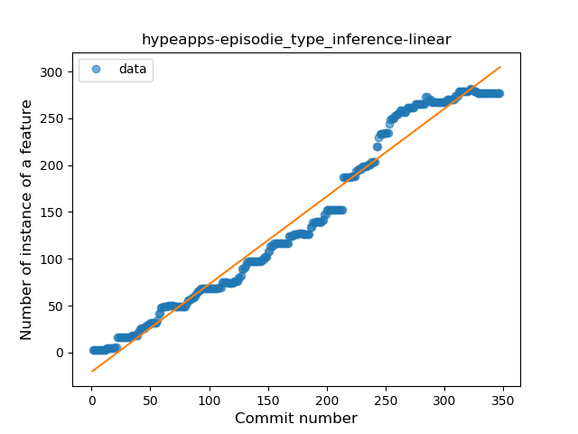

#### k9mail-k-9
* Feature: Companion Object
* Function: 
* R_Squared: 0.97357018
 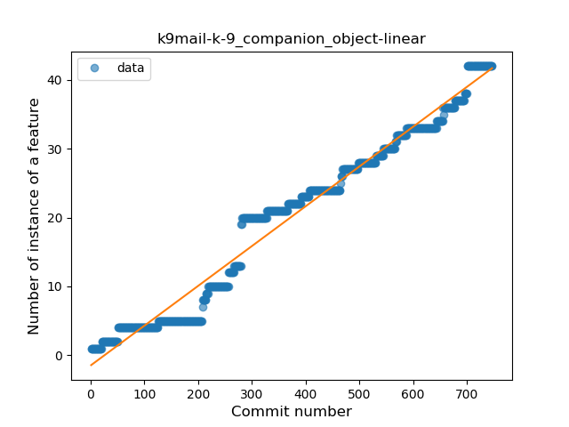

#### AIDEA775-UNCmorfi
* Feature: When expression
* Function: 
* R_Squared: 0.97315879
 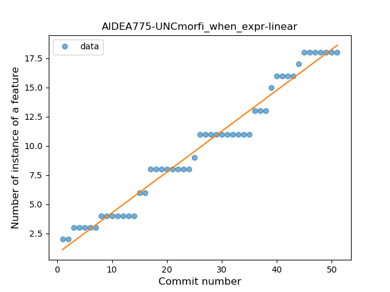

#### hypeapps-episodie
* Feature: Companion Object
* Function: 
* R_Squared: 0.97292107
 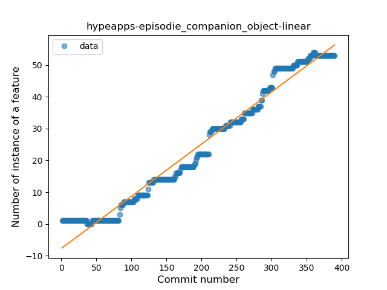

#### inorichi-tachiyomi
* Feature: Lambda
* Function: 
* R_Squared: 0.97264017
 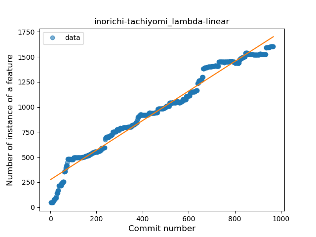

#### quarck-CalendarNotification
* Feature: Type Inference
* Function: 
* R_Squared: 0.97250667
 

#### qklabs-qksms
* Feature: Function call with Named Argument
* Function: 
* R_Squared: 0.97182536
 

#### thaapasa-jalkametri-android
* Feature: Lambda
* Function: 
* R_Squared: 0.97136565
 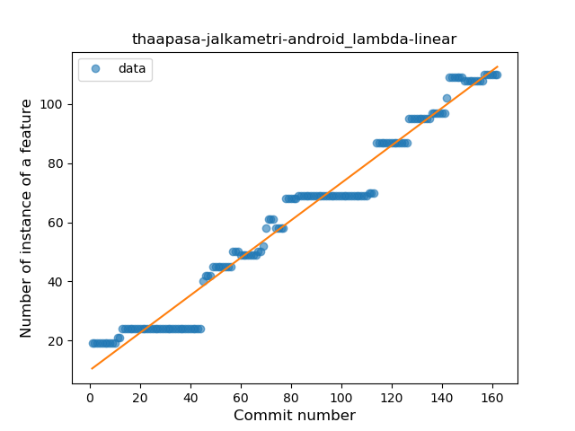

#### AllanWang-Frost-for-Facebook
* Feature: Property Delegation
* Function: 
* R_Squared: 0.97133581
 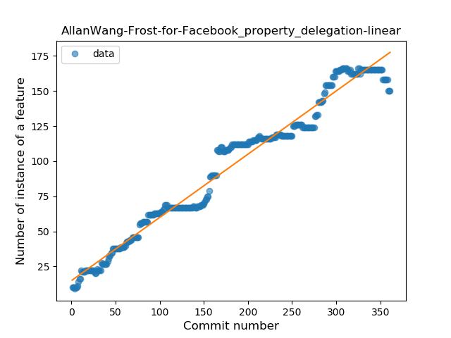

#### Mygod-VPNHotspot
* Feature: Lambda
* Function: 
* R_Squared: 0.97130434
 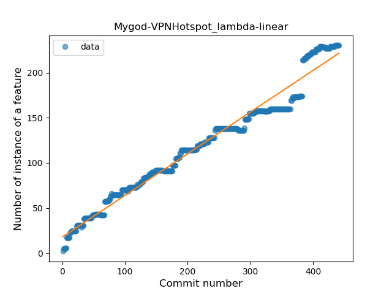

#### TwidereProject-Twidere-Android
* Feature: Companion Object
* Function: 
* R_Squared: 0.97127649
 

#### k9mail-k-9
* Feature: Data Class
* Function: 
* R_Squared: 0.97050147
 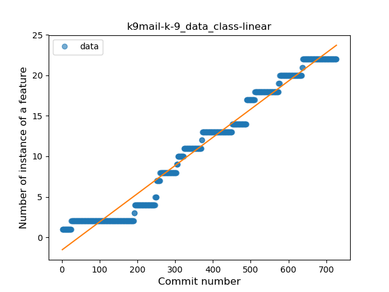

#### herbeth1u-VNDB-Android
* Feature: Lambda
* Function: 
* R_Squared: 0.96978073
 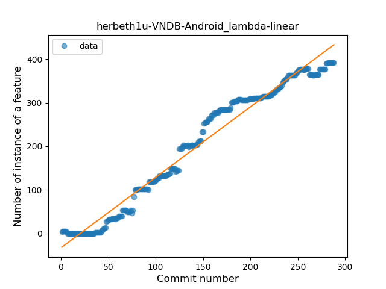

#### SimpleMobileTools-Simple-Music-Player
* Feature: Lambda
* Function: 
* R_Squared: 0.96919097
 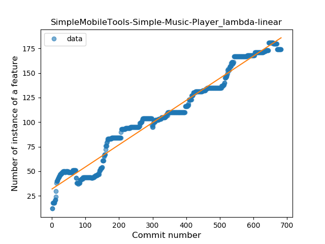

#### Waboodoo-HTTP-Shortcuts
* Feature: Lambda
* Function: 
* R_Squared: 0.96898947
 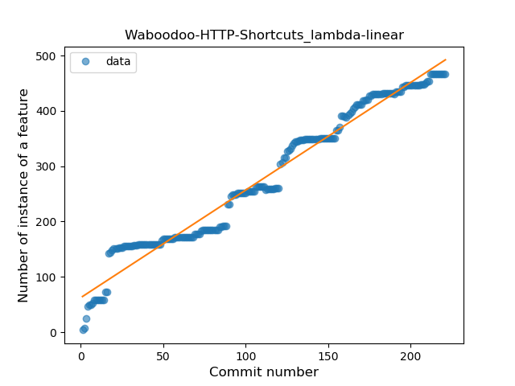

#### thermatk-FastHub-Libre
* Feature: Function with Default Value
* Function: 
* R_Squared: 0.96877721
 

#### peterLaurence-TrekAdvisor
* Feature: Type Inference
* Function: 
* R_Squared: 0.96875584
 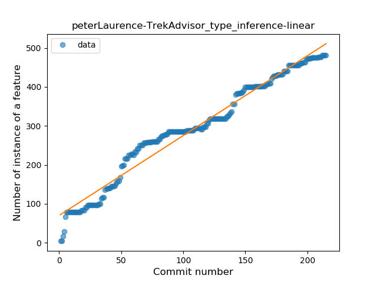

#### duckduckgo-Android
* Feature: Companion Object
* Function: 
* R_Squared: 0.96817633
 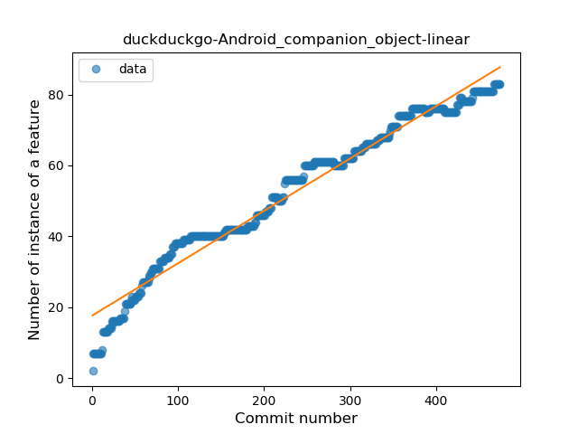

#### CzBiX-v2ex-android
* Feature: Smart Cast
* Function: 
* R_Squared: 0.96740816
 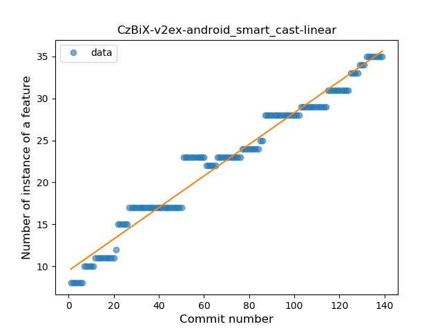

#### inorichi-tachiyomi
* Feature: When expression
* Function: 
* R_Squared: 0.96737667
 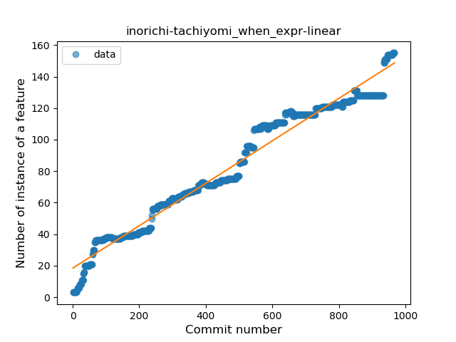

#### ykrank-S1-Next
* Feature: Lambda
* Function: 
* R_Squared: 0.96736498
 

#### walleth-walleth
* Feature: Type Inference
* Function: 
* R_Squared: 0.96689399
 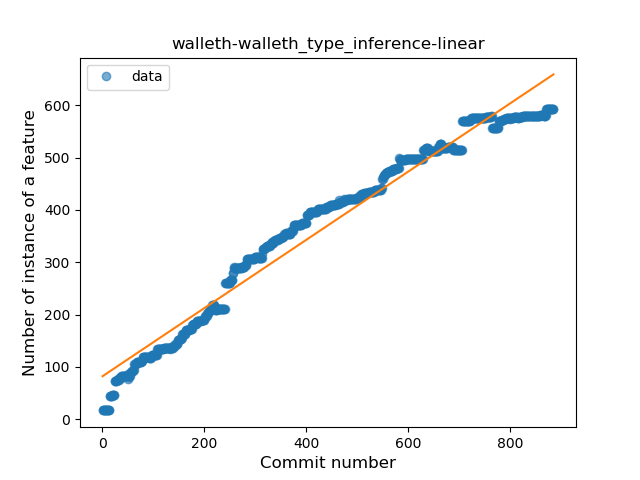

#### thermatk-FastHub-Libre
* Feature: Type Inference
* Function: 
* R_Squared: 0.96680856
 

#### quarck-CalendarNotification
* Feature: Data Class
* Function: 
* R_Squared: 0.96665714
 

#### RocketChat-Rocket.Chat.Android
* Feature: String Template
* Function: 
* R_Squared: 0.96630048
 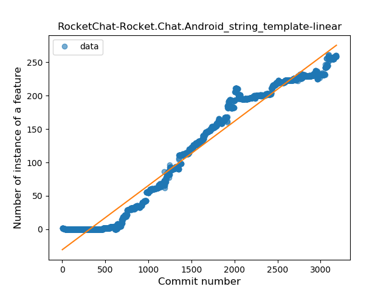

#### thermatk-FastHub-Libre
* Feature: Lambda
* Function: 
* R_Squared: 0.96627057
 

#### k9mail-k-9
* Feature: When expression
* Function: 
* R_Squared: 0.9659166
 

#### qklabs-qksms
* Feature: Extension Function
* Function: 
* R_Squared: 0.96569483
 

#### quarck-CalendarNotification
* Feature: Companion Object
* Function: 
* R_Squared: 0.96562748
 

#### darshanparajuli-LogcatReader
* Feature: When expression
* Function: 
* R_Squared: 0.96543909
 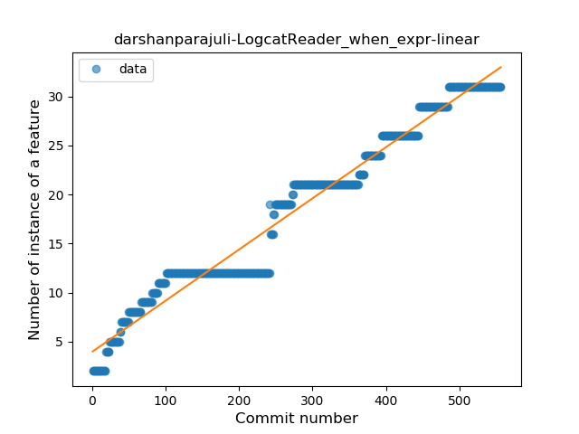

#### tuskyapp-Tusky
* Feature: Lambda
* Function: 
* R_Squared: 0.96515864
 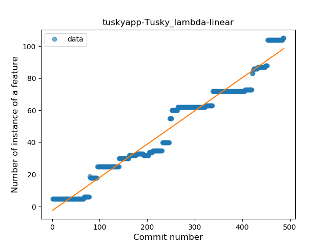

#### SimpleMobileTools-Simple-Contacts
* Feature: Data Class
* Function: 
* R_Squared: 0.96495066
 

#### quarck-CalendarNotification
* Feature: String Template
* Function: 
* R_Squared: 0.9649248
 

#### tuskyapp-Tusky
* Feature: Safe Call
* Function: 
* R_Squared: 0.96460696
 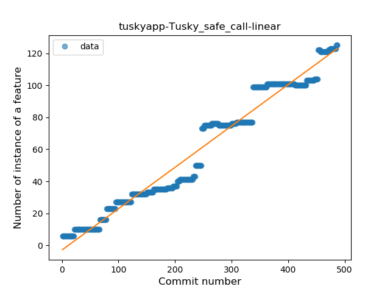

#### wuan-bo-android
* Feature: Type Inference
* Function: 
* R_Squared: 0.96399478
 

#### SimpleMobileTools-Simple-Contacts
* Feature: Safe Call
* Function: 
* R_Squared: 0.96381721
 

#### RocketChat-Rocket.Chat.Android
* Feature: Extension Function
* Function: 
* R_Squared: 0.96326069
 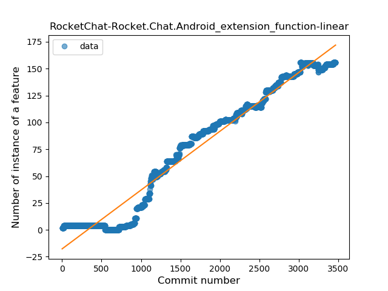

#### ultrasonic-ultrasonic
* Feature: Type Inference
* Function: 
* R_Squared: 0.96287241
 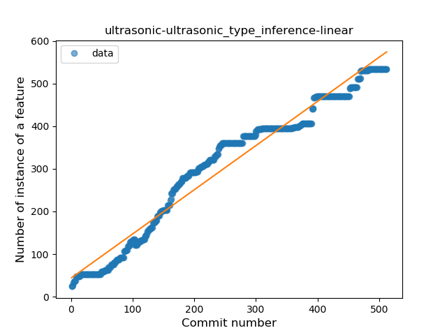

#### spacecowboy-Feeder
* Feature: String Template
* Function: 
* R_Squared: 0.96214871
 

#### Doctoror-ParticleConstellationsLiveWallpaper
* Feature: Type Inference
* Function: 
* R_Squared: 0.96188687
 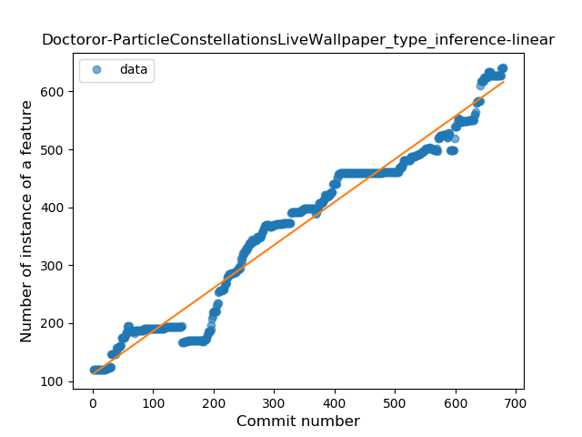

#### fossasia-open-event-android
* Feature: Safe Call
* Function: 
* R_Squared: 0.96179199
 

#### AllanWang-Frost-for-Facebook
* Feature: Lambda
* Function: 
* R_Squared: 0.96139769
 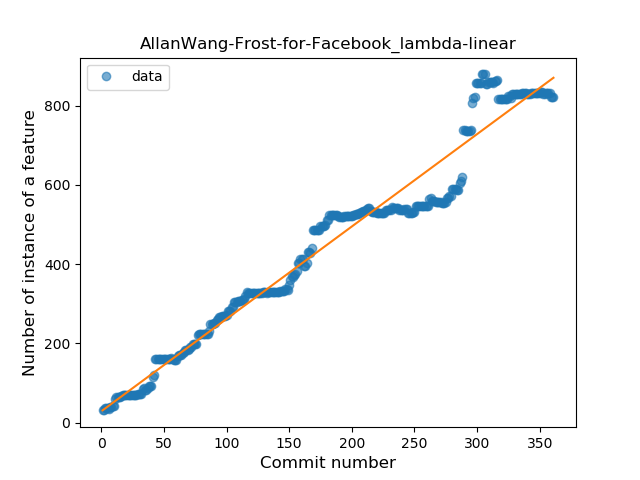

#### Mygod-VPNHotspot
* Feature: Type Inference
* Function: 
* R_Squared: 0.96127463
 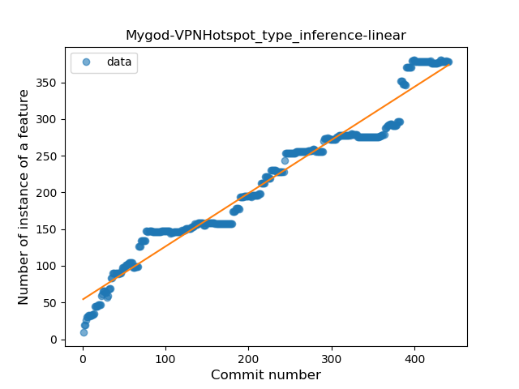

#### caarmen-poet-assistant
* Feature: Unsafe Call
* Function: 
* R_Squared: 0.96081727
 

#### Mystery00-JanYoShare
* Feature: Companion Object
* Function: 
* R_Squared: 0.96073097
 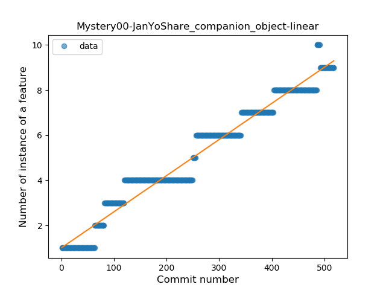

#### SimpleMobileTools-Simple-Gallery
* Feature: Type Inference
* Function: 
* R_Squared: 0.9605533
 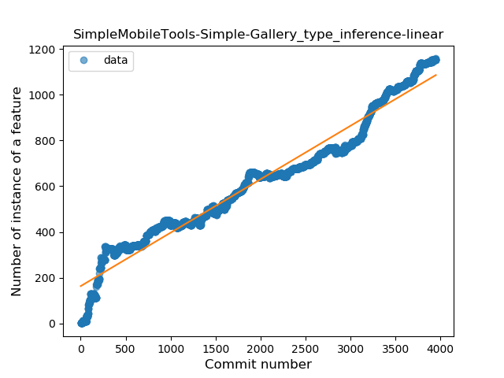

#### duckduckgo-Android
* Feature: Lambda
* Function: 
* R_Squared: 0.96054144
 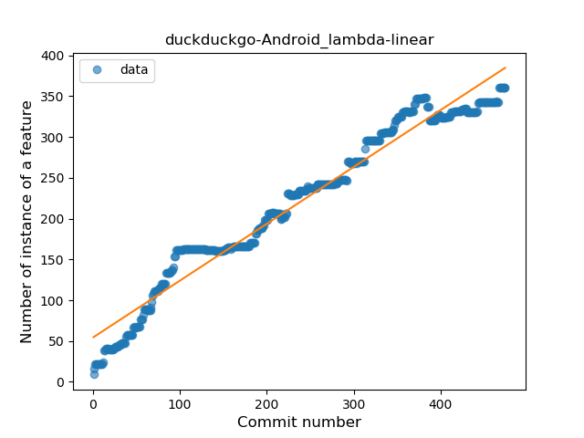

#### openium-auvergne-webcams-droid
* Feature: Safe Call
* Function: 
* R_Squared: 0.96042092
 

#### inorichi-tachiyomi
* Feature: String Template
* Function: 
* R_Squared: 0.96020214
 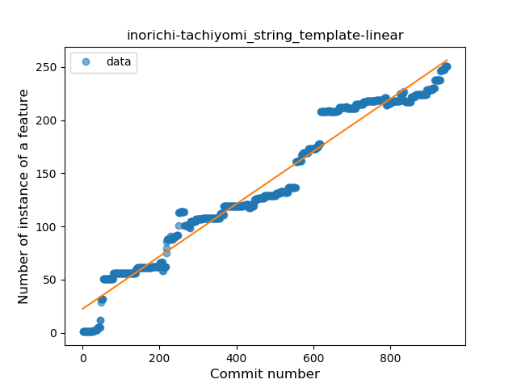

#### tuskyapp-Tusky
* Feature: Type Inference
* Function: 
* R_Squared: 0.96018035
 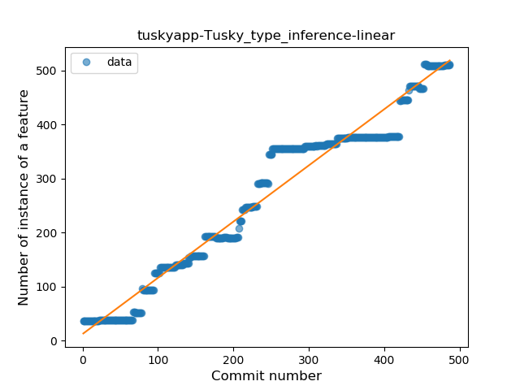

#### klassm-andFHEM
* Feature: Lambda
* Function: 
* R_Squared: 0.96013178
 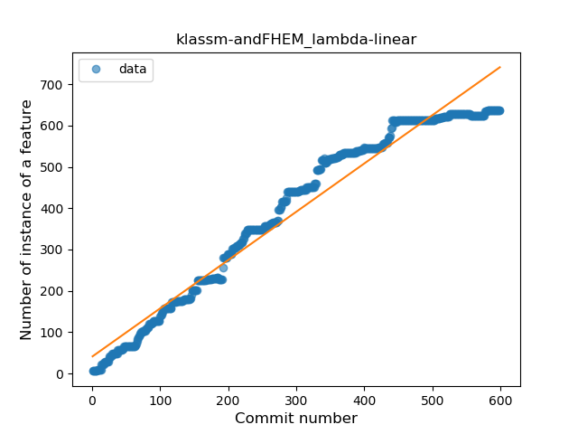

#### duckduckgo-Android
* Feature: Function with Default Value
* Function: 
* R_Squared: 0.96011803
 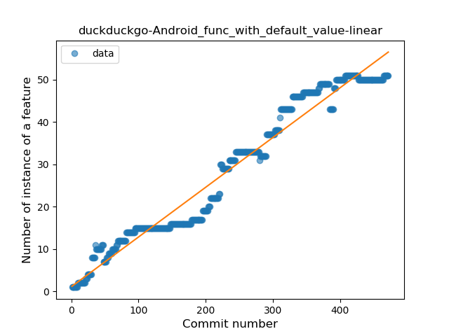

#### SimpleMobileTools-Simple-Clock
* Feature: Safe Call
* Function: 
* R_Squared: 0.95965021
 

#### fossasia-open-event-android
* Feature: Type Inference
* Function: 
* R_Squared: 0.95952912
 

#### RocketChat-Rocket.Chat.Android
* Feature: Lambda
* Function: 
* R_Squared: 0.95908474
 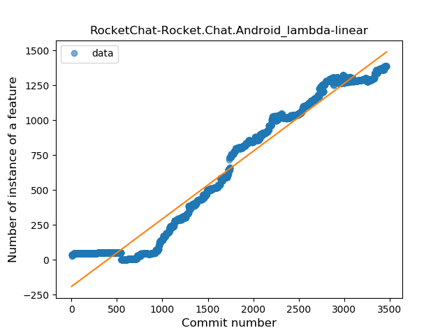

#### xgouchet-Stanley
* Feature: When expression
* Function: 
* R_Squared: 0.9588005
 

#### darshanparajuli-LogcatReader
* Feature: Companion Object
* Function: 
* R_Squared: 0.95879996
 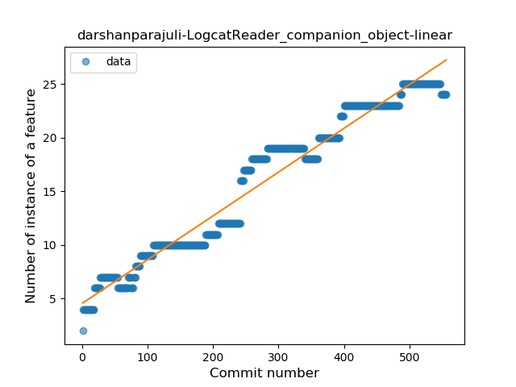

#### hsson-card-balance-app
* Feature: Lambda
* Function: 
* R_Squared: 0.95870696
 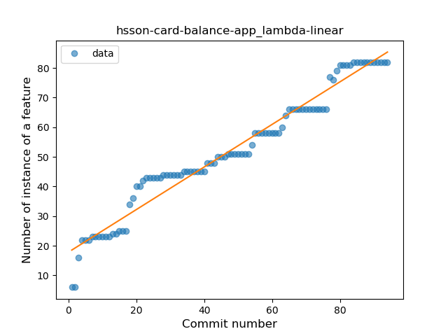

#### osmandapp-Osmand
* Feature: Destructuring Declaration
* Function: 
* R_Squared: 0.95836322
 

#### freedombox-team-android-app
* Feature: Safe Call
* Function: 
* R_Squared: 0.95822681
 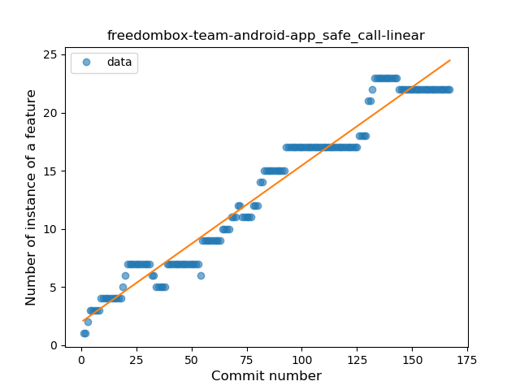

#### peterLaurence-TrekAdvisor
* Feature: String Template
* Function: 
* R_Squared: 0.95798698
 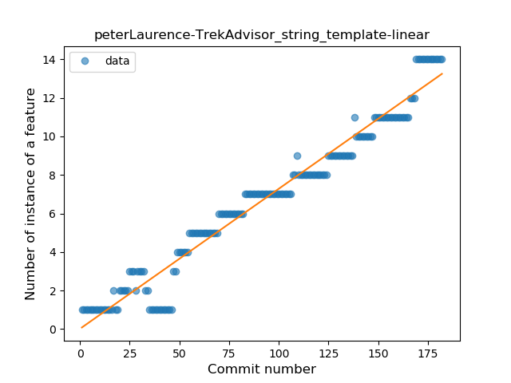

#### ligi-PassAndroid
* Feature: Lambda
* Function: 
* R_Squared: 0.9573815
 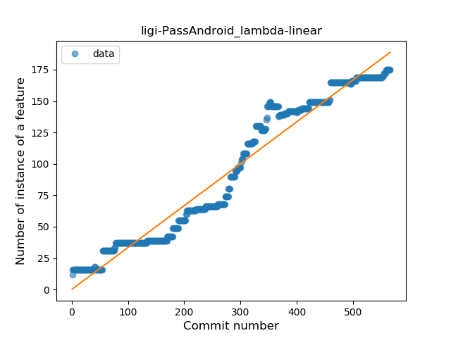

#### openium-auvergne-webcams-droid
* Feature: Singleton
* Function: 
* R_Squared: 0.95705936
 

#### MGaetan89-ShowsRage
* Feature: Type Inference
* Function: 
* R_Squared: 0.95679511
 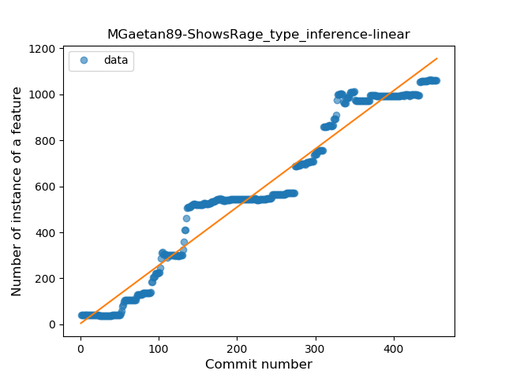

#### Waboodoo-HTTP-Shortcuts
* Feature: Safe Call
* Function: 
* R_Squared: 0.9566983
 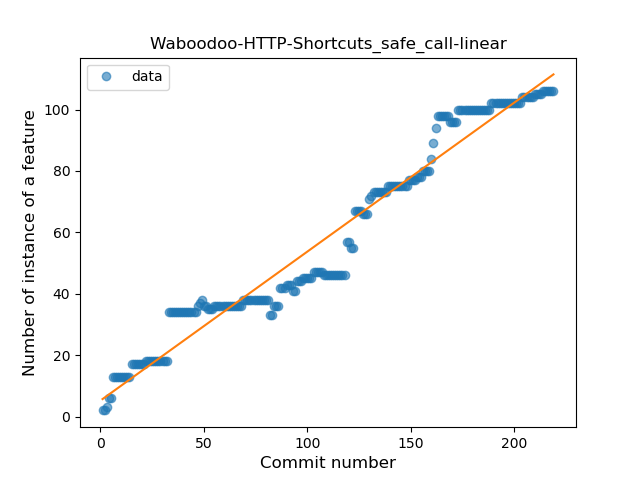

#### esafirm-android-playground
* Feature: Unsafe Call
* Function: 
* R_Squared: 0.9559217
 

#### vector-im-riot-android
* Feature: Safe Call
* Function: 
* R_Squared: 0.95582651
 

#### jereksel-Bucket
* Feature: Type Inference
* Function: 
* R_Squared: 0.95564242
 

#### osmandapp-Osmand
* Feature: String Template
* Function: 
* R_Squared: 0.95560875
 

#### duckduckgo-Android
* Feature: Type Inference
* Function: 
* R_Squared: 0.95549983
 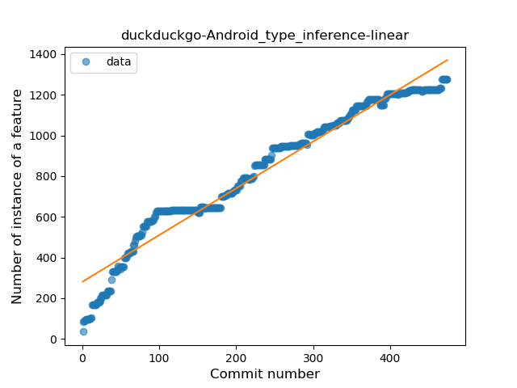

#### LiMium-mini-vector-android
* Feature: Safe Call
* Function: 
* R_Squared: 0.95535319
 

#### k9mail-k-9
* Feature: Singleton
* Function: 
* R_Squared: 0.95534549
 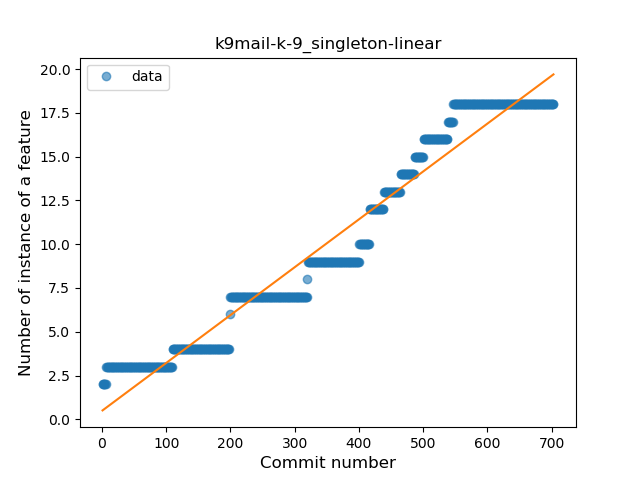

#### ccomeaux-boardgamegeek4android
* Feature: Property Delegation
* Function: 
* R_Squared: 0.95524142
 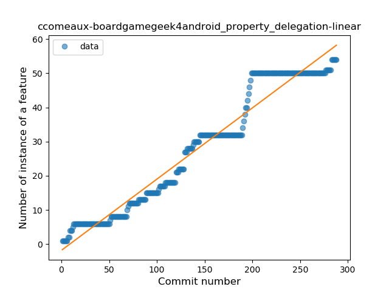

#### ccomeaux-boardgamegeek4android
* Feature: String Template
* Function: 
* R_Squared: 0.95504515
 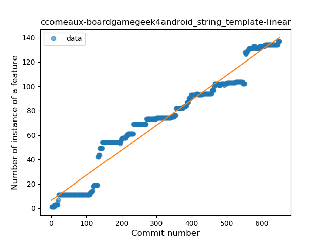

#### TwidereProject-Twidere-Android
* Feature: Data Class
* Function: 
* R_Squared: 0.95500645
 

#### klassm-andFHEM
* Feature: Function call with Named Argument
* Function: 
* R_Squared: 0.95420815
 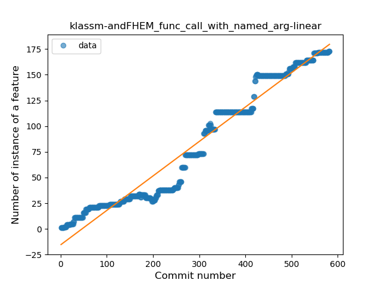

#### shymmq-librus-client-kotlin
* Feature: Destructuring Declaration
* Function: 
* R_Squared: 0.95312566
 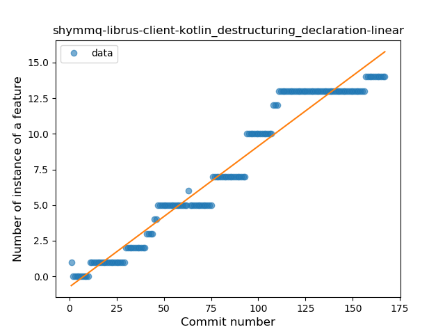

#### zoenb-log28
* Feature: Lambda
* Function: 
* R_Squared: 0.95289787
 

#### mjdenham-and-bible
* Feature: Type Inference
* Function: 
* R_Squared: 0.95282245
 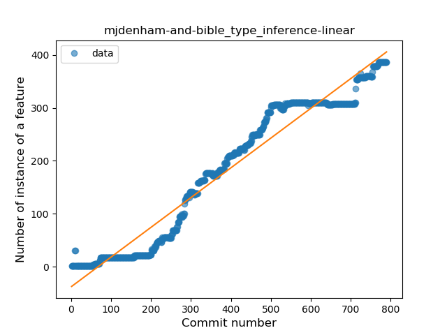

#### orgzly-orgzly-android
* Feature: Data Class
* Function: 
* R_Squared: 0.95281439
 

#### darshanparajuli-LogcatReader
* Feature: Safe Call
* Function: 
* R_Squared: 0.95279246
 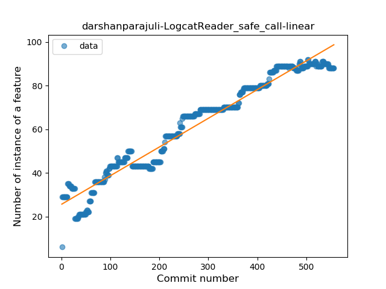

#### Waboodoo-HTTP-Shortcuts
* Feature: Property Delegation
* Function: 
* R_Squared: 0.95273062
 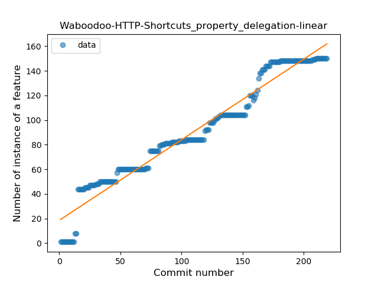

#### thermatk-FastHub-Libre
* Feature: Companion Object
* Function: 
* R_Squared: 0.95268996
 

#### emansih-FireflyMobile
* Feature: Lambda
* Function: 
* R_Squared: 0.95252937
 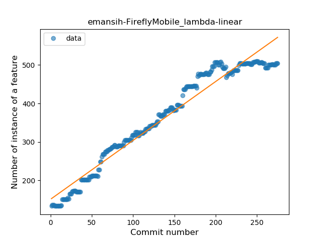

#### RocketChat-Rocket.Chat.Android
* Feature: When expression
* Function: 
* R_Squared: 0.95250178
 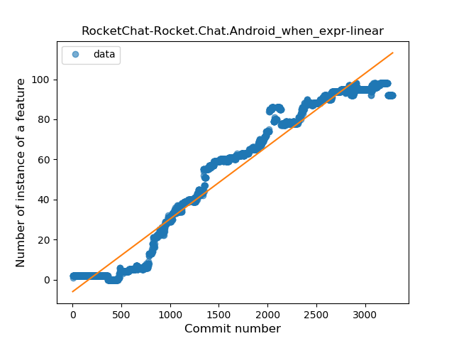

#### CypherpunkArmory-UserLAnd
* Feature: Lambda
* Function: 
* R_Squared: 0.95229493
 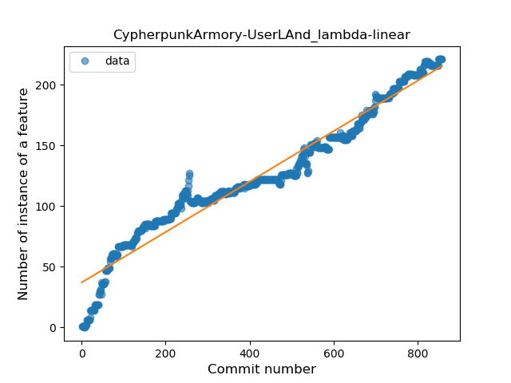

#### jereksel-Bucket
* Feature: String Template
* Function: 
* R_Squared: 0.95196232
 

#### SimpleMobileTools-Simple-Calendar
* Feature: Lambda
* Function: 
* R_Squared: 0.95151667
 

#### CzBiX-v2ex-android
* Feature: Lambda
* Function: 
* R_Squared: 0.95136861
 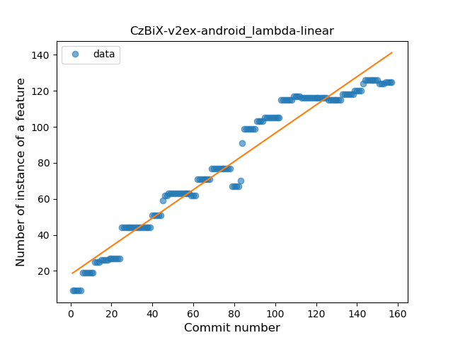

#### hsson-card-balance-app
* Feature: Type Inference
* Function: 
* R_Squared: 0.95043481
 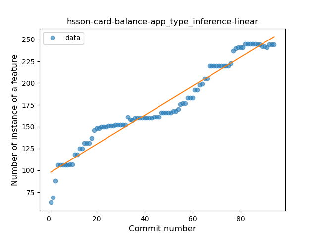

#### darshanparajuli-LogcatReader
* Feature: Type Inference
* Function: 
* R_Squared: 0.95016932
 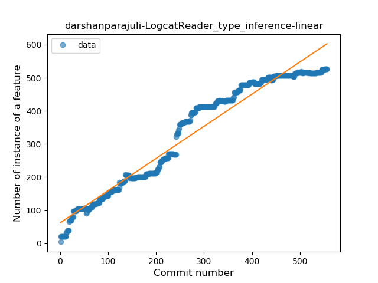

#### ScreamingHawk-phone-saver
* Feature: Type Inference
* Function: 
* R_Squared: 0.95015351
 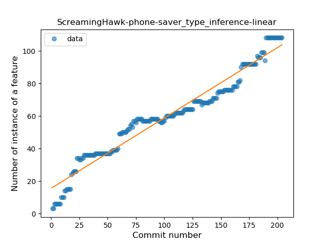

#### Commit451-LabCoat
* Feature: Property Delegation
* Function: 
* R_Squared: 0.95005212
 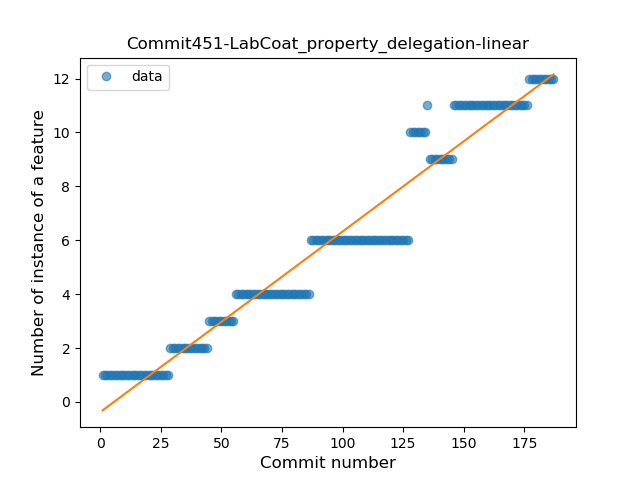

#### duckduckgo-Android
* Feature: Smart Cast
* Function: 
* R_Squared: 0.9499871
 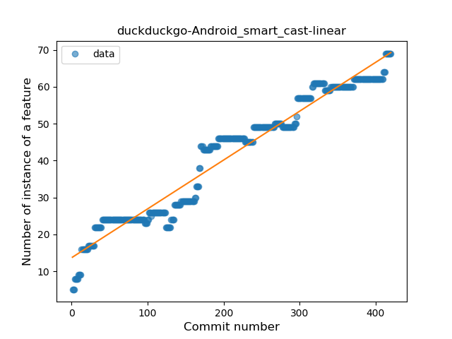

#### ligi-SurvivalManual
* Feature: Lambda
* Function: 
* R_Squared: 0.94990156
 

#### spacecowboy-Feeder
* Feature: Safe Call
* Function: 
* R_Squared: 0.94984402
 

#### tasomaniac-OpenLinkWith
* Feature: Lambda
* Function: 
* R_Squared: 0.94959393
 

#### tuskyapp-Tusky
* Feature: When expression
* Function: 
* R_Squared: 0.94948152
 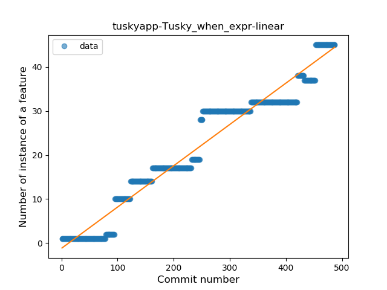

#### zoenb-log28
* Feature: Safe Call
* Function: 
* R_Squared: 0.94933377
 

#### proxer-ProxerAndroid
* Feature: When expression
* Function: 
* R_Squared: 0.94929648
 

#### SimpleMobileTools-Simple-File-Manager
* Feature: Safe Call
* Function: 
* R_Squared: 0.94904101
 

#### tasomaniac-OpenLinkWith
* Feature: Extension Function
* Function: 
* R_Squared: 0.94903387
 

#### Gark-bassblog_kotlin
* Feature: Lambda
* Function: 
* R_Squared: 0.94890958
 

#### xgouchet-Stanley
* Feature: Type Inference
* Function: 
* R_Squared: 0.94759385
 

#### Mygod-VPNHotspot
* Feature: Safe Call
* Function: 
* R_Squared: 0.94755723
 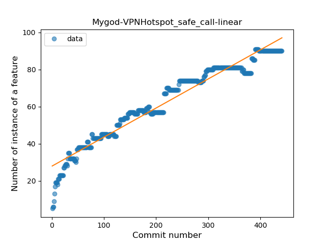

#### SimpleMobileTools-Simple-Gallery
* Feature: When expression
* Function: 
* R_Squared: 0.94737855
 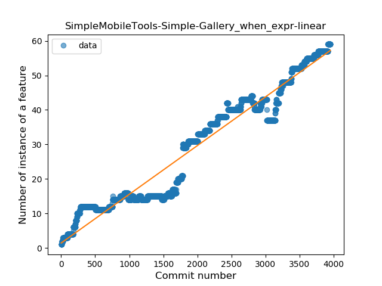

#### ccomeaux-boardgamegeek4android
* Feature: Function with Default Value
* Function: 
* R_Squared: 0.9465765
 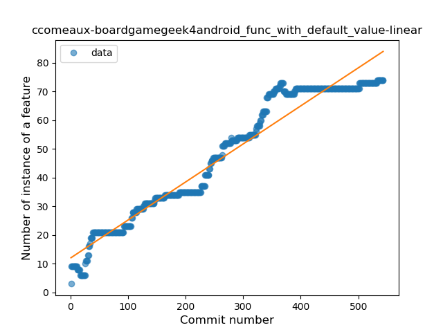

#### juha-h-baresip-studio
* Feature: Type Inference
* Function: 
* R_Squared: 0.94590682
 

#### RocketChat-Rocket.Chat.Android
* Feature: Smart Cast
* Function: 
* R_Squared: 0.94582173
 

#### ultrasonic-ultrasonic
* Feature: Safe Call
* Function: 
* R_Squared: 0.94561841
 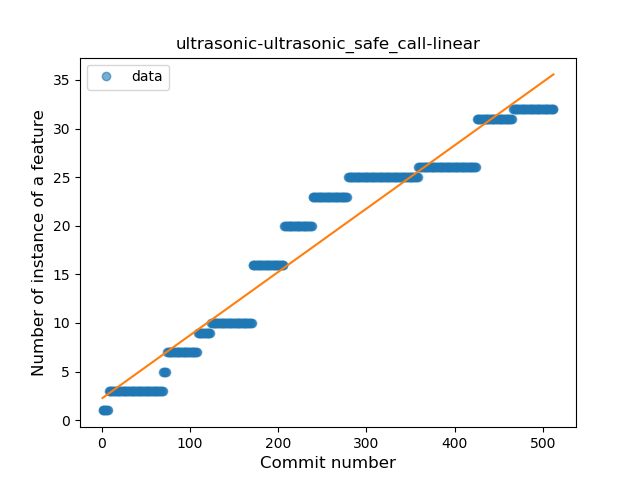

#### ofalvai-BPInfo
* Feature: Lambda
* Function: 
* R_Squared: 0.94553681
 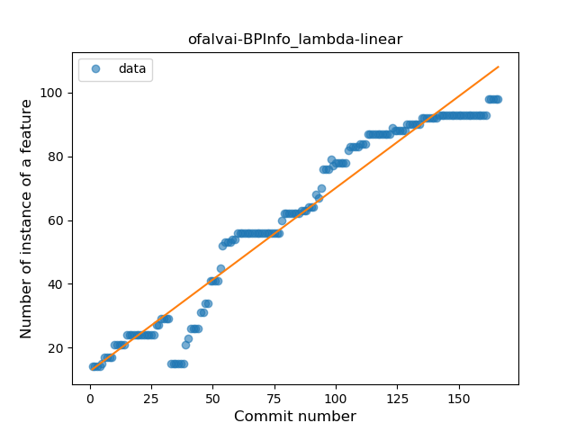

#### jereksel-Bucket
* Feature: Lambda
* Function: 
* R_Squared: 0.94510917
 

#### dkrivoruchko-ScreenStream
* Feature: Lambda
* Function: 
* R_Squared: 0.94491522
 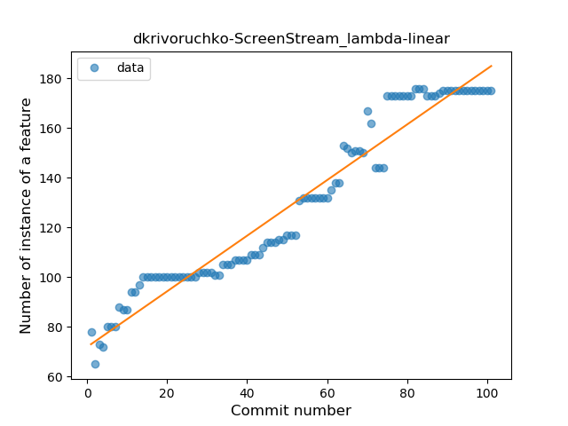

#### thermatk-FastHub-Libre
* Feature: Unsafe Call
* Function: 
* R_Squared: 0.94483035
 

#### thaapasa-jalkametri-android
* Feature: Companion Object
* Function: 
* R_Squared: 0.94463605
 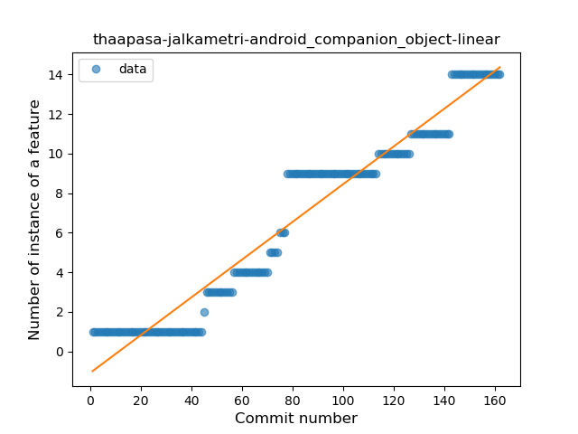

#### peterLaurence-TrekAdvisor
* Feature: When expression
* Function: 
* R_Squared: 0.94451336
 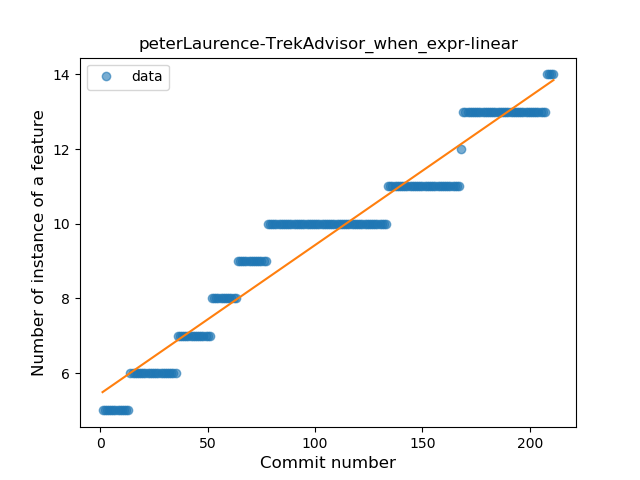

#### alessio-b-zak-myRivers
* Feature: Type Inference
* Function: 
* R_Squared: 0.94438979
 

#### blastrock-kaqui
* Feature: Data Class
* Function: 
* R_Squared: 0.94430781
 

#### AllanWang-Frost-for-Facebook
* Feature: Safe Call
* Function: 
* R_Squared: 0.94411627
 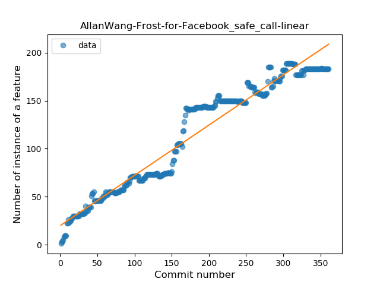

#### glodanif-BluetoothChat
* Feature: Extension Function
* Function: 
* R_Squared: 0.94400612
 

#### ccomeaux-boardgamegeek4android
* Feature: Companion Object
* Function: 
* R_Squared: 0.94379835
 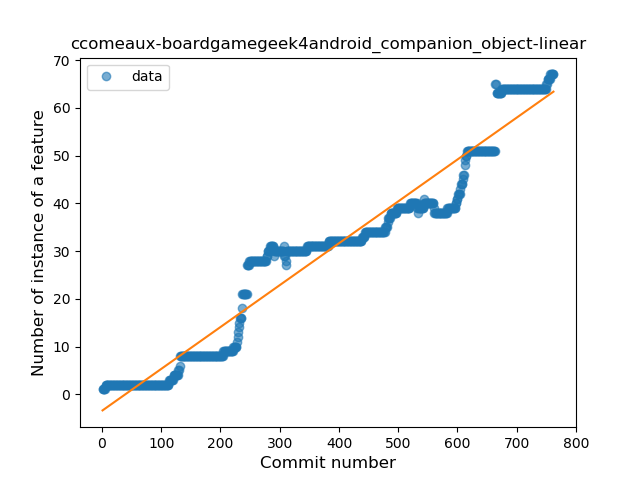

#### pacien-tincapp
* Feature: Extension Function
* Function: 
* R_Squared: 0.94322913
 

#### spacecowboy-Feeder
* Feature: Type Inference
* Function: 
* R_Squared: 0.94285202
 

#### anthonycr-Lightning-Browser
* Feature: Lambda
* Function: 
* R_Squared: 0.94284707
 

#### mozilla-mobile-focus-android
* Feature: Smart Cast
* Function: 
* R_Squared: 0.94269708
 

#### Maxr1998-MaxLock
* Feature: Safe Call
* Function: 
* R_Squared: 0.94239231
 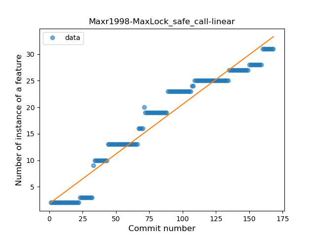

#### inorichi-tachiyomi
* Feature: Destructuring Declaration
* Function: 
* R_Squared: 0.94225206
 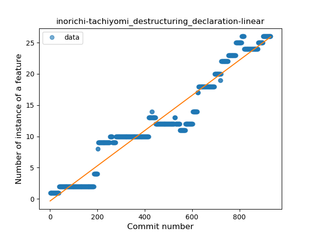

#### fossasia-open-event-android
* Feature: String Template
* Function: 
* R_Squared: 0.94222936
 

#### BijoySingh-Material-Notes-Android-App
* Feature: Function call with Named Argument
* Function: 
* R_Squared: 0.94209788
 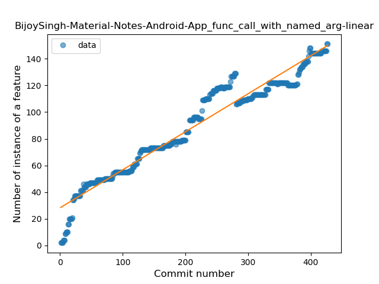

#### Commit451-LabCoat
* Feature: Extension Function
* Function: 
* R_Squared: 0.94146177
 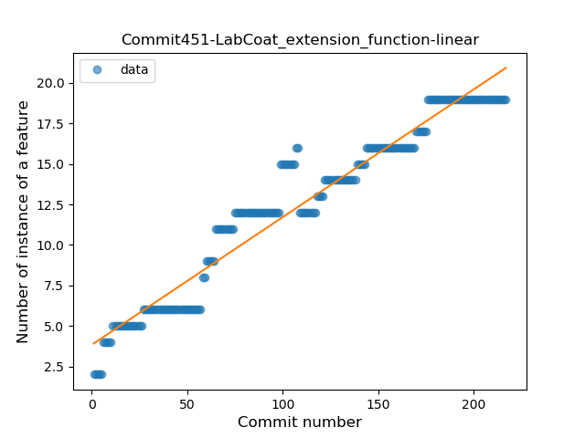

#### openium-auvergne-webcams-droid
* Feature: Type Inference
* Function: 
* R_Squared: 0.94107619
 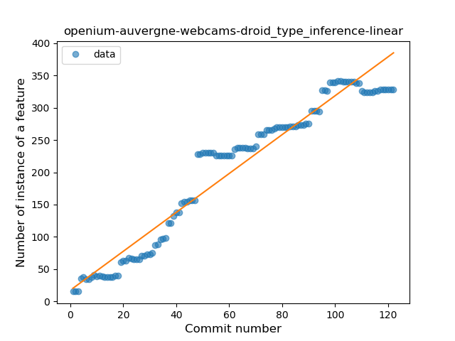

#### qklabs-qksms
* Feature: Data Class
* Function: 
* R_Squared: 0.93932633
 

#### orgzly-orgzly-android
* Feature: Lambda
* Function: 
* R_Squared: 0.93915571
 

#### mozilla-mobile-focus-android
* Feature: Singleton
* Function: 
* R_Squared: 0.93908696
 

#### citiususc-calendula
* Feature: Type Inference
* Function: 
* R_Squared: 0.93886532
 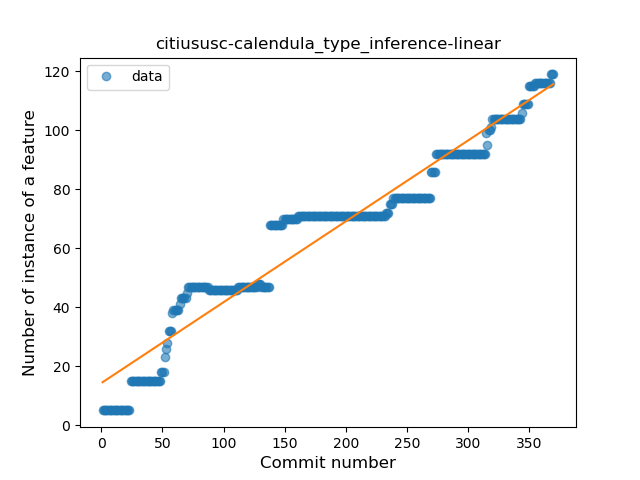

#### qklabs-qksms
* Feature: Companion Object
* Function: 
* R_Squared: 0.9387287
 

#### nibarius-opera-park-android
* Feature: Lambda
* Function: 
* R_Squared: 0.93848799
 

#### hypeapps-episodie
* Feature: When expression
* Function: 
* R_Squared: 0.93847398
 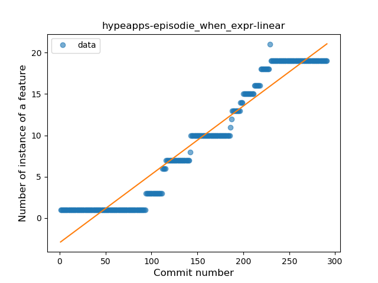

#### darshanparajuli-LogcatReader
* Feature: Unsafe Call
* Function: 
* R_Squared: 0.93845831
 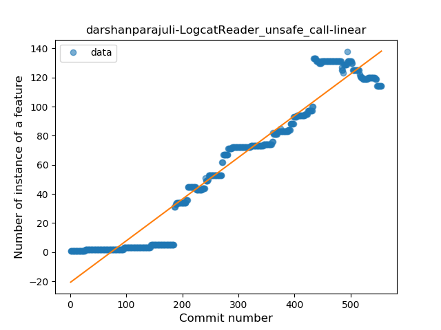

#### CypherpunkArmory-UserLAnd
* Feature: String Template
* Function: 
* R_Squared: 0.93838022
 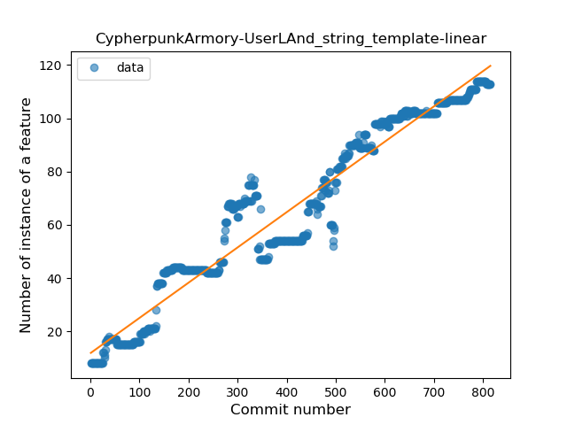

#### SimpleMobileTools-Simple-Music-Player
* Feature: When expression
* Function: 
* R_Squared: 0.93784881
 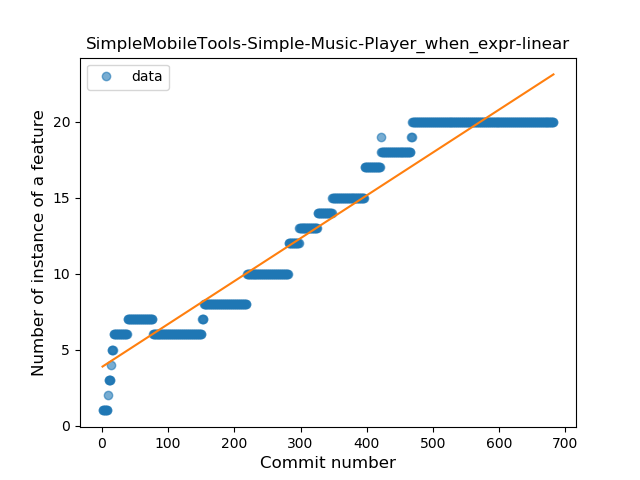

#### inorichi-tachiyomi
* Feature: Unsafe Call
* Function: 
* R_Squared: 0.93771018
 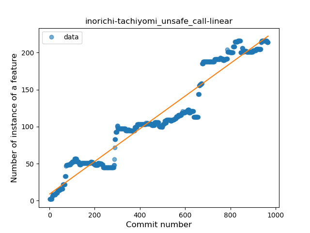

#### RocketChat-Rocket.Chat.Android
* Feature: Range Expression
* Function: 
* R_Squared: 0.93731685
 

#### osmandapp-Osmand
* Feature: Type Inference
* Function: 
* R_Squared: 0.93730598
 

#### sreich-android-count-the-days
* Feature: When expression
* Function: 
* R_Squared: 0.93653008
 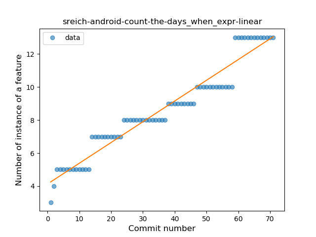

#### walleth-walleth
* Feature: When expression
* Function: 
* R_Squared: 0.93650365
 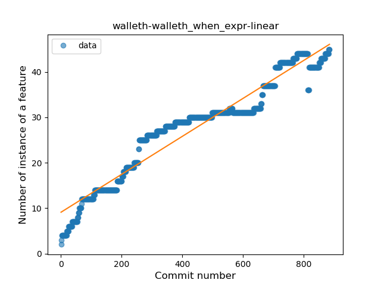

#### openium-auvergne-webcams-droid
* Feature: Lambda
* Function: 
* R_Squared: 0.93577042
 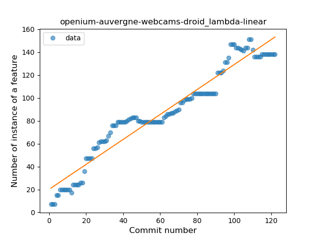

#### CzBiX-v2ex-android
* Feature: Type Inference
* Function: 
* R_Squared: 0.93571294
 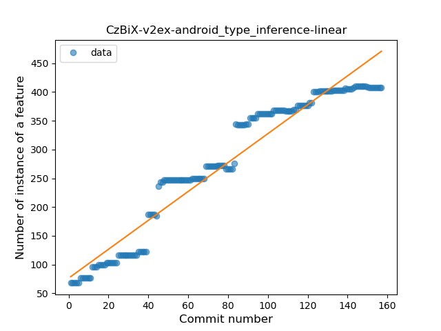

#### fossasia-open-event-android
* Feature: Lambda
* Function: 
* R_Squared: 0.93558237
 

#### ykrank-S1-Next
* Feature: Type Inference
* Function: 
* R_Squared: 0.93557028
 

#### premnirmal-StockTicker
* Feature: Type Inference
* Function: 
* R_Squared: 0.93541189
 

#### duckduckgo-Android
* Feature: Safe Call
* Function: 
* R_Squared: 0.93523521
 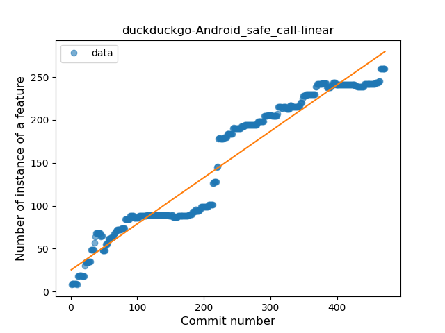

#### RocketChat-Rocket.Chat.Android
* Feature: Function with Default Value
* Function: 
* R_Squared: 0.93509017
 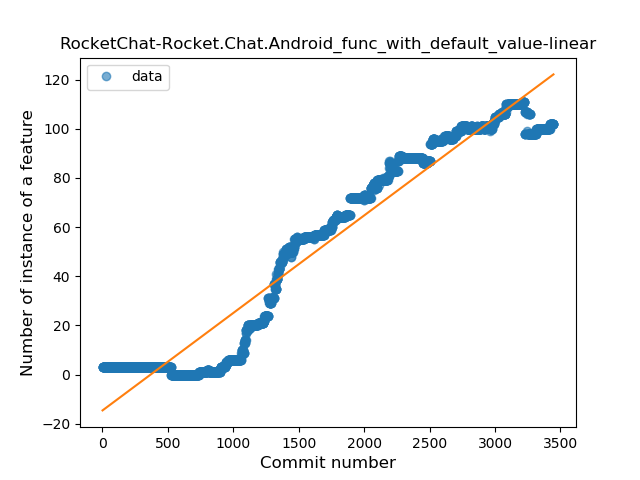

#### osmandapp-Osmand
* Feature: When expression
* Function: 
* R_Squared: 0.93486574
 

#### tasomaniac-OpenLinkWith
* Feature: Companion Object
* Function: 
* R_Squared: 0.93451587
 

#### emansih-FireflyMobile
* Feature: Type Inference
* Function: 
* R_Squared: 0.93448286
 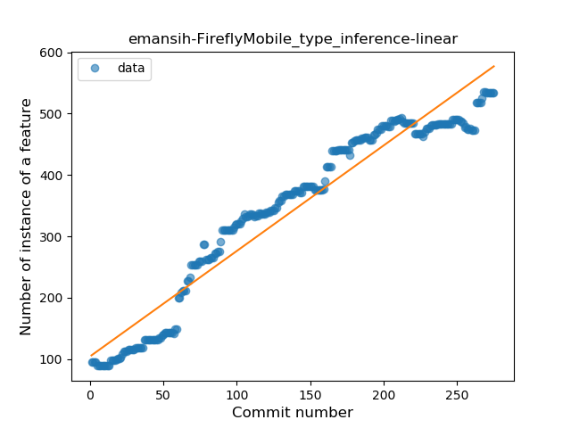

#### inorichi-tachiyomi
* Feature: Singleton
* Function: 
* R_Squared: 0.9341807
 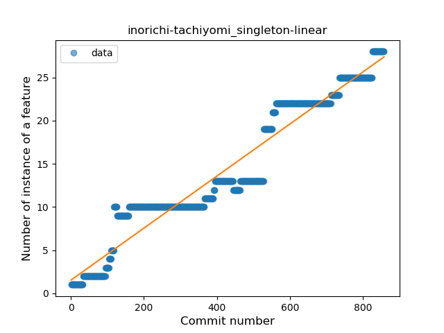

#### bitfireAT-davdroid
* Feature: Data Class
* Function: 
* R_Squared: 0.93376793
 

#### hypeapps-episodie
* Feature: Extension Function
* Function: 
* R_Squared: 0.93335418
 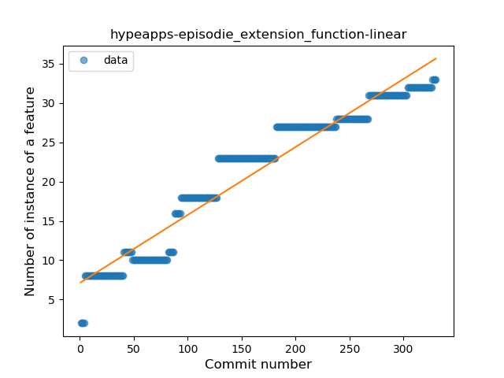

#### BijoySingh-Material-Notes-Android-App
* Feature: Companion Object
* Function: 
* R_Squared: 0.93326315
 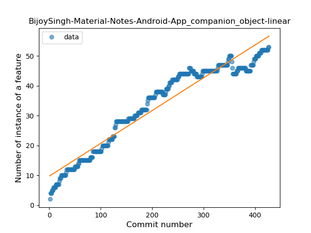

#### PaulWoitaschek-Voice
* Feature: Safe Call
* Function: 
* R_Squared: 0.93276547
 

#### eurofurence-ef-app_android
* Feature: Type Inference
* Function: 
* R_Squared: 0.93246501
 

#### klassm-andFHEM
* Feature: Companion Object
* Function: 
* R_Squared: 0.93236962
 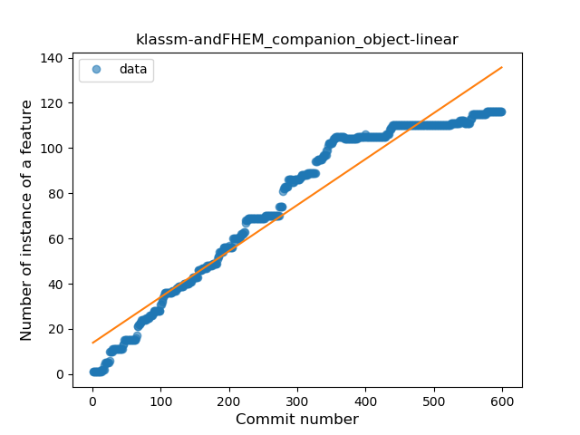

#### ykrank-S1-Next
* Feature: When expression
* Function: 
* R_Squared: 0.93218538
 

#### SimpleMobileTools-Simple-Contacts
* Feature: Unsafe Call
* Function: 
* R_Squared: 0.93206033
 

#### quarck-CalendarNotification
* Feature: Destructuring Declaration
* Function: 
* R_Squared: 0.9319749
 

#### ligi-SurvivalManual
* Feature: Unsafe Call
* Function: 
* R_Squared: 0.93174197
 

#### sreich-android-count-the-days
* Feature: Unsafe Call
* Function: 
* R_Squared: 0.93152516
 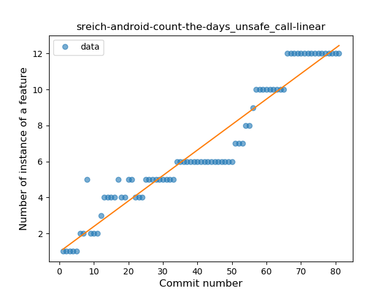

#### joaomneto-TitanCompanion
* Feature: String Template
* Function: 
* R_Squared: 0.93140541
 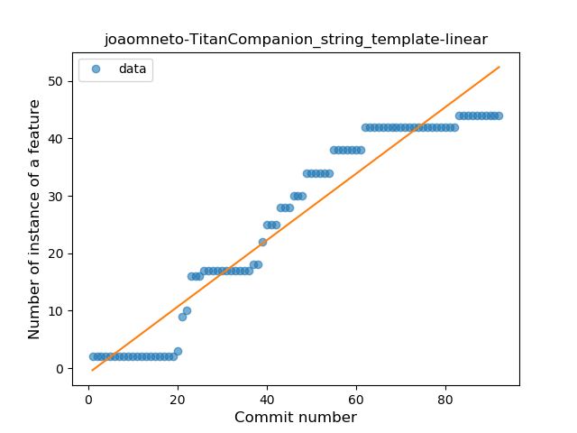

#### inorichi-tachiyomi
* Feature: Safe Call
* Function: 
* R_Squared: 0.93126642
 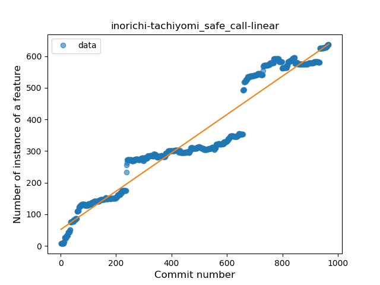

#### albertolalanda-new-ultrasonic-fork-for-MyMusicQoE
* Feature: Data Class
* Function: 
* R_Squared: 0.93090707
 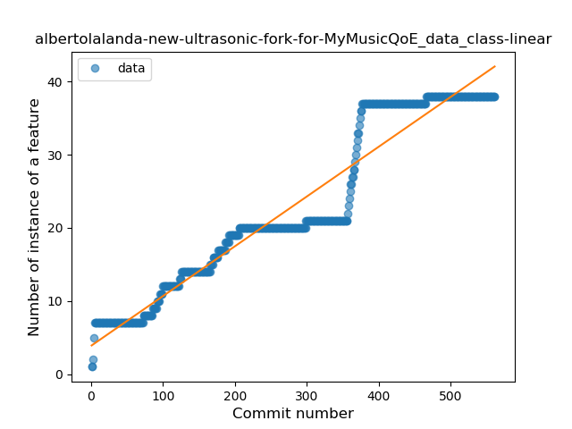

#### duckduckgo-Android
* Feature: Data Class
* Function: 
* R_Squared: 0.93014373
 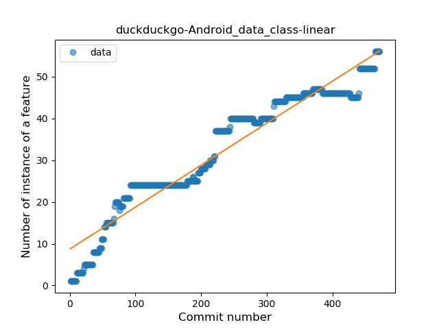

#### ccomeaux-boardgamegeek4android
* Feature: Data Class
* Function: 
* R_Squared: 0.9297222
 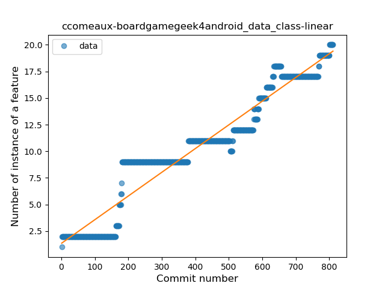

#### SimpleMobileTools-Simple-File-Manager
* Feature: When expression
* Function: 
* R_Squared: 0.92965182
 

#### Depau-EtchDroid
* Feature: Lambda
* Function: 
* R_Squared: 0.92956388
 

#### ScreamingHawk-phone-saver
* Feature: Safe Call
* Function: 
* R_Squared: 0.92915259
 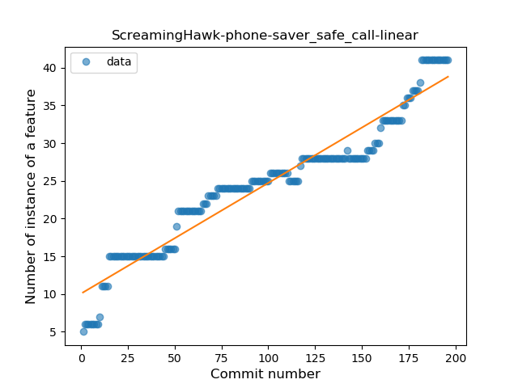

#### FredJul-Flym
* Feature: Lambda
* Function: 
* R_Squared: 0.92914892
 

#### freedombox-team-android-app
* Feature: Lambda
* Function: 
* R_Squared: 0.92907973
 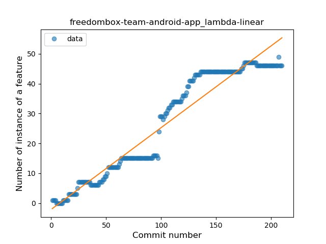

#### FengMoeTeam-NHentai-android
* Feature: Unsafe Call
* Function: 
* R_Squared: 0.92851224
 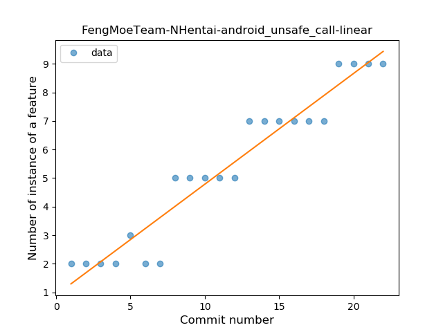

#### carlphilipp-chicago-commutes
* Feature: Lambda
* Function: 
* R_Squared: 0.92848455
 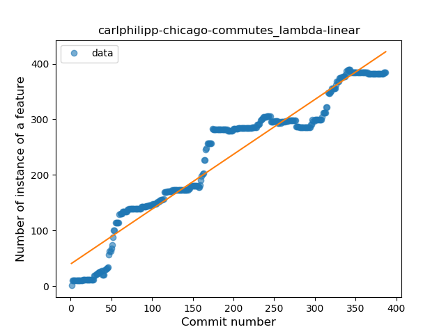

#### tuskyapp-Tusky
* Feature: Companion Object
* Function: 
* R_Squared: 0.92765161
 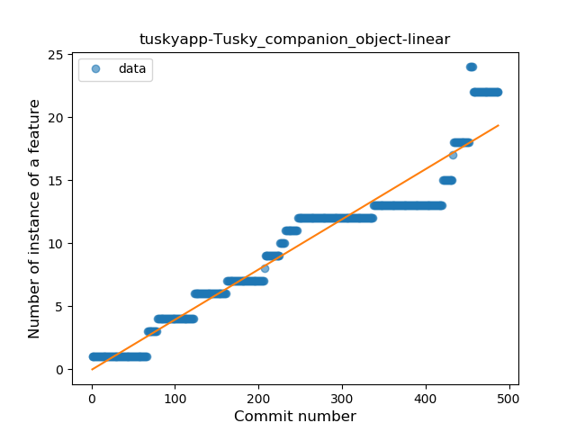

#### TwidereProject-Twidere-Android
* Feature: Smart Cast
* Function: 
* R_Squared: 0.92701459
 

#### grote-Transportr
* Feature: Type Inference
* Function: 
* R_Squared: 0.92687157
 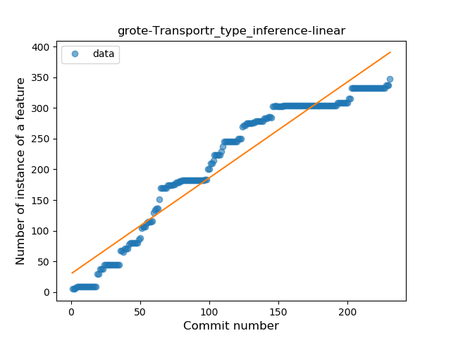

#### thermatk-FastHub-Libre
* Feature: String Template
* Function: 
* R_Squared: 0.92672177
 

#### sreich-android-count-the-days
* Feature: Type Inference
* Function: 
* R_Squared: 0.9265755
 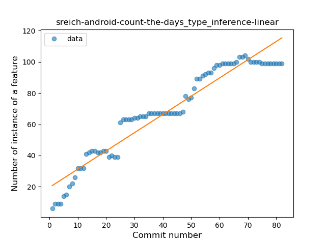

#### SimpleMobileTools-Simple-Notes
* Feature: When expression
* Function: 
* R_Squared: 0.92643985
 

#### xgouchet-Stanley
* Feature: Lambda
* Function: 
* R_Squared: 0.92634894
 

#### nicorsm-S3-16-simone
* Feature: Companion Object
* Function: 
* R_Squared: 0.92588713
 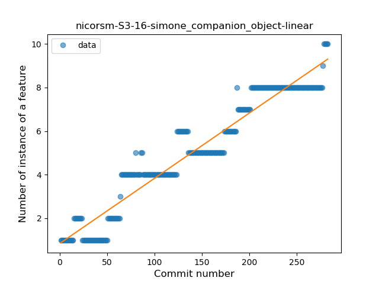

#### duckduckgo-Android
* Feature: String Template
* Function: 
* R_Squared: 0.92570845
 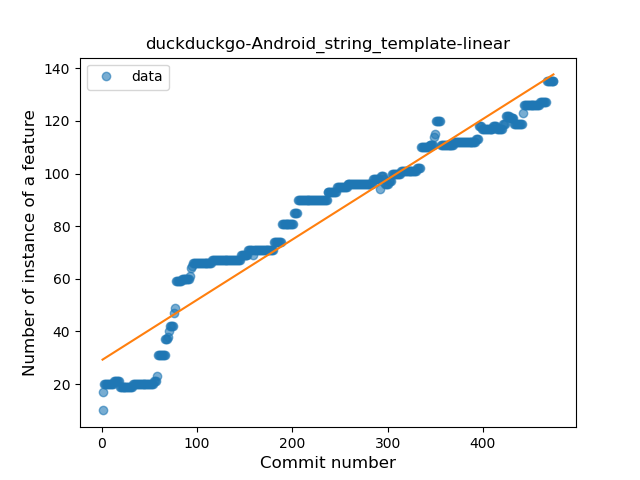

#### danvratil-FBEventSync
* Feature: Safe Call
* Function: 
* R_Squared: 0.92559869
 

#### albertolalanda-new-ultrasonic-fork-for-MyMusicQoE
* Feature: Safe Call
* Function: 
* R_Squared: 0.92539451
 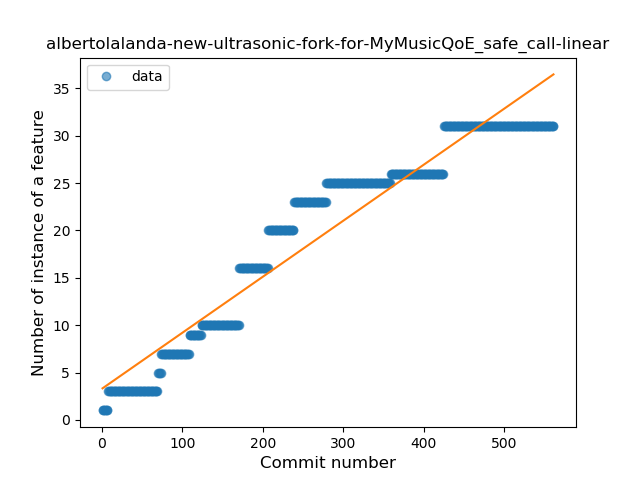

#### duckduckgo-Android
* Feature: Function call with Named Argument
* Function: 
* R_Squared: 0.9250037
 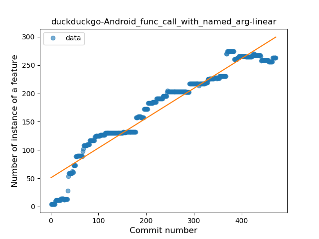

#### DSteve595-Put.io
* Feature: Lambda
* Function: 
* R_Squared: 0.92491872
 

#### ultrasonic-ultrasonic
* Feature: Data Class
* Function: 
* R_Squared: 0.92486433
 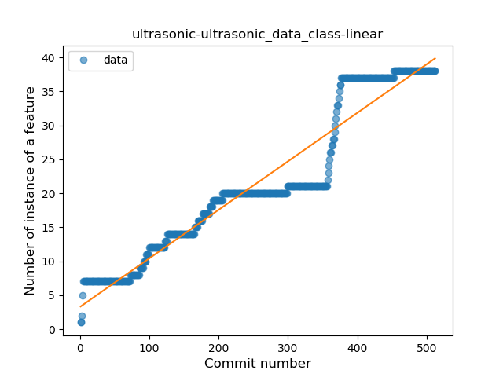

#### vector-im-riot-android
* Feature: When expression
* Function: 
* R_Squared: 0.9248441
 

#### inorichi-tachiyomi
* Feature: Range Expression
* Function: 
* R_Squared: 0.9247932
 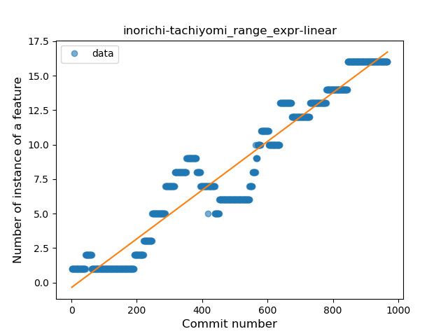

#### romannurik-muzei
* Feature: Lambda
* Function: 
* R_Squared: 0.92478072
 

#### carlphilipp-chicago-commutes
* Feature: Function call with Named Argument
* Function: 
* R_Squared: 0.92443009
 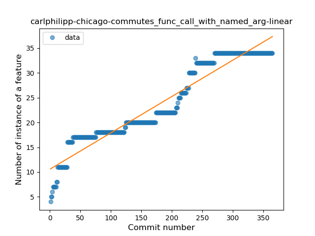

#### qklabs-qksms
* Feature: Property Delegation
* Function: 
* R_Squared: 0.9240231
 

#### thermatk-FastHub-Libre
* Feature: Smart Cast
* Function: 
* R_Squared: 0.92332858
 

#### ontherunvaro-adb-awake
* Feature: Type Inference
* Function: 
* R_Squared: 0.9231397
 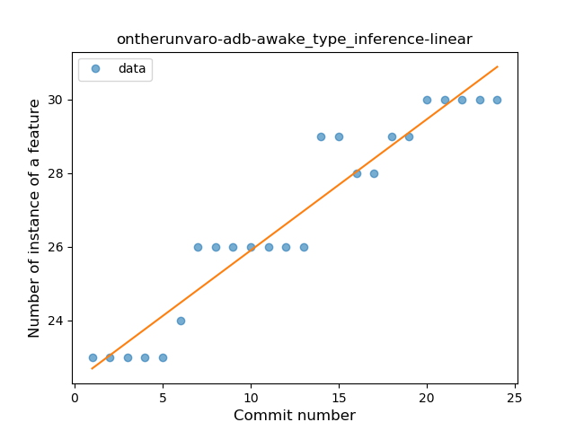

#### tuskyapp-Tusky
* Feature: Function call with Named Argument
* Function: 
* R_Squared: 0.92275216
 

#### shymmq-librus-client-kotlin
* Feature: Type Inference
* Function: 
* R_Squared: 0.92212639
 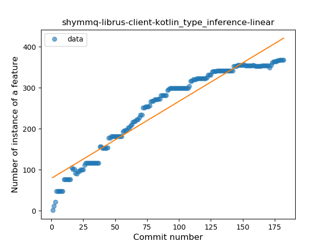

#### LawnchairLauncher-Lawnchair
* Feature: Lambda
* Function: 
* R_Squared: 0.92181217
 

#### jereksel-Bucket
* Feature: Unsafe Call
* Function: 
* R_Squared: 0.92169611
 

#### SimpleMobileTools-Simple-Camera
* Feature: Lambda
* Function: 
* R_Squared: 0.92148611
 

#### joan-domingo-Podcasts-RAC1-Android
* Feature: Safe Call
* Function: 
* R_Squared: 0.91981851
 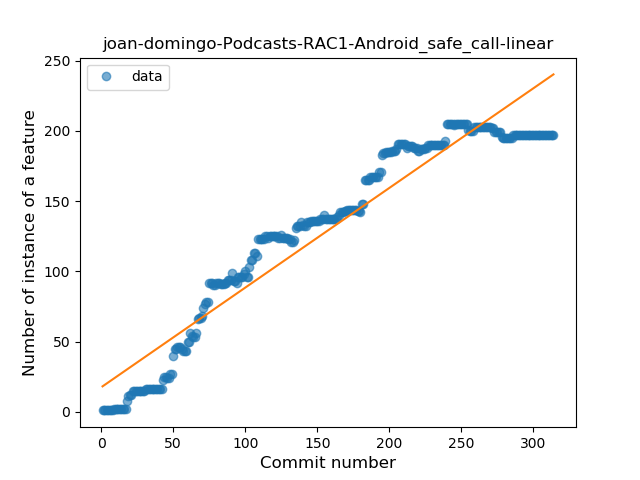

#### AIDEA775-UNCmorfi
* Feature: Safe Call
* Function: 
* R_Squared: 0.91968698
 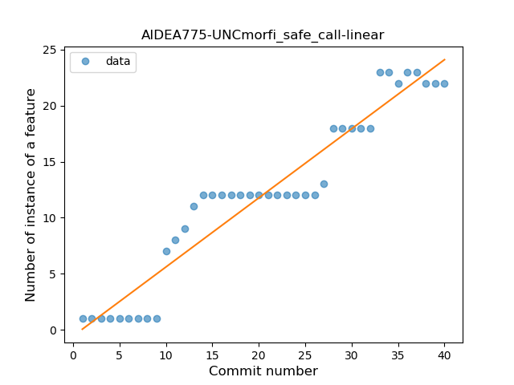

#### Apolline-Lille-apolline-android
* Feature: Property Delegation
* Function: 
* R_Squared: 0.91923929
 

#### Waboodoo-HTTP-Shortcuts
* Feature: Function with Default Value
* Function: 
* R_Squared: 0.91917662
 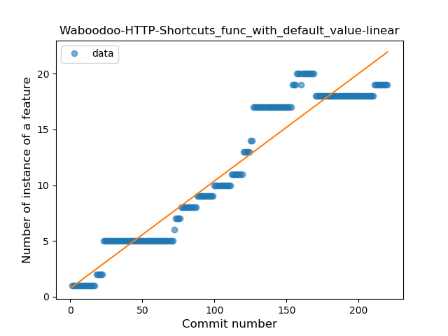

#### blastrock-kaqui
* Feature: Type Inference
* Function: 
* R_Squared: 0.91913471
 

#### Agusyc-DayCounter
* Feature: Type Inference
* Function: 
* R_Squared: 0.91884269
 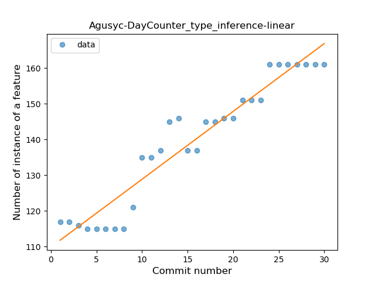

#### NyaaPantsu-NyaaPantsu-android-app
* Feature: Companion Object
* Function: 
* R_Squared: 0.91862168
 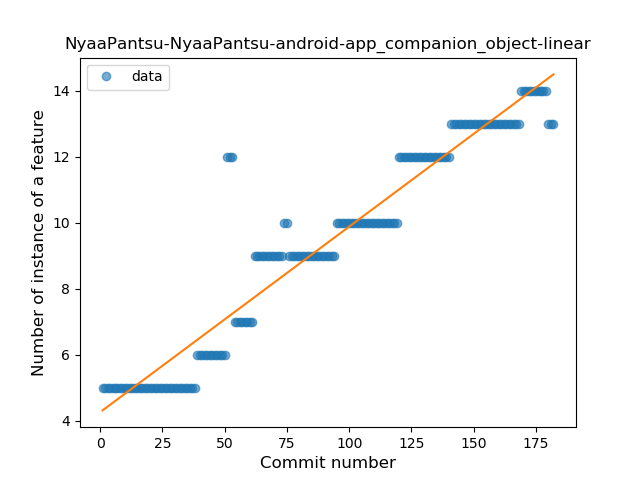

#### emansih-FireflyMobile
* Feature: Extension Function
* Function: 
* R_Squared: 0.91854491
 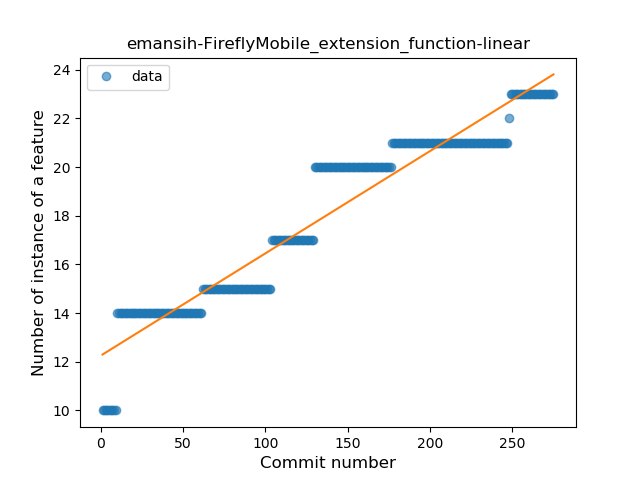

#### LiMium-mini-vector-android
* Feature: When expression
* Function: 
* R_Squared: 0.91849903
 

#### corphish-NightLight
* Feature: String Template
* Function: 
* R_Squared: 0.9184134
 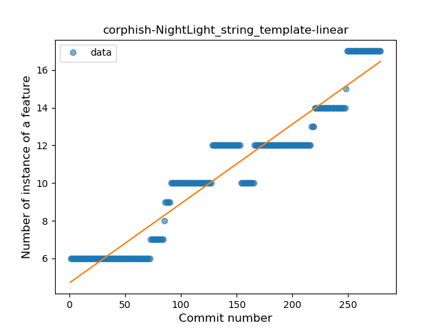

#### grote-Transportr
* Feature: When expression
* Function: 
* R_Squared: 0.91835605
 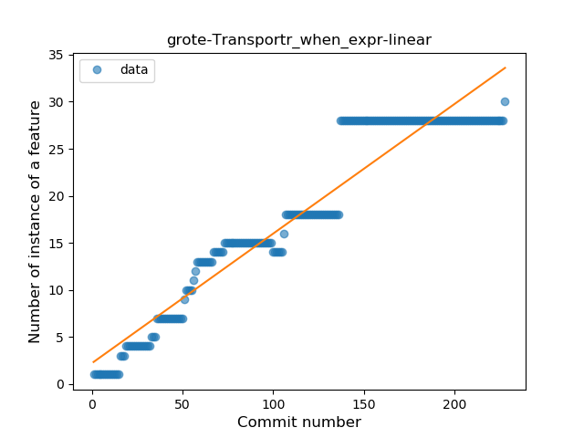

#### thermatk-FastHub-Libre
* Feature: Safe Call
* Function: 
* R_Squared: 0.91735919
 

#### qklabs-qksms
* Feature: Smart Cast
* Function: 
* R_Squared: 0.91694786
 

#### klassm-andFHEM
* Feature: Function with Default Value
* Function: 
* R_Squared: 0.91693893
 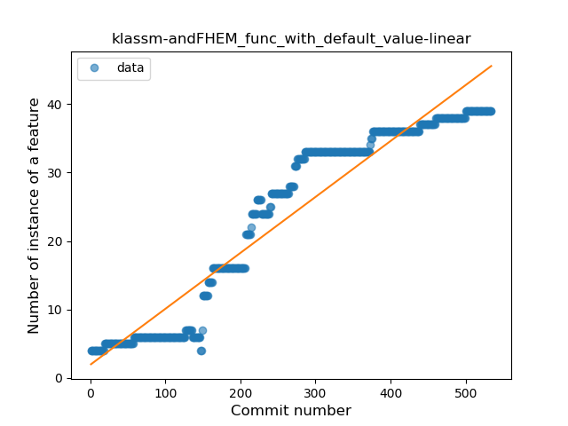

#### ykrank-S1-Next
* Feature: Companion Object
* Function: 
* R_Squared: 0.91654318
 

#### ofalvai-BPInfo
* Feature: Safe Call
* Function: 
* R_Squared: 0.91633625
 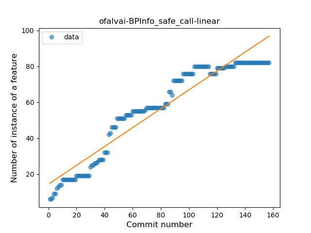

#### mastizada-focus-android
* Feature: Function call with Named Argument
* Function: 
* R_Squared: 0.9163215
 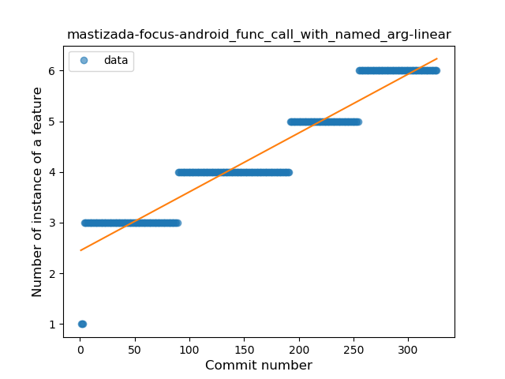

#### ligi-PassAndroid
* Feature: String Template
* Function: 
* R_Squared: 0.91623841
 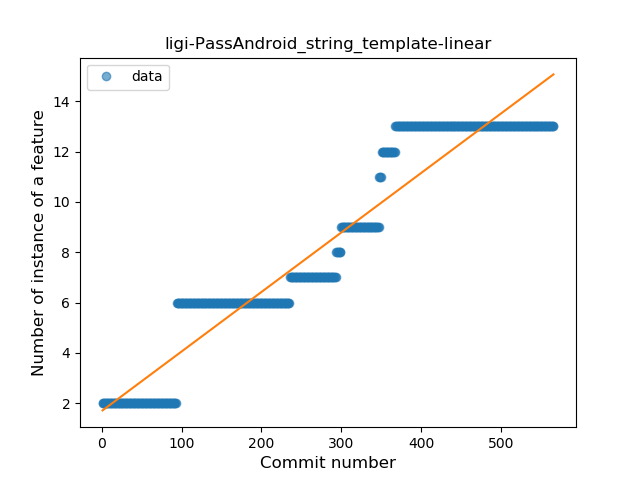

#### pacien-tincapp
* Feature: Lambda
* Function: 
* R_Squared: 0.91602652
 

#### abertschi-ad-free
* Feature: Type Inference
* Function: 
* R_Squared: 0.91590816
 

#### raatmarien-red-moon
* Feature: Lambda
* Function: 
* R_Squared: 0.91578872
 

#### SimpleMobileTools-Simple-Calendar
* Feature: Type Inference
* Function: 
* R_Squared: 0.91567368
 

#### walleth-walleth
* Feature: Function call with Named Argument
* Function: 
* R_Squared: 0.91549946
 

#### ligi-PassAndroid
* Feature: Unsafe Call
* Function: 
* R_Squared: 0.91443644
 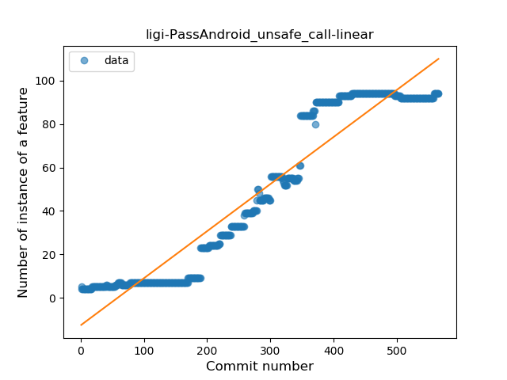

#### SimpleMobileTools-Simple-Contacts
* Feature: When expression
* Function: 
* R_Squared: 0.91427369
 

#### MrBIMC-RunInBackgroundPermissionSetter
* Feature: Type Inference
* Function: 
* R_Squared: 0.91421646
 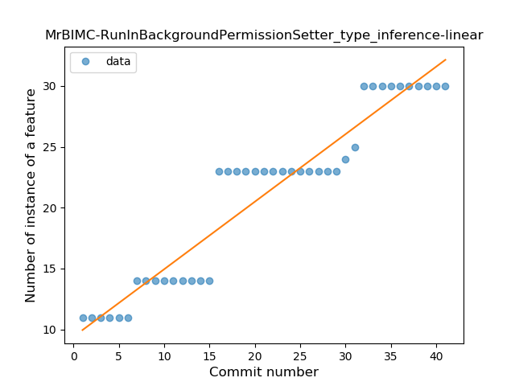

#### duckduckgo-Android
* Feature: Extension Function
* Function: 
* R_Squared: 0.91418878
 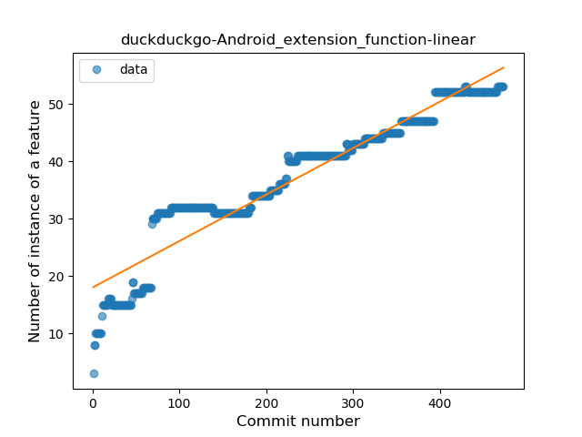

#### EventFahrplan-EventFahrplan
* Feature: Lambda
* Function: 
* R_Squared: 0.91399228
 

#### jereksel-Bucket
* Feature: Extension Function
* Function: 
* R_Squared: 0.9138641
 

#### syrop-Wiktor-Navigator
* Feature: Extension Function
* Function: 
* R_Squared: 0.9133353
 

#### albertolalanda-new-ultrasonic-fork-for-MyMusicQoE
* Feature: Type Inference
* Function: 
* R_Squared: 0.91317748
 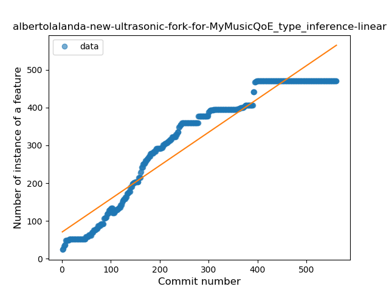

#### loloof64-BasicChessEndGamesTrainer
* Feature: Range Expression
* Function: 
* R_Squared: 0.91295815
 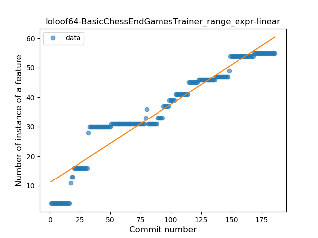

#### klassm-andFHEM
* Feature: Type Inference
* Function: 
* R_Squared: 0.9125576
 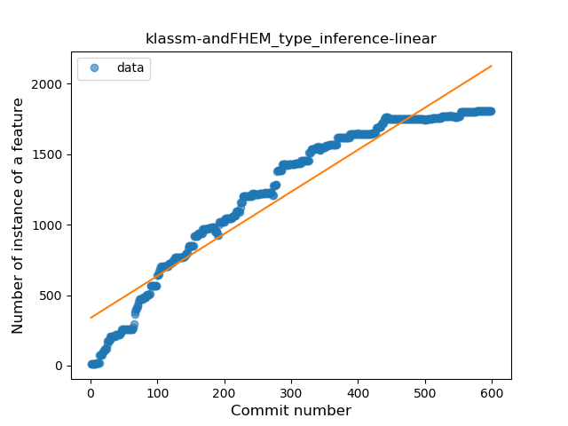

#### yshrsmz-monotweety
* Feature: Function call with Named Argument
* Function: 
* R_Squared: 0.91203016
 

#### ligi-gobandroid
* Feature: Function with Default Value
* Function: 
* R_Squared: 0.91150695
 

#### Mystery00-JanYoShare
* Feature: Lambda
* Function: 
* R_Squared: 0.91126196
 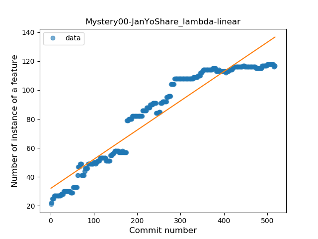

#### tuskyapp-Tusky
* Feature: String Template
* Function: 
* R_Squared: 0.91110413
 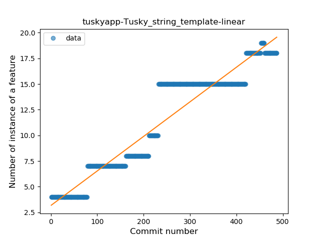

#### mpcjanssen-simpletask-android
* Feature: String Template
* Function: 
* R_Squared: 0.91029085
 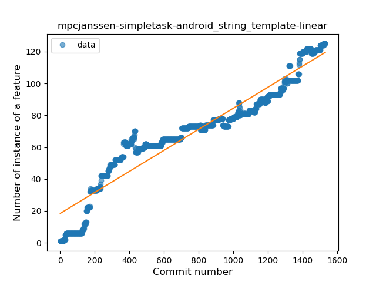

#### Commit451-LabCoat
* Feature: Function with Default Value
* Function: 
* R_Squared: 0.91011258
 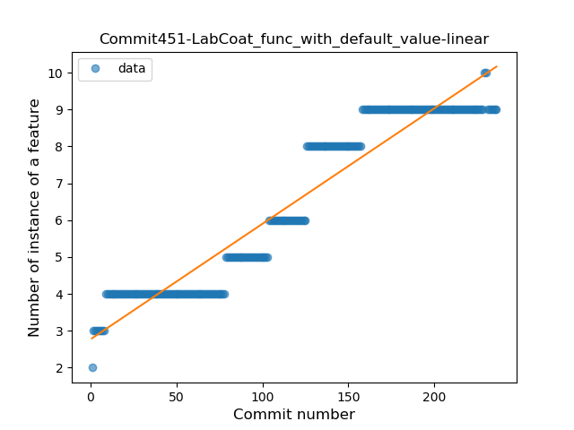

#### EventFahrplan-EventFahrplan
* Feature: Type Inference
* Function: 
* R_Squared: 0.90987929
 

#### ligi-PassAndroid
* Feature: Type Inference
* Function: 
* R_Squared: 0.90839303
 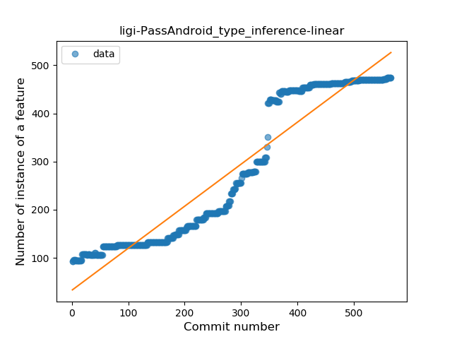

#### abertschi-ad-free
* Feature: Lambda
* Function: 
* R_Squared: 0.90827417
 

#### Gark-bassblog_kotlin
* Feature: Safe Call
* Function: 
* R_Squared: 0.90825671
 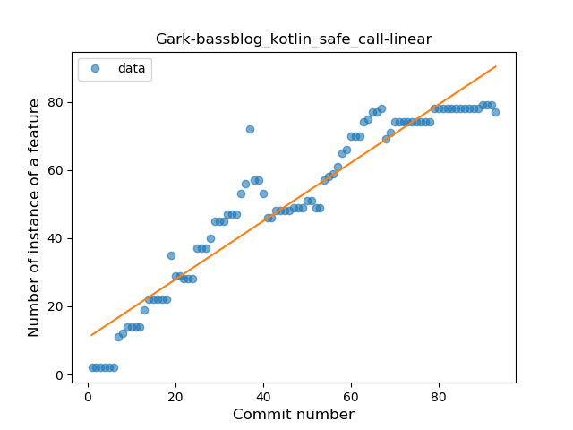

#### fossasia-open-event-android
* Feature: Function with Default Value
* Function: 
* R_Squared: 0.90765816
 

#### fvasco-pinpoi
* Feature: When expression
* Function: 
* R_Squared: 0.90727719
 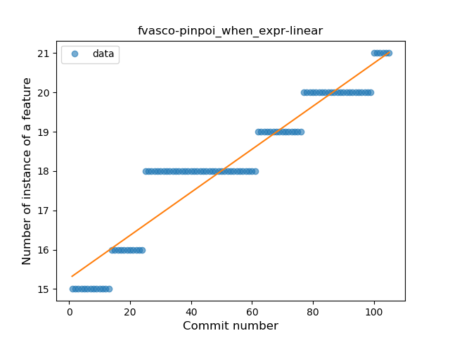

#### klassm-andFHEM
* Feature: Data Class
* Function: 
* R_Squared: 0.90722876
 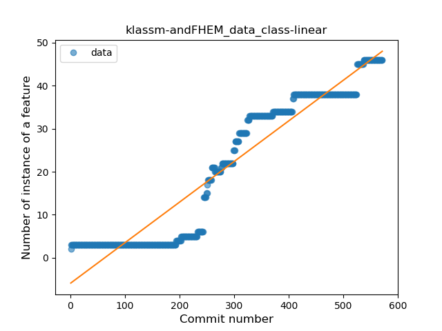

#### bitfireAT-davdroid
* Feature: Lambda
* Function: 
* R_Squared: 0.90638101
 

#### esafirm-android-playground
* Feature: When expression
* Function: 
* R_Squared: 0.90623797
 

#### SimpleMobileTools-Simple-Contacts
* Feature: Type Inference
* Function: 
* R_Squared: 0.90543516
 

#### SimpleMobileTools-Simple-Contacts
* Feature: Smart Cast
* Function: 
* R_Squared: 0.90542433
 

#### kamgurgul-cpu-info
* Feature: Unsafe Call
* Function: 
* R_Squared: 0.9053238
 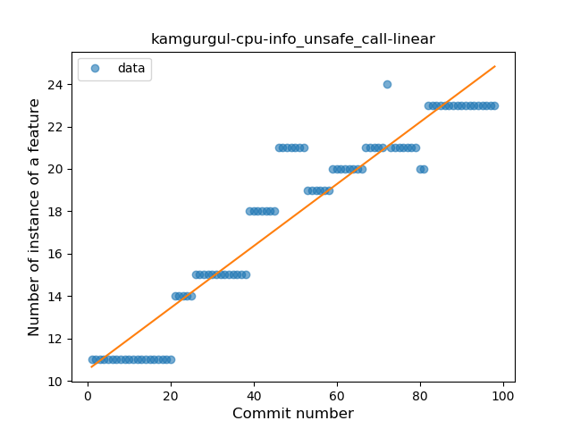

#### syncthing-syncthing-lite
* Feature: Property Delegation
* Function: 
* R_Squared: 0.90468473
 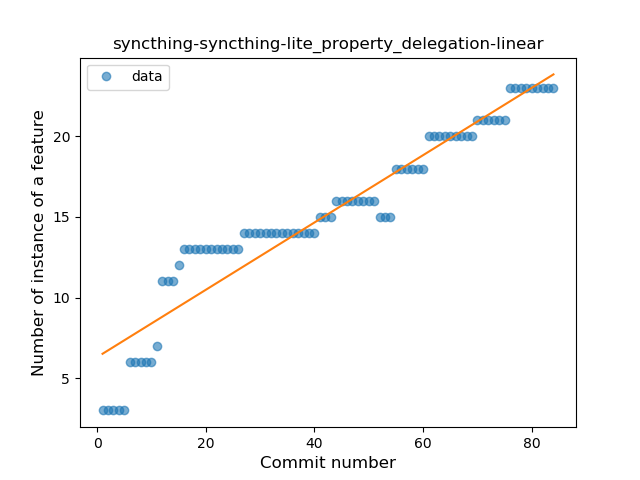

#### qklabs-qksms
* Feature: Range Expression
* Function: 
* R_Squared: 0.90406211
 

#### MGaetan89-ShowsRage
* Feature: When expression
* Function: 
* R_Squared: 0.90360268
 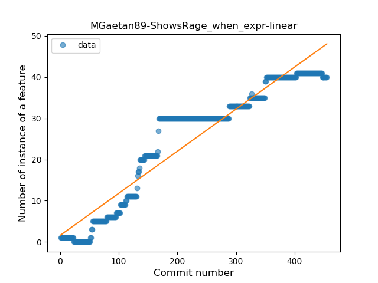

#### dkrivoruchko-ScreenStream
* Feature: Range Expression
* Function: 
* R_Squared: 0.9032902
 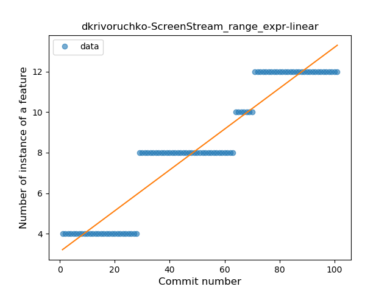

#### peterLaurence-TrekAdvisor
* Feature: Data Class
* Function: 
* R_Squared: 0.90319789
 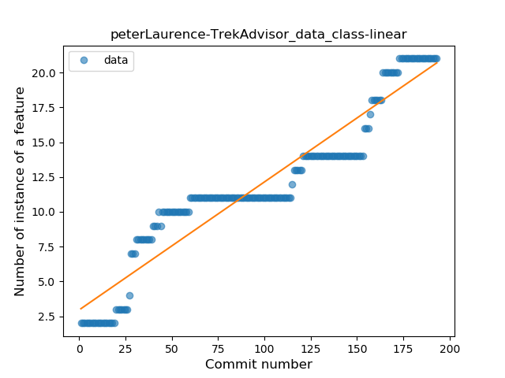

#### eurofurence-ef-app_android
* Feature: Smart Cast
* Function: 
* R_Squared: 0.90275862
 

#### klassm-andFHEM
* Feature: Safe Call
* Function: 
* R_Squared: 0.90218453
 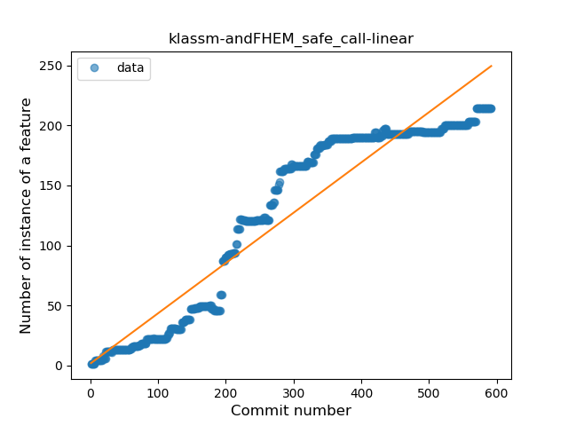

#### FredJul-Flym
* Feature: Safe Call
* Function: 
* R_Squared: 0.90182572
 

#### bitfireAT-davdroid
* Feature: Unsafe Call
* Function: 
* R_Squared: 0.90178365
 

#### darshanparajuli-LogcatReader
* Feature: String Template
* Function: 
* R_Squared: 0.90175036
 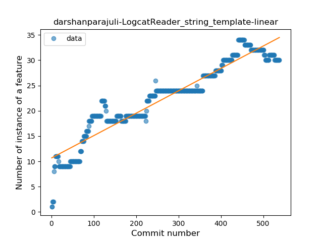

#### syncthing-syncthing-lite
* Feature: Smart Cast
* Function: 
* R_Squared: 0.90168198
 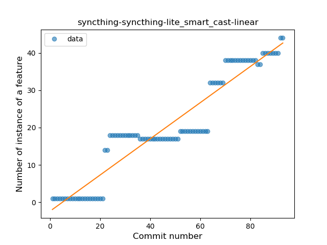

#### osmandapp-Osmand
* Feature: Function with Default Value
* Function: 
* R_Squared: 0.90158778
 

#### yshrsmz-monotweety
* Feature: Safe Call
* Function: 
* R_Squared: 0.9015845
 

#### Depau-EtchDroid
* Feature: When expression
* Function: 
* R_Squared: 0.90140038
 

#### eurofurence-ef-app_android
* Feature: String Template
* Function: 
* R_Squared: 0.90125928
 

#### glodanif-BluetoothChat
* Feature: Type Inference
* Function: 
* R_Squared: 0.90118975
 

#### RocketChat-Rocket.Chat.Android
* Feature: Companion Object
* Function: 
* R_Squared: 0.9007671
 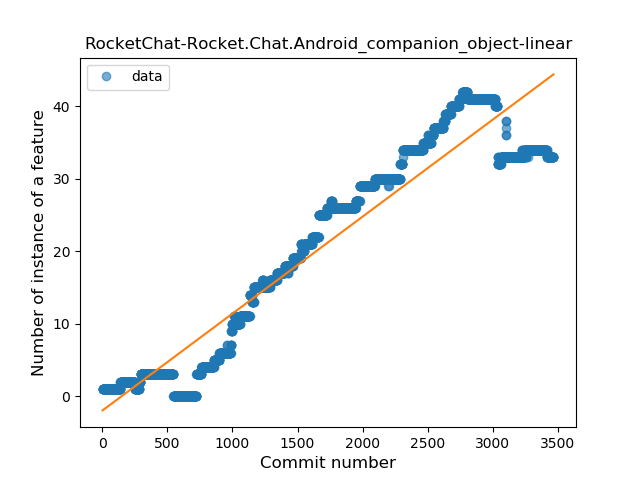

#### grote-Transportr
* Feature: String Template
* Function: 
* R_Squared: 0.90066968
 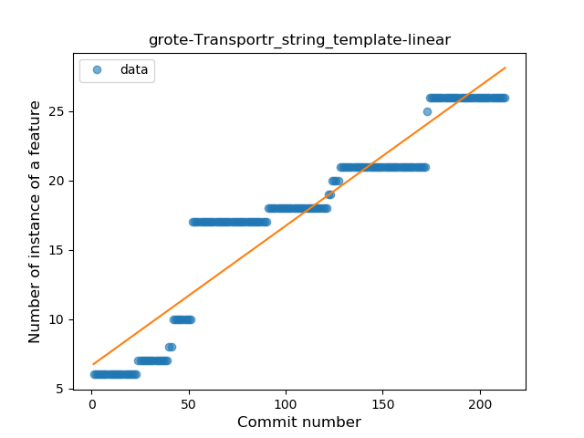

#### syrop-Wiktor-Navigator
* Feature: Lambda
* Function: 
* R_Squared: 0.90038002
 

#### SimpleMobileTools-Simple-Draw
* Feature: Lambda
* Function: 
* R_Squared: 0.90032338
 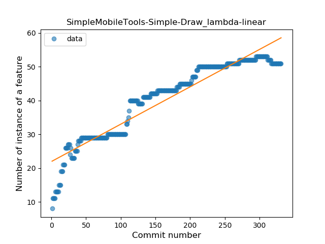

#### walleth-walleth
* Feature: Property Delegation
* Function: 
* R_Squared: 0.90008515
 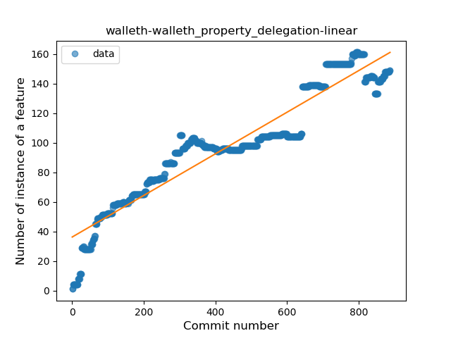

#### herbeth1u-VNDB-Android
* Feature: Function with Default Value
* Function: 
* R_Squared: 0.89992982
 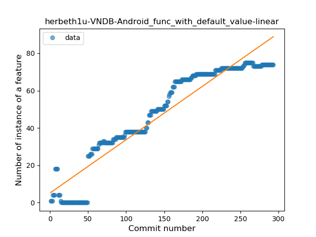

#### xgouchet-Stanley
* Feature: Safe Call
* Function: 
* R_Squared: 0.89978147
 

#### quarck-CalendarNotification
* Feature: Function with Default Value
* Function: 
* R_Squared: 0.89961572
 

#### TwidereProject-Twidere-Android
* Feature: Range Expression
* Function: 
* R_Squared: 0.89938116
 

#### tasomaniac-OpenLinkWith
* Feature: Unsafe Call
* Function: 
* R_Squared: 0.89893793
 

#### SimpleMobileTools-Simple-Calendar
* Feature: Range Expression
* Function: 
* R_Squared: 0.89836539
 

#### xgouchet-Stanley
* Feature: Companion Object
* Function: 
* R_Squared: 0.89835073
 

#### hyst329-OpenFool
* Feature: Function with Default Value
* Function: 
* R_Squared: 0.8978418
 

#### mastizada-focus-android
* Feature: Companion Object
* Function: 
* R_Squared: 0.89757858
 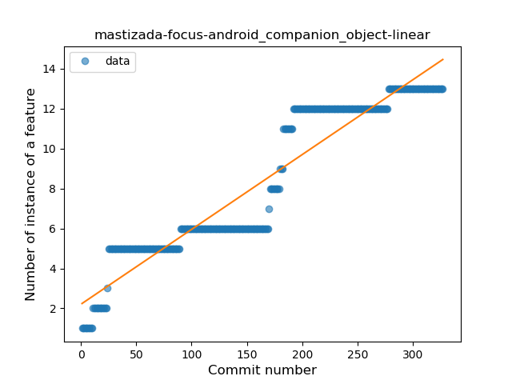

#### erickok-borefts2015
* Feature: Type Inference
* Function: 
* R_Squared: 0.89754622
 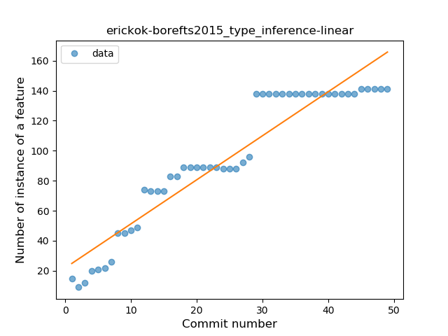

#### commons-app-apps-android-commons
* Feature: Type Inference
* Function: 
* R_Squared: 0.89740816
 

#### eurofurence-ef-app_android
* Feature: Extension Function
* Function: 
* R_Squared: 0.8971721
 

#### nao20010128nao-DroidComplex
* Feature: When expression
* Function: 
* R_Squared: 0.89677066
 

#### raatmarien-red-moon
* Feature: When expression
* Function: 
* R_Squared: 0.89676725
 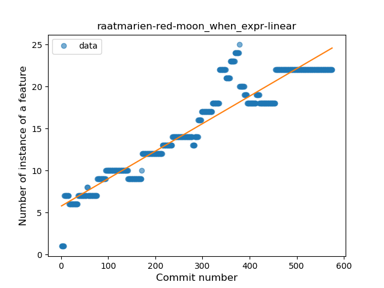

#### bitfireAT-davdroid
* Feature: When expression
* Function: 
* R_Squared: 0.89557924
 

#### mpcjanssen-simpletask-android
* Feature: Function call with Named Argument
* Function: 
* R_Squared: 0.89468913
 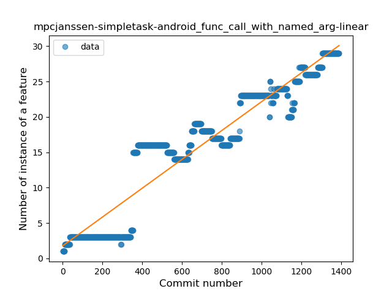

#### FredJul-Flym
* Feature: Function with Default Value
* Function: 
* R_Squared: 0.89458164
 

#### fvasco-pinpoi
* Feature: String Template
* Function: 
* R_Squared: 0.89420655
 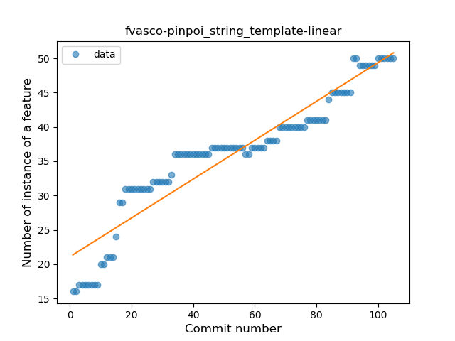

#### hsson-card-balance-app
* Feature: Safe Call
* Function: 
* R_Squared: 0.89380694
 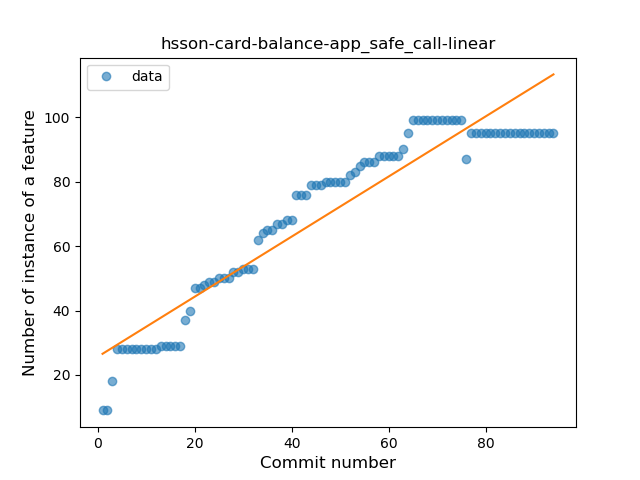

#### BijoySingh-Material-Notes-Android-App
* Feature: Unsafe Call
* Function: 
* R_Squared: 0.89371914
 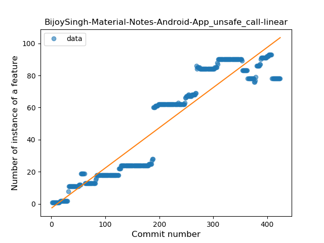

#### zoenb-log28
* Feature: Unsafe Call
* Function: 
* R_Squared: 0.8936477
 

#### lenchan139-NCBookmark
* Feature: Range Expression
* Function: 
* R_Squared: 0.89284907
 

#### k9mail-k-9
* Feature: Range Expression
* Function: 
* R_Squared: 0.89283388
 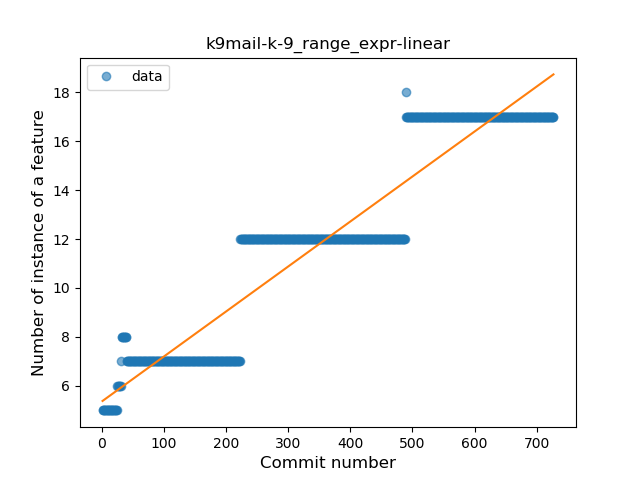

#### CypherpunkArmory-UserLAnd
* Feature: Function call with Named Argument
* Function: 
* R_Squared: 0.89275049
 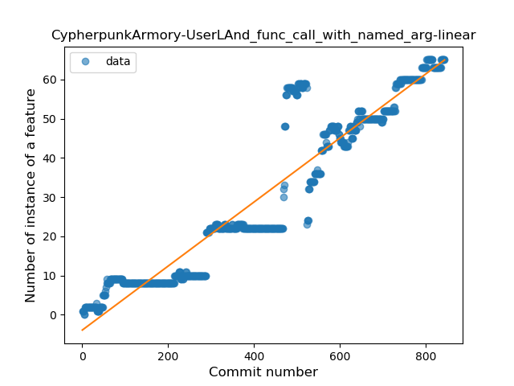

#### bubelov-coins-android
* Feature: Lambda
* Function: 
* R_Squared: 0.89094028
 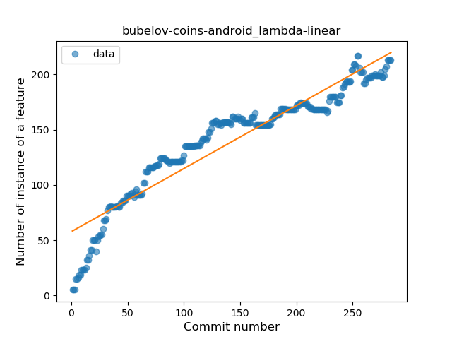

#### spacecowboy-Feeder
* Feature: Function call with Named Argument
* Function: 
* R_Squared: 0.89077941
 

#### k9mail-k-9
* Feature: Extension Function
* Function: 
* R_Squared: 0.89071576
 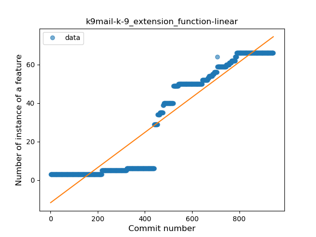

#### howard-e-just-quotes-kt
* Feature: Unsafe Call
* Function: 
* R_Squared: 0.89054688
 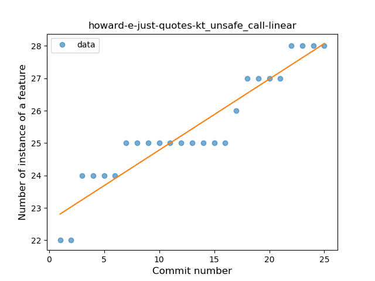

#### Mystery00-JanYoShare
* Feature: Type Inference
* Function: 
* R_Squared: 0.89048265
 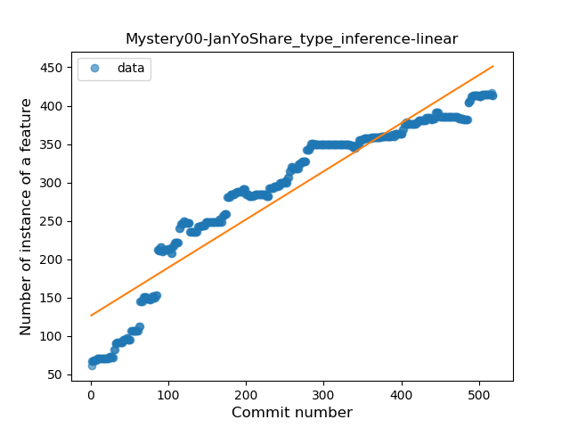

#### ykrank-S1-Next
* Feature: Property Delegation
* Function: 
* R_Squared: 0.89014734
 

#### jpeddicord-speedofsound
* Feature: Lambda
* Function: 
* R_Squared: 0.88970588
 

#### emansih-FireflyMobile
* Feature: When expression
* Function: 
* R_Squared: 0.88958398
 

#### nathanj-ogsdroid
* Feature: Lambda
* Function: 
* R_Squared: 0.88950672
 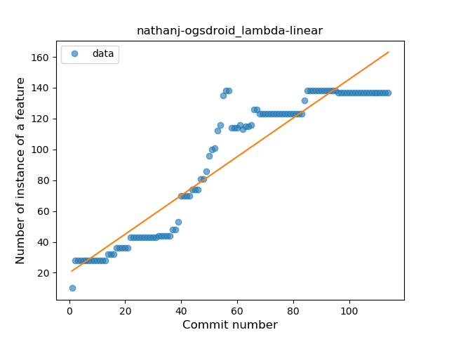

#### ligi-SurvivalManual
* Feature: Property Delegation
* Function: 
* R_Squared: 0.8886182
 

#### osmandapp-Osmand
* Feature: Unsafe Call
* Function: 
* R_Squared: 0.88822338
 

#### Waboodoo-HTTP-Shortcuts
* Feature: Extension Function
* Function: 
* R_Squared: 0.88791241
 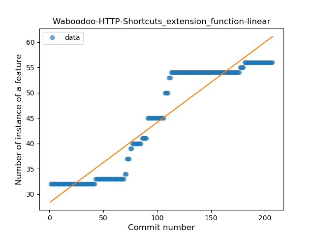

#### fossasia-open-event-android
* Feature: Property Delegation
* Function: 
* R_Squared: 0.8875909
 

#### AllanWang-Frost-for-Facebook
* Feature: Range Expression
* Function: 
* R_Squared: 0.88637136
 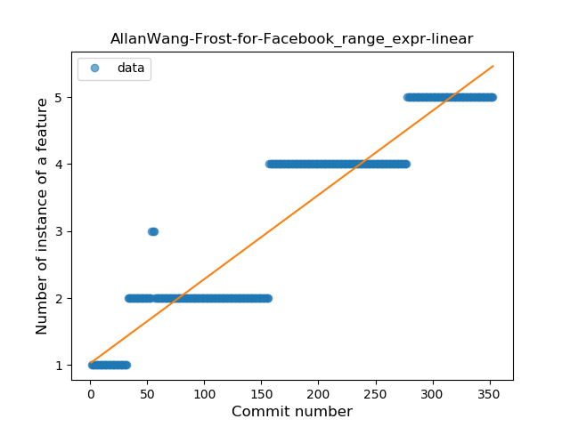

#### abertschi-ad-free
* Feature: Safe Call
* Function: 
* R_Squared: 0.88613416
 

#### glodanif-BluetoothChat
* Feature: Property Delegation
* Function: 
* R_Squared: 0.88572983
 

#### milosmns-Timecrypt
* Feature: Type Inference
* Function: 
* R_Squared: 0.88429264
 

#### jeeb-mpv-android
* Feature: Type Inference
* Function: 
* R_Squared: 0.88424459
 

#### jereksel-Bucket
* Feature: Property Delegation
* Function: 
* R_Squared: 0.88410318
 

#### nathanj-ogsdroid
* Feature: Type Inference
* Function: 
* R_Squared: 0.88380266
 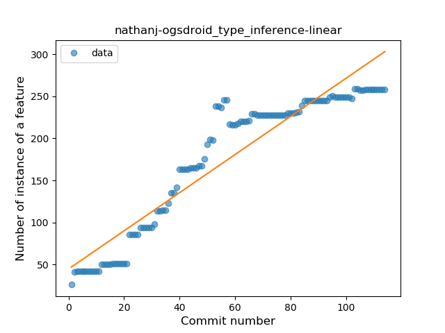

#### herbeth1u-VNDB-Android
* Feature: Type Inference
* Function: 
* R_Squared: 0.88335884
 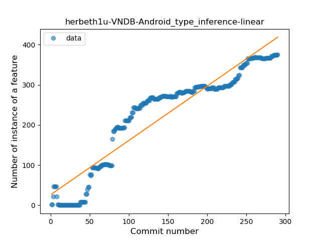

#### quarck-CalendarNotification
* Feature: Safe Call
* Function: 
* R_Squared: 0.88295604
 

#### SimpleMobileTools-Simple-Gallery
* Feature: String Template
* Function: 
* R_Squared: 0.8828492
 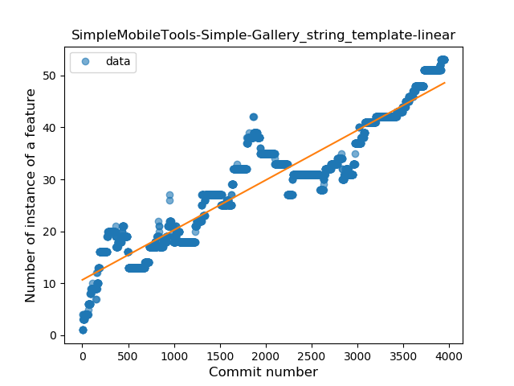

#### fossasia-open-event-android
* Feature: When expression
* Function: 
* R_Squared: 0.88222428
 

#### freedombox-team-android-app
* Feature: Type Inference
* Function: 
* R_Squared: 0.88196142
 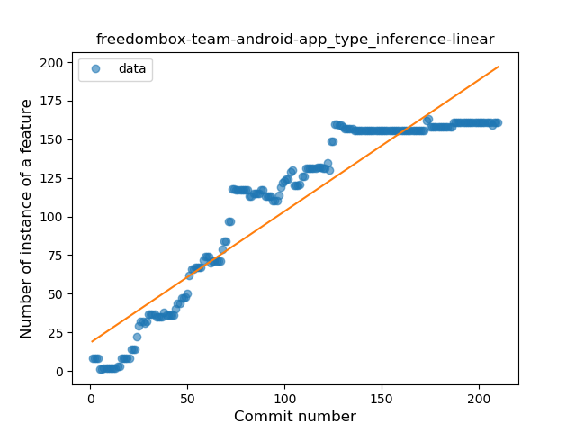

#### anthonycr-Lightning-Browser
* Feature: Singleton
* Function: 
* R_Squared: 0.88158608
 

#### shymmq-librus-client-kotlin
* Feature: Smart Cast
* Function: 
* R_Squared: 0.88114085
 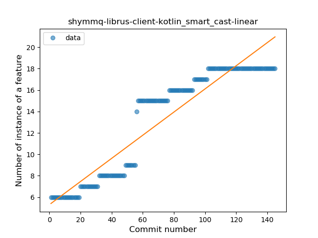

#### wuan-bo-android
* Feature: Lambda
* Function: 
* R_Squared: 0.88088576
 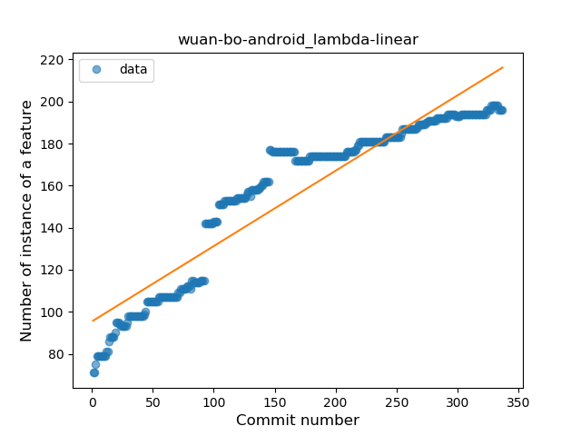

#### zoenb-log28
* Feature: Type Inference
* Function: 
* R_Squared: 0.88017114
 

#### Waboodoo-HTTP-Shortcuts
* Feature: When expression
* Function: 
* R_Squared: 0.87892128
 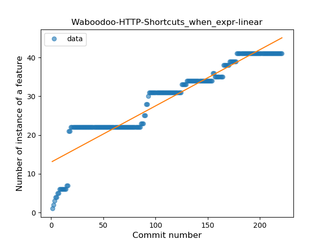

#### milosmns-Timecrypt
* Feature: Lambda
* Function: 
* R_Squared: 0.87863688
 

#### glodanif-BluetoothChat
* Feature: Function with Default Value
* Function: 
* R_Squared: 0.87812865
 

#### danvratil-FBEventSync
* Feature: Lambda
* Function: 
* R_Squared: 0.87664672
 

#### eurofurence-ef-app_android
* Feature: Singleton
* Function: 
* R_Squared: 0.87429566
 

#### grote-Transportr
* Feature: Safe Call
* Function: 
* R_Squared: 0.8739234
 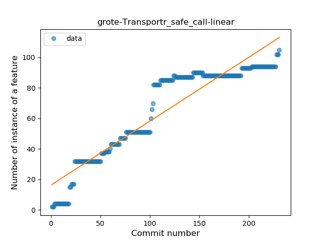

#### osmandapp-Osmand
* Feature: Safe Call
* Function: 
* R_Squared: 0.87319105
 

#### RocketChat-Rocket.Chat.Android
* Feature: Unsafe Call
* Function: 
* R_Squared: 0.87283065
 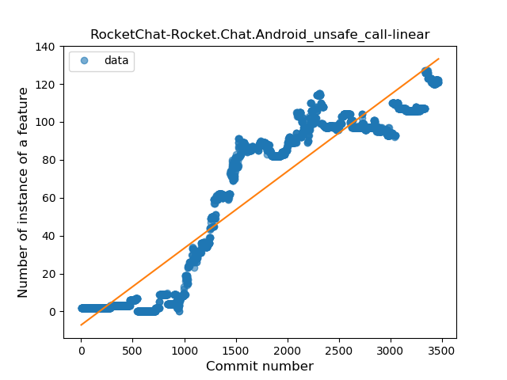

#### wuan-bo-android
* Feature: Safe Call
* Function: 
* R_Squared: 0.87262974
 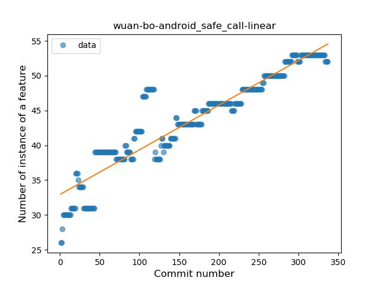

#### mjdenham-and-bible
* Feature: String Template
* Function: 
* R_Squared: 0.87234601
 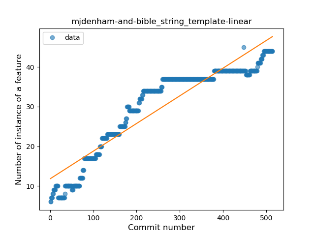

#### thermatk-FastHub-Libre
* Feature: When expression
* Function: 
* R_Squared: 0.87227071
 

#### nicorsm-S3-16-simone
* Feature: Safe Call
* Function: 
* R_Squared: 0.87190593
 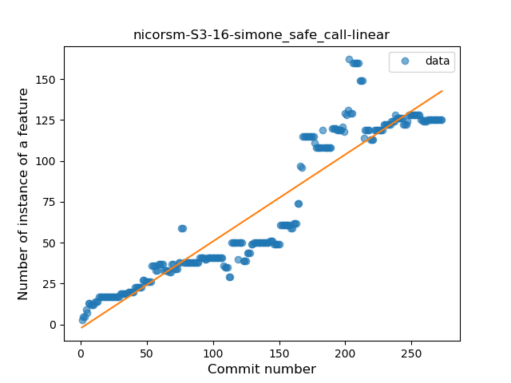

#### klassm-andFHEM
* Feature: When expression
* Function: 
* R_Squared: 0.87118421
 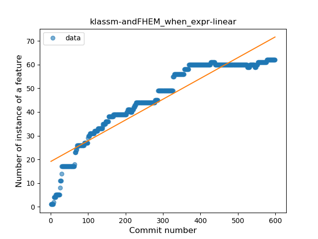

#### erickok-borefts2015
* Feature: Property Delegation
* Function: 
* R_Squared: 0.87092305
 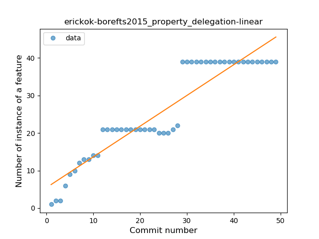

#### darshanparajuli-LogcatReader
* Feature: Function with Default Value
* Function: 
* R_Squared: 0.87076294
 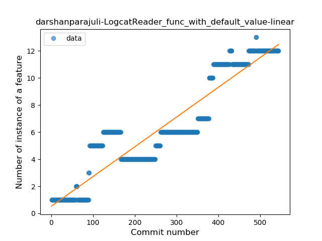

#### citiususc-calendula
* Feature: When expression
* Function: 
* R_Squared: 0.87029512
 

#### jeeb-mpv-android
* Feature: String Template
* Function: 
* R_Squared: 0.87003703
 

#### charlesmadere-smash-ranks-android
* Feature: String Template
* Function: 
* R_Squared: 0.86996774
 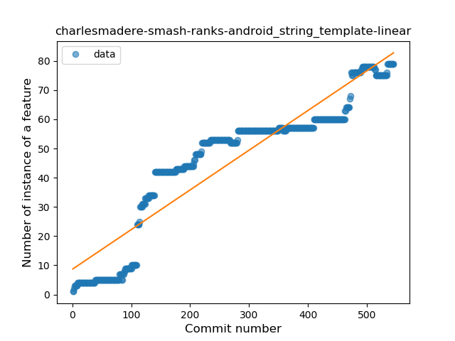

#### quarck-CalendarNotification
* Feature: Property Delegation
* Function: 
* R_Squared: 0.86917889
 

#### EventFahrplan-EventFahrplan
* Feature: String Template
* Function: 
* R_Squared: 0.86866951
 

#### LiMium-mini-vector-android
* Feature: Function with Default Value
* Function: 
* R_Squared: 0.86838103
 

#### nathanj-ogsdroid
* Feature: Data Class
* Function: 
* R_Squared: 0.86816582
 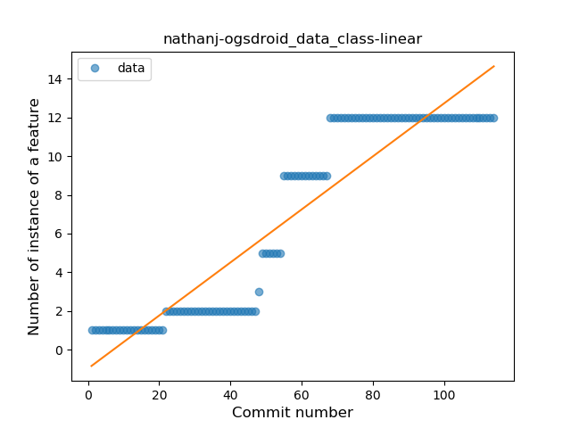

#### Maxr1998-MaxLock
* Feature: Singleton
* Function: 
* R_Squared: 0.86785067
 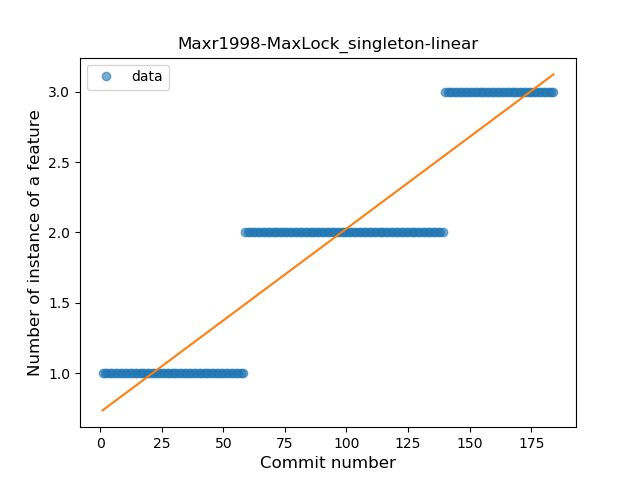

#### vector-im-riot-android
* Feature: Function with Default Value
* Function: 
* R_Squared: 0.86742915
 

#### FredJul-Flym
* Feature: When expression
* Function: 
* R_Squared: 0.86723768
 

#### ultrasonic-ultrasonic
* Feature: Function with Default Value
* Function: 
* R_Squared: 0.86699525
 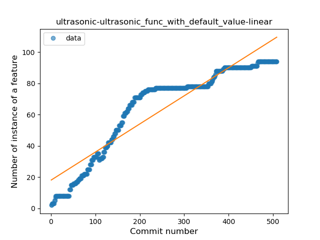

#### EventFahrplan-EventFahrplan
* Feature: Extension Function
* Function: 
* R_Squared: 0.86664713
 

#### nathanj-ogsdroid
* Feature: Companion Object
* Function: 
* R_Squared: 0.86508945
 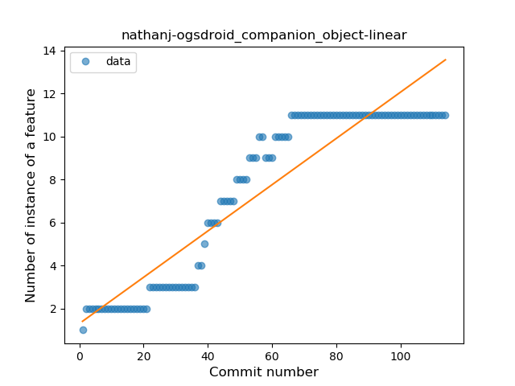

#### ligi-SurvivalManual
* Feature: Type Inference
* Function: 
* R_Squared: 0.86494776
 

#### romannurik-muzei
* Feature: Function call with Named Argument
* Function: 
* R_Squared: 0.86439589
 

#### blokadaorg-blokada
* Feature: Property Delegation
* Function: 
* R_Squared: 0.86402527
 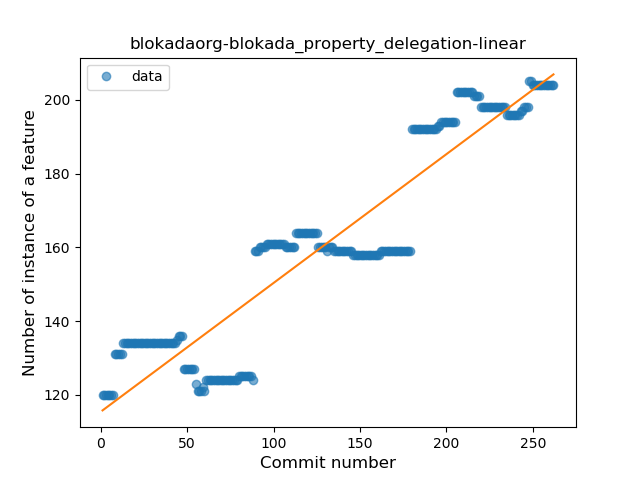

#### sjnyag-stamp
* Feature: Singleton
* Function: 
* R_Squared: 0.86317941
 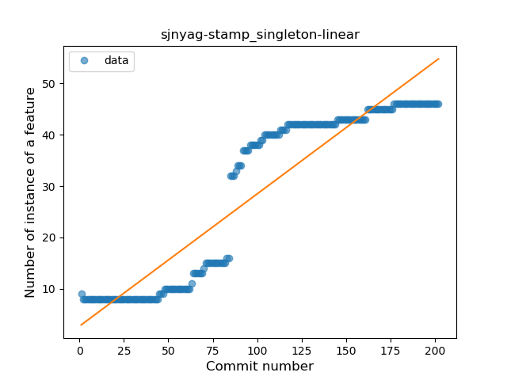

#### sjnyag-stamp
* Feature: Companion Object
* Function: 
* R_Squared: 0.86303182
 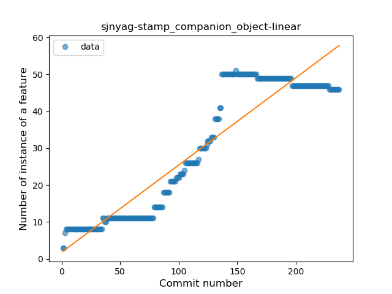

#### iskandergaba-Botanist
* Feature: Type Inference
* Function: 
* R_Squared: 0.86275034
 

#### nicorsm-S3-16-simone
* Feature: Type Inference
* Function: 
* R_Squared: 0.86272108
 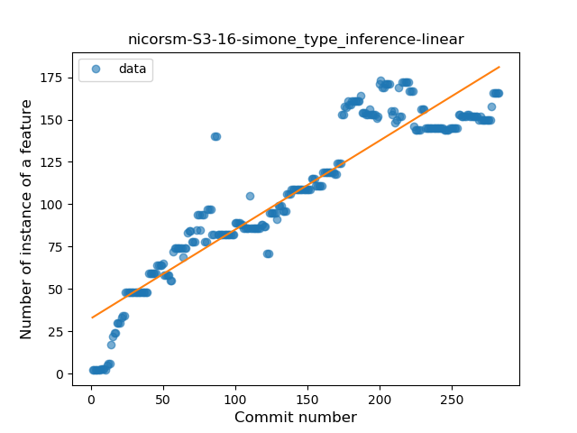

#### SimpleMobileTools-Simple-Calendar
* Feature: Extension Function
* Function: 
* R_Squared: 0.86206064
 

#### blastrock-kaqui
* Feature: Smart Cast
* Function: 
* R_Squared: 0.8616184
 

#### hyst329-OpenFool
* Feature: Function call with Named Argument
* Function: 
* R_Squared: 0.86097184
 

#### MGaetan89-ShowsRage
* Feature: Function with Default Value
* Function: 
* R_Squared: 0.86058248
 

#### michaelkourlas-voipms-sms-client
* Feature: Companion Object
* Function: 
* R_Squared: 0.85891158
 

#### eurofurence-ef-app_android
* Feature: Property Delegation
* Function: 
* R_Squared: 0.85872564
 

#### mpcjanssen-simpletask-android
* Feature: Singleton
* Function: 
* R_Squared: 0.85854991
 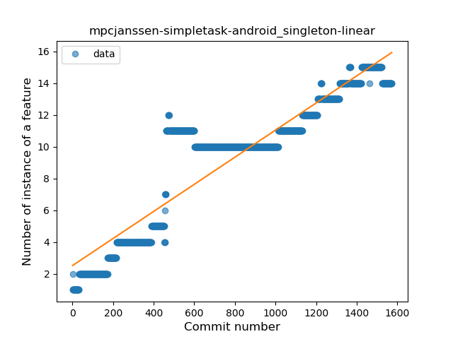

#### SimpleMobileTools-Simple-Gallery
* Feature: Unsafe Call
* Function: 
* R_Squared: 0.85780083
 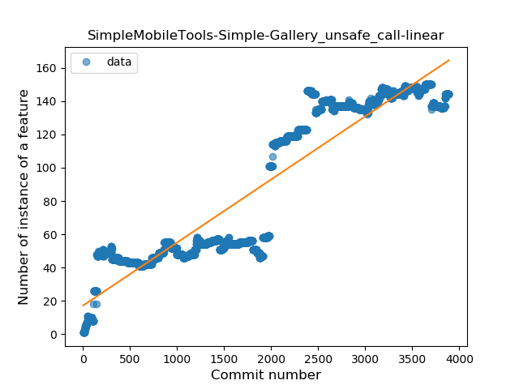

#### corphish-NightLight
* Feature: Lambda
* Function: 
* R_Squared: 0.85771629
 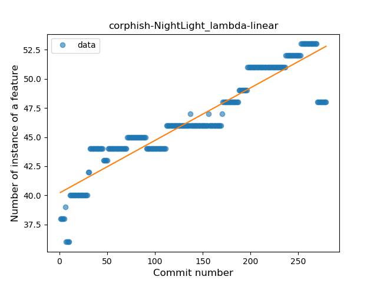

#### yshrsmz-monotweety
* Feature: Type Inference
* Function: 
* R_Squared: 0.8576276
 

#### SimpleMobileTools-Simple-Gallery
* Feature: Extension Function
* Function: 
* R_Squared: 0.85749391
 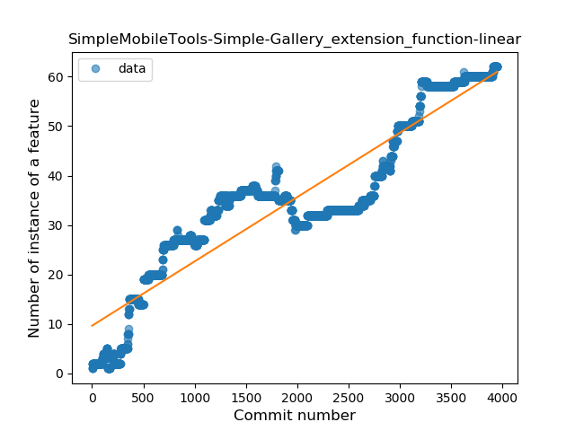

#### pacien-tincapp
* Feature: Function call with Named Argument
* Function: 
* R_Squared: 0.85709676
 

#### marcelgross90-Cineaste
* Feature: Lambda
* Function: 
* R_Squared: 0.85709258
 

#### charlesmadere-smash-ranks-android
* Feature: Data Class
* Function: 
* R_Squared: 0.85642436
 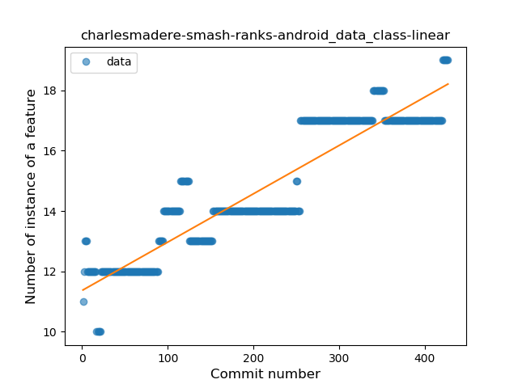

#### tuskyapp-Tusky
* Feature: Smart Cast
* Function: 
* R_Squared: 0.85573793
 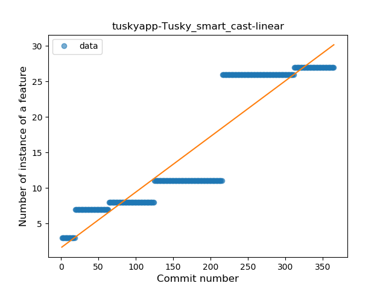

#### anthonycr-Lightning-Browser
* Feature: When expression
* Function: 
* R_Squared: 0.85558196
 

#### AllanWang-Frost-for-Facebook
* Feature: Function call with Named Argument
* Function: 
* R_Squared: 0.85537861
 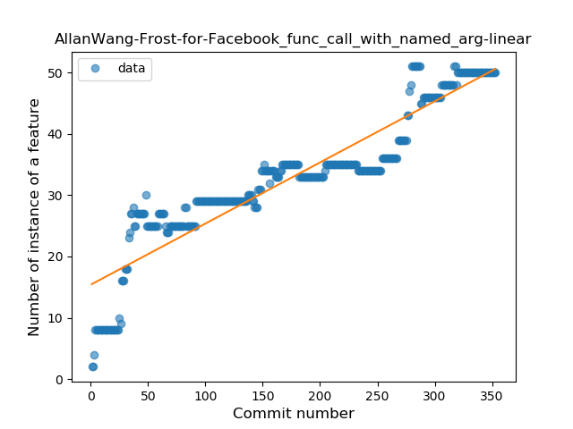

#### Doctoror-ParticleConstellationsLiveWallpaper
* Feature: Smart Cast
* Function: 
* R_Squared: 0.85519403
 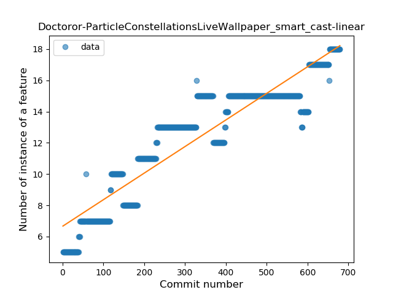

#### includex-LineageWatcher
* Feature: Safe Call
* Function: 
* R_Squared: 0.85449438
 

#### Doctoror-ParticleConstellationsLiveWallpaper
* Feature: Function with Default Value
* Function: 
* R_Squared: 0.85429764
 

#### ligi-gobandroid
* Feature: String Template
* Function: 
* R_Squared: 0.85419765
 

#### SimpleMobileTools-Simple-Calendar
* Feature: Safe Call
* Function: 
* R_Squared: 0.85314434
 

#### emansih-FireflyMobile
* Feature: Range Expression
* Function: 
* R_Squared: 0.85312427
 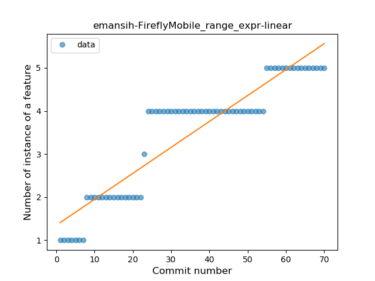

#### DSteve595-Put.io
* Feature: Function call with Named Argument
* Function: 
* R_Squared: 0.85287425
 

#### veniosg-JustSearch
* Feature: Lambda
* Function: 
* R_Squared: 0.85190214
 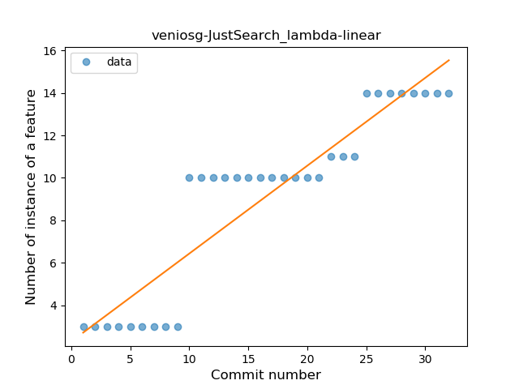

#### mecid-BakuBus
* Feature: Lambda
* Function: 
* R_Squared: 0.8513807
 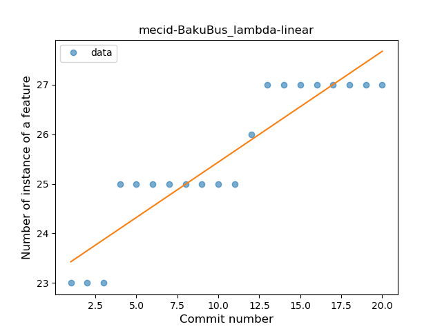

#### joan-domingo-Podcasts-RAC1-Android
* Feature: Lambda
* Function: 
* R_Squared: 0.85123819
 

#### romannurik-muzei
* Feature: When expression
* Function: 
* R_Squared: 0.85101341
 

#### raatmarien-red-moon
* Feature: Safe Call
* Function: 
* R_Squared: 0.85066142
 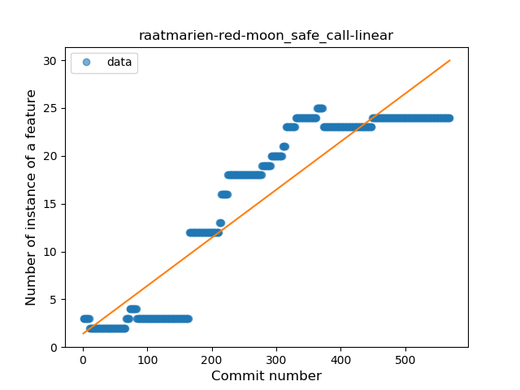

#### DSteve595-Put.io
* Feature: Property Delegation
* Function: 
* R_Squared: 0.85045441
 

#### spacecowboy-Feeder
* Feature: Data Class
* Function: 
* R_Squared: 0.85004823
 

#### charlesmadere-smash-ranks-android
* Feature: Lambda
* Function: 
* R_Squared: 0.85001654
 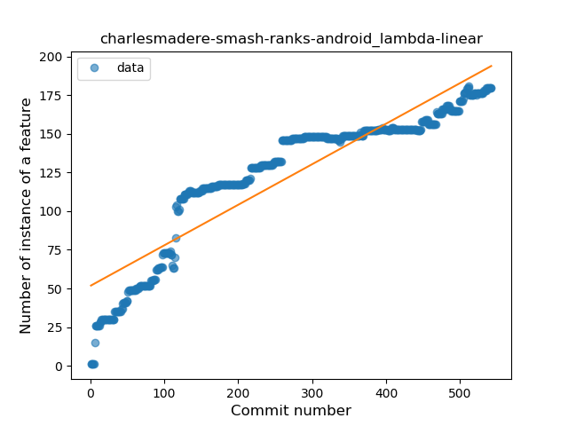

#### chrsep-Kingfish
* Feature: Lambda
* Function: 
* R_Squared: 0.84991711
 

#### shymmq-librus-client-kotlin
* Feature: String Template
* Function: 
* R_Squared: 0.84940386
 

#### TwidereProject-Twidere-Android
* Feature: Property Delegation
* Function: 
* R_Squared: 0.84908091
 

#### SimpleMobileTools-Simple-Camera
* Feature: Type Inference
* Function: 
* R_Squared: 0.84883894
 

#### apiote-Bimba
* Feature: When expression
* Function: 
* R_Squared: 0.84819707
 

#### MGaetan89-ShowsRage
* Feature: Safe Call
* Function: 
* R_Squared: 0.84765271
 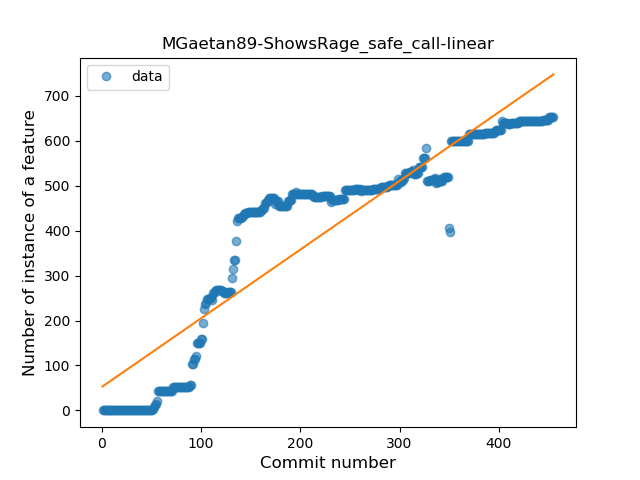

#### duckduckgo-Android
* Feature: Singleton
* Function: 
* R_Squared: 0.84757364
 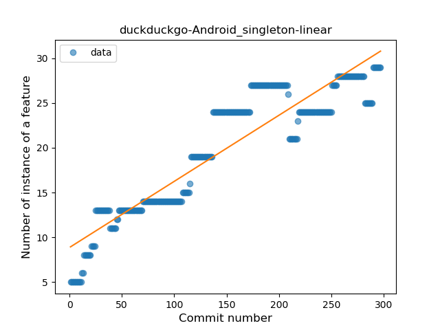

#### esafirm-android-playground
* Feature: Companion Object
* Function: 
* R_Squared: 0.84744246
 

#### physphil-UnitConverterUltimate
* Feature: Type Inference
* Function: 
* R_Squared: 0.84657191
 

#### ohmae-DmsExplorer
* Feature: Singleton
* Function: 
* R_Squared: 0.84645266
 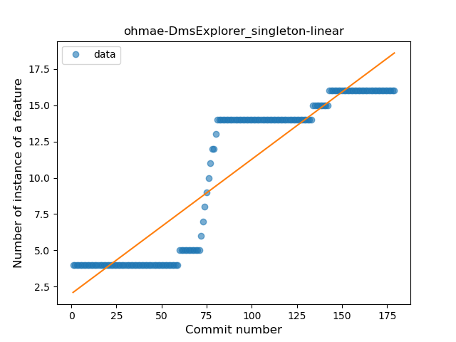

#### mpcjanssen-simpletask-android
* Feature: Lambda
* Function: 
* R_Squared: 0.84567985
 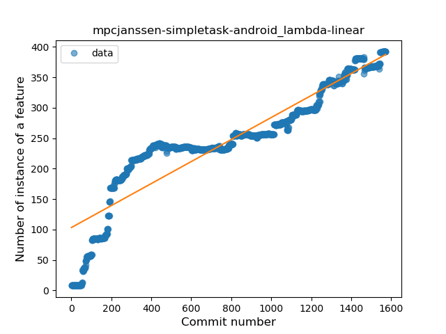

#### pacien-tincapp
* Feature: Property Delegation
* Function: 
* R_Squared: 0.8452788
 

#### orgzly-orgzly-android
* Feature: Function with Default Value
* Function: 
* R_Squared: 0.84457825
 

#### sriharshaarangi-BatteryChargeLimit
* Feature: Unsafe Call
* Function: 
* R_Squared: 0.84453373
 

#### ohmae-VoiceMessageBoard
* Feature: Lambda
* Function: 
* R_Squared: 0.84398617
 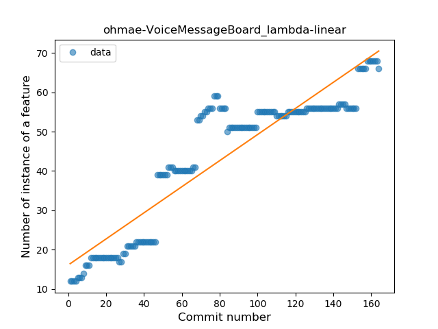

#### k9mail-k-9
* Feature: Unsafe Call
* Function: 
* R_Squared: 0.84385498
 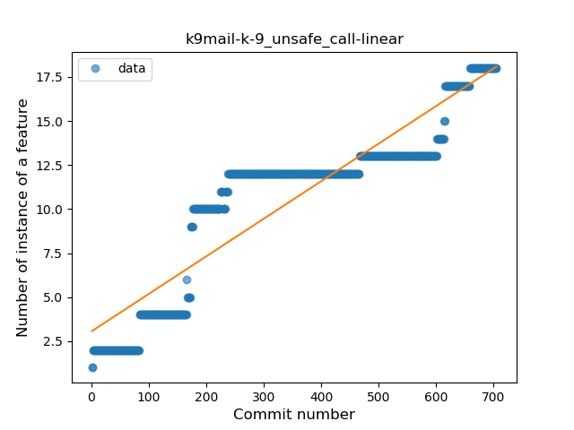

#### abertschi-ad-free
* Feature: Unsafe Call
* Function: 
* R_Squared: 0.8434046
 

#### romannurik-muzei
* Feature: String Template
* Function: 
* R_Squared: 0.84318544
 

#### BijoySingh-Material-Notes-Android-App
* Feature: Range Expression
* Function: 
* R_Squared: 0.84293444
 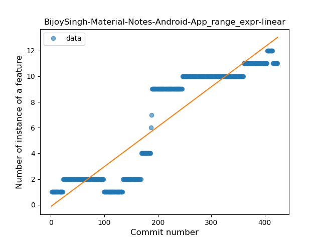

#### LiMium-mini-vector-android
* Feature: String Template
* Function: 
* R_Squared: 0.84133952
 

#### SpiritCroc-DefaultDarkTheme-oms
* Feature: Lambda
* Function: 
* R_Squared: 0.84100432
 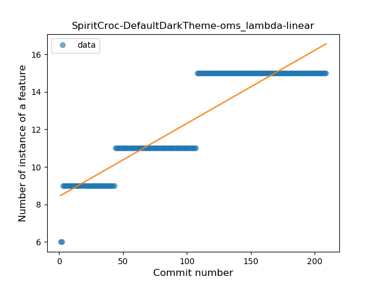

#### DSteve595-Put.io
* Feature: Function with Default Value
* Function: 
* R_Squared: 0.84033836
 

#### ultrasonic-ultrasonic
* Feature: Extension Function
* Function: 
* R_Squared: 0.84002305
 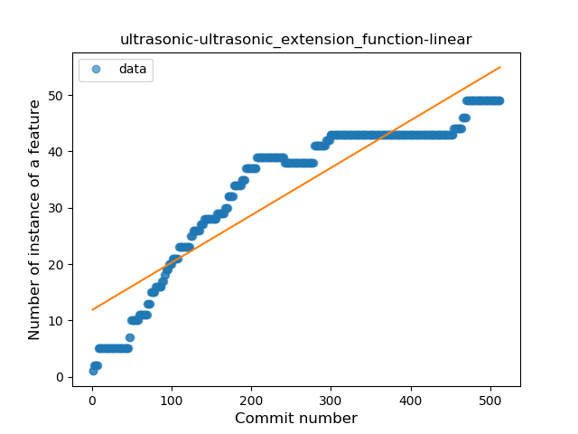

#### spacecowboy-Feeder
* Feature: Function with Default Value
* Function: 
* R_Squared: 0.83936954
 

#### EventFahrplan-EventFahrplan
* Feature: Function with Default Value
* Function: 
* R_Squared: 0.83885167
 

#### ykrank-S1-Next
* Feature: Singleton
* Function: 
* R_Squared: 0.83805648
 

#### tasomaniac-OpenLinkWith
* Feature: Type Inference
* Function: 
* R_Squared: 0.83770528
 

#### SimpleMobileTools-Simple-Draw
* Feature: Safe Call
* Function: 
* R_Squared: 0.83668277
 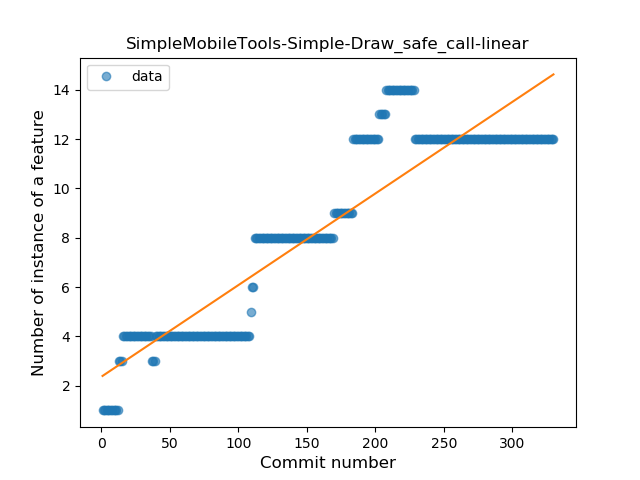

#### xgouchet-Stanley
* Feature: Extension Function
* Function: 
* R_Squared: 0.83628567
 

#### Gark-bassblog_kotlin
* Feature: Type Inference
* Function: 
* R_Squared: 0.83606957
 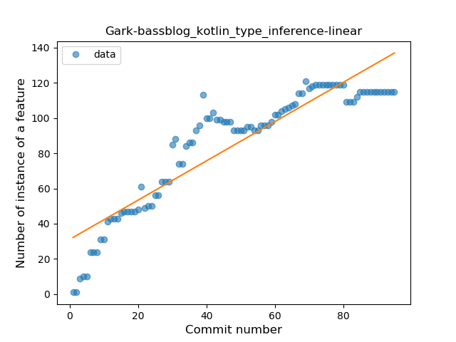

#### mastizada-focus-android
* Feature: Safe Call
* Function: 
* R_Squared: 0.83571638
 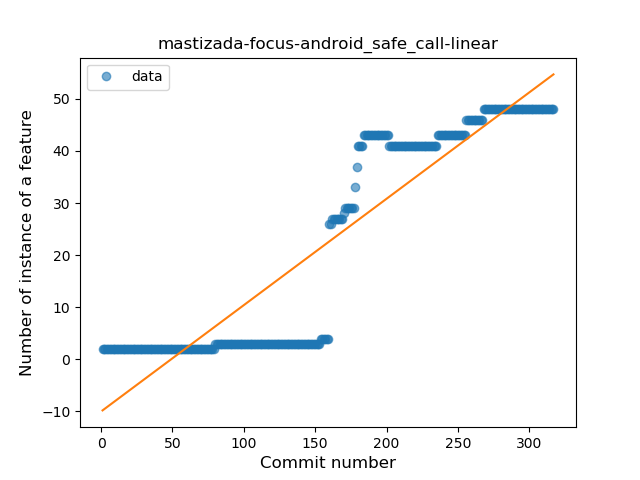

#### albertolalanda-new-ultrasonic-fork-for-MyMusicQoE
* Feature: Function with Default Value
* Function: 
* R_Squared: 0.83550355
 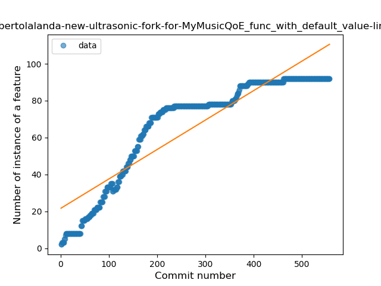

#### osmandapp-Osmand
* Feature: Smart Cast
* Function: 
* R_Squared: 0.83504464
 

#### SimpleMobileTools-Simple-App-Launcher
* Feature: Lambda
* Function: 
* R_Squared: 0.83496938
 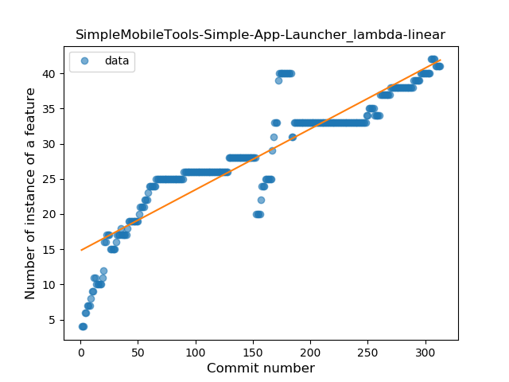

#### proxer-ProxerAndroid
* Feature: Function with Default Value
* Function: 
* R_Squared: 0.83485394
 

#### SimpleMobileTools-Simple-Contacts
* Feature: Function with Default Value
* Function: 
* R_Squared: 0.83485365
 

#### jereksel-Bucket
* Feature: Function with Default Value
* Function: 
* R_Squared: 0.83462651
 

#### jeeb-mpv-android
* Feature: When expression
* Function: 
* R_Squared: 0.83405412
 

#### freedombox-team-android-app
* Feature: Unsafe Call
* Function: 
* R_Squared: 0.83367488
 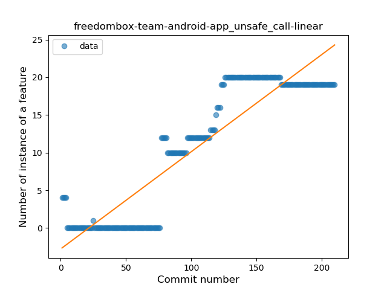

#### carlphilipp-chicago-commutes
* Feature: Data Class
* Function: 
* R_Squared: 0.8331883
 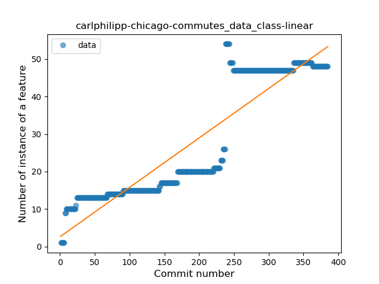

#### darshanparajuli-LogcatReader
* Feature: Singleton
* Function: 
* R_Squared: 0.83224628
 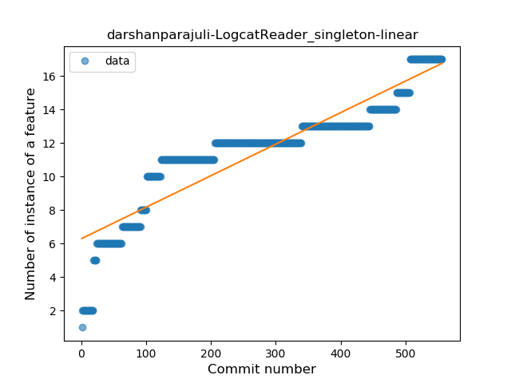

#### bitfireAT-davdroid
* Feature: Range Expression
* Function: 
* R_Squared: 0.83188299
 

#### vector-im-riot-android
* Feature: String Template
* Function: 
* R_Squared: 0.83109924
 

#### AllanWang-Frost-for-Facebook
* Feature: Destructuring Declaration
* Function: 
* R_Squared: 0.83060873
 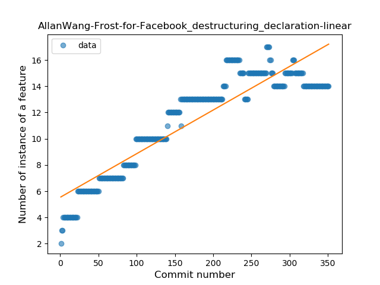

#### aminecmi-ReaderforSelfoss
* Feature: String Template
* Function: 
* R_Squared: 0.83053231
 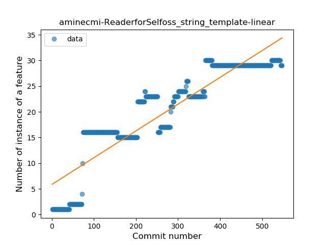

#### anthonycr-Lightning-Browser
* Feature: Function call with Named Argument
* Function: 
* R_Squared: 0.8301288
 

#### enjoyingfoss-om
* Feature: Type Inference
* Function: 
* R_Squared: 0.82967494
 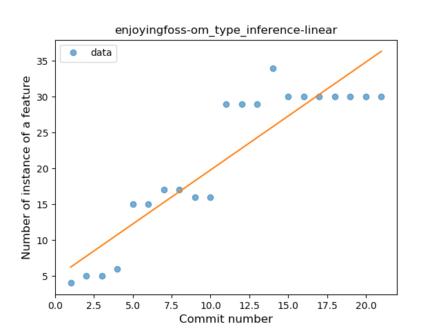

#### jereksel-Bucket
* Feature: Safe Call
* Function: 
* R_Squared: 0.82877148
 

#### SimpleMobileTools-Simple-Calendar
* Feature: Data Class
* Function: 
* R_Squared: 0.82814256
 

#### apiote-Bimba
* Feature: Type Inference
* Function: 
* R_Squared: 0.82796011
 

#### LaurentTreguier-deck
* Feature: Type Inference
* Function: 
* R_Squared: 0.82788175
 

#### glodanif-BluetoothChat
* Feature: Data Class
* Function: 
* R_Squared: 0.82744132
 

#### herbeth1u-VNDB-Android
* Feature: Data Class
* Function: 
* R_Squared: 0.82690325
 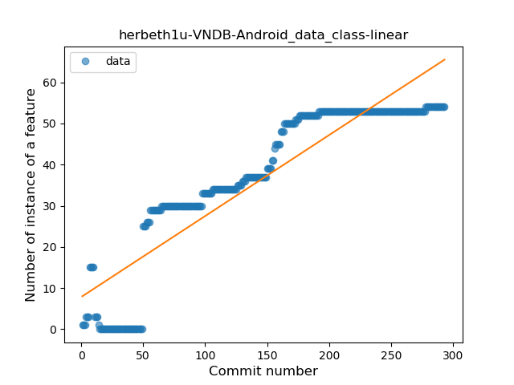

#### RocketChat-Rocket.Chat.Android
* Feature: Property Delegation
* Function: 
* R_Squared: 0.82661576
 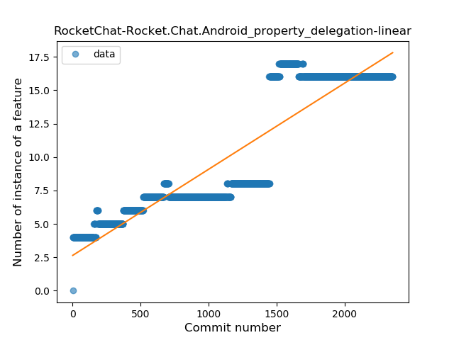

#### mjdenham-and-bible
* Feature: Data Class
* Function: 
* R_Squared: 0.82660609
 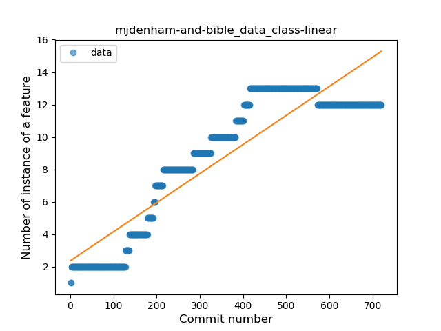

#### michaelkourlas-voipms-sms-client
* Feature: Function with Default Value
* Function: 
* R_Squared: 0.82592436
 

#### sriharshaarangi-BatteryChargeLimit
* Feature: Lambda
* Function: 
* R_Squared: 0.82584662
 

#### mpcjanssen-simpletask-android
* Feature: When expression
* Function: 
* R_Squared: 0.82566799
 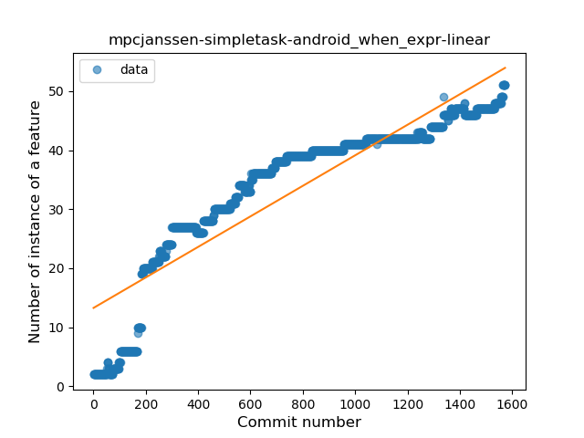

#### SimpleMobileTools-Simple-Camera
* Feature: Safe Call
* Function: 
* R_Squared: 0.82502361
 

#### mastizada-focus-android
* Feature: Extension Function
* Function: 
* R_Squared: 0.82359838
 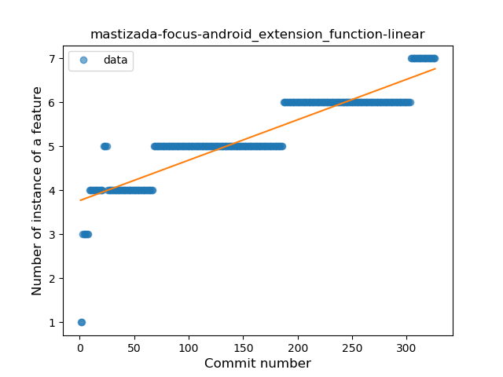

#### Apolline-Lille-apolline-android
* Feature: Safe Call
* Function: 
* R_Squared: 0.82266165
 

#### devmil-PaperLaunch
* Feature: When expression
* Function: 
* R_Squared: 0.82159791
 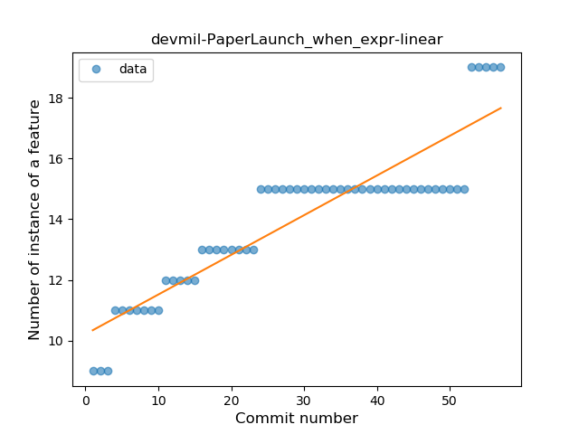

#### yshrsmz-monotweety
* Feature: Lambda
* Function: 
* R_Squared: 0.82157283
 

#### LawnchairLauncher-Lawnchair
* Feature: Companion Object
* Function: 
* R_Squared: 0.82066186
 

#### herbeth1u-VNDB-Android
* Feature: Range Expression
* Function: 
* R_Squared: 0.82028771
 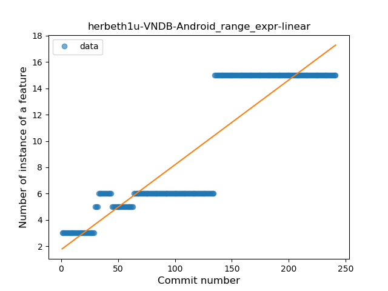

#### wuan-bo-android
* Feature: Companion Object
* Function: 
* R_Squared: 0.81974399
 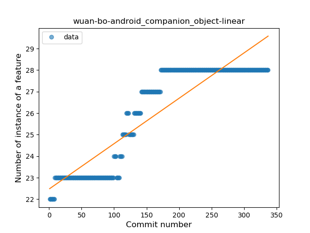

#### grote-Transportr
* Feature: Extension Function
* Function: 
* R_Squared: 0.81965942
 

#### sriharshaarangi-BatteryChargeLimit
* Feature: String Template
* Function: 
* R_Squared: 0.81933521
 

#### SimpleMobileTools-Simple-Camera
* Feature: Unsafe Call
* Function: 
* R_Squared: 0.81822305
 

#### PaulWoitaschek-Voice
* Feature: Lambda
* Function: 
* R_Squared: 0.81730878
 

#### aminecmi-ReaderforSelfoss
* Feature: When expression
* Function: 
* R_Squared: 0.81684383
 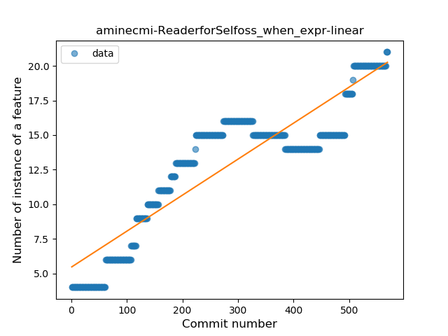

#### vector-im-riot-android
* Feature: Smart Cast
* Function: 
* R_Squared: 0.81596215
 

#### fossasia-open-event-android
* Feature: Function call with Named Argument
* Function: 
* R_Squared: 0.81548469
 

#### chrsep-Kingfish
* Feature: Type Inference
* Function: 
* R_Squared: 0.81544589
 

#### hypeapps-episodie
* Feature: String Template
* Function: 
* R_Squared: 0.81479938
 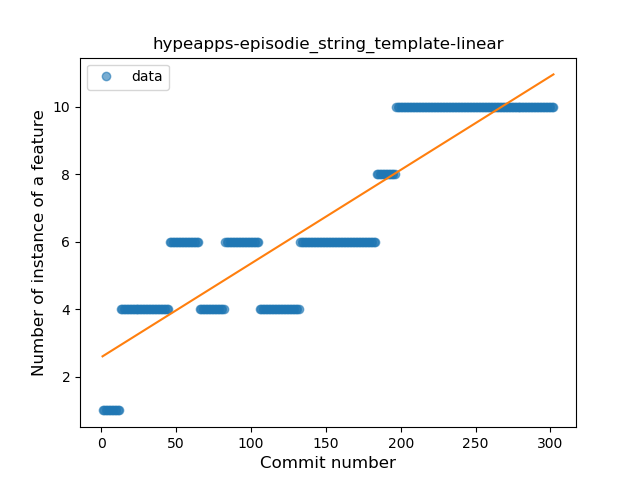

#### MrBIMC-RunInBackgroundPermissionSetter
* Feature: Lambda
* Function: 
* R_Squared: 0.81322453
 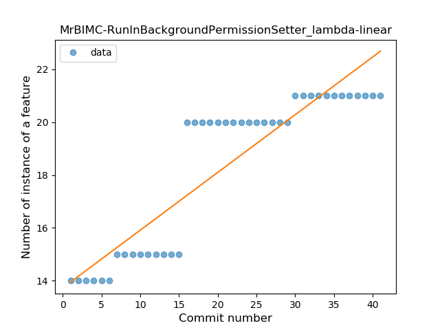

#### iPoli-iPoli-android
* Feature: Overloaded Operator
* Function: 
* R_Squared: 0.81175519
 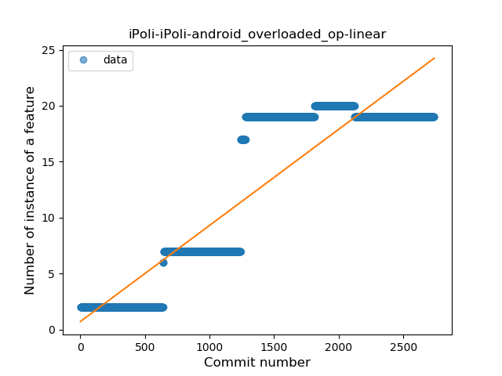

#### vector-im-riot-android
* Feature: Companion Object
* Function: 
* R_Squared: 0.81051645
 

#### juha-h-baresip-studio
* Feature: When expression
* Function: 
* R_Squared: 0.80971465
 

#### sjnyag-stamp
* Feature: When expression
* Function: 
* R_Squared: 0.80927181
 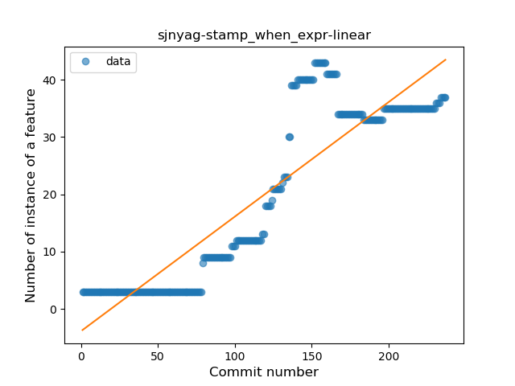

#### ccomeaux-boardgamegeek4android
* Feature: Inline Function
* Function: 
* R_Squared: 0.80917952
 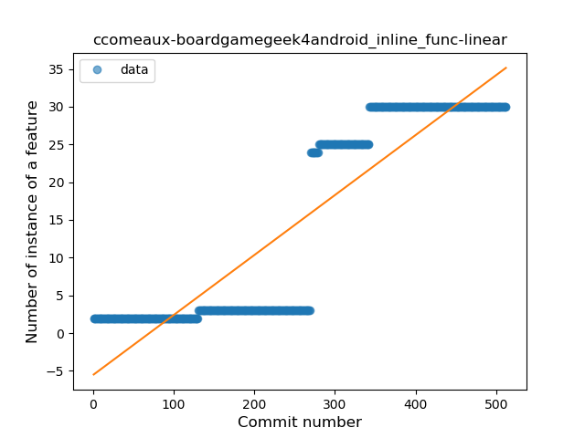

#### FredJul-Flym
* Feature: Function call with Named Argument
* Function: 
* R_Squared: 0.80796876
 

#### eurofurence-ef-app_android
* Feature: Inline Function
* Function: 
* R_Squared: 0.80615877
 

#### nibarius-opera-park-android
* Feature: Companion Object
* Function: 
* R_Squared: 0.80596902
 

#### osmandapp-Osmand
* Feature: Singleton
* Function: 
* R_Squared: 0.8046949
 

#### romannurik-muzei
* Feature: Extension Function
* Function: 
* R_Squared: 0.80404671
 

#### duckduckgo-Android
* Feature: Inline Function
* Function: 
* R_Squared: 0.80398774
 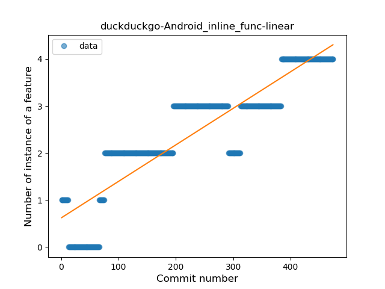

#### charlesmadere-smash-ranks-android
* Feature: When expression
* Function: 
* R_Squared: 0.80385167
 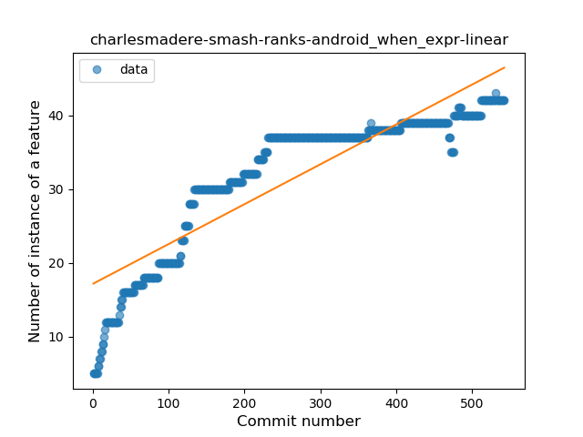

#### romannurik-muzei
* Feature: Safe Call
* Function: 
* R_Squared: 0.80317334
 

#### Valodim-Stratum0Widget
* Feature: Type Inference
* Function: 
* R_Squared: 0.80156683
 

#### mjdenham-and-bible
* Feature: Unsafe Call
* Function: 
* R_Squared: 0.80084217
 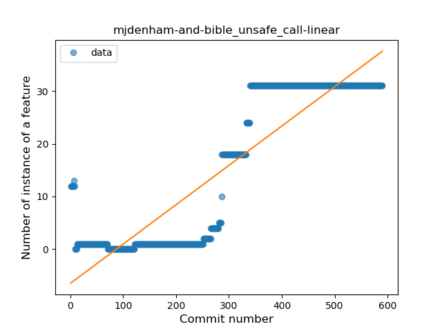

#### SimpleMobileTools-Simple-Calendar
* Feature: Function with Default Value
* Function: 
* R_Squared: 0.80019412
 

#### proxer-ProxerAndroid
* Feature: Companion Object
* Function: 
* R_Squared: 0.79880151
 

#### walleth-walleth
* Feature: Smart Cast
* Function: 
* R_Squared: 0.7977013
 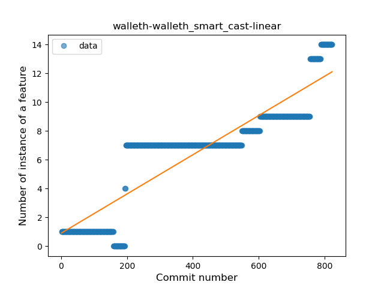

#### tuskyapp-Tusky
* Feature: Data Class
* Function: 
* R_Squared: 0.79756053
 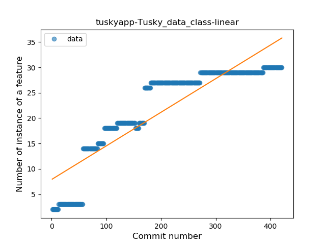

#### raatmarien-red-moon
* Feature: Property Delegation
* Function: 
* R_Squared: 0.79721638
 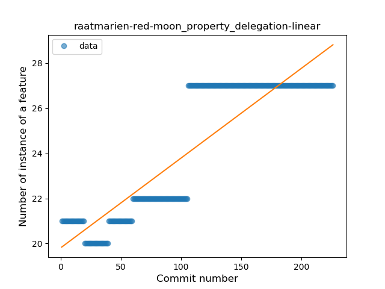

#### ultrasonic-ultrasonic
* Feature: Lambda
* Function: 
* R_Squared: 0.79720759
 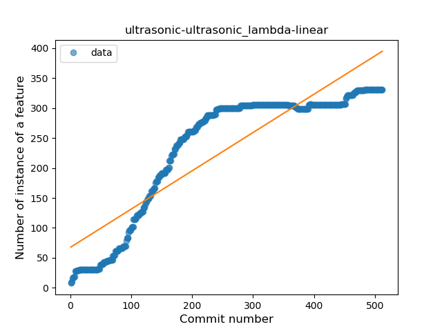

#### CypherpunkArmory-UserLAnd
* Feature: Companion Object
* Function: 
* R_Squared: 0.79568486
 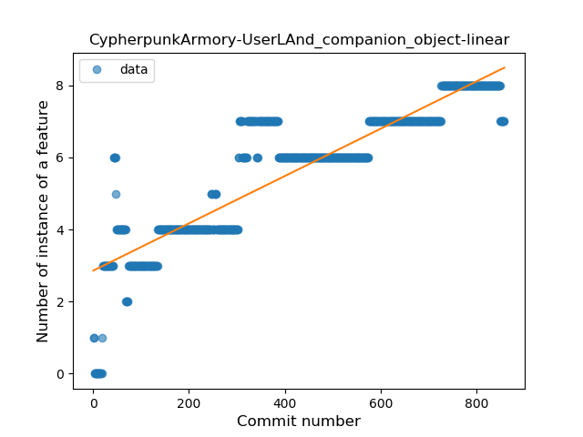

#### klassm-andFHEM
* Feature: Smart Cast
* Function: 
* R_Squared: 0.79564791
 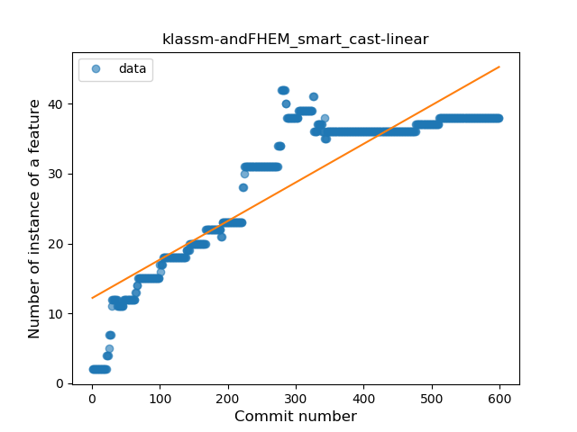

#### LiMium-mini-vector-android
* Feature: Type Inference
* Function: 
* R_Squared: 0.79544738
 

#### ohmae-DmsExplorer
* Feature: Safe Call
* Function: 
* R_Squared: 0.7937905
 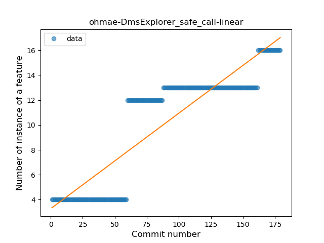

#### premnirmal-StockTicker
* Feature: Extension Function
* Function: 
* R_Squared: 0.7931301
 

#### Mygod-VPNHotspot
* Feature: Singleton
* Function: 
* R_Squared: 0.79211093
 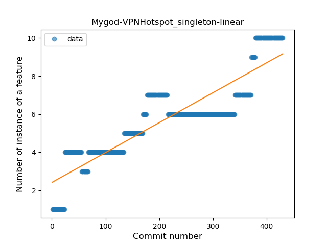

#### charlesmadere-smash-ranks-android
* Feature: Function call with Named Argument
* Function: 
* R_Squared: 0.79192227
 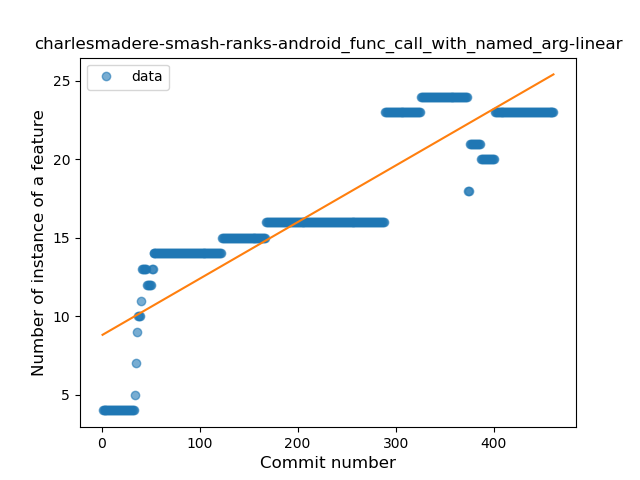

#### carlphilipp-chicago-commutes
* Feature: Companion Object
* Function: 
* R_Squared: 0.79029859
 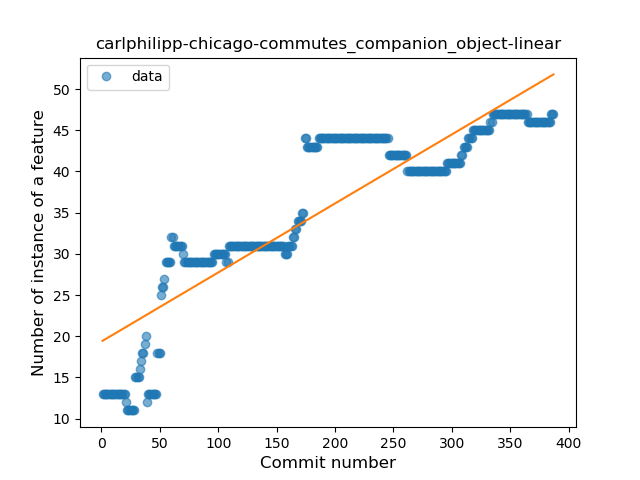

#### ofalvai-BPInfo
* Feature: Type Inference
* Function: 
* R_Squared: 0.78986308
 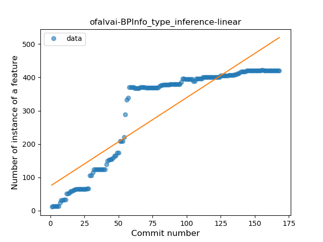

#### citiususc-calendula
* Feature: Companion Object
* Function: 
* R_Squared: 0.78677317
 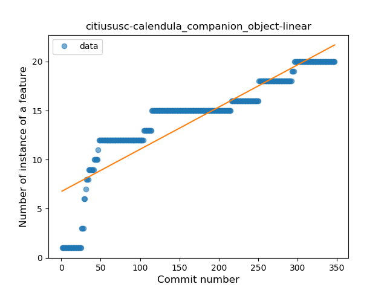

#### yshrsmz-monotweety
* Feature: Unsafe Call
* Function: 
* R_Squared: 0.78671205
 

#### SimpleMobileTools-Simple-Notes
* Feature: Type Inference
* Function: 
* R_Squared: 0.78552523
 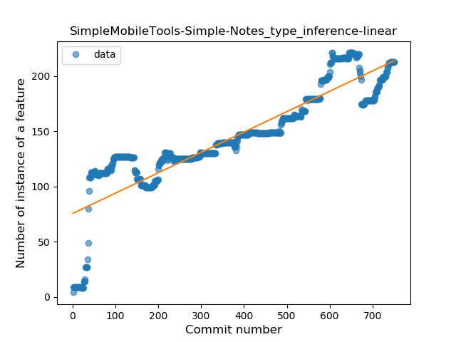

#### milosmns-Timecrypt
* Feature: Function with Default Value
* Function: 
* R_Squared: 0.7845357
 

#### yshrsmz-monotweety
* Feature: Data Class
* Function: 
* R_Squared: 0.78440059
 

#### moko256-twitlatte
* Feature: Destructuring Declaration
* Function: 
* R_Squared: 0.78122248
 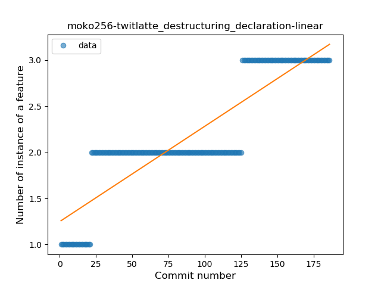

#### Maxr1998-MaxLock
* Feature: Unsafe Call
* Function: 
* R_Squared: 0.78088257
 

#### proxer-ProxerAndroid
* Feature: Smart Cast
* Function: 
* R_Squared: 0.78084229
 

#### danvratil-FBEventSync
* Feature: Companion Object
* Function: 
* R_Squared: 0.78009817
 

#### orgzly-orgzly-android
* Feature: Safe Call
* Function: 
* R_Squared: 0.77864413
 

#### ultrasonic-ultrasonic
* Feature: Property Delegation
* Function: 
* R_Squared: 0.77839679
 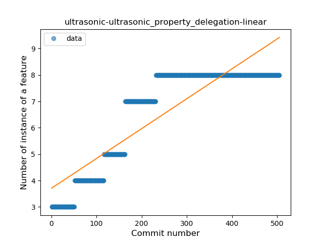

#### freedombox-team-android-app
* Feature: String Template
* Function: 
* R_Squared: 0.77808528
 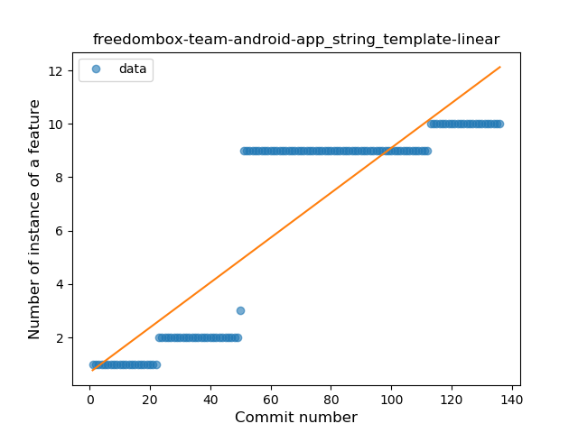

#### LawnchairLauncher-Lawnchair
* Feature: Safe Call
* Function: 
* R_Squared: 0.77693172
 

#### ultrasonic-ultrasonic
* Feature: String Template
* Function: 
* R_Squared: 0.77667055
 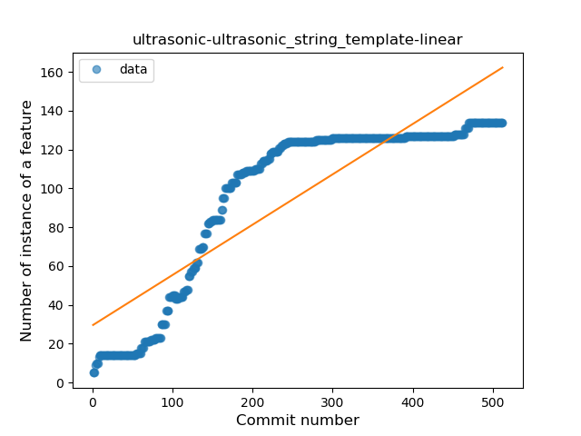

#### equeim-tremotesf-android
* Feature: Range Expression
* Function: 
* R_Squared: 0.77383069
 

#### PaulWoitaschek-Voice
* Feature: Type Inference
* Function: 
* R_Squared: 0.77254057
 

#### milosmns-Timecrypt
* Feature: Unsafe Call
* Function: 
* R_Squared: 0.77132806
 

#### ccomeaux-boardgamegeek4android
* Feature: Destructuring Declaration
* Function: 
* R_Squared: 0.76463334
 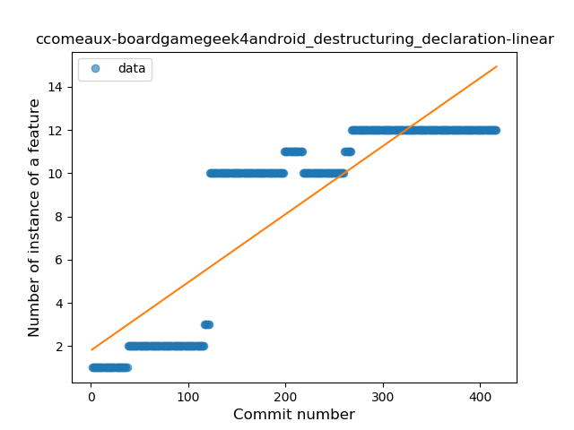

#### orgzly-orgzly-android
* Feature: String Template
* Function: 
* R_Squared: 0.76392587
 

#### NyaaPantsu-NyaaPantsu-android-app
* Feature: When expression
* Function: 
* R_Squared: 0.76331307
 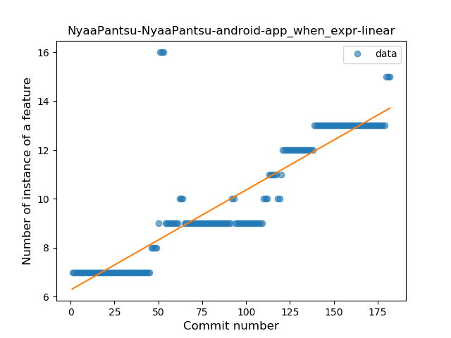

#### yshrsmz-monotweety
* Feature: Companion Object
* Function: 
* R_Squared: 0.76309238
 

#### juha-h-baresip-studio
* Feature: String Template
* Function: 
* R_Squared: 0.76216435
 

#### pacien-tincapp
* Feature: String Template
* Function: 
* R_Squared: 0.75994141
 

#### anthonycr-Lightning-Browser
* Feature: String Template
* Function: 
* R_Squared: 0.75959651
 

#### joan-domingo-Podcasts-RAC1-Android
* Feature: Companion Object
* Function: 
* R_Squared: 0.75941829
 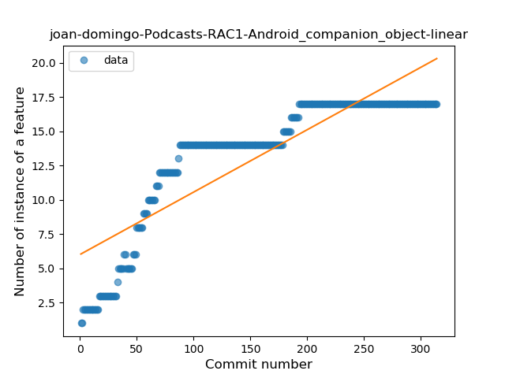

#### anthonycr-Lightning-Browser
* Feature: Companion Object
* Function: 
* R_Squared: 0.75873562
 

#### chrsep-Kingfish
* Feature: Function with Default Value
* Function: 
* R_Squared: 0.75793512
 

#### michaelkourlas-voipms-sms-client
* Feature: When expression
* Function: 
* R_Squared: 0.75771938
 

#### apoi-quickbeer-android
* Feature: Smart Cast
* Function: 
* R_Squared: 0.75765766
 

#### ligi-gobandroid
* Feature: Singleton
* Function: 
* R_Squared: 0.75745223
 

#### PaulWoitaschek-Voice
* Feature: Extension Function
* Function: 
* R_Squared: 0.75717823
 

#### apiote-Bimba
* Feature: Data Class
* Function: 
* R_Squared: 0.75527578
 

#### duckduckgo-Android
* Feature: Property Delegation
* Function: 
* R_Squared: 0.75391849
 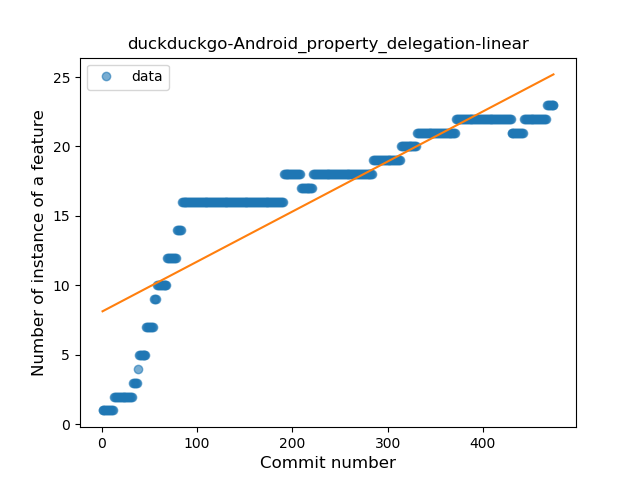

#### herbeth1u-VNDB-Android
* Feature: Function call with Named Argument
* Function: 
* R_Squared: 0.75326712
 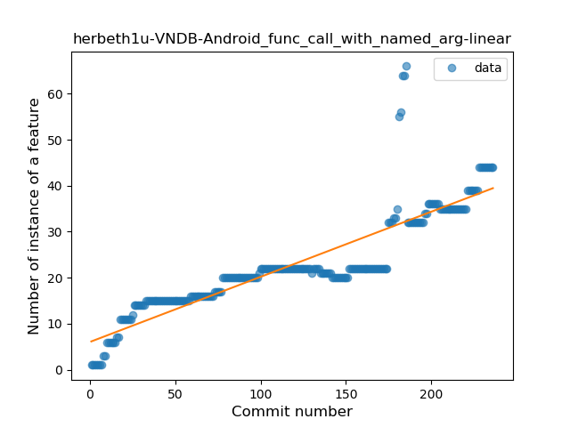

#### pacien-tincapp
* Feature: Unsafe Call
* Function: 
* R_Squared: 0.74941673
 

#### pflammertsma-cryptogram
* Feature: Safe Call
* Function: 
* R_Squared: 0.74864384
 

#### sjnyag-stamp
* Feature: Destructuring Declaration
* Function: 
* R_Squared: 0.74697342
 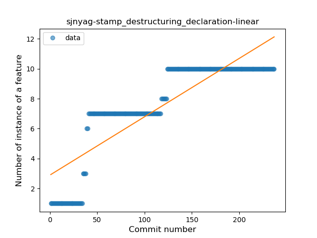

#### albertolalanda-new-ultrasonic-fork-for-MyMusicQoE
* Feature: Extension Function
* Function: 
* R_Squared: 0.7449885
 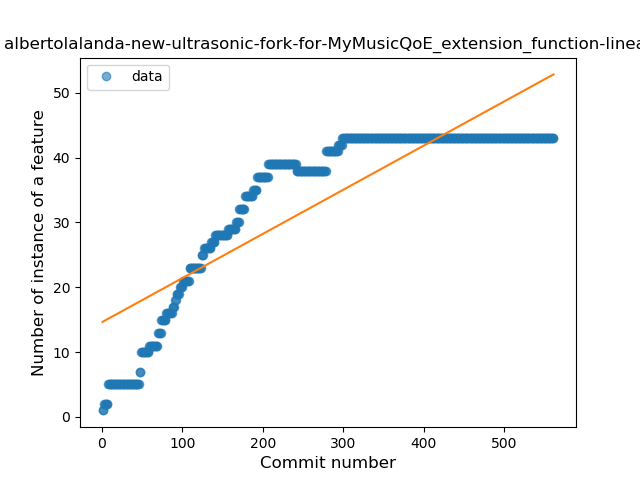

#### ultrasonic-ultrasonic
* Feature: Function call with Named Argument
* Function: 
* R_Squared: 0.74437471
 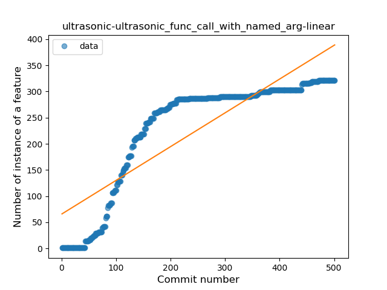

#### hypeapps-episodie
* Feature: Range Expression
* Function: 
* R_Squared: 0.74429464
 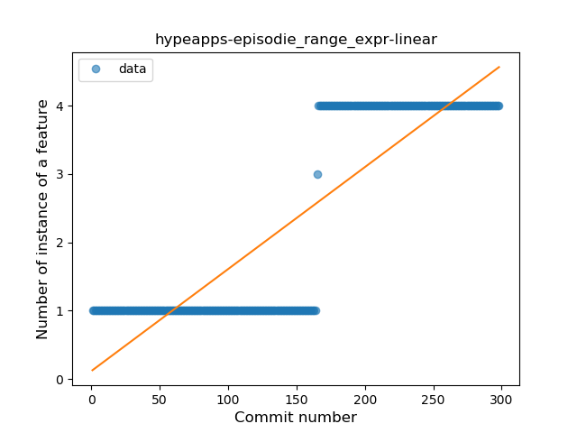

#### jeeb-mpv-android
* Feature: Safe Call
* Function: 
* R_Squared: 0.73803503
 

#### BijoySingh-Material-Notes-Android-App
* Feature: Extension Function
* Function: 
* R_Squared: 0.73789793
 

#### orgzly-orgzly-android
* Feature: Smart Cast
* Function: 
* R_Squared: 0.73549097
 

#### FengMoeTeam-NHentai-android
* Feature: When expression
* Function: 
* R_Squared: 0.73178995
 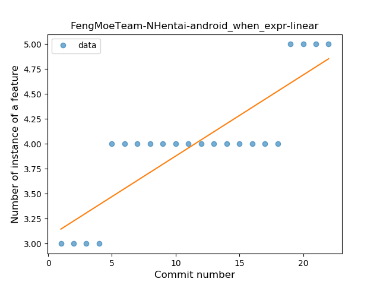

#### vector-im-riot-android
* Feature: Extension Function
* Function: 
* R_Squared: 0.73102595
 

#### spacecowboy-Feeder
* Feature: Destructuring Declaration
* Function: 
* R_Squared: 0.72794431
 

#### SimpleMobileTools-Simple-Clock
* Feature: Extension Function
* Function: 
* R_Squared: 0.72698872
 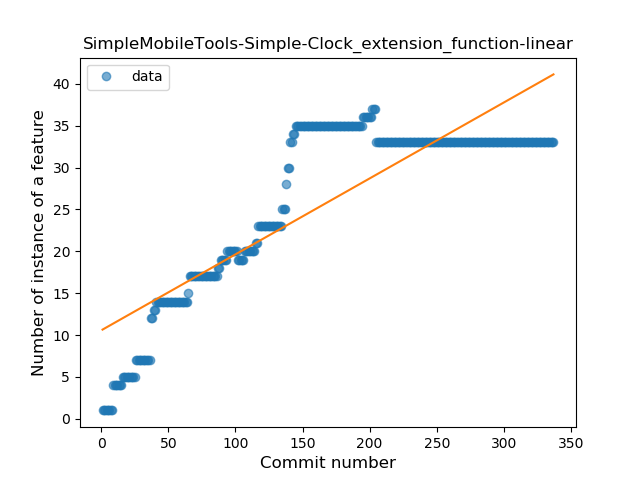

#### aminecmi-ReaderforSelfoss
* Feature: Safe Call
* Function: 
* R_Squared: 0.72259655
 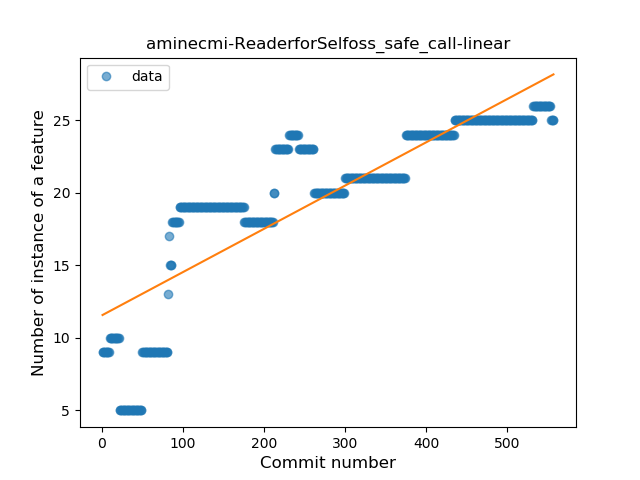

#### erickok-borefts2015
* Feature: Function call with Named Argument
* Function: 
* R_Squared: 0.72144003
 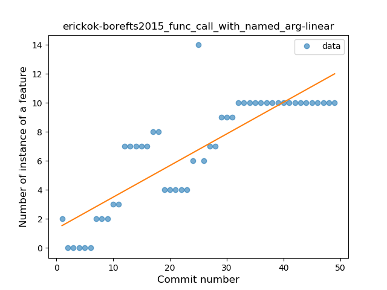

#### chrsep-Kingfish
* Feature: Extension Function
* Function: 
* R_Squared: 0.72130011
 

#### ccomeaux-boardgamegeek4android
* Feature: Range Expression
* Function: 
* R_Squared: 0.72033777
 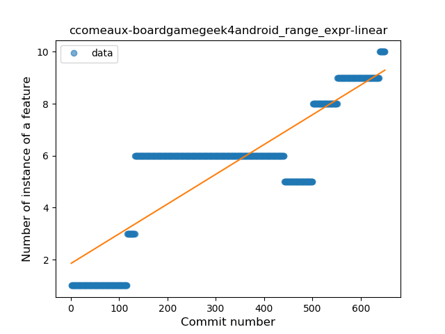

#### citiususc-calendula
* Feature: Safe Call
* Function: 
* R_Squared: 0.71903908
 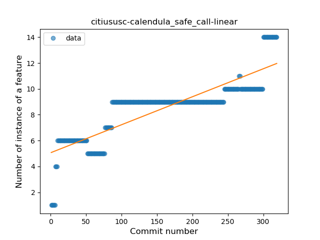

#### albertolalanda-new-ultrasonic-fork-for-MyMusicQoE
* Feature: Lambda
* Function: 
* R_Squared: 0.71668309
 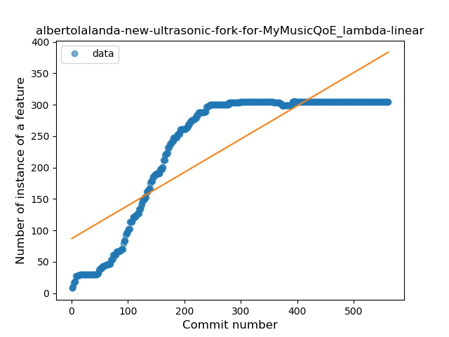

#### DSteve595-Put.io
* Feature: Data Class
* Function: 
* R_Squared: 0.71281281
 

#### syrop-Wiktor-Navigator
* Feature: When expression
* Function: 
* R_Squared: 0.71001053
 

#### calintat-units
* Feature: Function call with Named Argument
* Function: 
* R_Squared: 0.70969723
 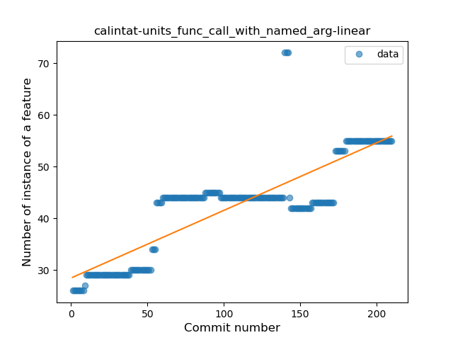

#### NyaaPantsu-NyaaPantsu-android-app
* Feature: Type Inference
* Function: 
* R_Squared: 0.70399691
 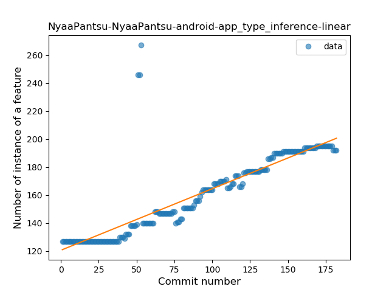

#### charlesmadere-smash-ranks-android
* Feature: Companion Object
* Function: 
* R_Squared: 0.70331851
 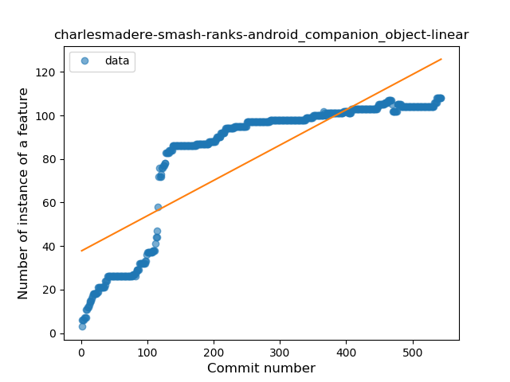

#### carlphilipp-chicago-commutes
* Feature: Function with Default Value
* Function: 
* R_Squared: 0.70219198
 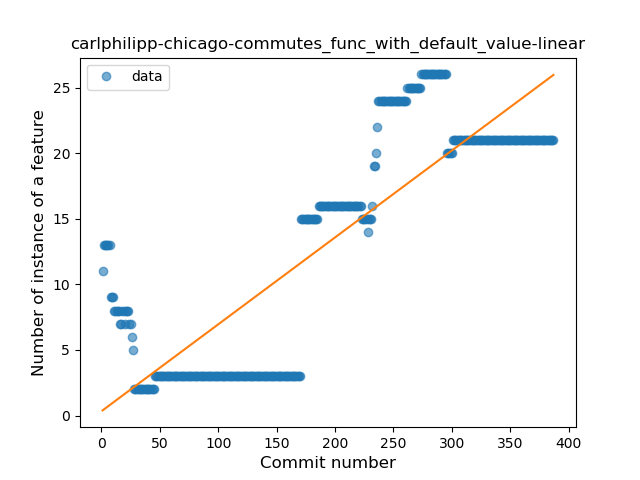

#### ykrank-S1-Next
* Feature: Range Expression
* Function: 
* R_Squared: 0.7017261
 

#### pyamsoft-home-button
* Feature: Safe Call
* Function: 
* R_Squared: 0.70096154
 

#### calintat-units
* Feature: Extension Function
* Function: 
* R_Squared: 0.69682063
 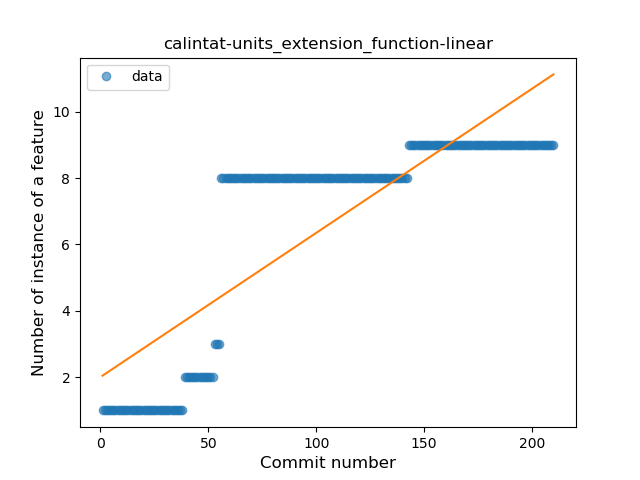

#### anthonycr-Lightning-Browser
* Feature: Type Inference
* Function: 
* R_Squared: 0.69670272
 

#### thaapasa-jalkametri-android
* Feature: When expression
* Function: 
* R_Squared: 0.69305602
 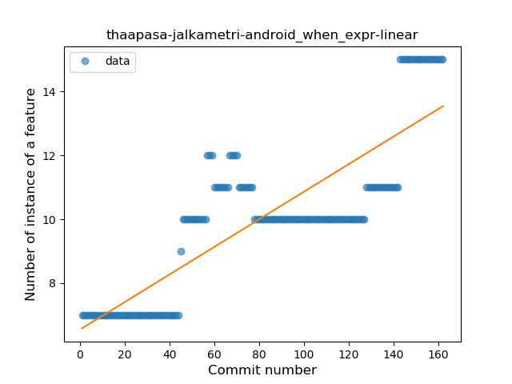

#### SimpleMobileTools-Simple-Calendar
* Feature: String Template
* Function: 
* R_Squared: 0.69251791
 

#### NyaaPantsu-NyaaPantsu-android-app
* Feature: Lambda
* Function: 
* R_Squared: 0.68888818
 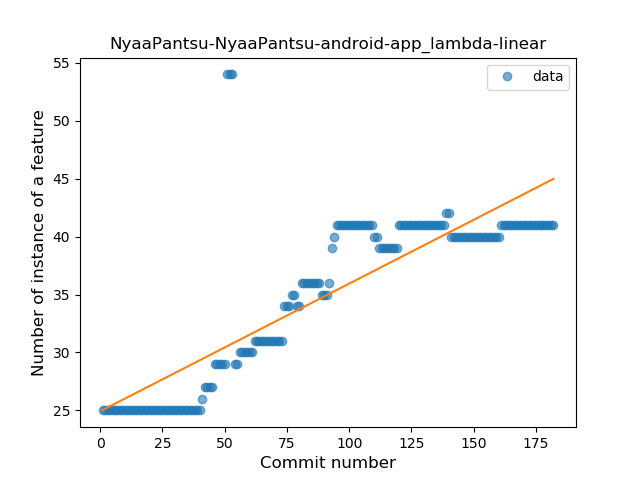

#### tasomaniac-OpenLinkWith
* Feature: When expression
* Function: 
* R_Squared: 0.68751394
 

#### nonylene-PhotoLinkViewer
* Feature: Property Delegation
* Function: 
* R_Squared: 0.68701069
 

#### albertolalanda-new-ultrasonic-fork-for-MyMusicQoE
* Feature: Function call with Named Argument
* Function: 
* R_Squared: 0.67935942
 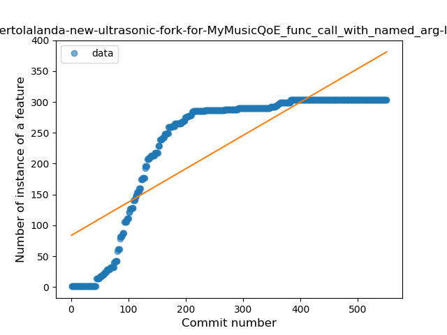

#### quarck-CalendarNotification
* Feature: Overloaded Operator
* Function: 
* R_Squared: 0.67829481
 

#### chrsep-Kingfish
* Feature: When expression
* Function: 
* R_Squared: 0.6769857
 

#### charlesmadere-smash-ranks-android
* Feature: Safe Call
* Function: 
* R_Squared: 0.67427544
 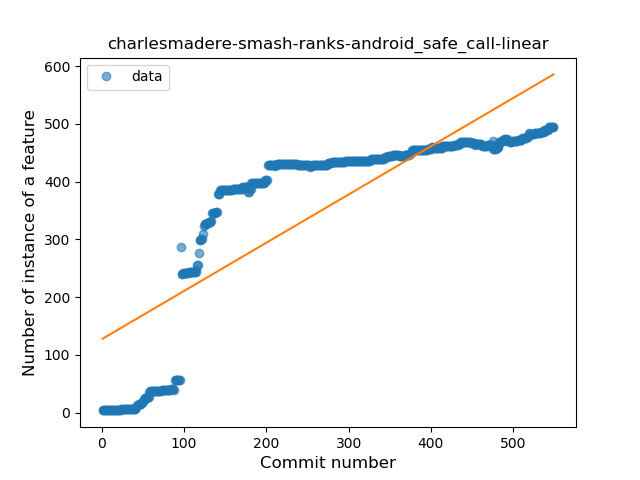

#### michaelkourlas-voipms-sms-client
* Feature: Range Expression
* Function: 
* R_Squared: 0.67318727
 

#### equeim-tremotesf-android
* Feature: Companion Object
* Function: 
* R_Squared: 0.66812002
 

#### thermatk-FastHub-Libre
* Feature: Data Class
* Function: 
* R_Squared: 0.66606839
 

#### FredJul-Flym
* Feature: String Template
* Function: 
* R_Squared: 0.66210824
 

#### klassm-andFHEM
* Feature: Range Expression
* Function: 
* R_Squared: 0.6615179
 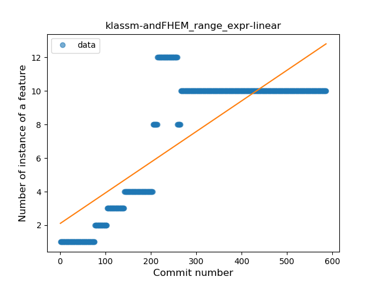

#### ligi-PassAndroid
* Feature: Property Delegation
* Function: 
* R_Squared: 0.65935927
 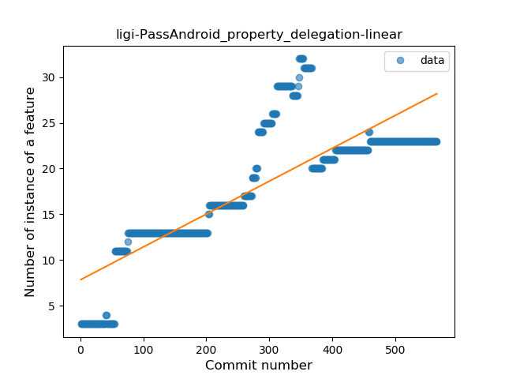

#### syrop-Wiktor-Navigator
* Feature: Function call with Named Argument
* Function: 
* R_Squared: 0.65370134
 

#### nicorsm-S3-16-simone
* Feature: When expression
* Function: 
* R_Squared: 0.6532015
 

#### mpcjanssen-simpletask-android
* Feature: Safe Call
* Function: 
* R_Squared: 0.64222068
 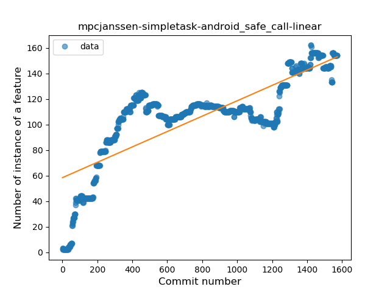

#### anthonycr-Lightning-Browser
* Feature: Safe Call
* Function: 
* R_Squared: 0.63974462
 

#### apiote-Bimba
* Feature: Destructuring Declaration
* Function: 
* R_Squared: 0.6321596
 

#### CzBiX-v2ex-android
* Feature: String Template
* Function: 
* R_Squared: 0.62737075
 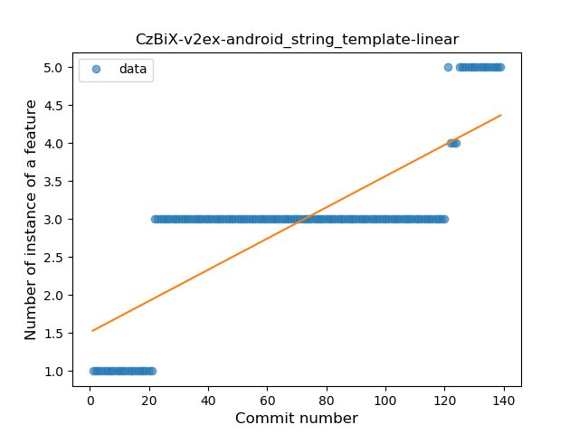

#### Doctoror-ParticleConstellationsLiveWallpaper
* Feature: Extension Function
* Function: 
* R_Squared: 0.61751586
 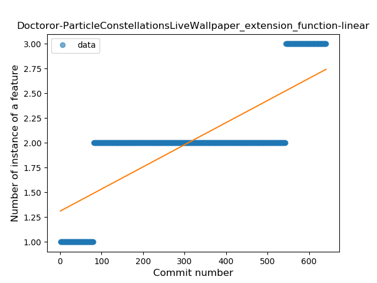

#### Apolline-Lille-apolline-android
* Feature: Range Expression
* Function: 
* R_Squared: 0.60503065
 

#### openium-auvergne-webcams-droid
* Feature: Unsafe Call
* Function: 
* R_Squared: 0.6028167
 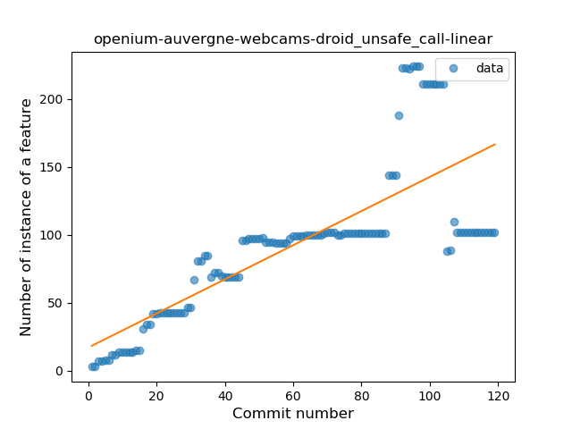

#### ligi-gobandroid
* Feature: Smart Cast
* Function: 
* R_Squared: 0.57776524
 

#### orgzly-orgzly-android
* Feature: Function call with Named Argument
* Function: 
* R_Squared: 0.57595668
 

#### sjnyag-stamp
* Feature: Unsafe Call
* Function: 
* R_Squared: 0.57098188
 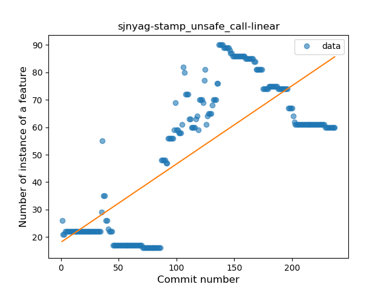

#### proxer-ProxerAndroid
* Feature: String Template
* Function: 
* R_Squared: 0.56470131
 

#### emansih-FireflyMobile
* Feature: Unsafe Call
* Function: 
* R_Squared: 0.56106163
 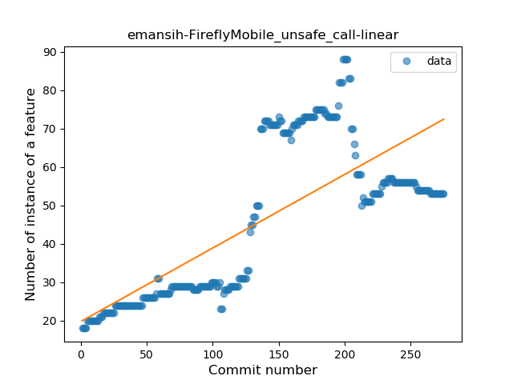

#### ohmae-VoiceMessageBoard
* Feature: Unsafe Call
* Function: 
* R_Squared: 0.55116431
 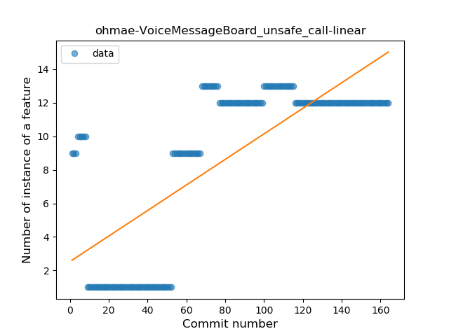

#### eurofurence-ef-app_android
* Feature: Function with Default Value
* Function: 
* R_Squared: 0.53580311
 

#### raatmarien-red-moon
* Feature: Function with Default Value
* Function: 
* R_Squared: 0.52706624
 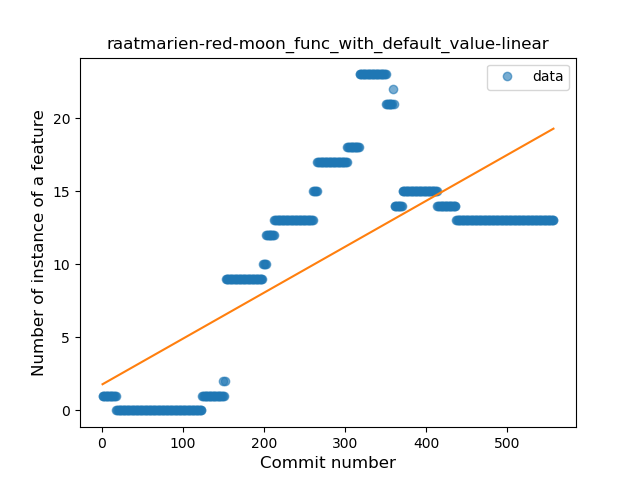

#### SimpleMobileTools-Simple-Contacts
* Feature: String Template
* Function: 
* R_Squared: 0.50610313
 

#### sriharshaarangi-BatteryChargeLimit
* Feature: Companion Object
* Function: 
* R_Squared: 0.50089378
 

#### BijoySingh-Material-Notes-Android-App
* Feature: Data Class
* Function: 
* R_Squared: 0.46901727
 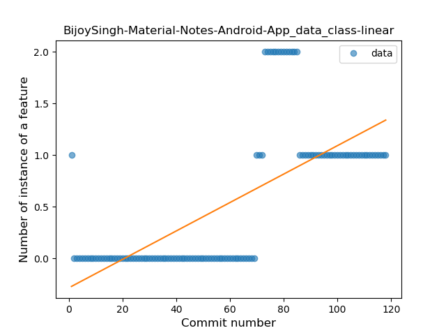

#### openium-auvergne-webcams-droid
* Feature: Property Delegation
* Function: 
* R_Squared: 0.43820202
 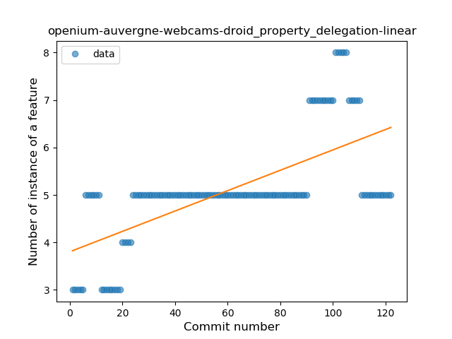

#### inorichi-tachiyomi
* Feature: Property Delegation
* Function: 
* R_Squared: 0.43363843
 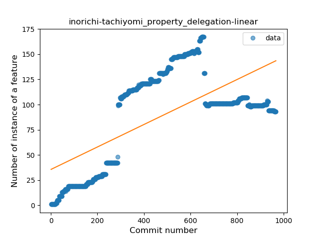

#### SimpleMobileTools-Simple-Gallery
* Feature: Function call with Named Argument
* Function: 
* R_Squared: 0.37677656
 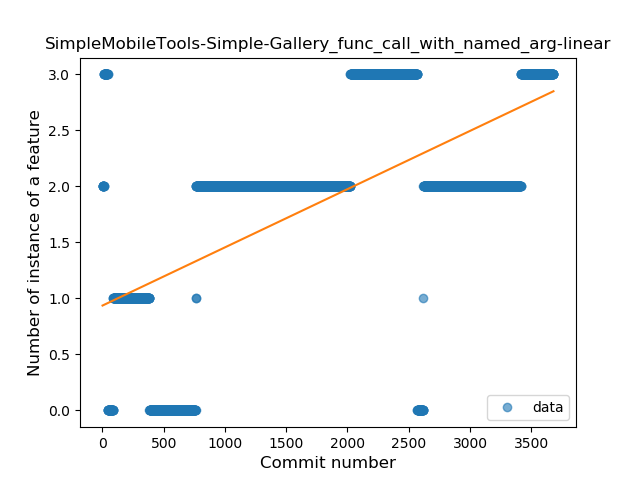

#### bubelov-coins-android
* Feature: Function with Default Value
* Function: 
* R_Squared: 0.35390102
 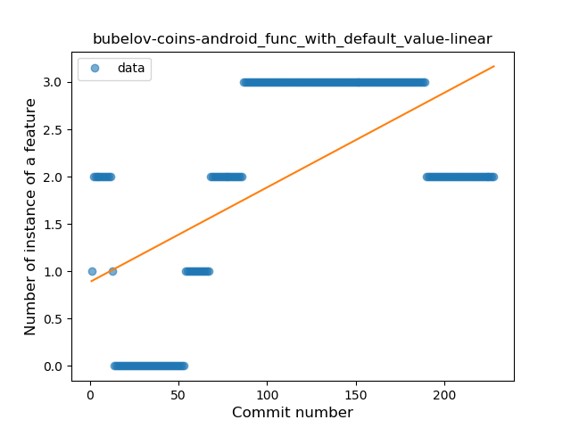

#### SimpleMobileTools-Simple-Thank-You
* Feature: Type Inference
* Function: 
* R_Squared: 0.32928046
 

#### premnirmal-StockTicker
* Feature: Companion Object
* Function: 
* R_Squared: 0.32403829
 

#### citiususc-calendula
* Feature: Overloaded Operator
* Function: 
* R_Squared: 0.21373749
 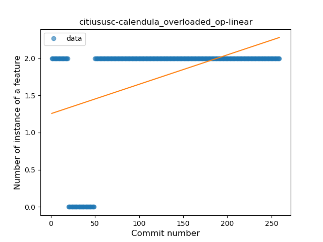

#### premnirmal-StockTicker
* Feature: Overloaded Operator
* Function: 
* R_Squared: 0.1525854
 

#### FredJul-Flym
* Feature: Smart Cast
* Function: 
* R_Squared: 0.14957571
 

#### NyaaPantsu-NyaaPantsu-android-app
* Feature: Smart Cast
* Function: 
* R_Squared: 0.10524606
 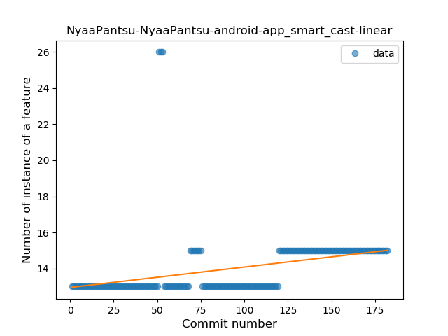

#### SpiritCroc-DefaultDarkTheme-oms
* Feature: Type Inference
* Function: 
* R_Squared: 0.07865967
 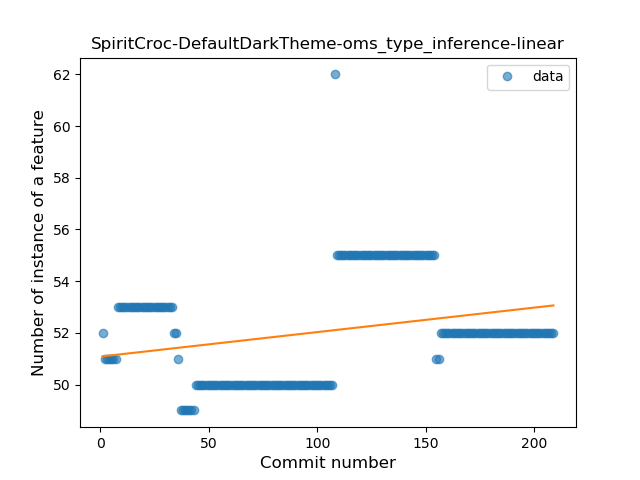

#### corphish-NightLight
* Feature: Companion Object
* Function: 
* R_Squared: 0.03466122
 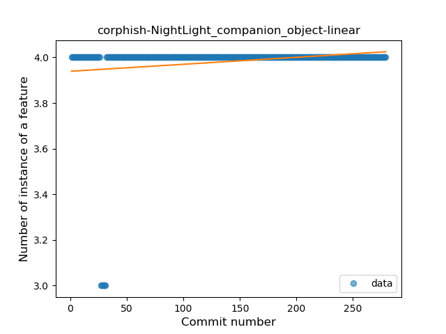

#### dimagi-commcare-android
* Feature: Type Inference
* Function: 
* R_Squared: 0.01997225
 

#### premnirmal-StockTicker
* Feature: Unsafe Call
* Function: 
* R_Squared: 0.0130987
 

#### quarck-CalendarNotification
* Feature: Unsafe Call
* Function: 
* R_Squared: 0.01246145
 

#### Doctoror-ParticleConstellationsLiveWallpaper
* Feature: Unsafe Call
* Function: 
* R_Squared: 0.00908067
 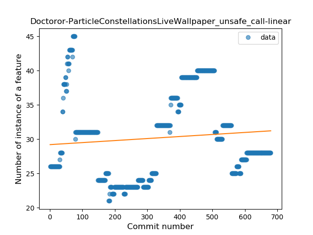

#### citiususc-calendula
* Feature: Smart Cast
* Function: 
* R_Squared: 0.00711702
 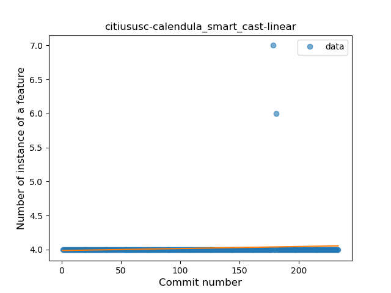

#### citiususc-calendula
* Feature: Destructuring Declaration
* Function: 
* R_Squared: 0.00400917
 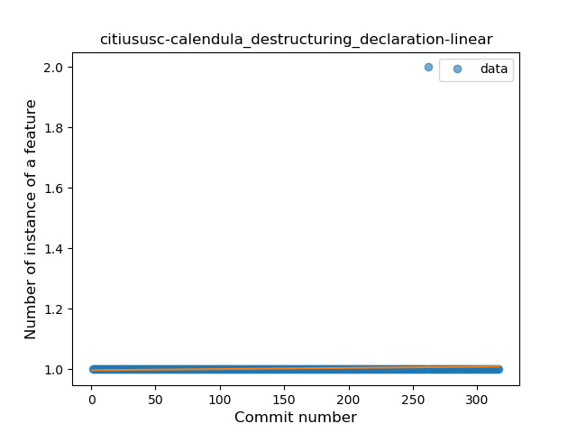

#### citiususc-calendula
* Feature: Function call with Named Argument
* Function: 
* R_Squared: 0.00354527
 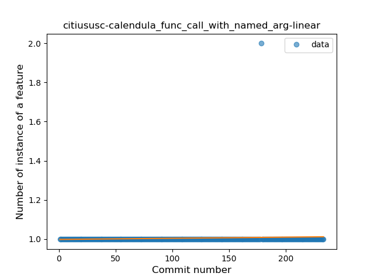

#### nonylene-PhotoLinkViewer
* Feature: Companion Object
* Function: 
* R_Squared: 0.00016528
 

#### SimpleMobileTools-Simple-Notes
* Feature: Companion Object
* Function: 
* R_Squared: 2.834e-05
 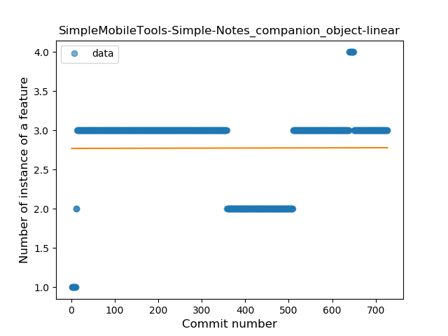

