## Constant Rise
----
**1050** best fit

#### org-mariotaku-twidere
* Feature: Function with Default Value
* Function: 
* R_Squared: 0.99428334
 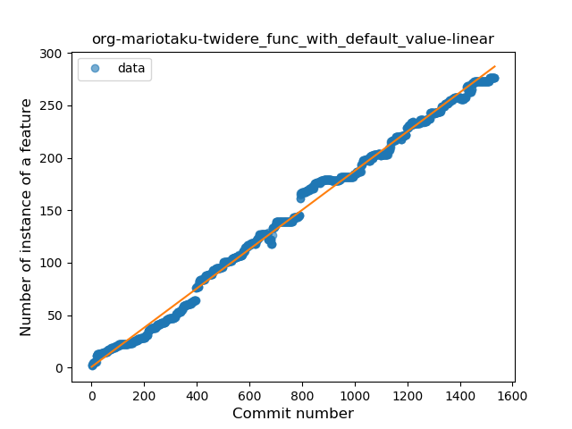

#### be-mygod-vpnhotspot
* Feature: Lambda
* Function: 
* R_Squared: 0.99257258
 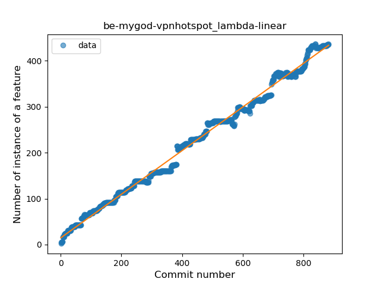

#### se-barsk-park
* Feature: Type Inference
* Function: 
* R_Squared: 0.99096929
 

#### com-boardgamegeek
* Feature: Type Inference
* Function: 
* R_Squared: 0.99001154
 

#### org-mariotaku-twidere
* Feature: Safe Call
* Function: 
* R_Squared: 0.98968138
 

#### org-mariotaku-twidere
* Feature: Lambda
* Function: 
* R_Squared: 0.98858718
 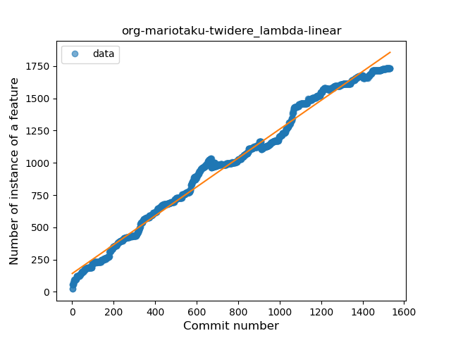

#### com-boardgamegeek
* Feature: String Template
* Function: 
* R_Squared: 0.98785143
 

#### com-boardgamegeek
* Feature: Property Delegation
* Function: 
* R_Squared: 0.98712915
 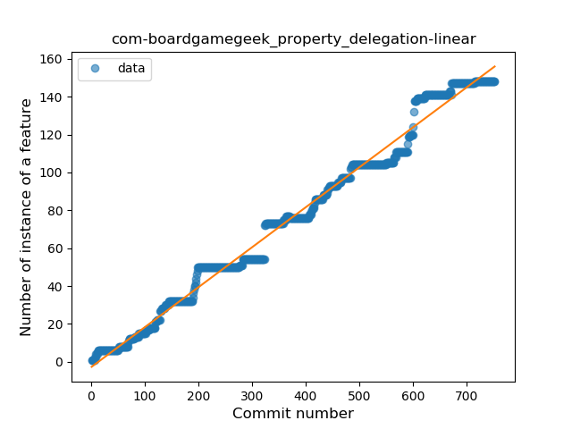

#### ca-josephroque-bowlingcompanion
* Feature: Lambda
* Function: 
* R_Squared: 0.98707155
 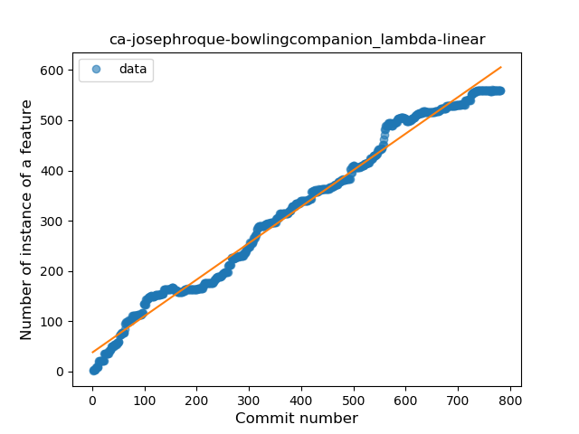

#### com-esafirm-androidplayground
* Feature: Type Inference
* Function: 
* R_Squared: 0.98630683
 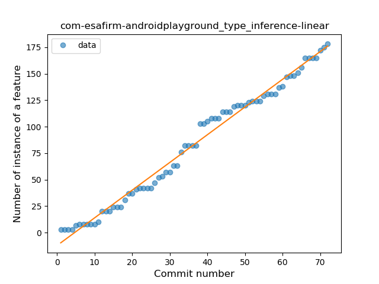

#### org-walleth
* Feature: Lambda
* Function: 
* R_Squared: 0.98609735
 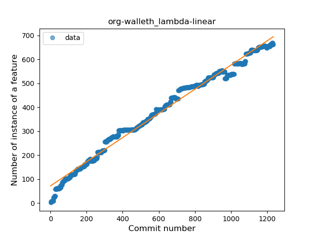

#### ca-josephroque-bowlingcompanion
* Feature: When expression
* Function: 
* R_Squared: 0.98584455
 

#### com-simplemobiletools-filemanager-pro
* Feature: Lambda
* Function: 
* R_Squared: 0.98562131
 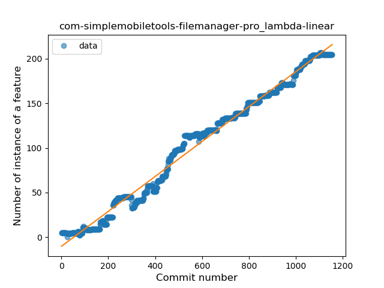

#### com-booboot-vndbandroid
* Feature: Extension Function
* Function: 
* R_Squared: 0.98510686
 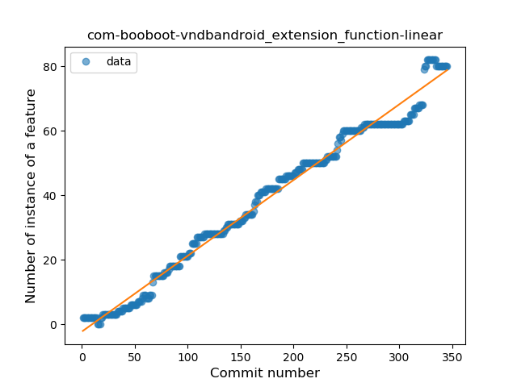

#### com-duckduckgo-mobile-android
* Feature: Function with Default Value
* Function: 
* R_Squared: 0.98508538
 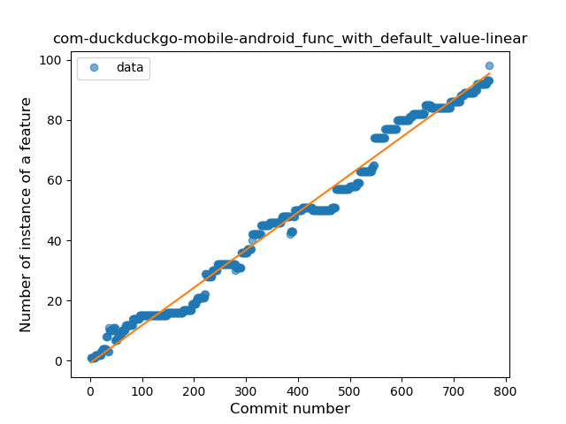

#### com-duckduckgo-mobile-android
* Feature: Type Inference
* Function: 
* R_Squared: 0.98496859
 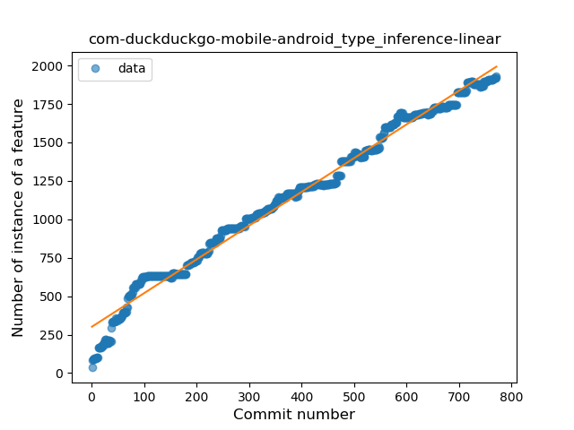

#### uk-colessoft-android-hilllist
* Feature: Type Inference
* Function: 
* R_Squared: 0.98470207
 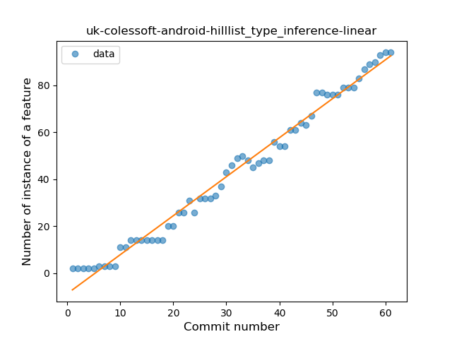

#### be-mygod-vpnhotspot
* Feature: Safe Call
* Function: 
* R_Squared: 0.98450713
 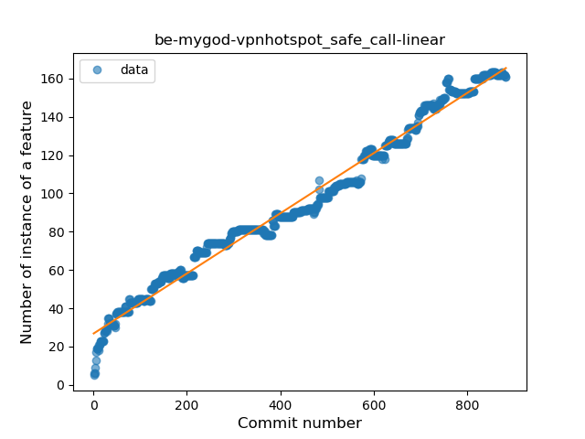

#### chat-rocket-android
* Feature: Safe Call
* Function: 
* R_Squared: 0.98396774
 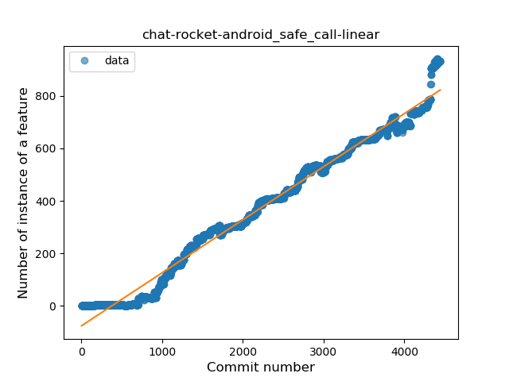

#### ffc-app
* Feature: Unsafe Call
* Function: 
* R_Squared: 0.98378108
 

#### ffc-app
* Feature: Lambda
* Function: 
* R_Squared: 0.98377688
 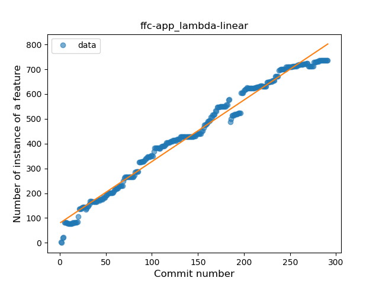

#### org-mariotaku-twidere
* Feature: Function call with Named Argument
* Function: 
* R_Squared: 0.98363711
 

#### com-nononsenseapps-feeder
* Feature: Lambda
* Function: 
* R_Squared: 0.98325203
 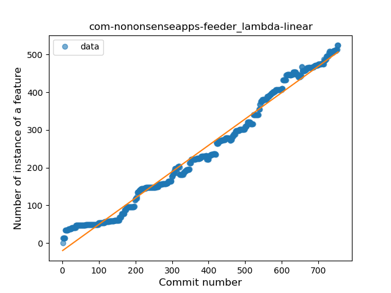

#### com-utazukin-ichaival
* Feature: Type Inference
* Function: 
* R_Squared: 0.98248866
 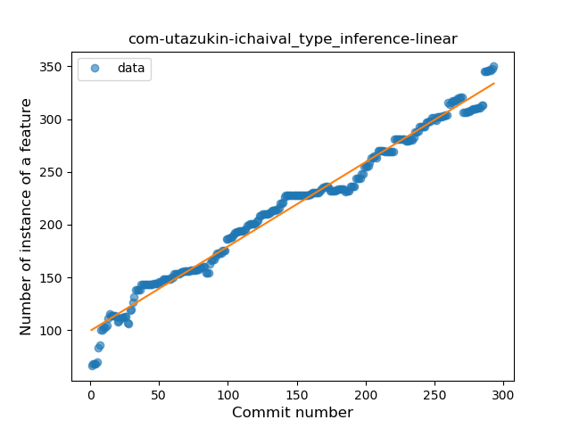

#### org-emunix-insteadlauncher
* Feature: Unsafe Call
* Function: 
* R_Squared: 0.98129483
 

#### link-standen-michael-phonesaver
* Feature: Lambda
* Function: 
* R_Squared: 0.98111674
 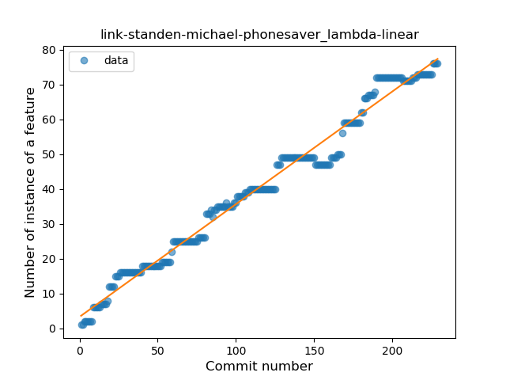

#### com-duckduckgo-mobile-android
* Feature: Companion Object
* Function: 
* R_Squared: 0.98102861
 

#### com-github-quarck-calnotify
* Feature: Function call with Named Argument
* Function: 
* R_Squared: 0.98099929
 

#### ffc-app
* Feature: Safe Call
* Function: 
* R_Squared: 0.98087607
 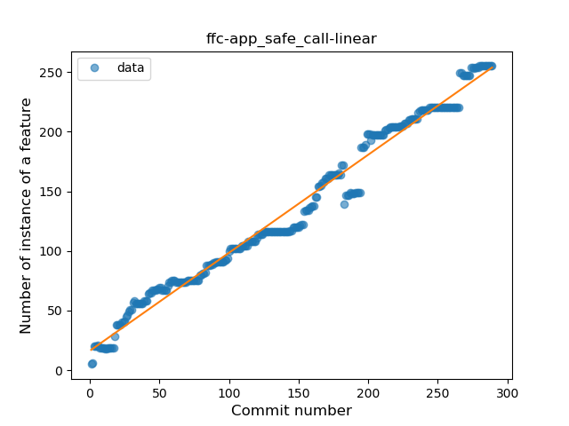

#### de-westnordost-streetcomplete
* Feature: Safe Call
* Function: 
* R_Squared: 0.98072317
 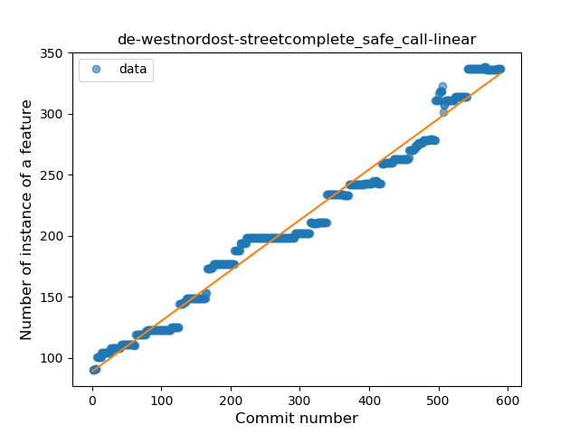

#### com-github-quarck-calnotify
* Feature: When expression
* Function: 
* R_Squared: 0.9805774
 

#### com-fsck-k9
* Feature: Companion Object
* Function: 
* R_Squared: 0.98006903
 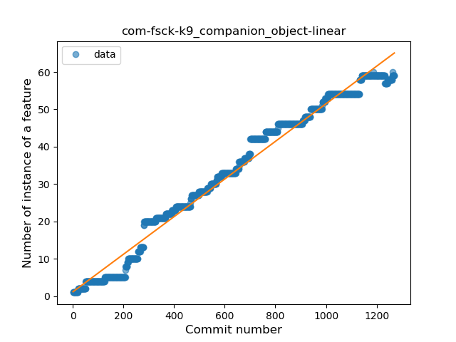

#### org-walleth
* Feature: Safe Call
* Function: 
* R_Squared: 0.97999036
 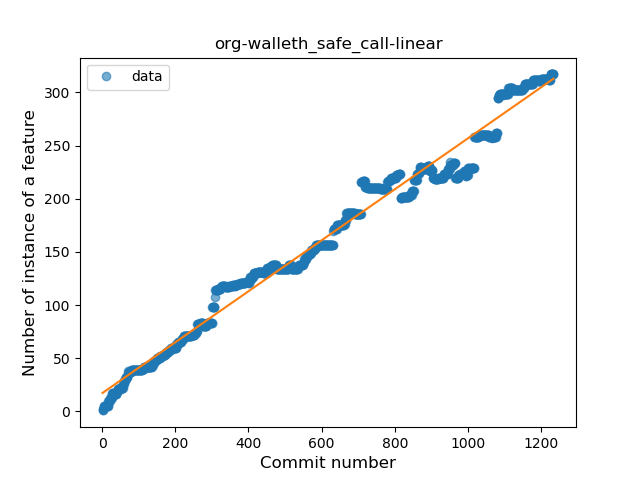

#### com-motion-stage1
* Feature: Lambda
* Function: 
* R_Squared: 0.97942064
 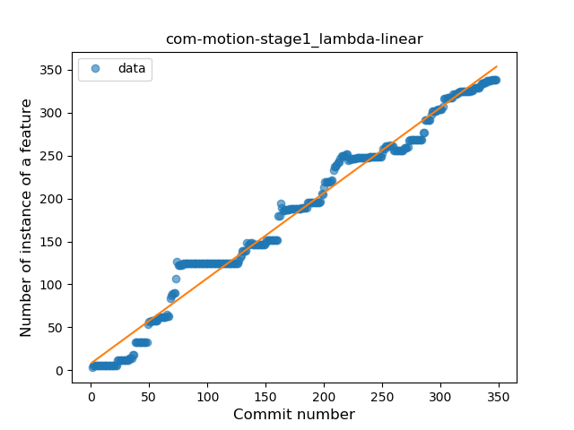

#### com-bijoysingh-quicknote
* Feature: Type Inference
* Function: 
* R_Squared: 0.97927307
 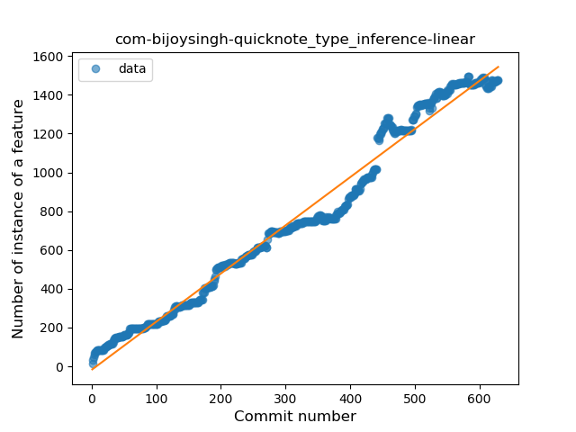

#### li-klass-fhem
* Feature: String Template
* Function: 
* R_Squared: 0.97907558
 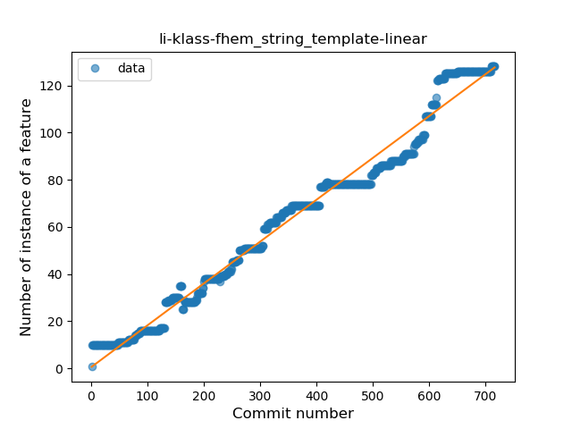

#### io-github-feelfreelinux-wykopmobilny
* Feature: When expression
* Function: 
* R_Squared: 0.97870839
 

#### org-mariotaku-twidere
* Feature: Extension Function
* Function: 
* R_Squared: 0.97863731
 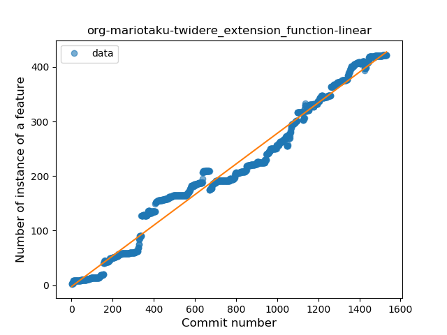

#### ch-rmy-android-http_shortcuts
* Feature: Lambda
* Function: 
* R_Squared: 0.97843943
 

#### com-fsck-k9
* Feature: Singleton
* Function: 
* R_Squared: 0.97801277
 

#### com-keylesspalace-tusky
* Feature: Companion Object
* Function: 
* R_Squared: 0.97770439
 

#### info-dvkr-screenstream
* Feature: Lambda
* Function: 
* R_Squared: 0.97758347
 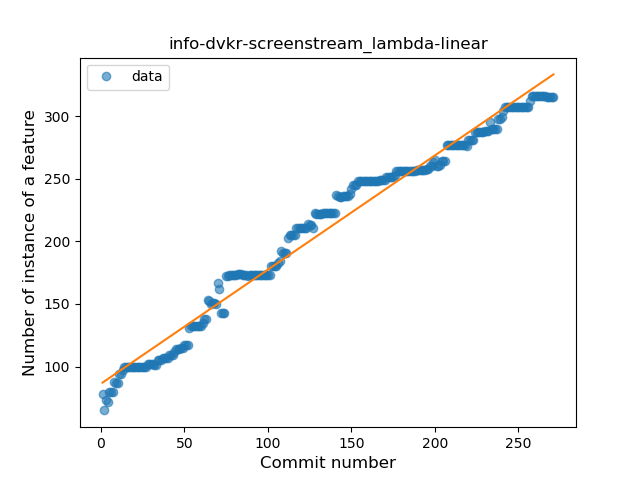

#### org-mariotaku-twidere
* Feature: String Template
* Function: 
* R_Squared: 0.97745318
 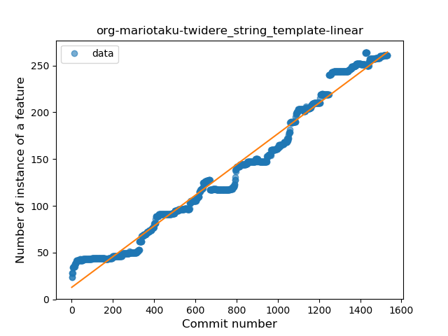

#### com-esafirm-androidplayground
* Feature: Lambda
* Function: 
* R_Squared: 0.97739785
 

#### com-wabadaba-dziennik
* Feature: Lambda
* Function: 
* R_Squared: 0.97715272
 

#### com-loloof64-android-basicchessendgamestrainer
* Feature: Lambda
* Function: 
* R_Squared: 0.97697765
 

#### eu-kanade-tachiyomi
* Feature: Type Inference
* Function: 
* R_Squared: 0.97641145
 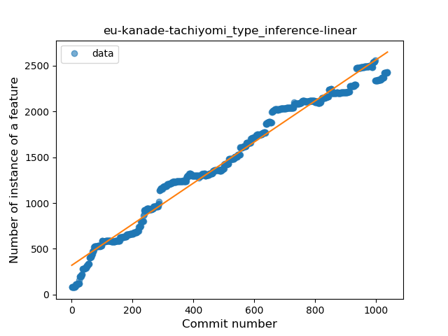

#### com-keylesspalace-tusky
* Feature: Safe Call
* Function: 
* R_Squared: 0.97629609
 

#### com-boardgamegeek
* Feature: Function with Default Value
* Function: 
* R_Squared: 0.97627156
 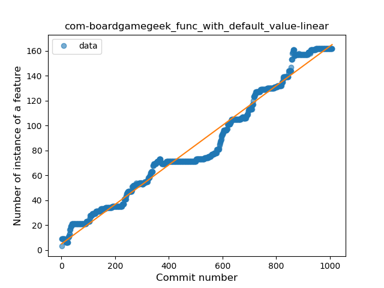

#### com-fsck-k9
* Feature: Data Class
* Function: 
* R_Squared: 0.97584216
 

#### ffc-app
* Feature: Extension Function
* Function: 
* R_Squared: 0.97578068
 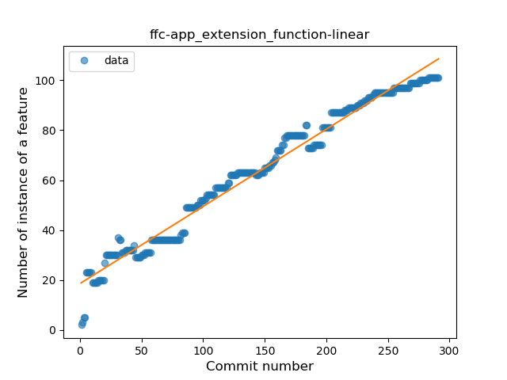

#### com-simplemobiletools-gallery
* Feature: Lambda
* Function: 
* R_Squared: 0.97576613
 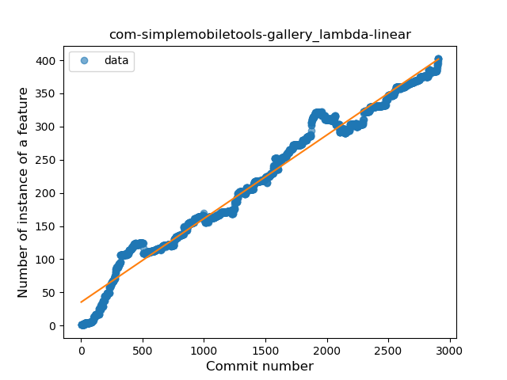

#### com-glodanif-bluetoothchat
* Feature: Lambda
* Function: 
* R_Squared: 0.97553355
 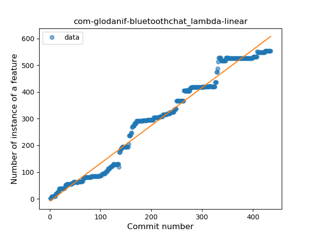

#### com-ofalvai-bpinfo
* Feature: Lambda
* Function: 
* R_Squared: 0.97552645
 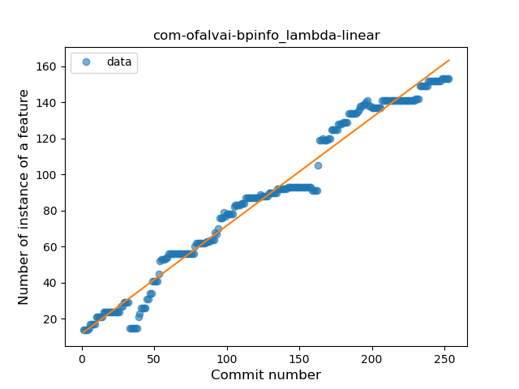

#### com-simplemobiletools-contacts-pro
* Feature: Extension Function
* Function: 
* R_Squared: 0.97528826
 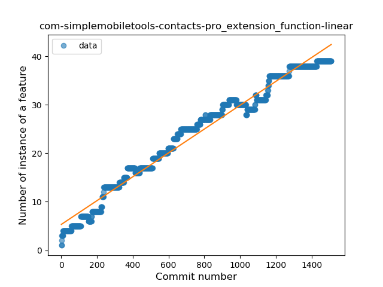

#### com-fsck-k9
* Feature: When expression
* Function: 
* R_Squared: 0.97510913
 

#### ffc-app
* Feature: Type Inference
* Function: 
* R_Squared: 0.97506356
 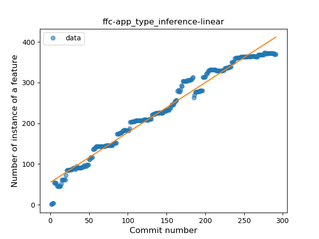

#### org-mozilla-focus
* Feature: Safe Call
* Function: 
* R_Squared: 0.97484822
 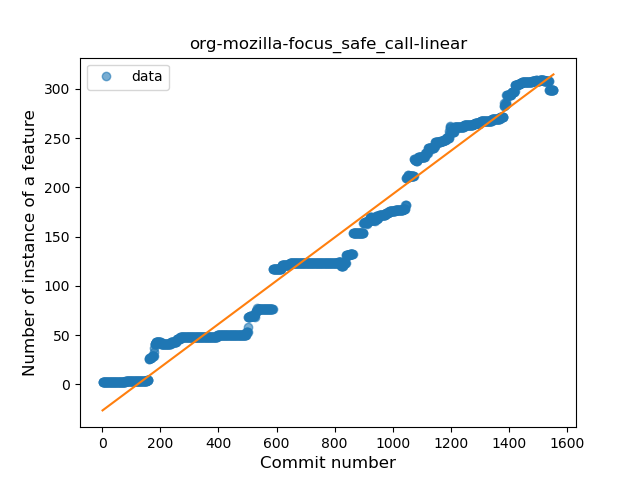

#### org-mozilla-klar
* Feature: Safe Call
* Function: 
* R_Squared: 0.97484822
 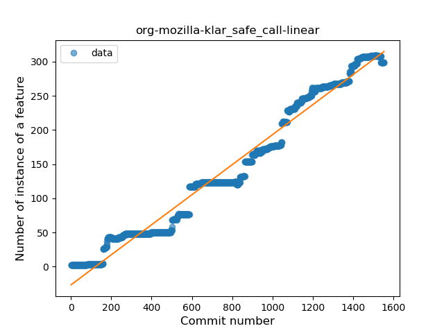

#### com-peterlaurence-trekme
* Feature: Data Class
* Function: 
* R_Squared: 0.97459796
 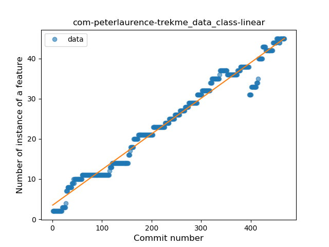

#### fr-xgouchet-packageexplorer
* Feature: When expression
* Function: 
* R_Squared: 0.97456485
 

#### com-orgzly
* Feature: When expression
* Function: 
* R_Squared: 0.97436585
 

#### one-librem-social
* Feature: Companion Object
* Function: 
* R_Squared: 0.97422217
 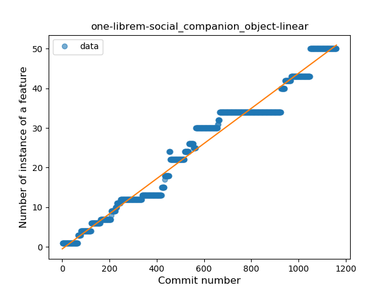

#### com-duckduckgo-mobile-android
* Feature: Function call with Named Argument
* Function: 
* R_Squared: 0.97410839
 

#### org-mariotaku-twidere
* Feature: Type Inference
* Function: 
* R_Squared: 0.97405046
 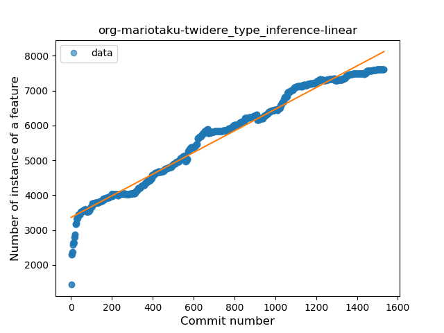

#### com-duckduckgo-mobile-android
* Feature: Extension Function
* Function: 
* R_Squared: 0.97393594
 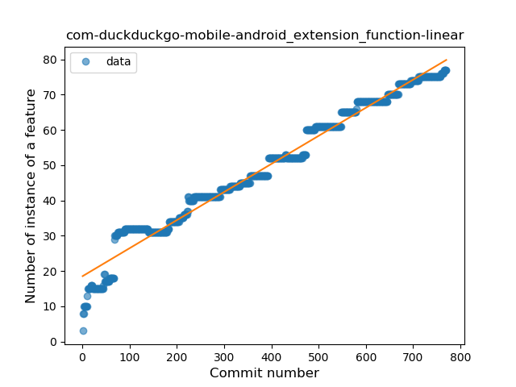

#### com-fsck-k9
* Feature: Lambda
* Function: 
* R_Squared: 0.97380162
 

#### com-simplemobiletools-gallery-pro
* Feature: Type Inference
* Function: 
* R_Squared: 0.97369495
 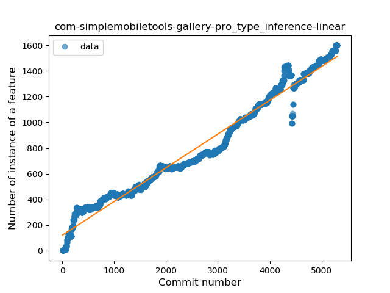

#### com-dp-logcatapp
* Feature: When expression
* Function: 
* R_Squared: 0.97349159
 

#### one-librem-social
* Feature: Safe Call
* Function: 
* R_Squared: 0.9733035
 

#### pl-hypeapp-episodie
* Feature: Companion Object
* Function: 
* R_Squared: 0.97292107
 

#### com-boardgamegeek
* Feature: Safe Call
* Function: 
* R_Squared: 0.97289291
 

#### org-mariotaku-twidere
* Feature: Companion Object
* Function: 
* R_Squared: 0.97229588
 

#### com-boardgamegeek
* Feature: Function call with Named Argument
* Function: 
* R_Squared: 0.97221807
 

#### one-librem-social
* Feature: Smart Cast
* Function: 
* R_Squared: 0.97221398
 

#### org-mariotaku-twidere
* Feature: When expression
* Function: 
* R_Squared: 0.97219437
 

#### com-keylesspalace-tusky
* Feature: Type Inference
* Function: 
* R_Squared: 0.97195191
 

#### com-duckduckgo-mobile-android
* Feature: String Template
* Function: 
* R_Squared: 0.97159317
 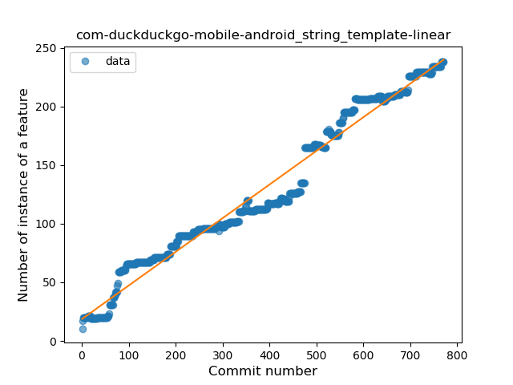

#### fi-tuska-jalkametri
* Feature: Lambda
* Function: 
* R_Squared: 0.97136565
 

#### de-Maxr1998-xposed-maxlock
* Feature: Safe Call
* Function: 
* R_Squared: 0.97122294
 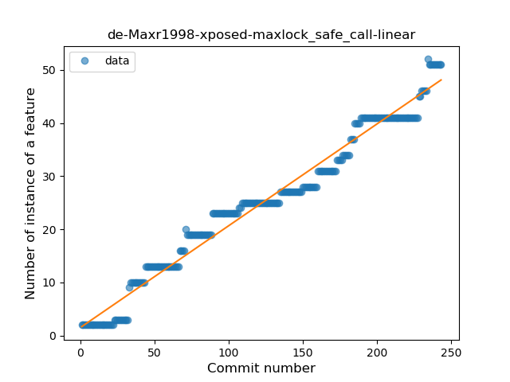

#### com-peterlaurence-trekme
* Feature: When expression
* Function: 
* R_Squared: 0.97113702
 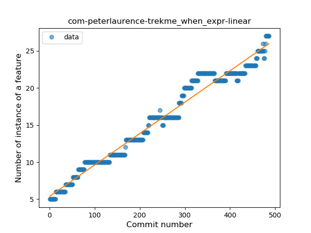

#### net-bible-android-activity
* Feature: Function with Default Value
* Function: 
* R_Squared: 0.9707047
 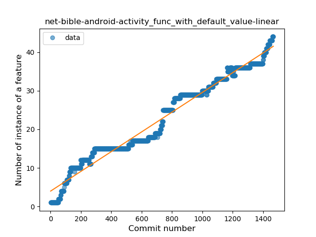

#### com-github-quarck-calnotify
* Feature: Lambda
* Function: 
* R_Squared: 0.97058938
 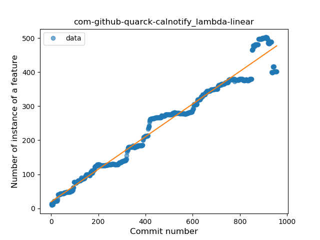

#### com-simplemobiletools-gallery-pro
* Feature: When expression
* Function: 
* R_Squared: 0.97054873
 

#### io-github-wulkanowy
* Feature: Type Inference
* Function: 
* R_Squared: 0.97052756
 

#### eu-kanade-tachiyomi
* Feature: Lambda
* Function: 
* R_Squared: 0.97003741
 

#### ca-fuwafuwa-kaku
* Feature: Type Inference
* Function: 
* R_Squared: 0.9691956
 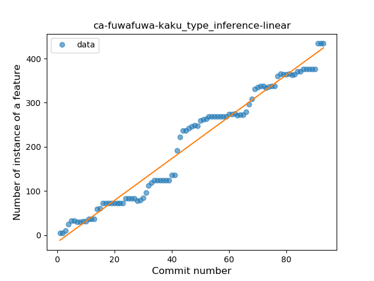

#### com-fastaccess-github-libre
* Feature: Function with Default Value
* Function: 
* R_Squared: 0.96877721
 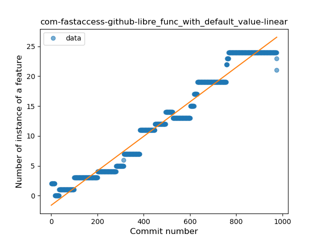

#### com-utazukin-ichaival
* Feature: Safe Call
* Function: 
* R_Squared: 0.96876194
 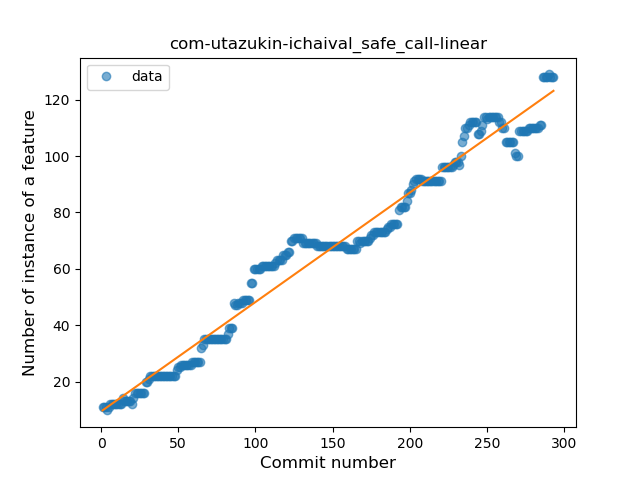

#### ca-fuwafuwa-kaku
* Feature: When expression
* Function: 
* R_Squared: 0.96868135
 

#### com-motion-stage1
* Feature: Safe Call
* Function: 
* R_Squared: 0.96861928
 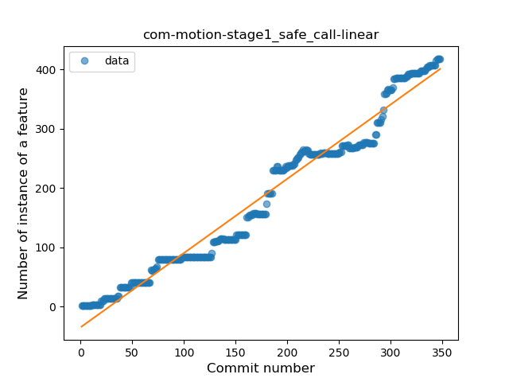

#### uk-co-richyhbm-monochromatic
* Feature: Type Inference
* Function: 
* R_Squared: 0.96832498
 

#### org-kaqui
* Feature: Type Inference
* Function: 
* R_Squared: 0.96831914
 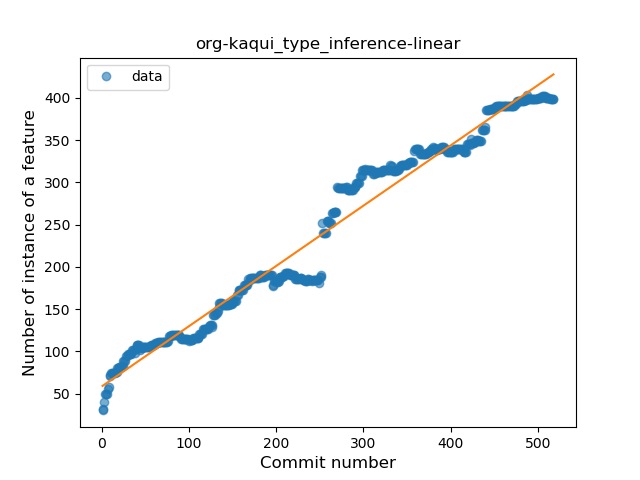

#### one-librem-social
* Feature: Type Inference
* Function: 
* R_Squared: 0.96810275
 

#### com-keylesspalace-tusky
* Feature: Smart Cast
* Function: 
* R_Squared: 0.96806412
 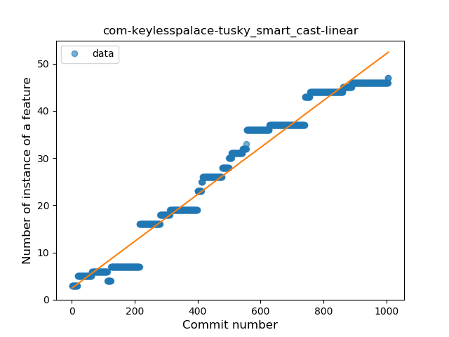

#### net-bible-android-activity
* Feature: Safe Call
* Function: 
* R_Squared: 0.96777039
 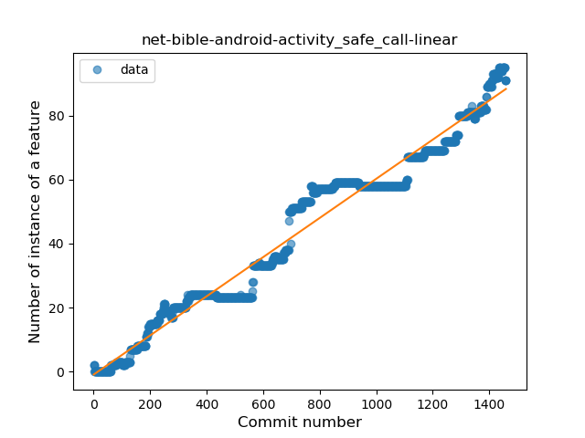

#### com-fastaccess-github-libre
* Feature: Type Inference
* Function: 
* R_Squared: 0.96758296
 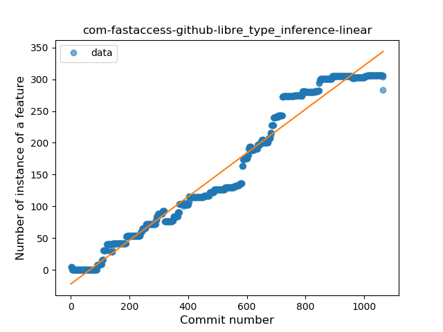

#### com-peterlaurence-trekme
* Feature: String Template
* Function: 
* R_Squared: 0.9672808
 

#### com-dozingcatsoftware-vectorcamera
* Feature: String Template
* Function: 
* R_Squared: 0.96727621
 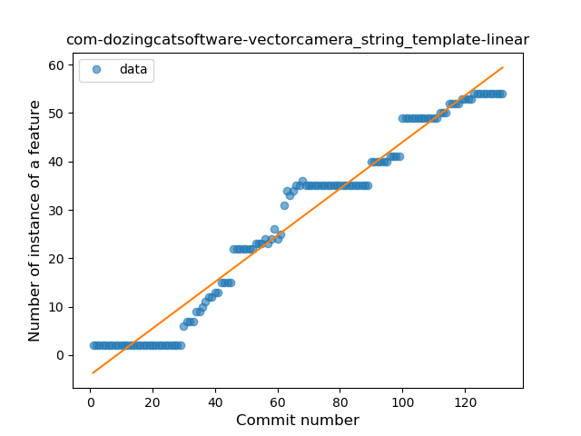

#### li-klass-fhem
* Feature: Function call with Named Argument
* Function: 
* R_Squared: 0.96724659
 

#### com-dozingcatsoftware-vectorcamera
* Feature: Function with Default Value
* Function: 
* R_Squared: 0.96709889
 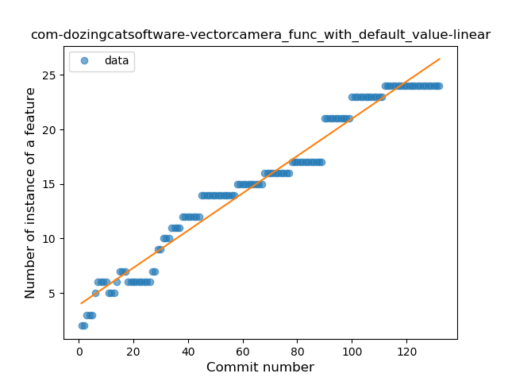

#### com-simplemobiletools-filemanager-pro
* Feature: Safe Call
* Function: 
* R_Squared: 0.96706677
 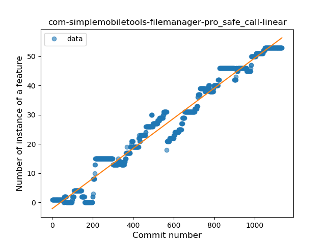

#### com-duckduckgo-mobile-android
* Feature: Safe Call
* Function: 
* R_Squared: 0.96693813
 

#### cat-pantsu-nyaapantsu
* Feature: Type Inference
* Function: 
* R_Squared: 0.96657223
 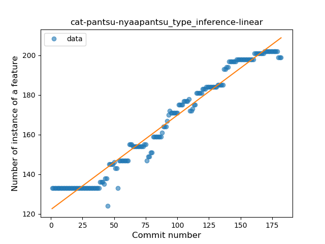

#### com-doctoror-particleswallpaper
* Feature: Type Inference
* Function: 
* R_Squared: 0.96651276
 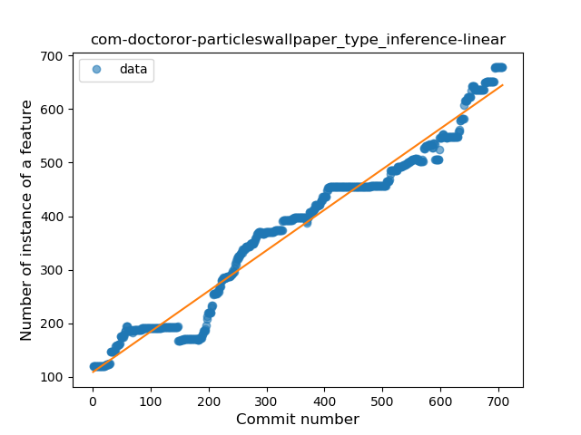

#### com-github-quarck-calnotify
* Feature: Data Class
* Function: 
* R_Squared: 0.96648975
 

#### com-boardgamegeek
* Feature: Extension Function
* Function: 
* R_Squared: 0.96647018
 

#### org-blitzortung-android-app
* Feature: Type Inference
* Function: 
* R_Squared: 0.96645653
 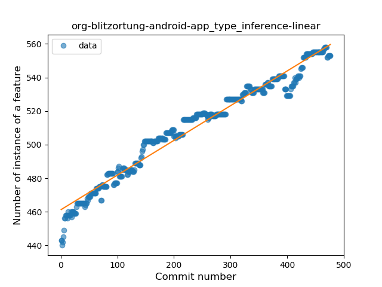

#### me-proxer-app
* Feature: Extension Function
* Function: 
* R_Squared: 0.9664094
 

#### com-ruuvi-station
* Feature: Type Inference
* Function: 
* R_Squared: 0.96637608
 

#### com-fastaccess-github-libre
* Feature: Lambda
* Function: 
* R_Squared: 0.96627347
 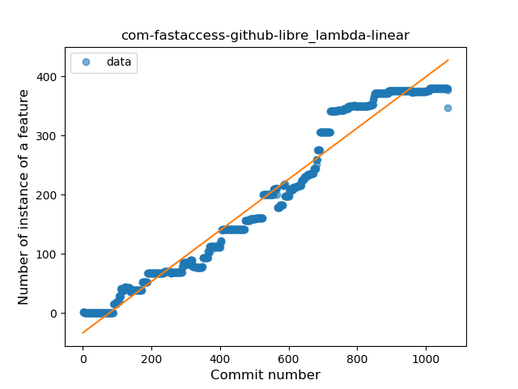

#### com-simplemobiletools-musicplayer
* Feature: Lambda
* Function: 
* R_Squared: 0.9662526
 

#### com-dp-logcatapp
* Feature: Companion Object
* Function: 
* R_Squared: 0.96592415
 

#### com-nononsenseapps-feeder
* Feature: String Template
* Function: 
* R_Squared: 0.96550652
 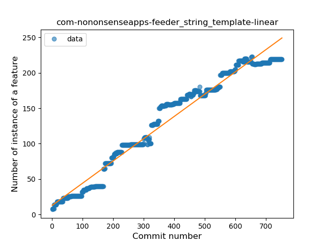

#### com-motion-stage1
* Feature: Type Inference
* Function: 
* R_Squared: 0.96547017
 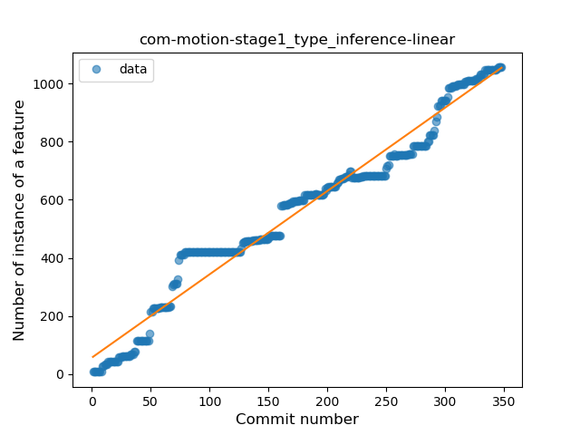

#### chat-rocket-android
* Feature: Lambda
* Function: 
* R_Squared: 0.96542366
 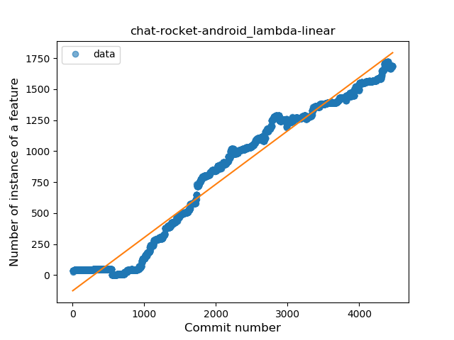

#### com-keylesspalace-tusky
* Feature: When expression
* Function: 
* R_Squared: 0.9650298
 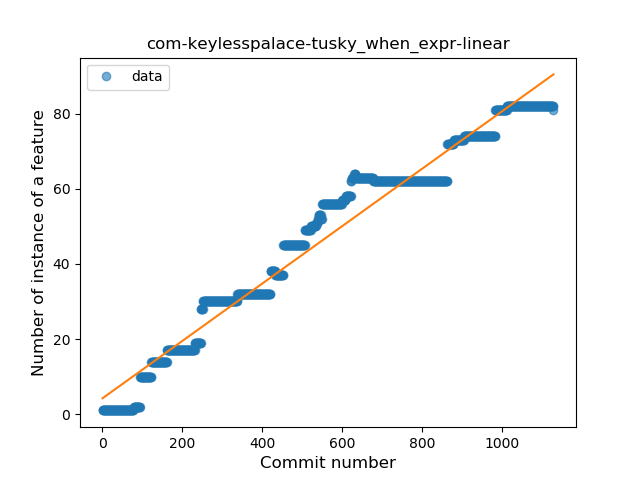

#### eu-kanade-tachiyomi
* Feature: When expression
* Function: 
* R_Squared: 0.96444608
 

#### me-blog-korn123-easydiary
* Feature: When expression
* Function: 
* R_Squared: 0.96363801
 

#### me-proxer-app
* Feature: Lambda
* Function: 
* R_Squared: 0.96363552
 

#### com-simplemobiletools-gallery-pro
* Feature: Safe Call
* Function: 
* R_Squared: 0.96342056
 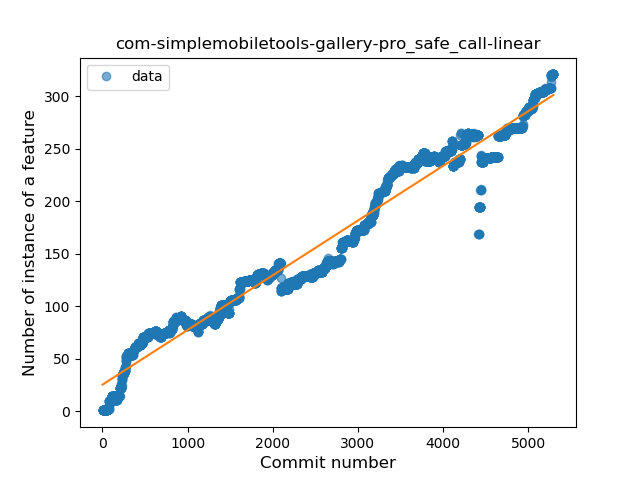

#### com-bijoysingh-quicknote
* Feature: Function call with Named Argument
* Function: 
* R_Squared: 0.96333554
 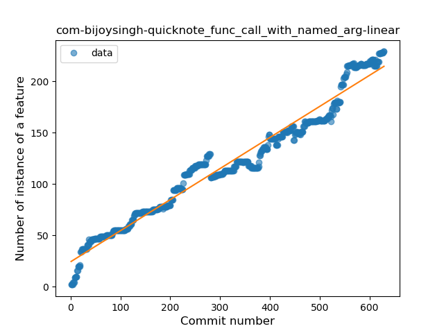

#### com-androidheads-vienna-escalero
* Feature: Safe Call
* Function: 
* R_Squared: 0.96304397
 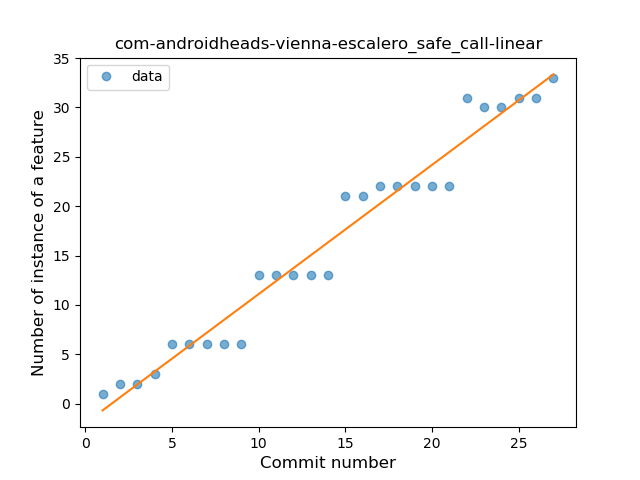

#### is-xyz-mpv
* Feature: String Template
* Function: 
* R_Squared: 0.96268742
 

#### com-eventyay-attendee
* Feature: Property Delegation
* Function: 
* R_Squared: 0.96262683
 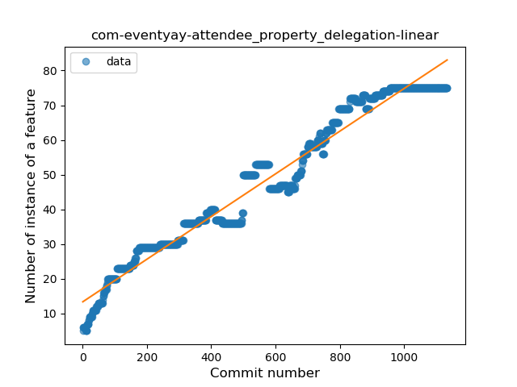

#### com-esafirm-androidplayground
* Feature: Unsafe Call
* Function: 
* R_Squared: 0.96257076
 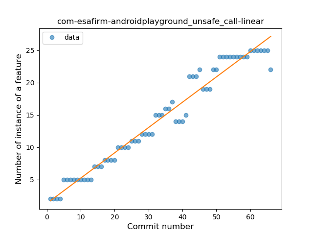

#### com-github-quarck-calnotify
* Feature: Type Inference
* Function: 
* R_Squared: 0.96231495
 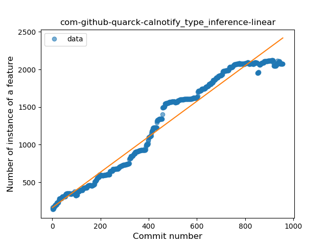

#### me-proxer-app
* Feature: Inline Function
* Function: 
* R_Squared: 0.96196902
 

#### com-orgzly
* Feature: Function with Default Value
* Function: 
* R_Squared: 0.96191579
 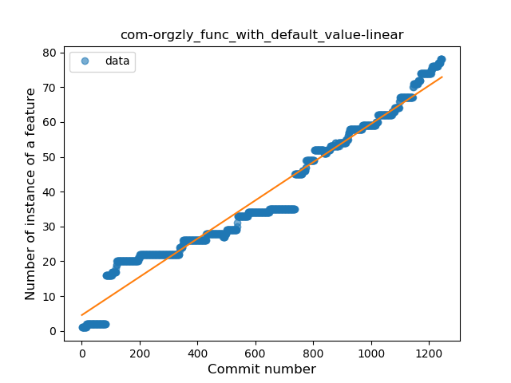

#### ca-josephroque-bowlingcompanion
* Feature: String Template
* Function: 
* R_Squared: 0.96168077
 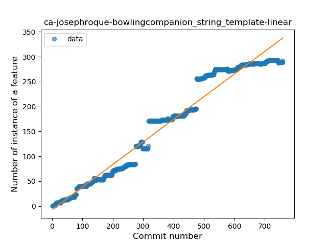

#### com-dozingcatsoftware-vectorcamera
* Feature: Lambda
* Function: 
* R_Squared: 0.96148717
 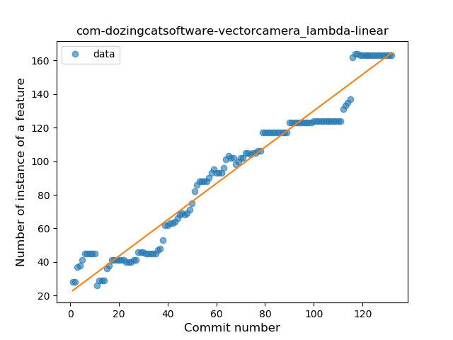

#### com-keylesspalace-tusky
* Feature: Function with Default Value
* Function: 
* R_Squared: 0.96147565
 

#### io-github-feelfreelinux-wykopmobilny
* Feature: Property Delegation
* Function: 
* R_Squared: 0.96145165
 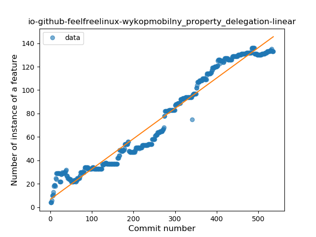

#### ryey-easer-beta
* Feature: Type Inference
* Function: 
* R_Squared: 0.96137293
 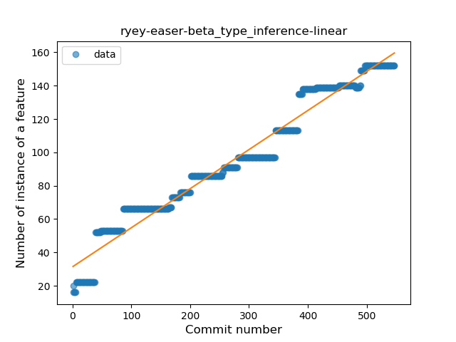

#### link-standen-michael-phonesaver
* Feature: Type Inference
* Function: 
* R_Squared: 0.96136533
 

#### pw-janyo-janyoshare
* Feature: Companion Object
* Function: 
* R_Squared: 0.96073097
 

#### fr-openium-auvergnewebcams
* Feature: Safe Call
* Function: 
* R_Squared: 0.96042092
 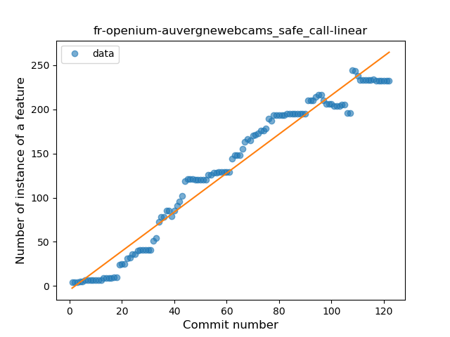

#### be-mygod-vpnhotspot
* Feature: When expression
* Function: 
* R_Squared: 0.96029074
 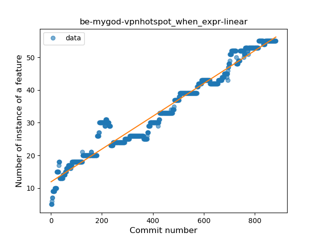

#### org-mozilla-rocket
* Feature: Extension Function
* Function: 
* R_Squared: 0.9602668
 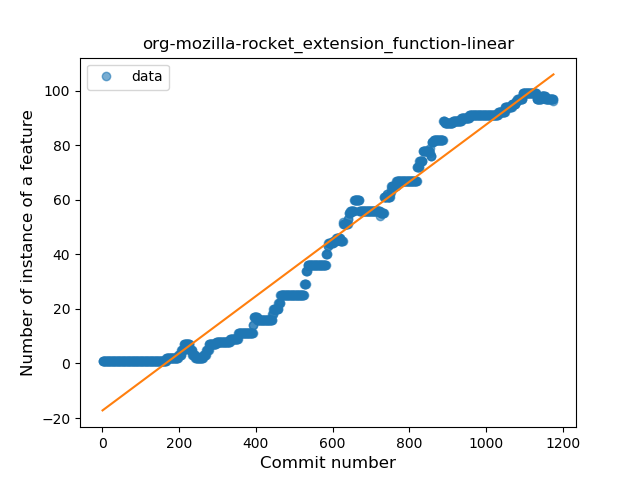

#### io-github-feelfreelinux-wykopmobilny
* Feature: Lambda
* Function: 
* R_Squared: 0.96026507
 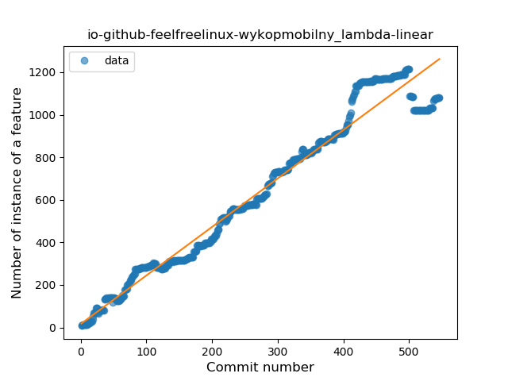

#### com-booboot-vndbandroid
* Feature: Safe Call
* Function: 
* R_Squared: 0.95993972
 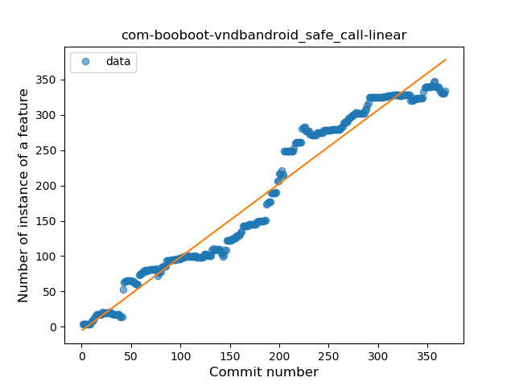

#### cat-pantsu-nyaapantsu
* Feature: Companion Object
* Function: 
* R_Squared: 0.95976786
 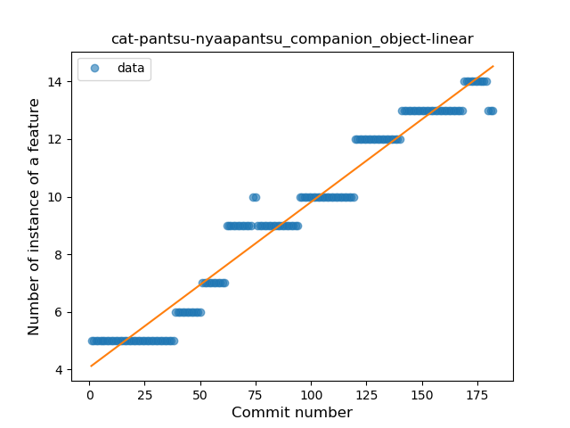

#### org-pacien-tincapp
* Feature: Extension Function
* Function: 
* R_Squared: 0.95893559
 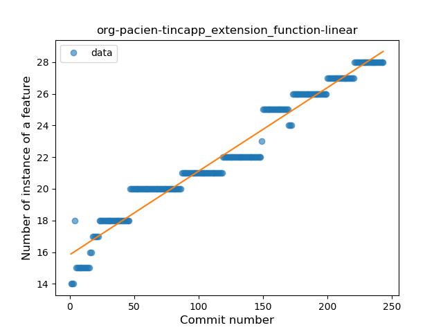

#### se-creotec-chscardbalance2
* Feature: Lambda
* Function: 
* R_Squared: 0.95889755
 

#### com-simplemobiletools-filemanager-pro
* Feature: Type Inference
* Function: 
* R_Squared: 0.95842739
 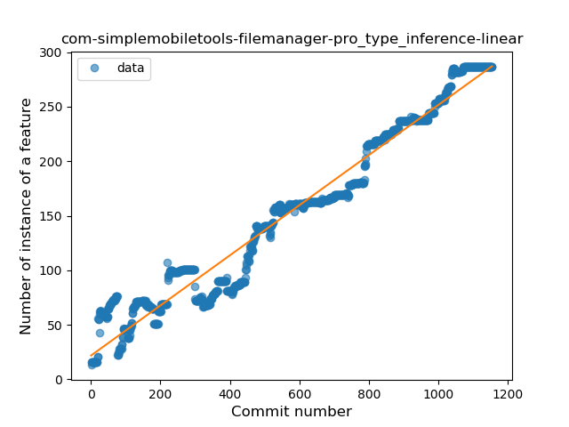

#### ca-fuwafuwa-kaku
* Feature: Companion Object
* Function: 
* R_Squared: 0.95814044
 

#### io-github-feelfreelinux-wykopmobilny
* Feature: Function call with Named Argument
* Function: 
* R_Squared: 0.95811929
 

#### org-ligi-passandroid
* Feature: Lambda
* Function: 
* R_Squared: 0.95789806
 

#### one-librem-social
* Feature: When expression
* Function: 
* R_Squared: 0.95788051
 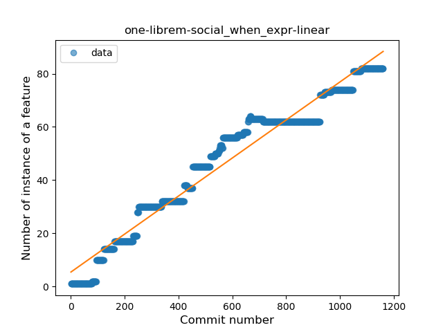

#### com-github-quarck-calnotify
* Feature: String Template
* Function: 
* R_Squared: 0.95765966
 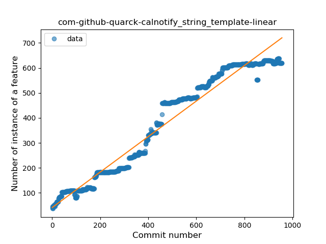

#### fr-xgouchet-packageexplorer
* Feature: Type Inference
* Function: 
* R_Squared: 0.95751686
 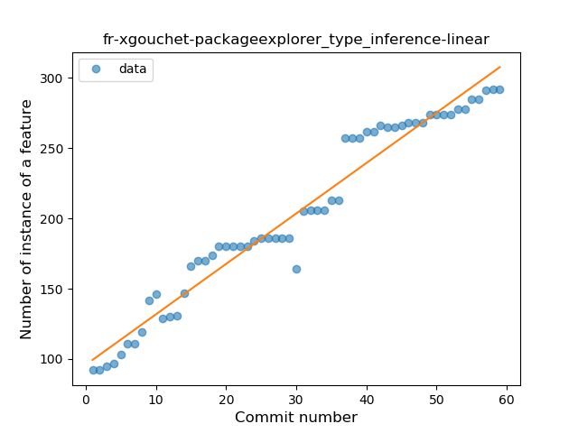

#### com-tasomaniac-openwith-floss
* Feature: Lambda
* Function: 
* R_Squared: 0.95725753
 

#### fr-openium-auvergnewebcams
* Feature: Singleton
* Function: 
* R_Squared: 0.95705936
 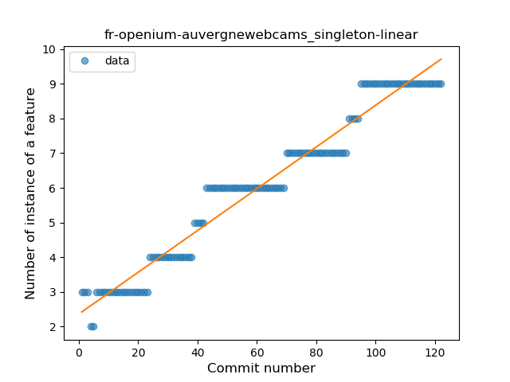

#### cz-dvratil-fbeventsync
* Feature: Safe Call
* Function: 
* R_Squared: 0.95703987
 

#### com-peterlaurence-trekme
* Feature: Lambda
* Function: 
* R_Squared: 0.957016
 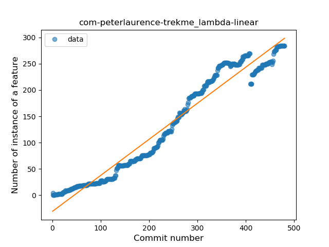

#### com-mgaetan89-showsrage
* Feature: Type Inference
* Function: 
* R_Squared: 0.95688553
 

#### org-walleth
* Feature: When expression
* Function: 
* R_Squared: 0.95643442
 

#### com-simplemobiletools-calendar-pro
* Feature: Lambda
* Function: 
* R_Squared: 0.95616295
 

#### ca-josephroque-bowlingcompanion
* Feature: Type Inference
* Function: 
* R_Squared: 0.9560291
 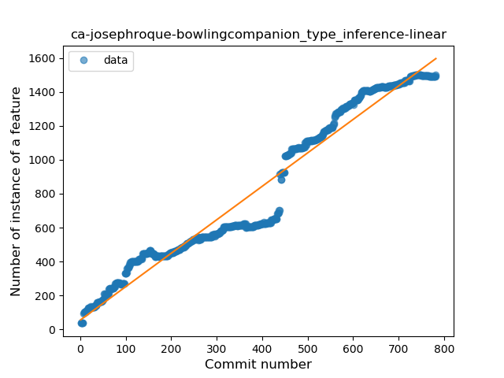

#### org-moire-ultrasonic
* Feature: Type Inference
* Function: 
* R_Squared: 0.95598092
 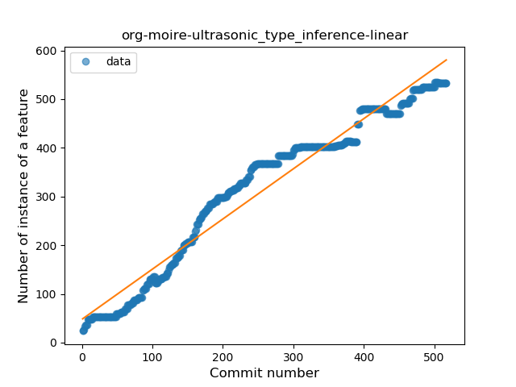

#### com-duckduckgo-mobile-android
* Feature: Singleton
* Function: 
* R_Squared: 0.95579592
 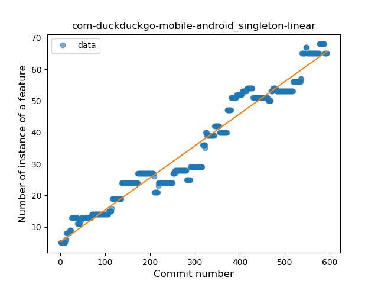

#### ch-rmy-android-http_shortcuts
* Feature: When expression
* Function: 
* R_Squared: 0.95554809
 

#### org-mariotaku-twidere
* Feature: Data Class
* Function: 
* R_Squared: 0.95519266
 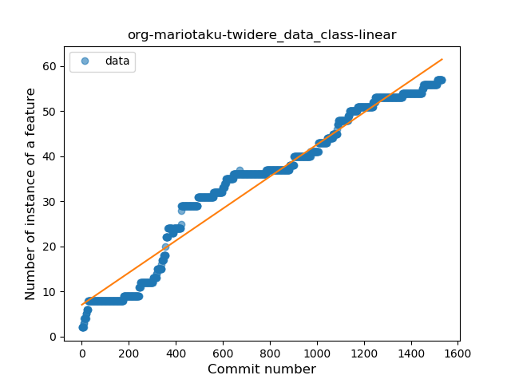

#### li-klass-fhem
* Feature: Lambda
* Function: 
* R_Squared: 0.9551463
 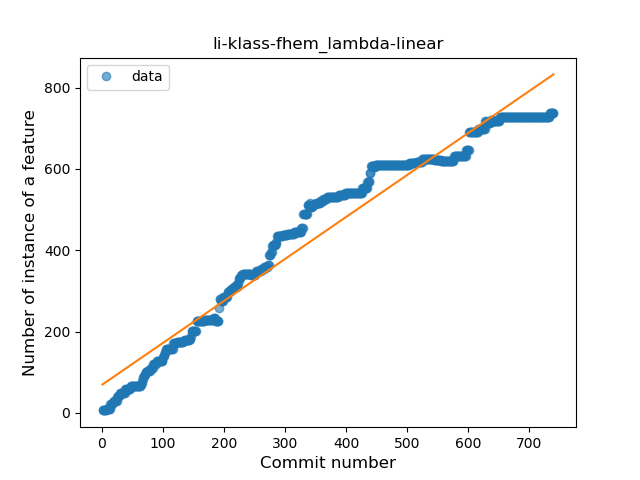

#### com-orgzly
* Feature: Type Inference
* Function: 
* R_Squared: 0.95499723
 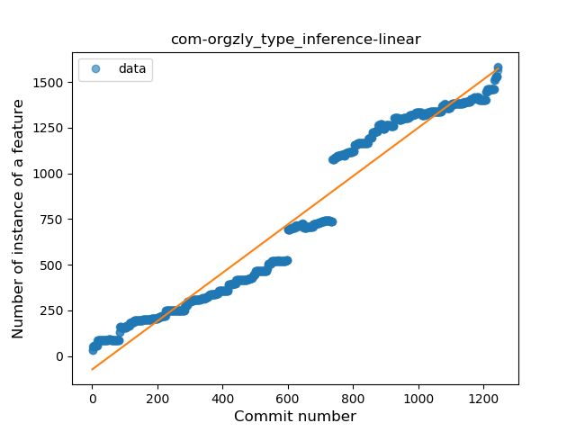

#### ch-rmy-android-http_shortcuts
* Feature: Property Delegation
* Function: 
* R_Squared: 0.95498744
 

#### com-eventyay-attendee
* Feature: String Template
* Function: 
* R_Squared: 0.95454871
 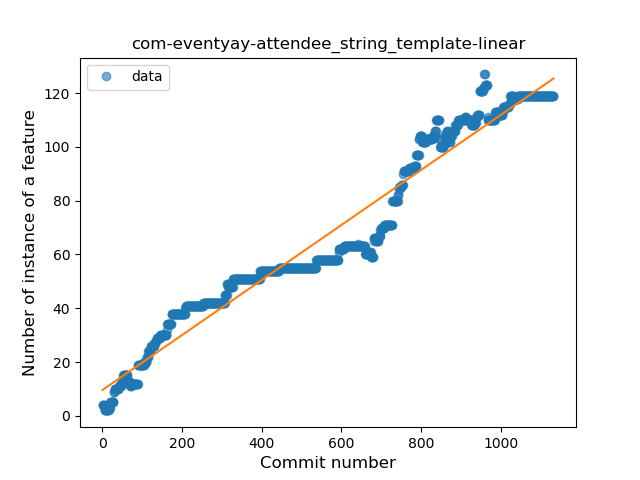

#### com-simplemobiletools-notes-pro
* Feature: When expression
* Function: 
* R_Squared: 0.95449463
 

#### ryey-easer-beta
* Feature: Companion Object
* Function: 
* R_Squared: 0.95436254
 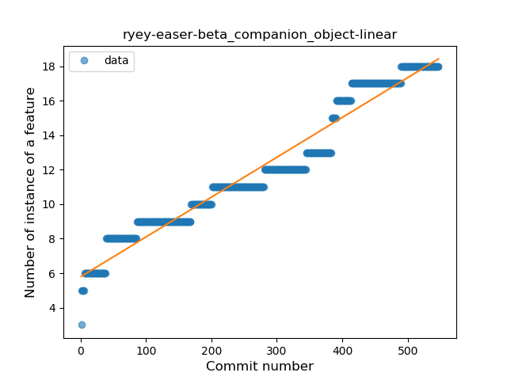

#### com-jereksel-libresubstratum
* Feature: Type Inference
* Function: 
* R_Squared: 0.95406163
 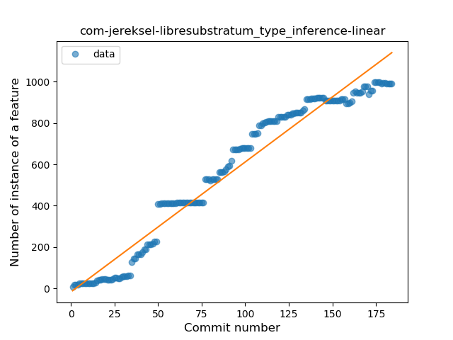

#### org-eurofurence-connavigator
* Feature: Lambda
* Function: 
* R_Squared: 0.95398546
 

#### one-librem-social
* Feature: Function with Default Value
* Function: 
* R_Squared: 0.95394976
 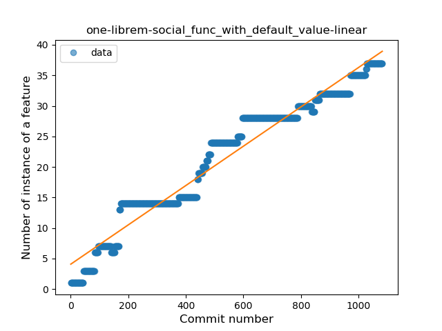

#### com-dozingcatsoftware-vectorcamera
* Feature: Type Inference
* Function: 
* R_Squared: 0.9539219
 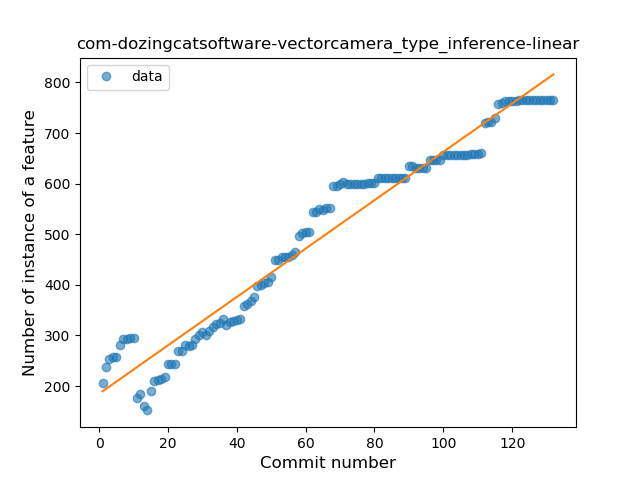

#### se-barsk-park
* Feature: Lambda
* Function: 
* R_Squared: 0.95390199
 

#### me-proxer-app
* Feature: When expression
* Function: 
* R_Squared: 0.95378945
 

#### it-diab
* Feature: Lambda
* Function: 
* R_Squared: 0.95348153
 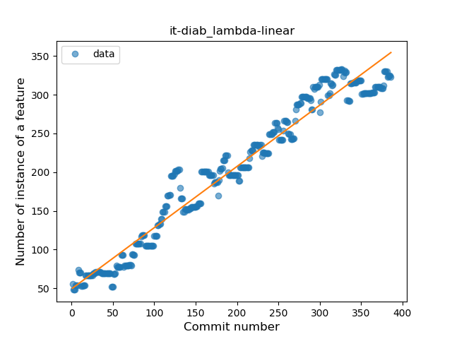

#### org-kaqui
* Feature: When expression
* Function: 
* R_Squared: 0.95344147
 

#### com-wabadaba-dziennik
* Feature: Destructuring Declaration
* Function: 
* R_Squared: 0.95312566
 

#### com-adityakamble49-dcipher
* Feature: Type Inference
* Function: 
* R_Squared: 0.9530286
 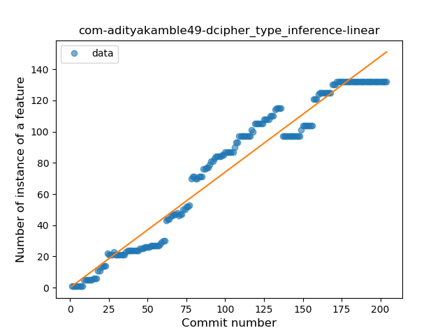

#### com-fastaccess-github-libre
* Feature: Companion Object
* Function: 
* R_Squared: 0.95289903
 

#### com-log28
* Feature: Lambda
* Function: 
* R_Squared: 0.95289787
 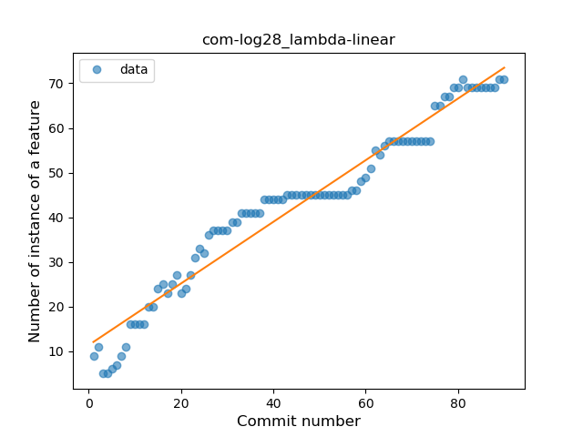

#### is-xyz-mpv
* Feature: Type Inference
* Function: 
* R_Squared: 0.95284239
 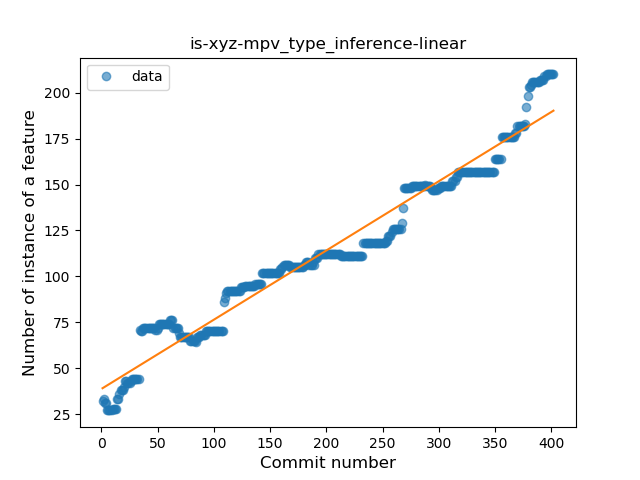

#### com-arcao-geocaching4locus
* Feature: Safe Call
* Function: 
* R_Squared: 0.95270425
 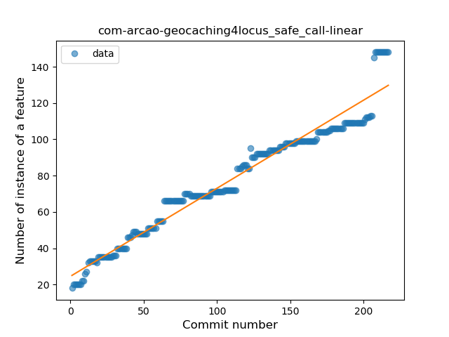

#### com-utazukin-ichaival
* Feature: When expression
* Function: 
* R_Squared: 0.95268055
 

#### uk-co-richyhbm-monochromatic
* Feature: Lambda
* Function: 
* R_Squared: 0.95239615
 

#### org-mozilla-focus
* Feature: Smart Cast
* Function: 
* R_Squared: 0.9521892
 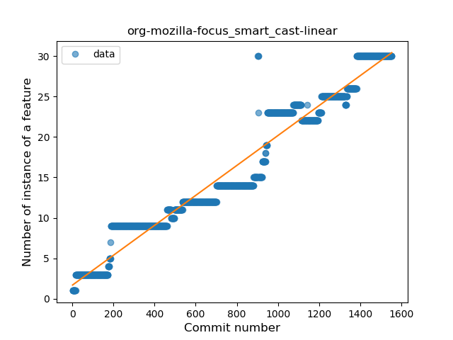

#### org-mozilla-klar
* Feature: Smart Cast
* Function: 
* R_Squared: 0.9521892
 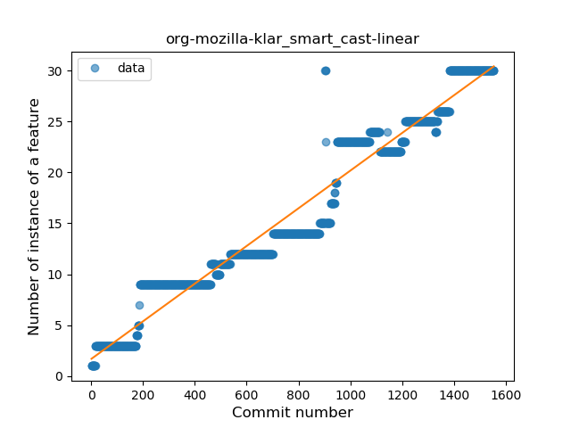

#### io-github-feelfreelinux-wykopmobilny
* Feature: Type Inference
* Function: 
* R_Squared: 0.95183353
 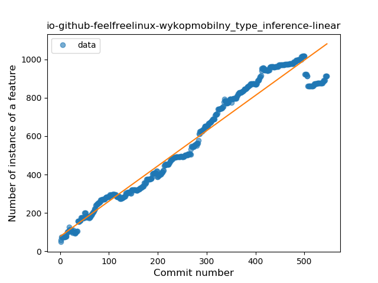

#### com-benoitquenaudon-tvfoot-red
* Feature: String Template
* Function: 
* R_Squared: 0.95172662
 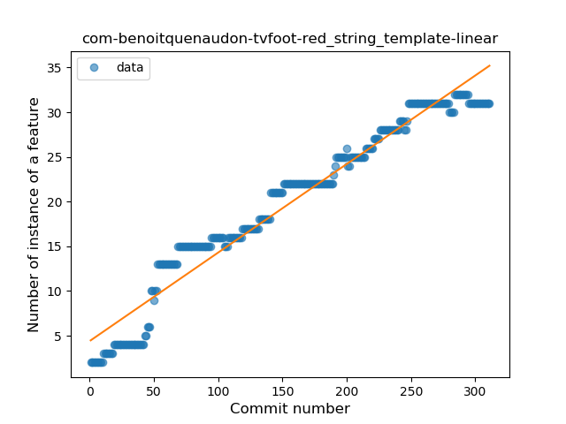

#### com-zacharee1-systemuituner
* Feature: Type Inference
* Function: 
* R_Squared: 0.95165517
 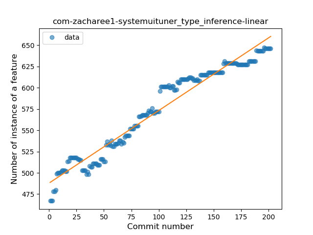

#### org-mosad-seil0-projectlaogai
* Feature: Lambda
* Function: 
* R_Squared: 0.95106204
 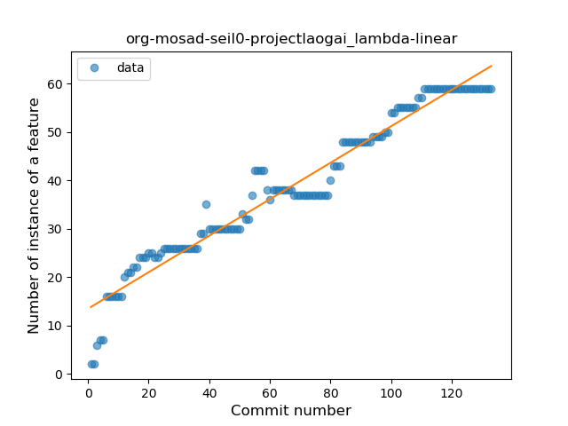

#### se-creotec-chscardbalance2
* Feature: Type Inference
* Function: 
* R_Squared: 0.95071882
 

#### com-fallgamlet-dnestrcinema
* Feature: Type Inference
* Function: 
* R_Squared: 0.95033985
 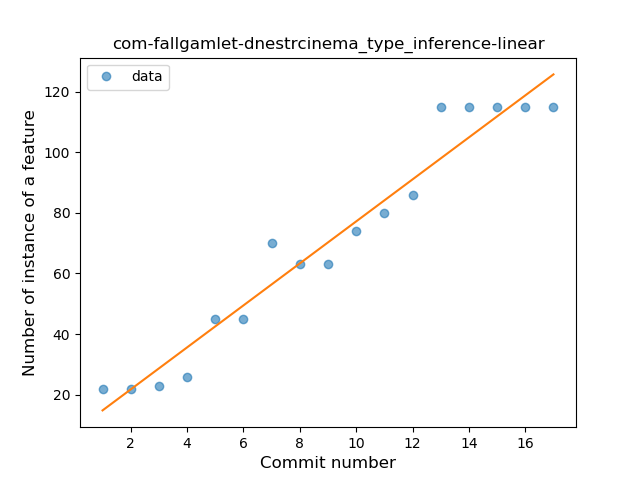

#### de-ph1b-audiobook
* Feature: Function with Default Value
* Function: 
* R_Squared: 0.95000847
 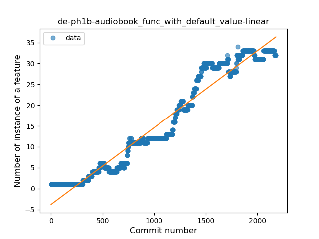

#### me-impa-knockonports
* Feature: When expression
* Function: 
* R_Squared: 0.94996462
 

#### org-ligi-survivalmanual
* Feature: Lambda
* Function: 
* R_Squared: 0.94990156
 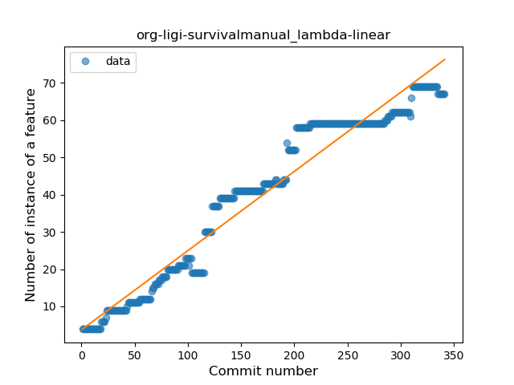

#### com-log28
* Feature: Safe Call
* Function: 
* R_Squared: 0.94933377
 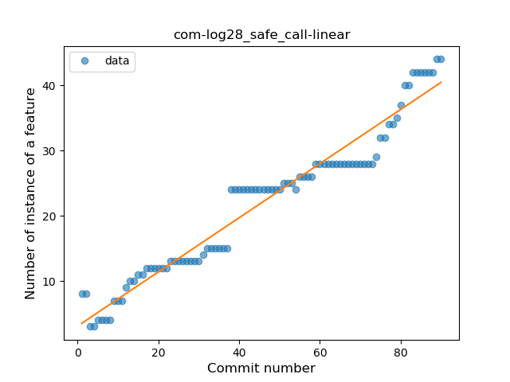

#### jp-toastkid-yobidashi
* Feature: String Template
* Function: 
* R_Squared: 0.9492711
 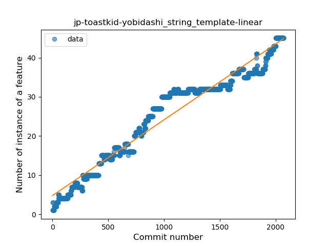

#### com-duckduckgo-mobile-android
* Feature: Sealed Class
* Function: 
* R_Squared: 0.94903958
 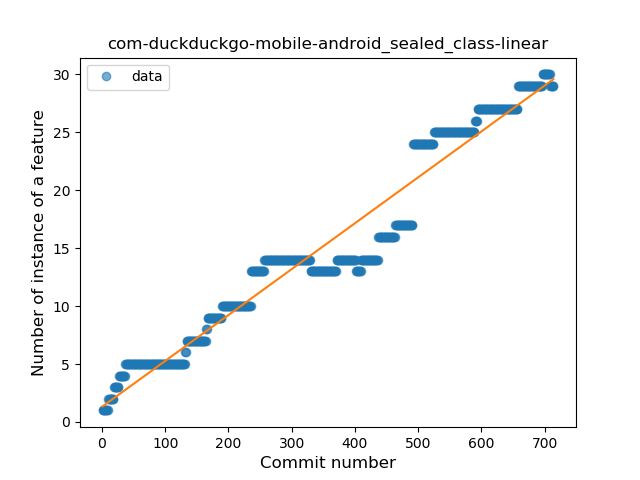

#### eu-kanade-tachiyomi
* Feature: String Template
* Function: 
* R_Squared: 0.94900989
 

#### pixel-kotlin-bassblog
* Feature: Lambda
* Function: 
* R_Squared: 0.94890958
 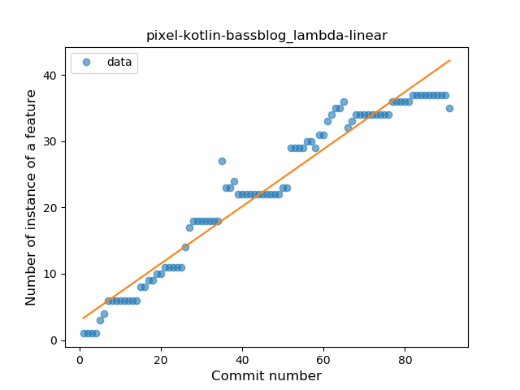

#### com-tasomaniac-openwith-floss
* Feature: Extension Function
* Function: 
* R_Squared: 0.94863393
 

#### uk-colessoft-android-hilllist
* Feature: Safe Call
* Function: 
* R_Squared: 0.94859311
 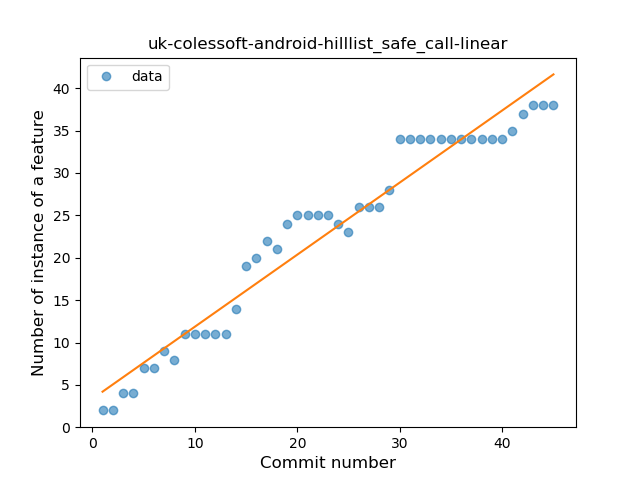

#### com-keylesspalace-tusky
* Feature: Data Class
* Function: 
* R_Squared: 0.94815425
 

#### com-github-quarck-calnotify
* Feature: Companion Object
* Function: 
* R_Squared: 0.94782818
 

#### com-ianhanniballake-contractiontimer
* Feature: Lambda
* Function: 
* R_Squared: 0.94775165
 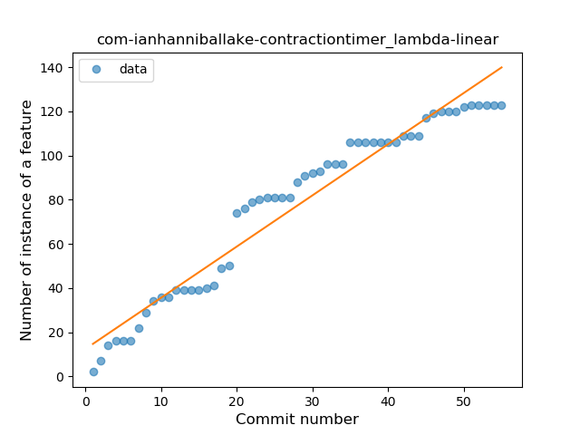

#### com-commit451-gitlab
* Feature: Property Delegation
* Function: 
* R_Squared: 0.94761734
 

#### com-corphish-nightlight-generic
* Feature: Type Inference
* Function: 
* R_Squared: 0.94731213
 

#### com-keylesspalace-tusky
* Feature: Unsafe Call
* Function: 
* R_Squared: 0.94723045
 

#### io-github-feelfreelinux-wykopmobilny
* Feature: Companion Object
* Function: 
* R_Squared: 0.94696636
 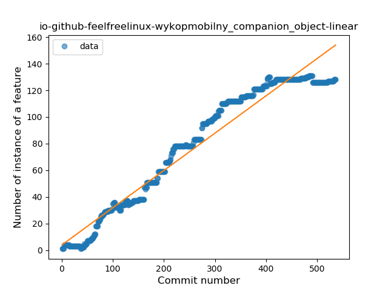

#### eu-kanade-tachiyomi
* Feature: Singleton
* Function: 
* R_Squared: 0.94690015
 

#### org-mozilla-focus
* Feature: Singleton
* Function: 
* R_Squared: 0.94654779
 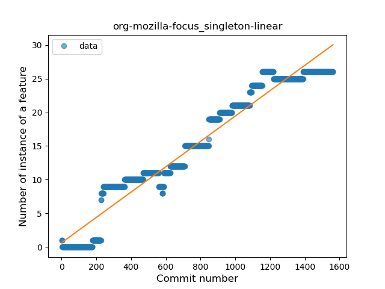

#### org-mozilla-klar
* Feature: Singleton
* Function: 
* R_Squared: 0.94654779
 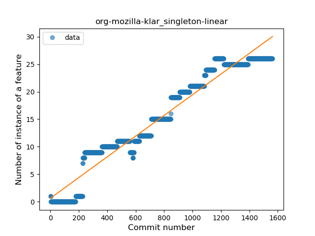

#### org-fossasia-badgemagic
* Feature: Type Inference
* Function: 
* R_Squared: 0.94627912
 

#### org-emunix-insteadlauncher
* Feature: Lambda
* Function: 
* R_Squared: 0.94598679
 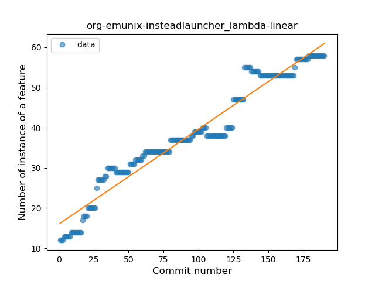

#### com-tasomaniac-openwith-floss
* Feature: Function with Default Value
* Function: 
* R_Squared: 0.94569189
 

#### com-bijoysingh-quicknote
* Feature: Singleton
* Function: 
* R_Squared: 0.94568461
 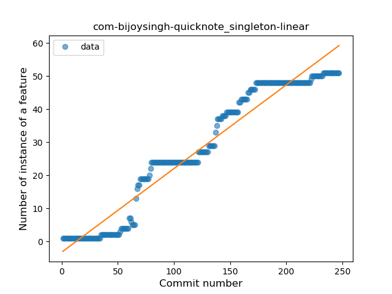

#### pl-temomuko-autostoprace
* Feature: Lambda
* Function: 
* R_Squared: 0.94560345
 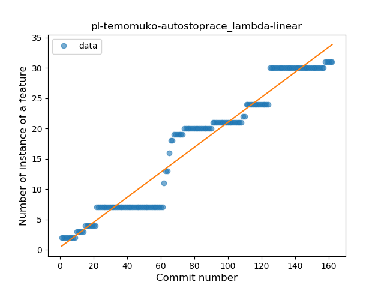

#### com-nononsenseapps-feeder
* Feature: Safe Call
* Function: 
* R_Squared: 0.94554087
 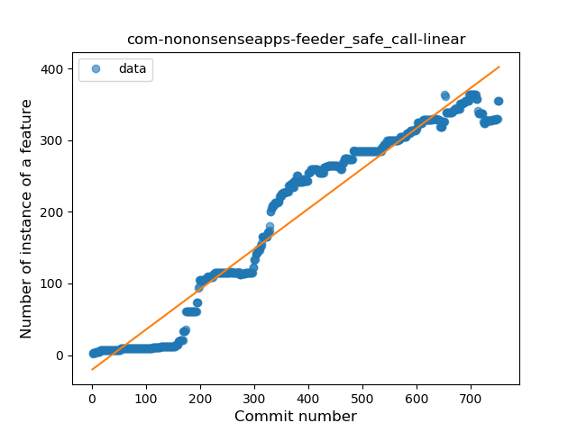

#### fr-chenry-android-freshrss
* Feature: Type Inference
* Function: 
* R_Squared: 0.94526744
 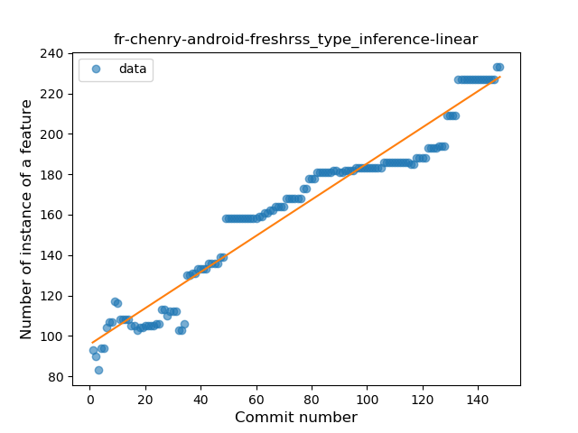

#### ca-josephroque-bowlingcompanion
* Feature: Safe Call
* Function: 
* R_Squared: 0.94509089
 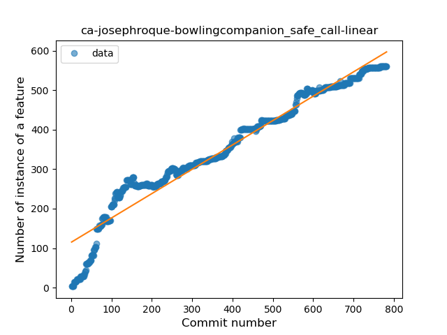

#### ca-rmen-android-poetassistant
* Feature: Unsafe Call
* Function: 
* R_Squared: 0.94506261
 

#### com-fastaccess-github-libre
* Feature: Unsafe Call
* Function: 
* R_Squared: 0.94488087
 

#### com-jereksel-libresubstratum
* Feature: String Template
* Function: 
* R_Squared: 0.94487357
 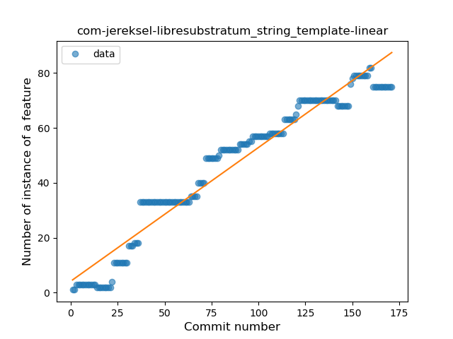

#### com-fsck-k9
* Feature: Unsafe Call
* Function: 
* R_Squared: 0.94479117
 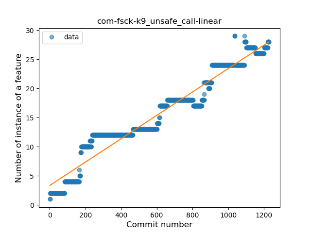

#### org-walleth
* Feature: Extension Function
* Function: 
* R_Squared: 0.94469898
 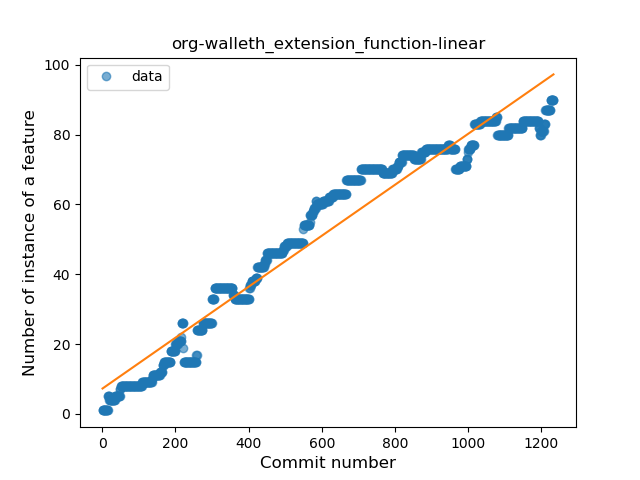

#### fi-tuska-jalkametri
* Feature: Companion Object
* Function: 
* R_Squared: 0.94463605
 

#### com-dp-logcatapp
* Feature: Type Inference
* Function: 
* R_Squared: 0.94449728
 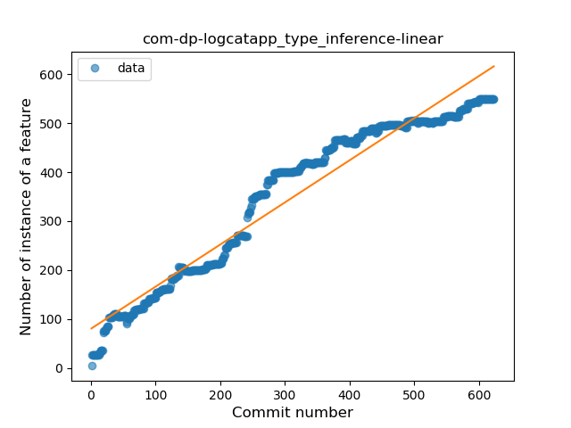

#### com-epimorphics-android-myrivers
* Feature: Type Inference
* Function: 
* R_Squared: 0.94438979
 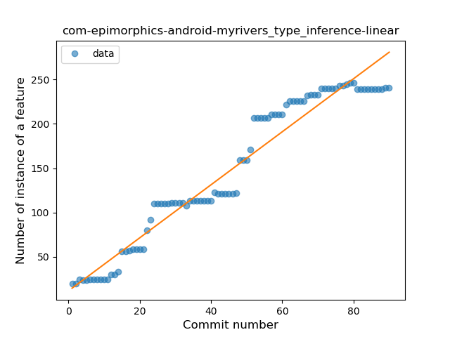

#### be-mygod-vpnhotspot
* Feature: Property Delegation
* Function: 
* R_Squared: 0.9441142
 

#### com-zacharee1-systemuituner
* Feature: Lambda
* Function: 
* R_Squared: 0.9437819
 

#### be-mygod-vpnhotspot
* Feature: Type Inference
* Function: 
* R_Squared: 0.9436627
 

#### xyz-hisname-fireflyiii
* Feature: When expression
* Function: 
* R_Squared: 0.94358437
 

#### ffc-app
* Feature: Function with Default Value
* Function: 
* R_Squared: 0.94343094
 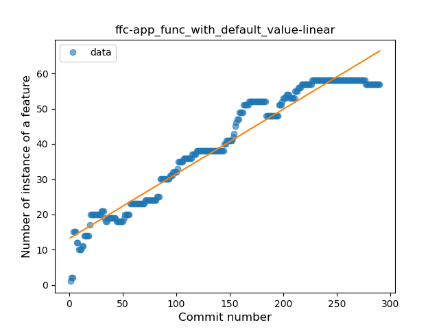

#### pl-hypeapp-episodie
* Feature: Function call with Named Argument
* Function: 
* R_Squared: 0.94328915
 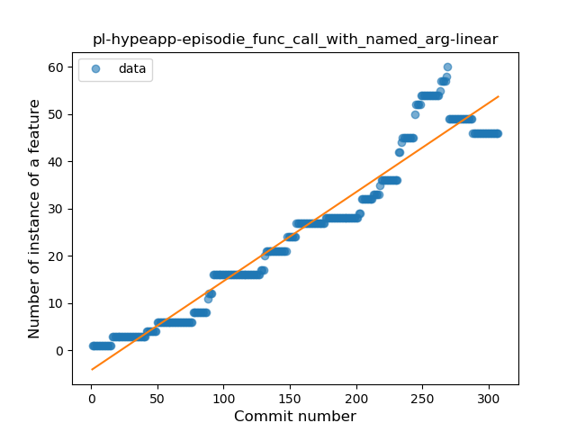

#### one-librem-social
* Feature: Data Class
* Function: 
* R_Squared: 0.94315563
 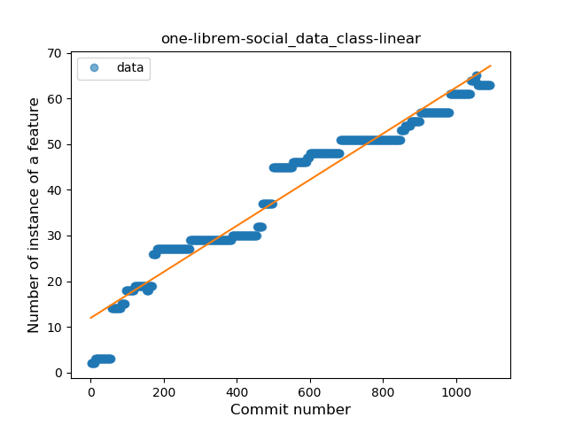

#### com-jereksel-libresubstratum
* Feature: Lambda
* Function: 
* R_Squared: 0.94292426
 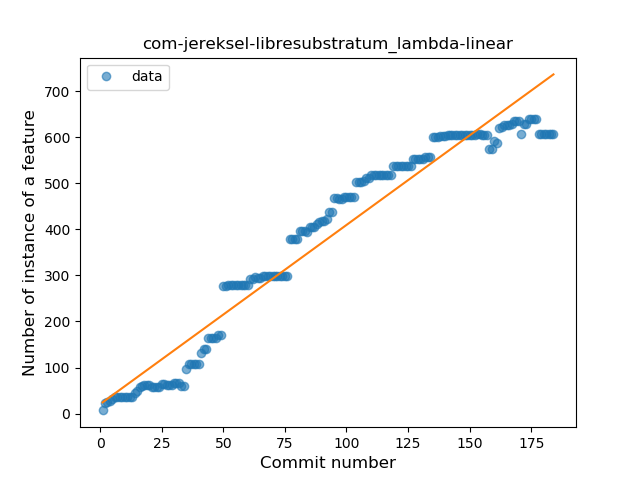

#### de-r4md4c-gamedealz
* Feature: When expression
* Function: 
* R_Squared: 0.94277324
 

#### info-papdt-express-helper
* Feature: Singleton
* Function: 
* R_Squared: 0.94262094
 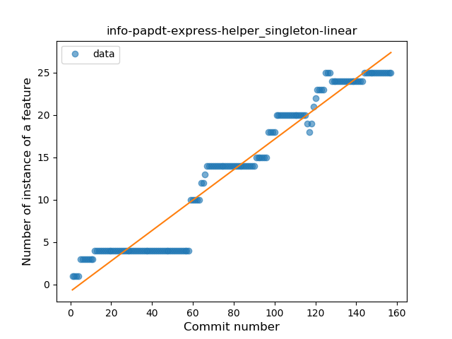

#### com-czbix-v2ex
* Feature: Type Inference
* Function: 
* R_Squared: 0.94210946
 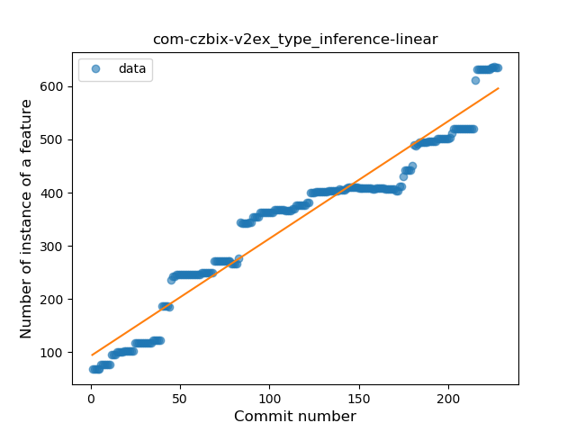

#### chat-rocket-android
* Feature: String Template
* Function: 
* R_Squared: 0.94189898
 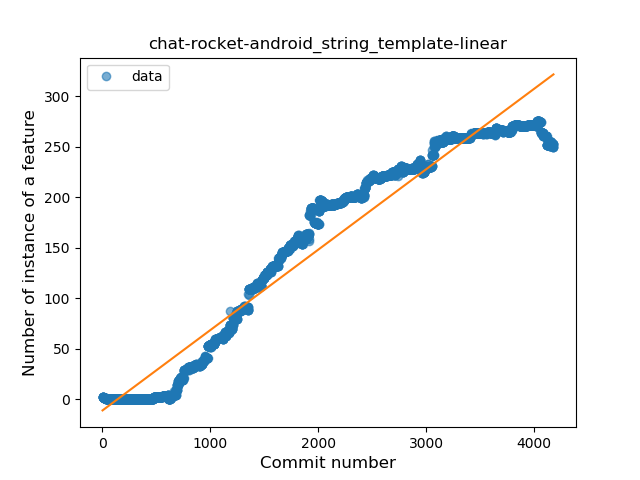

#### be-mygod-vpnhotspot
* Feature: Function with Default Value
* Function: 
* R_Squared: 0.9418969
 

#### de-r4md4c-gamedealz
* Feature: Type Inference
* Function: 
* R_Squared: 0.94188413
 

#### ch-abertschi-adfree
* Feature: Type Inference
* Function: 
* R_Squared: 0.94176664
 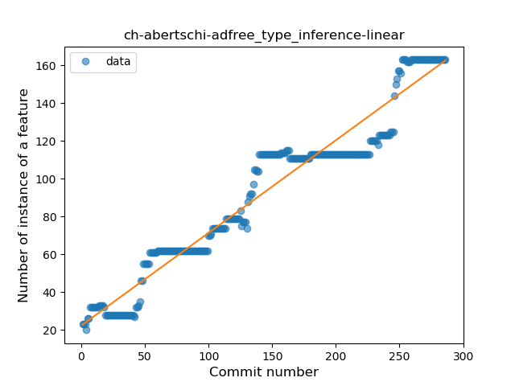

#### de-ph1b-audiobook
* Feature: Safe Call
* Function: 
* R_Squared: 0.94161139
 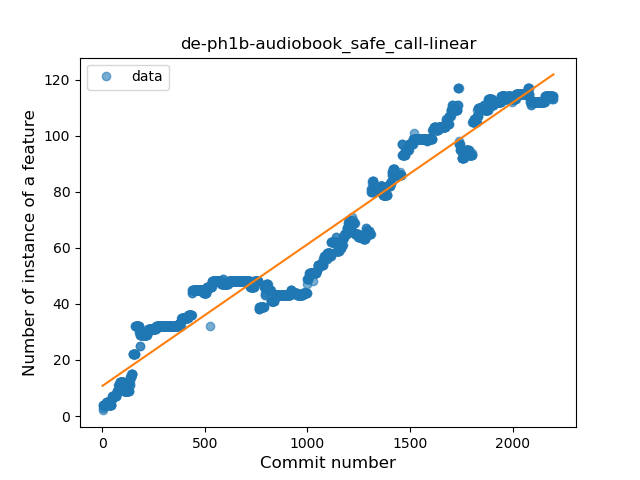

#### com-lavadip-miniVector
* Feature: Singleton
* Function: 
* R_Squared: 0.941443
 

#### acr-browser-lightning
* Feature: Lambda
* Function: 
* R_Squared: 0.94063305
 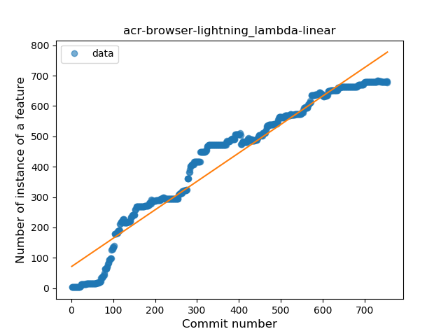

#### com-github-moko256-twitlatte
* Feature: Extension Function
* Function: 
* R_Squared: 0.94061346
 

#### be-mygod-vpnhotspot
* Feature: String Template
* Function: 
* R_Squared: 0.94056227
 

#### chat-rocket-android
* Feature: Function call with Named Argument
* Function: 
* R_Squared: 0.94037531
 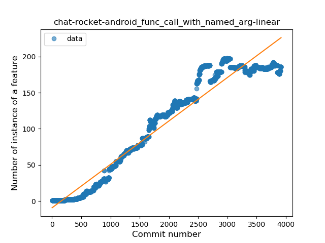

#### fr-openium-auvergnewebcams
* Feature: Type Inference
* Function: 
* R_Squared: 0.9402687
 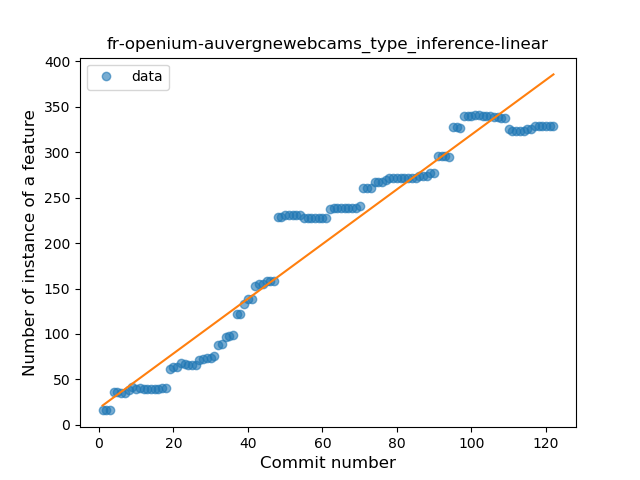

#### com-corphish-nightlight-generic
* Feature: String Template
* Function: 
* R_Squared: 0.94026659
 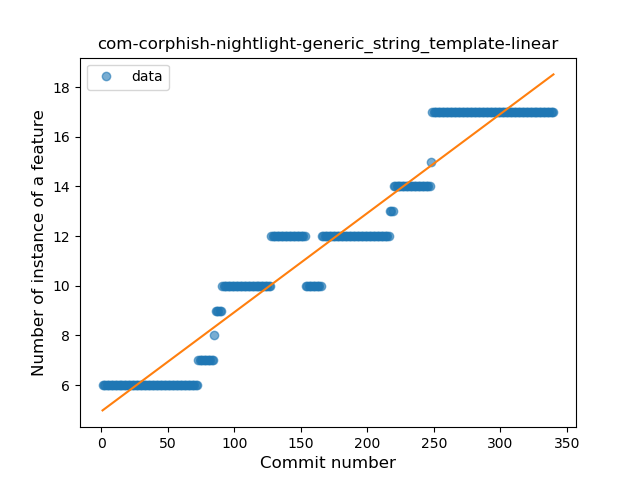

#### me-anon-grow
* Feature: Function with Default Value
* Function: 
* R_Squared: 0.94012978
 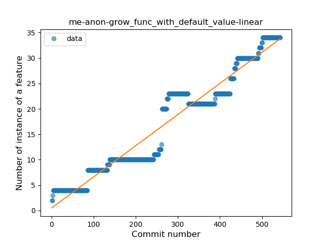

#### com-booboot-vndbandroid
* Feature: Property Delegation
* Function: 
* R_Squared: 0.93983243
 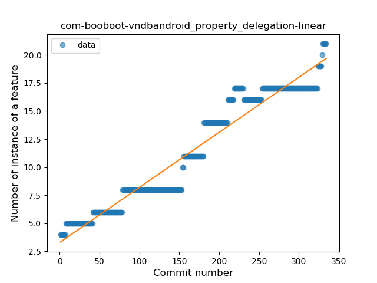

#### me-proxer-app
* Feature: Property Delegation
* Function: 
* R_Squared: 0.93963536
 

#### im-vector-alpha
* Feature: Type Inference
* Function: 
* R_Squared: 0.93953855
 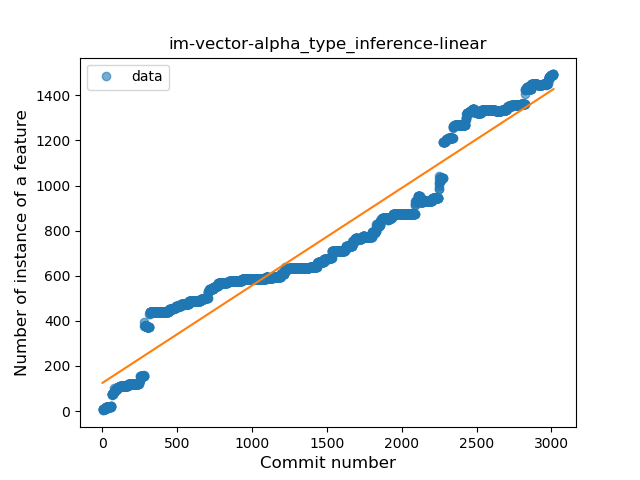

#### com-simplemobiletools-contacts-pro
* Feature: Lambda
* Function: 
* R_Squared: 0.93934409
 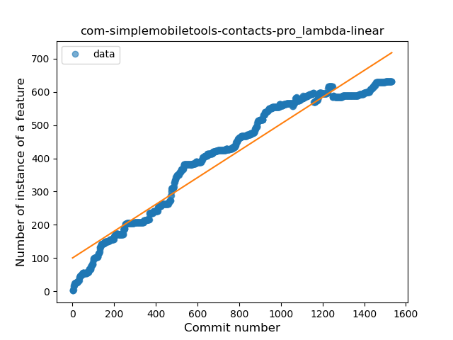

#### com-androidheads-vienna-escalero
* Feature: Lambda
* Function: 
* R_Squared: 0.93912341
 

#### im-vector-alpha
* Feature: Singleton
* Function: 
* R_Squared: 0.93910584
 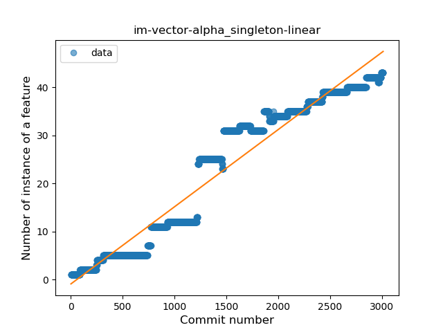

#### xyz-hisname-fireflyiii
* Feature: Type Inference
* Function: 
* R_Squared: 0.93896958
 

#### pl-org-seva-navigator
* Feature: Lambda
* Function: 
* R_Squared: 0.93896182
 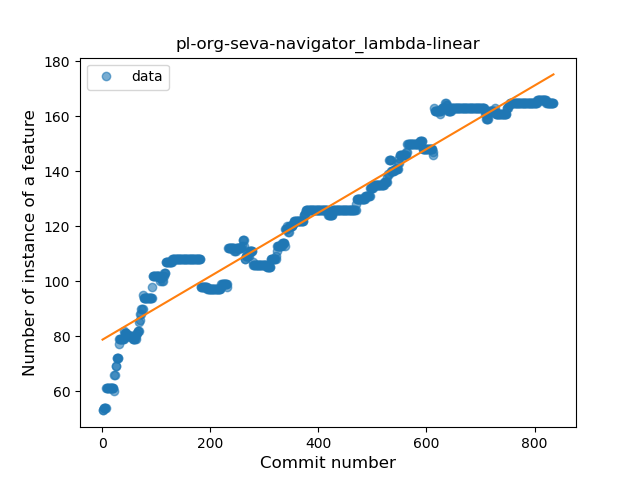

#### com-glodanif-bluetoothchat
* Feature: Extension Function
* Function: 
* R_Squared: 0.93771291
 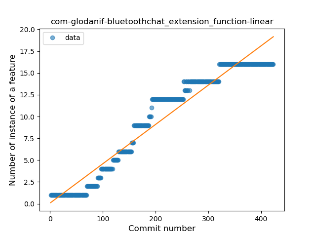

#### io-github-feelfreelinux-wykopmobilny
* Feature: Safe Call
* Function: 
* R_Squared: 0.93764632
 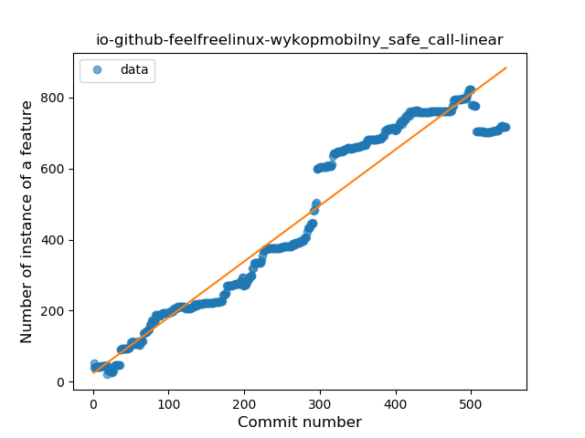

#### com-motion-stage1
* Feature: Companion Object
* Function: 
* R_Squared: 0.93688246
 

#### sreich-countthedays
* Feature: Type Inference
* Function: 
* R_Squared: 0.93680806
 

#### nl-mpcjanssen-simpletask
* Feature: String Template
* Function: 
* R_Squared: 0.93676977
 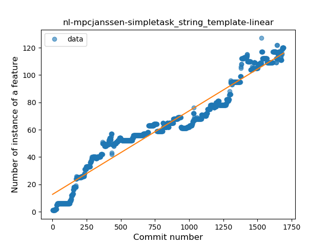

#### org-blitzortung-android-app
* Feature: String Template
* Function: 
* R_Squared: 0.93674167
 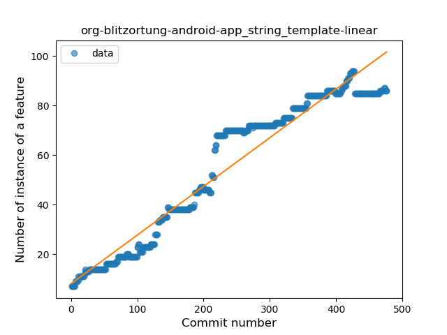

#### xyz-hisname-fireflyiii
* Feature: String Template
* Function: 
* R_Squared: 0.93657044
 

#### sreich-countthedays
* Feature: When expression
* Function: 
* R_Squared: 0.93653008
 

#### ai-susi
* Feature: Safe Call
* Function: 
* R_Squared: 0.93644215
 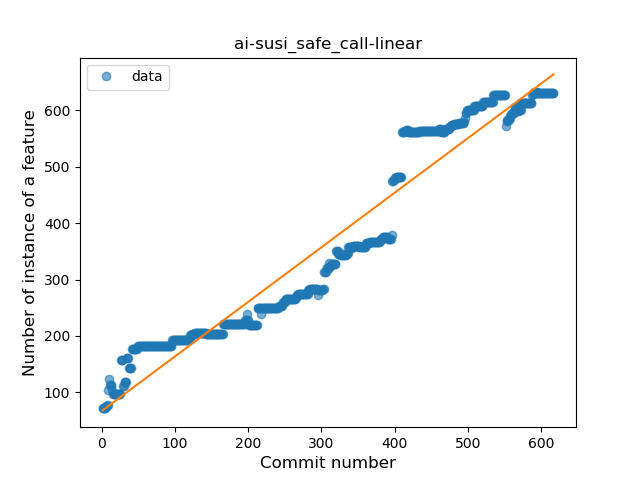

#### xyz-hisname-fireflyiii
* Feature: Function with Default Value
* Function: 
* R_Squared: 0.93634852
 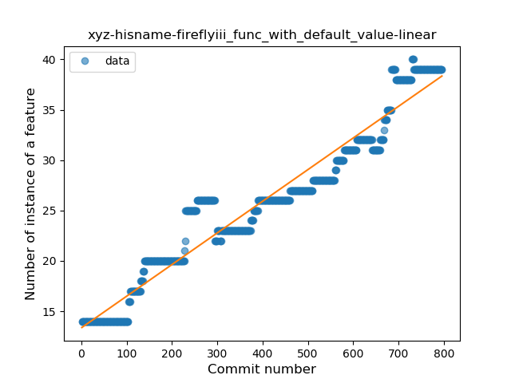

#### com-adityakamble49-dcipher
* Feature: Safe Call
* Function: 
* R_Squared: 0.93586449
 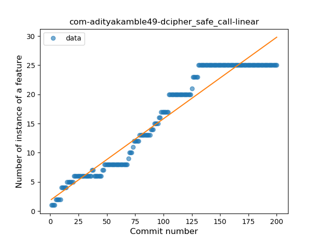

#### fr-openium-auvergnewebcams
* Feature: Lambda
* Function: 
* R_Squared: 0.9356614
 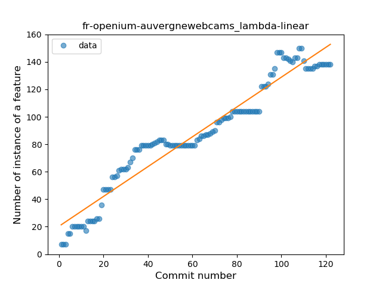

#### acr-browser-lightning
* Feature: Function call with Named Argument
* Function: 
* R_Squared: 0.93535061
 

#### com-simplemobiletools-gallery-pro
* Feature: String Template
* Function: 
* R_Squared: 0.93525194
 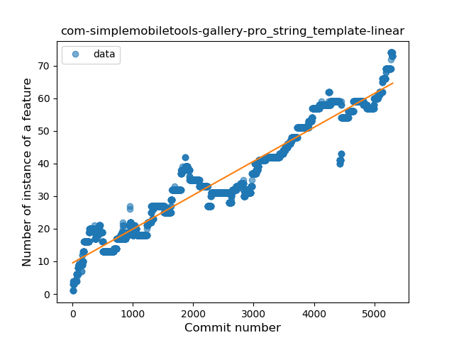

#### one-librem-social
* Feature: String Template
* Function: 
* R_Squared: 0.93407633
 

#### tw-shounenwind-kmnbottool
* Feature: Lambda
* Function: 
* R_Squared: 0.93406274
 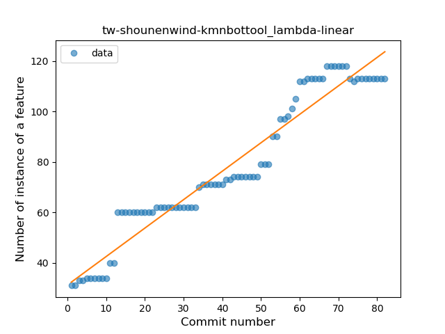

#### org-freedombox-freedombox
* Feature: Safe Call
* Function: 
* R_Squared: 0.93396823
 

#### eu-kanade-tachiyomi
* Feature: Destructuring Declaration
* Function: 
* R_Squared: 0.93381557
 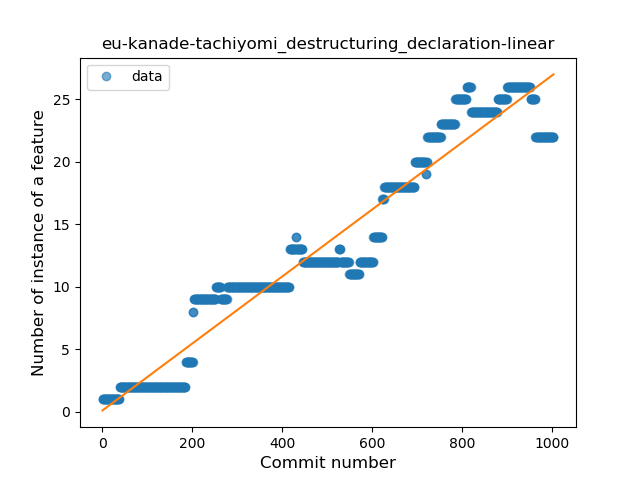

#### com-nononsenseapps-feeder
* Feature: Function call with Named Argument
* Function: 
* R_Squared: 0.93351532
 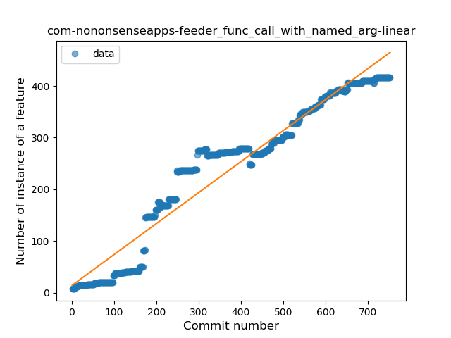

#### pl-hypeapp-episodie
* Feature: Extension Function
* Function: 
* R_Squared: 0.93335418
 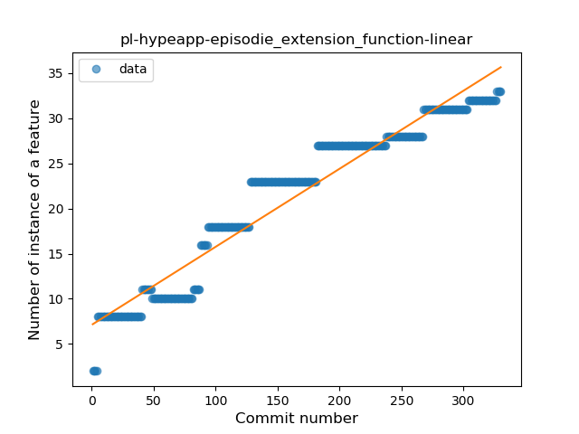

#### com-esafirm-androidplayground
* Feature: String Template
* Function: 
* R_Squared: 0.9333323
 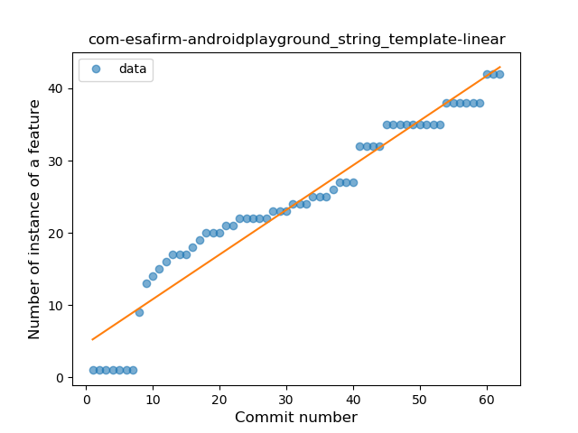

#### com-simplemobiletools-gallery
* Feature: Type Inference
* Function: 
* R_Squared: 0.93324545
 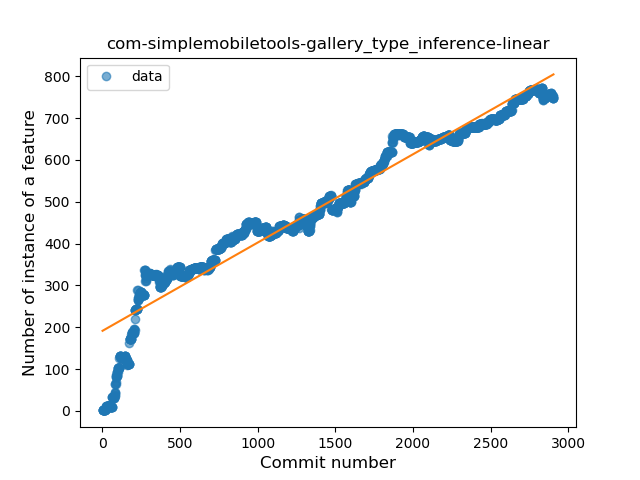

#### fr-cph-chicago-foss
* Feature: Data Class
* Function: 
* R_Squared: 0.93315263
 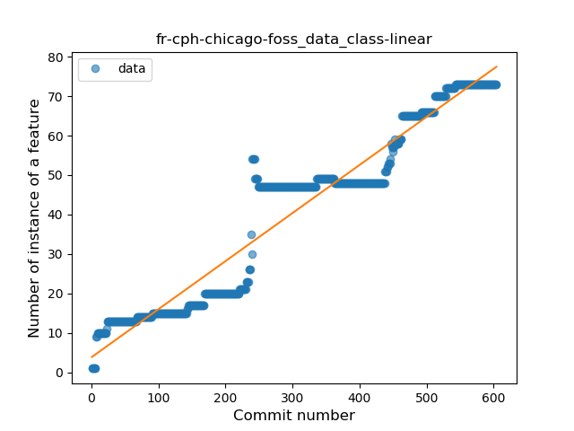

#### me-blog-korn123-easydiary
* Feature: Lambda
* Function: 
* R_Squared: 0.93227416
 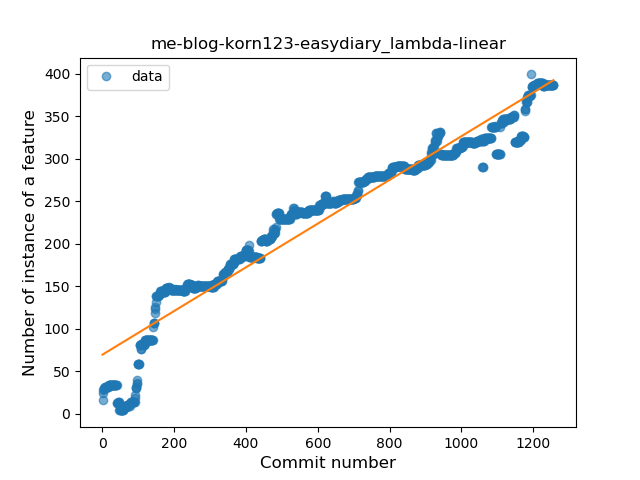

#### eu-kanade-tachiyomi
* Feature: Unsafe Call
* Function: 
* R_Squared: 0.93217315
 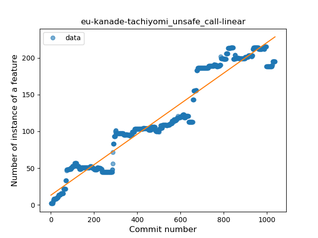

#### ch-rmy-android-http_shortcuts
* Feature: Companion Object
* Function: 
* R_Squared: 0.9320973
 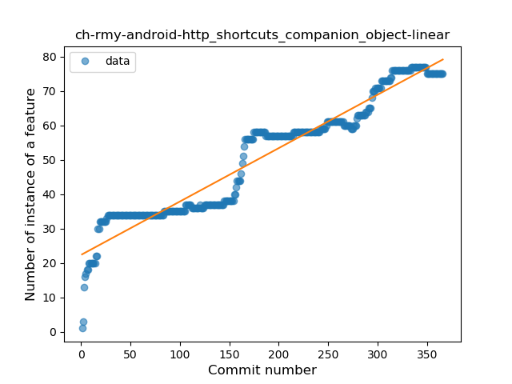

#### is-xyz-mpv
* Feature: When expression
* Function: 
* R_Squared: 0.93207957
 

#### uk-colessoft-android-hilllist
* Feature: Data Class
* Function: 
* R_Squared: 0.93192448
 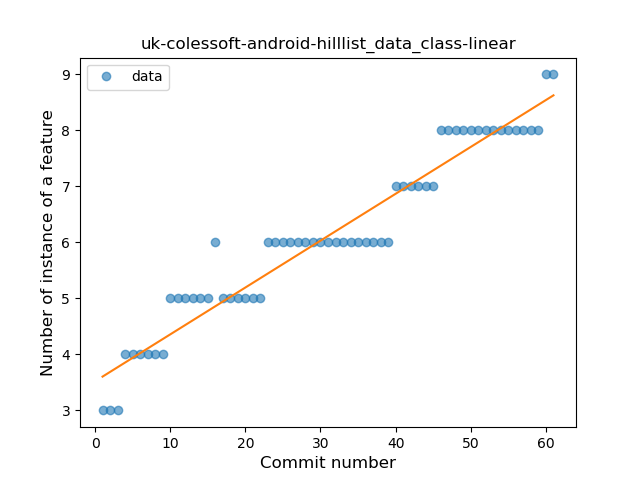

#### org-ligi-survivalmanual
* Feature: Unsafe Call
* Function: 
* R_Squared: 0.93174197
 

#### ffc-app
* Feature: Property Delegation
* Function: 
* R_Squared: 0.93169579
 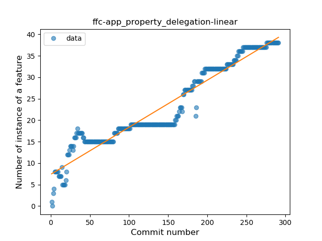

#### sreich-countthedays
* Feature: Unsafe Call
* Function: 
* R_Squared: 0.93152516
 

#### xyz-hisname-fireflyiii
* Feature: Lambda
* Function: 
* R_Squared: 0.93120739
 

#### ca-josephroque-bowlingcompanion
* Feature: Property Delegation
* Function: 
* R_Squared: 0.93081858
 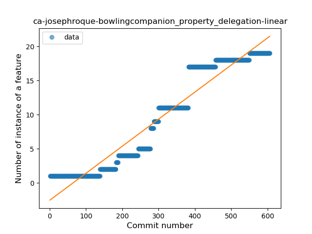

#### com-tutpro-baresip
* Feature: Type Inference
* Function: 
* R_Squared: 0.93051665
 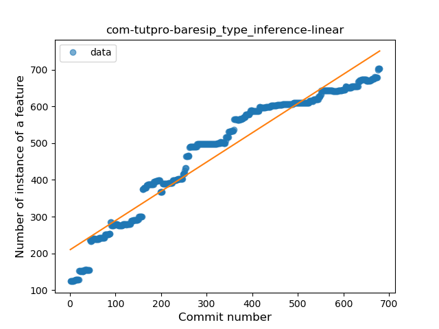

#### com-tutpro-baresip
* Feature: String Template
* Function: 
* R_Squared: 0.93026274
 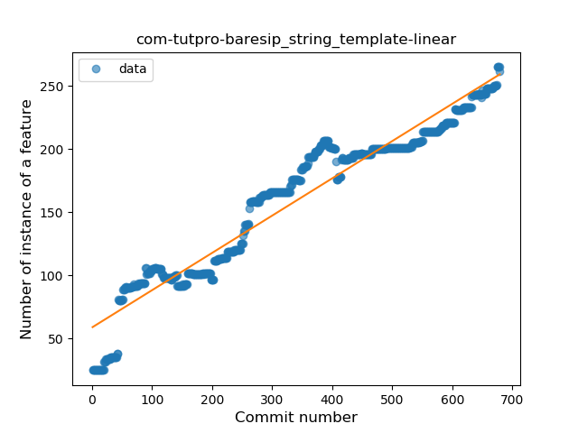

#### org-mozilla-rocket
* Feature: Property Delegation
* Function: 
* R_Squared: 0.93003623
 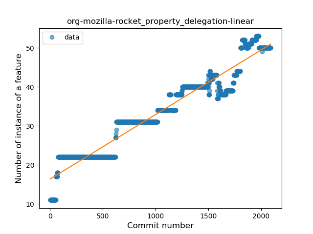

#### net-mm2d-dmsexplorer
* Feature: Singleton
* Function: 
* R_Squared: 0.92999479
 

#### ch-deletescape-lawnchair-plah
* Feature: Super Delegation
* Function: 
* R_Squared: 0.92965477
 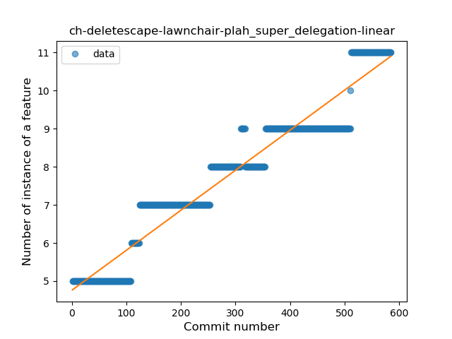

#### ffc-app
* Feature: Function call with Named Argument
* Function: 
* R_Squared: 0.92944699
 

#### fr-xgouchet-packageexplorer
* Feature: Lambda
* Function: 
* R_Squared: 0.92940545
 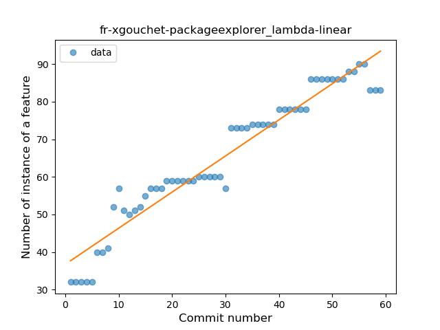

#### app-simone
* Feature: Companion Object
* Function: 
* R_Squared: 0.92939054
 

#### io-github-feelfreelinux-wykopmobilny
* Feature: String Template
* Function: 
* R_Squared: 0.92927566
 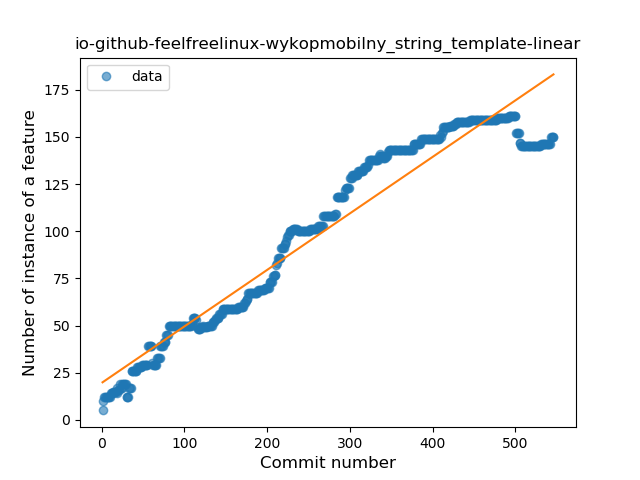

#### com-czbix-v2ex
* Feature: Companion Object
* Function: 
* R_Squared: 0.92915343
 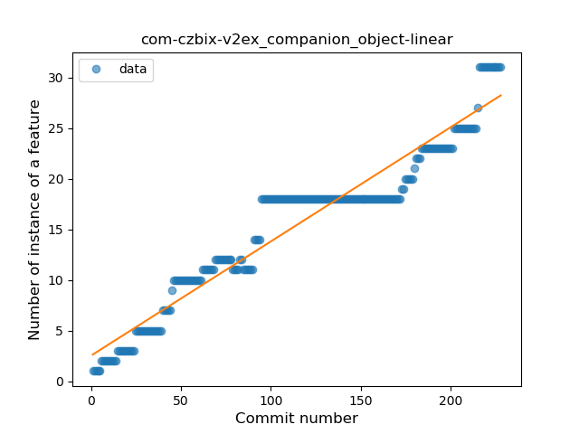

#### com-simplemobiletools-clock
* Feature: Safe Call
* Function: 
* R_Squared: 0.92915049
 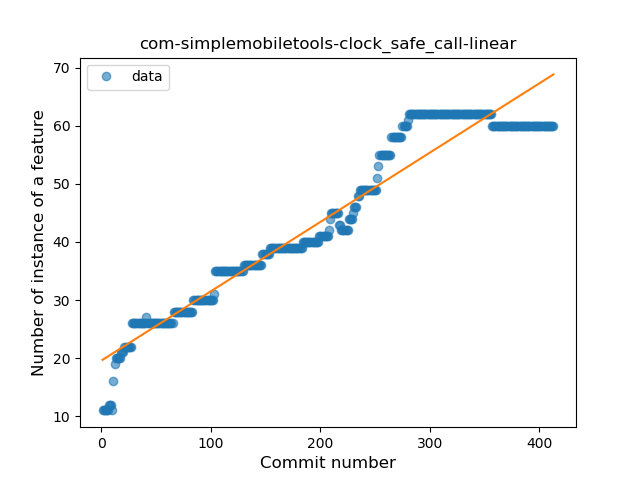

#### ch-rmy-android-http_shortcuts
* Feature: Destructuring Declaration
* Function: 
* R_Squared: 0.92901216
 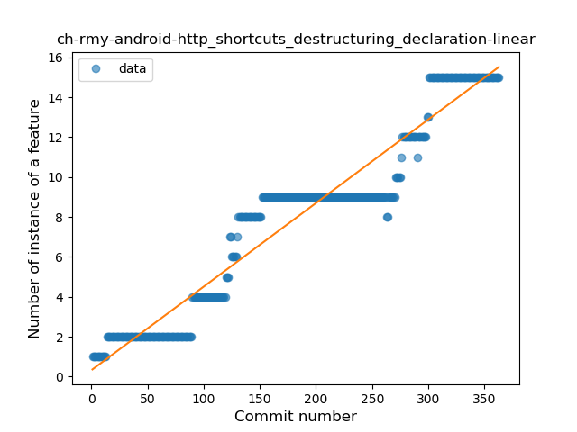

#### fr-cph-chicago-foss
* Feature: Lambda
* Function: 
* R_Squared: 0.92893674
 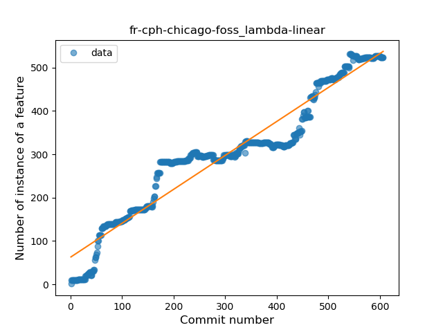

#### org-mozilla-rocket
* Feature: Overloaded Operator
* Function: 
* R_Squared: 0.9287069
 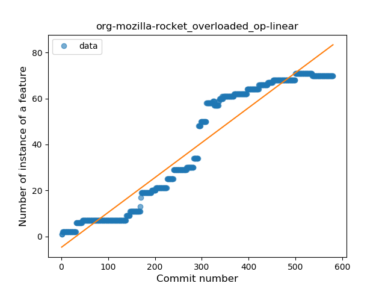

#### moe-feng-nhentai
* Feature: Unsafe Call
* Function: 
* R_Squared: 0.92851224
 

#### ml-adamsprogs-bimba
* Feature: Function with Default Value
* Function: 
* R_Squared: 0.9283195
 

#### info-papdt-express-helper
* Feature: When expression
* Function: 
* R_Squared: 0.92824613
 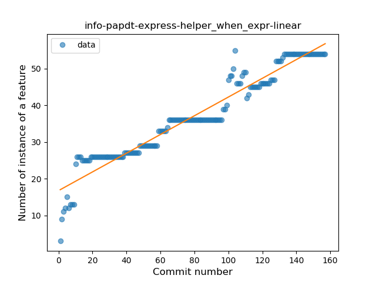

#### pl-hypeapp-episodie
* Feature: Data Class
* Function: 
* R_Squared: 0.92778246
 

#### eu-kanade-tachiyomi
* Feature: Safe Call
* Function: 
* R_Squared: 0.92747323
 

#### fr-xgouchet-packageexplorer
* Feature: Companion Object
* Function: 
* R_Squared: 0.92737363
 

#### es-usc-citius-servando-calendula
* Feature: Type Inference
* Function: 
* R_Squared: 0.92712348
 

#### eu-kanade-tachiyomi
* Feature: Range Expression
* Function: 
* R_Squared: 0.92686956
 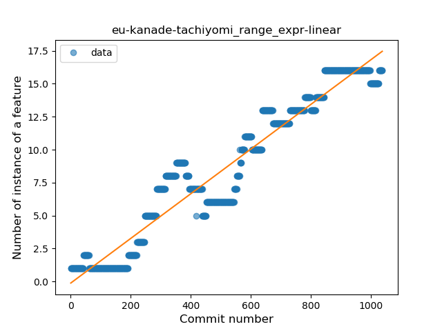

#### com-fastaccess-github-libre
* Feature: String Template
* Function: 
* R_Squared: 0.92672177
 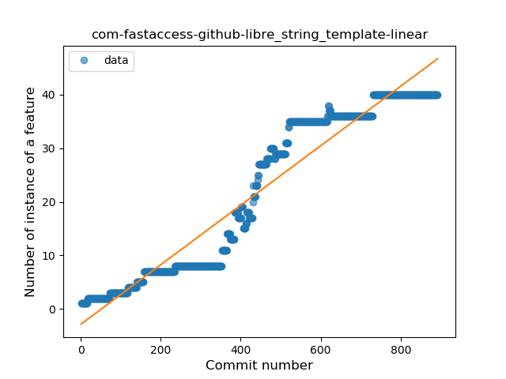

#### chat-rocket-android
* Feature: Extension Function
* Function: 
* R_Squared: 0.92666235
 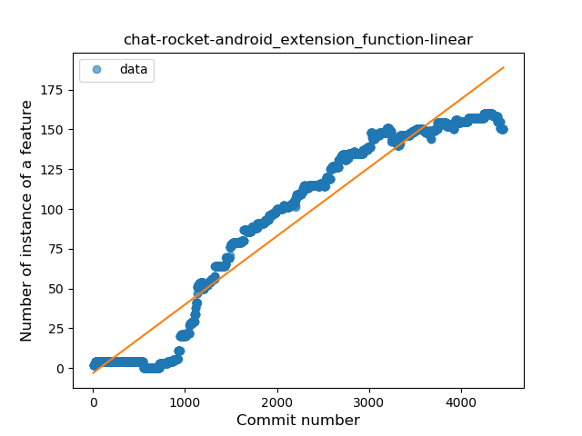

#### com-fsck-k9
* Feature: Function with Default Value
* Function: 
* R_Squared: 0.9263553
 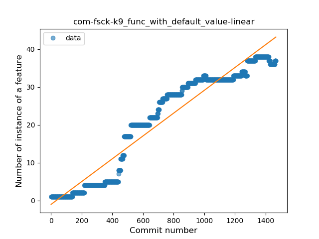

#### jp-toastkid-yobidashi
* Feature: When expression
* Function: 
* R_Squared: 0.92551497
 

#### jp-toastkid-yobidashi
* Feature: Companion Object
* Function: 
* R_Squared: 0.92509936
 

#### com-czbix-v2ex
* Feature: When expression
* Function: 
* R_Squared: 0.92450642
 

#### pw-janyo-whatanime
* Feature: Lambda
* Function: 
* R_Squared: 0.92384621
 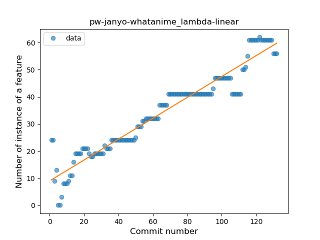

#### fr-free-nrw-commons
* Feature: Type Inference
* Function: 
* R_Squared: 0.92351173
 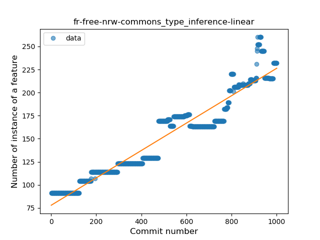

#### de-r4md4c-gamedealz
* Feature: Coroutine
* Function: 
* R_Squared: 0.92304647
 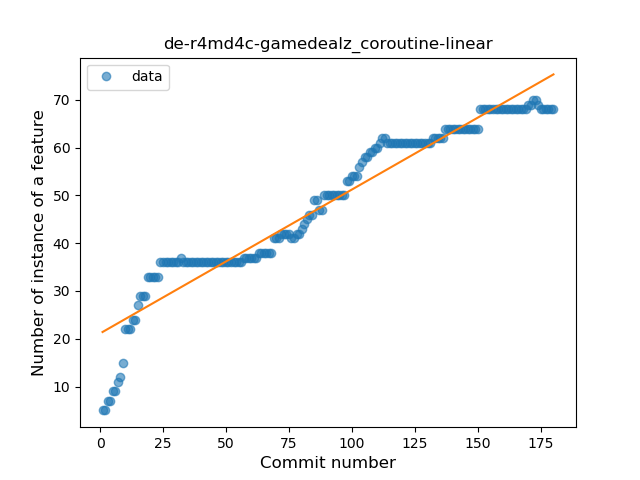

#### be-mygod-vpnhotspot
* Feature: Smart Cast
* Function: 
* R_Squared: 0.92303433
 

#### com-eventyay-attendee
* Feature: Data Class
* Function: 
* R_Squared: 0.92271126
 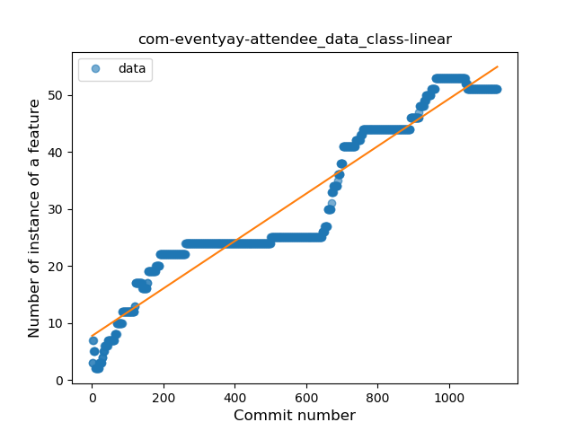

#### com-wabadaba-dziennik
* Feature: Type Inference
* Function: 
* R_Squared: 0.92261175
 

#### com-github-quarck-calnotify
* Feature: Destructuring Declaration
* Function: 
* R_Squared: 0.92253838
 

#### de-thecode-android-tazreader
* Feature: Lambda
* Function: 
* R_Squared: 0.92209874
 

#### com-arcao-geocaching4locus
* Feature: Function call with Named Argument
* Function: 
* R_Squared: 0.92177468
 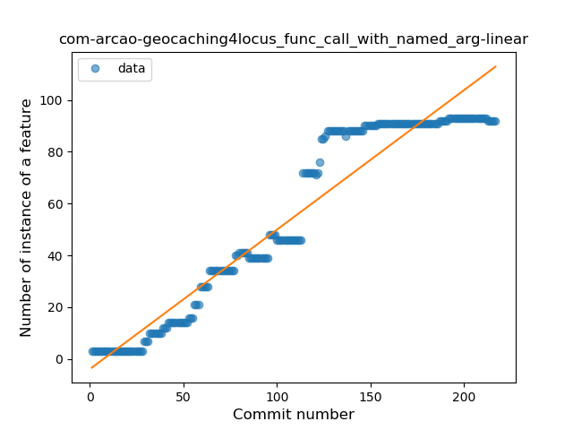

#### org-moire-ultrasonic
* Feature: Data Class
* Function: 
* R_Squared: 0.9215884
 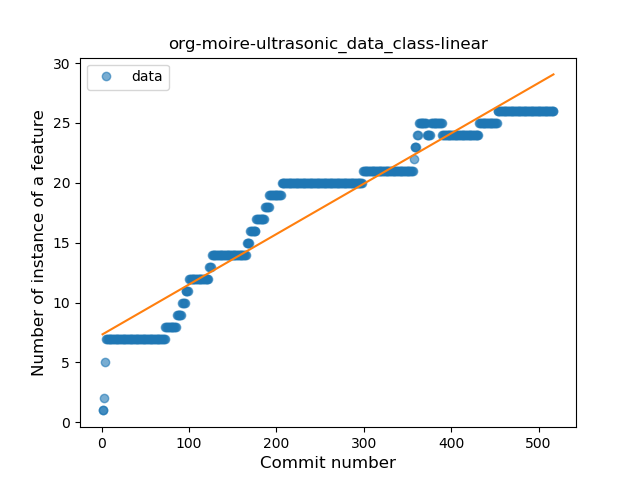

#### com-stevenschoen-putionew
* Feature: Smart Cast
* Function: 
* R_Squared: 0.92152126
 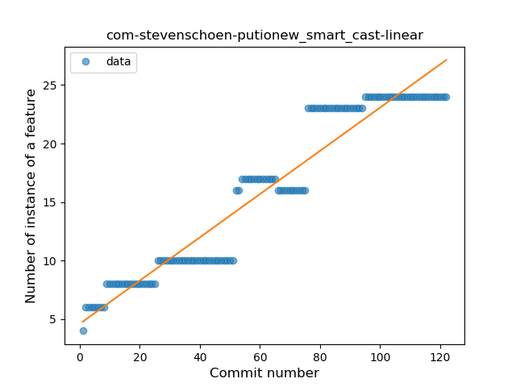

#### com-esafirm-androidplayground
* Feature: Safe Call
* Function: 
* R_Squared: 0.92130641
 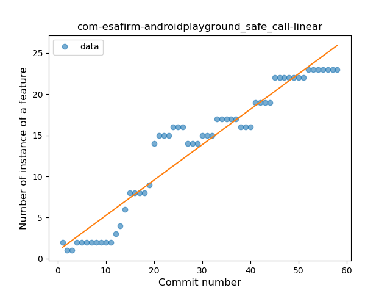

#### com-adityakamble49-dcipher
* Feature: Lambda
* Function: 
* R_Squared: 0.92125379
 

#### org-eurofurence-connavigator
* Feature: Type Inference
* Function: 
* R_Squared: 0.92113562
 

#### it-diab
* Feature: Companion Object
* Function: 
* R_Squared: 0.92092386
 

#### jp-toastkid-yobidashi
* Feature: Lambda
* Function: 
* R_Squared: 0.92060655
 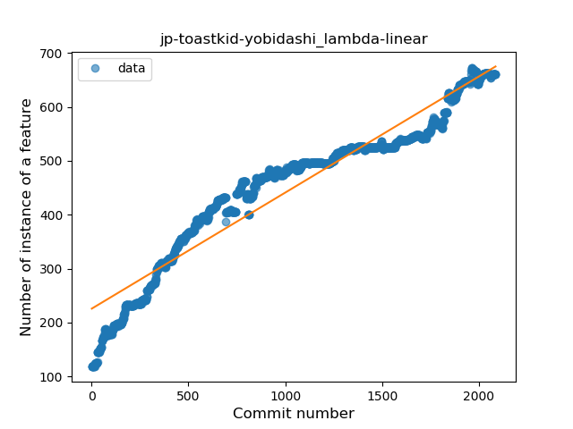

#### org-freedombox-freedombox
* Feature: Lambda
* Function: 
* R_Squared: 0.92048465
 

#### com-dp-logcatapp
* Feature: Unsafe Call
* Function: 
* R_Squared: 0.92048023
 

#### is-xyz-omw
* Feature: Lambda
* Function: 
* R_Squared: 0.91999497
 

#### fr-chenry-android-freshrss
* Feature: When expression
* Function: 
* R_Squared: 0.91984222
 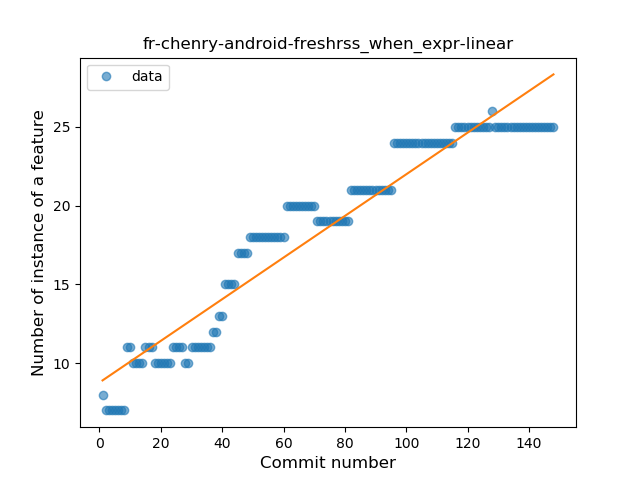

#### com-uwetrottmann-wpdisplay
* Feature: Lambda
* Function: 
* R_Squared: 0.91963718
 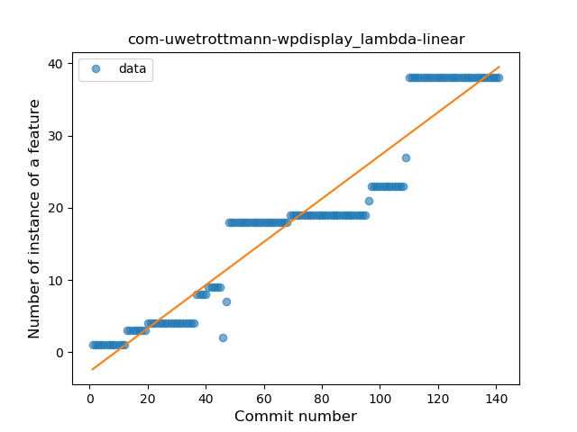

#### de-markusfisch-android-binaryeye
* Feature: Coroutine
* Function: 
* R_Squared: 0.91951817
 

#### org-emunix-insteadlauncher
* Feature: Type Inference
* Function: 
* R_Squared: 0.91916394
 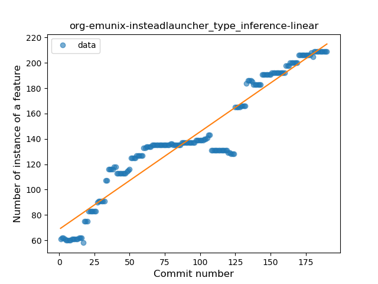

#### pl-org-seva-navigator
* Feature: Extension Function
* Function: 
* R_Squared: 0.91897565
 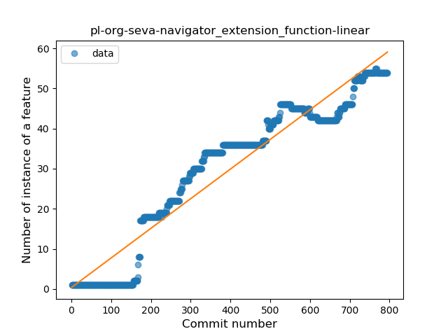

#### com-benoitquenaudon-tvfoot-red
* Feature: Function call with Named Argument
* Function: 
* R_Squared: 0.91895266
 

#### org-mozilla-rocket
* Feature: Coroutine
* Function: 
* R_Squared: 0.91891882
 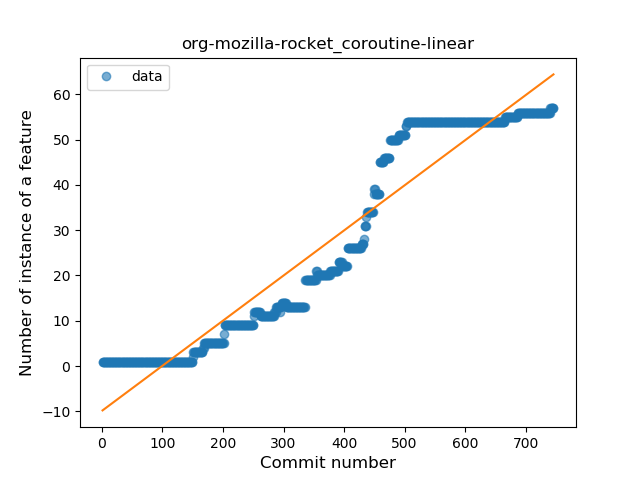

#### com-agusyc-daycounter
* Feature: Type Inference
* Function: 
* R_Squared: 0.91884269
 

#### com-benoitquenaudon-tvfoot-red
* Feature: Lambda
* Function: 
* R_Squared: 0.91873268
 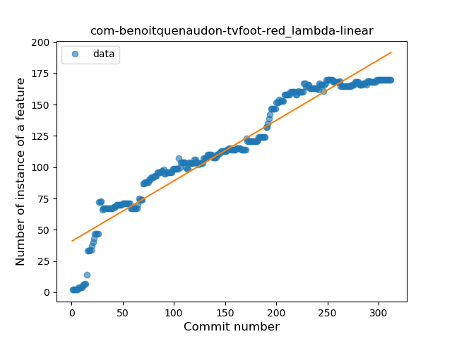

#### nl-renedegroot-android-adbawake
* Feature: Type Inference
* Function: 
* R_Squared: 0.91862108
 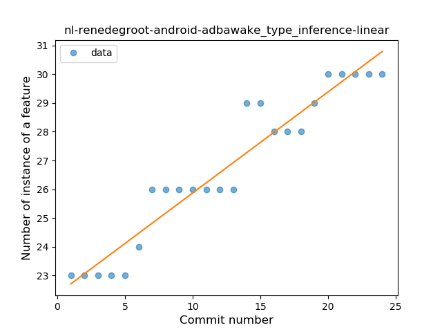

#### com-peterlaurence-trekme
* Feature: Type Inference
* Function: 
* R_Squared: 0.91833463
 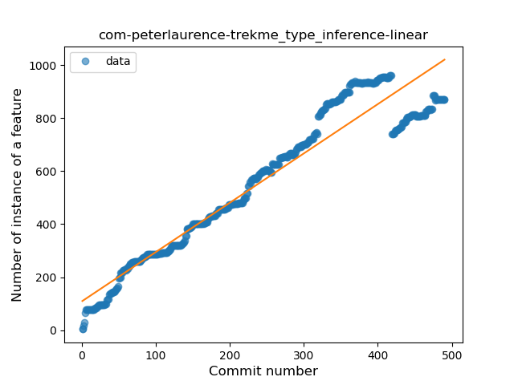

#### info-metadude-android-congress-schedule
* Feature: Extension Function
* Function: 
* R_Squared: 0.91801237
 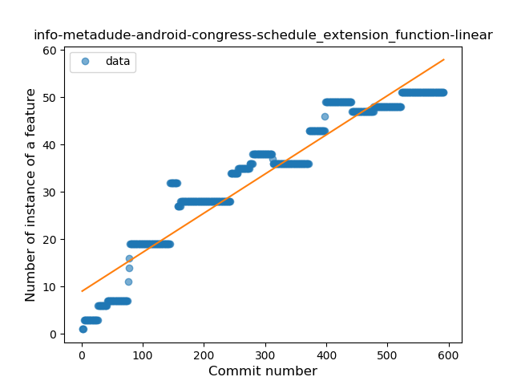

#### uk-co-richyhbm-monochromatic
* Feature: Property Delegation
* Function: 
* R_Squared: 0.91763944
 

#### com-fastaccess-github-libre
* Feature: Safe Call
* Function: 
* R_Squared: 0.91736105
 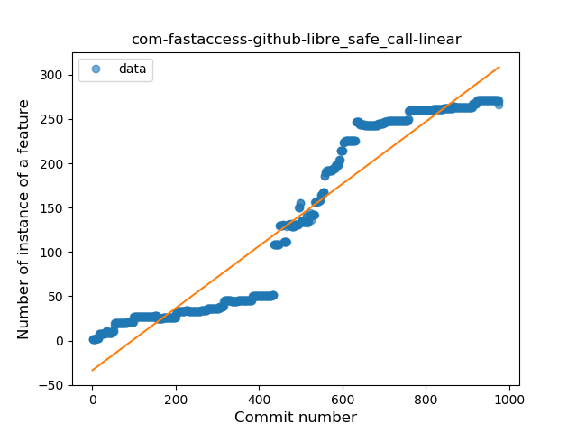

#### com-boardgamegeek
* Feature: Smart Cast
* Function: 
* R_Squared: 0.91675064
 

#### io-github-fvasco-pinpoi
* Feature: When expression
* Function: 
* R_Squared: 0.91671728
 

#### org-zimmob-zimlx
* Feature: Overloaded Operator
* Function: 
* R_Squared: 0.91636517
 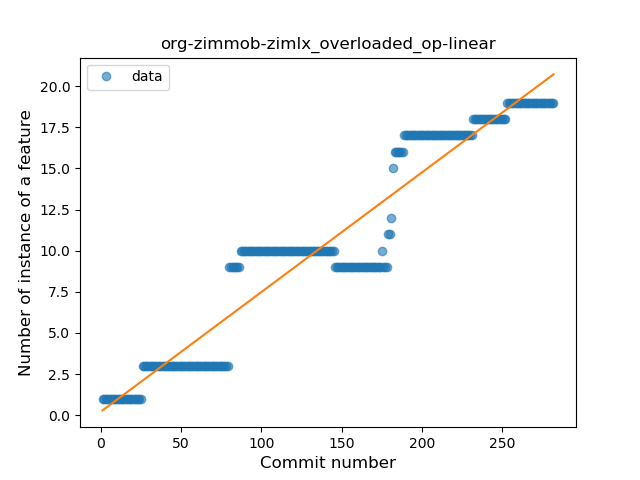

#### org-anibyl-slounik
* Feature: Lambda
* Function: 
* R_Squared: 0.91609589
 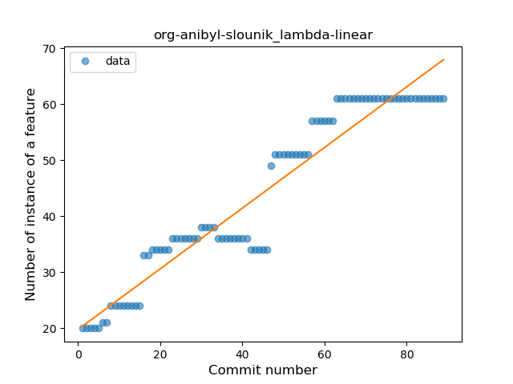

#### fr-chenry-android-freshrss
* Feature: Lambda
* Function: 
* R_Squared: 0.91609578
 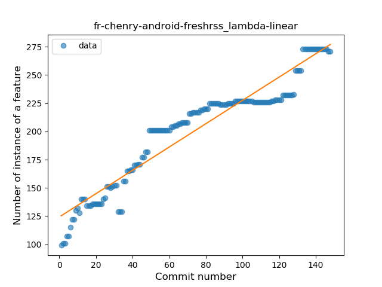

#### com-bubelov-coins
* Feature: Lambda
* Function: 
* R_Squared: 0.91602384
 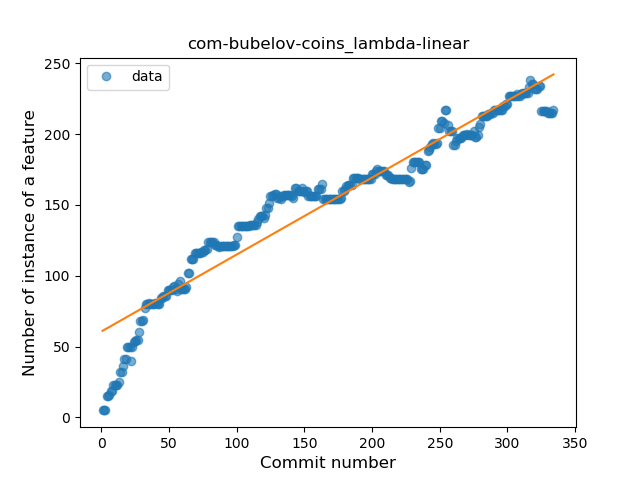

#### fr-jnda-android-flashalert
* Feature: Type Inference
* Function: 
* R_Squared: 0.91583952
 

#### net-osmand-plus
* Feature: Lambda
* Function: 
* R_Squared: 0.91572051
 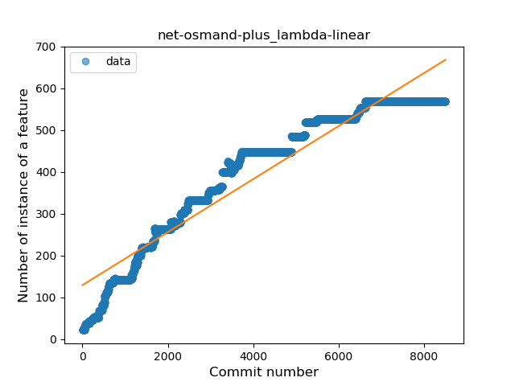

#### io-github-feelfreelinux-wykopmobilny
* Feature: Unsafe Call
* Function: 
* R_Squared: 0.91543554
 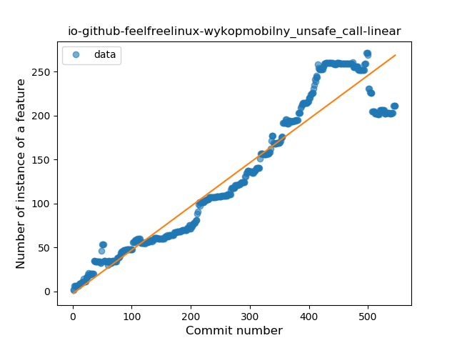

#### com-stevenschoen-putionew
* Feature: Function call with Named Argument
* Function: 
* R_Squared: 0.91493669
 

#### li-klass-fhem
* Feature: Data Class
* Function: 
* R_Squared: 0.91479182
 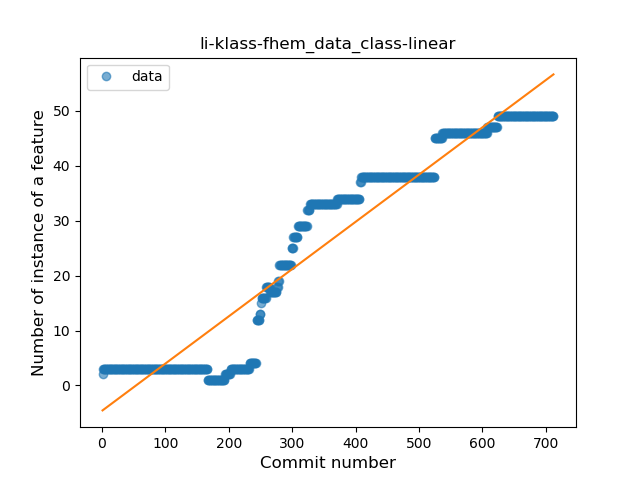

#### me-impa-knockonports
* Feature: Type Inference
* Function: 
* R_Squared: 0.91454016
 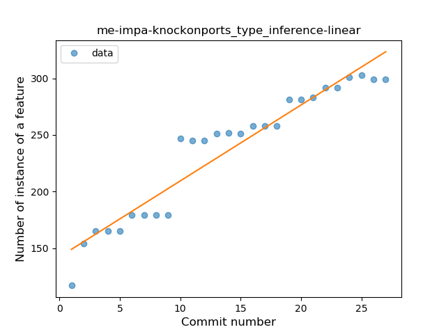

#### fr-insapp-insapp
* Feature: Type Inference
* Function: 
* R_Squared: 0.91436039
 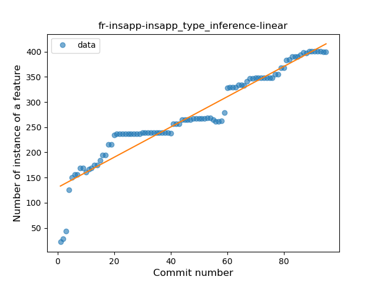

#### com-pavelsikun-runinbackgroundpermissionsetter
* Feature: Type Inference
* Function: 
* R_Squared: 0.91421646
 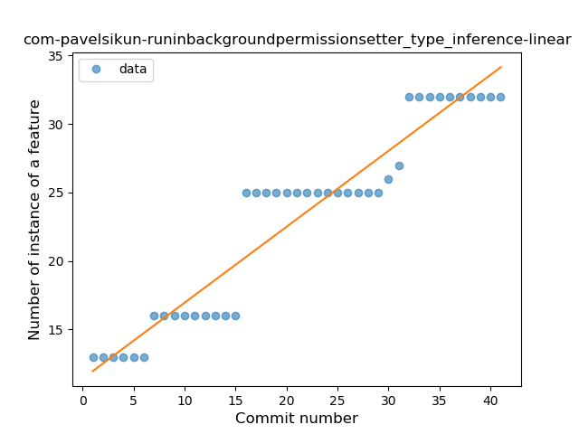

#### org-ligi-passandroid
* Feature: When expression
* Function: 
* R_Squared: 0.91386708
 

#### org-mosad-seil0-projectlaogai
* Feature: Data Class
* Function: 
* R_Squared: 0.91379178
 

#### sk-styk-martin-apkanalyzer
* Feature: Safe Call
* Function: 
* R_Squared: 0.91379082
 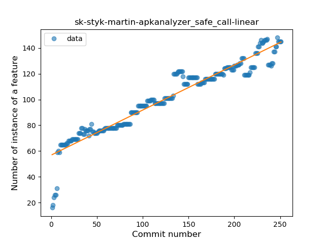

#### com-jereksel-libresubstratum
* Feature: Unsafe Call
* Function: 
* R_Squared: 0.91376871
 

#### net-kourlas-voipms
* Feature: Function with Default Value
* Function: 
* R_Squared: 0.91317872
 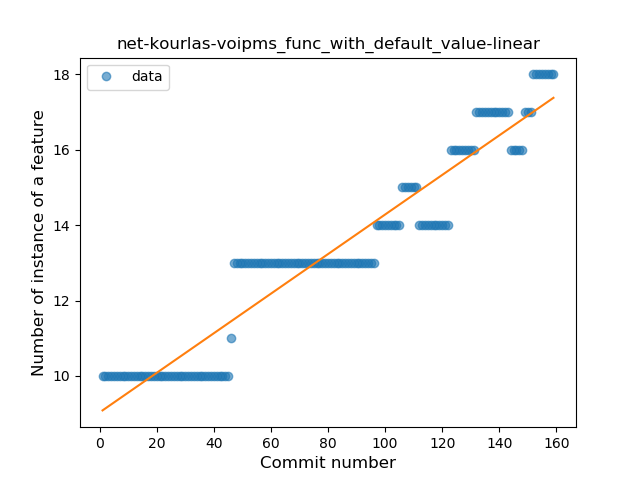

#### de-avpptr-umweltzone
* Feature: Extension Function
* Function: 
* R_Squared: 0.91292376
 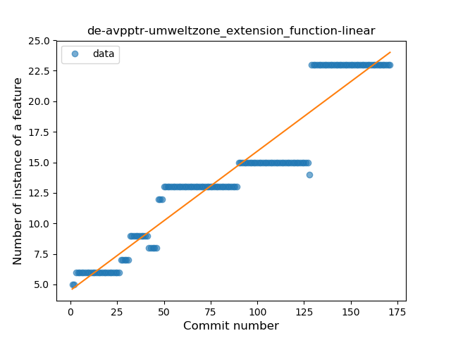

#### net-frju-flym
* Feature: Lambda
* Function: 
* R_Squared: 0.91270706
 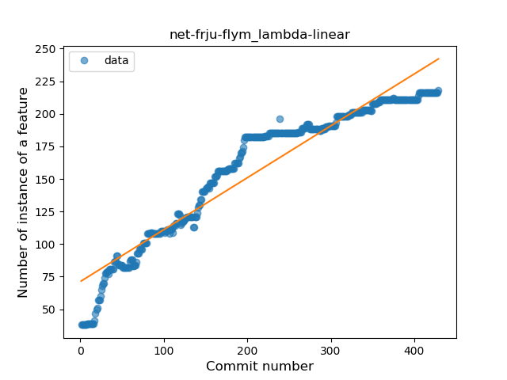

#### com-jereksel-libresubstratum
* Feature: Extension Function
* Function: 
* R_Squared: 0.91262829
 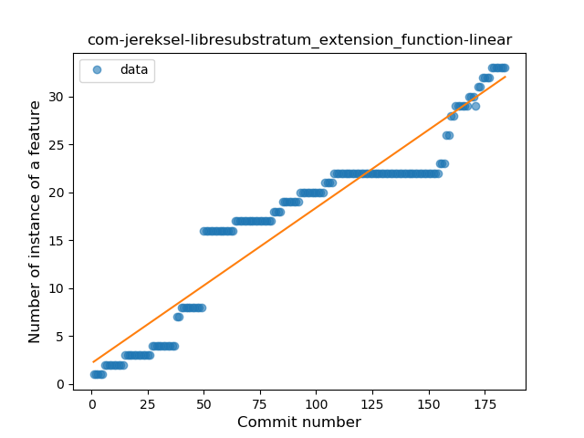

#### com-loloof64-android-basicchessendgamestrainer
* Feature: Range Expression
* Function: 
* R_Squared: 0.91241416
 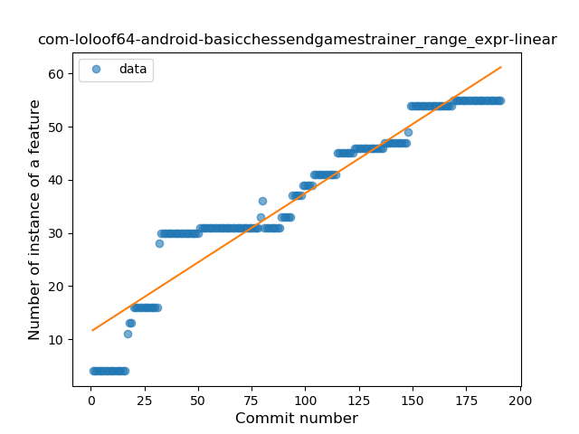

#### de-r4md4c-gamedealz
* Feature: Lambda
* Function: 
* R_Squared: 0.91200705
 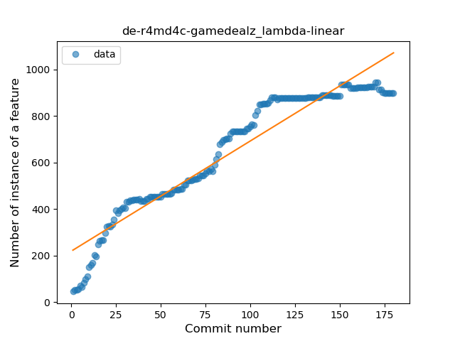

#### is-xyz-omw
* Feature: Safe Call
* Function: 
* R_Squared: 0.91198285
 

#### com-duckduckgo-mobile-android
* Feature: Property Delegation
* Function: 
* R_Squared: 0.91161139
 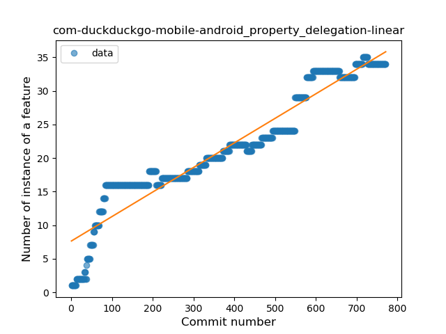

#### org-ligi-gobandroid
* Feature: Function with Default Value
* Function: 
* R_Squared: 0.91150695
 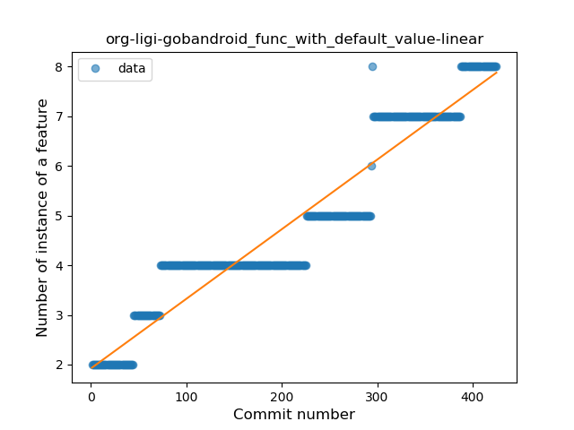

#### org-emunix-insteadlauncher
* Feature: String Template
* Function: 
* R_Squared: 0.91147948
 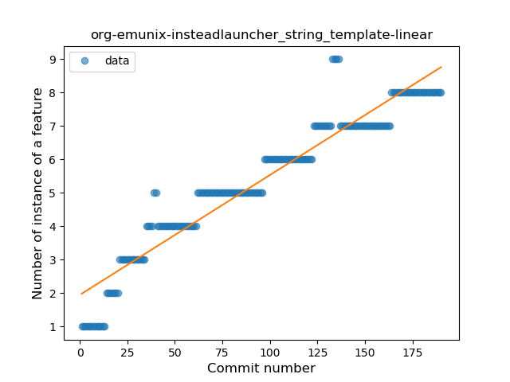

#### ru-hyst329-openfool
* Feature: Function with Default Value
* Function: 
* R_Squared: 0.91136815
 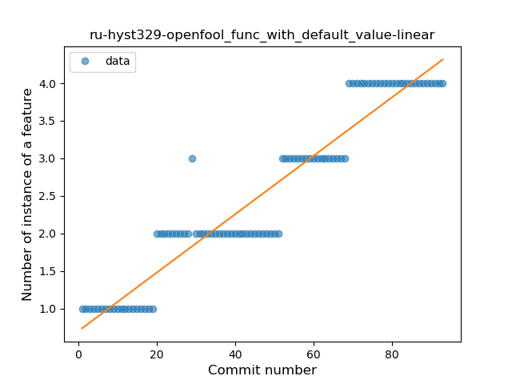

#### fi-kroon-vadret
* Feature: Function with Default Value
* Function: 
* R_Squared: 0.91129075
 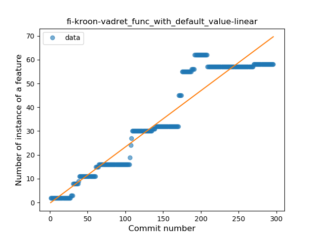

#### pw-janyo-janyoshare
* Feature: Lambda
* Function: 
* R_Squared: 0.91126196
 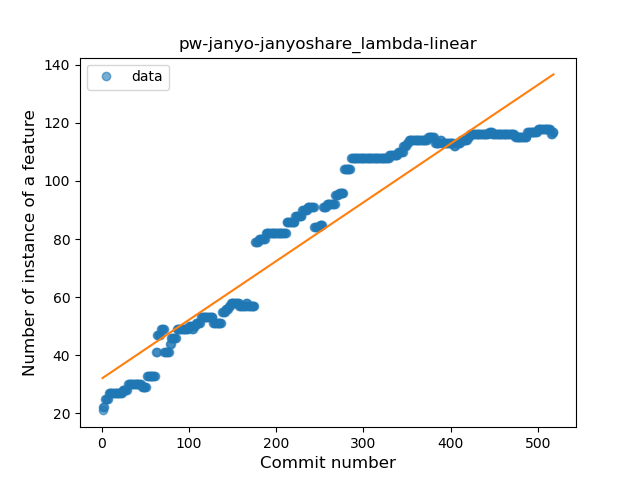

#### ca-josephroque-bowlingcompanion
* Feature: Smart Cast
* Function: 
* R_Squared: 0.91120186
 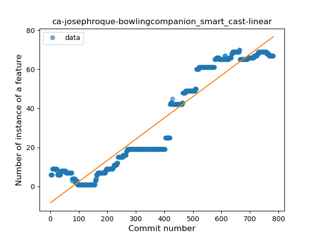

#### com-keylesspalace-tusky
* Feature: Property Delegation
* Function: 
* R_Squared: 0.91093318
 

#### net-frju-flym
* Feature: When expression
* Function: 
* R_Squared: 0.91086136
 

#### net-osmand-plus
* Feature: Type Inference
* Function: 
* R_Squared: 0.91078269
 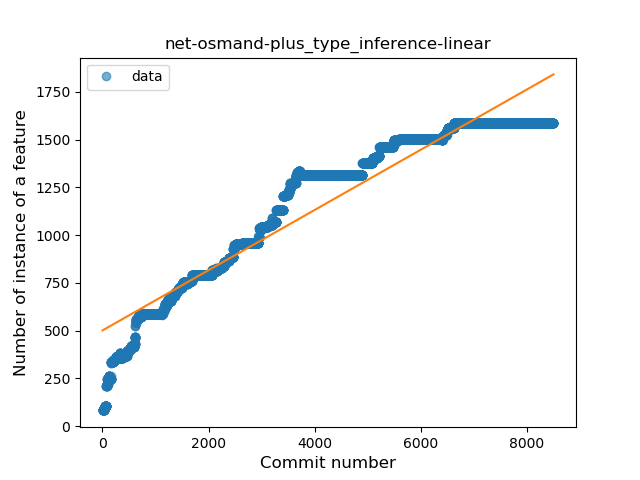

#### ch-abertschi-adfree
* Feature: Safe Call
* Function: 
* R_Squared: 0.91047261
 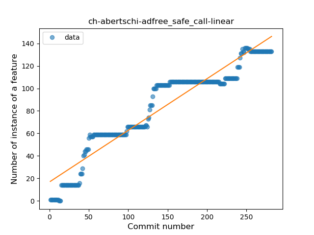

#### chat-rocket-android
* Feature: Type Inference
* Function: 
* R_Squared: 0.91012486
 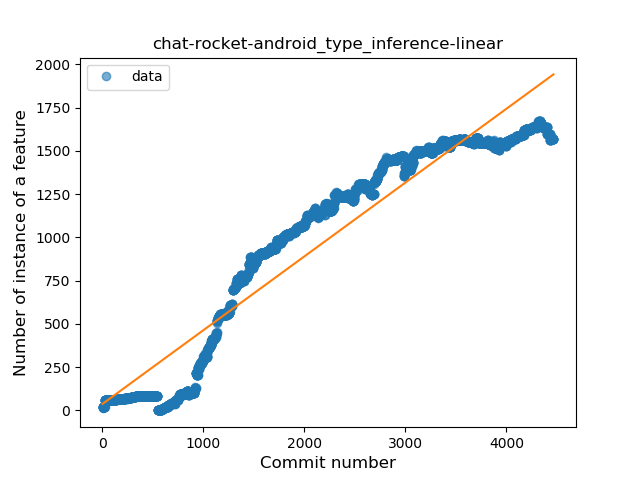

#### cat-pantsu-nyaapantsu
* Feature: When expression
* Function: 
* R_Squared: 0.91004913
 

#### org-ligi-passandroid
* Feature: Type Inference
* Function: 
* R_Squared: 0.90999061
 

#### com-orgzly
* Feature: String Template
* Function: 
* R_Squared: 0.90994715
 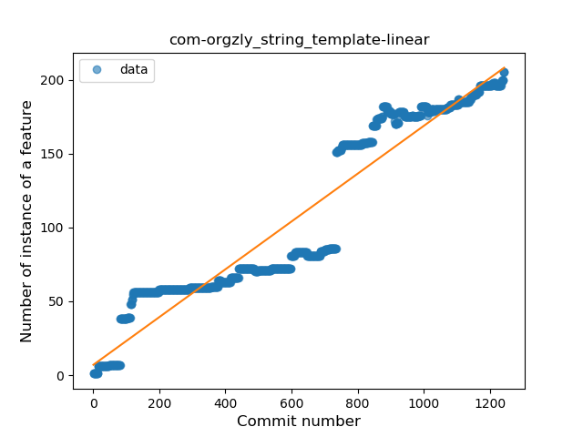

#### li-klass-fhem
* Feature: Companion Object
* Function: 
* R_Squared: 0.90969728
 

#### ch-abertschi-adfree
* Feature: Unsafe Call
* Function: 
* R_Squared: 0.90944011
 

#### com-pitchedapps-frost
* Feature: Function call with Named Argument
* Function: 
* R_Squared: 0.90865367
 

#### pixel-kotlin-bassblog
* Feature: Safe Call
* Function: 
* R_Squared: 0.90825671
 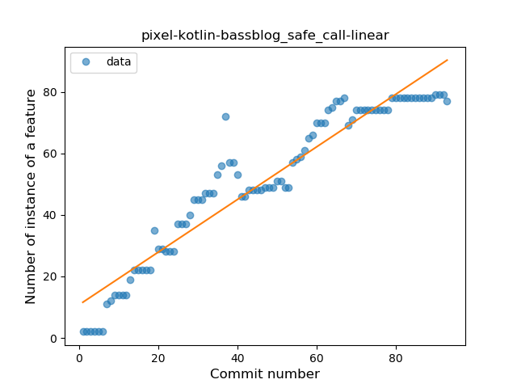

#### fr-chenry-android-freshrss
* Feature: Unsafe Call
* Function: 
* R_Squared: 0.90812292
 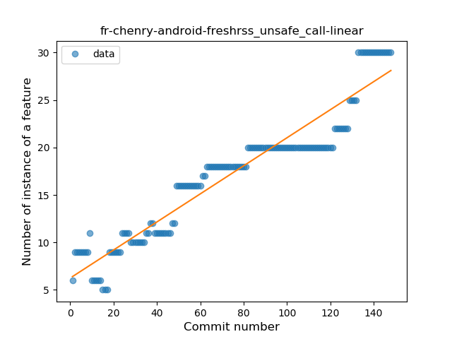

#### de-grobox-liberario
* Feature: Companion Object
* Function: 
* R_Squared: 0.90798258
 

#### com-simplemobiletools-flashlight
* Feature: Lambda
* Function: 
* R_Squared: 0.90790229
 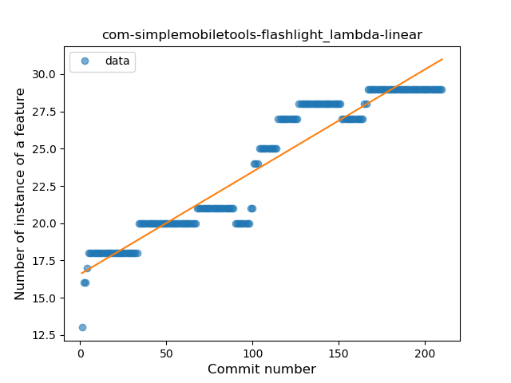

#### moe-feng-nhentai
* Feature: Type Inference
* Function: 
* R_Squared: 0.90788848
 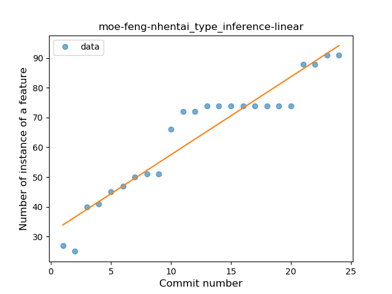

#### io-github-fvasco-pinpoi
* Feature: String Template
* Function: 
* R_Squared: 0.90777495
 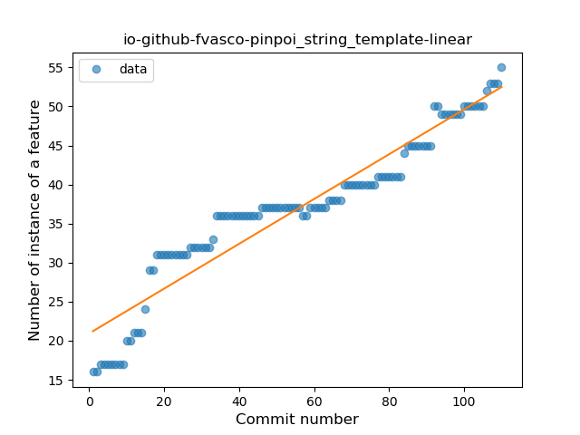

#### org-pacien-tincapp
* Feature: Lambda
* Function: 
* R_Squared: 0.9075246
 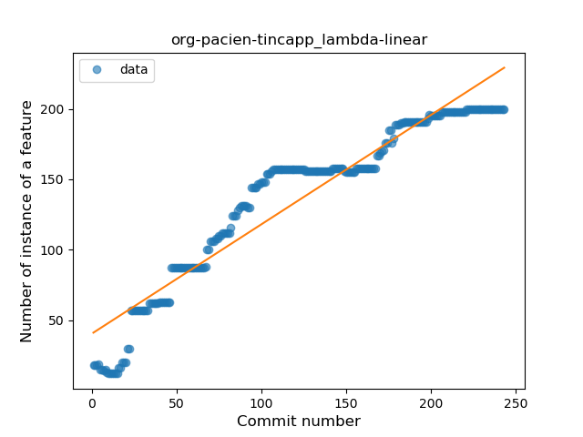

#### xyz-hisname-fireflyiii
* Feature: Safe Call
* Function: 
* R_Squared: 0.90722712
 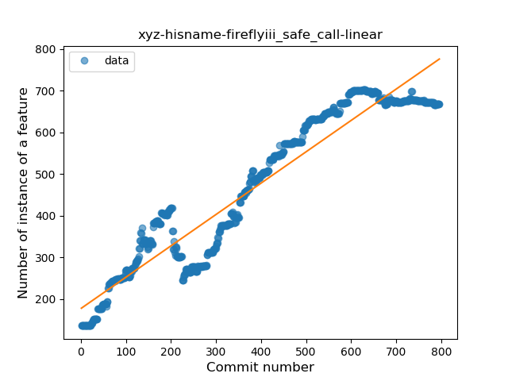

#### de-thecode-android-tazreader
* Feature: String Template
* Function: 
* R_Squared: 0.90691701
 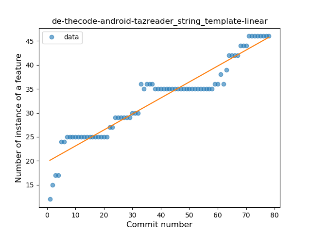

#### com-pitchedapps-frost
* Feature: When expression
* Function: 
* R_Squared: 0.9068226
 

#### com-boardgamegeek
* Feature: Range Expression
* Function: 
* R_Squared: 0.90681554
 

#### com-ruuvi-station
* Feature: Lambda
* Function: 
* R_Squared: 0.90679046
 

#### org-eurofurence-connavigator
* Feature: Extension Function
* Function: 
* R_Squared: 0.90644185
 

#### jp-toastkid-yobidashi
* Feature: Smart Cast
* Function: 
* R_Squared: 0.90623825
 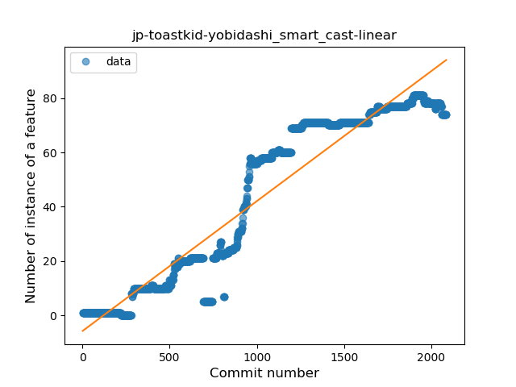

#### ca-josephroque-bowlingcompanion
* Feature: Range Expression
* Function: 
* R_Squared: 0.90611836
 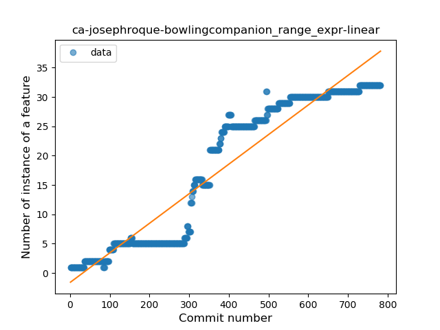

#### cat-xojan-random1
* Feature: Safe Call
* Function: 
* R_Squared: 0.90597269
 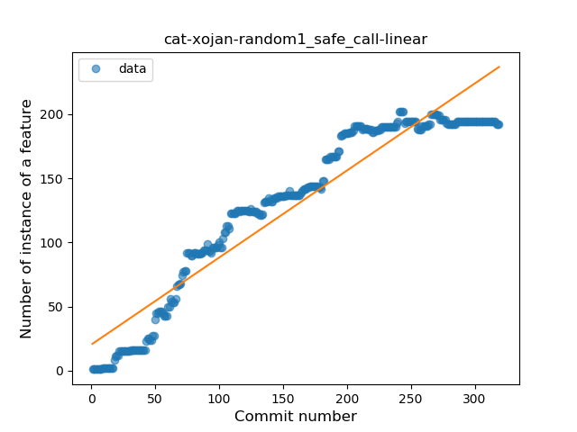

#### org-ligi-passandroid
* Feature: Unsafe Call
* Function: 
* R_Squared: 0.90589479
 

#### com-fastaccess-github-libre
* Feature: Smart Cast
* Function: 
* R_Squared: 0.90578255
 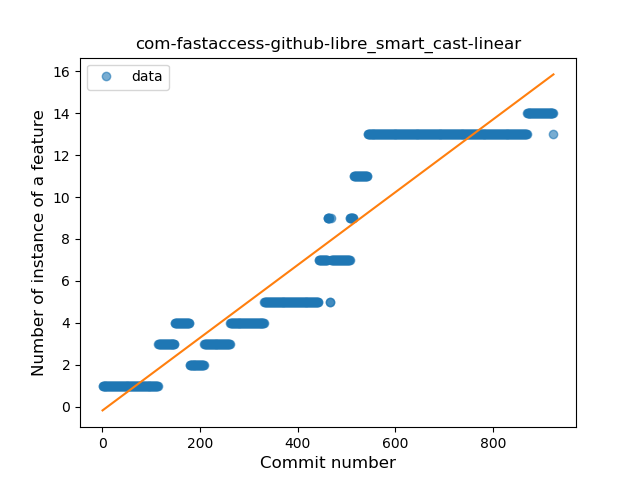

#### quickbeer-android
* Feature: When expression
* Function: 
* R_Squared: 0.90574285
 

#### pt-ipleiria-mymusicqoe
* Feature: Data Class
* Function: 
* R_Squared: 0.90567989
 

#### com-wabadaba-dziennik
* Feature: Smart Cast
* Function: 
* R_Squared: 0.90535507
 

#### ca-josephroque-bowlingcompanion
* Feature: Companion Object
* Function: 
* R_Squared: 0.90530645
 

#### org-kaqui
* Feature: Smart Cast
* Function: 
* R_Squared: 0.90527338
 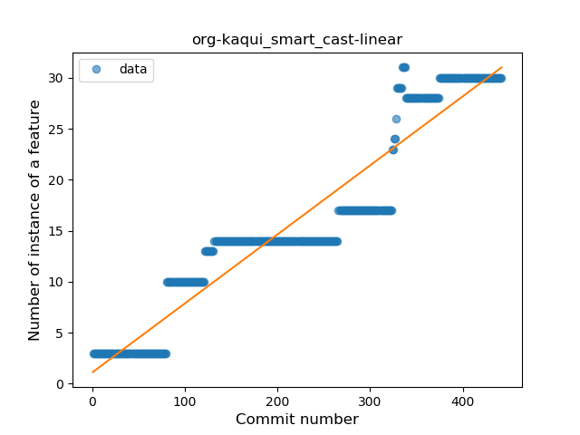

#### is-xyz-omw
* Feature: Type Inference
* Function: 
* R_Squared: 0.90477022
 

#### ffc-app
* Feature: When expression
* Function: 
* R_Squared: 0.90466696
 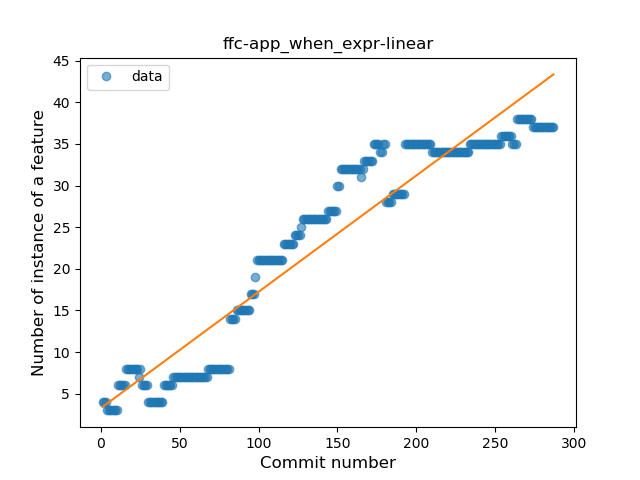

#### science-apolline
* Feature: Safe Call
* Function: 
* R_Squared: 0.90454192
 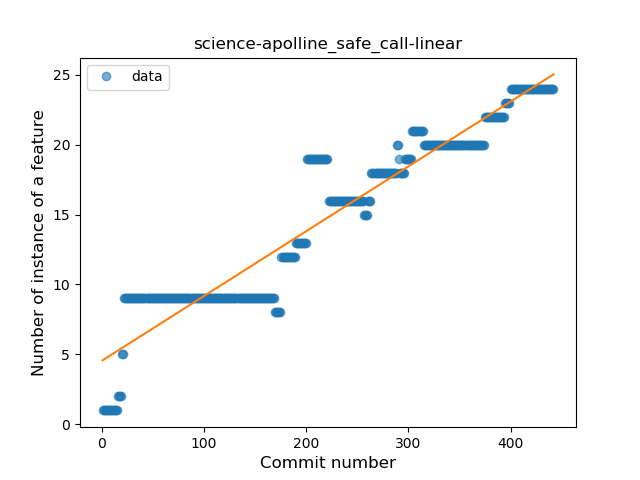

#### com-benoitquenaudon-tvfoot-red
* Feature: When expression
* Function: 
* R_Squared: 0.90438058
 

#### com-kgurgul-cpuinfo
* Feature: Range Expression
* Function: 
* R_Squared: 0.90409233
 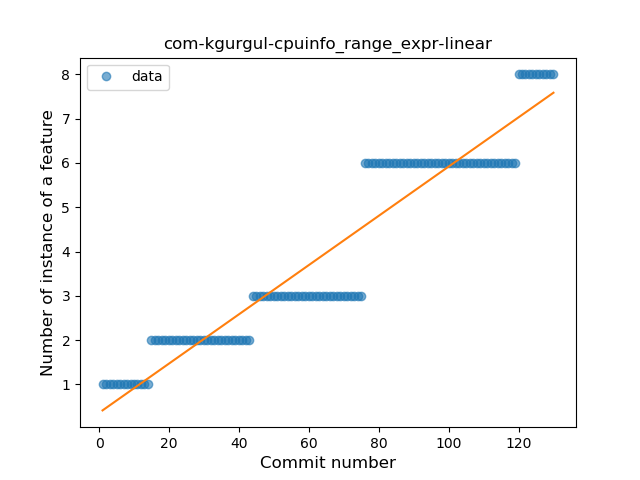

#### com-glodanif-bluetoothchat
* Feature: Type Inference
* Function: 
* R_Squared: 0.90393419
 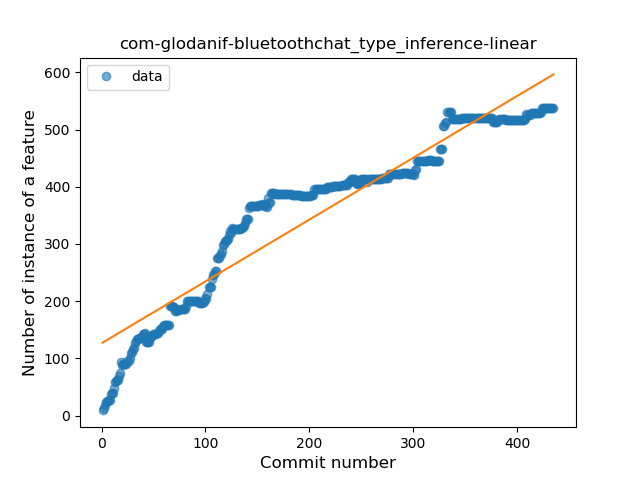

#### fi-kroon-vadret
* Feature: Safe Call
* Function: 
* R_Squared: 0.9036915
 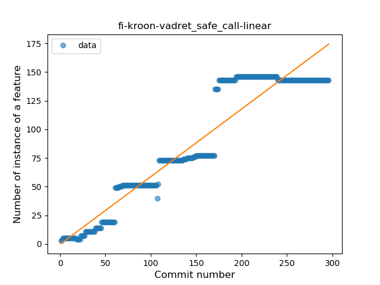

#### com-njlabs-showjava
* Feature: Lambda
* Function: 
* R_Squared: 0.90362085
 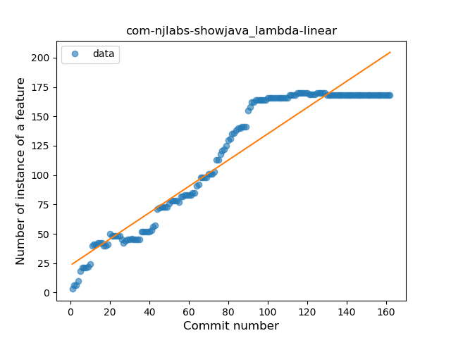

#### com-mgaetan89-showsrage
* Feature: When expression
* Function: 
* R_Squared: 0.90360268
 

#### ca-josephroque-bowlingcompanion
* Feature: Destructuring Declaration
* Function: 
* R_Squared: 0.9035073
 

#### com-peterlaurence-trekme
* Feature: Companion Object
* Function: 
* R_Squared: 0.90348755
 

#### com-simplemobiletools-gallery-pro
* Feature: Extension Function
* Function: 
* R_Squared: 0.90348331
 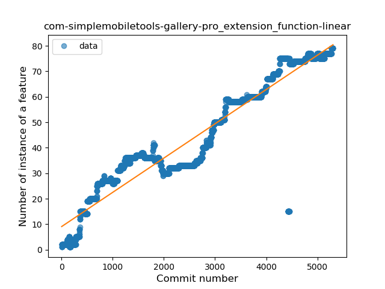

#### ffc-app
* Feature: String Template
* Function: 
* R_Squared: 0.90345426
 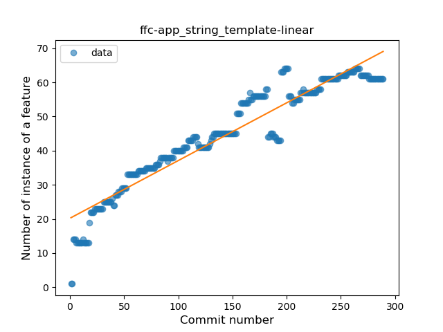

#### info-metadude-android-congress-schedule
* Feature: Type Inference
* Function: 
* R_Squared: 0.90329878
 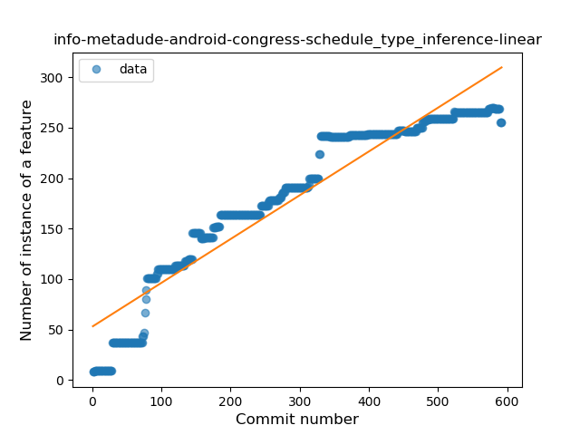

#### me-blog-korn123-easydiary
* Feature: String Template
* Function: 
* R_Squared: 0.90325296
 

#### cz-dvratil-fbeventsync
* Feature: Type Inference
* Function: 
* R_Squared: 0.90320773
 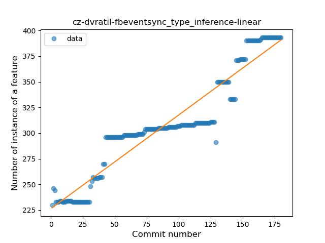

#### org-mariotaku-twidere
* Feature: Smart Cast
* Function: 
* R_Squared: 0.90234792
 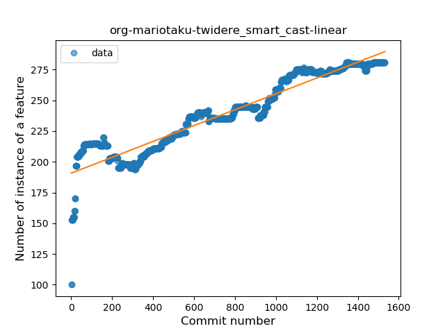

#### fi-kroon-vadret
* Feature: When expression
* Function: 
* R_Squared: 0.90230367
 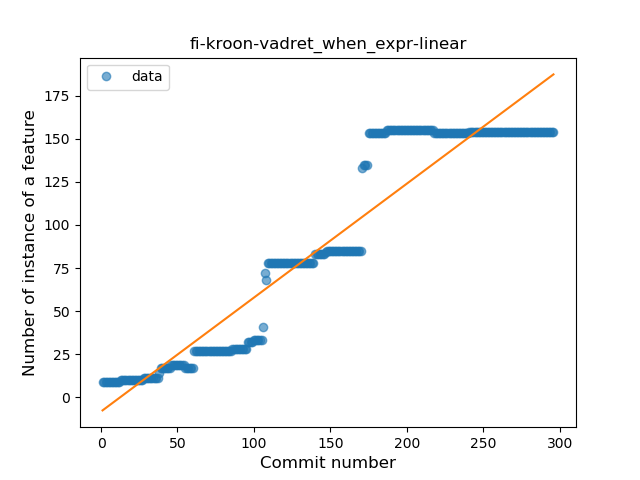

#### fr-insapp-insapp
* Feature: Companion Object
* Function: 
* R_Squared: 0.9022823
 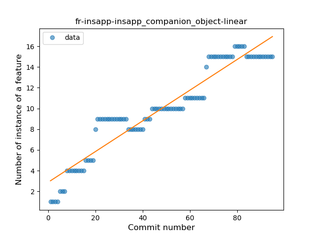

#### org-kaqui
* Feature: String Template
* Function: 
* R_Squared: 0.90220423
 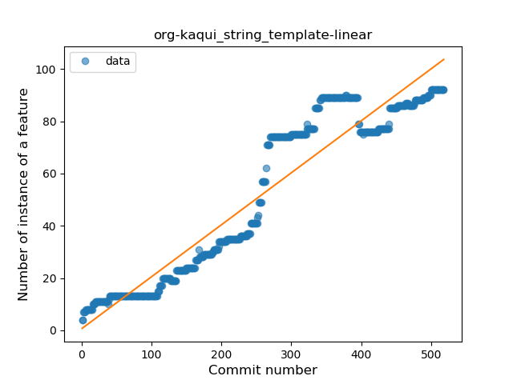

#### com-garpr-android
* Feature: Function with Default Value
* Function: 
* R_Squared: 0.90209494
 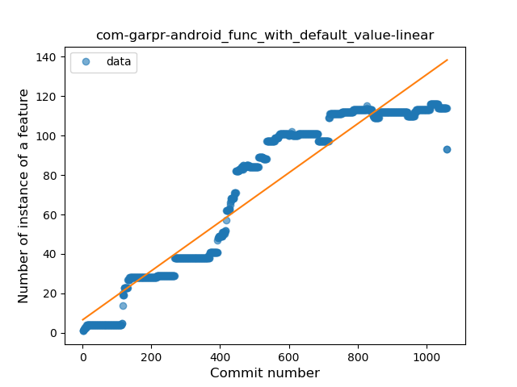

#### com-uwetrottmann-wpdisplay
* Feature: Type Inference
* Function: 
* R_Squared: 0.90174132
 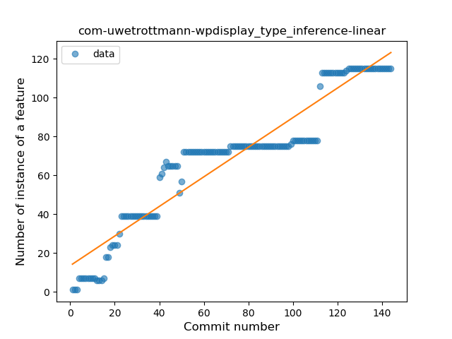

#### pt-ipleiria-mymusicqoe
* Feature: Type Inference
* Function: 
* R_Squared: 0.90146255
 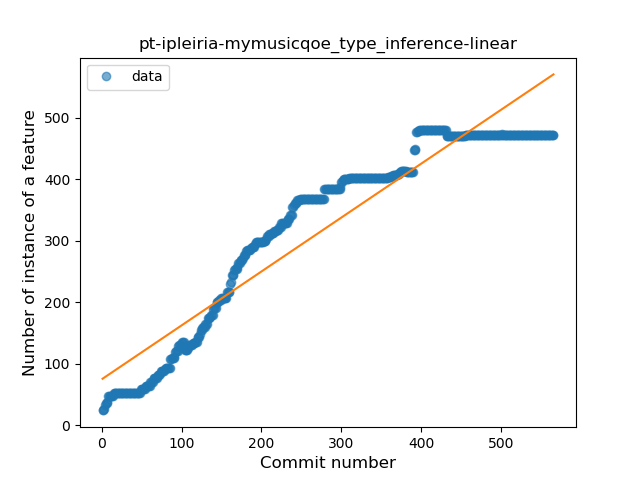

#### com-rohitsuratekar-NCBSinfo
* Feature: Type Inference
* Function: 
* R_Squared: 0.90126728
 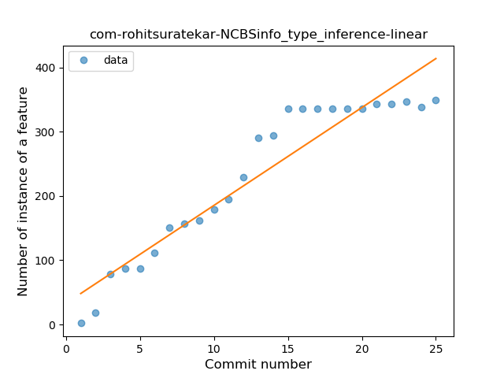

#### com-pyamsoft-homebutton
* Feature: Lambda
* Function: 
* R_Squared: 0.90090865
 

#### org-fossasia-badgemagic
* Feature: String Template
* Function: 
* R_Squared: 0.9008417
 

#### org-decsync-cc
* Feature: Safe Call
* Function: 
* R_Squared: 0.90033316
 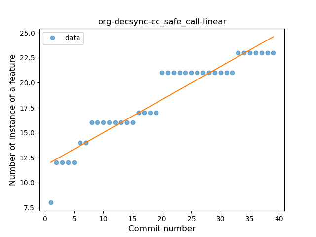

#### com-pitchedapps-frost
* Feature: Companion Object
* Function: 
* R_Squared: 0.89994545
 

#### tw-shounenwind-kmnbottool
* Feature: Type Inference
* Function: 
* R_Squared: 0.89970489
 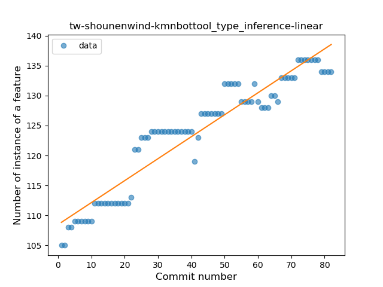

#### de-grobox-liberario
* Feature: String Template
* Function: 
* R_Squared: 0.89968199
 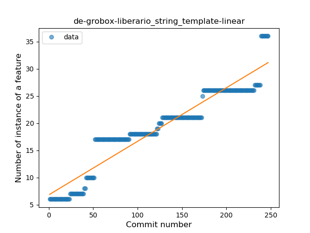

#### io-github-wulkanowy
* Feature: Range Expression
* Function: 
* R_Squared: 0.89949678
 

#### com-jmstudios-redmoon
* Feature: Lambda
* Function: 
* R_Squared: 0.899331
 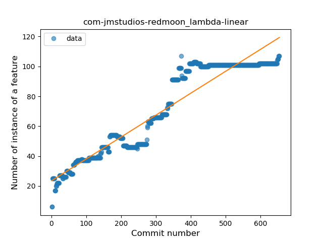

#### ch-rmy-android-http_shortcuts
* Feature: Type Inference
* Function: 
* R_Squared: 0.89928367
 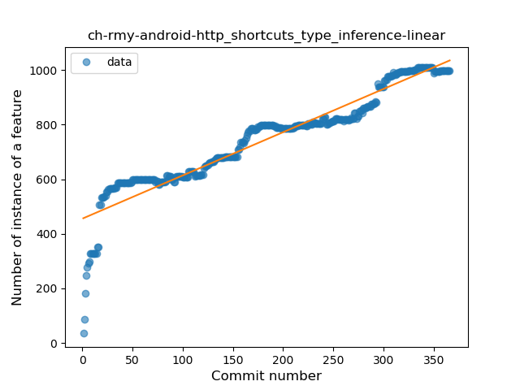

#### one-librem-social
* Feature: Singleton
* Function: 
* R_Squared: 0.89899993
 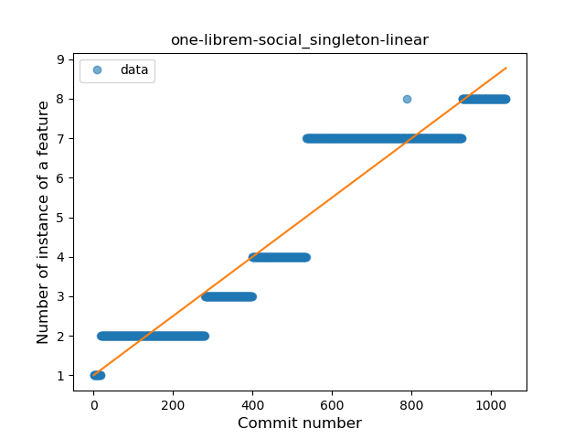

#### org-blitzortung-android-app
* Feature: When expression
* Function: 
* R_Squared: 0.898517
 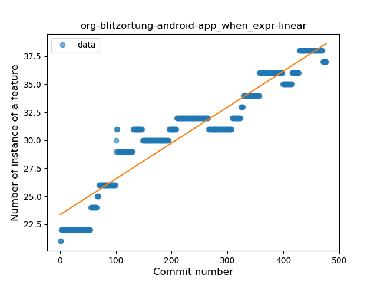

#### net-frju-flym
* Feature: Safe Call
* Function: 
* R_Squared: 0.89815869
 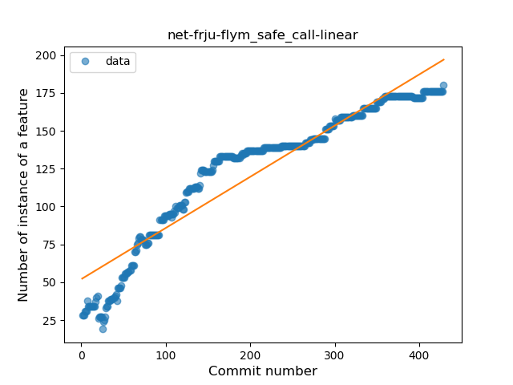

#### com-lavadip-miniVector
* Feature: Sealed Class
* Function: 
* R_Squared: 0.8979839
 

#### com-motion-stage1
* Feature: Unsafe Call
* Function: 
* R_Squared: 0.89785722
 

#### com-glodanif-bluetoothchat
* Feature: Property Delegation
* Function: 
* R_Squared: 0.89770649
 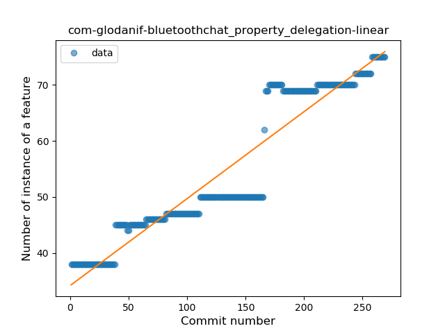

#### com-dp-logcatapp
* Feature: Function with Default Value
* Function: 
* R_Squared: 0.8976621
 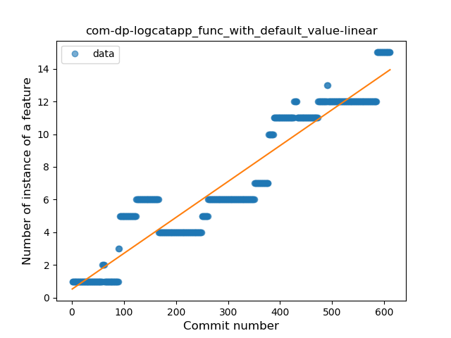

#### net-osmand-plus
* Feature: Companion Object
* Function: 
* R_Squared: 0.8972811
 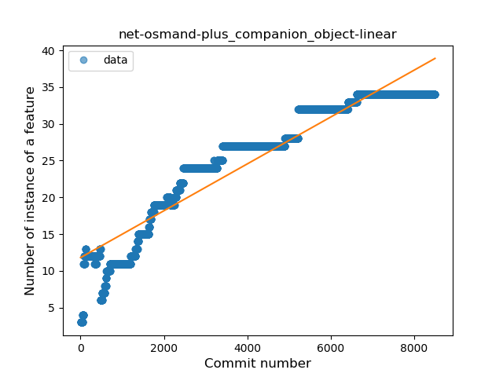

#### org-walleth
* Feature: Type Inference
* Function: 
* R_Squared: 0.8972435
 

#### com-tasomaniac-openwith-floss
* Feature: Safe Call
* Function: 
* R_Squared: 0.89718246
 

#### com-arcao-geocaching4locus
* Feature: Type Inference
* Function: 
* R_Squared: 0.89704658
 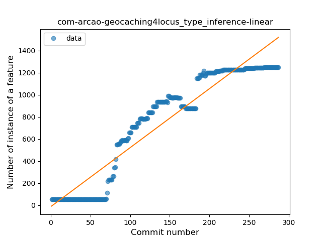

#### de-grobox-liberario
* Feature: Type Inference
* Function: 
* R_Squared: 0.89700129
 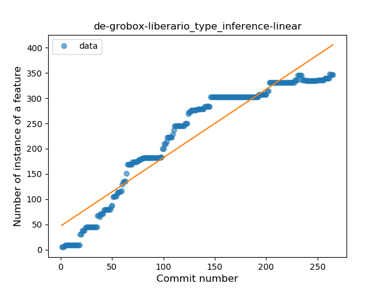

#### com-orgzly
* Feature: Range Expression
* Function: 
* R_Squared: 0.89682417
 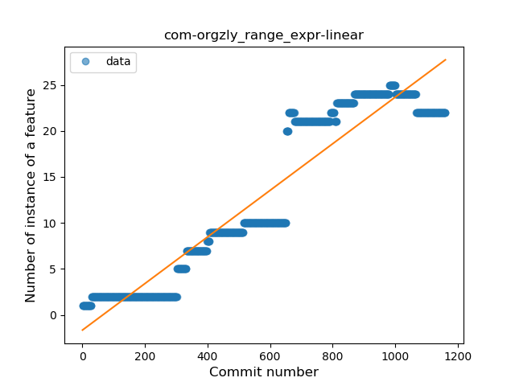

#### com-nao20010128nao-DroidComplex
* Feature: When expression
* Function: 
* R_Squared: 0.89677066
 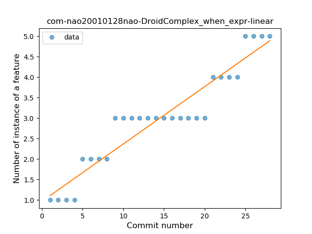

#### fr-xgouchet-packageexplorer
* Feature: String Template
* Function: 
* R_Squared: 0.89676453
 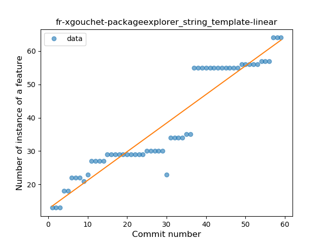

#### com-loloof64-android-basicchessendgamestrainer
* Feature: Safe Call
* Function: 
* R_Squared: 0.89659612
 

#### com-keylesspalace-tusky
* Feature: Singleton
* Function: 
* R_Squared: 0.89659291
 

#### com-arcao-geocaching4locus
* Feature: Function with Default Value
* Function: 
* R_Squared: 0.89655588
 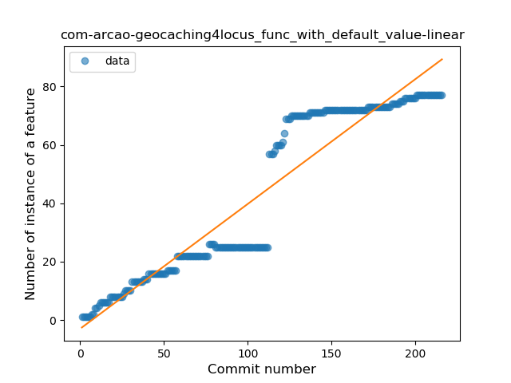

#### net-kourlas-voipms
* Feature: When expression
* Function: 
* R_Squared: 0.89648031
 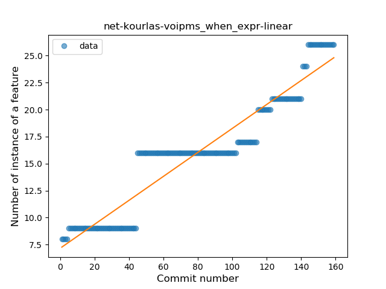

#### com-orgzly
* Feature: Smart Cast
* Function: 
* R_Squared: 0.89628614
 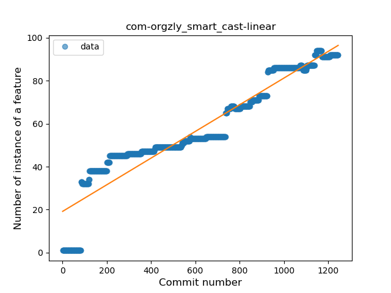

#### net-yslibrary-monotweety
* Feature: Safe Call
* Function: 
* R_Squared: 0.89622577
 

#### chat-rocket-android
* Feature: Coroutine
* Function: 
* R_Squared: 0.89577253
 

#### net-syncthing-lite
* Feature: Property Delegation
* Function: 
* R_Squared: 0.89557665
 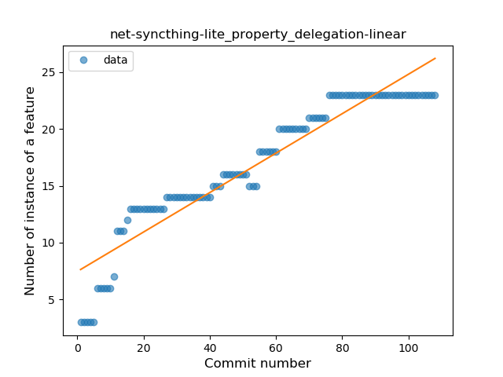

#### com-nononsenseapps-feeder
* Feature: Type Inference
* Function: 
* R_Squared: 0.89521876
 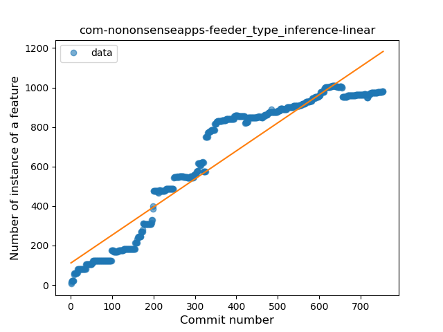

#### is-xyz-omw
* Feature: Companion Object
* Function: 
* R_Squared: 0.8949041
 

#### com-ruuvi-station
* Feature: Unsafe Call
* Function: 
* R_Squared: 0.89439231
 

#### com-nononsenseapps-feeder
* Feature: Data Class
* Function: 
* R_Squared: 0.89430311
 

#### com-simplemobiletools-contacts-pro
* Feature: Safe Call
* Function: 
* R_Squared: 0.89427886
 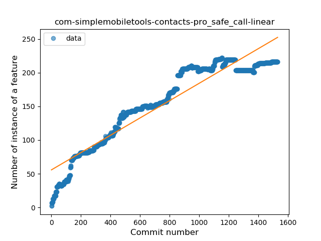

#### li-klass-fhem
* Feature: Safe Call
* Function: 
* R_Squared: 0.89423022
 

#### com-zacharee1-systemuituner
* Feature: String Template
* Function: 
* R_Squared: 0.89409658
 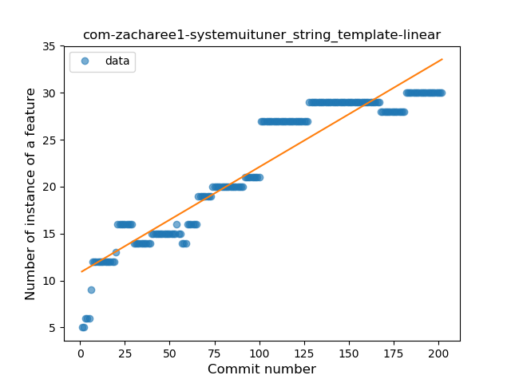

#### org-mariotaku-twidere
* Feature: Range Expression
* Function: 
* R_Squared: 0.89394378
 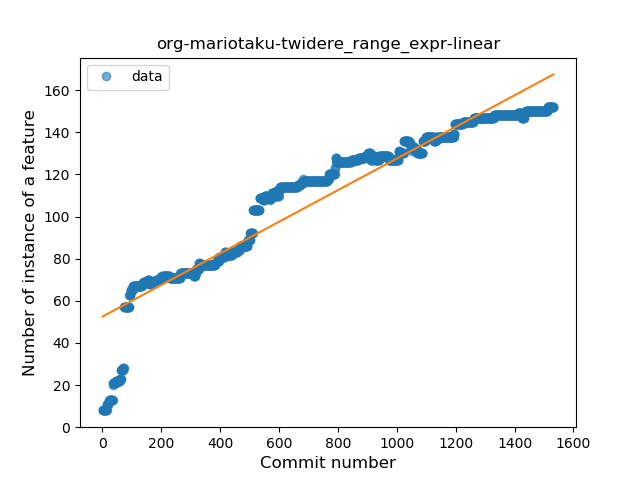

#### fr-corenting-edcompanion
* Feature: Data Class
* Function: 
* R_Squared: 0.8938943
 

#### com-uncmorfi
* Feature: Safe Call
* Function: 
* R_Squared: 0.89371907
 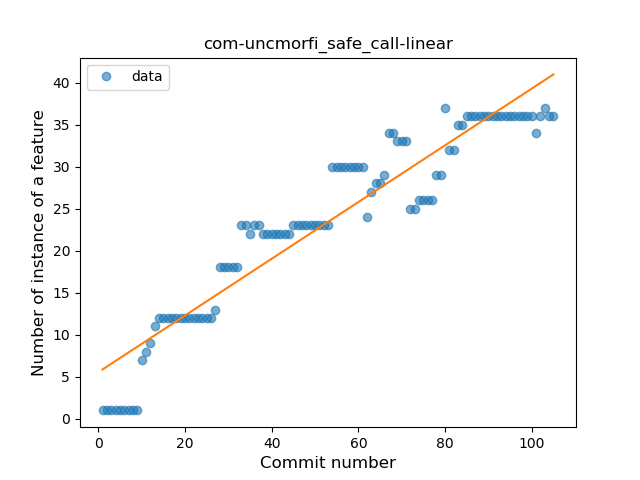

#### com-log28
* Feature: Unsafe Call
* Function: 
* R_Squared: 0.8936477
 

#### de-grobox-liberario
* Feature: Lambda
* Function: 
* R_Squared: 0.89348876
 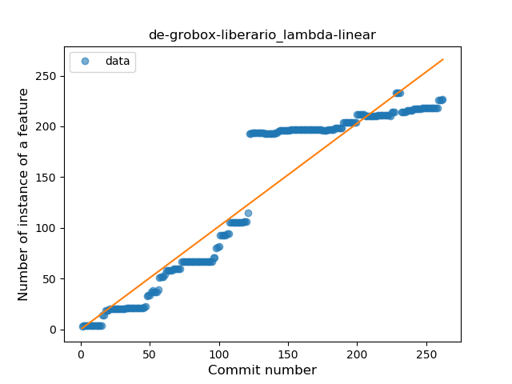

#### com-fsck-k9
* Feature: Property Delegation
* Function: 
* R_Squared: 0.89342286
 

#### li-klass-fhem
* Feature: Type Inference
* Function: 
* R_Squared: 0.8932719
 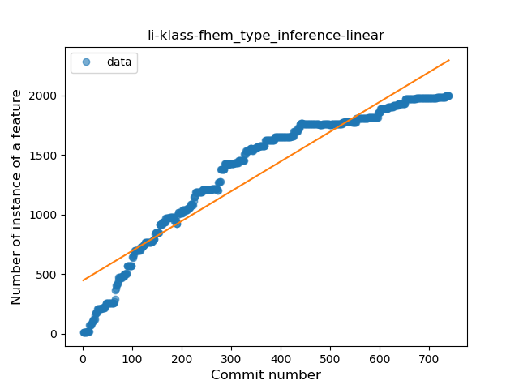

#### org-lenchan139-ncbookmark
* Feature: Range Expression
* Function: 
* R_Squared: 0.89284907
 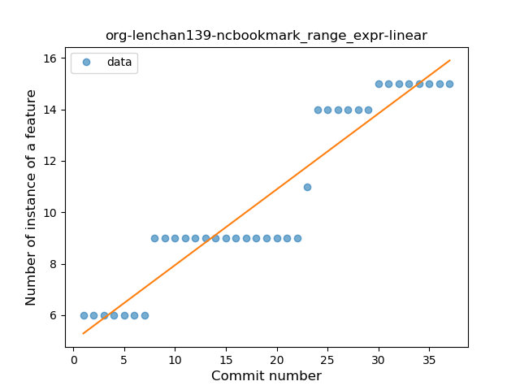

#### com-simplemobiletools-contacts-pro
* Feature: Unsafe Call
* Function: 
* R_Squared: 0.89261355
 

#### org-havenapp-main
* Feature: Type Inference
* Function: 
* R_Squared: 0.89239303
 

#### im-vector-alpha
* Feature: Sealed Class
* Function: 
* R_Squared: 0.89229208
 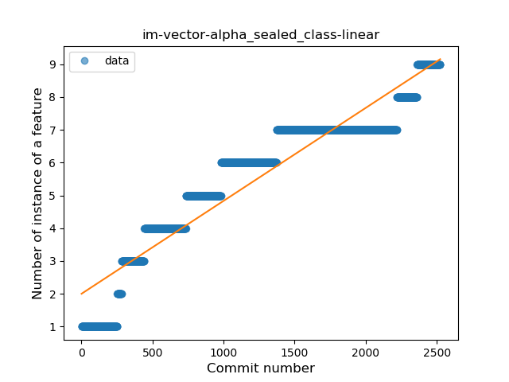

#### li-klass-fhem
* Feature: Function with Default Value
* Function: 
* R_Squared: 0.89223
 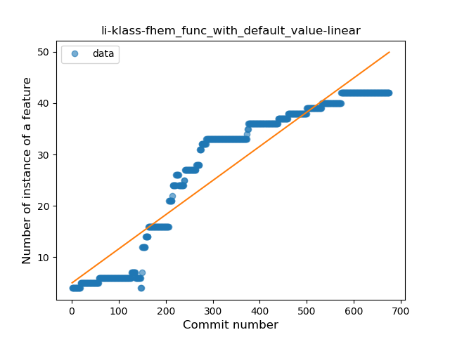

#### nl-mpcjanssen-simpletask
* Feature: Lambda
* Function: 
* R_Squared: 0.89193691
 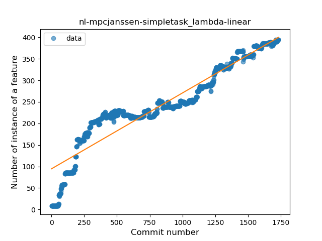

#### ca-rmen-android-poetassistant
* Feature: Smart Cast
* Function: 
* R_Squared: 0.89103858
 

#### ca-fuwafuwa-kaku
* Feature: Data Class
* Function: 
* R_Squared: 0.89088218
 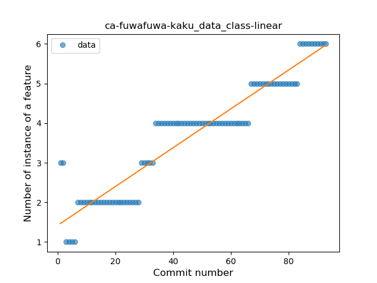

#### de-r4md4c-gamedealz
* Feature: Unsafe Call
* Function: 
* R_Squared: 0.89063706
 

#### com-heed-justquotes
* Feature: Unsafe Call
* Function: 
* R_Squared: 0.89054688
 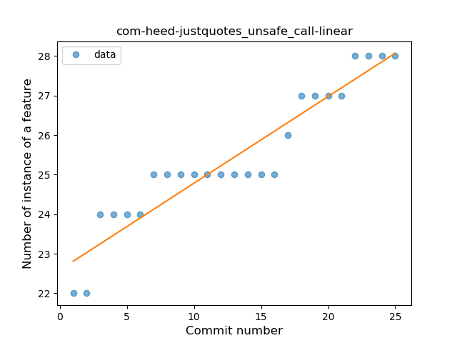

#### io-github-wulkanowy
* Feature: Smart Cast
* Function: 
* R_Squared: 0.89052628
 

#### org-havenapp-main
* Feature: Safe Call
* Function: 
* R_Squared: 0.89050406
 

#### pw-janyo-janyoshare
* Feature: Type Inference
* Function: 
* R_Squared: 0.89048265
 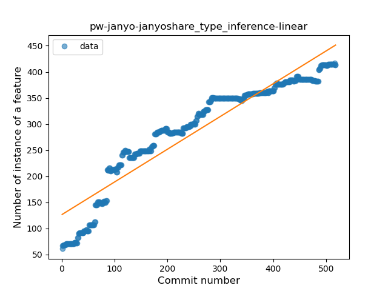

#### net-osmand-plus
* Feature: Safe Call
* Function: 
* R_Squared: 0.89036593
 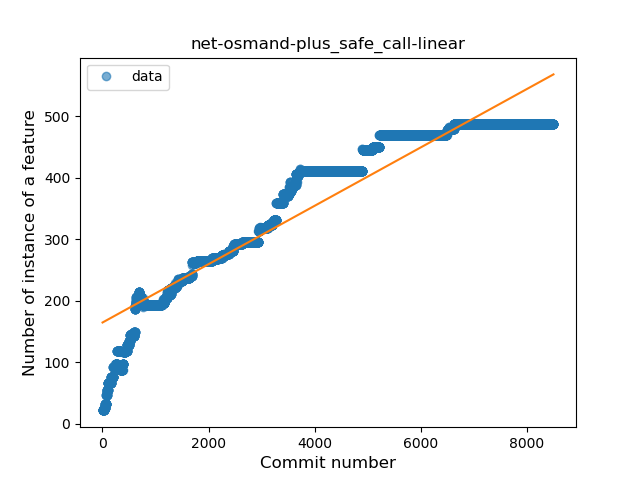

#### com-ianhanniballake-contractiontimer
* Feature: String Template
* Function: 
* R_Squared: 0.89022179
 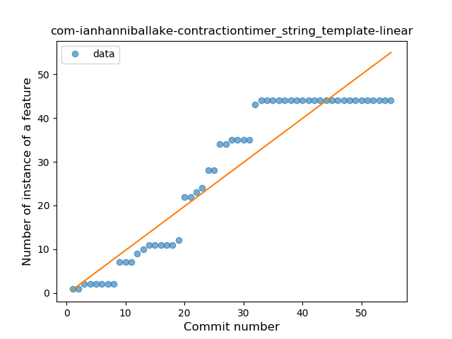

#### pl-org-seva-navigator
* Feature: Companion Object
* Function: 
* R_Squared: 0.88993036
 

#### fr-chenry-android-freshrss
* Feature: String Template
* Function: 
* R_Squared: 0.88950701
 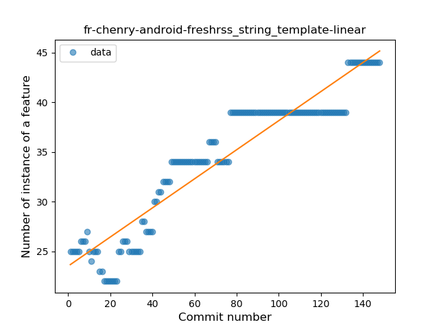

#### com-ogsdroid
* Feature: Lambda
* Function: 
* R_Squared: 0.88950672
 

#### org-kaqui
* Feature: Function call with Named Argument
* Function: 
* R_Squared: 0.88876911
 

#### org-ligi-survivalmanual
* Feature: Property Delegation
* Function: 
* R_Squared: 0.8886182
 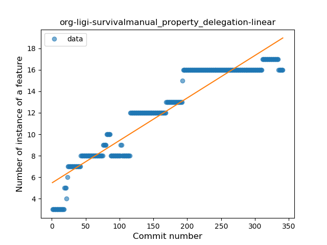

#### com-ofalvai-bpinfo
* Feature: String Template
* Function: 
* R_Squared: 0.88833389
 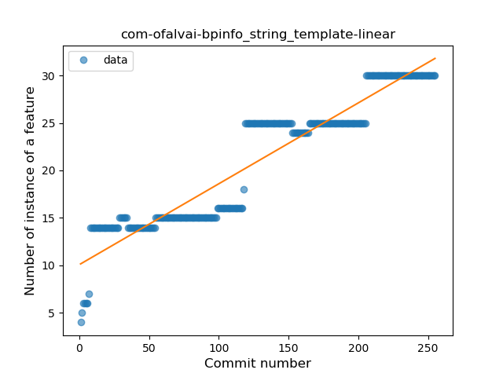

#### com-stevenschoen-putionew
* Feature: Lambda
* Function: 
* R_Squared: 0.88799446
 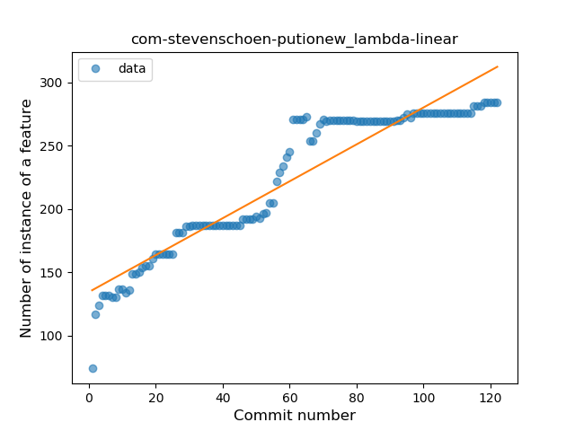

#### net-yslibrary-monotweety
* Feature: Function call with Named Argument
* Function: 
* R_Squared: 0.88790098
 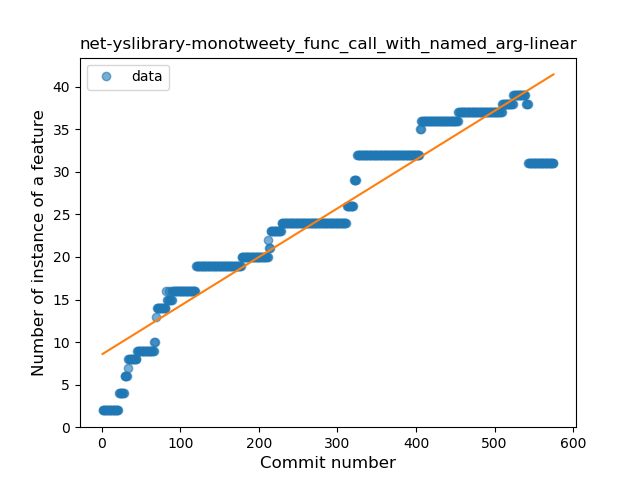

#### be-mygod-vpnhotspot
* Feature: Sealed Class
* Function: 
* R_Squared: 0.88709667
 

#### com-github-quarck-calnotify
* Feature: Function with Default Value
* Function: 
* R_Squared: 0.88692546
 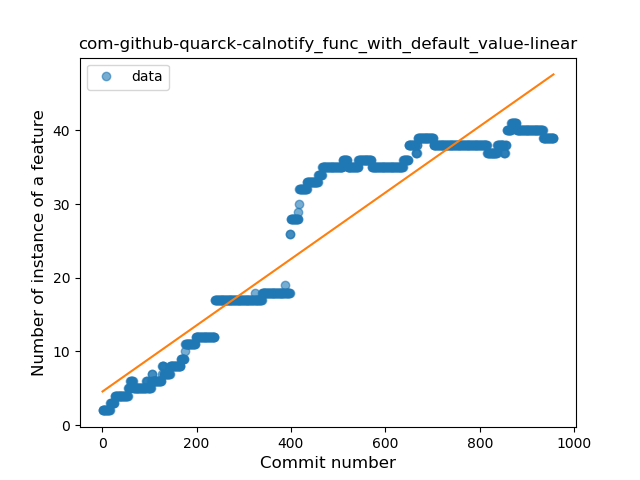

#### com-dp-logcatapp
* Feature: String Template
* Function: 
* R_Squared: 0.88671137
 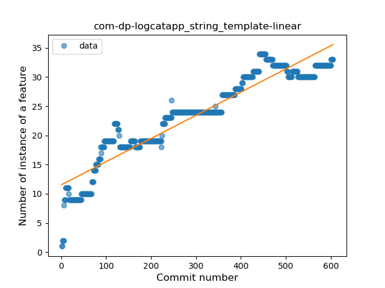

#### com-simplemobiletools-gallery
* Feature: Safe Call
* Function: 
* R_Squared: 0.88649388
 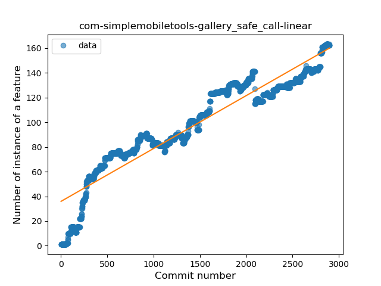

#### chat-rocket-android
* Feature: Function with Default Value
* Function: 
* R_Squared: 0.88626116
 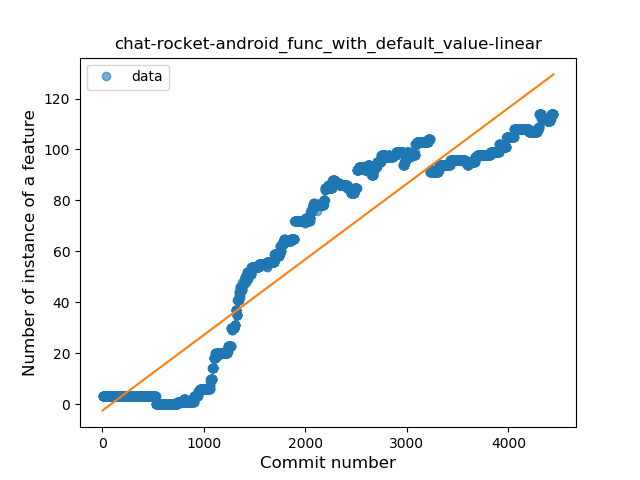

#### fr-cph-chicago-foss
* Feature: Singleton
* Function: 
* R_Squared: 0.88600198
 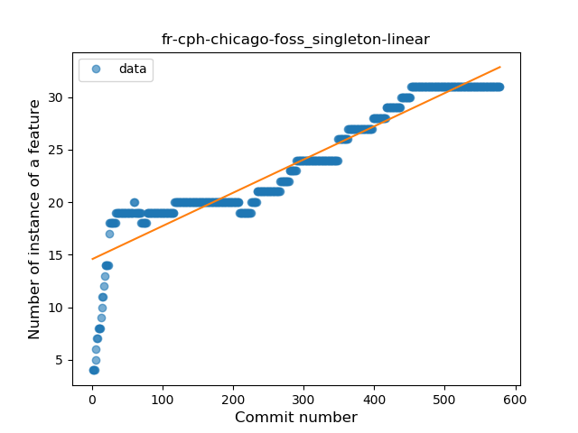

#### de-grobox-liberario
* Feature: Unsafe Call
* Function: 
* R_Squared: 0.88599583
 

#### com-glodanif-bluetoothchat
* Feature: Function with Default Value
* Function: 
* R_Squared: 0.88576437
 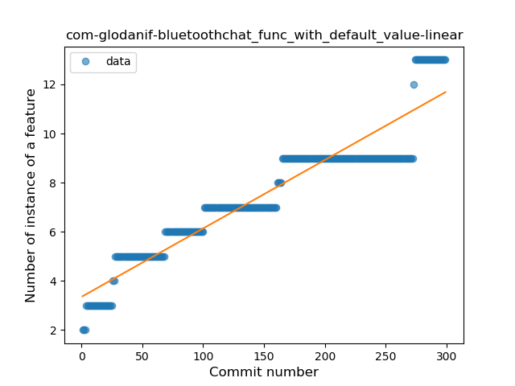

#### com-adityakamble49-ttl
* Feature: Type Inference
* Function: 
* R_Squared: 0.88545634
 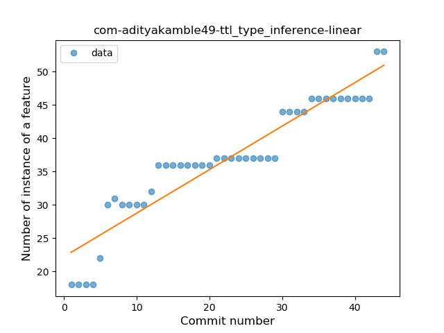

#### com-libopenmw-openmw
* Feature: Lambda
* Function: 
* R_Squared: 0.88515723
 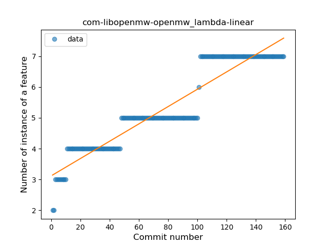

#### pl-hypeapp-episodie
* Feature: When expression
* Function: 
* R_Squared: 0.88505041
 

#### net-osmand-plus
* Feature: When expression
* Function: 
* R_Squared: 0.88437651
 

#### com-eventyay-attendee
* Feature: Range Expression
* Function: 
* R_Squared: 0.88424828
 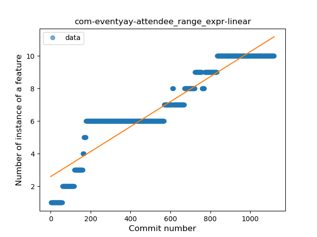

#### com-njlabs-showjava
* Feature: When expression
* Function: 
* R_Squared: 0.88418775
 

#### info-papdt-express-helper
* Feature: Smart Cast
* Function: 
* R_Squared: 0.88407469
 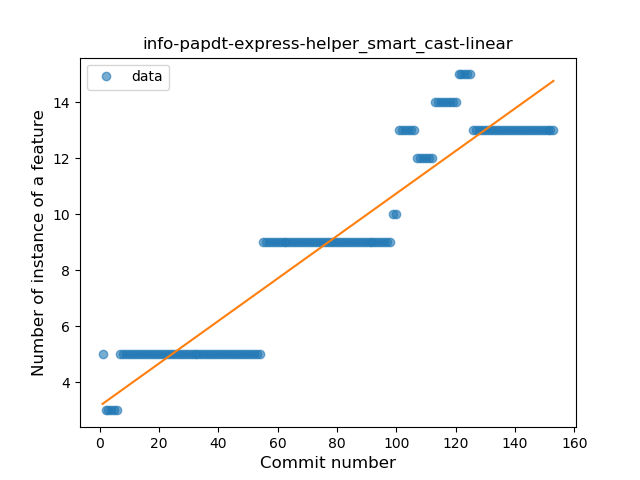

#### com-jim-sharetocomputer
* Feature: Extension Function
* Function: 
* R_Squared: 0.88404327
 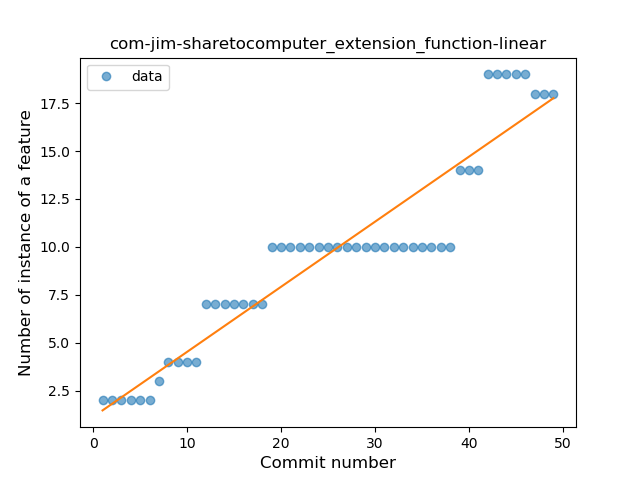

#### com-ogsdroid
* Feature: Type Inference
* Function: 
* R_Squared: 0.88380266
 

#### fi-kroon-vadret
* Feature: Data Class
* Function: 
* R_Squared: 0.88351276
 

#### com-booboot-vndbandroid
* Feature: Type Inference
* Function: 
* R_Squared: 0.88347782
 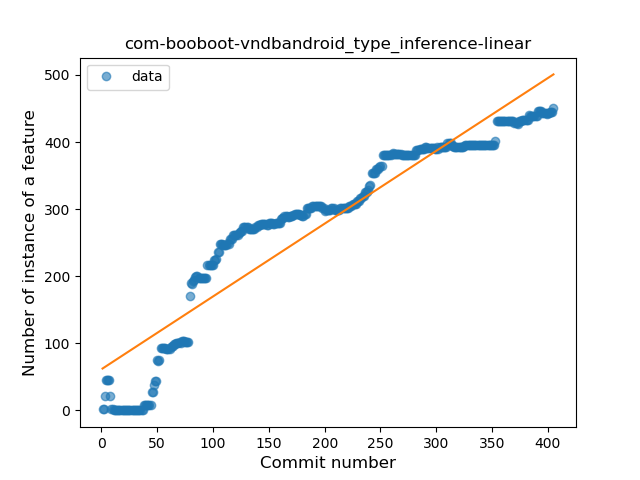

#### org-ligi-passandroid
* Feature: Companion Object
* Function: 
* R_Squared: 0.8832478
 

#### com-arcao-geocaching4locus
* Feature: Lambda
* Function: 
* R_Squared: 0.88324131
 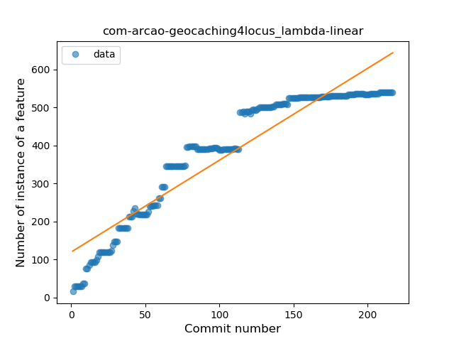

#### com-zacharee1-systemuituner
* Feature: Function with Default Value
* Function: 
* R_Squared: 0.88269951
 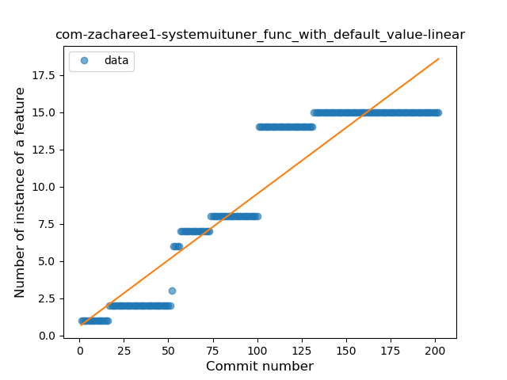

#### com-nononsenseapps-feeder
* Feature: Coroutine
* Function: 
* R_Squared: 0.88231145
 

#### io-github-wulkanowy
* Feature: Function call with Named Argument
* Function: 
* R_Squared: 0.8821942
 

#### com-bernaferrari-changedetection
* Feature: Function call with Named Argument
* Function: 
* R_Squared: 0.8819936
 

#### org-pacien-tincapp
* Feature: Function call with Named Argument
* Function: 
* R_Squared: 0.88164482
 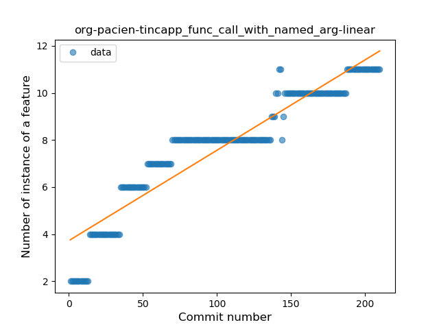

#### de-r4md4c-gamedealz
* Feature: Extension Function
* Function: 
* R_Squared: 0.881405
 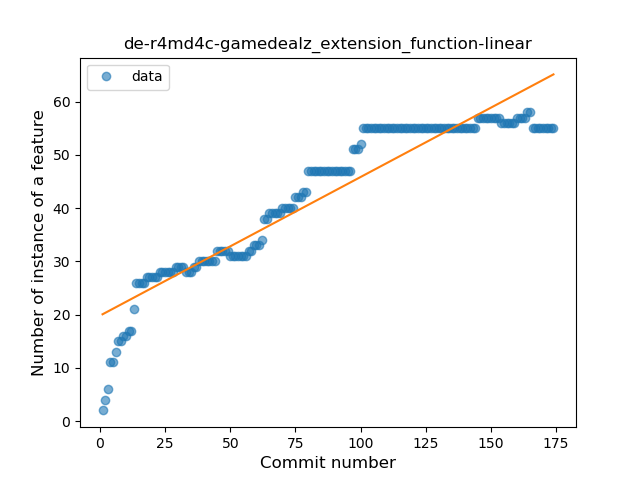

#### org-ligi-survivalmanual
* Feature: Type Inference
* Function: 
* R_Squared: 0.88133732
 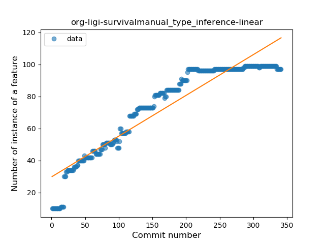

#### com-tasomaniac-openwith-floss
* Feature: Function call with Named Argument
* Function: 
* R_Squared: 0.88123748
 

#### com-ianhanniballake-contractiontimer
* Feature: Type Inference
* Function: 
* R_Squared: 0.88121295
 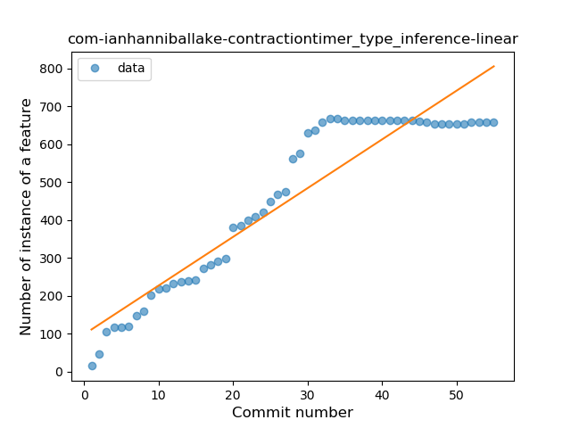

#### com-zacharee1-systemuituner
* Feature: Companion Object
* Function: 
* R_Squared: 0.8810939
 

#### de-markusfisch-android-binaryeye
* Feature: Companion Object
* Function: 
* R_Squared: 0.88102904
 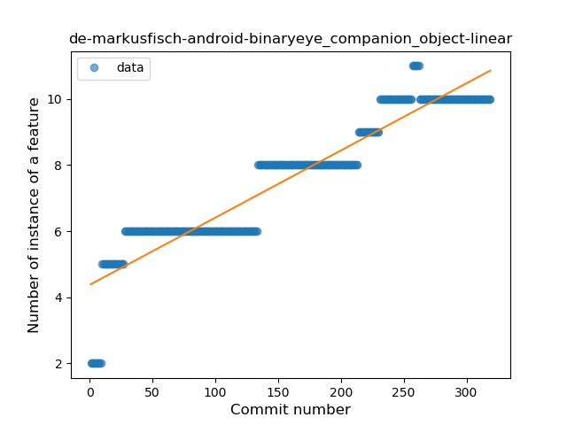

#### net-frju-flym
* Feature: Function with Default Value
* Function: 
* R_Squared: 0.88040797
 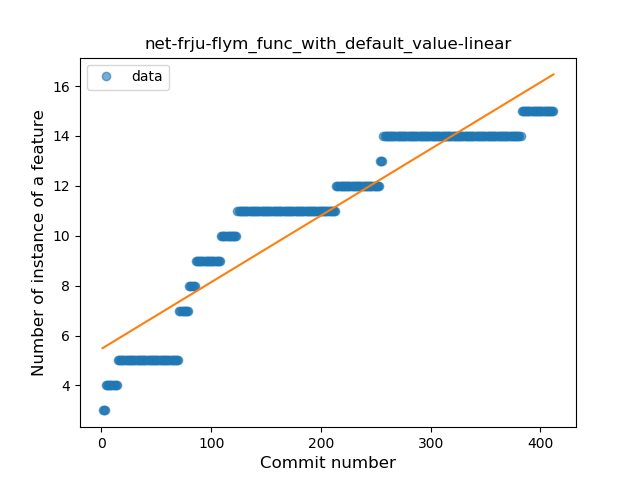

#### com-log28
* Feature: Type Inference
* Function: 
* R_Squared: 0.88017114
 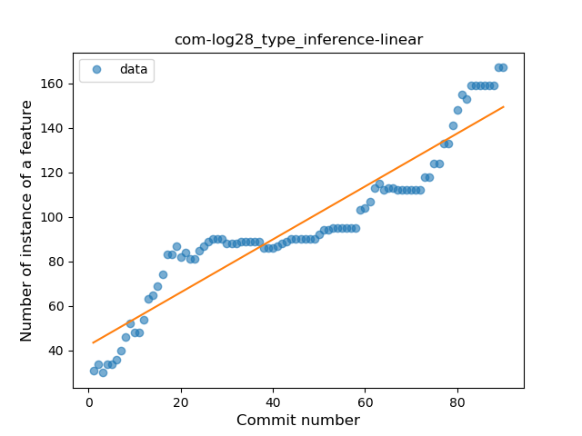

#### com-arcao-geocaching4locus
* Feature: Singleton
* Function: 
* R_Squared: 0.880165
 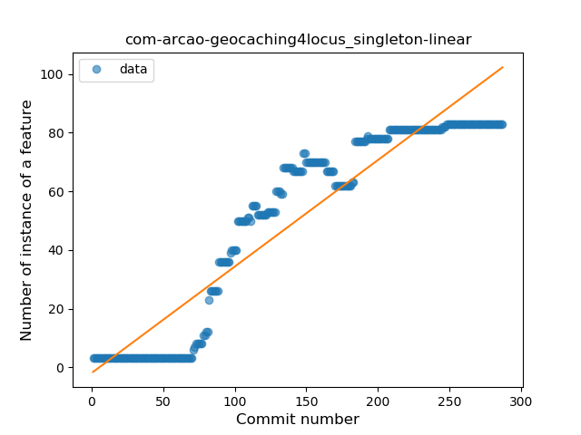

#### com-tasomaniac-openwith-floss
* Feature: Type Inference
* Function: 
* R_Squared: 0.87982512
 

#### com-zeapo-pwdstore
* Feature: Unsafe Call
* Function: 
* R_Squared: 0.87953493
 

#### de-grobox-liberario
* Feature: When expression
* Function: 
* R_Squared: 0.8792997
 

#### com-pitchedapps-frost
* Feature: Type Inference
* Function: 
* R_Squared: 0.87879196
 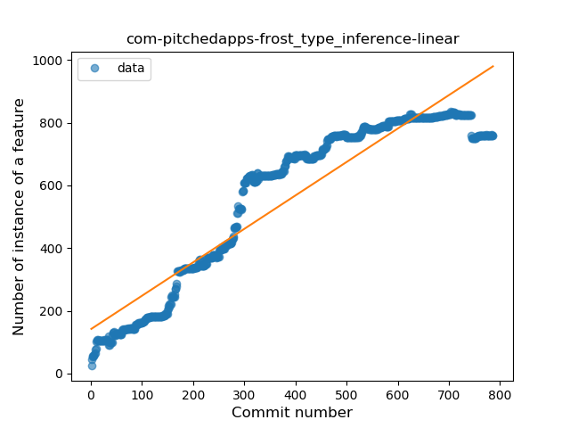

#### com-dozingcatsoftware-vectorcamera
* Feature: Companion Object
* Function: 
* R_Squared: 0.87855994
 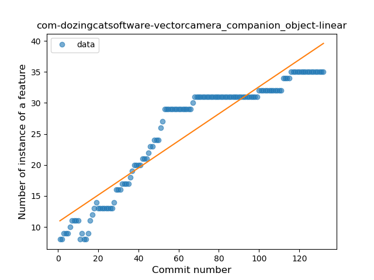

#### com-peterlaurence-trekme
* Feature: Coroutine
* Function: 
* R_Squared: 0.87829311
 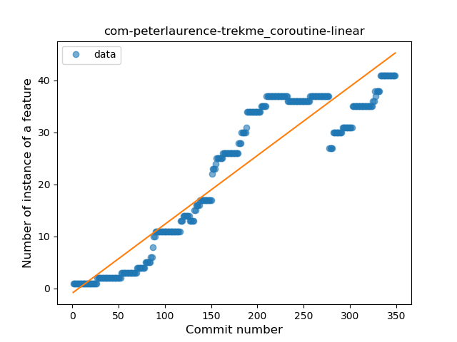

#### fi-kroon-vadret
* Feature: String Template
* Function: 
* R_Squared: 0.87828901
 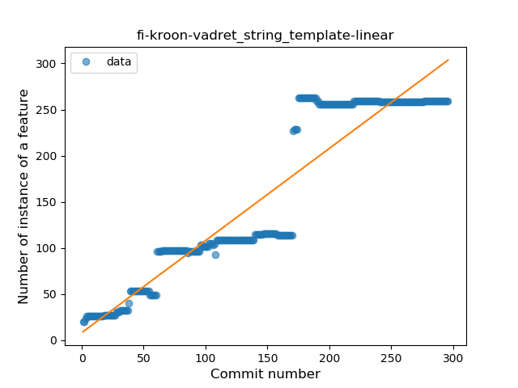

#### com-jmstudios-redmoon
* Feature: When expression
* Function: 
* R_Squared: 0.87801428
 

#### com-peterlaurence-trekme
* Feature: Singleton
* Function: 
* R_Squared: 0.87783907
 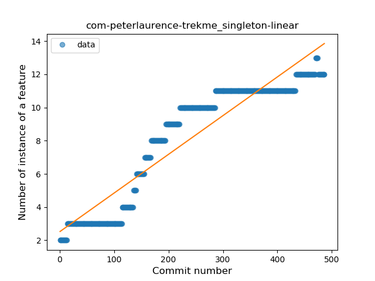

#### de-grobox-liberario
* Feature: Safe Call
* Function: 
* R_Squared: 0.87737474
 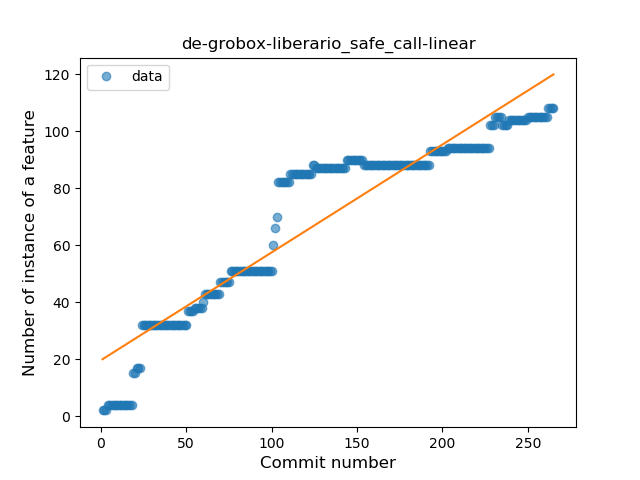

#### name-cantanima-chineseremainderclock
* Feature: Type Inference
* Function: 
* R_Squared: 0.87705194
 

#### de-r4md4c-gamedealz
* Feature: Property Delegation
* Function: 
* R_Squared: 0.87662219
 

#### net-bible-android-activity
* Feature: Unsafe Call
* Function: 
* R_Squared: 0.87623451
 

#### one-librem-social
* Feature: Extension Function
* Function: 
* R_Squared: 0.87623018
 

#### com-jim-sharetocomputer
* Feature: Lambda
* Function: 
* R_Squared: 0.87565498
 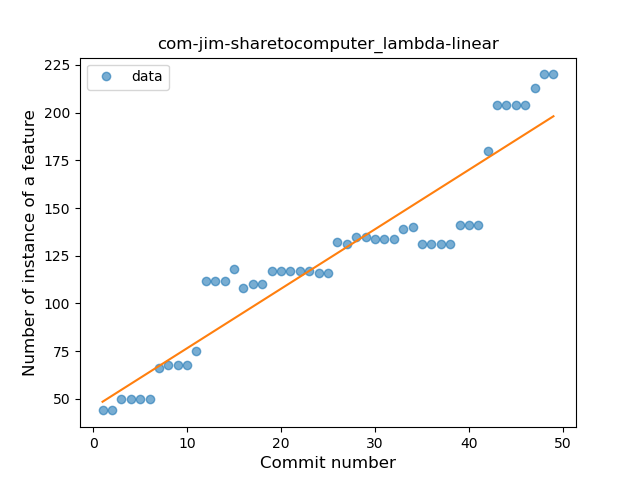

#### com-dozingcatsoftware-vectorcamera
* Feature: When expression
* Function: 
* R_Squared: 0.87564655
 

#### com-fsck-k9
* Feature: Destructuring Declaration
* Function: 
* R_Squared: 0.87535617
 

#### net-osmand-plus
* Feature: Smart Cast
* Function: 
* R_Squared: 0.87534593
 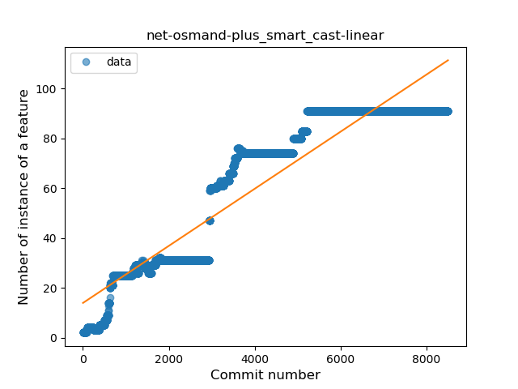

#### de-Maxr1998-xposed-maxlock
* Feature: String Template
* Function: 
* R_Squared: 0.87531742
 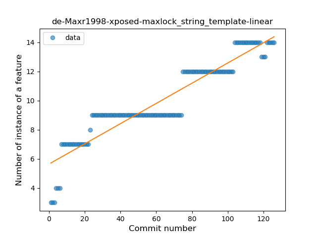

#### de-thecode-android-tazreader
* Feature: Data Class
* Function: 
* R_Squared: 0.87518642
 

#### ch-abertschi-adfree
* Feature: Lambda
* Function: 
* R_Squared: 0.8749716
 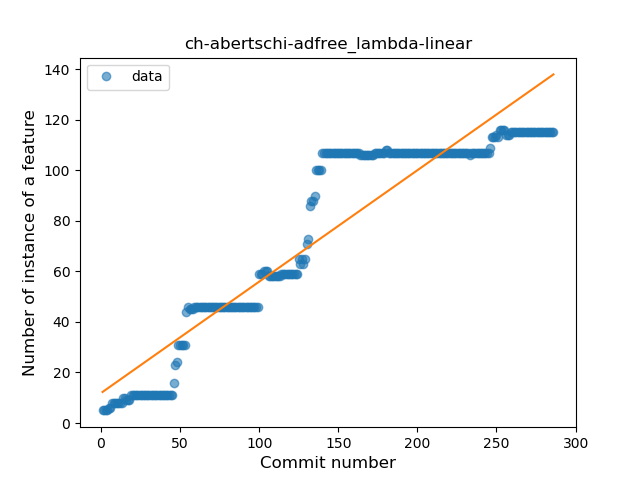

#### org-eurofurence-connavigator
* Feature: Singleton
* Function: 
* R_Squared: 0.87472276
 

#### com-bijoysingh-quicknote
* Feature: Coroutine
* Function: 
* R_Squared: 0.87451213
 

#### com-simplemobiletools-draw
* Feature: Safe Call
* Function: 
* R_Squared: 0.87416115
 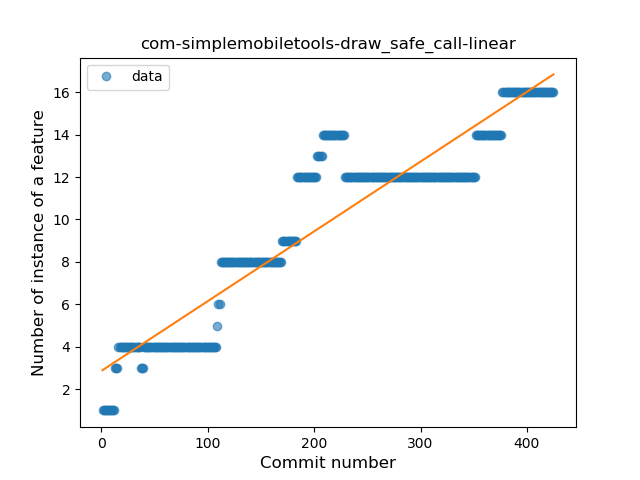

#### com-simplemobiletools-draw-pro
* Feature: Safe Call
* Function: 
* R_Squared: 0.87416115
 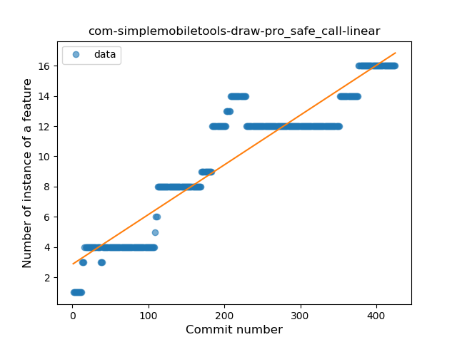

#### org-walleth
* Feature: Function call with Named Argument
* Function: 
* R_Squared: 0.87382986
 

#### net-kourlas-voipms
* Feature: Companion Object
* Function: 
* R_Squared: 0.8737772
 

#### com-jim-sharetocomputer
* Feature: Safe Call
* Function: 
* R_Squared: 0.87373178
 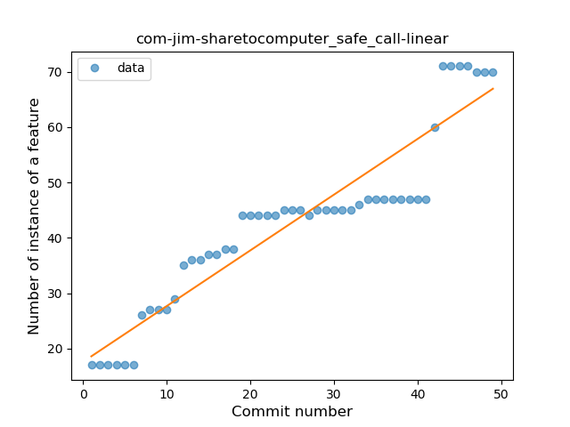

#### de-thecode-lmd
* Feature: String Template
* Function: 
* R_Squared: 0.87364437
 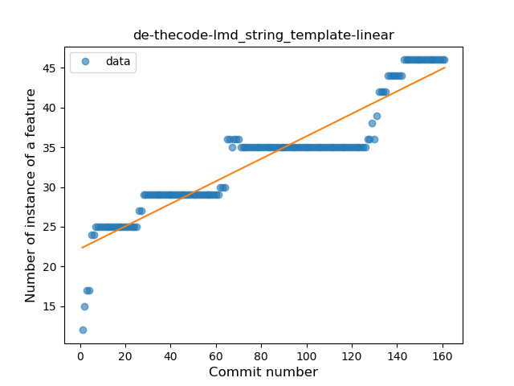

#### com-rohitsuratekar-NCBSinfo
* Feature: Unsafe Call
* Function: 
* R_Squared: 0.87335038
 

#### info-dvkr-screenstream
* Feature: Range Expression
* Function: 
* R_Squared: 0.87325964
 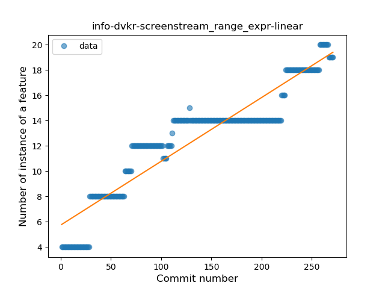

#### quickbeer-android
* Feature: Data Class
* Function: 
* R_Squared: 0.87283811
 

#### com-fastaccess-github-libre
* Feature: When expression
* Function: 
* R_Squared: 0.87227071
 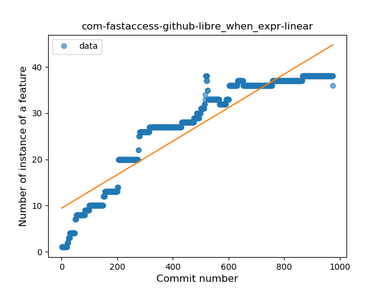

#### org-weilbach-splitbills
* Feature: Type Inference
* Function: 
* R_Squared: 0.87205549
 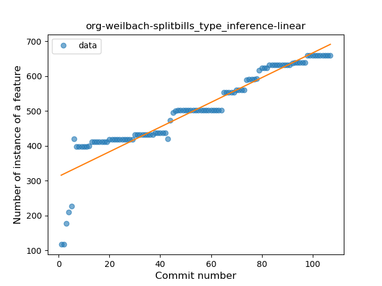

#### es-usc-citius-servando-calendula
* Feature: When expression
* Function: 
* R_Squared: 0.87133876
 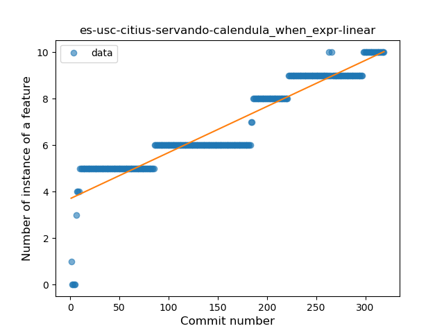

#### com-jereksel-libresubstratum
* Feature: Property Delegation
* Function: 
* R_Squared: 0.87126392
 

#### pl-org-seva-navigator
* Feature: Function call with Named Argument
* Function: 
* R_Squared: 0.87097665
 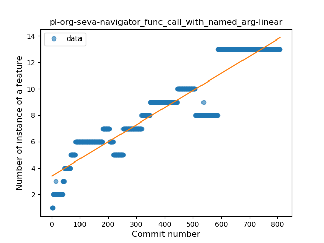

#### se-creotec-chscardbalance2
* Feature: Safe Call
* Function: 
* R_Squared: 0.87068361
 

#### com-tutpro-baresip
* Feature: Lambda
* Function: 
* R_Squared: 0.87023346
 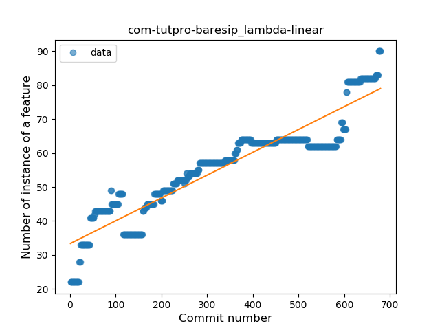

#### com-arcao-geocaching4locus
* Feature: Coroutine
* Function: 
* R_Squared: 0.87015085
 

#### fi-kroon-vadret
* Feature: Overloaded Operator
* Function: 
* R_Squared: 0.87010953
 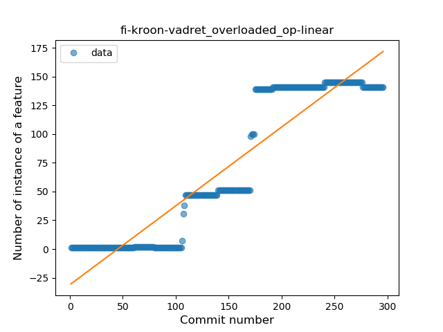

#### org-fossasia-badgemagic
* Feature: Safe Call
* Function: 
* R_Squared: 0.87010587
 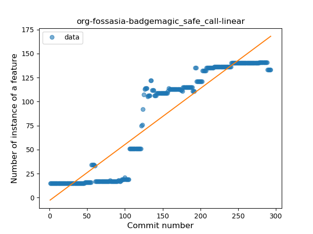

#### ca-fuwafuwa-kaku
* Feature: String Template
* Function: 
* R_Squared: 0.86978104
 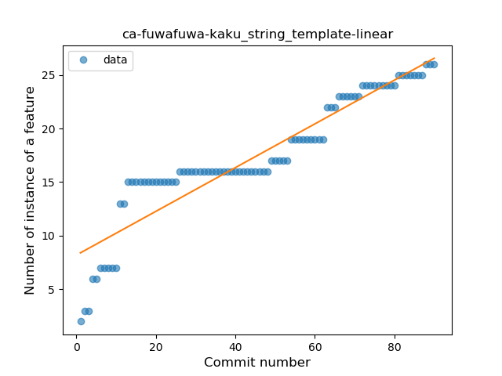

#### fi-kroon-vadret
* Feature: Smart Cast
* Function: 
* R_Squared: 0.86943273
 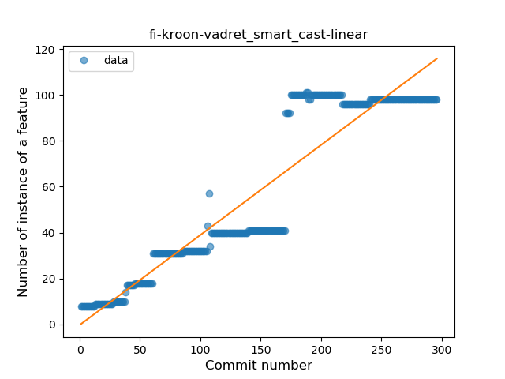

#### ffc-app
* Feature: Companion Object
* Function: 
* R_Squared: 0.86928232
 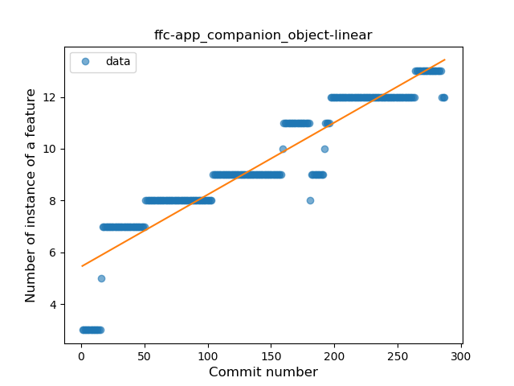

#### net-yslibrary-monotweety
* Feature: Type Inference
* Function: 
* R_Squared: 0.86916267
 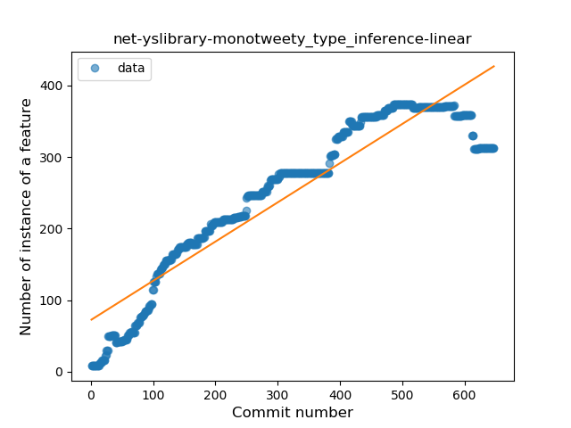

#### info-papdt-express-helper
* Feature: Type Inference
* Function: 
* R_Squared: 0.86901775
 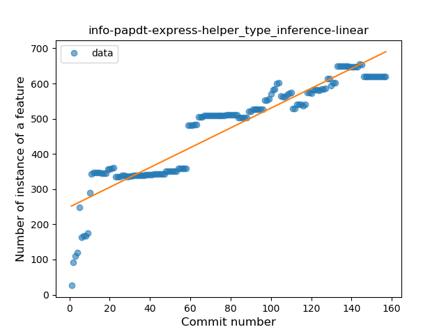

#### com-ogsdroid
* Feature: Data Class
* Function: 
* R_Squared: 0.86816582
 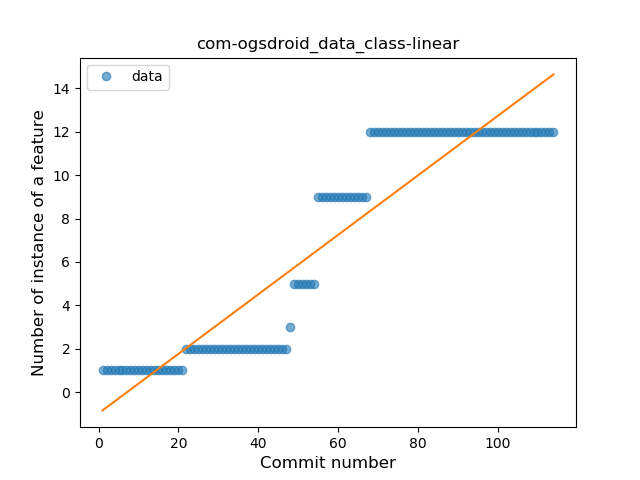

#### com-ofalvai-bpinfo
* Feature: Property Delegation
* Function: 
* R_Squared: 0.86804288
 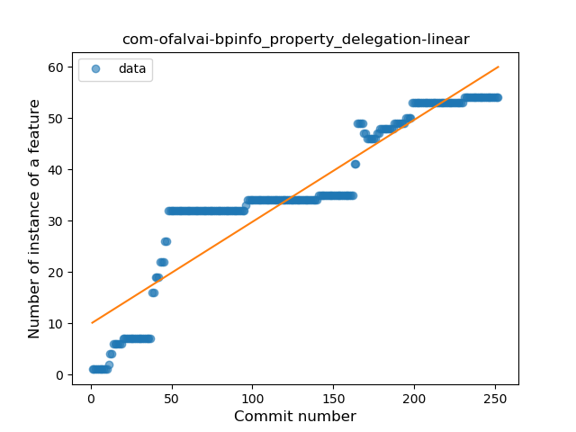

#### com-keylesspalace-tusky
* Feature: Extension Function
* Function: 
* R_Squared: 0.86796369
 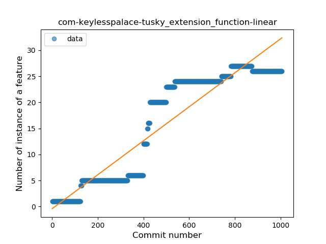

#### com-orgzly
* Feature: Singleton
* Function: 
* R_Squared: 0.86725902
 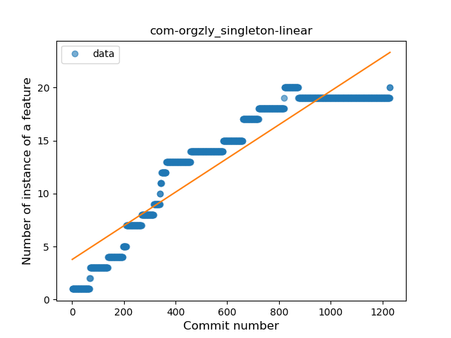

#### nl-mpcjanssen-simpletask
* Feature: Function call with Named Argument
* Function: 
* R_Squared: 0.86714573
 

#### com-doctoror-particleswallpaper
* Feature: Function with Default Value
* Function: 
* R_Squared: 0.86700937
 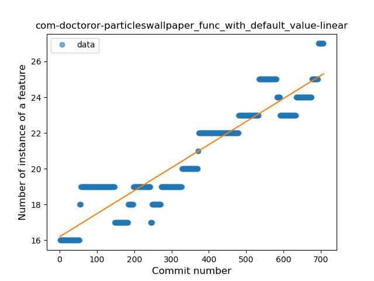

#### info-metadude-android-congress-schedule
* Feature: Companion Object
* Function: 
* R_Squared: 0.86669388
 

#### org-mattvchandler-progressbars
* Feature: When expression
* Function: 
* R_Squared: 0.86668625
 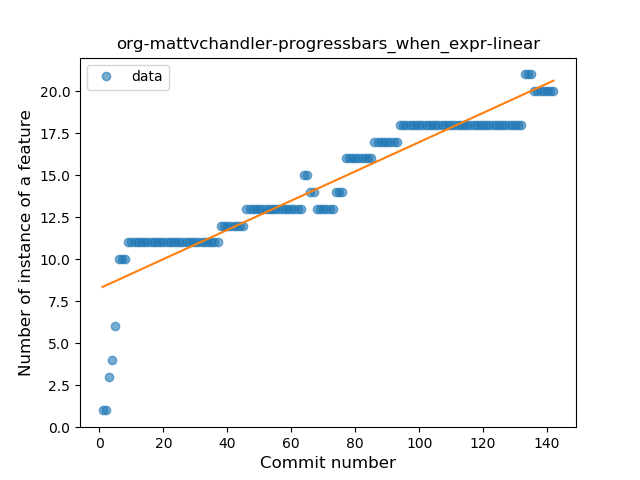

#### com-czbix-v2ex
* Feature: Singleton
* Function: 
* R_Squared: 0.86603055
 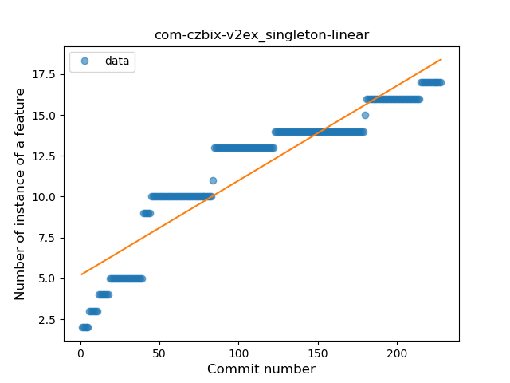

#### com-github-premnirmal-tickerwidget
* Feature: Data Class
* Function: 
* R_Squared: 0.86572205
 

#### com-booboot-vndbandroid
* Feature: Lambda
* Function: 
* R_Squared: 0.86543877
 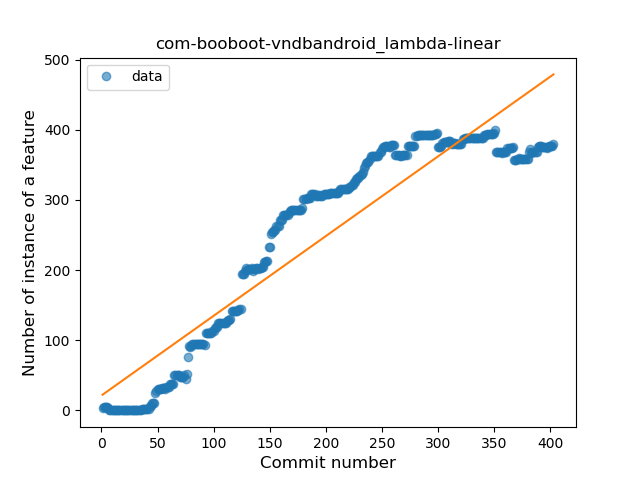

#### org-blokada-alarm
* Feature: Extension Function
* Function: 
* R_Squared: 0.86509794
 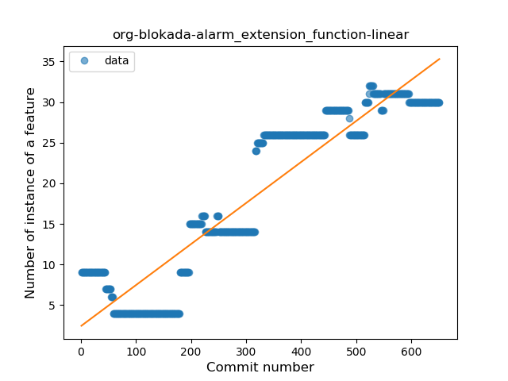

#### com-ogsdroid
* Feature: Companion Object
* Function: 
* R_Squared: 0.86508945
 

#### com-simplemobiletools-camera
* Feature: Lambda
* Function: 
* R_Squared: 0.86386891
 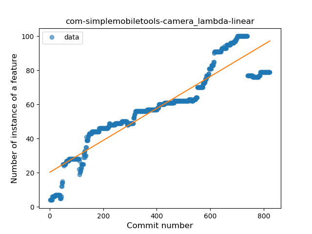

#### net-mm2d-android-vmb
* Feature: Smart Cast
* Function: 
* R_Squared: 0.86357012
 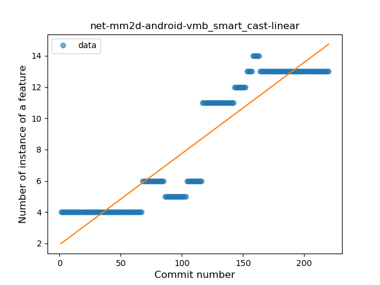

#### com-sjn-stamp
* Feature: Companion Object
* Function: 
* R_Squared: 0.86303182
 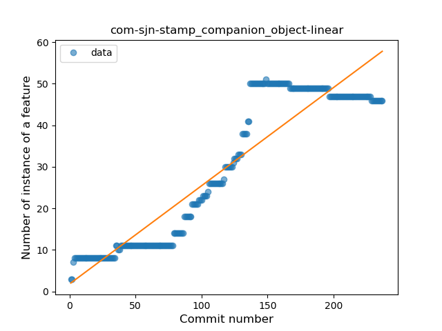

#### de-micmun-android-deufeitage
* Feature: Lambda
* Function: 
* R_Squared: 0.86282184
 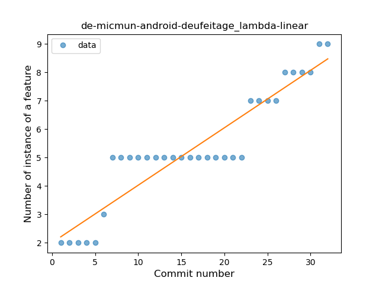

#### com-scientists-happy-botanist
* Feature: Type Inference
* Function: 
* R_Squared: 0.86275034
 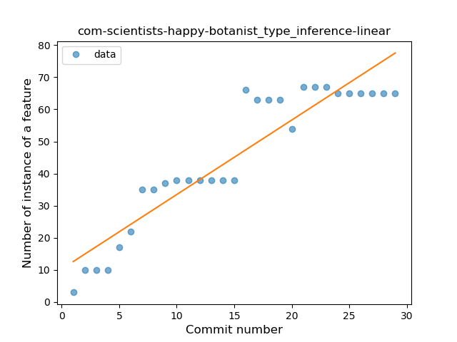

#### com-sjn-stamp
* Feature: Singleton
* Function: 
* R_Squared: 0.86255963
 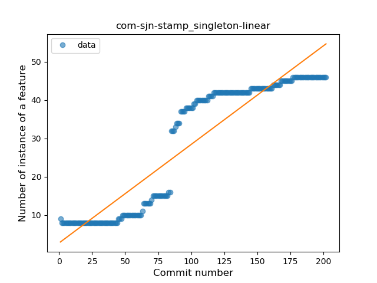

#### se-barsk-park
* Feature: Companion Object
* Function: 
* R_Squared: 0.86245641
 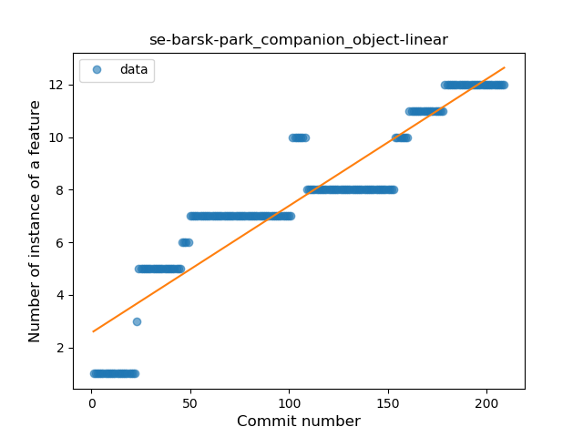

#### org-fossasia-badgemagic
* Feature: Companion Object
* Function: 
* R_Squared: 0.86238197
 

#### net-codechunk-speedofsound
* Feature: Lambda
* Function: 
* R_Squared: 0.86226931
 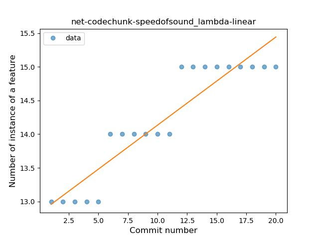

#### app-simone
* Feature: Type Inference
* Function: 
* R_Squared: 0.86205045
 

#### com-simplemobiletools-applauncher
* Feature: Lambda
* Function: 
* R_Squared: 0.86200452
 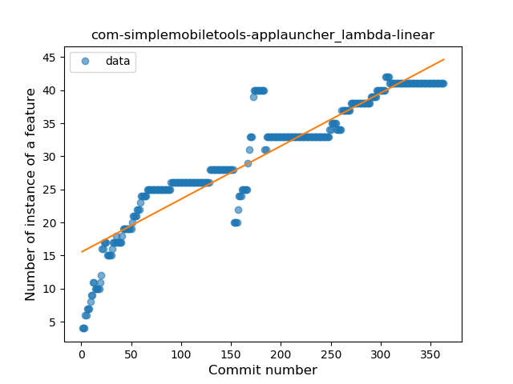

#### me-murks-feedwatcher
* Feature: Safe Call
* Function: 
* R_Squared: 0.86181458
 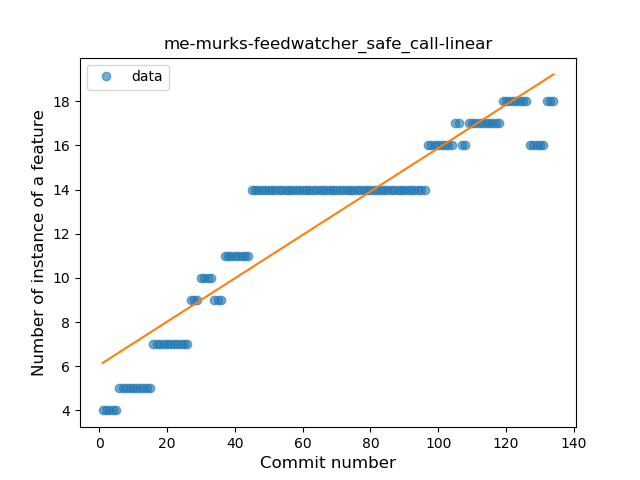

#### app-simone
* Feature: Safe Call
* Function: 
* R_Squared: 0.86166191
 

#### org-walleth
* Feature: Property Delegation
* Function: 
* R_Squared: 0.86161535
 

#### com-crane-mockappdemo
* Feature: Type Inference
* Function: 
* R_Squared: 0.86150745
 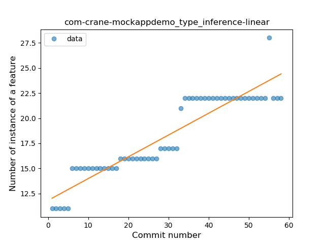

#### com-simplemobiletools-notes-pro
* Feature: Type Inference
* Function: 
* R_Squared: 0.86126254
 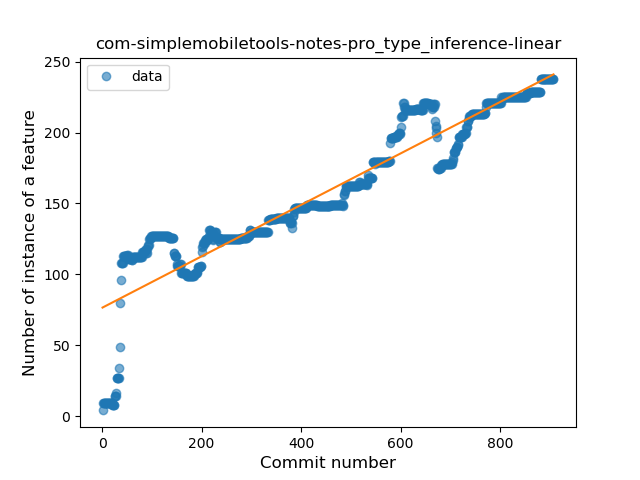

#### me-kirimin-mitsumine
* Feature: Function with Default Value
* Function: 
* R_Squared: 0.86079395
 

#### com-mgaetan89-showsrage
* Feature: Function with Default Value
* Function: 
* R_Squared: 0.86058248
 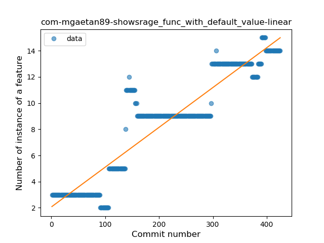

#### org-fossasia-badgemagic
* Feature: Range Expression
* Function: 
* R_Squared: 0.8605792
 

#### com-njlabs-showjava
* Feature: Companion Object
* Function: 
* R_Squared: 0.86025386
 

#### com-fsck-k9
* Feature: Extension Function
* Function: 
* R_Squared: 0.86003332
 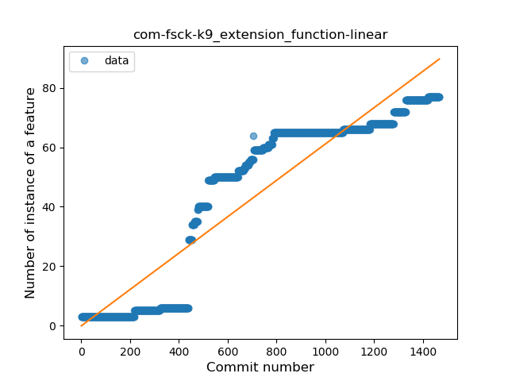

#### org-blokada-alarm
* Feature: Function call with Named Argument
* Function: 
* R_Squared: 0.85977755
 

#### org-blitzortung-android-app
* Feature: Companion Object
* Function: 
* R_Squared: 0.85971374
 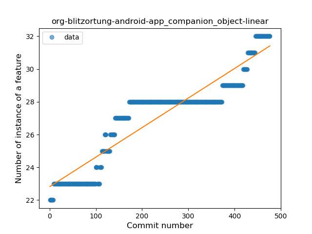

#### com-moez-QKSMS
* Feature: Function call with Named Argument
* Function: 
* R_Squared: 0.85966829
 

#### com-tutpro-baresip
* Feature: When expression
* Function: 
* R_Squared: 0.85961276
 

#### fi-kroon-vadret
* Feature: Sealed Class
* Function: 
* R_Squared: 0.85904398
 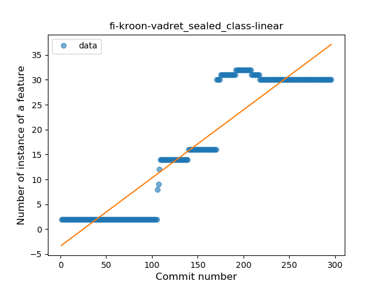

#### ru-hyst329-openfool
* Feature: Function call with Named Argument
* Function: 
* R_Squared: 0.85859707
 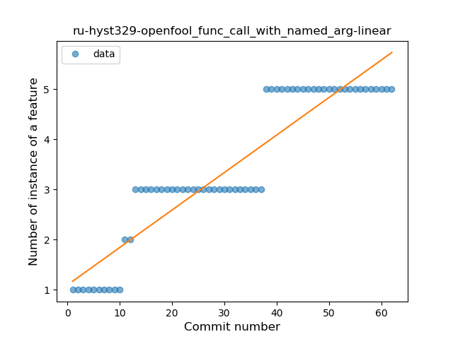

#### com-zacharee1-systemuituner
* Feature: Property Delegation
* Function: 
* R_Squared: 0.85843153
 

#### com-booboot-vndbandroid
* Feature: Function with Default Value
* Function: 
* R_Squared: 0.85796669
 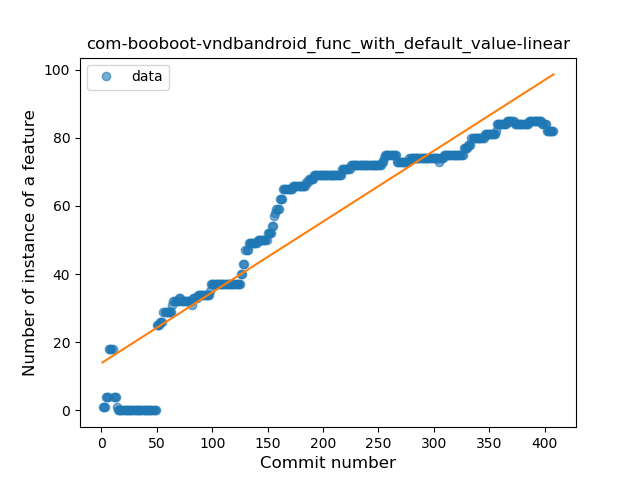

#### net-osmand-plus
* Feature: String Template
* Function: 
* R_Squared: 0.85787296
 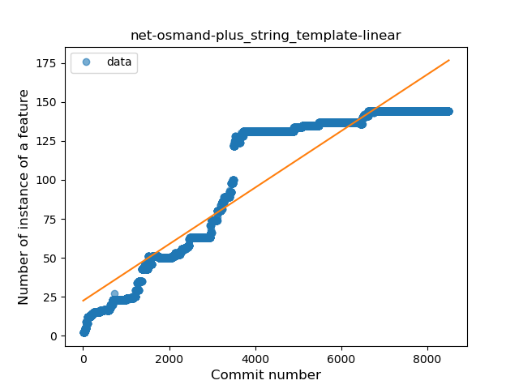

#### fi-kroon-vadret
* Feature: Type Inference
* Function: 
* R_Squared: 0.85766831
 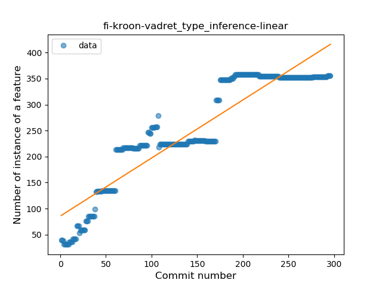

#### apps-jizzu-simpletodo
* Feature: Safe Call
* Function: 
* R_Squared: 0.8575494
 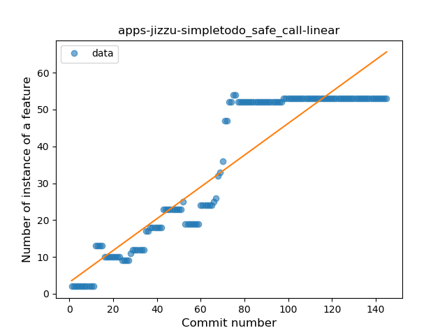

#### io-github-feelfreelinux-wykopmobilny
* Feature: Data Class
* Function: 
* R_Squared: 0.85733288
 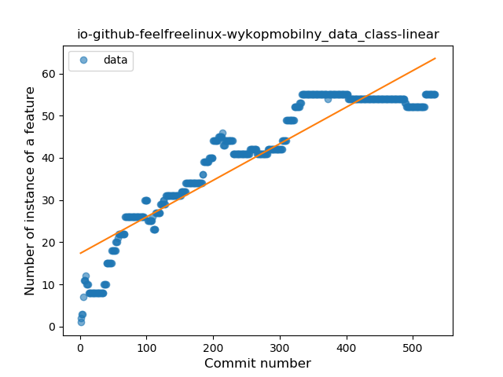

#### com-orgzly
* Feature: Unsafe Call
* Function: 
* R_Squared: 0.85731219
 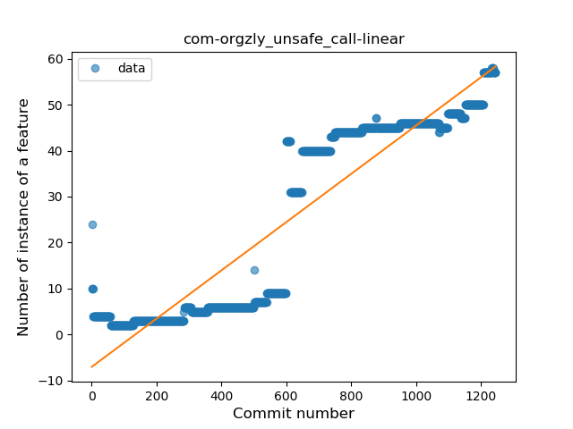

#### net-bible-android-activity
* Feature: Smart Cast
* Function: 
* R_Squared: 0.85692339
 

#### fr-cph-chicago-foss
* Feature: Extension Function
* Function: 
* R_Squared: 0.85589463
 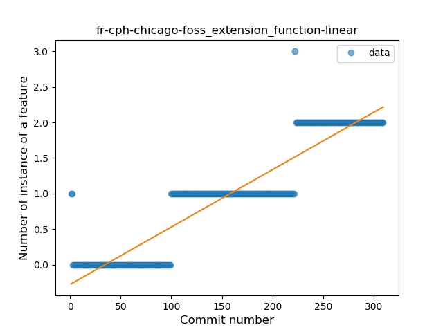

#### chat-rocket-android
* Feature: When expression
* Function: 
* R_Squared: 0.85543256
 

#### ca-josephroque-bowlingcompanion
* Feature: Extension Function
* Function: 
* R_Squared: 0.85531746
 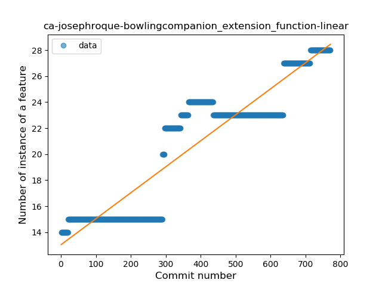

#### li-klass-fhem
* Feature: Singleton
* Function: 
* R_Squared: 0.85503466
 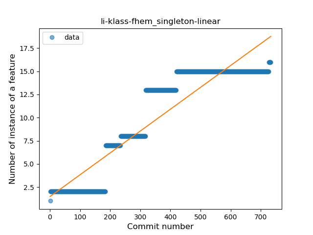

#### com-tasomaniac-openwith-floss
* Feature: Unsafe Call
* Function: 
* R_Squared: 0.85469353
 

#### com-stolineage-lineagewatcher
* Feature: Safe Call
* Function: 
* R_Squared: 0.85449438
 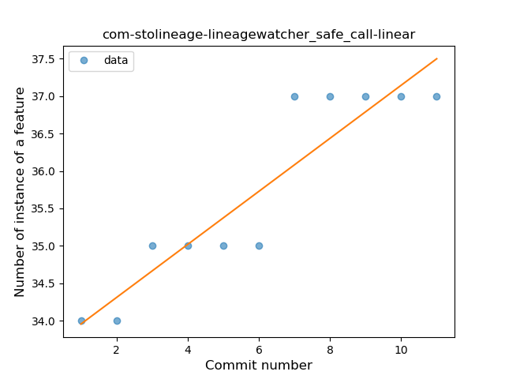

#### apps-amine-bou-readerforselfoss
* Feature: String Template
* Function: 
* R_Squared: 0.85424654
 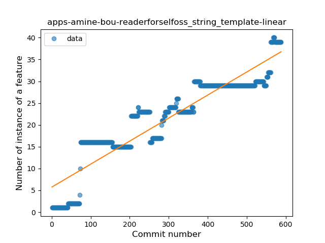

#### de-Maxr1998-xposed-maxlock
* Feature: Companion Object
* Function: 
* R_Squared: 0.85423418
 

#### org-ligi-gobandroid
* Feature: String Template
* Function: 
* R_Squared: 0.85419765
 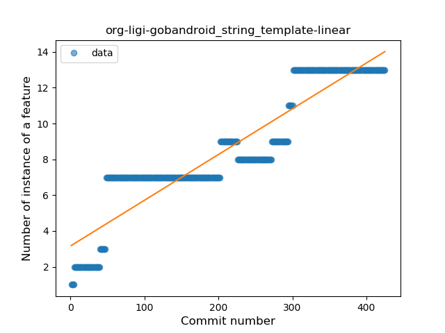

#### de-avpptr-umweltzone
* Feature: When expression
* Function: 
* R_Squared: 0.85409548
 

#### com-benoitquenaudon-tvfoot-red
* Feature: Smart Cast
* Function: 
* R_Squared: 0.85361366
 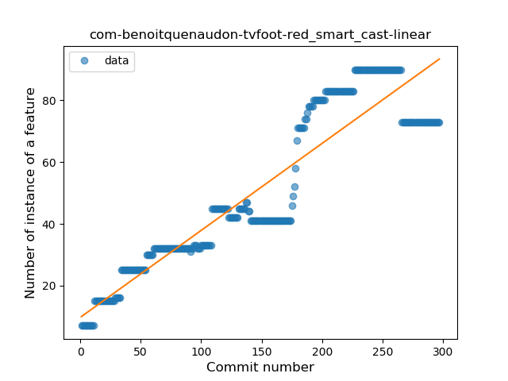

#### cat-pantsu-nyaapantsu
* Feature: Lambda
* Function: 
* R_Squared: 0.85316293
 

#### de-r4md4c-gamedealz
* Feature: Range Expression
* Function: 
* R_Squared: 0.85308823
 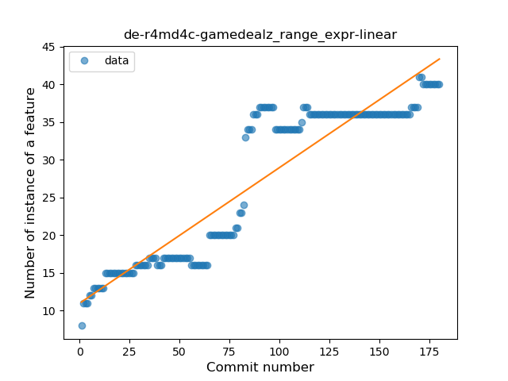

#### org-weilbach-splitbills
* Feature: Singleton
* Function: 
* R_Squared: 0.85263972
 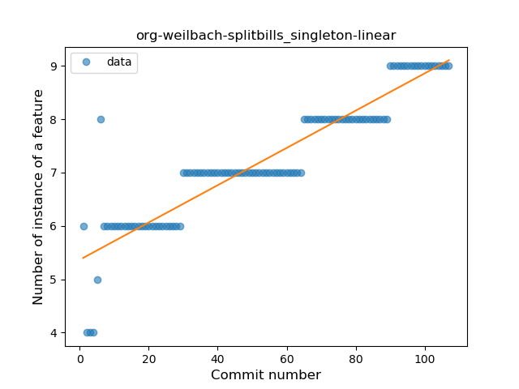

#### com-github-moko256-twitlatte
* Feature: Function call with Named Argument
* Function: 
* R_Squared: 0.85230054
 

#### com-benoitquenaudon-tvfoot-red
* Feature: Safe Call
* Function: 
* R_Squared: 0.85168406
 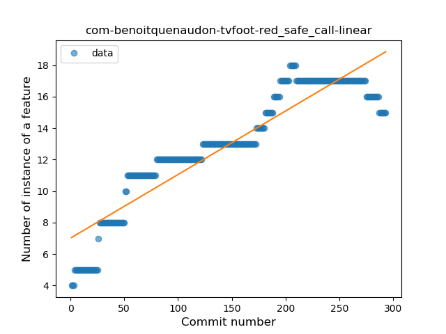

#### com-aaplab-bakubus
* Feature: Lambda
* Function: 
* R_Squared: 0.8513807
 

#### fi-kroon-vadret
* Feature: Unsafe Call
* Function: 
* R_Squared: 0.85127369
 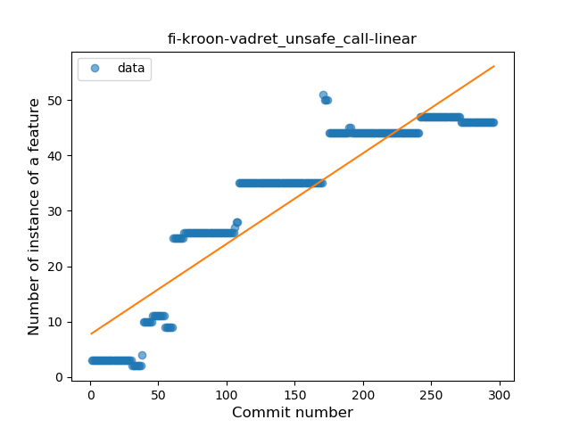

#### com-directdev-portal
* Feature: Lambda
* Function: 
* R_Squared: 0.85120056
 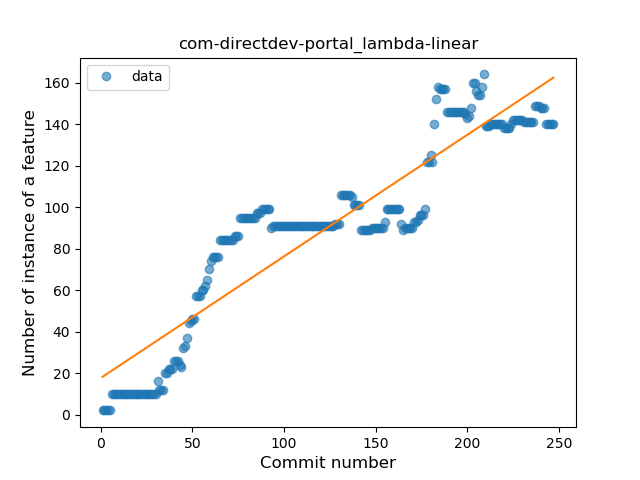

#### im-vector-alpha
* Feature: Destructuring Declaration
* Function: 
* R_Squared: 0.85113526
 

#### info-papdt-express-helper
* Feature: Lambda
* Function: 
* R_Squared: 0.85085861
 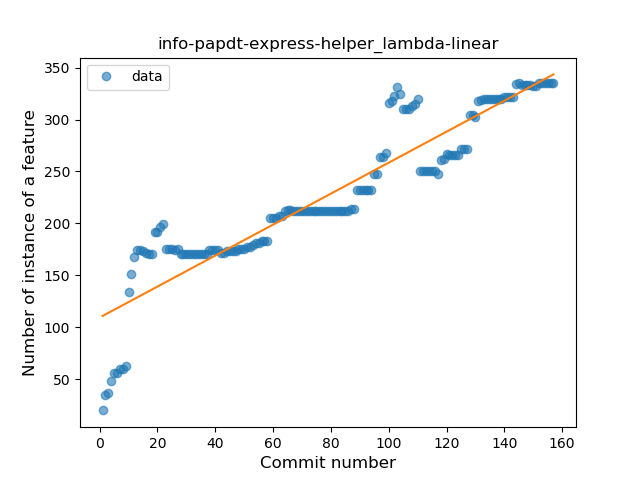

#### net-mm2d-android-vmb
* Feature: Lambda
* Function: 
* R_Squared: 0.85084458
 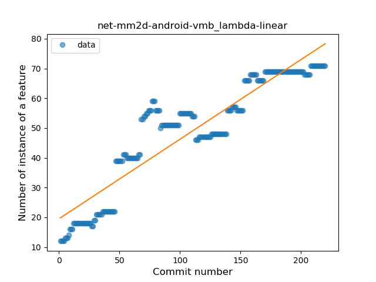

#### fr-insapp-insapp
* Feature: Lambda
* Function: 
* R_Squared: 0.85064495
 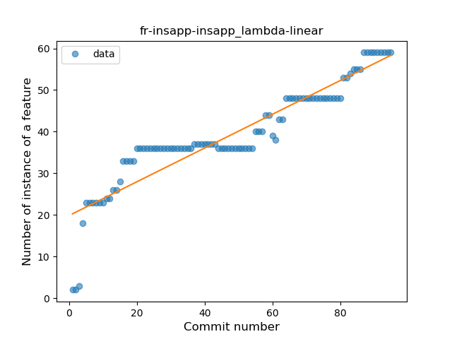

#### be-mygod-vpnhotspot
* Feature: Unsafe Call
* Function: 
* R_Squared: 0.85033953
 

#### acr-browser-lightning
* Feature: Inline Function
* Function: 
* R_Squared: 0.84999188
 

#### pl-hypeapp-episodie
* Feature: Smart Cast
* Function: 
* R_Squared: 0.84978916
 

#### com-wabadaba-dziennik
* Feature: String Template
* Function: 
* R_Squared: 0.84940386
 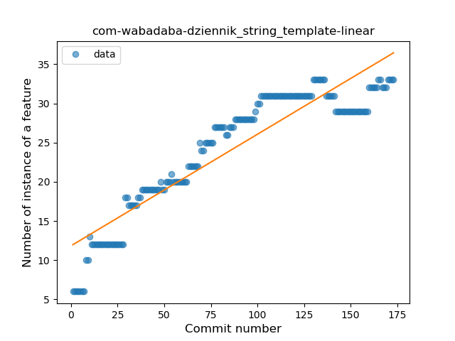

#### de-thecode-android-tazreader
* Feature: Property Delegation
* Function: 
* R_Squared: 0.8493199
 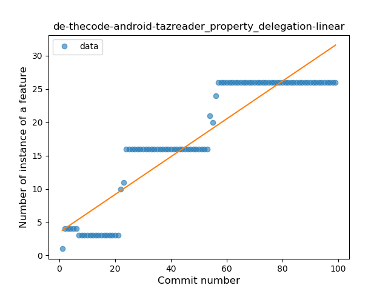

#### org-poul-bits-android
* Feature: Companion Object
* Function: 
* R_Squared: 0.84928823
 

#### com-stevenschoen-putionew
* Feature: Unsafe Call
* Function: 
* R_Squared: 0.84921064
 

#### com-simplemobiletools-calendar-pro
* Feature: Type Inference
* Function: 
* R_Squared: 0.84897264
 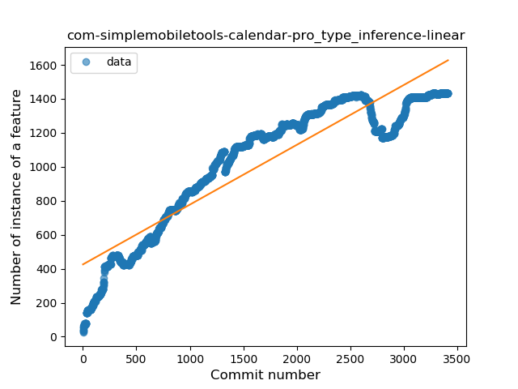

#### org-eurofurence-connavigator
* Feature: String Template
* Function: 
* R_Squared: 0.84862181
 

#### apps-jizzu-simpletodo
* Feature: Lambda
* Function: 
* R_Squared: 0.848473
 

#### quickbeer-android
* Feature: Smart Cast
* Function: 
* R_Squared: 0.8476856
 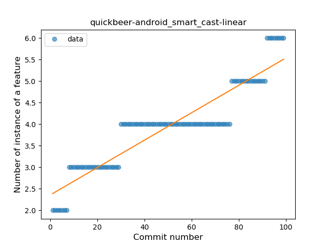

#### org-emunix-insteadlauncher
* Feature: Companion Object
* Function: 
* R_Squared: 0.84768346
 

#### org-poul-bits-android
* Feature: Unsafe Call
* Function: 
* R_Squared: 0.84765495
 

#### com-mgaetan89-showsrage
* Feature: Safe Call
* Function: 
* R_Squared: 0.84765271
 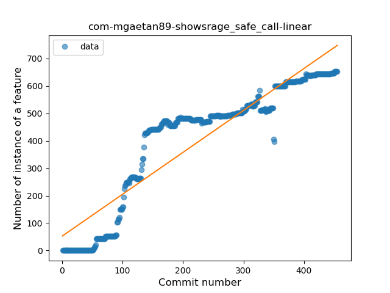

#### science-apolline
* Feature: When expression
* Function: 
* R_Squared: 0.84750078
 

#### apps-amine-bou-readerforselfoss
* Feature: When expression
* Function: 
* R_Squared: 0.84744823
 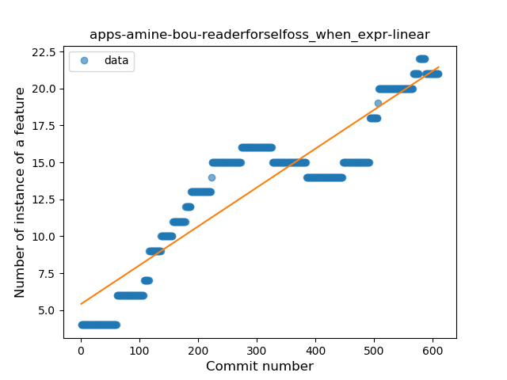

#### net-frju-flym
* Feature: Function call with Named Argument
* Function: 
* R_Squared: 0.84735598
 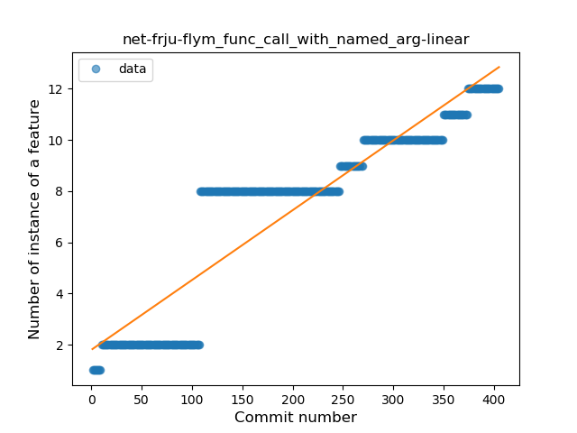

#### com-zacharee1-systemuituner
* Feature: When expression
* Function: 
* R_Squared: 0.84733758
 

#### com-lavadip-miniVector
* Feature: Destructuring Declaration
* Function: 
* R_Squared: 0.84710703
 

#### com-glodanif-bluetoothchat
* Feature: When expression
* Function: 
* R_Squared: 0.84698132
 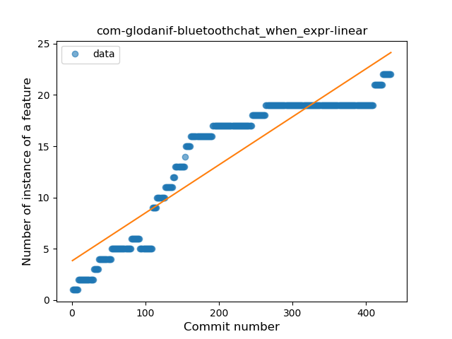

#### com-benoitquenaudon-tvfoot-red
* Feature: Extension Function
* Function: 
* R_Squared: 0.84664068
 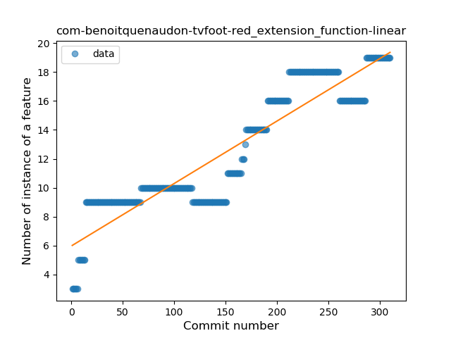

#### org-mattvchandler-progressbars
* Feature: Safe Call
* Function: 
* R_Squared: 0.84656566
 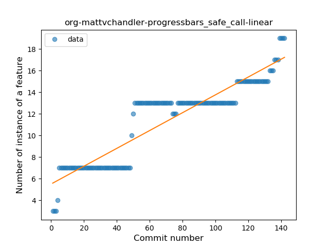

#### de-thecode-android-tazreader
* Feature: Type Inference
* Function: 
* R_Squared: 0.84534923
 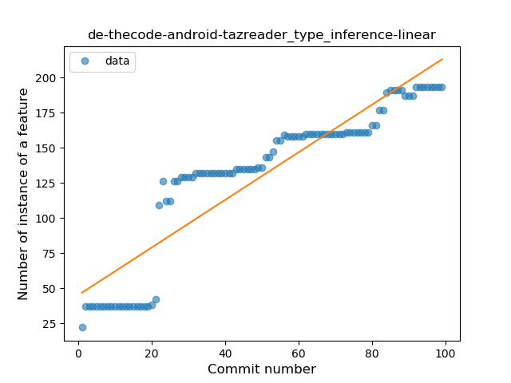

#### com-github-fields-electric
* Feature: Companion Object
* Function: 
* R_Squared: 0.84497089
 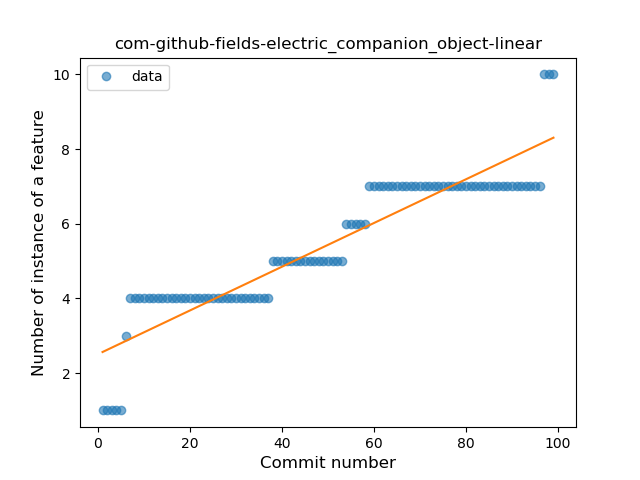

#### com-arcao-geocaching4locus
* Feature: Property Delegation
* Function: 
* R_Squared: 0.84481222
 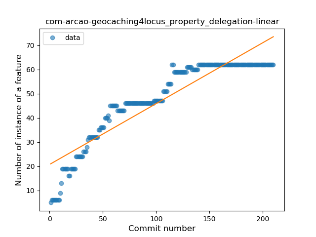

#### acr-browser-lightning
* Feature: When expression
* Function: 
* R_Squared: 0.84468971
 

#### me-proxer-app
* Feature: Companion Object
* Function: 
* R_Squared: 0.84450885
 

#### app-opass-ccip
* Feature: Unsafe Call
* Function: 
* R_Squared: 0.84370347
 

#### com-glodanif-bluetoothchat
* Feature: Data Class
* Function: 
* R_Squared: 0.84367787
 

#### info-metadude-android-congress-schedule
* Feature: Singleton
* Function: 
* R_Squared: 0.84365044
 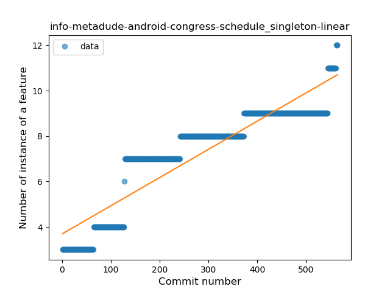

#### com-uwetrottmann-wpdisplay
* Feature: When expression
* Function: 
* R_Squared: 0.84356293
 

#### at-ac-tuwien-caa-docscan
* Feature: Type Inference
* Function: 
* R_Squared: 0.8429766
 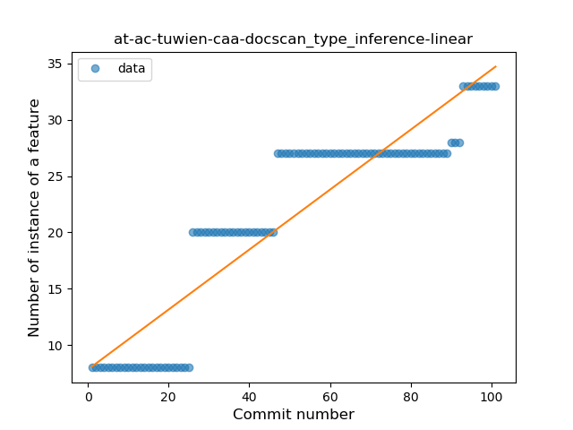

#### com-uncmorfi
* Feature: Data Class
* Function: 
* R_Squared: 0.84000938
 

#### io-github-wulkanowy
* Feature: Safe Call
* Function: 
* R_Squared: 0.83974011
 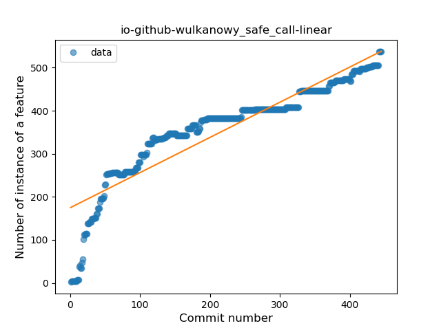

#### eu-depau-etchdroid
* Feature: Lambda
* Function: 
* R_Squared: 0.83940078
 

#### de-ph1b-audiobook
* Feature: Lambda
* Function: 
* R_Squared: 0.83875757
 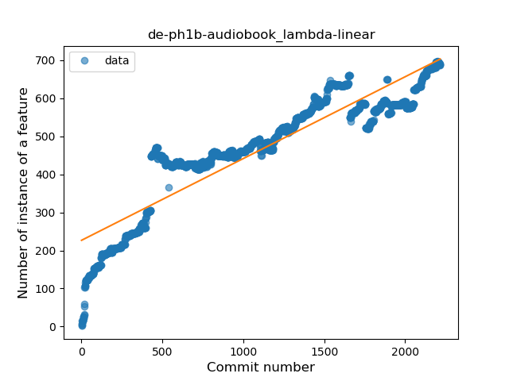

#### com-njlabs-showjava
* Feature: Function with Default Value
* Function: 
* R_Squared: 0.83868682
 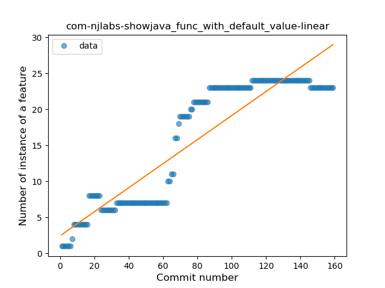

#### pl-org-seva-navigator
* Feature: Type Inference
* Function: 
* R_Squared: 0.83813347
 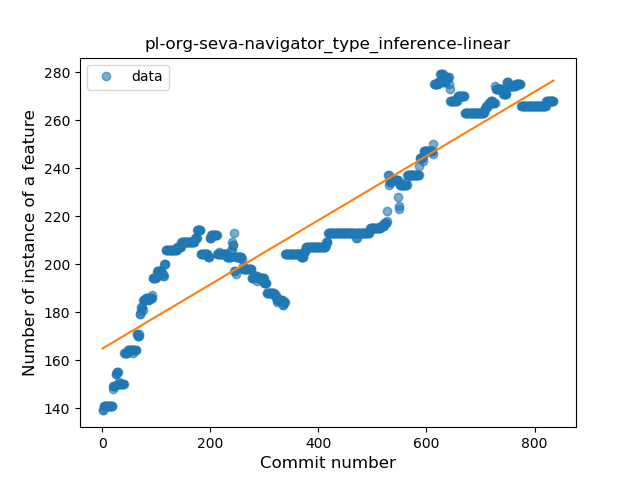

#### nl-mpcjanssen-simpletask
* Feature: When expression
* Function: 
* R_Squared: 0.83765551
 

#### com-fallgamlet-dnestrcinema
* Feature: String Template
* Function: 
* R_Squared: 0.83710801
 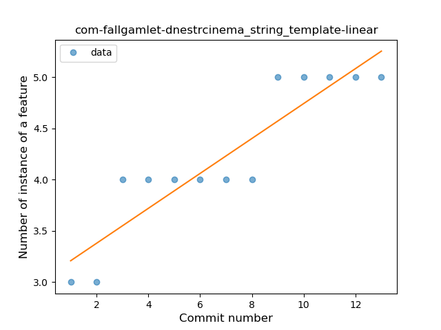

#### fr-corenting-edcompanion
* Feature: Lambda
* Function: 
* R_Squared: 0.83692878
 

#### cz-dvratil-fbeventsync
* Feature: Function call with Named Argument
* Function: 
* R_Squared: 0.83674794
 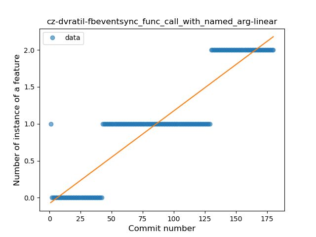

#### com-simplemobiletools-calendar-pro
* Feature: Smart Cast
* Function: 
* R_Squared: 0.83668752
 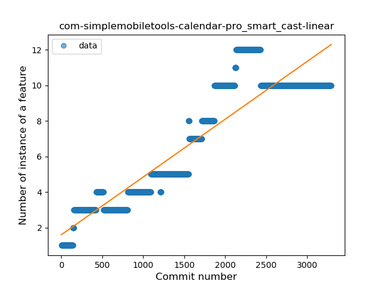

#### com-simplemobiletools-calendar-pro
* Feature: Range Expression
* Function: 
* R_Squared: 0.83668291
 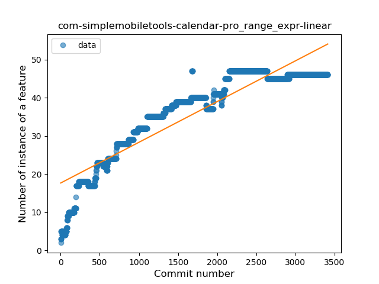

#### pixel-kotlin-bassblog
* Feature: Type Inference
* Function: 
* R_Squared: 0.83606957
 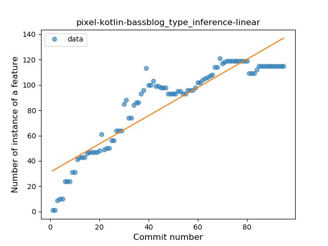

#### com-njlabs-showjava
* Feature: Safe Call
* Function: 
* R_Squared: 0.83573383
 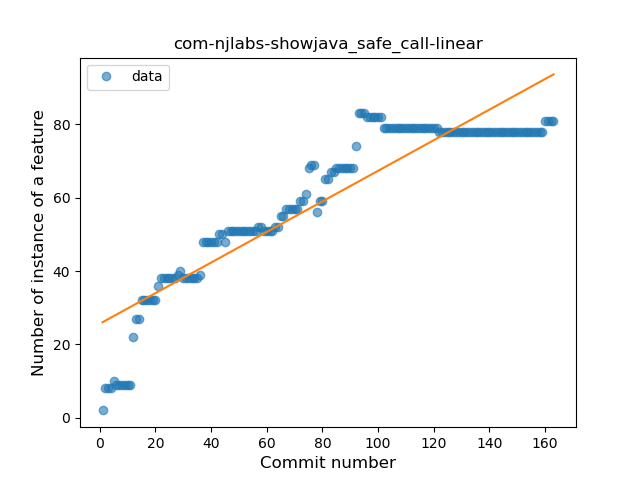

#### com-simplemobiletools-contacts-pro
* Feature: When expression
* Function: 
* R_Squared: 0.83507943
 

#### com-bernaferrari-changedetection
* Feature: Lambda
* Function: 
* R_Squared: 0.83478214
 

#### com-slash-batterychargelimit
* Feature: Lambda
* Function: 
* R_Squared: 0.8346623
 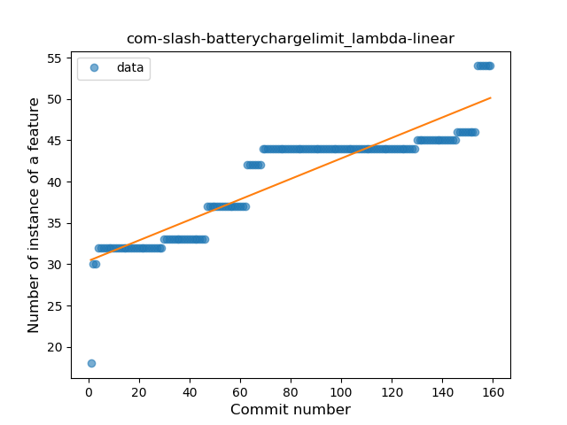

#### com-jereksel-libresubstratum
* Feature: Function with Default Value
* Function: 
* R_Squared: 0.83462651
 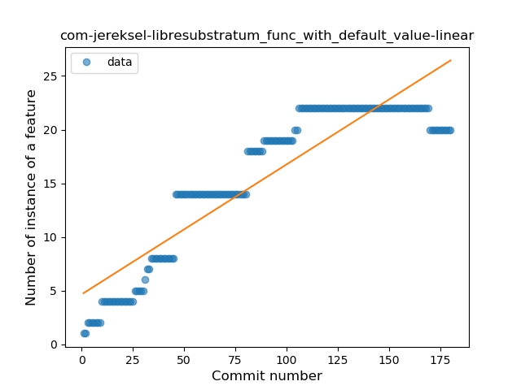

#### com-simplemobiletools-calendar-pro
* Feature: Safe Call
* Function: 
* R_Squared: 0.83460759
 

#### org-liberty-android-freeotpplus
* Feature: Type Inference
* Function: 
* R_Squared: 0.83443898
 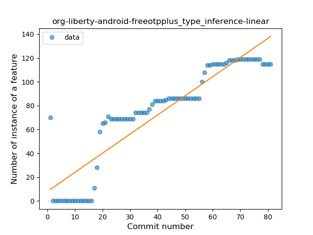

#### de-avpptr-umweltzone
* Feature: Companion Object
* Function: 
* R_Squared: 0.83430129
 

#### com-dp-logcatapp
* Feature: Singleton
* Function: 
* R_Squared: 0.83419848
 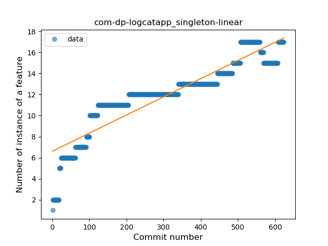

#### com-stevenschoen-putionew
* Feature: Function with Default Value
* Function: 
* R_Squared: 0.83259004
 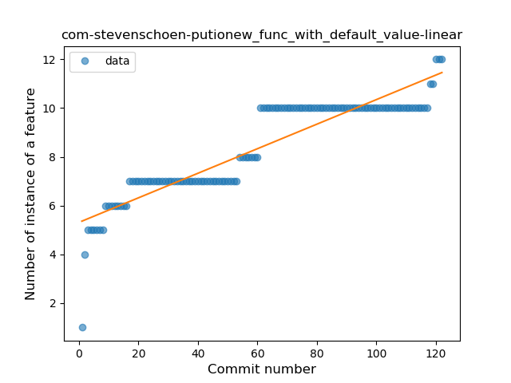

#### com-moez-QKSMS
* Feature: Lambda
* Function: 
* R_Squared: 0.83176877
 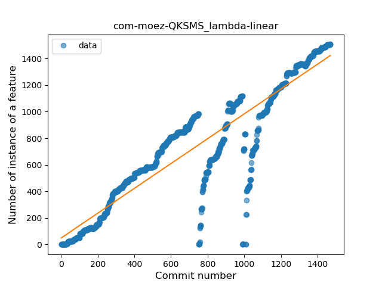

#### pl-org-seva-navigator
* Feature: When expression
* Function: 
* R_Squared: 0.8314234
 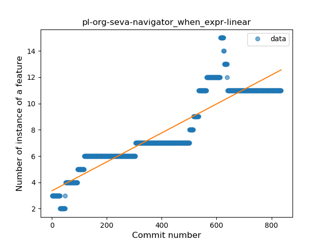

#### com-booboot-vndbandroid
* Feature: Function call with Named Argument
* Function: 
* R_Squared: 0.83101255
 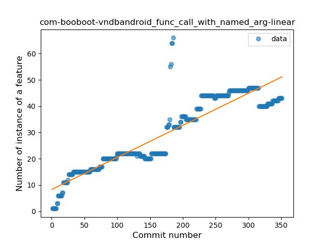

#### org-walleth
* Feature: Data Class
* Function: 
* R_Squared: 0.83073837
 

#### ca-rmen-android-poetassistant
* Feature: Lambda
* Function: 
* R_Squared: 0.83048232
 

#### io-github-wulkanowy
* Feature: Destructuring Declaration
* Function: 
* R_Squared: 0.82966515
 

#### com-yubico-yubioath
* Feature: When expression
* Function: 
* R_Squared: 0.829146
 

#### com-duckduckgo-mobile-android
* Feature: Inline Function
* Function: 
* R_Squared: 0.82807826
 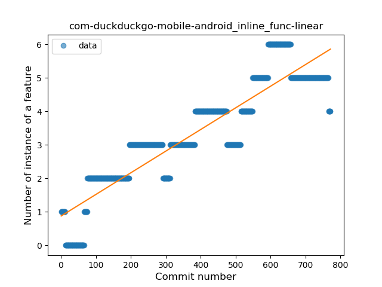

#### com-github-laurenttreguier-deck
* Feature: Type Inference
* Function: 
* R_Squared: 0.82788175
 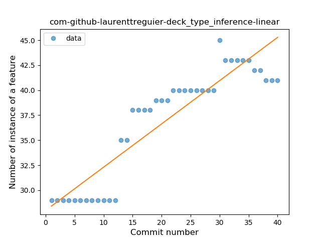

#### info-papdt-express-helper
* Feature: Companion Object
* Function: 
* R_Squared: 0.82751714
 

#### li-klass-fhem
* Feature: When expression
* Function: 
* R_Squared: 0.82703346
 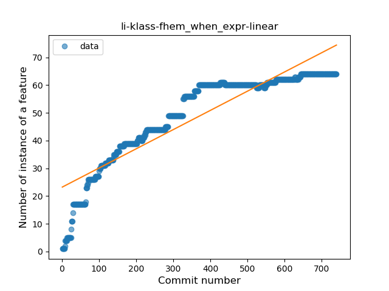

#### com-wbrawner-simplemarkdown
* Feature: Safe Call
* Function: 
* R_Squared: 0.82693286
 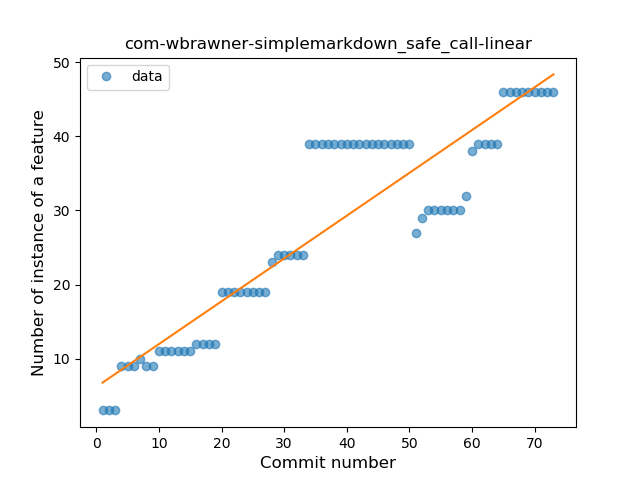

#### com-garpr-android
* Feature: Lambda
* Function: 
* R_Squared: 0.82687728
 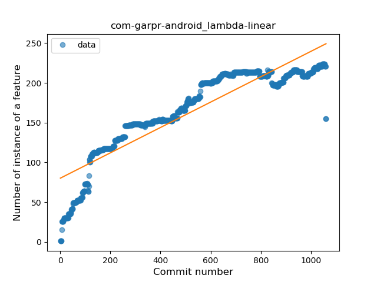

#### is-xyz-omw
* Feature: String Template
* Function: 
* R_Squared: 0.82685004
 

#### com-github-quarck-calnotify
* Feature: Property Delegation
* Function: 
* R_Squared: 0.82610955
 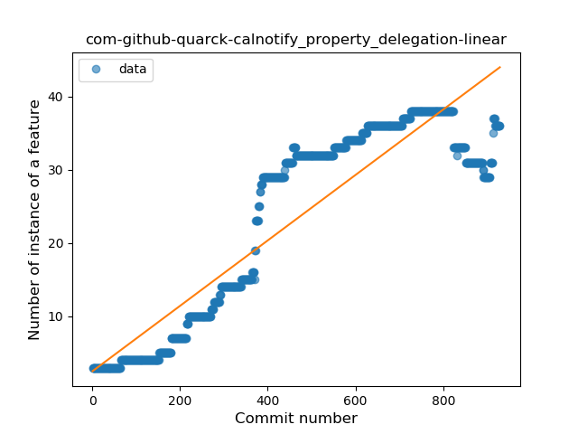

#### org-mariotaku-twidere
* Feature: Property Delegation
* Function: 
* R_Squared: 0.82499663
 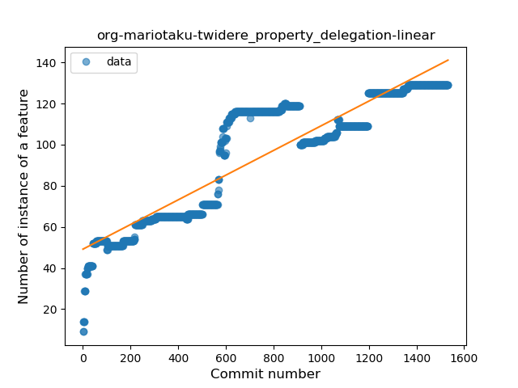

#### com-simplemobiletools-contacts-pro
* Feature: Function with Default Value
* Function: 
* R_Squared: 0.8247052
 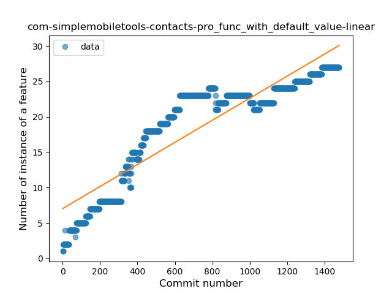

#### de-devmil-paperlaunch
* Feature: Singleton
* Function: 
* R_Squared: 0.82349968
 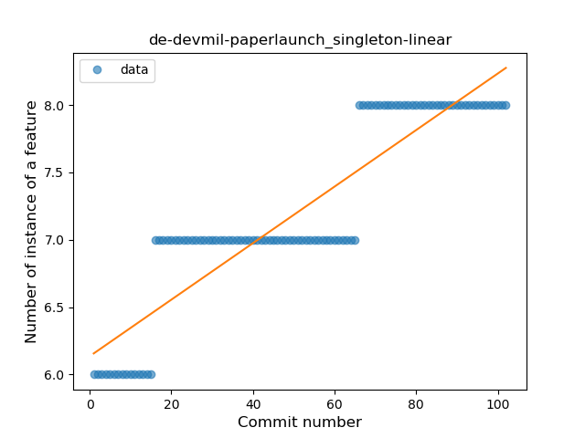

#### com-arcao-geocaching4locus
* Feature: Data Class
* Function: 
* R_Squared: 0.82279987
 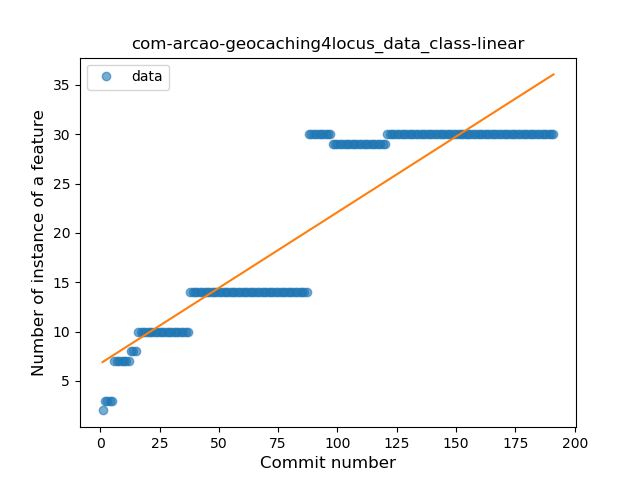

#### com-simplemobiletools-gallery-pro
* Feature: Data Class
* Function: 
* R_Squared: 0.82259361
 

#### de-thecode-lmd
* Feature: Unsafe Call
* Function: 
* R_Squared: 0.82253512
 

#### org-blokada-alarm
* Feature: Function with Default Value
* Function: 
* R_Squared: 0.82144424
 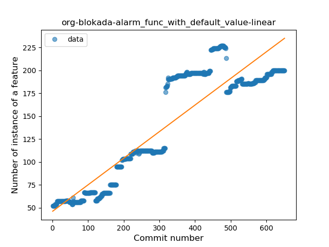

#### com-pitchedapps-frost
* Feature: Lambda
* Function: 
* R_Squared: 0.82142451
 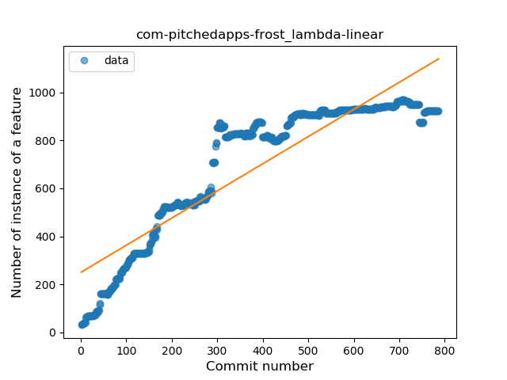

#### org-blokada-alarm
* Feature: String Template
* Function: 
* R_Squared: 0.82099221
 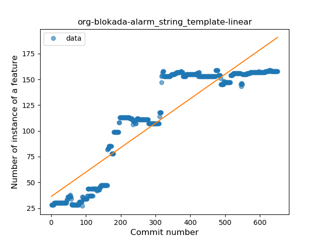

#### be-mygod-vpnhotspot
* Feature: Companion Object
* Function: 
* R_Squared: 0.8208075
 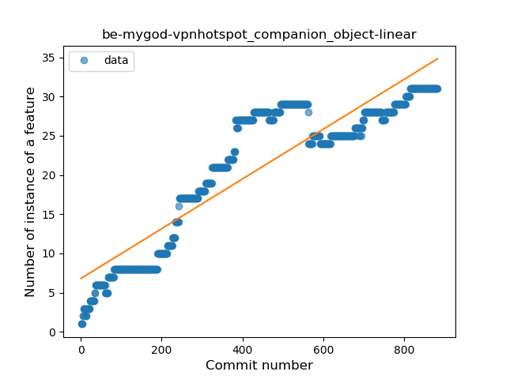

#### com-jereksel-libresubstratum
* Feature: Safe Call
* Function: 
* R_Squared: 0.82056682
 

#### com-geo-GeoQuake
* Feature: Type Inference
* Function: 
* R_Squared: 0.8204371
 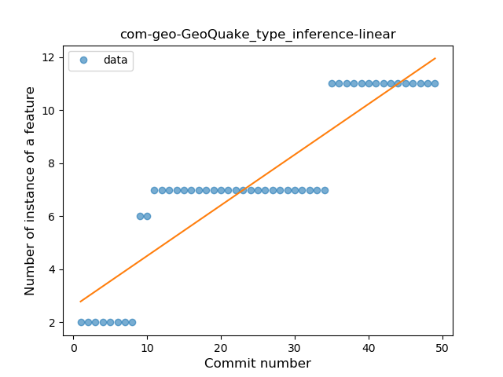

#### net-osmand-plus
* Feature: Range Expression
* Function: 
* R_Squared: 0.82018694
 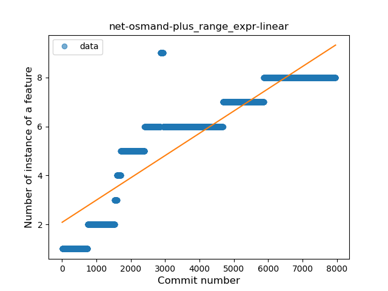

#### com-github-moko256-twitlatte
* Feature: Smart Cast
* Function: 
* R_Squared: 0.82010116
 

#### ca-rmen-android-poetassistant
* Feature: Companion Object
* Function: 
* R_Squared: 0.81971477
 

#### com-nextcloud-talk2
* Feature: Singleton
* Function: 
* R_Squared: 0.8195981
 

#### com-duckduckgo-mobile-android
* Feature: Range Expression
* Function: 
* R_Squared: 0.81955746
 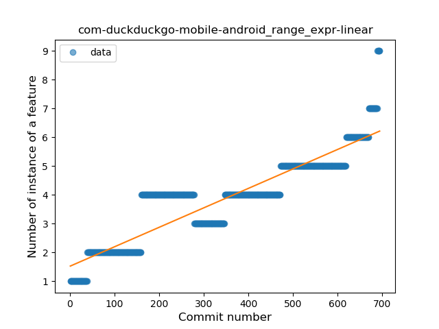

#### com-phicdy-totoanticipation
* Feature: Companion Object
* Function: 
* R_Squared: 0.81846429
 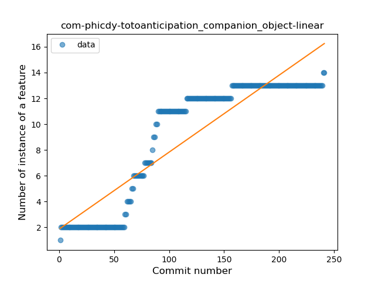

#### de-thecode-lmd
* Feature: Lambda
* Function: 
* R_Squared: 0.8182607
 

#### ml-adamsprogs-bimba
* Feature: When expression
* Function: 
* R_Squared: 0.81777715
 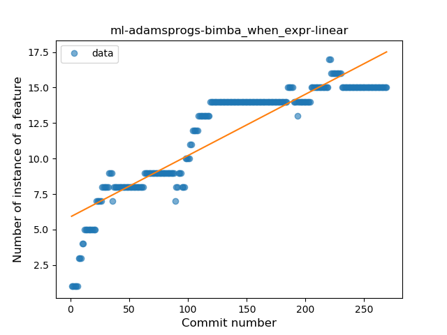

#### org-pacien-tincapp
* Feature: Unsafe Call
* Function: 
* R_Squared: 0.81750079
 

#### com-nononsenseapps-feeder
* Feature: Function with Default Value
* Function: 
* R_Squared: 0.81747402
 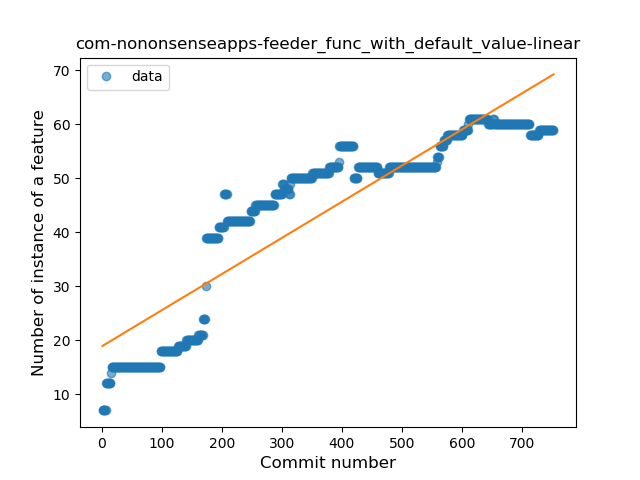

#### org-freedombox-freedombox
* Feature: Type Inference
* Function: 
* R_Squared: 0.81699596
 

#### com-jim-sharetocomputer
* Feature: Destructuring Declaration
* Function: 
* R_Squared: 0.81618362
 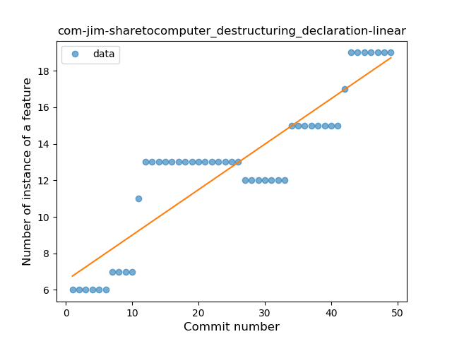

#### io-github-wulkanowy
* Feature: Data Class
* Function: 
* R_Squared: 0.81513675
 

#### info-metadude-android-congress-schedule
* Feature: Safe Call
* Function: 
* R_Squared: 0.81489428
 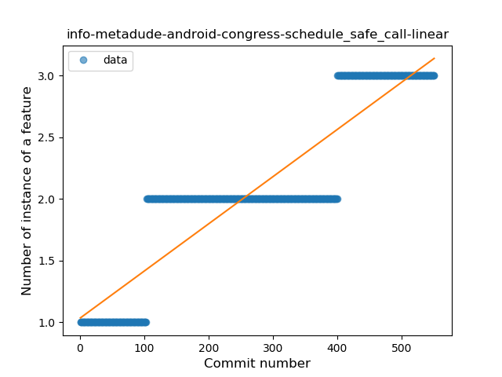

#### chat-rocket-android
* Feature: Range Expression
* Function: 
* R_Squared: 0.81485043
 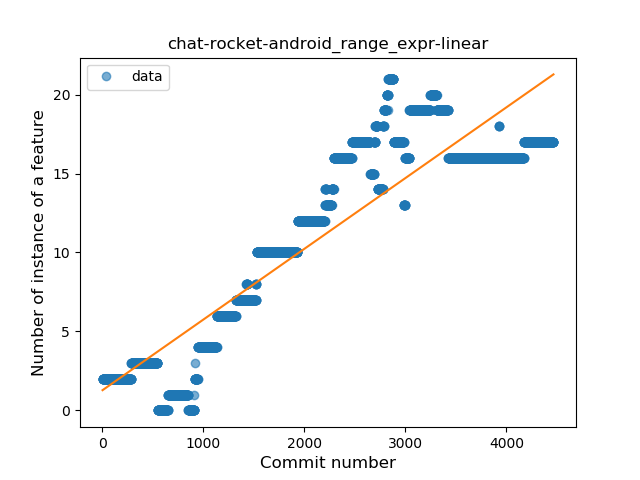

#### pl-hypeapp-episodie
* Feature: String Template
* Function: 
* R_Squared: 0.81479938
 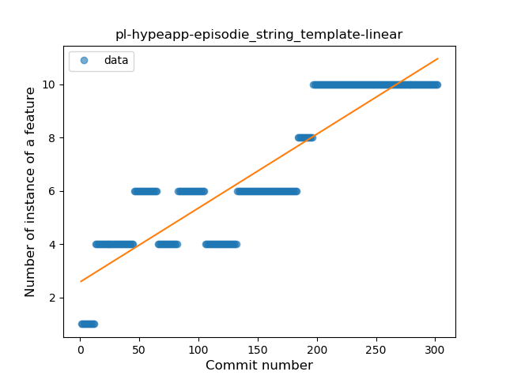

#### com-pitchedapps-frost
* Feature: String Template
* Function: 
* R_Squared: 0.8147978
 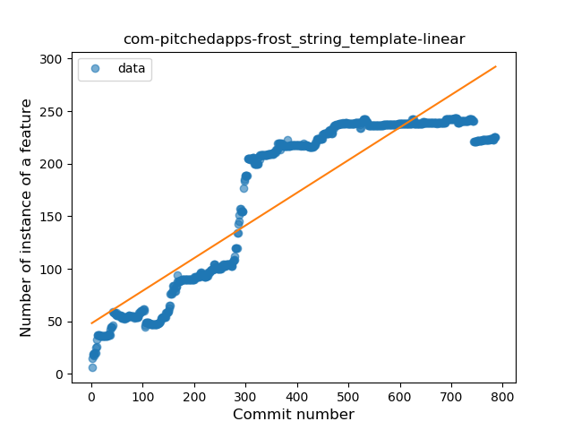

#### de-ph1b-audiobook
* Feature: Type Inference
* Function: 
* R_Squared: 0.81415804
 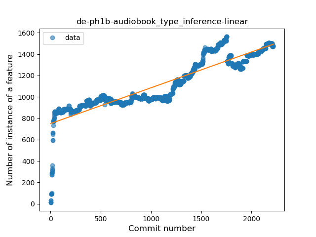

#### com-pavelsikun-runinbackgroundpermissionsetter
* Feature: Lambda
* Function: 
* R_Squared: 0.81322453
 

#### com-phicdy-totoanticipation
* Feature: When expression
* Function: 
* R_Squared: 0.81222292
 

#### acr-browser-lightning
* Feature: Singleton
* Function: 
* R_Squared: 0.81160711
 

#### com-pluscubed-velociraptor
* Feature: Companion Object
* Function: 
* R_Squared: 0.81115609
 

#### jp-toastkid-yobidashi
* Feature: Safe Call
* Function: 
* R_Squared: 0.81098363
 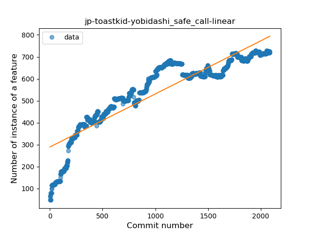

#### acr-browser-lightning
* Feature: Companion Object
* Function: 
* R_Squared: 0.81005711
 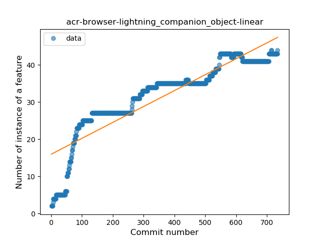

#### com-arcao-geocaching4locus
* Feature: Companion Object
* Function: 
* R_Squared: 0.80918958
 

#### jp-toastkid-yobidashi
* Feature: Overloaded Operator
* Function: 
* R_Squared: 0.80886385
 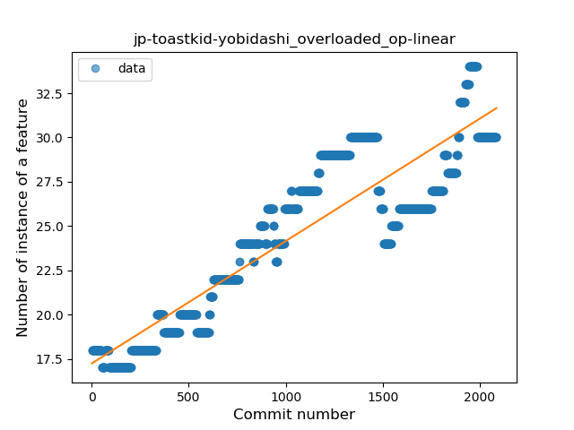

#### com-breadwallet
* Feature: When expression
* Function: 
* R_Squared: 0.80849305
 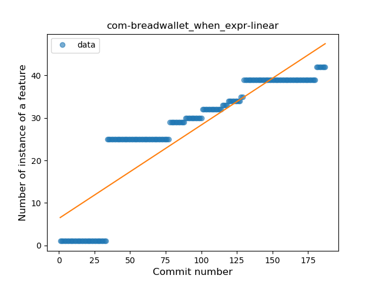

#### org-eurofurence-connavigator
* Feature: Infix Function
* Function: 
* R_Squared: 0.80834609
 

#### acr-browser-lightning
* Feature: Property Delegation
* Function: 
* R_Squared: 0.80813472
 

#### org-kaqui
* Feature: Sealed Class
* Function: 
* R_Squared: 0.80812176
 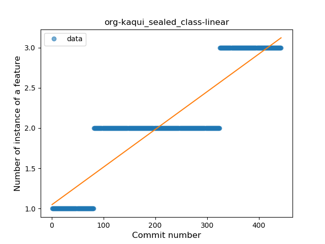

#### de-ph1b-audiobook
* Feature: Coroutine
* Function: 
* R_Squared: 0.80770756
 

#### com-sjn-stamp
* Feature: When expression
* Function: 
* R_Squared: 0.80723344
 

#### net-yslibrary-monotweety
* Feature: Lambda
* Function: 
* R_Squared: 0.80692206
 

#### com-example-harisont-librery
* Feature: Safe Call
* Function: 
* R_Squared: 0.80691525
 

#### info-papdt-express-helper
* Feature: Range Expression
* Function: 
* R_Squared: 0.80690635
 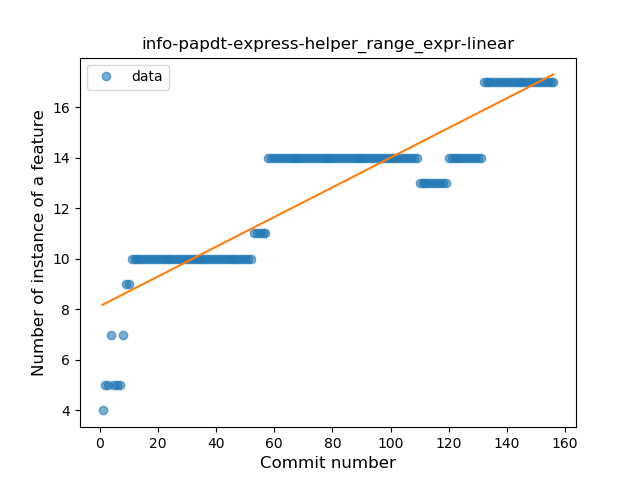

#### app-opass-ccip
* Feature: Data Class
* Function: 
* R_Squared: 0.80686587
 

#### com-benoitletondor-easybudgetapp
* Feature: Safe Call
* Function: 
* R_Squared: 0.8062739
 

#### com-guerinet-mymartlet
* Feature: Coroutine
* Function: 
* R_Squared: 0.80580079
 

#### io-github-wulkanowy
* Feature: String Template
* Function: 
* R_Squared: 0.80318569
 

#### fi-kroon-vadret
* Feature: Companion Object
* Function: 
* R_Squared: 0.80239305
 

#### org-eurofurence-connavigator
* Feature: Smart Cast
* Function: 
* R_Squared: 0.8022538
 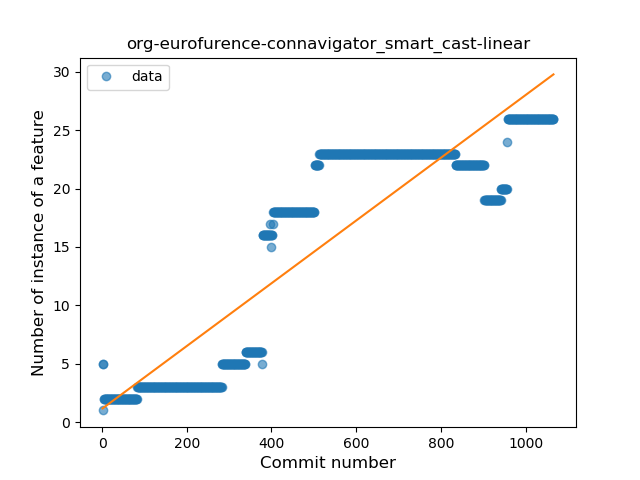

#### de-grobox-liberario
* Feature: Extension Function
* Function: 
* R_Squared: 0.80209341
 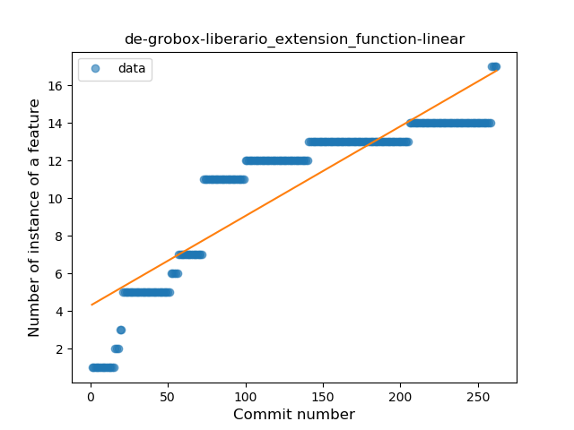

#### de-thecode-lmd
* Feature: Data Class
* Function: 
* R_Squared: 0.80190349
 

#### es-usc-citius-servando-calendula
* Feature: Property Delegation
* Function: 
* R_Squared: 0.80184547
 

#### org-eurofurence-connavigator
* Feature: When expression
* Function: 
* R_Squared: 0.79978452
 

#### io-github-deweyreed-clipboardcleaner
* Feature: Lambda
* Function: 
* R_Squared: 0.7996881
 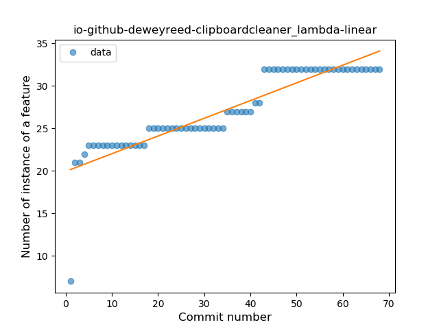

#### net-nurik-roman-muzei
* Feature: Smart Cast
* Function: 
* R_Squared: 0.79921476
 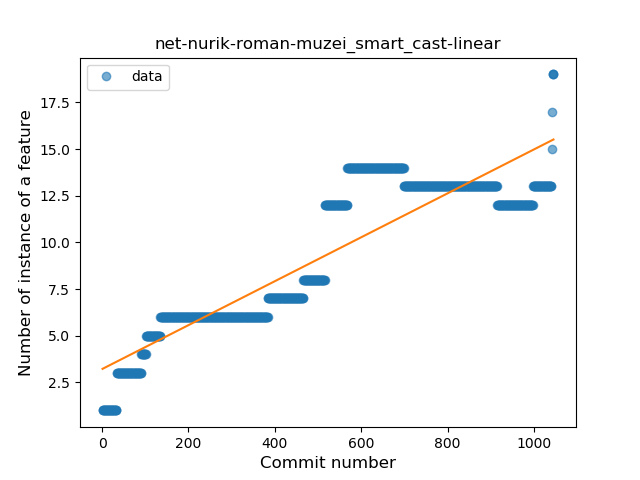

#### com-simplemobiletools-calculator
* Feature: Type Inference
* Function: 
* R_Squared: 0.79835768
 

#### me-blog-korn123-easydiary
* Feature: Extension Function
* Function: 
* R_Squared: 0.79769691
 

#### org-emunix-insteadlauncher
* Feature: Extension Function
* Function: 
* R_Squared: 0.79661095
 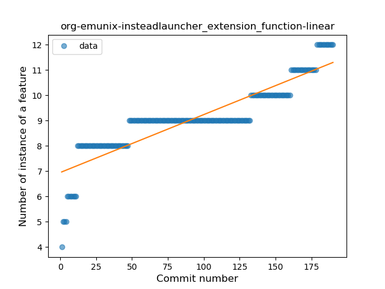

#### horse-amazin-my-stratum0-statuswidget
* Feature: Type Inference
* Function: 
* R_Squared: 0.79513322
 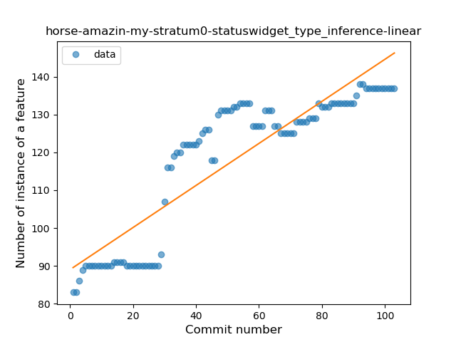

#### de-r4md4c-gamedealz
* Feature: String Template
* Function: 
* R_Squared: 0.79443035
 

#### org-moire-ultrasonic
* Feature: Safe Call
* Function: 
* R_Squared: 0.79385487
 

#### com-uwetrottmann-wpdisplay
* Feature: Singleton
* Function: 
* R_Squared: 0.79374141
 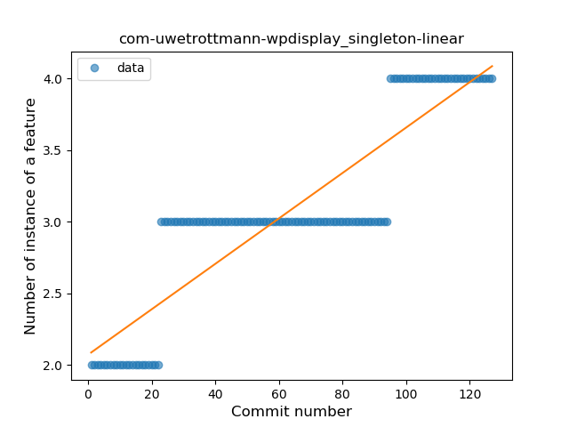

#### org-poul-bits-android
* Feature: String Template
* Function: 
* R_Squared: 0.79169162
 

#### com-njlabs-showjava
* Feature: String Template
* Function: 
* R_Squared: 0.79134773
 

#### com-simplemobiletools-contacts-pro
* Feature: Type Inference
* Function: 
* R_Squared: 0.79123209
 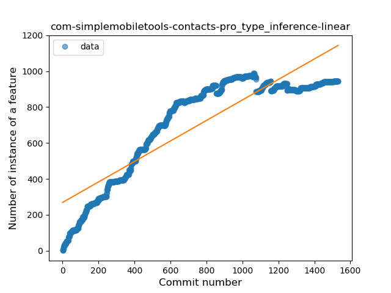

#### com-directdev-portal
* Feature: Type Inference
* Function: 
* R_Squared: 0.79054096
 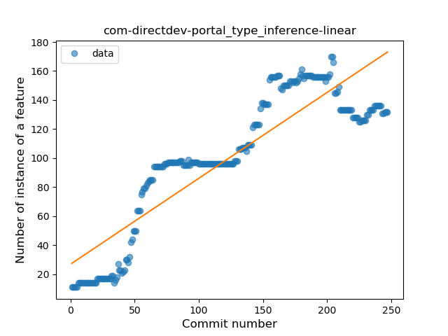

#### com-pitchedapps-frost
* Feature: Unsafe Call
* Function: 
* R_Squared: 0.78999445
 

#### uk-colessoft-android-hilllist
* Feature: Companion Object
* Function: 
* R_Squared: 0.78980892
 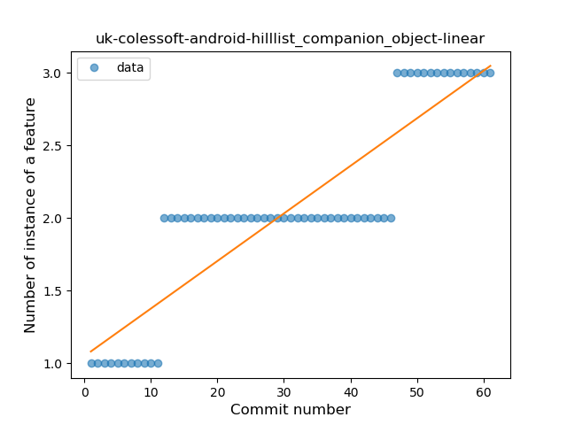

#### net-nurik-roman-muzei
* Feature: Lambda
* Function: 
* R_Squared: 0.78924931
 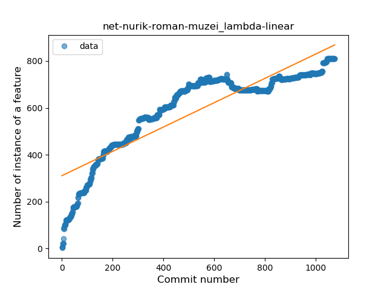

#### me-blog-korn123-easydiary
* Feature: Range Expression
* Function: 
* R_Squared: 0.78736924
 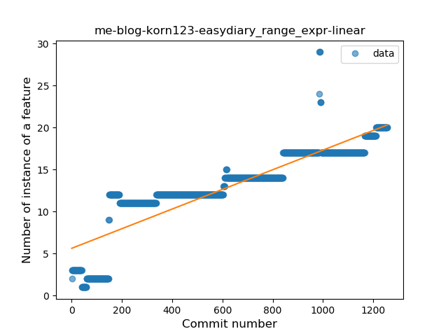

#### es-usc-citius-servando-calendula
* Feature: Companion Object
* Function: 
* R_Squared: 0.78726354
 

#### fr-xgouchet-packageexplorer
* Feature: Smart Cast
* Function: 
* R_Squared: 0.78703268
 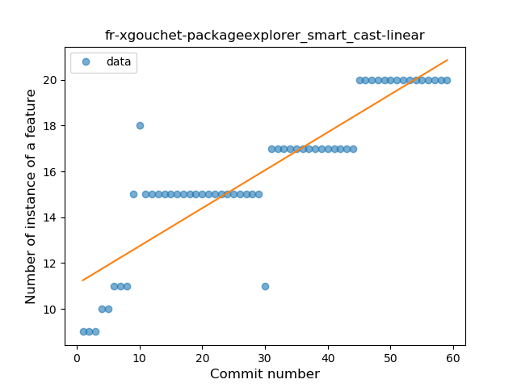

#### com-pitchedapps-frost
* Feature: Extension Function
* Function: 
* R_Squared: 0.78687538
 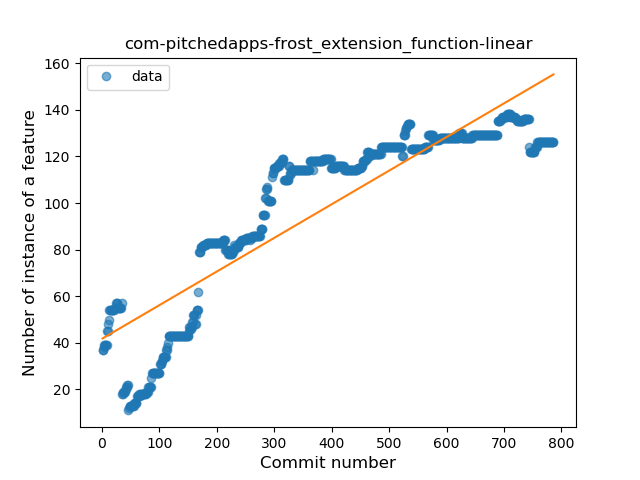

#### net-nurik-roman-muzei
* Feature: Extension Function
* Function: 
* R_Squared: 0.78477901
 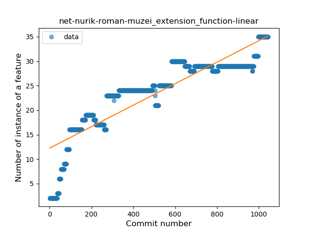

#### ca-rmen-android-poetassistant
* Feature: Type Inference
* Function: 
* R_Squared: 0.78358883
 

#### org-blokada-alarm
* Feature: Singleton
* Function: 
* R_Squared: 0.78344512
 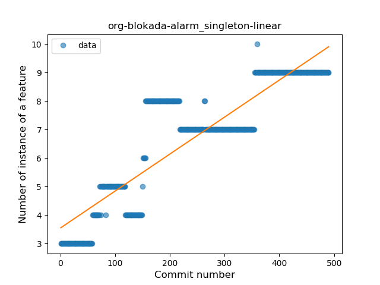

#### pl-org-seva-navigator
* Feature: Inline Function
* Function: 
* R_Squared: 0.78300896
 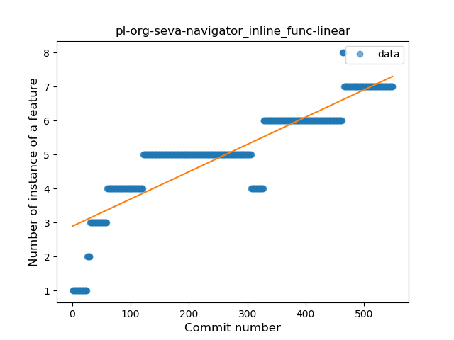

#### com-yubico-yubioath
* Feature: String Template
* Function: 
* R_Squared: 0.78020212
 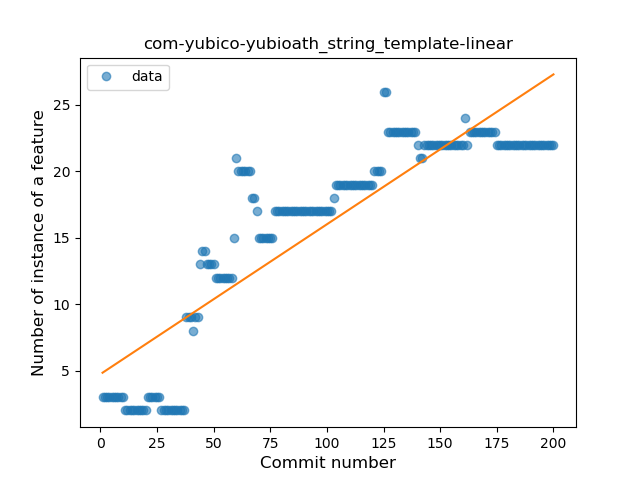

#### nl-mpcjanssen-simpletask
* Feature: Property Delegation
* Function: 
* R_Squared: 0.78003331
 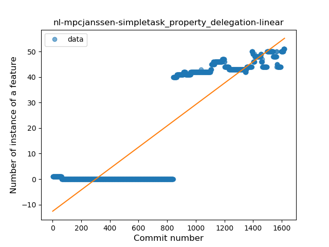

#### com-duckduckgo-mobile-android
* Feature: Unsafe Call
* Function: 
* R_Squared: 0.77964921
 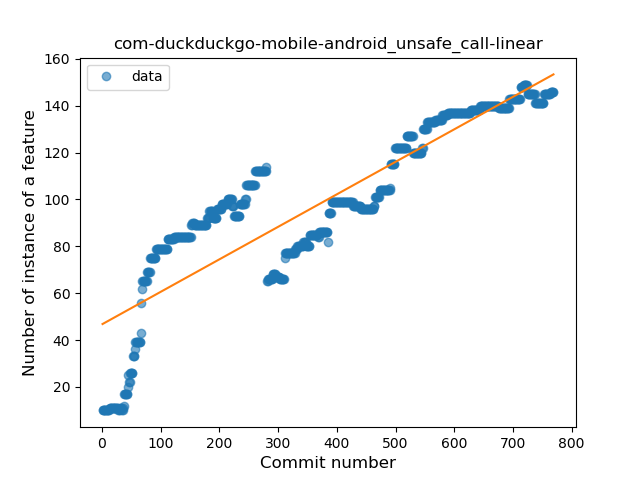

#### de-Maxr1998-xposed-maxlock
* Feature: Unsafe Call
* Function: 
* R_Squared: 0.77805083
 

#### com-dp-logcatapp
* Feature: Function call with Named Argument
* Function: 
* R_Squared: 0.77787632
 

#### is-xyz-omw
* Feature: Unsafe Call
* Function: 
* R_Squared: 0.77683101
 

#### org-kiwix-kiwixcustomwikivoyageeurope
* Feature: Range Expression
* Function: 
* R_Squared: 0.77674607
 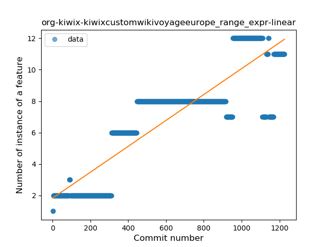

#### org-mosad-seil0-projectlaogai
* Feature: Unsafe Call
* Function: 
* R_Squared: 0.77667656
 

#### com-jmstudios-redmoon
* Feature: String Template
* Function: 
* R_Squared: 0.77635592
 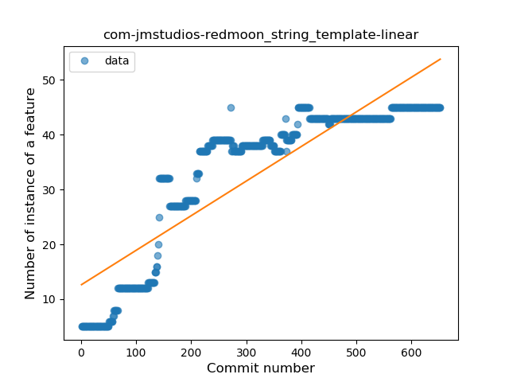

#### fr-cph-chicago-foss
* Feature: Safe Call
* Function: 
* R_Squared: 0.77614902
 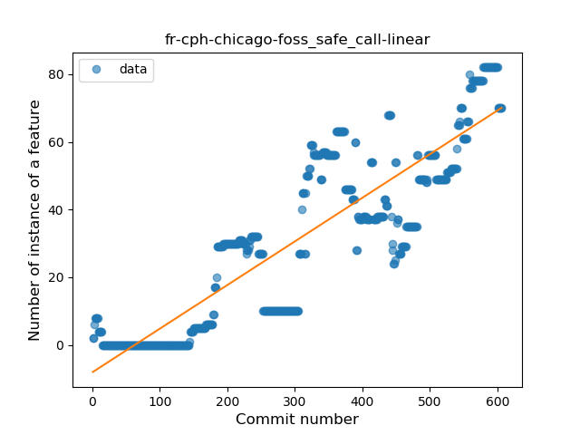

#### io-github-benoitduffez-cupsprint
* Feature: Function with Default Value
* Function: 
* R_Squared: 0.77506193
 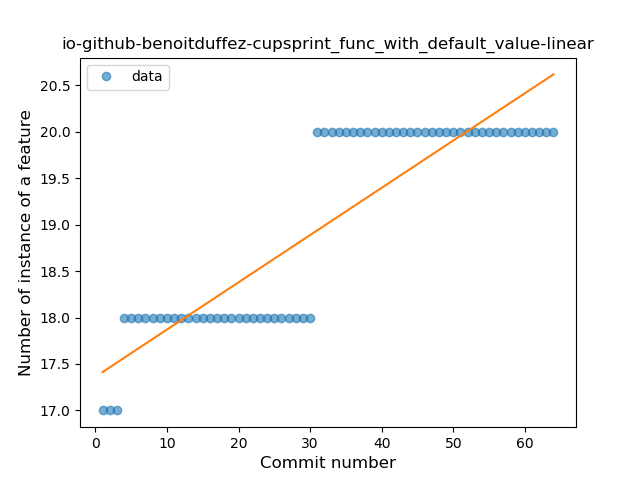

#### com-jmstudios-redmoon
* Feature: Property Delegation
* Function: 
* R_Squared: 0.77491532
 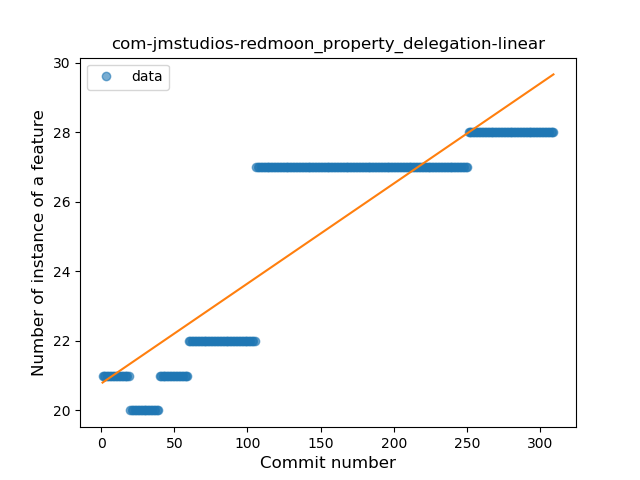

#### com-orgzly
* Feature: Destructuring Declaration
* Function: 
* R_Squared: 0.77402833
 

#### net-yslibrary-monotweety
* Feature: Data Class
* Function: 
* R_Squared: 0.77328009
 

#### de-ph1b-audiobook
* Feature: Inline Function
* Function: 
* R_Squared: 0.77327306
 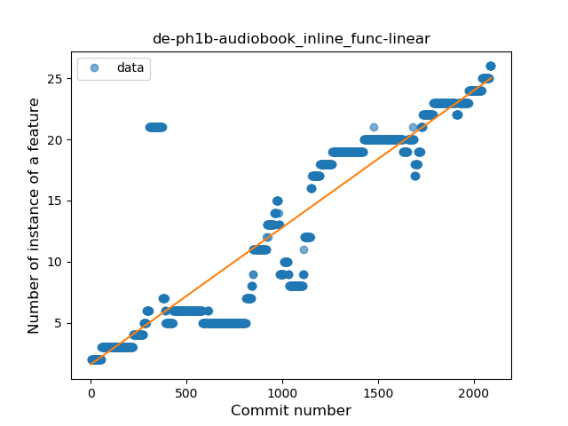

#### fr-cph-chicago-foss
* Feature: Property Delegation
* Function: 
* R_Squared: 0.77276908
 

#### com-dozingcatsoftware-vectorcamera
* Feature: Data Class
* Function: 
* R_Squared: 0.77255051
 

#### com-uncmorfi
* Feature: Extension Function
* Function: 
* R_Squared: 0.77225053
 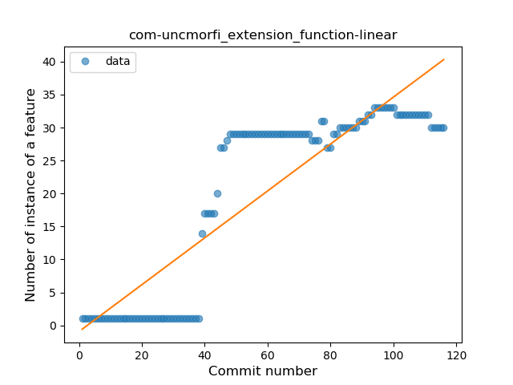

#### com-lavadip-miniVector
* Feature: Unsafe Call
* Function: 
* R_Squared: 0.7718201
 

#### cat-xojan-random1
* Feature: Lambda
* Function: 
* R_Squared: 0.7712
 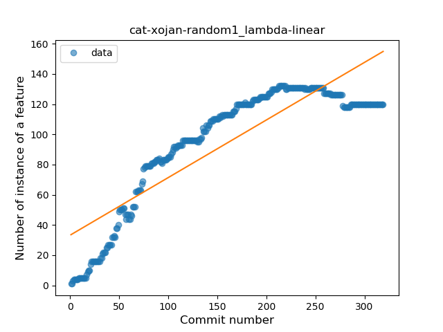

#### com-peterlaurence-trekme
* Feature: Extension Function
* Function: 
* R_Squared: 0.77109841
 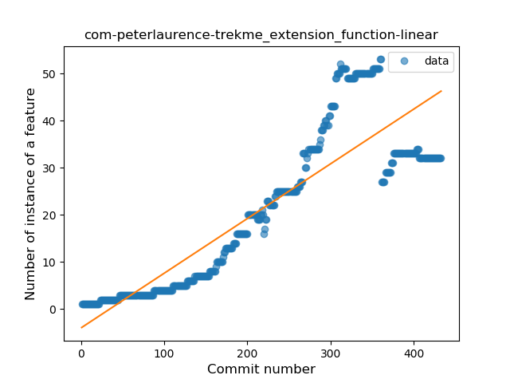

#### com-boardgamegeek
* Feature: Inline Function
* Function: 
* R_Squared: 0.77078935
 

#### com-simplemobiletools-camera
* Feature: Type Inference
* Function: 
* R_Squared: 0.77027291
 

#### de-ph1b-audiobook
* Feature: Extension Function
* Function: 
* R_Squared: 0.77009757
 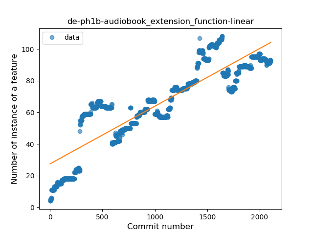

#### nl-mpcjanssen-simpletask
* Feature: Safe Call
* Function: 
* R_Squared: 0.77001699
 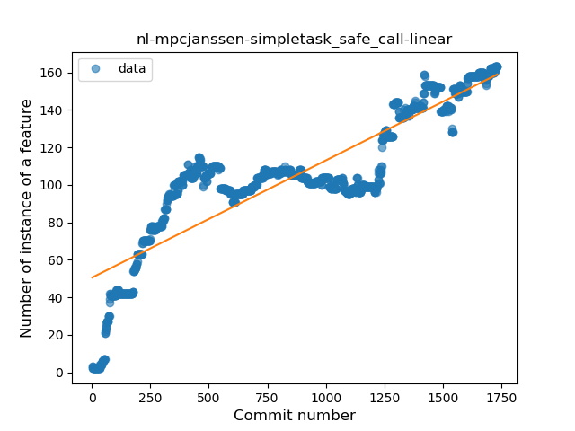

#### jp-org-example-geckour-glyph
* Feature: Coroutine
* Function: 
* R_Squared: 0.76898287
 

#### net-mm2d-android-vmb
* Feature: Type Inference
* Function: 
* R_Squared: 0.7685242
 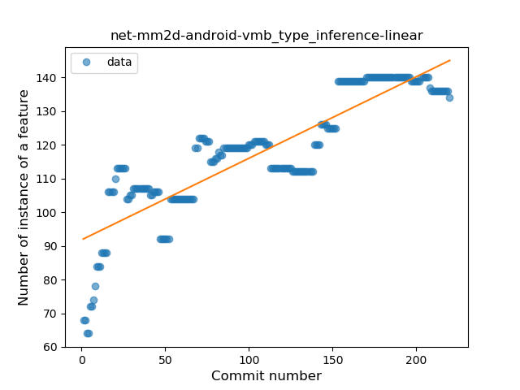

#### org-moire-ultrasonic
* Feature: Function with Default Value
* Function: 
* R_Squared: 0.76832145
 

#### im-vector-alpha
* Feature: Unsafe Call
* Function: 
* R_Squared: 0.76808153
 

#### org-kaqui
* Feature: Data Class
* Function: 
* R_Squared: 0.76767199
 

#### fr-free-nrw-commons
* Feature: Lambda
* Function: 
* R_Squared: 0.76743857
 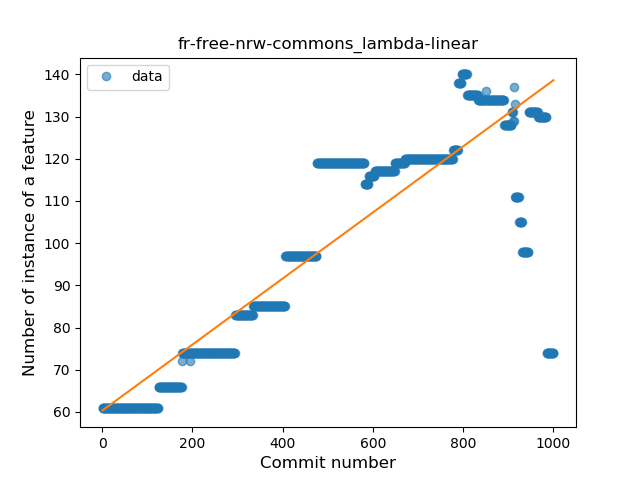

#### com-booboot-vndbandroid
* Feature: When expression
* Function: 
* R_Squared: 0.76739211
 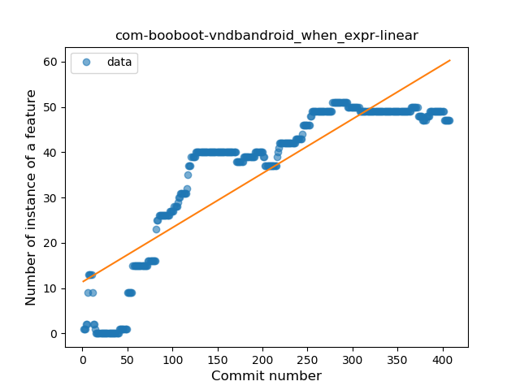

#### net-nurik-roman-muzei
* Feature: Function call with Named Argument
* Function: 
* R_Squared: 0.76385478
 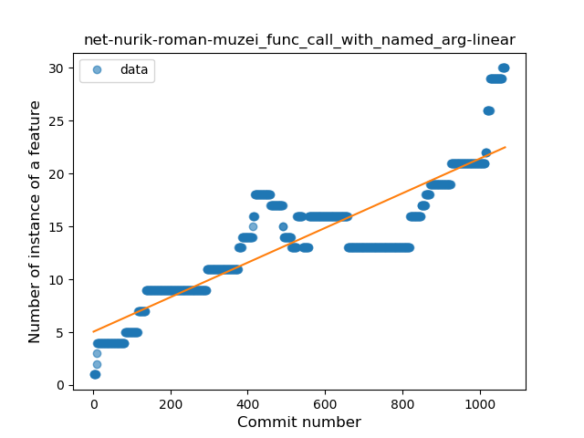

#### org-moire-ultrasonic
* Feature: Lambda
* Function: 
* R_Squared: 0.76350325
 

#### de-thecode-lmd
* Feature: Property Delegation
* Function: 
* R_Squared: 0.76304195
 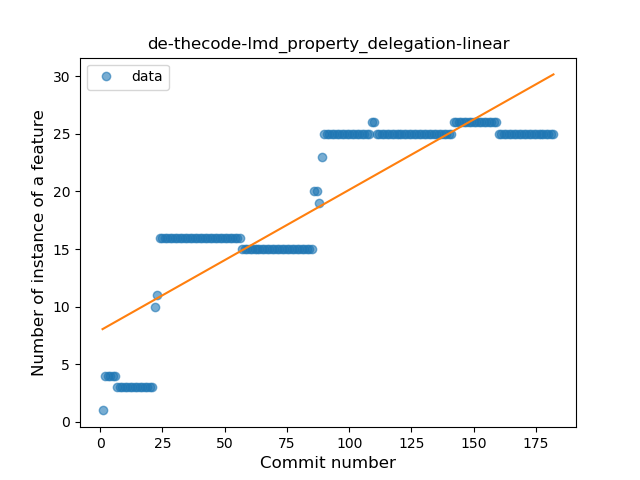

#### com-bernaferrari-changedetection
* Feature: Range Expression
* Function: 
* R_Squared: 0.76196553
 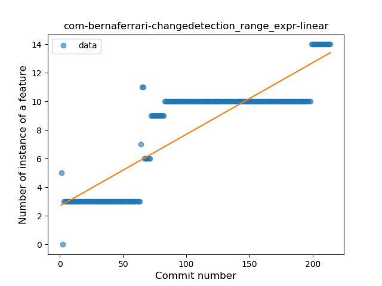

#### com-nononsenseapps-feeder
* Feature: When expression
* Function: 
* R_Squared: 0.76175299
 

#### com-pixplicity-cryptogram
* Feature: Safe Call
* Function: 
* R_Squared: 0.76102974
 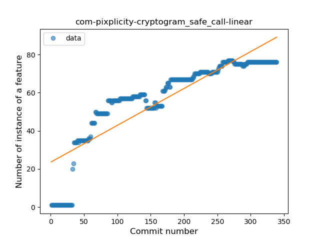

#### org-poul-bits-android
* Feature: Lambda
* Function: 
* R_Squared: 0.7607536
 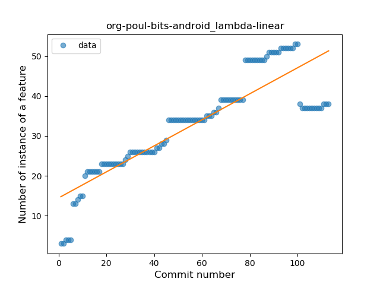

#### acr-browser-lightning
* Feature: String Template
* Function: 
* R_Squared: 0.75961782
 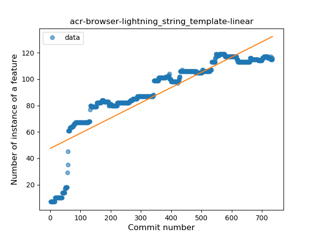

#### chat-rocket-android
* Feature: Smart Cast
* Function: 
* R_Squared: 0.75795709
 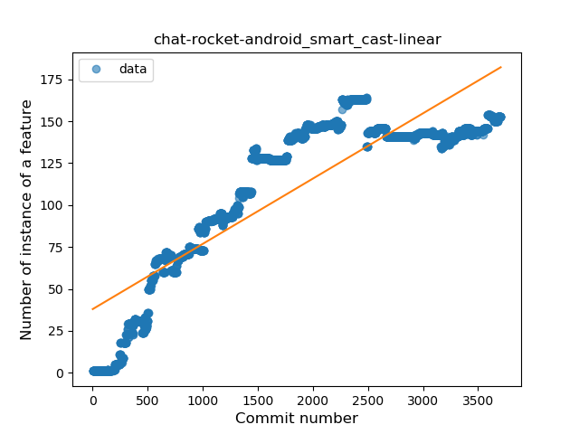

#### info-metadude-android-congress-schedule
* Feature: Function with Default Value
* Function: 
* R_Squared: 0.75772773
 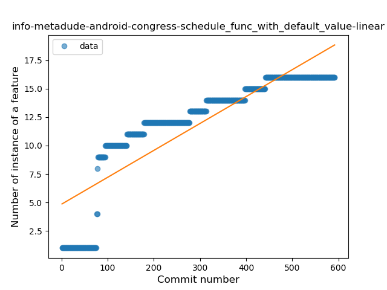

#### cat-xojan-random1
* Feature: Companion Object
* Function: 
* R_Squared: 0.75729645
 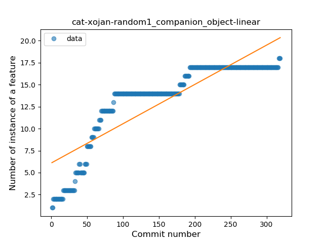

#### com-guerinet-mymartlet
* Feature: Lambda
* Function: 
* R_Squared: 0.75700624
 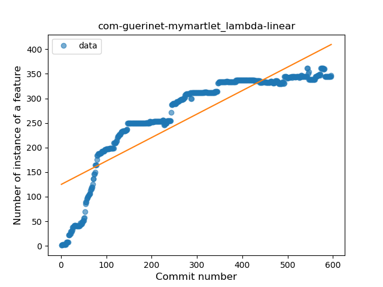

#### org-blokada-alarm
* Feature: Destructuring Declaration
* Function: 
* R_Squared: 0.75691089
 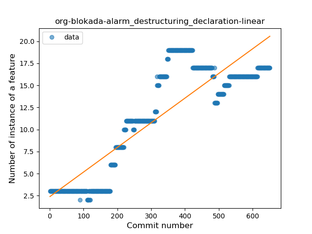

#### com-fsck-k9
* Feature: Coroutine
* Function: 
* R_Squared: 0.75689227
 

#### net-osmand-plus
* Feature: Singleton
* Function: 
* R_Squared: 0.75594748
 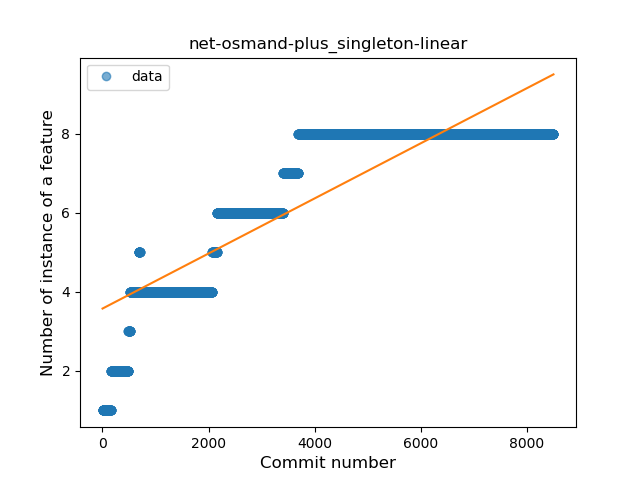

#### com-simplemobiletools-gallery
* Feature: String Template
* Function: 
* R_Squared: 0.7527325
 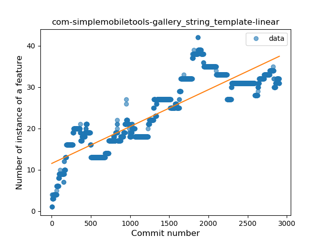

#### org-blokada-alarm
* Feature: Unsafe Call
* Function: 
* R_Squared: 0.75248096
 

#### com-github-moko256-twitlatte
* Feature: String Template
* Function: 
* R_Squared: 0.75129134
 

#### com-dp-logcatapp
* Feature: Range Expression
* Function: 
* R_Squared: 0.75113991
 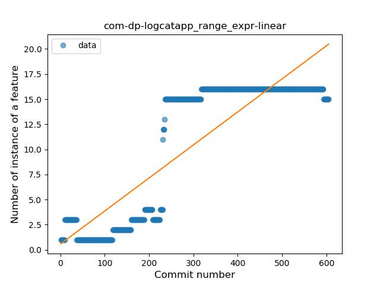

#### net-yslibrary-monotweety
* Feature: Companion Object
* Function: 
* R_Squared: 0.74968556
 

#### tw-shounenwind-kmnbottool
* Feature: String Template
* Function: 
* R_Squared: 0.74966533
 

#### com-slash-batterychargelimit
* Feature: Type Inference
* Function: 
* R_Squared: 0.74961363
 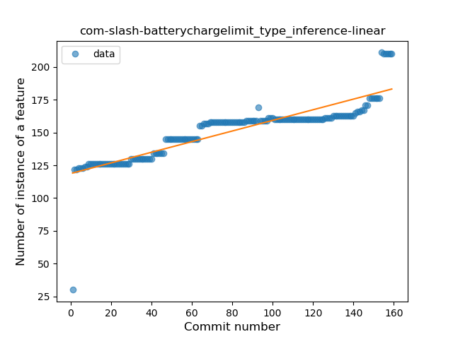

#### org-ligi-gobandroid
* Feature: Singleton
* Function: 
* R_Squared: 0.74951498
 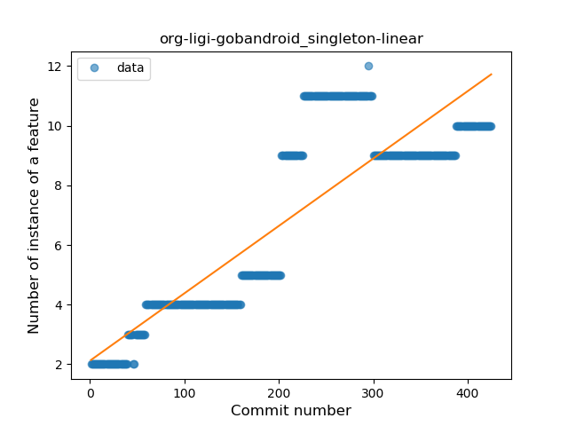

#### com-peterlaurence-trekme
* Feature: Function with Default Value
* Function: 
* R_Squared: 0.74914495
 

#### com-dozingcatsoftware-vectorcamera
* Feature: Unsafe Call
* Function: 
* R_Squared: 0.7482747
 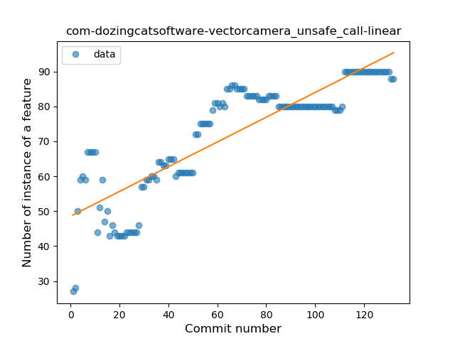

#### net-mm2d-android-vmb
* Feature: Safe Call
* Function: 
* R_Squared: 0.74782959
 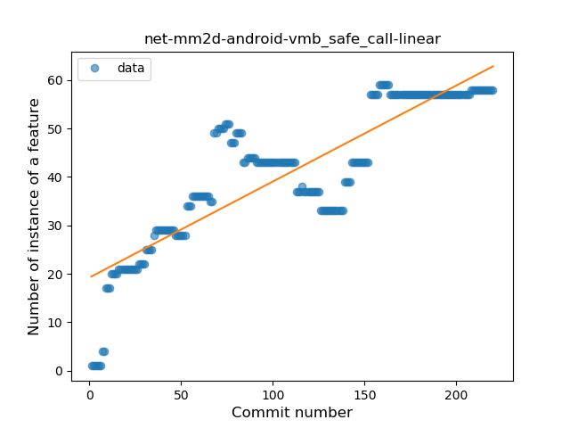

#### com-sjn-stamp
* Feature: Destructuring Declaration
* Function: 
* R_Squared: 0.74697342
 

#### fi-kroon-vadret
* Feature: Super Delegation
* Function: 
* R_Squared: 0.7467344
 

#### org-decsync-cc
* Feature: Unsafe Call
* Function: 
* R_Squared: 0.74648181
 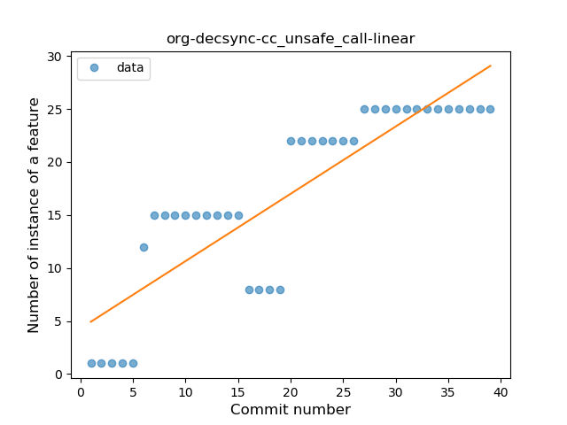

#### net-osmand-plus
* Feature: Function with Default Value
* Function: 
* R_Squared: 0.74531626
 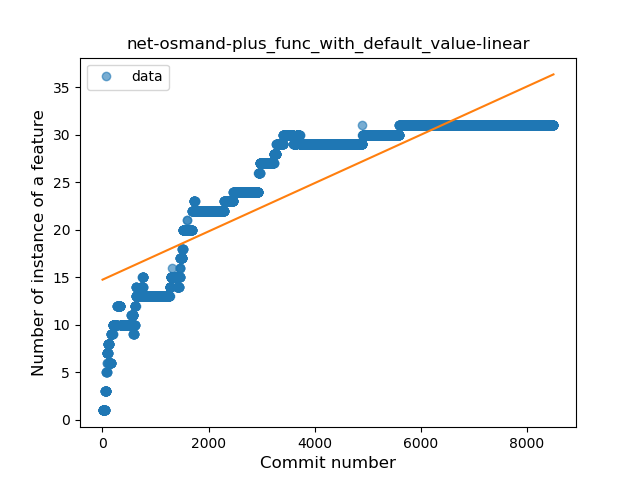

#### fi-kroon-vadret
* Feature: Extension Function
* Function: 
* R_Squared: 0.74524869
 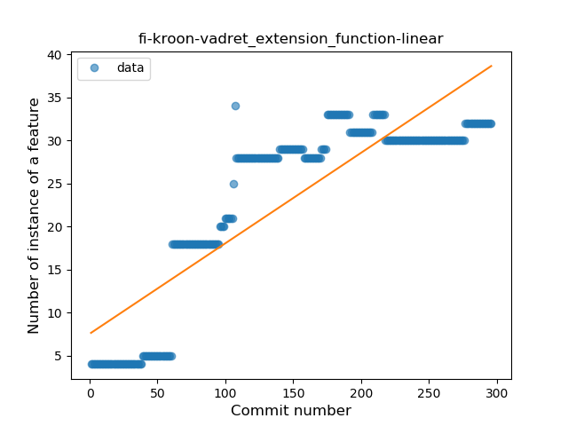

#### fr-chenry-android-freshrss
* Feature: Smart Cast
* Function: 
* R_Squared: 0.7445008
 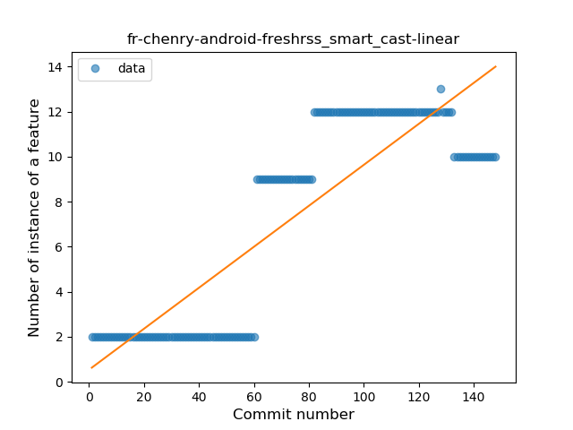

#### pl-hypeapp-episodie
* Feature: Range Expression
* Function: 
* R_Squared: 0.74429464
 

#### com-simplemobiletools-gallery-pro
* Feature: Unsafe Call
* Function: 
* R_Squared: 0.74426879
 

#### com-jmstudios-redmoon
* Feature: Range Expression
* Function: 
* R_Squared: 0.74382565
 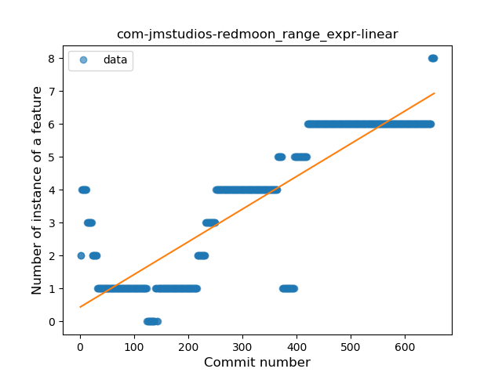

#### pt-ipleiria-mymusicqoe
* Feature: Safe Call
* Function: 
* R_Squared: 0.74375336
 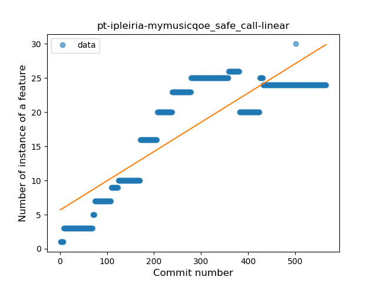

#### apps-amine-bou-readerforselfoss
* Feature: Safe Call
* Function: 
* R_Squared: 0.7430976
 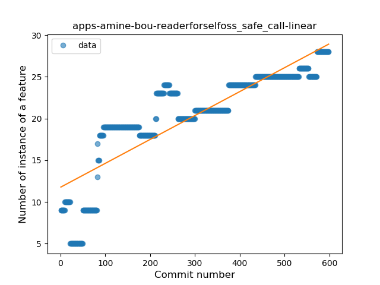

#### net-nurik-roman-muzei
* Feature: String Template
* Function: 
* R_Squared: 0.74283262
 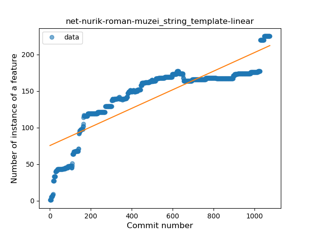

#### com-uwetrottmann-wpdisplay
* Feature: String Template
* Function: 
* R_Squared: 0.74149534
 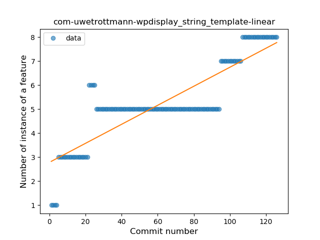

#### pt-ipleiria-mymusicqoe
* Feature: Function with Default Value
* Function: 
* R_Squared: 0.74134459
 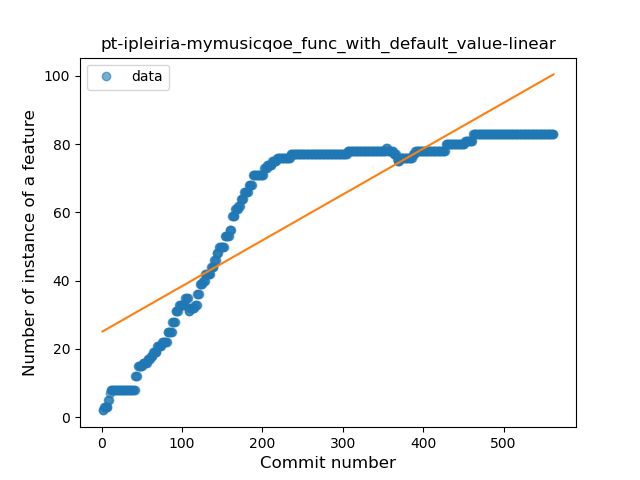

#### org-blokada-alarm
* Feature: Companion Object
* Function: 
* R_Squared: 0.741102
 

#### net-mm2d-android-vmb
* Feature: Companion Object
* Function: 
* R_Squared: 0.74065761
 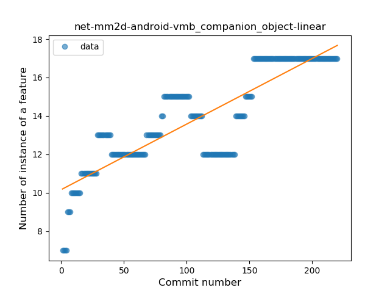

#### ffc-app
* Feature: Smart Cast
* Function: 
* R_Squared: 0.74010244
 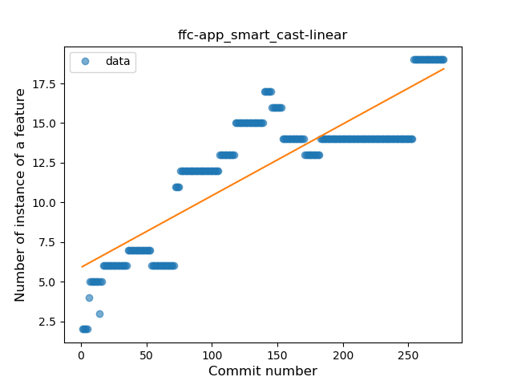

#### org-freedombox-freedombox
* Feature: String Template
* Function: 
* R_Squared: 0.73979741
 

#### ai-susi
* Feature: When expression
* Function: 
* R_Squared: 0.73857349
 

#### com-github-moko256-twitlatte
* Feature: Unsafe Call
* Function: 
* R_Squared: 0.73851513
 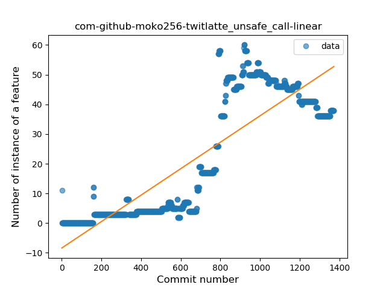

#### de-Maxr1998-xposed-maxlock
* Feature: Coroutine
* Function: 
* R_Squared: 0.73693156
 

#### com-simplemobiletools-gallery-pro
* Feature: Destructuring Declaration
* Function: 
* R_Squared: 0.73607491
 

#### com-fsck-k9
* Feature: Range Expression
* Function: 
* R_Squared: 0.73494568
 

#### net-nurik-roman-muzei
* Feature: Data Class
* Function: 
* R_Squared: 0.73421822
 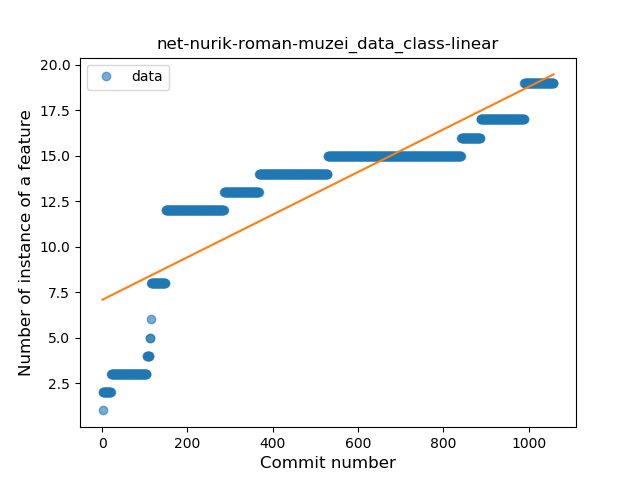

#### me-proxer-app
* Feature: Smart Cast
* Function: 
* R_Squared: 0.73229277
 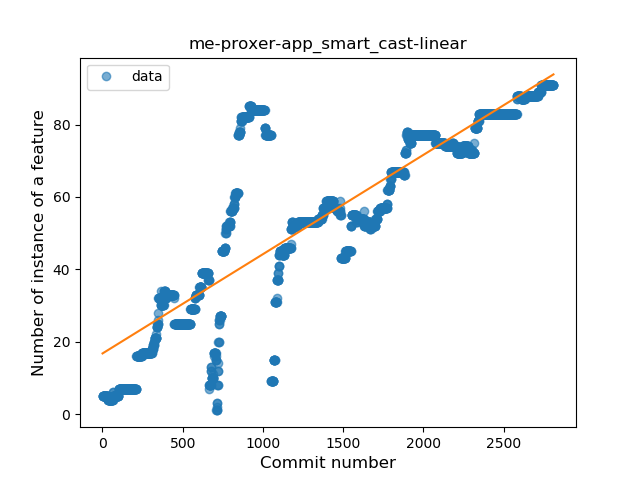

#### moe-feng-nhentai
* Feature: When expression
* Function: 
* R_Squared: 0.73178995
 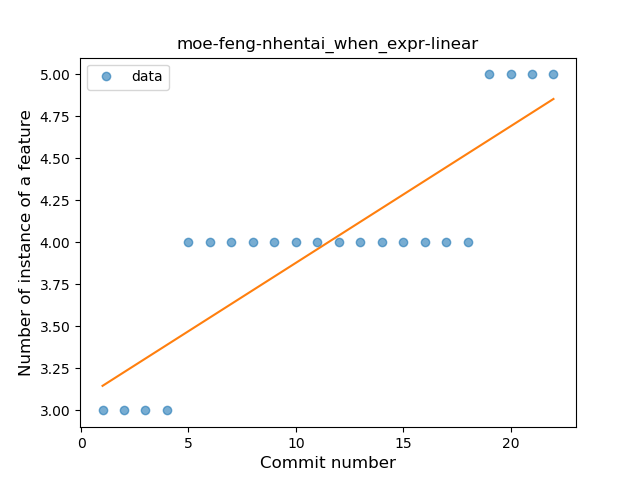

#### pt-joaomneto-titancompanion
* Feature: Inline Function
* Function: 
* R_Squared: 0.73097597
 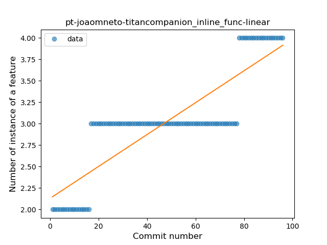

#### cz-dvratil-fbeventsync
* Feature: Lambda
* Function: 
* R_Squared: 0.72908575
 

#### com-commit451-gitlab
* Feature: Lambda
* Function: 
* R_Squared: 0.72811496
 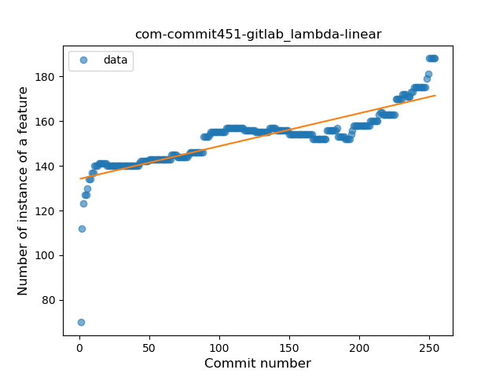

#### de-blankedv-lanbahnpanel
* Feature: Safe Call
* Function: 
* R_Squared: 0.72764125
 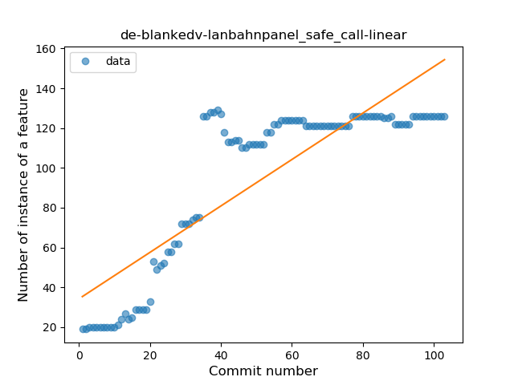

#### org-mozilla-rocket
* Feature: Destructuring Declaration
* Function: 
* R_Squared: 0.7275018
 

#### com-garpr-android
* Feature: String Template
* Function: 
* R_Squared: 0.72722883
 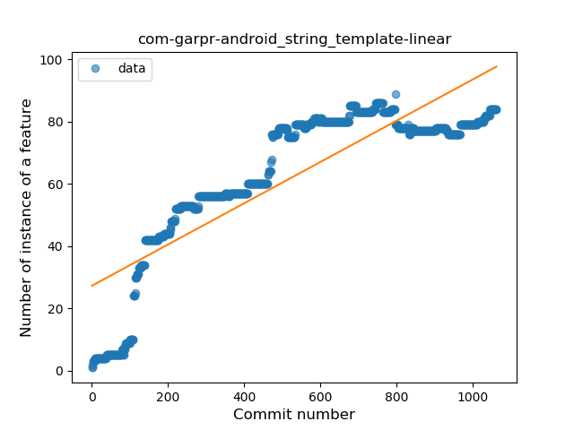

#### org-blokada-alarm
* Feature: Data Class
* Function: 
* R_Squared: 0.72607067
 

#### org-moire-ultrasonic
* Feature: Function call with Named Argument
* Function: 
* R_Squared: 0.72606056
 

#### com-keylesspalace-tusky
* Feature: Type Alias
* Function: 
* R_Squared: 0.72483496
 

#### com-uwetrottmann-wpdisplay
* Feature: Safe Call
* Function: 
* R_Squared: 0.7248012
 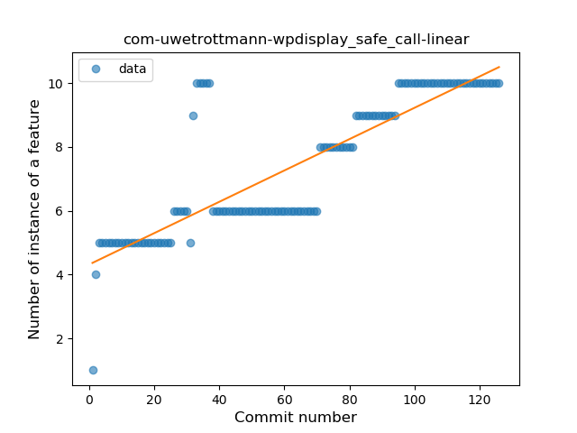

#### org-eurofurence-connavigator
* Feature: Property Delegation
* Function: 
* R_Squared: 0.72477932
 

#### com-github-premnirmal-tickerwidget
* Feature: Companion Object
* Function: 
* R_Squared: 0.72201137
 

#### jp-cordea-mackerelclient
* Feature: Type Inference
* Function: 
* R_Squared: 0.72157219
 

#### es-usc-citius-servando-calendula
* Feature: Safe Call
* Function: 
* R_Squared: 0.72149471
 

#### com-simplemobiletools-thankyou
* Feature: String Template
* Function: 
* R_Squared: 0.72055966
 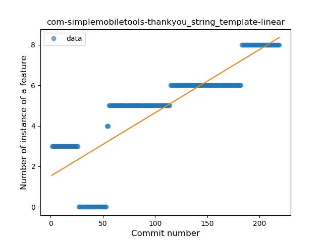

#### jp-takke-cpustats
* Feature: String Template
* Function: 
* R_Squared: 0.71951046
 

#### im-vector-alpha
* Feature: Property Delegation
* Function: 
* R_Squared: 0.71897295
 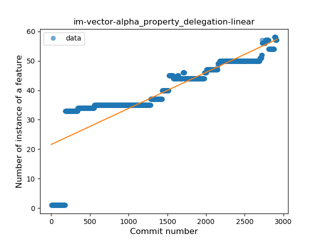

#### chat-rocket-android
* Feature: Unsafe Call
* Function: 
* R_Squared: 0.7183711
 

#### com-lavadip-miniVector
* Feature: Property Delegation
* Function: 
* R_Squared: 0.7179952
 

#### app-simone
* Feature: When expression
* Function: 
* R_Squared: 0.71529274
 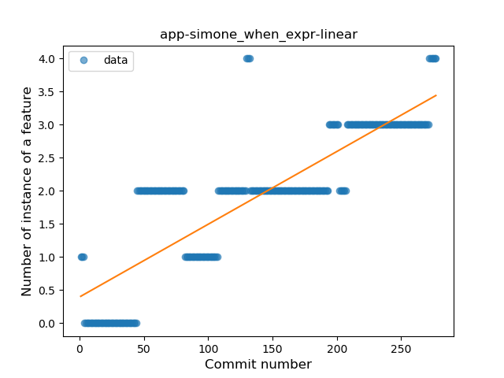

#### com-github-fields-electric
* Feature: Lambda
* Function: 
* R_Squared: 0.71394684
 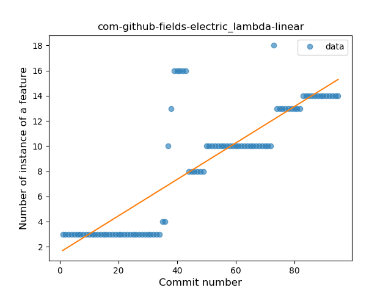

#### pl-org-seva-navigator
* Feature: Infix Function
* Function: 
* R_Squared: 0.71348849
 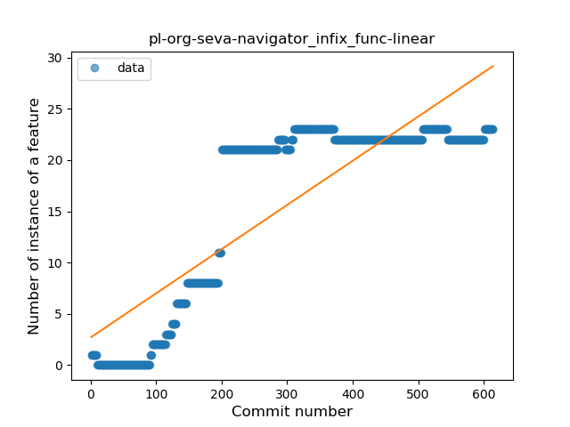

#### net-kourlas-voipms
* Feature: String Template
* Function: 
* R_Squared: 0.71115142
 

#### com-booboot-vndbandroid
* Feature: Data Class
* Function: 
* R_Squared: 0.7104171
 

#### com-moez-QKSMS
* Feature: Function with Default Value
* Function: 
* R_Squared: 0.7100721
 

#### com-calintat-units
* Feature: Function call with Named Argument
* Function: 
* R_Squared: 0.70969723
 

#### es-usc-citius-servando-calendula
* Feature: Lambda
* Function: 
* R_Squared: 0.70774365
 

#### de-cineaste-android
* Feature: Safe Call
* Function: 
* R_Squared: 0.70616002
 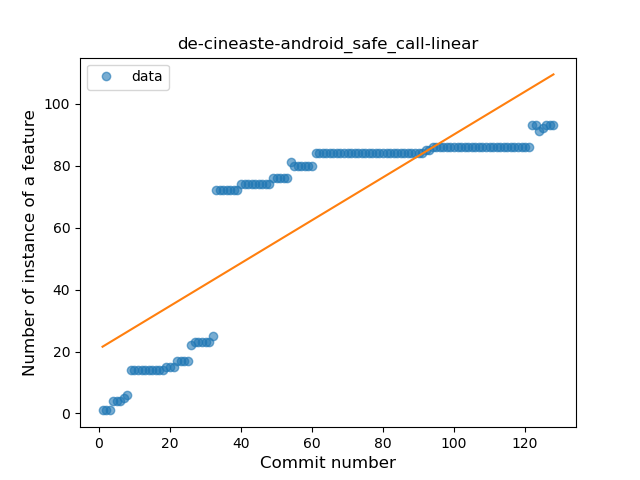

#### pt-joaomneto-titancompanion
* Feature: When expression
* Function: 
* R_Squared: 0.7051811
 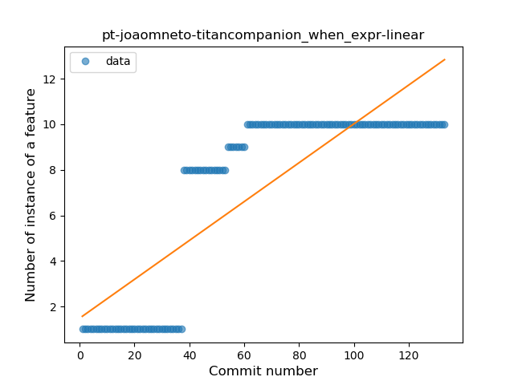

#### org-fossasia-badgemagic
* Feature: When expression
* Function: 
* R_Squared: 0.7051163
 

#### ai-susi
* Feature: Function with Default Value
* Function: 
* R_Squared: 0.70181429
 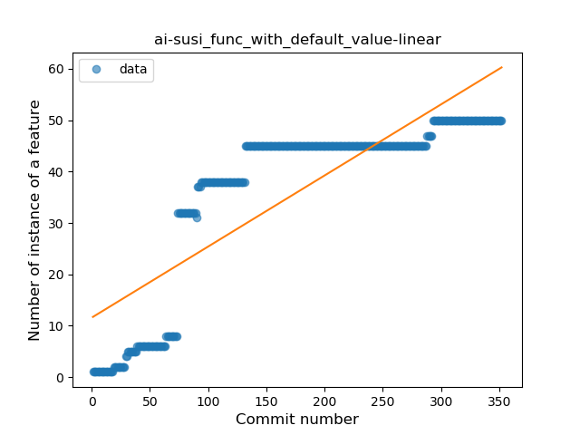

#### de-r4md4c-gamedealz
* Feature: Inline Function
* Function: 
* R_Squared: 0.70172677
 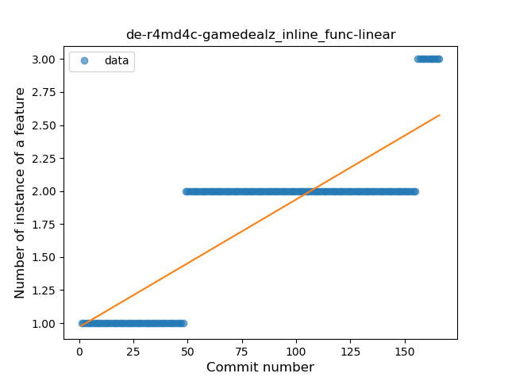

#### com-guerinet-mymartlet
* Feature: Function with Default Value
* Function: 
* R_Squared: 0.70138677
 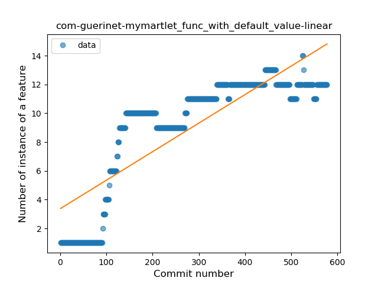

#### de-cineaste-android
* Feature: Data Class
* Function: 
* R_Squared: 0.70040292
 

#### de-geeksfactory-opacclient
* Feature: Type Inference
* Function: 
* R_Squared: 0.69983614
 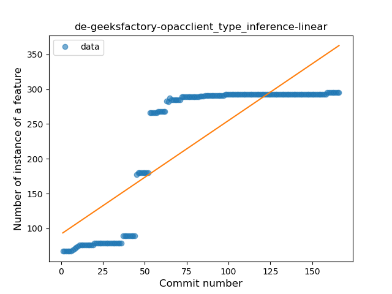

#### io-github-feelfreelinux-wykopmobilny
* Feature: Range Expression
* Function: 
* R_Squared: 0.69927304
 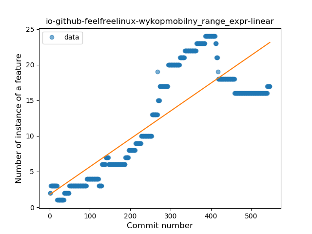

#### com-sduduzog-slimlauncher
* Feature: Function with Default Value
* Function: 
* R_Squared: 0.69865615
 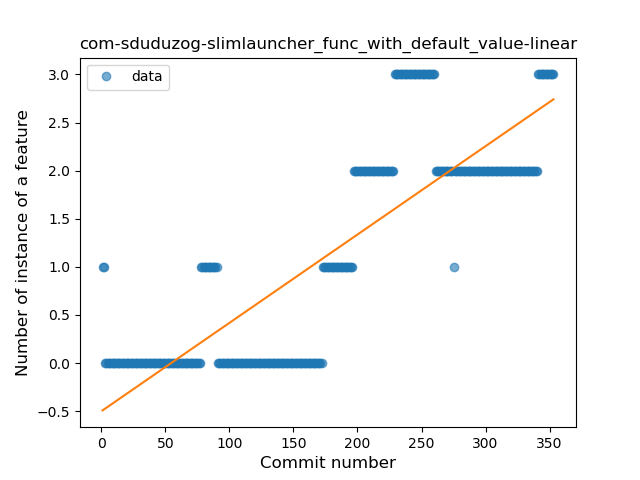

#### com-calintat-units
* Feature: Extension Function
* Function: 
* R_Squared: 0.69682063
 

#### me-proxer-app
* Feature: String Template
* Function: 
* R_Squared: 0.69442421
 

#### com-kgurgul-cpuinfo
* Feature: String Template
* Function: 
* R_Squared: 0.69363711
 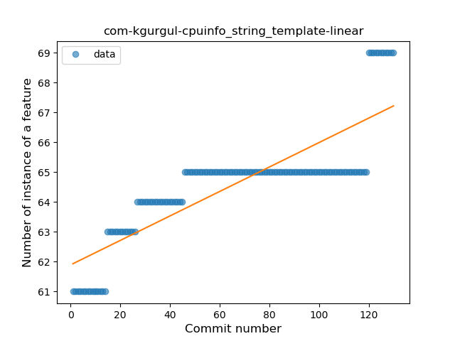

#### de-avpptr-umweltzone
* Feature: String Template
* Function: 
* R_Squared: 0.69338602
 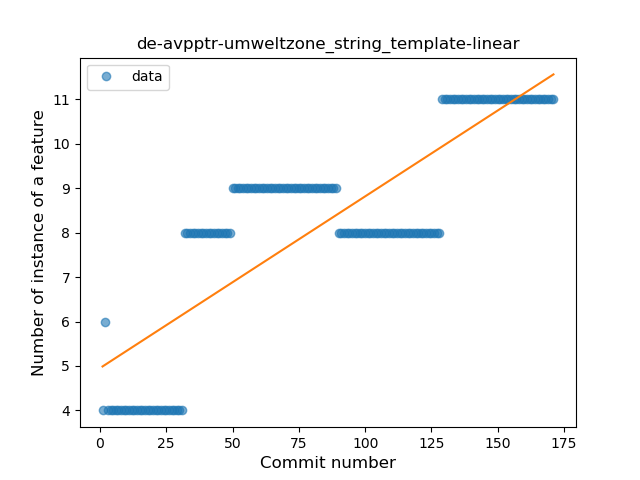

#### ai-susi
* Feature: Data Class
* Function: 
* R_Squared: 0.69317979
 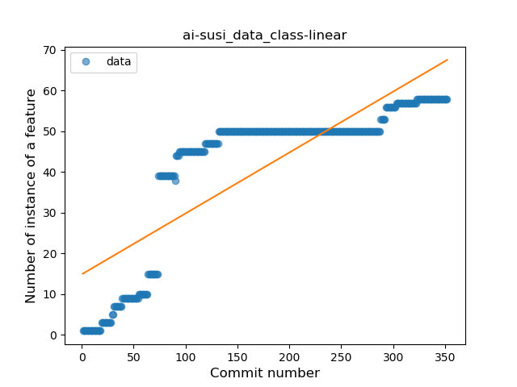

#### fi-tuska-jalkametri
* Feature: When expression
* Function: 
* R_Squared: 0.69305602
 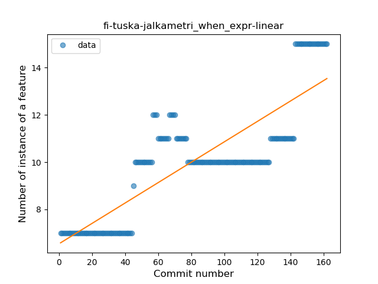

#### org-blokada-alarm
* Feature: Type Inference
* Function: 
* R_Squared: 0.690589
 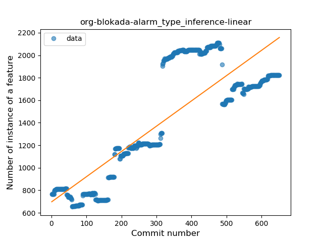

#### com-boardgamegeek
* Feature: Destructuring Declaration
* Function: 
* R_Squared: 0.68880716
 

#### one-librem-social
* Feature: Type Alias
* Function: 
* R_Squared: 0.68823585
 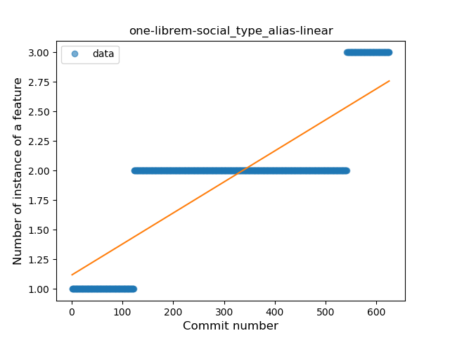

#### apps-jizzu-simpletodo
* Feature: When expression
* Function: 
* R_Squared: 0.68790888
 

#### net-nonylene-photolinkviewer
* Feature: Property Delegation
* Function: 
* R_Squared: 0.68701069
 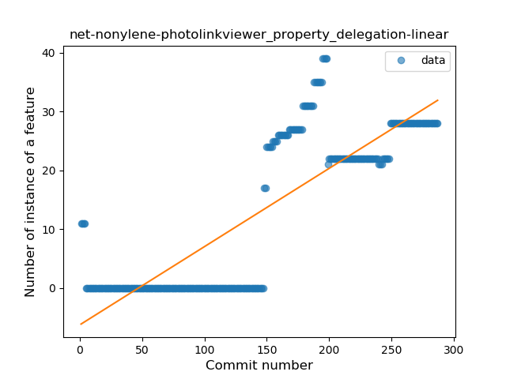

#### jp-takke-cpustats
* Feature: When expression
* Function: 
* R_Squared: 0.68571429
 

#### com-commit451-gitlab
* Feature: Extension Function
* Function: 
* R_Squared: 0.68427628
 

#### com-example-forgottenumbrella-cardboardmuseum
* Feature: Safe Call
* Function: 
* R_Squared: 0.6789093
 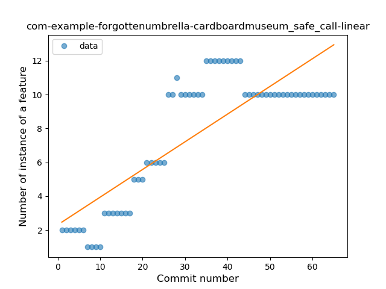

#### pt-ipleiria-mymusicqoe
* Feature: Lambda
* Function: 
* R_Squared: 0.67859853
 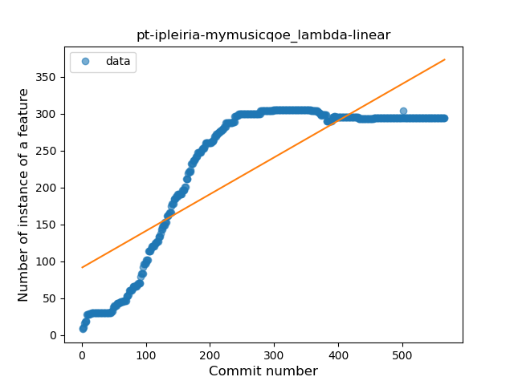

#### com-booboot-vndbandroid
* Feature: Range Expression
* Function: 
* R_Squared: 0.67783318
 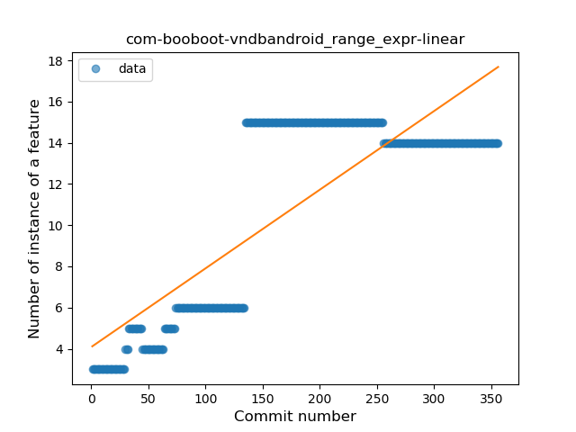

#### fr-free-nrw-commons
* Feature: String Template
* Function: 
* R_Squared: 0.67440471
 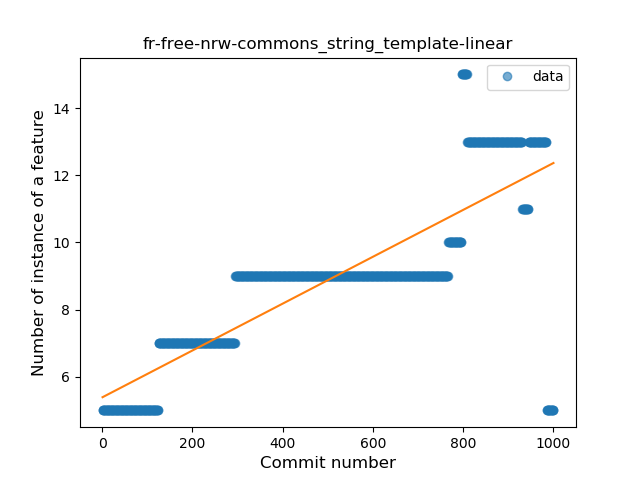

#### sk-styk-martin-apkanalyzer
* Feature: Extension Function
* Function: 
* R_Squared: 0.67213473
 

#### com-pitchedapps-frost
* Feature: Data Class
* Function: 
* R_Squared: 0.67006658
 

#### com-simplemobiletools-calendar-pro
* Feature: Extension Function
* Function: 
* R_Squared: 0.66622722
 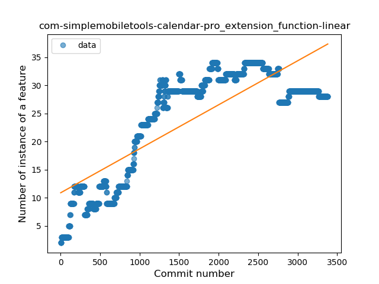

#### com-fastaccess-github-libre
* Feature: Data Class
* Function: 
* R_Squared: 0.66606839
 

#### org-eurofurence-connavigator
* Feature: Inline Function
* Function: 
* R_Squared: 0.66376239
 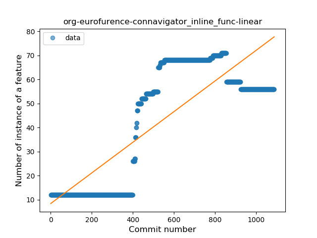

#### com-pitchedapps-frost
* Feature: Inline Function
* Function: 
* R_Squared: 0.66345987
 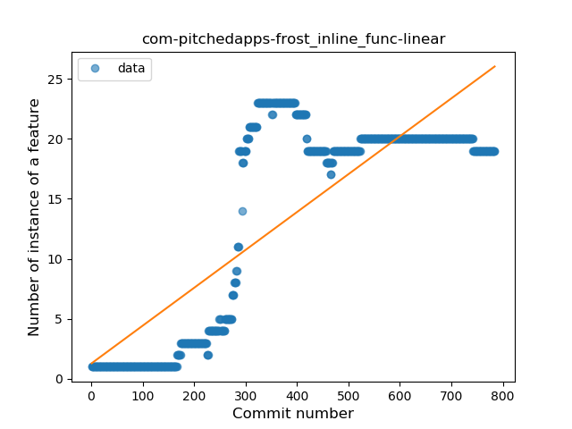

#### com-simplemobiletools-camera
* Feature: Safe Call
* Function: 
* R_Squared: 0.66094071
 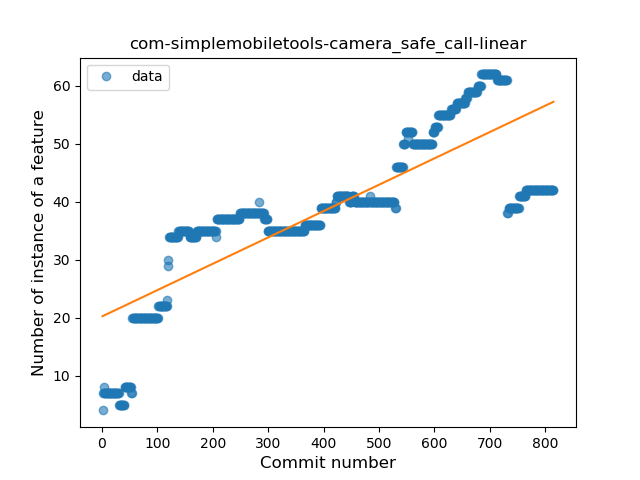

#### com-simplemobiletools-gallery
* Feature: Extension Function
* Function: 
* R_Squared: 0.66009621
 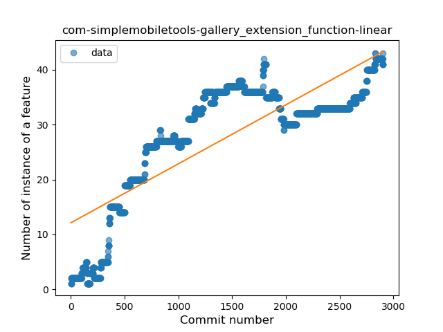

#### com-moez-QKSMS
* Feature: Companion Object
* Function: 
* R_Squared: 0.65876556
 

#### com-bubelov-coins
* Feature: Extension Function
* Function: 
* R_Squared: 0.65854758
 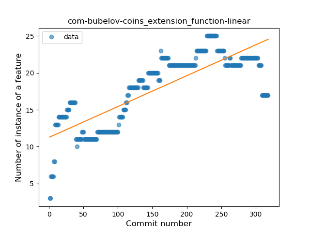

#### com-github-quarck-calnotify
* Feature: Overloaded Operator
* Function: 
* R_Squared: 0.65802159
 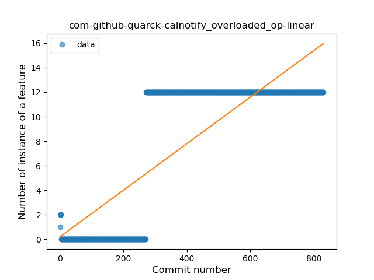

#### com-nononsenseapps-feeder
* Feature: Destructuring Declaration
* Function: 
* R_Squared: 0.65734617
 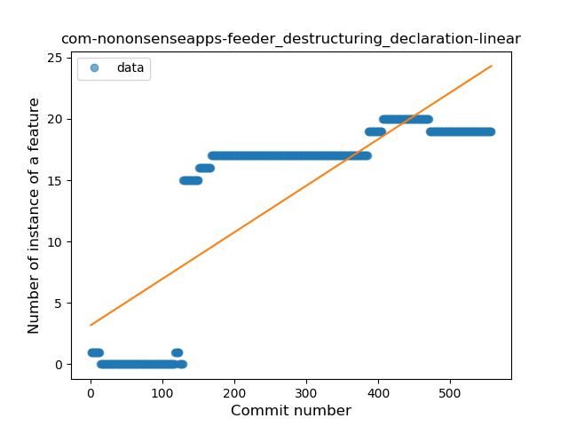

#### pt-ipleiria-mymusicqoe
* Feature: Function call with Named Argument
* Function: 
* R_Squared: 0.65609941
 

#### superustats-tool-android
* Feature: Safe Call
* Function: 
* R_Squared: 0.65475673
 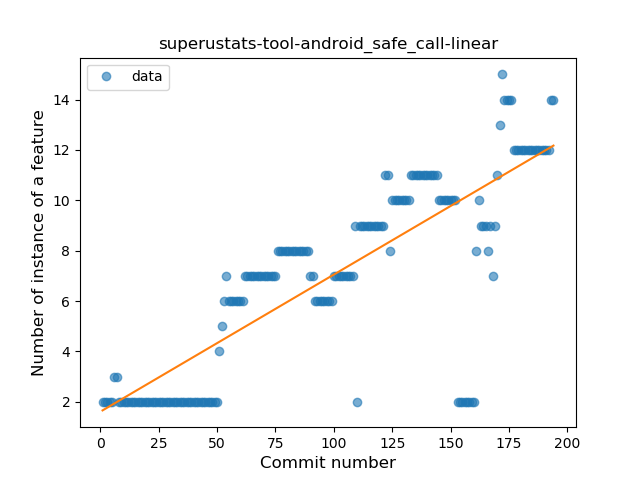

#### com-pixplicity-cryptogram
* Feature: Range Expression
* Function: 
* R_Squared: 0.6537264
 

#### danbroid-searchview
* Feature: Type Inference
* Function: 
* R_Squared: 0.65152797
 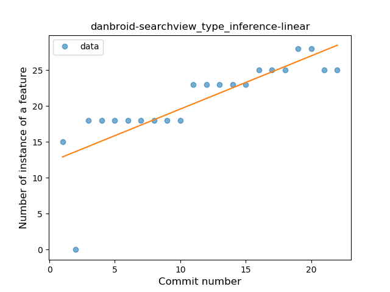

#### eu-kanade-tachiyomi
* Feature: Coroutine
* Function: 
* R_Squared: 0.64815423
 

#### com-simplemobiletools-calendar-pro
* Feature: Data Class
* Function: 
* R_Squared: 0.64463989
 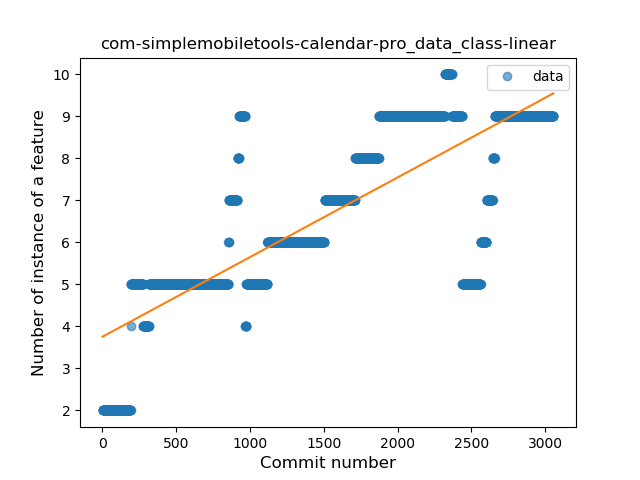

#### io-ipoli-android
* Feature: Coroutine
* Function: 
* R_Squared: 0.63371873
 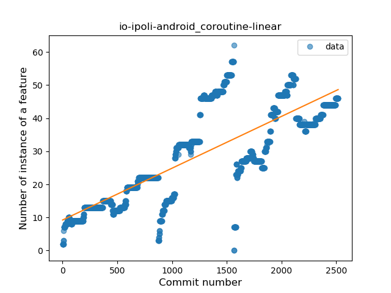

#### org-ligi-passandroid
* Feature: Property Delegation
* Function: 
* R_Squared: 0.63107162
 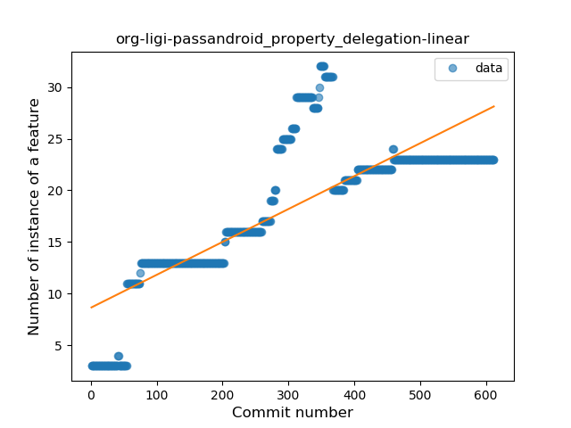

#### pw-janyo-whatanime
* Feature: Type Inference
* Function: 
* R_Squared: 0.62711309
 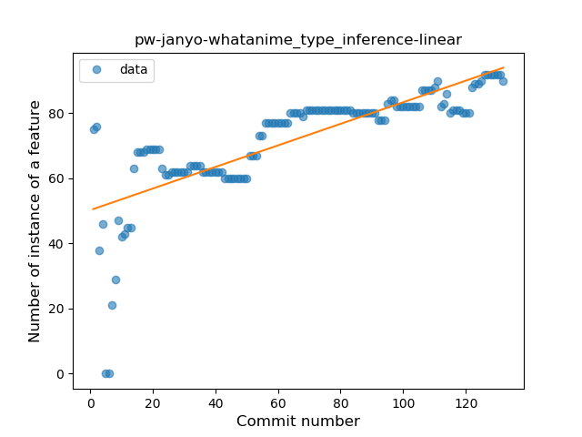

#### ml-adamsprogs-bimba
* Feature: Companion Object
* Function: 
* R_Squared: 0.62438076
 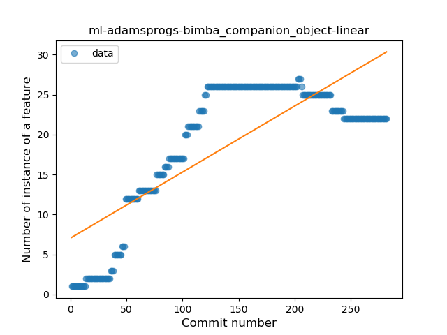

#### xyz-hisname-fireflyiii
* Feature: Singleton
* Function: 
* R_Squared: 0.62341451
 

#### org-blokada-alarm
* Feature: Safe Call
* Function: 
* R_Squared: 0.61919382
 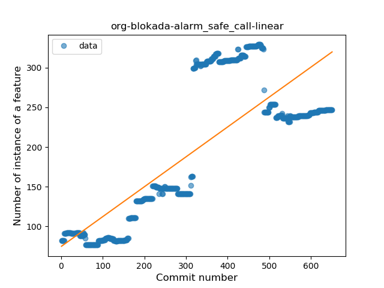

#### com-bijoysingh-quicknote
* Feature: Extension Function
* Function: 
* R_Squared: 0.61790414
 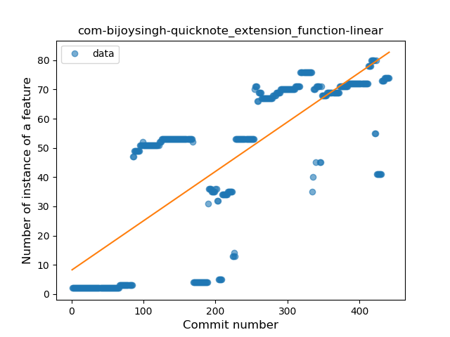

#### com-ruuvi-station
* Feature: Safe Call
* Function: 
* R_Squared: 0.61636272
 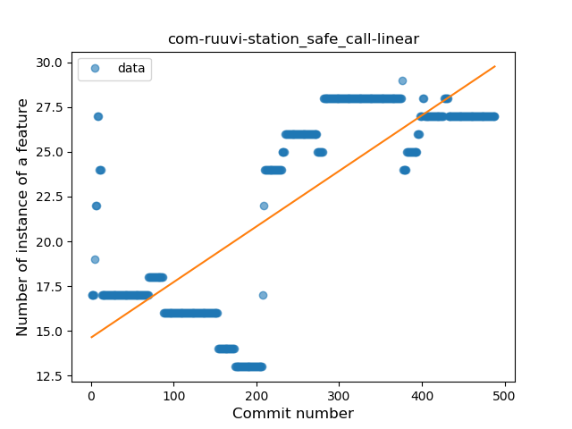

#### com-peterlaurence-trekme
* Feature: Function call with Named Argument
* Function: 
* R_Squared: 0.61612078
 

#### net-frju-flym
* Feature: String Template
* Function: 
* R_Squared: 0.61472612
 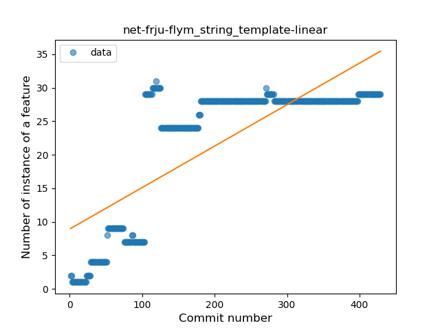

#### com-czbix-v2ex
* Feature: Extension Function
* Function: 
* R_Squared: 0.61315061
 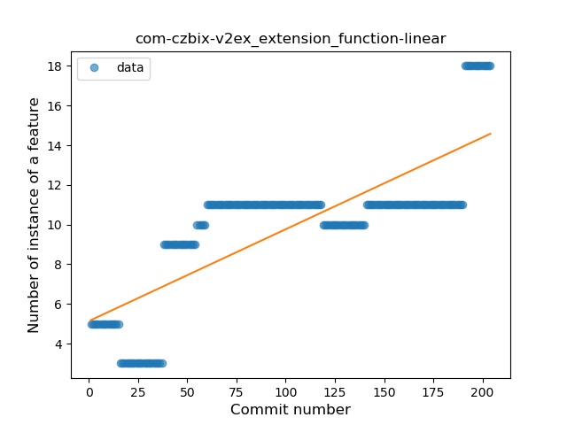

#### info-dvkr-screenstream
* Feature: Companion Object
* Function: 
* R_Squared: 0.60983346
 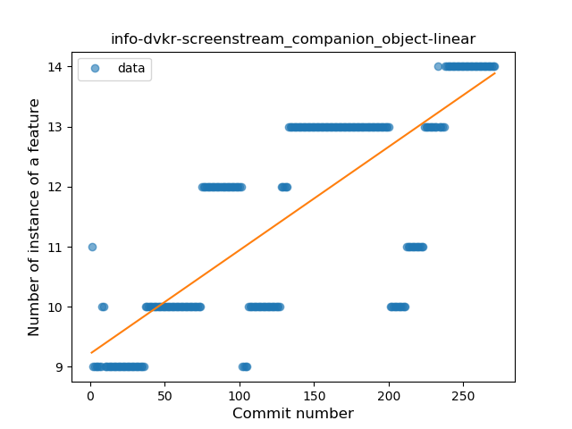

#### com-simplemobiletools-contacts-pro
* Feature: Destructuring Declaration
* Function: 
* R_Squared: 0.60507004
 

#### fr-openium-auvergnewebcams
* Feature: Unsafe Call
* Function: 
* R_Squared: 0.6028167
 

#### ch-rmy-android-http_shortcuts
* Feature: Overloaded Operator
* Function: 
* R_Squared: 0.59344791
 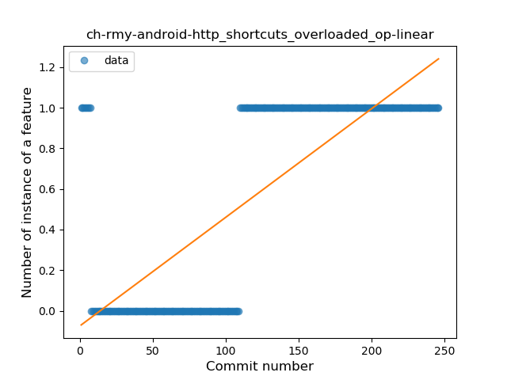

#### org-blokada-alarm
* Feature: Lambda
* Function: 
* R_Squared: 0.59184189
 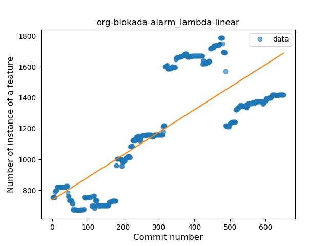

#### com-bubelov-coins
* Feature: Function call with Named Argument
* Function: 
* R_Squared: 0.59175144
 

#### net-osmand-plus
* Feature: Destructuring Declaration
* Function: 
* R_Squared: 0.58743138
 

#### com-slash-batterychargelimit
* Feature: Companion Object
* Function: 
* R_Squared: 0.5836195
 

#### net-mm2d-dmsexplorer
* Feature: Unsafe Call
* Function: 
* R_Squared: 0.57871887
 

#### com-yubico-yubioath
* Feature: Safe Call
* Function: 
* R_Squared: 0.5776445
 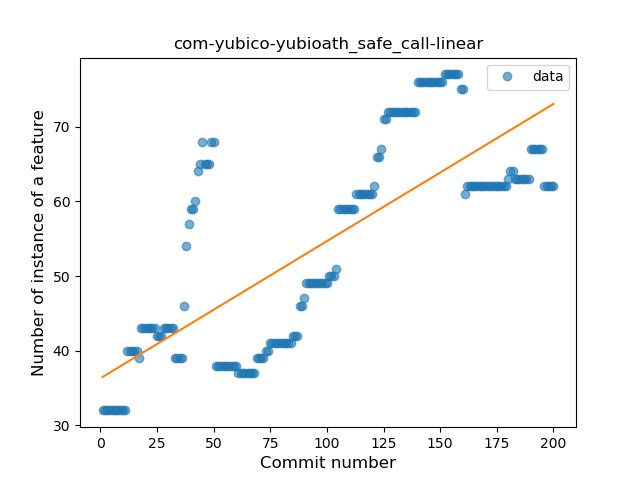

#### com-simplemobiletools-calendar-pro
* Feature: Function call with Named Argument
* Function: 
* R_Squared: 0.57623562
 

#### li-klass-fhem
* Feature: Range Expression
* Function: 
* R_Squared: 0.57472541
 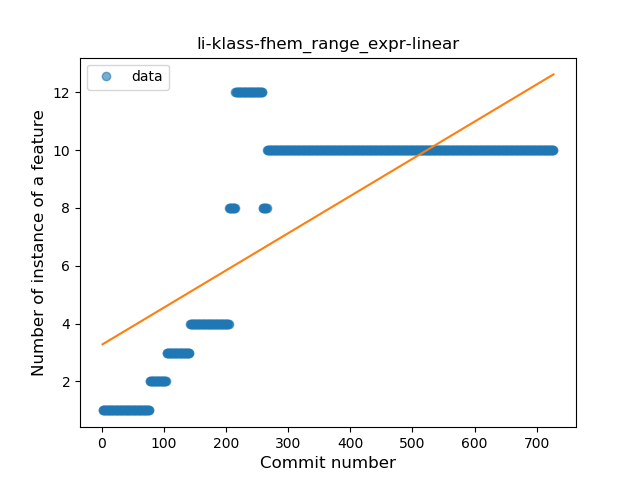

#### org-kiwix-kiwixcustomwikivoyageeurope
* Feature: Smart Cast
* Function: 
* R_Squared: 0.57309667
 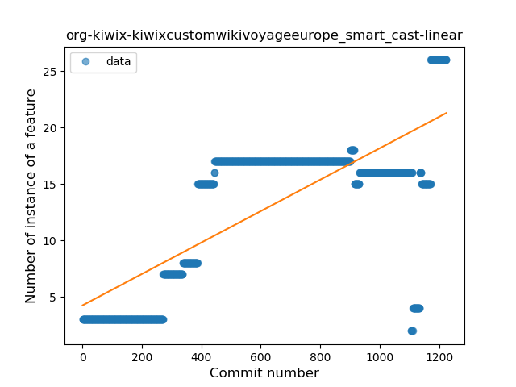

#### com-sjn-stamp
* Feature: Unsafe Call
* Function: 
* R_Squared: 0.57098188
 

#### pw-janyo-whatanime
* Feature: Smart Cast
* Function: 
* R_Squared: 0.49426804
 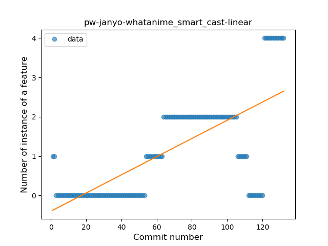

#### jp-cordea-mackerelclient
* Feature: When expression
* Function: 
* R_Squared: 0.49420634
 

#### ca-josephroque-bowlingcompanion
* Feature: Data Class
* Function: 
* R_Squared: 0.48376725
 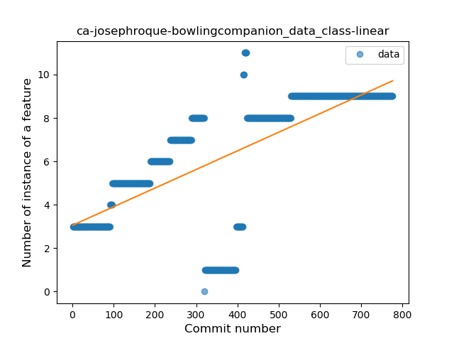

#### com-simplemobiletools-filemanager-pro
* Feature: Function call with Named Argument
* Function: 
* R_Squared: 0.47385907
 

#### eu-the4thfloor-msync
* Feature: String Template
* Function: 
* R_Squared: 0.47008382
 

#### com-simplemobiletools-gallery
* Feature: Function call with Named Argument
* Function: 
* R_Squared: 0.46867015
 

#### net-mm2d-android-vmb
* Feature: Unsafe Call
* Function: 
* R_Squared: 0.45011659
 

#### com-zeapo-pwdstore
* Feature: Property Delegation
* Function: 
* R_Squared: 0.44734465
 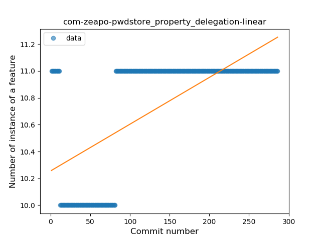

#### tk-superl2-xwifi
* Feature: Function call with Named Argument
* Function: 
* R_Squared: 0.42768668
 

#### be-mygod-vpnhotspot
* Feature: Inline Function
* Function: 
* R_Squared: 0.42315407
 

#### com-bijoysingh-quicknote
* Feature: Unsafe Call
* Function: 
* R_Squared: 0.41991351
 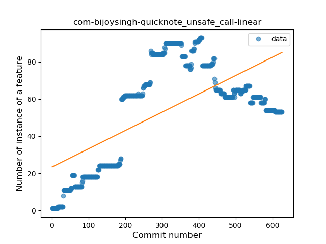

#### com-simplemobiletools-camera
* Feature: Unsafe Call
* Function: 
* R_Squared: 0.40764415
 

#### xyz-hisname-fireflyiii
* Feature: Function call with Named Argument
* Function: 
* R_Squared: 0.39603667
 

#### com-booboot-vndbandroid
* Feature: Overloaded Operator
* Function: 
* R_Squared: 0.39038635
 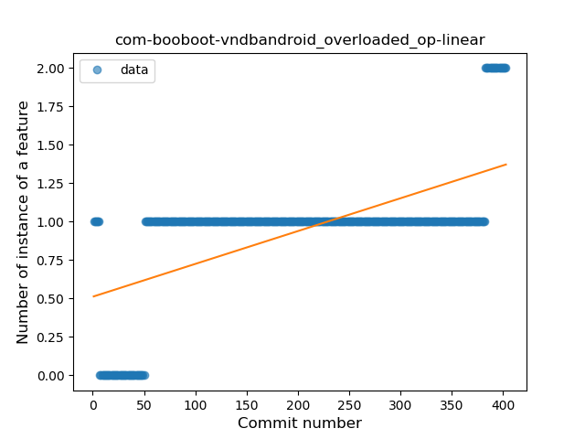

#### eu-kanade-tachiyomi
* Feature: Property Delegation
* Function: 
* R_Squared: 0.38186478
 

#### me-echeung-moemoekyun-fdroid
* Feature: When expression
* Function: 
* R_Squared: 0.35200374
 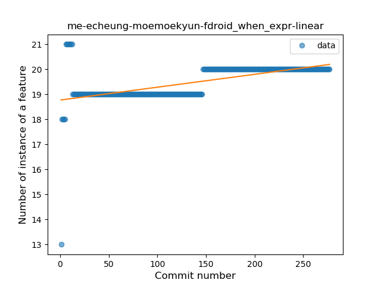

#### de-geeksfactory-opacclient
* Feature: Smart Cast
* Function: 
* R_Squared: 0.35177249
 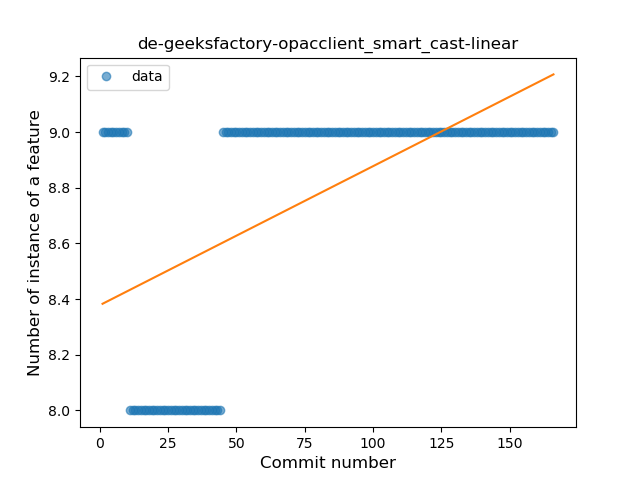

#### fr-xgouchet-packageexplorer
* Feature: Data Class
* Function: 
* R_Squared: 0.3178751
 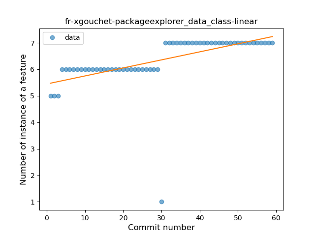

#### com-peterlaurence-trekme
* Feature: Range Expression
* Function: 
* R_Squared: 0.27191205
 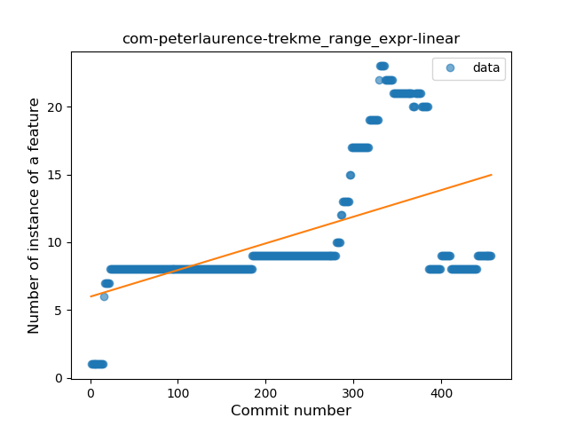

#### de-ironjan-mensaupb
* Feature: Function call with Named Argument
* Function: 
* R_Squared: 0.26869717
 

#### com-ofalvai-bpinfo
* Feature: Function call with Named Argument
* Function: 
* R_Squared: 0.26638521
 

#### info-dvkr-screenstream
* Feature: Unsafe Call
* Function: 
* R_Squared: 0.2237382
 

#### fr-jnda-android-flashalert
* Feature: When expression
* Function: 
* R_Squared: 0.17274825
 

#### ml-adamsprogs-bimba
* Feature: Function call with Named Argument
* Function: 
* R_Squared: 0.15900048
 

#### com-commit451-gitlab
* Feature: String Template
* Function: 
* R_Squared: 0.15827543
 

#### net-frju-flym
* Feature: Smart Cast
* Function: 
* R_Squared: 0.15746029
 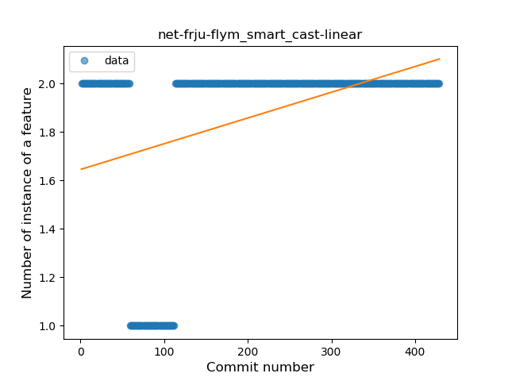

#### app-opass-ccip
* Feature: Super Delegation
* Function: 
* R_Squared: 0.13934666
 

#### com-github-premnirmal-tickerwidget
* Feature: Overloaded Operator
* Function: 
* R_Squared: 0.13640387
 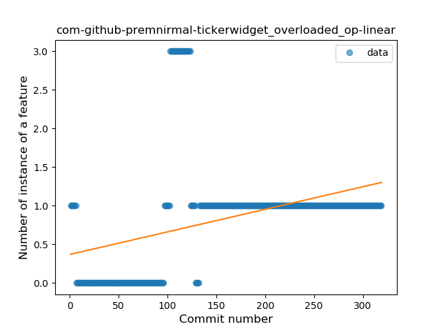

#### com-pixplicity-cryptogram
* Feature: Destructuring Declaration
* Function: 
* R_Squared: 0.08423837
 

#### apps-jizzu-simpletodo
* Feature: Destructuring Declaration
* Function: 
* R_Squared: 0.07578671
 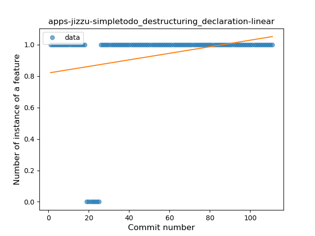

#### fr-free-nrw-commons
* Feature: Unsafe Call
* Function: 
* R_Squared: 0.07578473
 

#### de-spiritcroc-defaultdarktheme
* Feature: Type Inference
* Function: 
* R_Squared: 0.07129344
 

#### app-opass-ccip
* Feature: Companion Object
* Function: 
* R_Squared: 0.06639565
 

#### org-blokada-alarm
* Feature: Overloaded Operator
* Function: 
* R_Squared: 0.06285368
 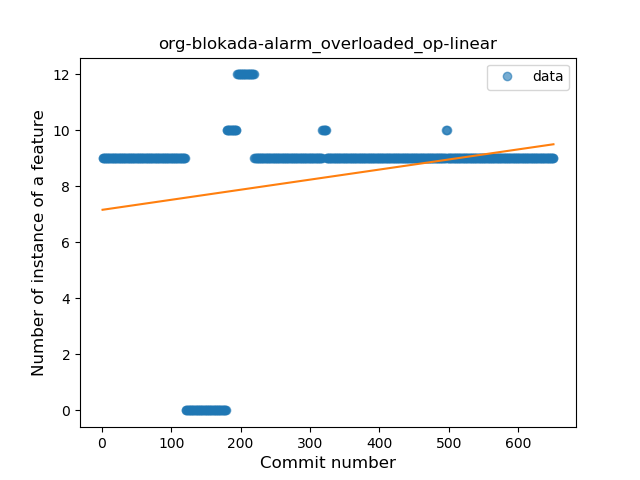

#### org-moire-ultrasonic
* Feature: Companion Object
* Function: 
* R_Squared: 0.05973265
 

#### pt-ipleiria-mymusicqoe
* Feature: Companion Object
* Function: 
* R_Squared: 0.05604612
 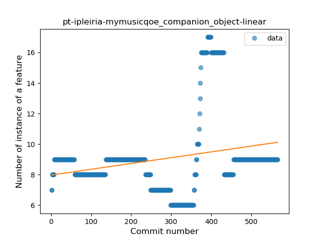

#### de-ph1b-audiobook
* Feature: Infix Function
* Function: 
* R_Squared: 0.04918471
 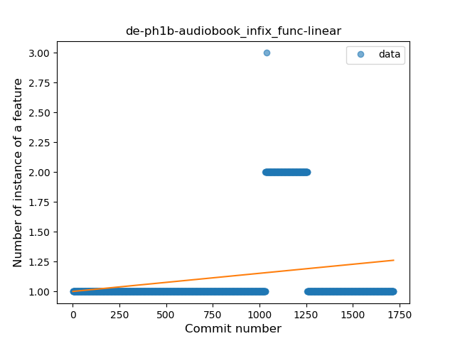

#### com-doctoror-particleswallpaper
* Feature: Singleton
* Function: 
* R_Squared: 0.04612814
 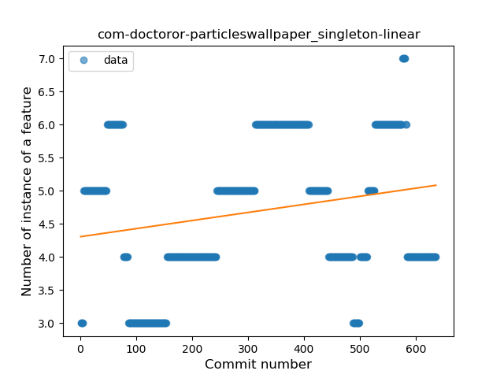

#### com-corphish-nightlight-generic
* Feature: Companion Object
* Function: 
* R_Squared: 0.03102168
 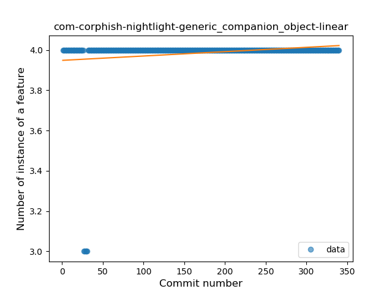

#### com-ids1024-whitakerswords
* Feature: Unsafe Call
* Function: 
* R_Squared: 0.02945232
 

#### com-dp-logcatapp
* Feature: Destructuring Declaration
* Function: 
* R_Squared: 0.01955572
 

#### com-github-quarck-calnotify
* Feature: Unsafe Call
* Function: 
* R_Squared: 0.01138324
 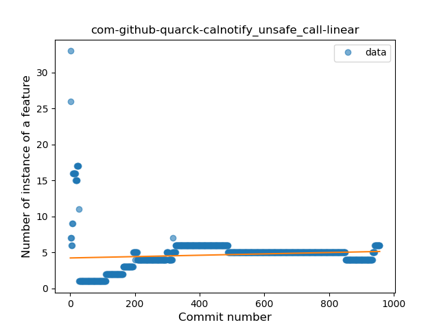

#### me-camsteffen-polite
* Feature: Companion Object
* Function: 
* R_Squared: 0.01102336
 

#### im-vector-alpha
* Feature: Coroutine
* Function: 
* R_Squared: 0.00618409
 

#### com-lavadip-miniVector
* Feature: Coroutine
* Function: 
* R_Squared: 0.00585277
 

#### es-usc-citius-servando-calendula
* Feature: Smart Cast
* Function: 
* R_Squared: 0.00566048
 

#### es-usc-citius-servando-calendula
* Feature: Destructuring Declaration
* Function: 
* R_Squared: 0.00393296
 

#### es-usc-citius-servando-calendula
* Feature: Function call with Named Argument
* Function: 
* R_Squared: 0.0034428
 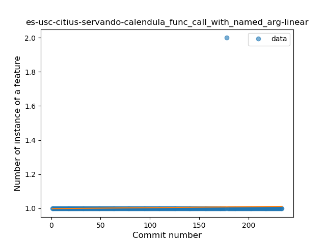

#### com-doctoror-particleswallpaper
* Feature: Unsafe Call
* Function: 
* R_Squared: 0.00102529
 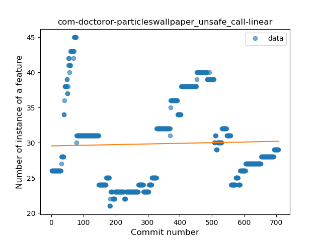

#### com-simplemobiletools-thankyou
* Feature: Lambda
* Function: 
* R_Squared: 0.00056999
 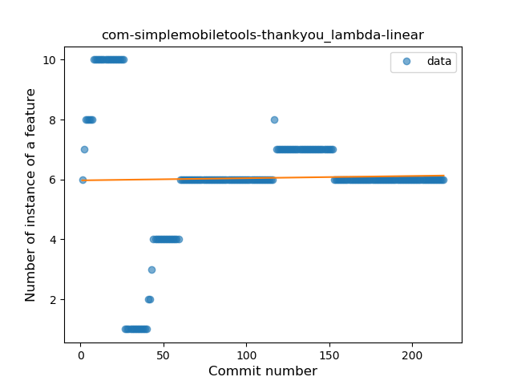

#### net-nonylene-photolinkviewer
* Feature: Companion Object
* Function: 
* R_Squared: 0.00016528
 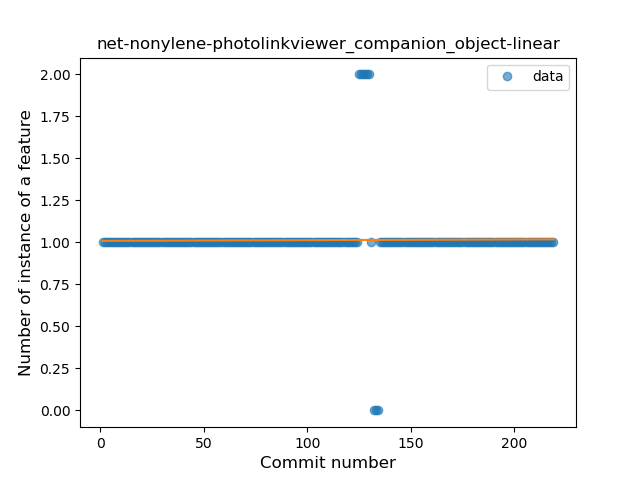

