## Plateau Sudden Decline
----
**103** best fit

#### Streetwalrus-android_usb_msd
* Feature: Lambda
* Function: 
* R_Squared: 1.0
 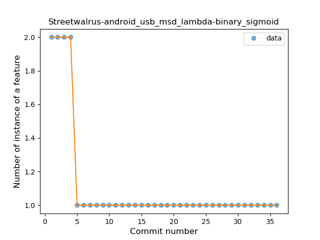

#### garmax1-material-flashlight
* Feature: Lambda
* Function: 
* R_Squared: 1.0
 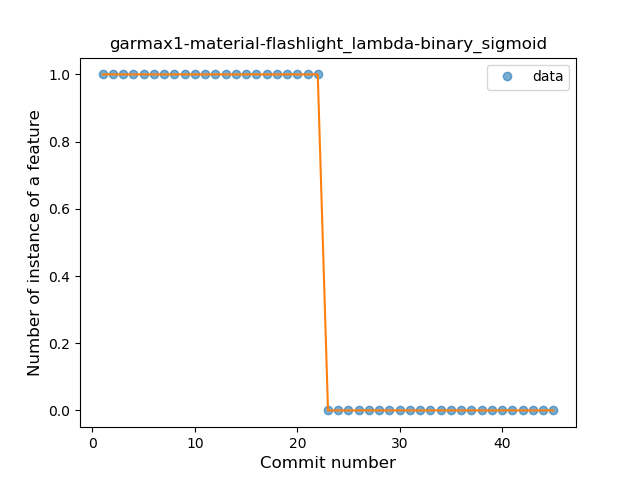

#### WilderPereira-lmgtfyGen
* Feature: Safe Call
* Function: 
* R_Squared: 1.0
 

#### danirod-rectball
* Feature: Safe Call
* Function: 
* R_Squared: 1.0
 

#### devmil-muzei-bingimageoftheday
* Feature: Safe Call
* Function: 
* R_Squared: 1.0
 

#### ligi-MaterialTeaTimer
* Feature: Safe Call
* Function: 
* R_Squared: 1.0
 

#### SpiritCroc-DarkCroc-Android-theme
* Feature: When expression
* Function: 
* R_Squared: 1.0
 

#### pyamsoft-home-button
* Feature: When expression
* Function: 
* R_Squared: 1.0
 

#### dimagi-commcare-android
* Feature: Companion Object
* Function: 
* R_Squared: 1.0
 

#### ronocod-bus
* Feature: Companion Object
* Function: 
* R_Squared: 1.0
 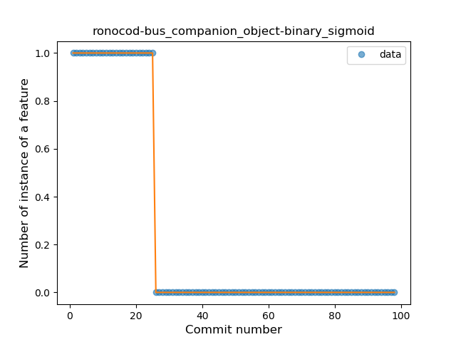

#### dkrivoruchko-ScreenStream
* Feature: Unsafe Call
* Function: 
* R_Squared: 1.0
 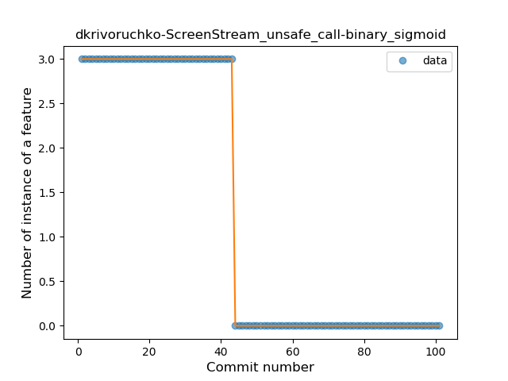

#### ronocod-bus
* Feature: Unsafe Call
* Function: 
* R_Squared: 1.0
 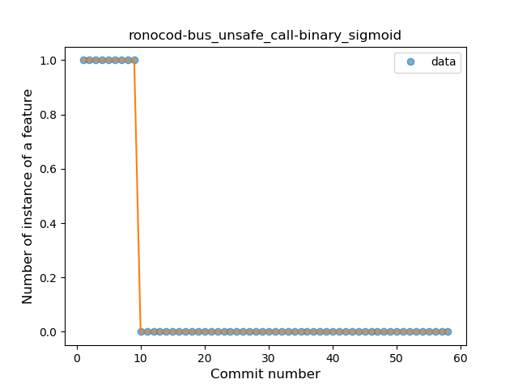

#### nicorsm-S3-16-simone
* Feature: String Template
* Function: 
* R_Squared: 1.0
 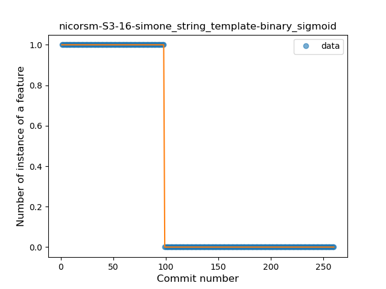

#### pennlabs-penn-mobile-android
* Feature: String Template
* Function: 
* R_Squared: 1.0
 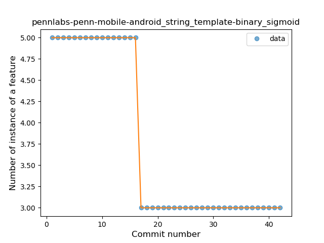

#### juha-h-baresip-studio
* Feature: Function with Default Value
* Function: 
* R_Squared: 1.0
 

#### rectangle-dbmi-Realtime-Port-Authority
* Feature: Function with Default Value
* Function: 
* R_Squared: 1.0
 

#### veniosg-JustSearch
* Feature: Function with Default Value
* Function: 
* R_Squared: 1.0
 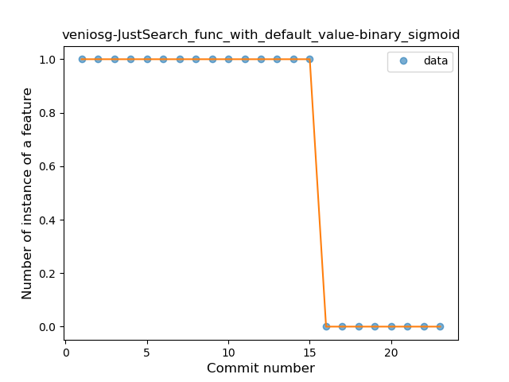

#### Gark-bassblog_kotlin
* Feature: Singleton
* Function: 
* R_Squared: 1.0
 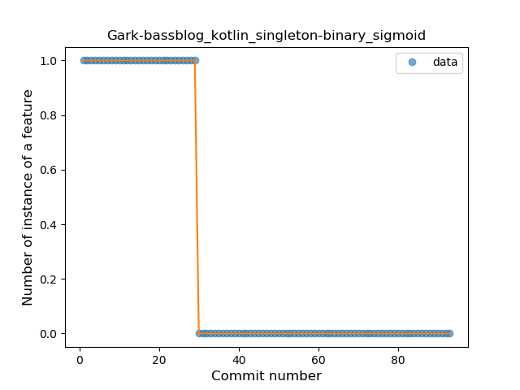

#### SimpleMobileTools-Simple-Camera
* Feature: Singleton
* Function: 
* R_Squared: 1.0
 

#### SimpleMobileTools-Simple-Flashlight
* Feature: Singleton
* Function: 
* R_Squared: 1.0
 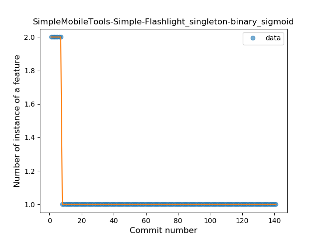

#### SpiritCroc-DarkCroc-Android-theme
* Feature: Singleton
* Function: 
* R_Squared: 1.0
 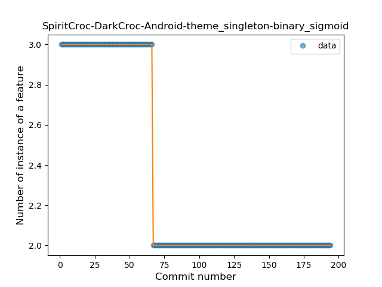

#### SpiritCroc-DefaultDarkTheme-oms
* Feature: Singleton
* Function: 
* R_Squared: 1.0
 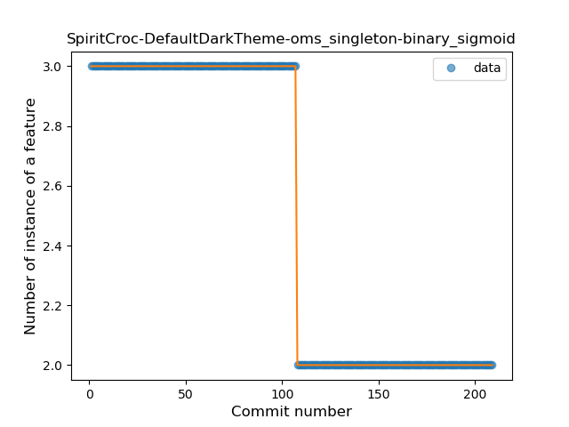

#### freedombox-team-android-app
* Feature: Singleton
* Function: 
* R_Squared: 1.0
 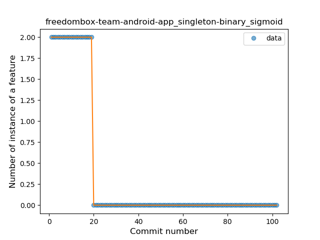

#### joan-domingo-Podcasts-RAC1-Android
* Feature: Singleton
* Function: 
* R_Squared: 1.0
 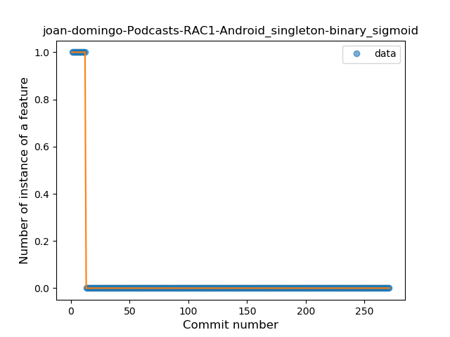

#### mjdenham-and-bible
* Feature: Singleton
* Function: 
* R_Squared: 1.0
 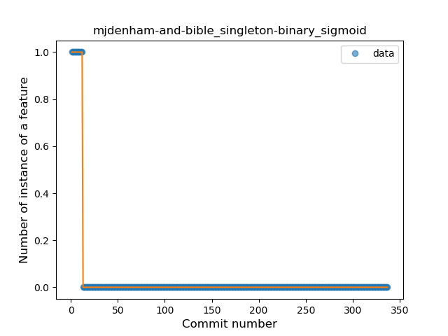

#### rectangle-dbmi-Realtime-Port-Authority
* Feature: Singleton
* Function: 
* R_Squared: 1.0
 

#### ronocod-bus
* Feature: Singleton
* Function: 
* R_Squared: 1.0
 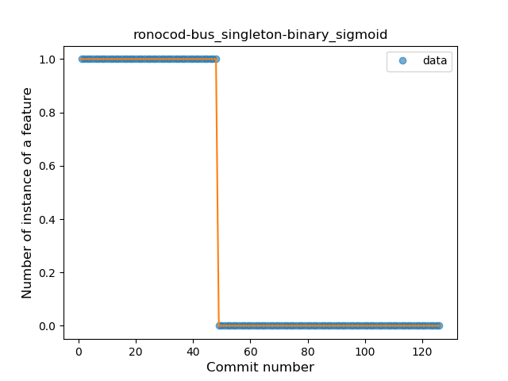

#### zoenb-log28
* Feature: Singleton
* Function: 
* R_Squared: 1.0
 

#### JanYoStudio-WhatAnime
* Feature: Smart Cast
* Function: 
* R_Squared: 1.0
 

#### Waboodoo-Status-Bar-Tachometer
* Feature: Smart Cast
* Function: 
* R_Squared: 1.0
 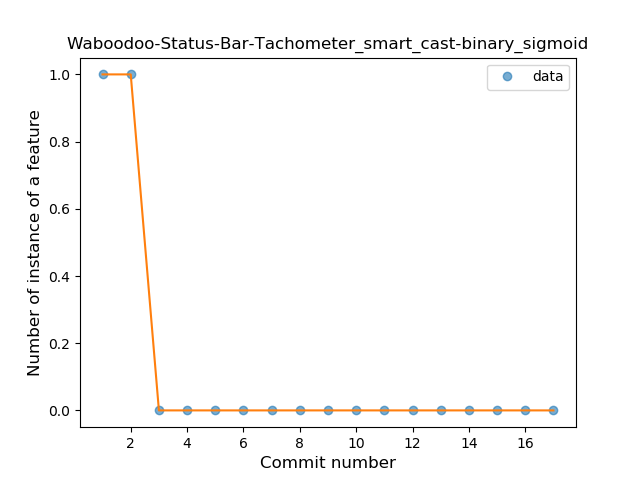

#### iSoron-uhabits
* Feature: Smart Cast
* Function: 
* R_Squared: 1.0
 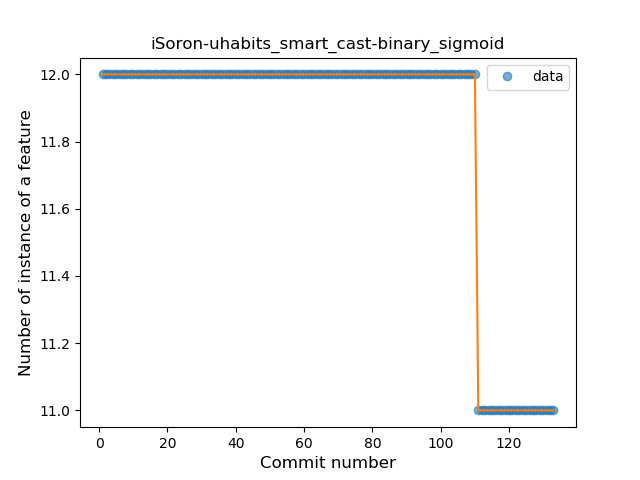

#### ianmcxa-vortaro
* Feature: Smart Cast
* Function: 
* R_Squared: 1.0
 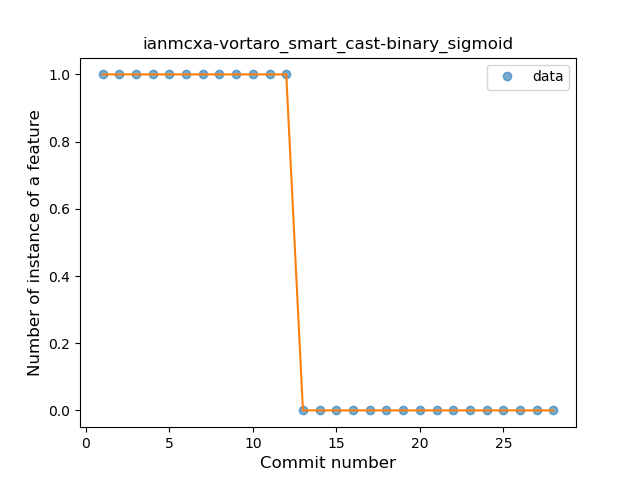

#### nonylene-PhotoLinkViewer
* Feature: Smart Cast
* Function: 
* R_Squared: 1.0
 

#### pflammertsma-cryptogram
* Feature: Smart Cast
* Function: 
* R_Squared: 1.0
 

#### rectangle-dbmi-Realtime-Port-Authority
* Feature: Smart Cast
* Function: 
* R_Squared: 1.0
 

#### Commit451-LabCoat
* Feature: Range Expression
* Function: 
* R_Squared: 1.0
 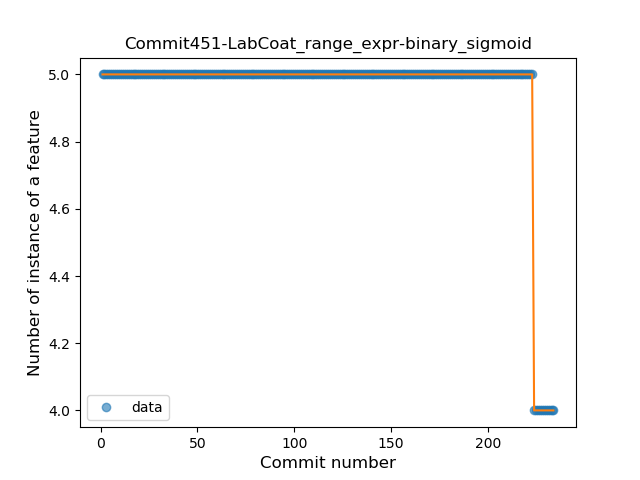

#### alessio-b-zak-myRivers
* Feature: Range Expression
* Function: 
* R_Squared: 1.0
 

#### garmax1-material-flashlight
* Feature: Range Expression
* Function: 
* R_Squared: 1.0
 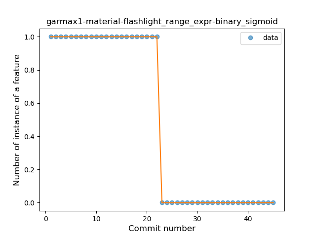

#### howard-e-just-quotes-kt
* Feature: Range Expression
* Function: 
* R_Squared: 1.0
 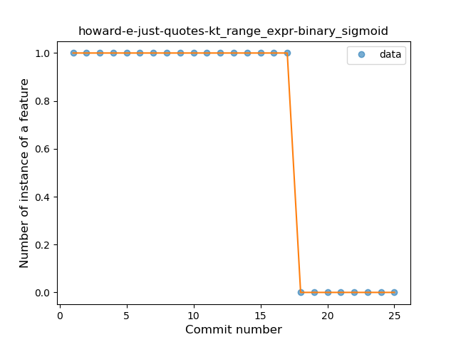

#### nicorsm-S3-16-simone
* Feature: Range Expression
* Function: 
* R_Squared: 1.0
 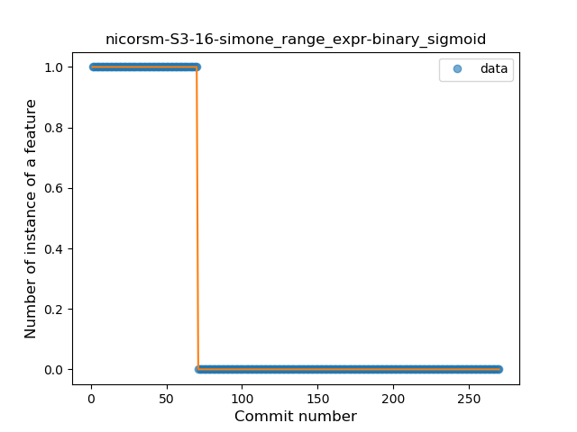

#### Commit451-LabCoat
* Feature: Function call with Named Argument
* Function: 
* R_Squared: 1.0
 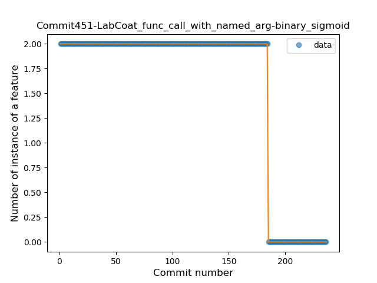

#### veniosg-JustSearch
* Feature: Data Class
* Function: 
* R_Squared: 1.0
 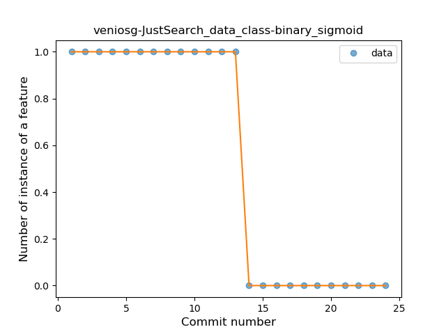

#### LaurentTreguier-deck
* Feature: Extension Function
* Function: 
* R_Squared: 1.0
 

#### MrBIMC-RunInBackgroundPermissionSetter
* Feature: Extension Function
* Function: 
* R_Squared: 1.0
 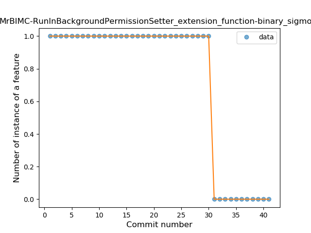

#### FredJul-Flym
* Feature: Property Delegation
* Function: 
* R_Squared: 1.0
 

#### exviva-stew
* Feature: Property Delegation
* Function: 
* R_Squared: 1.0
 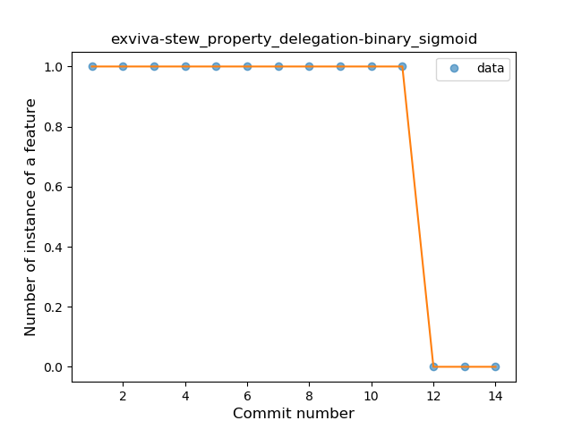

#### peterLaurence-TrekAdvisor
* Feature: Property Delegation
* Function: 
* R_Squared: 1.0
 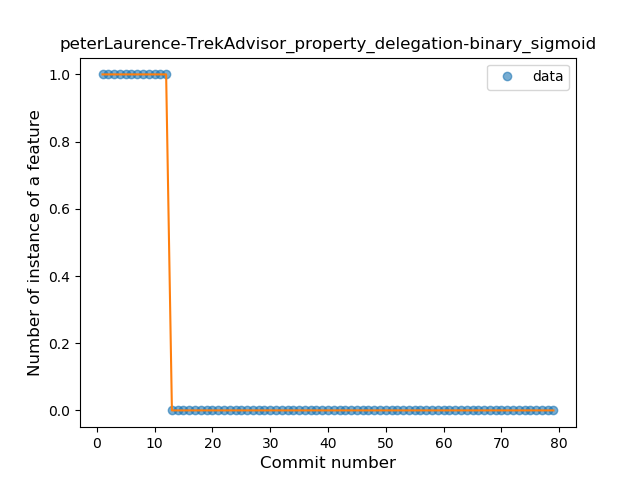

#### tasomaniac-OpenLinkWith
* Feature: Property Delegation
* Function: 
* R_Squared: 1.0
 

#### Apolline-Lille-apolline-android
* Feature: Destructuring Declaration
* Function: 
* R_Squared: 1.0
 

#### OpenLauncherTeam-openlauncher
* Feature: Destructuring Declaration
* Function: 
* R_Squared: 1.0
 

#### calintat-sensors
* Feature: Destructuring Declaration
* Function: 
* R_Squared: 1.0
 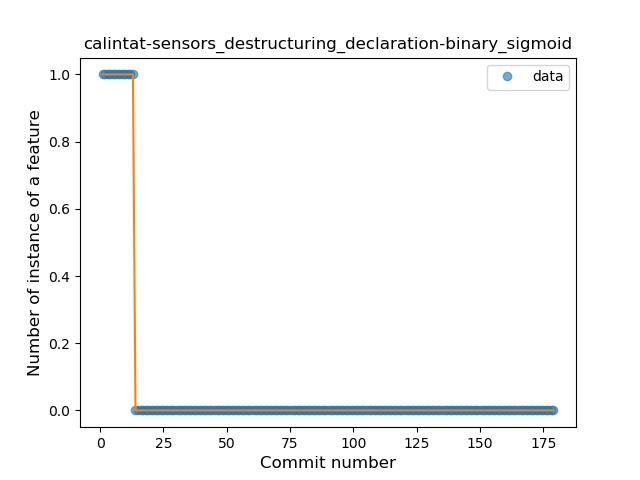

#### chrsep-Kingfish
* Feature: Destructuring Declaration
* Function: 
* R_Squared: 1.0
 

#### fossasia-open-event-android
* Feature: Destructuring Declaration
* Function: 
* R_Squared: 1.0
 

#### hypeapps-episodie
* Feature: Destructuring Declaration
* Function: 
* R_Squared: 1.0
 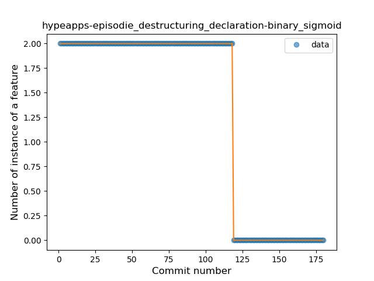

#### michaelkourlas-voipms-sms-client
* Feature: Destructuring Declaration
* Function: 
* R_Squared: 1.0
 

#### yshrsmz-monotweety
* Feature: Destructuring Declaration
* Function: 
* R_Squared: 1.0
 

#### FredJul-Flym
* Feature: Inline Function
* Function: 
* R_Squared: 1.0
 

#### Mygod-VPNHotspot
* Feature: Inline Function
* Function: 
* R_Squared: 1.0
 

#### jeeb-mpv-android
* Feature: Inline Function
* Function: 
* R_Squared: 1.0
 

#### ykrank-S1-Next
* Feature: Inline Function
* Function: 
* R_Squared: 1.0
 

#### Waboodoo-HTTP-Shortcuts
* Feature: Overloaded Operator
* Function: 
* R_Squared: 1.0
 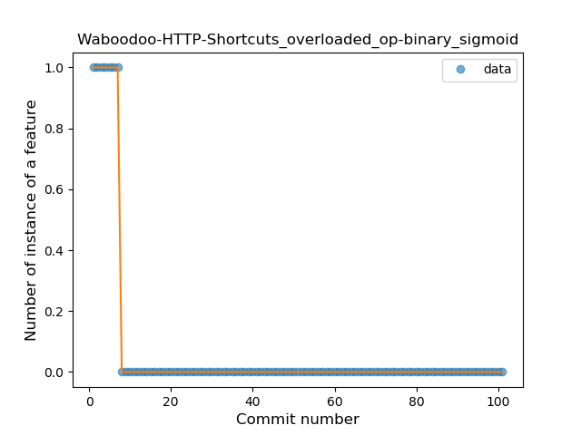

#### calintat-sensors
* Feature: Overloaded Operator
* Function: 
* R_Squared: 1.0
 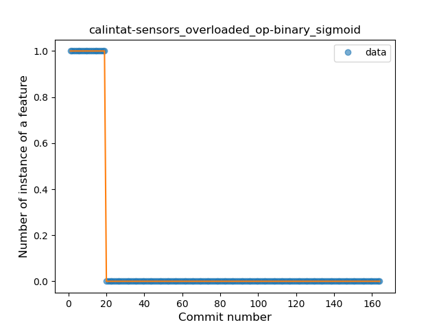

#### mpcjanssen-simpletask-android
* Feature: Overloaded Operator
* Function: 
* R_Squared: 1.0
 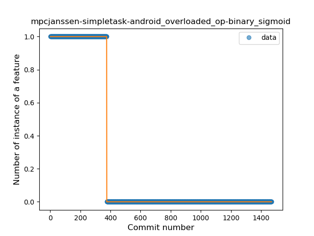

#### wuan-bo-android
* Feature: Overloaded Operator
* Function: 
* R_Squared: 1.0
 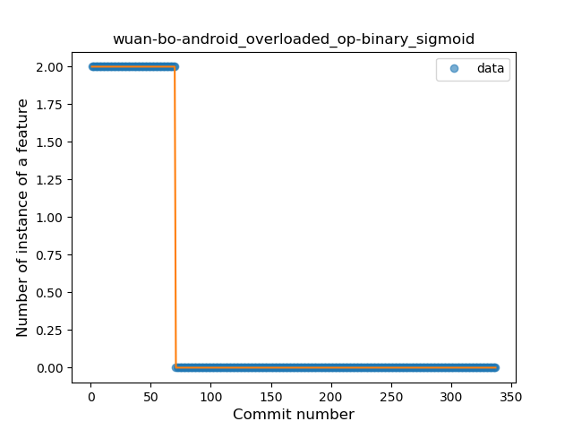

#### raatmarien-red-moon
* Feature: Super Delegation
* Function: 
* R_Squared: 1.0
 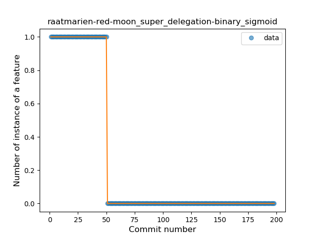

#### yshrsmz-monotweety
* Feature: Super Delegation
* Function: 
* R_Squared: 1.0
 

#### garmax1-material-flashlight
* Feature: When expression
* Function: 
* R_Squared: 0.99460099
 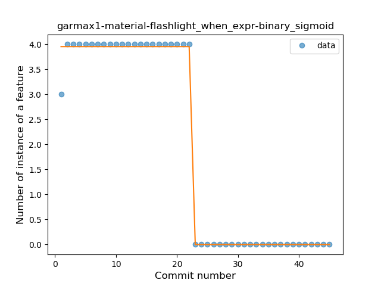

#### SimpleMobileTools-Simple-Notes
* Feature: Range Expression
* Function: 
* R_Squared: 0.99101294
 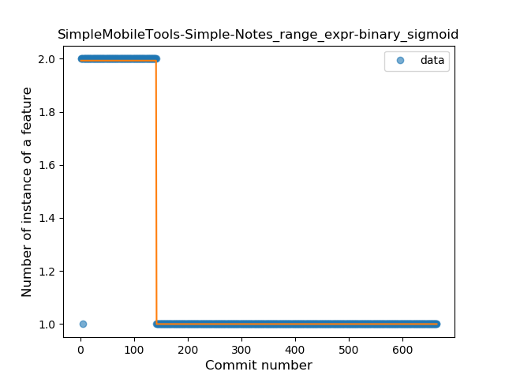

#### garmax1-material-flashlight
* Feature: Safe Call
* Function: 
* R_Squared: 0.99040798
 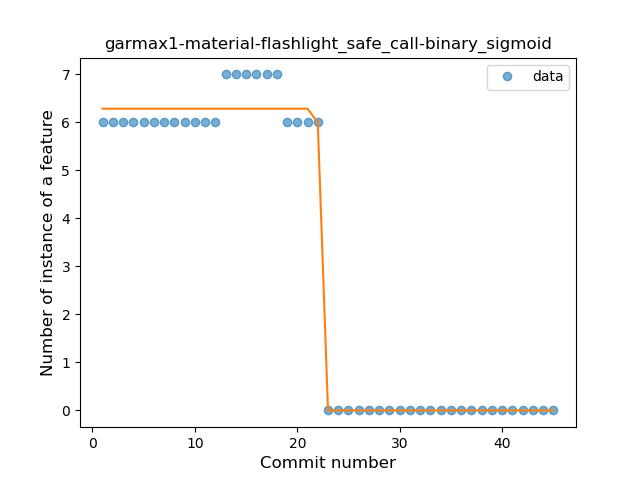

#### danvratil-FBEventSync
* Feature: Function with Default Value
* Function: 
* R_Squared: 0.97537205
 

#### rectangle-dbmi-Realtime-Port-Authority
* Feature: Extension Function
* Function: 
* R_Squared: 0.96242686
 

#### impalex-knockonports
* Feature: Inline Function
* Function: 
* R_Squared: 0.95568182
 

#### peppercarrot-e-reader
* Feature: Singleton
* Function: 
* R_Squared: 0.89125454
 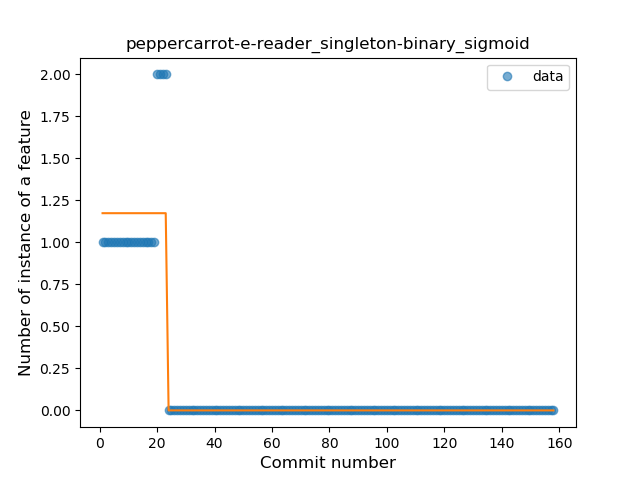

#### SimpleMobileTools-Simple-Camera
* Feature: Smart Cast
* Function: 
* R_Squared: 0.88716602
 

#### NyaaPantsu-NyaaPantsu-android-app
* Feature: Data Class
* Function: 
* R_Squared: 0.88675927
 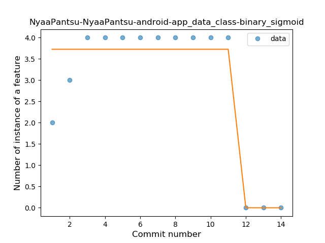

#### SimpleMobileTools-Simple-Thank-You
* Feature: When expression
* Function: 
* R_Squared: 0.88285229
 

#### FredJul-Flym
* Feature: Singleton
* Function: 
* R_Squared: 0.88240344
 

#### exviva-stew
* Feature: Data Class
* Function: 
* R_Squared: 0.88170653
 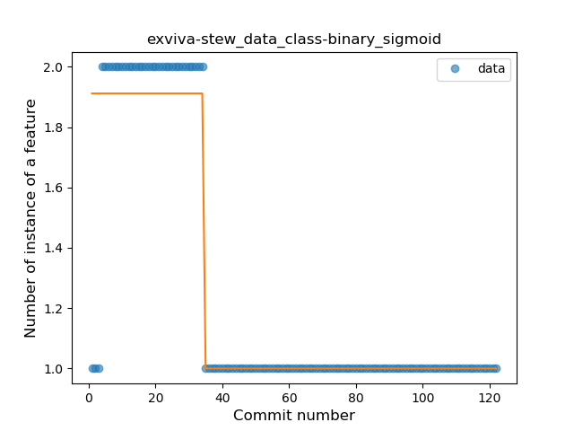

#### ronocod-bus
* Feature: When expression
* Function: 
* R_Squared: 0.87553844
 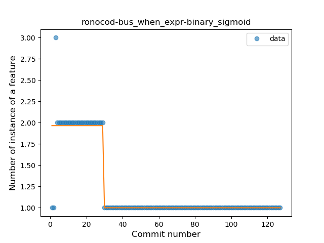

#### ianmcxa-vortaro
* Feature: Extension Function
* Function: 
* R_Squared: 0.86877828
 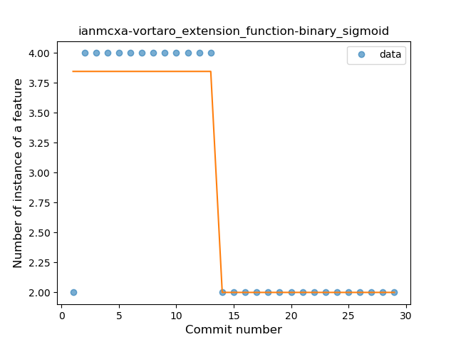

#### peppercarrot-e-reader
* Feature: Function call with Named Argument
* Function: 
* R_Squared: 0.8686117
 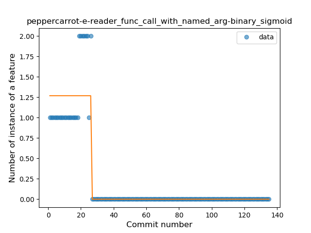

#### SimpleMobileTools-Simple-Clock
* Feature: Range Expression
* Function: 
* R_Squared: 0.85931953
 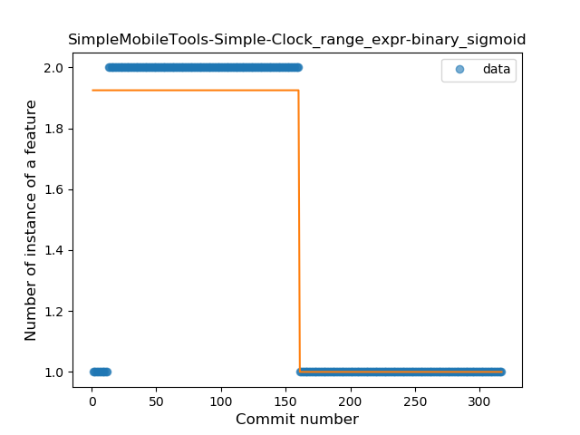

#### equeim-tremotesf-android
* Feature: Destructuring Declaration
* Function: 
* R_Squared: 0.85594292
 

#### nibarius-opera-park-android
* Feature: Inline Function
* Function: 
* R_Squared: 0.81818182
 

#### FredJul-Flym
* Feature: Range Expression
* Function: 
* R_Squared: 0.78296315
 

#### stinsonga-GeoQuake
* Feature: Unsafe Call
* Function: 
* R_Squared: 0.75686499
 

#### bubelov-coins-android
* Feature: Destructuring Declaration
* Function: 
* R_Squared: 0.75225525
 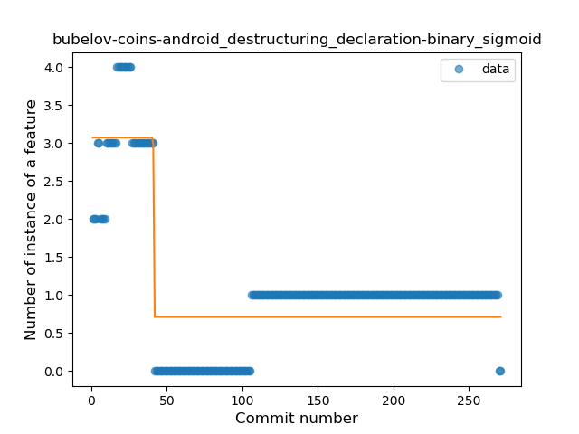

#### syncthing-syncthing-lite
* Feature: Extension Function
* Function: 
* R_Squared: 0.74815378
 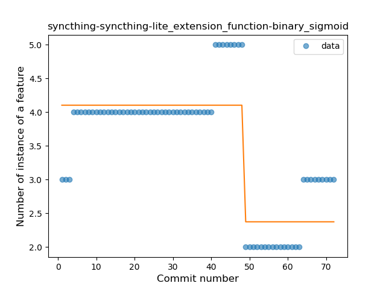

#### SimpleMobileTools-Simple-Notes
* Feature: Singleton
* Function: 
* R_Squared: 0.70981429
 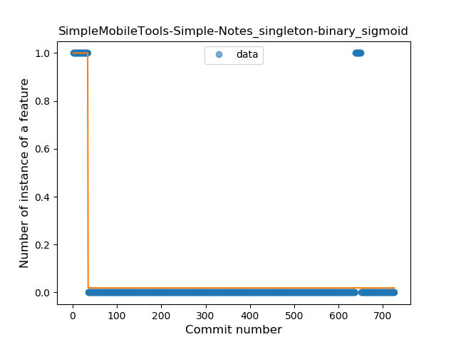

#### rectangle-dbmi-Realtime-Port-Authority
* Feature: Companion Object
* Function: 
* R_Squared: 0.66244322
 

#### enjoyingfoss-om
* Feature: String Template
* Function: 
* R_Squared: 0.65789474
 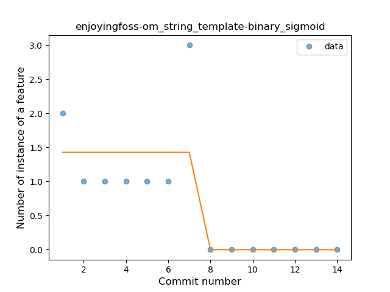

#### bubelov-coins-android
* Feature: Range Expression
* Function: 
* R_Squared: 0.62282398
 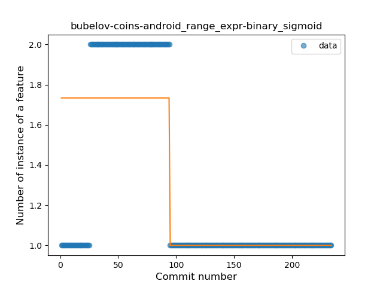

#### SimpleMobileTools-Simple-Contacts
* Feature: Singleton
* Function: 
* R_Squared: 0.59474327
 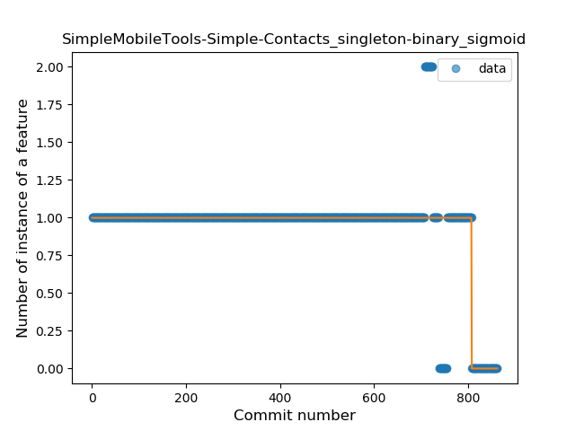

#### rectangle-dbmi-Realtime-Port-Authority
* Feature: When expression
* Function: 
* R_Squared: 0.56475819
 

#### orgzly-orgzly-android
* Feature: Property Delegation
* Function: 
* R_Squared: 0.55531073
 

#### WYKCode-WYK-Android
* Feature: Smart Cast
* Function: 
* R_Squared: 0.47058823
 

#### ScreamingHawk-phone-saver
* Feature: Smart Cast
* Function: 
* R_Squared: 0.4079814
 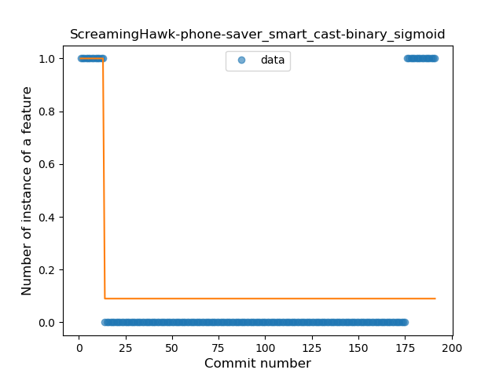

#### MrBIMC-RunInBackgroundPermissionSetter
* Feature: Function with Default Value
* Function: 
* R_Squared: 0.2991453
 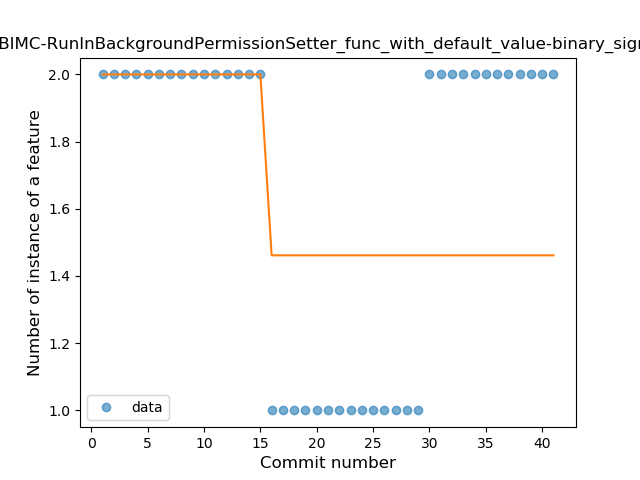

#### nonylene-PhotoLinkViewer
* Feature: Type Inference
* Function: 
* R_Squared: 0.25325018
 

#### SimpleMobileTools-Simple-File-Manager
* Feature: Singleton
* Function: 
* R_Squared: 0.21277686
 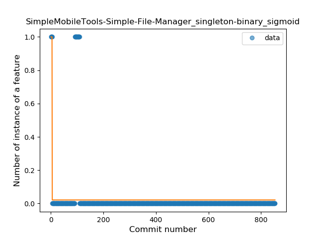

#### shymmq-librus-client-kotlin
* Feature: Inline Function
* Function: 
* R_Squared: 0.20505342
 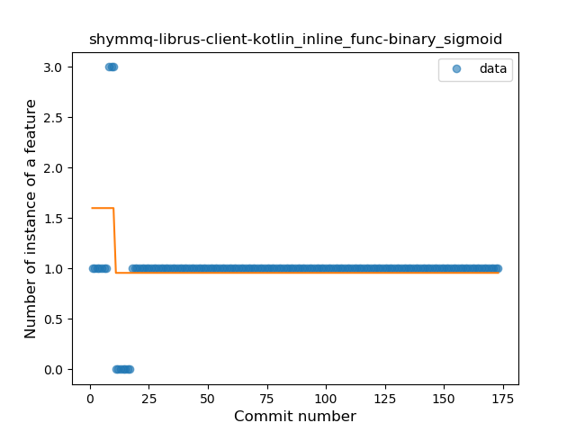

#### aminecmi-ReaderforSelfoss
* Feature: Unsafe Call
* Function: 
* R_Squared: 0.12052611
 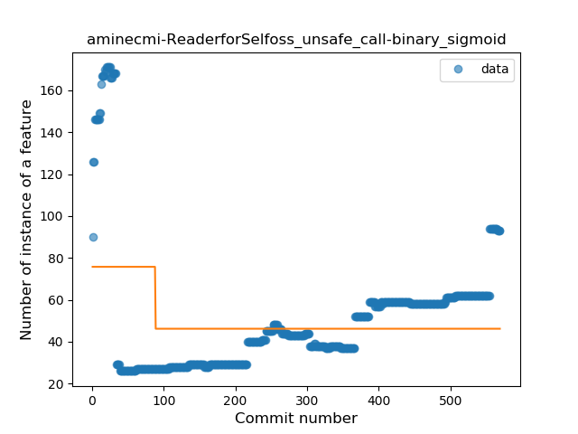

#### ids1024-whitakers-words-android
* Feature: Lambda
* Function: 
* R_Squared: 0.04167286
 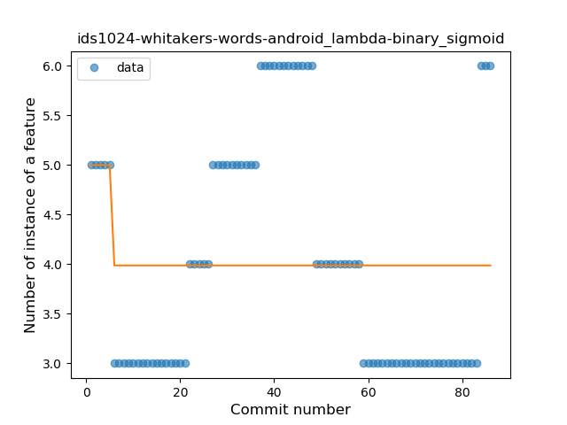

