## Plateau Sudden Decline
----
**187** best fit

#### co-garmax-materialflashlight
* Feature: Lambda
* Function: 
* R_Squared: 1.0
 

#### streetwalrus-usbmountr
* Feature: Lambda
* Function: 
* R_Squared: 1.0
 

#### com-wilderpereira-lmgtfygen
* Feature: Safe Call
* Function: 
* R_Squared: 1.0
 

#### es-danirod-rectball-android
* Feature: Safe Call
* Function: 
* R_Squared: 1.0
 

#### org-ligi-materialteatimer
* Feature: Safe Call
* Function: 
* R_Squared: 1.0
 

#### de-spiritcroc-darkcroc-substratum
* Feature: When expression
* Function: 
* R_Squared: 1.0
 

#### com-conorodonnell-bus
* Feature: Unsafe Call
* Function: 
* R_Squared: 1.0
 

#### org-fossasia-badgemagic
* Feature: Unsafe Call
* Function: 
* R_Squared: 1.0
 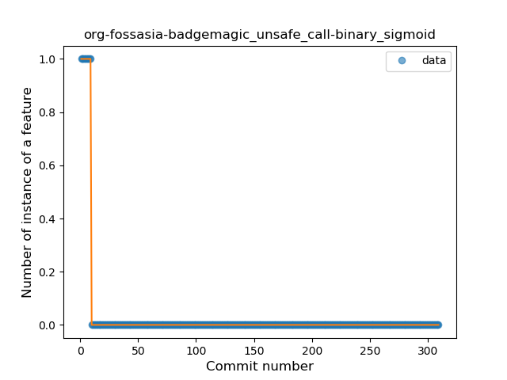

#### xyz-koleno-sunwidget
* Feature: Unsafe Call
* Function: 
* R_Squared: 1.0
 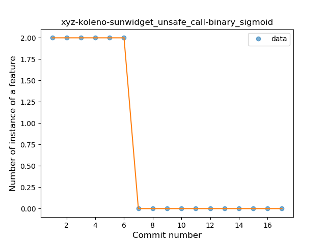

#### com-conorodonnell-bus
* Feature: Companion Object
* Function: 
* R_Squared: 1.0
 

#### org-commcare-dalvik
* Feature: Companion Object
* Function: 
* R_Squared: 1.0
 

#### app-simone
* Feature: String Template
* Function: 
* R_Squared: 1.0
 

#### com-physphil-android-unitconverterultimate
* Feature: String Template
* Function: 
* R_Squared: 1.0
 

#### uk-co-richyhbm-monochromatic
* Feature: String Template
* Function: 
* R_Squared: 1.0
 

#### xyz-koleno-sunwidget
* Feature: String Template
* Function: 
* R_Squared: 1.0
 

#### co-pxhouse-sas
* Feature: Function with Default Value
* Function: 
* R_Squared: 1.0
 

#### rectangledbmi-com-pittsburghrealtimetracker
* Feature: Function with Default Value
* Function: 
* R_Squared: 1.0
 

#### cat-xojan-random1
* Feature: Singleton
* Function: 
* R_Squared: 1.0
 

#### co-timecrypt-android
* Feature: Singleton
* Function: 
* R_Squared: 1.0
 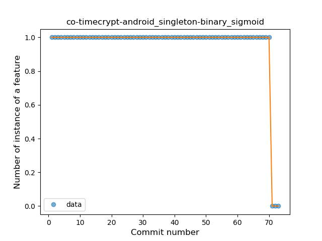

#### com-conorodonnell-bus
* Feature: Singleton
* Function: 
* R_Squared: 1.0
 

#### com-log28
* Feature: Singleton
* Function: 
* R_Squared: 1.0
 

#### com-sduduzog-slimlauncher
* Feature: Singleton
* Function: 
* R_Squared: 1.0
 

#### com-simplemobiletools-camera
* Feature: Singleton
* Function: 
* R_Squared: 1.0
 

#### com-simplemobiletools-flashlight
* Feature: Singleton
* Function: 
* R_Squared: 1.0
 

#### com-simplemobiletools-gallery
* Feature: Singleton
* Function: 
* R_Squared: 1.0
 

#### de-devmil-muzei-bingimageofthedayartsource
* Feature: Singleton
* Function: 
* R_Squared: 1.0
 

#### de-spiritcroc-darkcroc-substratum
* Feature: Singleton
* Function: 
* R_Squared: 1.0
 

#### de-spiritcroc-defaultdarktheme
* Feature: Singleton
* Function: 
* R_Squared: 1.0
 

#### org-freedombox-freedombox
* Feature: Singleton
* Function: 
* R_Squared: 1.0
 

#### org-mifos-mobile
* Feature: Singleton
* Function: 
* R_Squared: 1.0
 

#### pixel-kotlin-bassblog
* Feature: Singleton
* Function: 
* R_Squared: 1.0
 

#### rectangledbmi-com-pittsburghrealtimetracker
* Feature: Singleton
* Function: 
* R_Squared: 1.0
 

#### tw-shounenwind-kmnbottool
* Feature: Singleton
* Function: 
* R_Squared: 1.0
 

#### app-simone
* Feature: Range Expression
* Function: 
* R_Squared: 1.0
 

#### co-garmax-materialflashlight
* Feature: Range Expression
* Function: 
* R_Squared: 1.0
 

#### com-commit451-gitlab
* Feature: Range Expression
* Function: 
* R_Squared: 1.0
 

#### com-epimorphics-android-myrivers
* Feature: Range Expression
* Function: 
* R_Squared: 1.0
 

#### com-heed-justquotes
* Feature: Range Expression
* Function: 
* R_Squared: 1.0
 

#### de-devmil-muzei-bingimageofthedayartsource
* Feature: Range Expression
* Function: 
* R_Squared: 1.0
 

#### eu-the4thfloor-msync
* Feature: Range Expression
* Function: 
* R_Squared: 1.0
 

#### io-trewartha-positional
* Feature: Range Expression
* Function: 
* R_Squared: 1.0
 

#### jp-cordea-mackerelclient
* Feature: Range Expression
* Function: 
* R_Squared: 1.0
 

#### org-poul-bits-android
* Feature: Range Expression
* Function: 
* R_Squared: 1.0
 

#### ch-rmy-android-statusbar_tacho
* Feature: Smart Cast
* Function: 
* R_Squared: 1.0
 

#### com-example-forgottenumbrella-cardboardmuseum
* Feature: Smart Cast
* Function: 
* R_Squared: 1.0
 

#### com-pixplicity-cryptogram
* Feature: Smart Cast
* Function: 
* R_Squared: 1.0
 

#### com-simplemobiletools-camera
* Feature: Smart Cast
* Function: 
* R_Squared: 1.0
 

#### com-wbrawner-simplemarkdown
* Feature: Smart Cast
* Function: 
* R_Squared: 1.0
 

#### fr-jnda-android-flashalert
* Feature: Smart Cast
* Function: 
* R_Squared: 1.0
 

#### org-decsync-cc
* Feature: Smart Cast
* Function: 
* R_Squared: 1.0
 

#### org-decsync-sparss-floss
* Feature: Smart Cast
* Function: 
* R_Squared: 1.0
 

#### org-mcxa-vortaro
* Feature: Smart Cast
* Function: 
* R_Squared: 1.0
 

#### rectangledbmi-com-pittsburghrealtimetracker
* Feature: Smart Cast
* Function: 
* R_Squared: 1.0
 

#### tk-superl2-xwifi
* Feature: Smart Cast
* Function: 
* R_Squared: 1.0
 

#### co-pxhouse-sas
* Feature: Data Class
* Function: 
* R_Squared: 1.0
 

#### com-commit451-gitlab
* Feature: Function call with Named Argument
* Function: 
* R_Squared: 1.0
 

#### com-firstrowria-pushnotificationtester
* Feature: Function call with Named Argument
* Function: 
* R_Squared: 1.0
 

#### io-trewartha-positional
* Feature: Function call with Named Argument
* Function: 
* R_Squared: 1.0
 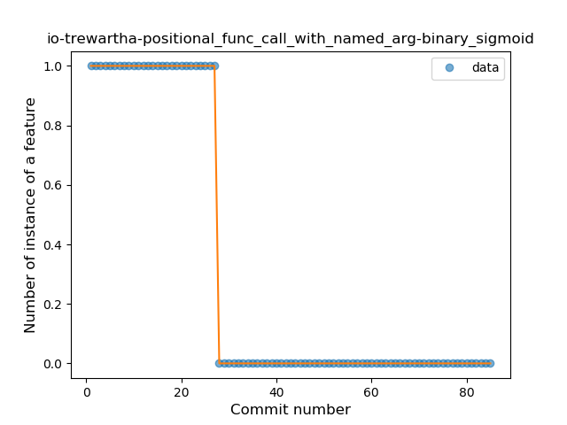

#### org-decsync-cc
* Feature: Function call with Named Argument
* Function: 
* R_Squared: 1.0
 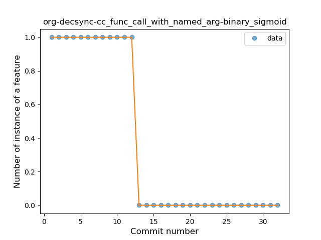

#### org-decsync-sparss-floss
* Feature: Function call with Named Argument
* Function: 
* R_Squared: 1.0
 

#### com-github-laurenttreguier-deck
* Feature: Extension Function
* Function: 
* R_Squared: 1.0
 

#### com-pavelsikun-runinbackgroundpermissionsetter
* Feature: Extension Function
* Function: 
* R_Squared: 1.0
 

#### com-pyamsoft-homebutton
* Feature: Extension Function
* Function: 
* R_Squared: 1.0
 

#### fr-free-nrw-commons
* Feature: Extension Function
* Function: 
* R_Squared: 1.0
 

#### at-bitfire-davdroid
* Feature: Property Delegation
* Function: 
* R_Squared: 1.0
 

#### com-pluscubed-velociraptor
* Feature: Property Delegation
* Function: 
* R_Squared: 1.0
 

#### net-frju-flym
* Feature: Property Delegation
* Function: 
* R_Squared: 1.0
 

#### org-kaqui
* Feature: Property Delegation
* Function: 
* R_Squared: 1.0
 

#### com-benny-openlauncher
* Feature: Destructuring Declaration
* Function: 
* R_Squared: 1.0
 

#### com-calintat-sensors
* Feature: Destructuring Declaration
* Function: 
* R_Squared: 1.0
 

#### com-directdev-portal
* Feature: Destructuring Declaration
* Function: 
* R_Squared: 1.0
 

#### com-utazukin-ichaival
* Feature: Destructuring Declaration
* Function: 
* R_Squared: 1.0
 

#### jp-cordea-mackerelclient
* Feature: Destructuring Declaration
* Function: 
* R_Squared: 1.0
 

#### net-yslibrary-monotweety
* Feature: Destructuring Declaration
* Function: 
* R_Squared: 1.0
 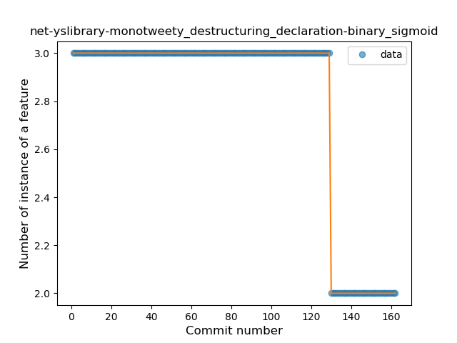

#### org-fossasia-badgemagic
* Feature: Destructuring Declaration
* Function: 
* R_Squared: 1.0
 

#### org-kiwix-kiwixcustomwikivoyageeurope
* Feature: Destructuring Declaration
* Function: 
* R_Squared: 1.0
 

#### org-weilbach-splitbills
* Feature: Destructuring Declaration
* Function: 
* R_Squared: 1.0
 

#### org-zimmob-zimlx
* Feature: Destructuring Declaration
* Function: 
* R_Squared: 1.0
 

#### pl-hypeapp-episodie
* Feature: Destructuring Declaration
* Function: 
* R_Squared: 1.0
 

#### science-apolline
* Feature: Destructuring Declaration
* Function: 
* R_Squared: 1.0
 

#### com-moez-QKSMS
* Feature: Inline Function
* Function: 
* R_Squared: 1.0
 

#### com-motion-stage1
* Feature: Inline Function
* Function: 
* R_Squared: 1.0
 

#### com-sduduzog-slimlauncher
* Feature: Inline Function
* Function: 
* R_Squared: 1.0
 

#### is-xyz-mpv
* Feature: Inline Function
* Function: 
* R_Squared: 1.0
 

#### jp-org-example-geckour-glyph
* Feature: Inline Function
* Function: 
* R_Squared: 1.0
 

#### net-frju-flym
* Feature: Inline Function
* Function: 
* R_Squared: 1.0
 

#### pw-janyo-whatanime
* Feature: Inline Function
* Function: 
* R_Squared: 1.0
 

#### sk-styk-martin-apkanalyzer
* Feature: Inline Function
* Function: 
* R_Squared: 1.0
 

#### com-calintat-sensors
* Feature: Overloaded Operator
* Function: 
* R_Squared: 1.0
 

#### com-etesync-syncadapter
* Feature: Overloaded Operator
* Function: 
* R_Squared: 1.0
 

#### com-github-moko256-twitlatte
* Feature: Overloaded Operator
* Function: 
* R_Squared: 1.0
 

#### com-github-vase4kin-teamcityapp
* Feature: Overloaded Operator
* Function: 
* R_Squared: 1.0
 

#### com-yubico-yubioath
* Feature: Overloaded Operator
* Function: 
* R_Squared: 1.0
 

#### de-markusfisch-android-binaryeye
* Feature: Overloaded Operator
* Function: 
* R_Squared: 1.0
 

#### es-usc-citius-servando-calendula
* Feature: Overloaded Operator
* Function: 
* R_Squared: 1.0
 

#### me-camsteffen-polite
* Feature: Overloaded Operator
* Function: 
* R_Squared: 1.0
 

#### nl-mpcjanssen-simpletask
* Feature: Overloaded Operator
* Function: 
* R_Squared: 1.0
 

#### org-blitzortung-android-app
* Feature: Overloaded Operator
* Function: 
* R_Squared: 1.0
 

#### com-yubico-yubioath
* Feature: Sealed Class
* Function: 
* R_Squared: 1.0
 

#### eu-the4thfloor-msync
* Feature: Sealed Class
* Function: 
* R_Squared: 1.0
 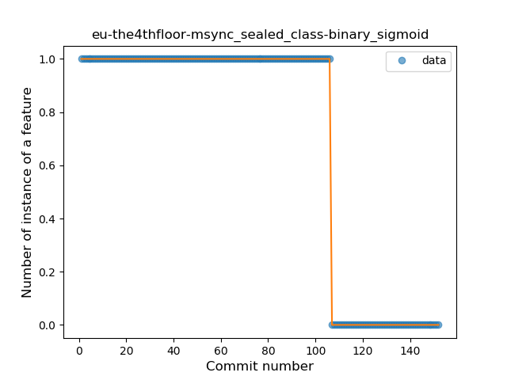

#### net-stew-stew
* Feature: Sealed Class
* Function: 
* R_Squared: 1.0
 

#### be-mygod-vpnhotspot
* Feature: Super Delegation
* Function: 
* R_Squared: 1.0
 

#### com-jmstudios-redmoon
* Feature: Super Delegation
* Function: 
* R_Squared: 1.0
 

#### com-yubico-yubioath
* Feature: Super Delegation
* Function: 
* R_Squared: 1.0
 

#### info-papdt-express-helper
* Feature: Super Delegation
* Function: 
* R_Squared: 1.0
 

#### com-calintat-sensors
* Feature: Infix Function
* Function: 
* R_Squared: 1.0
 

#### com-calintat-units
* Feature: Infix Function
* Function: 
* R_Squared: 1.0
 

#### com-yubico-yubioath
* Feature: Infix Function
* Function: 
* R_Squared: 1.0
 

#### org-mozilla-rocket
* Feature: Infix Function
* Function: 
* R_Squared: 1.0
 

#### org-zimmob-zimlx
* Feature: Tail-recursive Function
* Function: 
* R_Squared: 1.0
 

#### co-garmax-materialflashlight
* Feature: When expression
* Function: 
* R_Squared: 0.99481105
 

#### com-simplemobiletools-notes-pro
* Feature: Range Expression
* Function: 
* R_Squared: 0.99144764
 

#### org-weilbach-splitbills
* Feature: Function call with Named Argument
* Function: 
* R_Squared: 0.98824176
 

#### me-impa-knockonports
* Feature: Inline Function
* Function: 
* R_Squared: 0.98328748
 

#### at-bitfire-icsdroid
* Feature: Function call with Named Argument
* Function: 
* R_Squared: 0.96750524
 

#### me-rei_m-hyakuninisshu
* Feature: Data Class
* Function: 
* R_Squared: 0.95812078
 

#### com-uncmorfi
* Feature: Coroutine
* Function: 
* R_Squared: 0.9507373
 

#### me-camsteffen-polite
* Feature: Smart Cast
* Function: 
* R_Squared: 0.94814689
 

#### tk-superl2-xwifi
* Feature: Singleton
* Function: 
* R_Squared: 0.93977011
 

#### com-etesync-syncadapter
* Feature: Function call with Named Argument
* Function: 
* R_Squared: 0.93716905
 

#### rectangledbmi-com-pittsburghrealtimetracker
* Feature: Extension Function
* Function: 
* R_Squared: 0.91955208
 

#### org-mifos-mobile
* Feature: Lambda
* Function: 
* R_Squared: 0.90611666
 

#### com-tutpro-baresip
* Feature: Function with Default Value
* Function: 
* R_Squared: 0.90046647
 

#### me-impa-knockonports
* Feature: Smart Cast
* Function: 
* R_Squared: 0.89565241
 

#### com-jereksel-libresubstratum
* Feature: Infix Function
* Function: 
* R_Squared: 0.89067111
 

#### com-simplemobiletools-thankyou
* Feature: When expression
* Function: 
* R_Squared: 0.88940092
 

#### net-frju-flym
* Feature: Singleton
* Function: 
* R_Squared: 0.88892723
 

#### cat-pantsu-nyaapantsu
* Feature: Data Class
* Function: 
* R_Squared: 0.88675927
 

#### net-stew-stew
* Feature: Data Class
* Function: 
* R_Squared: 0.88571429
 

#### com-simplemobiletools-contacts-pro
* Feature: Singleton
* Function: 
* R_Squared: 0.87947776
 

#### me-blog-korn123-easydiary
* Feature: Singleton
* Function: 
* R_Squared: 0.87466737
 

#### de-micmun-android-deufeitage
* Feature: Safe Call
* Function: 
* R_Squared: 0.87033324
 

#### org-mcxa-vortaro
* Feature: Extension Function
* Function: 
* R_Squared: 0.86877828
 

#### com-simplemobiletools-contacts-pro
* Feature: Overloaded Operator
* Function: 
* R_Squared: 0.86674734
 

#### com-benny-openlauncher
* Feature: Lambda
* Function: 
* R_Squared: 0.86308918
 

#### de-markusfisch-android-binaryeye
* Feature: Unsafe Call
* Function: 
* R_Squared: 0.86087418
 

#### me-camsteffen-polite
* Feature: Safe Call
* Function: 
* R_Squared: 0.85354955
 

#### com-tutpro-baresip
* Feature: Safe Call
* Function: 
* R_Squared: 0.83933166
 

#### ch-deletescape-lawnchair-plah
* Feature: Destructuring Declaration
* Function: 
* R_Squared: 0.83798963
 

#### com-sduduzog-slimlauncher
* Feature: Smart Cast
* Function: 
* R_Squared: 0.83333333
 

#### com-nononsenseapps-feeder
* Feature: Type Alias
* Function: 
* R_Squared: 0.83231539
 

#### apps-jizzu-simpletodo
* Feature: Range Expression
* Function: 
* R_Squared: 0.82689815
 

#### se-barsk-park
* Feature: Inline Function
* Function: 
* R_Squared: 0.82037997
 

#### io-github-feelfreelinux-wykopmobilny
* Feature: Inline Function
* Function: 
* R_Squared: 0.81979683
 

#### tw-shounenwind-kmnbottool
* Feature: When expression
* Function: 
* R_Squared: 0.81713615
 

#### com-calintat-sensors
* Feature: Type Inference
* Function: 
* R_Squared: 0.80856459
 

#### net-frju-flym
* Feature: Range Expression
* Function: 
* R_Squared: 0.78765909
 

#### io-trewartha-positional
* Feature: Function with Default Value
* Function: 
* R_Squared: 0.77840588
 

#### me-echeung-moemoekyun-fdroid
* Feature: Inline Function
* Function: 
* R_Squared: 0.76079386
 

#### com-geo-GeoQuake
* Feature: Unsafe Call
* Function: 
* R_Squared: 0.75148441
 

#### com-bubelov-coins
* Feature: Destructuring Declaration
* Function: 
* R_Squared: 0.72314989
 

#### com-simplemobiletools-notes-pro
* Feature: Singleton
* Function: 
* R_Squared: 0.71231433
 

#### uk-co-richyhbm-monochromatic
* Feature: Unsafe Call
* Function: 
* R_Squared: 0.7121271
 

#### com-enjoyingfoss-om
* Feature: String Template
* Function: 
* R_Squared: 0.69348128
 

#### org-ligi-fast
* Feature: Type Inference
* Function: 
* R_Squared: 0.66420664
 

#### org-ligi-faster
* Feature: Type Inference
* Function: 
* R_Squared: 0.66420664
 

#### rectangledbmi-com-pittsburghrealtimetracker
* Feature: Companion Object
* Function: 
* R_Squared: 0.66250637
 

#### com-uncmorfi
* Feature: Property Delegation
* Function: 
* R_Squared: 0.64573834
 

#### jp-org-example-geckour-glyph
* Feature: Destructuring Declaration
* Function: 
* R_Squared: 0.64356188
 

#### org-mifos-mobile
* Feature: Function with Default Value
* Function: 
* R_Squared: 0.63782615
 

#### org-anibyl-slounik
* Feature: Companion Object
* Function: 
* R_Squared: 0.63634988
 

#### org-fossasia-badgemagic
* Feature: Extension Function
* Function: 
* R_Squared: 0.63174446
 

#### ffc-app
* Feature: Data Class
* Function: 
* R_Squared: 0.63002109
 

#### fr-rhaz-ipfs-sweet
* Feature: Unsafe Call
* Function: 
* R_Squared: 0.61904762
 

#### com-conorodonnell-bus
* Feature: When expression
* Function: 
* R_Squared: 0.6184108
 

#### org-mozilla-rocket
* Feature: Type Alias
* Function: 
* R_Squared: 0.61042123
 

#### rectangledbmi-com-pittsburghrealtimetracker
* Feature: Unsafe Call
* Function: 
* R_Squared: 0.56278045
 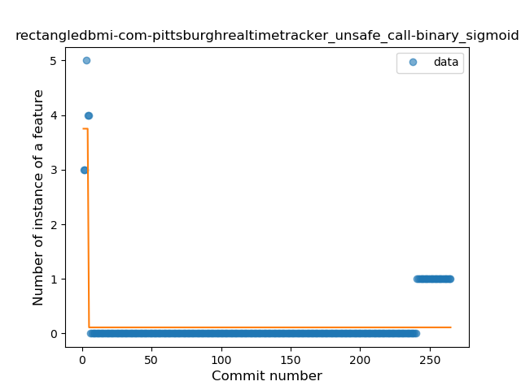

#### jp-cordea-mackerelclient
* Feature: Singleton
* Function: 
* R_Squared: 0.55508742
 

#### com-pyamsoft-homebutton
* Feature: Singleton
* Function: 
* R_Squared: 0.51599587
 

#### io-ipoli-android
* Feature: Infix Function
* Function: 
* R_Squared: 0.49002249
 

#### org-sanpra-checklist
* Feature: Safe Call
* Function: 
* R_Squared: 0.48443745
 

#### de-blankedv-lanbahnpanel
* Feature: Data Class
* Function: 
* R_Squared: 0.45387027
 

#### it-diab
* Feature: Range Expression
* Function: 
* R_Squared: 0.44266581
 

#### com-pennapps-labs-pennmobile
* Feature: Unsafe Call
* Function: 
* R_Squared: 0.43889235
 

#### pl-org-seva-texter
* Feature: Inline Function
* Function: 
* R_Squared: 0.41796009
 

#### com-atanana-sicounter
* Feature: Unsafe Call
* Function: 
* R_Squared: 0.37937853
 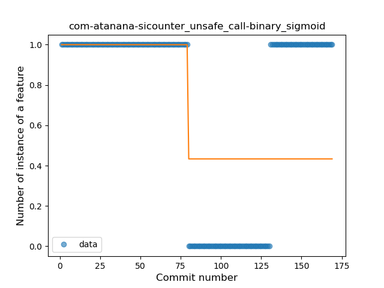

#### it-diab
* Feature: Destructuring Declaration
* Function: 
* R_Squared: 0.3554534
 

#### com-pavelsikun-runinbackgroundpermissionsetter
* Feature: Function with Default Value
* Function: 
* R_Squared: 0.2991453
 

#### de-westnordost-streetcomplete
* Feature: Companion Object
* Function: 
* R_Squared: 0.23516449
 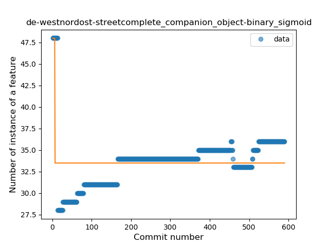

#### net-nonylene-photolinkviewer
* Feature: Type Inference
* Function: 
* R_Squared: 0.21656488
 

#### com-simplemobiletools-filemanager-pro
* Feature: Singleton
* Function: 
* R_Squared: 0.21362514
 

#### com-wabadaba-dziennik
* Feature: Inline Function
* Function: 
* R_Squared: 0.20505342
 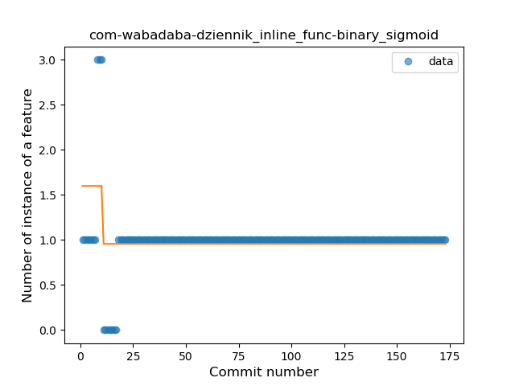

#### fr-jnda-android-flashalert
* Feature: String Template
* Function: 
* R_Squared: 0.19648434
 

#### com-pennapps-labs-pennmobile
* Feature: String Template
* Function: 
* R_Squared: 0.18888889
 

#### info-dvkr-screenstream
* Feature: Safe Call
* Function: 
* R_Squared: 0.16481342
 

#### sk-styk-martin-apkanalyzer
* Feature: Unsafe Call
* Function: 
* R_Squared: 0.13580445
 

#### eu-depau-etchdroid
* Feature: Safe Call
* Function: 
* R_Squared: 0.05714501
 

